| KINGDOI | M OF CAN | IBODIA |
|---------|----------|--------|
| Nation  | Religion | King   |

Cambodia Inter-censal Population Survey 2024

### **FINAL REPORT**

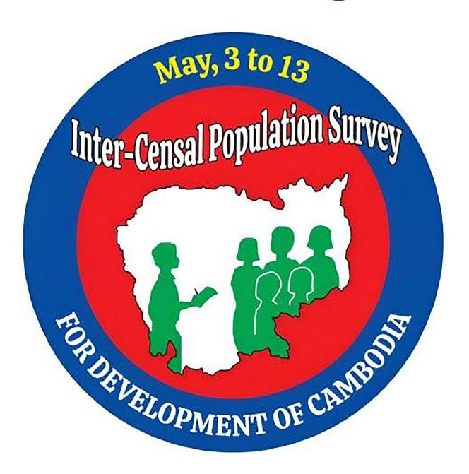

National Institute of Statistics

Ministry of Planning

January 2025

### TABLE OF CONTENTS

| PREFACE                             | i        |
|-------------------------------------|----------|
| ACKNOWLEDGEMENT                     | ii       |
| Map of Cambodia                     | iii      |
| Chapter 1                           | 1        |
| Introduction and survey methods     | 1        |
| 1.1. Introduction                   | 1        |
| 1.2. Survey Objective.              | 1        |
| 1.3. Sample design                  | 2        |
| 1.3.1. Probability of Selection     | 3        |
| 1.3.2. Sampling Weight              | 4        |
| 1. 4. Survey Questionnaire          | 4        |
| 1.5. Training of Trainers           | 5        |
| 1.6. Pretest                        | 6        |
| 1.7. Selection of Field Staff       | 6        |
| 1.8. Training of Field Staff        | 6        |
| 1.9. Data Collection                | 7        |
| 1.10. Data Processing               | 7        |
| 1.11. Tabulation and Analysis Plans | 8        |
| 1.12. Dissemination                 | 8        |
|                                     | 11       |
| <b>F</b>                            | 11       |
|                                     | 11       |
|                                     | 14       |
|                                     | 16       |
| 1                                   | 18       |
| 1                                   | 10 20 |
|                                     | 20 21 |
|                                     | 21 21 |
|                                     | 21 23 |
| 1                                   |          |
|                                     | 23 22 |
|                                     | 23 22 |
| $\mathcal{C}$                       | 23       |
| $\epsilon$                          | 24       |
| $\mathcal{S}$ 1 $\mathcal{S}$       | 29       |
|                                     | 29       |
| $\epsilon$                          | 30       |
|                                     | 30       |
|                                     | 33       |
| 8                                   | 34       |
| 1                                   | 35       |
| J                                   | 35       |
|                                     | 35       |
| J .                                 | 35       |
| <b>,</b>                            | 38       |
|                                     | 39       |
|                                     | 44       |
| Chapter 5                           | 47       |
| Labour and Employment               | 47       |

| 5.1. Ir | ntroduction                                             |
|---------|---------------------------------------------------------|
| 5.2. E  | conomically Active Population or Labour Force           |
| 5.3. E  | mployed and Unemployed                                  |
|         | mployment Status                                        |
|         | mployment Sectors                                       |
| 5.6. E  | mployment by Industrial and Occupational Classification |
|         | 6                                                       |
|         | tion                                                    |
|         | ntroduction                                             |
|         | figrant Population                                      |
|         | easons for Migration                                    |
|         | ligration Stream                                        |
| 6.5. D  | Puration of Residence                                   |
|         | figration by Age Group                                  |
|         | conomic Activity of Migrants                            |
|         | ligration by educational                                |
|         | nmigrants                                               |
|         | 7                                                       |
| _       | ty                                                      |
|         | ntroduction                                             |
|         | ge-Specific Fertility Rate (ASFR)                       |
|         | otal Fertility Rate (TFR)                               |
|         | otal Fertifity Rate (TFR)                               |
|         |                                                         |
|         | Vomen by Parity or Children Ever Born (CEB)             |
| _       | 8                                                       |
|         | lity                                                    |
|         | ntroduction                                             |
|         | arly Age Mortality use Indirect Technique               |
|         | dult Mortality and Life Tables                          |
|         | Internal Mortality                                      |
| Cnapter | 9                                                       |
|         | ility                                                   |
|         | ntroduction                                             |
|         | evel of Disability                                      |
|         | visability and Marital Status                           |
|         | iteracy and Education                                   |
|         | conomic Activity Rates                                  |
|         | 10                                                      |
|         | ng Characteristics and Amenities                        |
|         | Housing Characteristics                                 |
|         | Household Characteristics                               |
|         | . Number and Size of Households                         |
| 10.2.2  | 2. Number of Rooms Occupied                             |
|         | Household Amenities and Facilities                      |
|         | . Drinking Water                                        |
| 10.3.2  | 2. Source of Light                                      |
|         | Toilet Facilities                                       |
|         | Cooking Fuel                                            |
|         | . Access to the Internet                                |
| 10.3.6  | 6. Personal Assets                                      |

| Chapter 11                                                                                                         |
|--------------------------------------------------------------------------------------------------------------------|
| Summary and Conclusion                                                                                             |
| 11.1. Population Indicator                                                                                         |
| 11.2. Population Distribution                                                                                      |
| 11.3. Sex ratio and Age structure                                                                                  |
| 11.4. Marital Status                                                                                               |
| 11.5. Literature and Education                                                                                     |
| 11.6. School Attendance                                                                                            |
| 11.7. Economically Active Population (Labour Force)                                                                |
| 11.8. Migration                                                                                                    |
| 11.9. Fertility                                                                                                    |
| 11.10. Mortality                                                                                                   |
| 11.11. Disability                                                                                                  |
| 11.12. Housing and Household                                                                                       |
| Glossary                                                                                                           |
| Annex                                                                                                              |
|                                                                                                                    |
| Table                                                                                                              |
| Table 1.3.1. Number of Samples Distributed by Capital City and Provinces for CIPS 2024 Survey                      |
| Table 2.1.1. Distribution of population by area, region, province and sex, Cambodia, 2024*                         |
| Table 2.2.1: Annual growth rate by province Cambodia, 2019-2024                                                    |
| Table 2.3.1. Distribution of population by province and sex, 2019-2024                                             |
| Table 2.4.1: Population density by regional zone, province Cambodia, 2019-2024                                     |
| Table 2.5.1. Percentage distribution of Population by religion, residence, and province, Cambodia 2019-2024        |
| Table 2.6.1. Distribution of Population by place of birth and sex, Cambodia, 2019-2024                             |
| Table 2.7.1. Distribution of Population by mother tongue and sex, Cambodia,2024                                    |
| Table 3.3.1. Distribution of Population by single age, sex and residence Cambodia 2024                             |
| Table 3.3.2. Distribution of Population by broad age group, Dependency ratio,  Median age, and sex ratio 2019-2024 |
| Table 3.5.1. Distribution of Population by sex ratio by broad age group,                                           |
| Cambodia,2019-2024  Table 3.6.1. Distribution of Marital status age 15 and above by sex and Residence              |
| Cambodia 2019-2024                                                                                                 |
| Table 3.7.1. Singulate Mean age at Marriage, sex and residence Cambodia, 2019-2024                                 |
| Table 3.8.1. Singulate Mean age at Marriage, Proportion Ever Married by sex, Age                                   |
| group and residence Cambodia, 2019-2024                                                                            |
| Table 4.2.1. Literacy rate of Population aged 7+ years by language, sex and residence, Cambodia, 2019-2024         |
| Table 4.2.2. Distribution of literate Population aged 7+ years by language, sex and area, Cambodia, 2019-2024      |
| Table 4.3.1. Adult literacy rate aged 15+ years by age group, sex and area,  Cambodia, 2019-2024                   |
| Table 4.4.1. Education attainment of literate population aged 7+years by age group,                                |
| educational level, sex and residence Cambodia, 2019-2024                                                           |

| Table 4.5.1  | . Distribution of school attendance of Population aged 6+ years by sex, age and residence, Cambodia 2019-2024                          |
|--------------|----------------------------------------------------------------------------------------------------------------------------------------|
| Table 5.2.1  | Population aged 5+ years by usual activity status, sex and area,                                                                       |
| 14010 3.2.1  | Cambodia, 2019-2024                                                                                                                    |
| Table 5.2.2  | . Age-specific Labour Force Participation rate (LFPR) by age group, sex and area, Cambodia, 2019-2024                                  |
| Table 5.4.1  | . Distribution of emlpoyed persons aged 5+ years by employment status, sex and area, Cambodia, 2019-2024                               |
| Table 5.5.1  | Distribution of employed persons aged 5+ years by sex, sector of employment, and area, Cambodia, 2019-2024                             |
| Table 5.6.1  | .Distribution of employed population aged 5+ years by occupational group, sex and area, Cambodia, 2019-2024                            |
| Table 5.6.2  | Distribution of employed population aged 5+ years by industrial group, sex, and area, Cambodia, 2019-2024                              |
| Table 5.6.3  | .Distribution of employed population aged 5+ years by industrial sectors, sex and area, Cambodia, 2019-2024                            |
| Table 2.6.1  | .Population who has always lived in the place of enumeration, Cambodia, 2019* and 2024*                                                |
| Table 6.2.2  | Percentage distribution of migrants by previous residence and sex,  Cambodia 2019-2024.                                                |
| Table 6.3.1  | .Reasons for migration by sex, Cambodia, 2019- 2024                                                                                    |
|              | .Percentage of internal migrants in the urban-rural migration stream, by sex, Cambodia 2019 and 2024*                                  |
| Table 6.5.1  | .Distribution of internal migrants by number of years stayed in current residence, Cambodia, 2019 and 2024                             |
| Table 6.6.1  | .Percentage distribution of migrants aged 10+ years by age group and sex, Cambodia 2019 and 2024*                                      |
| Table 6.7.1  | .Percentage distribution of internal migrants aged 5+ years who are economically active by major industry group, sex and area of prior |
|              | residence, Cambodia, 2024*                                                                                                             |
| Table 6.8.1  | .Percentage distribution of internal migrants aged 7+ years by literacy status, educational level, sex and age group, Cambodia, 2024   |
| Table 6.9.1  | .Percentage distribution of immigrants aged 5+ years who are                                                                           |
|              | economically active, by sex and major industry group, Cambodia, 2024                                                                   |
| Table 7.1.1  | Estimated Age-Specific Fertility Rate and Total Fertility Tate by Residence Cambodia, 2024.                                            |
| Table 7.3.1  | . Total Fertility Rate using different indirect methods, Cambodia, 2024                                                                |
| Table 7.5.1  | . Women by parity and children ever born, Cambodia, 2024                                                                               |
| Table 8.2.1  | . Indirect estimates of early-age mortality and life expectancy by sex and residence Cambodia 2024.                                    |
| Table 8.3.1  | . Life Tables Males, Cambodia, 2024                                                                                                    |
|              | . Life Tables Females, Cambodia, 2024.                                                                                                 |
|              | Percentage distribution of population aged 5+ years by disability status, level, sex and area, Cambodia, 2019 and 2024                 |
| Table 9.2.2. | Percentage distribution of population aged 5+ years with disability by level, sex and area, Cambodia, 2019 and 2024                    |
| Table 9.2.3. | Distribution of population aged 5+ years with a disability by type and level of disability, sex and area, Cambodia, 2019 and 2024      |
|              |                                                                                                                                        |

| Table 9.3.1. Percentage distribution of population aged 15+ years with a disability by       | 0  |
|----------------------------------------------------------------------------------------------|----|
| marital status, sex and area, Cambodia, 2019-2024*                                           | 9  |
| Table 9.4.1. Literacy rates of population aged 7+ years with any disability by level of      | 0  |
| disability, sex and area, Cambodia, 2019 and 2024*                                           | 9  |
| Table 9.4.2. The percentage of literate population with any disability aged 7+ years who had |    |
| completed education by educational level, sex and residence, Cambodia 2019 and 2024*         | 10 |
| Table 9.5.1. Percentage distribution of population aged 5+ years with disability by usual    |    |
| activity status, sex and area, Cambodia, 2019 and 2024                                       | 10 |
| Table 10.1.1 Percentage distribution of residential by type buildings, Cambodia, 2019- 2024* | 10 |
| Table 10.1.2. Per cent distribution of residential buildings by nature of construction       |    |
| and area. Cambodia, 2019- 2024                                                               | 10 |
| Table 10.2.1 Number of regular households and average household size, Cambodia, 2019- 2024   | 10 |
| Table 10.2.2 Per cent distribution of households and population by sex, type of              | 10 |
| household and residence, Cambodia, 2024                                                      | 10 |
| Table 10.2.3 Per cent distribution of households by sex of head of households and            |    |
| household size, Cambodia, 2019-2024*                                                         | 10 |
| Table 10.2.4 Per cent distribution of head of households aged 10+ years by sex and           |    |
| age group. Cambodia, 2019-2024*                                                              | 10 |
| Table 10.2.5 Distribution of 1,000 households by size of households and number of            |    |
| economically active members, Total Cambodia, 2019-2024                                       | 10 |
| Table 10.2.6 Distribution of 1,000 households by size of household and number of             |    |
| economically active members for male-headed households. Cambodia,                            |    |
| 2019-2024                                                                                    | 10 |
| Table 10.2.7 Distribution of 1,000 households by size of household and number of             |    |
| economically active members for female-headed households. Cambodia,                          |    |
| 2019-2024                                                                                    | 11 |
| Table 10.2.8 Percentage distribution of heads of households aged 10+ years by sex,           |    |
| economically active and inactive status, and age group, Cambodia 2019-                       |    |
| 2024*                                                                                        | 11 |
| Table 10.2.9 Distribution of 1,000 households by tenure status, number of rooms              |    |
| occupied and residence, Cambodia 2019-2024                                                   | 11 |
| Table 10.3.1 Per cent distribution of households by main source of drinking water, Cambodia  | 11 |
| 2019-2024.                                                                                   | 11 |
| Table 10.3.2. Percentage distribution of household by main source of lighting and            | 11 |
| residence, Cambodia, Cambodia 2024                                                           | 11 |
| Table 10.3.3 Per cent distribution of households by availability of toilet facilities,       | 11 |
| type and residence, Cambodia 2019-2024                                                       | 11 |
| Table 10.3.4 Proportion of households having access to an improved water source,             | 11 |
| electricity and a toilet within the household, Cambodia 2019-2024                            | 11 |
| electricity and a terret within the neadenera, Cambodia 2017 2024                            | 11 |
| Figure                                                                                       |    |
| Figure 2.1.1. Cambodian total population in millions, 1962-2024                              | 1  |
| Figure 2.1.2. Distribution total population province Cambodia, 2024                          | 1  |
| Figure 3.3.1.1. Population Pyramid, Cambodia-Total: 2019 and 2024                            | 2  |
| Figure 3.3.1.2 Population pyramid, Cambodia-Urban: 2019 and 2024                             | 2  |
| Figure 3.3.1.3 Population pyramid, Cambodia-Rural: 2019 and 2024                             | 2  |
|                                                                                              |    |

|   | Figure 3.6.1 Percentage Never Married, 15 years and older, by Sex Cambodia 2019-2024     |
|---|------------------------------------------------------------------------------------------|
|   | Figure 3.6.2 Percentage Ever Married 15 years and older by Sex Cambodia 2019-2024        |
|   | Figure 3.6.3. Percentage Widowed, Divorced and Separated 15 years and older by           |
|   | Sex Cambodia 2019- 2024                                                                  |
|   | Figure 4.2.1. Literacy Rate of population aged 7+ years in Khmer language by sex,        |
|   | Cambodia, 2019-2024                                                                      |
|   | Figure 4.4.1. Educational attainment of literate population aged 7+ years                |
|   | by educational level, Cambodia, 2019-2024                                                |
|   | Figure 4.5.1. Distribution of school attendance for population aged 6+ years,            |
|   | Cambodia, 2024                                                                           |
|   | ·                                                                                        |
|   | Figure 5.2.1. Distribution of active population aged 5+ years by sex and area,           |
|   | Cambodia 2019- 2024.                                                                     |
|   | Figure 5.2.2 Age-specific Labour Force Participation Rates (LFPR) by sex,                |
|   | Cambodia, 2019-2024                                                                      |
|   | Figure 5.3.1. Employment rates for population aged 5+ years by sex and area,             |
|   | Cambodia, 2019-2024                                                                      |
|   | Figure 5.3.2. Age-specific unemployment rates by age group and area, Cambodia,           |
|   | 2024                                                                                     |
|   | Figure 5.6.1 Distribution of employed population aged 5+ years by industrial sectors     |
|   | and sex, Cambodia, 2019-2024.                                                            |
|   | Figure 7.2.1. Age-Specific Fertility Rate by Residence Cambodia, 2024                    |
|   | Figure 7.3.1. Total Fertility Rate (TFR) by Residence Cambodia, 2019-2024                |
|   | Figure 8.2.1. Early-Age Mortality, Cambodia, 2019 and 2024                               |
|   | Figure 8.4.1. Maternal Mortality Ratio, Cambodia, 2008, 2014, 2019 and 2024              |
|   | Figure 9.2.1. Percentage distribution of population aged 5+ years with disability by age |
|   | group and sex, Cambodia, 2024                                                            |
|   | Figure 10.1.1 Percentage of residential buildings by nature of construction,             |
|   | Cambodia, 2024                                                                           |
|   | Figure 10.2.1 Female-headed households by age group, Cambodia 2019-2024                  |
|   | Figure 10.2.2 Percentage distribution of households by number of rooms occupied,         |
|   | Cambodia 2024.                                                                           |
|   | Figure 10.3.2. Per cent distribution of households by main source of lighting and        |
|   | residence, Cambodia 2019-2024                                                            |
|   | Figure 10.3.3. Per cent distribution of households by availability of toilet facilities  |
|   | and residence, Cambodia 2024                                                             |
|   | Figure 10.3.4 Per cent distribution of households by type of toilet facility and         |
|   | residence, Cambodia 2024                                                                 |
|   | Figure 10.3.5 Percent distribution of households by type of fuel used for cooking        |
|   | and area, Cambodia, 2024                                                                 |
|   | Figure 10.3.6. Percentage distribution of households by type of internet access and      |
|   | residence, Cambodia 2024                                                                 |
|   | <i>x</i>                                                                                 |
| M | fap                                                                                      |
|   | Map 2.1.1. Distribution total population by province Cambodia, 2024                      |
|   | Map 2.2.1. Annual Growth rate by province Cambodia, 2024                                 |
|   | Map 2.3.1. Distribution of population by province Cambodia, 2024                         |
|   | Map 2.4.1 Population Density by Province Cambodia, 2024                                  |

### **PREFACE**

The Cambodia Inter-censal Population Survey 2024 (CIPS2024) presents the accomplishments of the Royal Government of Cambodia of the Seventh Legislature of the National Assembly and provides a foundation for assessing future national strategies and development plans. This survey report serves as important data for formulating policies to advance national development. The Final Report of CIPS2024, with a reference date of May 3 2024, is the third Inter-censal Population Survey conducted in Cambodia to update demographic data. This effort follows the successful General Population Census of Cambodia 2019, which was carried out by the National Institute of Statistics, Ministry of Planning, in compliance with legal principles and regulations.

The final data presented in this report is intended to provide information on Demographic structure, educational attainment, occupation, fertility, mortality, housing characteristics which are needed for the development of national policies such as the National Strategic Development Plan (NSDP), Cambodia's Sustainable Development Goals (CSDGs), National Population Policy update 2016-2030, Maternal and Child Health, Social and Rehabilitation Programs for people with disabilities and other sectoral plans to support the Royal Government of Cambodia's first phase of the Pentagonal Strategy.

On behalf of the Ministry of Planning, I would like to express my deep gratitude to Samdech Moha Borvor Thipadei HUN MANET, Prime Minister of the Kingdom of Cambodia, for his unwavering support in ensuring the success of this survey. Additionally, I would like to extend my heartfelt thanks to the relevant ministries, and both national and international development partner organizations for their invaluable support throughout the duration of the survey, ensuring its successful completion. In particular, this outstanding outcome would not have been possible without the active participation of senior officials and dedicated professional officials at the National Institute of Statistics, whose high level of commitment and expertise ensured the survey was conducted with the utmost professionalism and yielded reliable results.

I strongly believe that the Final Report of the Cambodia Inter-censal Population Survey 2024 will be beneficial to ministries, national and international institutions, researchers, and the general public, with the goal of achieving sustainable development to better serve the interests of the nation and the people.

**H.E. Bin Troachhey** Minister of Planning

Ministry of Planning Phnom Penh January, 2025

### **ACKNOWLEDGEMENT**

The Cambodia Inter-censal Population Survey 2024 (CIPS2024) was successfully completed due to the efforts and involvement of numerous organizations and individuals. I would like to express my deep gratitude to Samdech Moha Borvor Thipadei HUN MANET, Prime Minister of the Kingdom of Cambodia, for unwavering support that was integral to the successful completion of the survey. Additionally, I would like to extend our sincerest thanks to His Excellency Akka Pundit Sapheacha Aun Pornmoniroth, Deputy Prime Minister and Minister of Economy and Finance of the Royal Government of Cambodia, for authorizing the use of the national budget and facilitating the timely release of funding.

I am also deeply grateful to His Excellency Bin Troachhey, Minister of Ministry of Planning, for supporting all stages CIPS2024 work and encouraging the project implementation officers. I would like to sincerely thank all the members who provided valuable advice and guidance to make this survey a success.

I would like to appreciate the hard work and technical support of Mr. Sok Kosal, Mr. Saint Lundy, Mr. Sam Sarouen, Mr. They Kheam and Mr. Try Mengseang, as well as the Deputy Directors General, Directors of Departments, and officials at national and subnational level, who perform well, especially, both at the national and sub-national levels, and local authorities.

Special thanks to the supervisors and enumerators, and coordinators at the local level who worked professionally and skillfully to overcome various challenges in collecting high-quality data. Lastly, I would like to appreciate all respondents who have cooperated in providing the most important information without hiding.

Try Ritthea

Director General

of the National Institute of Statistics

### **MAP OF CAMBODIA**

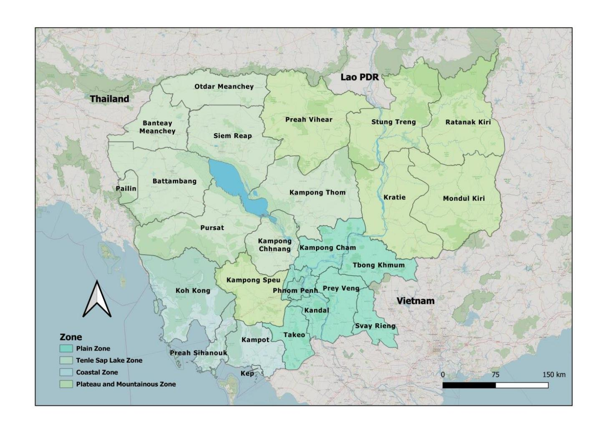

### 1.1. Introduction

The Cambodia Inter-censal Population Survey 2024 (CIPS) was conducted in May 2024, with the reference time set for May 3 at 00:00 hours. This survey represents the third iteration of the CIPS in the Kingdom of Cambodia, following those conducted in 2004 and 2013. CIPS 2024 was strategically scheduled to occur between the censuses of 2019 and 2029. Inter-censal surveys in the Kingdom of Cambodia provide estimates of the level of confidence at the capital/provincial levels. The selected population for the 2024 CIPS survey comprised the general household population, excluding individuals living in institutions such as hospitals, guesthouses, police stations, prisons, and those who are homeless. CIPS 2024 was conducted to improve key survey objectives, including the update of population data by capital and province, as well as information on marital status, fertility, mortality, migration, education, employment, and other demographic characteristics, such as household appliances.

### 1.2. Survey Objective

The primary objective of the 2024 Inter-Censal Survey in the Kingdom of Cambodia (CIPS 2024) is to meet the needs of the Royal Government and other relevant institutions. Users will access up-to-date and reliable data related to various population, health, and social issues, including demographic factors such as structure, age, sex, ethnicity, mother tongue, religion, and disability, as well as educational status, occupation, employment status, employment sector, socio-economic status, and inactive economic status. The survey will also provide information on infant mortality, child mortality, maternal mortality, life expectancy, marital status, fertility, migration, and housing characteristics, including the purpose of the building, occupancy, primary lighting, energy sources for cooking, access to clean water, toilet management, waste disposal, use of bank accounts, internet access, and household property. This comprehensive data will facilitate in-depth multi-component analysis of the Cambodian population.

The objective of this survey is to support the preparation of national development policies, including the National Strategic Development Plan (NSDP), the Sustainable Development Goals of Cambodia (CSDGs), the National Population Policy Update 2016-2030, the Maternal and Child Health Program, the Social Affairs and Rehabilitation Program for the Disabled, and the Neary Rattanak initiative of the Ministry of Women's Affairs, as well as to develop various sectoral plans that contribute to the first phase of the Pentagon Strategy of the Royal Government of Cambodia. Furthermore, the results of this survey will fulfill the data requirements of the National Statistical System, the ASEAN Secretariat, and international entities. Specifically, the findings will enable the government to prepare an annual report on women's progress for submission to the United Nations.

### 1.3. Sample design

The Cambodia Inter-Censal Population Survey 2024 (CIPS) was sampled in two different stages. The first-stage sampling units were enumeration areas (EAs), and the secondstage sampling units were households (HHs). A total of 750 sample EAs were selected according to the probability ratio relative to the size of households in a capital city and all provinces; furthermore, 22,500 households were selected as a second-stage sampling unit. After sampling the EAs, the household listing operation was carried out in all the selected EAs. The results of the household listing were used for the second phase of household selection. The second stage was to select 30 equal sample households according to Linear Systematic Sampling. The sample households for the CIPS-2024 survey were selected at the head office prior to the survey operation. During the survey operation, enumerators were limited to interviewing only selected households to avoid bias, and no substitutions were permitted for households who were not found or did not respond. Since the sample size represents a capital and all provinces, the sample was not pre-made at the national level. Instead, the sample coefficients were calculated and included in the database; thus, the results will be nationally proportional. Other correction coefficients could be applied for households rejecting responses.

Table 1.3.1. Number of Samples Distributed by Capital City and Provinces for CIPS-2024 Survey

| Provinces        | •         | umber of Hl | •         | Number of Sample EAs Num |                   |     |       | ber of Sample HHs |        |  |
|------------------|-----------|-------------|-----------|--------------------------|-------------------|-----|-------|-------------------|--------|--|
| 110111100        | Urban     | Rural       | Total     | Urban                    | Urban Rural Total |     |       | Rural             | Total  |  |
| Cambodia         | 1,328,501 | 2,224,520   | 3,553,021 | 293                      | 457               | 750 | 8790  | 13710             | 22,500 |  |
| Banteay Meanchey | 68,660    | 120,928     | 189,588   | 12                       | 18                | 30  | 360   | 540               | 900    |  |
| Battambang       | 45,556    | 181,681     | 227,237   | 8                        | 23                | 31  | 240   | 690               | 930    |  |
| Kampong Cham     | 30,386    | 186,811     | 217,197   | 7                        | 24                | 31  | 210   | 720               | 930    |  |
| Kampong Chhnang  | 28,523    | 97,776      | 126,299   | 7                        | 23                | 30  | 210   | 690               | 900    |  |
| Kampong Speu     | 114,380   | 81,502      | 195,882   | 19                       | 12                | 31  | 570   | 360               | 930    |  |
| Kampong Thom     | 16,118    | 144,648     | 160,766   | 5                        | 25                | 30  | 150   | 750               | 900    |  |
| Kampot           | 13,258    | 130,144     | 143,402   | 4                        | 26                | 30  | 120   | 780               | 900    |  |
| Kandal           | 170,782   | 95,021      | 265,803   | 24                       | 8                 | 32  | 720   | 240               | 960    |  |
| Koh Kong         | 12,359    | 15,668      | 28,027    | 13                       | 15                | 28  | 390   | 450               | 840    |  |
| Kracheh          | 9,297     | 76,879      | 86,176    | 4                        | 25                | 29  | 120   | 750               | 870    |  |
| Mondol Kiri      | 7,500     | 12,909      | 20,409    | 12                       | 16                | 28  | 360   | 480               | 840    |  |
| Phnom Penh       | 499,299   | -           | 499,299   | 35                       | 0                 | 35  | 1,050 | 0                 | 1,050  |  |
| Preah Vihear     | 5,650     | 51,063      | 56,713    | 4                        | 25                | 29  | 120   | 750               | 870    |  |
| Prey Veng        | 14,168    | 252,766     | 266,934   | 5                        | 27                | 32  | 150   | 810               | 960    |  |
| Pursat           | 17,624    | 86,238      | 103,862   | 6                        | 24                | 30  | 180   | 720               | 900    |  |
| Ratanak Kiri     | 6,877     | 42,864      | 49,741    | 5                        | 24                | 29  | 150   | 720               | 870    |  |
| Siemreap         | 67,845    | 156,827     | 224,672   | 10                       | 21                | 31  | 300   | 630               | 930    |  |
| Preah Sihanouk   | 34,060    | 13,321      | 47,381    | 24                       | 5                 | 29  | 720   | 150               | 870    |  |
| Stung Treng      | 9,761     | 26,072      | 35,833    | 8                        | 20                | 28  | 240   | 600               | 840    |  |
| Svay Reang       | 37,285    | 95,207      | 132,492   | 9                        | 21                | 30  | 270   | 630               | 900    |  |
| Takeo            | 62,856    | 145,842     | 208,698   | 10                       | 21                | 31  | 300   | 630               | 930    |  |
| Oddar Meanchey   | 19,826    | 41,060      | 60,886    | 11                       | 18                | 29  | 330   | 540               | 870    |  |
| Kep              | 7,714     | 1,891       | 9,605     | 26                       | 2                 | 28  | 780   | 60                | 840    |  |
| Pailin           | 13,050    | 4,127       | 17,177    | 20                       | 8                 | 28  | 600   | 240               | 840    |  |
| Tboung Khmum     | 15,667    | 163,275     | 178,942   | 5                        | 26                | 31  | 150   | 780               | 930    |  |

### 1.3.1 Probability of Selection

Due to the non proportional allocation of the sample to the different provinces and to their urban and rural areas, along with possible differences in response rates, sampling weights are required for any analysis using the CIPS 2024 data to ensure the actual representativeness of the survey results at national level and as well as the provincial level. Since the CIPS 2024 sample was a two-stage stratified cluster sample, sampling weights were calculated based on sampling probabilities separately for each sampling stage and for each cluster. The following notations were used:

 $P_{1hi}$ : first-stage sampling probability EA  $i^{th}$  province h

$$P_{Ihi} = \frac{n_h \ M_{hi}}{\sum M_{hi}}$$

 $n_h$  be the number of EA  $i^{th}$  province h  $M_{hi}$  be the number of households according to the sampling frame in province  $h^{th}$   $\sum M_{hi}$  be the total number of households in the province

P2hi- The second stage's selection probability for each household in the EA

$$P_{2hi} = \frac{m_{hi}}{L_{hi}}$$

 $L_{hi}$  be number of households listed in the household listing operation EA  $i^{th}$  in province  $h^{th}$   $m_{hi}$  be the number of households selected in the EA  $i^{th}$  in province  $h^{th}$ 

### 1.3.2. Sampling Weight

Sampling weights were adjusted for household nonresponse as well as for individual nonresponse to calculate the survey weights. A spreadsheet containing all sampling parameters and selection probabilities was prepared to facilitate the calculation of survey weights. Several sets of survey weights were calculated:

$$W_{hi} = \frac{\sum M_{hi} L_{hi}}{m_{hi} n_h M_{hi}}$$

### 1. 4. Survey Questionnaire

The Household Questionnaire was used to collect information from all permanent household members and guests selected for the interview. Individual characteristics such as age, sex, education, and relationship with the head of the household were collected as basic information. For children under the age of 18, the survival status of the parents was determined. The survey questionnaire was designed to provide economic, social, and other necessary information for monitoring and evaluating to serve the interests of the population concerned. The survey ensured that there was no gender bias by gender selection for interviewing and responding to survey questions. Past experience in Cambodia revealed no sex bias in data collection. A significant proportion of the enumeration and supervision staff consisted of women, and it was observed that their capacity to address questions regarding fertility and maternal mortality was notably effective. The survey questionnaire was designed with the objective of enhancing gender statistics. The content of the survey questionnaire was formulated based on questions derived from the 2019 Census of Cambodia. There were two questionnaires: House List (Form A) and Household Questionnaire (Form B).

The questions had to be answered by the head of household, a related person, or any responsible household member:

**Form A**: Household identifying characteristics including building/structure number; predominant construction material of walls, roof, and floor; purpose of building/household structure; household number; number of persons usually living in the household.

**Form B**: Full name; relationship to head of household; sex; age; marital status; mother tongue; religion; birth place; previous residence; duration of stay; reason for migration; literacy and full-time education; physical/mental disability (if any); main activity; occupation; employment status; industry, trade, or service; sector of employment; pollution; detailed fertility information of females aged 15 and over; details of any household member who died 12 months earlier.

Besides individual information, the following questions on housing conditions and facilities were also collected for regular households: tenure of the dwelling; main source of light, main cooking fuel; use of a toilet facility; main source of drinking water supply and location of drinking water source; number of rooms occupied by household; ownership of facilities like radio/transistor, television, telephone (landline), cell phone, personal computer, bicycle, motorcycle, car/van, boat, tractor, and access to the internet.

### 1.5. Training of Trainers

The 140 Regional Officers (ROs) and Assistant Regional Officers (AROs) of the National Institute of Statistics (NIS), 200 Supervisors, and Directors and Deputy Directors of 25 municipal/provincial departments of planning were meticulously trained about the household questionnaire, content, definition, and survey method at NIS on April 19-23, 2024. The training of trainers is the key to gaining a comprehensive knowledge of survey procedures and detailed theory of household questionnaires, content, and definition for further training for enumerators and supervisors in each target province. This training emphasized how to complete the questionnaire in Form B (household questionnaire), which contained detailed questions for households, household members, and guests, dividing into 5 sections:

Section 1: Demographic information includes whether the actual household members were present or absent during the night survey, as well as if guests were present.

Section 2: Personal information of each household member includes name, sex, age, relationship with the head of household, mother tongue, religion, disability, place of birth, migration, reason for migration, education, occupation, etc.

Section 3: Fertility information of women aged 15 and over includes questions regarding the number of children born, the number of live births, the number of deceased children, and the number of children born in the last 12 months.

Section 4: Information on housing condition and household appliances, along with the environment, includes questions related to whether the house is privately owned or rented, as well as the availability of water, electricity, firewood, coal, gas, toilets, sources of drinking water, the number of rooms, and the presence of various appliances and vehicles such as radio, television, phone, computer, bicycle, motorbike, car, refrigerator, washing machine, air conditioner, boat, tractors, etc.

Section 5: Information regarding deaths in the household includes questions about any deaths that occurred within the past 12 months, the causes of deaths, and the registration of those deaths.

The training of trainers was conducted with engaging discussions, debates, and solutions to each question in order to prevent inconsistencies in future training during the actual data collection operation.

### 1.6. Pretest

The training of enumerators and supervisors for the pilot survey on the questionnaire was conducted prior to the field operations for CIPS 2024 in two phases: the first took place December 25 and 29, 2023, and the second phase occurred between March 30 and April 3, 2024. The main objective of the pilot survey was to assess the consistency of the questionnaire, survey guidelines, and other survey techniques. The pilot survey was conducted in three villages in Takeo province, and 41 participants were engaged, including technical officers, supervisors, and enumerators from the NIS. The second pilot survey was conducted by 50 technical survey officers, supervisors, enumerators from NIS across 6 villages in Kampong Cham, Kampong Speu, and Takeo provinces.

Prior to the actual interview phase, a preliminary pilot survey was conducted by the supervisor to ensure the quality of the enumerators' interviews, which involved assessing the time taken to complete the interviews, evaluating the quality control of data collection, and examining data processing, including calculations of model deviation to evaluate the survey results. The pilot survey is conducted as a complete exercise for large-scale surveys, during which all stages of the operation are implemented to test the efficiency and effectiveness of the survey implementation.

### 1.7. Selection of Field Staff

Based on the sample selected, the survey utilized approximately 750 enumerators and 200 supervisors, with each supervisor overseeing the work of 4 enumerators. The supervisors were selected from NIS and other general departments under the Ministry of Planning. The 750 enumerators were selected from the 25 provincial planning departments.

In the Cambodia Inter-Censal Population Survey 2024 (CIPS), a total of 75 municipal and provincial officials were responsible for leading the survey, accompanied by 140 Regional Officers (ROs) and Assistant Regional Officers (AROs) as field trainers. Experienced officers from NIS of the Ministry of Planning participated in the training of enumerators and supervisors. ROs and AROs served as technical advisors to all supervisors and were responsible for conducting the survey in the provinces within their jurisdiction. The primary responsibilities of ROs and AROs included coordinating the training of supervisors and enumerators, monitoring the survey in the field, ensuring the proper distribution of CIPS materials, and collecting completed questionnaires.

### 1.8. Training of Field Staff

The training was designed to equip survey field staff at all levels with the necessary knowledge to effectively lead the survey. The ROs and AROs, serving as intermediate trainers, instructed approximately 750 interviewers and 200 supervisors on all aspects of the survey, with particular emphasis on the questionnaire and its content, including practical implementation. The training was held at the Capital and Provincial Planning Department, facilitated by ROs and AROs with support from the Director and Deputy Director of the

Provincial Planning Department. This training session took place over five days, from April 26 to April 30, 2024. Survey field staff at all levels received instructions on the purpose of the survey, detailed explanations of the survey forms, and guidance on methods for recording household information, as well as on management and quality control procedures for the survey.

Thorough preparation of training materials and documents was intended to enhance the quality of the training. In addition to technical equipment, three specialized training resources were available for 2024, including using digital resources to support training, a using large print version of the questionnaire, and conducting practical interviews in small groups. These materials were properly designed to support training at both middle and lower levels.

### 1.9. Data Collection

Primary Sampling Units (PSUs) were registered in the field to obtain a comprehensive list of households residing in the selected EAs, which were updated during the household listing and mapping phase conducted between February and April 2024. During this phase, enumerators drafted EA maps. Buildings where households resided, either in whole or in part, were numbered with a sticker affixed to each building, and all locations were marked on the map to ensure that every building in which a household resides was identified. A total of 30 sample households were selected from each EA for identification.

This step was an important part of the household questionnaire data collection process, referred to as Form B (as shown in the appendix). The enumerators interviewed all 30 sample households selected within their designated EAs. Supervisors generally worked closely with enumerators and respondents to ensure effective cooperation in answering survey questions. During the data collection operation, the reference time for interviewing the households of Form B was set to 00:00 on May 15, 2024. At this stage, ROs and AROs, acting as coordinating officers, closely monitored fieldwork activities to ensure that all sample households were interviewed with a focus on quality.

Each capital and province was closely monitored by six field technical coordination officers to ensure the quality control of the survey. These officers received expert training for supervisory guidance. Each week, the six officers compiled a database of completed interviews to track work progress and data quality. Coordination officers and supervisors regularly provided feedback for improvements. The data collection was successfully completed on May 15, 2024.

### 1.10. Data Processing

Data processing aims to enhance data quality by identifying inconsistencies and unintentional errors in the questionnaire and making necessary adjustments. This process involves correcting or completing data to ensure it aligns with accurate values. Some of the errors identified occur during the data collection period. Additionally, enumerators may contribute to errors by not accurately recording respondents' answers. To address these issues, editing and coding training is provided to experienced officers to process inconsistent, inaccurate, and incomplete data, thereby improving the overall quality of the collected data. Some answers are recorded as descriptive information, including the actual address of the guests, the location where actual members are absent at survey night, place of birth, previous

residence, occupation, and economic activity. Those responsible for coding must ensure that accurate codes are assigned to these descriptive answers. This guide includes code validation for all relevant variables.

Thirty editing officers and thirty coding officers received training in processing methods and implementation under the direct supervision of two senior technical officers, both of whom had extensive experience in prior censuses and surveys. Data processing was scheduled to be completed within two months by the end of June 2024. After the editing and coding processes were completed in the office, the questionnaire was forwarded to the data entry section.

Data entry was conducted using computer software known as CSPro, developed by the U.S. Census Bureau. The data entry group consisted of thirty officers working under the supervision of two supervisors. All officers received comprehensive training in data entry procedures. Data cleaning was conducted concurrently to ensure data integrity and achieve the highest possible level of accuracy. Timely downloading of data monitoring tables facilitated effective monitoring. Data processing was completed in August 2024.

### 1.11. Tabulation and Analysis Plans

The analysis of survey data will be conducted by NIS based on a list of priority variables, and several additional tables will also be generated for further analysis. However, the analysis is not solely responsible for the government. Universities, demographers, researchers, other institutions, and data users can also use and analyze data in their own way according to their needs and interests. They will be encouraged to contact the Data User Service Center (DUSC) for more information, data-analyzed tables or reports. A wide range of data classifications and categories can be generated with survey tables, and the individual-level data will permit extensive use for studies analyzing survey data.

Priority tables are typically generated based on all survey variables presented in tabular format, which are relevant in the calculation of demographic and socio-economic indicators for planning and policy purposes. Most tables are produced at both national and sub-national levels, following the completion of data cleanup. The priority table compiles a list of requested tables. The number of tables produced is comparable to that of the 2019 census. These tables encompass nearly all sections of the survey questionnaire, categorizing the data across all areas relevant to data users. Additionally, further data requested by users and supplementary data tables are created for in-depth analysis.

### 1.12. Dissemination

Preliminary reports provide the total population size, with a summary table generated immediately upon completion of data cleanup. This report presents the total population along with a brief analysis at both national and sub-national levels, offering timely information on the latest estimates. The subsequent task is to prepare the final results report, the capital and provincial results report, and an in-depth analysis report on key topics. The findings demonstrated in these reports are utilized for urgent purposes by institutions engaged in reproductive health and family planning, education and training, population research and development, women and gender studies, and so on. The Royal Government will establish a population information system for long-term use to monitor and evaluate programs related to population issues.

- a. Preliminary Figures Report: This report presents a form and table of aggregate data, offering a provisional survey of population figures by capital and province, along with key summary results.
- b. Final Result Report: The detailed data analysis extracted from Forms A and B to analyze and write the report will be conducted in September 2024, and it will be published in December 2024.
- c. Capital and Provincial Final Results Report: The report for each capital and province will be prepared by an official from NIS who has experience in drafting previous census and survey reports. These reports will be analyzed in 2025 and published in the second quarter of that year.
- d. In-depth Analysis by Topic: The 18 additional in-depth analysis reports will be produced to meet the needs of multi-sectoral planning in support of the Royal Government's first phase of the Pentagon Strategy. These reports will also serve as input for monitoring and evaluating regional and international needs, particularly regarding the achievements of the Royal Government of Cambodia and international policy priorities. They are scheduled for completion in the third quarter of 2025. These in-depth analysis reports will be co-produced by officials of the NIS with technical assistance from international experts:
  - 1 Fertility and nuptiality
  - 2 Mortality and maternal mortality
  - 3 Population growth
  - 4 Composition by age and sex
  - 5 Disability
  - 6 Ethnic minorities
  - 7 International and internal migration
  - 8 Literacy and educational attainment
  - 9 Economic activity and employment
  - 10 Households, housing conditions and amenities
  - 11 Water, sanitation and hygiene
  - 12 Population projections (2024-2050)
  - 13 Gender dimension
  - 14 Ageing and living conditions
  - 15 Situation of children and youth
  - 16 Children's situation and environment
  - 17 Key demographic indicators
  - 18 Children's Environmental Health and Safety Risks in Cambodia

### 2.1. Population size

The results of final finding from the Cambodia Inter-Censal Population Survey (CIPS 2024) show that the total de facto population of Cambodia on May 5th, 2024 stood at 17,280,543. This is the population that spent the night at the place of enumeration. The total o population increased from a total of 15,552,211, which was recorded in the 2019 Census. Thus, the population has grown by 1,728,332 persons, which represents 11.1 percent, over the 5-year period from 2019 to 2024. The male population was 8,490,419 (49.1 percent), while the female population stood at 8,790,125 (50.9 percent).

The first Cambodian census was conducted in 1962, following independence from France. It counted a total population of 5.7 million. The demographic situation of the nation changed dramatically after this first census because of war and civil unrest. The country carried out no further census until 1998. However, demographers did make some population estimates to serve as the base population for planning and policy development. A demographic survey conducted in 1979-1980 estimated the total Cambodian population at approximately 6.6 million. In 1994, the Cambodian Socio-Economic Survey was carried out by the National Institute of Statistics (NIS). The Survey estimated the total population of Cambodia at 9.9 million. In March 1996, the NIS conducted another demographic survey covering 20,000 households, which estimated the total population of Cambodia at 10.7 million. The 1998 Census recorded a population of 11.4 million. The NIS also undertook an Inter-Censal Survey in 2004 and found that the population had increased to 12.8 million. Following a pattern of steady increase, the 2008 Census obtained a result of 13.4 million. The Inter-Censal Survey in 2013 revealed a population of 14.7 million and the final result of GPCC 2019 accounted for 15.6 million and final finding from the Cambodia Inter-Censal Population Survey (CIPS 2024) 17.3 million.

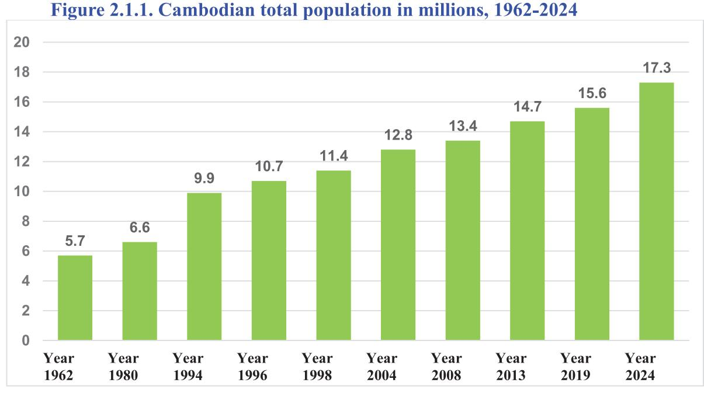

The final finding results from the Cambodia Inter-Censal Population Survey (CIPS 2024) show that, Phnom Penh had the highest population with 2,352,851 (13.6 %), followed by neighbouring Kandal with a population of 1,352,198 (7.8%); Prey Veng, 1,277,867 (7.4%); Battambang, 1,132,017 (6.6%), Siem Reap, 1,099,825 (6.4%); Takeo, 1,097,243 (6.3%); and Kampong Cham 1,062,914 (6.2%). Kep was the province with the lowest population at 48,772 (0.3%).

Table 2.1.1. Distribution of population by area, region, province and sex, Cambodia, 2024

| Ducying               | Household |            | Populat                        | tion      |       | Household |
|-----------------------|-----------|------------|--------------------------------|-----------|-------|-----------|
| Province              |           | Both sexes | th sexes Male Female Sex ratio |           |       |           |
| Total                 | 3,735,659 | 17,280,543 | 8,490,419                      | 8,790,125 | 96.6  | 4.6       |
| Urban                 | 1,600,151 | 7,172,206  | 3,503,507                      | 3,668,699 | 95.5  | 4.5       |
| Rural                 | 2,135,508 | 10,108,337 | 4,986,912                      | 5,121,425 | 97.4  | 4.7       |
| Central Plain         | 1,889,012 | 8,646,203  | 4,223,563                      | 4,422,639 | 95.5  | 4.6       |
| Tonle Sap             | 1,145,089 | 5,405,695  | 2,655,716                      | 2,749,978 | 96.6  | 4.7       |
| Coastal and Sea       | 239,128   | 1,107,423  | 555,559                        | 551,864   | 100.7 | 4.6       |
| Plateau and Mountains | 462,431   | 2,121,223  | 1,055,580                      | 1,065,643 | 99.1  | 4.6       |
| Banteay Meanchey      | 196,634   | 898,484    | 450,575                        | 447,909   | 100.6 | 4.6       |
| Battambang            | 223,444   | 1,132,017  | 557,285                        | 574,732   | 97.0  | 5.1       |
| Kampong Cham          | 226,260   | 1,062,914  | 519,843                        | 543,071   | 95.7  | 4.7       |
| Kampong Chhnang       | 139,653   | 604,895    | 296,838                        | 308,057   | 96.4  | 4.3       |
| Kampong Speu          | 201,724   | 924,175    | 453,590                        | 470,585   | 96.4  | 4.6       |
| Kampong Thom          | 166,519   | 807,254    | 388,270                        | 418,983   | 92.7  | 4.8       |
| Kampot                | 147,407   | 682,987    | 343,623                        | 339,364   | 101.3 | 4.6       |
| Kandal                | 281,751   | 1,352,198  | 651,607                        | 700,591   | 93.0  | 4.8       |
| Koh Kong              | 30,270    | 140,962    | 71,460                         | 69,502    | 102.8 | 4.7       |
| Kratie                | 91,256    | 441,078    | 224,462                        | 216,616   | 103.6 | 4.8       |
| Mondul Kiri           | 19,120    | 93,657     | 48,009                         | 45,648    | 105.2 | 4.9       |
| Phnom Penh            | 565,272   | 2,352,851  | 1,152,817                      | 1,200,034 | 96.1  | 4.2       |
| Preah Vihear          | 55,908    | 249,973    | 124,167                        | 125,806   | 98.7  | 4.5       |
| Prey Veng             | 266,939   | 1,277,867  | 624,134                        | 653,733   | 95.5  | 4.8       |
| Pursat                | 116,038   | 516,072    | 252,964                        | 263,108   | 96.1  | 4.4       |
| Ratanak Kiri          | 56,496    | 235,852    | 117,177                        | 118,676   | 98.7  | 4.2       |
| Siem Reap             | 229,179   | 1,099,825  | 538,632                        | 561,192   | 96.0  | 4.8       |
| Preah Sihanouk        | 50,382    | 234,702    | 116,179                        | 118,523   | 98.0  | 4.7       |
| Stung Treng           | 37,927    | 176,488    | 88,174                         | 88,314    | 99.8  | 4.7       |
| Svay Rieng            | 136,542   | 613,159    | 299,648                        | 313,511   | 95.6  | 4.5       |
| Takeo                 | 223,729   | 1,097,243  | 542,527                        | 554,716   | 97.8  | 4.9       |
| Otdar Meanchey        | 55,165    | 267,703    | 132,376                        | 135,327   | 97.8  | 4.9       |
| Kep                   | 11,069    | 48,772     | 24,297                         | 24,475    | 99.3  | 4.4       |
| Pailin                | 18,458    | 79,445     | 38,776                         | 40,669    | 95.3  | 4.3       |
| Tbong Khmum           | 188,519   | 889,970    | 432,987                        | 456,982   | 94.7  | 4.7       |

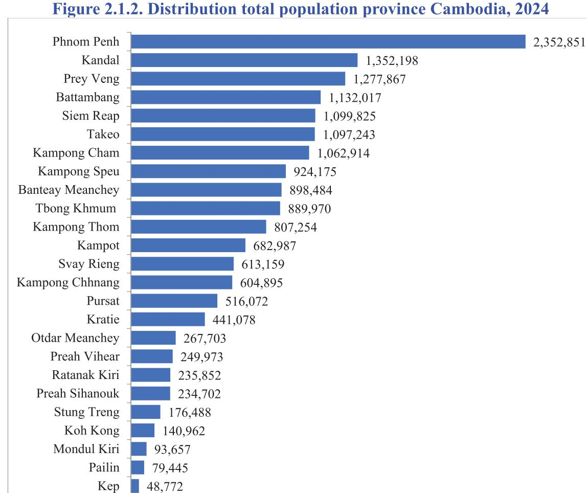

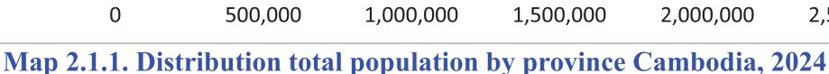

1,500,000

2,000,000

2,500,000

0

500,000

### 2.2. Annual Growth Rate

Population growth rate is used in a broad sense to cover the change in the number of people living in a country or region over a specific period of time, regardless of whether the change is positive or negative. Changes in population are measured usually in a percentage of the starting value.

The final finding results from CIPS 2024 indicates that the population of Cambodia increased by 1,728,332 or 11.1 percent over the period of 5 years between 2019 and 2024, on average annual growth rate over this period comes to 2.1 %. The growth rate has increased dramatically due to the factors of fertility, mortality and out-migration to other countries, especially the neighboring countries.

Between 2019 and 2024, the national population increased by 1,728,332. In urban areas, the population increased by 1,037,012 people (16.9 percent). Similarly, in rural areas, the population increased by 691,320 people (7.3 percent) (Table 2.2.1). The percentage of the urban population to the total population of Cambodia in 2019 and 2024 was 39.4 and 41.5, respectively (Table 2.3.1). Thus, there has been an increasing trend in urbanization in Cambodia over the past few years.

During the period 2019-2024, the average annual population growth rate in urban areas was 3.1 percent, while in rural areas the growth rate was 1.4 percent (Table 2.1.1). Migratory change played a significant role in the comparatively higher rate of population growth in urban areas.

The highest annual growth rate of 2.6 % was found in the central plain region and the second stand for highest found in Tonle Sap region 2.2%. In particular, the plateau and mountain areas and the Coastal and Sea region areas had annual growth rates of only 1.4 and 0.6 percent, respectively. Despite the increasing growth rates, the plateau and mountain areas and the Coastal and Sea region areas had annual population growth rates that decreased compared to 2008-2019.

Table 2.2.1: Annual growth rate by province Cambodia, 2019-2024

| Province              |            | lation     | Annual Gr | owth Rate |
|-----------------------|------------|------------|-----------|-----------|
| Trovince              | 2019       | 2024       | 2008-2019 | 2019-2024 |
| Total                 | 15,552,211 | 17,280,543 | 1.4       | 2.1       |
| Urban                 | 6,135,194  | 7,172,206  | 7.8       | 3.1       |
| Rural                 | 9,417,017  | 10,108,337 | -1.2      | 1.5       |
| Central Plain         | 7,644,295  | 8,646,203  | 1.4       | 2.6       |
| Tonle Sap             | 4,852,964  | 5,405,695  | 1.0       | 2.2       |
| Coastal and Sea       | 1,072,468  | 1,107,423  | 1.0       | 0.6       |
| Plateau and Mountains | 1,982,484  | 2,121,223  | 2.4       | 1.4       |
| Banteay Meanchey      | 861,883    | 898,484    | 2.2       | 0.8       |
| Battambang            | 997,169    | 1,132,017  | -0.3      | 2.5       |
| Kampong Cham          | 899,791    | 1,062,914  | -0.3      | 3.3       |
| Kampong Chhnang       | 527,027    | 604,895    | 1.0       | 2.8       |
| Kampong Speu          | 877,523    | 924,175    | 1.8       | 1.0       |
| Kampong Thom          | 681,549    | 807,254    | 0.7       | 3.4       |
| Kampot                | 593,829    | 682,987    | 0.1       | 2.8       |
| Kandal                | 1,201,581  | 1,352,198  | -0.5      | 2.4       |
| Koh Kong              | 125,902    | 140,962    | 0.6       | 2.3       |
| Kratie                | 374,755    | 441,078    | 1.5       | 3.3       |
| Mondul Kiri           | 92,213     | 93,657     | 3.7       | 0.3       |
| Phnom Penh            | 2,281,951  | 2,352,851  | 4.9       | 0.6       |
| Preah Vihear          | 254,827    | 249,973    | 3.6       | -0.4      |
| Prey Veng             | 1,057,720  | 1,277,867  | 1.0       | 3.8       |
| Pursat                | 419,952    | 516,072    | 0.5       | 4.1       |
| Ratanak Kiri          | 217,453    | 235,852    | 3.3       | 1.6       |
| Siem Reap             | 1,014,234  | 1,099,825  | 1.1       | 1.6       |
| Preah Sihanouk        | 310,072    | 234,702    | 3.1       | -5.6      |
| Stung Treng           | 165,713    | 176,488    | 3.6       | 1.3       |
| Svay Rieng            | 525,497    | 613,159    | 0.8       | 3.1       |
| Takeo                 | 900,914    | 1,097,243  | 0.6       | 3.9       |
| Otdar Meanchey        | 276,038    | 267,703    | 3.6       | -0.6      |
| Kep                   | 42,665     | 48,772     | 1.6       | 2.7       |
| Pailin                | 75,112     | 79,445     | 0.6       | 1.1       |
| Tbong Khmum           | 776,841    | 889,970    | 0.3       | 2.7       |

At the province level, the final results from CIPS 2024 show a high annual growth rate is in Pursat (4.1 %), followed by Takeo (3.9%) Prey Veng (3.8%) and Kampong Thom (3.4%) it's may affected by high fertility rate and absorbing migration from other provinces for new settlements and agricultural land, economic opportunities and development. In particular, Preah Sihanouk province, the population growth rate has fallen sharply (5.6%), and Oddar Meanchey and Preah Vihear provinces have also experienced declines of less than one percentage point (0.6% and 0.4%, respectively). Although Phnom Penh is a place with potential for employment, economic development, tourism, education, construction, and especially the garment industry, the annual growth rate is only 0.6%.

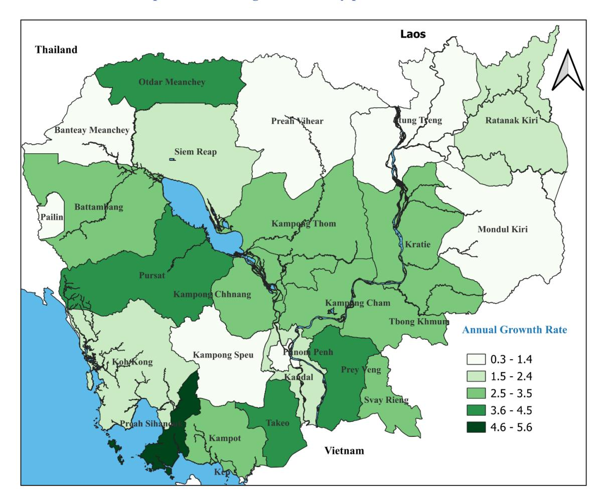

Map 2.2.1 Annual growth rate by province Cambodia, 2024

### 2.3. Population Distribution

Table 2.3.1 provides the percentage of the total population by region and sex. The CIPS 2024, final results shows that Cambodians continues to live mostly in the central plains of the country, with approximately 8,646,203 people, or 50.3 percent, because this region is concentrated in large and highly developed provinces. The Tonle Sap region is standing as the second most populous region with a population of 5,405,695 people, or 31.3 percent of the total population, while the plateau and mountains region stands in third place with a population of 2,121,223 people, or 12.3 percent, and the coastal and sea region with 1,107,423 people, or 6.1 percent only.

The population distribution trend pattern appears to have remained stable between 2019 and 2024. For the central plains, Tonle Sap region, and plateau and mountain regions, the population distribution has increased as well. In the coastal and sea regions, the population distribution has continued to decline compared to 2019, especially in Preah Sihanouk province.

Table 2.3.1. Distribution of population by province and sex, 2019-2024

| Day to a              | Pop        | pulation 2019 | 9      | Pop        | ulation 2024 |        |
|-----------------------|------------|---------------|--------|------------|--------------|--------|
| Province              | Both Sexes | Male          | Female | Both Sexes | Male         | Female |
| Total                 | 100        | 100           | 100    | 100        | 100          | 100    |
| Urban                 | 39.4       | 39.5          | 39.4   | 41.5       | 41.3         | 41.7   |
| Rural                 | 60.6       | 60.5          | 60.6   | 58.5       | 58.7         | 58.3   |
| Central Plain         | 49.2       | 48.6          | 49.7   | 50.3       | 50.0         | 50.6   |
| Tonle Sap             | 31.2       | 31.4          | 31.0   | 31.3       | 31.3         | 31.3   |
| Coastal and Sea       | 6.9        | 7.0           | 6.8    | 6.1        | 6.3          | 6.0    |
| Plateau and Mountains | 12.7       | 13.0          | 12.5   | 12.3       | 12.4         | 12.1   |
| Banteay Meanchey      | 5.5        | 5.7           | 5.4    | 5.2        | 5.3          | 5.1    |
| Battambang            | 6.4        | 6.5           | 6.3    | 6.6        | 6.6          | 6.5    |
| Kampong Cham          | 5.8        | 5.7           | 5.9    | 6.2        | 6.1          | 6.2    |
| Kampong Chhnang       | 3.4        | 3.3           | 3.4    | 3.5        | 3.5          | 3.5    |
| Kampong Speu          | 5.6        | 5.6           | 5.7    | 5.3        | 5.3          | 5.4    |
| Kampong Thom          | 4.4        | 4.4           | 4.4    | 4.7        | 4.6          | 4.8    |
| Kampot                | 3.8        | 3.8           | 3.8    | 4.0        | 4.0          | 3.9    |
| Kandal                | 7.7        | 7.7           | 7.8    | 7.8        | 7.7          | 8.0    |
| Koh Kong              | 0.8        | 0.8           | 0.8    | 0.8        | 0.8          | 0.8    |
| Kratie                | 2.4        | 2.5           | 2.4    | 2.6        | 2.6          | 2.5    |
| Mondul Kiri           | 0.6        | 0.6           | 0.6    | 0.5        | 0.6          | 0.5    |
| Phnom Penh            | 14.7       | 14.6          | 14.7   | 13.6       | 13.6         | 13.7   |
| Preah Vihear          | 1.6        | 1.7           | 1.6    | 1.4        | 1.5          | 1.4    |
| Prey Veng             | 6.8        | 6.6           | 7.0    | 7.4        | 7.4          | 7.4    |
| Pursat                | 2.7        | 2.7           | 2.7    | 3.0        | 3.0          | 3.0    |
| Ratanak Kiri          | 1.4        | 1.5           | 1.3    | 1.4        | 1.4          | 1.4    |
| Siem Reap             | 6.5        | 6.6           | 6.5    | 6.4        | 6.3          | 6.4    |
| Preah Sihanouk        | 2.0        | 2.1           | 1.9    | 1.4        | 1.4          | 1.3    |
| Stung Treng           | 1.1        | 1.1           | 1.0    | 1.0        | 1.0          | 1.0    |
| Svay Rieng            | 3.4        | 3.3           | 3.5    | 3.5        | 3.5          | 3.6    |
| Takeo                 | 5.8        | 5.7           | 5.9    | 6.3        | 6.4          | 6.3    |
| Otdar Meanchey        | 1.8        | 1.8           | 1.7    | 1.5        | 1.6          | 1.5    |
| Kep                   | 0.3        | 0.3           | 0.3    | 0.3        | 0.3          | 0.3    |
| Pailin                | 0.5        | 0.5           | 0.5    | 0.5        | 0.5          | 0.5    |
| Tbong Khmum           | 5.0        | 5.0           | 5.0    | 5.2        | 5.1          | 5.2    |

Phnom Penh has the highest population of 2,352,851 (13.6%), followed by Kandal Province with 1,352,198 (7.8%), Prey Veng Province with 1,277,867 (7.4%), Battambang Province with 1,132,017 (6.6%), Siem Reap Province with 1,099,825 (6.4%), Takeo Province with 1,097,243 (6.3%), and Kampong Cham Province with 1,062,914 (6.2%), while Kep Province has the lowest population of 48,772 (0.3%).

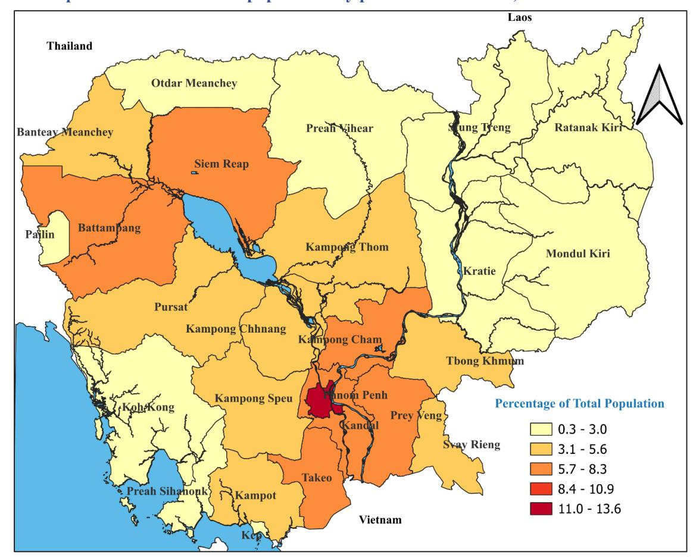

Map 2.3.1. Distribution of population by province Cambodia, 2024

Compared to 2019, the population distribution is similar to 2024, with Phnom Penh having the highest population, followed by Kandal Province, Prey Veng Province, Siem Reap Province, Battambang Province, Takeo Province, and Kampong Cham Province, while Kep Province still has the lowest population. However, the percentage of the population in Phnom Penh and Siem Reap decreased compared to 2019, while the percentage of the population in Kampong Cham, Battambang, Kandal, Siem Reap, and Takeo provinces increased.

### 2.4. Population Density

Population density is an indicator for the concentration of the population in certain areas. It is usually defined as the number of persons per square kilometer. The final results of the CIPS 2024, show that the estimated population density of Cambodia is now 97 persons per square kilometer. This is an increase of 10 persons as compared to the 87 persons per square kilometer recorded in 2019.

Table 2.4.1 shows the population density by region in 2019 and 2024. The final results of the CIPS 2024, demonstrate that the population density continues to vary widely in the regions of the Kingdom. In the Central Plain region, the population density is relatively high, at 347 persons per square kilometer, followed by the Tonle Sap region where the population density comes to 80 persons per km². Next standing is Coastal and Sea region with a density of 64 persons per square kilometer, while the Plateau and Mountains region has the lowest density at only 31 persons per km².

Compared to 2019, the population density in the Central Plain region has increased from 305 to 347 persons per square kilometer, an increase of 42 persons per km2. In Tonle Sap the population density has grown by 8 persons per square kilometer. The population density has increased by 2 and 2 persons respectively per square kilometer in the Coastal and Sea region, and the Plateau and Mountains region. While the Plateau and Mountains region

remains the lowest in terms of population density, the relative increase there has been much larger than elsewhere.

Table 2.4.1 shows population density by province 2019-2024. Phnom Penh, the municipality of the Kingdom of Cambodia, is a concentrated area of commercial, economic, social and cultural centers that attract migration from other provinces due to the provision of employment and the growth of the garment industry, construction, hotels, tourism and education sectors, etc. Phnom Penh has the highest population density of 3,465 people per square kilometer, followed by Kandal, Takeo, Prey Veng, Kampong Cham, Svay Rieng, Sihanoukville, Tboung Khmum, Banteay Meanchey, Kep, Kampong Speu and Kampot with population densities ranging from 140 to 425 per square kilometer. Siem Reap, Kampong Chhnang, Pailin, Battambang and Kampong Thom have population densities ranging from 58 to 107people per square kilometer. Koh Kong and Mondulkiri provinces have the lowest population densities of 7 to 14 people per square kilometer, respectively. Population density has increased in almost all capitals and provinces to a greater or lesser extent in line with the growth of the commercial, economic, social and culture.

| D .                   | Population |            | Population den | sity /Km2 |  |
|-----------------------|------------|------------|----------------|-----------|--|
| Province              | 2019       | 2024       | 2019           | 2024      |  |
| Total                 | 15,552,211 | 17,280,543 | 87             | 97        |  |
| Central Plain         | 7,644,295  | 8,694,974  | 305            | 347       |  |
| Tonle Sap             | 4,852,964  | 5,405,695  | 72             | 80        |  |
| Coastal and Sea       | 1,072,468  | 1,058,651  | 62             | 64        |  |
| Plateau and Mountains | 1,982,484  | 2,121,223  | 29             | 31        |  |
| Banteay Meanchey      | 861,883    | 898,484    | 129            | 135       |  |
| Battambang            | 997,169    | 1,132,017  | 85             | 97        |  |
| Kampong Cham          | 899,791    | 1,062,914  | 198            | 234       |  |
| Kampong Chhnang       | 527,027    | 604,895    | 95             | 110       |  |
| Kampong Speu          | 877,523    | 924,175    | 125            | 132       |  |
| Kampong Thom          | 681,549    | 807,254    | 49             | 58        |  |
| Kampot                | 593,829    | 682,987    | 122            | 140       |  |
| Kandal                | 1,201,581  | 1,352,198  | 378            | 425       |  |
| Koh Kong              | 125,902    | 140,962    | 12             | 14        |  |
| Kratie                | 374,755    | 441,078    | 34             | 40        |  |
| Mondul Kiri           | 92,213     | 93,657     | 6              | 7         |  |
| Phnom Penh            | 2,281,951  | 2,352,851  | 3,361          | 3,465     |  |
| Preah Vihear          | 254,827    | 249,973    | 18             | 18        |  |
| Prey Veng             | 1,057,720  | 1,277,867  | 217            | 273       |  |
| Pursat                | 419,952    | 516,072    | 33             | 41        |  |
| Ratanak Kiri          | 217,453    | 235,852    | 20             | 22        |  |
| Siem Reap             | 1,014,234  | 1,099,825  | 98             | 107       |  |
| Preah Sihanouk        | 310,072    | 234,702    | 160            | 121       |  |
| Stung Treng           | 165,713    | 176,488    | 15             | 16        |  |
| Svay Rieng            | 525,497    | 613,159    | 177            | 207       |  |
| Takeo                 | 900,914    | 1,097,243  | 253            | 308       |  |
| Otdar Meanchey        | 276,038    | 267,703    | 45             | 43        |  |
| Kep                   | 42,665     | 48,772     | 127            | 145       |  |
| Pailin                | 75,112     | 79,445     | 94             | 99        |  |
| Tbong Khmum           | 776,841    | 889,970    | 148            | 170       |  |

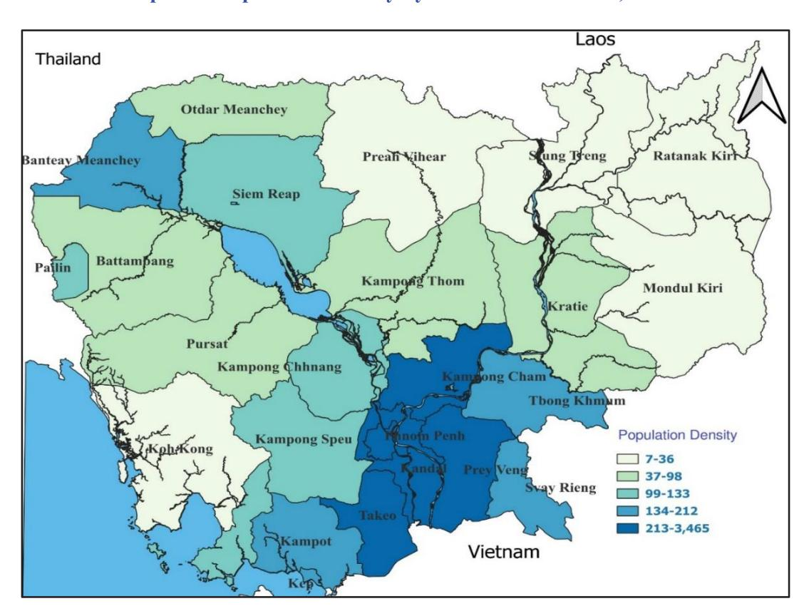

Map 2.4.1 Population Density by Province Cambodia, 2024

### 2.5. Population by religion

The predominant religion in Cambodia is Buddhism (97 percent), followed by Muslim (2.6 percent). In all regions of Cambodia, Buddhists have a high percentage. The category of "Others" mainly refers to the local religious system of the highland tribal groups and a few minority religious groups from other countries almost 4 per cent.

Table 2.5.1. Percentage distribution of population by religion, residence, and province, Cambodia, 2019-2024

| Zone                |          | Population 2019                  |     |     |          | Population 2024 |          |        |  |  |
|---------------------|----------|----------------------------------|-----|-----|----------|-----------------|----------|--------|--|--|
|                     | Buddhist | Buddhist Muslim Christian Others |     |     | Buddhist | Muslim          | Christia | Others |  |  |
| (1)                 | (2)      | (3)                              | (4) | (5) | (6)      | (7)             | (8)      | (9)    |  |  |
| Total               | 97.1     | 2.0                              | 0.3 | 0.5 | 96.5     | 2.6             | 0.3      | 0.5    |  |  |
| Urban               | 97.7     | 1.6                              | 0.4 | 0.2 | 96.7     | 2.8             | 0.4      | 0.0    |  |  |
| Rural               | 96.7     | 2.3                              | 0.2 | 0.8 | 96.4     | 2.5             | 0.3      | 0.8    |  |  |
| Central Plain       | 97.4     | 2.2                              | 0.3 | 0.1 | 96.6     | 3.0             | 0.3      | 0.0    |  |  |
| Tonle Sap           | 98.1     | 1.5                              | 0.3 | 0.1 | 97.6     | 2.0             | 0.5      | 0.0    |  |  |
| Coastal and Sea     | 96.4     | 3.2                              | 0.2 | 0.0 | 95.7     | 4.1             | 0.2      | 0.0    |  |  |
| Plateau & Mountains | 93.6     | 2.1                              | 0.6 | 0.6 | 93.9     | 2.0             | 0.3      | 3.8    |  |  |

### 2.6. Population by Place of birth

The pattern of evidence between the 2019 Census and CIPS 2024 shows that the majority of populations (69.9 percent) were the counts at survey night born at the same place of enumeration. Displacement (individuals are not living in their place of birth) was 30.1 percent at the national level.

Table 2.6.1: Distribution of population by place of birth and sex, Cambodia 2019-2024

| able 2.0.1. Distribution of population by place of birth and sex, Camboula 2017 2027 |               |           |           |            |           |           |  |  |
|--------------------------------------------------------------------------------------|---------------|-----------|-----------|------------|-----------|-----------|--|--|
|                                                                                      |               | 2019      |           |            | 2024      |           |  |  |
| Place of birth                                                                       | Both Sexes | Male      | Female    | Both Sexes | Male      | Female    |  |  |
| (1)                                                                                  | (2)           | (3)       | (4)       | (5)        | (6)       | (7)       |  |  |
| Number                                                                               | 15,552,21     | 7,571,837 | 7,980,374 | 17,280,543 | 8,490,419 | 8,790,125 |  |  |
| Total                                                                                | 100           | 100       | 100       | 100        | 100       | 100       |  |  |
| A. Born in Cambodia                                                                  | 99.1          | 99.0      | 99.3      | 99.7       | 99.6      | 99.7      |  |  |
| 1. Within the                                                                        | 85.5          | 84.6      | 86.4      | 72.2       | 69.2      | 75.0      |  |  |
| 2. Place of                                                                          | 78.3          | 76.5      | 80.0      | 69.9       | 66.6      | 73.1      |  |  |
| 3. Other provinces                                                                   | 13.6          | 14.4      | 12.9      | 27.5       | 30.4      | 24.7      |  |  |
| B. Outside country                                                                   | 0.9           | 1.1       | 0.7       | 0.3        | 0.4       | 0.3       |  |  |
| 1.Asia & pacific                                                                     | 0.8           | 1.0       | 0.7       | 0.31       | 0.37      | 0.26      |  |  |
| 2. Other countries                                                                   | 0.04          | 0.06      | 0.03      | 0.01       | 0.01      | 0.01      |  |  |

### 2.7. Population by Mother Tongue

The question on mother tongue was collected from population census 2019 and Inter-Censal Population Survey 2024. The Khmer was the predominant mother tongue in the country (96.4 percent) in 2019. Other and ethnics minority languages constituted 3.1 percent. 0.5 percent was people with a foreign language as mother tongue.

Table 2.7.1 Distribution of population by mother tongue and sex, Cambodia, 2024

| Mother Tongue |            | Population | P         | Percentage |      |        |
|---------------|------------|------------|-----------|------------|------|--------|
| Within Tongue | Total Male |            | Female    | Total      | Male | Female |
| (1)           | (2)        | (3)        | (4)       | (5)        | (6)  | (7)    |
| Total         | 17,280,543 | 8,490,419  | 8,790,125 | 100        | 100  | 100    |
| Khmer         | 16,657,937 | 8,183,437  | 8,474,499 | 96.4       | 96.4 | 96.4   |
| Vietnam       | 53,835     | 24,922     | 28,913    | 0.3        | 0.3  | 0.3    |
| Chinese       | 10,400     | 7,202      | 3,198     | 0.1        | 0.1  | 0.0    |
| Lao           | 19,894     | 9,393      | 10,501    | 0.1        | 0.1  | 0.1    |
| Thai          | 1,805      | 1,430      | 375       | 0.0        | 0.0  | 0.0    |
| Other         | 2,819      | 1,730      | 1,088     | 0.0        | 0.0  | 0.0    |
| Minorities    | 533,854    | 262,304    | 271,550   | 3.1        | 3.1  | 3.1    |

### 3.1. Introduction

On-going changes in the size and age structure of populations, at various levels of geographic aggregation, are occurring across most countries of the world. These changes are mostly a function of decline in mortality, in the first instance, and, later, of decline in fertility. The age and sex structure of a population which is determined by the past and current trends in fertility, mortality and migration. Affect the level of social, economic and political structure of any population. The shifts in the population age structure have had far reaching consequences on a country's work force, economic prospects, public and personal budgets, security risks, cultural organizations and family structures.

Age is such an important characteristic of population that almost all planning for development must take into account this variable. The linkages between sex-age structure and Government policies may be illustrated by an example. In modern times many countries in the developing world like Cambodia have policies to develop human resources and economy by promoting school enrolment and improving the educational attainment of those who enroll.

In order to successfully implement these policies, projections of school-age population at all administrative levels are made from the information on sex-age distribution of the population obtained from the census. On that basis the required numbers of educational institutions in the various parts of the country, buildings, teachers and other infrastructure facilities are planned.

According to the definition laid down by the United Nations, age of a person recorded in a census is "the interval of time between the date of birth and date of the census, expressed in completed solar years". It is also recommended that age information may be obtained by obtaining the date (year, month and day) of birth or by asking directly for age at the respondent's last birth day.

These recommendations were followed in respect of collection of age data in the past censuses and the present survey in Cambodia. Information on age in completed years as on last birthday was obtained from the respondents. Though it is easy enough to ask questions on age, it is somewhat difficult to obtain correct information about age when people are not literate or when they are very old. Suitable steps were taken to collect information on age as accurately as possible from every respondent. Khmer calendar was used by the enumerators in a number of cases to elicit completed age from the respondents who were not able to tell their age. The enumerators were also given a list of events of national and local importance to be used in assisting the respondents to recall their age.

### 3.2. Evaluation of age data

As the age data collected may not be hundred per cent correct due to several reasons in spite of all care taken in the field, it is necessary to evaluate them before use. The following

standard demographic indices were calculated for this purpose in respect of age data of CIPS 2024.

The recording of reference age may occur instead of the actual age in the last digit. The Myer index gap and the Whipple index are used to evaluate age reporting trend data.

### **Mayer Index**

- High quality when data less than 10.0
- Fair when data between 10.0 19.9
- Low quality when data between 20.0 and 39.9
- Unusable when data between data 40.0

### **Whipple Index**

- High quality when data between 105
- Fair when data between 105 109.9
- Fair when data between 110 124.9
- Low quality when data between ta 125 174.9
- Unusable when data between 175

Table 3.2.1. Age and Sex data evaluation Cambodia, 2024

| Sexes      | Mayer Index | W   | nipple Index |  |  |
|------------|-------------|-----|--------------|--|--|
|            | ,           | 0   | 5            |  |  |
| Both Sexes | 6.8         | 103 | 110          |  |  |
| Male       | 6.6         | 99  | 107          |  |  |
| Female     | 7.1         | 106 | 113          |  |  |

### 3.3. Age structure

Age structure is determined by three main factors that affect population growth: fertility, mortality, and migration. To study the age structure of the population we make use of the percent distribution of the population in different age groups and the graphical presentation called age pyramid which roughly summarizes the demographic history of population.

Table 3.3.1. Distribution of population by single age, sex and residence Cambodia 2024

| Single   |                   |                   | populati          | ation by single age, sex and residence Cambodia 2 |                   |            |                   |                   | 2027              |
|----------|-------------------|-------------------|-------------------|---------------------------------------------------|-------------------|------------|-------------------|-------------------|-------------------|
| Age      |                   | Total             |                   |                                                   | Urban             |            |                   | Rural             |                   |
| Age      | Both              |                   |                   | Both                                              |                   |            | Both              |                   |                   |
|          | Sexes             | Males             | Females           | Sexes                                             | Males             | Females    | Sexes             | Males             | Females           |
| (1)      | (2)               | (3)               | (4)               | (5)                                               | (6)               | (7)        | (8)               | (9)               | (10)              |
| Total    | 100               | 100               | 100               | 100                                               | 100               | 100        | 100               | 100               | 100               |
| 0        | 1.6               | 1.7               | 1.4               | 1.5                                               | 1.7               | 1.3        | 1.6               | 1.7               | 1.5               |
| 1        | 1.4               | 1.3               | 1.4               | 1.2                                               | 1.2               | 1.2        | 1.5               | 1.5               | 1.5               |
| 2        | 1.7               | 1.7               | 1.7               | 1.7                                               | 1.7               | 1.6        | 1.7               | 1.8               | 1.7               |
| 3        | 1.9               | 1.9               | 1.9               | 1.7                                               | 1.7               | 1.8        | 2.0               | 2.0               | 1.9               |
| 4 0-4 | 1.9 <b>8.5</b> | 2.1 <b>8.8</b> | 1.8 <b>8.2</b> | 1.9 <b>8.0</b>                                 | 2.0 <b>8.3</b> | 1.8 7.6 | 1.9 <b>8.8</b> | 2.1 <b>9.1</b> | 1.8 <b>8.6</b> |
| 5        | 1.8               | 1.8               | 1.7               | 1.8                                               | 1.9               | 1.8        | 1.8               | 1.8               | 1.7               |
| 6        | 1.9               | 2.0               | 1.7               | 1.7                                               | 1.9               | 1.5        | 1.9               | 2.1               | 1.8               |
| 7        | 1.9               | 2.0               | 1.8               | 1.8                                               | 2.0               | 1.6        | 1.9               | 2.0               | 1.9               |
| 8        | 1.9               | 2.0               | 1.8               | 1.9                                               | 2.0               | 1.8        | 1.9               | 2.0               | 1.7               |
| 9        | 1.7               | 1.7               | 1.6               | 1.7                                               | 1.7               | 1.7        | 1.6               | 1.8               | 1.5               |
| 5-9      | 9.1               | 9.6               | 8.5               | 8.9                                               | 9.5               | 8.4        | 9.1               | 9.7               | 8.6               |
| 10       | 1.9               | 2.0               | 1.7               | 1.7                                               | 1.8               | 1.6        | 2.0               | 2.1               | 1.8               |
| 11       | 1.6               | 1.8               | 1.5               | 1.5                                               | 1.6               | 1.4        | 1.8               | 1.9               | 1.6               |
| 12       | 2.0               | 2.0               | 2.0               | 1.9                                               | 2.0               | 1.8        | 2.1               | 2.1               | 2.1               |
| 13       | 2.0               | 2.1               | 1.9               | 1.9                                               | 2.0               | 1.8        | 2.0               | 2.1               | 1.9               |
| 14       | 1.8               | 1.9               | 1.7               | 1.6                                               | 1.7               | 1.6        | 1.9               | 2.0               | 1.8               |
| 10-14    | 9.3               | 9.7               | 8.9               | 8.6                                               | 9.1               | 8.2        | 9.8               | 10.2              | 9.3               |
| 15       | 1.9               | 1.9 1.9        | 1.8               | 1.9                                               | 1.9               | 1.9        | 1.8               | 1.9               | 1.8               |
| 16 17 | 1.8               | 1.9               | 1.8               | 1.8                                               | 1.9 1.9        | 1.7        | 1.8               | 1.8               | 1.8               |
| 18       | 1.9               | 1.8               | 1.9               | 1.8                                               | 1.8               | 1.7        | 2.0               | 2.0               | 2.0               |
| 19       | 1.7               | 1.7               | 1.6               | 1.7                                               | 1.7               | 1.6        | 1.7               | 1.7               | 1.7               |
| 15-19    | 9.1               | 9.2               | 9.0               | 9.0                                               | 9.2               | 8.8        | 9.2               | 9.2               | 9.2               |
| 20       | 1.8               | 1.8               | 1.8               | 1.8                                               | 1.9               | 1.6        | 1.8               | 1.8               | 1.9               |
| 21       | 1.6               | 1.6               | 1.6               | 1.6                                               | 1.5               | 1.8        | 1.5               | 1.6               | 1.4               |
| 22       | 1.7               | 1.8               | 1.6               | 1.5                                               | 1.5               | 1.6        | 1.9               | 2.1               | 1.7               |
| 23       | 1.6               | 1.7               | 1.6               | 1.6                                               | 1.7               | 1.5        | 1.7               | 1.6               | 1.7               |
| 24       | 1.9               | 1.9               | 1.9               | 1.9                                               | 1.9               | 1.9        | 1.9               | 2.0               | 1.9               |
| 20-24    | 8.6               | 8.8               | 8.4               | 8.4                                               | 8.4               | 8.4        | 8.8               | 9.1               | 8.5               |
| 25       | 1.8               | 1.8               | 1.8               | 1.8                                               | 1.7               | 1.8        | 1.9               | 1.9               | 1.8               |
| 26       | 1.5               | 1.6               | 1.4               | 1.6                                               | 1.6               | 1.6        | 1.4               | 1.6               | 1.3               |
| 27 28    | 1.4               | 1.4               | 1.4               | 1.4                                               | 1.5 1.8        | 1.3        | 1.5 1.6        | 1.4               | 1.5               |
| 29       | 1.6               | 1.6               | 1.6               | 1.7                                               | 1.7               | 1.7        | 1.5               | 1.6               | 1.4               |
| 25-29    | 8.0               | 8.2               | 7.8               | 8.1                                               | 8.1               | 8.2        | 7.9               | 8.2               | 7.5               |
| 30       | 1.9               | 2.0               | 1.9               | 2.0                                               | 2.1               | 2.0        | 1.9               | 1.9               | 1.8               |
| 31       | 1.7               | 1.8               | 1.7               | 1.7                                               | 1.8               | 1.6        | 1.7               | 1.7               | 1.7               |
| 32       | 2.0               | 2.1               | 1.9               | 2.2                                               | 2.4               | 2.1        | 1.8               | 1.9               | 1.7               |
| 33       | 1.6               | 1.7               | 1.5               | 1.7                                               | 1.9               | 1.5        | 1.6               | 1.7               | 1.5               |
| 34       | 1.6               | 1.7               | 1.5               | 1.7                                               | 1.8               | 1.7        | 1.5               | 1.7               | 1.3               |
| 30-34    | 8.8               | 9.3               | 8.4               | 9.4                                               | 9.8               | 8.9        | 8.5               | 8.9               | 8.1               |
| 35       | 1.7               | 1.7               | 1.8               | 1.9                                               | 1.8               | 2.0        | 1.6               | 1.6               | 1.7               |
| 36       | 1.6               | 1.6               | 1.7               | 1.7                                               | 1.6               | 1.7        | 1.6               | 1.7               | 1.6               |
| 37       | 1.6               | 1.6               | 1.5               | 1.6 2.1                                        | 1.7               | 1.5 2.0 | 1.5               | 1.5               | 1.6               |
| 39       | 1.8               | 1.8               | 1.7               | 1.6                                               | 2.2               | 1.6        | 1.6               | 1.6               | 1.6               |
| 35-39    | 8.2               | 8.2               | 8.1               | 8.9                                               | 9.0               | 8.8        | 7.6               | 7.6               | 7.7               |
| 40       | 1.7               | 1.6               | 1.8               | 1.8                                               | 1.6               | 2.0        | 1.6               | 1.6               | 1.6               |
| 41       | 1.6               | 1.6               | 1.5               | 1.7                                               | 1.7               | 1.6        | 1.5               | 1.5               | 1.5               |
| 42       | 1.7               | 1.6               | 1.7               | 1.8                                               | 1.7               | 1.8        | 1.6               | 1.5               | 1.6               |

| 43    | 1.5 | 1.5 | 1.5 | 1.7 | 1.7 | 1.6 | 1.3 | 1.3 | 1.3 |
|-------|-----|-----|-----|-----|-----|-----|-----|-----|-----|
| 44    | 1.4 | 1.5 | 1.4 | 1.7 | 1.8 | 1.6 | 1.2 | 1.2 | 1.3 |
| 40-44 | 7.8 | 7.7 | 7.8 | 8.7 | 8.5 | 8.8 | 7.2 | 7.2 | 7.2 |
| 45    | 1.5 | 1.5 | 1.6 | 1.6 | 1.5 | 1.7 | 1.4 | 1.4 | 1.5 |
| 46    | 0.8 | 0.8 | 0.7 | 0.7 | 0.8 | 0.7 | 0.8 | 0.8 | 0.7 |
| 47    | 0.7 | 0.7 | 0.7 | 0.6 | 0.6 | 0.6 | 0.8 | 0.7 | 0.8 |
| 48    | 0.8 | 0.7 | 0.8 | 0.7 | 0.7 | 0.8 | 0.8 | 0.8 | 0.8 |
| 49    | 0.8 | 0.8 | 0.8 | 0.7 | 0.7 | 0.6 | 0.8 | 0.9 | 0.8 |
| 45-49 | 4.5 | 4.5 | 4.5 | 4.4 | 4.3 | 4.4 | 4.6 | 4.6 | 4.6 |
| 50    | 0.8 | 0.7 | 0.9 | 0.7 | 0.7 | 0.8 | 0.8 | 0.8 | 0.9 |
| 51    | 0.8 | 0.8 | 0.9 | 0.8 | 0.7 | 0.8 | 0.9 | 0.8 | 0.9 |
| 52    | 0.9 | 0.9 | 1.0 | 1.0 | 1.0 | 1.0 | 0.9 | 0.8 | 1.0 |
| 53    | 0.9 | 0.9 | 1.0 | 0.9 | 0.9 | 0.9 | 0.9 | 0.8 | 1.0 |
| 54    | 0.9 | 0.9 | 1.0 | 0.9 | 1.0 | 0.9 | 0.9 | 0.8 | 1.0 |
| 50-54 | 4.4 | 4.1 | 4.7 | 4.4 | 4.2 | 4.5 | 4.4 | 4.1 | 4.8 |
| 55    | 0.9 | 0.9 | 0.9 | 0.9 | 0.8 | 0.9 | 0.9 | 1.0 | 0.9 |
| 56    | 0.8 | 0.8 | 0.8 | 0.8 | 0.9 | 0.7 | 0.8 | 0.7 | 0.9 |
| 57    | 0.7 | 0.7 | 0.7 | 0.6 | 0.5 | 0.6 | 0.8 | 0.8 | 0.8 |
| 58    | 0.7 | 0.6 | 0.8 | 0.6 | 0.5 | 0.6 | 0.8 | 0.7 | 0.9 |
| 59    | 0.6 | 0.6 | 0.6 | 0.6 | 0.6 | 0.6 | 0.6 | 0.6 | 0.7 |
| 55-59 | 3.7 | 3.6 | 3.8 | 3.4 | 3.4 | 3.4 | 3.9 | 3.7 | 4.1 |
| 60    | 0.8 | 0.7 | 0.9 | 0.7 | 0.6 | 0.8 | 0.9 | 0.8 | 0.9 |
| 61    | 0.7 | 0.6 | 0.8 | 0.6 | 0.5 | 0.6 | 0.7 | 0.6 | 0.9 |
| 62    | 0.7 | 0.7 | 0.7 | 0.7 | 0.6 | 0.7 | 0.7 | 0.7 | 0.7 |
| 63    | 0.7 | 0.6 | 0.8 | 0.7 | 0.6 | 0.8 | 0.7 | 0.7 | 0.7 |
| 64    | 0.7 | 0.6 | 0.8 | 0.7 | 0.6 | 0.7 | 0.7 | 0.6 | 0.8 |
| 60-64 | 3.6 | 3.2 | 3.9 | 3.4 | 3.0 | 3.7 | 3.8 | 3.4 | 4.1 |
| 65    | 0.6 | 0.5 | 0.7 | 0.6 | 0.5 | 0.7 | 0.7 | 0.6 | 0.8 |
| 66    | 0.5 | 0.5 | 0.6 | 0.6 | 0.6 | 0.5 | 0.5 | 0.4 | 0.6 |
| 67    | 0.5 | 0.4 | 0.6 | 0.5 | 0.4 | 0.5 | 0.5 | 0.4 | 0.6 |
| 68    | 0.5 | 0.4 | 0.6 | 0.5 | 0.4 | 0.6 | 0.5 | 0.4 | 0.5 |
| 69    | 0.3 | 0.2 | 0.4 | 0.3 | 0.3 | 0.4 | 0.3 | 0.2 | 0.4 |
| 65-69 | 2.5 | 2.1 | 2.9 | 2.5 | 2.1 | 2.8 | 2.5 | 2.0 | 2.9 |
| 70    | 0.4 | 0.3 | 0.5 | 0.4 | 0.2 | 0.6 | 0.4 | 0.3 | 0.5 |
| 71    | 0.3 | 0.3 | 0.4 | 0.3 | 0.3 | 0.4 | 0.4 | 0.2 | 0.5 |
| 72    | 0.4 | 0.3 | 0.4 | 0.4 | 0.3 | 0.5 | 0.3 | 0.3 | 0.4 |
| 73    | 0.3 | 0.2 | 0.4 | 0.3 | 0.2 | 0.4 | 0.3 | 0.2 | 0.4 |
| 74    | 0.4 | 0.3 | 0.4 | 0.4 | 0.4 | 0.4 | 0.3 | 0.2 | 0.4 |
| 70-74 | 1.8 | 1.3 | 2.2 | 1.9 | 1.4 | 2.3 | 1.7 | 1.2 | 2.1 |
| 75+   | 2.3 | 1.8 | 2.8 | 2.2 | 1.6 | 2.9 | 2.3 | 1.9 | 2.8 |

Figures 3.3.1.1, 3.3.1.2 and 3.3.1.3 depict the population pyramids (Total, Urban and Rural, Cambodia 2008 and 2019) with the percentage of males and females in five-year age groups, starting with the youngest age group at the bottom, and increasing with age towards the top of the pyramid. The percentage of males is depicted on the left and that of females on the right side of the center of the pyramid. The shaded area shows the population count of the 2019 Census, while the thickly outlined area shows the population count of the CIPS 2024.

A comparison of the age pyramids for 2019 and 2024 shows a fairly consistent pattern in the age distribution. Age distribution as is a result of improving health status of the country with declining fertility and mortality during the past period. The proportion of children (less than 15 years of age) has also declined from 29.4 in 2019 to 29.4 in 26.8 in 2024 this indicate fertility decline as the main cause. It is interesting to note that the proportion of children in Cambodia which stood at 42.8 in 1998 declined to 33.7 in 2008 at and continued to do so

during the eleventh years 2008 -2019 reaching the proportion of 29.4 in 2019 and continuing decline to 26.8 between 2019- 2024.

Comparing the 2019 and 2024 population age pyramids shows a general pattern of declining fertility over the last decade with an increase in the population in the labor force in all age groups except the 25-29 and 35-39 age groups. The pyramid also clearly shows a sharp increase in the proportion in the 30-34 and 40-44 age groups, which suffered from high fertility rates or baby booms during the period (1985-1990). In developing countries or lower-middle-income countries, the increase in the proportion of age groups in the labor force is due to demographic interactions that sometimes translate into a "demographic dividend". However, in the case of Cambodia, this has created a good job opportunity to absorb the increase in the labor force in manufacturing production.

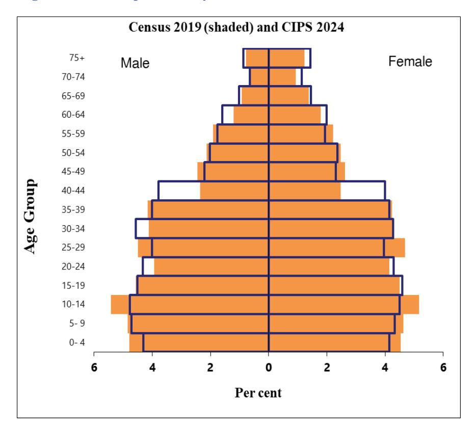

Figure 3.3.1.1. Population Pyramid, Cambodia-Total: 2019 and 2024

The urban pyramid shows a narrowing of the population in the 0-4 age group compared to the previous five years, this indicating a decrease in age group 0-4, while the 5-9 age group seems to be larger than year 2019. This may be due to the fact that during the COVID-19 lockdown, the fertility rate has slightly increased, in line with the Demographic and Health Survey 2021-22. The urban pyramid 2024 shows a decrease in youth age group both men and women from 20-39. One of the main reasons for this pattern may effected of the return of hundreds of thousands of garment factory workers to the countryside, mostly girls, due to the relocation of some garment factories during or before the survey. The pyramid also shows a sharp increase in the proportion in the 40-44 age group, which suffered from the high fertility rate or baby boom during the years (1985-1990).

Census 2019 (shaded) and CIPS 2024 75+ Female Male 70-74 65-69 60-64 50-54 45-49 40-44 35-39 30-34 25-29 20-24 15-19 10-14 5-9

0

Per cent

2

0-4

6

Figure 3.3.1.2 Population pyramid, Cambodia-Urban: 2019 and 2024

It is observed that, there is a clear difference from the urban age structure pyramid in Figure 3.3.1.3. In rural areas, there are many young and old people. In contrast, the rural pyramid is wide in the young population group and narrows at the top of the pyramid, unlike in urban areas, indicating that the fertility rate and out-migration are high. However, the fertility rate has declined compared to 2019, that is, the last 15 years. This clearly shows that rural areas have a large number of young and old people. This pattern has been noted in censuses and surveys.

2

6

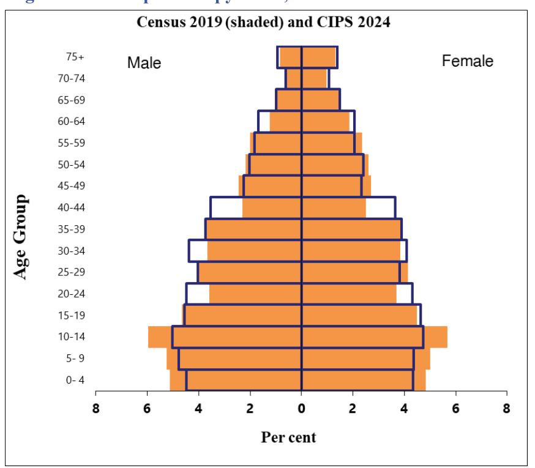

Figure 3.3.1.3 Population pyramid, Cambodia-Rural: 2019 and 2024

The age structure of the Cambodian population is transitioning towards an older age citizens, with 10.1 percent of the population aged 60 and over, up from 8.9 percent in 2019. The table shows that the median age was 28 years in 2024. The median age of the Cambodian population in 2019 was 27 years, so the median age of the population has increased by 1 year in 5 years period. This is a result of a decrease in the population aged 0-14, an increase in the rate of the population aged 60 and over between 2019 and 2024 due to a decrease in the average number of births per woman, and at the same time, an increase in the rate of age in the labor force 15-59.

The population proportions are divided into three general age groups Table 3.3.2 show a trend of decreasing in the younger age group (0-14) in the total population and increasing in the working age group (15-59). At the same time, there has been an increase in the proportion of the elderly population (60 years and above) over the haft decade 2019-2024.

Table 3.3.2. Distribution of population by broad age group, dependency ratio, median age, and sex ratio 2019-2024

| Characteristics              |       | 2019  |       |       | 2024  |       |  |  |
|------------------------------|-------|-------|-------|-------|-------|-------|--|--|
|                              | Total | Urban | Rural | Total | Urban | Rural |  |  |
| (1)                          | (2)   | (3)   | (4)   | (5)   | (6)   | (7)   |  |  |
| Total                        | 100   | 100   | 100   | 100   | 100   | 100   |  |  |
| 00-14                        | 29.4  | 25.6  | 31.8  | 26.8  | 25.5  | 27.7  |  |  |
| 15-59                        | 61.7  | 66.2  | 58.9  | 63.1  | 64.5  | 62.0  |  |  |
| 60 +                         | 8.9   | 8.2   | 9.3   | 10.1  | 9.9   | 10.3  |  |  |
| Overall Age dependency ratio | 62.0  | 51.2  | 69.9  | 58.5  | 55.0  | 61.2  |  |  |
| Median Age                   | 27    | 28    | 26    | 28    | 29    | 27    |  |  |
| Sex Ratio                    | 94.9  | 95.3  | 94.6  | 96.6  | 95.5  | 97.4  |  |  |

### 3.4. Age Dependency Rate

A simple ways to describe the age structure of population is to calculate an index called the age dependency ratio, which is a population group composition that depends on the productivity of the economically active population. It is assumed to be the number of children (0-14 years) plus the number of elderly people aged 60 and over divided by the population in the working age group (15-59) multiplied by 100.

In general, the dependency ratio in Table 3.3.2 shows a downward trend in between 2019 -2024. In 2024, it was 58.5, meaning that out of 100 population, 59 were dependent. The dependency ratio has decreased from the 2019 census, was 62. The dependency ratio in urban areas was 55 out of 100 populations in the labor force. The dependency ratio is generally higher in rural areas.

### 3.5. Sex Ratio

The age and sex information have been collected since 1998, 2008, 2019 and 2024 in Cambodia, included both male and female and produced data for almost all topics. This is a basic requirement in planning, which can help identify gender impacts in development activities.

In general, the number of male and female births does usually differ. In effect male births normally exceed the number of female births. Studies have shown that the sex ratio at birth ranges from 102 to 110 in most countries. The current estimated sex ratio at birth for Cambodia is 105.

Taken over all ages the sex ratio is 96.6 according to the present final results of the CIPS 2024. Thus the number of women is greater than number of men, reflecting a shorter life span for males. In most countries, the sex ratio is between 95 and 105. Cambodia's sex ratio has improved since 2019.

Table 3.5.1 shows the sex ratio by 5 year age groups according to the 2019 population census and CIPS 2024. Note that the sex ratio among boys in the age groups 0-4, 5-9 and 10-14 years has changed significantly between 2019 and 2024. In the age group 15-19 years, the sex ratio is almost the same for both 2019 and 2024, at a high level of around 101. The high birth rate among boys is due to the low death rate among boys continuing until the age of 25-29. In the middle and old ages, the number of women outnumbers men, possibly due to high male mortality. The low sex ratio from the age of 60 years and above is a result of high mortality among men and the exodus of older men from Cambodia during the Khmer Rouge regime.

Table 3.5.1. Distribution of population by sex ratio by broad age group, Cambodia, 2019-2024

| Broad age group | 2019  | 2024  |
|-----------------|-------|-------|
| (1)             | (2)   | (3)   |
| Total           | 94.9  | 96.6  |
| 0 - 4           | 105.9 | 103.7 |
| 5 – 9           | 104.7 | 108.9 |
| 10 – 14         | 104.7 | 106.0 |
| 15 – 19         | 101.6 | 98.5  |
| 20 – 24         | 95.0  | 100.6 |
| 25 – 29         | 95.7  | 101.1 |
| 30 – 34         | 96.0  | 106.6 |
| 35 – 39         | 97.8  | 96.9  |
| 40 – 44         | 94.9  | 95.0  |
| 45 – 49         | 93.1  | 95.6  |
| 50 – 54         | 86.4  | 85.7  |
| 55 – 59         | 85.8  | 90.9  |
| 60 +            | 6a.m  | 68.7  |

### 3.6. Marital status and age at first married

### 3.6.1. Marital status

Marital status is an important factor in population dynamics as it affects fertility, mortality and migration. Table 3.6.1 below shows the distribution of the male and female population aged 15 years and over by marital status. Responses to the question on marital status in CIPS 2024 were categorized into: never married, currently married, widowed/widowed, divorced and separated. A person is considered currently married if, by law or local custom and custom, they are recognized as married to or living with a person of the opposite sex as husband and wife.

It is observed that the proportion of the population aged 15 and over who are currently married is approximately 61.3 percent, while the proportion of the population who are not

married is 28.0 percent, and the proportion of widows/widowers, divorced, and separated is 10.7 percent. However, among widows/widowers, divorced, and separated, the percentage is higher than that of men. Compared to 2019, the proportion of the population aged 15 and over who are currently married has decreased from 66.2 percent to 61.3 percent, while the percentage of the population who have never been married has increased by only 0.5 percentage points. Similarly, the proportion of widows/widowers, divorced, and separated has increased significantly from 6.3 percent to 10.7 percent in 2024. This trend confirms the evidence that men are more likely to remarry than women in most cases due to the many factors that women have in the family, and this is almost a global phenomenon.

The proportions of never married and married males are very much higher than those for females whereas the opposition is noticed in respect of each of the categories widowed, divorced and separated (Table 3.6.1).

Table 3.6.1. Distribution of Marital Status Age 15 and above by Sex and Residence Cambodia, 2019-2024

|                |          |      | Yea    | rs       | ·     |        |
|----------------|----------|------|--------|----------|-------|--------|
| Marital Status |          | 2019 |        |          | 2024  |        |
|                | Both Sex | Male | Female | Both Sex | Male  | Female |
| (1)            | (2)      | (3)  | (4)    | (5)      | (6)   | (7)    |
| Total          | 100      | 100  | 100    | 100      | 100   | 100    |
| Never Married  | 27.5     | 31.2 | 24.1   | 28.0     | 31.5  | 24.7   |
| Married        | 66.2     | 65.9 | 66.4   | 61.3     | 63.3  | 59.4   |
| Widowed        | 4.0      | 1.5  | 6.3    | 6.3      | 2.4   | 10.0   |
| Divorced       | 2.2      | 1.3  | 3.0    | 4.0      | 2.6   | 5.4    |
| Separated      | 0.1      | 0.1  | 0.2    | 0.4      | 0.3   | 0.5    |
| Urban          | 100      | 100  | 100    | 100      | 100.0 | 100    |
| Never Married  | 31.1     | 34.3 | 28.1   | 29.9     | 33.3  | 26.8   |
| Married        | 62.5     | 62.3 | 62.7   | 58.4     | 60.8  | 56.3   |
| Widowed        | 3.7      | 1.6  | 5.7    | 6.4      | 2.4   | 10.1   |
| Divorced       | 2.5      | 1.6  | 3.3    | 4.8      | 3.1   | 6.3    |
| Separated      | 0.2      | 0.2  | 0.2    | 0.5      | 0.4   | 0.6    |
| Rural          | 100      | 100  | 100    | 100      | 100   | 100    |
| Never Married  | 24.9     | 28.9 | 21.4   | 26.6     | 30.3  | 23.2   |
| Married        | 68.8     | 68.6 | 69.0   | 63.3     | 65.1  | 61.7   |
| Widowed        | 4.2      | 1.4  | 6.7    | 6.3      | 2.3   | 10.0   |
| Divorced       | 1.9      | 1.0  | 2.7    | 3.5      | 2.1   | 4.7    |
| Separated      | 0.1      | 0.1  | 0.1    | 0.3      | 0.2   | 0.4    |

Figure 3.6.1 shows that 97.7 percent of males and 91.5 percent of females are currently not married or single in the age group 15-19. By the age of 30-34 the proportion of those never married is reduced to about 23.4 percent in the case of men as compare to 9 percent among women. Beyond the age of 50 the never married population mostly remained single throughout their life time. The extent of non-marriage in population (celibacy level) is higher for females than males in higher ages. However, the proportion of single females falls more steeply around the age of 20. The proportion of single males is very much higher than the corresponding proportion of single females in every age group below 30. From the age group 30-34 onwards the already low proportion of single males in each age group is much lower than the corresponding proportion among females for both 2019 and 2024.

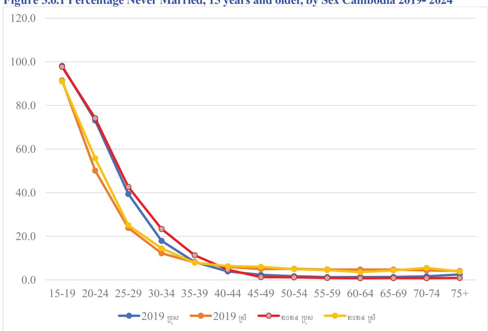

Figure 3.6.1 Percentage Never Married, 15 years and older, by Sex Cambodia 2019- 2024

In general, the age at which men marry is higher. Almost all men have married at least once in their lives. In age group 45-49, 95 percent of men are currently married, while 79.3 percent of women in the same age group are currently married. Most women marry before men. In age group 35-39, there is a turning point that shows the difference between the male and female proportions. After this age group, men have a higher proportion of married women than women, and the gap in the proportion becomes larger.

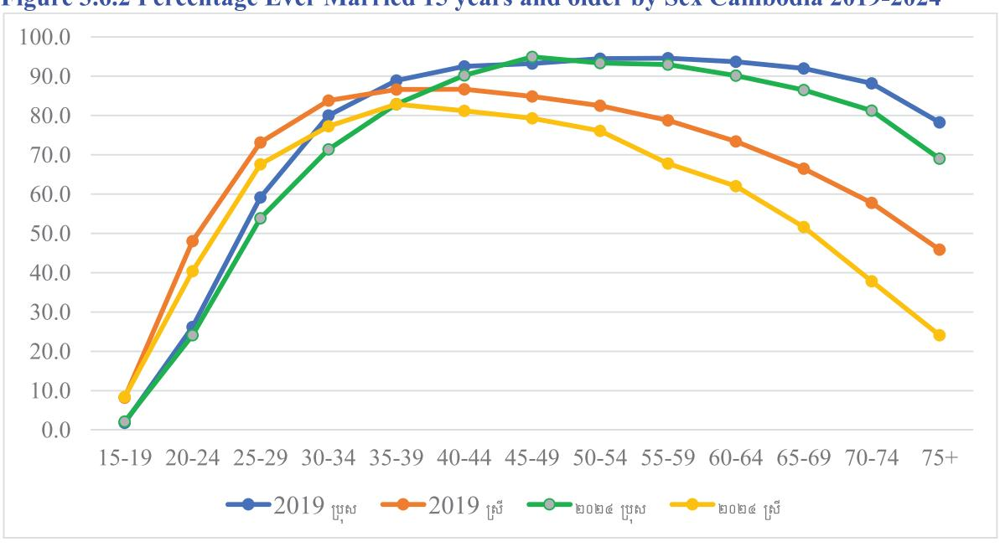

Figure 3.6.2 Percentage Ever Married 15 years and older by Sex Cambodia 2019-2024

The widowhood rate is positively correlated with age, with a slight increase in the rate with increasing age. The widowhood rate is approximately 10.7 percent of the adult population aged 15 years and over, with males accounting for 5.3 percent compared to females for 15.9 percent. In all age groups, the percentage of widows, divorced, and separated women is higher than that of men, especially in the older age groups (Table 3.6.3). The reason for this difference is generally attributed to the high mortality of men during the Khmer Rouge regime combined with the remarriage of widowed men.

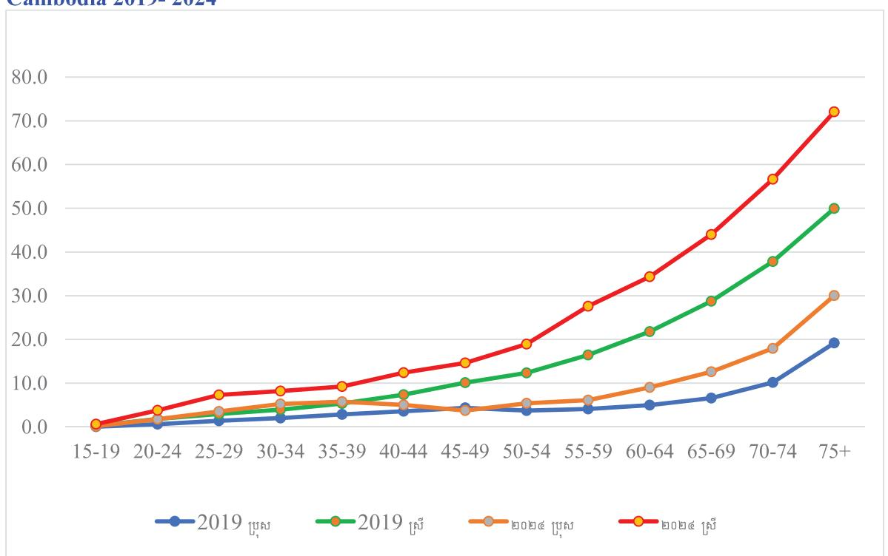

Figure 3.6.3. Percentage Widowed, Divorced and Separated 15 years and older by Sex Cambodia 2019- 2024

### 3.7. Age at first married (SMAM)

Direct questions from age of first marriage were collected from the census, but marriage recall questions were significantly different compared to indirect calculations, so the average marriage age was estimated by an indirect method from marital status data based on age. The median age of first marriage SMAM (developed by John Hajnal 1953) is an estimate of the average age of living in a group of women or men before they first married.

Singulate mean age at first marriage (SMAM) is derived from the proportion of unmarried population each age group accumulate. The relevant assumption in this calculation is the change in the proportion of unmarried from age X to X+1 is a measure of the proportion of birth in group married at age X. This method can calculate the average marriage age of population (men or women) 15 years or more before they reach 50 years. In addition, it provides an estimate of the average age of unmarried people married before the age of 50.

However, women marry at younger ages than men. The average age at marriage was 27.5 and 24.2 years for males and females respectively, calculated based on the proportion never married/single by age (SMAM). The higher proportion of young married women compared to men of the same age is a further indication that women generally marry at

younger ages than men (Table 3.7.1). As compared to 2019 the average age at marriage has increased by 0.5 years and 0.2 years for males and females respectively.

Urban-rural differential is observed in respect of SMAM. For both men and women, SMAM in urban areas is higher than in rural areas. In 2019, SMAM among urban men was higher than among rural men by 2.1 years. This differential among urban women and rural women was 3.1 years. Urban men seem to have a tendency to marry later than rural men.

Table 3.7.1. Singulate Mean Age at Marriage, Sex and Residence Cambodia, 2019-2024

|           | 0             |      |          |             |      |          |
|-----------|---------------|------|----------|-------------|------|----------|
| Residence |               | 2019 |          |             | 2024 |          |
| Residence | Male Female S |      | SMAM Gap | Male Female |      | SMAM Gap |
| (1)       | (2)           | (3)  | (4)      | (5)         | (6)  | (7)      |
| Total     | 27.0          | 24.0 | 3.0      | 27.5        | 24.2 | 3.3      |
| Urban     | 28.1          | 25.0 | 3.1      | 28.4        | 25.2 | 3.2      |
| Rural     | 26.0          | 22.7 | 3.3      | 26.9        | 23.4 | 3.5      |

### 3.8. Adolescent marriage

The proportions of teen age marriage among men and women are nearly the same both 2019 and 2024 at the national level. However, in the urban areas there is a marginal increase that is matched by a marginal decrease in the rural areas. For both men and women, the proportion married among adolescents aged 15-19 in rural areas was higher than that in urban areas (Table 3.8.1). The proportion ever married among women aged 20-24 in rural areas was almost double that in urban areas.

Table 3.8.1. Singulate Mean Age at Marriage, Proportion Ever Married by Sex, Age Group and Residence, Cambodia, 2019-2024

| residence, e | Residence, Cambodia, 2019-2024 |       |           |                |      |        |                      |       |     |  |  |
|--------------|--------------------------------|-------|-----------|----------------|------|--------|----------------------|-------|-----|--|--|
|              |                                | Male  |           |                |      | Female |                      |       |     |  |  |
| Residence    | SMAM                           | Perce | nt Ever N | <b>Iarried</b> | SMAM | Perce  | Percent Ever Married |       |     |  |  |
|              | 51111111                       | 15–19 | 20-24     | 45-49          |      | 15–19  | 20-24                | 45-49 |     |  |  |
| 2019         |                                |       |           |                |      |        |                      |       |     |  |  |
| Total        | 27.0                           | 1.8   | 26.2      | 93.3           | 24.0 | 8.2    | 48.1                 | 84.8  | 3.0 |  |  |
| Urban        | 28.1                           | 1.5   | 22.0      | 88.9           | 25.0 | 6.3    | 39.6                 | 80.7  | 3.1 |  |  |
| Rural        | 26.0                           | 2.0   | 29.7      | 96.1           | 22.7 | 9.5    | 55.3                 | 87.3  | 3.3 |  |  |
|              |                                |       |           | 20             | )24  |        |                      |       |     |  |  |
| Total        | 27.5                           | 2.3   | 25.8      | 98.7           | 24.2 | 9.0    | 44.2                 | 94.0  | 3.3 |  |  |
| Urban        | 28.4                           | 1.9   | 21.7      | 97.7           | 25.2 | 6.2    | 36.8                 | 93.4  | 3.2 |  |  |
| Rural        | 26.9                           | 2.5   | 28.6      | 99.3           | 23.4 | 10.9   | 49.4                 | 94.4  | 3.5 |  |  |

### 4.1. Introduction

Education is important for personal and national development. It is the right of every individual and is a key prerequisite for the development of human capacities. A good education reduces inequality in economic, socio-cultural, familial, interpersonal, legal, political and psychological fields. It is also a gateway to employment and is essential for decision-making. Education affects demographic behaviour related to marriage, fertility, mortality and migration, as well as participation in the labour force. Many research studies have established a negative relationship between the educational level of women and their fertility. Female age at first marriage and infant mortality are also influenced by the level of educational attainment. In general, educational attainment is indicative of the level of literacy within the population and is very important for the implementation of the development programmes and population policies.

An educated population is integral to achieving the Cambodian Sustainable Development Goals (CSDGs). With the benefit of education, individuals are in a better position to obtain formal employment and to create work for themselves and others. Education is a central component of Cambodia's National Strategic Development Plan, 2024-2028. To determine the level of education, Cambodia Inter-Censal Population Survey 2024 (CIPS) asked questions about school attendance and the highest level of education attained. These questions were addressed to all persons aged six and older. Questions about literacy and educational attainment were an important part of the questionnaire used Census 2008, 2019 and the CIPS 2024.

In order to obtain more complete data on education, the CIPS 2024 asked six questions to collect information on literacy and full-time education. The questions focused on literacy in Khmer language, literacy in other languages, school attendance, current grade enrolment, highest grade completed and the main subject of study. With the exception of the questions on current grade and major subject of study, these questions were also asked in the 2019 Census. The two new questions were included to satisfy the requirements of the national educational system.

Literacy is the ability to read and write with understanding in any language. A person is defined as literate when he/she can both read and write a simple message in a language or dialect. A person who cannot read and write a simple message in any language is considered illiterate. Persons who are only capable of reading their own name or numbers are also considered illiterate, as are those who can read but not write (or vice versa). The literacy rate is one of the most general measures of educational output and is defined as the percentage of literate people in the population of a given age. In the Census 2008, 2019 and CIPS 2024 all children aged six or under were treated as illiterate, even if they were already attending school or had picked up reading and writing a few odd words in a language.

### 4.2 .Literacy

The final results of CIPS 2024 shows that the proportion of literate persons in Khmer language among Cambodia population aged seven and older increased from 80.4 per cent in

2019 to 85.6 per cent in 2024. In the past five years, the percentage of females aged seven and over who are literate in Khmer language has increased by 4 percentage points, while the corresponding proportion among males has increased by 6 percentage points. However, there was a big male-female gap in literacy rates (86.8 percent for males and 79.4 percent for females in 2024). This gap was relatively higher in rural areas. In general, gender inequality in basic education is a major issue in Cambodia, requiring immediate attention.

Figure 4.2.1. Literacy Rate of population aged 7+ years in Khmer language by sex, Cambodia, 2019-2024

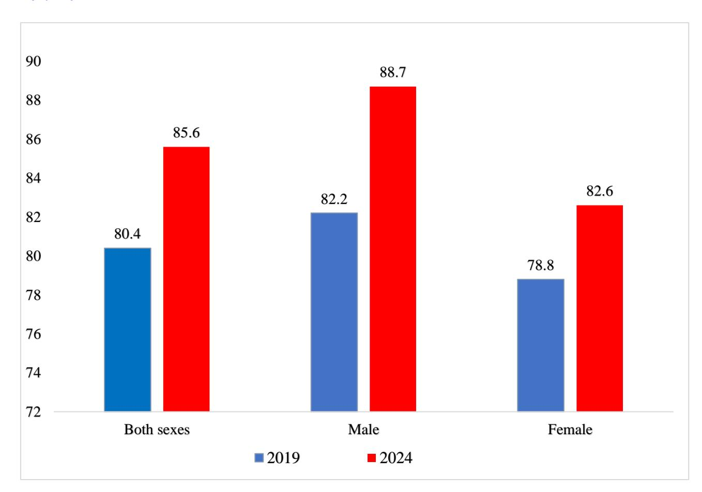

The literacy rate in Khmer are higher in urban than in rural due to the level of development between the two residence. However, currently, literacy rates in Khmer still differ between urban and rural areas.

Table 4.2.1. Literacy rate of population aged 7+ years by language, sex and residence, Cambodia, 2019-2024\*

| Destitence | Population | Literate P   | opulation  | Literate Po  | opulation |
|------------|------------|--------------|------------|--------------|-----------|
| Residence  | Aged 7 +   | Any Language | Khmer      | Any Language | Khmer     |
| (1)        | (2)        | (3)          | (4)        | (5)          | (6)       |
|            |            | 202          | 24         |              |           |
| Total      | 15,190,492 | 13,164,020   | 12,997,053 | 86.7         | 85.6      |
| Male       | 7,417,033  | 6,651,532    | 6,575,913  | 89.7         | 88.7      |
| Female     | 7,773,459  | 6,512,488    | 6,421,141  | 83.8         | 82.6      |
| Urban      | 6,344,399  | 5,721,142    | 5,653,929  | 90.2         | 89.1      |
| Male       | 3,077,145  | 2,841,333    | 2,808,820  | 92.3         | 91.3      |
| Female     | 3,267,255  | 2,879,808    | 2,845,109  | 88.1         | 87.1      |
| Rural      | 8,846,093  | 7,442,878    | 7,343,125  | 84.1         | 83.0      |
| Male       | 4,339,888  | 3,810,199    | 3,767,093  | 87.8         | 86.8      |
| Female     | 4,506,204  | 3,632,679    | 3,576,032  | 80.6         | 79.4      |
|            |            | 201          | 19         |              |           |
| Total      | 13,487,591 | 11,940,831   | 10,849,999 | 88.5         | 80.4      |
| Male       | 6,510,705  | 5,928,762    | 5,350,494  | 91.1         | 82.2      |
| Female     | 6,976,886  | 6,012,069    | 5,499,505  | 86.2         | 78.8      |
| Urban      | 5,406,567  | 5,043,456    | 4,322,931  | 93.3         | 80.0      |
| Male       | 2,618,772  | 2,485,906    | 2,097,551  | 94.9         | 80.1      |
| Female     | 2,787,795  | 2,557,550    | 2,225,380  | 91.7         | 79.8      |
| Rural      | 8,081,024  | 6,897,375    | 6,527,068  | 85.4         | 80.8      |
| Male       | 3,891,933  | 3,442,856    | 3,252,943  | 88.5         | 83.6      |
| Female     | 4,189,091  | 3,454,519    | 3,274,125  | 82.5         | 78.2      |

\*Note: Percentage of literate persons is calculated after excluding individuals for whom literacy was not reported.

As mentioned above, literacy rate in Khmer alone has increased, however literacy rate in any language among the population aged 7 and above has slightly decreased from 88.5percent in 2019 to 86.7 percent in 2024. Table 4.2.2 provides distribution of literacy rates by language, sex, and residence, Cambodia 2019-2024. Figure shows in Table 4.2.2 are not indicating the literacy rate fall down but Cambodian also known other languages. The literacy in Khmer-English has increased significantly over the past 5 years from 5.1 percent in 2019 to 11.7 percent in 2024. This trend is observed in both urban and rural areas. Similarly, the proportion of people who can read and write Khmer and languages other than English has increased from 2.5 percent in 2019 to 4.8 percent in 2024.

Table 4.2.2. Distribution of literate population aged 7+ years by language, sex and area, Cambodia, 2019-2024

|           |                        |                           | Lite                 | racy rate (%)*                                 |                                        |
|-----------|------------------------|---------------------------|----------------------|------------------------------------------------|----------------------------------------|
| Residence | Population Aged 7 + | Khmer Language Only | Khmer and English | Khmer and Other Languages Except English | Any Language Other Than Khmer |
| (1)       | (2)                    | (3)                       | (4)                  | (5)                                            | (6)                                    |
|           |                        | 20                        | 24                   |                                                |                                        |
| Total     | 13,164,020             | 82.2                      | 11.7                 | 4.8                                            | 1.3                                    |
| Male      | 6,651,532              | 81.6                      | 12.3                 | 4.9                                            | 1.1                                    |
| Female    | 6,512,488              | 82.8                      | 11.2                 | 4.6                                            | 1.4                                    |
| Urban     | 5,721,142              | 76.4                      | 16.8                 | 5.6                                            | 1.2                                    |
| Male      | 2,841,333              | 75.3                      | 18.2                 | 5.4                                            | 1.1                                    |
| Female    | 2,879,808              | 77.5                      | 15.4                 | 5.9                                            | 1.2                                    |
| Rural     | 7,442,878              | 86.7                      | 7.9                  | 4.1                                            | 1.3                                    |
| Male      | 3,810,199              | 86.4                      | 7.9                  | 4.6                                            | 1.1                                    |
| Female    | 3,632,679              | 87.0                      | 7.8                  | 3.7                                            | 1.6                                    |
|           |                        | 20                        | 19                   |                                                |                                        |
| Total     | 11,940,831             | 90.9                      | 5.1                  | 2.5                                            | 1.5                                    |
| Male      | 5,928,762              | 90.2                      | 5.5                  | 2.7                                            | 1.5                                    |
| Female    | 6,012,069              | 91.5                      | 4.6                  | 2.4                                            | 1.5                                    |
| Urban     | 5,043,456              | 85.7                      | 9.2                  | 2.8                                            | 2.3                                    |
| Male      | 2,485,906              | 84.4                      | 10.1                 | 3.0                                            | 2.5                                    |
| Female    | 2,557,550              | 87.0                      | 8.2                  | 2.7                                            | 2.1                                    |
| Rural     | 6,897,375              | 94.6                      | 2.1                  | 2.3                                            | 0.9                                    |
| Male      | 3,442,856              | 94.5                      | 2.2                  | 2.5                                            | 0.8                                    |
| Female    | 3,454,519              | 94.8                      | 2.0                  | 2.2                                            | 1.0                                    |

\*Note: Percentage of literate persons is calculated after excluding individuals for whom literacy was not reported.

### 4.3 .Adult Literacy

The adult literacy rate or the literacy rate of the population aged 15 and over, increased at the national level in the period 2019-2024 (Table 4.3.1). In rural, the adult literacy rate be substantially constant (83.8 percent in 2019 to 82.9 percent in 2024), females registering a high percentage point decrease than males between 2019-2024. In urban areas, the adult literacy rate was already 93.3 per cent in 2019 but minor drop to 90.0 per cent in 2024.

The data indicate that literacy rates in Cambodia have improved substantially in the haft decade. The younger the age group, the higher the literacy rate and the narrower the male-female gap. The male and female literacy rates are very close to each other for younger age groups but are wider in the age groups starting around 25 years and older. This pattern reflects the past educational disadvantage experienced by women relative to men and shows how this sex disparity has reduced in recent years.

Table 4.3.1. Adult literacy rate aged 15+ years by age group, sex and area, Cambodia, 2019-2024\*

| Age Group |               | 2019 |        |            | 2024 |        |
|-----------|---------------|------|--------|------------|------|--------|
|           | Both Sexes | Male | Female | Both Sexes | Male | Female |
| (1)       | (2)           | (3)  | (4)    | (5)        | (6)  | (7)    |
|           |               | ·    | Total  |            | ·    |        |
| 15 +      | 87.7          | 90.9 | 84.8   | 85.9       | 89.7 | 82.4   |
| 15-19     | 95.9          | 95.5 | 96.3   | 96.5       | 95.7 | 97.2   |
| 20-24     | 93.4          | 93.2 | 93.5   | 94.7       | 93.6 | 95.8   |
| 25-59     | 87.5          | 90.3 | 84.8   | 86.1       | 89.3 | 82.9   |
| 60 +      | 75.2          | 85.9 | 68.1   | 68.4       | 81.2 | 59.6   |
|           |               |      | Urban  |            | •    |        |
| 15 +      | 93.3          | 95.3 | 91.4   | 90.0       | 92.8 | 87.4   |
| 15-19     | 97.6          | 97.3 | 97.9   | 97.3       | 96.5 | 98.1   |
| 20-24     | 96.7          | 96.5 | 96.8   | 96.0       | 95.1 | 96.9   |
| 25-59     | 93.6          | 95.3 | 92.0   | 90.6       | 92.7 | 88.6   |
| 60 +      | 82.6          | 90.8 | 77.0   | 75.5       | 87.1 | 67.8   |
|           |               |      | Rural  |            |      |        |
| 15 +      | 83.8          | 87.8 | 80.2   | 82.9       | 87.5 | 78.7   |
| 15-19     | 94.8          | 94.4 | 95.3   | 95.9       | 95.1 | 96.6   |
| 20-24     | 90.6          | 90.5 | 90.7   | 93.8       | 92.7 | 95.0   |
| 25-59     | 83.0          | 86.6 | 79.6   | 82.6       | 86.8 | 78.5   |
| 60 +      | 71.0          | 83.1 | 63.1   | 63.5       | 77.3 | 53.9   |

\*Note: Percentage of literate persons is calculated after excluding individuals for whom literacy was not reported.

### 4.4 .Educational Level

Educational attainment is an important indicator of population development. The CIPS 2024 collected data on the highest grade completed by those who ever attended a school or an educational institution, as well as the grade of those currently attending a school or educational institution. The following analysis relates to those who have reported a completed level of education. In terms of years of study, the categorization is as follows: 1= None (0 and 88), 2= Primary Not Completed: (1 to 5), 3= Primary: (6 to 8), 4= Lower Secondary: (9 to 13), 5= Secondary/ diploma [Secondary School/Baccalaureate, Technical Diploma/Pre-Secondary and Technical Diploma/Post-Secondary] (14 to 18) and 6= Beyond Secondary [Undergraduate and Graduate/Degree Holder] (19 to 21) and 7= Others 22.

Figure 4.4.1. Educational attainment of literate population aged 7+ years by educational level, Cambodia, 2019-2024

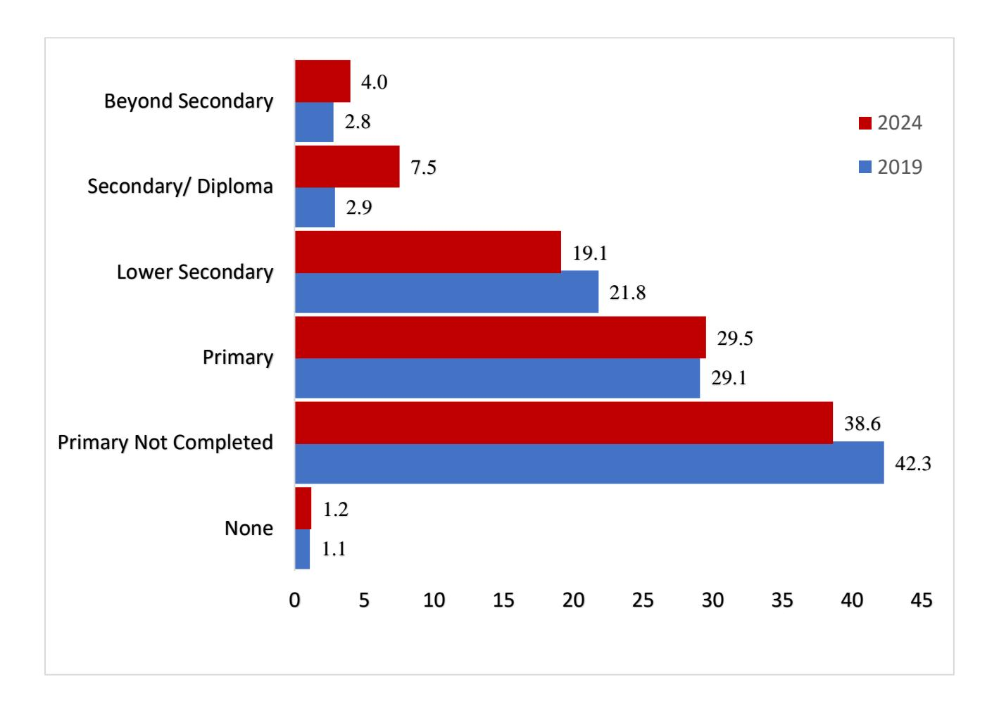

At the national level, the final results CIPS 2024 show that 29,5 per cent of those who ever attended school or educational institution had completed primary education, 19.1 percent had completed lower secondary education, 7.5 percent had received the secondary/ diploma and 4.0 percent had completed education beyond secondary level (Table 4.4.1). About 38.6 percent reported not having completed primary school, while a small proportion of the literate population (1.2 per cent) had become literate without any formal education. Compared to 2019 Census, there has been improved in educational attainment in population. The proportion of the literate population who did not complete primary education decreased from 42.3 per cent to 38.6 percent in 2024. For those who completed secondary/diploma remarkable increased from 2.9 percent to 7.5 percent. Finally, the proportion that had completed beyond secondary level education increased from 2.8 percent to 4.0 percent.

Table~4.4.1.~Educational~attainment~of~literate~population~aged~7+~years~by~age~group,~educational~level,~sex~and~residence~Cambodia,~2019-2024\*

|             |            |       |      | Ed                          | ucational Le | vel                |                       |                     |
|-------------|------------|-------|------|-----------------------------|--------------|--------------------|-----------------------|---------------------|
| Residence   | Number     | Total | None | Primary Not Completed | Primary      | Lower Secondary | Secondary/ Diploma | Beyond Secondary |
| (1)         | (2)        | (3)   | (4)  | (5)                         | (6)          | (7)                | (8)                   | (9)                 |
|             | ,          |       |      | 2024                        |              |                    | 1                     |                     |
| Both Senses | 12,949,737 | 100   | 1.2  | 38.6                        | 29.5         | 19.1               | 7.5                   | 4.0                 |
| 7-14        | 2,279,262  | 100   | 5.4  | 73.4                        | 20.6         | 0.5                | 0.0                   | 0.0                 |
| 15-19       | 1,512,537  | 100   | 0.4  | 13.5                        | 40.0         | 39.2               | 6.8                   | 0.3                 |
| 20-24       | 1,401,378  | 100   | 0.1  | 15.5                        | 30.3         | 26.1               | 23.4                  | 4.5                 |
| 25-59       | 6,626,060  | 100   | 0.2  | 32.9                        | 31.7         | 20.5               | 7.9                   | 6.6                 |
| 60 +        | 1,130,500  | 100   | 1.1  | 64.0                        | 19.8         | 12.5               | 1.7                   | 0.8                 |
| Male        | 6,569,036  | 100   | 1.3  | 36.6                        | 29.4         | 19.9               | 7.9                   | 4.9                 |
| 7-14        | 1,166,551  | 100   | 6.3  | 74.7                        | 18.6         | 0.5                | 0.0                   | 0.0                 |
| 15-19       | 743,506    | 100   | 0.4  | 15.8                        | 41.9         | 35.6               | 6.1                   | 0.2                 |
| 20-24       | 694,679    | 100   | 0.0  | 17.6                        | 30.2         | 25.3               | 22.9                  | 4.0                 |
| 25-59       | 3,401,561  | 100   | 0.2  | 28.9                        | 31.1         | 22.6               | 8.9                   | 8.3                 |
| 60 +        | 562,738    | 100   | 0.7  | 55.2                        | 24.0         | 16.5               | 2.3                   | 1.2                 |
| Female      | 6,380,701  | 100   | 1.1  | 40.7                        | 29.7         | 18.3               | 7.2                   | 3.1                 |
| 7-14        | 1,112,712  | 100   | 4.4  | 72.1                        | 22.8         | 0.6                | 0.0                   | 0.0                 |
| 15-19       | 769,031    | 100   | 0.3  | 11.2                        | 38.0         | 42.7               | 7.4                   | 0.3                 |
| 20-24       | 706,698    | 100   | 0.1  | 13.6                        | 30.4         | 26.9               | 23.9                  | 5.0                 |
| 25-59       | 3,224,498  | 100   | 0.3  | 37.2                        | 32.3         | 18.4               | 7.0                   | 4.9                 |
| 60 +        | 567,762    | 100   | 1.4  | 72.8                        | 15.6         | 8.6                | 1.2                   | 0.4                 |
| Urban       | 5,630,948  | 100   | 1.3  | 32.6                        | 28.7         | 21.3               | 9.9                   | 6.3                 |
| 7-14        | 904,241    | 100   | 5.7  | 73.2                        | 20.8         | 0.4                | 0.0                   | 0.0                 |
| 15-19       | 625,136    | 100   | 0.7  | 10.0                        | 37.5         | 42.6               | 8.8                   | 0.5                 |
| 20-24       | 573,326    | 100   | 0.1  | 11.8                        | 25.6         | 26.5               | 29.2                  | 6.8                 |
| 25-59       | 3,015,137  | 100   | 0.3  | 24.9                        | 30.7         | 23.3               | 10.6                  | 10.1                |
| 60 +        | 513,108    | 100   | 1.1  | 56.9                        | 23.3         | 14.5               | 2.6                   | 1.6                 |
| Male        | 7,318,789  | 100   | 1.1  | 43.3                        | 30.2         | 17.4               | 5.8                   | 2.2                 |
| 7-14        | 1,375,022  | 100   | 5.2  | 73.6                        | 20.5         | 0.6                | 0.0                   | 0.0                 |
| 15-19       | 887,401    | 100   | 0.1  | 16.0                        | 41.7         | 36.8               | 5.3                   | 0.1                 |
| 20-24       | 828,052    | 100   | 0.0  | 18.2                        | 33.6         | 25.9               | 19.4                  | 3.0                 |
| 25-59       | 3,610,923  | 100   | 0.1  | 39.7                        | 32.5         | 18.2               | 5.7                   | 3.7                 |
| 60 +        | 617,392    | 100   | 1.0  | 69.9                        | 16.9         | 10.9               | 1.1                   | 0.2                 |
| Female      | 12,949,737 | 100   | 1.2  | 38.6                        | 29.5         | 19.1               | 7.5                   | 4.0                 |
| 7-14        | 2,279,262  | 100   | 5.4  | 73.4                        | 20.6         | 0.5                | 0.0                   | 0.0                 |
| 15-19       | 1,512,537  | 100   | 0.4  | 13.5                        | 40.0         | 39.2               | 6.8                   | 0.3                 |
| 20-24       | 1,401,378  | 100   | 0.1  | 15.5                        | 30.3         | 26.1               | 23.4                  | 4.5                 |
| 25-59       | 6,626,060  | 100   | 0.2  | 32.9                        | 31.7         | 20.5               | 7.9                   | 6.6                 |
| 60 +        | 1,130,500  | 100   | 1.1  | 64.0                        | 19.8         | 12.5               | 1.7                   | 0.8                 |
| Rural       | 6,569,036  | 100   | 1.3  | 36.6                        | 29.4         | 19.9               | 7.9                   | 4.9                 |
| 7-14        | 1,166,551  | 100   | 6.3  | 74.7                        | 18.6         | 0.5                | 0.0                   | 0.0                 |
| 15-19       | 743,506    | 100   | 0.4  | 15.8                        | 41.9         | 35.6               | 6.1                   | 0.2                 |
| 20-24       | 694,679    | 100   | 0.0  | 17.6                        | 30.2         | 25.3               | 22.9                  | 4.0                 |
| 25-59       | 3,401,561  | 100   | 0.2  | 28.9                        | 31.1         | 22.6               | 8.9                   | 8.3                 |
| 60 +        | 562,738    | 100   | 0.7  | 55.2                        | 24.0         | 16.5               | 2.3                   | 1.2                 |
| Male        | 6,380,701  | 100   | 1.1  | 40.7                        | 29.7         | 18.3               | 7.2                   | 3.1                 |

|             |            |       |      | Ed                    | ucational Lev | vel                |                       |                     |
|-------------|------------|-------|------|-----------------------|---------------|--------------------|-----------------------|---------------------|
| Residence   | Number     | Total | None | Primary Not Completed | Primary       | Lower Secondary | Secondary/ Diploma | Beyond Secondary |
| (1)         | (2)        | (3)   | (4)  | (5)                   | (6)           | (7)                | (8)                   | (9)                 |
| 7-14        | 1,112,712  | 100   | 4.4  | 72.1                  | 22.8          | 0.6                | 0.0                   | 0.0                 |
| 15-19       | 769,031    | 100   | 0.3  | 11.2                  | 38.0          | 42.7               | 7.4                   | 0.3                 |
| 20-24       | 706,698    | 100   | 0.1  | 13.6                  | 30.4          | 26.9               | 23.9                  | 5.0                 |
| 25-59       | 3,224,498  | 100   | 0.3  | 37.2                  | 32.3          | 18.4               | 7.0                   | 4.9                 |
| 60 +        | 567,762    | 100   | 1.4  | 72.8                  | 15.6          | 8.6                | 1.2                   | 0.4                 |
| Female      | 5,630,948  | 100   | 1.3  | 32.6                  | 28.7          | 21.3               | 9.9                   | 6.3                 |
| 7-14        | 904,241    | 100   | 5.7  | 73.2                  | 20.8          | 0.4                | 0.0                   | 0.0                 |
| 15-19       | 625,136    | 100   | 0.7  | 10.0                  | 37.5          | 42.6               | 8.8                   | 0.5                 |
| 20-24       | 573,326    | 100   | 0.1  | 11.8                  | 25.6          | 26.5               | 29.2                  | 6.8                 |
| 25-59       | 3,015,137  | 100   | 0.3  | 24.9                  | 30.7          | 23.3               | 10.6                  | 10.1                |
| 60 +        | 513,108    | 100   | 1.1  | 56.9                  | 23.3          | 14.5               | 2.6                   | 1.6                 |
|             |            |       |      | 2019                  |               |                    |                       |                     |
| Both Senses | 11,488,934 | 100   | 1.1  | 42.3                  | 29.1          | 21.8               | 2.9                   | 2.8                 |
| 7-14        | 2,272,206  | 100   | 5.5  | 74.3                  | 19.6          | 0.6                | 0.0                   | 0.0                 |
| 15-19       | 1,324,839  | 100   | 0.2  | 16.7                  | 40.8          | 39.9               | 2.4                   | 0.0                 |
| 20-24       | 1,137,909  | 100   | 0.1  | 22.0                  | 31.9          | 33.5               | 9.3                   | 3.2                 |
| 25-59       | 5,805,767  | 100   | 0.0  | 37.5                  | 30.5          | 24.0               | 3.1                   | 4.8                 |
| 60 +        | 948,213    | 100   | 0.0  | 55.2                  | 23.8          | 19.0               | 1.0                   | 0.9                 |
| Male        | 5,732,187  | 100   | 1.2  | 39.7                  | 29.1          | 23.4               | 3.2                   | 3.5                 |
| 7-14        | 1,154,444  | 100   | 5.8  | 75.3                  | 18.3          | 0.6                | 0.0                   | 0.0                 |
| 15-19       | 664,070    | 100   | 0.2  | 18.5                  | 41.2          | 37.9               | 2.1                   | 0.0                 |
| 20-24       | 552,894    | 100   | 0.1  | 22.2                  | 30.8          | 34.3               | 9.7                   | 3.0                 |
| 25-59       | 2,916,669  | 100   | 0.0  | 32.5                  | 30.5          | 27.3               | 3.7                   | 6.0                 |
| 60 +        | 444,110    | 100   | 0.0  | 47.9                  | 27.7          | 21.5               | 1.4                   | 1.4                 |
| Female      | 5,756,747  | 100   | 1.1  | 44.8                  | 29.2          | 20.2               | 2.5                   | 2.2                 |
| 7-14        | 1,117,762  | 100   | 5.2  | 73.2                  | 20.8          | 0.7                | 0.0                   | 0.0                 |
| 15-19       | 660,769    | 100   | 0.2  | 14.8                  | 40.5          | 41.8               | 2.7                   | 0.0                 |
| 20-24       | 585,015    | 100   | 0.0  | 21.8                  | 33.0          | 32.8               | 8.9                   | 3.5                 |
| 25-59       | 2,889,098  | 100   | 0.0  | 42.5                  | 30.6          | 20.8               | 2.5                   | 3.6                 |
| 60 +        | 504,103    | 100   | 0.0  | 61.7                  | 20.3          | 16.8               | 0.7                   | 0.5                 |
| Urban       | 4,879,712  | 100   | 0.9  | 32.9                  | 28.0          | 27.7               | 4.8                   | 5.7                 |
| 7-14        | 774,898    | 100   | 5.2  | 72.7                  | 21.2          | 0.8                | 0.0                   | 0.0                 |
| 15-19       | 524,327    | 100   | 0.2  | 13.3                  | 36.3          | 45.6               | 4.6                   | 0.0                 |
| 20-24       | 538,721    | 100   | 0.0  | 16.3                  | 27.5          | 36.5               | 14.2                  | 5.5                 |
| 25-59       | 2,657,622  | 100   | 0.0  | 26.6                  | 28.9          | 30.8               | 4.7                   | 9.0                 |
| 60 +        | 384,144    | 100   | 0.0  | 46.3                  | 25.5          | 24.0               | 2.0                   | 2.1                 |
| Male        | 2,414,609  | 100   | 0.9  | 30.0                  | 27.1          | 29.7               | 5.3                   | 6.9                 |
| 7-14        | 394,016    | 100   | 5.5  | 73.6                  | 20.2          | 0.7                | 0.0                   | 0.0                 |
| 15-19       | 258,856    | 100   | 0.2  | 14.4                  | 36.7          | 44.4               | 4.3                   | 0.0                 |
| 20-24       | 258,707    | 100   | 0.1  | 16.1                  | 26.0          | 37.7               | 15.1                  | 5.1                 |
| 25-59       | 1,328,788  | 100   | 0.0  | 21.7                  | 27.4          | 34.2               | 5.6                   | 11.1                |
| 60 +        | 174,242    | 100   | 0.0  | 38.9                  | 28.0          | 26.9               | 2.8                   | 3.4                 |
| Female      | 2,465,103  | 100   | 0.8  | 35.7                  | 28.9          | 25.8               | 4.3                   | 4.4                 |
| 7-14        | 380,882    | 100   | 5.0  | 71.8                  | 22.3          | 0.9                | 0.0                   | 0.0                 |
| 15-19       | 265,471    | 100   | 0.2  | 12.2                  | 35.8          | 46.8               | 5.0                   | 0.0                 |

|           |           |       |      | Ed                          | ucational Lev | vel                |                       |                     |
|-----------|-----------|-------|------|-----------------------------|---------------|--------------------|-----------------------|---------------------|
| Residence | Number    | Total | None | Primary Not Completed | Primary       | Lower Secondary | Secondary/ Diploma | Beyond Secondary |
| (1)       | (2)       | (3)   | (4)  | (5)                         | (6)           | (7)                | (8)                   | (9)                 |
| 20-24     | 280,014   | 100   | 0.0  | 16.5                        | 28.8          | 35.4               | 13.3                  | 5.9                 |
| 25-59     | 1,328,834 | 100   | 0.0  | 31.5                        | 30.3          | 27.4               | 3.9                   | 6.8                 |
| 60 +      | 209,902   | 100   | 0.0  | 52.5                        | 23.5          | 21.6               | 1.4                   | 1.0                 |
| Rural     | 6,609,222 | 100   | 1.3  | 49.2                        | 29.9          | 17.3               | 1.4                   | 0.8                 |
| 7-14      | 1,497,308 | 100   | 5.7  | 75.1                        | 18.7          | 0.5                | 0.0                   | 0.0                 |
| 15-19     | 800,512   | 100   | 0.3  | 18.9                        | 43.8          | 36.1               | 0.9                   | 0.0                 |
| 20-24     | 599,188   | 100   | 0.1  | 27.1                        | 36.0          | 30.8               | 4.9                   | 1.1                 |
| 25-59     | 3,148,145 | 100   | 0.0  | 46.7                        | 31.9          | 18.3               | 1.7                   | 1.4                 |
| 60 +      | 564,069   | 100   | 0.0  | 61.3                        | 22.6          | 15.6               | 0.4                   | 0.1                 |
| Male      | 3,317,578 | 100   | 1.4  | 46.8                        | 30.5          | 18.8               | 1.6                   | 1.0                 |
| 7-14      | 760,428   | 100   | 6.0  | 76.1                        | 17.4          | 0.5                | 0.0                   | 0.0                 |
| 15-19     | 405,214   | 100   | 0.3  | 21.2                        | 44.0          | 33.8               | 0.8                   | 0.0                 |
| 20-24     | 294,187   | 100   | 0.1  | 27.6                        | 35.0          | 31.3               | 4.9                   | 1.0                 |
| 25-59     | 1,587,881 | 100   | 0.0  | 41.6                        | 33.0          | 21.5               | 2.1                   | 1.8                 |
| 60 +      | 269,868   | 100   | 0.0  | 53.6                        | 27.6          | 18.0               | 0.6                   | 0.1                 |
| Female    | 3,291,644 | 100   | 1.2  | 51.7                        | 29.4          | 15.9               | 1.2                   | 0.6                 |
| 7-14      | 736,880   | 100   | 5.4  | 73.9                        | 20.1          | 0.6                | 0.0                   | 0.0                 |
| 15-19     | 395,298   | 100   | 0.2  | 16.6                        | 43.6          | 38.5               | 1.1                   | 0.0                 |
| 20-24     | 305,001   | 100   | 0.0  | 26.6                        | 36.9          | 30.4               | 4.9                   | 1.2                 |
| 25-59     | 1,560,264 | 100   | 0.0  | 51.8                        | 30.8          | 15.1               | 1.4                   | 0.9                 |
| 60 +      | 294,201   | 100   | 0.0  | 68.3                        | 18.1          | 13.4               | 0.2                   | 0.0                 |

\*Note: Percentage is calculated after excluding those with missing data on educational level and other variables.

Table 4.4.1 shows that 73.4 percent of the population aged 7-14 years did not complete primary education, 20.6 percent completed primary education. The 15-19 year old group should generally complete lower secondary education. However, 13.5 percent of the 15-19 year old group has not completed primary education, either due to late enrollment or skipping grades or dropping out. In the same 15-19year old group, 40.0 percent and 39.2 percent completed primary and lower secondary education, respectively.

Among the population aged 20-24, 15.5 percent did not complete primary education, 30.3 percent completed primary education, 26.1 percent completed secondary education/diploma (secondary school/secondary school diploma, technical/vocational secondary school diploma, technical/vocational secondary school diploma) 23.4 and 4.5 percent completed post-secondary education (college degree, master's degree, and doctoral degree), respectively. The literacy rate of the population aged 25 and above is to be observed overwhelmingly higher than that of those who did not complete primary education. Compared to 2019, the educational level of the population has improved significantly due to a significant decrease in the rate of non-enrollment and completion of upper secondary education/diploma and post-secondary education, with a higher proportion of males than females.

### **Technical and vocational Training**

The Cambodian Inter-Censal Population Survey 2024 included question on technical and vocational qualifications recommended by the Ministry of Labor and Vocational Training. Qualifications for admission to Technical and Vocational Qualification Level 1 (completed grade 9 of primary school) or completed an equivalent bridging course or have a vocational certificate, including at least 1 year of work experience (but must pass a test). Technical and Vocational Qualification Level 2 Qualifications for admission to Technical and Vocational Qualification Level 2, while having a Technical and Vocational Qualification Level 1. Technical and Vocational Qualification Level 3, only if having a Technical and Vocational Qualification Level 2 or having a Technical and Vocational Qualification Level 2, including 2 years of work experience in the same subject, allowing admission to the test. Through the data collection from CIPS 2024, shown that among the population aged 17 and over, who are currently in technical and vocational training at level 1, level 2, and level 3 approximately (1,657, 1,012, and 4,860, respectively).

In particular, those who had completed technical and vocational certificates at level 1, 2, and level 3 among the population aged 17 and over were approximately (9,260, 6,937, and 29,250, respectively).

### 4.5 .School Attendance

The question on school attendance was addressed to both literate and illiterate persons. This question also included to those children under aged 6 years old. The answer to this question was categorized as (i) "never attended" (for those who had never at any time received full-time education), (ii) "now" (for those who were still receiving full-time education at the time of the survey) and (iii) "past" (for those who had received full-time education in the past).

Based on question of whether a person was currently attending school from CIPS 2024, the final results showed that the percentage of people currently attending school has been decreasing as the age group increases such 94.1 per cent and 80.8 percent of the 6-11 and 12-14 age groups responded positively.

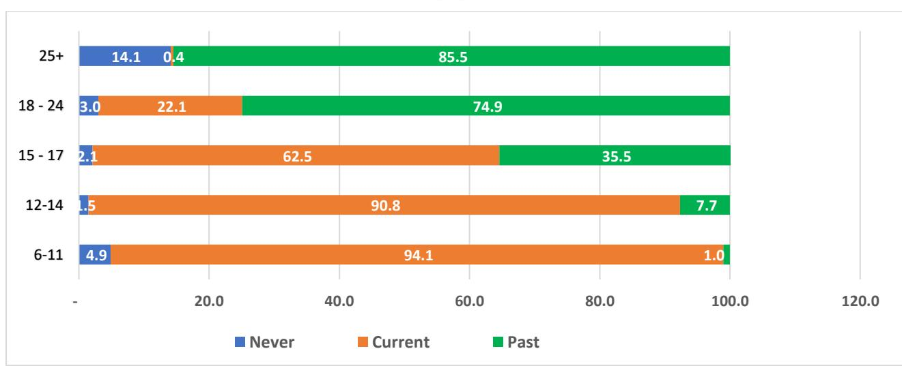

Figure 4.5.1. Distribution of school attendance for population aged 6+ years, Cambodia, 2024

The proportions of current attending school are smaller for each age group as compared to age group 6-11 in 2024 (Table 4.5.1). The current enrolment rates drastically decline from age 15 onwards, as more and more students drop out of school. Less than a quarter of the 25-year-old group have never attended any school or educational institution. The current school attendance rate for girls is slightly higher than for boys in all age groups, which is a good indicator of gender in education. Table 4.5.1 also shows that more children in urban rather than rural areas were currently attending school at all ages.

Table 4.5.1. Distribution of school attendance of population aged 6+ years by sex, age and residence, Cambodia, 2019-2024\*

| Age Group         | Schoo | ol Attendance 20 | 19   | Schoo | ol Attendance 20 | 24   |
|-------------------|-------|------------------|------|-------|------------------|------|
|                   | Never | Current          | Past | Never | Current          | Past |
| (1)               | (2)   | (3)              | (4)  | (5)   | (6)              | (7)  |
| <b>Both Sexes</b> | 12.5  | 25.8             | 61.6 | 9.9   | 24.2             | 65.9 |
| 06 - 11           | 8.0   | 90.6             | 1.4  | 4.9   | 94.1             | 1.0  |
| 12 - 14           | 2.8   | 91.6             | 5.6  | 1.5   | 90.8             | 7.7  |
| 15 - 17           | 4.5   | 67.6             | 27.9 | 2.1   | 62.5             | 35.5 |
| 18 - 24           | 7.5   | 20.7             | 71.8 | 3.0   | 22.1             | 74.9 |
| 25+               | 16.5  | 0.7              | 82.7 | 14.1  | 0.4              | 85.5 |
| Male              | 9.9   | 27.2             | 62.9 | 7.1   | 25.0             | 67.8 |
| 06 - 11           | 8.4   | 90.1             | 1.5  | 5.3   | 93.3             | 1.4  |
| 12 - 14           | 3.2   | 90.4             | 6.4  | 1.9   | 88.6             | 9.4  |
| 15 - 17           | 5.0   | 66.2             | 28.8 | 2.5   | 60.5             | 37.0 |
| 18 - 24           | 7.8   | 22.1             | 70.1 | 3.5   | 21.5             | 75.0 |
| 25+               | 12.2  | 0.8              | 86.9 | 9.4   | 0.6              | 90.0 |
| Female            | 14.9  | 24.6             | 60.5 | 12.6  | 23.4             | 64.0 |
| 06 - 11           | 7.6   | 91.1             | 1.3  | 4.3   | 95.0             | 0.7  |
| 12 - 14           | 2.4   | 92.8             | 4.7  | 1.0   | 93.0             | 6.0  |
| 15 - 17           | 3.9   | 69.1             | 27.0 | 1.6   | 64.4             | 34.0 |
| 18 - 24           | 7.4   | 19.3             | 73.3 | 2.5   | 22.7             | 74.8 |
| 25+               | 20.4  | 0.6              | 79.0 | 18.3  | 0.2              | 81.4 |
| Urban             | 7.9   | 24.0             | 68.1 | 7.0   | 24.5             | 68.4 |
| 06 - 11           | 6.8   | 91.5             | 1.7  | 5.1   | 93.8             | 1.1  |
| 12 - 14           | 2.2   | 92.1             | 5.7  | 1.2   | 92.4             | 6.4  |
| 15 - 17           | 3.1   | 69.1             | 27.8 | 1.5   | 69.6             | 28.8 |
| 18 - 24           | 4.4   | 25.3             | 70.3 | 2.1   | 28.2             | 69.7 |
| 25+               | 9.9   | 1.0              | 89.0 | 9.5   | 0.5              | 90.0 |
| Rural             | 15.6  | 27.1             | 57.3 | 12.0  | 24.0             | 64.0 |
| 06 - 11           | 8.7   | 90.2             | 1.2  | 4.7   | 94.3             | 1.0  |
| 12 - 14           | 3.1   | 91.4             | 5.5  | 1.7   | 89.7             | 8.6  |
| 15 - 17           | 5.3   | 66.7             | 28.0 | 2.4   | 57.4             | 40.2 |
| 18 - 24           | 10.1  | 17.0             | 72.9 | 3.6   | 18.0             | 78.4 |
| 25+               | 21.2  | 0.5              | 78.3 | 17.5  | 0.4              | 82.1 |

### 5.1. Introduction

Analyzing the economic activity of the Cambodia population is key to designing good economic policies and development plans. This is mainly due to the fact that these policies and plans relate to issues such as improving manpower capacity, increasing productivity and minimizing unemployment and under-employment.

The main objective of the GPCC 2019 questions was to classify the population into two categories: the economically active (those who participate in the labour force) and the economically inactive (those who are outside the labour force). Further questions were asked to facilitate the disaggregation of the employed population by major industrial and occupational groups, as well as by sector and employment status.

The Cambodia Inter-censal Population Survey 2024 (CIPS) was collected information on employment status all individual aged 5 and above. the questionnaire are related included:

colum 6: Main activity

colum 7: Type of occupation /employment

colum 8: employment status

colum 9: Nature of Economic Activity (Agriculture, Industry, Trade or Service)

colum 10: Section of Employment

The Cambodia Inter-censal Population Survey 2024 (CIPS) was period preceding May 3rd 2024. The reference period for labor and employment data collection was the twelvementh period preceding. A person was regarded as having worked if he/she had worked at least six months (183 days) or more during reference period. The terms "economically active population" or "labour force" refer to all individuals who are employed or unemployed.

Employed persons included: (1) persons who were in paid employment in public or private organizations; (2) persons who did some work for wages, salary, profit or for family gains in cash or kind during the reference period; (3) persons who did not do any work for pay or profit during the reference period, although they had a job to which they could return (e.g. off-season workers like farmers or fishermen), those on sick leave or on leave without pay, those who could not work due to a strike or lockout in the organization where they work; and (4) persons who were selfemployed (e.g. shop owners, food/drink sellers, individuals practicing as doctors or lawyers).

Inactive persons included: (1) homemakers (i.e. referring to persons mostly engaged in household duties in his/her home during the reference period); (2) students (i.e. individuals primarily attending a school or educational institution); and (3) dependents (i.e. infants and children not attending school, permanently disabled persons who cannot do any work and persons who cannot work because of illness or old age). This category also includes individuals who cannot be categorized in any of the inactive categories and is dependent on others. However, if such a person was seeking or available for work, he/ she was categorized as unemployed and not as dependent. Category (4) included those who had retired from formal or informal employment and were mainly not doing other work (i.e. those who were

mostly not in any kind of employment or engaged in some other type of work such as cultivation, business, trade etc.). This also included those living on agricultural or non-agricultural royalties, rent or dividends, who were neither employed nor unemployed; as well as any other person of independent means who did not have to 51 work. The final category (5) refers to those who were not economically active for most of the reference period and who did not come under any of the aforementioned categories

### **5.2.**Economically Active Population or Labour Force

The Labour Force Participation Rate (LFPR) is defined as the number of persons in the labour force (employed and unemployed) of a given age, sex and/or place of residence; divided by the corresponding total population with the same characteristics, multiplied by 100.

The economically active population includes the part of the population working in the production of material goods and services. In other words, the economically active population represents people currently working and people who are unemployed during the reference period of census data collection. As may be seen from table 5.2.1 the overall economic activity rate at the national level slightly increased by about 0.9 percentage points in the period 2019-2024. In the case of males, there was an increase of 2.2 percent, but for females decrease 0.4 percent.

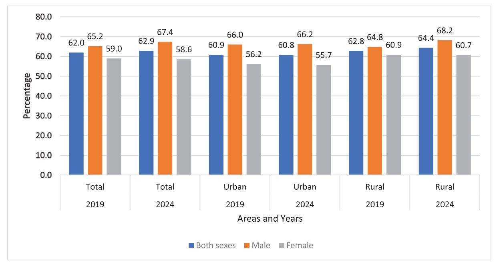

Figure 5.2.1. Distribution of active population aged 5+ years by sex and area, Cambodia 2019- 2024

Table 5.2.1. The economically inactive population includes people aged 5 and over who are not working and not seeking work during the reference period. The proportion of the population who are not economically active is higher among females (41.4 percent) than among males (32.6 percent). Comparing to 2019 increased about 0.4 percent among women.

Table 5.2.1. Population aged 5+ years by usual activity status, sex and area, Cambodia, 2019-2024

| Usual Status        |            | 2019      |           |            | 2024      |           |
|---------------------|------------|-----------|-----------|------------|-----------|-----------|
| Usuai Status        | Both Sexes | Male      | Female    | Both Sexes | Male      | Female    |
| (1)                 | (2)        | (3)       | (4)       | (5)        | (6)       | (7)       |
|                     |            |           | Number    |            |           |           |
|                     |            |           | Total     |            |           |           |
| Active Population   | 8,749,587  | 4,453,531 | 4,296,056 | 9,950,697  | 5,219,858 | 4,730,839 |
| Employed            | 8,626,777  | 4,396,850 | 4,229,927 | 9,579,154  | 5,051,030 | 4,528,124 |
| Unemployed          | 122,810    | 56,681    | 66,129    | 371,543    | 168,827   | 202,716   |
| Inactive Population | 5,352,465  | 2,372,343 | 2,980,122 | 5,868,915  | 2,526,801 | 3,342,113 |
|                     |            |           | Urban     |            |           |           |
| Active Population   | 3,425,744  | 1,800,287 | 1,625,457 | 4,015,305  | 2,126,808 | 1,888,496 |
| Employed            | 3,362,357  | 1,771,174 | 1,591,183 | 3,845,118  | 2,046,449 | 1,798,668 |
| Unemployed          | 63,387     | 29,113    | 34,274    | 170,187    | 80,359    | 89,828    |
| Inactive Population | 2,197,126  | 929,323   | 1,267,803 | 2,585,565  | 1,084,435 | 1,501,130 |
|                     |            |           | Rural     |            |           |           |
| Active Population   | 5,323,843  | 2,653,244 | 2,670,599 | 5,935,392  | 3,093,049 | 2,842,343 |
| Employed            | 5,264,420  | 2,625,676 | 2,638,744 | 5,734,036  | 3,004,581 | 2,729,455 |
| Unemployed          | 59,423     | 27,568    | 31,855    | 201,356    | 88,468    | 112,888   |
| Inactive Population | 3,155,339  | 1,443,020 | 1,712,319 | 3,283,349  | 1,442,366 | 1,840,983 |
|                     |            | Pe        | ercentage |            |           |           |
|                     |            |           | Total     |            |           |           |
| Active Population   | 62.0       | 65.2      | 59.0      | 62.9       | 67.4      | 58.6      |
| Employed            | 61.2       | 64.4      | 58.1      | 60.6       | 65.2      | 56.1      |
| Unemployed          | 0.9        | 0.8       | 0.9       | 2.4        | 2.2       | 2.5       |
| Inactive Population | 38         | 34.8      | 41        | 37.1       | 32.6      | 41.4      |
|                     |            |           | Urban     |            |           |           |
| Active Population   | 60.9       | 66.0      | 56.2      | 60.8       | 66.2      | 55.7      |
| Employed            | 59.8       | 64.9      | 55.0      | 58.3       | 63.7      | 53.1      |
| Unemployed          | 1.1        | 1.1       | 1.2       | 2.6        | 2.5       | 2.7       |
| Inactive Population | 39.1       | 34.0      | 43.8      | 39.2       | 33.8      | 44.3      |
|                     |            |           | Rural     |            |           |           |
| Active Population   | 62.8       | 64.8      | 60.9      | 64.4       | 68.2      | 60.7      |
| Employed            | 62.1       | 64.1      | 60.2      | 62.2       | 66.3      | 58.3      |
| Unemployed          | 0.7        | 0.7       | 0.7       | 2.2        | 2.0       | 2.4       |
| Inactive Population | 37.2       | 35.2      | 39.1      | 35.6       | 31.8      | 39.3      |

Note Percentage of usual activity status for those aged 15+ is calculated after those for who usual activity status was not reported.

The economic activity rate or the Labour Force Participation Rate (LFPR) for children under 15 has declined from 3.1 percent in 2008 to 2.1 percent in 2019 and 2 percent in 2024. This may be regarded as an indicator of development in the country or related to child laborforce elimination policy. The Labour Force Participation Rate (LFPR) for population age 15 and above decrease 0.9 percent if compared 2019 .However the labour force participation rate (LFPR) for age 15-59 year has increased, while this rate significant decreased among age 60 and above.

Table 5.2.2. Age-specific Labour Force Participation Rates (LFPR) by age group, sex, and area, Cambodia, 2019-2024

|           |            |      | LF     | PR         |      |        |
|-----------|------------|------|--------|------------|------|--------|
| Age Group |            | 2019 |        |            | 2024 |        |
|           | Both Sexes | Male | Female | Both Sexes | Male | Female |
| (1)       | (2)        | (3)  | (4)    | (5)        | (6)  | (7)    |
|           |            |      | Total  |            |      |        |
| 5+        | 62         | 65.2 | 59     | 62.9       | 67.4 | 58.6   |
| 15+       | 79.1       | 84.4 | 74.3   | 78.2       | 84.8 | 72.0   |
| 5-14      | 2.1        | 2.5  | 1.6    | 2.0        | 2.6  | 1.3    |
| 15-24     | 58.4       | 58.9 | 57.9   | 60.1       | 63.1 | 57.2   |
| 25-59     | 90.7       | 96.3 | 85.4   | 91.2       | 97.0 | 85.6   |
| 60+       | 60.7       | 72.5 | 52.8   | 51.2       | 65.0 | 41.8   |
|           | 1          | '    | Urban  |            |      |        |
| 5+        | 60.9       | 66   | 56.2   | 60.8       | 66.2 | 55.7   |
| 15+       | 74.7       | 81.8 | 68.1   | 74.8       | 82.5 | 67.8   |
| 5-14      | 1.7        | 2    | 1.4    | 1.6        | 2.3  | 0.8    |
| 15-24     | 55.8       | 55.9 | 55.7   | 54.0       | 56.1 | 52.0   |
| 25-59     | 86.4       | 94.4 | 78.7   | 89.0       | 96.4 | 81.8   |
| 60+       | 48.2       | 62   | 38.9   | 43.9       | 58.0 | 34.5   |
|           |            |      | Rural  |            |      |        |
| 5+        | 62.8       | 64.8 | 60.9   | 64.4       | 68.2 | 60.7   |
| 15+       | 82.2       | 86.3 | 78.6   | 80.6       | 86.5 | 75.1   |
| 5-14      | 2.3        | 2.8  | 1.8    | 2.2        | 2.7  | 1.6    |
| 15-24     | 60.3       | 61.1 | 59.4   | 64.4       | 67.8 | 60.9   |
| 25-59     | 93.8       | 97.8 | 90.2   | 92.9       | 97.5 | 88.5   |
| 60+       | 67.9       | 78.7 | 60.8   | 56.3       | 69.7 | 46.8   |

Table 5.2.2 indicated that the male economic activity rate remains higher than females for all ages from around 15 onwards in 2024. This pattern is similar to 2019. The economic activity rates have always been higher in the rural areas than in the urban areas for males and females. This is presumably due to higher participation in agriculture in rural areas and higher school enrolment in urban areas for both sexes. Both in the urban and rural areas of the country, the economic activity rates for males are higher than that for females, although the gap between the male-female participation rates is far less in rural areas than it is in urban areas for age 15-24 years.

100
90
80
70
40
30
20
10
5-9 10-14 15-19 20-24 25-29 30-34 35-39 40-44 45-49 50-54 55-59 60-64 65-69 70-74 75+

Figure 5.2.2 Age-specific Labour Force Participation Rates (LFPR) by sex, Cambodia, 2019-2024

### 5.3 .Employed and Unemployed

Male 2019

Employment is an important indicator for assessing socio-economic development. An analysis of the changing dynamics of employment allows us to assess the impact of socio-economic transition and to propose employment policies that are appropriate to the prevailing socio-economic conditions in the country. After the COVID-19 pandemic ended Cambodia's economy began to recover gradually. Therefore, the labour force has undergone structural changes to maintain economic stability and continue Cambodia's better economic development.

Age Group

Female 2019

Female 2024

Male 2024

Similar to GPCC 2019 the majority of the labour force was employed and only a small share was unemployed. Therefore, an analysis of the basic characteristics of the employed labour force (e.g. age, sex, marital status, sector of employment, status in employment) can do much to characterize the general status of the labour force in the country.

The employment rate is defined as the percentage of those who are employed, relative to the total number of persons in the labour force. The employment rate was found to be 98.6 percent in the 2019 Census and 96.3 percent in the CIPS 2024.

### 5.3.1. Employment rates for population aged 5+ years by sex and area, Cambodia, 2019-2024

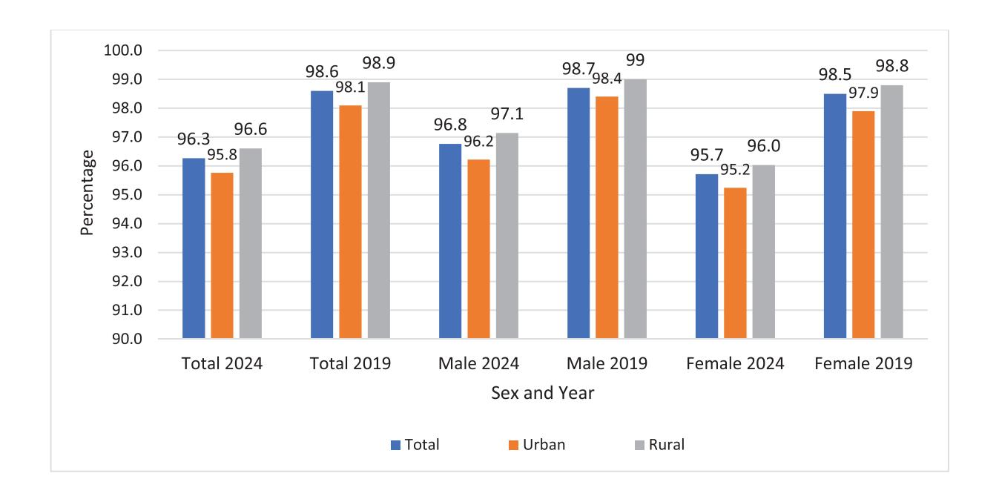

The unemployment rate is the ratio of the number of unemployed persons in the labour force per 100. The unemployment rate for persons aged 15 years and over has slightly increased from 1.3 in 2019 to 2.8 percent in 2024.

Figure 5.3.2. Age-specific unemployment rates by age group and area, Cambodia, 2024

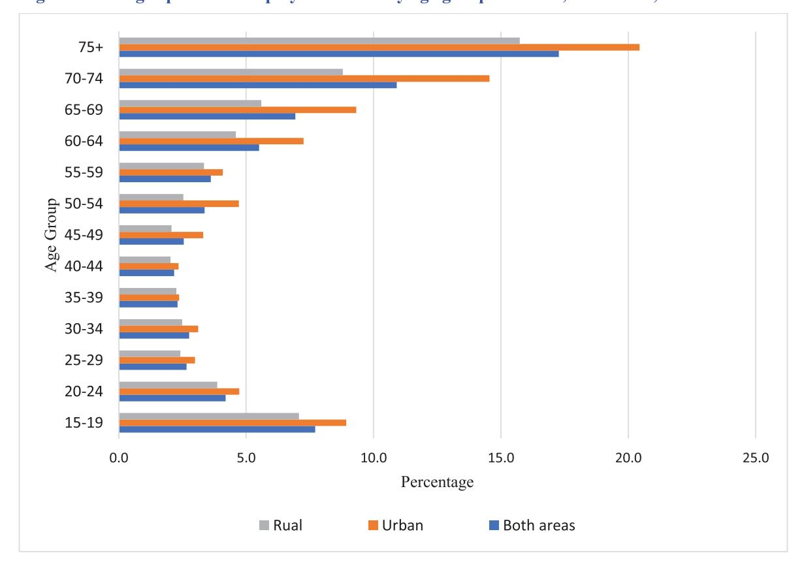

### 5.4. Employment Status

Five categories of employment status were identified in the CIPS 2024: employer, paid employee, own account worker, unpaid family worker and others. In the analysis below, employment status is cross tabulated with sex, age and area.

The CIPS 2024 responses on employment status show that unpaid family workers and own account workers about 48.3 percent of the employed population in Cambodia in 2024 has decreased if compare to 67.7 percent in 2019 (Table 5.4.1). In contrast, the proportion of paid employees increased between 2019 -2024 approximately 19.2 percent.

The proportion of men working in own account worker (37.6 percent) while, women (35.3 percent). The fall in the proportion of females, reported working as unpaid family worker 16,7 percent if compared (35,4 percent) in 2019, but this it still higher than men 7.4 percent. The proportion of paid employees among men is higher than women both 2019 and 2024. Interestingly, the same proportion of males and females as employer (0.9 percent).

In 2024 among employment, the proportion of paid employees is higher than proportion of own account workers both urban and rural but it different of 2019 were this proportion is high in urban and low in rural. The proportion of working as unpaid family workers among females is higher than men both urban (7.8 percent versus 3.5 percent) and rural (22.5 percent versus 10 percent). The proportion of women who working unpaid family workers in rural (22.5 percent) is higher than urban (7.8 percent). It is reflected about gender related to employment included working as unpaid family workers and paid employee both national level and region.

Table 5.4.1. Distribution of employed persons aged 5+ years by employment status, sex and area, Cambodia, 2019-2024

|                   |                  |       |          | Employme         | nt Status                |                            |       |
|-------------------|------------------|-------|----------|------------------|--------------------------|----------------------------|-------|
| Age Group         | Employed Persons | Total | Employer | Paid Employee | Own Account Worker | Unpaid Family Worker | Other |
| (1)               | (2)              | (3)   | (4)      | (5)              | (6)                      | (7)                        | (8)   |
|                   |                  |       | 2019     |                  |                          |                            |       |
|                   |                  |       | Total    |                  |                          |                            |       |
| Both Sexes        | 8,626,777        | 100   | 0.6      | 31.5             | 42.7                     | 25.0                       | 0.2   |
| Under 15          | 59,845           | 100   | 0.7      | 23.0             | 30.1                     | 42.7                       | 3.5   |
| 15 – 59           | 7,754,372        | 100   | 0.6      | 33.9             | 40.3                     | 25.0                       | 0.2   |
| 60+               | 812,560          | 100   | 0.6      | 8.9              | 65.9                     | 24.3                       | 0.2   |
| Male              | 4,396,850        | 100   | 0.7      | 33.6             | 50.3                     | 15.1                       | 0.3   |
| Under 15          | 37,388           | 100   | 0.7      | 19.7             | 35.6                     | 38.6                       | 5.4   |
| 15 – 59           | 3,969,675        | 100   | 0.7      | 35.8             | 47.7                     | 15.6                       | 0.2   |
| 60+               | 389,787          | 100   | 0.8      | 13.3             | 77.7                     | 7.9                        | 0.3   |
| Female            | 4,229,927        | 100   | 0.5      | 29.3             | 34.7                     | 35.4                       | 0.1   |
| Under 15          | 22,457           | 100   | 0.8      | 28.4             | 21.0                     | 49.6                       | 0.2   |
| 15 – 59           | 3,784,697        | 100   | 0.5      | 32.0             | 32.5                     | 34.8                       | 0.1   |
| 60+               | 422,773          | 100   | 0.4      | 4.9              | 55.1                     | 39.5                       | 0.1   |
|                   |                  |       | Urban    |                  |                          |                            |       |
| <b>Both Sexes</b> | 3,362,357        | 100   | 0.8      | 53.1             | 33.7                     | 12.2                       | 0.2   |
| Under 15          | 16,008           | 100   | 1.0      | 46.9             | 29.2                     | 20.7                       | 2.1   |

| 15 – 59    | 3,112,884 | 100 | 0.8        | 55.6 | 31.6 | 11.8     | 0.2      |
|------------|-----------|-----|------------|------|------|----------|----------|
| 60+        | 233,465   | 100 | 1.0        | 19.3 | 62.3 | 17.1     | 0.3      |
| Male       | 1,771,174 | 100 | 0.9        | 54.8 | 36.5 | 7.6      | 0.3      |
| Under 15   | 9,594     | 100 | 0.9        | 39.7 | 36.8 | 19.3     | 3.3      |
| 15 – 59    | 1,639,260 | 100 | 0.9        | 57.0 | 34.2 | 7.7      | 0.2      |
| 60+        | 122,320   | 100 | 1.2        | 26.6 | 66.5 | 5.4      | 0.3      |
| Female     | 1,591,183 | 100 | 0.7        | 51.2 | 30.6 | 17.4     | 0.1      |
| Under 15   | 6,414     | 100 | 1.1        | 57.7 | 17.9 | 22.9     | 0.4      |
| 15 – 59    | 1,473,624 | 100 | 0.7        | 54.1 | 28.6 | 16.4     | 0.1      |
| 60+        | 111,145   | 100 | 0.7        | 11.3 | 57.8 | 30.1     | 0.2      |
| <u> </u>   |           |     | Rural      |      |      |          |          |
| Both Sexes | 5,264,420 | 100 | 0.5        | 17.7 | 48.4 | 33.3     | 0.2      |
| Under 15   | 43,837    | 100 | 0.7        | 14.2 | 30.4 | 50.8     | 4.0      |
| 15 – 59    | 4,641,488 | 100 | 0.5        | 19.4 | 46.2 | 33.8     | 0.1      |
| 60+        | 579,095   | 100 | 0.5        | 4.7  | 67.4 | 27.2     | 0.2      |
| Male       | 2,625,676 | 100 | 0.5        | 19.4 | 59.6 | 20.2     | 0.3      |
| Under 15   | 27,794    | 100 | 0.6        | 12.8 | 35.1 | 45.2     | 6.2      |
| 15 – 59    | 2,330,415 | 100 | 0.5        | 20.9 | 57.2 | 21.2     | 0.2      |
| 60+        | 267,467   | 100 | 0.6        | 7.2  | 82.9 | 9.0      | 0.3      |
| Female     | 2,638,744 | 100 | 0.4        | 16.1 | 37.2 | 46.2     | 0.1      |
| Under 15   | 16,043    | 100 | 0.7        | 16.7 | 22.2 | 60.3     | 0.1      |
| 15 – 59    | 2,311,073 | 100 | 0.4        | 17.9 | 35.0 | 46.6     | 0.0      |
| 60+        | 311,628   | 100 | 0.4        | 2.6  | 54.1 | 42.9     | 0.1      |
|            | l         |     | 2024       |      |      |          |          |
|            |           |     | Total      |      |      |          |          |
| Both Sexes | 9,579,154 | 100 | 0.9        | 50.7 | 36.5 | 11.8     | 0.1      |
| Under 15   | 50,105    | 100 | 0.3        | 53.6 | 13.3 | 31.6     | 1.2      |
| 15 – 59    | 8,701,598 | 100 | 0.9        | 54.0 | 33.6 | 11.4     | 0.1      |
| 60+        | 827,451   | 100 | 0.7        | 16.2 | 68.4 | 14.7     | 0.1      |
| Male       | 5,051,030 | 100 | 0.9        | 53.9 | 37.6 | 7.4      | 0.2      |
| Under 15   | 33,941    | 100 | 0.4        | 50.2 | 14.5 | 33.0     | 1.8      |
| 15 – 59    | 4,582,249 | 100 | 0.9        | 57.1 | 34.3 | 7.5      | 0.2      |
| 60+        | 434,840   | 100 | 1.1        | 21.4 | 73.4 | 4.0      | 0.1      |
| Female     | 4,528,124 | 100 | 0.9        | 47.1 | 35.3 | 16.7     | 0.1      |
| Under 15   | 16,164    | 100 | 0.0        | 60.8 | 10.8 | 28.5     | 0.0      |
| 15 – 59    | 4,119,349 | 100 | 0.9        | 50.5 | 32.8 | 15.7     | 0.1      |
| 60+        | 392,611   | 100 | 0.2        | 10.4 | 62.8 | 26.6     | 0.0      |
|            |           |     | Urban      |      |      |          |          |
| Both Sexes | 3,845,118 | 100 | 1.1        | 60.9 | 32.3 | 5.5      | 0.2      |
| Under 15   | 13,466    | 100 | 0.0        | 66.0 | 9.9  | 21.1     | 3.0      |
| 15 – 59    | 3,550,005 | 100 | 1.1        | 63.8 | 29.8 | 5.1      | 0.2      |
| 60+        | 281,647   | 100 | 1.2        | 23.6 | 65.2 | 9.9      | 0.0      |
| Male       | 2,046,449 | 100 | 1.1        | 63.4 | 31.8 | 3.5      | 0.2      |
| Under 15   | 9,779     | 100 | 0.0        | 61.5 | 13.5 | 20.9     | 4.1      |
| 15 – 59    | 1,885,487 | 100 | 1.0        | 66.0 | 29.2 | 3.5      | 0.2      |
| 60+        | 151,184   | 100 | 2.0        | 30.1 | 65.4 | 2.5      | 0.0      |
| Female     | 1,798,668 | 100 | 1.1        | 58.1 | 32.9 | 7.8      | 0.1      |
| Under 15   | 3,688     | 100 | 0.0        | 78.0 | 0.3  | 21.7     | 0.0      |
| 15 – 59    | 1,664,518 | 100 | 1.1        | 61.4 | 30.5 | 7.0      | 0.1      |
| 60+        | 130,463   | 100 | 0.4        | 16.0 | 65.1 | 18.6     | 0.0      |
|            | ,         |     | Rural      |      |      | <u> </u> | <u> </u> |
|            |           |     | <i>E</i> 1 |      |      |          |          |

| <b>Both Sexes</b> | 5,734,036 | 100 | 0.7 | 43.9 | 39.3 | 16.0 | 0.1 |
|-------------------|-----------|-----|-----|------|------|------|-----|
| Under 15          | 36,638    | 100 | 0.4 | 49.1 | 14.6 | 35.4 | 0.6 |
| 15 – 59           | 5,151,593 | 100 | 0.8 | 47.2 | 36.2 | 15.7 | 0.1 |
| 60+               | 545,804   | 100 | 0.4 | 12.3 | 70.0 | 17.1 | 0.1 |
| Male              | 3,004,581 | 100 | 0.8 | 47.5 | 41.5 | 10.0 | 0.2 |
| Under 15          | 24,162    | 100 | 0.6 | 45.6 | 14.9 | 37.9 | 0.9 |
| 15 – 59           | 2,696,762 | 100 | 0.8 | 50.8 | 38.0 | 10.3 | 0.2 |
| 60+               | 283,657   | 100 | 0.7 | 16.7 | 77.7 | 4.7  | 0.2 |
| Female            | 2,729,455 | 100 | 0.7 | 39.8 | 36.9 | 22.5 | 0.1 |
| Under 15          | 12,476    | 100 | 0.0 | 55.7 | 13.9 | 30.5 | 0.0 |
| 15 – 59           | 2,454,831 | 100 | 0.8 | 43.2 | 34.3 | 21.6 | 0.1 |
| 60+               | 262,148   | 100 | 0.2 | 7.5  | 61.7 | 30.5 | 0.0 |

\*Note: Excluding those for whom employment status was not reported

### **5.5** .Employment Sectors

The CIPS 2014, employment section is broken down into eight distinct sectors: the civil service, state owned enterprises, private Cambodian enterprises, foreign enterprises, non-profit organizations, the household sector, embassies/international organizations and others.

Table 5.5.1 shows the distribution of employed persons by sex, age sector of employment and urban/rural area. The table shows that most of the employed population aged 5 and over were employed in local private enterprises (72.6 percent), followed by foreign enterprises (20.5 percent) and the civil service (5.3 percent) leaves only 1.5 percent employed in the other five sectors. The proportion were employed in local private enterprises is lower if comparing to 2019 but working of foreign enterprises is higher.

Table 5.5.1, it is also shows clear that a much higher proportion of males (75.8 percent) were private Cambodian enterprises than females (69.2percent). For the civil service, state the proportion of men higher than females 3.2 percent. On the other hand, foreign enterprises provided proportionately more employment to women (25.5 percent) than to men (16 percent). This pattern happened since GPCC 2019. The proportion of working in private Cambodian enterprises sector in rural were 76,9 percent is higher than urban were 66,3 percent, but have opposite trend of the proportion of civil service, state sector were urban is higher than rural. There are significant different between the women at rural who working in foreign enterprises (21 percent) in 2019 and 8.5 percent in 2024.

Table 5.5.1 Distribution of employed persons aged 5+ years by sex, sector of employment, and area, Cambodia, 2019-2024

| Age Group         | Number of |       |            |       | 31        | Sector of Employment | vment        |           |               |       |
|-------------------|-----------|-------|------------|-------|-----------|----------------------|--------------|-----------|---------------|-------|
| 0                 | Employed  | Total | Government | State | Private   | Foreign              | Non-Profit   | Household | Embassy/      | Other |
|                   | Persons   |       |            | Owned | Cambodian | Enterprise           | Organization | Sector    | International |       |
| (1)               | (2)       | (3)   | (4)        | (5)   | (9)       | (7)                  | (8)          | (6)       | (10)          | (11)  |
|                   |           |       |            |       | 2019      |                      |              |           |               |       |
|                   |           |       |            |       | Total     |                      |              |           |               |       |
| <b>Both Sexes</b> | 8,626,777 | 100   | 4.9        | 0.5   | 78.7      | 12.8                 | 6.0          | 2.5       | 0.0           | 0.1   |
| 5 – 14            | 59,845    | 100   | 0.7        | 0.3   | 73.7      | 7.5                  | 13.9         | 2.4       | 0.0           | 1.4   |
| 15 – 59           | 7,754,372 | 100   | 5.0        | 0.5   | 77.5      | 14.0                 | 0.4          | 2.4       | 0.0           | 0.1   |
| +09               | 812,560   | 100   | 4.3        | 0.4   | 90.4      | 8.0                  | 8.0          | 3.2       | 0.0           | 0.1   |
| Male              | 4,396,850 | 100   | 6.7        | 0.7   | 80.1      | 0.6                  | 6.0          | 2.3       | 0.0           | 0.1   |
| 5 – 14            | 37,388    | 100   | 9.0        | 0.3   | 67.5      | 5.1                  | 22.1         | 2.1       | 0.0           | 2.2   |
| 15-59             | 3,969,675 | 100   | 8.9        | 0.7   | 9.67      | 6.6                  | 0.7          | 2.3       | 0.0           | 0.1   |
| +09               | 389,787   | 100   | 7.2        | 0.5   | 87.1      | 6.0                  | 1.2          | 2.9       | 0.0           | 0.1   |
| Female            | 4,229,927 | 100   | 3.0        | 0.3   | 77.2      | 16.6                 | 0.1          | 2.6       | 0.0           | 0.0   |
| 5 – 14            | 22,457    | 100   | 8.0        | 0.3   | 84.1      | 11.5                 | 0.2          | 2.9       | 0.0           | 0.1   |
| 15-59             | 3,784,697 | 100   | 3.2        | 0.3   | 75.3      | 18.4                 | 0.1          | 2.5       | 0.0           | 0.0   |
| +09               | 422,773   | 100   | 1.6        | 0.2   | 93.5      | 8.0                  | 0.5          | 3.3       | 0.0           | 0.0   |
|                   |           |       |            |       | Urban     |                      |              |           |               |       |
| <b>Both Sexes</b> | 3,362,357 | 100   | 9.7        | 0.7   | 66.4      | 22.7                 | 9.0          | 1.8       | 0.1           | 0.1   |
| 5 – 14            | 16,008    | 100   | 1.4        | 0.4   | 62.4      | 17.7                 | 14.7         | 2.5       | 0.0           | 8.0   |
| 15 – 59           | 3,112,884 | 100   | 9.7        | 0.7   | 65.1      | 24.3                 | 0.5          | 1.8       | 0.1           | 0.1   |
| +09               | 233,465   | 100   | 8.8        | 9.0   | 84.2      | 2.1                  | 1.4          | 2.8       | 0.1           | 0.1   |
| Male              | 1,771,174 | 100   | 10.1       | 6.0   | 70.0      | 16.1                 | 6.0          | 1.8       | 0.1           | 0.1   |
| 5 – 14            | 9,594     | 100   | 1.2        | 0.4   | 58.8      | 11.9                 | 24.2         | 2.0       | 0.1           | 1.3   |
| 15 – 59           | 1,639,260 | 100   | 10.0       | 6.0   | 4.69      | 17.2                 | 8.0          | 1.7       | 0.1           | 0.1   |
| +09               | 122,320   | 100   | 13.4       | 8.0   | 79.4      | 2.0                  | 1.6          | 2.6       | 0.1           | 0.1   |
| Female            | 1,591,183 | 100   | 4.8        | 6.5   | 62.5      | 30.1                 | 0.2          | 1.9       | 0.1           | 0.0   |
| 5 – 14            | 6,414     | 100   | 1.7        | 0.5   | 6.79      | 26.2                 | 0.4          | 3.2       | 0.0           | 0.1   |
| 15-59             | 1,473,624 | 100   | 4.9        | 0.5   | 60.4      | 32.2                 | 0.1          | 1.8       | 0.1           | 0.0   |
| +09               | 111,145   | 100   | 3.8        | 0.3   | 9.68      | 2.1                  | 1.1          | 3.0       | 0.0           | 0.1   |
|                   |           |       |            |       |           |                      |              |           |               |       |

Table 5.5.1 Distribution of employed persons aged 5+ years by sex, sector of employment, and area, Cambodia, 2019-2024 (Count)

| Age Group         | Number of |       | •          |                     |                         | Sector of Employment | yment        |           |                               |       |
|-------------------|-----------|-------|------------|---------------------|-------------------------|----------------------|--------------|-----------|-------------------------------|-------|
|                   | Employed  | Total | Government | State               | Private                 | Foreign              | Non-Profit   | Household | Embassy/                      | Other |
|                   | Persons   |       |            | Owned Enterprise | Cambodian Enterprise | Enterprise           | Organization | Sector    | International Organization |       |
| (1)               | (2)       | (3)   | (4)        | (5)                 | (9)                     | (7)                  | (8)          | (6)       | (10)                          | (11)  |
|                   |           |       |            |                     | Rural                   |                      |              |           |                               |       |
| <b>Both Sexes</b> | 5,264,420 | 100   | 3.2        | 0.4                 | 86.5                    | 6.4                  | 6.0          | 2.9       | 0.0                           | 0.1   |
| 5 – 14            | 43,837    | 100   | 0.5        | 0.2                 | 6.77                    | 3.8                  | 13.6         | 2.4       | 0.0                           | 1.6   |
| 15 – 59           | 4,641,488 | 100   | 3.3        | 0.4                 | 85.8                    | 7.2                  | 0.4          | 2.8       | 0.0                           | 0.1   |
| +09               | 540,675   | 100   | 2.4        | 0.3                 | 92.9                    | 0.4                  | 9.0          | 3.3       | 0.0                           | 0.1   |
| Male              | 2,625,676 | 100   | 4.5        | 6.5                 | 87.0                    | 4.3                  | 6.0          | 2.7       | 0.0                           | 0.1   |
| 5 – 14            | 27,794    | 100   | 0.4        | 0.2                 | 70.5                    | 2.8                  | 21.3         | 2.1       | 0.0                           | 2.5   |
| 15 – 59           | 2,330,415 | 100   | 4.5        | 0.5                 | 7.98                    | 4.7                  | 7.0          | 2.7       | 0.0                           | 0.1   |
| +09               | 267,467   | 100   | 4.4        | 0.4                 | 9.06                    | 0.3                  | 1.0          | 3.1       | 0.0                           | 0.1   |
| Female            | 2,638,744 | 100   | 2.0        | 0.3                 | 86.1                    | 8.5                  | 0.1          | 3.0       | 0.0                           | 0.0   |
| 5 – 14            | 16,043    | 100   | 0.5        | 0.2                 | 9.06                    | 5.6                  | 0.2          | 2.8       | 0.0                           | 0.1   |
| 15 – 59           | 2,311,073 | 100   | 2.1        | 0.3                 | 84.9                    | 7.6                  | 0.0          | 3.0       | 0.0                           | 0.0   |
| +09               | 311,628   | 100   | 8.0        | 0.2                 | 94.9                    | 0.4                  | 0.3          | 3.5       | 0.0                           | 0.0   |
|                   |           |       |            |                     | 2024                    |                      |              |           |                               |       |
|                   |           |       |            |                     | Total                   |                      |              |           |                               |       |
| <b>Both Sexes</b> | 9,579,154 | 100   | 5.3        | 0.7                 | 72.6                    | 20.5                 | 0.1          | 0.7       | 0.0                           | 0.0   |
| 5 – 14            | 50,105    | 100   | 0.4        | 1.0                 | 82.2                    | 12.6                 | 2.9          | 0.8       | 0.0                           | 0.0   |
| 15 – 59           | 8,701,598 | 100   | 5.2        | 0.8                 | 70.8                    | 22.4                 | 0.1          | 0.7       | 0.0                           | 0.0   |
| +09               | 827,451   | 100   | 6.1        | 0.4                 | 91.2                    | 1.4                  | 0.3          | 0.4       | 0.0                           | 0.1   |
| Male              | 5,051,030 | 100   | 8.9        | 6.0                 | 75.8                    | 16.0                 | 0.2          | 0.3       | 0.0                           | 0.0   |
| 5 – 14            | 33,941    | 100   | 9.0        | 0.8                 | 85.3                    | 0.6                  | 4.3          | 0.0       | 0.0                           | 0.0   |
| 15 – 59           | 4,582,249 | 100   | 6.5        | 6.0                 | 74.6                    | 17.4                 | 0.1          | 0.3       | 0.0                           | 0.0   |
| +09               | 434,84    | 100   | 9.6        | 9.0                 | 87.1                    | 1.9                  | 0.5          | 0.2       | 0.0                           | 0.1   |
| Female            | 4,528,124 | 100   | 3.6        | 0.5                 | 69.2                    | 25.5                 | 0.1          | 1.1       | 0.0                           | 0.0   |
| 5 – 14            | 16,164    | 100   | 0.0        | 1.3                 | 75.8                    | 20.3                 | 0.0          | 2.6       | 0.0                           | 0.0   |
| 15-59             | 4,119,349 | 100   | 3.7        | 9.0                 | 9.99                    | 27.9                 | 0.1          | 1.2       | 0.0                           | 0.0   |
| +09               | 392,611   | 100   | 2.3        | 0.2                 | 95.7                    | 6.0                  | 0.2          | 0.7       | 0.0                           | 0.0   |
|                   |           |       |            |                     | Ü                       |                      |              |           |                               |       |

Table 5.5.1 Distribution of employed persons aged 5+ years by sex, sector of employment, and area, Cambodia, 2019-2024 (Count)

| Age Group         | Number of |       |            |                     | 01                      | Sector of Employment | yment        |           |                            |       |
|-------------------|-----------|-------|------------|---------------------|-------------------------|----------------------|--------------|-----------|----------------------------|-------|
| )                 | Employed  | Total | Government | State               | Private                 | Foreign              | Non-Profit   | Household | Embassy/                   | Other |
|                   | Persons   |       |            | Owned Enterprise | Cambodian Enterprise | Enterprise           | Organization | Sector    | International Organization |       |
| (1)               | (2)       | (3)   | (4)        | (5)                 | (9)                     | (7)                  | (8)          | (6)       | (10)                       | (11)  |
|                   |           |       |            |                     | Urban                   |                      |              |           |                            |       |
| <b>Both Sexes</b> | 3,845,118 | 100   | 7.1        | 1.2                 | 66.3                    | 24.4                 | 0.1          | 0.8       | 0.0                        | 0.0   |
| 5 – 14            | 13,466    | 100   | 1.6        | 1.6                 | 83.1                    | 8.3                  | 5.4          | 0.0       | 0.0                        | 0.0   |
| 15-59             | 3,550,005 | 100   | 7.0        | 1.2                 | 64.7                    | 26.2                 | 0.1          | 0.8       | 0.0                        | 0.0   |
| +09               | 281,647   | 100   | 8.9        | 1.2                 | 86.4                    | 2.3                  | 0.3          | 0.7       | 0.0                        | 0.2   |
| Male              | 2,046,449 | 100   | 9.3        | 1.4                 | 71.3                    | 17.3                 | 0.2          | 0.4       | 0.1                        | 0.0   |
| 5-14              | 9,779     | 100   | 2.2        | 2.3                 | 85.8                    | 2.3                  | 7.4          | 0.0       | 0.0                        | 0.0   |
| 15 – 59           | 1,885,487 | 100   | 9.0        | 1.4                 | 70.5                    | 18.5                 | 0.1          | 0.4       | 0.1                        | 0.0   |
| +09               | 151,184   | 100   | 12.9       | 1.8                 | 80.9                    | 3.1                  | 0.4          | 9.0       | 0.0                        | 0.4   |
| Female            | 1,798,668 | 100   | 4.7        | 6.0                 | 9.09                    | 32.4                 | 0.1          | 1.3       | 0.0                        | 0.0   |
| 5-14              | 3,688     | 100   | 0.0        | 0.0                 | 75.9                    | 24.1                 | 0.0          | 0.0       | 0.0                        | 0.0   |
| 15-59             | 1,664,518 | 100   | 4.8        | 6.0                 | 58.1                    | 34.9                 | 0.1          | 1.3       | 0.0                        | 0.0   |
| +09               | 130,463   | 100   | 4.4        | 0.5                 | 92.7                    | 1.3                  | 0.1          | 0.0       | 0.0                        | 0.0   |
|                   |           |       |            |                     | Rural                   |                      |              |           |                            |       |
| <b>Both Sexes</b> | 5,734,036 | 100   | 4.0        | 0.4                 | 76.9                    | 17.9                 | 0.2          | 9.0       | 0.0                        | 0.0   |
| 5 – 14            | 36,638    | 100   | 0.0        | 0.7                 | 81.9                    | 14.2                 | 2.0          | 1.1       | 0.0                        | 0.0   |
| 15 – 59           | 5,151,593 | 100   | 3.9        | 0.5                 | 75.1                    | 19.8                 | 0.1          | 9.0       | 0.0                        | 0.0   |
| +09               | 545,804   | 100   | 4.7        | 0.0                 | 93.7                    | 1.0                  | 0.3          | 0.3       | 0.0                        | 0.0   |
| Male              | 3,004,581 | 100   | 5.0        | 0.5                 | 78.8                    | 15.2                 | 0.2          | 0.2       | 0.0                        | 0.0   |
| 5 – 14            | 24,162    | 100   | 0.0        | 0.2                 | 85.1                    | 11.7                 | 3.0          | 0.0       | 0.0                        | 0.0   |
| 15 – 59           | 2,696,762 | 100   | 4.8        | 9.0                 | 77.5                    | 16.7                 | 0.2          | 0.2       | 0.0                        | 0.0   |
| +09               | 283,657   | 100   | 7.8        | 0.0                 | 90.4                    | 1.3                  | 0.5          | 0.0       | 0.0                        | 0.0   |
| Female            | 2,729,455 | 100   | 2.8        | 0.3                 | 74.8                    | 21.0                 | 0.1          | 1.0       | 0.0                        | 0.0   |
| 5 – 14            | 12,476    | 100   | 0.0        | 1.7                 | 75.8                    | 19.2                 | 0.0          | 3.3       | 0.0                        | 0.0   |
| 15 – 59           | 2,454,831 | 100   | 3.0        | 0.3                 | 72.4                    | 23.1                 | 0.1          | 1.1       | 0.0                        | 0.0   |
| +09               | 262,148   | 100   | 1.2        | 0.0                 | 97.2                    | 0.7                  | 0.2          | 9.0       | 0.0                        | 0.0   |
|                   |           |       |            |                     |                         |                      |              |           |                            |       |

### 5.6. Employment by Industrial and Occupational Classifications

The CIPS 2024 also collected data on the occupation and industrial sector of employed and unemployed persons (employed before). These data were coded at the National Institute of Statistics using the latest International Standard Industrial Classification 4 and the International Standard Classification of Occupations. Tables 5.6.1 and 5.6.2 present the distribution of employed persons by occupational and industrial classifications and sex in 2019 and 2024. The tables shows that the working in agricultural, forestry and fishing sector has declined in line with the increase in crafts and related worker. Working in agricultural, forestry and fishing sector has declined from 54,7 percent in 2019 to 34.5 percent in 2024. In Table 5.6.2, shows that trend has been steadily declining by 17.6 percent from 2008 to 2019 and continuing to decline from 2019 to 2024 by 20.2 percent. This reflects that Cambodia is moving towards becoming a country with an economy that is not primarily dependent on agriculture.

In 2024, the percentage of people working in agricultural, forestry and fishing was fall to 30 percent, almost the same as the percentage of people working in crafts and related worker (25.9 percent), and the percentage of people working in services and sales workers to 19.1 percent. These are the skilled occupations that most people work in the Cambodian economy, and it also reflects that the skilled labor market in Cambodia has improved, but that more vocational training and skills are still needed to better respond to the competitive labor market.

Among the nine major occupational groups, there were only three occupations where the percentage of females was higher than that of males ("skilled agricultural, forestry and fishing", "craft and related workers" and "services and sales workers"). However, two of them differences were quite small. But services and sales workers were different 10.4 percent between men and women.

Area-wise, a high proportion of employment in urban areas was in the category "craft and related workers" (30.4 percent), followed by "services and sales workers" (27.5 percent). The group "skilled agricultural, forestry and fishing workers" accounted for only 11.9 percent. However, in rural areas 42.0 percent although people were engaged in agricultural, forestry and fishing workers has declined significantly, this sector still plays a major role in the rural Cambodia and this is followed by "craft and related workers" (22.9 percent) and "services and sales workers (13.4 percent)".

When compared with the 2019 Census, the proportion of employed labour working in skilled agricultural, forestry and fishing occupations is similar, however, there were increase in other occupational group.

Table 5.6.1. Distribution of employed population aged 5+ years by occupational group, sex and area, Cambodia, 2019-2024

|             | Occupation Group                           |            |           | Percentage of Employed Persons | iployed Persons |           |           |
|-------------|--------------------------------------------|------------|-----------|--------------------------------|-----------------|-----------|-----------|
| Major       |                                            |            | 2019      |                                |                 | 2024      |           |
| Group       | Description                                | Both Sexes | Males     | Females                        | Both Sexes      | Males     | Females   |
| (1)         | (2)                                        | (3)        | (4)       | (5)                            | (9)             | (7)       | (8)       |
|             |                                            | Total      | al        |                                |                 |           |           |
| Number of E | Number of Employed Persons                 | 8,536,358  | 4,315,762 | 4,220,596                      | 9,495,367       | 4,976,505 | 4,518,863 |
|             | Total                                      | 100        | 100       | 100                            | 100             | 100       | 100       |
| 1           | Managers                                   | 6.0        | 1.1       | 9.0                            | 2.3             | 3.1       | 1.4       |
| 2           | Professionals                              | 3.5        | 4.2       | 2.9                            | 4.3             | 4.4       | 4.3       |
| 3           | Technicians and Associated Professionals   | 1.4        | 2.0       | 8.0                            | 2.0             | 2.6       | 1.3       |
| 4           | Clerical Support Workers                   | 3.3        | 3.8       | 2.7                            | 1.6             | 1.5       | 1.8       |
| 5           | Services and Sales Workers                 | 12.6       | 10.1      | 15.1                           | 19.1            | 14.1      | 24.5      |
| 9           | Agricultural, Forestry and Fishing         | 53.4       | 52.0      | 54.9                           | 30.0            | 29.5      | 30.5      |
| 7           | Craft and Related Workers                  | 16.6       | 15.1      | 18.1                           | 25.9            | 26.8      | 24.8      |
| ∞           | Plant and Machine Operators and Assemblers | 2.3        | 4.0       | 0.5                            | 4.3             | 7.3       | 1.0       |
| 6           | Elementary Occupations                     | 0.9        | 9.7       | 4.4                            | 10.6            | 10.7      | 10.4      |
|             |                                            | Urbar      | an        |                                |                 |           |           |
| Number of E | Number of Employed Persons                 | 3,307,774  | 1,722,432 | 1,585,342                      | 3,796,655       | 2,004,155 | 1,792,500 |
|             | Total                                      | 100        | 100       | 100                            | 100             | 100       | 100       |
| 1           | Managers                                   | 1.5        | 1.7       | 1.3                            | 3.7             | 4.7       | 2.5       |
| 2           | Professionals                              | 5.3        | 5.8       | 4.7                            | 0.9             | 6.2       | 5.9       |
| 3           | Technicians and Associated Professionals   | 2.5        | 3.3       | 1.6                            | 3.2             | 4.2       | 2.1       |
| 4           | Clerical Support Workers                   | 7.3        | 8.3       | 6.2                            | 2.2             | 2.0       | 2.4       |
| 5           | Services and Sales Workers                 | 22.8       | 18.3      | 27.7                           | 27.5            | 21.4      | 34.4      |
| 9           | Agricultural, Forestry and Fishing         | 20.8       | 20.9      | 20.7                           | 11.9            | 12.2      | 11.5      |
| 7           | Craft and Related Workers                  | 28.1       | 24.7      | 31.8                           | 30.4            | 30.0      | 30.8      |
| 8           | Plant and Machine Operators and Assemblers | 4.2        | 7.3       | 8.0                            | 6.5             | 11.1      | 1.3       |
| 6           | Elementary Occupations                     | 7.5        | 9.6       | 5.2                            | 8.8             | 8.3       | 9.3       |
|             |                                            |            |           |                                |                 |           |           |

Table 5.6.1. Distribution of employed population aged 5+ years by occupational group, sex and area, Cambodia, 2019-2024 (Count)

|         | Occupation Group                           |            |           | Percentage of Employed Persons | nployed Persons |           |           |   |
|---------|--------------------------------------------|------------|-----------|--------------------------------|-----------------|-----------|-----------|---|
| Major   |                                            |            | 2019      |                                |                 | 2024      |           | _ |
| Group   | Description                                | Both Sexes | Males     | Females                        | Both Sexes      | Males     | Females   |   |
| 1)      | (2)                                        | (3)        | (4)       | (5)                            | (9)             | (7)       | (8)       |   |
|         |                                            | Rural      | al        |                                |                 |           |           |   |
| er of E | Number of Employed Persons                 | 5,228,584  | 2,593,330 | 2,635,254                      | 5,698,713       | 2,972,350 | 2,726,363 |   |
|         | Total                                      | 100        | 100       | 100                            | 100             | 100       | 100       |   |
| 1       | Managers                                   | 0.5        | 0.7       | 0.2                            | 1.4             | 2.0       | 0.7       |   |
| 2       | Professionals                              | 2.5        | 3.1       | 1.9                            | 3.2             | 3.2       | 3.2       |   |
| 3       | Technicians and Associated Professionals   | 0.7        | 1.2       | 0.3                            | 1.2             | 1.5       | 8.0       |   |
| 4       | Clerical Support Workers                   | 0.7        | 6.0       | 0.5                            | 1.3             | 1.2       | 1.4       |   |
| 5       | Services and Sales Workers                 | 6.1        | 4.7       | 7.5                            | 13.4            | 9.2       | 18.1      |   |
| 9       | Agricultural, Forestry and Fishing         | 74.1       | 72.6      | 75.4                           | 42.0            | 41.1      | 43.0      |   |
| 7       | Craft and Related Workers                  | 9.3        | 8.7       | 6.6                            | 22.9            | 24.7      | 20.9      |   |
| ∞       | Plant and Machine Operators and Assemblers | 1.1        | 1.8       | 0.3                            | 2.8             | 4.8       | 0.8       |   |
| 6       | Elementary Occupations                     | 5.1        | 6.3       | 4.0                            | 11.8            | 12.4      | 11.2      |   |
|         |                                            |            |           |                                |                 |           |           |   |

\*Note: Percentages are calculated excluding armed forces and those for whom occupation was not reported

Table 5.6.2 presents the distribution of employed persons by industrial group. The final result GPCC 2019 indicated that increasing proportion of workers engaged in manufacturing, wholesale and retail trade, the repair of motor vehicles and motorcycles, construction and other services while decreasing proportion of workers engaged in the agriculture, forestry and fishing sector this trend is shifting towards industrialization and modern industry in Cambodia. This pattern is continued in 2024 except for the proportion of jobs in sectors related to arts, entertainment and recreation, which declined (Table 5.6.2). Moreover, this table shows that agriculture, forestry and fishing sector had declined abbot 20.2 percent during 5 year. The proportion of employed labour was engaged in manufacturing has increased 17.8 percent follow by wholesale and retail trade, repair of motor vehicles and motorcycles increased 13.8 percent and construction increased to 8.2 percent. Among all sectors, the sectors of other service activities, activities of households as employers, and activities of international organizations and institutions increased by 2 percent, 0.8 percent, and 0.1 percent, respectively, compared to 2019 for these three sectors.

Table 5.6.2. Distribution of employed population aged 5+ years by industrial group, sex, and area, Cambodia, 2019-2024

|              | Industrial Group                                                     |            |           | Sex       | ×          |           |           |
|--------------|----------------------------------------------------------------------|------------|-----------|-----------|------------|-----------|-----------|
| Major        |                                                                      | Both Sexes | Male      | Female    | Both Sexes | Male      | Female    |
| diodio       |                                                                      |            | 2019      |           |            | 2024      |           |
| (1)          | (2)                                                                  | (3)        | (4)       | (5)       | (9)        | (7)       | (8)       |
|              | Total                                                                | tal        |           |           |            |           |           |
| Number of 1  | Number of Employed Persons                                           | 8,612,367  | 4,388,195 | 4,224,172 | 9,579,154  | 5,051,030 | 4,528,124 |
|              | Total                                                                | 100        | 100       | 100       | 100        | 100       | 100       |
| $\mathbf{A}$ | Agriculture, Forestry and Fishing                                    | 54.7       | 53        | 56.5      | 34.5       | 34.0      | 35.1      |
| В            | Mining and Quarrying                                                 | 0.1        | 0.1       | 0.0**     | 1.1        | 1.2       | 1.0       |
| C            | Manufacturing                                                        | 13.3       | 9.3       | 17.4      | 17.8       | 13.1      | 22.9      |
| D            | Electricity, Gas, Steam and Air-Con Supply                           | 0.2        | 0.3       | 0.1       | 0.1        | 0.2       | 0.0       |
| E            | Water Supply, Sewerage, Waste Management and Remediation Activities  | 0.1        | 0.1       | 0.1       | 0.4        | 9.0       | 0.3       |
| Ā            | Construction                                                         | 5.2        | 8.1       | 2.2       | 8.2        | 13.0      | 2.9       |
| G            | Wholesale and Retail Trade, Repair of Motor Vehicles and Motorcycles | 10.7       | 8.9       | 12.6      | 13.8       | 10.6      | 17.4      |
| Н            | Transportation and Storage                                           | 2.5        | 4.4       | 9.0       | 4.3        | 7.5       | 0.8       |
| I            | Accommodation and Food Services Activities                           | 1.8        | 1.4       | 2.1       | 5.3        | 3.8       | 7.0       |
| J            | Information and Communication                                        | 0.1        | 0.2       | 0.1       | 0.4        | 0.5       | 0.2       |
| K            | Finance and Insurance Activities                                     | 0.7        | 0.0       | 9.0       | 1.4        | 1.8       | 1.0       |
| $\Gamma$     | Real Estate                                                          | 0.5        | 9.0       | 0.5       | 0.1        | 0.1       | 0.1       |
| M            | Professional, Scientific and Technical Activities                    | 2.2        | 2.6       | 1.9       | 0.7        | 9.0       | 0.7       |
| Z            | Administrative and Support Service Activities                        | 3          | 4.9       | 1.1       | 1.7        | 1.8       | 1.5       |
| 0            | Public Administration and Defense, Social Security                   | 1.8        | 1.9       | 1.7       | 3.3        | 5.0       | 1.4       |
| Ь            | Education                                                            | 9.0        | 9.0       | 9.0       | 2.0        | 1.8       | 2.3       |
| Ò            | Human Health and Social Work Activities                              | 0.7        | 0.7       | 0.7       | 8.0        | 8.0       | 0.7       |
| R            | Art, Entertainment and Recreation                                    | 1.7        | 2         | 1.4       | 1.2        | 1.1       | 1.3       |
| S            | Other Service Activities                                             | 0          | 0         | 0         | 2.0        | 2.0       | 2.1       |
| $\mathbf{T}$ | Use Activities of Households as Employers                            | 0          | 0         | 0         | 8.0        | 0.5       | 1.1       |
| n            | Activities of Extraterritorial Organization and Bodies               | 0          | 0         | 0         | 0.1        | 0.1       | 0.1       |

Table 5.6.2. Distribution of employed population aged 5+ years by industrial group, sex, and area, Cambodia, 2019-2024 (Count)

|             |                                                                      |            |           | ζ         |            |           |           |
|-------------|----------------------------------------------------------------------|------------|-----------|-----------|------------|-----------|-----------|
|             | Industrial Group                                                     |            |           | Sex       | ×          |           |           |
| Major       |                                                                      | Both Sexes | Male      | Female    | Both Sexes | Male      | Female    |
| di di       |                                                                      |            | 2019      |           |            | 2024      |           |
| (1)         | (2)                                                                  | (3)        | (4)       | (5)       | (9)        | (7)       | (8)       |
|             | Urban                                                                | an         |           |           |            |           |           |
| Number of e | Number of employed person                                            | 3,352,103  | 1,765,110 | 1,586,993 | 3,845,118  | 2,046,449 | 1,798,668 |
|             | Total                                                                | 100        | 100       | 100       | 100        | 100       | 100       |
| A           | Agriculture, Forestry and Fishing                                    | 54.7       | 53        | 56.5      | 13.5       | 13.8      | 13.2      |
| В           | Mining and Quarrying                                                 | 0.1        | 0.1       | 0.0**     | 1.1        | 1.1       | 1.0       |
| C           | Manufacturing                                                        | 13.3       | 9.3       | 17.4      | 22.9       | 16.4      | 30.4      |
| D           | Electricity, Gas, Steam and Air-Con Supply                           | 0.2        | 0.3       | 0.1       | 0.2        | 0.3       | 0.1       |
| E           | Water Supply, Sewerage, Waste Management and Remediation Activities  | 0.1        | 0.1       | 0.1       | 9.0        | 0.7       | 0.5       |
| F           | Construction                                                         | 5.2        | 8.1       | 2.2       | 7.4        | 12.3      | 1.8       |
| G           | Wholesale and Retail Trade, Repair of Motor Vehicles and Motorcycles | 10.7       | 8.9       | 12.6      | 18.4       | 14.6      | 22.8      |
| Н           | Transportation and Storage                                           | 2.5        | 4.4       | 9.0       | 8.9        | 11.7      | 1.2       |
| I           | Accommodation and Food Services Activities                           | 1.8        | 1.4       | 2.1       | 8.3        | 6.2       | 10.7      |
| J           | Information and Communication                                        | 0.1        | 0.2       | 0.1       | 0.7        | 1.0       | 0.4       |
| K           | Finance and Insurance Activities                                     | 0.7        | 6.0       | 0.0       | 2.0        | 2.4       | 1.5       |
| Γ           | Real Estate                                                          | 0.5        | 9.0       | 0.5       | 0.1        | 0.1       | 0.1       |
| M           | Professional, Scientific and Technical Activities                    | 2.2        | 2.6       | 1.9       | 1.2        | 1.0       | 1.3       |
| Z           | Administrative and Support Service Activities                        | 3          | 4.9       | 1.1       | 2.6        | 2.7       | 2.5       |
| 0           | Public Administration and Defense, Social Security                   | 1.8        | 1.9       | 1.7       | 5.1        | 7.4       | 2.4       |
| Ь           | Education                                                            | 9.0        | 9.0       | 9.0       | 2.3        | 1.9       | 2.8       |
| Ò           | Human Health and Social Work Activities                              | 2.0        | 0.7       | 0.7       | 1.0        | 1.1       | 1.0       |
| R           | Art, Entertainment and Recreation                                    | 1.7        | 2         | 1.4       | 1.5        | 1.4       | 1.5       |
| S           | Other Service Activities                                             | 0          | 0         | 0         | 3.0        | 2.7       | 3.4       |
| T           | Agriculture, Forestry and Fishing                                    | 0          | 0         | 0         | 1.1        | 0.7       | 1.4       |
| Ω           | Mining and Quarrying                                                 | 0          | 0         | 0         | 0.2        | 0.2       | 0.2       |

Table 5.6.2. Distribution of employed population aged 5+ years by industrial group, sex, and area, Cambodia, 2019-2024 (Count)

|               | Industrial Group                                                     |            |           | Sex       |            |           |           |
|---------------|----------------------------------------------------------------------|------------|-----------|-----------|------------|-----------|-----------|
| Major Gram |                                                                      | Both Sexes | Male      | Female    | Both Sexes | Male      | Female    |
| dnoiD         |                                                                      |            | 2019      |           |            | 2024      |           |
| (1)           | (2)                                                                  | (3)        | (4)       | (5)       | (9)        | (7)       | (8)       |
|               | Rural                                                                | al         |           |           |            |           |           |
| Number of e   | Number of employed person                                            | 5,260,264  | 2,623,085 | 2,637,179 | 5,734,036  | 3,004,581 | 2,729,455 |
|               | Total                                                                | 100        | 100       | 100       | 100        | 100       | 100       |
| V             | Agriculture, Forestry and Fishing                                    | 54.7       | 53        | 56.5      | 48.6       | 47.8      | 49.5      |
| В             | Mining and Quarrying                                                 | 0.1        | 0.1       | **0.0     | 1.1        | 1.2       | 1.0       |
| Э             | Manufacturing                                                        | 13.3       | 9.3       | 17.4      | 14.3       | 10.9      | 18.0      |
| D             | Electricity, Gas, Steam and Air-Con Supply                           | 0.2        | 0.3       | 0.1       | 0.1        | 0.1       | 0.0       |
| E             | Water Supply, Sewerage, Waste Management and Remediation Activities  | 0.1        | 0.1       | 0.1       | 0.4        | 0.5       | 0.2       |
| Ā             | Construction                                                         | 5.2        | 8.1       | 2.2       | 8.8        | 13.4      | 3.7       |
| 9             | Wholesale and Retail Trade, Repair of Motor Vehicles and Motorcycles | 10.7       | 8.9       | 12.6      | 10.7       | 7.9       | 13.8      |
| Н             | Transportation and Storage                                           | 2.5        | 4.4       | 9.0       | 2.7        | 4.6       | 0.5       |
| I             | Accommodation and Food Services Activities                           | 1.8        | 1.4       | 2.1       | 3.3        | 2.1       | 4.6       |
| ſ             | Information and Communication                                        | 0.1        | 0.2       | 0.1       | 0.1        | 0.2       | 0.1       |
| K             | Finance and Insurance Activities                                     | 0.7        | 6.0       | 9.0       | 1.1        | 1.4       | 0.7       |
| Г             | Real Estate                                                          | 0.5        | 9.0       | 0.5       | 0.0        | 0.1       | 0.0       |
| M             | Professional, Scientific and Technical Activities                    | 2.2        | 2.6       | 1.9       | 0.3        | 0.4       | 0.2       |
| Z             | Administrative and Support Service Activities                        | 3          | 4.9       | 1.1       | 1.0        | 1.1       | 6.0       |
| 0             | Public Administration and Defense, Social Security                   | 1.8        | 1.9       | 1.7       | 2.2        | 3.4       | 0.8       |
| Ь             | Education                                                            | 9.0        | 9.0       | 9.0       | 1.8        | 1.7       | 2.0       |
| ð             | Human Health and Social Work Activities                              | 0.7        | 0.7       | 0.7       | 9.0        | 9.0       | 9.0       |
| R             | Art, Entertainment and Recreation                                    | 1.7        | 2         | 1.4       | 1.0        | 6.0       | 1.2       |
| S             | Other Service Activities                                             | 0          | 0         | 0         | 1.4        | 1.4       | 1.3       |
| $\mathbf{T}$  | Agriculture, Forestry and Fishing                                    | 0          | 0         | 0         | 9.0        | 0.3       | 0.0       |
| Ū             | Mining and Quarrying                                                 | 0          | 0         | 0         | 0.1        | 0.0       | 0.1       |

Figure 5.6.1 shows the proportion of the employed population engaged in three broad industrial employment sectors: primary (agriculture), secondary (industry) and tertiary (services). The primary sector relates to industrial group "A" (see table 5.6.2), the secondary sector includes "B to F" of the industrial groups, while the tertiary sector covers the industrial groups "G to U"

Table 5.6.3 shows the proportion of employed persons aged 5 years and over by broad industrial sector (agriculture, industry and services), sex and urban/rural area 2019 and 2024. As discussed earlier, 37.9 percent were employed in tertiary sector (services) is higher than primary industry sector (agricultural, forestry and fishery workers) 34.5 percent and secondary sector (industry) 27.6 percent in 2024. This trend is contrast to 2019, where the primary sector (54.7 percent) was the highest, followed by the tertiary sector (26.5 percent) and the secondary sector (18.8 percent).

Figure 5.6.1 Distribution of employed population aged 5+ years by industrial sectors and sex, Cambodia, 2019-2024

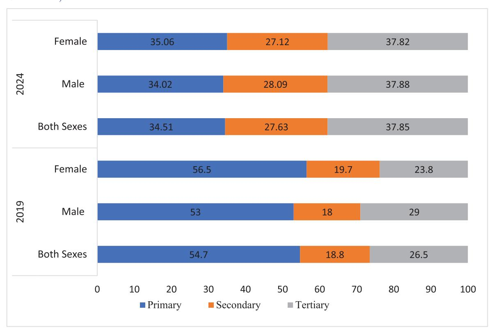

Table 5.6.3. Distribution of employed population aged 5+ years by industrial sectors, sex and area, Cambodia, 2019-2024

| Industry  |            | Total |         |            | Urban |         |            | Rural |         |
|-----------|------------|-------|---------|------------|-------|---------|------------|-------|---------|
| Sectors   | Both sexes | Males | Females | Both sexes | Males | Females | Both sexes | Males | Females |
| (1)       | (2)        | (3)   | (4)     | (5)        | (6)   | (7)     | (8)        | (9)   | (10)    |
|           | •          |       |         | 2019       | )     |         |            |       |         |
| Total     | 100        | 100   | 100     | 100        | 100   | 100     | 100        | 100   | 100     |
| Primary   | 54.7       | 53    | 56.5    | 21.4       | 21.3  | 21.4    | 75.9       | 74.3  | 77.6    |
| Secondary | 18.8       | 18    | 19.7    | 31.1       | 28.6  | 34      | 11         | 10.8  | 11.2    |
| Tertiary  | 26.5       | 29    | 23.8    | 47.5       | 50.1  | 44.6    | 13.1       | 14.9  | 11.3    |
|           | •          |       |         | 2024       | 4     |         |            |       |         |
| Total     | 100        | 100   | 100     | 100        | 100   | 100     | 100        | 100   | 100     |
| Primary   | 34.5       | 34.0  | 35.1    | 13.5       | 13.77 | 13.19   | 48.65      | 47.86 | 49.51   |
| Secondary | 27.6       | 28.1  | 27.1    | 32.19      | 30.91 | 33.63   | 24.57      | 26.16 | 22.82   |
| Tertiary  | 37.9       | 37.9  | 37.8    | 54.31      | 55.31 | 53.18   | 26.79      | 25.98 | 27.67   |

\*Note: Percentages are calculated after excluding those for whom the industrial group was not reported. The primary sector relates to industrial group "A". The secondary sector includes groups "B to F" and the tertiary sector covers the industrial groups "G to U"

### 6.1. Introduction

Migration is defined as the act of changing residency permanently from one geographical area to another. When the movement is within the same country it is described as internal migration and when it involves a change of country it is called international migration. In combination with fertility and mortality, migration determines the size and the rate of population growth, as well as its structure. The topic is of great importance and interest to demographers, economists, sociologists, human geographers, political scientists; lawyers and policy makers; planners and public administrators.

Migration is the geographic movement of people across a specified boundary for the purpose of establishing a new permanent, or semi-permanent, residence. Along with fertility and mortality, migration is a component of population change. The terms "immigration" and "emigration" are used to refer to moves between countries (i.e. international migration). The parallel terms "in-migration" and "out-migration" are used for migration within the country. For the purpose of this analysis a migrant refers to a person who has moved to the place of enumeration from another village or country where the person's last previous residence was located.

### 6.2. Migrant Population

According to Cambodia Inter-Censal Population Survey (CIPS 2024), almost 63 per cent of the population of Cambodia has never resided in other place than in their places of enumeration (Table 2.6.1). In urban areas this percentage is lower but in rural areas is higher (59.7 per cent vs 66.1 per cent). Another way, the percentage of migrants in Cambodia is 37 percent, in urban areas is 43 percent and in rural areas is 23 percent. The percentage of migrants in the population has declined. During the last e years, the percentage of the population who has always lived in the same place has decreased as compare to 2019. The trend is similar pattern between males and females.

Table 6.2.1. Population who has always lived in the place of enumeration, Cambodia, 2019\* and 2024\*

| Residence | Years | Both sex   | xes     | Mal        | e       | Fem       | nale    |
|-----------|-------|------------|---------|------------|---------|-----------|---------|
|           |       | Number     | Percent | Number     | Percent | Number    | Percent |
| (1)       | (2)   | (3)        | (4)     | (5)        | (6)     | (7)       | (8)     |
| Total     | 2019  | 12,214,542 | 78.5    | 5,819,682  | 79.9    | 6,394,860 | 80.1    |
|           | 2024  | 10,877,304 | 62.9    | 5,065,596  | 59.7    | 5,811,709 | 66.1    |
| Urban     | 2019  | 3,967,155  | 64.7    | 1,892,834  | 63.2    | 2,074,321 | 66.0    |
|           | 2024  | 4,074,146  | 56.8    | 1,898,385  | 54.2    | 2,175,762 | 59.3    |
| Rural     | 2019  | 8,247,387  | 87.6    | 3,926,848  | 85.8    | 4,320,539 | 89.3    |
|           | 2024  | 6,803,158  | 67.3    | 3,167,2111 | 63.5    | 3,635,947 | 71.0    |

\*Note: Excluding migrants whose previous residence was not classified.

At this stage in the data analysis, it is not possible to explain these trends. A thorough analysis, including cross tabulations with other variables, would be necessary to gain a better understanding of the situation. For the time being, it is important to state that migratory movements are declining in Cambodia.

Table 6.2.2. Percentage distribution of migrants by previous residence and sex, Cambodia 2019-2024

| Dec 1 - Dec 1 - Dec 2          | Both      | sexes     | M         | ale       | Fen       | nale      |
|--------------------------------|-----------|-----------|-----------|-----------|-----------|-----------|
| Previous Residence             | 2019      | 2024      | 2019      | 2024      | 2019      | 2024      |
| (1)                            | (2)       | (3)       | (4)       | (5)       | (6)       | (7)       |
| Number of Migrants             | 3,318,402 | 6,403,239 | 1,742,311 | 3,424,823 | 1,576,091 | 2,978,416 |
| Total                          | 100       | 100       | 100       | 100       | 100       | 100       |
| <b>Province of Enumeration</b> | 37.1      | 48.5      | 38.0      | 49.3      | 36.1      | 47.6      |
| Another Province               | 58.8      | 44.9      | 57.6      | 43.3      | 60.2      | 46.7      |
| Outside Cambodia               | 4.1       | 6.6       | 4.4       | 7.4       | 3.7       | 5.7       |

According to the CIPS 2024, numbers of migrants of both sexes have previously resided in same province of enumeration (intra-provincial) 48.5 percent. In other words, current migration movements are predominantly intra-provincial. However, the 2019 Census found that migration movement was predominantly within the intra-provincial (interprovincial). This trend was true for both males and females.

As in the previous case, an explanation of this trend requires more analyses involving additional variables. However, it is possible to hypothesize that this pattern is related to urban growth. The migration component of urbanization is usually associated with movements that involve longer distances. This might explain the pattern of increased inter-provincial migration, as rural individuals increasingly travel long distances to urban centres instead of engaging in earlier patterns of rural-to-rural inter-provincial movement.

### 6.3. Reasons for Migration

The question on reasons for migration shows in Table 6.3.1 presents information from the CIPS 2024 and Census 2019. The main reason for migration provided by interviewees in the 2024 and 2019 Census surveys was family movement. This reason for migration applies to household members who moved to the interview location from their previous residence because the entire household moved. For example, if a household member (especially the head of household) migrated to another location because of a change in his or her job, the reason for migration is job movement. For other members of the household who also moved with him or her, the reason for migration is family movement. The same is true for the reason for migration due to marriage. Female migration has a higher proportion for this reason. The percentage of migration for other reasons is higher among males, including job relocation, job search, and marriage.

Table 6.3.1. Reasons for migration by sex, Cambodia, 2019- 2024

| Daggang for Migration*                             | Both      | sexes     | M         | ale       | Fer       | nale      |
|----------------------------------------------------|-----------|-----------|-----------|-----------|-----------|-----------|
| Reasons for Migration*                             | 2019      | 2024      | 2019      | 2024      | 2019      | 2024      |
| (1)                                                | (2)       | (3)       | (4)       | (5)       | (6)       | (7)       |
| Number of Migrants                                 | 3,337,669 | 6,403,239 | 1,752,155 | 2,978,416 | 1,585,514 | 2,978,416 |
| Total                                              | 100       | 100       | 100       | 100       | 100       | 100       |
| Transfer of Workplace                              | 10.8      | 6.9       | 12.4      | 5.9       | 9.1       | 5.9       |
| In Search of Employment                            | 19.4      | 25.4      | 19.5      | 24.1      | 19.4      | 24.1      |
| Education                                          | 2.6       | 3.4       | 2.9       | 3.6       | 2.3       | 3.6       |
| Marriage                                           | 19.7      | 24.0      | 24.0      | 17.5      | 14.9      | 17.5      |
| Family moved                                       | 38.9      | 33.2      | 33.5      | 40.2      | 44.9      | 40.2      |
| Repatriation/Return After Displacement          | 0.6       | 0.2       | 0.6       | 0.3       | 0.7       | 0.3       |
| Natural Calamities                                 | 0.1       | 0.1       | 0.1       | 0.1       | 0.1       | 0.1       |
| Dislocation Due to Dam Construction             | 0.1       | 0.1       | 0.1       | 0.1       | 0.1       | 0.1       |
| Dislocation Due to Other Major or Small Project | 0.3       | 0.3       | 0.3       | 0.3       | 0.3       | 0.3       |
| Insecurity                                         | 0.7       | 0.4       | 0.6       | 0.5       | 0.8       | 0.5       |
| Orphaned                                           | 2.1       | 3.7       | 1.7       | 5.0       | 2.5       | 5.0       |
| Lost Land/Lost Home                                | 0.2       | 0.2       | 0.2       | 0.1       | 0.2       | 0.1       |
| Visiting Only                                      | 2.3       | 0.7       | 1.6       | 0.9       | 3.1       | 0.9       |
| Other                                              | 1.8       | 1.3       | 2.3       | 1.2       | 1.3       | 1.2       |
| Not stated                                         | 0.2       | 0         | 0.2       | 0         | 0.2       | 0         |

### **6.4. Migration Streams**

Table 6.4.1 shows the total internal migration classified by migration flow. According to the Population Census 2019, the most common migration flow was from rural to urban areas, ranking first, and from urban to urban areas, ranking second. However CIPS 2024, there was a significant change in the pattern: rural to rural and urban to urban migration became the main current flows, as did urban to urban migration. This change suggests a rapid and substantial process of urbanization.

Table 6.4.1. Percentage of internal migrants in the urban-rural migration stream, by sex, Cambodia 2019 and 2024\*

| Migration Streams  | Both            | Sexes     | Ma        | ale       | Fen       | nale      |
|--------------------|-----------------|-----------|-----------|-----------|-----------|-----------|
| Wilgiation Streams | 2019            | 2024      | 2019      | 2024      | 2019      | 2024      |
| (1)                | (2) (3) (4) (5) |           | (5)       | (6)       | (7)       |           |
| Internal Migrants  | 3,182,615       | 5.993.994 | 1,665,175 | 3.178.385 | 1,517,440 | 2.815.610 |
| Total              | 100             | 100       | 100       | 100       | 100       | 100       |
| Rural to Rural     | 29.0            | 33.9      | 30.7      | 35.2      | 27.1      | 32.4      |
| Rural to Urban     | 34.0            | 22.3      | 32.4      | 21.2      | 35.7      | 23.4      |
| Urban to Rural     | 7.0             | 15.8      | 7.6       | 15.8      | 6.3       | 15.7      |
| Urban to Urban     | 30.0            | 28.1      | 29.3      | 27.8      | 30.8      | 28.4      |

\*Note: Excluding migration outside Cambodia and unreported 409,245.

### 6.5. Duration of Residence

According to the CIPS 2024, the majority of migrants had lived in the interview area for at least 5 years prior to the census interval (64.0 percent, Table 6.5.1). The proportion of those who had lived in their current residence for 20+ years prior to the survey interval was 26.7 percent. In urban areas, the percentage of migrants was similar. However, in rural areas, the percentage was higher than in urban areas (around 27.5 percent).

Table 6.5.1. Distribution of internal migrants by number of years stayed in current residence, Cambodia, 2019 and 2024

| Camboura, 20 | 17 4114 2 | <b>-</b>  |       |      |             |            |           |      |
|--------------|-----------|-----------|-------|------|-------------|------------|-----------|------|
| Residence    | Year      | Internal  |       | N    | o. of Years | in Current | Residence |      |
| Residence    | Tear      | Migrants  | Total | < 1  | 1-4         | 5-9        | 10-19     | 20 + |
| (1)          | (2)       | (3)       | (4)   | (5)  | (6)         | (7)        | (8)       | (9)  |
| Total        | 2024      | 6,403,239 | 100   | 11.9 | 24.2        | 16.2       | 21.1      | 26.7 |
|              | 2019      | 3,331,120 | 100   | 9.8  | 28.1        | 16.9       | 22.3      | 23.0 |
| Urban        | 2024      | 3,098,059 | 100   | 8.3  | 25.0        | 17.9       | 22.9      | 25.9 |
|              | 2019      | 2,164,700 | 100   | 12.0 | 32.2        | 16.1       | 19.5      | 20.4 |
| Rural        | 2024      | 3,305,180 | 100   | 15.2 | 23.3        | 14.6       | 19.4      | 27.5 |
|              | 2019      | 1,166,420 | 100   | 5.7  | 20.5        | 18.3       | 27.5      | 27.9 |

In the CIPS 2024 and Population Census 2019, there were a higher proportion of internal migrants who reported living in their current residence for 20+ years. This trend reflects the significant amount of migration in 2024.

### 6.6. Migration by Age Group

As expected, most of migrated during their prime working ages, i.e. between 20 and 39 years of age. According to the CIPS 2024, almost half of the migrants were within this age group, both among males and females. Moreover, almost 87 percent of migrants were in the age group 15-64 years and this pattern holds for both males and females. It is important to note that in the entire population aged 10 years and older, 46 percent were in the prime working age groups. The age distribution of migrants was similar to that of the population as a whole.

Table 6.6.1. Percentage distribution of migrants aged 10+ years by age group and sex, Cambodia 2019 and 2024\*

| A and Canada | To        | otal      | $\mathbf{N}$ | ſale      | Fem       | ale       |
|--------------|-----------|-----------|--------------|-----------|-----------|-----------|
| Age Group    | 2019      | 2024      | 2019         | 2024      | 2019      | 2024      |
| (1)          | (2)       | (3)       | (4)          | (5)       | (6)       | (7)       |
| Migrants     | 3,178,959 | 6,148,930 | 1,670,720    | 3,286,074 | 1,508,239 | 2,862,856 |
| Total        | 100       | 100       | 100          | 100       | 100       | 100       |
| 10 - 14      | 4.2       | 3.3       | 4.2          | 3.5       | 4.2       | 3.2       |
| 15 - 19      | 6.6       | 6.5       | 6.3          | 5.9       | 7.0       | 7.2       |
| 20 - 24      | 9.7       | 10.7      | 9.1          | 10.2      | 10.3      | 11.2      |
| 25 - 29      | 13.1      | 11.0      | 13.2         | 11.6      | 13.1      | 10.4      |
| 30 - 34      | 12.9      | 12.4      | 13.5         | 13.3      | 12.3      | 11.3      |
| 35 - 39      | 13.0      | 11.8      | 13.9         | 12.3      | 12.1      | 11.2      |
| 40 - 44      | 7.5       | 11.3      | 8.0          | 12.0      | 6.9       | 10.4      |
| 45 - 49      | 8.0       | 6.3       | 8.4          | 6.8       | 7.6       | 5.8       |
| 50 - 54      | 6.9       | 6.5       | 7.1          | 6.7       | 6.7       | 6.4       |
| 55 - 59      | 6.1       | 5.3       | 6.0          | 5.4       | 6.1       | 5.3       |
| 60 - 64      | 4.4       | 5.2       | 3.9          | 4.8       | 5.0       | 5.7       |
| 65 - 69      | 3.2       | 3.7       | 2.9          | 3.1       | 3.7       | 4.4       |
| 70 - 74      | 1.9       | 2.6       | 1.7          | 2.0       | 2.2       | 3.4       |
| 75 +         | 2.2       | 1.6       | 1.8          | 1.2       | 2.6       | 2.1       |

### 6.7. Economic Activity of Migrants

Table 6.7.1 shows that a high percentage of migrants were engaged in rural economic activities, especially in agriculture (41 percent), mining and quarrying (15.0 percent), wholesale and retail trade, repair of motor vehicles and motorcycles (11.6 percent), and construction (11.0 percent). However, the remaining percentages of migrants are mostly involved in urban economic activities. They are mostly employed in wholesale and retail trade, repair of motor vehicles and motorcycles (20.5 percent), manufacturing (19.9 percent), and (9.9 percent) in agriculture forestry and fishing in urban.

Table 6.7.1. Percentage distribution of internal migrants aged 5+ years who are economically active by major industry group, sex and area of prior residence, Cambodia, 2024\*

| Major industry group                                        |           | Total     |           |           | Urban     |         |           | Rural   |         |
|-------------------------------------------------------------|-----------|-----------|-----------|-----------|-----------|---------|-----------|---------|---------|
|                                                             | Both      | Male      | Female    | Both      | Male      | Female  | Both      | Male    | Female  |
|                                                             | sexes     |           |           | sexes     |           |         | sexes     |         |         |
| Total migrants                                              | 4,792,219 | 2,806,153 | 1,986,066 | 2,158,839 | 1,245,094 | 913,745 | 2,633,380 | 1561060 | 1072320 |
| Total                                                       | 100       | 100       | 100.0     | 100       | 100       | 100     | 100       | 100     | 100     |
| A - Agriculture Forestry and Fishing                        | 27.0      | 27.5      | 26.5      | 6.6       | 10.4      | 9.2     | 41.1      | 41.1    | 41.2    |
| B - Mining and Quarrying                                    | 1.3       | 1.4       | 1.1       | 1.1       | 1.2       | 1.0     | 1.4       | 1.5     | 1.2     |
| C – Manufacturing                                           | 17.2      | 13.3      | 22.7      | 19.9      | 15.4      | 26.1    | 15.0      | 11.6    | 19.8    |
| D – Electricity, Gas, Steam and Air-Conditioning Supply     | 0.1       | 0.2       | 0.0       | 0.2       | 0.4       | 00.00   | 0.1       | 0.1     | 0.0     |
| E - Water Supply; Sewerage, Waste Management and            | 0.5       | 0.7       | 0.3       | 0.7       | 6.0       | 0.45    | 0.4       | 0.5     | 0.3     |
| F - Construction                                            | 9.1       | 13.0      | 3.6       | 6.7       | 10.5      | 1.7     | 11.0      | 15.0    | 5.3     |
| G - Wholesale and Retail Trade; Repair of Motor Vehicles    | 15.6      | 12.5      | 19.9      | 20.5      | 16.6      | 25.7    | 11.6      | 9.3     | 15.0    |
| H - Transportation and Storage                              | 5.5       | 8.7       | 1.0       | 8.0       | 12.9      | 1.3     | 3.4       | 5.2     | 0.7     |
| I - Accommodation and Food Service Activities               | 6.4       | 4.3       | 9.4       | 9.3       | 9.9       | 12.9    | 4.1       | 2.4     | 6.4     |
| J - Information and Communication                           | 0.5       | 0.0       | 0.3       | 6.0       | 1.2       | 0.0     | 0.2       | 0.2     | 0.1     |
| K - Financial and Insurance Activities                      | 1.6       | 2.0       | 1.1       | 2.2       | 2.6       | 1.7     | 1.1       | 1.5     | 9.0     |
| L - Real Estate Activities                                  | 0.1       | 0.1       | 0.1       | 0.2       | 0.2       | 0.1     | 0.1       | 0.0     | 0.1     |
| M – Professional, Scientific and Technical activities       | 8.0       | 8.0       | 0.8       | 1.4       | 1.3       | 1.6     | 0.3       | 0.4     | 0.2     |
| N - Administrative and Support Service Activities           | 2.2       | 2.2       | 2.3       | 3.2       | 3.0       | 3.4     | 1.4       | 1.5     | 1.3     |
| O - Public Administration and Defense; Compulsory           | 4.1       | 5.8       | 1.7       | 5.8       | 8.0       | 2.9     | 2.7       | 4.1     | 0.7     |
| P - Education                                               | 2.1       | 2.0       | 2.2       | 2.3       | 2.1       | 2.6     | 1.8       | 1.9     | 1.8     |
| Q - Human Health and Social Work Activities                 | 6.0       | 1.0       | 0.8       | 1.1       | 1.2       | 1.0     | 0.7       | 0.7     | 9.0     |
| R – Arts, Entertainment and Recreation                      | 1.4       | 1.2       | 1.8       | 1.5       | 1.4       | 1.7     | 1.3       | 1.0     | 1.8     |
| S - Other Service Activities                                | 2.5       | 2.2       | 2.9       | 3.5       | 2.9       | 4.4     | 1.6       | 1.6     | 1.6     |
| T - Activities of Households as Employers;                  | 6.0       | 9.0       | 1.4       | 1.2       | 6.0       | 1.6     | 0.7       | 0.4     | 1.2     |
| U - Activities of Extraterritorial Organizations and Bodies | 0.1       | 0.1       | 0.1       | 0.2       | 0.3       | 0.1     | 0.0       | 0.0     | 0.0     |

\*Note: Excluding migrants from outside Cambodia and persons whose nature of economic activity is not reported.

Migrants had approximately the same activities as the population in general (table 5.6.2). This is a very important issue because there seem to be no special activities that attract migrants in Cambodia. Instead, it appears to be the entire economy that has labour force demands, in particular in urban areas.

### 6.8. Migration by educational

In general, most migrants have higher education than non-movers. About 28.2 percent of the population has completed primary education whereas 28.9 percent for migrants. However, 18.2 percent of the population reported attaining a lower secondary education, while this figure was 19.6 percent among migrants (see tables 4.4.1 and 6.8.1 respectively).

However, the percentage literate among migrants and non-migrants minor differs: 87.2 and 86.2 percent, respectively. The reason is that illiteracy is a strong deterrent to migrate, mainly because of a lack of access to information that can facilitate successful migration, but also because the place of destination or work especially in urban areas usually requires higher qualification.

Table 6.8.1. Percentage distribution of internal migrants aged 7+ years by literacy status, educational level, sex and age group, Cambodia, 2024

|                   | Other                                          | 0.1        | 0.0     | 0.0     | 0.0     | 0.0     | 0.0     | 0.0     | 0.1     | 0.0     | 0.0     | 0.1     | 0.2     | 0.3     | 0.0     | 8.0     | 0.0     | 0.1       | 0.0    | 0.0     | 0.0      | 0.0     | 0.0     | 0.0     | 0.1     | 0.1     | 0.0     | 0.1     | 0.2     | 0.4     | 0.0     | 0.0     | 0.0    |
|-------------------|------------------------------------------------|------------|---------|---------|---------|---------|---------|---------|---------|---------|---------|---------|---------|---------|---------|---------|---------|-----------|--------|---------|----------|---------|---------|---------|---------|---------|---------|---------|---------|---------|---------|---------|--------|
|                   | Master's Degree/ PhD                     | 0.8        | 0.0     | 0.0     | 0.1     | 0.5     | 6.0     | 1.0     | 1.2     | 1.0     | 0.5     | 1.1     | 1.2     | 0.5     | 1.1     | 9.0     | 0.7     | 1.1       | 0.0    | 0.0     | 0.0      | 0.5     | 1.1     | 1.5     | 1.5     | 1.3     | 8.0     | 1.8     | 2.0     | 8.0     | 2.2     | 1.4     | 6.0    |
|                   | Bachelo r's Degree                       | 4.9        | 0.0     | 0.0     | 0.2     | 4.8     | 0.6     | 10.1    | 8.9     | 5.3     | 3.2     | 3.4     | 2.5     | 8.0     | 0.5     | 0.5     | 0.4     | 5.9       | 0.0    | 0.0     | 0.1      | 4.2     | 6.4     | 12.2    | 9.8     | 7.1     | 4.0     | 4.0     | 3.6     | 6.0     | 0.2     | 9.0     | 0.4    |
|                   | Technical/ Vocational Post- secondary | 1.6        | 0.0     | 0.0     | 6.0     | 2.6     | 3.2     | 2.6     | 1.4     | 1.1     | 0.3     | 1.4     | 1.7     | 0.4     | 0.4     | 0.1     | 0.0     | 1.8       | 0.0    | 0.0     | 0.4      | 2.6     | 3.2     | 3.2     | 1.5     | 1.3     | 0.5     | 2.0     | 2.9     | 0.5     | 0.5     | 0.0     | 0.0    |
| 0                 | Technical/ Vocational Pre- secondary  | 0.4        | 0.0     | 0.0     | 0.1     | 0.7     | 0.5     | 0.3     | 9.0     | 0.3     | 0.3     | 0.5     | 8.0     | 0.1     | 0.0     | 0.0     | 0.4     | 0.5       | 0.0    | 0.0     | 0.0      | 8.0     | 0.7     | 0.4     | 9.0     | 0.5     | 0.4     | 0.4     | 1.2     | 0.1     | 0.0     | 0.0     | 0.4    |
| Level             | Secondary School/ Baccalaure ate      | 7.5        | 0.0     | 0.0     | 11.3    | 21.8    | 8.7     | 7.1     | 5.5     | 5.0     | 3.8     | 6.1     | 0.9     | 1.1     | 1.6     | 2.7     | 2.2     | 9.7       | 0.0    | 0.0     | 11.2     | 21.0    | 8.8     | 8.1     | 5.5     | 5.4     | 3.6     | 7.3     | 7.0     | 1.7     | 1.8     | 3.3     | 2.8    |
| Educational Level | Lower                                          | 19.6       | 0.0     | 1.0     | 31.3    | 22.4    | 21.9    | 21.9    | 21.2    | 20.4    | 19.2    | 18.5    | 16.4    | 13.5    | 14.7    | 15.0    | 12.9    | 21.4      | 0.0    | 1.3     | 29.2     | 22.5    | 22.4    | 20.5    | 24.1    | 23.8    | 23.1    | 22.7    | 19.9    | 20.0    | 18.4    | 21.9    | 18.1   |
| ,                 | Primary Completed                           | 28.9       | 0.0     | 32.8    | 41.1    | 29.7    | 31.5    | 29.9    | 32.5    | 28.6    | 29.6    | 26.8    | 25.2    | 18.3    | 20.1    | 19.4    | 20.6    | 28.7      | 0.0    | 30.6    | 40.7     | 28.3    | 29.4    | 29.8    | 31.1    | 27.6    | 30.3    | 29.0    | 28.1    | 23.0    | 21.5    | 21.9    | 25.3   |
| •                 | Primary Not Completed                    | 35.6       | 80.3    | 65.6    | 14.6    | 17.5    | 24.2    | 27.0    | 30.4    | 37.8    | 42.3    | 41.6    | 45.2    | 64.4    | 8.65    | 58.7    | 60.4    | 32.3      | 81.4   | 6.99    | 17.8     | 20.0    | 24.7    | 24.1    | 26.6    | 32.3    | 36.6    | 32.4    | 34.8    | 52.1    | 54.0    | 49.7    | 51.2   |
| •                 | None                                           | 8.0        | 19.7    | 0.7     | 0.5     | 0.0     | 0.1     | 0.1     | 0.3     | 0.4     | 8.0     | 0.5     | 0.7     | 0.7     | 1.9     | 2.2     | 2.4     | 8.0       | 18.6   | 1.1     | 9.0      | 0.1     | 0.1     | 0.2     | 0.3     | 9.0     | 8.0     | 0.3     | 0.4     | 0.4     | 1.4     | 1.3     | 1.0    |
| 0                 | Total                                          | 100.0      | 100.0   | 100.0   | 100.0   | 100.0   | 100.0   | 100.0   | 100.0   | 100.0   | 100.0   | 100.0   | 100.0   | 100.0   | 100.0   | 100.0   | 100.0   | 100.0     | 100.0  | 100.0   | 100.0    | 100.0   | 100.0   | 100.0   | 100.0   | 100.0   | 100.0   | 100     | 100     | 100     | 100     | 100     | 100    |
| 0                 | Total Migrants                              | 5,622,846  | 104,480 | 201,725 | 391,618 | 636,418 | 648,171 | 720,966 | 675,604 | 608,319 | 335,519 | 351,061 | 271,043 | 249,754 | 178,766 | 123,377 | 126,024 | 3,109,896 | 58,855 | 112,281 | 188,919  | 321,580 | 361,616 | 417,658 | 384,069 | 363,560 | 198,574 | 200,248 | 156,227 | 135,773 | 84,689  | 56,651  | 961'99 |
|                   | Literate                                       | 87.2       | 83.3    | 8.96    | 9.96    | 626     | 92.7    | 92.1    | 90.1    | 84.2    | 82.7    | 85.0    | 80.0    | 74.7    | 74.2    | 75.2    | 64.2    | 9.06      | 84.3   | 8.96    | 8.26     | 94.4    | 92.1    | 93.1    | 92.4    | 88.0    | 87.2    | 90.5    | 8.98    | 84.6    | 82.9    | 86.1    | 82.9   |
| Status            | Illiter ate                                 | 12.8       | 16.7    | 3.2     | 3.4     | 4.1     | 7.3     | 7.9     | 6.6     | 15.8    | 17.3    | 15.0    | 20.0    | 25.3    | 25.8    | 24.8    | 35.8    | 9.4       | 15.7   | 3.2     | 4.2      | 9.9     | 7.9     | 6.9     | 9.7     | 12.0    | 12.8    | 9.5     | 13.2    | 15.4    | 17.1    | 13.9    | 17.1   |
| Literacy Status   | Total                                          | 100        | 100     | 100     | 100     | 100     | 100     | 100     | 100     | 100     | 100     | 100     | 100     | 100     | 100     | 100     | 100     | 100       | 100    | 100     | 100      | 100     | 100     | 100     | 100     | 100     | 100     | 100     | 100     | 100     | 100     | 100     | 100    |
|                   | Total                                          | 6,257,045  | 108,115 | 204,315 | 269,668 | 626,619 | 886,679 | 761,049 | 726,389 | 693,625 | 389,063 | 402,722 | 327,061 | 322,658 | 228,778 | 162,001 | 195,564 | 3,347,085 | 61,011 | 113,864 | 1193,811 | 334,747 | 381,684 | 437,892 | 405,704 | 395,775 | 221,896 | 218,721 | 176,074 | 159,049 | 102,725 | 900'59  | 79,123 |
|                   | Age Group                                   | Both Sexes | 7-9     | 10 - 14 | 15 - 19 | 20 - 24 | 25 - 29 | 30 - 34 | 35 - 39 | 40 - 44 | 45 - 49 | 50 - 54 | 55 - 59 | 60 - 64 | 69 - 59 | 70 - 74 | 75+     | Male      | 7-9    | 10 - 14 | 15 - 19  | 20 - 24 | 25 - 29 | 30 - 34 | 35 - 39 | 40 - 44 | 45 - 49 | 50 - 54 | 55 - 59 | 60 - 64 | 69 - 59 | 70 - 74 | 75+    |

Table 6.8.1. Percentage distribution of internal migrants aged 7+ years by literacy status, educational level, sex and age group, Cambodia, 2024 (Cou)

|   |                   |                                                | Γ         | Ι      | Г       | 1       |         |         | <u> </u> |         |         |         |         | Ι       | <u> </u> | Г       | Г       |         |
|---|-------------------|------------------------------------------------|-----------|--------|---------|---------|---------|---------|----------|---------|---------|---------|---------|---------|----------|---------|---------|---------|
|   |                   | Other                                          | 0.1       | 0.0    | 0.0     | 0.0     | 0.0     | 0.0     | 0.0      | 0.0     | 0.0     | 0.0     | 0.1     | 0.2     | 0.2      | 0.0     | 1.4     | 0.0     |
|   |                   | Master's Degree/ PhD                     | 0.4       | 0.0    | 0.0     | 0.1     | 0.5     | 0.7     | 0.2      | 8.0     | 0.4     | 0.2     | 0.1     | 0.1     | 0.0      | 0.0     | 0.0     | 0.5     |
|   |                   | Bachelo r's Degree                       | 3.6       | 0.0    | 0.0     | 0.3     | 5.3     | 8.0     | 7.2      | 4.3     | 2.6     | 1.9     | 2.6     | 1.1     | 8.0      | 8.0     | 0.4     | 0.4     |
|   |                   | Technical/ Vocational Post- secondary | 1.3       | 0.0    | 0.0     | 1.4     | 2.5     | 3.2     | 1.8      | 1.4     | 0.7     | 0.0     | 9.0     | 0.1     | 0.2      | 0.3     | 0.2     | 0.0     |
| 0 |                   | Technical/ Vocational Pre- secondary  | 0.3       | 0.0    | 0.0     | 0.2     | 0.7     | 0.3     | 0.2      | 9.0     | 0.1     | 0.3     | 0.7     | 0.3     | 0.0      | 0.0     | 0.0     | 0.4     |
| , | Level             | Secondary School/ Baccalaure ate      | 7.3       | 0.0    | 0.0     | 11.4    | 22.6    | 9.8     | 5.7      | 5.4     | 4.4     | 4.0     | 4.4     | 4.6     | 0.2      | 1.4     | 2.2     | 1.5     |
|   | Educational Level | Secondary Secondary Secondary Baccalaure ate   | 17.4      | 0.0    | 9.0     | 33.2    | 22.3    | 21.4    | 23.8     | 17.3    | 15.3    | 13.5    | 12.9    | 11.7    | 5.8      | 11.2    | 9.1     | 7.2     |
|   |                   | Primary Completed                           | 29.0      | 0.0    | 35.4    | 41.4    | 31.1    | 34.2    | 30.0     | 34.4    | 30.1    | 28.6    | 23.9    | 21.3    | 12.6     | 18.7    | 17.4    | 15.5    |
| , |                   | Primary Not Completed                    | 39.6      | 78.9   | 63.8    | 11.6    | 15.0    | 23.6    | 31.0     | 35.4    | 46.0    | 50.7    | 53.9    | 59.4    | 0.67     | 65.4    | 66.4    | 9.07    |
| 3 |                   | None                                           | 1.0       | 21.1   | 0.1     | 0.4     | 0.0     | 0.1     | 0.0      | 0.3     | 0.3     | 8.0     | 6.0     | 1.2     | 1.1      | 2.3     | 3.0     | 3.9     |
| 0 |                   | Total                                          | 100       | 100    | 100     | 100     | 100     | 100     | 100      | 100     | 100     | 100     | 100     | 100     | 100      | 100     | 100     | 100     |
|   |                   | Total Migrants                              | 2,512,951 | 45,625 | 89,444  | 202,699 | 314,839 | 286,555 | 303,308  | 291,535 | 244,758 | 136,945 | 150,813 | 114,816 | 113,981  | 91,077  | 66,727  | 59,828  |
|   |                   | Literate                                       | 83.3      | 82.1   | 8.96    | 97.4    | 97.5    | 93.4    | 8.06     | 87.0    | 79.0    | 8.92    | 78.4    | 72.2    | 65.0     | 67.1    | 6.79    | 51.4    |
|   | Status            | Witerate                                       | 16.7      | 17.9   | 3.2     | 2.6     | 2.5     | 9.9     | 9.2      | 13.0    | 21.0    | 23.2    | 21.6    | 27.8    | 35.0     | 32.9    | 32.1    | 48.6    |
| 0 | Literacy Status   | Total                                          | 100       | 100    | 100     | 100     | 100     | 100     | 100      | 100     | 100     | 100     | 100     | 100     | 100      | 100     | 100     | 100     |
|   |                   | Total Migrants                              | 2,909,961 | 47,105 | 90,451  | 205,886 | 321,872 | 297,704 | 323,156  | 320,685 | 297,850 | 167,167 | 184,000 | 150,987 | 163,609  | 126,052 | 566'96  | 116,441 |
|   |                   | Age Group                                   | Female    | 7-9    | 10 - 14 | 15 - 19 | 20 - 24 | 25 - 29 | 30 - 34  | 35-39   | 40 - 44 | 45 - 49 | 50 - 54 | 55 - 59 | 60 - 64  | 69 - 59 | 70 - 74 | 75+     |

### 6.9. Immigrants

As indicated earlier in this section, international migrants are classified into immigrants and emigrants. The former are those who entered the country and the latter those who exited the country. In a census it is difficult to measure emigration because they were not in the country/place of enumeration during the census period. Some attempts have been carried out to estimate this population but have met with little success. Immigration is less difficult as the persons can be interviewed. In the CIPS 2024, data about the respondent's previous place of residence and place of birth were collected.

Table 6.9.1 shows the distribution of economically active immigrants according to the nature of the economic activity that they were engaged in. Most immigrants were working in agriculture. However, proportionately fewer than within the entire population (31.3 percent rather than. 34.5 percent). When compared with the total population, more migrants worked in wholesale and retail trade, construction and manufacturing (compare table 6.9.1 with table 5.6.2).

Table 6.9.1. Percentage distribution of immigrants aged 5+ years who are economically active, by sex and major industry group, Cambodia, 2024

| Major Industry Group                                         | Both Sexes | Male    | Female  |
|--------------------------------------------------------------|------------|---------|---------|
| (1)                                                          | (2)        | (3)     | (4)     |
| Total Immigrants                                             | 368,034    | 230,415 | 137,618 |
| Total                                                        | 100        | 100     | 100     |
| A - Agriculture Forestry and Fishing                         | 31.3       | 32.7    | 29.1    |
| B - Mining and Quarrying                                     | 4.0        | 3.9     | 4.0     |
| C - Manufacturing                                            | 13.7       | 12.7    | 15.5    |
| D - Electricity, Gas, Steam and Air-Conditioning Supply      | 0.1        | 0.1     | 0.0     |
| E - Water Supply; Sewerage, Waste Management and             |            |         |         |
| Remediation Activities                                       | 0.7        | 0.8     | 0.6     |
| F - Construction                                             | 27.1       | 28.8    | 24.3    |
| G - Wholesale and Retail Trade; Repair of Motor Vehicles and |            |         |         |
| Motorcycles                                                  | 8.2        | 6.9     | 10.6    |
| H - Transportation and Storage                               | 2.2        | 3.0     | 0.9     |
| I - Accommodation and Food Service Activities                | 4.9        | 3.8     | 6.9     |
| J - Information and Communication                            | 0.1        | 0.2     | 0.0     |
| K - Financial and Insurance Activities                       | 0.2        | 0.3     | 0.0     |
| L - Real Estate Activities                                   | 0.0        | 0.0     | 0.0     |
| M – Professional, Scientific and Technical Activities        | 0.1        | 0.0     | 0.2     |
| N - Administrative and Support Service Activities            | 3.1        | 2.9     | 3.4     |
| O - Public Administration and Defense; Compulsory Social     |            |         |         |
| Security                                                     | 0.9        | 1.1     | 0.5     |
| P - Education                                                | 0.0        | 0.0     | 0.0     |
| Q - Human Health and Social Work Activities                  | 0.5        | 0.6     | 0.4     |
| R - Arts Entertainment and Recreation                        | 0.6        | 0.5     | 0.8     |
| S - Other Service Activities                                 | 1.4        | 1.2     | 1.8     |
| T - Activities of Households as Employers; Undifferentiated  |            |         |         |
| Goods- and Services                                          | 0.8        | 0.6     | 1.3     |
| U - Activities of Extraterritorial Organizations and Bodies  | 0.0        | 0.0     | 0.0     |

FERTILITY 7

### 7.1. Introduction

Fertility refers to the number of live births women have. It differs from fecundity, which denotes the physiological capability of women to reproduce. Fertility is directly determined by a number of demographic factors called intermediate variables (age at marriage, use of contraception, period of breastfeeding, etc.) factors which, in turn, are affected by many other factors: social, cultural, environmental, economic, and health.

In general, fertility data is usually collected by the Vital Statistical System through birth registration. If the respective data is not collected or is incomplete, like in Cambodia, the survey and census are the major source of data. At the CIPS 2024 as well as the census 2019, 2008 and 1998 were included an item specially design to measure current fertility: Child Ever Born (CEB) and Children Born during the 12 months preceding to the date of the data collection by age of woman. From this survey item it is possible to compute the Age-Specific Fertility Rates (ASFR) and the Total Fertility Rate (TFR).

Due to forgetfulness or bias report on number of Children Ever Born (CEB) and the Age Specific Fertility Rate (ASFR) Then the Total Fertility Rate (TFR) will least reliability. Based on this argument, there are several indirect fertility rate method of estimation of Total Fertility Rate (TFR) were applied. As mentioned earlier, William Brass developed the indirect fertility rate method to reduce this deficiency. Other demographers after he improved this method, including REL-GMPZ, used the technique developed by Brass and colleagues "for evaluating and adjusting fertility estimates obtained from retrospective reports of birth histories or birth history characteristics", etc. This method of calculation is used for the CIPS 2024.

Table 7.1.1 Estimated Age-Specific Fertility Rate and Total Fertility Tate by Residence Cambodia, 2024

| Age-Specific Fertility Rate (ASFR) | Total   | Urban   | Rural   |
|------------------------------------|---------|---------|---------|
| (1)                                | (2)     | (3)     | (4)     |
| 15 - 19                            | 0.03966 | 0.02812 | 0.04769 |
| 20 - 24                            | 0.10839 | 0.10102 | 0.11428 |
| 25 - 29                            | 0.12240 | 0.12186 | 0.12566 |
| 30 - 34                            | 0.10629 | 0.10434 | 0.11042 |
| 35 - 39                            | 0.07744 | 0.07173 | 0.08327 |
| 40 - 44                            | 0.03493 | 0.02914 | 0.03989 |
| 45 - 49                            | 0.00430 | 0.00301 | 0.00544 |
| Total Fertility Rates (TFR)        | 2.5     | 2.3     | 2.6     |
| Crude Birth Rate (CBR)             | 20.6    | 19.9    | 21.4    |
| General Fertility Rate (GFR)       | 0.075   | 0.069   | 0.080   |
| Child Women Ratio (CWR)            | 0.31    | 0.28    | 0.33    |
| Gross Reproductive Rate (GRR)      | 1.11    | 0.98    | 1.21    |
| Net Reproductive Rate (NRR)        | 1.10    | 0.97    | 1.20    |
| Mean Age at Child Bearing (MACB)   | 29.4    | 29.3    | 29.5    |

### 7.2. Age-Specific Fertility Rate (ASFR)

Figure 7.2.1 shows the ASFRs (adjusted) corresponding to CIPS 2024. The shape of the curves indicates that fertility increases with age, reaching its peak in age group 25-29 and then experiencing a decline. This shape indicates that a moderate proportion of women have children too young or too old. For example, teenage age 15-19 fertility is 40 lives births per 1,000 women. Although it is a low rate, efforts should be made to reduce it even more, considering the negative individual and social consequences of teenage pregnancy. At the other extreme, 1,000 women who are finishing their reproductive life (45-49) had 4 children on average.

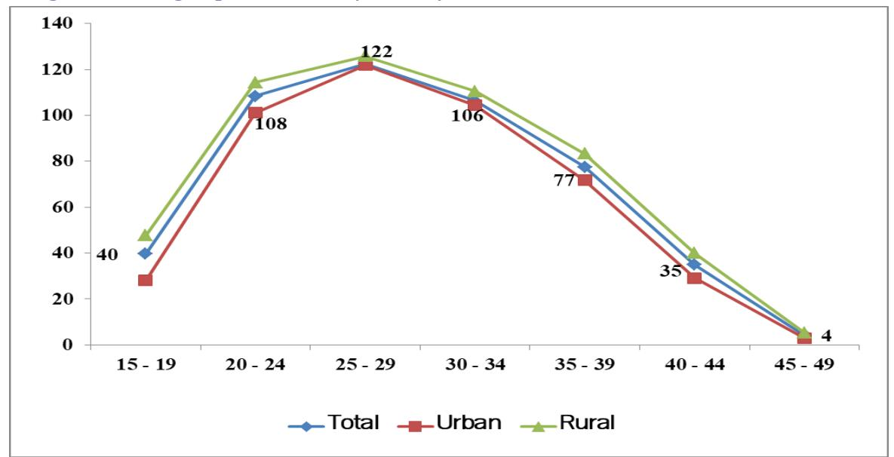

Figure 7.2.1. Age-Specific Fertility Rate by Residence Cambodia, 2024

### 7.3. Total Fertility Rate (TFR)

TFR is a measure the fertility of women throughout their reproductive years, based on the Age-Specific Fertility Rate for ages 15-49 recorded for a given population in a given year. TFR represents the average number of children a woman would have if she fast-forwarded through her childbearing years in a given year, under the Age-Specific Fertility Rate for that year. In other words, it is the number of children a woman would have if she were to experience the same fertility rate at all ages starting in a given year and survive through her childbearing years.

The Total Fertility Rate (TFR) is related to the Age-Specific Fertility Rate (ASFR). There is little difference in fertility between urban and rural areas. It should be noted that all values calculated here correspond to May 3, 2023, through May 2, 2024.

The direct Total Fertility Rate (TFR) is (1.4 births per woman) unreasonably lower than the indirect method. This indicates used the number of children born in the 12 months preceding the survey is not counted. This problem has arisen in many countries due to the omission of children born in the year preceding the census and survey, such as those who died, errors in the provisional location of birth, superstition, missing the date of birth if the child was answered by a non-birth mother, etc. In Cambodia, the omission of interviews is significant but not large enough to avoid a reliable correction.

Figure 7.3.1 shows the Total Fertility Rate, urban and rural, 2019-2024. In general, the Total Fertility Rate in urban is lower than in rural, but in the case of Cambodia, the difference in Total Fertility Rates is marginally, at 2.3 versus 2.6 per woman. Over the past five years, the Total Fertility Rate has remained relatively unchanged, however compared to the Cambodia Demographic and Health Survey 2021-22, there has been a notable change in both urban (2.4 versus 2.3) and rural (3 versus 2.6).

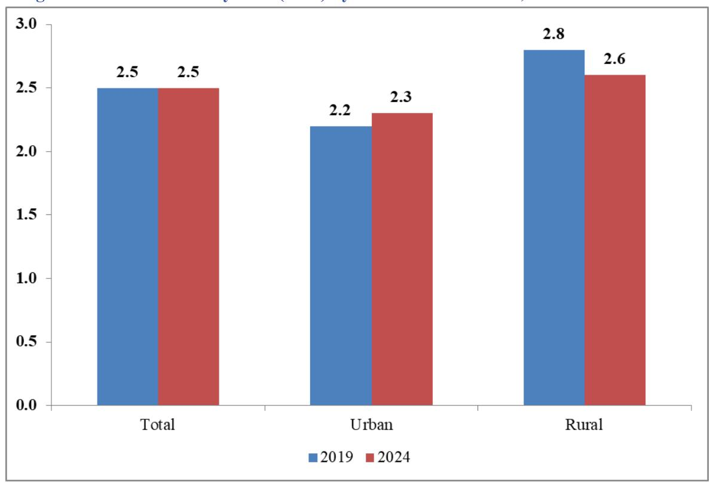

Figure 7.3.1. Total Fertility Rate (TFR) by Residence Cambodia, 2019-2024

Table 7.3.1 shows the Total Fertility Rate (TFR) calculated by the indirect and direct methods. There are differences in the results of the calculations using different methods, however the differences are small. Therefore, based on the assessment of the TFR trend, the Brass-Arriaga method is the most suitable for calculating the TFR in Cambodia. The Gompertz method has also been considered for calculating the TFR, but the calculation of the Age-Specific Fertility Rate (ASFR) is somewhat more complicated.

Table 7.3.1. Total Fertility Rate using different indirect methods, Cambodia, 2024

| Method        | Total Ferti | ility Rate |
|---------------|-------------|------------|
|               | (TFR)-2019  | (TFR)-2024 |
| (1)           | (2)         | (3)        |
| Brass-Arriaga | 2.5         | 2.3        |
| Rele          | 2.4         | 2.2        |
| Gompertz      | 2.7         | 2.5        |
| Direct        | 1.7         | 1.4        |

### 7.4. Other Related Indicators

As shown in Table 7.1.1, other birth rates are also calculated. The simplest birth rate is the Crude Birth Rate (CBR), which is the number of live births per 1,000 populations in a year. In the case of Cambodia, the CBR in 2024 was 20.6 per 1,000 total populations.

The next calculation of birth rates is the General Fertility Rate (GFR), which is the number of live births per 1,000 women aged (15-49) in a given year. In Cambodia, there are 76 live births per 1,000 women of reproductive age (15-49). The General Fertility Rate is more accurately measured than the Crude Birth Rate because it relates to births by age and sex group (ages 15-49). The General Fertility Rate helps to correct for the inaccuracies that may arise due to births in different age and sex groups within the population. Therefore, the General Fertility Rate is a better basis for comparing the level of childbearing among a population than using the Crude Birth Rate, but it still varies due to the sex and age composition of the population.

The next ratio is the Child-Woman Ratio (CWR), which is the number of children under five years of age among women of reproductive age (15-49). This calculation is made when the Total Fertility Rate is not available for use. However, it is affected and varies by age group in the population and incomplete from census and survey. Cambodia has a Child-Woman Ratio (CWR) of 310 per 1,000 women (15-49). In addition, three important indicators related to fertility are also calculated to check the number of children a woman has to replace her generation, namely the Gross Replacement Rate (GRR). If the value is equal to one, it means that the woman will replace herself. If the value is greater than one, it means that the next generation will have more women than the current generation. If the value is less than one, it means that the next generation will have fewer women than the current generation. For CIPS 2024, this rate is equal to 1.11, means that next generation is having more daughters than her generation. Please clarify that this rate does not consider that women in reproductive age will survive to the end of their reproductive years? To check whether women of reproductive age will survive to the end of their reproductive years, another rate is used, which is the Net Replacement Rate (NRR), which is calculated by looking at the probability of survival among women of reproductive age in the life table. The Net Replacement Rate (NRR) in Cambodia for 2024 is 1.10. At the same time, the Mean Age at Child Bearing (MACB) of Cambodian women is 29.4 years.

### 7.5. Women by Parity or Children Ever Born (CEB)

Table 7.5.1 shows the main measure of fertility as a percentage of women by number of live births (live birth gap). For example, 13.8% of women in the age group 15 and above had 3 children and the average number of children ever born was 1.9, based on the results of the census interval survey. 30.6% of women were childless. Table 7.5.1 also shows information by age group, example, 25.0% of women in the age group 35-39 on average had 3 children.

The last column in Table 7.5.1 shows the mean number of CEB by age of women. For example, women 20-24 on average had 0.4 children by the reference time of the survey, whereas women 50-54 had 3.0 children. The number of CEB corresponding to women at the end of their reproductive life (45-49 years) is called "completed fertility cycle", and according to table 7.5.1 this was 2.6 children.

In general, the number of live births increases by age woman increased. The decline in fertility can be attributed to memory loss, meaning that women may forget to count some of their children, especially those who died.

Table 7.5.1. Women by parity and children ever born, Cambodia, 2024

|              |           |      |      | Parity |      |      |      |       | Children Ex | er Born |
|--------------|-----------|------|------|--------|------|------|------|-------|-------------|---------|
| Age Group | Women     | 0    | 1    | 2      | 3    | 4    | 5+   | Total | Number      | Mean    |
| (1)          | (2)       | (3)  | (4)  | (5)    | (6)  | (7)  | (8)  | (9)   | (10)        | (11)    |
| Total        | 6,572,093 | 30.6 | 14.3 | 20.4   | 13.8 | 7.9  | 13.0 | 100.0 | 12,688,543  | 1.9     |
| 15 - 19      | 793,665   | 95.2 | 4.1  | 0.5    | 0.0  | 0.1  | 0.1  | 100.0 | 47,546      | 0.1     |
| 20 - 24      | 744,490   | 68.3 | 23.5 | 7.4    | 0.5  | 0.2  | 0.1  | 100.0 | 305,885     | 0.4     |
| 25 - 29      | 688,203   | 37.6 | 31.0 | 24.6   | 5.5  | 0.9  | 0.6  | 100.0 | 706,992     | 1.0     |
| 30 - 34      | 741,963   | 21.0 | 22.7 | 37.8   | 14.3 | 3.0  | 1.1  | 100.0 | 1,178,432   | 1.6     |
| 35 - 39      | 720,214   | 12.3 | 14.6 | 37.5   | 25.0 | 7.8  | 2.9  | 100.0 | 1,512,978   | 2.1     |
| 40 - 44      | 693,758   | 9.3  | 11.0 | 31.6   | 27.3 | 13.3 | 7.5  | 100.0 | 1,713,277   | 2.5     |
| 45 - 49      | 401,315   | 9.5  | 10.9 | 26.6   | 26.6 | 15.0 | 11.3 | 100.0 | 1,046,088   | 2.6     |
| 50 - 54      | 412,518   | 8.6  | 7.1  | 20.0   | 24.4 | 18.9 | 20.9 | 100.0 | 1,240,637   | 3.0     |
| 55 - 59      | 333,229   | 7.5  | 7.7  | 15.0   | 20.1 | 18.1 | 31.6 | 100.0 | 1,094,007   | 3.3     |
| 60 +         | 1,042,739 | 7.7  | 6.7  | 10.0   | 11.3 | 13.5 | 50.7 | 100.0 | 3,842,699   | 3.7     |
| Urban        | 2,788,625 | 33.4 | 14.7 | 20.6   | 14.0 | 7.0  | 10.2 | 100.0 | 4,938,381   | 1.8     |
| 15 - 19      | 323,057   | 96.8 | 2.6  | 0.4    | 0.0  | 0.1  | 0.0  | 100.0 | 12,560      | 0.0     |
| 20 - 24      | 307,235   | 75.4 | 18.8 | 5.4    | 0.2  | 0.1  | 0.0  | 100.0 | 94,805      | 0.3     |
| 25 - 29      | 300,425   | 45.5 | 29.0 | 19.7   | 4.9  | 0.6  | 0.3  | 100.0 | 261,752     | 0.9     |
| 30 - 34      | 326,513   | 25.2 | 25.0 | 34.2   | 11.9 | 2.4  | 1.3  | 100.0 | 473,732     | 1.5     |
| 35 - 39      | 323,780   | 15.1 | 15.9 | 36.2   | 23.2 | 7.5  | 2.2  | 100.0 | 642,509     | 2.0     |
| 40 - 44      | 324,531   | 11.9 | 12.5 | 33.5   | 26.2 | 10.5 | 5.4  | 100.0 | 737,367     | 2.3     |
| 45 - 49      | 162,940   | 11.1 | 13.6 | 29.6   | 25.4 | 11.9 | 8.4  | 100.0 | 388,875     | 2.4     |
| 50 - 54      | 167,638   | 10.3 | 9.6  | 21.7   | 27.9 | 16.3 | 14.2 | 100.0 | 457,583     | 2.7     |
| 55 - 59      | 123,467   | 7.7  | 9.2  | 17.6   | 23.7 | 16.7 | 25.3 | 100.0 | 380,613     | 3.1     |
| 60 +         | 429,039   | 8.4  | 7.8  | 12.9   | 13.8 | 14.0 | 43.2 | 100.0 | 1,488,585   | 3.5     |
| Rural        | 3,783,467 | 28.5 | 14.0 | 20.2   | 13.7 | 8.5  | 15.0 | 100.0 | 7,750,163   | 2.0     |
| 15 - 19      | 470,608   | 94.0 | 5.1  | 0.5    | 0.0  | 0.2  | 0.1  | 100.0 | 34,986      | 0.1     |
| 20 - 24      | 437,255   | 63.4 | 26.7 | 8.8    | 0.7  | 0.3  | 0.1  | 100.0 | 211,080     | 0.5     |
| 25 - 29      | 387,778   | 31.4 | 32.5 | 28.3   | 5.9  | 1.1  | 0.7  | 100.0 | 445,240     | 1.1     |
| 30 - 34      | 415,450   | 17.7 | 20.9 | 40.7   | 16.3 | 3.4  | 1.0  | 100.0 | 704,700     | 1.7     |
| 35 - 39      | 396,434   | 10.0 | 13.5 | 38.5   | 26.5 | 8.1  | 3.5  | 100.0 | 870,470     | 2.2     |
| 40 - 44      | 369,226   | 6.9  | 9.7  | 29.9   | 28.3 | 15.7 | 9.4  | 100.0 | 975,911     | 2.6     |
| 45 - 49      | 238,374   | 8.4  | 9.1  | 24.6   | 27.5 | 17.2 | 13.2 | 100.0 | 657,213     | 2.8     |
| 50 - 54      | 244,880   | 7.4  | 5.5  | 18.8   | 22.1 | 20.8 | 25.5 | 100.0 | 783,055     | 3.2     |
| 55 - 59      | 209,762   | 7.4  | 6.9  | 13.5   | 18.0 | 19.0 | 35.3 | 100.0 | 713,395     | 3.4     |
| 60 +         | 613,699   | 7.3  | 5.9  | 8.1    | 9.6  | 13.2 | 56.0 | 100.0 | 2,354,114   | 3.8     |

### 8.1. Introduction

Mortality refers to deaths that occur within a population. The probability of dying during a given time period is linked to many factors, such as age, sex, education, occupation, and economic status. The incidence of death can reveal much about a population's standard of living and health care. Actually, the most important determinant of mortality is age. Particularly important is mortality under 5 years of age. There are three indicators: The Infant Mortality Rate, which is the number of deaths of infants under age 1 per 1,000 live births in a given year; Child mortality, which is the number of deaths of children between 1 and 4 years of age per 1,000 children of those ages; and the under-five mortality rate is the probability of death from birth to age 5 years.

Many countries, including Cambodia, lack complete or reliable vital statistics systems. As a consequence, mortality measures are obtained from data that are collected from censuses and surveys. However, these data do not provide conventional mortality measures. In order to obtain standard indicators, so-called "indirect methods" are used.

The main primary demographic method, developed by British demographers William Brass and Brass and Coale (1968), estimates child mortality from information on the total number of children never born and children still alive (or dead) reported by women classified by age group (or alternatively by time since first birth or duration of marriage) (https://demographicestimation.iussp.org/content/indirect-estimation-child-mortality).

This primary mortality data is disaggregated by women age group 15-49 years, which may underreport or underreport the number of children who died or are currently living outside the household. Therefore, to provide reliability, primary mortality rates are averaged over the death rates reported by maternal age group 20-49 years as primary mortality rates, such as infant, child, and under-five mortality rates.

### 8.2 Early Age Mortality use Indirect Techniques

Table 8.2.1 shows early age mortality rate and life expectancy by sex and region, Cambodia, 2024. The Infant Mortality Rate is around 13.0 per 1,000 live births, with 7 more male deaths than female deaths per 1,000 live births (16.6 deaths versus 10.0 deaths). Infant and Under-Five Mortality Rates are higher in rural areas (13.5 and 22.5 per 1,000 live births, respectively) than in urban areas (11.4 and 18.9per 1,000 live births, respectively) (Table 8.2.1).

Table 8.2.1. Indirect estimates of early-age mortality and life expectancy by sex and residence Cambodia 2024

| Residence | Infant mortality (1q0) | Child Mortality (4q1) | Under 5 Mortality (5q0) | Refrence Period  | Life Exspectancy at Bioth (e 0 ) |
|-----------|------------------------------|-----------------------------|-------------------------------|------------------|---------------------------------------------------|
| (1)       | (2)                          | (3)                         | (4)                           | (5)              | (6)                                               |
| Total     | 13.0                         | 8.7                         | 21.7                          | 2018.86- 2023.01 | 76.9                                              |
| Urban     | 11.4                         | 7.5                         | 18.9                          | 2018.86- 2023.02 | 77.8                                              |
| Rural     | 13.5                         | 9.0                         | 22.5                          | 2018.86- 2023.03 | 76.4                                              |
| Male      | 16.6                         | 9.0                         | 25.6                          | 2018.86- 2023.04 | 74.9                                              |
| Female    | 10.0                         | 6.6                         | 16.6                          | 2018.86- 2023.05 | 78.9                                              |

The infant mortality rate decreased from 17.6 per 1,000 live births in 2019 to 13.9 per 1,000 live births in 2024. The under-five mortality rate decreased from 28.1 per 1,000 live births to 22.3 per 1,000 live births (Figure 8.2.1).

Figure 8.2.1. Early-Age Mortality, Cambodia, 2019 and 2024

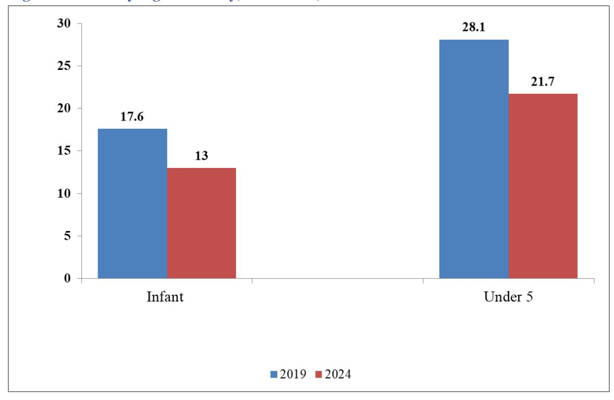

### 8.3. Adult Mortality and Life Tables

The life table, one of the most powerful tools in demography, is used to simulate a population's lifetime mortality experience. It does so by taking a population's age-specific death rates and applying them to a hypothetical population of 100,000 people born at the same time. For each year in the life table, death inevitably thins the hypothetical population's ranks until, in the bottom row of statistics, even the oldest people die. Life tables are used to measure mortality and also as an analytical instrument to estimate other measures.

A life table is the most frequently used method to indirectly estimate adult mortality when vital statistics are not available. These indirect estimation methods are grouped into census survival methods, growth balance methods, the extinct generation method and estimates derived from information on the survival of parents and on the survival of the spouse. The growth balance methods are the most commonly used and consist of adjusting age-sex data on the number of deaths. These data are usually collected in censuses using a question about the number of deaths in the household during a fixed period, usually a year. The sex and age of the deceased are usually also recorded. The CIPS 2024 included a question to collect this information. The data obtained allow demographers to compute age-specific mortality rates, which are death rates calculated for specific age groups. These rates can be easily transformed into probabilities of dying at the ages defined by age group. In particular this provides an indicator of adult mortality, which is the probability of dying between ages 15 and 60 years.

The purpose of estimating adult mortality is mainly to construct life tables. Life tables are a very useful demographic tool, not only for the study of mortality but also for diverse analytical purposes. However, before moving to the construction of life tables it is necessary to examine the problems involved in collecting mortality information from questions about deaths in the household during a fixed period. In practice, respondents frequently fail to report a death in the census because of taboos, beliefs, traditions, or emotional reasons. To refer to a recent death may be an emotionally difficult experience. Another problem is that after an adult death, a household may break up and the death goes unreported. These two problems result in the under-estimation of mortality. However, it can also happen that people confuse a death in the household with a death in the wider family and the same death is reported more than once. In this case, mortality tends to be over-estimated. Errors in the perception of the 12-month period before the census can also result in an over- or under-estimate of mortality.

The method described above is intended to solve a problem that often arises during census or survey interviews. For Cambodia, the balanced birth rate equation is used. However, the undercounting of deaths in the 12 months preceding the census and survey is high, requiring an adjustment of about 80%. Undercounting makes the results inconsistent. For example, in Cambodia, undercounting of deaths has led to life expectancy at birth approaching 100 years. Because of this lack of reliability, other mortality rates are not calculated.

Alternative methods used are: William Brass and Brass and Coale (1968) of UNFPA (Tool for Demographic Estimation) and the MATCH program of the MORTPARK demographic program. This program is used to calculate infant mortality and calculate the probability of death at age 20. The infant mortality rate in this table is derived from an indirect calculation of the under-five mortality rate (Table 8.3.1). Life expectancy at age 20 is derived from the number of deaths in the 12 months preceding the survey. As mentioned above, these data are not exhaustive. However, some data can be used as an alternative for adjustment. For example, life expectancy at age 20 is calculated to be 56.9 years for males and 60 for females. These values were used to construct the life tables with the MATCH demographic program of the MORTPARK demographic program. The method also requires an adjustment of the life table pattern. In this case, the northern pattern is used, which previous analysis has shown to be adequate for Cambodia.

Life expectancy describes the history of mortality among a population if the mortality patterns and trends in the table remain constant in the future. For example, a male infant under

1 year old in Cambodia can expect to live to be 74.9 years old. A male at age 40 can expect to live another 38.2 years if the mortality patterns in Cambodia in 2024 remain constant in the future.

Table 8.3.1. Life Tables Males, Cambodia, 2024

| Age | m(x,n)  | q(x,n)  | l(x)    | d(x,n) | L(x,n)  | S(x,n)  | T(x)      | e(x) |
|-----|---------|---------|---------|--------|---------|---------|-----------|------|
| (1) | (2)     | (3)     | (4)     | (5)    | (6)     | (7)     | (8)       | (9)  |
| 0   | 0.01624 | 0.01600 | 100,000 | 1,600  | 98,542  | 0.98297 | 7,493,362 | 74.9 |
| 1   | 0.00070 | 0.00279 | 98,400  | 275    | 392,941 | 0.99724 | 7,394,820 | 75.2 |
| 5   | 0.00041 | 0.00203 | 98,125  | 199    | 490,127 | 0.99811 | 7,001,878 | 71.4 |
| 10  | 0.00035 | 0.00174 | 97,926  | 171    | 489,202 | 0.99722 | 6,511,751 | 66.5 |
| 15  | 0.00086 | 0.00427 | 97,755  | 418    | 487,840 | 0.99464 | 6,022,550 | 61.6 |
| 20  | 0.00124 | 0.00619 | 97,337  | 603    | 485,226 | 0.99371 | 5,534,710 | 56.9 |
| 25  | 0.00126 | 0.00626 | 96,734  | 606    | 482,172 | 0.99339 | 5,049,484 | 52.2 |
| 30  | 0.00141 | 0.00704 | 96,129  | 677    | 478,985 | 0.99251 | 4,567,312 | 47.5 |
| 35  | 0.00162 | 0.00806 | 95,452  | 769    | 475,398 | 0.99086 | 4,088,327 | 42.8 |
| 40  | 0.00211 | 0.01049 | 94,683  | 993    | 471,054 | 0.98762 | 3,612,929 | 38.2 |
| 45  | 0.00299 | 0.01485 | 93,690  | 1,392  | 465,223 | 0.98013 | 3,141,875 | 33.5 |
| 50  | 0.00520 | 0.02567 | 92,298  | 2,369  | 455,977 | 0.96975 | 2,676,652 | 29.0 |
| 55  | 0.00722 | 0.03549 | 89,929  | 3,192  | 442,185 | 0.95388 | 2,220,675 | 24.7 |
| 60  | 0.01221 | 0.05937 | 86,737  | 5,149  | 421,790 | 0.92339 | 1,778,490 | 20.5 |
| 65  | 0.02031 | 0.09693 | 81,588  | 7,909  | 389,477 | 0.87739 | 1,356,700 | 16.6 |
| 70  | 0.03315 | 0.15373 | 73,679  | 11,327 | 341,725 | 0.80264 | 967,222   | 13.1 |
| 75  | 0.05684 | 0.25004 | 62,352  | 15,591 | 274,282 | 0.56150 | 625,497   | 10.0 |
| 80  | 0.13314 |         | 46,762  | 46,762 | 351,215 |         | 351,215   | 7.5  |

Table 8.3.1. Life Tables Females, Cambodia, 2024

| Age | m(x,n)  | q(x,n)  | l(x)    | d(x,n) | L(x,n)  | S(x,n)  | T(x)      | e(x) |
|-----|---------|---------|---------|--------|---------|---------|-----------|------|
| (1) | (2)     | (3)     | (4)     | (5)    | (6)     | (7)     | (8)       | (9)  |
| 0   | 0.01009 | 0.01000 | 100,000 | 1,000  | 99,080  | 0.98946 | 7,893,352 | 78.9 |
| 1   | 0.00035 | 0.00141 | 99,000  | 140    | 395,651 | 0.99878 | 7,794,272 | 78.7 |
| 5   | 0.00014 | 0.00069 | 98,860  | 68     | 494,130 | 0.99928 | 7,398,621 | 74.8 |
| 10  | 0.00015 | 0.00076 | 98,792  | 75     | 493,773 | 0.99895 | 6,904,491 | 69.9 |
| 15  | 0.00029 | 0.00147 | 98,717  | 145    | 493,257 | 0.99812 | 6,410,718 | 64.9 |
| 20  | 0.00046 | 0.00228 | 98,572  | 225    | 492,329 | 0.99744 | 5,917,461 | 60.0 |
| 25  | 0.00056 | 0.00280 | 98,347  | 275    | 491,066 | 0.99708 | 5,425,132 | 55.2 |
| 30  | 0.00061 | 0.00306 | 98,072  | 300    | 489,631 | 0.99663 | 4,934,065 | 50.3 |
| 35  | 0.00077 | 0.00383 | 97,772  | 374    | 487,982 | 0.99498 | 4,444,435 | 45.5 |
| 40  | 0.00130 | 0.00647 | 97,398  | 630    | 485,531 | 0.99213 | 3,956,452 | 40.6 |
| 45  | 0.00191 | 0.00952 | 96,767  | 921    | 481,710 | 0.98729 | 3,470,922 | 35.9 |
| 50  | 0.00330 | 0.01636 | 95,847  | 1,568  | 475,589 | 0.98066 | 2,989,211 | 31.2 |
| 55  | 0.00461 | 0.02279 | 94,278  | 2,148  | 466,393 | 0.97015 | 2,513,623 | 26.7 |
| 60  | 0.00792 | 0.03891 | 92,130  | 3,585  | 452,471 | 0.94770 | 2,047,229 | 22.2 |
| 65  | 0.01422 | 0.06884 | 88,545  | 6,096  | 428,805 | 0.90748 | 1,594,758 | 18.0 |
| 70  | 0.02578 | 0.12165 | 82,450  | 10,030 | 389,132 | 0.83807 | 1,165,954 | 14.1 |
| 75  | 0.04697 | 0.21150 | 72,420  | 15,317 | 326,121 | 0.58019 | 776,822   | 10.7 |
| 80  | 0.12670 | •••     | 57,103  | 57,103 | 450,701 |         | 450,701   | 7.9  |

*Notes:* m(x,n) = Age-specific central death rate.

a(x,n) = Average person-years lived by those who die between ages x and x+n

nqx = Probability of dying between exact ages x and x+n (age-specific mortality rate)

l(x) = Number of survivors at age x.

ndx = Number of deaths occurring between ages x and x+n.

nLx = Number of person-years lived between ages x and x+n.

 $5Sx = Survival \ ratio \ for \ persons \ aged \ x \ to \ x+5 \ surviving \ 5 \ years \ to \ ages \ x+5 \ to \ x+10 =$ 

5Lx + 5/5Lx

Tx = Number of person-years lived after age x.

e(x) = Life expectancy at age x.

First entry of S(x,n) is for survivorship of 5 cohorts of birth to age group 0-4 = L(0,5) / 500000

Second entry of S(x,n) is for S(0,5) = L(5,5) / L(0,5)

Last entry of S(x,n) is S(75+,5) = T(80) / T(75)

In general, adult mortality rates increase with increasing age. Table 8.3.1 and 8.3.2 shows adult mortality rate in 2024. Males aged 15-20 died at a rate of 86 per 100,000 in 2024, while females in the same age group died at a rate of 29 per 100,000. At oldest age male in 80 and over died at 13,314 and 12,670 per 100,000.

### 8.4. Maternal Mortality

There are several methods for estimating maternal mortality ratio; however the most appropriate and reliable is based on direct questions included in the census or survey of adult mortality. For women aged 15-49 who died in the 12 months preceding the census, questions are asked whether the woman died during pregnancy (9) or childbirth (10) or within 42 days of giving birth (11). Sometimes questions may include where the woman died (hospital, health center, home) and whether anyone assisted her before death (doctor, nurse, midwife, traditional healer).

In general, adult maternal deaths are not correct counted as expected. However, there are several methods that have been used to adjust the data to improve accuracy. In this case, the calculation is difficult and the reliability is low. The most widely used indicator of maternal mortality is the maternal mortality ratio. It is calculated by dividing the number of maternal deaths related to the complexity of pregnancy by the number of live births during the same period. This value, multiplied by 100,000, is interpreted as the number of maternal deaths per 100,000 live births.

The above questions include the number of family members who have died in the past 12 months. As explained earlier, this information is not exhaustive, including deaths attributed to maternal deaths. The CIPS 2024, the crude (unadjusted) data were calculated to show a maternal mortality ratio of 134 per 100,000 live births after consider undercount for the actual birth rate by age-specific birth rates and the number of women. There is a consistency in the assessment of maternal mortality that requires more specific analysis than this finding. The case of maternal mortality recommends in-depth studies to examine details such as the lifetime risk of maternal mortality (LTR) among women of reproductive age. Even without adjustment for maternal mortality, this ratio is lower than in 2019. When analyzed in detail, the maternal mortality ratio may be even lower, as seen in the 2019 Census after adjusting for the lifetime risk of maternal mortality (LTR), this ratio is only 91 per 100,000 live births.

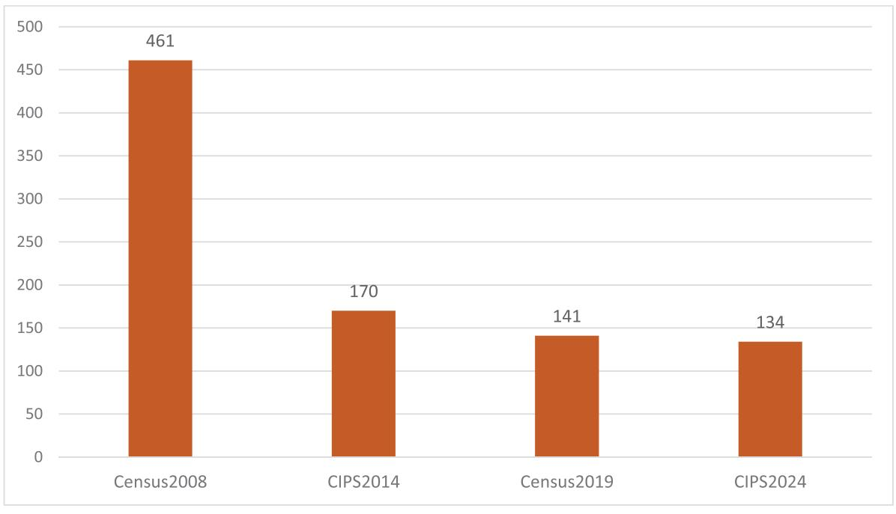

Figure 8.4.1. Maternal Mortality Ratio, Cambodia, 2008, 2014, 2019 and 2024

DISABILITY 9

### 9.1. Introduction

The Cambodia Inter-censal Population Survey 2024 (CIPS) is the first time that questions on disability have been included in a Cambodian census questionnaire. Disability is measured in the CIPS 2024 in terms of physical difficulties experienced in daily life for people aged 5 years and over. Three main reasons for measuring disability in a census are:

- a) To inform the design of various services. This could include developing specific programmes or policies for performing services, and also for evaluating these programmes or services. Services provided might include housing, transportation, and equipment, as well as long-term professional and educational support.
- b) To track the level of the progress in primary care provision, which is in itself an indicator of the overall social situation. Assessing the level of progress includes estimating the disability rate and analysing trends over time.
- c) To monitor inequalities experienced by disabled individuals and to evaluate the impact of laws and policies prohibiting discrimination associated with disability. Data on disability can also help to assess services and programmes, which aim to achieve equal participation in all areas of life by those who experience any difficulty in daily activities.

Data on the following six types of disabilities were collected by the CIPS 2024:

- 1. Disability in seeing (eyes): a person who has some degree of difficulty seeing once their eyesight has been corrected with glasses or who is blind or not able to see anything (even light) is considered as having no ability to see or a disability in seeing. A person who is able to see clearly with one eye or can only see straight ahead is also considered to have a disability in seeing. A person who is short or long sighted, but able to see clearly because of wearing glasses is not defined as having a disability in seeing.
- 2. Disability in hearing (deaf): a person who has some degree of hearing limitation even once their hearing has been corrected with hearing aids is considered to have no ability to hear or a disability in hearing. This includes a person who hears nothing; who hears only loud noises or sounds when he/she is in a loud environment; or who has difficulty recognizing sounds from other sources. Moreover, a person who does not hear through one ear but hears normally in the other ear is also considered having a disability in hearing. A person who is able to hear using a hearing aid is not considered to have a difficulty in hearing.
- 3. Disability in walking or climbing stairs: a person who has some degree of difficulty when moving around the surrounding environment using their legs is considered to have a disability. This includes those who have some problems when walking short or long distances or going up or down stairs. It also describes those who are not able to walk any distance without a break and those who are not able to walk without using a walking aid such as a stick or crutches. Finally, individuals who cannot stand for more than a few 97

minutes or who need a wheelchair to move from one place to another are also considered to be disabled.

- 4. Disability in memorizing or concentrating: a person who has some problems with remembering or focusing on daily activities is considered disabled in memorizing or concentrating. This includes individuals who have problems navigating paths, focusing on what they are doing or remembering where they lived in recent months. It also describes a person who cannot remember anything about what someone has just said to them or who seems confused or generally afraid. This could be triggered by everyday situations including high workload, drug use or other major causes.
- 5. Disability in self-care: a person who has difficulty taking care of himself/herself independently is considered to have a disability in self-care. This includes daily tasks, such as washing, dressing or doing make-up. Washing refers to the whole self-cleansing process (normally with soap and water). Washing activities include washing and collecting essential items such as soap, clothes or water. Dressing refers to all aspects of wearing clothes. A person who cannot complete these tasks on their own is considered to have this type of disability.
- 6. Disability in communication due to physical, mental and/or emotional health: a person who has physical, mental or emotional health problems; which affect speaking, hearing or comprehension; and limit daily activities. This includes those who are prone to misunderstanding during conversations or other modes of communication. Communication refers to people exchanging information or ideas with each other. This exchange is done using voice, signs or writing information that is to be exchanged

### 9.2. Level of Disability

Table 9.2.1 shows the percentage distribution of the population with differing degrees of disability by sex and urban/rural area. Responses to each of the six disability types are grouped into three categories: some disability ("some difficulty"), moderate disability ("a lot of difficulty") and severe disability ("cannot do at all"). In 2024 the proportion of the total population aged 5 years and above with any type of disability has increased to 5.5 percent and, moderate disability 1.4 percent and severe disability has increased 0.2 percent if compared to 2019 (table 9.2.1). When disaggregated by sex, disability was found to be higher for females compared to males (8.6 percent versus 6.5 percent) for this pattern is consistent with moderate disability, severe disability and also with pattern of 2019. In 2024 Area-wise, the proportion of people with any disability were rural is higher than urban (10.7 percent versus 9.9 percent). There were increased all type of disabilities and residence among population aged 5 and above if compared 2024 and 2019.

Table 9.2.1. Percentage distribution of population aged 5+ years by disability status, level, sex and area, Cambodia, 2019 and 2024

| Residence  | Population aged 5 + Years | Total | No Disability | Some Disability | Moderate Disability | Severe Disability |
|------------|---------------------------|-------|------------------|--------------------|------------------------|----------------------|
| (1)        | (2)                       | (3)   | (4)              | (5)                | (6)                    | (7)                  |
|            |                           | Cambo | dia 2019         |                    |                        |                      |
| Both Sexes | 14,102,052                | 100   | 95.1             | 3.7                | 0.9                    | 0.3                  |
| Male       | 6,825,874                 | 100   | 95.8             | 3.2                | 0.7                    | 0.3                  |
| Female     | 7,276,178                 | 100   | 94.5             | 4.2                | 1.0                    | 0.3                  |
|            |                           | Cambo | dia 2024         |                    |                        |                      |
| Both Sexes | 15,819,611                | 100   | 89.6             | 7.6                | 2.3                    | 0.5                  |
| Male       | 7,746,659                 | 100   | 91.0             | 6.5                | 2.0                    | 0.5                  |
| Female     | 8,072,952                 | 100   | 88.3             | 8.6                | 2.6                    | 0.6                  |
|            |                           | Urba  | n 2019           |                    |                        |                      |
| Both Sexes | 5,622,870                 | 100   | 95.7             | 3.2                | 0.7                    | 0.3                  |
| Male       | 2,729,610                 | 100   | 96.3             | 2.8                | 0.6                    | 0.3                  |
| Female     | 2,893,260                 | 100   | 95.2             | 3.6                | 0.8                    | 0.3                  |
|            |                           | Urba  | n 2024           |                    |                        |                      |
| Both Sexes | 6,600,670                 | 100   | 90.1             | 7.1                | 2.3                    | 0.5                  |
| Male       | 3,211,244                 | 100   | 91.5             | 6.2                | 1.9                    | 0.4                  |
| Female     | 3,389,426                 | 100   | 88.9             | 8.0                | 2.6                    | 0.5                  |
|            |                           | Rura  | l 2019           |                    |                        |                      |
| Both Sexes | 8,479,182                 | 100   | 94.7             | 4.0                | 1.0                    | 0.3                  |
| Male       | 4,096,264                 | 100   | 95.5             | 3.5                | 0.8                    | 0.3                  |
| Female     | 4,382,918                 | 100   | 94.0             | 4.6                | 1.1                    | 0.3                  |
|            |                           | Rura  | 1 2024           |                    |                        |                      |
| Both Sexes | 9,218,741                 | 100   | 89.3             | 7.9                | 2.3                    | 0.5                  |
| Male       | 4,535,415                 | 100   | 90.7             | 6.8                | 2.0                    | 0.5                  |
| Female     | 4,683,326                 | 100   | 87.9             | 9.0                | 2.5                    | 0.6                  |

Table 9.2.2 shows the percentage distribution of the population with disability by disability level, sex and urban/rural area. Of the 1.640.259 individuals with some disability and severe disability in 2024 is lower than 2019 (73.1 percent versus 74.3 percent) and (5.0 percent and 6.3 percent) and the proportion of people with moderate disabilities has increased (21.9 percent versus 19.4 percent).

Table 9.2.2. Percentage distribution of population aged 5+ years with disability by level, sex and area, Cambodia, 2019 and 2024

| Camboula, 2017 and |                                       |            |                    |                        |                      |
|--------------------|---------------------------------------|------------|--------------------|------------------------|----------------------|
| Residence and Sex  | People with Disability Aged 5 + Years | Total      | Some Disability | Moderate Disability | Severe Disability |
| (1)                | (2)                                   | (3)        | (4)                | (5)                    | (6)                  |
|                    |                                       | Cambodia 2 | 2019               |                        |                      |
| Both Sexes         | 689.532                               | 100        | 74,3               | 19,4                   | 6,3                  |
| Male               | 286.659                               | 100        | 74,6               | 18,8                   | 6,6                  |
| Female             | 402.873                               | 100        | 74,2               | 19,7                   | 6,1                  |
|                    |                                       | Cambodia 2 | 2024               |                        |                      |
| Both Sexes         | 1.640.259                             | 100        | 73,1               | 21,9                   | 5,0                  |
| Male               | 695.966                               | 100        | 72,7               | 22,0                   | 5,3                  |
| Female             | 944.293                               | 100        | 73,5               | 21,8                   | 4,8                  |
|                    |                                       | Urban 20   | 19                 |                        |                      |
| Both Sexes         | 239.135                               | 100        | 74,3               | 18,4                   | 7,4                  |
| Male               | 100.498                               | 100        | 74,4               | 17,8                   | 7,8                  |
| Female             | 138.637                               | 100        | 74,2               | 18,8                   | 7,0                  |
|                    |                                       | Urban 202  | 24                 |                        |                      |
| Both Sexes         | 651.721                               | 100        | 72,2               | 22,9                   | 4,9                  |
| Male               | 274.134                               | 100        | 72,6               | 22,3                   | 5,1                  |
| Female             | 377.587                               | 100        | 71,9               | 23,3                   | 4,8                  |
|                    |                                       | Rural 201  | 9                  |                        |                      |
| Both Sexes         | 450.397                               | 100        | 74,3               | 19,9                   | 5,8                  |
| Male               | 186.161                               | 100        | 74,6               | 19,4                   | 5,9                  |
| Female             | 264.236                               | 100        | 74,1               | 20,2                   | 5,7                  |
|                    |                                       | Rural 202  | 24                 |                        |                      |
| Both Sexes         | 988.538                               | 100        | 73,8               | 21,2                   | 5,1                  |
| Male               | 421.832                               | 100        | 72,8               | 21,8                   | 5,4                  |
| Female             | 566.706                               | 100        | 74,5               | 20,7                   | 4,8                  |

CIPS 2024, disability rate for Cambodia increases with increases of age (figure 9.2.1), rising from 1.2 percent for the population aged 5-14 years to 52.1 percent for population aged 60 years and above. A slight increase in the disability rate starts 2.3 percent in the 15-34 years age group rising to 11.2 percent for population aged 35-59 years. If comparing 2019 and 2024, the disability rate is increases with increased increase age, as among the population aged 60 and above disability rate haft increase (52.1 percent versus 25.6 percent).

Figure 9.2.1. Percentage distribution of population aged 5+ years with disability by age group and sex, Cambodia, 2024

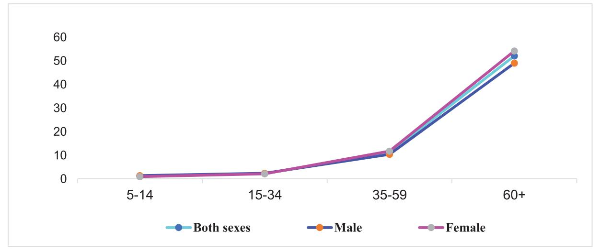

In 2024 as the same to 2019, the proportion of the population with disability in seeing (7.4 percent and 3.5 percent) is highest that is observed for the different types of disability.

For 2024 the other types were 4.9 percent with a disability in walking or climbing stairs and 4.1 percent with a disability in memorizing or concentrating (table 9.2.3).

Table 9.2.3. Distribution of population aged 5+ years with a disability by type and level of disability,

sex and area, Cambodia, 2019 and 2024

| sex and area, Cambodia, 2019 and 202                        |       | er cent <b>2019</b> |                 | Pe              | er cent <b>2024</b> |       |
|-------------------------------------------------------------|-------|---------------------|-----------------|-----------------|---------------------|-------|
| Type and Level of Disability and Sex                        | Total | Urban               | Rural           | Total           | Urban               | Rural |
| (1)                                                         | (2)   | (3)                 | (4)             | (5)             | (6)                 |       |
| (1)                                                         |       |                     | (4)             | (3)             | (0)                 | (7)   |
|                                                             |       | Sexes               |                 |                 |                     |       |
| Disability in Seeing (even wearing glasses)                 | 1     | 1                   | 400             |                 | 400                 | 100   |
| Total                                                       | 100   | 100                 | 100             | 100             | 100                 | 100   |
| No Disability                                               | 96,4  | 96,9                | 96,1            | 92,6            | 92,9                | 92,3  |
| Some Disability                                             | 2,9   | 2,5                 | 3,2             | 6,2             | 5,8                 | 6,6   |
| Moderate Disability                                         | 0,5   | 0,4                 | 0,6             | 1,1             | 1,2                 | 1,0   |
| Severe Disability                                           | 0,1   | 0,1                 | 0,1             | 0,1             | 0,1                 | 0,1   |
| Disability in Hearing (even using hearing                   |       | 100                 | 100             | 100             | 100                 | 100   |
| Total                                                       | 100   | 100                 | 100             | 100             | 100                 | 100   |
| No Disability                                               | 97,1  | 97,6                | 96,7            | 96,0            | 96,6                | 95,6  |
| Some Disability                                             | 2,4   | 2,1                 | 2,7             | 3,2             | 2,8                 | 3,6   |
| Moderate Disability                                         | 0,4   | 0,3                 | 0,5             | 0,6             | 0,6                 | 0,7   |
| Severe Disability                                           | /     | 0,1                 | 0,1             | 0,1             | 0,1                 | 0,2   |
| Disability in Moving or Climbing the Stai                   | T .   | 100                 | 100             | 100             | 100                 | 100   |
| Total                                                       | 100   | 100                 | 100             | 100             | 100                 | 100   |
| No Disability                                               | 97,2  | 97,7                | 96,9            | 95,1            | 95,3                | 94,9  |
| Some Disability  Moderate Disability                        | 2,2   | 1,8                 | 2,4             | 3,5             | 3,4                 | 3,6   |
| · ·                                                         | 0,5   | 0,4                 | 0,6             | 1,2             | 1,1                 | 1,2   |
| Severe Disability                                           | 0,1   | 0,1                 | 0,1             | 0,2             | 0,2                 | 0,3   |
| Disability in Remembering or Concentrat                     |       | 100                 | 100             | 100             | 100                 | 100   |
| Total                                                       | 100   | 100                 | 100             | 100             | 100                 | 100   |
| No Disability                                               | 97,2  | 97,7                | 96,8            | 95,9            | 96,0                | 95,8  |
| Some Disability                                             | 2,2   | 1,9                 | 2,5             | 3,2             | 3,1                 | 3,2   |
| Moderate Disability                                         | 0,4   | 0,3                 | 0,5             | 0,7             | 0,7                 | 0,8   |
| Severe Disability                                           | 0,1   | 0,1                 | 0,2             | 0,2             | 0,2                 | 0,2   |
| Disability in Self-Care (including washing                  | 1     |                     | 100             | 100             | 100                 | 100   |
| Total                                                       | 100   | 100                 | 100             | 100             | 100                 | 100   |
| No Disability                                               | 97,7  | 98,0                | 97,4            | 97,7            | 97,8                | 97,6  |
| Some Disability  Moderate Disability                        | 1,8   | 1,5                 | 2,0             | 1,6             | 1,6                 | 1,7   |
|                                                             | 0,4   | 0,3 0,1          | 0,4             | 0,5 0,2      | 0,4                 | 0,5   |
| Severe Disability  Disability in Communication (such as und | /     |                     | 0,1             | 0,2             | 0,2                 | 0,2   |
|                                                             |       |                     | 100             | 100             | 100                 | 100   |
| Total  No Disability                                        | 97,7  | <b>100</b> 98,1  | <b>100</b> 97,4 | <b>100</b> 97,7 | 97,9                | 97,6  |
| Some Disability                                             | 1,8   | 1,5                 | 2,0             | 1,6             | 1,5                 | 1,6   |
| Moderate Disability                                         | 0,4   | 0,3                 | 0,4             | 0,5             | 0,5                 | 0,6   |
| Severe Disability                                           |       |                     |                 |                 |                     | 0,0   |
| Severe Disaulity                                            | 0,1   | 0,1   [ale       | 0,1             | 0,2             | 0,2                 | 0,2   |
| Disability in Society (avon wearing glasses)                | IVI   | laie                |                 |                 |                     |       |
| Disability in Seeing (even wearing glasses) <b>Total</b>    | 100   | 100                 | 100             | 100             | 100                 | 100   |
| No Disability                                               | 97,0  | 97,4                | 96,8            | 93,7            | 93,9                | 93,6  |
| Some Disability                                             | 2,4   | 2,1                 | 2,7             | 5,3             | 5,0                 | 5,5   |
| Moderate Disability                                         | 0,4   | 0,3                 | 0,5             | 0,9             | 1,0                 | 0,8   |
| Severe Disability                                           | 0,4   | 0,3                 | 0,3             | 0,9             | 0,1                 | 0,8   |
| Disability in Hearing (even using hearing                   |       | 0,1                 | 0,1             | 0,1             | 0,1                 | 0,1   |
| Total                                                       | 100   | 100                 | 100             | 100             | 100                 | 100   |
| No Disability                                               | 97,6  | 98,0                | 97,4            | 96,7            | 97,2                | 96,3  |
| Some Disability                                             | 2,0   | 1,7                 | 2,2             | 2,6             | 2,2                 | 2,9   |
| Moderate Disability                                         | 0,3   | 0,2                 | 0,4             | 0,6             | 0,5                 | 0,6   |
| Severe Disability                                           | 0,3   | 0,2                 | 0,4             | 0,0             | 0,3                 | 0,0   |
| Disability in Moving or Climbing the Stairs                 |       | 0,1                 | 0,1             | 0,1             | 0,1                 | 0,1   |
| Total                                                       | 100   | 100                 | 100             | 100             | 100                 | 100   |
| 1 0 1 1 1 1 1 1 1 1 1 1 1 1 1 1 1 1 1 1                     | 100   | 100                 | 100             | 100             | 100                 | 100   |

| No Disability                                              | 97,8            | 98,2               | 97,5 | 96,0                                  | 96,3                                  | 95,8        |
|------------------------------------------------------------|-----------------|--------------------|------|---------------------------------------|---------------------------------------|-------------|
| Some Disability                                            | 1,7             | 1,5                | 1,9  | 2,7                                   | 2,6                                   | 2,8         |
| Moderate Disability                                        | 0,4             | 0,3                | 0,5  | 1,1                                   | 1,0                                   | 1,1         |
| Severe Disability                                          | 0,1             | 0,1                | 0,1  | 0,2                                   | 0,2                                   | 0,2         |
| Disability in Remembering or Concentrati                   | ng              |                    |      |                                       |                                       |             |
| Total                                                      | 100             | 100                | 100  | 100                                   | 100                                   | 100         |
| No Disability                                              | 97,8            | 98,2               | 97,5 | 96,6                                  | 96,7                                  | 96,6        |
| Some Disability                                            | 1,8             | 1,5                | 2,0  | 2,5                                   | 2,5                                   | 2,5         |
| Moderate Disability                                        | 0,3             | 0,2                | 0,4  | 0,7                                   | 0,6                                   | 0,7         |
| Severe Disability                                          | 0,1             | 0,1                | 0,1  | 0,2                                   | 0,2                                   | 0,2         |
| Disability in Self-Care (including washing an <b>Total</b> |                 | 100                | 100  | 100                                   | 100                                   | 100         |
| No Disability                                              | <b>100</b> 98,1 | 100 98,4        | 98,0 | 100 98,1                           | 100 98,1                           | 98,0        |
| Some Disability                                            | 1,4             | 1,2                | 1,6  | 1,3                                   | 1,3                                   | 1,3         |
| Moderate Disability                                        | 0,3             | 0,3                | 0,3  | 0,5                                   | 0,4                                   | 0,5         |
| Severe Disability                                          | 0,1             | 0,3                | 0,1  | 0,3                                   | 0,7                                   | 0,3         |
| Disability in Communication (such as unders                |                 |                    | 0,1  | 0,2                                   | 0,2                                   | 0,2         |
| Total                                                      | 100             | 100                | 100  | 100                                   | 100                                   | 100         |
| No Disability                                              | 98,2            | 98,5               | 97,9 | 98,0                                  | 98,2                                  | 97,9        |
| Some Disability                                            | 1,5             | 1,2                | 1,6  | 1,3                                   | 1,2                                   | 1,3         |
| Moderate Disability                                        | 0,3             | 0,2                | 0,3  | 0,5                                   | 0,4                                   | 0,6         |
| Severe Disability                                          | 0,1             | 0,1                | 0,1  | 0,2                                   | 0,2                                   | 0,3         |
|                                                            | Fei             | male               |      |                                       |                                       |             |
| Disability in Seeing (even wearing glasses)                |                 |                    |      |                                       |                                       |             |
| Total                                                      | 100             | 100                | 100  | 100                                   | 100                                   | 100         |
| No Disability                                              | 95,9            | 96,5               | 95,5 | 91,4                                  | 91,9                                  | 91,1        |
| Some Disability                                            | 3,4             | 2,9                | 3,7  | 7,1                                   | 6,5                                   | 7,5         |
| Moderate Disability                                        | 0,6             | 0,5                | 0,7  | 1,3                                   | 1,4                                   | 1,2         |
| Severe Disability                                          | 0,1             | 0,1                | 0,1  | 0,2                                   | 0,2                                   | 0,2         |
| Disability in Hearing (even using hearing a Total          |                 | 100                | 100  | 100                                   | 100                                   | 100         |
| No Disability                                              | 100 96,5     | <b>100</b> 97,1 | 96,1 | 100 95,3                           | 96,0                                  | 100 94,8 |
| Some Disability                                            | 2,9             | 2,4                | 3,1  | 3,8                                   | 3,3                                   | 4,3         |
| Moderate Disability                                        | 0,5             | 0,4                | 0,6  | 0,7                                   | 0,6                                   | 0,8         |
| Severe Disability                                          | 0,1             | 0,1                | 0,1  | 0,2                                   | 0,1                                   | 0,2         |
| Disability in Moving or Climbing the Stair                 | /               | 3,1                |      | · · · · · · · · · · · · · · · · · · · | 3,1                                   |             |
| Total                                                      | 100             | 100                | 100  | 100                                   | 100                                   | 100         |
| No Disability                                              | 96,7            | 97,7               | 96,3 | 94,1                                  | 94,3                                  | 94,0        |
| Some Disability                                            | 2,6             | 2,2                | 2,8  | 4,3                                   | 4,1                                   | 4,4         |
| Moderate Disability                                        | 0,6             | 0,5                | 0,7  | 1,3                                   | 1,3                                   | 1,3         |
| Severe Disability                                          | 0,1             | 0,1                | 0,1  | 0,3                                   | 0,3                                   | 0,3         |
| Disability in Remembering or Concentrati                   |                 |                    |      |                                       | · · · · · · · · · · · · · · · · · · · |             |
| Total                                                      | 100             | 100                | 100  | 100                                   | 100                                   | 100         |
| No Disability                                              | 96,7            | 97,3               | 96,3 | 95,2                                  | 95,4                                  | 95,1        |
| Some Disability                                            | 2,7             | 2,2                | 3,0  | 3,8                                   | 3,7                                   | 3,9         |
| Moderate Disability                                        | 0,5 0,2      | 0,4                | 0,6  | 0,8                                   | 0,8                                   | 0,8         |
| Severe Disability                                          |                 | 0,1                | 0,1  | 0,2                                   | 0,2                                   | 0,3         |
| Disability in Self-Care (including washing Total           | and dressing    | 100                | 100  | 100                                   | 100                                   | 100         |
| No Disability                                              | 97,2            | 97,6               | 96,9 | 97,4                                  | 97,5                                  | 97,2        |
| Some Disability                                            | 2,2             | 1,8                | 2,4  | 1,9                                   | 1,8                                   | 2,0         |
| Moderate Disability                                        | 0,5             | 0,4                | 0,5  | 0,5                                   | 0,5                                   | 0,6         |
| Severe Disability                                          | 0,3             | 0,2                | 0,2  | 0,3                                   | 0,2                                   | 0,0         |
| Disability in Communication (such as unde                  | /               |                    | ∘,-  |                                       |                                       | ~,-         |
| Total                                                      | 100             | 100                | 100  | 100                                   | 100                                   | 100         |
| No Disability                                              | 97,2            | 97,8               | 96,9 | 97,4                                  | 97,6                                  | 97,3        |
| Some Disability                                            | 2,2             | 1,8                | 2,4  | 1,9                                   | 1,8                                   | 1,9         |
| Moderate Disability                                        | 0,5             | 0,3                | 0,5  | 0,5                                   | 0,5                                   | 0,6         |
| Severe Disability                                          | 0,2             | 0,1                | 0,2  | 0,2                                   | 0,2                                   | 0,2         |
| ·                                                          |                 |                    |      |                                       |                                       |             |

### 9.3. Disability and Marital Status

Table 9.3.1 shows the majority of the population aged 15 years and over with any disability that were currently married accounted for 60.6 percent, widowed was 23.4 percent, never married was 10.1 percent, divorced was 5.3 percent and separated 0.6 percent. The proportion of women currently widowed or divorced and separated was 41.9 percent in urban. However, in 2024 the proportion of women currently windowed or divorced and separated is higher than men both area residence. For whom currently never married, windowed or divorced and separated with disability has increased except currently married

Table 9.3.1. Percentage distribution of population aged 15+ years with a disability by marital status, sex and area, Cambodia, 2019-2024\*

| 0              |            | 2019 |        | 2019 2024  | 2024 |        |
|----------------|------------|------|--------|------------|------|--------|
| Marital Status | Both Sexes | Male | Female | Both Sexes | Male | Female |
| (1)            | (2)        | (3)  | (4)    | (5)        | (9)  | (2)    |
| Cambodia       | 100        | 100  | 100    | 100        | 100  | 100    |
| Never Married  | 8.6        | 10.6 | 9.3    | 10,1       | 10,0 | 10,2   |
| Married        | 9.89       | 80.2 | 60.5   | 9,09       | 77,4 | 48,5   |
| Widowed        | 17.4       | 9.9  | 24.9   | 23,4       | 9,4  | 33,6   |
| Divorced       | 3.9        | 2.4  | 5.0    | 5,3        | 2,8  | 7,1    |
| Separated      | 0.2        | 0.2  | 0.2    | 9,0        | 0,4  | 0,7    |
| Urban          | 100        | 100  | 100    | 100        | 100  | 100    |
| Never Married  | 11.6       | 12.8 | 10.8   | 11,7       | 11,4 | 11,9   |
| Married        | 67.5       | 78.0 | 60.1   | 58,5       | 75,6 | 46,2   |
| Widowed        | 15.9       | 5.8  | 23.0   | 22,6       | 0,6  | 32,4   |
| Divorced       | 4.6        | 2.9  | 5.7    | 6,5        | 3,7  | 8,5    |
| Separated      | 0.4        | 0.3  | 0.4    | 8,0        | 5,0  | 1,0    |
| Rural          | 100        | 100  | 100    | 100        | 100  | 100    |
| Never Married  | 8.8        | 8.9  | 8.5    | 9,1        | 9,2  | 9,1    |
| Married        | 69.2       | 81.4 | 60.7   | 62,0       | 78,6 | 50,0   |
| Widowed        | 18.2       | 7.0  | 25.9   | 24,0       | 9,6  | 34,4   |
| Divorced       | 3.6        | 2.0  | 4.7    | 4,5        | 2,2  | 6,1    |
| Separated      | 0.2        | 0.2  | 0.2    | 6,5        | 0,4  | 0,5    |
|                |            |      |        |            |      |        |

\*Note: Excluding those for whom marital status was not reported.

### 9.4. Literacy and Education

Table 9.4.1 shows the literacy rate of population aged 7 and over with a disability, disaggregated by sex and urban and rural areas. In 2024 the proportion of disability level were lower if compared to 2019. For servers disability declined 1.5 times, except for any level of disability that decreased slightly in absolute by 3.6 percent.

Table 9.4.1. Literacy rates of population aged 7+ years with any disability by level of disability, sex and area, Cambodia, 2019 and 2024\*

| Area and Sex | Any Disability | Some Disability | Moderate Disability | Severe Disability |
|--------------|----------------|-----------------|---------------------|-------------------|
| (1)          | (2)            | (3)             | (4)                 | (5)               |
|              |                | 2019            |                     |                   |
| Cambodia     | 70.9           | 73.3            | 62.4                | 67.7              |
| Urban        | 80.1           | 81.9            | 73.1                | 80.0              |
| Rural        | 65.9           | 68.8            | 57.1                | 59.3              |
| Male         | 80.7           | 83.0            | 73.9                | 74.4              |
| Female       | 63.9           | 66.5            | 54.6                | 62.5              |
|              |                | 2024            |                     |                   |
| Cambodia     | 67,3           | 68,5            | 58,3                | 44,8              |
| Urban        | 74,4           | 75,4            | 66,2                | 56,7              |
| Rural        | 62,6           | 64,0            | 52,8                | 37,1              |
| Male         | 77,7           | 79,9            | 68,9                | 48,8              |
| Female       | 59,6           | 60,4            | 50,4                | 41,5              |

\*Note: Excluding those for whom marital status was not reported.

Table 9.4.2 shows that the rate of educational attainment in the population with any disability was 24.1 percent of disabled persons aged 7 and above who had ever attended a school or educational institution had completed primary education; 14.0 percent had completed lower secondary education; 4.0 percent had received the secondary/ diploma (Secondary School/Baccalaureate, Technical Diploma/Pre-Secondary and Technical Diploma/Post-Secondary), and only 2.1 percent had completed tertiary/beyond secondary education (Graduate Degree, Master's Degree and Ph.D. Degree holder). Overall, 54.8 percent of the disabled population reported that they had not completed primary school, whilst a small proportion of the disabled literate population (1.1 percent) had become literate without any formal education.

Both 2019 and 2024 Compared to the general population, there was a low rate at all levels of education for those who have successfully completed their education. The population with disability who completed a full of primary, Secondary/ Diploma and Beyond Secondary has positive changed across all disabilities level (any disability, some disability, and moderate disability and serve disability) except who have none completed, not primary completed and secondary. This trend is also consistent for disability levels and complete education for men, except for women. All levels of disability who have completed lower secondary education have a negative change for 2024 compared to 2019.

Table 9.4.2. The percentage of literate population with any disability aged 7+ years who had completed education by educational level, sex and residence, Cambodia 2019 and 2024\*

|                                                                      | 0             |                  | 0040                         |            |            | ÷                            |               |            |
|----------------------------------------------------------------------|---------------|------------------|------------------------------|------------|------------|------------------------------|---------------|------------|
|                                                                      |               | Percentage L     | Percentage Distribution 2019 |            |            | Percentage distribution 2024 | ribution 2024 |            |
| Residence                                                            | Any           | Some             | Major                        | Severe     | Any        | Some                         | Major         | Severe     |
|                                                                      | Disability    | Disability       | Disability                   | Disability | Disability | Disability                   | Disability    | Disability |
|                                                                      | (2)           | (3)              | (4)                          | (5)        | 9)         | 6                            | (8)           | 6          |
| Cambodia                                                             | 100           | 100              | 100                          | 100        | 100        | 100                          | 100           | 100        |
| None                                                                 | 1,4           | 1,4              | 1,3                          | 1,9        | 1,1        | 1,1                          | 1,0           | 1,5        |
| Primary Not Completed                                                | 55,7          | 54,6             | 61,2                         | 55,7       | 54,8       | 55,4                         | 57,4          | 45,9       |
| Primary                                                              | 22,9          | 23,4             | 19,8                         | 24,2       | 24,1       | 23,5                         | 23,6          | 28,3       |
| Lower Secondary                                                      | 17,3          | 17,8             | 15,6                         | 14,4       | 14,0       | 13,9                         | 13,8          | 19,2       |
| Secondary/ Diploma                                                   | 1,4           | 1,5              | 1,2                          | 2,1        | 4,0        | 4,1                          | 2,6           | 2,9        |
| Beyond Secondary                                                     | 1,3           | 1,3              | 6,0                          | 1,7        | 2,1        | 2,1                          | 1,7           | 2,2        |
| Urban                                                                | 100           | 100              | 100                          | 100        | 100        | 100                          | 100           | 100        |
| None                                                                 | 1,1           | 1,2              | 1,0                          | 1,4        | 1,4        | 1,4                          | 1,1           | 1,8        |
| Primary Not Completed                                                | 46,6          | 43,7             | 56,8                         | 55,3       | 44,7       | 45,0                         | 51,0          | 36,9       |
| Primary                                                              | 24,1          | 25,3             | 19,1                         | 21,5       | 27,3       | 26,3                         | 27,8          | 32,5       |
| Lower Secondary                                                      | 22,7          | 24,1             | 19,3                         | 15,7       | 16,8       | 17,0                         | 14,8          | 24,1       |
| Secondary/ Diploma                                                   | 2,6           | 2,7              | 2,0                          | 3,1        | 6,5        | 6,3                          | 2,4           | 2,6        |
| Beyond Secondary                                                     | 2,8           | 2,9              | 1,9                          | 3,0        | 4,0        | 3,9                          | 3,0           | 2,1        |
| Rural                                                                | 100           | 100              | 100                          | 100        | 100        | 100                          | 100           | 100        |
| None                                                                 | 1,6           | 1,6              | 1,4                          | 2,3        | 6,0        | 0,9                          | 6,0           | 1,3        |
| Primary Not Completed                                                | 61,5          | 61,3             | 64,0                         | 56,1       | 62,7       | 63,4                         | 63,0          | 54,8       |
| Primary                                                              | 22,1          | 22,2             | 20,3                         | 26,8       | 21,6       | 21,3                         | 19,9          | 24,2       |
| Lower Secondary                                                      | 13,8          | 13,9             | 13,4                         | 13,1       | 11,8       | 11,5                         | 12,9          | 14,3       |
| Secondary/ Diploma                                                   | 0,7           | 0,7              | 9,0                          | 1,2        | 2,5        | 2,3                          | 2,8           | 3,1        |
| Beyond Secondary                                                     | 0,3           | 0,3              | 0,3                          | 0,5        | 0,0        | 0,6                          | 0,5           | 2,3        |
| Male                                                                 | 100           | 100              | 100                          | 100        | 100        | 100                          | 100           | 100        |
| None                                                                 | 1,6           | 1,6              | 1,3                          | 2,1        | 0,8        | 0,9                          | 9,0           | 0,0        |
| Primary Not Completed                                                | 48,8          | 47,5             | 54,5                         | 52,0       | 46,9       | 47,7                         | 48,5          | 36,4       |
| Primary                                                              | 26,0          | 26,7             | 23,0                         | 25,4       | 28,1       | 27,4                         | 25,8          | 35,7       |
| Lower Secondary                                                      | 20,0          | 20,6             | 18,3                         | 16,0       | 16,8       | 16,7                         | 18,6          | 21,4       |
| Secondary/ Diploma                                                   | 1,9           | 1,9              | 1,6                          | 2,2        | 4,9        | 4,9                          | 4,2           | 2,6        |
| Beyond Secondary                                                     | 1,8           | 1,8              | 1,3                          | 2,2        | 2,5        | 2,5                          | 2,4           | 4,0        |
| Female                                                               | 100           | 100              | 100                          | 100        | 100        | 100                          | 100           | 100        |
| None                                                                 | 1,3           | 1,3              | 1,2                          | 1,6        | 1,5        | 1,4                          | 1,4           | 3,1        |
| Primary Not Completed                                                | 61,9          | 61,0             | 67,5                         | 59,1       | 62,6       | 63,0                         | 8,99          | 55,4       |
| Primary                                                              | 20,1          | 20,5             | 16,9                         | 23,2       | 20,1       | 19,6                         | 21,3          | 21,0       |
| Lower Secondary                                                      | 14,8          | 15,3             | 13,1                         | 12,8       | 11,1       | 11,1                         | 8,8           | 17,0       |
| Secondary/ Diploma                                                   | 1,1           | 1,1              | 8,0                          | 2,0        | 3,2        | 3,3                          | 6,0           | 3,2        |
| Beyond Secondary                                                     | 8,0           | 8,0              | 0,5                          | 1,2        | 1,6        | 1,7                          | 6,0           | 0,4        |
| *Note: Evoluding those for whom educational layed and other wanichle | d other worde | you to a port to | httad                        |            |            |                              |               |            |

\*Note: Excluding those for whom educational level and other variables were not reported

### 9.5. Economic Activity Rates

Table 9.5.1 shows the percentage distribution of the disabled population aged 5 and above by usual activity status, sex and urban/rural area in 2019 and 2024. The percentage of the disabled population that were employed was declined 3.4 percent (49.5 percent verse 52.9 percent) and 2.6 percent for men (62.7 percent verse 60.1 percent) and 4.3 percent for female (41.6 percent verse 45.9 percent). If compared of the population were employed, there were row rate of people were employed with disability both 2019 (60.6 percent verse 49.5 percent and 2024 (61.2 percent verse 52.9 percent).

Table 9.5.1. Also shows that the percentage of people with some disability, moderate and severe disability by main activity has the same trend as the population with any disability level mentioned above.

The percentage of inactive population with serve disabilities in rural is higher than in urban areas both 2024 and 2019. Comparing 2024 and 2019, the percentage of inactive population with severe disabilities increased 1.5 times in urban areas and 1.3 times in rural areas.

Table 9.5.1. Percentage distribution of population aged 5+ years with disability by usual activity status sex and area. Cambodia 2019 and 2024

| status, sex and area, C | zampouia, | <b>2019 and</b> | 2024          |           |           |               |               |            |
|-------------------------|-----------|-----------------|---------------|-----------|-----------|---------------|---------------|------------|
|                         | Pe        | rcentage Di     | stribution 20 | 19        | Pe        | ercentage Dis | stribution 20 | 24         |
| Area                    | Any       | Some            | Moderate      | Severe    | Any       | Some          | Moderate      | G          |
|                         | Disabilit | Disabilit       | Disabilit     | Disabilit | Disabilit | Disabilit     | Disabilit     | Severe     |
|                         | у         | у               | у             | у         | у         | y             | y             | Disability |
| (1)                     | (2)       | (3)             | (4)           | (5)       | (6)       | (7)           | (8)           | (9)        |
|                         |           |                 | Camb          | odia      |           |               |               |            |
| Total                   | 100       | 100             | 100           | 100       | 100       | 100           | 100           | 100        |
| Employed                | 52,9      | 59,0            | 36,6          | 32,0      | 49,5      | 51,8          | 33,1          | 13,9       |
| Unemployed              | 3,6       | 2,5             | 5,9           | 8,5       | 4,6       | 4,1           | 6,6           | 4,7        |
| Inactive Population     | 43,5      | 38,5            | 57,5          | 59,5      | 46,0      | 44,1          | 60,3          | 81,4       |
|                         |           |                 | Urb           | an        |           |               |               |            |
| Total                   | 100       | 100             | 100           | 100       | 100       | 100           | 100           | 100        |
| Employed                | 45,7      | 50,8            | 31,5          | 29,3      | 44,8      | 46,7          | 32,4          | 14,4       |
| Unemployed              | 4,9       | 2,6             | 9,8           | 16,1      | 5,1       | 4,5           | 6,8           | 4,7        |
| Inactive Population     | 49,4      | 46,6            | 58,7          | 54,7      | 50,1      | 48,9          | 60,7          | 80,9       |
|                         |           |                 | Rur           | al        |           |               |               |            |
| Total                   | 100       | 100             | 100           | 100       | 100       | 100           | 100           | 100        |
| Employed                | 56,8      | 63,3            | 39,1          | 33,8      | 52,5      | 55,1          | 33,6          | 13,6       |
| Unemployed              | 2,8       | 2,5             | 4,0           | 3,4       | 4,3       | 3,8           | 6,4           | 4,7        |
| Inactive Population     | 40,4      | 34,2            | 56,9          | 62,4      | 43,2      | 41,1          | 60,0          | 81,8       |
|                         |           |                 | Ma            | le        |           |               |               |            |
| Total                   | 100       | 100             | 100           | 100       | 100       | 100           | 100           | 100        |
| Employed                | 62,7      | 69,4            | 45,4          | 36,8      | 60,1      | 63,6          | 41,0          | 17,2       |
| Unemployed              | 3,7       | 2,6             | 6,3           | 9,2       | 5,1       | 4,4           | 7,6           | 6,3        |
| Inactive Population     | 33,5      | 28,0            | 48,3          | 54,0      | 34,8      | 32,0          | 51,4          | 76,6       |
|                         |           |                 | Fem           | ale       |           |               |               |            |
| Total                   | 100       | 100             | 100           | 100       | 100       | 100           | 100           | 100        |
| Employed                | 45,9      | 51,5            | 30,6          | 28,3      | 41,6      | 43,4          | 27,2          | 11,2       |
| Unemployed              | 3,5       | 2,5             | 5,7           | 8,0       | 4,2       | 3,9           | 5,8           | 3,4        |
| Inactive Population     | 50,6      | 46,0            | 63,7          | 63,7      | 54,2      | 52,8          | 66,9          | 85,5       |

### 10.1. Housing Characteristics

The CIPS 2024 did not include a full-fledged housing survey. However, some information on housing characteristics was collected as part of the initial house listing operation, which was undertaken three days before the main census enumeration. During the house listing operation, all buildings/structures which were either partly or wholly used for residential purposes were listed by enumerators along with the households (ANNEX). The following information on household characteristics was also collected and recorded by the enumerators: (i) whether the building was wholly or partly residential and, in the latter case, the other use that the building was given over to; and (ii) the materials used for the wall, roof and floor of the building.

Table 10.1.1 Percentage distribution of residential by type buildings, Cambodia, 2019- 2024\*

| Tuble Tollil I | ercentage distrib         | ation of it | sidential by typ      | c buildings, Ca    | moodia, 2017              | 2024                    |
|----------------|---------------------------|-------------|-----------------------|--------------------|---------------------------|-------------------------|
|                |                           |             | P                     | ercentage Distri   | bution                    |                         |
|                | T ( 1 N 1 C               |             |                       | F                  | Partly Residentia         | .1                      |
| Residence      | Total Number of Buildings | Total       | Wholly Residential | Residence and Shop | Residence and Workshop | Residence and Other Use |
| (1)            | (2)                       | (3)         | (4)                   | (5)                | (6)                       | (7)                     |
|                |                           |             | 2019                  |                    |                           |                         |
| Total          | 3,181,372                 | 100         | 93.2                  | 5.0                | 0.8                       | 0.2                     |
| Urban          | 1,150,808                 | 100         | 89.8                  | 7.0                | 1.1                       | 0.3                     |
| Rural          | 2,030,564                 | 100         | 95.1                  | 3.9                | 0.6                       | 0.1                     |
|                |                           |             | 2024                  |                    |                           |                         |
| Total          | 3,735,659                 | 100         | 86.8                  | 11.9               | 1.0                       | 0.2                     |
| Urban          | 1,600,151                 | 100         | 84.3                  | 14.3               | 1.0                       | 0.4                     |
| Rural          | 2,135,508                 | 100         | 88.8                  | 10.1               | 1.0                       | 0.1                     |

According to the CIPS 2024, the number of buildings used for residential increased from (3,181,372) in 2019 to (3,735,659) in 2024 (Table 10.1.1). Overall, 86.8 percent of residential buildings were used wholly for residential. The corresponding proportions in urban and rural areas were 84.3 percent and 88.8 percent, respectively. The proportion of buildings that were partly residential was higher in urban areas than in rural areas.

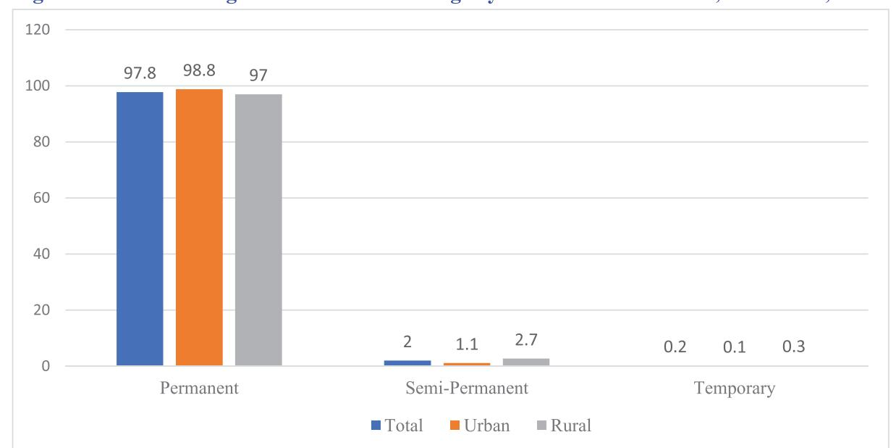

Figure 10.1.1 Percentage of residential buildings by nature of construction, Cambodia, 2024

Table 10.1.2. Per cent distribution of residential buildings by nature of construction and area. Cambodia, 2019- 2024

| Camboula, 201 | <b>9- 2024</b> |       |           |                      |           |
|---------------|----------------|-------|-----------|----------------------|-----------|
|               | Total Number   |       | Nat       | ture of Construction |           |
| Residence     | of Buildings   | Total | Permanent | Semi-Permanent       | Temporary |
| (1)           | (2)            | (3)   | (4)       | (5)                  | (6)       |
|               |                |       | 2019      |                      |           |
| Total         | 3,181,372      | 100   | 91.1      | 7.4                  | 1.6       |
| Urban         | 1,150,806      | 100   | 95.4      | 3.8                  | 0.7       |
| Rural         | 2,030,564      | 100   | 88.6      | 9.4                  | 2.0       |
|               |                |       | 2024      |                      |           |
| Total         | 3,735,659      | 100   | 97.8      | 2.0                  | 0.2       |
| Urban         | 1,600,151      | 100   | 98.8      | 1.1                  | 0.1       |
| Rural         | 2,135,508      | 100   | 97.0      | 2.7                  | 0.3       |

The following combination of housing materials was used to determine the quality of a building. Buildings used for residential purposes (wholly and partly) were classified as permanent, semi-permanent, or temporary on the basis of their wall and roof materials. Roofs made from bamboo, thatch, grass, plastic, or synthetic sheets were considered to be temporary.

Roofs made from any of the following materials were considered to be permanent: wood, plywood, concrete, brick, stone; galvanized iron and aluminum or other metal sheets; and asbestos cement sheets and tiles. Walls made of bamboo, thatch, grass, reeds, earth and salvaged or improvised materials, were considered to be temporary. Walls made of any of the following materials were considered to be permanent: wood, plywood, concrete, brick, stone; galvanized iron and aluminum or other metal sheets; and asbestos cement sheets.

A building or structure with a combination of permanent wall and permanent roof materials was considered to be permanent. A building with a combination of permanent wall and temporary roof materials, or temporary wall and permanent roof materials, was considered to be semi-permanent. A building with a combination of temporary wall and temporary roof material was considered to be a temporary building.

Table 10.1.2 shows that, in 2024, the materials of roofs and walls of 97.8 percent of residential buildings were permanent. 2.0 percent of buildings were classified as semi-permanent, while 0.2 percent were temporary. There was an increase of permanent buildings compared to 2019, at 91.1 percent. For semi-permanent and temporary was decreased 7.4 percent and 1.6 percent respectively.

### 10.2 Household Characteristics

### 10.2.1 Number and Size of Households

The total number of households counted in Cambodia in 2019 Census and CIPS 2024 were 3,553,021 and 3,735,659 respectively (Table 10.2.1). The number of normal or regular households in urban areas was 1,328,501 in 2019 Compared to 2024; it increased by 0.2 times to 1,600,151. In 2019, there were 2,224,520 in rural areas, compared to 2024, a decrease of 2,135,508.

Table 10.2.1 Number of regular households and average household size, Cambodia, 2019-2024

| Residence |           | of Normal eholds | Change 2019- 2024 |      | 5) (6) (7) 4.3 4.6 0.3 |           |
|-----------|-----------|---------------------|-------------------|------|---------------------------|-----------|
|           | 2019      | 2024                | 2019 2021         | 2019 | 2024                      | 2019 2021 |
| (1)       | (2)       | (3)                 | (4)               | (5)  | (6)                       | (7)       |
| Total     | 3,553,021 | 3,735,659           | 182,638           | 4.3  | 4.6                       | 0.3       |
| Urban     | 1,328,501 | 1,600,151           | 271,650           | 4.4  | 4.5                       | 0.1       |
| Rural     | 2,224,520 | 2,135,508           | -89,012           | 4.2  | 4.7                       | 0.5       |

Table 10.2.1 shows that the average household size at national was increased from 4.3 in 2019 to 4.6 in 2024. In urban areas, it increased by 0.1, while in rural areas it increased by 0.5 over the half-decade.

Table 10.2.2 Per cent distribution of households and population by sex, type of household and residence. Cambodia, 2024

| Danislana |           |            | Population |           |  |
|-----------|-----------|------------|------------|-----------|--|
| Residence | Household | Both Sexes | Male       | Female    |  |
| (1)       | (2)       | (3)        | (4)        | (5)       |  |
|           |           | 2019       |            |           |  |
| Total     | 3,594,031 | 15,552,211 | 7,571,837  | 7,980,374 |  |
| Urban     | 1,356,374 | 6,135,194  | 2,993,339  | 3,141,855 |  |
| Rural     | 2,237,657 | 9,417,017  | 4,578,498  | 4,838,519 |  |
|           |           | 2024       |            |           |  |
| Total     | 3,735,659 | 17,280,543 | 8,490,419  | 8,790,124 |  |
| Urban     | 1,600,151 | 7,172,206  | 3,503,507  | 3,668,699 |  |
| Rural     | 2,135,508 | 10,108,337 | 4,986,912  | 5,121,425 |  |

The result of the 2019 census and the CIPS 2024 shows that typical households with four members account for 24.9 percent and 24.8 percent, respectively. The increase in the proportion of households with more than four members (Table 10.2.3) also indicates that there has been a significant change in the size of the family over the past five years. Overall, households with more than four members accounted for 47.1 percent of the total households in 2024.

Table 10.2.3 Per cent distribution of households by sex of head of households and household size. Cambodia. 2019-2024\*

| Characteristics | Te                   | otal |
|-----------------|----------------------|------|
|                 | 2019                 | 2024 |
| (1)             | (2)                  | (3)  |
|                 | Household            |      |
| Male            | 74.4                 | 72.3 |
| Female          | 25.6                 | 27.7 |
| Total           | 100                  | 100  |
|                 | <b>Usual Members</b> |      |
| 1               | 4.7                  | 3.6  |
| 2               | 11.4                 | 9.0  |
| 3               | 19.3                 | 15.4 |
| 4               | 24.9                 | 24.8 |
| 5               | 18.2                 | 20.2 |
| 6               | 10.5                 | 12.4 |
| 7               | 5.4                  | 6.7  |
| 8               | 2.7                  | 3.5  |
| 9               | 1.4                  | 1.9  |
| 10+             | 1.5                  | 2.5  |
| 100             | 100                  | 100  |

### 10.2.2 Male and Female Head of Household

About 27.7 percent of households were headed by females. The majority of the female heads of household were aged between 30-59 years (Table 10.2.4). This pattern has increased in each of the past three censuses (57.8 percent in 2019 and 58.0 percent in 2024) The CIPS 2024 found that 18.9 percent of household heads were widowed, divorced or separated; 3.8 percent were never married; and 77.3 percent were currently married.

Figure 10.2.1 Female-headed households by age group, Cambodia 2019-2024

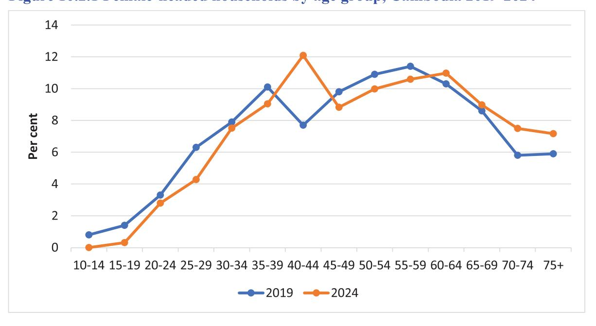

Table 10.2.4 Percent distribution of head of households aged 10+ years by sex and age group. Cambodia, 2019-2024\*

|           |           |           | Head of H | ousehold  |         |           |
|-----------|-----------|-----------|-----------|-----------|---------|-----------|
| Age Group | То        | tal       | Ma        | ale       | Fe      | emale     |
|           | 2019      | 2024      | 2019      | 2024      | 2019    | 2024      |
| (1)       | (2)       | (3)       | (4)       | (5)       | (6)     | (7)       |
| Number    | 3,553,021 | 3,735,659 | 2,642,712 | 2,700,221 | 910,309 | 1,035,438 |
| Total     | 100       | 100       | 100       | 100       | 100     | 100       |
| 10-14     | 0.4       | 0         | 0.2       | 0,0       | 0.8     | 0         |
| 15 -19    | 0.7       | 0,2       | 0.4       | 0,2       | 1.4     | 0.3       |
| 20 -24    | 2.8       | 1,9       | 2.6       | 1,6       | 3.3     | 2.8       |
| 25 -29    | 7.8       | 4,8       | 8.3       | 4,9       | 6.3     | 4.3       |
| 30 -34    | 11.4      | 9,8       | 12.6      | 10,7      | 7.9     | 7.5       |
| 35 -39    | 14.9      | 12,4      | 16.6      | 13,6      | 10.1    | 9.0       |
| 40 -44    | 9.9       | 15,7      | 10.7      | 17,1      | 7.7     | 12.1      |
| 45 -49    | 11.3      | 10,4      | 11.8      | 11,0      | 9.8     | 8.8       |
| 50 -54    | 10.7      | 10,4      | 10.6      | 10,6      | 10.9    | 10.0      |
| 55 -59    | 10.1      | 9,7       | 9.7       | 9,4       | 11.4    | 10.6      |
| 60 -64    | 7.2       | 9,4       | 6.2       | 8,8       | 10.3    | 11.0      |
| 65 -69    | 5.7       | 6,3       | 4.7       | 5,2       | 8.6     | 9.0       |
| 70 -74    | 3.7       | 4,5       | 2.9       | 3,4       | 5.8     | 7.5       |
| 75+       | 3.7       | 4,5       | 3.0       | 3,5       | 5.9     | 7.2       |

Table 10.2.5, 10.2.6 and 10.2.7 present the distribution of households by size of household and number of economically active members in the households. The distribution in each case is for 1,000 households. In 2024 about 2.0 percent of total households, 1.2 percent of male-headed households and 4.1 percent of female-headed households had no member who was earning. Female-headed households with one or two economically active members constituted about 21.3 percent and 34.7percent, respectively.

Table 10.2.5 Distribution of 1,000 households by size of households and number of economically active members, Total Cambodia, 2019-2024

| Household   |           |         | N       | Sumber of Eco | onomically | Active Mer | nbers   |         |            |
|-------------|-----------|---------|---------|---------------|------------|------------|---------|---------|------------|
| Size        | Total     | 0       | 1       | 2             | 3          | 4          | 5       | 6       | 7+         |
| (1)         | (2)       | (3)     | (4)     | (5)           | (6)        | (7)        | (8)     | (9)     | (10)       |
|             |           |         |         | 2019          |            |            |         |         |            |
| Number      | 3,553,021 | 117,027 | 632,193 | 1,622,054     | 562,467    | 354,176    | 155,320 | 66,825  | 42,95 9 |
| Total       | 1.000     | 32.9    | 177.9   | 456.5         | 158.3      | 99.7       | 43.7    | 18.8    | 12.1       |
| 1 Person    | 46.8      | 11.7    | 35.1    | I             | İ          | i          | 1       | -       | -          |
| 2 Persons   | 114.3     | 10.8    | 34.8    | 68.7          | ı          | _          | -       | -       | -          |
| 3 Persons   | 192.5     | 5.5     | 41.4    | 111.9         | 33.6       | -          |         | -       | -          |
| 4 Persons   | 249.4     | 2.8     | 36.4    | 47.7          | 41.4       | 21.1       | -       | -       | -          |
| 5 Persons   | 182.1     | 1.2     | 19.5    | 82.4          | 41.1       | 28.4       | 9.6     | -       | -          |
| 6 Persons   | 104.7     | 0.5     | 7.1     | 30.9          | 24.5       | 5.4        | 12.3    | 4.0     | -          |
| 7 Persons   | 54.2      | 0.2     | 2.4     | 10.2          | 10.9       | 14.0       | 10.3    | 4.9     | 1.5        |
| 8 Persons   | 27.3      | 0.1     | 0.8     | 3.2           | 4.3        | 6.3        | 6.0     | 4.4     | 2.3        |
| 9 Persons   | 14.2      | 0.1     | 0.3     | 1.0           | 1.6        | 2.7        | 3.1     | 2.9     | 2.6        |
| 10+ Persons | 14.5      | 0.1     | 0.2     | 0.6           | 1.0        | 1.8        | 2.4     | 2.7     | 5.8        |
|             |           |         |         | 2024          |            |            |         |         |            |
| Number      | 3,735,659 | 74,845  | 546,815 | 1,540,985     | 684,260    | 479,964    | 233,143 | 101,719 | 73,92 9 |
| Total       | 1.000     | 20.0    | 146.4   | 412.5         | 183.2      | 128.5      | 62.4    | 27.2    | 19.8       |
| 1 Person    | 36.4      | 8.4     | 28.0    | _             | -          | _          | -       | -       | -          |
| 2 Persons   | 90.1      | 7.6     | 30.4    | 52.1          | -          | -          | -       | -       | -          |
| 3 Persons   | 155.1     | 2.2     | 31.4    | 88.6          | 32.9       | -          | -       | -       | -          |
| 4 Persons   | 247.3     | 0.9     | 30.6    | 145.6         | 47.1       | 23.0       | ı       | -       | -          |
| 5 Persons   | 202.0     | 0.5     | 16.1    | 84.6          | 50.9       | 37.7       | 12.1    | -       | -          |
| 6 Persons   | 123.7     | 0.3     | 6.7     | 29.1          | 30.5       | 34.6       | 17.4    | 5.2     |            |
| 7 Persons   | 66.5      | 0.1     | 2.4     | 9.0           | 13.0       | 19.8       | 14.9    | 6.1     | 1.3        |
| 8 Persons   | 34.8      | -       | 0.6     | 2.6           | 5.4        | 7.6        | 9.7     | 6.1     | 2.9        |
| 9 Persons   | 18.8      | -       | 0.1     | 0.7           | 2.1        | 3.3        | 4.1     | 4.5     | 3.9        |
| 10+ Persons | 25.3      | -       | -       | 0.3           | 1.2        | 2.4        | 4.1     | 5.4     | 11. 7   |

Table 10.2.6 Distribution of 1,000 households by size of household and number of economically active members for male-headed households. Cambodia, 2019-2024

| Household      |           |        | Nui     | mber of Econ | omically Ac | ctive Membe | ers     |        |        |
|----------------|-----------|--------|---------|--------------|-------------|-------------|---------|--------|--------|
| Size           | Total     | 0      | 1       | 2            | 3           | 4           | 5       | 6      | 7+     |
| (1)            | (2)       | (3)    | (4)     | (5)          | (6)         | (7)         | (8)     | (9)    | (10)   |
|                |           |        |         | 2019         |             |             |         |        |        |
| Number         | 2,642,712 | 46,793 | 341,283 | 1,343,607    | 415,952     | 281,856     | 124,292 | 54,077 | 34,852 |
| Total          | 1.000     | 17.7   | 129.1   | 508.4        | 157.4       | 106.7       | 47      | 20.5   | 13.2   |
| 1 Person       | 23.6      | 4.5    | 19.1    | ı            | -           | -           | -       | -      | -      |
| 2 Persons      | 91.6      | 7.3    | 17.1    | 67.1         | -           | 1           | -       | -      | -      |
| 3 Persons      | 185.7     | 2.8    | 28      | 123.4        | 31.5        | -           | -       | -      | -      |
| 4 Persons      | 269       | 1.6    | 33.7    | 171.2        | 40.5        | 21.9        | -       | -      | -      |
| 5 Persons      | 198.6     | 0.8    | 20.1    | 95.2         | 41.7        | 30.6        | 10.3    | -      | -      |
| 6 Persons      | 113.5     | 0.4    | 7.4     | 35.0         | 25.3        | 27.7        | 13.4    | 4.3    | -      |
| 7 Persons      | 58.6      | 0.1    | 2.5     | 11.3         | 11.3        | 15.1        | 11.2    | 5.4    | 1.6    |
| 8 Persons      | 29.3      | 0.1    | 0.8     | 3.5          | 4.5         | 6.7         | 6.4     | 4.8    | 2.5    |
| 9 Persons      | 15.1      | 0.1    | 0.3     | 1.1          | 1.6         | 2.9         | 3.2     | 3.1    | 2.9    |
| 10+            | 15.1      | 0.1    | 0.2     | 0.6          | 1.0         | 1.8         | 2.4     | 2.9    | 6.2    |
| Persons        |           |        |         |              |             |             |         |        |        |
|                |           |        |         | 2024         |             |             |         |        |        |
| Number         | 2,700,221 | 31,931 | 326,381 | 1,181,935    | 479,565     | 368,575     | 175,670 | 79,330 | 56,833 |
| Total          | 1.000     | 11.8   | 120.9   | 437.7        | 177.6       | 136.5       | 65.1    | 29.4   | 21.0   |
| 1 Person       | 21.1      | 2.9    | 18.2    | -            | -           | -           | -       | -      | -      |
| 2 Persons      | 72.7      | 6.6    | 18.1    | 48.0         | -           | -           | -       | -      | -      |
| 3 Persons      | 148.5     | 1.5    | 26.2    | 88.7         | 32.0        | -           | -       | -      | -      |
| 4 Persons      | 265.3     | 0.3    | 30.5    | 164.8        | 44.9        | 24.8        | -       | -      | -      |
| 5 Persons      | 211.1     | 0.4    | 17.3    | 91.4         | 48.7        | 40.6        | 12.7    | -      | -      |
| 6 Persons      | 128.0     | 0.1    | 6.9     | 30.5         | 30.8        | 36.4        | 18.3    | 4.9    | -      |
| 7 Persons      | 70.5      | 0.1    | 2.9     | 10.0         | 12.6        | 21.0        | 15.8    | 6.5    | 1.6    |
| 8 Persons      | 37.4      | -      | 0.6     | 2.9          | 5.6         | 8.0         | 10.3    | 7.2    | 2.8    |
| 9 Persons      | 20.6      | _      | 0.0     | 1.0          | 2.1         | 3.3         | 4.2     | 5.2    | 4.9    |
| 10+ Persons | 24.9      | -      | ı       | 0.4          | 1.0         | 2.3         | 3.7     | 5.6    | 11.8   |
| Persons        |           |        |         |              |             |             |         |        |        |

Table 10.2.7 Distribution of 1,000 households by size of household and number of economically active members for female-headed households. Cambodia, 2019-2024

| Household   |           |        | Numbe   | er of Economi | ically Activ | e Members | 3      |        |        |
|-------------|-----------|--------|---------|---------------|--------------|-----------|--------|--------|--------|
| Size        | Total     | 0      | 1       | 2             | 3            | 4         | 5      | 6      | 7+     |
| (1)         | (2)       | (3)    | (4)     | (5)           | (6)          | (7)       | (8)    | (9)    | (10)   |
|             |           |        |         | 2019          |              |           |        |        |        |
| Number      | 910,309   | 70,234 | 290,910 | 278,447       | 146,515      | 72,320    | 31,028 | 12,748 | 8,107  |
| Total       | 1.000     | 77.2   | 319.6   | 305.9         | 161.0        | 79.5      | 34.1   | 14.0   | 8.9    |
| 1 Person    | 114.2     | 32.7   | 81.6    | -             | -            | -         | -      | -      | -      |
| 2 Persons   | 180.3     | 0.9    | 86.1    | 73.2          | -            | 1         | 1      | -      | -      |
| 3 Persons   | 212.1     | 3.3    | 80.4    | 78.6          | 39.8         | 1         | -      | -      | -      |
| 4 Persons   | 192.6     | 6.3    | 44.2    | 79.5          | 43.8         | 18.8      | 1      | -      | -      |
| 5 Persons   | 134.3     | 2.4    | 17.8    | 45.1          | 39.3         | 22.1      | 7.6    | -      | -      |
| 6 Persons   | 79.2      | 0.9    | 6.2     | 19.2          | 22.1         | 18.8      | 9.1    | 2.9    | -      |
| 7 Persons   | 41.7      | 0.4    | 2.1     | 6.8           | 9.8          | 10.7      | 7.6    | 3.4    | 1.1    |
| 8 Persons   | 21.4      | 0.2    | 0.7     | 2.2           | 3.7          | 5.1       | 4.9    | 3.1    | 1.5    |
| 9 Persons   | 11.6      | 0.1    | 0.3     | 0.8           | 1.5          | 2.3       | 2.6    | 2.3    | 1.9    |
| 10+ Persons | 12.6      | 0.1    | 0.2     | 0.5           | 1.0          | 1.8       | 2.2    | 2.4    | 4.5    |
|             |           |        |         | 2024          |              |           |        |        |        |
| Number      | 1,035,438 | 42,914 | 220,435 | 359,050       | 204,695      | 111,38    | 57,473 | 22,389 | 17,095 |
| Number      |           |        |         |               |              | 8         |        |        |        |
| Total       | 1.000     | 41.4   | 212.9   | 346.8         | 197.7        | 107.6     | 55.5   | 21.6   | 16.5   |
| 1 Person    | 76.4      | 22.9   | 53.5    | _             | -            | -         | -      | -      | -      |
| 2 Persons   | 135.3     | 10.2   | 62.6    | 62.5          | -            | -         | -      | -      | -      |
| 3 Persons   | 172.3     | 4.1    | 45.0    | 88.2          | 35.0         | -         | -      | -      | -      |
| 4 Persons   | 200.3     | 2.6    | 31.0    | 95.4          | 52.8         | 18.6      | -      | _      | -      |
| 5 Persons   | 178.3     | 0.9    | 13.0    | 66.7          | 56.9         | 30.1      | 10.7   | -      | -      |
| 6 Persons   | 112.6     | 0.8    | 6.1     | 25.3          | 29.9         | 29.7      | 15.0   | 5.9    | -      |
| 7 Persons   | 56.1      | -      | 0.9     | 6.5           | 14.0         | 16.5      | 12.6   | 5.1    | 0.5    |
| 8 Persons   | 28.1      | -      | 0.4     | 1.8           | 5.0          | 6.4       | 8.0    | 3.2    | 3.2    |
| 9 Persons   | 14.1      | -      | 0.3     | 0.1           | 2.2          | 3.5       | 3.9    | 2.7    | 1.3    |
| 10+ Persons | 26.4      | -      | -       | 0.2           | 2.0          | 2.7       | 5.2    | 4.8    | 11.5   |

Table 10.2.8 showed that the age of about 75.2 percent of economically active household heads ranged from 30 to 59 years old. On the other hand, about 72.2 percent of economically inactive household heads were in the age group 60 years and above. In the last three censuses, the proportion of older economically inactive household heads has increased (and 60.0 per cent in 2019 and 72.2 per cent). On the other hand, if the household is absent De Jure at the time of the survey, the husband, wife, or any other family member may be considered the De Facto head of household. This person may be economically active or inactive.

Table 10.2.8 Percentage distribution of heads of households aged 10+ years by sex, economically active and inactive status, and age group, Cambodia 2019-2024\*

| Head of   | Eco       | nomically Activ | ve      | Eco     | onomically Inact | ive     |
|-----------|-----------|-----------------|---------|---------|------------------|---------|
| Household | Total     | Male            | Female  | Total   | Male             | Female  |
| (1)       | (2)       | (3)             | (4)     | (5)     | (6)              | (7)     |
|           |           |                 | 2019    |         |                  |         |
| Number    | 3,206,073 | 2,495,031       | 711,042 | 346,948 | 147,681          | 199,267 |
| Total     | 100       | 100             | 100     | 100     | 100              | 100     |
| 10-14     | 0.0       | 0.0             | 0.0     | 3.8     | 4.1              | 3.5     |
| 15 -19    | 0.4       | 0.2             | 0.8     | 3.6     | 3.9              | 3.5     |
| 20 -24    | 2.8       | 2.6             | 3.7     | 2.1     | 2.0              | 2.2     |
| 25 -29    | 8.4       | 8.7             | 7.3     | 2.1     | 1.5              | 2.5     |
| 30 -34    | 12.3      | 13.2            | 9.2     | 2.4     | 1.5              | 3.0     |
| 35 -39    | 16.2      | 17.4            | 11.9    | 3.0     | 2.2              | 3.6     |
| 40 -44    | 10.7      | 11.2            | 8.9     | 2.6     | 1.9              | 3.1     |
| 45 -49    | 12.0      | 12.3            | 11.1    | 4.1     | 3.0              | 5.0     |
| 50 -54    | 11.1      | 10.9            | 11.9    | 6.6     | 5.4              | 7.5     |
| 55 -59    | 10.1      | 9.7             | 11.7    | 9.7     | 9.1              | 10.2    |
| 60 -64    | 6.6       | 5.7             | 9.5     | 13.1    | 13.1             | 13.0    |
| 65 -69    | 4.8       | 4.1             | 7.2     | 13.9    | 14.4             | 13.5    |
| 70 -74    | 2.6       | 2.2             | 3.8     | 13.7    | 15.0             | 12.8    |
| 75+       | 2.0       | 1.8             | 2.9     | 19.3    | 22.9             | 16.7    |
|           |           |                 | 2024    |         |                  |         |
| Number    | 3,246,039 | 2,502,203       | 743,837 | 489,620 | 198,018          | 291,602 |
| Total     | 100       | 100             | 100     | 100     | 100              | 100     |
| 10-14     | -         | -               | -       | 1       | 1                | -       |
| 15 -19    | 0.2       | 0.2             | 0.3     | 0.5     | 0.7              | 0.5     |
| 20 -24    | 1.8       | 1.5             | 2.8     | 2.7     | 2.4              | 2.9     |
| 25 -29    | 5.3       | 5.3             | 5.4     | 1.0     | 0.5              | 1.3     |
| 30 -34    | 11.1      | 11.5            | 9.6     | 1.5     | 0.4              | 2.2     |
| 35 -39    | 13.9      | 14.6            | 11.5    | 2.0     | 0.7              | 2.8     |
| 40 -44    | 17.6      | 18.4            | 15.2    | 3.1     | 1.6              | 4.2     |
| 45 -49    | 11.5      | 11.8            | 10.8    | 2.7     | 1.2              | 3.8     |
| 50 -54    | 11.0      | 11.1            | 10.9    | 6.2     | 4.2              | 7.5     |
| 55 -59    | 10.0      | 9.5             | 11.5    | 8.1     | 7.8              | 8.3     |
| 60 -64    | 8.4       | 8.1             | 9.4     | 15.9    | 17.3             | 14.9    |
| 65 -69    | 4.8       | 4.2             | 6.7     | 15.9    | 17.6             | 14.8    |
| 70 -74    | 2.5       | 2.2             | 3.8     | 17.6    | 18.6             | 16.9    |
| 75+       | 1.8       | 1.7             | 2.2     | 22.8    | 27.1             | 19.9    |

Table~10.2.9~Distribution~of~1,000~households~by~tenure~status,~number~of~rooms~occupied~and~residence,~Cambodia~2019-2024

| Tenure             |                |                | Households    | Occupying N  | lo, of Rooms |        |        |            |
|--------------------|----------------|----------------|---------------|--------------|--------------|--------|--------|------------|
| Status             | Total          | 1              | 2             | 3            | 4            | 5      | 6      | 7+         |
| (1)                | (2)            | (3)            | (4)           | (5)          | (6)          | (7)    | (8)    | (9)        |
|                    | ( )            | ( )            | 201           |              | ( )          | (1)    |        |            |
|                    |                |                | Tot           |              |              |        |        |            |
| Number of          | 3,553,021      | 2,222          | 933,094       | 249,836      | 95,863       | 29,772 | 12,423 | 9,291      |
|                    | 1,000          | 626            | 263           | 70           | 27           | 8      | 3      | 3          |
| Owner              | 907            | 554            | 249           | 67           | 25           | 8      | 3      | 2          |
| Rented             | 62             | 50             | 8             | 2            | 1            | 0      | 0      | 0          |
| Rent Free          | 28             | 21             | 5             | 1            | 1            | 0      | 0      | 0          |
| Other              | 3              | 2              | 0             | 0            | 0            | 0      | 0      | 0          |
|                    |                |                | Urb           | 1            | ı            |        |        |            |
| Number of          | 1,328,501      | 717,148        | 371,058       | 131,736      | 67,022       | 23,636 | 10,232 | 7,669      |
|                    | 1,000          | 540            | 279           | 99           | 50           | 18     | 8      | 6          |
| Owner              | 819            | 397            | 255           | 92           | 47           | 16     | 7      | 5          |
| Rented             | 154            | 123            | 20            | 6            | 3            | 1      | 1      | 0          |
| Rent Free          | 25             | 18             | 4             | 1            | 1            | 0      | 0      | 0          |
| Other              | 2              | 2              | 0             | 0            | 0            | 0      | 0      | 0          |
| Number of          | 2,224,520      | 1,505,594      | 562,036       | 118,100      | 28,841       | 6,136  | 2,191  | 1622       |
| Trumber of         | 1,000          | 677            | 253           | 53           | 13           | 3      | 2,191  | 1022       |
| Owner              | 960            | 647            | 245           | 51           | 12           | 3      | 1      | 1          |
| Rented             | 8              | 6              | 2 13          | 0            | 0            | 0      | 0      | 0          |
| Rent Free          | 30             | 22             | 6             | 1            | 0            | 0      | 0      | 0          |
| Other              | 3              | 2              | 0             | 0            | 0            | 0      | 0      | 0          |
|                    |                |                | 202           | 24           |              |        |        |            |
|                    |                |                | Tot           | al           |              |        |        |            |
| Number of          | 3.735.659      | 1.869.919      | 1.172.986     | 462.271      | 151.728      | 44.818 | 17.147 | 16.790     |
|                    | 1.000          | 500,6          | 314,0         | 123,7        | 40,6         | 12,0   | 4,6    | 4,5        |
| Owner              | 870,9          | 411,1          | 288,0         | 115,3        | 37,4         | 10,9   | 4,2    | 4,0        |
| Rented             |                | 59,9           | 14,0          | 3,4          | 0,9          | 0,8    | 0,4    | 0,3        |
| Rent Free          | 47,2           | 28,0           | 11,6          | 4,8          | 2,2          | 0,3    | 0,0    | 0,2        |
| Other              |                | 1,6            | 0,4           | 0,2          | 0,1          |        | -      | -          |
| Name bases of      | 1.600.151      | CEC EC.        | Urb           |              | 102.000      | 26222  | 10.671 | 11.006     |
| Number of          | 1.600.151      | 676.764        | 505.419       | 252.168      | 103.888      | 36.333 | 13.674 | 11.906     |
| Owner              | 1.000          | 422,9          | 315,9         | 157,6        | 64,9         | 22,7   | 8,5    | 7,4        |
|                    | 768,8 177,2 | 261,3 133,8 | 269,4 31,2 | 143,6 7,2 | 59,5 2,0  | 20,4   | 7,8    | 6,8 0,5 |
| Rented             | 1//,2          | 27,2           | 15,1          | 6,4          | 3,4          | 0,5    | 0,/    | 0,5        |
| Rent Free Other |                | 0,7            | 0,2           | 0,4          | 0,0          | 0,5    |        | - 0,2      |
| Juici              |                | 0,7            | Rui           |              | 0,0          |        | _      | _          |
| Number of          | 2,135,508      | 1,193,156      | 667,567       | 210,103      | 47,839       | 8,485  | 3,473  | 4,884      |
|                    | 1.000          | 558.7          | 312.6         | 98.4         | 22.4         | 4.0    | 1.6    | 2.3        |
| Owner              | 947.5          | 523.4          | 301.9         | 94.1         | 20.8         | 3.8    | 1.4    | 1.9        |
| Rented             |                | 4.5            | 1.2           | 0.6          | 0.1          |        | 0.1    | 0.1        |
| Rent Free          |                | 28.6           | 9.0           | 3.6          | 1.3          | 0.2    | 0.1    | 0.3        |
| Other              |                | 2.2            | 0.5           | 0.1          | 0.2          |        | _      | -          |

### 10.2.3 Number of Rooms Occupied

The majority of households (50.1 percent) have only one room. In urban areas, 42.3 percent of households have one room, 31.6 percent have two rooms, 15.8 percent have three rooms, and about 10.3 percent of households live in dwellings with four or more rooms. In rural areas, 55.9 percent of households have one room, 31.3 percent have two rooms, 9.8 percent have three rooms, and about 3.0 percent of households live in dwellings with four or more rooms.

Figure 10.2.2 Percentage distribution of households by number of rooms occupied, Cambodia 2024

### 10.3 Household Amenities and Facilities 10.3.1 Drinking Water

As in the 2019 Census, information on household amenities was collected in CIPS 2024. As defined, clean drinking water included water that was piped into the dwelling; piped into the compound, yard or plot; and water collected from a public tap, standpipe, tube well, borehole and protected well; as well as rainwater and bottled water Approximately 87 percent of Cambodian households had a source of improved drinking water in 2024 (Table 10.3.1). In urban areas, the percentage of households with a source of improved drinking water was higher (92 percent).

Table 10.3.1 Per cent distribution of households by main source of drinking water, Cambodia 2019-2024

|                                          | To        | tal       | Ur        | ban       | Rı        | ıral      |
|------------------------------------------|-----------|-----------|-----------|-----------|-----------|-----------|
| Source of drinking water                 | 2019      | 2024      | 2019      | 2024      | 2019      | 2024      |
| (1)                                      | (2)       | (3)       | (4)       | (5)       | (6)       | (7)       |
| Number of Households                     | 3,553,021 | 3,735,659 | 1,328,501 | 1,600,151 | 2,224,520 | 2,135,508 |
| Total                                    | 100       | 100       | 100       | 100       | 100       | 100       |
| Piped into Dwelling                      | 25.5      | 24.1      | 46.7      | 39.7      | 12.8      | 12.4      |
| Piped into Compound, Yard or Plot        | 3.6       | 1.7       | 4.9       | 2.5       | 2.9       | 1.1       |
| Public Tap / Standpipe                   | 3.9       | 0.8       | 5.7       | 0.9       | 2.8       | 0.8       |
| Tube Well. Borehole                      | 25.2      | 23.0      | 12.9      | 10.4      | 32.6      | 32.5      |
| Protected Well                           | 4.5       | 3.2       | 2.2       | 1.3       | 5.9       | 4.6       |
| Unprotected Well                         | 5.9       | 2.6       | 1.4       | 0.4       | 8.6       | 4.3       |
| Protected Spring                         | 0.3       | 0.1       | 0.2       | 0.1       | 0.4       | 0.1       |
| Unprotected Spring                       | 0.3       | 0.1       | 0.1       | 0.0       | 0.5       | 0.2       |
| Rainwater Collection                     | 2.8       | 3.9       | 1.5       | 2.3       | 3.5       | 5.1       |
| Surface Water (River, Stream, Dam, Lake) | 10.6      | 4.6       | 5.4       | 1.7       | 13.7      | 6.8       |
| Bought Water                             | =         | -         | -         | -         | -         | -         |
| Tanker-Truck Lake                        | 4.9       | 1.3       | 4.8       | 1.5       | 5.0       | 1.0       |
| Cart with Small Tank/Drum                | 4.8       | 3.5       | 4.0       | 3.6       | 5.3       | 3.5       |
| Bottled Water                            | 7.1       | 30.6      | 9.8       | 35.0      | 5.4       | 27.3      |
| Other (specify)                          | 0.6       | 0.5       | 0.6       | 0.8       | 0.7       | 0.3       |

### 10.3.2. Source of Light

The final results CIPS 2024, most households used electricity for lighting. Table 10.3.2 shows that about 93.9 percent of households in Cambodia used electricity (including electricity from the grid, generators, and both sources) increased from 84.0 percent in 2019. In particular, about 99 percent of households in urban used electricity for lighting, while 90 percent of households in rural also used electricity. The above figures indicate that in just only five years, Cambodian households have increased their used of electricity as a source of lighting, especially in rural residence.

100.0 91.3 95.0 90.0 80.0 70.0 60.0 50.0 40.0 30.0 20.0 10.0 1.6 2.0 1.3 0.1 0.0 City Power Generator City Power+ Candle Kerosene ■Total ■Urban ■Rural

Figure 10.3.2. Per cent distribution of households by main source of lighting and residence, Cambodia 2019-2024

Table 10.3.2. Percentage distribution of household by main source of lighting and residence, Cambodia, Cambodia 2024

| Residence | Year | Number of Households | Total | City Power | Generator | City Power+ Generator | Kerosene | Candle | Battery | Other |
|-----------|------|-------------------------|-------|---------------|-----------|-----------------------------|----------|--------|---------|-------|
| (1)       | (2)  | (3)                     | (4)   | (5)           | (6)       | (7)                         | (8)      | (9)    | (10)    | (11)  |
| Total     | 2019 | 3,553,021               | 100   | 79.6          | 1.6       | 2.8                         | 0.6      | 0.3    | 13.4    | 1.6   |
| Total     | 2024 | 3,735,659               | 100   | 91,3          | 1,6       | 1,0                         | 0,2      | 0,1    | 2,6     | 3,1   |
| Urban     | 2019 | 1,328,501               | 100   | 92.3          | 2.0       | 2.6                         | 0.4      | 0.2    | 2.4     | 0.2   |
| Orban     | 2024 | 1,600,151               | 100   | 95,0          | 2,0       | 1,8                         | 0,3      | 0,1    | 0,3     | 0,6   |
| Rural     | 2019 | 2,224,520               | 100   | 72.1          | 1.3       | 3.0                         | 0.8      | 0.4    | 20.1    | 2.4   |
| Nuidi     | 2024 | 2,135,508               | 100   | 88.5          | 1.3       | 0.5                         | 0.2      | 0.1    | 4.3     | 5.0   |

### 10.3.3. Toilet Facilities

The final result CIPS 2024 shows that the presence of toilet facilities used in Cambodia has significantly improved. Table 10.3.3 shows that 93.1 percent of households had toilet facilities dramatically increased by 10.3 percentage point. In 2024 had 9 in 10 households using toilets, both in urban and rural residence. Of these, approximately 70.2 percent of households with toilets in rural residence used flush toilets or pit latrines, compared to only

34.7 percent in urban residence. Approximately 32.2 percent of households in urban residence used flush toilets or pit latrines connected to public sewers, compared to 2.9 percent in rural residence.

In 2024, the households had access to all three types of services: improved drinking water, electricity, and toilets in their homes, accounting for 78.2 percent of households. This represents a significant improvement over the previous census. In 2019, only 56.7 percent had access to all three types. In 2024, 86.4 percent of urban households had access to all three types, compared to 72.0 percent in rural residence (Table 10.3.4).

Figure 10.3.3. Per cent distribution of households by availability of toilet facilities and residence, Cambodia 2024

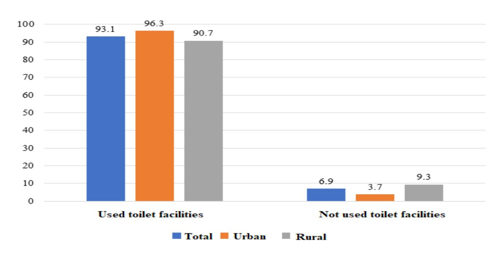

Figure 10.3.4 Per cent distribution of households by type of toilet facility and residence, Cambodia 2024

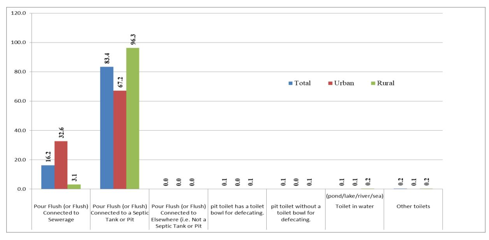

Table 10.3.3 Per cent distribution of households by availability of toilet facilities, type and residence, Cambodia 2019-2024

| Residence | Year | No. of Household | Total | House                        | ehold                 |                                             |                                                            | Туре                                                                           | of Toilet F                                  | acility                                          |                                          |               |
|-----------|------|---------------------|-------|------------------------------|-----------------------|---------------------------------------------|------------------------------------------------------------|--------------------------------------------------------------------------------|----------------------------------------------|--------------------------------------------------|------------------------------------------|---------------|
|           |      |                     |       | House hold Without Toilet | Household With Toilet | Pour Flush (or Flush) Connected to Sewerage | Pour Flush (or Flush) Connected to a Septic Tank or Pit | Pour Flush (or Flush) Connected to Elsewhere (i.e. Not a Septic Tank or Pit | pit toilet has a toilet bowl for defecating. | pit toilet without a toilet bowl for defecating. | Toilet in water (pond/lake/river/sea) | Other toilets |
| (1)       | (2)  | (3)                 | (4)   | (5)                          | (6)                   | (7)                                         | (8)                                                        | (9)                                                                            | (10)                                         | (11)                                             | (12)                                     | (13)          |
| Total     | 2019 | 3,553,021           | 100   | 17.2                         | 82.8                  | 34.9                                        | 45.6                                                       | 10.4                                                                           | 5.2                                          | 2.0                                              | 1.0                                      | 1.0           |
|           | 2024 | 3,735,659           | 100   | 6.9                          | 93.1                  | 16.2                                        | 83.4                                                       | 0.0                                                                            | 0.1                                          | 0.1                                              | 0.1                                      | 0.2           |
| Urban     | 2019 | 1,328,501           | 100   | 9.6                          | 90.4                  | 49.6                                        | 38.4                                                       | 7.9                                                                            | 2.7                                          | 0.6                                              | 0.5                                      | 0.4           |
|           | 2024 | 1,600,151           | 100   | 3.7                          | 96.3                  | 32.6                                        | 67.2                                                       | 0.0                                                                            | 0.0                                          | 0.0                                              | 0.1                                      | 0.1           |
| Rural     | 2019 | 2,224,520           | 100   | 21.7                         | 78.3                  | 24.8                                        | 50.6                                                       | 12.1                                                                           | 6.9                                          | 2.9                                              | 1.3                                      | 1.4           |
|           | 2024 | 2,135,508           | 100   | 9.3                          | 90.7                  | 3.1                                         | 96.3                                                       | 0.0                                                                            | 0.1                                          | 0.1                                              | 0.2                                      | 0.2           |

Table 10.3.4 Proportion of households having access to an improved water source, electricity and a toilet within the household, Cambodia 2019-2024

| Residence | Per cent of Households w | ith Combined Amenities |
|-----------|--------------------------|------------------------|
|           | 2019                     | 2024                   |
| (1)       | (2)                      | (3)                    |
| Total     | 56.7                     | 78.2                   |
| Urban     | 75.5                     | 86.4                   |
| Rural     | 45.4                     | 72.0                   |

### 10.3.4 Cooking Fuel

The CIPS 2024 and 2019 Census shows that the trend of households using wood for cooking has decreased, while households using gas have steadily increased. However, wood is still the main fuel for cooking in rural areas. Table 10.3.5 shows that about 39.4 percent of households used wood for cooking, with only 19.3 percent in urban residence and 54.5 percent in rural residence, almost three times more than in urban residence, and a decrease from 60.9 percent in Cambodia, 31.0 percent in urban residence, and 78.8 percent in rural residence compared to the 2019 Census. The use of gas for cooking has increased from 27.7 percent to 47.6 percent, from 56.2 per cent to 70.5 percent in urban residence, and from 30.6 percent to 10.7 percent in rural residence, compared between 2019 and 2024, respectively.

Table 10.3.4 Per cent distribution of households by type of fuel used for cooking and residence, Cambodia 2019-2024

|           |      |            |       |          |          | Type of l    | Fuel                                        |              |      |       |
|-----------|------|------------|-------|----------|----------|--------------|---------------------------------------------|--------------|------|-------|
| Residence | Year | Households | Total | Firewood | Charcoal | Kerose ne | Liquefi ed Petrole um Gas (LPG) | Electric ity | None | Other |
| (1)       | (2)  | (3)        | (4)   | (5)      | (6)      | (7)          | (8)                                         | (9)          | (10) | (11)  |
| Total     | 2019 | 3,553,021  | 100   | 60.9     | 7.8      | 0.3          | 27.7                                        | 3.0          | 0.1  | 0.1   |
|           | 2024 | 3,735,659  | 100   | 39.4     | 10.4     | 0.2          | 47.6                                        | 1.8          | 0.2  | 0.3   |
| Urban     | 2019 | 1,328,501  | 100   | 31.0     | 7.9      | 0.4          | 56.2                                        | 4.2          | 0.2  | 0.2   |
|           | 2024 | 1,600,51   | 100   | 19.3     | 72       | 0.3          | 70.5                                        | 1.9          | 0.3  | 0.6   |
| Rural     | 2019 | 2,224,520  | 100   | 78.8     | 7.7      | 0.3          | 10.7                                        | 2.3          | 0.1  | 0.1   |
|           | 2024 | 2,135,508  | 100   | 54.5     | 12.8     | 0.2          | 30.6                                        | 1.8          | 0.1  | 0.2   |

Figure 10.3.5 Percent distribution of households by type of fuel used for cooking and area, Cambodia, 2024

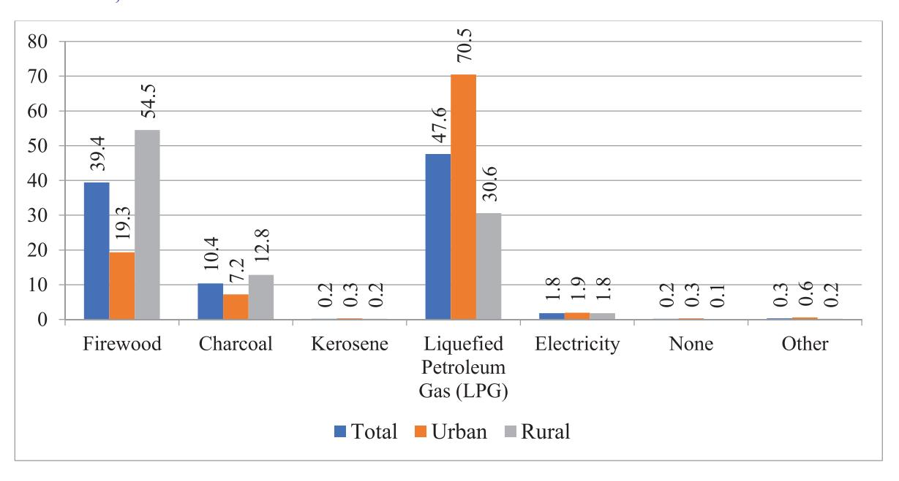

### 10.3.5 Access to the Internet

According to the CIPS 2024, households in Cambodia are increasingly using the Internet due to the rapid development of technology in the world, especially the affordable price of mobile phones that can be used with the Internet. Figure 10.3.6 shows that 85.7 percent of households have at least one member using the Internet (including at home, mobile phones, public places, and workplaces), 87.0 percent in urban residence, and 84.8 percent in rural residence.

Figure 10.3.6. Percentage distribution of households by type of internet access and residence, Cambodia 2024

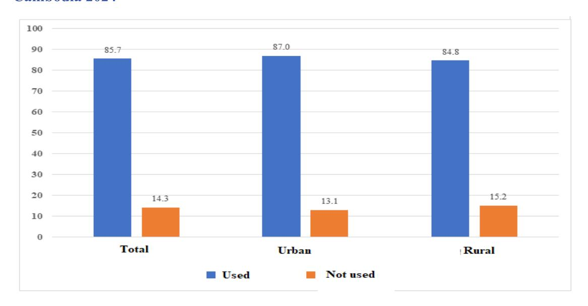

### 10.3.6 Personal Assets

The information on the types and quantities of household appliances was also collected in CIPS 2024, this information provides an indicator of the economic conditions in Cambodia. The CIPS 2024 at nationwide 96.1 percent of households have a mobile phone, 96.9 percent in urban households and 95.5 percent of rural households. In urban residence, 88.0 percent of households owned a motorbike against 84.2 percent in rural households. Meanwhile, at the national level households owned cars (small car/touring car/truck) was 15.2 percent. Bicycles are owned for personal used by 47.1 percent of urban households and 53.5 percent of rural households. The nationwide the households owned fan accounted for 90.6 percent, 95.2 percent in urban residence and 87.1 percent in rural residence. Based on the above results, it can be said that motorbikes remain the most popular means of transportation in Cambodia, particularly in urban residence. Fans are widely used by household, both in urban and rural residence, due to the increase in temperature. In other words, families across the country are using electricity, reflecting the changes in the lifestyle of Cambodians today.

Table 10.3.6 Percentage distribution of households by number and type of assets owned and residence, Cambodia 2024

| Tyne of Assets  | Household | Household having the |       |      |              |       | Perc | Per cent owned Assets | l Assets |      |      |      |      |      |
|-----------------|-----------|----------------------|-------|------|--------------|-------|------|-----------------------|----------|------|------|------|------|------|
|                 | Number    | Households           | Total | 0    | 1            | 2     | 3    | 4                     | 5        | 9    | 7    | 8    | 6    | 10+  |
| (1)             | (2)       | (3)                  | (4)   | (5)  | (9)          | (7)   | (8)  | (6)                   | (10)     | (11) | (12) | (13) | (14) | (15) |
|                 |           |                      |       |      |              | Total |      |                       |          |      |      |      |      |      |
| Radio           | 757,314   | 20.3                 | 100   | 7.67 | 19.3         | 8.0   | 0.1  | 0.0                   | 0.0      | 0.0  | 1    | 1    | 1    | 0.1  |
| Television      | 1,309,295 | 35.0                 | 100   | 65.0 | 33.5         | 1.2   | 0.2  | 0.1                   | 0.0      | 0.0  | 1    | 1    | ı    | 0.1  |
| Telephone       | 34,872    | 6.0                  | 100   | 99.1 | 9.0          | 0.2   | 0.1  | 0.1                   | 0.0      | 0.0  | 1    | 1    | ı    | 0.0  |
| Cell Phone      | 3,588,245 | 96.1                 | 100   | 3.9  | 20.6         | 32.6  | 19.1 | 12.4                  | 6.1      | 2.7  | 1.1  | 0.7  | 0.3  | 0.4  |
| Computer        | 406,311   | 10.9                 | 100   | 89.1 | 7.7          | 2.1   | 0.5  | 0.2                   | 0.1      | 0.1  | 0.0  | 1    | 0.0  | 0.1  |
| Bicycle         | 1,895,553 | 50.7                 | 100   | 49.3 | 39.0         | 9.3   | 1.9  | 0.3                   | 0.1      | 0.0  | 1    | 0.0  | ı    | 0.1  |
| Motorcycle      | 3,206,331 | 85.8                 | 100   | 14.2 | 48.8         | 24.3  | 8.8  | 2.8                   | 0.7      | 0.2  | 0.1  | 0.0  | ı    | 0.1  |
| Refrigerator    | 1,176,200 | 31.5                 | 100   | 68.5 | 29.6         | 1.4   | 0.3  | 0.1                   | 0.0      | 0.0  | 0.0  |      | ı    | 0.1  |
| Washing Machine | 650,782   | 17.4                 | 100   | 82.6 | 16.3         | 9.0   | 0.2  | 0.2                   | 0.1      | 0.0  | 0.0  |      | 0.0  | 0.0  |
| Fan             | 3,383,948 | 9.06                 | 100   | 9.4  | 22.8         | 29.9  | 19.8 | 9.3                   | 5.2      | 1.8  | 8.0  | 0.5  | 0.2  | 0.4  |
| Air-Conditioner | 445,980   | 11.9                 | 100   | 88.1 | 8.9          | 2.8   | 1.3  | 9.0                   | 0.1      | 0.1  | 0.0  | 0.0  | 0.0  | 0.0  |
| Cars            | 477,593   | 12.8                 | 100   | 87.2 | 11.2         | 1.3   | 0.2  | 0.1                   | 0.0      | 0.0  | 1    |      | ı    | 0.0  |
| Vans            | 88,335    | 2.4                  | 100   | 9.76 | 2.0          | 0.3   | 0.1  | 0.0                   | 0.0      |      | ı    | 0.0  | ı    | 0.0  |
| Boat            | 108,971   | 2.9                  | 100   | 97.1 | 2.7          | 0.1   | 0.1  | 0.0                   | ı        | 0.0  | 1    |      | 0.0  | 0.0  |
| Tractor/ Koyaon | 384,958   | 10.3                 | 100   | 2.68 | 6.7          | 0.4   | 0.1  | 0.0                   | 1        | 0.0  | -    | -    | 0.0  | 0.0  |
|                 |           |                      |       |      | $\mathbf{n}$ | Urban |      |                       |          |      |      |      |      |      |
| Radio           | 366,698   | 22.9                 | 100   | 77.1 | 21.6         | 1.0   | 0.2  | 0.0                   | -        | 0.0  | -    | -    | I    | 0.1  |
| Television      | 667,754   | 41.7                 | 100   | 58.3 | 38.8         | 2.1   | 0.5  | 0.1                   | 0.1      | 0.0  | 1    | -    | •    | 0.1  |
| Telephone       |           | 1.3                  | 100   | 98.7 | 6.0          | 0.2   | 0.1  | 0.1                   | 0.0      | 0.1  | 1    | -    | •    | 0.0  |
| Cell Phone      | 1,549,862 | 6.96                 | 100   | 3.1  | 15.3         | 32.5  | 19.9 | 14.5                  | 7.3      | 3.2  | 1.7  | 1.0  | 0.5  | 0.8  |
| Computer        | 276,568   | 17.3                 | 100   | 82.7 | 11.9         | 3.7   | 6.0  | 0.4                   | 0.2      | 0.1  | 0.0  | -    | 0.0  | 0.1  |
| Bicycle         | 753,593   | 47.1                 | 100   | 52.9 | 34.9         | 9.7   | 2.0  | 0.4                   | 0.1      | 0.0  | -    | 0.0  | •    | 0.1  |
| Motorcycle      | 1,407,859 | 88.0                 | 100   | 12.0 | 45.3         | 26.3  | 11.1 | 3.6                   | 1.1      | 0.3  | 0.1  | 0.0  | •    | 0.1  |
| Refrigerator    | 733,650   | 45.8                 | 100   | 54.2 | 43.2         | 2.1   | 0.3  | 0.1                   | 0.0      | 0.0  | 0.0  | 1    | 1    | 0.1  |
| Washing Machine | 451,454   | 28.2                 | 100   | 71.8 | 26.5         | 1.0   | 0.2  | 0.4                   | 0.1      | 0.0  | 0.0  | 1    | Ī    | 0.0  |
|                 |           |                      |       |      |              |       |      |                       |          |      |      |      |      |      |

|               | 100 4.8 | (4)    | 30.8 | 21.8 | 10.7 | 6.4 | 2.1 | 1:1 | 0.7 | 0.2 | 0.6 |
|---------------|---------|--------|------|------|------|-----|-----|-----|-----|-----|-----|
| 21.9 100 78.1 |         | 12.0   | 5.6  | 2.6  | 1.2  | 0.3 | 0.2 | 0.1 | 0.0 | 0.0 | 0.0 |
| 19.4 100 80.6 |         | 8.91   | 2.2  | 0.3  | 0.1  | 0.0 | 0.0 | 1   | 1   | ı   | 0.1 |
| 2.6 100 97.4  | 4.      | 2.1    | 0.3  | 0.1  | 0.0  | 0.0 | -   | -   | -   | -   | 0.0 |
| 0.7 100 9     | 99.3    | 9.0    | 0.1  | 0.0  | 0.0  | -   | 0.0 | 1   | -   | 0.0 | 0.0 |
| 3.8 100       | 96.2    | 3.4    | 0.3  | 0.0  | 0.0  | ı   | 0.0 | 1   | -   | 0.0 | 0.0 |
|               |         | Rural  |      |      |      |     |     |     |     |     |     |
| 18.3          | 81.7    | 17.6   | 9.0  | 0.1  | -    | 0.0 |     | ı   | -   | 1   | 0.1 |
| 30.0          | 70.0    | 29.5   | 0.5  | 0.0  | 0.0  | 1   |     | 1   | -   | ı   | 0.0 |
| 0.6 100       | 99.4    | 0.4    | 0.1  | 0.0  | 0.0  | 0.0 | 0.0 | 1   | -   | ı   | 0.0 |
| 95.5 100      | 4.5     | 24.5 3 | 32.7 | 18.5 | 10.8 | 5.1 | 2.3 | 0.7 | 0.5 | 0.1 | 0.2 |
| 6.1 100       | 93.9    | 4.6    | 1.0  | 0.2  | 0.1  | 0.0 | 0.1 | 0.0 | -   | 0.0 | 0.0 |
| 53.5 100      | 46.5    | 42.1   | 0.6  | 1.9  | 0.3  | 0.1 | 0.0 | 1   | 0.0 | 1   | 0.1 |
| 84.2 100      | 15.8    | 51.5   | 22.7 | 7.1  | 2.2  | 0.4 | 0.2 | 0.1 | 0.0 | I   | 0.1 |
| 20.7          | 79.3    | 19.5   | 6.0  | 0.3  | 0.0  | 0.0 | 1   | 0.0 | -   | 1   | 0.1 |
| 9.3 100       | 90.7    | 8.7    | 0.3  | 0.1  | 0.1  | 0.0 | 0.0 | -   | -   | 0.0 | 0.0 |
| 87.1 100      | 12.9    | 24.3   | 29.2 | 18.3 | 8.2  | 4.3 | 1.5 | 9.0 | 0.3 | 0.1 | 0.3 |
| 4.5 100       | 95.5    | 3.0    | 8.0  | 0.4  | 0.1  | 0.0 | 0.1 | -   | 0.0 | -   | 0.0 |
| 7.8 100       | 92.2    | 7.1    | 9.0  | 0.1  | 0.1  | 0.0 | 0.0 | 1   | -   | 1   | 0.0 |
| 2.2 100       | 8.76    | 1.9    | 0.2  | 0.0  | 0.0  | 0.0 | 1   | 1   | 0.0 | 1   | 0.0 |
| 4.6 100       | 95.4    | 4.2    | 0.2  | 0.1  | 0.0  | 1   | 0.0 | ı   | 1   | ı   | 1   |
| 15.2          |         |        |      | ,    | ,    |     | (   |     |     | (   |     |

### 11.1. Population Indicator

The results of final finding from the Cambodia Inter-Censal Population Survey (CIPS 2024) show that the total de facto population of Cambodia on May 5th, 2024 stood at 17,280,543. The male population was 8,490,419 (49.1 percent), while the female population stood at 8,790,125 (50.9 percent).

The population has grown 1.7 million for 5years, 2019 and 2024. Annual grown rate were 2.1 percent is higher than 2019 is 1.4 percent.

### 11.2 . Population Distribution

The population density of Cambodia is now 97 persons per square kilometer. This is an increase of 10 persons as compared to the 87 persons per square kilometer recorded in 2019. The 2024, urban population is based on the latest revised definition of urban classification. There was a significant increase in the percentage of urban population between 2008 and 2010, an increase of 39.5 percent, due to the classification of urban areas to the commune level. However, the percentage of urban population between 2019 and 2024 increased only slightly.

The percentage distribution of native speakers shows that Khmer is the most widely spoken native language in the country. Less than 1 percent of the population has spoken another language, a language in Southeast Asia. The percentage of speakers of ethnic minority languages is 3.1 percent of the total population.

Buddhism is the leading religion in Cambodia (97.1 percent). Approximately 99.1 percent of the total population answered that they were born in Cambodia.

### 11.3. Sex ratio and age structure

According to the results of the Cambodia Inter-censal Population Survey (CIPS 2024), the sex ratio in Cambodia is 96.6, indicating that there are more women than men among the Cambodian population. The proportion of children (under 14 years old) has decreased from 29.4 percent in 2019 to 26.8 percent in 2024, due to a decline in female births. The proportion of people aged 60 and over has increased from 8.9 percent in 2019 to 10.1 percent in 2024, reflecting a decline in adult mortality. The median age of the Cambodian population is 28 years in 2024, an increase of 1 year compared to 2019 was 27 years. The Cambodian population, which was "young", seems to have evolved to "middle age" and may eventually reach the "ageing".

### 11.4. Marital status

Most of women has married before men, with the average age of first marriage for men being 27.5 years and for women 24.2 years. The proportion of the population aged 15 and over who are currently married is approximately 61.3 percent, while the proportion of the population who are never married is 28.0 percent, and the proportion of widows or divorced, and separated is 10.7 percent. The rate of never married or single men aged 30-34 year has decreased to 23.4 percent is higher than women about 9 percentage. The increase of women currently never married or single is due to the increase in the number of never married women compared to men. However, the rate of never married or single women drops sharply around the age of 20.

### 11. 5. literature and Education

Literacy in Cambodia improved significantly between 1998 and 2024. This reflects the successful implementation of educational programs aimed at increasing literacy rates among young people.

The literacy rate among population aged 7 and over for Khmer increased from 80.4 percent in 2019 to 85.5 percent in 2024. Over the past five years, the female literacy rate has increased by 4 percent, compared for males was increased 6 percent. However, the literacy gap between men and women is higher in rural areas (86.8 percent for males and 79.4 percent for females). The Khmer-English literacy rate has increased significantly over the past five years, increasing from (5.1 percent) in 2019 to (11.7 percent) in 2024, with this pattern occurring in both urban and rural areas.

The adult literacy rate is defined as those aged 15 and over who can read and write simple sentences in any language. According to the final results of Cambodian Inter-censal Population Survey (CIPS 2024), the population aged 7 and over is approximately (86.6 percent).

The Cambodian Inter-censal Population Survey (CIPS 2024) call for continued efforts to improve the education sector in Cambodia. As with every census, literacy rates in rural areas are lower than in urban areas. Development plans have to pay close attention to primary school completion rates and reduce the literacy gap between urban and rural areas. The main focus must be on ending or minimizing dropout, especially among girls at the primary level, and improving women's education and literacy levels.

### 11.6. School Attendance

According to the CIPS 2024, the enrolment rate was 96.3 percent and 90.8 percent for children aged 6-11 and 12-14, respectively. The current enrolment rate began to decline significantly after the age of 15, suggesting that more students at this age group had dropped out of school. Less than a quarter of the 25-year-old group had never attended any school or educational institution. The current enrolment rate for girls was slightly higher than that for boys across all age groups, indicating a positive gender balance in education.

### 11.7. Economically Active Population (Labour Force)

The overall percentage of the population that is economically active slightly increased 0.9 percentage points in the period, 2019-2024(from 62.0 percent to 62.9 percent). In the case of males, there was an increase of 2.2 percent, but for females decrease 0.4 percent. The economically inactive population includes people aged 5 and over who are not working and not seeking work during the reference period. The proportion of the population who are not economically active is higher among females (41.4 percent) than among males (32.6 percent). Comparing to 2019 increased about 0.4 percent among women.

The Labour Force Participation Rate (LFPR) for population age 15 and above decrease 0.9 percent if compared 2019. However the labour force participation rate (LFPR) for age 15-59 year has increased, while this rate significant decreased among age 60 and above.

The male economic activity rate remains higher than females for all ages from around age 15 onwards in 2024. This pattern is similar to 2019. The economic activity rates have always been higher in the rural areas than in the urban areas for males and females. This is presumably due to higher participation in agriculture in rural areas and higher school enrolment in urban areas for both sexes

The unemployment rate is the ratio of the number of unemployed persons in the labour force per 100. The unemployment rate for persons aged 15 years and over has slightly increased from 1.3 in 2019 to 2.8 percent in 2024.

The CIPS 2024 responses on employment status show that unpaid family workers and own account workers about 48.3 percent of the employed population in Cambodia in 2024 has decreased if compare to 67.7 percent in 2019. In contrast, the proportion of paid employees increased between 2019 -2024 approximately 19.2 percent.

The proportion of working as unpaid family workers among females is higher than men both urban (7.8 percent versus 3.5 percent) and rural (22.5 percent versus 10 percent). The proportion of women who working unpaid family workers in rural (22.5 percent) is higher than urban (7.8 percent). It is reflected about gender related to employment included working as unpaid family workers and paid employee both national level and region.

the most of the employed population aged 5 and over were employed in local private enterprises (72.6 percent), followed by foreign enterprises (20.5 percent) and the civil service (5.3 percent). This leaves only 1.5 percent employed in the other five sectors. The proportion were employed in local private enterprises is lower if comparing to 2019 but working of foreign enterprises is higher.

In 2024, the percentage of people working in agricultural, forestry and fishing was fall to 30 percent, almost the same as the percentage of people working in crafts and related worker (25.9 percent), and the percentage of people working in services and sales workers to 19.1 percent. These are the skilled occupations that most people work in the Cambodian economy, and it also reflects that the skilled labor market in Cambodia has improved, but that more vocational training and skills are still needed to better respond to the competitive labor market.

### 11.8. Migration

Migration is defined as the act of changing residency permanently from one geographical area to another. When the movement is within the same country it is described as internal migration and when it involves a change of country it is called international migration.

According to the final result of CIPS 2024, almost 63 percent of the population of Cambodia had never resided in a place other than where they were enumerated at the time of the census (Table 6.2.1). In urban areas this percentage was lower than in rural areas (e.g., 56.8 percent, rather than 67.3 percent). To put it another way, the percentage of migrants in Cambodia in 2024was 37 percent, with 43 percent in urban areas and 23 percent in rural areas.

The number of most migrants of both sexes have previously resided in another province (47.4 percent). In other words, current migration movements are predominantly inter-provincial. However, the CIPS 2024 found that migration movement was predominantly within the province of enumeration (intra-provincial).

Both 2019 census and CIPS 2024, The main reason for migration given by the respondents was to move with their families. In 2019 the predominant movement was rural to urban, with urban-to-urban movement taking second place, in other hand for CIPS 2024 was significantly movement from rural to rural to become a major trend currently, and also leads to urban-to-urban migration. This change is a major evolution of urban urbanization.

According to the CIPS 2024, most migrants had stayed in their current place of residence at least for 5 years prior to the survey was 64.0 percent. The proportion who had stayed in their current place of residence for 20 year and over was 28.1 percent.

According to the CIPS 2024, most migrants had stayed in their current place of residence at least for 5 years prior to the survey was 64.0 percent. The proportion who had stayed in their current place of residence for 20 year and over was 28 percent.

Almost of migrants were in working ages age 20-39 years. for CIPS 2024 nearly half of all migrants are in this age group, both men and women. It is worth noted that 57.8 percent of the population aged 10 and over, in the working age group, the age distribution of immigrants is similar to that of the general population. The high percentage of migrants were engaged in rural activities specially agriculture forestry and fishing (41 percent), mining and quarrying (15.5 percent) wholesale and retail trade; repair of motor vehicles and motorcycles (11.6 percent) and manufacturing (11.0 percent).

In general, most migrants have less education than non-movers. Among the total population, 28.2 percent had completed primary education whereas this figure was only 28.9 percent for migrants. However, 18.2 percent of the population reported attaining a lower secondary education, while this figure was 19.6 percent was migrants.

### 11.9. Fertility

Fertility refers to the number of live births women have in their lifetime. It differs from fecundity, which denotes the physiological capability of women to reproduce. Fertility is directly determined by a number of demographic factors called intermediate variables (age at marriage, use of contraception, period of breastfeeding, etc.). These factors are, in turn, affected by other social, cultural, environmental, economic, and health factors.

In Cambodia, the crude birth rate (CBR) in 2024 was 20.6 per 1,000 live births, with 76 live births per 1,000 women of reproductive age (15-49 years). The total fertility rate (TFR) in Cambodia in 2024 was more than 2 children per woman of reproductive age, according to the calculation method.

Currently, the fertility the significant decline in many developing countries is being contrasted with the aging population. In particular of Cambodia, the baby boom of the 1980s, 1990s, and 2000s has become the driving force behind the current labor force growth, called the opportunity or demographic dividend. This of opportunity has occurred after a decline in the labor force as a share of the total population. Since the current decline in fertility is not yet at the level of a high percentage of the elderly population. The process of economic and social growth is associated with high economic growth, especially if development is associated with investment in health and education. As the age structure shifts to a context of a high increase in the elderly population, the opportunity or demographic dividend will also be gradually closed.

The Royal Government and society should take advantage of the age composition that is favorable for investment to achieve high economic growth. The demographic dividend has always attracted attention, especially among planners, managers, and politicians in the coming years.

### 11.10. Mortality

Mortality refers to deaths that occur within a population. The probability of dying during a given time period is linked to many factors, such as age, sex, education, occupation, and economic status. The incidence of death can reveal much about a population's standard of living and health care.

According to the CIPS 2024, the infant mortality rate was 13.0 per 1,000 live births, with 7 more male deaths than female deaths per 1,000 live births (16.6 deaths versus 10.0 deaths). Infant and under-five mortality rates were higher in rural areas (13.5 and 22.5 per 1,000 live births, respectively) than in urban areas (11.4 and 18.9 per 1,000 live births, respectively).

The infant mortality rate has decreased from 17.6 per 1,000 live births in 2019 to 13.0 per 1,000 live births in 2024. The under-five mortality rate has decreased from 28.1 per 1,000 live births to 21.7 per 1,000 live births.

According to the CIPS 2024, (unadjusted) the figure showed a maternal mortality ratio of 134 per 100,000 live births.

Based on mortality and life table, in 2024, life expectancy for men is 74.9 years, while for women it is 78.9 years.

### 11.11. Disability

Disability was measured in the CIPS 2024 in terms of physical difficulties experienced in daily life by people aged 5 years and over (column 17 in part 2 of household information). Of the 1.640.259 individuals with some disability and severe disability in 2024 is lower than 2019 (73.1 percent versus 74.3 percent) and (5.0 percent and 6.3 percent) and the proportion of people with moderate disabilities has increased (21.9 percent versus 19.4 percent).

In 2024 the proportion of the total population aged 5 years and above with any type of disability has increased to 5.5 percent and, moderate disability 1.4 percent and severe disability has increased 0.2 percent if compared to 2019 (table 9.2.1).

The majority of the population aged 15 years and over with any disability that were currently married accounted for 60.6 percent, widowed was 23.4 percent, never married was 10.1 percent, divorced was 5.3 percent and separated 0.6 percent. The proportion of women currently widowed or divorced and separated was 41.9 percent in urban. As in the general population, the Khmer literacy rate for disabled males was higher than disabled women. The rate of educational attainment within the disabled population was low. 57.5 percent of the disabled population reported that they had not completed primary school, whilst a small proportion of the disabled literate population (2.2 percent) had become literate without any formal education.

The percentage of the population with any disability who were employed was 49.5 percent. A higher proportion was reported among males (60.1 percent) than females (41.6 percent).

### 11.12. Housing and Household

Characteristics The number of buildings used for residential purposes in Cambodia increased from 2,637,654 in 2008 to 3,181,372 in 2019 and 3,735,659 in 2024. This increase was 20.6 percent during 2008-2019 and 17.4 percent during 2019-2024. In Cambodia as a whole there has been a decline in the proportion of buildings that are wholly residential. From 93.2 percent in 2019 to 86.6 percent in 2024.

When classified on the basis of the materials used to build the roof and walls, 97.8 percent of residential buildings were permanent. 2.0 percent of buildings were classified as semi-permanent, while 0.2 percent were temporary. There was an increase of permanent buildings compared to 2019, at 91.1 percent. For semi-permanent and temporary was decreased 7.4 percent and 1.6 percent respectively.

### **Normal or Regular Households**

The total number of households counted in Cambodia in 2019 Census and CIPS 2024 were 3,553,021 and 3,735,659 respectively. The number of normal or regular households (excluding institutional households, boat households, homeless households and the transient population) were 2,817,637 and 3,553,021, respectively.

The average household size at national was increased from 4.3 in 2019 to 4.6 in 2024. In urban areas, it increased by 0.1, while in rural areas it increased by 0.5 over the half-decade. The increase in the proportion of households with more than four members (Table 10.2.3) also indicates that there has been a significant change in the size of the family over the past five years. Overall, households with more than four members accounted for 47.1 percent of the total households in 2024

The proportion of female-headed households has remained roughly similar since 2019, at around 27.7 percent. The majority of the female heads of household were aged between 30-59 years (Table 10.2.4). This pattern has increased in each of the past three censuses (57.8 percent in 2019 and 58.0 percent in 2024) The CIPS 2024 found that 18.9 percent of household heads were widowed, divorced or separated; 3.8 percent were never married; and 77.3 percent were currently married.

The majority of households (50.1 percent) have only one room. In urban areas, 42.3 percent of households have one room, 31.6 percent have two rooms, 15.8 percent have three rooms, and about 10.3 percent of households live in dwellings with four or more rooms. In rural areas, 55.9 percent of households have one room, 31.3 percent have two rooms, 9.8 percent have three rooms, and about 3.0 percent of households live in dwellings with four or more rooms.

### **Drinking Water**

Information on household amenities was collected in CIPS 2024. As defined, clean drinking water included water that was piped into the dwelling; piped into the compound, yard or plot; and water collected from a public tap, standpipe, tube well, borehole and protected well; as well as rainwater and bottled water Approximately 87 percent of Cambodian households had a source of improved drinking water in 2024.

### **Source of Light**

In 2024, the proportion of the population using electricity (i.e. the electricity grid, generator and both sources together) as a light source was 939 percent. In particular, about 99 percent of households in urban used electricity for lighting, while 90 percent of households in rural also used electricity. The above figures indicate that in just only five years, Cambodian households have increased their used of electricity as a source of lighting, especially in rural residence.

### **Toilet Facilities**

About 93.4 percent of Cambodian households in 2024 had toilet facilities within their premises. In 2024 had 9 in 10 households using toilets, both in urban and rural residence. Of these, approximately 70.2 percent of households with toilets in rural residence used flush toilets or pit latrines, compared to only 34.7 percent in urban residence

### **Cooking Fuel**

In 2024, The trend of households using wood for cooking has decreased, while households using gas have steadily increased compared to 2019. A bout 39.4 percent of

households used wood for cooking, with only 19.3 percent in urban residence and 54.5 percent in rural residence, almost three times more than in urban residence, and a decrease from 60.9 percent in Cambodia, 31.0 percent in urban residence, and 78.8 percent in rural residence compared to the 2019 Census. The use of gas for cooking has increased from 27.7 percent to 47.6 percent, from 56.2 per cent to 70.5 percent in urban residence, and from 30.6 percent to 10.7 percent in rural residence, compared between 2019 and 2024, respectively.

### **Personal Assets**

Information about the type and number of assets owned by households were collected in the 2019 and 2024 Censuses This information provides some insight into the economic situation of the Cambodian population. The CIPS 2024 at nationwide 96.1 percent of households have a mobile phone. Furthermore, the national level households owned cars (small car/touring car/truck) was 15.2 percent. Bicycles are owned for personal used by 47.1 percent. The owned fan accounted for 90.6 percent, 95.2 percent in urban residence and 87.1 percent in rural residence.

These increases in households' asset ownership can be seen as evidence of an increase in the living standards of the Cambodian population.

### **Building**

Building refers generally to a single structure on the ground. Sometimes it is made up of more than one component units, which are used or likely to be used as dwellings (residences) or establishments such as shops, business houses, offices, factories, workshops, work sheds, schools, place of entertainments, place of worship, stores, etc. It is also possible that buildings, which have constituent units, may be used for a combination of purpose such as a shop-cum-residence, workshop-cum-residence, office-cum-residence, etc.

### Urban

The Reclassification of Urban Areas in Cambodia 2020 was undertaken by the NIS during June-July 2020 using the final dataset from General Population Census of Cambodia 2019. The urban reclassification was a comprehensive process carried out by NIS with the guidance of experts. The study provided recommendations about the classification of urban places based on a consistent set of criteria relating to population size, population density and workers in agriculture. After careful consideration of all relevant aspects - including a field study and consultation with all agencies concerned - the study decided to apply the following criteria to every commune so as to treat it as urban:

- 1. Economic and Demographic Aspects
  - Total population of the commune in excess of 2,000.
  - Population density in excess of 200 per km2
  - Percentage of employment in non-agricultural occupations in excess of 50 percent
- 2. Statutory Administrative Aspects The towns identified on the basic of statutory administration or recognized by degrees and laws. The first category of urban units is known as statutory towns. These towns recognized by the relevant government by law and have local bodies like municipalities/krongs, irrespective of their demographic characteristics.
- 3. Field visit and consultation After careful consideration of all aspects highlighted by the field study and consultation process, the study recommended applying these criteria to every commune so as to treat then as urban. The provincial departments of planning and senior experts from the Ministry of Land Management Urban Planning and Construction, Ministry of Interior, UNICEF, UNFPA and UNHABAT were all involved in this process.

### **Annual Exponential Growth Rate**

$$r_{EXP} = ln\left(\frac{X_n}{X_0}\right)/n$$

Xo is the population at the base year Xn is the population at year 'n' n is the number of years between Xo and Xn

### **Population Density**

It has been calculated as the total population divided by the total land area of a specific area. Population density is an indicator of the concentration of the population in certain areas. It is usually defined as the number of persons per square kilometer (km²).

### Myer's index

The age returns were also tested for digit preference and age heaping in terminal digits. The Whipple's indices were calculated for this purpose. Whipple's index is a measure of preference for ages ending in 0 and 5. Its range is from 100, indicating no preference for 0 and 5 up to 500 indicating that only 0 and 5 were reported.

Value of Whipple's index x

Highly accurate data smaller 105

Accurate data from 105 - 109.9

Similar data 110 - 124.9

Low quality data from 125- 174.9

Data not available higher than 175

### Age

Total years completed by a person on his/her last birthday.

### **Population Pyramid**

Population pyramids display graphically the population by group age and sex. The horizontal bar shows the number or ratio of men and women for each age group. The sum of all age groups and genders from the population pyramid is 100%.

### **Median Age**

Before calculating the median age, we need to divide the population into two equal size groups (50% vs. 50%), one of which is younger and other of which older than median.

N = Total of Population

L = Lower limit Median class

Fm =Number of Median class (frequency of median class)

C = Consecutive frequencies of pre-median classes

I = Interval class

### Sex Ratio

Is the division of the number of men and the number of women multiplied by 100. It expresses the number of males for every 100 females.

### **Age Dependency Ratio**

The percentage of population in the younger (0-14) and older (60 +) age groups relative to the population in the age group 15-59. This ratio can also be calculated as a youth dependency ratio 138 (with only the young dependent population in the numerator) and an old-age dependency ratio (with only old-age dependent population in the numerator).

### Singulate Mean Age at Marriage (SMAM)

$$SMAM = \frac{d + \sum 5_5 S_x - 50 * S_{50}}{1 - S_{50}}$$

- d = Lowest age married = 15
- $\sum \mathbf{5}_{5} S_{x}$  = total proportion of population never married 5 years old
- S50 = Proportion of population never married age 50

### Literacy

Literacy is the ability to read and write with understanding in any language. A person is defined as literate when he/she can both read and write a simple message in a language or dialect. A person who cannot read and write a simple message in any language is considered illiterate. A person is considered illiterate if they have the ability to read and write only their own name or a few numbers. It includes those who can read but can't write or can write but can't read.

A person who had learned to read and write but, at the time of the census, were unable to read and write due to a physical problem or illness, were considered literate. One example of this is an older person who can read and write but can no longer perform these activities due to poor eyesight. People with disabilities who can read and write through methods such as the Braille system, were also considered literate. By definition, all children under the age of six were considered illiterate.

### **General Literacy**

Percentage of the literate population as a proportion of the total population (excluding children aged 0-6 years).

### Adult literacy rate

The percentage of the literate population aged 15 and above within the total population aged 15 and above.

### **Educational level**

The completed level of education has been classified as follows: 1= None: (0 and 88), 2= Primary Not Completed: (1 to 5), 3= Primary: (6 to 8), 4= Lower Secondary: (9 to 13) 5= Secondary/ diploma: [Secondary School/Baccalaureate, Technical Diploma/Pre-Secondary and Technical Diploma/Post-Secondary (14 to 18)] and 6=Beyond Secondary [Undergraduate and Graduate/Degree Holder (17 to 21)] and 22= Others.

### **Economically Active Population (or Labour Force)**

Population other than the economically active population in the year prior to the survey.

### **Labor Force Participation Rate**

Labour Force Participation Rate (LFPR) is defined as the number of persons in the labour force (employed and unemployed) at a given age and sex and/or place of residence, divided by the corresponding total population with the same characteristics, multiplied by 100.

### **Economically Active Rate of the Working Age Population**

The proportion of the economically active population within the total population aged 15-59.

### **Economically Active Rate by Age.**

Percentage of the economically active population compared to the total population for each age group.

### **Employed**

Comprises persons who were in the following categories for 6 months (183 days) or more during the one-year period prior to the survey date:

(i) persons who were in paid employment (e.g. working in public or private organization etc); (ii) persons who, during the reference period, performed some work for wage, salary, profit or for family gain in cash or kind; (iii) persons who did not do any work for pay or profit during the reference period although they had a job to which they could return (e.g. off-season workers like farmers or fishermen), those on sick leave or leave

without pay, those who could not work due to 140 strike or lockout in the organization they were working; (iv) persons who were self-employed (e.g. shop owners, food/drink sellers, individuals practicing as doctors or lawyers etc.)

### **Employment rate**

The employment rate is the number of employed people expressed as a percentage of the labor force (economically active population).

### **Unemployed**

Persons who were without employment, but were seeking employment or available for employment for 6 months (183 days) or more during the one-year period prior to the census.

### **Unemployment rate**

The unemployment rate is the number of unemployed people (previously employed plus never employed), expressed as a percentage of the labour force (economically active population).

### **Industrial Classifications**

Industry (or branch of economic activity) refers to the activity of the establishment or enterprise in which the individual works. Industries are grouped according to following sectors:

Primary Sector: Section A (Agriculture, Forestry and Fishing) of the International Standard Industrial Classification (ISIC)

Secondary Sector: Section B (Mining and Quarrying), C (Manufacturing), D (Electricity, Gas, Steam and Air-Con Supply), E (Water supply, Sewerage, Waste Management and Remediation Activities), F (Construction) of the International Standard Industrial Classification (ISIC)

Tertiary Sector: Sector G (Wholesale and Retail Trade, Repair of Motor Vehicles and Motorcycles), H (Transportation and Storage), I (Accommodation and Food Service Activities), J (Information and Communication), K (Financial and Insurance Activities), L (Real Estate), M (Professional, Scientific and Technical Activities), N (Administrative and Support Service Activities), O (Public Administration and Defense, Social Security), P (Education), Q (Human Health and Social Work Activities), R (Art, Entertainment and Recreation), S (Other Service Activities), T (Use Activities of Household as Employers), U (Activities of Extraterritorial Organizations and Bodies) of the International Standard Industrial Classification (ISIC).

### **Migration**

Migration is the process of changing from one geographical location to another. When a movement is within the same country, it is considered domestic (or internal) migration. Movements involving migration between countries are considered international migration.

### **Immigration and Emigration**

The terms immigration and emigration refer to moves between countries (international migration).

The immigration rate is the number of immigrants arriving at a destination per 100 people at that destination in a given year.

The emigration rate is the number of emigrants departing an area of origin per 100 people at that destination in a given year.

The parallel terms "in-migration" and "out-migration" are used for movement within a country (internal migration).

### Gender

Refers to roles, attitudes and values assigned by culture and society to women and men.

### **Average Household Size**

This is the average number of persons in normal or regular households (i.e. excluding institutional and homeless households; households on boats, and transient populations).

### **Head of Household**

For census purposes the head of household is a person who is recognized as such by the household members. He or she is generally the person who bears the chief responsibility for the management of the household and takes decisions on behalf of the household. The head of household need not necessarily be the oldest member. The head of household can be male or female. The name of the person who is recognized by the household as its head was recorded in the census. In the case of an absentee household head, the person who was responsible for managing the affairs of the household was regarded as the household head for the census purposes.

### Household

A group of people who live together and eat from the same kitchen. This includes those who live together but have a special job that prevents them from eating with the other members.

### Live Birth

This refers to the complete expulsion (delivery) or extraction from its mother of a product of conception (baby), irrespective of the duration of pregnancy. The baby after such separation breathes or shows other evidence of life, such as beating of the heart, pulsation of the umbilical cord, or definite movement of voluntary muscles, whether or not the umbilical cord has been cut or the placenta is attached. Each product of such birth is considered as live birth.

### **Fertility**

Fertility is defined as the childbearing performance of a woman or group of women measured in terms of the actual number of children born.

### **Crude Birth Rate (CBR)**

Crude Birth Rate (also called Gross Fertility Rate) describes the total number of live births per 1,000 population in a given year.

### **General Fertility Rate (GFR)**

The General Fertility Rate (also called the fertility rate) is the ratio of the number of live births in a given year per 1000 women of reproductive age (i.e. 15-49 years) in the same time period. The General Fertility Rate is much more accurate than the Crude Birth Rate.

### **Age-Specific Fertility Rate**

The number of births to women of a given age group per 1,000 women in that age group.

### **Total Fertility Rate (TFR)**

The Total Fertility Rate is the number of children which a woman of a hypothetical cohort would bear during her life time if she were to bear children throughout her life at the rates specified by the schedule of age specific fertility rates for a particular year and if she were to survive until the end of her reproductive life. Therefore, the total fertility rate is the number of births a woman would have if she experienced a given set of age specific birth rates throughout her reproductive life. It is the sum of age-specific fertility rates.

### Fertility Replacement Rate (FRR)

The Fertility Replacement Rate (FRR) is the average number of daughters that would be born to a woman (or group of women) during her lifetime if she passed through her childbearing years conforming to the age-specific fertility rate of a given year. This rate is like TFR except that it counts only daughters and literally measures "reproduction" i.e. a woman reproducing herself by having a daughter.

### **Crude Death Rate**

The number of population deaths divided by the total population in a given year, multiplied by 1,000.

### **Age-Specific Death Rate (ASDR)**

Death rates can also be calculated for specific age groups to compare mortality rates for different ages or at the same age. Comparisons can be made between countries or regions. Because mortality rates vary widely by gender and ethnicity, mortality by age is given separately for men and women and for different ethnic groups within the population. The agespecific death rate is the number of those dying in a specific age group divided by the population in the same age group, multiplied by 1,000.

### **Infant Mortality Rate (IMR)**

Infant mortality is number of deaths of those aged under one year old, per 1,000 live births in a given year. Child Mortality Rate (CMR) The child mortality rate is the number of deaths of those aged 1 to 4-years old, per 1000 children aged 1-4 years old in a given year.

### **Maternal Mortality Rate (MMR)**

This is the number of maternal deaths (i.e. women who died during pregnancy, childbirth or within 42 days after birth) in a particular time period, per 100,000 live births in the same time period.

### **Defining disability**

The Convention on the Rights of Persons with Disabilities defines disability as a result of the interaction between persons with impairments and attitudinal and environmental barriers that hinder their full and effective participation in society on an equal basis with others. This definition is in line with the International Classification of Functioning, Disability and Health (ICF), suggesting that disability is neither a purely medical nor a purely social condition. These definitions reflect a conceptualization of disability that places it on a spectrum of functioning difficulties. Hence disability measurement must reflect this spectrum with necessary cut-off points. The CIPS 2024 adopted the Washington Group Short Set of Questions on Disability, which was inspired by the ICF.

The Washington Group questions comprises six questions according to six functional domains — seeing, hearing, walking, remembering or concentrating, self-care and communicating — along an ascending scale of difficulty of "none", "some", "a lot" and "cannot do at all". The Washington Group Short Set of Questions on Disability focuses on measuring the level of functioning difficulty experienced in performing basic actions, rather than the existence of a health condition or impairment. The measure was designed primarily for international comparison. The Washington Group on Disability Statistics recommends that persons with disabilities be defined as those who experience a lot of difficulty or cannot operate at all in at least one of the six functional domains.

Disability questions contained in the Cambodia Inter-Censal Population Survey 2024 for persons aged 5 years or older

- 1. Do you have difficulty seeing, even if wearing glasses?
- a. No no difficulty
- b. Yes some difficulty
- c. Yes a lot of difficulty
- d. Cannot do at all.
- 2. Do you have difficulty hearing, even if using a hearing aid?
- a. No no difficulty
- b. Yes some difficulty
- c. Yes a lot of difficulty
- d. Cannot do at all.
- 3. Do you have difficulty walking or climbing steps?
- a. No no difficulty
- b. Yes some difficulty
- c. Yes a lot of difficulty
- d. Cannot do at all.
- 4. Do you have difficulty remembering or concentrating?
- a. No no difficulty
- b. Yes some difficulty
- c. Yes a lot of difficulty
- d. Cannot do at all.
- 5. Do you have difficulty with self-care such as washing all over or dressing?
- a. No no difficulty
- b. Yes some difficulty
- c. Yes a lot of difficulty
- d. Cannot do at all.
- 6. Because of a physical, mental or emotional health condition, do you have difficulty communicating (for example, understanding others or others understanding you)?
- a. No no difficulty
- b. Yes some difficulty
- c. Yes a lot of difficulty
- d. Cannot do at all.

### **ANNEX**

STRCTLY CONFIDENTAIL

Royal Government of Cambodia

| Form A                                  | Page NumberTotal number of paper for EA |                           | No. of Household in No. of Household 1= Urban 2=Roral Village |      |
|-----------------------------------------|-----------------------------------------|---------------------------|---------------------------------------------------------------|------|
| E. F.                                   | Shigh shift                             |                           | No. of Houser Village                                      |      |
|                                         |                                         |                           | Enumeration Area No                                        |      |
| oulation Survey                         |                                         |                           | Mund                                                          |      |
| Cambodia Inter-Censal Population Survey | May, 2024                               |                           | Khum/Sangkat                                                  |      |
| Cambodia I                              |                                         |                           | Krong /Srok/Khand                                             |      |
|                                         |                                         |                           |                                                               |      |
|                                         | 200                                     | Identification Particular | Khet/Municipality                                             |      |
|                                         | D I I                                   | Identifica                | Name                                                          | رومن |

| Particulars |
|-------------|
| Honsehold   |
| re and      |
| /Structu    |
| Building    |

Code

|                 |                  |      | Predominant              | ant         | Purpose of Building/Structure       |                        |                | Number   | Number of persons usually | s usually |            |          |
|-----------------|------------------|------|--------------------------|-------------|-------------------------------------|------------------------|----------------|----------|---------------------------|-----------|------------|----------|
|                 |                  | Cons | Construction Material of | laterial of | 1= Residence                        |                        |                | <u>=</u> | living in the HH          |  王     | SI. Sample | <u>a</u> |
| Building Number | Household Number |      | Building/Structure       | ncture      | 2= Residence & Shop                 | Name of Household Head | į              |          |                           |           | (Cycle)    |          |
| 2               |                  |      | (Enter Code)             | de)         | 3= Residence & Workshop             |                        | sex 1= Male | Male     | Female                    | Total     |            |          |
|                 |                  | Wall | II Roof                  | Floor       | 4= residence & any establishment |                        | 2=Female       |          |                           |           |            |          |
| 2               | 3                | 4    | 2                        | 9           | 7                                   | 8                      | 6              | 10       | 11                        | 12        | 13         |          |
|                 |                  |      |                          |             |                                     |                        |                |          |                           |           |            |          |
|                 |                  |      |                          |             |                                     |                        |                |          |                           |           |            |          |
|                 |                  |      |                          |             |                                     |                        |                |          |                           |           |            |          |
|                 |                  |      |                          |             |                                     |                        |                |          |                           |           |            |          |
|                 |                  |      |                          |             |                                     |                        |                |          |                           |           |            |          |
|                 |                  |      |                          |             |                                     |                        |                |          |                           |           |            |          |
|                 |                  |      |                          |             |                                     |                        |                |          |                           |           |            |          |
|                 |                  |      |                          |             |                                     |                        |                |          |                           |           |            |          |
|                 |                  |      |                          |             |                                     |                        |                |          |                           |           |            |          |
|                 |                  |      |                          |             |                                     |                        |                |          |                           |           |            |          |

| Col 4 Wall Material                       | Col. 5 Roof Material                      | Col. 6 Floor Material      |                    |     |
|-------------------------------------------|-------------------------------------------|----------------------------|--------------------|-----|
| 1= Bamboo/Thatch/Grass/Reeds              | 1= Bamboo/Thatch/Grass/Reeds              | 1= Earth/ Clay             | Name of Enumerator |     |
| 2=Earth                                   | 2= Tile                                   | 2= Wood / Bamboo planks    |                    |     |
| 3= Wood/Plywood                           | 3= Wood/Plywood                           | 3= Concrete/ Brick / Stone | Signature          | a   |
| 4= Concrete/ Brick / Stone                | 4= Concrete/ Brick / Stone                | 4= Polished stone          |                    |     |
| 5= Galvanized/Aluminum/Other metal sheets | 5= Galvanized/Aluminum/Other metal sheets | 5= Parquet / Polished wood | Name of Supervisor |     |
| 6= Asbestos cement sheets                 | 6= Asbestos cement sheets                 | 6= Mosaic / Ceramic tiles  |                    |     |
| 7= Salvaged/Improvised materials          | 7= Plastic/Synthetic material sheets      | 7= Other (Specify)         | Ö                  | 6   |
| 8= Other (Specify)                        | 8= Other (Specify)                        |                            | Signature          | OO. |

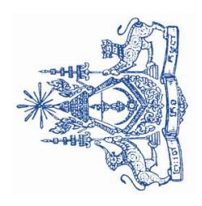

### Cambodia Inter-Censal Population Survey Royal Government of Cambodia

May, 2024

STRCTLY CONFIDENTAIL

### Form B Household Questionnairs

Identification Particulars

| Name of Head of Household |      |      |  |
|---------------------------|------|------|--|
| Household No.             |      |      |  |
| Building No.              |      |      |  |
| 1 = Urban 2 = Rural       |      |      |  |
| EA No.                    |      |      |  |
| Phum                      |      |      |  |
| Khum/Sangkat              |      |      |  |
| Krong /Srok/Khand         |      |      |  |
| Khet/Municipality         |      |      |  |
| ,                         | Name | Code |  |

| Name Enume | merator: | Name Super |
|------------|----------|------------|
| Date       |          | Date       |
| Signatur   | olo alo  | Signature  |

### Identification Particulars

| Р                         |      |      |
|---------------------------|------|------|
| Name of Head of Household |      |      |
| Household No.             |      |      |
| Building No.              |      |      |
| 1= Urban 2= Rural         |      |      |
| EA No.                    |      |      |
| Phum                      |      |      |
| Khum/Sangkat              |      |      |
| Krong /Srok/Khand         |      |      |
| Khet/Municipality         |      |      |
| ,                         | Name | Code |

Number of Form B used the household

HOUSEHOLD QUESTIONNAIRS PART 1 \$ INDIDUAL PARTICULARS

|                 | Reason for migration                                        | (enter                                                                                                                              |        | 16    |   |   |   |   |   |   |   |   |   |   | 9= Dislocated due to other major or small projects 10= Insecurity 11= Repartiation or return after displacement 112= Orphaned 113= Visitor Only 14= Other (Specify)                                                                                                                                                                                                                                                                                               |
|-----------------|-------------------------------------------------------------------|-------------------------------------------------------------------------------------------------------------------------------------|--------|-------|---|---|---|---|---|---|---|---|---|---|-------------------------------------------------------------------------------------------------------------------------------------------------------------------------------------------------------------------------------------------------------------------------------------------------------------------------------------------------------------------------------------------------------------------------------------------------------------------|
|                 | Jay                                                               | er (                                                                                                                                |        | 15    |   |   |   |   |   |   |   |   |   |   | 9- Dislocated due to other major small projects 11- Insecurity 11- Repatriation or return after displacement 12- Orphaned 13- Visitor Only 14- Other (Specify                                                                                                                                                                                                                                                                                                     |
|                 |                                                                   | ± ₽                                                                                                                                 | $\Box$ |       |   |   |   |   |   |   |   |   |   |   | Dislocated du small projects 10= Insecurity 11= Repatriation 21= Ophaned 13= Visitor Only 14= Other (Spec                                                                                                                                                                                                                                                                                                                                       |
|                 | en living                                                         | anter 1 name cage and rong an                                                                                                 | Code   | 14(b) |   |   |   |   |   |   |   |   |   |   | 9= Distocated (small projects 10= Insecurity 11= Repartiation displacement 12= Ophanea 13= Visitor Onle 14= Other (Sp.                                                                                                                                                                                                                                                                                                                                            |
| For all Persons | Previous Residence where has the person been living hefore? | - if always lived and skip to sec - if in another v the Khum/Sang write name of E Province/Khet. - if outside Can |        | 14(a) |   |   |   |   |   |   |   |   |   |   | Codes for column 16 Reason for migration 1= Transfer to workplace 2= In search of employment 3= Education 4= Marriage 5= Family moved 6= Loss land/ lost home 7= Natural calamities 8= Dislocated due to Dam contruction                                                                                                                                                                                                                                          |
| For a           | the                                                               | nd write nd write me of                                                                                                             | Code   | 14(b) |   |   |   |   |   |   |   |   |   |   | s sars                                                                                                                                                                                                                                                                                                                                                                                                                                                            |
|                 | Birth Place - if in this village, enter code 1                    | <u>x                                    </u>                                                                                        |        | 13(a) |   |   |   |   |   |   |   |   |   |   | Codes for column 15  Duration of stay  00= Less than 1 year  01= 1 to less than 2 years  02= 2 to less than 3 years  10= 10 to less than 11ears  20= 20 to less than 21 years  120= 120 to less than 121 years                                                                                                                                                                                                                                                    |
|                 | Religion                                                          | (enter code)                                                                                                                        |        | 12    |   |   |   |   |   |   |   |   |   |   | r colum                                                                                                                                                                                                                                                                                                                                                                                                                                                           |
|                 | Mother                                                            | (enter code)                                                                                                                        |        | 11    |   |   |   |   |   |   |   |   |   |   | Codes for column 12 1= Buddhism 2= Islam 3= Christanity 4= Other                                                                                                                                                                                                                                                                                                                                                                                                  |
| Jer             |                                                                   | ar, 5                                                                                                                               |        |       |   |   |   |   |   |   |   |   |   |   |                                                                                                                                                                                                                                                                                                                                                                                                                                                                   |
| For Other       | than never married                                             | Age at first marriage in complect year (Ask only code 2, 3, 4, 5 in Col. 8)                                                         |        | 10    |   |   |   |   |   |   |   |   |   |   | Imn 11  ng 21= Ro Ong 22= Kraol 23= Raadear 24= Thmcon 25= Khogn 27= Por 27= Por 28= Souy 29= Other                                                                                                                                                                                                                                                                                                                                                               |
| For             | Married                                                           | If married, have you registered a marriage certificate? 1=Yes 2= No                                                                 |        | 6     |   |   |   |   |   |   |   |   |   |   | Codes for column 11  Mother Toung  11= Chaam 21= Ro Ong  The Standest 22= Kraol  The Standest 22= Kraol  The Standest 22= Kraol  The Standest 22= Kraol  The Standest 22= Kraol  The Standest 22= Kraol  The Standest 23= Souy  Ses 19= Tumpoon 29= Other  The Standest 23= Souy  Ses 19= Tumpoon 29= Other  The Standest 23= Souy  Ses 19= Tumpoon 29= Other  The Standest 23= Souy  Ses 19= Tumpoon 29= Other  The Standest 23= Souy  Ses 20= Standest 23= Souy |
| For all         | person                                                            | Marital Status (enter code)                                                                                                |        | 8     |   |   |   |   |   |   |   |   |   |   | COC SS C COC COC C                                                                                                                                                                                                                                                                                                                                                                                                                                                |
| For             | children aged 0-14 year                                     | Whether I living with 9 own mother? (see the noted below)                                                                           |        | 7     |   |   |   |   |   |   |   |   |   |   | 7 B Coo 01= Khmer 02= Vetnams 03= Chiness 04= Lao 05= Thai 06= French 07= English 07= English 08= Korean 08= Japaness 10= Chaarray                                                                                                                                                                                                                                                                                               |
|                 |                                                                   |                                                                                                                                     |        |       |   |   |   |   |   |   |   |   |   |   | columi arried (currently)                                                                                                                                                                                                                                                                                                                                                                                                                                   |
|                 | Age                                                               | (Full) (write the full age))                                                                                                        |        | 9     |   |   |   |   |   |   |   |   |   |   | Codes for column 8 1= never married 2= Married (currently married) 3= Widowed 4= Divorce 5= Separated                                                                                                                                                                                                                                                                                                                                                             |
|                 | ×                                                                 | 1= Male 2= Female                                                                                                                |        | 2     |   |   |   |   |   |   |   |   |   |   | ν ÷                                                                                                                                                                                                                                                                                                                                                                                                                                                               |
|                 |                                                                   |                                                                                                                                     |        |       |   |   |   |   |   |   |   |   |   |   | Codes for column 7  column 7  i = never ma write the serial number of natural morther (i fining this 3= Widowed housschold) for 4= Divorce child age 0-14 year. 5= Separatex if mother not living write "O".                                                                                                                                                                                                                                                      |
| sons            | Relationshi p to head                                          | hour (e                                                                                                                             |        | 4     |   |   |   |   |   |   |   |   |   |   | Codes for column 7 write the se number of mother (if if mother (if if household child age 0 if mother no in this house write "0".                                                                                                                                                                                                                                                                                                                                 |
| For all Persons | nos                                                               | Was (name) present in the household on the night of the survey?                                                                     | 2= no  | 3     |   |   |   |   |   |   |   |   |   |   | Codes for column 6 Age 000= less than 1 year 001= 1 year 002= 2 year                                                                                                                                                                                                                                                                                                                                                                                              |
|                 | Name of the person                                                | (Write the name of the person and quest starting with the head)                                                                     |        | 2     |   |   |   |   |   |   |   |   |   |   | ship to head of old old heat and of column 4 ship to head of old heat and heat and heat and heat and heat and heat and heat and heat and heat and heat and heat and heat and heat and heat and heat and heat and heat and he                                                                                                                                                                                                                                      |
|                 | SI No.                                                         |                                                                                                                                     |        | 1     | - | 2 | 3 | 4 | 5 | 6 | 7 | 8 | 9 | 0 | Codes i relation househ 1= Head 2= Wife/ 3= Son / 4= Fathe 5= Grand 6= Other 7=Non-R                                                                                                                                                                                                                                                                                                                                                   |

| SI No.                                           | acy                                        | •                              | •                                     | Full Time                          | Full Time Education                                                                    | Functional Difficulty for age 5 year and above                     |                                                     | Main activity of                  | Type of o /emplc                      | Type of occupation /employment            | employ                               | Nature of Ec                       | Nature of Economic Activity                    | Section             | Dose (name)                       |
|-----------------------------------------------------|--------------------------------------------|--------------------------------|---------------------------------------|------------------------------------|----------------------------------------------------------------------------------------|--------------------------------------------------------------------|-----------------------------------------------------|--------------------------------------|------------------------------------------|-------------------------------------------|--------------------------------------|------------------------------------|------------------------------------------------|---------------------|-----------------------------------|
| Can (name) read and rewrite with                    | Can H (name) ( read and ar write with S |                                | Currently vattending (grade for code? | What (name) highest grade | Main Subject of study for code 15 20 in col.3(b)&3(C) For other codes skip to in col.4 | to code 1= No - no difficulty 2= Yes- some difficulty              | If have any functional difficulty in Col.4 | the person during last      | For aged 15                              | For aged 15 and above                     | status                               | (Agriculture, Ir                   | (Agriculture, Industry, Trade or Service)   | Employ              | have a NSSF card? 1= Yes |
| understan to ding in o Khmer o language II | understan er ding in cother language       | education institution ? (enter |                                       | completed ?                        |                                                                                        | 3= Yes - a lot difficulty 4= Cannot do at all (see the note below) | (a) (b) (c) (c) (c) (c) (c) (c) (c) (c) (c) (c      | year? For aged 15 and above | write the occ                            | write the occupation word                 | (enter code)                         | Write the nature activity in words | Write the nature of economic activity in words | (enter              | 2= No                             |
| 1=yes 2= no                                      | (enter code)                               | (appon                         |                                       | ı                                  | description                                                                            | 1 2 2 4 5 6 9                                                      | 0                                                | (enter code)                         | name of occupation                    | Code                                      |                                      | Nature of Economic activity     | Code                                           | (approx             |                                   |
| 1 2(a)                                              | 2(b)                                       | 3(a)                           | 3(p)                                  | 3(c)                               | 3(d)                                                                                   | 4                                                                  | 22                                                  | 9                                    |                                          | 7                                         | 8                                    |                                    | 6                                              | 10                  | 11                                |
| 1                                                   |                                            |                                |                                       |                                    |                                                                                        |                                                                    |                                                     |                                      |                                          |                                           |                                      |                                    |                                                |                     |                                   |
| 2                                                   |                                            |                                |                                       |                                    |                                                                                        |                                                                    |                                                     |                                      |                                          |                                           |                                      |                                    |                                                |                     |                                   |
| 3                                                   |                                            |                                |                                       |                                    |                                                                                        |                                                                    |                                                     |                                      |                                          |                                           |                                      |                                    |                                                |                     |                                   |
| 4                                                   |                                            |                                |                                       |                                    |                                                                                        |                                                                    |                                                     |                                      |                                          |                                           |                                      |                                    |                                                |                     |                                   |
| 5                                                   |                                            |                                |                                       |                                    |                                                                                        |                                                                    |                                                     |                                      |                                          |                                           |                                      |                                    |                                                |                     |                                   |
| 9                                                   |                                            |                                |                                       |                                    |                                                                                        |                                                                    |                                                     |                                      |                                          |                                           |                                      |                                    |                                                |                     |                                   |
| 7                                                   |                                            |                                |                                       |                                    |                                                                                        |                                                                    |                                                     |                                      |                                          |                                           |                                      |                                    |                                                |                     |                                   |
| 8                                                   |                                            |                                |                                       |                                    |                                                                                        |                                                                    |                                                     |                                      |                                          |                                           |                                      |                                    |                                                |                     |                                   |
| 6                                                   |                                            |                                |                                       |                                    |                                                                                        |                                                                    |                                                     |                                      |                                          |                                           |                                      |                                    |                                                |                     |                                   |
| 0                                                   |                                            |                                |                                       |                                    |                                                                                        |                                                                    |                                                     |                                      |                                          |                                           |                                      |                                    |                                                |                     |                                   |
| Codes for column                                    |                                            | Codes for column               |                                       | les for coll.                      | Codes for column 3(b) & 3(c)                                                           |                                                                    | Codes for (                                         | column 4                             | Codes for column 4 Functional            | Codes for column 6 Main activity of the   | ımn 6 Maı                            |                                    | Codes for column Codes for column              | Codes for           | column                            |
| 2(b)                                                |                                            |                                | For c                                 | code 1 in Col.                     | For code 1 in Col. 3(a) put dash (-) in col.3(b) $3(c)$                                |                                                                    | Difficulty                                          |                                      |                                          | person during last year                   | ast year                             |                                    | 8 Employment                                   | 10 Section of       | of                                |
| 1= No other language                                | e 1= Never                                 |                                | Forc                                  | code 3 in Col.                     | For code 3 in Col. 3(a) put dash (-) in col. 3(b)                                      |                                                                    | Do you have difficulty                              | ive difficu                          | ılty                                     | 1= Employed (fill in col. 5 to 8)         | ill in col. 5                        |                                    | Status/ Class                                  | employment          | ŧ                                 |
| 2= Vietnamese                                       | 2= now                                     |                                | For c                                 | code 2 in col.                     | For code 2 in col. 3(a) enter code below.                                              |                                                                    |                                                     |                                      |                                          |                                           | i (employe                           |                                    | 1= Employer                                    | 1= Government       | ent                               |
| 3= Chiness                                          | 3= Past                                    |                                | •                                     |                                    |                                                                                        | (0)0 100 200 0000                                                  | 41= seeing                                          | j, even if v                         | 41= seeing, even if wearing glasses?     |                                           |                                      |                                    | 2= Paid employee                               | 2= State owned      | peu                               |
| 4= Lao                                              |                                            |                                | 8 8                                   | Code for Col. 3(b)                 | 3(b)                                                                                   | code for col 3(し) 13= lower secondary/ Diploma                  | 4.2= hearin(                                        | g, even if                           | 4.2= hearing, even if using a hearing    | (Fill in col. 5 to 8)                     | ( 8                                  |                                    | 3= Own-account                                 | enterprise          |                                   |
| 5= Inal 6 Exact                                  |                                            |                                | 00 6                                  | 00= Pre-school/                    | 00= Pre-school/Rindergarten                                                            | /Certificate                                                       | ald :                                               | , de .                               | 500                                      | 3= Onemployed ( Never employed any        | ı (Never el                          |                                    | worker                                         | 3= Cambod           | an private                        |
| V=FTGIIGI                                           |                                            |                                | = 10 S                                | 01= class 1                        |                                                                                        | 14= Upper secondary                                                |                                                     | g or cilling                         | 4.3= walking of climbing step :          | וווע מעומע                                |                                      | 7 -                                | 4= O⊓paiu iaiiiiiy workor                   | 4 Eoroign private   | orivoto                           |
| /= English                                          |                                            |                                | = N O                           | CIGSS Z                            |                                                                                        | /Diploma/Certificate/Baccalaureate                                 |                                                     | of care (                            | 4.4= Telliellibellig of colicelitating ? | /- Homo worker                            |                                      |                                    | Wolkel F-Other                              | 4= roleigii         | חאמות                             |
| 9= Other language                                   |                                            |                                | 10                                    | 12=class 12                        |                                                                                        | Certificate 1                                                      | all over or dressing)?                              | ressina)?                            | Sucil as wasimig                         |                                           | <del>.</del>                         | , .                                | Specify .)                                     | 5= Non-profit       | .=                                |
|                                                     |                                            |                                | 101=                                  | = class10/Te                       | 101= class10/Technical and Vocational Diploma1                                         | 16= Technical and Vocational                                       | 46= using                                           | your usua                            | 46= using your usual (customary)         | 6= Dependent                              |                                      |                                    |                                                | institution         |                                   |
|                                                     |                                            |                                | 112=                                  | class 11/ T                        | 112= class 11/ Technical and Vocational Diploma2                                       |                                                                    | language, do you have difficulty                    | to you hav                           | ve difficulty                            | 7= Rent-receiver, Retired or other income | r, Retired c                         | r other income                     |                                                | 6= Household sector | ld sector                         |
|                                                     |                                            |                                | 123=                                  | =class 12/                         | 123=class 12/ lechnical and Vocational Diploma3                                        | l Certificate 3 18- Technical/Vocational pre-                   | speaking, for example                               | or example                           | speaking, for example understanding      | recipient                                 |                                      |                                    |                                                | /= Embassies,       | es,                               |
|                                                     |                                            |                                | 18= (                                 | Graduated/                         | 1/= lower secondary/ piploma /cerulicate 18= Graduated / Bachelor of Technology     | secondary diploma certificate                                      |                                                     | noons ion                            |                                          | O= Ourier (For code                    | lei (For code 3 to 8 put dash (-) | dash (-)                           |                                                | foreign aid and     | all d                             |
|                                                     |                                            |                                | Spec                                  | Specialization                     |                                                                                        | 19= Graduated degree                                               |                                                     |                                      |                                          | Ë                                         | in col.7ជីល់ 10)                     | (0                                 |                                                | development         | +                                 |
|                                                     |                                            |                                | 19=∿                                  | 19=Master degree                   | ee.                                                                                    | 21= Ph.D. course                                                   |                                                     |                                      |                                          |                                           |                                      |                                    |                                                | agencies            |                                   |
|                                                     |                                            |                                | 50=                                   | 20= Ph.D degree                    | 96                                                                                     | 22-Other (Specify) 88= no grade complected                      |                                                     |                                      |                                          |                                           |                                      |                                    |                                                | 8= Other            |                                   |
|                                                     |                                            |                                | Z1=                                   | Z1= Ally Olliel                    |                                                                                        | L                                                                  |                                                     |                                      |                                          |                                           |                                      |                                    |                                                | ( obecil)           | (                                 |

HOUSEHOLD QUESTIONNAIRS PART 2 \$ SOCIO AND ECONOMY (CONTINUE...)

|    |                           |                            |                    |                               |                                                                   |                           |                 | -                         |                                                         |                     |
|----|---------------------------|----------------------------|--------------------|-------------------------------|-------------------------------------------------------------------|---------------------------|-----------------|---------------------------|---------------------------------------------------------|---------------------|
|    |                           | Over the past year         |                    | Do (name) cui                 | Do (name) currently smoke tobacco (manufactured cigarettes,       | acco (manufactu           | red cigarettes, | Do (name) currently       | Do (name) currently use vapes or chewing tobacco?       | tobacco?            |
|    |                           |                            |                    | hand-rolled ciga              | hand-rolled cigarettes, pipes) on a daily basis, less than daily, | n a daily basis, les      | ss than daily,  | 1= yes (enter code below) | w)                                                      |                     |
|    |                           |                            |                    | or not all? [NO               | or not all? [NOT e-cigarettes or vapes or chewing tobacco]?       | apes or chewing           | tobacco]?       | 2= No (Skip to section 3) | ก3)                                                     |                     |
|    |                           |                            |                    | 1= Yes (enter code below)     | de below)                                                         |                           |                 |                           |                                                         |                     |
|    |                           |                            |                    | 2= No (Skip to next question) | next question )                                                   |                           |                 |                           |                                                         |                     |
| SI | Dose (name) loan any from | Dose (name) deposit        | Dose (name)        |                               |                                                                   |                           |                 |                           |                                                         |                     |
| S. | financial institution?    | any financial institution? | Transition cash by |                               |                                                                   |                           |                 |                           |                                                         |                     |
|    |                           |                            | phone?             | 1= Daily 2= Les               | 1= Daily 2= Less than daily 3= Not at all 4= Don't know           | ot at all 4= Don't        | know 5=         | 1= Daily 2= Less thar     | 1= Daily 2= Less than daily 3= Not at all 4= Don't know | Don't know 5=       |
|    | 1= Yes                    | 1= Yes                     |                    | Refused                       |                                                                   |                           |                 | Refused                   |                                                         |                     |
|    | 2= No                     | 2= No                      | 1= Yes             | On average, ho                | On average, how many of the                                       | How much did you spend on | you spend on    | During the past 30        | During the past 30                                      | How did you buy     |
|    |                           |                            | 2= No              | following do                  | following do you currently                                        | cigarettes                | ettes           | days, how many            | days, how much did                                      | the e-cigarette or  |
|    |                           |                            |                    | smoke ea                      | smoke each day?                                                   | (KHR)                     | IR)             | days did you use          | you spend on e-                                         | vaping product?     |
|    |                           |                            |                    | Manufactured                  | Hand rolled                                                       | Manufactured              | Hand rolled     | e-cigarettes or           | cigarettes or vaping                                    | 1: Internet Order   |
|    |                           |                            |                    | Cigarette                     | Cigarette                                                         | Cigarette                 | Cigarette       | vaping products?          | products KHR?                                           | 2: Person to person |
|    |                           |                            |                    |                               |                                                                   |                           |                 | 1:1-2 days                |                                                         | sale                |
|    |                           |                            |                    |                               |                                                                   |                           |                 | 2: 3-5 days               |                                                         |                     |
|    |                           |                            |                    |                               |                                                                   |                           |                 | 3: 6-9 days               |                                                         |                     |
|    |                           |                            |                    |                               |                                                                   |                           |                 | 4: 10-19 days             |                                                         |                     |
|    |                           |                            |                    |                               |                                                                   |                           |                 | 5: 20-29 days             |                                                         |                     |
|    |                           |                            |                    |                               |                                                                   |                           |                 | 6: 30 days                |                                                         |                     |
| ,  | ç                         | Ç                          | ,                  | Ļ                             | Ç                                                                 | į                         | ç               | ç                         | C                                                       | č                   |
| 1  | 12                        | 13                         | 14                 | 15                            | 16                                                                | 1/                        | 18              | 19                        | 50                                                      | 21                  |
| 1  |                           |                            |                    |                               |                                                                   |                           |                 |                           |                                                         |                     |
| 2  |                           |                            |                    |                               |                                                                   |                           |                 |                           |                                                         |                     |
| 3  |                           |                            |                    |                               |                                                                   |                           |                 |                           |                                                         |                     |
| 4  |                           |                            |                    |                               |                                                                   |                           |                 |                           |                                                         |                     |
| 9  |                           |                            |                    |                               |                                                                   |                           |                 |                           |                                                         |                     |
| 9  |                           |                            |                    |                               |                                                                   |                           |                 |                           |                                                         |                     |
| 7  |                           |                            |                    |                               |                                                                   |                           |                 |                           |                                                         |                     |
| 8  |                           |                            |                    |                               |                                                                   |                           |                 |                           |                                                         |                     |
| 6  |                           |                            |                    |                               |                                                                   |                           |                 |                           |                                                         |                     |
| 0  |                           |                            |                    |                               |                                                                   |                           |                 |                           |                                                         |                     |
|    |                           |                            |                    |                               |                                                                   |                           |                 |                           |                                                         |                     |

HOUSEHOLD QUESTIONNAIR PART 3 % FERTILITY INFORMATION OF FEMALE AGED 15 AND OVER LISTED IN COLUM 1 OF PART 1: INDIDUAL PARTICULARS

|     |               |             |            | FERTI                                                                      | LITY INFORMA            | FERTILITY INFORMATION FOR WOMEN | MEN              |                       | Parti                    | culars of Birth ir | Particulars of Birth in the last 12 month to | nth to           |
|-----|---------------|-------------|------------|----------------------------------------------------------------------------|-------------------------|---------------------------------|------------------|-----------------------|--------------------------|--------------------|----------------------------------------------|------------------|
|     |               |             |            |                                                                            | Number of Children Born | hildren Born                    |                  |                       |                          | Woman age          | Woman aged 15-49 year                        |                  |
|     |               |             | (Give th   | ( Give the number in two digits like 01, 02,, 10, 11. If None, write "00") | o digits like 01        | ., 02,, 10, 11.                 | . If None, write | ("00" €               |                          |                    |                                              |                  |
|     |               |             | How many o | How many children have                                                     | How many of them are    | of them are                     | How many c       | How many of them have | How many children have   | Idren have         | State who                                    | Did the person   |
| 5   |               | SI. No.     | you been   | you been alive to the                                                      | living?                 | ig ?                            | die              | died?                 | you been alive to the    | to the             | assisted her                                 | register the     |
| i S | Name of Women | In Colum 1, | won        | women?                                                                     |                         |                                 |                  |                       | women during the last 12 | the last 12        | during the                                   | birth of this    |
| 2   |               | Part 1      |            |                                                                            |                         |                                 |                  |                       | months?                  |                    | delivery?                                    | baby with the    |
|     |               |             |            |                                                                            |                         |                                 |                  |                       |                          |                    |                                              | Civil Authority? |
|     |               |             |            |                                                                            |                         |                                 |                  |                       | Give actual number       | I number           |                                              | ( enter code )   |
|     |               |             |            |                                                                            |                         |                                 |                  |                       | If none write            | , write            |                                              |                  |
|     |               |             |            |                                                                            |                         |                                 |                  |                       | "0" and Skip other women | other women        | (enter code)                                 |                  |
| 1   | 2             | 3           | ,          | 4                                                                          | 5                       |                                 | 9                |                       | 7                        |                    | 8                                            | 6                |
|     |               |             | (a)        | (q)                                                                        | (a)                     | (q)                             | (a)              | (q)                   | (a)                      | (q)                |                                              |                  |
|     |               |             | Male       | Female                                                                     | Male                    | Female                          | Male             | Female                | Male                     | Female             |                                              |                  |
| 1   |               |             |            |                                                                            |                         |                                 |                  |                       |                          |                    |                                              |                  |
| 2   |               |             |            |                                                                            |                         |                                 |                  |                       |                          |                    |                                              |                  |
| 3   |               |             |            |                                                                            |                         |                                 |                  |                       |                          |                    |                                              |                  |
| 4   |               |             |            |                                                                            |                         |                                 |                  |                       |                          |                    |                                              |                  |
| 2   |               |             |            |                                                                            |                         |                                 |                  |                       |                          |                    |                                              |                  |
| 9   |               |             |            |                                                                            |                         |                                 |                  |                       |                          |                    |                                              |                  |
| 2   |               |             |            |                                                                            |                         |                                 |                  |                       |                          |                    |                                              |                  |
| 8   |               |             |            |                                                                            |                         |                                 |                  |                       |                          |                    |                                              |                  |
| 6   |               |             |            |                                                                            |                         |                                 |                  |                       |                          |                    |                                              |                  |
| 0   |               |             |            |                                                                            |                         |                                 |                  |                       |                          |                    |                                              |                  |

| Codes for column 8 |                      | Codes for column 9 |
|--------------------|----------------------|--------------------|
|                    | 4= Traditional Birth | 1= Yes             |
| 1= DOCIOI          | Attendant (TBA)      | 2= No              |
| Z= Nulse           | 5= Other (Specify)   |                    |
| S= Midwile         | 6=None               |                    |

# HOUSEHOLD QUESTIONNAIR PART 4 \$ HOUSING CONDITION AND POSSESSED BY HOUSEHOLD

|       |                                                                                                               |                                                       | :                           |                                   |                                      |                                                                                                                                                                                                                                                                                                                                                                                                                                              |                                                                                     |                                                                                                                                                                                                                                                                                                                                                                                                                                                                                                                                                                                                                                                                                                                                                                                                                                                                                                                                                                                                                                                                                                                                                                                                                                                                                                                                                                                                                                                                                                                                                                                                                                                                                                                                                                                                                                                                                                                                                                                                                                                                                                                                |                                                                 |                                                                                                                                                            |                                                                |                                                                                                                                                                                                                                                                                                                                                                                                                                                                                                                                                                                                                                                                                                                                                                                                                                                                                                                                                                                                                                                                                                                                                                                                                                                                                                                                                                                                                                                                                                                                                                                                                                                                                                                                                                                                                                                                                                                                                                                                                                                                                                                                |                                                 | Answer  |
|-------|---------------------------------------------------------------------------------------------------------------|-------------------------------------------------------|-----------------------------|-----------------------------------|--------------------------------------|----------------------------------------------------------------------------------------------------------------------------------------------------------------------------------------------------------------------------------------------------------------------------------------------------------------------------------------------------------------------------------------------------------------------------------------------|-------------------------------------------------------------------------------------|--------------------------------------------------------------------------------------------------------------------------------------------------------------------------------------------------------------------------------------------------------------------------------------------------------------------------------------------------------------------------------------------------------------------------------------------------------------------------------------------------------------------------------------------------------------------------------------------------------------------------------------------------------------------------------------------------------------------------------------------------------------------------------------------------------------------------------------------------------------------------------------------------------------------------------------------------------------------------------------------------------------------------------------------------------------------------------------------------------------------------------------------------------------------------------------------------------------------------------------------------------------------------------------------------------------------------------------------------------------------------------------------------------------------------------------------------------------------------------------------------------------------------------------------------------------------------------------------------------------------------------------------------------------------------------------------------------------------------------------------------------------------------------------------------------------------------------------------------------------------------------------------------------------------------------------------------------------------------------------------------------------------------------------------------------------------------------------------------------------------------------|-----------------------------------------------------------------|------------------------------------------------------------------------------------------------------------------------------------------------------------|----------------------------------------------------------------|--------------------------------------------------------------------------------------------------------------------------------------------------------------------------------------------------------------------------------------------------------------------------------------------------------------------------------------------------------------------------------------------------------------------------------------------------------------------------------------------------------------------------------------------------------------------------------------------------------------------------------------------------------------------------------------------------------------------------------------------------------------------------------------------------------------------------------------------------------------------------------------------------------------------------------------------------------------------------------------------------------------------------------------------------------------------------------------------------------------------------------------------------------------------------------------------------------------------------------------------------------------------------------------------------------------------------------------------------------------------------------------------------------------------------------------------------------------------------------------------------------------------------------------------------------------------------------------------------------------------------------------------------------------------------------------------------------------------------------------------------------------------------------------------------------------------------------------------------------------------------------------------------------------------------------------------------------------------------------------------------------------------------------------------------------------------------------------------------------------------------------|-------------------------------------------------|---------|
|       |                                                                                                               | 5                                                     | onesilon.                   |                                   |                                      |                                                                                                                                                                                                                                                                                                                                                                                                                                              |                                                                                     |                                                                                                                                                                                                                                                                                                                                                                                                                                                                                                                                                                                                                                                                                                                                                                                                                                                                                                                                                                                                                                                                                                                                                                                                                                                                                                                                                                                                                                                                                                                                                                                                                                                                                                                                                                                                                                                                                                                                                                                                                                                                                                                                | Answer Code                                                     | ano                                                                                                                                                        |                                                                |                                                                                                                                                                                                                                                                                                                                                                                                                                                                                                                                                                                                                                                                                                                                                                                                                                                                                                                                                                                                                                                                                                                                                                                                                                                                                                                                                                                                                                                                                                                                                                                                                                                                                                                                                                                                                                                                                                                                                                                                                                                                                                                                |                                                 | Code)   |
|       | On what basis dose this household occupy this dwelling?                                                       | ose this househo                                      | old occupy this             | dwelling?                         | 1= Ow                                | 1= Owner occupied                                                                                                                                                                                                                                                                                                                                                                                                                            | 2= Rent 3= Not                                                                      | 3= Not owner but rent free                                                                                                                                                                                                                                                                                                                                                                                                                                                                                                                                                                                                                                                                                                                                                                                                                                                                                                                                                                                                                                                                                                                                                                                                                                                                                                                                                                                                                                                                                                                                                                                                                                                                                                                                                                                                                                                                                                                                                                                                                                                                                                     |                                                                 | 4= Other (Specify )                                                                                                                                        |                                                                |                                                                                                                                                                                                                                                                                                                                                                                                                                                                                                                                                                                                                                                                                                                                                                                                                                                                                                                                                                                                                                                                                                                                                                                                                                                                                                                                                                                                                                                                                                                                                                                                                                                                                                                                                                                                                                                                                                                                                                                                                                                                                                                                |                                                 |         |
|       | Main Source of Light                                                                                          | ight                                                  |                             |                                   | 1= City                              | 1= City Power 2= Ger                                                                                                                                                                                                                                                                                                                                                                                                                         | 2= Generator 3= Both                                                                | 3= Both city and generator                                                                                                                                                                                                                                                                                                                                                                                                                                                                                                                                                                                                                                                                                                                                                                                                                                                                                                                                                                                                                                                                                                                                                                                                                                                                                                                                                                                                                                                                                                                                                                                                                                                                                                                                                                                                                                                                                                                                                                                                                                                                                                     | tor 4= Kerosene                                                 | 5= Candle                                                                                                                                                  | = Battery 7= 0                                                 | 6= Battery 7= Other (Specify)                                                                                                                                                                                                                                                                                                                                                                                                                                                                                                                                                                                                                                                                                                                                                                                                                                                                                                                                                                                                                                                                                                                                                                                                                                                                                                                                                                                                                                                                                                                                                                                                                                                                                                                                                                                                                                                                                                                                                                                                                                                                                                  |                                                 |         |
|       | Main Cooking Fuel                                                                                             | <u>ө</u>                                              |                             |                                   | 1= Fir (Spec                      | 1= Firewood 2= Cha (Specify)                                                                                                                                                                                                                                                                                                                                                                                                                 | 2= Charcoal 3= Kerosene 4= Liquefied Petroleum Gas( LPG)                            | sene 4= Lique                                                                                                                                                                                                                                                                                                                                                                                                                                                                                                                                                                                                                                                                                                                                                                                                                                                                                                                                                                                                                                                                                                                                                                                                                                                                                                                                                                                                                                                                                                                                                                                                                                                                                                                                                                                                                                                                                                                                                                                                                                                                                                                  | fied Petroleum                                                  |                                                                                                                                                            | Electricity 6=                                                 | 5= Electricity 6= None 7= Other                                                                                                                                                                                                                                                                                                                                                                                                                                                                                                                                                                                                                                                                                                                                                                                                                                                                                                                                                                                                                                                                                                                                                                                                                                                                                                                                                                                                                                                                                                                                                                                                                                                                                                                                                                                                                                                                                                                                                                                                                                                                                                | _                                               |         |
|       | Type of toilet facility household usually uses                                                                | ility household ι                                     | usually uses                |                                   | 1= No 5= Fl. Latrin 13=Ott  | 1= None, not using 2=Pour flush (or flush) connected to sewerage 3= Pour flush (or flush) to septic tank, 4= Flush to pit/cesspool 5= Flush to twin pit Latin (Twin Pits), 6=Flush to open drain, 7= Flush to elsewhere, 8=Sky latine (use in area prone to flood) (Sky Latrine), 9=Dry pit latine with slab 10= Dry pit latine without slab, 11= Container based sanitation 12= Hanging tollet/latine (Hanging toilet), 113=Other (Specify) | 2=Pour flush (ortin (ortin (Twin Pits), 6                                           | r flush ) connec =Flush to open o Dry pit latrine with                                                                                                                                                                                                                                                                                                                                                                                                                                                                                                                                                                                                                                                                                                                                                                                                                                                                                                                                                                                                                                                                                                                                                                                                                                                                                                                                                                                                                                                                                                                                                                                                                                                                                                                                                                                                                                                                                                                                                                                                                                                                   | ted to seweragidrain, 7= Flush to                               | 3= Pour flush (or elsewhere, 8=Skritainer based sanita                                                                                                     | flush) to septic tar / latrine ( use in ation 12= Hangir | k, 4= Flush to part of the second second second second second second second second second second second second second second second second second second second second second second second second second second second second second second second second second second second second second second second second second second second second second second second second second second second second second second second second second second second second second second second second second second second second second second second second second second second second second second second second second second second second second second second second second second second second second second second second second second second second second second second second second second second second second second second second second second second second second second second second second second second second second second second second second second second second second second second second second second second second second second second second second second second second second second second second second second second second second second second second second second second second second second second second second second second second second second second second second second second second second second second second second second second second second second second second second second second second second second second second second second second second second second second second second second second second second second second second second second second second second second second second second second second second second second second second second second second second second second second second second second second second second second second second second second second second second second second second second second second second second second second second second second second second second second second second second second second second second second second second second second second second second second second second sec | oit/cesspool flood) (Sky danging toilet), |         |
|       | Share facility with another household                                                                         | vith another ho                                       | nsehold                     |                                   | 1= yes                               | 1= yes 2= No                                                                                                                                                                                                                                                                                                                                                                                                                                 |                                                                                     |                                                                                                                                                                                                                                                                                                                                                                                                                                                                                                                                                                                                                                                                                                                                                                                                                                                                                                                                                                                                                                                                                                                                                                                                                                                                                                                                                                                                                                                                                                                                                                                                                                                                                                                                                                                                                                                                                                                                                                                                                                                                                                                                |                                                                 |                                                                                                                                                            |                                                                |                                                                                                                                                                                                                                                                                                                                                                                                                                                                                                                                                                                                                                                                                                                                                                                                                                                                                                                                                                                                                                                                                                                                                                                                                                                                                                                                                                                                                                                                                                                                                                                                                                                                                                                                                                                                                                                                                                                                                                                                                                                                                                                                |                                                 |         |
|       | Has your (septi                                                                                               | Has your (septic tank/pit latrine) ever been emptied? | ne) ever been               | emptied?                          | (For c                               | (For code 3, 4, 5, 8 and 11 in Question 4)                                                                                                                                                                                                                                                                                                                                                                                                   | nd 11 in Questior                                                                   | 1= Yes                                                                                                                                                                                                                                                                                                                                                                                                                                                                                                                                                                                                                                                                                                                                                                                                                                                                                                                                                                                                                                                                                                                                                                                                                                                                                                                                                                                                                                                                                                                                                                                                                                                                                                                                                                                                                                                                                                                                                                                                                                                                                                                         | 2= Never (Skip to 8)                                            | (8)                                                                                                                                                        |                                                                |                                                                                                                                                                                                                                                                                                                                                                                                                                                                                                                                                                                                                                                                                                                                                                                                                                                                                                                                                                                                                                                                                                                                                                                                                                                                                                                                                                                                                                                                                                                                                                                                                                                                                                                                                                                                                                                                                                                                                                                                                                                                                                                                |                                                 |         |
| 7     | where were the content emptied to?                                                                            | content emptied to                                    | 25                          |                                   | 1= By covere                      | 1= By the service provider to the sewage treatment plant 2= By the service provider but don't know any where covered pit 4= Field Mater or other                                                                                                                                                                                                                                                                                             | ider to the sewaç water or other                                                 | ge treatment plar                                                                                                                                                                                                                                                                                                                                                                                                                                                                                                                                                                                                                                                                                                                                                                                                                                                                                                                                                                                                                                                                                                                                                                                                                                                                                                                                                                                                                                                                                                                                                                                                                                                                                                                                                                                                                                                                                                                                                                                                                                                                                                              | nt 2= By the se                                                 | rvice provider bui                                                                                                                                         | : don't know any                                               |                                                                                                                                                                                                                                                                                                                                                                                                                                                                                                                                                                                                                                                                                                                                                                                                                                                                                                                                                                                                                                                                                                                                                                                                                                                                                                                                                                                                                                                                                                                                                                                                                                                                                                                                                                                                                                                                                                                                                                                                                                                                                                                                | 3= Buried in a                                  |         |
| 8     | Main Source of drinking water supply                                                                          | rinking water sup                                     | ylıy                        |                                   | 1= Pip 4= Tu 8= Un ( river/ | 1= Piped into dwelling 2= Piped into compound, yard or plot 3= Public tap/ Standpipe 4= Tube well or borehole 5= protect well 6= Unprotect well 7= Protect spring 8= Unprotect spring 1 9= Rain water collection 10= Tanker truck 11= Card with small tank 12 (river/dam/lake/pond/stream/canal/irrigation chnanel) 13= Bottle water 14= Other (Specify)                                                                                     | 2= Piped into cole 5= protect wole 5= protect of 9= Rain water costream/canal/irrig | ompound, yard of the search of the search of the search of the search of the search of the search of the search of the search of the search of the search of the search of the search of the search of the search of the search of the search of the search of the search of the search of the search of the search of the search of the search of the search of the search of the search of the search of the search of the search of the search of the search of the search of the search of the search of the search of the search of the search of the search of the search of the search of the search of the search of the search of the search of the search of the search of the search of the search of the search of the search of the search of the search of the search of the search of the search of the search of the search of the search of the search of the search of the search of the search of the search of the search of the search of the search of the search of the search of the search of the search of the search of the search of the search of the search of the search of the search of the search of the search of the search of the search of the search of the search of the search of the search of the search of the search of the search of the search of the search of the search of the search of the search of the search of the search of the search of the search of the search of the search of the search of the search of the search of the search of the search of the search of the search of the search of the search of the search of the search of the search of the search of the search of the search of the search of the search of the search of the search of the search of the search of the search of the search of the search of the search of the search of the search of the search of the search of the search of the search of the search of the search of the search of the search of the search of the search of the search of the search of the search of the search of the search of the search of the search of the search of the search of the search of | or plot 3= Pub sct well 7= Prote anker truck 11 13= Bottle wate | yard or plot 3= Public tap/ Standpipe nprotect well 7= Protect spring 10= Tanker truck 11= Card with small tank anel) 13= Bottle water 14= Other (Specify) | l tank 12= Surf ecify)                                      | 12= Surface water                                                                                                                                                                                                                                                                                                                                                                                                                                                                                                                                                                                                                                                                                                                                                                                                                                                                                                                                                                                                                                                                                                                                                                                                                                                                                                                                                                                                                                                                                                                                                                                                                                                                                                                                                                                                                                                                                                                                                                                                                                                                                                           |                                                 |         |
| 6     | How long does it take to go there get water and come back?                                                    | take to go there g                                    | get water and co            | me back?                          | 1= wa                                | 1= water on premise                                                                                                                                                                                                                                                                                                                                                                                                                          | 2= Less than 30 minutes                                                             | l .                                                                                                                                                                                                                                                                                                                                                                                                                                                                                                                                                                                                                                                                                                                                                                                                                                                                                                                                                                                                                                                                                                                                                                                                                                                                                                                                                                                                                                                                                                                                                                                                                                                                                                                                                                                                                                                                                                                                                                                                                                                                                                                            | 3= More than 30 minutes                                         | lutes 4= Don't know                                                                                                                                        | won:                                                           |                                                                                                                                                                                                                                                                                                                                                                                                                                                                                                                                                                                                                                                                                                                                                                                                                                                                                                                                                                                                                                                                                                                                                                                                                                                                                                                                                                                                                                                                                                                                                                                                                                                                                                                                                                                                                                                                                                                                                                                                                                                                                                                                |                                                 |         |
| 10    | Has usually your household had sufficient quantities of drinking water when needed?                           | household had s                                       | sufficient quantiti         | ies of drinking w                 | ater                                 |                                                                                                                                                                                                                                                                                                                                                                                                                                              |                                                                                     |                                                                                                                                                                                                                                                                                                                                                                                                                                                                                                                                                                                                                                                                                                                                                                                                                                                                                                                                                                                                                                                                                                                                                                                                                                                                                                                                                                                                                                                                                                                                                                                                                                                                                                                                                                                                                                                                                                                                                                                                                                                                                                                                | 1= Yes 2                                                        | 2= No                                                                                                                                                      |                                                                |                                                                                                                                                                                                                                                                                                                                                                                                                                                                                                                                                                                                                                                                                                                                                                                                                                                                                                                                                                                                                                                                                                                                                                                                                                                                                                                                                                                                                                                                                                                                                                                                                                                                                                                                                                                                                                                                                                                                                                                                                                                                                                                                |                                                 |         |
| 11    | No. of room occupied by household (exclude kitchen, bathroom, toli and store room)                            | pied by househol                                      | ld (exclude kitch           | nen, bathroom, t                  | toilet                               |                                                                                                                                                                                                                                                                                                                                                                                                                                              |                                                                                     |                                                                                                                                                                                                                                                                                                                                                                                                                                                                                                                                                                                                                                                                                                                                                                                                                                                                                                                                                                                                                                                                                                                                                                                                                                                                                                                                                                                                                                                                                                                                                                                                                                                                                                                                                                                                                                                                                                                                                                                                                                                                                                                                |                                                                 |                                                                                                                                                            |                                                                |                                                                                                                                                                                                                                                                                                                                                                                                                                                                                                                                                                                                                                                                                                                                                                                                                                                                                                                                                                                                                                                                                                                                                                                                                                                                                                                                                                                                                                                                                                                                                                                                                                                                                                                                                                                                                                                                                                                                                                                                                                                                                                                                | Number                                          |         |
| 12    | Does any family member own agricultural land?                                                                 | member own agri                                       | icultural land?             |                                   |                                      |                                                                                                                                                                                                                                                                                                                                                                                                                                              |                                                                                     |                                                                                                                                                                                                                                                                                                                                                                                                                                                                                                                                                                                                                                                                                                                                                                                                                                                                                                                                                                                                                                                                                                                                                                                                                                                                                                                                                                                                                                                                                                                                                                                                                                                                                                                                                                                                                                                                                                                                                                                                                                                                                                                                | 1= Yes 2                                                        | 2=No                                                                                                                                                       |                                                                |                                                                                                                                                                                                                                                                                                                                                                                                                                                                                                                                                                                                                                                                                                                                                                                                                                                                                                                                                                                                                                                                                                                                                                                                                                                                                                                                                                                                                                                                                                                                                                                                                                                                                                                                                                                                                                                                                                                                                                                                                                                                                                                                |                                                 |         |
| 13    | Does the family have any Poverty ID card?                                                                     | iave any Poverty i                                    | ID card?                    |                                   |                                      |                                                                                                                                                                                                                                                                                                                                                                                                                                              |                                                                                     |                                                                                                                                                                                                                                                                                                                                                                                                                                                                                                                                                                                                                                                                                                                                                                                                                                                                                                                                                                                                                                                                                                                                                                                                                                                                                                                                                                                                                                                                                                                                                                                                                                                                                                                                                                                                                                                                                                                                                                                                                                                                                                                                | 1= Poor1 2:                                                     | 2= Poor2 3=No                                                                                                                                              |                                                                |                                                                                                                                                                                                                                                                                                                                                                                                                                                                                                                                                                                                                                                                                                                                                                                                                                                                                                                                                                                                                                                                                                                                                                                                                                                                                                                                                                                                                                                                                                                                                                                                                                                                                                                                                                                                                                                                                                                                                                                                                                                                                                                                |                                                 |         |
| 14    | Does the family have Vulnerable ID card?                                                                      | ave Vulnerable II                                     | Card?                       |                                   |                                      |                                                                                                                                                                                                                                                                                                                                                                                                                                              |                                                                                     |                                                                                                                                                                                                                                                                                                                                                                                                                                                                                                                                                                                                                                                                                                                                                                                                                                                                                                                                                                                                                                                                                                                                                                                                                                                                                                                                                                                                                                                                                                                                                                                                                                                                                                                                                                                                                                                                                                                                                                                                                                                                                                                                | 1= Yes 2                                                        | 2=No                                                                                                                                                       |                                                                |                                                                                                                                                                                                                                                                                                                                                                                                                                                                                                                                                                                                                                                                                                                                                                                                                                                                                                                                                                                                                                                                                                                                                                                                                                                                                                                                                                                                                                                                                                                                                                                                                                                                                                                                                                                                                                                                                                                                                                                                                                                                                                                                |                                                 |         |
| 15    | Does any family member use the internet? (Including at home, on mobile phones, in public places, and at work) | member use the i public places, ar                 | internet? (Inclund at work) | iding at home, c                  | no                                   |                                                                                                                                                                                                                                                                                                                                                                                                                                              |                                                                                     |                                                                                                                                                                                                                                                                                                                                                                                                                                                                                                                                                                                                                                                                                                                                                                                                                                                                                                                                                                                                                                                                                                                                                                                                                                                                                                                                                                                                                                                                                                                                                                                                                                                                                                                                                                                                                                                                                                                                                                                                                                                                                                                                | 1= Yes 2                                                        | 2=No                                                                                                                                                       |                                                                |                                                                                                                                                                                                                                                                                                                                                                                                                                                                                                                                                                                                                                                                                                                                                                                                                                                                                                                                                                                                                                                                                                                                                                                                                                                                                                                                                                                                                                                                                                                                                                                                                                                                                                                                                                                                                                                                                                                                                                                                                                                                                                                                |                                                 |         |
| Radio | Television                                                                                                    | Telephone                                             | Cell phone                  | Laptop and Desktop computer | Bicycle                              | Motorcycle                                                                                                                                                                                                                                                                                                                                                                                                                                   | Refrigerator                                                                        | Washing machine                                                                                                                                                                                                                                                                                                                                                                                                                                                                                                                                                                                                                                                                                                                                                                                                                                                                                                                                                                                                                                                                                                                                                                                                                                                                                                                                                                                                                                                                                                                                                                                                                                                                                                                                                                                                                                                                                                                                                                                                                                                                                                             | Fan                                                             | Air-conditioner                                                                                                                                            | Car/van                                                        | Truck                                                                                                                                                                                                                                                                                                                                                                                                                                                                                                                                                                                                                                                                                                                                                                                                                                                                                                                                                                                                                                                                                                                                                                                                                                                                                                                                                                                                                                                                                                                                                                                                                                                                                                                                                                                                                                                                                                                                                                                                                                                                                                                          | Boat                                            | Tractor |
| 16    | 17                                                                                                            | 18                                                    | 19                          | 20                                | 21                                   | 22                                                                                                                                                                                                                                                                                                                                                                                                                                           | 23                                                                                  | 24                                                                                                                                                                                                                                                                                                                                                                                                                                                                                                                                                                                                                                                                                                                                                                                                                                                                                                                                                                                                                                                                                                                                                                                                                                                                                                                                                                                                                                                                                                                                                                                                                                                                                                                                                                                                                                                                                                                                                                                                                                                                                                                             | 25                                                              | 56                                                                                                                                                         | 27                                                             | 28                                                                                                                                                                                                                                                                                                                                                                                                                                                                                                                                                                                                                                                                                                                                                                                                                                                                                                                                                                                                                                                                                                                                                                                                                                                                                                                                                                                                                                                                                                                                                                                                                                                                                                                                                                                                                                                                                                                                                                                                                                                                                                                             | 29                                              | 30      |
|       |                                                                                                               |                                                       |                             |                                   |                                      |                                                                                                                                                                                                                                                                                                                                                                                                                                              |                                                                                     |                                                                                                                                                                                                                                                                                                                                                                                                                                                                                                                                                                                                                                                                                                                                                                                                                                                                                                                                                                                                                                                                                                                                                                                                                                                                                                                                                                                                                                                                                                                                                                                                                                                                                                                                                                                                                                                                                                                                                                                                                                                                                                                                |                                                                 |                                                                                                                                                            |                                                                |                                                                                                                                                                                                                                                                                                                                                                                                                                                                                                                                                                                                                                                                                                                                                                                                                                                                                                                                                                                                                                                                                                                                                                                                                                                                                                                                                                                                                                                                                                                                                                                                                                                                                                                                                                                                                                                                                                                                                                                                                                                                                                                                |                                                 |         |
|       |                                                                                                               |                                                       |                             |                                   |                                      |                                                                                                                                                                                                                                                                                                                                                                                                                                              | 148                                                                                 |                                                                                                                                                                                                                                                                                                                                                                                                                                                                                                                                                                                                                                                                                                                                                                                                                                                                                                                                                                                                                                                                                                                                                                                                                                                                                                                                                                                                                                                                                                                                                                                                                                                                                                                                                                                                                                                                                                                                                                                                                                                                                                                                |                                                                 |                                                                                                                                                            |                                                                |                                                                                                                                                                                                                                                                                                                                                                                                                                                                                                                                                                                                                                                                                                                                                                                                                                                                                                                                                                                                                                                                                                                                                                                                                                                                                                                                                                                                                                                                                                                                                                                                                                                                                                                                                                                                                                                                                                                                                                                                                                                                                                                                |                                                 |         |

# HOUSEHOLD QUESTIONNAIR PART: 4 HOUSING AND ENVIROMENT

Objective: To assess knowledge, attitudes and practices and risk factors for major noncommunicable diseases and injuries. The questions should be asked to households with pregnant women, children and adolescents aged between 0-18 years. Questionnaire spent maximum 15 minute per household.

| Please circle the appropriate answer code.                                                                                                                                                                                                                                                                                                                                                                                                                                                                                                                                                                                                                                                                                                                                                                                                                                                                                                                                                                                                                                                                                                                                                                                                                                                                                                                                                                                                                                                                                                                                                                                                                                                                                                                                                                                                                                                                                                                                                                                                                                                                                     | ۱ |                                                                                                                                                                            |                                                                                                                                                                                                                                                                             |
|--------------------------------------------------------------------------------------------------------------------------------------------------------------------------------------------------------------------------------------------------------------------------------------------------------------------------------------------------------------------------------------------------------------------------------------------------------------------------------------------------------------------------------------------------------------------------------------------------------------------------------------------------------------------------------------------------------------------------------------------------------------------------------------------------------------------------------------------------------------------------------------------------------------------------------------------------------------------------------------------------------------------------------------------------------------------------------------------------------------------------------------------------------------------------------------------------------------------------------------------------------------------------------------------------------------------------------------------------------------------------------------------------------------------------------------------------------------------------------------------------------------------------------------------------------------------------------------------------------------------------------------------------------------------------------------------------------------------------------------------------------------------------------------------------------------------------------------------------------------------------------------------------------------------------------------------------------------------------------------------------------------------------------------------------------------------------------------------------------------------------------|---|----------------------------------------------------------------------------------------------------------------------------------------------------------------------------|-----------------------------------------------------------------------------------------------------------------------------------------------------------------------------------------------------------------------------------------------------------------------------|
| (Select 1. Batte salva, salva, salva, salva, salva, salva, salva, salva, salva, salva, salva, salva, salva, salva, salva, salva, salva, salva, salva, salva, salva, salva, salva, salva, salva, salva, salva, salva, salva, salva, salva, salva, salva, salva, salva, salva, salva, salva, salva, salva, salva, salva, salva, salva, salva, salva, salva, salva, salva, salva, salva, salva, salva, salva, salva, salva, salva, salva, salva, salva, salva, salva, salva, salva, salva, salva, salva, salva, salva, salva, salva, salva, salva, salva, salva, salva, salva, salva, salva, salva, salva, salva, salva, salva, salva, salva, salva, salva, salva, salva, salva, salva, salva, salva, salva, salva, salva, salva, salva, salva, salva, salva, salva, salva, salva, salva, salva, salva, salva, salva, salva, salva, salva, salva, salva, salva, salva, salva, salva, salva, salva, salva, salva, salva, salva, salva, salva, salva, salva, salva, salva, salva, salva, salva, salva, salva, salva, salva, salva, salva, salva, salva, salva, salva, salva, salva, salva, salva, salva, salva, salva, salva, salva, salva, salva, salva, salva, salva, salva, salva, salva, salva, salva, salva, salva, salva, salva, salva, salva, salva, salva, salva, salva, salva, salva, salva, salva, salva, salva, salva, salva, salva, salva, salva, salva, salva, salva, salva, salva, salva, salva, salva, salva, salva, salva, salva, salva, salva, salva, salva, salva, salva, salva, salva, salva, salva, salva, salva, salva, salva, salva, salva, salva, salva, salva, salva, salva, salva, salva, salva, salva, salva, salva, salva, salva, salva, salva, salva, salva, salva, salva, salva, salva, salva, salva, salva, salva, salva, salva, salva, salva, salva, salva, salva, salva, salva, salva, salva, salva, salva, salva, salva, salva, salva, salva, salva, salva, salva, salva, salva, salva, salva, salva, salva, salva, salva, salva, salva, salva, salva, salva, salva, salva, salva, salva, salva, salva, salva, salva, salva, salva, salva, salva, salva, salva, salva, salva, salva, salva, salva, |   | Question                                                                                                                                                                   | Please circle the appropriate answer code,                                                                                                                                                                                                                                  |
| 1- Industry 6. Dumping 6. Dumping 6. Dumping 6. Dumping 1. In the 4. Other 1. Air pollu 6. Pesticide ant 1. Yes and of Note answ cip to 1. Mimi 6. None 6. None cip to 1. Waste b cooking) 5 cooking) 5 cath? 1. Yes 2 cooking) 5 cooking) 5 cath? 1. Yes 2 cath? 1. Yes 2                                                                                                                                                                                                                                                                                                                                                                                                                                                                                                                                                                                                                                                                                                                                                                                                                                                                                                                                                                                                                                                                                                                                                                                                                                                                                                                                                                                                                                                                                                                                                                                                                                                                                                                                                                                                                                                     |   |                                                                                                                                                                            |                                                                                                                                                                                                                                                                             |
| (Select 1. Batte salva, and the salva, and the salva, and the salva, and the salva, and the salva, and the salva, and the salva, and the salva, and the salva, and the salva, and the salva, and the salva, and the salva, and the salva, and the salva, and the salva, and the salva, and the salva, and the salva, and the salva, and the salva, and the salva, and the salva, and the salva, and the salva, and the salva, and the salva, and the salva, and the salva, and the salva, and the salva, and the salva, and the salva, and the salva, and the salva, and the salva, and the salva, and the salva, and the salva, and the salva, and the salva, and the salva, and the salva, and the salva, and the salva, and the salva, and the salva, and the salva, and the salva, and the salva, and the salva, and the salva, and the salva, and the salva, and the salva, and the salva, and the salva, and the salva, and the salva, and the salva, and the salva, and the salva, and the salva, and the salva, and the salva, and the salva, and the salva, and the salva, and the salva, and the salva, and the salva, and the salva, and the salva, and the salva, and the salva, and the salva, and the salva, and the salva, and the salva, and the salva, and the salva, and the salva, and the salva, and the salva, and the salva, and the salva, and the salva, and the salva, and the salva, and the salva, and the salva, and the salva, and the salva, and the salva, and the salva, and the salva, and the salva, and the salva, and the salva, and the salva, and the salva, and the salva, and the salva, and the salva, and the salva, and the salva, and the salva, and the salva, and the salva, and the salva, and the salva, and the salva, and the salva, and the salva, and the salva, and the salva, and the salva, and the salva, and the salva, and the salva, and the salva, and the salva, and the salva, and the salva, and the salva, and the salva, and the salva, and the salva, and the salva, and the salva, and the salva, and the salva, and the salva, and the salva, and the salv |   | Is your household located near any of the following? (Select all that apply)                                                                                               | 1-Industry/ factory 2- High traffic areas3- Agriculture/farmlands 4- Water body (river, lake, pond, stream, canal, etc. 5- Mining sites 6.Dumping sites (including household waste, medical waste, and e-waste) 7.Other (Specify) 8.None of the above                       |
| ath?  1. In the 4. Other 4. Other 4. Other 6. Pesticide 6. Pesticide 6. Pesticide and of 1. Yes 1. Yes 1. How 6. Note answered of 1. Wiming 6. Note answered of 1. Wiming 6. Note answered of 1. Wiming 6. Note 1. Waste becooking) 5. Yes 1. Yes 2. Yes 1. Yes 2. Acath?  1. Yes 2. Acath?  1. Yes 2. Acath?  1. Yes 2. Acath?  1. Yes 2. Acath?  1. Yes 2. Acath?  1. Yes 2. Acath?  1. Yes 2. Acath?  1. Yes 2. Acath?  1. Yes 2. Acath?  1. Yes 2. Acath?                                                                                                                                                                                                                                                                                                                                                                                                                                                                                                                                                                                                                                                                                                                                                                                                                                                                                                                                                                                                                                                                                                                                                                                                                                                                                                                                                                                                                                                                                                                                                                                                                                                                  |   | Within the last year, has anyone in your household worked in any of these industries? (Select all that apply)                                                              |                                                                                                                                                                                                                                                                             |
| at I. Air pollu 6. Pesticide 6. Pesticide Impact on Impact on Impact on I. Yes How 6. Note answer beath? I. Yes 6. None cip to I. Mimi 6. None cip to I. Waste b cooking) 5 cooking) 5 cooking) 5 cath? I. Yes 2 cath? I. Yes 2 cath? I. Yes 2                                                                                                                                                                                                                                                                                                                                                                                                                                                                                                                                                                                                                                                                                                                                                                                                                                                                                                                                                                                                                                                                                                                                                                                                                                                                                                                                                                                                                                                                                                                                                                                                                                                                                                                                                                                                                                                                                 |   | Is the cooking usually done in the house, in a separate building, or outdoors?                                                                                             |                                                                                                                                                                                                                                                                             |
| eather 1. Yes  ead of Note answ  How  Health? 1. Yes  O. Ooking) 5  cooking) 5  cooking) 5  cooking) 5  cooking) 5  cath? 1. Yes  1. Waste b  cooking) 5  cooking) 5  cath? 1. Yes 2                                                                                                                                                                                                                                                                                                                                                                                                                                                                                                                                                                                                                                                                                                                                                                                                                                                                                                                                                                                                                                                                                                                                                                                                                                                                                                                                                                                                                                                                                                                                                                                                                                                                                                                                                                                                                                                                                                                                           |   | Which types of pollution do you think affect children's health? (Select all that apply)                                                                                    | 1. Air pollution 2. Water pollution 3. Soil pollution 4. Contaminated food 5. Heavy/toxic metals (lead, mercury, arsenic, cadmium, etc.) 6. Pesticides 7. None of the above                                                                                                 |
| eather 1.  How Health? 1.  cip to 1.  which is the cooking cooking 2.  ughing, 2.  ughing, 2.                                                                                                                                                                                                                                                                                                                                                                                                                                                                                                                                                                                                                                                                                                                                                                                                                                                                                                                                                                                                                                                                                                                                                                                                                                                                                                                                                                                                                                                                                                                                                                                                                                                                                                                                                                                                                                                                                                                                                                                                                                  |   | types of climate change related impacts are you concerned about? (Sel                                                                                                      | 1. Extreme temperature 2. Rising sea levels 3. Storms/floods 4. Water diseases 5.Drought 6.Wildfires 7.Impact on agriculture 8. Impact on wildlife and ecosystems (diversity decrease, etc.) 9. Other (Specify) 10. None of the above                                       |
| ead of Note the alth? 1                                                                                                                                                                                                                                                                                                                                                                                                                                                                                                                                                                                                                                                                                                                                                                                                                                                                                                                                                                                                                                                                                                                                                                                                                                                                                                                                                                                                                                                                                                                                                                                                                                                                                                                                                                                                                                                                                                                                                                                                                                                                                                        |   | Do you know what to do to protect yourself and your children against heat and high weather temperatures?                                                                   | Yes 2. No                                                                                                                                                                                                                                                                   |
| How the alth? 1                                                                                                                                                                                                                                                                                                                                                                                                                                                                                                                                                                                                                                                                                                                                                                                                                                                                                                                                                                                                                                                                                                                                                                                                                                                                                                                                                                                                                                                                                                                                                                                                                                                                                                                                                                                                                                                                                                                                                                                                                                                                                                                |   | Ask this question to an adolescent between 10-19 years old, if not available ask the Head of Household/main respondent                                                     | Note answer (between 1 to 10)                                                                                                                                                                                                                                               |
| i health? 1. 1. 6. 6. 7. 1. William 1. William 2. 1. Yes eath? 1. Yes eath? 1. Yes                                                                                                                                                                                                                                                                                                                                                                                                                                                                                                                                                                                                                                                                                                                                                                                                                                                                                                                                                                                                                                                                                                                                                                                                                                                                                                                                                                                                                                                                                                                                                                                                                                                                                                                                                                                                                                                                                                                                                                                                                                             |   | On a scale of 1 to 10, (1 being not concerned at all and 10 being extremely concerned: How concerned or anxious are you about the impact of climate change on your future? |                                                                                                                                                                                                                                                                             |
| 1. 6. 7. 4. 4. 4. 4. 4. 4. 4. 4. 4. 4. 4. 4. 4.                                                                                                                                                                                                                                                                                                                                                                                                                                                                                                                                                                                                                                                                                                                                                                                                                                                                                                                                                                                                                                                                                                                                                                                                                                                                                                                                                                                                                                                                                                                                                                                                                                                                                                                                                                                                                                                                                                                                                                                                                                                                                |   | Do you think heavy metals (e.g lead, mercury, cadmium, arsenic) can affect children's health?                                                                              | Yes 2. No                                                                                                                                                                                                                                                                   |
| ip to 1. William 1. William 2. Cookii 1. Yee ath? 1. Yee                                                                                                                                                                                                                                                                                                                                                                                                                                                                                                                                                                                                                                                                                                                                                                                                                                                                                                                                                                                                                                                                                                                                                                                                                                                                                                                                                                                                                                                                                                                                                                                                                                                                                                                                                                                                                                                                                                                                                                                                                                                                       |   | Do any of your children play near the following areas?                                                                                                                     |                                                                                                                                                                                                                                                                             |
| ly) ughing,                                                                                                                                                                                                                                                                                                                                                                                                                                                                                                                                                                                                                                                                                                                                                                                                                                                                                                                                                                                                                                                                                                                                                                                                                                                                                                                                                                                                                                                                                                                                                                                                                                                                                                                                                                                                                                                                                                                                                                                                                                                                                                                    |   |                                                                                                                                                                            |                                                                                                                                                                                                                                                                             |
| ly) ughing, aath?                                                                                                                                                                                                                                                                                                                                                                                                                                                                                                                                                                                                                                                                                                                                                                                                                                                                                                                                                                                                                                                                                                                                                                                                                                                                                                                                                                                                                                                                                                                                                                                                                                                                                                                                                                                                                                                                                                                                                                                                                                                                                                              |   | How frequently do your children play near this site?                                                                                                                       |                                                                                                                                                                                                                                                                             |
| 1. Yes 2. No 3. L. Yes 2. No 3. L. Yes 2. No 3. L. Yes 2. No 3. Sath? 1. Yes 2. No 3. Sath? 1. Yes 2. No 3. Sath? 1. Yes 2. No 3. Sath? 1. Yes 2. No 3. Sath? 1. Yes 2. No 3. Sath? 1. Yes 2. No 3. Sath? 1. Yes 2. No 3. Sath? 1. Yes 2. No 3. Sath? 1. Yes 2. No 3. Sath? 1. Yes 2. No 3. Sath? 1. Yes 2. No 3. Sath? 1. Yes 2. No 3. Sath? 1. Yes 2. No 3. Sath? 1. Yes 2. No 3. Sath? 1. Yes 3. No 3. Sath? 1. Yes 3. No 3. Sath? 1. Yes 3. No 3. Sath? 1. Yes 3. No 3. Sath? 1. Yes 3. No 3. Sath? 1. Yes 3. No 3. Sath? 1. Yes 3. No 3. Sath? 1. Yes 3. No 3. Sath? 1. Yes 3. No 3. Sath? 1. Yes 3. No 3. Sath? 1. Yes 3. No 3. Sath? 1. Yes 3. No 3. Sath? 1. Yes 3. No 3. Sath? 1. Yes 3. No 3. Sath? 1. Yes 3. No 3. Sath? 1. Yes 3. No 3. Sath? 1. Yes 3. No 3. Sath? 1. Yes 3. No 3. Sath? 1. Yes 3. No 3. Sath? 1. Yes 3. No 3. Sath? 1. Yes 3. No 3. Sath? 1. Yes 3. No 3. Sath? 1. Yes 3. No 3. Sath? 1. Yes 3. Sath? 1. Yes 3. No 3. Sath? 1. Yes 3. No 3. Sath? 1. Yes 3. No 3. Sath? 1. Yes 3. No 3. Sath? 1. Yes 3. No 3. Sath? 1. Yes 3. No 3. Sath? 1. Yes 3. No 3. Sath? 1. Yes 3. No 3. Sath? 1. Yes 3. Sath? 1. Yes 3. No 3. Sath? 1. Yes 3. No 3. Sath? 1. Yes 3. No 3. Sath? 1. Yes 3. No 3. Sath? 1. Yes 3. No 3. Sath? 1. Yes 3. Sath? 1. Yes 3. Sath? 1. Yes 3. Sath? 1. Yes 3. Sath? 1. Yes 3. Sath? 1. Yes 3. Sath? 1. Yes 3. Sath? 1. Yes 3. Sath? 1. Yes 3. Sath? 1. Yes 3. Sath? 1. Yes 3. Sath? 1. Yes 3. Sath? 1. Yes 3. Sath? 1. Yes 3. Sath? 1. Yes 3. Sath? 1. Yes 3. Sath? 1. Yes 3. Sath? 1. Yes 3. Sath? 1. Yes 3. Sath? 1. Yes 3. Sath? 1. Yes 3. Sath? 1. Yes 3. Sath? 1. Yes 3. Sath? 1. Yes 3. Sath? 1. Yes 3. Sath? 1. Yes 3. Sath? 1. Yes 3. Sath? 1. Yes 3. Sath? 1. Yes 3. Sath? 1. Yes 3. Sath? 1. Yes 3. Sath? 1. Yes 3. Sath? 1. Yes 3. Sath? 1. Yes 3. Sath? 1. Yes 3. Sath? 1. Yes 3. Sath? 1. Yes 3. Sath? 1. Yes 3. Sath? 1. Yes 3. Sath? 1. Yes 3. Sath? 1. Yes 3. Sath? 1. Yes 3. Sath? 1. Yes 3. Sath? 1. Yes 3. Sath? 1. Yes 3. Sath? 1. Yes 3. Sath? 1. Yes 3. Sath? 1. Yes 3. Sath? 1. Yes 3. Sath? 1. Yes 3. Sath? 1. Yes 3. Sath? 1. Yes 3. Sath? 1. Yes 3. Sa |   |                                                                                                                                                                            | 1. Waste burning 2. Secondhand smoke 3. Industrial air pollution 4.Indoor air pollution (Traditional cooking practice, use biomass for cooking) 5.High traffic density 6. Wildfires 7. Open incineration 8. Other (Specify) 9. Do not know / Not sure 10. None of the above |
| 1.Yes 2. No auth? 1.Yes 2. No                                                                                                                                                                                                                                                                                                                                                                                                                                                                                                                                                                                                                                                                                                                                                                                                                                                                                                                                                                                                                                                                                                                                                                                                                                                                                                                                                                                                                                                                                                                                                                                                                                                                                                                                                                                                                                                                                                                                                                                                                                                                                                  |   |                                                                                                                                                                            | Yes 2. No                                                                                                                                                                                                                                                                   |
| ury or death? 1.Yes 2. No                                                                                                                                                                                                                                                                                                                                                                                                                                                                                                                                                                                                                                                                                                                                                                                                                                                                                                                                                                                                                                                                                                                                                                                                                                                                                                                                                                                                                                                                                                                                                                                                                                                                                                                                                                                                                                                                                                                                                                                                                                                                                                      |   | Has any child in your household ever been involved in a road-related injury or death?                                                                                      | 2. No                                                                                                                                                                                                                                                                       |
|                                                                                                                                                                                                                                                                                                                                                                                                                                                                                                                                                                                                                                                                                                                                                                                                                                                                                                                                                                                                                                                                                                                                                                                                                                                                                                                                                                                                                                                                                                                                                                                                                                                                                                                                                                                                                                                                                                                                                                                                                                                                                                                                |   |                                                                                                                                                                            | 2. No                                                                                                                                                                                                                                                                       |

## HOUSEHOLD QUESTIONNAIR PART 5: DEATH IN HOUSEHOLD

| .sı            |
|----------------|
| 2 mont         |
| 7              |
| ast            |
| the            |
|                |
| 0              |
| 9              |
| Household Intl |
|                |
| <u></u>        |
| l su           |
| eat            |

Total Number dead:

|                   | 7000                           | nean                | if Yes in Col. 8(a)                                                                              |                            | State who attended on her before death? | (enter code)    | 8(c) |   |   |   |   |   |   |   |   |   |   |
|-------------------|--------------------------------|---------------------|--------------------------------------------------------------------------------------------------|----------------------------|--------------------------------------------|-----------------|------|---|---|---|---|---|---|---|---|---|---|
|                   | East window and 15 40 who dood | voman ageura-49 wno |                                                                                                  |                            | State when the Death took place?           | (enter code)    | 8(b) |   |   |   |   |   |   |   |   |   |   |
|                   | 3 #V <u>1</u>                  | roi v               | Did the woman die while Pregnant, during delivery or within 42 days after giving birth? | 1= Yes $2= No$             |                                            |                 | 8(a) |   |   |   |   |   |   |   |   |   |   |
|                   | Register                       |                     | Has this death has been                                                                          | registering with the civil | authority?                                 | 1= Yes 2= No | 7    |   |   |   |   |   |   |   |   |   |   |
|                   | What was the cause             | of the death?       | cause                                                                                            | of the death?              |                                            | (enter code)    | 9    |   |   |   |   |   |   |   |   |   |   |
| Death Particulars | What was                       | of the              | ca                                                                                               | of the                     |                                            | (enter          |      |   |   |   |   |   |   |   |   |   |   |
| Death             |                                |                     | Age at Death See note below (enter code)                                                   |                            |                                            |                 |      |   |   |   |   |   |   |   |   |   |   |
|                   |                                |                     |                                                                                                  |                            |                                            | 2               |      |   |   |   |   |   |   |   |   |   |   |
|                   |                                |                     |                                                                                                  |                            |                                            |                 |      |   |   |   |   |   |   |   |   |   |   |
|                   |                                |                     | Relationship to Household                                                                     |                            |                                            | (enter code)    | 4    |   |   |   |   |   |   |   |   |   |   |
|                   |                                |                     | sex                                                                                              | ;                          | I= Male 2= Female                       |                 | 3    |   |   |   |   |   |   |   |   |   |   |
|                   |                                |                     |                                                                                                  |                            |                                            |                 |      |   |   |   |   |   |   |   |   |   |   |
|                   |                                |                     |                                                                                                  | name                       |                                            |                 | 2    |   |   |   |   |   |   |   |   |   |   |
|                   |                                |                     |                                                                                                  |                            |                                            |                 |      |   |   |   |   |   |   |   |   |   |   |
|                   |                                |                     |                                                                                                  | SI No.                  |                                            |                 | 1    | _ | 2 | 3 | 4 | 2 | 9 | 7 | 8 | 6 | 0 |

|                                       | codes for column 5               | codes for column 6 |                                   |                     |                         | codes for column 8(b)              | codes for column 8( c) |
|---------------------------------------|----------------------------------|--------------------|-----------------------------------|---------------------|-------------------------|------------------------------------|------------------------|
|                                       | write the year complected at the | Cause of the death |                                   |                     |                         | Place of dead                      | 1= Doctor              |
| codes for column 4                    | time of dead                     |                    | Injuries                          | Accident            | Don't know              | Don't know 1= Hospital (Public and | 2= Nurse               |
| 1= Head                               | 000= Less than 1Year             | 1= Fever           | 7= Tetanus                        | 13= Land mine       | 17= Don't know private) | private)                           | 3= Midwife             |
| 2= Wite/ Husband 3= Son / Daughter | 001= 1 year                      | 2= Daimieas        | 8= HIV/AIDS                       | 14= Road accident   |                         | 2= Health center/ Health           | 4= Traditional Birth   |
| 4= Father /Mother                     | 002= 2 year                      | 3= Tuberculosis    | 9= Pregnancy complication         | 15= Drowning        |                         | post                               | Attendant (TBA)        |
| 5= Grand Child 6= Other Relative   |                                  | 4= heart disease   | 10= Delivery complication         | 16= Other (Specify) |                         | 3= Home                            | 5= Other (Specify)     |
| 7=Non-Relative include boarder        |                                  | 5= Dengue fever    | 11= Within 42 Days after delivery |                     |                         | 4= Other (Specify)                 | 6= None                |
|                                       |                                  | 6= Malaria         | 12= Other (Specify)               |                     |                         |                                    |                        |
|                                       |                                  |                    |                                   |                     |                         |                                    |                        |