National Institute of Statistics

# សៀខនៅអូខេចនិត្តន័យស្ថិត អង្គខាម្រចាំឆ្នាំ ២០២១

# Statistical Yearbook of Cambodia 2021

ក្រសូងផែនការ កោះពុម្ព ខែធ្នូ ឆ្នាំ២០២១ Ministry of Planning Published, December 2021

### ផ្តងខា

ខ្ញុំមានសេចក្តីរីករាយ សូមប្រកាសផ្សព្វផ្សាយសៀវភៅកម្រងទិន្នន័យស្ថិតិកម្ពុជាប្រចាំឆ្នាំ២០២១ ជូនដល់អ្នក ប្រើប្រាស់ទាំងអស់។ សៀវភៅកម្រងទិន្នន័យស្ថិតិកម្ពុជាប្រចាំឆ្នាំ គឺជាឯកសារគោលនៃទិន្នន័យស្ថិតិដែលផលិតដោយវិទ្យាស្ថាន ជាតិស្ថិតិ ក្រសួងផែនការ ។ សៀវភៅនេះផ្តល់នូវទិន្នន័យស្ថិតិដ៏ទូលំទូលាយលើទិដ្ឋភាពមួយចំនួនរបស់កម្ពុជា ទាក់ទងនឹងប្រជាជន បរិស្ថានសេដ្ឋកិច្ច និងសង្គមកិច្ច។

ទិន្នន័យស្ថិតិនៅក្នុងសៀវភៅនេះ បានឆ្លុះបញ្ចាំងនូវវឌ្ឍនភាពដែលសម្រេចបានក្នុងការអភិវឌ្ឍស្ថិតិផ្លូវការនៅកម្ពុជា ក្រោមការ ដឹកនាំរបស់រាជរដ្ឋាភិបាលកម្ពុជាដែលមាន **សម្តេចអគ្គមហាសេខាមតិ គេខោ ហ៊ុខ សែខ** នាយករដ្ឋមន្ត្រីនៃព្រះរាជាណាចក្រ កម្ពុជា។

ទិន្នន័យស្ថិតិទាំងនេះត្រូវបានប្រមូលពីបណ្តាក្រសួង និងស្ថាប័នរាជរដ្ឋាភិបាលកម្ពុជា ពីលទ្ធផលជំរឿន និងអង្កេតដែលធ្វើ ឡើងដោយវិទ្យាស្ថានជាតិស្ថិតិ នៃក្រសួងផែនការ។ ស្ថិតិផ្លូវការដែលត្រឹមត្រូវ ជឿទុកចិត្តបាន និងទាន់ពលវេលាគឺមានសារៈ សំខាន់ណាស់សម្រាប់ធ្វើសេចក្តីសម្រេចចិត្ត ការអនុវត្ត ការតាមដាន និងការវាយតម្លៃលើគោលនយោបាយ និងកម្មវិធីនានា របស់រាជរដ្ឋាភិបាល។ ស្ថិតិផ្លូវការពិតជាមានប្រយោជន៍ខ្លាំងណាស់សម្រាប់ដៃគូអភិវឌ្ឍន៍ ចំពោះការប៉ាន់ប្រមាណនូវប្រសិទ្ធ ភាពនៃកម្មវិធី និងគម្រោងអភិវឌ្ឍន៍នានា។

ឆ្លៀតឱកាសនេះ ខ្ញុំសូមថ្លែងអំណរគុណដល់គ្រប់ក្រសួង និងស្ថាប័នរាជរដ្ឋាភិបាលដែលបានផ្តល់ទិន្នន័យស្ថិតិតាមវិស័យ សម្រាប់ដាក់បញ្ចូលក្នុងសៀវភៅកម្រងទិន្នន័យស្ថិតិកម្ពុជាប្រចាំឆ្នាំ។ ខ្ញុំក៏សូមអរគុណផងដែរ ចំពោះ លោកជំទាវ **ខាខ់ ស៊ីសភា** ប្រតិភូរាជរដ្ឋាភិបាលកម្ពុជាទទួលបន្ទុកអគ្គនាយកវិទ្យាស្ថានជាតិស្ថិតិ និងមន្ត្រីទាំងអស់ចំពោះការខិតខំប្រឹងប្រែងក្នុងការផលិត សៀវភៅដ៏មានសារសំខាន់នេះ។

នេះ ខេត្ត ខេត្ត ខេត្ត ខេត្ត ខេត្ត ខេត្ត ខេត្ត ខេត្ត ខេត្ត ខេត្ត ខេត្ត ខេត្ត ខេត្ត ខេត្ត ខេត្ត ខេត្ត ខេត្ត ខេត្ត ខេត្ត ខេត

គគ្គសេដ្ឋាបឈ្ឌិត ឆាយ ថន

រាជធានីភ្នំពេញ ខែវិច្ឆិកា ឆ្នាំ២០២១

#### **FOREWORD**

It is my great pleasure to introduce the Cambodia Statistical Yearbook 2021 to all users. The Statistical Yearbook is the principal reference compendium produced by the National Institute of Statistics, Ministry of Planning. It provides a comprehensive statistical overview of various aspects of Cambodia which related to population, environment, economy and society.

The statistics contain in this Statistical Yearbook reflect the considerable progress that has been made in the development of Cambodia's official statistics under the leadership of the Royal Government of Cambodia, with **Samdech Akka Moha Sena Padei Techo HUN SEN**, Prime Minister of the Kingdom of Cambodia.

These statistical data were gathered from the ministries and institutions of the Royal Government of Cambodia, from the results of censues and surveys conducted by the National Institute of Statistics, Ministry of Planning. Accurate, reliable and timely official statistics are critical for decision-making, implementation, monitoring and evaluation of the Royal Government's policies and programs. Official statistics are of great benefit to development partners in assessing the effectiveness of programs and projects.

I would like to take this opportunity to thank all ministries and institutions of the Royal Government in contributing their sectoral statistics for inclusion in this Statistical Yearbook. My thank also to H.E. Ms. **Hang Lina**, Delegate of the Royal Government of Cambodia in-charge of Director General of the National Institute of Statistics and all officials for their considerable efforts in producing this publication.

Senior Minister Ministry of Planning

Kitti Settha Pandita Chhay Than

Phnom Penh November 2021

#### អារត្តដន្ស

សៀវភៅកម្រងទិន្នន័យស្ថិតិកម្ពុជាប្រចាំឆ្នាំ២០២១ ត្រូវបានផលិតដោយមន្ត្រីវិទ្យាស្ថានជាតិស្ថិតិnSក្រសួងផែន ការ។ សៀវភៅកម្រងទិន្នន័យស្ថិតិប្រចាំឆ្នាំ២០២១ នេះ ត្រូវបានចងក្រងបន្តពីកម្រងទិន្នន័យស្ថិតិប្រចាំឆ្នាំកន្លងមក។

មាតិកាទិន្នន័យស្ថិតិដែលមាននៅក្នុងសៀវភៅនេះ រួមមានប្រវត្តិសាស្ត្រសង្ខេបនៃប្រទេសកម្ពុជា រដ្ឋាភិបាល និង ទិដ្ឋភាពរួម នៃវិស័យមួយចំនួន ដូចជាបរិស្ថាន និងអាកាសធាតុ ហិរញ្ញវត្ថុសាធារណៈ ប្រជាជន លំនៅដ្ឋាន ការងារ ការអប់រំ សុខាភិបាល កសិកម្ម ឧស្សាហកម្ម សំណង់ ការដឹកជញ្ជូន ប្រែសណីយ៍ និងទូរគមនាគមន៍ ទេសចរ វិនិយោគ ថ្លៃ និង គណនេយ្យជាតិ។

នាងខ្ញុំសូមថ្លែងអំណរគុណចំពោះឯកឧត្តមកិត្តិសេដ្ឋាបណ្ឌិត **ទាខ្ម ៩ខ** ទេសរដ្ឋមន្ត្រី រដ្ឋមន្ត្រីក្រសួងផែនការ ដែល បានដឹកនាំប្រកបដោយភាពឆ្លៀសវៃនិងបានជួយគាំទ្រក្នុងការរៀបចំ និងផលិតសៀវភៅកម្រងទិន្នន័យស្ថិតិប្រចាំឆ្នាំនេះឡើង។

សៀវភៅកម្រង់ទិន្នន័យស្ថិតិកម្ពុជាប្រចាំឆ្នាំ បានរៀបចំចងក្រងដោយមានការចូលរួមពីគ្រប់នាយកដ្ឋានទាំងអស់ នៃវិទ្យាស្ថានជាតិស្ថិតិ និងពីបណ្តាក្រសួង និងស្ថាប័នរបស់រាជរដ្ឋាភិបាលកម្ពុជា ដែលបានខិតខំផ្តល់ទិន្នន័យស្ថិតិមក ឲ្យវិទ្យាស្ថានជាតិស្ថិតិ ដែលការគាំទ្រ និងកិច្ចសហការទាំងអស់នេះពិតជាមានតម្លៃខ្លាំងណាស់។ ខ្ញុំសូមវាយតម្លៃខ្ពស់ និង សូមអរគុណ ចំពោះការខិតខំប្រឹងប្រែងរបស់មន្ត្រីវិទ្យាស្ថានជាតិស្ថិតិ ក៏ដូចជាមន្ត្រីស្ថិតិនៃបណ្តាក្រសួង និងស្ថាប័នពាក់ ព័ន្ធរបស់រាជរដ្ឋាភិបាលដែលបានជួយដល់ការចងក្រងសៀវភៅនេះ។

មេដូងរបស់ដាំងួយលេងដំលា ឧចំលេសចំងអង្គសាតាងគ្នាស់បទមួស្វីមួ

សច ឆ្នួឃា

រាជធានីភ្នំពេញ ខែវិច្ឆិកា ឆ្នាំ២០២១

#### **PREFACE**

The Cambodia Statistical Yearbook 2021 is produced by officials of the National Institute of Statistics, Ministry of Planning. This edition of Statistical Yearbook builds on previous editions.

The content of statistical data containing in this book consists of brief history of Cambodia, the government and general aspects of some areas such as environment and climate, public finance, population, housing, labour, education, health, agriculture, industry, construction, transportation, post and telecommunications, tourism, investment, price, and national accounts.

I would like to express my sincere thanks to H.E. **Kitti Settha Pandita Chhay Than**, Senior Minister, Minister of Planning for his strong leadership and support in the preparation and production of this Statistical Yearbook.

The Cambodia Statistical Yearbook is prepared through the collaborative efforts of all departments of the National Institute of Statistics, as well as the ministries and institutions of the Royal Government of Cambodia that freely contribute their data and their assistance and collaboration is gratefully acknowledged. I would like to express my appreciation and thanks to officials of the National Institute of Statistics and statistical officials of the line ministries and institutions of the Royal Government that helped with compilation of this edition.

Delegate of the Royal Government of Cambodia in-charge of Director General of the National Institute of Statistics

**Hang Lina** 

Phnom Penh November 2021

### ខាតិនា

#### Contents

| តារាង |                                                                                          | ទំព័រ |
|-------|------------------------------------------------------------------------------------------|-------|
| Table | •                                                                                        | Page  |
|       | ប្រវត្តិសង្ខេបកម្ពុជា Brief History of Cambodia                                          | 1     |
|       | ផែនទីនៃព្រះរាជាណាចក្រកម្ពុជា Map of the Kingdom of Cambodia                              | 5     |
|       | 1 មរិស្ថាន និចអានាសធាតុ                                                                  |       |
|       | Environment and Climate                                                                  |       |
| 1.1   | កម្ពស់ទឹកភ្លៀងមធ្យមប្រចាំឆ្នាំ តាមស្ថានីយ គិតជាមីលីម៉ែត្រ                                |       |
|       | Annual average rainfall by station, in millimeter                                        | 8     |
| 1.2   | ការប្រែប្រូលដាច់ខាតប្រចាំឆ្នាំនៃកម្ពស់ទឹកភ្លៀងមធ្យម តាមស្ថានីយ គិតជាមីលីម៉ែត្រ           |       |
|       | Annual absolute change of average rainfall by station, in millimeter                     | 8     |
| 1.3   | កម្ពស់ទឹកភ្លៀងមធ្យមប្រចាំខែ តាមស្ថានីយ គិតជាមីលីម៉ែត្រ                                   |       |
|       | Monthly average rainfalls by station, in millimeter                                      | 9     |
| 1.4   | ចំនួនថ្ងៃមានភ្លៀងក្នុងឆ្នាំ តាមខែ និងស្ថានីយ                                             |       |
|       | Number of raining days in a year by month and station                                    | 12    |
| 1.5   | អប្បបរមា និងអតិបរមានៃសីតុណ្ហភាព តាមស្ថានីយ គិតជាអង្សាសេ                                  |       |
|       | Annual minimum and maximum temperature by station, in ° C                                | 15    |
| 1.6   | ការប្រែប្រួលដាច់ខាតប្រចាំឆ្នាំ នៃអប្បបរមា និងអតិបរមានៃសីតុណ្ហភាព តាមស្ថានីយ គិតជាអង្សាសេ |       |
|       | Annual absolute change of minimum and maximum temperature by station, in ° C             | 16    |
| 1.7   | អប្បបរមាមធ្យមនៃសីតុណ្ហភាពប្រចាំខែ តាមស្ថានីយ គិតជាអង្សាសេ                                |       |
|       | Average minimum of monthly temperature by station, in ° C                                | 17    |
| 1.8   | អតិបរមាមធ្យមនៃសីតុណ្ហភាពប្រចាំខែ តាមស្ថានីយ គិតជាអង្សាសេ                                 |       |
|       | Average maximum of monthly temperature by station, in ° C                                | 20    |
| 1.9   | កម្ពស់ទឹកអតិបរមានៃទន្លេមេគង្គ តាមឆ្នាំ គិតជាម៉ែត្រ                                       |       |
|       | Maximum water level of Mekong River, in meter                                            | 23    |
| 1.10  | កម្ពស់ទឹកជាអប្បរមានៅទន្លេមេគង្គ គិតជាម៉ែត្រ                                              |       |
|       | Minimum water level of Mekong River by stations, in meter                                | 24    |
| 1.11  | ប្រពន្ធ័អេកូសំខាន់ៗ ក្នុងប្រពន្ធ័តំបន់ការពារថ្នាក់ជាតិបច្ចុប្បន្ន                        |       |
|       | Major ecosystems covered under the current national protected areas system               | 24    |
| 1.12  | តំបន់ការពារ និងផ្ទៃដីគម្របព្រៃឈើ                                                         |       |
|       | Protected areas and forest cover                                                         | 25    |
| 1.13  | តំបន់វាលភក់ និងលក្ខណៈពិសេស                                                               |       |
|       | Wetland and their salient features                                                       | 26    |

### 2 រដ្ឋាភិបាល

#### Government

| 2.1 | ព្រឹទ្ធសភា៖ ចំនួនសមាជិក តាមគណៈបក្ស និងតំណាង ឆ្នាំ ២០១៨-២០២២                                                                 |     |
|-----|-----------------------------------------------------------------------------------------------------------------------------|-----|
|     | Senate: Number of members by party and representative, 2018-2022                                                            | 30  |
| 2.2 | ព្រឹទ្ធសភា៖ ចំនួនសមាជិក តាមគណៈកម្មការឆ្នាំ ២០១៨-២០២២                                                                        |     |
|     | Senate: Number of members by commission, 2018-2022                                                                          | 30  |
| 2.3 | ព្រឹទ្ធសភា៖ ចំនួនសមាជិក តាមមណ្ឌល និងគណៈបក្ស ឆ្នាំ ២០១៨-២០២២                                                                 |     |
|     | Senate: Number of members by region and party, 2018-2022                                                                    | 31  |
| 2.4 | ព្រឹទ្ធសភា៖ ចំនួនអាសនៈ តាមមណ្ឌល និងគណៈបក្ស ឆ្នាំ ២០១៨-២០២២                                                                  |     |
|     | Senate: Number of seats by region and party, 2018-2022                                                                      | 31  |
| 2.5 | រដ្ឋសភា៖ ចំនួនអាសនៈ តាមគណៈបក្ស ភេទ និង អាណត្តិ                                                                              |     |
|     | National assembly: Number of seat by party, sex, and mandate                                                                | 32  |
| 2.6 | រដ្ឋសភា៖ ចំនួនអាសនៈ តាមខេត្ត គណៈបក្ស និង គណៈបក្សក្នុងអាណត្តិទី៤ ទី៥ និងទី៦                                                  |     |
|     | 6 th National assembly: Number of seat by province and party in 4rd, 5 th and 6 th mandate | 33  |
| 2.7 | រាជរដ្ឋាភិបាល៖ ចំនួនសមាជិករាជរដ្ឋាភិបាលតាមអាណត្តិ                                                                           |     |
|     | Royal government: Number of government member by mandate                                                                    | 33  |
| 2.8 | រាជរដ្ឋាភិបាល៖ ចំនួនមន្ត្រីរាជការស៊ីវិលឆ្នាំ ២០១១ ២០១២ ២០១៣ ២០១៤ និង ២០១៥ ២០១៦ ២០១៧ ២០១៨ ឬ ២០១៩                             |     |
|     | Royal government: Number of public civil servant: 2011, 2012, 2013, 2014, and 2015 2016 2017 2018 or 2019                   | 34  |
| 2.9 | រាជរដ្ឋាភិបាល៖ ចំនួនមន្ត្រីរាជការស៊ីវិលនៅថ្នាក់ខេត្ត បែងចែកតាមមន្ទីរឆ្នាំ ២០១១ ២០១២ ២០១៣ ២០១៤ និង ២០១៥ ២០១៦                 |     |
|     | គ <b>០</b> ១៧ គ០១ <b>៤ ជី គ០</b> ១ <b>៩</b>                                                                                 |     |
|     | Royal government: Number of public civil servant at provincial level, 2011, 2012, 2013, 2018, and 2015                      | 0.5 |
|     | 2016 2017 2018 or 2019                                                                                                      | 35  |
|     | ာ ဂေီးကားအန္တာကေလ                                                                                                           |     |
|     | 3 ទាំំំំំំំំំំំំំំំំំំំំំំំំំំំំំំំំំំំំ                                                                                    |     |
|     | Public Finance                                                                                                              |     |
| 3.1 | ចំណូលរដ្ឋ គិតជាពាន់លានរៀល                                                                                                   |     |
|     | Central government revenue, in billion Riels                                                                                | 38  |
| 3.2 | ការប្រតិបត្តិសេដ្ឋកិច្ចហិរញ្ញវត្ថុរដ្ឋ គិតជាពាន់លានរៀល                                                                      |     |
|     | Central government finance economic operations, in billion Riels                                                            | 40  |
| 3.3 | ការចំណាយថវិការដ្ឋតាមក្រសួងអាទិភាព ឆ្នាំ២០២១ គិតជាពាន់លានរៀល                                                                 |     |
|     | State expenditure by priority ministries 2021, in billion Riels                                                             | 41  |
| 3.4 | ការចំណាយថវិការដ្ឋាភិបាល គិតជាពាន់លានរៀល                                                                                     |     |
|     | Central government budgetary expenditure, in billion Riels                                                                  | 42  |
| 3.5 | ការចំណាយថវិការដ្ឋាភិបាល តាមក្រសួង ស្ថាប័ន គិតជាពាន់លានរៀល                                                                   |     |
|     | Central government budgetary expenditure by ministry-institution, in billion Riels                                          | 43  |

### 4 ទ្រខាខន

#### Population

| 4.1  | ចំនួនប្រជាជន តាមភេទ គិតជាលាននាក់                                                            |   |
|------|---------------------------------------------------------------------------------------------|---|
|      | Population by sex, in million                                                               | 4 |
| 4.2  | ចំនួន និងភាគរយនៃគ្រួសារ តាមតំបន់ទីប្រជុំជន ជនបទ និងភេទ                                      |   |
|      | Number and percent of population household by urban, rural and sex                          | 4 |
| 4.3  | ដង់ស៊ីតេប្រជាជន តាមតំបន់ និងខេត្ត                                                           |   |
|      | Population density by region and province                                                   | 4 |
| 4.4  | ចំនួនប្រជាជន ចំនួនគ្រូសារ តាមភេទ តំបន់ និងខេត្ត គិតជាពាន់នាក់                               |   |
|      | Population, number of household by sex, region and province, in thousand                    | 4 |
| 4.5  | ចំនួនប្រជាជន អត្រានៃភេទ និងទំហំគ្រួសារមធ្យម តាមតំបន់ និងខេត្ត គិតជាពាន់នាក់                 |   |
|      | Population, sex ratio and average household size by region and province, in thousand        | 4 |
| 4.6  | ចំនួនប្រជាជន តាមក្រុមអាយុ និងភេទ គិតជា៣ន់នាក់                                               |   |
|      | Population by age group and sex, in thousand                                                | 5 |
| 4.7  | ចំនួនប្រជាជន តាមក្រុមអាយុ ភេទ និងតំបន់ គិតជា៣ន់នាក់                                         |   |
|      | Population by age group and sex, in thousand                                                | 5 |
| 4.8  | អត្រានៃភេទ តាមក្រុមអាយុ និងតំបន់ គិតជាពាន់នាក់                                              |   |
|      | Sex ratio by age group and region, in thousand                                              | 5 |
| 4.9  | ចំនួនប្រជាជន តាមភាសាកំណើត ក្រុមអាយុ និងភេទ ឆ្នាំ២០១៣ គិតជាពាន់នាក់                          |   |
|      | Population by mother tongue language, age group and Sex 2013, in thousand                   | 5 |
| 4.10 | ចំនួនប្រជាជន តាមសាសនា អាយុ និងភេទ គិតជា៣ន់នាក់                                              |   |
|      | Population by religion, age and sex, in thousand                                            | 5 |
| 4.11 | ចំនួនប្រជាជន តាមស្ថានភាពអាពាហ៍ពិពាហ៍ ភេទ និងក្រុមអាយុ ឆ្នាំ១៩៩៨ និង២០០៨ គិតជាពាន់នាក់       |   |
|      | Population by marital status, sex and age group 1998 and 2008, in thousand                  | 5 |
| 4.12 | ចំនួនប្រជាជន តាមស្ថានភាពអាពាហ៍ពិពាហ៍ ភេទ និងក្រុមអាយុ ឆ្នាំ២០០៤ និង២០១៣ គិតជាពាន់នាក់       |   |
|      | Population by marital status, sex and age group 2004 and 2013, in thousand                  | 5 |
| 4.13 | ការបែងចែកប្រជាជនអាយុ ៥ ឆ្នាំឡើង តាមអាពាហ៍ពិពាហ៍ និងតំបន់ ឆ្នាំ២០១៥ និង២០១៧ (ភាគរយ)          |   |
|      | Distribution of population aged 15 years and above by marital status and geographical       |   |
|      | domain, 2015-2017. In Percent                                                               | 5 |
| 4.14 | ការបែងចែកប្រជាជនអាយុ ៥ ឆ្នាំឡើង តាមអាពាហ៍ពិពាហ៍ និងភេទ ឆ្នាំ២០១៥ និង២០១៧ (ភាគរយ)            |   |
|      | Distribution of population aged 15 years and above by marital status and sex, 2015-2017. In | _ |
|      | Percent.                                                                                    | 5 |
| 4.15 | ការបែងចែកប្រជាជន តាមជាតិសាសន៍ និងតំបន់ ឆ្នាំ២០១៥ និង២០១៧ (ភាគរយ)                            |   |
|      | Distribution of population by ethnicity and geographical domain, 2015-2017. In Percent      | 5 |
| 4.16 | កុមារអាយុ ០ ដល់ ៤ឆ្នាំដែលត្រូវបានចុះសំបុត្រកំណើត តាមតំបន់ ឆ្នាំ ២០១៤ ដល់២០១៧ គិតជាភាគរយ     |   |
|      | Children aged (0 – 4 years) whose births are registered by geographical domain, 2014 – 2017 | 5 |
|      | In Percent                                                                                  | J |

# 5

#### Housing

| 5.1 | ចំនួនគ្រួសារដែលមានលំនៅដ្ឋាន តាមប្រភេទវត្ថុធាតុដំបូល និងតំបន់                       |    |
|-----|------------------------------------------------------------------------------------|----|
|     | Number of households having occupied dwellings by kind of roof materials and area  | 59 |
| 5.2 | ចំនួនគ្រួសារដែលមានលំនៅដ្ឋាន តាមប្រភេទវត្ថុធាតុជញ្ជាំង និងតំបន់                     |    |
|     | Number of households having occupied dwellings by kind of wall materials and area  | 59 |
| 5.3 | ចំនួនគ្រួសារដែលមានលំនៅដ្ឋាន តាមប្រភេទវត្ថុធាតុកម្រាល និងតំបន់                      |    |
|     | Number of households having occupied dwellings by kind of floor materials and area | 60 |
| 5.4 | ចំនួនគ្រួសារដែលមានលំនៅដ្ឋាន តាមស្ថានភាពកម្មសិទ្ធ និងតំបន់                          |    |
|     | Number of households having occupied dwellings by legal status and area            | 60 |
| 5.5 | ចំនួនគ្រួសារ តាមប្រភពទឹកទទួលទាន និងតំបន់ ឆ្នាំ២០១៦/១៧-២០១៩/២០                      |    |
|     | Number of household by source of drinking water and area, 2016/17-2019/20          | 61 |
| 5.6 | ចំនួនគ្រួសារ តាមប្រភេទបង្គន់អនាម័យ និងតំបន់                                        |    |
|     | Number of households by type of toilet facilities and area                         | 61 |
| 5.7 | ចំនួនគ្រួសារ តាមប្រភពចម្បងនៃភ្លើងបំភ្លឺ និងតំបន់                                   |    |
|     | Number of households by main source of lighting and area                           | 62 |
| 5.8 | ចំនួនគ្រួសារ តាមប្រភពចម្បងនៃចម្អិនអាហារ និងតំបន់                                   |    |
|     | Number of households by main source of cooking and area                            | 62 |

#### 6 ភារខារ

#### Labour

| 6.1  | ប្រជាជន និងកម្លាំងពលកម្ម អាយុ ១៥-៦៤ ឆ្នាំ តាមភេទ និងតំបន់                                |    |
|------|------------------------------------------------------------------------------------------|----|
|      | Population and labour force aged 15-64 years by sex and area                             | 64 |
| 6.2  | អត្រាចូលរួមកម្លាំងពលកម្ម តាមក្រុមអាយុ និងភេទ គិតជាភាគរយ                                  |    |
|      | Labour force participation rate by age groups and sex, in percent                        | 64 |
| 6.3  | អត្រាចូលរួមកម្លាំងពលកម្ម តាមក្រុមអាយុ និងតំបន់ គិតជាភាគរយ                                |    |
|      | Labour force participation rate by age groups and area, in percent                       | 64 |
| 6.4  | អត្រាចូលរួមកម្លាំងពលកម្ម តាមក្រុមអាយុ តំបន់ និងភេទ គិតជាភាគរយ                            |    |
|      | Labour force participation rate by age groups, area and sex, in percent                  | 65 |
| 6.5  | កម្រិតសិក្សានៃកម្លាំងពលកម្ម អាយុ ១៥-៦៤ ឆ្នាំ តាមភេទ និងក្រុមអាយុ គិតជាភាគរយ              |    |
|      | Education level of the labour force aged 15-64 years by sex and age groups, in percent   | 66 |
| 6.6  | ស្ថានភាពការងារ អាយុ ១៥-៦៤ ឆ្នាំ តាមភេទ គិតជាភាគរយ                                        |    |
|      | Employment status aged 15-64 years by sex, in percent                                    | 67 |
| 6.7  | ស្ថានភាពការងារ អាយុ ១៥-៦៤ ឆ្នាំ តាមតំបន់ គិតជាភាគរយ                                      |    |
|      | Employment status aged 15-64 years by area, in percent                                   | 67 |
| 6.8  | ស្ថានភាពការងារ អាយុ ១៥-៦៤ ឆ្នាំ តាមភេទ និងតំបន់ គិតជាភាគរយ                               |    |
|      | Employment status aged 15-64 years by sex and area, in percent                           | 68 |
| 6.9  | ប្រជាជនមានការងារធ្វើ អាយុ ១៥-៦៤ ឆ្នាំ តាមមុខរបរចម្បង និងភេទ គិតជាភាគរយ                   |    |
|      | Employment population aged 15-64 years by main occupation and sex, in percent            | 69 |
| 6.10 | ប្រជាជនមានការងារធ្វើ អាយុ ១៥-៦៤ ឆ្នាំ តាមមុខរបរចម្បង និងតំបន់ គិតជាភាគរយ                 |    |
|      | Employment population aged 15-64 years by main occupation and area, in percent           | 69 |
| 6.11 | ប្រជាជនមានការងារធ្វើ អាយុ ១៥-៦៤ ឆ្នាំ តាមមុខរបរចម្បង ភេទ និងតំបន់ គិតជាភាគរយ             |    |
|      | Employment population aged 15-64 years by main occupation, sex and area, in percent      | 70 |
| 6.12 | ប្រជាជនមានការងារធ្វើ អាយុ ១៥-៦៤ ឆ្នាំ តាមសកម្មភាពសេដ្ឋកិច្ចចម្បង និងភេទ គិតជាភាគរយ       |    |
|      | Employment population aged 15-64 years by main industry and sex, in percent              | 71 |
| 6.13 | ប្រជាជនមានការងារធ្វើ អាយុ ១៥-៦៤ ឆ្នាំ តាមសកម្មភាពសេដ្ឋកិច្ចចម្បង និងតំបន់ គិតជាភាគរយ     |    |
|      | Employment population aged 15-64 years by main industry and area, in percent             | 71 |
| 6.14 | ប្រជាជនមានការងារធ្វើ អាយុ ១៥-៦៤ ឆ្នាំ តាមសកម្មភាពសេដ្ឋកិច្ចចម្បង ភេទ និងតំបន់ គិតជាភាគរយ |    |
|      | Employment population aged 15-64 years by main industry, sex and area, in percent        | 72 |
| 6.15 | កុមារធ្វើការ អាយុ ៥-១៧ ឆ្នាំ តាមភេទ គិតជាភាគរយ                                           |    |
|      | Working children aged 5-17 years by sex, in percent                                      | 73 |
| 6.16 | កុមារធ្វើការ អាយុ ៥-១៧ ឆ្នាំ បច្ចុប្បន្នកំពុងសិក្សា តាមភេទ គិតជាភាគរយ                    |    |
|      | Working children aged 5-17 years currently attending school by sex, in percent           | 73 |

### 7 នារអម់រំ

#### Education

| 7.1  | ចំនួនសាលារៀន ថ្នាក់រៀន ក្នុងប្រព័ន្ធអប់រំចំណេះទូទៅ តាមឆ្នាំសិក្សា                             |    |
|------|-----------------------------------------------------------------------------------------------|----|
|      | Number of schools, classes in general education by academic year                              | 74 |
| 7.2  | ចំនួនសិស្ស និងបុគ្គលិកសិក្សា ក្នុងប្រព័ន្ធអប់រំចំណេះទូទៅ តាមឆ្នាំសិក្សា                       |    |
|      | Number of students and educational personnel in general education by academic year            | 75 |
| 7.3  | ចំនួនសាលារៀន ក្នុងប្រព័ន្ធអប់រំចំណេះទូទៅ តាមខេត្ត និងឆ្នាំសិក្សា                              |    |
|      | Number of schools in general education by province and academic year                          | 76 |
| 7.4  | ចំនួនសាលាបឋមសិក្សា ក្នុងប្រព័ន្ធអប់រំចំណេះទូទៅ តាមខេត្ត និងឆ្នាំសិក្សា                        |    |
|      | Number of primary schools in general education by province and academic year                  | 77 |
| 7.5  | ចំនួនសាលាមធ្យមសិក្សា ក្នុងប្រព័ន្ធអប់រំចំណេះទូទៅ តាមខេត្ត និងឆ្នាំសិក្សា                      |    |
|      | Number of secondary schools in general education by province and academic year                | 78 |
| 7.6  | ចំនួនថ្នាក់រៀន ក្នុងប្រព័ន្ធអប់រំចំណេះទូទៅ តាមខេត្ត និងឆ្នាំសិក្សា                            |    |
|      | Number of classes in general education by province and academic year                          | 79 |
| 7.7  | ចំនួនថ្នាក់បឋមសិក្សា ក្នុងប្រព័ន្ធអប់រំចំណេះទូទៅ តាមខេត្ត និងឆ្នាំសិក្សា                      |    |
|      | Number of classes of primary school in general education by province and academic year        | 80 |
| 7.8  | ចំនួនថ្នាក់មធ្យមសិក្សា ក្នុងប្រព័ន្ធអប់រំចំណេះទូទៅ តាមខេត្ត និងឆ្នាំសិក្សា                    |    |
|      | Number of classes of secondary school in general education by province and academic year      | 81 |
| 7.9  | ចំនួនបុគ្គលិកសិក្សា ក្នុងប្រព័ន្ធអប់រំចំណេះទូទៅ តាមខេត្ត ភេទ និងឆ្នាំសិក្សា                   |    |
|      | Number of educational personnel in general education by province, sex and academic year       | 82 |
| 7.10 | ចំនួនគ្រូបង្រៀន ក្នុងប្រព័ន្ធអប់រំចំណេះទូទៅ តាមខេត្ត និងឆ្នាំសិក្សា                           |    |
|      | Number of teaching personnel in general education by province, sex and academic year          | 83 |
| 7.11 | ចំនួនសិស្ស ក្នុងប្រព័ន្ធអប់រំចំណេះទូទៅ តាមខេត្ត ភេទ និងឆ្នាំសិក្សា                            |    |
|      | Number of enrolled students in general education by province, sex and academic year           | 84 |
| 7.12 | ចំនួនសិស្ស ក្នុងប្រព័ន្ធអប់រំចំណេះទូទៅ តាមកម្រិតសិក្សា ភេទ និងឆ្នាំសិក្សា                     |    |
|      | Number of enrolled students in general education by level of education, sex and academic year | 85 |
| 7.13 | ចំនួនសិស្ស ក្នុងប្រព័ន្ធអប់រំចំណេះទូទៅ តាមកម្រិតថ្នាក់សិក្សា ភេទ និងឆ្នាំសិក្សា               |    |
|      | Number of enrolled students in general education by grade, sex and academic year              | 86 |
| 7.14 | ចំនួន និងអត្រាអ្នកចេះអក្សរ អាយុ ៧ ឆ្នាំឡើង តាមភេទ និងតំបន់ ឆ្នាំ១៩៩៨ និង២០០៨                  |    |
|      | Number and literacy rates of population aged 7 and over by sex and areas, 1998 and 2008       | 87 |
| 7.15 | ចំនួន និងអត្រាអ្នកចេះអក្សរ អាយុ ១៥ ឆ្នាំឡើង តាមភេទ និងតំបន់ ឆ្នាំ១៩៩៨ និង២០០៨                 |    |
|      | Number and literacy rates of population aged 15 and over by sex and areas, 1998 and 2008      | 87 |

### 8 សុខាភិបាល Health

| 8.1  | ភាគរយនៃអ្នក (មិនមែនប្រជាជនស្ថាប័ន) មានពិការភាព/ផលវិបាកយ៉ាងហោចណាស់មួយ                               |     |
|------|----------------------------------------------------------------------------------------------------|-----|
|      | Percent of person (in the non-institutional population) with at least one disability/difficulty    | 88  |
| 8.2  | ភាគរយនៃអ្នក (មិនមែនប្រជាជនស្ថាប័ន) មានផលវិបាកយ៉ាងហោចណាស់មួយ តាមក្រុមអាយុ                           |     |
|      | Percent of persons (in the non-institutional population) with at least one difficulty by age group | 88  |
| 8.3  | មូលហេតុផ្សេងៗនៃភាពលំបាក ឆ្នាំ២០២១  គិតជាភាគរយ                                                      |     |
|      | Some causes of difficulties 2021, in percent                                                       | 88  |
| 8.4  | ការថែទាំសុខភាពមុនពេលសម្រាលកូន ឆ្នាំ២០១៤                                                            |     |
|      | Antenatal care 2014                                                                                | 89  |
| 8.5  | ការថែទាំសុខភាពមុនពេលសម្រាលកូន ឆ្នាំ២០២១                                                            |     |
|      | Antenatal care 2021                                                                                | 90  |
| 8.6  | ការប្រើប្រាស់វិធីពន្យាកំណើត ឆ្នាំ២០១៤-២០១៨                                                         |     |
|      | Use of contraceptive method 2014-2018                                                              | 91  |
| 8.7  | ប្រេវ៉ាឡង់ជម្ងឺស្លេកស្លាំងក្នុងចំណោមកុមារ និងស្ត្រី ឆ្នាំ២០១៤ និង២០១៨                              |     |
|      | Prevalence of anemia among children and women 2014 and 2018                                        | 92  |
| 8.8  | ចំណេះដឹងពីជម្ងឺអេដ៍ ឆ្នាំ២០១៤ និង២០១៨                                                              |     |
|      | Knowledge of AIDS 2014 and 2018                                                                    | 93  |
| 8.9  | ចំណេះដឹងអំពីវិធីការពារជម្ងឺហ៊ីវ ឆ្នាំ២០១៤                                                          |     |
|      | Knowledge of HIV prevention methods 2014                                                           | 94  |
| 8.10 | ចំណេះដឹងអំពីវិធីការពារជម្ងឺហ៊ីវ ឆ្នាំ២០២១                                                          |     |
|      | Knowledge of HIV prevention methods 2021                                                           | 95  |
| 8.11 | ចំនួននៃការពន្លូតកូន ឆ្នាំ២០១៤                                                                      |     |
|      | Number of induced abortion 2014                                                                    | 96  |
| 8.12 | ចំនួននៃការពន្លូតកូន ឆ្នាំ២០២១                                                                      |     |
|      | Number of induced abortion 2021                                                                    | 97  |
| 8.13 | ទីកន្លែងពន្លូតកូន ឆ្នាំ២០១៤                                                                        |     |
|      | Place of abortion 2014                                                                             | 98  |
| 8.14 | ទីកន្លែងពន្លូតកូន ឆ្នាំ២០២១                                                                        |     |
|      | Place of abortion 2021                                                                             | 98  |
| 8.15 | ការចំណាយទៅលើការថែទាំសុខភាព ឆ្នាំ២០១៤                                                               |     |
|      | Expenditures for health care 2014.                                                                 | 99  |
| 8.16 | ការចំណាយទៅលើការថែទាំសុខភាព ឆ្នាំ២០២១                                                               |     |
|      | Expenditures for health care 2021                                                                  | 100 |
| 8.17 | ប្រភពថវិកាចំណាយលើការថែទាំសុខភាព ឆ្នាំ២០១៤                                                          |     |
|      | Source of money spent on health care 2014                                                          | 101 |
| 8.18 | ប្រភពថវិកាចំណាយលើការថែទាំសុខភាព ឆ្នាំ២០២១                                                          |     |
|      | Source of money spent on health care 2021                                                          | 102 |

| 8.19 | ផ្នែកសុខភាពសាធារណៈឆ្នាំ ២០១៨                                                |     |
|------|-----------------------------------------------------------------------------|-----|
|      | Public Health 2018                                                          | 10  |
| 8.20 | ចំនួនមូលដ្ឋានសុខាភិបាលសាធារណៈតាមរាជធានី-ខេត្ត ឆ្នាំ ២០១៨                    |     |
|      | Number of public health facilities in the capital and provinces 2018        | 10  |
| 8.21 | គ្រឹះស្ថានអាជីវកម្មឱសថ គ្រឿងសម្អាង មជ្ឈមណ្ឌលថែរក្សាសម្ផស្សឆ្នាំ២០១៦ដល់ ២០២០ |     |
|      | Number of business, medicine, cosmetics, beauty care center 2016 to 2020    | 10  |
| 8.22 | ចំនួនមន្ត្រីសុខភាពសាធារណៈឆ្នាំ ២០១០-២០១៨                                    |     |
|      | Number of Public Health Officers in 2010-2018.                              | 10  |
|      | 9 អសិអន្ធ                                                                   |     |
|      | Agriculture                                                                 |     |
| 9.1  | ផ្ទៃដីដាំដុះ បរិមាណប្រមូលផលនិងទិន្នផលស្រវ                                   |     |
|      | Cultivated area, harvested quantity and yield of paddy                      | 10  |
| 9.2  | ផ្ទៃដីប្រមូលផលដំណាំចម្បង គិតជាពាន់ហិកតា                                     |     |
|      | Harvested area of major crops, in thousand hectares                         | 10  |
| 9.3  | ផ្ទៃដីប្រមូលផលដំណាំចម្បង គិតជាពាន់ហិកតា                                     |     |
|      | Harvested area of major crops, in thousand hectares                         | 10  |
| 9.4  | ផលិតកម្មដំណាំចម្បង គិតជាពាន់តោន                                             |     |
|      | Production of major crops, in thousand tonnes                               | 10  |
| 9.5  | ផ្ទៃដីដាំដុះស្រ្ទវ តាមខេត្ត គិតជា៣ន់ហិកតា                                   |     |
|      | Cultivated area of paddy rice by province, in thousand hectares             | 10  |
| 9.6  | ផ្ទៃដីប្រមូលផលស្រ្ទវ តាមខេត្ត គិតជាពាន់ហិកតា                                |     |
|      | Harvested area of paddy rice by province, in thousand hectares              | 10  |
| 9.7  | ផលិតកម្មស្រ ូ វ តាមខេត្ត គិតជាពាន់តោន                            |     |
|      | Production of paddy rice by province, in thousand tonnes                    | 10  |
| 9.8  | ទិន្នផលស្រូវជាមធ្យម តាមខេត្ត គិតជាតោន/ហិកតា                                 |     |
|      | Average yield of paddy rice by province, in tonnes/hectare                  | 10  |
| 9.9  | សន្និធិបសុបក្សី តាមខេត្ត គិតជាពាន់ក្បាល                                     |     |
|      | Poultry inventory by province, In thousand heads                            | 11  |
| 9.10 | សន្និធិក្របី តាមខេត្ត គិតជាពាន់ក្បាល                                        |     |
|      | Buffalo inventory by province, In thousand heads                            | 11  |
| 9.11 | សន្និធិជ្រុក តាមខេត្ត គិតជាពាន់ក្បាល                                        |     |
|      | Ping inventory by province, In thousand heads                               | 11  |
| 9.12 | សន្និធិគោ តាមខេត្ត គិតជាពាន់ក្បាល                                           |     |
|      | Cattle inventory by province, In thousand heads                             | 11  |
| 9.13 | ផលិតកម្មត្រី គិតជាពាន់តោន                                                   |     |
|      | Fish production, in thousand tonnes                                         | 11: |

| 9.14 | ផ្ទៃជីដាំកៅស៊ូ គិតជាហិកតា                                                          |      |
|------|------------------------------------------------------------------------------------|------|
|      | Rubber plantation area, in hectares                                                | 113  |
| 9.15 | ផលិតកម្មកៅស៊ូ គិតជាពាន់តោន                                                         |      |
|      | Rubber production, in thousand tonnes                                              | 113  |
| 9.16 | ការនាំចេញកៅស៊ូ គិតជាតោន                                                            |      |
|      | Rubber exportation, in tonnes                                                      | 11 4 |
| 9.17 | ចំណូលបានពីការនាំចេញកៅស៊ូ គិតជាពាន់ដុល្លាអាមេរិក                                    |      |
|      | Revenue from rubber exportation, in thousand dollars US                            | 114  |
|      | 10 ឧស្សាឆាគូម្ន                                                                    |      |
|      | Industry                                                                           |      |
| 10.1 | ចំនួនកម្មករ ធ្វើការនៅរោងចក្រកាត់ដេរ                                                |      |
|      | Number of workers in textile manufacturing                                         | 115  |
| 10.2 | ចំនួនសហគ្រាសខ្នាតតូច និងមធ្យម និងសិប្បកម្ម                                         |      |
|      | Number of small and medium enterprise and handicraft                               | 116  |
| 10.3 | ចំនួនអ្នកធ្វើការតាមសហគ្រាសខ្នាតតូច                                                 |      |
|      | Number of worker in small e enterprise                                             | 116  |
| 10.4 | តម្លៃសរុបនៃបរិមាណផលិតផលសម្រាប់ឧស្សាហកម្មនាំចេញ គិតជាលានដុល្លាអាមេរិក               |      |
|      | Total cost of quantitative production for industrial export, in million dollars US | 116  |
|      | 11 សំណទ                                                                            |      |
|      | Construction                                                                       |      |
| 11.1 | ចំនួនសំណង់សាធារណៈ និងផ្ទៃដី តាមខេត្ត                                               |      |
|      | Number of public constructions and area by province                                | 117  |
| 11.2 | ចំនួនសំណង់លំនៅដ្ឋាន និងផ្ទៃដី តាមខេត្ត                                             |      |
|      | Number of dwelling constructions and area by province                              | 118  |
| 11.3 | ចំនួនសំណង់សាធារណៈ លំនៅដ្ឋាន ផ្ទៃដី ថ្លែគម្រោង និងកម្មករ                            |      |
|      | Number of public dwelling constructions area project cost and workers              | 119  |
| 11.4 | ចំនួនសំណង់ឧស្សាហកម្ម និងផ្ទៃដី តាមខេត្ត                                            |      |
|      | Number of Industry constructions and area by province                              | 120  |
| 11.5 | ចំនួនសំណង់ពាណិជ្ជកម្ម និងផ្ទៃដី តាមខេត្ត                                           |      |
|      | Number of commercial constructions and area by province                            | 121  |
| 11.6 | ចំនួនសំណង់ទេសចរណ៍ និងផ្ទៃដី តាមខេត្ត                                               |      |
|      | Number of tourism constructions and area by province                               | 122  |
| 11.7 | ចំនួនសំណង់វិនិយោគ និងផ្ទៃដី តាមខេត្ត                                               |      |
|      | Number of investment constructions and area by province                            | 123  |

# 12 ភារឌឹតខញ្ជូន

### Transportation

| 12.1  | សូចនាករដឹកជញ្ជូន                                                                                   |     |
|-------|----------------------------------------------------------------------------------------------------|-----|
|       | Transport indicators                                                                               | 124 |
| 12.2  | ផ្លូវជាតិ និងផ្លូវខេត្ត តាមប្រភេទផ្លូវ ឆ្នាំ២០១៦                                                   |     |
|       | National and provincial road by type of road in 2016                                               | 124 |
| 12.3  | ប្រវែងផ្លូវ តាមប្រភេទផ្លូវ                                                                         |     |
|       | Length of road by type of road                                                                     | 124 |
| 12.4  | អាកាសចរណ៍ស៊ីវិល ៖ ការដឹកជញ្ជូនអ្នកដំណើរ ឥវ៉ាន់ ទំនិញ និងសំបុត្រ តាមជើងហោះហើរអន្តរជាតិ              |     |
|       | Civil aviation: International carried by passenger, baggage, cargo and mail                        | 125 |
| 12.5  | អាកាសចរណ៍ស៊ីវិល៖ការដឹកជញ្ជូនអ្នកដំណើរតវ៉ាន់ ទំនិញនិងសំបុត្រជាមធ្យមក្នុងមួយជើងតាមជើងហោះហើរអន្តរជាតិ |     |
|       | Civil aviation: internationally carried, average per flight of passenger, baggage, cargo and mail  | 126 |
| 12.6  | អាកាសចរណ៍ស៊ីវិល ៖ ជើងហោះហើរក្នុងស្រុក អ្នកដំណើរ ឥវ៉ាន់ និងទំនិញ                                    |     |
|       | Civil aviation: domestic flights, passengers, baggage and cargoes                                  | 127 |
| 12.7  | អាកាសចរណ៍ស៊ីវិល ៖ ការដឹកជញ្ជូនអ្នកដំណើរ ឥវ៉ាន់ ទំនិញជាមធ្យមក្នុងមួយជើង តាមជើងហោះហើរក្នុងស្រុក      |     |
|       | Civil aviation: domestic carried, average per flight of passengers, baggage and cargoes            | 128 |
| 12.8  | ចំនួនរថយន្តធុនស្រាលបានចុះបញ្ជី                                                                     |     |
|       | Number of registered light vehicles                                                                | 129 |
| 12.9  | ចំនួនរថយន្តធុនធ្ងន់បានចុះបញ្ជី                                                                     |     |
|       | Number of registered heavy vehicles                                                                | 129 |
| 12.10 | ចំនួនម៉ូតូបានចុះបញ្ជី                                                                              |     |
|       | Number of registered motor cycle                                                                   | 130 |
| 12.11 | ចំនួនអ្នកមានប័ណ្ណបើកបរយានយន្ត                                                                      |     |
|       | Number of car driver's license holder                                                              | 130 |
| 12.12 | ចំនួនប័ណ្ណបើកបរយានយន្ត                                                                             |     |
|       | Number of car driver's license holder                                                              | 131 |
| 12.13 | ចំនួនករណីគ្រោះថ្នាក់ចរាចរណ៍ផ្លូវគោក                                                                |     |
|       | Number of road accident cases                                                                      | 131 |
| 12.14 | ចំនួននាវាចូលចត នៅផែអន្តរជាតិភ្នំពេញ                                                                |     |
|       | Number of vessels docked at Phnom Penh international port                                          | 132 |
| 12.15 | បរិមាណទំនិញ និងប្រេង នៅផែអន្តរជាតិភ្នំពេញ                                                          |     |
|       | Quantity of cargo and fuel at Phnom Penh international port                                        | 132 |
| 12.16 | បរិមាណទំនិញ និងនាវាឆ្លងកាត់ នៅផែអន្តរជាតិព្រះសីហនុ                                                 |     |
|       | Quantity of cargo and vessels at Sihanouk international port                                       | 133 |
|       |                                                                                                    |     |

### 13 ថ្ងៃមសស៊ីយ៍ សិចឆូរគមសាគមស៍ Post and Telecommunication

| 13.1  | ស្ថិតិសេវាកម្ម និងសាជីវកម្មប្រៃសណីយ                                                                              |                 |
|-------|------------------------------------------------------------------------------------------------------------------|-----------------|
|       | Statistics of post service and corporative                                                                       | 134             |
| 13.2  | ស្ថិតិទូរគមនាគមន៍                                                                                                |                 |
|       | Telecommunication statistics                                                                                     | 13              |
| 13.3  | ដង់ស៊ីតេចំនួនទូរស័ព្ទ                                                                                            |                 |
|       | Number density of telephone                                                                                      | 135             |
| 13 /  | ចំនួនអ្នកប្រើប្រាប់អ៊ិនធឺណិត                                                                                     | 100             |
| 13.4  |                                                                                                                  | 136             |
| 40.5  | Internet subscriber                                                                                              | 130             |
| 13.5  | បណ្តាញខ្សែកាបអ៊ុបទិកជាតិ ឆ្នាំ២០២១                                                                               |                 |
|       | Nation optical fiber backbone network 2021                                                                       | 136             |
|       | 14 628585                                                                                                        |                 |
|       | Tourism                                                                                                          |                 |
| 14.1  | ចំនួនអ្នកទេសចរអន្តរជាតិមកដល់                                                                                     |                 |
|       | Number of international visitor arrivals                                                                         | 137             |
| 14.2  | ចំនួនអ្នកទេសចរមកដល់តាមផ្លូវអាកាស តាមប្រទេសរស់នៅ                                                                  |                 |
|       | Number of visitor arrivals by air by country of residence                                                        | 138             |
| 14.3  | ចំនួនអ្នកទេសចរមកដល់ តាមផ្លូវគោក និងផ្លូវទឹក                                                                      |                 |
|       | Number of visitor arrivals by land and boat                                                                      | 139             |
| 14.4  | ចំនួនអ្នកទេសចរមកដល់ តាមច្រកទ្វារត្រូតពិនិត្យព្រំដែនអន្តរជាតិ                                                     |                 |
|       | Number of visitor arrivals at international border check point                                                   | 140             |
| 14.5  | ចំនួនអ្នកទេសចរមកដល់ព្រលានយន្តហោះអន្តរជាតិភ្នំពេញ                                                                 |                 |
|       | Number of visitor arrivals at Phnom Penh international airport                                                   | 140             |
| 14.6  | ចំនួនអ្នកទេសចរមកដល់ព្រលានយន្តហោះអន្តរជាតិខេត្តសៀមរាប តាមជើងហោះហើរត្រង់                                           |                 |
| 447   | Number of visitor arrivals at Siem Reap international airport by direct flight ចំនួនអ្នកទេសចរមកដល់ខេត្តសៀមរាប | 14              |
| 14.7  | Number of visitor arrivals to Siem Reap province                                                                 | 14 - |
| 14 8  | ចំនួនអ្នកទេសចរមកដល់ព្រលានយន្តហោះអន្តរជាតិភ្នំពេញ តាមគោលបំណងនៃការធ្វើដំណើរ                                        | 14              |
| 14.0  | Number of visitor arrivals at Phnom Penh international airport by purpose of visit                               | 142             |
| 14 9  | ចំនួនអ្នកទេសចរមកដល់ព្រលានយន្តហោះអន្តរជាតិខេត្តសៀមរាប តាមគោលបំណងនៃការធ្វើដំណើរ                                    | 174             |
|       | Number of visitor arrivals to Siem Reap international airport by purpose of visit                                | 142             |
| 14.10 | ចំនួនអ្នកទេសចរមកដល់ រយៈពេលស្នាក់នៅជាមធ្យម ការចំណាយលើទេសចរណ៍ និងអត្រាស្នាក់នៅបន្ទប់សណ្ឋាគារ                       |                 |
|       | Number of visitor arrivals, average length of stay, tourism expenditure and hotel occupancy rate                 | 143             |
| 14.11 | ការចំណាយជាមធ្យមរបស់អ្នកទេសចរ តាមប្រភេទចំណាយ                                                                      |                 |
|       | Average expenditure of tourist by type of expenditure                                                            | 144             |
| 14.12 | ស្ថិតិនៃការស្នាក់នៅ                                                                                              |                 |
|       | Accommodation statistics                                                                                         | 145             |
| 14.13 | ចំនួនសណ្ឋាគារ និងផ្ទះសំណាក់ តាមតំបន់                                                                             |                 |
|       | Number of hotels and guest region                                                                                | 146             |

### 15 පිබ්පොස

#### Investment

| 15.1 | ចំនួនគម្រោងវិនិយោ <b>គដែលបានអនុម័</b> ត                                                                  |     |
|------|----------------------------------------------------------------------------------------------------------|-----|
|      | All investment project approvals                                                                         | 147 |
| 15.2 | ក្រុមហ៊ុន/គម្រោងដែលមានសកម្មភាព                                                                           |     |
|      | All active companies/projects                                                                            | 149 |
| 15.3 | ការវិភាគទុនវិនិយោគ តាមវិស័យនៃក្រុមហ៊ុនសកម្ម                                                              |     |
|      | Analysis of capital by sector of active companies                                                        | 150 |
| 15.4 | គម្រោងវិនិយោគដែលបានអនុម័ត (ទុនបានចុះបញ្ជី) តាមប្រទេស                                                     |     |
|      | All investment projects approved (registered capital) by broad country                                   | 151 |
| 15.5 | គម្រោងវិនិយោគដែលបានអនុម័ត (ចលនៈទ្រព្យ) តាមប្រទេស                                                         |     |
|      | All investment projects approved (fixed assets) by broad country                                         | 151 |
| 15.6 | គម្រោងវិនិយោគទុនដែលបានអនុម័ត (ទុនដែលបានចុះបញ្ជី) តាមវិស័យ                                                |     |
|      | Investment projects approved (registered capital) by sector                                              | 152 |
| 15.7 | គម្រោងវិនិយោគទុនដែលបានអនុម័ត (អចលនៈទ្រព្យ) តាមវិស័យ                                                      |     |
|      | Investment projects approved (fixed assets) by sector                                                    | 153 |
| 15.8 | ចំនួនគម្រោងបានចុះបញ្ជី បរិមាណទុន និងអចលនៈទ្រព្យ ដែលបានចុះបញ្ជីតាមវិស័យ                                   |     |
|      | Number of registered projects, amount of registered capital and fixed assets by sector                   | 154 |
| 15.9 | កម្លាំងពលកម្ម តាមវិស័យនៃគម្រោងវិនិយោគដែលបានអនុម័ត ឆ្នាំ២០១៥                                              |     |
|      | Labor force by sector of project approved, 2015                                                          | 155 |
|      | 16 క్రే                                                                                                  |     |
|      |                                                                                                          |     |
|      | Price                                                                                                    |     |
| 16.1 | សន្ទស្សន៍ថ្លៃទំនិញប្រើប្រាស់នៃក្រុមមុខទំនិញ តាមត្រីមាស និងឆ្នាំ ភ្នំពេញ                                  |     |
|      | Consumer Price Index of major groups by quarter and year, Phnom Penh                                     | 156 |
| 16.2 | សន្ទស្សន៍ថ្លៃទំនិញប្រើប្រាស់នៃក្រុមមុខទំនិញ ប្រចាំខែ ភ្នំពេញ                                             |     |
|      | Consumer Price Index of major groups, monthly, Phnom Penh                                                | 157 |
| 16.3 | សន្ទស្សន៍ថ្លៃទំនិញប្រើប្រាស់នៃក្រុមមុខទំនិញ បម្រែបម្រួលខែឆ្នាំបច្ចុប្បន្នធៀបនឹងខែជូចគ្នាឆ្នាំមុន ភ្នំពេញ |     |
|      | Consumer Price Index of major groups, changes from year to year, Phnom Penh                              | 158 |
| 16.4 | សន្ទស្សន៍ថ្លៃទំនិញប្រើប្រាស់នៃក្រុមមុខទំនិញ ភាគរយបម្រែបម្រូលតាមត្រីមាស ភ្នំពេញ                           |     |
|      | Consumer Price Index of major groups, percentage changes by quarter, Phnom Penh                          | 159 |
| 16.5 | សន្ទស្សន៍ថ្លៃទំនិញប្រើប្រាស់នៃក្រុមមុខទំនិញ ភាគរយបម្រែបម្រួលតាមខែ ភ្នំពេញ                                |     |
|      | Consumer Price Index of major groups, percentage changes by month, Phnom Penh                            | 160 |
|      |                                                                                                          |     |

### 17 គណៈខេយ្យខាតិ

#### **National Accounts**

| 17.1 | ផលិតផលក្នុងស្រុកសរុប និងសម្រាប់មនុស្សម្នាក់ តាមថ្លៃបច្ចុប្បន្ន                   |     |
|------|----------------------------------------------------------------------------------|-----|
|      | Gross domestic product and per capita at current prices                          | 161 |
| 17.2 | ផលិតផលក្នុងស្រុកសរុប តាមសកម្មភាពសេដ្ឋកិច្ច តាមថ្លៃបច្ចុប្បន្ន គិតជាពាន់លានរៀល    |     |
|      | Gross domestic product by economic activity, at current prices, in billion Riels | 162 |
| 17.3 | អត្រាកំណើនគិតជាភាគរយនៃផលិតផលក្នុងស្រុកសរុប តាមសកម្មភាពសេដ្ឋកិច្ច                 |     |
|      | Growth rate in percent of GDP by economic activity                               | 163 |
| 17.4 | ការបែងចែកជាភាគរយនៃផលិតផលក្នុងស្រុកសរុប តាមសកម្មភាពសេដ្ឋកិច្ច                     |     |
|      | Percent distribution of GDP by economic activity                                 | 164 |
| 17.5 | ការអភិវឌ្ឍន៍ថ្លៃនៃផលិតផលក្នុងស្រុកសរុប (អត្រាអតិផរណា) តាមសកម្មភាពសេដ្ឋកិច្ច      |     |
|      | Price Development (Inflation rates) of GDP by economic activity                  | 165 |
| 17.6 | ផលិតផលក្នុងស្រុកសរុប តាមភាគចំណាយ គិតជាពាន់លានរៀល                                 |     |
|      | GDP by expenditure shares, in billion Riels                                      | 166 |
| 17.7 | អត្រាកំណើនគិតជាភាគរយនៃផលិតផលក្នុងស្រុកសរុប តាមភាគចំណាយ                           |     |
|      | Growth rates in percent of GDP by expenditure shares                             | 167 |
| 17.8 | ការបែងចែកជាភាគរយនៃផលិតផលក្នុងស្រុកសរុប តាមភាគចំណាយ                               |     |
|      | Percent distribution GDP by expenditure shares                                   | 168 |
| 17.9 | ការអភិវឌ្ឍន៍ថ្លៃនៃផលិតផលក្នុងស្រុកសរុប (អត្រាអតិផរណា) តាមភាគចំណាយ                |     |
|      | Price Development (Inflation rates) of GDP by expenditure shares                 | 168 |
|      |                                                                                  |     |

# រិតឧង្ខំទះទិត**ង**ន័ស

ប្រវត្តិសាស្ត្រដែលបានកត់ត្រាដំបូងបង្អស់របស់កម្ពុជា ចាប់ផ្តើមពីរាជវង្សហ្វូណន។ ព្រះរាជាណាចក្រហ្វ៊ូណនស្ថិតនៅ ភាគខាងត្បូងនៃខេត្តតាកែវសព្វថ្ងៃនេះ និងមានរយៈពេល ៦០០ ឆ្នាំ បន្ទាប់ពីរាជវង្សហ្វូណន រាជវង្សចេនឡា (ពីសតវត្សរ៍ទី៦ ដល់សតវត្សរ៍ទី៧)។ រាជវង្សនេះបាននាំមកនូវចក្រភពអង្គរដ៏មានអំណាចខ្លាំងក្លា ហើយបង្កើតបាននូវព្រះរាជាណាចក្រកម្ពុជា ដែលយើងស្គាល់រហូតសព្វថ្ងៃនេះ។ ស្ដេចដ៏មានអំណាចខ្លាំងក្លានៃជំនាន់បន្ទាប់ដែលជារាជវង្សអង្គរ ត្រូវបានគេជឿថាមកពី ឥណ្ឌា។ រាជវង្សនេះបានសោយរាជ្យអស់រយៈពេល ៦៥០ ឆ្នាំ ហើយអាណាចក្រនេះបានគ្របដណ្ដប់ភាគច្រើននៃអាស៊ីភាគអា គ្នេយ៍។ ទឹកជីរបស់ពួកគេបានលាតសន្ធឹងពីមីយ៉ាន់ម៉ា (ភូមា) ដែលស្ថិតនៅខាងកើត ទៅសមុទ្រចិនខាងត្បូង និងទៅទិសខាង ជើងទៀតរហូតដល់ចិន។

ព្រះមហាក្សត្រខ្មែរគ្រប់គ្រងក្នុងរជ្ជការមាសនេះ បានកសាងប្រាសាទដែលមានទេសភាព និងទូលំទូលាយបំផុតដែល គេស្គាល់ថាជាមនុស្សជាតិ។ សំណង់ដ៏អស្ចារ្យទាំងនេះត្រូវបានសាងសង់ទូទាំងព្រះរាជាណាចក្រ ជាការពិតណាស់គឺអង្គរវត្ត ដែលល្បីបំផុត។ ក្នុងចំណោមស្ដេចដែលទទួលបានជោគជ័យបំផុតនៃស្ដេចសម័យអង្គរ គឺព្រះបាទជ័យវរ្ម័នទី២ ព្រះបាទយសោវរ្ម័នទី១ ព្រះបាទសូរ្យវរ្ម័នទី២ និងព្រះបាទជ័យវរ្ម័នទី៧ ។ ក្រៅពីកសាងប្រាសាទដ៏អស្ចារ្យបំផុតនៅលើ ផែនដី ព្រះអង្គក៏បានសាងឧទ្យានកសិកម្មដ៏ធំដែលរួមមានប្រព័ន្ធធារាសាស្ត្រ អាងស្ដុកទឹកដ៏ធំអស្វារ្យ និងប្រព័ន្ធប្រឡាយជា ច្រើនរាប់មិនអស់ ដើម្បីធានាដល់ការដឹកជញ្ជូនស្បៀងអាហារ។ ប្រព័ន្ធទាំងនេះ មួយចំនួននៅតែប្រើរហូតមកដល់ សព្វថ្ងៃ។ អង្គរបានក្លាយជារាជធានីនៃព្រះរាជាណាចក្រដ៏អស្ចារ្យមួយ និងជាមជ្ឈមណ្ឌលសម្រាប់រដ្ឋាភិបាល អប់រំ សាសនា និងពាណិជ្ជកម្ម។ ទោះជាយ៉ាងណាក៏ដោយ នៅចុងសតវត្សរ៍ទី១៣ ការផ្លាស់ប្ដូរអំណាចភ្លាមៗបានកើតឡើង។ អង្គរ ត្រូវបានឈ្លានពាន និងទីបំផុតត្រូវបានបំផ្លិចបំផ្លាញ។ ប្រជាជនទាំងមូល និងទ្រព្យសម្បត្តិនៃអរិយធម៌ដ៏មានមោទនភាព មួយនេះ ត្រូវបានគេបោះបង់ចោល និងគ្របដណ្ដប់ដោយព្រៃត្រូពិក។

បន្ទាប់ពីការបោះបង់ចោលអង្គរ ប្រជាជនរាជធានីនៃកម្ពុជាបានធ្វើចំណាកស្រុកទៅភាគខាងត្បូងដល់លង្វែក បន្ទាប់ មកទៅឧត្តុង ហើយក្រោយមកទៅភ្នំពេញ។ ការបំផ្លិចបំផ្លាញរាជធានីអង្គរដ៏អស្វារ្យ ក៏បណ្តាលឱ្យមានការធ្លាក់ចុះការសម្របខ្លួន និងការជំនួសនៃហិណ្ឌូ។ ព្រះពុទ្ធសាសនាថេរវាទ បានក្លាយជាសាសនាជាតិ។ ពីសតវត្សរ៍ទី១៥ ដល់សតវត្សរ៍ទី១៧ ប្រទេស កម្ពុជាត្រូវបានរំលោភបំពានដោយកងកម្លាំងថៃ និងវៀតណាមដែលនៅជិតខាង។ ពួកគេបានតស៊ូ ប៉ុន្តែនៅទីបំផុតបានចុះចាញ់ នឹងអំណាចអាណានិគមអឺរ៉ុប។

នៅឆ្នាំ១៨៦៣ ព្រះបាទនរោត្តមបានចុះហត្ថលេខាលើសន្ធិសញ្ញាអាណាព្យាបាលជាមួយបារាំង ដែលជាលទ្ធផលបាន ដាក់ប្រទេសកម្ពុជាក្រោមការគ្រប់គ្រងរបស់បារាំងអស់រយៈពេល ៩០ ឆ្នាំ។ បន្ទាប់ពីព្រះករុណាព្រះបាទនរោត្តម បានសោយព្រះទិវង្គត នៅឆ្នាំ១៩០៤ ព្រះបាទស៊ីសុវត្ថិជាប្អូនប្រុសរបស់ស្ដេចនរោត្តម ត្រូវបានគ្រងរាជ្យជាស្ដេចថ្មីនៃ កម្ពុជា (១៩០៤-១៩២៧) និង ព្រះមហាក្សត្រមុនីវង្សជាព្រះរាជបុត្ររបស់ព្រះបាទស៊ីសុវត្ថិ (១៩២៧-១៩៤១)។ ទោះជាយ៉ាងណាក៏ដោយ ព្រះរាជបល្ល័ង្កបាន វិលត្រឡប់ទៅគ្រូសានរោត្តមវិញដោយព្រះមហាក្សត្រព្រះបាទនរោត្តមសីហនុ នៅឆ្នាំ១៩៤១។ នៅពេលនោះព្រះអង្គមានព្រះជន្មតែ១៨ឆ្នាំ ប៉ុណ្ណោះ។

មិនយូរប៉ុន្មានក្រោយមក ក្នុងអំឡុងសង្គ្រាមលោកលើកទីពីរក្នុងឆ្នាំ១៩៤៥ ជនជាតិជប៉ុនបានបណ្ដេញពួកបារាំងចេញ។ ព្រះមហាក្សត្រ ព្រះបាទនរោត្ដមសីហនុបានឆ្លៀតយកឱកាស ដើម្បីរំដោះកម្ពុជាពីការគ្រប់គ្រងរបស់បាទេស។ អស់រយៈពេលជាច្រើនឆ្នាំមកហើយ ព្រះអង្គ បានធ្វើយុទ្ធនាការដោយមិនចេះនឿយហត់សម្រាប់គោលបំណងនេះ ហើយទីបំផុតក៏ទទួលបានដូចបំណង។ កម្ពុជាទទួលបានឯករាជ្យនៅ ឆ្នាំ១៩៥៣។ ពិធីបុណ្យឯករាជ្យបានកត់សម្គាល់នូវការគ្រប់គ្រងរបស់អាណានិគមបារាំងអស់រយៈពេល ៩០ ឆ្នាំ។ នៅឆ្នាំ១៩៥៩ សម្ដេចនរោត្ដមសីហនុបានដាក់រាជ្យបល្ល័ង្ក ដោយទុកតំណែងព្រះមហាក្សត្រឱ្យព្រះវរបិតាព្រះបាទនរោត្ដមសុរាម្រិត (១៩៥៥-១៩៦០)។ បន្ទាប់មក សម្ដេចនរោត្ដមសីហនុបានក្លាយជាប្រធានសង្គមរាស្ដ្រនិយម។ ចាប់ពីឆ្នាំ១៩៥០ រហូតដល់ឆ្នាំ១៩៧០ ព្រះរាជាណាចក្រកម្ពុជាមានភាពរឹងមាំ និងរុងរឿង។ តំបន់ជាច្រើនមានការ អភិវឌ្ឍដ៏ល្អប្រសើរ។ ក្រោយមក កម្ពុជាត្រូវបានគេស្គាល់ថាជារតនសម្បត្តិនៃមជ្ឈឹមបូព៌ា។ ជាអកុសល ភាពរុងរឿងមានអាយុ កាលខ្លី។ នៅពេលសង្គ្រាមចាប់ផ្តើមកើនឡើងនៅវៀតណាម ព្រំដែនកម្ពុជាកាន់តែក្លាយទៅជាគោលដៅនៃការឈ្លានពានរបស់ អាមេរិក និងវៀតណាម។ នៅថ្ងៃទី១៤ ខែមីនា ឆ្នាំ១៩៧០ ឧត្តមសេនីយ៍ លន់ នល់ ដែលគាំទ្រដោយពួកអាមេរិកបានផ្តួលរំលំ សម្តេចនរោត្តមសីហនុដែលជាប្រមុខរដ្ឋ។ ហេតុដូច្នេះហើយ កម្ពុជាបានធ្លាក់ចូលយ៉ាងជ្រៅទៅក្នុងសង្គ្រាម ដែលចម្បាំងចម្បង ប្រឆាំងនឹងខ្មែរក្រហម។ ការគ្រប់គ្រងរដ្ឋាភិបាលកម្ពុជារបស់ឧត្តមសេនីយ៍ លន់ នល់ បានបន្តរយៈពេល ៥ ឆ្នាំ ហើយក៏ត្រូវបាន ផ្តួលរំលំដោយពួកខ្មែរក្រហមដែលដឹកនាំដោយ ប៉ុល ពត នៅថ្ងៃទី១៧ ខែមេសា ឆ្នាំ១៩៧៥ ។

ប្រវត្តិសាស្ត្របានកើតមានជាថ្មីម្តងទៀត នៅពេលដែល ប៉ុល ពត បានចូលលុកលុយ។ ប្រជាជនទាំងមូលបានជម្លៀស ចេញពីទីក្រុង ដោយបន្សល់ទុកនូវរដ្ឋធានីដ៍រស់រវើកមួយនៅក្នុងការបំផ្លិចបំផ្លាញ និងការពុកជុយ។ បន្ទាប់ពីការជម្លៀស ពួកខ្មែរ ក្រហមបានបោកបញ្ហោតសម្ដេចនរោត្តមសីហនុ ឱ្យវិលត្រឡប់មករាជធានីភ្នំពេញវិញ ដើម្បីធ្វើជាប្រមុខរដ្ឋ ទោះបីជាយ៉ាងណាក៏ ដោយ ព្រះអង្គមិនត្រូវបានអនុញ្ញាតឱ្យបំពេញភារកិច្ចជាប្រមុខរដ្ឋទេ ហើយព្រះអង្គក៏មិនត្រូវបានអនុញ្ញាតឱ្យចាកចេញពីជញ្ជាំង ប្រាសាទផងដែរ។ ជាការពិត ព្រះអង្គត្រូវបានឃុំខ្លួនក្នុងផ្ទះ។ បន្ទាប់មក ខ្មែរក្រហមបានចាត់ចែងអនុវត្ត "រជ្ជកាលភេរវកម្ម" ទៅ លើប្រជាជនកម្ពុជា។ ប្រជាជនត្រូវបានបង្ខំឱ្យធ្វើការជាទាសករនៅក្នុងវ៉ាលស្រែ។ ប្រជាជនត្រូវតេស៊ូទ្រាំរយៈពេលយូរ ធ្វើការ ដោយឈឺចាប់ ខណៈដែលការអត់ឃ្លានយ៉ាងខ្លាំងក្នុងពេលតែមួយ។ របបប៉ុល ពត កម្ពុជាបានបង្កើតជំរុំ ការងារបង្ខំ និងធ្វើ ទារុណកម្ម សម្លាប់ ឬបង្អត់អាហារ លើប្រជាជនប្រមាណ ២ លាននាក់ រួមទាំងស្ត្រី និងកុមារផង។

នៅឆ្នាំ១៩៧៩ សាធារណរដ្ឋប្រជាមានិតកម្ពុជាដែលគាំទ្រដោយកងទ័ពវៀតណាមបានរំដោះរដ្ឋធានី។ ប្រការនេះបាន បង្ហាញពីឱកាសសម្រាប់ប្រទេសនេះ ដើម្បីបង្កើតឡើងជាថ្មីម្តងទៀត។ នៅទូទាំងទសវត្ស ១៩៤០ ប្រជាជនសាមញ្ញបានកសាងសេដ្ឋកិច្ច ឡើងវិញ។ នៅឆ្នាំ១៩៤៩ កងទ័ពវៀតណាមបានដកចេញពីកម្ពុជា ហើយប្រទេសនេះត្រូវបានដាក់ឈ្មោះថ្មីថា "រដ្ឋកម្ពុជា" ។ នៅឆ្នាំ១៩៩១ កិច្ចព្រមព្រៀងសន្តិភាពទីក្រុងប៉ារីស បានបង្កើតដោយអាជ្ញាធរអន្តរកាលសហប្រជាជាតិ (អ៊ុនតាក់) ដែលត្រូវបានគាំទ្រដោយកងទ័ពអង្គការសហប្រជាជាតិចំនួន ២២.០០០នាក់ ដើម្បីរៀបចំការបោះឆ្នោតទូទៅ លើកដំបូង ដោយសេរី និងយុត្តិធម៌។

នៅខែឧសភា ឆ្នាំ១៩៩៣ អ៊ុនតាក់បានគ្រប់គ្រងការបោះឆ្នោតជាសាកលលើកទីមួយនៅកម្ពុជា។ ព្រះករុណាព្រះបាទ សម្ដេចនរោត្តមសីហនុ ត្រូវបានប្រគល់ដំណែងជាស្ដេចឡើងវិញ។ តាំងពីពេលនោះមក ការបោះឆ្នោតជាសកលជាបន្ដបន្ទាប់ ទៀត ត្រូវបានធ្វើឡើងនៅកម្ពុជា។ ការបោះឆ្នោតសកលលើកទីពីរត្រូវបានធ្វើឡើងនៅខែកក្កដា ឆ្នាំ១៩៩៨ ការបោះឆ្នោតជាសកលលើកទីបីនៅខែកក្កដា ឆ្នាំ២០០៨ ការបោះឆ្នោតជាសកលលើកទីប៉ុននៅខែកក្កដា ឆ្នាំ២០០៨ ការបោះឆ្នោតជាសកលលើកទី៥ នៅខែកក្កដា ឆ្នាំ២០១៣ និងការបោះឆ្នោតសកលចុងក្រោយបានប្រព្រឹត្តទៅនៅខែកក្កដា ឆ្នាំ២០១៨ ។ នៅឆ្នាំ២០០៤ ព្រះករុណាព្រះបាទសម្ដេចនរោត្ដមសីហនុ បានសម្រេចចិត្តចូលនិវត្តន៍។ ព្រះករុណាព្រះបាទនរោត្ដមសីហមុនី បានក្លាយជាព្រះមហាក្សត្រកម្ពុជា នៅខែតុលា ឆ្នាំ២០០៤ ។

សព្វថ្ងៃនេះ ព្រះរាជាណាចក្រកម្ពុជាជាកន្លែងប្រកបដោយសន្តិភាពម្តងទៀត សម្រាប់ដំណើរទស្សនកិច្ច។ ប្រទេសកម្ពុជាបច្ចុប្បន្ន រួមបញ្ចូលជាប្រព័ន្ធរដ្ឋាភិបាលអាស្រ័យរដ្ឋសភា ដោយមានព្រះករុណាព្រះបាទនរោត្តមសីហមុនី ជាព្រះមហាក្សត្រ និងជា ប្រមុខរដ្ឋ សម្តេចអគ្គមហាធម្មពោធិសាល **ខា ស៊ីុខ** ប្រធានព្រឹទ្ធសភា (ពីឆ្នាំ ១៩៩៩-២០១៥) ហើយបន្ទាប់មក សម្តេចវិបុលសេនាភក្តី សាម សំខ្លុំ ប្រធានព្រឹទ្ធសភា (ពីឆ្នាំ ២០១៥ ដល់បច្ចុប្បន្ន) សម្តេចអគ្គមហាពញាចក្រី **ខោខ សំរិន** ប្រធានរដ្ឋសភា និងសម្តេច អគ្គមហាសេនាបតីតេជោ **ទីភិន សែន** នាយករដ្ឋមន្ត្រី នៃព្រះរាជាណាចក្រកម្ពុជា។ ព្រះមហាក្សត្រទ្រង់ជានិមិត្តរូបនៃសាមគ្គី ភាពជាតិរបស់ប្រជាជនកម្ពុជា ដែលចាត់ទុក ព្រះអង្គជាទីស្រឡាញ់របស់ពួកគេ។

#### **Brief History of Cambodia**

The earliest recorded history of Cambodia starts with the Funan dynasty. The Kingdom of Funan was situated in what is known today as the southern province of Takeo and lasted for a period of 600 years after Funan dynasty Chenla dynasty (sixth century to seventh century. This dynasty gave way to the powerful Angkor Empire that was eventually responsible for establishing the Khmer Kingdom, as we know it today. The following generation of powerful kings that belonged to the Angkorian dynasty is believed to have come from India. The dynasty reigned for a period of 650 years, and their empire covered much of South East Asia. Their territory stretched from Myanmar, which lies east, to the South China Sea and further north, right up to also China.

Khmer kings, during this golden period of rule, built the most ornate and extensive temples or prasats known to mankind. These spectacular constructions were built throughout the kingdom, Angkor Wat, is of course the most famous. Amongst the most successful of the Angkorean kings were Preah Bat Jayavarman II, Preah Bat Yasovarman I, Preah Bat Suryavarman II, and Preah Bat Jayavarman VII. Besides building the most majestic prasats on earth, they were also responsible for huge agricultural feats of engineering which included sophisticated irrigation systems, great water reservoirs, and countless canal systems that guaranteed food transport. Some of these systems are still in use even today. Angkor became the capital of a great kingdom and the center for government, education, religion, and commerce. However, in the late 13th century a sudden shift of power took place. Angkor was invaded and eventually, completely ravaged. The entire population and wealth of a once proud civilization was abandoned and covered by tropical forest.

Following the abandonment of Angkor, Cambodia's capital population migrated south to Long Vek, then further to Ou Dong, and eventually to Phnom Penh. The destruction of the mighty Angkorian capital also caused a decline, adaptation, and eventual replacement of Hinduism. Theravada Buddhism became the national religion. From the 15th century to the 17th century, Cambodia was often encroached on by neighboring Thai and Vietnamese forces. They resisted, but eventually succumbed to a European colonial power.

In 1863, Preah Bat Norodom signed a Protectorate Treaty with France, which consequently placed Cambodia under French rule for the next 90 years. After the death of Preah Bat Norodom in 1904, Preah Bat Sisowath, young brother of King Norodom, was subsequently crowned as the new king of Cambodia (1904-1927) and King Monivong, son of King Sisowath (1927-1941). However, the throne returned to the Norodom family with the following coronation of Preah Bat Norodom Sihanouk in 1941. At that time he was only 18 years old.

Shortly after that, during the Second World War in 1945, the Japanese ousted the French. King Norodom Sihanouk took the opportunity to free Cambodia from foreign control. For many years following, he campaigned tirelessly for this objective, and was eventually rewarded. Cambodian was granted its independence in 1953. The Independence ceremony marked the end of 90 years of French protectorate rule. In 1959, King Norodom Sihanouk abdicated the throne, turning the position of Kingship over to his father, Preah Bat Norodom Suramarith (1955-1960). Then, Prince Norodom Sihanouk became the Head of Sangkum Reastr Niyum.

From 1950 through to 1970, the Kingdom of Cambodia was self-sufficient and prosperous. It excelled in many areas of development. Cambodia was then known as the Jewel of the Orient. Unfortunately, the prosperity was to be short lived. As war started to escalate in Vietnam, Cambodia's borders increasingly became the targets of American and Vietnamese aggression. On March 18th, 1970, General Lon Nol, backed by the Americans, overthrew the Head of State Prince Norodom Sihanouk. Consequently, Cambodia became

deeply involved in the war, fighting mainly against the Khmer Rouge. General Lon Nol's control over Cambodia's government lasted for a period of barely five years, being eventually overthrown by the Khmer Rouge, headed by Pol Pot on the 17th of April 1975.

History repeated itself once again as soon as Pol Pot invaded. The entire population evacuated the city leaving a once vibrant capital in ruin and decay. After the evacuation, The Khmer Rouge tricked Prince Norodom Sihanouk in to returning to Phnom Penh to be Head of State, however, he was not allowed to carry out his responsibilities as Head of State and he was not allowed to leave the Palace walls. In effect, he was placed under house arrest. The Khmer Rouge then proceeded to implement a "reign of terror" on the Cambodian peoples. People were brutally forced to work as slaves in the rice fields. These people had to endure long periods of hard, painful labor while effectively being starved at the same time. Pol Pot's Kampuchean regime established forced labor camps, and tortured, killed or starved an estimated 2 million people, including women and children.

In 1979, The People's Republic of Kampuchea, supported by Vietnamese, liberated the capital. This presented the opportunity for the country to become reestablished once again. Throughout the 1980's the common people rebuilt their economy. In1989, the Vietnamese withdrew from Cambodia and the country was re-named "State of Cambodia". In 1991, the Paris Peace Accords created the United Nations Transitional Authority (UNTAC), which was backed by some 22,000 United Nations troops to prepare the first, free and fair general election.

In May 1993, UNTAC supervised Cambodia's first general election. His Majesty Preah Bat Norodom Sihanouk was reinstated as King. Since that time, thee further general elections have been held in Cambodia. The second general election was held in July 1998, the third general election in July 2003, the fourth general election in July 2008, 5th General Election in July 2013 and the last general election was held in July 2018.

In 2004, His Majesty Preah Bat Norodom Sihanouk Varman decided to retire. His Majesty Preah Bat Norodom Sihamoni became the King of Cambodia in October 2004.

Today, the Kingdom of Cambodia is once again a peaceful place to visit. Cambodia now incorporates a Parliamentary Government system, with His Majesty Preah Bat Norodom Sihamoni, King and Head of State; Samdech Akka Moha Thamma Pothisal CHEA SIM (from 1999-2015), President of the Senate and then Samdech Vibol Sena Pheakdei SAY CHHUM (from 2015 to present), President of the Senate; Samdech Akka Moha Ponhea Chakrei HENG SAMRIN, President of the National Assembly; and Samdech Akka Moha Sena Padei Techo HUN SEN, Prime Minister of the Kingdom of Cambodia. His Majesty is effectively the symbol of national unity for the people of Cambodia who hold him dear to their hearts.

# ខែខត្តទៃព្រះរាសាឈាចអ្រង់គំល

Map of the Kingdom of Cambodia

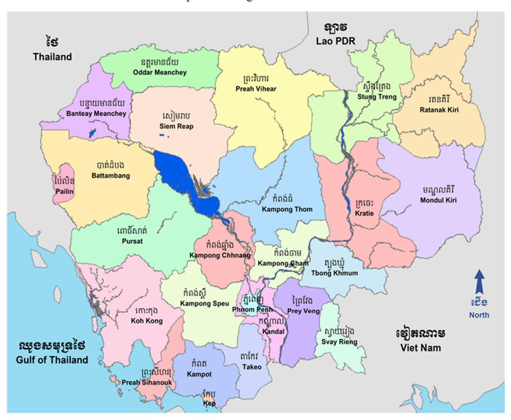

1

## មរិស្ថាន និចអាអាសធាតុ

#### **Environment and Climate**

ប្រទេសកម្ពុជាមានផ្ទៃដី ១៨១.០៣៥ គីឡូម៉ែត្រក្រឡានៅភាគនិរតីនៃឧបទ្វីបអាស៊ីបូព៌ាប្រមាណ ២០ ភាគរយ ត្រូវបានប្រើ ប្រាស់សម្រាប់វិស័យកសិកម្ម។ ប្រទេសកម្ពុជាស្ថិតនៅក្នុងតំបន់ត្រូពិកទាំងស្រុង និងស្ថិតនៅចំណុចខាងត្បូងច្រើនជាង១០ អង្សា នៅលើអេក្វាទ័រ។ រាជធានីរបស់ប្រទេសគីភ្នំពេញ ដែលស្ថិតនៅកណ្តាលប្រទេសកម្ពុជា។ ព្រំដែនអន្តរជាតិបានស្ថិតនៅ ជាមួយប្រទេសថៃ សាធារណរដ្ឋប្រជាធិបតេយ្យប្រជាមានិតឡាវនៅខាងលិច និងខាងជើង និងសាធារណរដ្ឋសង្គមនិយមវៀតណាម នៅខាងកើត និងអគ្នេយ៍។ ប្រទេសនេះមានព្រំប្រទល់នៅភាគនិរតីជាប់ឈូងសមុទ្រថៃ។

ប្រទេសកម្ពុជាជាប្រទេសដែលមានទីតាំងភូមិសាស្ត្រតូច បើប្រៀបធៀបជាមួយប្រទេសជិតខាងរបស់ខ្លួន និងមាន តំបន់រដ្ឋបាលចំនួន ២៤ ខេត្ត និង ១ រាជធានី។ ប្រទេសនេះមានឆ្នេរសមុទ្រប្រហែល ៤៤០ គីឡូម៉ែត្រ និងព្រៃកោងកាងទូលំទូលាយ។

ទន្លេមេគង្គគឺជាទន្លេធំជាងគេនៅកម្ពុជា ហើយគ្រប់គ្រងលើជលសាស្ត្រនៃប្រទេស។ ទន្លេនេះមានដើមកំណើតនៅចិន ដីគោក ដែលហូរកាត់ប្រទេសភូមា ឡាវ និងថៃ មុននឹងចូលមកកម្ពុជា។ នៅរាជធានីភ្នំពេញទន្លេនេះ មានដៃទន្លេជំនួស គឺទន្លេ បាសាក់ពីភាគខាងត្បូង និងទន្លេសាបភ្ជាប់ទៅនឹងបឹងទន្លេសាបពីទិសពាយព្យ បន្តទៅភាគនិរតីឆ្ពោះទៅកាន់ដីសណ្តទន្លេមេគង្គ ក្រោមនៅវៀតណាម និងទៅសមុទ្រចិនខាងត្បូង។

សីតុណ្ហភាពអតិបរមាខ្ពស់ជាង ៣៣ អង្សាសេ ជាទូទៅមុនពេលចាប់ផ្ដើមរដូវវស្សានៅខែមីនា និងខែមេសា ហើយអាច កើនឡើងដល់ជាង ៣៨ អង្សាសេ។ សីតុណ្ហភាពអប្បបរមាកម្រធ្លាក់ក្រោម ១០ អង្សាសេ។ ខែមករា គឺជាខែដែលត្រជាក់បំផុត ហើយខែមេសា គឺក្ដៅបំផុត។

បរិមាណទឹកភ្លៀងប្រចាំឆ្នាំជាមធ្យមគឺរវាង ១៤២ និង ២០០ សង្ទីម៉ែត្រ។ ភ្លៀងធ្លាក់ពីខែមេសា ដល់ខែកញ្ញា ក្នុងតំបន់ ដីទំនាបបឹងទន្លេសាប-មេគង្គ ជាមធ្យមប្រចាំឆ្នាំពី ១១០ ទៅ ១៩០ សង្ទីម៉ែត្រ ប៉ុន្តែបរិមាណនេះប្រែប្រូលគួរឱ្យកត់សម្គាល់ពីមួយ ឆ្នាំទៅមួយឆ្នាំ។ ទោះជាយ៉ាងណាក៏ដោយ តំបន់ទឹកភ្លៀងដ៏ធំបំផុតនេះ ភាគច្រើនហូរទៅសមុទ្រ។ មានបរិមាណតិចតួចប៉ុណ្ណោះ ដែលហូរតាមស្ទឹងទន្លេ ចូលក្នុងបឹងទន្លេសាប។ សំណើមនៅប្រទេសកម្ពុជា គឺខ្ពស់នៅពេលយប់ពេញមួយឆ្នាំ។ នៅពេលថ្ងៃនៅ រដូវប្រាំង សំណើមមធ្យមប្រមាណ ៥០ ភាគរយ ឬទាបជាងបន្តិច ប៉ុន្តែវាអាចនៅប្រមាណ ៦០ ភាគរយ នៅក្នុងរដូវវស្សា។

ព្រៃឈើកម្ពុជាមានលក្ខណៈចម្រុះ និងមានប្រភេទព្រៃបៃតង ព្រៃចម្រុះ និងព្រៃកោងកាងផ្សេងៗគ្នា។ ការប៉ាន់ស្មាន ចច្ចុប្បន្ននៃគម្របព្រៃធម្មជាតិដែលនៅសល់មានលក្ខណៈខុសៗគ្នាគួរឱ្យកត់សម្គាល់ ប៉ុន្តែតាមការឯកភាពគ្នា មានប្រមាណពាក់ កណ្តាលនៃផ្ទៃដីប្រទេសកម្ពុជា មានគម្របព្រៃឈើមួយចំនួន។

តំបន់ឆ្នេររបស់កម្ពុជា គឺតំបន់ភ្នំ ខ្ពង់រាប វាលរាប វាលខ្សាច់ ឆ្នេរសមុទ្រ និងឈូងសមុទ្រ។ មានខ្សាច់ជាច្រើននៅតំបន់នេះ។ ដូងប្រេង កៅស៊ូ ដូង ម្រេច ចូរេន និងដំណាំផ្សេងៗទៀតអាចដាំនៅតំបន់នេះ។ វាក៏សម្បរទៅដោយដើមកោងកាងផងដែរ។

ចាប់ពីឆ្នាំ១៩៩៣ រាជរដ្ឋាភិបាលកម្ពុជាបានអនុម័តនូវច្បាប់បរិស្ថានសំខាន់ៗមួយចំនួន ដើម្បីបង្កើតក្របខ័ណ្ឌច្បាប់ សម្រាប់គ្រប់គ្រងការប្រើប្រាស់ និងគ្រប់គ្រងធនធានធម្មជាតិ និងបរិស្ថានទីប្រជុំជន។ ក្រសួងបរិស្ថាន គឺជាទីភ្នាក់ងារដ៏សំខាន់ ក្នុងការការពារបរិស្ថាន និងការអភិរក្សធនធានធម្មជាតិ ខណៈគ្រសួងកសិកម្ម រុក្ខាប្រមាញ់ និងនេសាទទទួលខុសត្រូវលើការ គ្រប់គ្រងព្រៃឈើ។

Cambodia has a land area of 181,035 square kilometers in the southwestern part of the East Asia peninsula, about 20 percent of which is used for agriculture. Cambodia lies completely within the tropics with its southernmost points slightly more than 100 above the Equator. The country's capital city is Phnom Penh, which is located in central Cambodia. International borders are shared with Thailand, the Lao People's Democratic Republic on the west and on the north, and the socialist Republic of Vietnam on the east and southeast. The country is bounded on the southwest by the Gulf of Thailand.

Cambodia is a geographically compact country if comparing with its neighbors, administratively composed of 24 provinces and one capital. The country has a coastline of around 440 km and extensive mangrove forests.

The Mekong River is Cambodia largest river, and dominates the hydrology of the country. The river originates in mainland China, flows through Myanmar, Laos, and Thailand before entering Cambodia. At Phnom Penh, with its alternative arms, the Bassac River from the south, and the Tonle Sap River linking with the "Great Lake" Tonle Sap, from the northwest, it continues further southwestward to its lower delta in Vietnam and to the south China Sea.

Maximum temperatures of higher than 330 Centigrade, are common and, just before the start of the rainy season in March and April; they may rise to more than 380 Centigrade. Minimum temperatures rarely fall below 100 Centigrade. January is the coldest month, and April is the warmest.

Average annual rainfall is between 142 and 200 centimeters. Rainfall from April to September in the Tonle Sap Basin-Mekong Lowlands area average 110 to 190 centimeters annually, but the amount varies considerably from year to year. This area of greatest rainfall, however, drains mostly to the sea. Only a small quantity goes into the rivers flowing into the Tonle Sap Basin. The relative humidity in Cambodia is high at night throughout the year. During the daytime in the dry season, humidity averages about 50 percent or slightly lower, but it may remain at around 60 percent in the rainy period.

The forests of Cambodia are diverse and comprise a variety of evergreen, mixed and mangrove forest types. Current estimates of remaining natural forest cover vary considerably, but the consensus is that about half of Cambodia's land area has some form of forest cover.

Cambodia's coastal area is mountainous, plateau, plain, coast, seaside and gulf. There is much sand in this area. Palm oil, rubber, coconuts, pepper, durian and other crops can be grown in this area. It is also rich in varieties of mangrove.

Since 1993, the Royal Government of Cambodia enacted several key pieces of environmental legislation to establish the legal framework to control, use and manage its natural resources and urban environment. The Ministry of Environment (MoE) is the key agency responsible for environmental protection and natural resources conservation, while the Ministry of Agriculture, Forestry and Fisheries (MAFF) is responsible for forest management.

1.1 កម្ពស់ទឹកភ្លៀងមធ្យមប្រចាំឆ្នាំ តាមស្ថានីយ គិតជាមីលីម៉ែត្រ Annual average rainfall by station, in millimeter

| Stations         | 2010    | 2011    | 2012    | 2013    | 2014    | 2015    | 2016    | 2017    | 2018    |
|------------------|---------|---------|---------|---------|---------|---------|---------|---------|---------|
| Average          | 1,583.6 | 1,767.1 | 1,631.7 | 1,780.7 | 1,659.5 | 1,407.6 | 3,032.7 | 2,942.1 | 2,725.5 |
| Banteay Meanchey | 1,107.6 | 1,475.6 | 1318.5  | 1471.1  | 619.1   | -       | 128.5   | 97.5    | 107.3   |
| Battambang       | 1,943.5 | 1,707.4 | 1,338.6 | 1,393.5 | 881.4   | 1,095.3 | 79.9    | 111.5   | 93.3    |
| Kampong Cham     | -       | 1,381.5 | 1,699.5 | 1,466.9 | 1,322.1 | 1,384.4 | 127.1   | 151.7   | 105.2   |
| Kompong Chhnang  | 1,290.2 | 1,929.2 | 1,831.1 | 1,583.1 | 1,435.7 | 1,210.0 | 115.2   | 134.8   | 119.1   |
| Kampong Speu     | 1,214.6 | 1,378.3 | 1,444.3 | 1,465.1 | 993.4   | 1,051.7 | 220.0   | 174.9   | 184.7   |
| Kampong Thom     | 1,504.8 | 1,668.5 | 1,394.7 | 1,644.4 | 5,830.1 | 1,000.9 | 122.5   | 122.3   | 102.9   |
| Kampot           | -       | 1,949.2 | 1,796.8 | 1,998.5 | 1,784.1 | 1,568.5 | 150.2   | 143.7   | 225.6   |
| Kandal           | 1,711.2 | 1,248.3 | 1,464.5 | 1,317.5 | 1,194.2 | 960.5   | 136.5   | 96.4    | 89.4    |
| Koh Kong         | -       | 4,304.2 | 1,394.7 | 5,253.1 | 1,174.1 | 4,799.5 | 415.8   | 386.5   | 376.9   |
| Kratie           | 1,350.0 | 1,986.3 | 2,221.3 | 1,983.7 | 1,696.5 | 1,184.8 | 156.6   | 172.9   | 124.7   |
| Phnom Penh       | 1,711.2 | 1,495.4 | 1,336.9 | 1,419.7 | 1,461.5 | 1,064.7 | 155.7   | 139.3   | 142.7   |
| Preah Vihear     | 1,943.5 | 1,955.3 | 1,281.9 | 2,050.7 | 1,647.3 | 1,429.3 | -       | -       | -       |
| Prey Veng        | 1,887.3 | 1,369.8 | 1,788.8 | 1,370.9 | 1,673.8 | 1,309.0 | 178.0   | 122.8   | 95.2    |
| Pursat           | 1,875.5 | 1,488.4 | 1,640.2 | 1,583.5 | 1,285.4 | 1,225.7 | 147.7   | 150.0   | 89.4    |
| Ratanak Kiri     | -       | 1,947.0 | 2,501.9 | 503.7   | 1,918.5 | 1,817.5 | -       | -       | -       |
| Siem Reap        | 1,549.5 | 1,686.3 | 1,466.1 | 1,860.7 | 1,489.5 | 1,248.8 | 139.2   | 129.7   | 87.6    |
| Preah Sihanouk   | -       | 2,346.7 | 2,758.4 | 2,682.2 | 2,725.6 | 2,504.3 | 221.1   | 241.0   | 211.9   |
| Stung Treng      | 1,159.0 | 2,317.9 | 1,782.8 | 2,240.8 | 2,359.1 | 1,401.1 | 176.6   | 174.0   | 156.7   |
| Svay Rieng       | -       | 1,488.4 | 1,730.6 | 1,467.3 | 1,429.8 | 1,370.4 | 165.2   | 152.4   | 153.5   |
| Takeo            | -       | 1,486.7 | 1,369.5 | 1,257.6 | 1,382.9 | 1,283.7 | 110.7   | 124.5   | 131.3   |
| Pailin           | 1,922.5 | 1,076.4 | 1,105.4 | 1,464.2 | 844.1   | 961.2   | 86.2    | 116.5   | 128.1   |
| Oddar Meanchey   | -       | 1,189.5 | 1,231.0 | 1,696.1 | 1,360.3 | 1,095.5 | -       | -       | -       |

Note:

1/ Phnom Penh station

1.2 ការប្រែប្រួលដាច់ខាតប្រចាំឆ្នាំនៃកម្ពស់ទឹកភ្លៀងមធ្យម តាមស្ថានីយ គិតជាមីលីម៉ែត្រ

Annual absolute change of average rainfall by station, in millimeter

| Stations         | 2010   | 2011    | 2012     | 2013    | 2014    | 2015    |
|------------------|--------|---------|----------|---------|---------|---------|
| Average          | 41.51  | 133.1   | -135.4   | 148.9   | -121.2  | -251.9  |
| Banteay Meanchey | 57.4   | 368.0   | -157.1   | 152.6   | -852.0  | -619.1  |
| Battambang       | 0      | 375.4   | -368.8   | 54.9    | -512.1  | 213.9   |
| Kampong Cham     | -      | -388.5  | 318.0    | -232.6  | -144.8  | 62.3    |
| Kompong Chhnang  | -361   | 639.0   | -98.1    | -248.0  | -147.4  | -225.7  |
| Kampong Speu     | -190.6 | 163.7   | 66.0     | 20.8    | -471.7  | 58.3    |
| Kampong Thom     | 0      | 249.2   | -273.8   | 249.7   | 4185.7  | -4829.2 |
| Kampot           | -      | 536.3   | -152.4   | 201.7   | -214.4  | -215.6  |
| Kandal           | 531.2  | -462.9  | 216.2    | -147.0  | -123.3  | -233.7  |
| Koh Kong         | -      | 335.4   | -2,909.5 | 3858.4  | -4079.0 | 3625.4  |
| Kratie           | -499.1 | 636.3   | 235.0    | -237.6  | -287.2  | -511.7  |
| Phnom Penh       | 531.2  | 121.6   | -158.5   | 82.8    | 41.8    | -396.8  |
| Preah Vihear     | 0      | 399.5   | -673.4   | 768.8   | -403.4  | -218.0  |
| Prey Veng        | 722.8  | -517.5  | 419.0    | -417.9  | 302.9   | -364.8  |
| Pursat           | 719.7  | 128.2   | 151.8    | -56.7   | -298.1  | -59.7   |
| Ratanak Kiri     | -      | 288.0   | 554.9    | -1998.2 | 1414.8  | -101.0  |
| Siem Reap        | -156.3 | 136.8   | -220.2   | 394.6   | -371.2  | -240.7  |
| Preah Sihanouk   | -      | 171.1   | 411.7    | -76.2   | 43.4    | -221.3  |
| Stung Treng      | -538.9 | 1,158.9 | -535.1   | 458.0   | 118.3   | -958.0  |
| Svay Rieng       | -      | -491.8  | 242.2    | -263.3  | -37.5   | -59.4   |
| Takeo            | -      | 58.4    | -117.2   | -111.9  | 125.3   | -99.2   |
| Oddar Meanchey   | -      | -131.7  | 41.5     | 465.1   | -335.8  | -264.8  |

Source: Department of Meteorology, Ministry of Water Resources and Meteorology

Note:

1.3 កម្ពស់ទឹកភ្លៀងមធ្យមប្រចាំខែ តាមស្ថានីយ គិតជាមីលីម៉ែត្រ Monthly average rainfalls by station, in millimeter

| Stations         | Jan   | Feb   | Mar   | Apr   | May   | Jun   | Jul   | Aug   | Sep   | Oct   | Nov   | Dec  | Total in a year |
|------------------|-------|-------|-------|-------|-------|-------|-------|-------|-------|-------|-------|------|-----------------|
| Year 2010        | 14.8  | 4.7   | 43.0  | 79.5  | 124.7 | 160.7 | 225.9 | 217.6 | 265.0 | 331.2 | 82.7  | 6.7  | 1,603.2         |
| Banteay Meanchey | 9.7   | 13.5  | 25.7  | 67.9  | 71.3  | 122.6 | 96.8  | 207.0 | 228.5 | 255.6 | 9.0   | -    | 1,107.6         |
| Battambang       | 8.3   | 12.0  | 25.2  | 69.9  | 77.3  | 121.2 | 241.9 | 216.6 | 193.3 | 325.2 | 40.5  | 0.6  | 1,943.5         |
| Kampong Cham     | -     | -     | 13.8  | 33.7  | 140.1 | 176.3 | 298.5 | 99.4  | 243.3 | 122.0 | 142.1 | 6.5  | 1,504.8         |
| Kampot           | 13.5  | 7.0   | 77.0  | 154.5 | 218.1 | 169.4 | 191.8 | 314.3 | 209.8 | 287.1 | 228.2 | 4.8  | 1,875.5         |
| Koh Kong         | 28.8  | 7.4   | -     | 17.0  | 96.5  | 118.9 | 261.8 | 227.3 | 143.5 | 244.5 | 13.3  | -    | 1,159.0         |
| Phnom Penh       | 13.0  | -     | 53.0  | 135.5 | 71.1  | 235.4 | 81.7  | 102.3 | 174.0 | 741.9 | 94.2  | 9.1  | 1,711.2         |
| Prey Veng        | 53.4  | -     | 122.2 | 100.2 | 94.0  | 149.8 | 213.6 | 233.9 | 255.8 | 544.8 | 91.3  | 28.3 | 1,887.3         |
| Siem Reap        | 15.4  | -     | 0.1   | 12.6  | 80.8  | 204.4 | 271.0 | 264.1 | 273.0 | 357.1 | 52.9  | 18.1 | 1,549.5         |
| Preah Sihanouk   | -     | 6.8   | 112.9 | 134.6 | 308.9 | 139.6 | 387.3 | 219.4 | 697.6 | 203.3 | 107.0 | -    | 1,943.5         |
| Ratanak Kiri     | 5.6   | -     | -     | 69.2  | 88.8  | 169.6 | 215.0 | 291.6 | 231.4 | 230.2 | 48.6  | -    | 1,350.0         |
| Year 2011        | 0.3   | 17.6  | 56.7  | 168.6 | 155.8 | 212.8 | 286.4 | 350.3 | 376.4 | 277.5 | 52.2  | 11.8 | 1,966.3         |
| Banteay Meanchey | -     | 13.0  | 20.2  | 282.2 | 89.6  | 57.3  | 213.8 | 298.6 | 204.0 | 292.4 | 4.5   | -    | 1,475.6         |
| Battambang       | -     | 58.0  | 35.1  | 150.3 | 151.5 | 107.0 | 186.8 | 250.2 | 289.1 | 440.9 | 34.3  | 4.2  | 1,707.4         |
| Kampong Cham     | 0.2   | -     | 57.3  | 122.8 | 278.4 | 139.5 | 216.0 | 187.0 | 189.2 | 94.0  | 77.0  | 20.1 | 1,381.5         |
| Kampot           | 0.6   | 0.8   | 89.0  | 124.6 | 80.3  | 301.9 | 292.8 | 287.6 | 439.4 | 144.2 | 157.4 | 30.6 | 1,949.2         |
| Koh Kong         | -     | 91.2  | 106.8 | 429.4 | 188.6 | 668.0 | 664.6 | 929.4 | 439.4 | 685.6 | 64.0  | 37.2 | 4,304.2         |
| Phnom Penh       | 0.8   | -     | 11.4  | 130.9 | 131.4 | 113.3 | 227.8 | 249.7 | 244.4 | 311.7 | 67.0  | 7.0  | 1,495.4         |
| Prey Veng        | -     | 0.6   | 34.8  | 99.7  | 242.4 | 118.5 | 172.7 | 286.4 | 240.0 | 116.7 | 52.6  | 5.4  | 1,369.8         |
| Siem Reap        | -     | -     | 86.0  | 127.1 | 111.7 | 190.6 | 194.5 | 226.9 | 445.3 | 294.6 | 5.0   | 4.6  | 1,686.3         |
| Preah Sihanouk   | 1.2   | 12.8  | 126.0 | 119.8 | 97.0  | 277.6 | 355.0 | 442.8 | 732.5 | 131.9 | 44.7  | 5.4  | 2,346.7         |
| Ratanak Kiri     | -     | -     | -     | 99.6  | 186.8 | 154.6 | 340.2 | 343.9 | 540.4 | 262.7 | 15.2  | 3.6  | 1,947.0         |
| Year 2012        | 30.2  | 29.1  | 45.3  | 115.5 | 217.0 | 140.1 | 245.2 | 201.0 | 420.4 | 176.6 | 113.6 | 6.2  | 1,740.0         |
| Banteay Meanchey | 24.3  | 15.5  | 80.6  | 112.3 | 172.7 | 76.3  | 92.9  | 105.1 | 452.5 | 137.8 | 48.5  | -    | 1,318.5         |
| Battambang       | 16.2  | 46.8  | 58.6  | 56.3  | 166.2 | 83.7  | 133.6 | 93.2  | 346.7 | 249.4 | 87.9  | -    | 1,338.6         |
| Kampong Cham     | 21.0  | 0.6   | 29.4  | 148.0 | 264.3 | 136.9 | 308.7 | 141.8 | 401.2 | 115.6 | 132.0 | -    | 1,699.5         |
| Kampot           | 100.3 | 23.0  | 76.6  | 85.9  | 244.2 | 189.5 | 189.0 | 324.2 | 252.5 | 202.6 | 98.4  | 10.6 | 1,796.8         |
| Koh Kong         | 19.7  | 27.0  | 20.0  | 116.1 | 160.2 | 29.2  | 302.8 | 90.4  | 363.5 | 188.2 | 77.6  | -    | 1,394.7         |
| Phnom Penh       | 26.5  | 40.8  | 28.8  | 77.8  | 185.8 | 84.1  | 166.7 | 105.6 | 267.7 | 138.2 | 214.7 | 0.2  | 1,336.9         |
| Prey Veng        | 46.5  | 10.7  | 16.6  | 275.8 | 161.4 | 97.1  | 195.5 | 231.5 | 243.5 | 263.6 | 238.0 | 8.6  | 1,788.8         |
| Siem Reap        | 0.4   | -     | 3.2   | 39.1  | 148.6 | 144.4 | 215.7 | 135.4 | 512.8 | 174.8 | 61.7  | 30.0 | 1,466.1         |
| Preah Sihanouk   | 47.0  | 126.6 | 97.4  | 108.1 | 394.9 | 273.3 | 397.4 | 271.8 | 714.9 | 169.0 | 145.8 | 12.2 | 2,758.4         |
| Ratanak Kiri     | -     | -     | 41.7  | 135.5 | 271.3 | 286.3 | 449.5 | 510.6 | 648.8 | 126.7 | 31.5  | =    | 2,501.9         |

Note:

1.3 កម្ពស់ទឹកភ្លៀងមធ្យមប្រចាំខែ តាមស្ថានីយ គិតជាមីលីម៉ែត្រ (ត)

Monthly average rainfalls by station, in millimeter (continued)

|                  | ,    | Б.1  |       |       |       | ,       |         |       | G     | 0 .   |       | ъ     | Total in |
|------------------|------|------|-------|-------|-------|---------|---------|-------|-------|-------|-------|-------|----------|
| Stations         | Jan  | Feb  | Mar   | Apr   | May   | Jun     | Jul     | Aug   | Sep   | Oct   | Nov   | Dec   | a year   |
| Year 2013        | 10.8 | 3.7  | 43.1  | 104.4 | 113.9 | 277.1   | 397.0   | 315.5 | 312.0 | 223.4 | 110.9 | 30.3  | 1,942.0  |
| Banteay Meanchey | 0.7  | -    | 32.8  | 31.9  | 81.2  | 247.2   | 222.3   | 245.0 | 247.3 | 309.2 | 42.0  | 11.5  | 1,471.1  |
| Battambang       | -    | -    | 21.6  | 35.6  | 90.1  | 278.6   | 147.4   | 86.4  | 334.8 | 275.9 | 94.3  | 28.8  | 1,393.5  |
| Kampong Cham     | 2.2  | -    | 46.1  | 70.5  | 257.1 | 153.0   | 289.8   | 199.8 | 293.5 | 69.0  | 67.5  | 18.4  | 1,466.9  |
| Kampot           | 40.2 | 5.7  | 78.2  | 228.3 | 62.3  | 213.9   | 335.0   | 166.1 | 386.5 | 204.1 | 221.4 | 56.8  | 1,998.5  |
| Koh Kong         | 58.6 | 4.0  | 93.0  | 159.0 | 139.6 | 864.0   | 1,808.6 | 859.0 | 831.6 | 295.8 | 117.5 | 22.4  | 5,253.1  |
| Phnom Penh1      | -    | -    | 1.8   | 134.2 | 98.0  | 208.6   | 145.9   | 145.5 | 123.5 | 299.3 | 211.9 | 51.0  | 1,419.7  |
| Prey Veng        | -    | -    | 44.6  | 131.6 | 90.2  | 139.5   | 168.2   | 378.6 | 146.4 | 99.5  | 131.7 | 40.6  | 1,370.9  |
| Siem Reap        | -    | -    | 43.2  | 65.0  | 83.6  | 353.2   | 244.8   | 250.6 | 297.2 | 386.4 | 108.4 | 28.3  | 1,860.7  |
| Preah Sihanouk   | 6.6  | 27.4 | 69.8  | 187.6 | 237.2 | 312.7   | 608.3   | 319.8 | 459.5 | 294.3 | 114.2 | 44.8  | 2,682.2  |
| Ratanak Kiri     | -    | -    | -     | -     | -     | -       | -       | 503.7 | -     | -     | -     | -     | 503.7    |
| Year 2014        | 0.6  | 1.2  | 13.3  | 130.4 | 80.1  | 233.1   | 319.7   | 169.6 | 230.3 | 215.3 | 71.2  | 40.3  | 1,505.0  |
| Banteay Meanchey | -    | -    | 19.7  | 59.6  | 113.9 | 72.0    | 97.3    | 43.7  | 71.3  | 84.8  | 54.0  | 2.8   | 619.1    |
| Battambang       | -    | 0.4  | 2.4   | 84.1  | 46.9  | 66.2    | 190.8   | 146.6 | 88.2  | 208.7 | 40.4  | 6.7   | 881.4    |
| Kampong Cham     | -    | -    | 54.2  | 225.5 | 27.3  | 181.9   | 298.2   | 70.2  | 160.6 | 210.8 | 65.3  | 28.1  | 1,322.1  |
| Kampot           | 5.6  | 7.0  | 0.3   | 148.0 | 22.8  | 288.0   | 382.2   | 144.4 | 324.5 | 333.8 | 76.3  | 51.2  | 1,784.1  |
| Koh Kong         | -    | 1.0  | 5.6   | 64.6  | 85.2  | 197.9   | 335.6   | 132.5 | 91.1  | 180.0 | 4.8   | 75.8  | 1,174.1  |
| Phnom Penh       | -    | -    | 13.8  | 147.1 | 44.8  | 198.1   | 190.8   | 194.4 | 231.3 | 249.7 | 158.2 | 33.3  | 1,461.5  |
| Prey Veng        | -    | 3.0  | 0.4   | 261.2 | 93.6  | 363.1   | 295.7   | 84.8  | 224.2 | 203.5 | 87.2  | 57.1  | 1,673.8  |
| Siem Reap        | -    | -    | 13.2  | 88.6  | 119.6 | 184.7   | 347.2   | 210.0 | 202.6 | 284.0 | 23.0  | 16.6  | 1,489.5  |
| Preah Sihanouk   | -    | 0.4  | 23.4  | 49.6  | 121.0 | 491.6   | 591.9   | 412.3 | 513.1 | 252.9 | 165.0 | 104.4 | 2,725.6  |
| Ratanak Kiri     | -    | -    | -     | 175.2 | 125.7 | 287.2   | 467.6   | 257.4 | 396.2 | 145.0 | 37.6  | 26.6  | 1,918.5  |
| Year 2015        | 1.2  | 2.8  | 23.3  | 70.4  | 153.4 | 312.2   | 237.3   | 299.5 | 337.7 | 193.4 | 121.3 | 12.6  | 1,679.2  |
| Banteay Meanchey | -    | 29.9 | 24.7  | 70.7  | 122.9 | 85.9    | 47.6    | 118.0 | 284.9 | 34.2  | 38.0  | -     | 1,318.5  |
| Battambang       | 0.3  | 9.4  | 6.9   | 30.8  | 66.6  | 147.9   | 72.9    | 174.9 | 281.3 | 214.2 | 90.1  | -     | 1,095.3  |
| Kampong Cham     | -    | 2.0  | 1.6   | 122.6 | 109.2 | 175.6   | 173.8   | 224.1 | 230.8 | 203.2 | 136.4 | 5.1   | 1,384.4  |
| Kampot           | -    | 4.6  | 43.8  | 73.2  | 6.6   | 310.5   | 298.6   | 172.8 | 336.6 | 117.0 | 203.8 | 1.0   | 1,568.5  |
| Koh Kong         | 5.0  | 10.6 | 108.8 | 114.2 | 426.2 | 1,096.8 | 673.7   | 920.0 | 845.4 | 265.4 | 308.4 | 25.0  | 4,799.5  |
| Phnom Penh       | 2.6  | -    | 2.9   | 124.5 | 33.9  | 99.9    | 74.1    | 190.5 | 245.6 | 185.0 | 92.4  | 13.3  | 1,064.7  |
| Prey Veng        | -    | -    | 5.0   | 58.2  | 123.6 | 201.6   | 161.8   | 291.7 | 218.8 | 183.8 | 46.3  | 18.2  | 1,309.0  |
| Siem Reap        | -    | -    | -     | 44.4  | 41.5  | 172.2   | 161.7   | 363.1 | 225.8 | 173.8 | 66.3  | -     | 1,248.8  |
| Preah Sihanouk   | 2.8  | 1.6  | 27.4  | 50.8  | 190.4 | 459.2   | 321.1   | 458.2 | 636.4 | 146.2 | 184.5 | 25.7  | 2,504.3  |
| Ratanak Kiri     | -    | -    | 6.5   | 60.1  | 465.0 | 335.4   | 349.4   | 151.6 | 237.8 | 160.7 | 51.0  | -     | 1,817.5  |
|                  |      |      |       |       |       |         |         |       |       |       |       |       |          |

| Stations         | Jan | Feb | Mar | Apr  | May  | Jun  | Jul  | Aug  | Sep  | Oct  | Nov  | Dec  | Total in a year |
|------------------|-----|-----|-----|------|------|------|------|------|------|------|------|------|-----------------|
| Year 2016        |     |     |     |      |      |      |      |      |      |      |      |      | ,               |
| Banteay Meanchey | 1.5 | 0.7 | 0.0 | 2.3  | 2.7  | 7.5  | 5.9  | 6.2  | 10.1 | 11.2 | 1.7  | 0.7  | 50.5            |
| Battambang       | 0.4 | 0.0 | 0.0 | 0.6  | 3.7  | 3.3  | 5.1  | 3.1  | 6.6  | 5.7  | 2.2  | 0.5  | 31.2            |
| Kampong Cham     | 0.0 | 0.0 | 0.0 | 0.1  | 1.1  | 6.0  | 4.7  | 4.3  | 14.8 | 10.8 | 5.7  | 2.5  | 50.1            |
| Kampot           | 1.9 | 0.3 | 0.8 | 0.0  | 7.8  | 4.7  | 6.5  | 9.9  | 5.7  | 12.3 | 4.2  | 4.7  | 58.7            |
| Koh Kong         | 5.8 | 0.0 | 0.8 | 4.3  | 13.6 | 32.1 | 28.6 | 25.7 | 20.2 | 23.4 | 5.8  | 2.7  | 163.0           |
| Phnom Penh1      | 0.0 | 0.4 | 0.0 | 1.3  | 3.0  | 11.6 | 14.3 | 5.5  | 15.5 | 19.4 | 16.8 | 14.5 | 102.2           |
| Prey Veng        | 0.0 | 0.0 | 0.0 | 3.7  | 5.7  | 6.0  | 6.7  | 3.6  | 11.1 | 18.0 | 12.6 | 3.9  | 71.2            |
| Siem Reap        | 0.6 | 0.0 | 0.0 | 0.4  | 2.1  | 13.3 | 8.5  | 7.0  | 9.6  | 8.4  | 3.3  | 1.8  | 55.0            |
| Preah Sihanouk   | 1.8 | 0.5 | 0.1 | 0.0  | 5.5  | 15.4 | 11.9 | 12.7 | 17.7 | 15.4 | 3.0  | 2.9  | 86.8            |
| Ratanak Kiri     | -   | -   | -   | -    | -    | -    | -    | -    | -    | -    | -    | -    | -               |
| Year 2017        |     |     |     |      |      |      |      |      |      |      |      |      |                 |
| Banteay Meanchey | 1.0 | 0.0 | 3.8 | 0.7  | 4.54 | 2.2  | 6.0  | 4.6  | 8.1  | 5.6  | 1.6  | 0.1  | 38.3            |
| Battambang       | 0.6 | 0.0 | 3.2 | 3.7  | 3.8  | 6.4  | 4.3  | 6.0  | 4.8  | 7.8  | 3.0  | 0.2  | 44.0            |
| Kampong Cham     | 0.6 | 0.2 | 6.4 | 7.6  | 6.7  | 5.6  | 6.1  | 9.1  | 3.2  | 8.0  | 5.0  | 1.0  | 59.4            |
| Kampot           | 0.2 | 0.2 | 1.2 | 4.3  | 5.2  | 5.0  | 11.6 | 12.7 | 4.2  | 3.7  | 6.2  | 1.8  | 56.1            |
| Koh Kong         | 1.6 | 3.3 | 4.6 | 5.8  | 15.7 | 28.2 | 34.4 | 23.0 | 13.8 | 14.3 | 5.4  | 1.5  | 151.7           |
| Phnom Penh       | 3.2 | 6.6 | 3.8 | 27.8 | 10.5 | 6.3  | 6.4  | 13.6 | 15.5 | 8.2  | 8.9  | 3.7  | 114.5           |
| Prey Veng        | 0.4 | 0.3 | 2.8 | 5.1  | 6.1  | 4.3  | 5.9  | 4.9  | 6.4  | 8.7  | 2.6  | 0.0  | 47.6            |
| Siem Reap        | 2.0 | 0.2 | 1.0 | 8.7  | 4.1  | 2.3  | 3.7  | 7.5  | 9.1  | 9.8  | 3.1  | 0.4  | 51.8            |
| Preah Sihanouk   | 0.2 | 3.7 | 5.6 | 6.4  | 6.8  | 11.9 | 13.5 | 18.9 | 15.1 | 6.6  | 3.5  | 2.9  | 95.0            |
| Ratanak Kiri     | -   | -   | -   | -    | -    | -    | -    | -    | -    | -    | -    | -    | -               |
| Year 2018        |     |     |     |      |      |      |      |      |      |      |      |      |                 |
| Banteay Meanchey | 2.0 | 0.9 | 4.5 | 4.3  | 3.6  | 5.6  | 5.2  | 8.0  | 3.6  | 3.9  | 0.5  | 0.1  | 42.2            |
| Battambang       | 0.3 | 0.1 | 3.1 | 2.9  | 5.1  | 3.6  | 5.0  | 4.0  | 6.8  | 4.1  | 0.7  | 0.9  | 36.6            |
| Kampong Cham     | 3.8 | 0.8 | 2.3 | 1.6  | 5.7  | 5.5  | 3.0  | 6.0  | 5.3  | 2.7  | 3.7  | 0.9  | 41.3            |
| Kampot           | 6.7 | 2.6 | 6.0 | 3.4  | 2.0  | 9.8  | 20.6 | 13.8 | 9.5  | 10.7 | 1.3  | 1.9  | 88.3            |
| Koh Kong         | 4.8 | 2.9 | 5.8 | 6.5  | 9.2  | 20.2 | 31.9 | 29.7 | 22.8 | 9.8  | 2.7  | 1.6  | 147.9           |
| Phnom Penh1      | 2.7 | 0.1 | 1.7 | 2.7  | 9.9  | 8.2  | 2.4  | 5.4  | 11.6 | 8.5  | 2.1  | 0.8  | 56.1            |
| Prey Veng        | 1.0 | 0.4 | 0.1 | 0.9  | 8.7  | 2.9  | 2.7  | 4.7  | 4.5  | 7.8  | 2.4  | 1.4  | 37.5            |
| Siem Reap        | 0.8 | 0.8 | 1.5 | 1.4  | 5.0  | 4.6  | 4.0  | 4.4  | 7.1  | 3.2  | 1.1  | 0.8  | 34.8            |
| Preah Sihanouk   | 2.9 | 0.4 | 4.5 | 3.0  | 4.0  | 8.5  | 15.7 | 15.4 | 15.8 | 7.1  | 2.3  | 3.8  | 83.4            |
| Ratanak Kiri     | -   | -   | -   | -    | -    | -    | -    | -    | -    | -    | -    | -    | -               |

Note:

1.4 ចំនួនថ្ងៃមានភ្លៀងក្នុងឆ្នាំ តាមខែ និងស្ថានីយ
Number of raining days in a year by month and station

| Stations         | Jan | Feb | Mar | Apr | May | Jun | Jul | Aug | Sep | Oct | Nov | Dec | Total in a year |
|------------------|-----|-----|-----|-----|-----|-----|-----|-----|-----|-----|-----|-----|-----------------|
| 2010 Average     | 3   | 2   | 4   | 8   | 11  | 16  | 18  | 21  | 17  | 20  | 9   | 2   |                 |
| Banteay Meanchey | 1   | 2   | 2   | 7   | 7   | 9   | 7   | 13  | 14  | 14  | 3   | 0   | 79              |
| Battambang       | 3   | 3   | 3   | 7   | 10  | 17  | 20  | 20  | 19  | 22  | 5   | 2   | 131             |
| Kampong Cham     | 1   | 4   | 8   | 17  | 17  | 15  | 21  | 18  | 21  | 22  | 3   | 0   | 147             |
| Kampot           | 3   | 5   | 8   | 5   | 10  | 15  | 14  | 22  | 14  | 24  | 17  | 5   | 142             |
| Koh Kong         | 3   | 4   | 6   | 10  | 15  | 23  | 21  | 24  | 13  | 17  | 16  | 0   | 152             |
| Phnom Penh       | 4   | 0   | 4   | 5   | 6   | 19  | 16  | 19  | 19  | 21  | 8   | 5   | 126             |
| Prey Veng        | 4   | 0   | 1   | 8   | 10  | 15  | 20  | 20  | 18  | 19  | 10  | 3   | 128             |
| Siem Reap        | 4   | 0   | 1   | 5   | 9   | 20  | 16  | 24  | 19  | 16  | 6   | 1   | 121             |
| Preah Sihanouk   | 7   | 1   | 4   | 11  | 20  | 20  | 27  | 25  | 20  | 27  | 16  | 5   | 183             |
| Ratanak Kiri     | 4   | 1   | 0   | 4   | 7   | 11  | 15  | 25  | 16  | 13  | 3   | 3   | 102             |
| 2011 Average     | 1   | 2   | 6   | 9   | 14  | 19  | 21  | 21  | 22  | 19  | 5   | 2   | 141             |
| Banteay Meanchey | 0   | 2   | 1   | 9   | 11  | 15  | 15  | 16  | 20  | 18  | 1   | 0   | 108             |
| Battambang       | 0   | 1   | 6   | 9   | 13  | 16  | 18  | 20  | 19  | 23  | 4   | 1   | 130             |
| Kampong Cham     | 1   | 0   | 7   | 10  | 16  | 19  | 21  | 21  | 17  | 13  | 4   | 2   | 131             |
| Kampot           | 2   | 2   | 10  | 12  | 14  | 25  | 23  | 20  | 22  | 22  | 8   | 2   | 162             |
| Koh Kong         | 0   | 5   | 8   | 14  | 12  | 22  | 26  | 22  | 24  | 23  | 6   | 2   | 164             |
| Phnom Penh       | 1   | 0   | 3   | 3   | 20  | 13  | 16  | 22  | 21  | 21  | 6   | 1   | 127             |
| Prey Veng        | 0   | 1   | 7   | 10  | 15  | 15  | 24  | 18  | 20  | 15  | 5   | 2   | 132             |
| Siem Reap        | 0   | 0   | 5   | 8   | 12  | 17  | 18  | 22  | 20  | 23  | 4   | 2   | 131             |
| Preah Sihanouk   | 2   | 7   | 17  | 14  | 19  | 26  | 25  | 27  | 28  | 21  | 10  | 3   | 199             |
| Ratanak Kiri     | 0   | 0   | 0   | 5   | 11  | 18  | 24  | 21  | 29  | 15  | 4   | 2   | 129             |
| 2012 Average     | 6   | 3   | 5   | 9   | 16  | 16  | 21  | 18  | 25  | 15  | 12  | 2   | 147             |
| Banteay Meanchey | 3   | 1   | 3   | 5   | 12  | 12  | 16  | 14  | 22  | 13  | 8   | 0   | 109             |
| Battambang       | 3   | 2   | 5   | 6   | 16  | 14  | 15  | 16  | 27  | 18  | 9   | 0   | 131             |
| Kampong Cham     | 7   | 3   | 3   | 9   | 12  | 16  | 26  | 17  | 27  | 14  | 10  | 1   | 145             |
| Kampot           | 10  | 3   | 5   | 9   | 15  | 18  | 19  | 22  | 26  | 15  | 17  | 3   | 162             |
| Koh Kong         | 7   | 6   | 10  | 12  | 24  | 22  | 25  | 22  | 25  | 14  | 17  | 3   | 187             |
| Phnom Penh       | 7   | 3   | 5   | 12  | 13  | 12  | 20  | 12  | 22  | 18  | 15  | 1   | 140             |
| Prey Veng        | 10  | 5   | 4   | 11  | 12  | 11  | 19  | 12  | 27  | 16  | 13  | 2   | 142             |
| Siem Reap        | 2   | 0   | 1   | 5   | 16  | 14  | 22  | 18  | 25  | 16  | 9   | 2   | 130             |
| Preah Sihanouk   | 8   | 10  | 10  | 16  | 26  | 20  | 22  | 21  | 28  | 13  | 15  | 5   | 194             |
| Ratanak Kiri     | 0   | 0   | 4   | 6   | 14  | 18  | 21  | 24  | 25  | 11  | 2   | 0   | 125             |

Note:

ចំនួនថ្ងៃមានភ្លៀងក្នុងឆ្នាំ តាមខែ និងស្ថានីយ (ត) **1.4** 

Number of raining days in a year by month and station (continued)

| G:               |     | Б.1 | .,  |     |     | _   | T 1 |     | G   | 0   |     | _   | Total in |
|------------------|-----|-----|-----|-----|-----|-----|-----|-----|-----|-----|-----|-----|----------|
| Stations         | Jan | Feb | Mar | Apr | May | Jun | Jul | Aug | Sep | Oct | Nov | Dec | a year   |
| 2013 Average     | 2   | 1   | 4   | 9   | 13  | 18  | 21  | 21  | 22  | 17  | 11  | 3   | 140      |
| Banteay Meanchey | 1   | 0   | 5   | 6   | 6   | 15  | 12  | 14  | 21  | 14  | 7   | 0   | 101      |
| Battambang       | 0   | 0   | 5   | 9   | 10  | 23  | 15  | 19  | 19  | 17  | 14  | 2   | 133      |
| Kampong Cham     | 2   | 0   | 3   | 12  | 13  | 20  | 20  | 20  | 23  | 10  | 8   | 3   | 134      |
| Kampot           | 4   | 3   | 3   | 9   | 11  | 16  | 23  | 19  | 21  | 20  | 15  | 3   | 147      |
| Koh Kong         | 4   | 1   | 6   | 10  | 15  | 23  | 29  | 23  | 22  | 18  | 13  | 2   | 166      |
| Phnom Penh       | 0   | 0   | 3   | 11  | 16  | 20  | 19  | 20  | 20  | 15  | 13  | 2   | 139      |
| Prey Veng        | 0   | 0   | 2   | 10  | 12  | 16  | 18  | 22  | 23  | 19  | 13  | 5   | 140      |
| Siem Reap        | 0   | 0   | 2   | 5   | 11  | 8   | 17  | 20  | 19  | 18  | 12  | 3   | 115      |
| Preah Sihanouk   | 4   | 5   | 6   | 12  | 20  | 21  | 29  | 25  | 22  | 25  | 13  | 5   | 187      |
| Ratanak Kiri     | 0   | 0   | 1   | 6   | 13  | 19  | 24  | 27  | 25  | 15  | 4   | 2   | 136      |
| 2014 Average     | 0   | 1   | 2   | 8   | 10  | 19  | 23  | 15  | 18  | 17  | 9   | 5   | 127      |
| Banteay Meanchey | 0   | 0   | 2   | 7   | 12  | 10  | 14  | 16  | 16  | 15  | 5   | 4   | 101      |
| Battambang       | 0   | 1   | 2   | 5   | 11  | 12  | 19  | 16  | 17  | 15  | 7   | 5   | 110      |
| Kampong Cham     | 0   | 0   | 1   | 10  | 7   | 18  | 19  | 7   | 17  | 15  | 6   | 5   | 105      |
| Kampot           | 2   | 1   | 1   | 6   | 4   | 22  | 26  | 17  | 18  | 17  | 10  | 8   | 132      |
| Koh Kong         | 0   | 3   | 5   | 7   | 12  | 25  | 29  | 22  | 22  | 21  | 14  | 4   | 164      |
| Phnom Penh1      | 0   | 0   | 1   | 9   | 7   | 19  | 21  | 11  | 18  | 16  | 10  | 5   | 117      |
| Prey Veng        | 0   | 2   | 1   | 8   | 5   | 23  | 25  | 12  | 19  | 18  | 10  | 6   | 129      |
| Siem Reap        | 0   | 0   | 1   | 7   | 13  | 17  | 28  | 15  | 18  | 20  | 4   | 4   | 127      |
| Preah Sihanouk   | 0   | 1   | 6   | 9   | 14  | 26  | 30  | 25  | 21  | 18  | 15  | 6   | 171      |
| Ratanak Kiri     | 0   | 0   | 0   | 11  | 12  | 17  | 22  | 13  | 16  | 10  | 6   | 4   | 111      |
| 2015 Average     | 1   | 1   | 3   | 7   | 11  | 15  | 17  | 20  | 20  | 15  | 12  | 2   | 112      |
| Banteay Meanchey | 0   | 5   | 7   | 7   | 16  | 16  | 15  | 14  | 13  | 10  | 9   | 0   | 0        |
| Battambang       | 1   | 2   | 2   | 7   | 11  | 13  | 11  | 16  | 19  | 15  | 13  | 0   | 110      |
| Kampong Cham     | 0   | 1   | 1   | 6   | 11  | 14  | 16  | 18  | 18  | 19  | 9   | 1   | 114      |
| Kampot           | 0   | 3   | 7   | 9   | 5   | 14  | 20  | 17  | 17  | 11  | 19  | 1   | 123      |
| Koh Kong         | 1   | 2   | 6   | 9   | 16  | 20  | 17  | 26  | 24  | 19  | 17  | 5   | 162      |
| Phnom Penh       | 1   | 0   | 2   | 7   | 11  | 11  | 18  | 20  | 22  | 19  | 11  | 2   | 124      |
| Prey Veng        | 0   | 0   | 1   | 3   | 7   | 15  | 20  | 20  | 19  | 20  | 5   | 0   | 110      |
| Siem Reap        | 0   | 0   | 0   | 3   | 5   | 12  | 14  | 23  | 19  | 11  | 7   | 4   | 98       |
| Preah Sihanouk   | 2   | 1   | 6   | 14  | 15  | 17  | 24  | 26  | 26  | 21  | 21  | 4   | 177      |
| Ratanak Kiri     | 0   | 0   | 1   | 2   | 13  | 18  | 18  | 16  | 18  | 8   | 5   | 0   | 99       |

| Stations         | Jan | Feb | Mar | Apr | May | Jun | Jul | Aug | Sep | Oct | Nov | Dec | Total in a year |
|------------------|-----|-----|-----|-----|-----|-----|-----|-----|-----|-----|-----|-----|-----------------|
| 2016 Average     |     |     |     |     |     |     |     |     |     |     |     |     |                 |
| Banteay Meanchey | 2   | 1   | 2   | 5   | 8   | 14  | 18  | 15  | 12  | 12  | 4   | 2   | 95              |
| Battambang       | 3   | 1   | 1   | 3   | 11  | 9   | 17  | 16  | 21  | 17  | 7   | 6   | 112             |
| Kampong Cham     | 0   | 0   | 1   | 2   | 11  | 17  | 16  | 16  | 22  | 25  | 14  | 9   | 133             |
| Kampot           | 3   | 2   | 2   | 1   | 16  | 16  | 15  | 22  | 24  | 29  | 15  | 10  | 155             |
| Koh Kong         | 4   | 0   | 2   | 5   | 17  | 23  | 20  | 29  | 28  | 23  | 11  | 5   | 167             |
| Phnom Penh       | 0   | 1   | 0   | 2   | 12  | 21  | 20  | 19  | 23  | 24  | 12  | 12  | 146             |
| Prey Veng        | 2   | 0   | 0   | 3   | 14  | 19  | 20  | 18  | 26  | 28  | 18  | 12  | 160             |
| Siem Reap        | 1   | 0   | 0   | 1   | 8   | 16  | 18  | 19  | 18  | 20  | 9   | 5   | 115             |
| Preah Sihanouk   | 4   | 2   | 2   | 0   | 20  | 26  | 21  | 28  | 26  | 29  | 12  | 10  | 180             |
| 115Ratanak Kiri  | -   | -   | -   | -   | -   | -   | -   | -   | -   | -   | -   | -   | -               |
| 2017 Average     |     |     |     |     |     |     |     |     |     |     |     |     |                 |
| Banteay Meanchey | 6   | 1   | 9   | 6   | 8   | 9   | 18  | 9   | 13  | 11  | 6   | 3   | 99              |
| Battambang       | 8   | 1   | 8   | 4   | 17  | 13  | 19  | 21  | 9   | 12  | 10  | 4   | 126             |
| Kampong Cham     | 5   | 3   | 10  | 9   | 18  | 16  | 21  | 15  | 16  | 16  | 12  | 5   | 146             |
| Kampot           | 4   | 3   | 8   | 13  | 19  | 14  | 24  | 18  | 15  | 19  | 18  | 7   | 162             |
| Koh Kong         | 5   | 4   | 9   | 10  | 21  | 24  | 28  | 21  | 17  | 22  | 12  | 4   | 177             |
| Phnom Penh       | 5   | 1   | 4   | 9   | 22  | 15  | 25  | 20  | 21  | 17  | 16  | 5   | 160             |
| Prey Veng        | 5   | 6   | 9   | 13  | 16  | 15  | 20  | 20  | 17  | 21  | 16  | 6   | 164             |
| Siem Reap        | 4   | 1   | 5   | 6   | 13  | 6   | 15  | 15  | 13  | 17  | 11  | 4   | 110             |
| Preah Sihanouk   | 3   | 9   | 12  | 13  | 22  | 17  | 27  | 23  | 20  | 15  | 12  | 8   | 181             |
| 115Ratanak Kiri  | -   | -   | -   | -   | -   | -   | -   | -   | -   | -   | -   | -   | -               |
| 2018 Average     |     |     |     |     |     |     |     |     |     |     |     |     |                 |
| Banteay Meanchey | 3   | 1   | 6   | 9   | 9   | 13  | 17  | 11  | 12  | 12  | 6   | 1   | 100             |
| Battambang       | 4   | 2   | 5   | 10  | 10  | 11  | 18  | 17  | 13  | 12  | 6   | 3   | 111             |
| Kampong Cham     | 5   | 1   | 6   | 7   | 19  | 16  | 13  | 17  | 16  | 9   | 6   | 3   | 119             |
| Kampot           | 13  | 7   | 13  | 13  | 13  | 20  | 28  | 29  | 17  | 16  | 9   | 6   | 184             |
| Koh Kong         | 11  | 4   | 11  | 15  | 17  | 26  | 31  | 30  | 20  | 16  | 8   | 4   | 193             |
| Phnom Penh       | 6   | 1   | 2   | 9   | 18  | 19  | 11  | 18  | 18  | 18  | 9   | 3   | 132             |
| Prey Veng        | 9   | 2   | 1   | 4   | 21  | 23  | 16  | 19  | 15  | 16  | 8   | 6   | 140             |
| Siem Reap        | 4   | 1   | 5   | 3   | 10  | 13  | 15  | 14  | 18  | 9   | 6   | 2   | 100             |
| Preah Sihanouk   | 12  | 3   | 12  | 15  | 16  | 20  | 30  | 30  | 19  | 16  | 7   | 9   | 189             |
| 115Ratanak Kiri  | _   | -   | -   | -   | -   | -   | -   | -   | -   | -   | -   | -   | -               |

Note:

1.5 អប្បបរមា និងអតិបរមានៃសីតុណ្ហភាព តាមស្ថានីយ គិតជាអង្សាសេ Annual minimum and maximum temperature by station, in °C

| Stations        | 2011 | 2012  | 2013 | 2014  | 2015 | Average 5 years |
|-----------------|------|-------|------|-------|------|--------------------|
|                 |      | Minii | mum  |       |      |                    |
| Average         | 20.8 | 20.9  | 21.8 | 21.9  | 22.1 | 21.5               |
| Battambang      | 21.3 | 22.0  | 22.0 | 26.6  | 22.1 | 22.8               |
| Bantey meanchey | 19.7 | 20.7  | 24.1 | 20.0  | 21.8 | 21.3               |
| Koh Kong        | 17.0 | 17.0  | 20.4 | 19.3  | 21.2 | 18.9               |
| Kompomg Cham    | 22.2 | 18.1  | 22.2 | 22.2  | 21.6 | 21.2               |
| Kompong Thom    | 20.4 | 22.8  | 22.5 | 21.7  | 22.1 | 21.9               |
| Kompot          | 23.5 | 23.3  | 23.0 | 21.8  | 22.9 | 22.9               |
| Kratie          | 21.3 | 20.5  | 21.4 | 21.8  | 21.9 | 21.4               |
| Phnom Penh      | 22.0 | 21.4  | 20.8 | 22.0  | 22.7 | 21.8               |
| Prey Veng       | 20.3 | 21.4  | 20.8 | 22.0  | 22.5 | 21.4               |
| Pursat          | 20.7 | 21.6  | 21.1 | 21.7  | 21.9 | 21.4               |
| Siem Reap       | 20.4 | 22.7  | 22.1 | 21.9  | 22.0 | 21.8               |
| Preah Sihanouk  | 21.4 | 20.5  | 22.3 | 22.2  | 22.2 | 21.7               |
| Svay Rieng      | 21.2 | 22.8  | 22.2 | 22.3  | 22.6 | 22.2               |
| Stung Treng     | 20.8 | 21.1  | 17.3 | 22.3  | 20.1 | 20.3               |
| Pailin          | 20.7 | 20.5  | 18.1 | 18.8  | 18.7 | 19.3               |
|                 |      | Maxi  | mum  |       |      |                    |
| Average         | 34.5 | 35.1  | 34.2 | 35.0  | 35.9 | 34.9               |
| Battambang      | 34.5 | 36.1  | 36.2 | 36.3  | 36.2 | 35.8               |
| Bantey meanchey | 36.2 | 34.4  | 24.1 | 34.6  | 36.2 | 33.1               |
| Koh Kong        | 34.3 | 34.4  | 34.9 | 35.0  | 34.7 | 34.7               |
| Kompomg Cham    | 34.1 | 35.1  | 34.9 | 34.6  | 36.1 | 35.0               |
| Kompong Thom    | 31.7 | 34.6  | 33.2 | 33.3  | 35.8 | 33.7               |
| Kompot          | 34.0 | 34.5  | 35.1 | 33.3  | 34.3 | 34.2               |
| Kratie          | 33.8 | 34.9  | 35.8 | 35.8  | 36.5 | 35.4               |
| Phnom Penh      | 35.3 | 35.4  | 35.6 | 35.5  | 36.1 | 35.0               |
| Prey Veng       | 35.4 | 35.8  | 36.3 | 35.2  | 36.0 | 35.                |
| Pursat          | 35.3 | 36.1  | 36.2 | 36.2  | 37.0 | 36.                |
| Siem Reap       | 34.7 | 33.4  | 36.3 | 35.7  | 36.1 | 35.2               |
| Preah Sihanouk  | 33.1 | 33.2  | 33.8 | 33.0  | 33.4 | 33.3               |
| Svay Rieng      | 34.8 | 36.1  | 36.2 | 36.2  | 35.7 | 35.8               |
| Stung Treng     | 34.8 | 36.0  | 37.2 | 37.2  | 38.0 | 36.0               |
| Pailin          | 34.5 | 35.4  | 35.9 | 36.75 | 36.7 | 35.8               |

Note:

1/ Porchenton station

1.6 ការប្រែប្រូលដាច់ខាតប្រចាំឆ្នាំ នៃអប្បបរមា និងអតិបរមានៃសីតុណ្ហភាព តាមស្ថានីយ គិតជាអង្សាសេ Annual absolute change of minimum and maximum temperature by station, in °C

| Station                   | 2011           | 2012            | 2013           | 2014       | 2015 | Average 5 years |
|---------------------------|----------------|-----------------|----------------|------------|------|--------------------|
|                           |                | Miı             | nimum          |            |      |                    |
| Average                   | -0.5           | 0.6             | -0.5           | 0.6        | 0.1  | 0.2                |
| Battambang                | -0.6           | 0.8             | -0.1           | 4.6        | -4.5 | 0.2                |
| Bantey meanchey           | -2.0           | 1.0             | 3.4            | -4.2       | 1.8  | 0.5                |
| Koh Kong                  | -1.3           | 0.0             | 3.4            | -1.1       | 1.9  | 1.1                |
| Kompomg Cham              | 1.4            | -4.2            | 4.1            | 0.0        | -0.6 | -0.2               |
| Kompong Thom              | -0.3           | 2.4             | -0.3           | -0.8       | 0.4  | 0.4                |
| Kompot                    | 1.2            | -0.2            | -0.3           | -1.2       | 1.1  | -0.2               |
| Kratie                    | -0.4           | -0.8            | 0.9            | 0.4        | 0.1  | 0.1                |
| Phnom Penh                | -0.8           | -0.6            | -0.7           | 1.2        | 0.7  | 0.2                |
| Prey Veng                 | -0.6           | 1.1             | -0.7           | 1.2        | 0.5  | 0.5                |
| Pursat                    | -0.9           | 0.9             | -0.5           | 0.6        | 0.2  | 0.3                |
| Siem Reap                 | -1.3           | 2.3             | -0.6           | -0.2       | 0.2  | 0.4                |
| Preah Sihanouk            | -1.4           | -0.9            | 1.7            | -0.1       | 0.0  | 0.2                |
| Svay Rieng                | -0.4           | 1.7             | -0.6           | 0.1        | 0.3  | 0.4                |
| Stung Treng               | -0.9           | 0.3             | -3.8           | 5.0        | -2.2 | -0.2               |
| Pailin                    | 1.2            | -0.2            | -2.4           | 0.7        | -0.1 | -0.5               |
|                           |                | Ma              | ximum          |            |      |                    |
| Average                   | -0.9           | 0.7             | -0.9           | 0.7        | 0.9  | 0.2                |
| Battambang                | -1.5           | 1.6             | 0.1            | 0.1        | -0.1 | 0.6                |
| Bantey meanchey           | 0.0            | -1.9            | -10.2          | 10.4       | 1.6  | -0.5               |
| Koh Kong                  | -0.6           | 0.1             | 0.5            | 0.0        | -0.2 | 0.2                |
| Kompomg Cham              | -0.9           | 1.0             | -0.2           | -0.2       | 1.5  | 0.2                |
| Kompong Thom              | -2.2           | 2.9             | -1.4           | 0.0        | 2.5  | 0.5                |
| Kompot                    | -1.0           | 0.5             | 0.6            | -1.8       | 1.0  | -0.3               |
| Kratie                    | -2.0           | 1.2             | 0.8            | 0.1        | 0.7  | 0.7                |
| Phnom Penh                | -0.9           | 0.1             | 0.2            | -0.1       | 0.6  | 0.1                |
| Prey Veng                 | -0.7           | 0.5             | 0.5            | -1.1       | 0.7  | 0.0                |
| Pursat                    | 2.1            | 0.8             | 0.1            | 0.0        | 0.8  | 0.4                |
| Siem Reap                 | -1.8           | -1.3            | 2.9            | -0.6       | 0.4  | 0.4                |
| Preah Sihanouk            | -0.4           | 0.1             | 0.6            | -0.8       | 0.4  | 0.1                |
| Svay Rieng                | -0.7           | 1.3             | 0.1            | 0.0        | -0.5 | 0.2                |
| Stung Treng               | -1.3           | 1.2             | 1.2            | 0.0        | 0.9  | 0.8                |
| Pailin                    | -1.5           | 0.8             | 0.6            | 0.8        | -0.1 | 0.5                |
| Source: Department of Met | corology Minic | stry of Water D | acourage and M | otoorology |      |                    |

Note:

1/ Porchenton station

1.7 អប្បបរមាមធ្យមនៃសីតុណ្ហភាពប្រចាំខែ តាមស្ថានីយ គិតជាអង្សាសេ Average minimum of monthly temperature by station, in °C

| C4-4            | T    | F.1. | Man  | <b>A</b> | Μ    | T    | T1   | A    | C    | Ort  | NI   | D    | Total        |
|-----------------|------|------|------|----------|------|------|------|------|------|------|------|------|--------------|
| Stations        | Jan  | Feb  | Mar  | Apr      | May  | Jun  | Jul  | Aug  | Sep  | Oct  | Nov  | Dec  | in a year |
| 2011 Average    | 16.9 | 16.5 | 20.6 | 22.3     | 22.8 | 22.6 | 22.3 | 22.3 | 22.2 | 22.1 | 21.0 | 18.5 | 20.8         |
| Battambang      | 16.8 | 18.8 | 18.3 | 22.3     | 24.1 | 23.2 | 23.0 | 22.8 | 23.5 | 23.5 | 22.5 | 16.2 | 21.3         |
| Bantey meanchey | 15.0 | 16.3 | 17.0 | 20.0     | 23.0 | 22.0 | 22.0 | 22.0 | 22.0 | 22.0 | 20.1 | 15.0 | 19.7         |
| Koh Kong        | 12.5 | 14.5 | 16.5 | 18.5     | 19.0 | 19.0 | 19.0 | 12.0 | 19.0 | 19.0 | 18.0 | 16.5 | 17.0         |
| Kompomg Cham    | 18.7 | 20.1 | 20.5 | 21.6     | 21.7 | 22.6 | 23.7 | 30.5 | 23.2 | 23.2 | 23.0 | 18.1 | 22.2         |
| Kompong Thom    | 12.5 | 17.0 | 21.2 | 21.1     | 23.0 | 25.0 | 23.0 | 23.0 | 20.3 | 20.8 | 19.9 | 18.0 | 20.4         |
| Kompot          | 19.8 | 18.5 | 31.4 | 31.3     | 24.0 | 23.5 | 23.0 | 22.5 | 23.2 | 23.3 | 21.5 | 20.5 | 23.5         |
| Kratie          | 18.2 | 20.0 | 21.2 | 22.1     | 23.5 | 22.0 | 22.0 | 22.8 | 22.2 | 23.0 | 21.0 | 17.5 | 21.3         |
| Phnom Penh      | 18.5 | 20.8 | 21.5 | 22.5     | 23.5 | 23.2 | 22.8 | 22.5 | 23.3 | 23.5 | 22.5 | 19.4 | 22.0         |
| Prey Veng       | 16.3 | 18.5 | 20.5 | 22.3     | 22.0 | 21.9 | 21.5 | 21.6 | 21.5 | 21.3 | 19.6 | 17.0 | 20.3         |
| Pursat          | 21.2 | 0.5  | 17.8 | 21.3     | 24.0 | 24.0 | 23.4 | 23.0 | 23.3 | 21.6 | 22.0 | 26.5 | 20.7         |
| Siem Reap       | 15.5 | 18.0 | 17.6 | 20.0     | 24.0 | 21.5 | 22.5 | 23.2 | 22.8 | 23.0 | 20.5 | 15.8 | 20.4         |
| Preah Sihanouk  | 19.5 | 23.0 | 19.5 | 23.5     | 23.5 | 20.5 | 23.0 | 20.0 | 22.0 | 23.0 | 22.0 | 17.5 | 21.4         |
| Svay Rieng      | 17.0 | 18.6 | 19.5 | 22.5     | 22.3 | 23.0 | 22.5 | 23.0 | 23.5 | 22.8 | 22.5 | 16.7 | 21.2         |
| Stung Treng     | 17.5 | 18.5 | 21.5 | 21.0     | 23.0 | 22.0 | 22.2 | 21.0 | 22.5 | 22.5 | 21.0 | 17.0 | 20.8         |
| Pailin          | 17.0 | 16.3 | 16.5 | 20.5     | 22.0 | 22.0 | 22.4 | 23.6 | 23.2 | 23.2 | 23.7 | 18.0 | 20.7         |
| 2012 Average    | 19.5 | 20.3 | 22.3 | 22.4     | 23.0 | 20.8 | 22.2 | 19.4 | 22.4 | 22.2 | 22.2 | 19.9 | 20.9         |
| Battambang      | 19.4 | 19.3 | 22.8 | 23.0     | 23.4 | 25.0 | 21.5 | 23.6 | 23.5 | 21.7 | 22.7 | 18.5 | 22.0         |
| Bantey meanchey | 17.2 | 17.0 | 22.0 | 21.0     | 22.3 | 22.0 | 21.5 | 22.0 | 22.0 | 22.5 | 21.0 | 18.0 | 20.7         |
| Koh Kong        | 17.5 | 18.0 | 19.5 | 18.5     | 9.5  | 20.0 | 18.5 | 2.5  | 20.0 | 20.0 | 20.0 | 19.5 | 17.0         |
| Kompomg Cham    | 21.8 | 7.7  | 5.4  | 2.6      | 20.5 | 22.8 | 22.5 | 22.7 | 22.0 | 23.4 | 23.7 | 21.5 | 18.1         |
| Kompong Thom    | 20.1 | 21.3 | 24.0 | 23.0     | 23.6 | 24.0 | 22.7 | 23.4 | 23.7 | 23.6 | 24.2 | 19.8 | 22.8         |
| Kompot          | 22.3 | 22.5 | 23.8 | 23.8     | 23.8 | 24.0 | 23.5 | 23.5 | 23.5 | 23.5 | 23.2 | 22.2 | 23.3         |
| Kratie          | 20.0 | 20.5 | 22.0 | 22.0     | 23.0 | 23.0 | 23.0 | 4.0  | 23.0 | 22.0 | 23.0 | 20.0 | 20.5         |
| Phnom Penh      | 19.4 | 20.3 | 21.4 | 21.6     | 22.7 | 21.7 | 22.5 | 23.0 | 21.6 | 21.0 | 22.5 | 19.2 | 21.4         |
| Prey Veng       | 19.4 | 20.3 | 21.4 | 21.6     | 22.7 | 21.7 | 22.5 | 23.0 | 21.6 | 21.0 | 22.5 | 19.2 | 21.4         |
| Pursat          | 22.7 | 20.9 | 22.6 | 21.0     | 22.5 | 24.3 | 22.0 | 20.0 | 22.0 | 20.4 | 21.0 | 19.8 | 21.6         |
| Siem Reap       | 18.8 | 19.5 | 22.2 | 24.3     | 24.8 | 24.5 | 22.5 | 24.0 | 23.8 | 23.5 | 24.8 | 19.5 | 22.7         |
| Preah Sihanouk  | 22.2 | 20.0 | 23.5 | 24.0     | 23.0 | 4.5  | 23.0 | 21.0 | 20.5 | 23.0 | 20.0 | 21.5 | 20.5         |
| Svay Rieng      | 19.5 | 22.8 | 22.3 | 23.0     | 23.8 | 24.0 | 21.0 | 24.0 | 23.5 | 24.0 | 23.8 | 22.0 | 22.8         |
| Stung Treng     | 20.2 | 20.5 | 22.5 | 21.0     | 21.0 | 20.0 | 22.0 | 22.5 | 22.0 | 21.5 | 20.0 | 19.5 | 21.1         |
| Pailin          | 13.4 | 18.2 | 22.4 | 23.3     | 23.3 | 23.6 | 21.5 | 13.5 | 23.4 | 23.2 | 22.4 | 18.0 | 20.5         |

Note:

1/ Porchenton station

1.7 អប្បបរមាមធ្យមនៃសីតុណ្ហភាពប្រចាំខែ តាមស្ថានីយ គិតជាអង្សាសេ (ត)
Average minimum of monthly temperature by station, in °C (continued)

|                 |      |      |      |      |      |      |      |      |      |      |      |      | Total              |
|-----------------|------|------|------|------|------|------|------|------|------|------|------|------|--------------------|
| Stations        | Jan  | Feb  | Mar  | Apr  | May  | Jun  | Jul  | Aug  | Sep  | Oct  | Nov  | Dec  | in                 |
| 2013 Average    | 18.6 | 20.9 | 22.9 | 21.6 | 23.1 | 22.5 | 22.5 | 22.3 | 20.7 | 20.5 | 21.6 | 16.2 | a year <b>21.3</b> |
| Battambang      | 18.6 | 21.9 | 22.0 | 24.5 | 24.5 | 23.5 | 23.2 | 23.4 | 22.1 | 22.8 | 21.5 | 15.5 | 22.0               |
| Bantey meanchey | 16.0 | 20.5 | 21.0 | 21.5 | 23.5 | 23.5 | 23.8 | 24.2 | 21.9 | 20.0 | 20.0 | 15.5 | 24.1               |
| Koh Kong        | 18.0 | 19.5 | 31.5 | 20.0 | 21.0 | 20.0 | 19.5 | 20.0 | 19.5 | 20.0 | 19.5 | 16.0 | 20.4               |
| Kompomg Cham    | 20.2 | 20.9 | 23.0 | 23.6 | 23.0 | 23.7 | 23.0 | 23.5 | 23.0 | 22.0 | 23.0 | 17.0 | 22.2               |
| Kompong Thom    | 18.2 | 21.5 | 23.0 | 24.0 | 25.2 | 23.2 | 24.1 | 24.0 | 23.9 | 24.2 | 21.5 | 16.7 | 22.5               |
| Kompot Thom     | 20.5 | 23.2 | 23.5 | 23.6 | 24.4 | 24.2 | 23.3 | 23.2 | 23.7 | 23.3 | 23.3 | 20.0 | 23.0               |
| Kratie          | 18.0 | 19.5 | 21.0 | 24.0 | 23.0 | 23.0 | 23.0 | 21.5 | 23.0 | 21.0 | 22.0 | 17.5 | 21.4               |
| Phnom Penh      | 17.4 | 19.2 | 20.1 | 20.3 | 22.5 | 23.0 | 21.6 | 22.6 | 21.5 | 22.6 | 22.0 | 16.3 | 20.8               |
| Prey Veng       | 17.4 | 19.2 | 20.1 | 20.3 | 22.5 | 23.0 | 21.6 | 22.6 | 21.5 | 22.6 | 22.0 | 16.3 | 20.8               |
| Pursat          | 20.7 | 21.0 | 23.1 | 21.3 | 23.3 | 20.7 | 21.8 | 22.1 | 21.5 | 20.0 | 20.5 | 16.8 | 21.1               |
| Siem Reap       | 18.2 | 21.5 | 23.0 | 24.0 | 25.2 | 23.4 | 23.0 | 24.0 | 21.0 | 22.4 | 21.0 | 18.0 | 22.1               |
| Preah Sihanouk  | 20.0 | 23.0 | 22.0 | 23.0 | 22.5 | 23.0 | 23.0 | 22.5 | 22.0 | 23.0 | 23.5 | 19.5 | 22.3               |
| Svay Rieng      | 19.5 | 20.4 | 24.5 | 24.5 | 22.5 | 24.0 | 23.5 | 22.8 | 23.0 | 21.5 | 23.0 | 17.0 | 22.2               |
| Stung Treng     | 20.0 | 21.9 | 23.5 | 9.0  | 21.0 | 18.0 | 19.5 | 19.0 | 2.5  | 20.5 | 22.0 | 10.5 | 17.3               |
| Pailin          | 17.0 | 21.0 | 22.1 | 20.4 | 22.0 | 21.0 | 23.5 | 19.0 | 20.0 | 2.1  | 19.0 | 10.0 | 18.1               |
| 2014 Average    | 16.5 | 19.3 | 22.2 | 22.6 | 23.6 | 23.6 | 22.9 | 23.6 | 23.2 | 22.7 | 22.6 | 19.5 | 21.9               |
| Battambang      | 21.6 | 24.4 | 27.0 | 28.1 | 27.8 | 28.4 | 27.4 | 27.4 | 27.4 | 26.6 | 27.1 | 25.7 | 26.6               |
| Bantey meanchey | 16.0 | 20.0 | 20.8 | 20.0 | 19.4 | 22.0 | 21.4 | 20.0 | 22.0 | 20.2 | 21.0 | 17.0 | 20.0               |
| Koh Kong        | 14.5 | 17.0 | 20.0 | 20.0 | 21.0 | 20.5 | 19.5 | 19.5 | 20.3 | 20.0 | 20.5 | 18.5 | 19.3               |
| Kompomg Cham    | 16.8 | 18.7 | 21.0 | 22.5 | 24.0 | 23.0 | 20.9 | 23.7 | 22.5 | 22.8 | 23.8 | 19.0 | 21.6               |
| Kompong Thom    | 16.8 | 17.5 | 22.3 | 22.7 | 24.0 | 24.1 | 23.5 | 23.8 | 23.1 | 22.0 | 22.0 | 18.5 | 21.7               |
| Kompot Thom     | 16.0 | 20.0 | 21.8 | 22.0 | 24.8 | 23.7 | 23.0 | 23.0 | 22.5 | 23.5 | 21.5 | 19.8 | 21.7               |
| Kratie          | 16.0 | 20.5 | 23.0 | 23.5 | 25.0 | 22.5 | 22.0 | 24.5 | 24.0 | 21.0 | 22.0 | 18.0 | 21.8               |
| Phnom Penh      | 15.2 | 18.0 | 22.0 | 22.3 | 23.2 | 24.0 | 24.0 | 25.4 | 23.7 | 23.9 | 22.6 | 19.4 | 22.0               |
| Prey Veng       | 15.2 | 18.0 | 22.0 | 22.3 | 23.2 | 24.0 | 24.0 | 25.4 | 23.7 | 23.9 | 22.6 | 19.4 | 22.0               |
| Pursat          | 18.9 | 18.0 | 21.0 | 21.6 | 24.5 | 23.8 | 23.5 | 23.5 | 22.5 | 22.4 | 22.0 | 18.2 | 21.7               |
| Siem Reap       | 17.5 | 20.0 | 23.3 | 19.5 | 25.0 | 25.2 | 24.0 | 20.0 | 22.3 | 23.0 | 23.5 | 19.2 | 21.9               |
| Preah Sihanouk  | 20.0 | 20.3 | 21.0 | 25.0 | 25.5 | 22.0 | 23.0 | 22.5 | 21.0 | 23.0 | 23.0 | 20.0 | 22.2               |
| Svay Rieng      | 16.0 | 20.5 | 21.5 | 24.0 | 24.0 | 24.0 | 23.5 | 24.0 | 24.0 | 24.0 | 22.5 | 19.0 | 22.3               |
| Stung Treng     | 16.0 | 20.5 | 21.5 | 24.0 | 24.0 | 24.0 | 23.5 | 24.0 | 24.0 | 24.0 | 22.5 | 19.0 | 22.3               |
| Pailin          | 12.0 | 18.0 | 20.0 | 19.5 | 20.0 | 20.0 | 20.0 | 20.0 | 19.0 | 20.0 | 21.0 | 16.0 | 18.8               |
| 2015 Average    | 17.6 | 19.0 | 23.0 | 22.7 | 24.0 | 23.1 | 23.3 | 23.4 | 23.0 | 23.0 | 23.1 | 20.0 | 22.1               |
| Battambang      | 16.2 | 18.3 | 24.1 | 23.3 | 25.1 | 23.9 | 23.6 | 24.8 | 22.7 | 23.5 | 22.5 | 17.3 | 22.1               |
| Bantey meanchey | 17.2 | 18.7 | 22.0 | 22.0 | 24.7 | 23.8 | 23.0 | 23.7 | 23.4 | 22.3 | 22.3 | 18.4 | 21.8               |
| Koh Kong        | 17.0 | 19.0 | 21.5 | 21.5 | 22.5 | 19.5 | 22.0 | 22.5 | 22.5 | 22.0 | 23.0 | 21.0 | 21.2               |
| Kompomg Cham    | 15.8 | 19.2 | 23.4 | 23.5 | 23.3 | 22.7 | 22.5 | 23.0 | 21.8 | 22.7 | 23.5 | 21.2 | 21.9               |
| Kompong Thom    | 17.0 | 18.6 | 23.0 | 23.5 | 23.2 | 23.9 | 23.2 | 23.2 | 23.7 | 23.7 | 23.7 | 18.9 | 22.1               |
| Kompot          | 19.4 | 19.9 | 23.0 | 23.0 | 24.6 | 23.4 | 24.1 | 24.3 | 23.9 | 23.5 | 23.0 | 22.4 | 22.9               |
| Kratie          | 17.0 | 19.5 | 23.0 | 23.0 | 25.5 | 23.0 | 24.0 | 21.0 | 22.0 | 22.0 | 22.5 | 20.0 | 21.9               |
| Phnom Penh      | 19.0 | 20.2 | 23.8 | 21.8 | 25.0 | 24.5 | 23.3 | 23.0 | 23.2 | 23.8 | 24.0 | 21.0 | 22.7               |
| Prey Veng       | 17.3 | 18.9 | 23.3 | 22.5 | 25.0 | 23.0 | 24.0 | 24.6 | 23.9 | 24.0 | 23.0 | 20.4 | 22.5               |
| Pursat          | 19.7 | 17.3 | 23.3 | 22.4 | 21.1 | 23.5 | 23.6 | 24.0 | 22.9 | 22.6 | 23.4 | 19.0 | 21.9               |
| Siem Reap       | 19.6 | 18.8 | 24.1 | 23.2 | 24.1 | 23.5 | 23.0 | 23.0 | 23.2 | 21.0 | 22.5 | 18.4 | 22.0               |
| Preah Sihanouk  | 21.0 | 20.0 | 24.0 | 24.0 | 23.0 | 22.5 | 22.0 | 22.5 | 22.0 | 23.0 | 21.0 | 21.0 | 22.2               |
| Svay Rieng      | 18.0 | 19.5 | 23.0 | 24.3 | 25.0 | 24.0 | 24.0 | 24.0 | 22.0 | 24.0 | 23.3 | 19.8 | 22.6               |
| Stung Treng     | 17.0 | 18.0 | 21.0 | 23.0 | 24.2 | 20.0 | 19.0 | 20.0 | 20.0 | 20.0 | 21.0 | 17.5 | 20.1               |
| Pailin          | 14.0 | 17.0 | 2.1  | 21.0 | 22.0 | 22.0 | 22.0 | 22.0 | 21.0 | 21.0 | 21.0 | 19.0 | 18.7               |

| Stations         Jan         Feb         Mar         Apr         May         Jun         Jul         Aug         Sep         Oct         Nov         Dec         Total in a year           2016 Average           Battambang         22.3         20.8         26.6         27.0         26.6         25.1         26.1         25.6         26.1         25.5         24.6         22.8         24.8           Bantey meanchey         22.25         21.88         24         25.7         25.8         24.8         23.6         24.0.0         23.9         23.1         22.8         19.8         23.5           Koh Kong         23.24         22.8         25         24.9         25.1         24.4         23.9         24.6         24.4         24.4         24.4         23.5         24.2           Kompong Cham         24.13         22.99         25         26.7         26.6         25.4         25.1         25.7         24.9         24.7         24.6         23.3         24.9           Kompong Thom         21.81         21.58         23         24.3         23.3         22.2         22.2         23.0         22.3         22.1         20.9         17.7 <td< th=""></td<> |
|------------------------------------------------------------------------------------------------------------------------------------------------------------------------------------------------------------------------------------------------------------------------------------------------------------------------------------------------------------------------------------------------------------------------------------------------------------------------------------------------------------------------------------------------------------------------------------------------------------------------------------------------------------------------------------------------------------------------------------------------------------------------------------------------------------------------------------------------------------------------------------------------------------------------------------------------------------------------------------------------------------------------------------------------------------------------------------------------------------------------------------------------------------------------------------------------------------|
| 2016 Average           Battambang         22.3         20.8         26.6         27.0         26.6         25.1         26.1         25.6         26.1         25.5         24.6         22.8         24.8           Bantey meanchey         22.25         21.88         24         25.7         25.8         24.8         23.6         24.0.0         23.9         23.1         22.8         19.8         23.5           Koh Kong         23.24         22.8         25         24.9         25.1         24.4         23.9         24.6         24.4         24.4         23.5         24.2           Kompong Cham         24.13         22.99         25         26.7         26.6         25.4         25.1         25.7         24.9         24.7         24.6         23.3         24.9           Kompong Thom         21.81         21.58         23         24.3         23.3         22.2         22.2         23.0         22.3         22.1         20.9         17.7         22.1           Kompot         24.17         23.41         25         26.3         26.6         25.9         25.3         25.7         25.1         25.5         24.9         25.3           Krat                  |
| 2016 Average           Battambang         22.3         20.8         26.6         27.0         26.6         25.1         26.1         25.6         26.1         25.5         24.6         22.8         24.8           Bantey meanchey         22.25         21.88         24         25.7         25.8         24.8         23.6         24.0.0         23.9         23.1         22.8         19.8         23.5           Koh Kong         23.24         22.8         25         24.9         25.1         24.4         23.9         24.6         24.4         24.4         24.4         23.5         24.2           Kompong Cham         24.13         22.99         25         26.7         26.6         25.4         25.1         25.7         24.9         24.7         24.6         23.3         24.9           Kompong Thom         21.81         21.58         23         24.3         23.3         22.2         22.2         23.0         22.3         22.1         20.9         17.7         22.1           Kompot         24.17         23.41         25         26.3         26.6         25.9         25.3         25.7         25.1         25.5         24.9         25.3                    |
| Battambang         22.3         20.8         26.6         27.0         26.6         25.1         26.1         25.6         26.1         25.5         24.6         22.8         24.8           Bantey meanchey         22.25         21.88         24         25.7         25.8         24.8         23.6         24.00         23.9         23.1         22.8         19.8         23.5           Koh Kong         23.24         22.8         25         24.9         25.1         24.4         23.9         24.6         24.4         24.4         24.4         23.5         24.2           Kompong Cham         24.13         22.99         25         26.7         26.6         25.4         25.1         25.7         24.9         24.7         24.6         23.3         24.9           Kompong Thom         21.81         21.58         23         24.3         23.3         22.2         22.2         23.0         22.3         22.1         20.9         17.7         22.1           Kompot         24.17         23.41         25         26.3         26.6         25.9         25.3         25.7         25.1         25.5         24.9         25.3           Kratie         24.29         <   |
| Bantey meanchey       22.25       21.88       24       25.7       25.8       24.8       23.6       24.0.0       23.9       23.1       22.8       19.8       23.5         Koh Kong       23.24       22.8       25       24.9       25.1       24.4       23.9       24.6       24.4       24.4       24.4       23.5       24.2         Kompong Cham       24.13       22.99       25       26.7       26.6       25.4       25.1       25.7       24.9       24.7       24.6       23.3       24.9         Kompong Thom       21.81       21.58       23       24.3       23.3       22.2       22.2       23.0       22.3       22.1       20.9       17.7       22.1         Kompot       24.17       23.41       25       26.3       26.6       25.9       25.3       25.9       25.7       25.1       25.5       24.9       25.3         Kratie       24.29       23.1       25       27.5       27.2       26.1       24.8       25.8       25.0       24.9       24.6       23.1       25.1         Phnom Penh       23.45       22.76       25       26.7       27.0       25.9       25.4       26.0                                                                                              |
| Koh Kong         23.24         22.8         25         24.9         25.1         24.4         23.9         24.6         24.4         24.4         24.4         24.4         24.4         24.4         24.4         24.4         24.4         24.4         24.4         24.4         24.4         24.2         24.2           Kompong Cham         24.13         22.99         25         26.7         26.6         25.4         25.1         25.7         24.9         24.7         24.6         23.3         24.9           Kompong Thom         21.81         21.58         23         24.3         23.3         22.2         22.2         23.0         22.3         22.1         20.9         17.7         22.1           Kompot         24.17         23.41         25         26.3         26.6         25.9         25.3         25.7         25.1         25.5         24.9         25.3           Kratie         24.29         23.1         25         27.5         27.2         26.1         24.8         25.8         25.0         24.9         24.6         23.1         25.1           Phnom Penh         23.45         22.76         25         26.7         27.0         25.9         25.4   |
| Kompomg Cham         24.13         22.99         25         26.7         26.6         25.4         25.1         25.7         24.9         24.7         24.6         23.3         24.9           Kompong Thom         21.81         21.58         23         24.3         23.3         22.2         22.2         23.0         22.3         22.1         20.9         17.7         22.1           Kompot         24.17         23.41         25         26.3         26.6         25.9         25.3         25.9         25.7         25.1         25.5         24.9         25.3           Kratie         24.29         23.1         25         27.5         27.2         26.1         24.8         25.8         25.0         24.9         24.6         23.1         25.1           Phnom Penh         23.45         22.76         25         26.7         27.0         25.9         25.4         26.0         25.2         24.7         25.0         24.0         25.1           Prey Veng         23.8         22.4         25         26.1         26.4         25.7         25.3         26.2         25.7         25.1         24.8         23.9         25.0                                          |
| Kompong Thom         21.81         21.58         23         24.3         23.3         22.2         22.2         23.0         22.3         22.1         20.9         17.7         22.1           Kompot         24.17         23.41         25         26.3         26.6         25.9         25.3         25.9         25.7         25.1         25.5         24.9         25.3           Kratie         24.29         23.1         25         27.5         27.2         26.1         24.8         25.8         25.0         24.9         24.6         23.1         25.1           Phnom Penh         23.45         22.76         25         26.7         27.0         25.9         25.4         26.0         25.2         24.7         25.0         24.0         25.1           Prey Veng         23.8         22.4         25         26.1         26.4         25.7         25.3         26.2         25.7         25.1         24.8         23.9         25.0                                                                                                                                                                                                                                          |
| Kompot       24.17       23.41       25       26.3       26.6       25.9       25.3       25.9       25.7       25.1       25.5       24.9       25.3         Kratie       24.29       23.1       25       27.5       27.2       26.1       24.8       25.8       25.0       24.9       24.6       23.1       25.1         Phnom Penh       23.45       22.76       25       26.7       27.0       25.9       25.4       26.0       25.2       24.7       25.0       24.0       25.1         Prey Veng       23.8       22.4       25       26.1       26.4       25.7       25.3       26.2       25.7       25.1       24.8       23.9       25.0                                                                                                                                                                                                                                                                                                                                                                                                                                                                                                                                                        |
| Kratie       24.29       23.1       25       27.5       27.2       26.1       24.8       25.8       25.0       24.9       24.6       23.1       25.1         Phnom Penh       23.45       22.76       25       26.7       27.0       25.9       25.4       26.0       25.2       24.7       25.0       24.0       25.1         Prey Veng       23.8       22.4       25       26.1       26.4       25.7       25.3       26.2       25.7       25.1       24.8       23.9       25.0                                                                                                                                                                                                                                                                                                                                                                                                                                                                                                                                                                                                                                                                                                                      |
| Phnom Penh         23.45         22.76         25         26.7         27.0         25.9         25.4         26.0         25.2         24.7         25.0         24.0         25.1           Prey Veng         23.8         22.4         25         26.1         26.4         25.7         25.3         26.2         25.7         25.1         24.8         23.9         25.0                                                                                                                                                                                                                                                                                                                                                                                                                                                                                                                                                                                                                                                                                                                                                                                                                             |
| Prey Veng 23.8 22.4 25 26.1 26.4 25.7 25.3 26.2 25.7 25.1 24.8 23.9 25.0                                                                                                                                                                                                                                                                                                                                                                                                                                                                                                                                                                                                                                                                                                                                                                                                                                                                                                                                                                                                                                                                                                                                   |
|                                                                                                                                                                                                                                                                                                                                                                                                                                                                                                                                                                                                                                                                                                                                                                                                                                                                                                                                                                                                                                                                                                                                                                                                            |
| D / 00.45 01.01 05 000 004 000 040 055 045 044 005 005                                                                                                                                                                                                                                                                                                                                                                                                                                                                                                                                                                                                                                                                                                                                                                                                                                                                                                                                                                                                                                                                                                                                                     |
| Pursat 22.45 21.31 25 26.8 26.4 26.2 24.8 25.5 24.7 24.4 23.5 22.6 24.5                                                                                                                                                                                                                                                                                                                                                                                                                                                                                                                                                                                                                                                                                                                                                                                                                                                                                                                                                                                                                                                                                                                                    |
| Siem Reap 22.95 23.07 25 25.7 26.2 25.0 24.4 24.4 24.1 23.7 23.7 23.4 24.3                                                                                                                                                                                                                                                                                                                                                                                                                                                                                                                                                                                                                                                                                                                                                                                                                                                                                                                                                                                                                                                                                                                                 |
| Preah Sihanouk 23.95 23.62 25 26.5 26.2 25.0 24.4 25.1 24.8 24.1 25.2 24.6 24.9                                                                                                                                                                                                                                                                                                                                                                                                                                                                                                                                                                                                                                                                                                                                                                                                                                                                                                                                                                                                                                                                                                                            |
| Svay Rieng 23.0 22.3 24.5 26.2 26.0 24.8 24.5 24.6 24.4 24.4 24.6 23.0 24.3                                                                                                                                                                                                                                                                                                                                                                                                                                                                                                                                                                                                                                                                                                                                                                                                                                                                                                                                                                                                                                                                                                                                |
| Stung Treng 22.45 21.28 24 26.6 24.8 23.7 23.2 23.7 22.8 23.7 22.9 21.4 23.4                                                                                                                                                                                                                                                                                                                                                                                                                                                                                                                                                                                                                                                                                                                                                                                                                                                                                                                                                                                                                                                                                                                               |
| Pailin 21.77 20.1 24 25.8 26.0 25.9 24.6 24.8 25.0 24.1 23.1 22.2 23.9                                                                                                                                                                                                                                                                                                                                                                                                                                                                                                                                                                                                                                                                                                                                                                                                                                                                                                                                                                                                                                                                                                                                     |
| 2017 Average                                                                                                                                                                                                                                                                                                                                                                                                                                                                                                                                                                                                                                                                                                                                                                                                                                                                                                                                                                                                                                                                                                                                                                                               |
| Battambang 23.28 22.52 23 23.2 23.4 22.6 22.8 22.7 22.8 22.9 21.3 22.8                                                                                                                                                                                                                                                                                                                                                                                                                                                                                                                                                                                                                                                                                                                                                                                                                                                                                                                                                                                                                                                                                                                                     |
| Bantey meanchey 21.1 20.23 23 24 24.6 24.3 23.4 24.3 24.2 23.5 21.4 19.1 22.8                                                                                                                                                                                                                                                                                                                                                                                                                                                                                                                                                                                                                                                                                                                                                                                                                                                                                                                                                                                                                                                                                                                              |
| Koh Kong 23.32 22.25 24 24.5 24.4 24.1 23.7 24.3 24.3 23.3 23.4 21.7 23.6                                                                                                                                                                                                                                                                                                                                                                                                                                                                                                                                                                                                                                                                                                                                                                                                                                                                                                                                                                                                                                                                                                                                  |
| Kompomg Cham 23.23 22.73 24 25.6 25.7 25.7 25.2 25.9 25.7 25.1 24.4 22.3 24.6                                                                                                                                                                                                                                                                                                                                                                                                                                                                                                                                                                                                                                                                                                                                                                                                                                                                                                                                                                                                                                                                                                                              |
| Kompong Thom 21.69 22.16 24 24.9 25.4 25.0 24.7 25.2 25.1 24.5 23.4 21.1 23.9                                                                                                                                                                                                                                                                                                                                                                                                                                                                                                                                                                                                                                                                                                                                                                                                                                                                                                                                                                                                                                                                                                                              |
| Kompot 24.33 23.61 25 25.4 26.1 25.6 25.0 25.4 25.6 25.2 25.3 23.5 25.0                                                                                                                                                                                                                                                                                                                                                                                                                                                                                                                                                                                                                                                                                                                                                                                                                                                                                                                                                                                                                                                                                                                                    |
| Kratie 23.15 23.2 25 25.7 26.0 25.8 25.5 26.2 25.9 25.1 24.4 22.0 24.8                                                                                                                                                                                                                                                                                                                                                                                                                                                                                                                                                                                                                                                                                                                                                                                                                                                                                                                                                                                                                                                                                                                                     |
| Phnom Penh 23.57 23.08 25 25.5 26.2 25.8 25.2 25.5 25.4 25.3 24.6 22.5 24.8                                                                                                                                                                                                                                                                                                                                                                                                                                                                                                                                                                                                                                                                                                                                                                                                                                                                                                                                                                                                                                                                                                                                |
| Prey Veng 23.29 22.94 24 25.6 26.1 26.4 25.5 26.3 26.2 25.5 24.6 22.4 24.9                                                                                                                                                                                                                                                                                                                                                                                                                                                                                                                                                                                                                                                                                                                                                                                                                                                                                                                                                                                                                                                                                                                                 |
| Pursat 23.05 21.98 24 25.2 25.5 25.2 25.0 24.9 24.8 24.0 23.2 21.4 24.0                                                                                                                                                                                                                                                                                                                                                                                                                                                                                                                                                                                                                                                                                                                                                                                                                                                                                                                                                                                                                                                                                                                                    |
| Siem Reap 23.54 22.17 23.4 24.3 24.9 24.8 24.3 24.7 25.4 24.4 23.5 21.0 23.9                                                                                                                                                                                                                                                                                                                                                                                                                                                                                                                                                                                                                                                                                                                                                                                                                                                                                                                                                                                                                                                                                                                               |
| Preah Sihanouk 21.24 21.93 25 25.2 25.5 25.3 24.8 25.0 24.8 24.1 23.4 21.4 24.0                                                                                                                                                                                                                                                                                                                                                                                                                                                                                                                                                                                                                                                                                                                                                                                                                                                                                                                                                                                                                                                                                                                            |
| Svay Rieng 22.95 22.44 24 25 25.2 25.2 24.4 25.2 25.2 2                                                                                                                                                                                                                                                                                                                                                                                                                                                                                                                                                                                                                                                                                                                                                                                                                                                                                                                                                                                                                                                                                                                                                    |
| Stung Treng 21.08 21.26 23 23.7 23.6 22.8 23.4 23.8 23.5 22.9 20.5 22.7                                                                                                                                                                                                                                                                                                                                                                                                                                                                                                                                                                                                                                                                                                                                                                                                                                                                                                                                                                                                                                                                                                                                    |
| Pailin 22.71 21.79 24 24.6 24.8 25.4 25.2 25.5 24.6 24.0 22.7 20.5 23.8                                                                                                                                                                                                                                                                                                                                                                                                                                                                                                                                                                                                                                                                                                                                                                                                                                                                                                                                                                                                                                                                                                                                    |
| 2018 Average                                                                                                                                                                                                                                                                                                                                                                                                                                                                                                                                                                                                                                                                                                                                                                                                                                                                                                                                                                                                                                                                                                                                                                                               |
| Battambang 22.55 21.63 24 24.9 25.7 26.1 25.6 25.4 25.2 25.3 24.1 23.8 24.6                                                                                                                                                                                                                                                                                                                                                                                                                                                                                                                                                                                                                                                                                                                                                                                                                                                                                                                                                                                                                                                                                                                                |
| Bantey meanchey 20.63 20.04 23 22.9 24.2 24.1 24.5 23.8 23.6 24.1 22.2 21.7 22.9                                                                                                                                                                                                                                                                                                                                                                                                                                                                                                                                                                                                                                                                                                                                                                                                                                                                                                                                                                                                                                                                                                                           |
| Koh Kong 22.82 22.27 24 23.9 24.5 23.3 24.0 23.8 23.7 24.0 23.7 23.4 23.6                                                                                                                                                                                                                                                                                                                                                                                                                                                                                                                                                                                                                                                                                                                                                                                                                                                                                                                                                                                                                                                                                                                                  |
| Kompomg Cham 23.15 22.43 25 25.2 24.7 25.2 25.5 25.5 25.0 25.2 24.3 24.3 24.6                                                                                                                                                                                                                                                                                                                                                                                                                                                                                                                                                                                                                                                                                                                                                                                                                                                                                                                                                                                                                                                                                                                              |
| Kompong Thom 21.82 20.96 23 23.1 23.4 23.7 23.6 23.6 23.5 23.7 22.3 22.2 22.9                                                                                                                                                                                                                                                                                                                                                                                                                                                                                                                                                                                                                                                                                                                                                                                                                                                                                                                                                                                                                                                                                                                              |
| Kompot 24.32 22.72 25 25.1 25.7 25.3 25.0 24.9 24.8 25.0 25.1 25.1 24.8                                                                                                                                                                                                                                                                                                                                                                                                                                                                                                                                                                                                                                                                                                                                                                                                                                                                                                                                                                                                                                                                                                                                    |
| Kratie 23.64 22.98 25 25.7 25.4 24.9 25.4 25.2 24.8 24.3 23.6 23.5 24.5                                                                                                                                                                                                                                                                                                                                                                                                                                                                                                                                                                                                                                                                                                                                                                                                                                                                                                                                                                                                                                                                                                                                    |
| Phnom Penh 23.41 22.69 25 25.2 25.1 25.2 25.7 24.9 24.5 24.9 24.7 24.9 24.7                                                                                                                                                                                                                                                                                                                                                                                                                                                                                                                                                                                                                                                                                                                                                                                                                                                                                                                                                                                                                                                                                                                                |
| Prey Veng 23.59 22.54 25 25.6 25.6 25.7 26.1 26.5 26.3 25.3 24.7 24.9 25.1                                                                                                                                                                                                                                                                                                                                                                                                                                                                                                                                                                                                                                                                                                                                                                                                                                                                                                                                                                                                                                                                                                                                 |
| Pursat 22.48 21.69 24 24.6 24.9 25.0 25.0 25.0 26.5 26.5 26.7 26.7 26.7 26.7 26.7 26.7 26.7 26.7                                                                                                                                                                                                                                                                                                                                                                                                                                                                                                                                                                                                                                                                                                                                                                                                                                                                                                                                                                                                                                                                                                           |
| Siem Reap 22.05 20.25 24 24 24.2 24.7 24.6 24.3 24.2 24.2 22.5 22.1 23.4                                                                                                                                                                                                                                                                                                                                                                                                                                                                                                                                                                                                                                                                                                                                                                                                                                                                                                                                                                                                                                                                                                                                   |
| Preah Sihanouk 23.05 22.45 24 24.2 24.0 23.1 22.4 22.0 22.7 23.3 22.9 22.7 23.0                                                                                                                                                                                                                                                                                                                                                                                                                                                                                                                                                                                                                                                                                                                                                                                                                                                                                                                                                                                                                                                                                                                            |
| Svay Rieng 22.61 22.03 25 25.5 25.2 25.1 25.2 24.9 25.3 24.9 24.4 24.6 24.5                                                                                                                                                                                                                                                                                                                                                                                                                                                                                                                                                                                                                                                                                                                                                                                                                                                                                                                                                                                                                                                                                                                                |
| Stung Treng 21.66 21.63 24 24.7 24.3 24.2 23.7 23.7 24.1 24.0 23.3 22.8 23.5                                                                                                                                                                                                                                                                                                                                                                                                                                                                                                                                                                                                                                                                                                                                                                                                                                                                                                                                                                                                                                                                                                                               |
| Pailin 21.35 21.29 23 23.9 24.3 24.6 25.8 26.0 24.9 24.4 23.5 23.5 23.9                                                                                                                                                                                                                                                                                                                                                                                                                                                                                                                                                                                                                                                                                                                                                                                                                                                                                                                                                                                                                                                                                                                                    |

Note:

1.8 អតិបរមាមធ្យមនៃសីតុណ្ហភាពប្រចាំខែ តាមស្ថានីយ គិតជាអង្សាសេ
Average maximum of monthly temperature by station, in °C

| Stations              | Jan  | Feb  | Mar  | Apr  | May  | Jun  | Jul  | Aug  | Sep  | Oct  | Nov  | Dec  | Total in |
|-----------------------|------|------|------|------|------|------|------|------|------|------|------|------|----------|
|                       |      |      |      |      | •    |      |      |      | _    |      |      |      | a year   |
| 2011 Average          | 33.9 | 35.0 | 35.5 | 36.5 | 35.8 | 34.9 | 34.7 | 34.4 | 33.7 | 33.8 | 33.7 | 33.5 | 34.5     |
| Battambang            | 33.2 | 35.7 | 36.2 | 37.2 | 35.7 | 35.3 | 36.3 | 34.7 | 33.7 | 33.2 | 33.4 | 32.6 | 34.8     |
| Bantey meanchey       | 35.2 | 38.1 | 39.9 | 40.1 | 40.3 | 38.2 | 36.3 | 34.5 | 36.3 | 32.0 | 32.5 | 31.0 | 36.2     |
| Koh Kong              | 35.5 | 35.5 | 34.0 | 34.0 | 35.0 | 34.0 | 33.5 | 33.0 | 32.5 | 34.5 | 35.5 | 35.0 | 34.3     |
| Kompomg Cham          | 33.0 | 34.5 | 35.0 | 37.0 | 35.7 | 34.7 | 34.6 | 35.0 | 33.0 | 32.3 | 32.8 | 31.5 | 34.1     |
| Kompong Thom          | 31.2 | 34.5 | 25.5 | 33.2 | 32.6 | 36.5 | 36.1 | 30.6 | 29.6 | 30.7 | 31.5 | 28.1 | 31.7     |
| Kompot                | 34.5 | 33.9 | 34.7 | 34.6 | 33.2 | 34.5 | 34.0 | 34.5 | 34.0 | 33.8 | 33.5 | 33.0 | 34.0     |
| Kratie                | 32.7 | 35.5 | 35.6 | 35.5 | 35.6 | 34.5 | 33.8 | 34.0 | 31.5 | 32.0 | 32.5 | 32.0 | 33.8     |
| Phnom Penh            | 34.7 | 34.8 | 35.3 | 39.0 | 37.0 | 35.2 | 35.4 | 35.0 | 34.0 | 33.4 | 32.8 | 37.2 | 35.3     |
| Prey Veng             | 35.2 | 35.0 | 36.0 | 37.7 | 37.5 | 35.5 | 35.4 | 35.7 | 34.0 | 34.4 | 34.4 | 33.5 | 35.4     |
| Pursat                | 32.8 | 35.0 | 36.3 | 37.5 | 36.2 | 35.1 | 34.7 | 35.3 | 37.5 | 37.0 | 33.0 | 32.8 | 35.3     |
| Siem Reap             | 34.0 | 35.0 | 35.2 | 35.5 | 36.1 | 35.2 | 35.8 | 34.6 | 33.2 | 34.3 | 34.5 | 32.5 | 34.7     |
| Preah Sihanouk        | 34.0 | 35.0 | 32.0 | 33.4 | 33.0 | 34.0 | 32.5 | 32.0 | 32.5 | 33.0 | 33.5 | 32.5 | 33.1     |
| Svay Rieng            | 34.5 | 34.2 | 37.0 | 36.0 | 36.0 | 35.0 | 34.8 | 34.8 | 34.0 | 34.0 | 34.5 | 34.0 | 34.9     |
| Stung Treng           | 34.0 | 36.0 | 37.5 | 37.0 | 36.5 | 35.0 | 35.5 | 34.0 | 33.0 | 33.0 | 34.0 | 32.0 | 34.8     |
| Pailin                | 33.5 | 34.5 | 35.0 | 37.0 | 34.5 | 35.0 | 34.5 | 34.5 | 34.0 | 33.0 | 34.0 | 35.0 | 34.5     |
| 2012 Average          | 34.0 | 35.2 | 36.2 | 37.0 | 36.7 | 35.3 | 35.1 | 35.0 | 33.8 | 34.9 | 34.1 | 34.5 | 35.1     |
| Battambang            | 34.2 | 36.3 | 36.8 | 38.8 | 37.2 | 36.0 | 36.1 | 35.6 | 33.9 | 39.3 | 34.2 | 34.9 | 36.1     |
| Bantey meanchey       | 33.2 | 35.0 | 35.5 | 37.0 | 36.0 | 34.0 | 34.0 | 35.5 | 33.5 | 32.5 | 33.0 | 33.0 | 34.4     |
| Koh Kong              | 35.0 | 35.0 | 35.2 | 36.0 | 34.5 | 33.0 | 33.0 | 33.5 | 33.5 | 34.5 | 34.6 | 35.0 | 34.4     |
| Kompomg Cham          | 33.0 | 36.1 | 35.6 | 36.5 | 37.0 | 36.1 | 35.2 | 35.2 | 33.3 | 33.8 | 35.5 | 34.0 | 35.1     |
| Kompong Thom          | 34.4 | 34.8 | 36.2 | 37.8 | 36.8 | 34.6 | 34.0 | 34.2 | 32.7 | 33.6 | 34.6 | 31.4 | 34.6     |
| Kompot                | 33.0 | 33.5 | 35.5 | 34.5 | 35.5 | 34.3 | 35.0 | 38.0 | 33.5 | 34.0 | 33.3 | 34.2 | 34.5     |
| Kratie                | 33.5 | 35.5 | 35.5 | 36.0 | 36.0 | 35.5 | 35.0 | 34.0 | 34.5 | 34.0 | 34.6 | 35.0 | 34.9     |
| Phnom Penh            | 33.7 | 34.5 | 36.1 | 38.2 | 37.0 | 36.9 | 35.3 | 36.5 | 34.4 | 33.5 | 33.7 | 34.8 | 35.4     |
| Prey Veng             | 36.2 | 35.6 | 37.4 | 36.8 | 36.7 | 36.4 | 36.2 | 37.0 | 34.7 | 34.3 | 34.0 | 34.8 | 35.8     |
| Pursat                | 34.2 | 36.3 | 36.8 | 38.8 | 37.2 | 36.0 | 36.1 | 35.6 | 33.9 | 39.3 | 34.2 | 34.9 | 36.1     |
| Siem Reap             | 31.8 | 34.0 | 35.8 | 34.4 | 33.8 | 34.4 | 33.8 | 33.4 | 30.7 | 32.3 | 32.8 | 33.6 | 33.4     |
| Preah Sihanouk        | 34.5 | 33.0 | 33.0 | 33.5 | 36.5 | 33.0 | 32.5 | 32.0 | 32.8 | 31.0 | 33.5 | 33.0 | 33.2     |
| Svay Rieng            | 34.2 | 36.3 | 36.8 | 38.8 | 37.2 | 36.0 | 36.1 | 35.6 | 33.9 | 39.3 | 34.2 | 34.9 | 36.1     |
| Stung Treng           | 34.5 | 36.5 | 37.5 | 37.2 | 38.2 | 35.5 | 35.5 | 34.8 | 33.0 | 36.0 | 36.5 | 37.0 | 36.0     |
| Pailin                | 33.5 | 35.5 | 36.5 | 39.0 | 38.0 | 34.1 | 35.0 | 36.0 | 36.1 | 34.0 | 33.8 | 32.8 | 35.4     |
| Source: Department of |      |      |      |      |      |      |      |      |      |      |      |      |          |

Note:

1.8 អតិបរមាមធ្យមនៃសីតុណ្ហភាពប្រចាំខែ តាមស្ថានីយ គិតជាអង្សាសេ (ត)

Average maximum of monthly temperature by station, in °C (continued)

| Stations        | Jan  | Feb  | Mar  | Apr  | May  | Jun  | Jul  | Aug  | Sep  | Oct  | Nov  | Dec  | Total in a year |
|-----------------|------|------|------|------|------|------|------|------|------|------|------|------|-----------------|
| 2013 Average    | 34.1 | 36.0 | 37.4 | 38.7 | 37.8 | 36.0 | 35.5 | 34.9 | 35.6 | 33.4 | 33.7 | 33.2 | 34.8            |
| Battambang      | 34.4 | 36.8 | 39.0 | 40.1 | 38.2 | 36.7 | 34.7 | 35.2 | 38.7 | 33.1 | 34.0 | 33.0 | 36.2            |
| Bantey meanchey | 33.5 | 35.0 | 36.8 | 38.0 | 39.5 | 36.5 | 36.0 | 36.0 | 35.0 | 34.0 | 32.8 | 30.2 | 24.1            |
| Koh Kong        | 35.0 | 34.5 | 35.0 | 36.5 | 36.5 | 34.5 | 37.5 | 33.5 | 34.0 | 34.0 | 34.5 | 33.5 | 34.9            |
| Kompomg Cham    | 34.0 | 35.9 | 37.0 | 38.5 | 37.4 | 33.2 | 35.3 | 34.8 | 33.5 | 33.2 | 33.0 | 32.7 | 34.9            |
| Kompong Thom    | 32.0 | 30.7 | 34.2 | 37.3 | 34.1 | 35.5 | 34.2 | 32.2 | 32.3 | 32.1 | 32.1 | 32.1 | 33.2            |
| Kompot          | 34.0 | 36.6 | 36.0 | 37.7 | 37.7 | 37.0 | 35.2 | 34.3 | 33.8 | 33.0 | 32.7 | 33.1 | 35.1            |
| Kratie          | 34.5 | 37.0 | 37.2 | 38.0 | 36.5 | 34.5 | 35.0 | 34.0 | 39.5 | 33.0 | 35.0 | 35.0 | 35.8            |
| Phnom Penh      | 33.8 | 36.5 | 37.6 | 39.2 | 38.0 | 36.5 | 35.2 | 35.5 | 35.0 | 33.4 | 33.4 | 32.5 | 35.6            |
| Prey Veng       | 34.7 | 37.8 | 38.0 | 39.4 | 38.0 | 37.8 | 35.5 | 36.6 | 36.7 | 33.7 | 33.7 | 34.0 | 36.3            |
| Pursat          | 34.4 | 36.8 | 39.0 | 40.1 | 38.2 | 36.7 | 34.7 | 35.2 | 38.7 | 33.1 | 34.0 | 33.0 | 36.2            |
| Siem Reap       | 34.0 | 37.0 | 39.0 | 40.0 | 40.0 | 37.2 | 38.5 | 34.7 | 34.5 | 33.3 | 34.0 | 33.0 | 36.3            |
| Preah Sihanouk  | 32.5 | 33.0 | 34.5 | 35.5 | 36.0 | 32.5 | 33.8 | 35.0 | 33.0 | 33.0 | 33.5 | 33.0 | 33.8            |
| Svay Rieng      | 34.4 | 36.8 | 39.0 | 40.1 | 38.2 | 36.7 | 34.7 | 35.2 | 38.7 | 33.1 | 34.0 | 33.0 | 36.2            |
| Stung Treng     | 36.5 | 39.5 | 40.0 | 41.0 | 40.0 | 37.5 | 38.0 | 36.0 | 35.5 | 35.5 | 34.5 | 32.0 | 37.2            |
| Pailin          | 33.5 | 36.0 | 38.1 | 38.5 | 38.1 | 37.0 | 33.5 | 35.5 | 35.0 | 34.0 | 34.0 | 38.0 | 35.9            |
| 2014 Average    | 32.7 | 33.5 | 36.3 | 36.8 | 36.4 | 35.7 | 34.3 | 35.1 | 34.7 | 33.9 | 34.5 | 33.8 | 34.8            |
| Battambang      | 33.0 | 35.5 | 38.5 | 38.7 | 38.5 | 38.1 | 35.4 | 36.0 | 38.7 | 34.5 | 34.3 | 34.0 | 36.3            |
| Bantey meanchey | 32.3 | 33.7 | 35.9 | 37.5 | 34.3 | 36.2 | 34.7 | 33.2 | 33.2 | 32.4 | 37.7 | 33.6 | 34.6            |
| Koh Kong        | 34.5 | 33.5 | 36.7 | 36.5 | 36.0 | 35.0 | 33.5 | 33.5 | 35.2 | 36.0 | 34.5 | 34.5 | 35.0            |
| Kompomg Cham    | 33.0 | 34.0 | 36.0 | 38.7 | 36.6 | 36.7 | 34.2 | 33.7 | 33.8 | 33.0 | 33.0 | 33.0 | 34.6            |
| Kompong Thom    | 31.1 | 31.0 | 34.3 | 34.3 | 35.0 | 32.0 | 32.0 | 33.9 | 33.7 | 33.4 | 34.3 | 34.2 | 33.3            |
| Kompot          | 31.3 | 30.7 | 33.0 | 33.1 | 34.7 | 33.0 | 33.0 | 34.0 | 33.0 | 34.0 | 33.5 | 33.0 | 33.0            |
| Kratie          | 33.0 | 36.0 | 38.5 | 39.0 | 37.5 | 36.5 | 34.5 | 36.6 | 36.0 | 34.0 | 35.0 | 33.5 | 35.8            |
| Phnom Penh      | 32.5 | 33.5 | 36.6 | 36.8 | 38.3 | 38.0 | 36.2 | 37.1 | 34.7 | 34.5 | 33.8 | 33.8 | 35.5            |
| Prey Veng       | 33.2 | 33.6 | 37.6 | 36.8 | 36.9 | 35.8 | 34.9 | 38.3 | 33.8 | 33.2 | 34.2 | 34.2 | 35.2            |
| Pursat          | 34.0 | 35.0 | 38.5 | 38.5 | 38.0 | 38.2 | 38.0 | 36.0 | 35.2 | 34.8 | 34.0 | 34.0 | 36.2            |
| Siem Reap       | 33.0 | 35.8 | 38.4 | 39.8 | 38.0 | 37.7 | 37.2 | 35.5 | 33.0 | 32.6 | 33.5 | 33.8 | 35.7            |
| Preah Sihanouk  | 31.3 | 30.7 | 33.0 | 33.1 | 34.7 | 33.0 | 33.0 | 34.0 | 33.0 | 34.0 | 33.5 | 33.0 | 33.0            |
| Svay Rieng      | 34.0 | 35.0 | 38.5 | 38.5 | 38.0 | 38.2 | 38.0 | 36.0 | 35.2 | 34.8 | 34.0 | 34.0 | 36.2            |
| Stung Treng     | 33.5 | 35.5 | 40.5 | 39.5 | 39.5 | 39.0 | 36.5 | 37.5 | 36.5 | 36.0 | 36.0 | 36.0 | 37.2            |
| Pailin          | 38.5 | 36.0 | 38.0 | 39.5 | 38.0 | 38.0 | 34.5 | 38.0 | 35.5 | 35.0 | 35.0 | 35.0 | 36.8            |
| 2015 Average    | 33.9 | 35.4 | 37.1 | 38.6 | 37.8 | 38.0 | 36.3 | 35.1 | 35.0 | 34.3 | 34.3 | 34.8 | 35.9            |
| Battambang      | 33.7 | 36.6 | 37.8 | 39.2 | 38.2 | 38.2 | 36.7 | 35.9 | 35.3 | 33.6 | 33.8 | 35.3 | 36.2            |
| Bantey meanchey | 33.7 | 36.6 | 37.8 | 39.2 | 38.2 | 38.2 | 36.7 | 35.9 | 35.3 | 33.6 | 33.8 | 35.3 | 36.2            |
| Koh Kong        | 33.5 | 34.5 | 35.0 | 36.5 | 35.5 | 35.5 | 34.0 | 35.0 | 33.5 | 34.5 | 34.5 | 34.5 | 34.7            |
| Kompomg Cham    | 32.5 | 36.5 | 37.2 | 38.5 | 39.0 | 39.0 | 37.0 | 34.6 | 35.5 | 34.5 | 34.6 | 34.2 | 36.1            |
| Kompong Thom    | 33.7 | 35.0 | 37.1 | 39.4 | 37.7 | 38.5 | 35.7 | 34.2 | 34.3 | 33.9 | 34.6 | 35.0 | 35.8            |
| Kompot          | 32.5 | 33.7 | 35.2 | 35.2 | 35.8 | 36.5 | 33.8 | 34.1 | 34.2 | 33.5 | 33.7 | 33.3 | 34.3            |
| Kratie          | 34.5 | 36.0 | 38.5 | 39.5 | 38.0 | 38.0 | 37.0 | 35.5 | 36.0 | 34.0 | 35.0 | 36.0 | 36.5            |
| Phnom Penh      | 33.0 | 34.8 | 36.9 | 39.2 | 38.6 | 38.3 | 37.5 | 35.5 | 35.8 | 34.3 | 34.3 | 34.7 | 36.1            |
| Prey Veng       | 33.5 | 34.1 | 37.8 | 38.7 | 38.0 | 39.0 | 35.8 | 34.4 | 34.8 | 36.9 | 34.4 | 34.0 | 36.0            |
| Pursat          | 38.2 | 36.0 | 37.8 | 40.5 | 39.0 | 38.4 | 38.3 | 36.0 | 35.6 | 34.5 | 34.1 | 35.2 | 37.0            |
| Siem Reap       | 33.5 | 35.5 | 37.5 | 39.2 | 38.5 | 37.3 | 36.5 | 35.3 | 34.8 | 34.9 | 34.5 | 35.3 | 36.1            |
| Preah Sihanouk  | 31.0 | 32.0 | 34.0 | 35.0 | 34.0 | 34.5 | 33.5 | 34.0 | 33.0 | 33.0 | 34.0 | 33.0 | 33.4            |
| Svay Rieng      | 33.5 | 34.0 | 37.2 | 38.0 | 37.0 | 37.0 | 35.8 | 35.5 | 35.8 | 34.5 | 35.0 | 35.0 | 35.7            |
| Stung Treng     | 35.5 | 37.0 | 40.0 | 41.0 | 40.5 | 41.5 | 38.5 | 36.5 | 37.0 | 37.0 | 36.0 | 36.0 | 38.0            |
| Pailin          | 35.0 | 35.0 | 37.0 | 40.0 | 39.5 | 40.0 | 38.0 | 37.0 | 37.0 | 33.9 | 33.0 | 34.4 | 36.7            |

| Stations              | Jan  | Feb  | Mar   | Apr  | May  | Jun  | Jul  | Aug  | Sep  | Oct  | Nov  | Dec  | Total in a year |
|-----------------------|------|------|-------|------|------|------|------|------|------|------|------|------|-----------------|
| 2016 Average          |      | '    | •     |      |      | •    | '    |      |      |      | '    |      |                 |
| Battambang            | 33.3 | 34.2 | 37.0  | 39.8 | 37.0 | 35.2 | 33.4 | 33.9 | 33.2 | 32.2 | 32.1 | 31.2 | 34.4            |
| Bantey meanchey       | 31.3 | 32.1 | 35.0  | 36.5 | 35.4 | 32.9 | 30.8 | 31.6 | 30.9 | 31.0 | 31.2 | 29.9 | 32.3            |
| Koh Kong              | 33.1 | 33.3 | 34.0  | 34.9 | 34.1 | 32.1 | 31.1 | 31.6 | 30.8 | 30.9 | 32.8 | 32.4 | 32.6            |
| Kompomg Cham          | 33.3 | 33.8 | 36.0  | 38.2 | 37.4 | 34.7 | 33.2 | 34.0 | 32.2 | 31.2 | 31.1 | 30.0 | 33.8            |
| Kompong Thom          | 30.1 | 31.4 | 34.0  | 40.0 | 37.4 | 34.5 | 33.4 | 33.6 | 32.7 | 31.6 | 32.2 | 31.2 | 33.5            |
| Kompot                | 32.5 | 32.9 | 33.0  | 35.0 | 35.0 | 33.7 | 33.1 | 33.0 | 33.4 | 32.2 | 33.1 | 32.4 | 33.3            |
| Kratie                | 34.8 | 35.6 | 37.0  | 38.7 | 36.6 | 34.9 | 34.2 | 33.8 | 33.0 | 32.2 | 32.5 | 31.3 | 34.6            |
| Phnom Penh            | 33.0 | 34.1 | 36.0  | 37.9 | 36.5 | 34.6 | 33.3 | 33.8 | 33.0 | 32.2 | 32.5 | 31.3 | 34.6            |
| Prey Veng             | 32.8 | 33.9 | 35.0  | 36.8 | 35.3 | 33.7 | 33.1 | 33.8 | 32.6 | 31.2 | 31.5 | 31.0 | 33.4            |
| Pursat                | 32.9 | 33.4 | 37.0  | 39.8 | 37.4 | 36.2 | 34.0 | 34.9 | 33.1 | 32.2 | 32.1 | 30.6 | 34.5            |
| Siem Reap             | 33.4 | 34.0 | 36.0  | 38.8 | 37.3 | 35.9 | 35.1 | 35.2 | 34.8 | 33.7 | 33.0 | 32.4 | 35.0            |
| Preah Sihanouk        | 31.9 | 31.7 | 32.0  | 34.0 | 33.5 | 31.7 | 31.6 | 31.5 | 30.9 | 31.0 | 31.9 | 31.5 | 32.0            |
| Svay Rieng            | 33.8 | 33.7 | 36.0  | 37.1 | 35.5 | 33.5 | 34.1 | 34.3 | 33.5 | 32.1 | 32.5 | 31.6 | 33.9            |
| Stung Treng           | 34.3 | 35.3 | 37.0  | 39.9 | 37.5 | 34.8 | 34.4 | 33.4 | 34.1 | 34.0 | 33.6 | 31.2 | 35.0            |
| Pailin                | 32.5 | 31.3 | 35.0  | 37.8 | 38.0 | 36.8 | 35.4 | 35.9 | 36.2 | 34.1 | 33.9 | 31.9 | 34.9            |
| 2017 Average          |      |      |       |      |      |      |      |      |      |      |      |      |                 |
| Battambang            | 32.7 | 34.2 | 35.0  | 35.5 | 34.3 | 33.8 | 32.9 | 33.5 | 33.6 | 32.2 | 31.2 | 31.0 | 33.4            |
| Bantey meanchey       | 31.0 | 32.1 | 33.0  | 33.4 | 33.1 | 32.4 | 30.8 | 31.5 | 31.5 | 30.3 | 29.5 | 28.8 | 31.5            |
| Koh Kong              | 32.9 | 33.4 | 34.0  | 34.5 | 33.4 | 31.9 | 30.9 | 31.3 | 32.5 | 31.9 | 31.9 | 31.7 | 32.5            |
| Kompomg Cham          | 31.1 | 32.6 | 34.0  | 34.0 | 33.9 | 33.8 | 32.5 | 32.6 | 32.7 | 31.7 | 30.6 | 29.6 | 32.5            |
| Kompong Thom          | 32.3 | 33.6 | 35.0  | 34.8 | 34.8 | 33.8 | 33.2 | 32.9 | 32.5 | 31.7 | 31.5 | 31.0 | 33.1            |
| Kompot                | 33.1 | 33.6 | 34.0  | 34.3 | 34.3 | 34.1 | 31.4 | 31.7 | 32.4 | 32.1 | 31.5 | 30.9 | 32.8            |
| Kratie                | 32.5 | 34.3 | 36.0  | 35.0 | 34.8 | 34.1 | 32.7 | 34.0 | 34.6 | 33.7 | 32.9 | 31.8 | 33.8            |
| Phnom Penh            | 32.0 | 32.7 | 34.0  | 34.2 | 34.1 | 34.2 | 32.8 | 33.3 | 33.4 | 32.1 | 31.0 | 30.2 | 32.9            |
| Prey Veng             | 32.0 | 32.4 | 33.0  | 33.6 | 33.5 | 33.5 | 32.0 | 32.5 | 32.4 | 31.7 | 31.1 | 30.5 | 32.4            |
| Pursat                | 31.6 | 33.0 | 35.3  | 35.7 | 34.9 | 34.8 | 33.9 | 34.2 | 33.9 | 32.5 | 30.8 | 30.2 | 33.4            |
| Siem Reap             | 31.8 | 33.5 | 35.0  | 34.8 | 33.6 | 33.0 | 32.0 | 32.9 | 32.9 | 31.8 | 31.3 | 30.1 | 32.7            |
| Preah Sihanouk        | 31.8 | 33.5 | 36.0  | 35.4 | 34.8 | 35.0 | 33.5 | 34.4 | 33.8 | 33.2 | 31.6 | 30.5 | 33.6            |
| Svay Rieng            | 32.2 | 32.3 | 34.0  | 34.5 | 34.0 | 33.9 | 32.3 | 33.1 | 33.1 | 31.5 | 31.3 | 30.4 | 32.7            |
| Stung Treng           | 33.2 | 34.6 | 35.0  | 36.8 | 36.2 | 35.2 | 33.4 | 34.6 | 35.1 | 33.0 | 33.2 | 31.8 | 34.4            |
| Pailin                | 30.4 | 32.5 | 33.0  | 33.5 | 32.7 | 32.8 | 32.3 | 32.5 | 32.7 | 31.5 | 39.0 | 28.5 | 31.8            |
| 2018 Average          |      |      |       |      |      |      |      |      |      |      |      |      |                 |
| Battambang            | 32.3 | 32.9 | 35.3  | 35.0 | 34.6 | 34.4 | 33.3 | 32.3 | 32.7 | 32.9 | 33.0 | 33.2 | 33.5            |
| Bantey meanchey       | 30.3 | 30.6 | 33.0  | 33.5 | 33.4 | 31.8 | 31.2 | 30.8 | 31.9 | 32.1 | 32.8 | 32.2 | 32.0            |
| Koh Kong              | 31.7 | 31.9 | 33.0  | 33.1 | 34.2 | 31.2 | 30.5 | 30.6 | 31.9 | 34.1 | 34.4 | 34.1 | 32.6            |
| Kompomg Cham          | 31.4 | 32.4 | 34.0  | 34.9 | 34.9 | 33.7 | 33.6 | 32.6 | 32.2 | 33.1 | 32.5 | 32.0 | 33.0            |
| Kompong Thom          | 32.2 | 32.8 | 35.0  | 35.2 | 34.5 | 33.3 | 32.4 | 32.3 | 32.2 | 33.3 | 33.2 | 33.4 | 33.3            |
| Kompot                | 31.1 | 30.8 | 321.0 | 32.7 | 33.7 | 32.2 | 31.4 | 31.5 | 31.6 | 32.7 | 32.6 | 32.9 | 32.1            |
| Kratie                | 33.8 | 34.3 | 36.0  | 36.4 | 34.8 | 34.0 | 33.2 | 33.4 | 34.7 | 34.4 | 34.6 | 34.2 | 34.4            |
| Phnom Penh            | 31.6 | 31.6 | 34.0  | 34.5 | 33.9 | 33.3 | 32.4 | 32.1 | 32.5 | 32.5 | 32.3 | 32.7 | 32.8            |
| Prey Veng             | 31.5 | 31.5 | 34.0  | 34.1 | 33.6 | 32.9 | 33.0 | 31.7 | 32.2 | 32.3 | 32.2 | 32.6 | 32.6            |
| Pursat                | 32.0 | 32.5 | 35.0  | 34.7 | 34.8 | 34.4 | 34.2 | 33.9 | 33.3 | 33.0 | 32.8 | 33.1 | 33.6            |
| Siem Reap             | 31.8 | 32.1 | 34.0  | 34.6 | 34.0 | 33.3 | 33.0 | 31.7 | 32.2 | 32.6 | 32.7 | 33.1 | 32.9            |
| Preah Sihanouk        | 30.4 | 31.0 | 32.0  | 32.6 | 32.8 | 31.7 | 30.4 | 30.7 | 31.0 | 32.2 | 32.4 | 32.1 | 31.6            |
| Svay Rieng            | 31.5 | 31.9 | 35.0  | 35.4 | 34.7 | 33.1 | 33.0 | 32.8 | 33.2 | 33.8 | 33.5 | 34.0 | 33.5            |
| Stung Treng           | 33.4 | 34.3 | 36.0  | 38.1 | 37.1 | 34.2 | 32.9 | 32.9 | 35.0 | 35.7 | 34.8 | 35.1 | 35.0            |
| Pailin                | 30.0 | 31.1 | 33.0  | 32.8 | 32.6 | 32.5 | 31.4 | 30.9 | 31.9 | 31.3 | 30.8 | 31.4 | 31.7            |
| Source: Department of |      |      |       |      |      |      |      |      |      |      |      |      |                 |
| Note:                 |      |      |       | -    |      |      |      |      |      |      |      |      |                 |

Note:

1.9 អតិបរមានៃទន្លេមេគង្គ តាមឆ្នាំ គិតជាម៉ែត្រ
Maximum water level of Mekong River, in meter

| · ·                                         | Stung | Treng  | Kra   | tie      | Kampon | g Cham | Bas   | ssac   |         |
|---------------------------------------------|-------|--------|-------|----------|--------|--------|-------|--------|---------|
| Year                                        | Level | Date   | Level | Date     | Level  | Date   | Level | Date   | Average |
| 1995                                        | 10.8  | 7-Sep  | 21.7  | 8-Sep    | 15.3   | 10-Sep | 10.1  | 18-Sep | 14.5    |
| 1996                                        | 12.2  | 24-Sep | 23.0  | 28-Sep   | 16.1   | 29-Sep | 10.9  | 2-Oct  | 15.6    |
| 1997                                        | 11.8  | 5-Aug  | 23.5  | 5-Aug    | 15.7   | 7-Aug  | 10.1  | 1-Oct  | 15.3    |
| 1998                                        | 8.0   | 23-Sep | 17.9  | 24-Aug   | 12.3   | 24-Sep | 7.9   | 1-Oct  | 11.5    |
| 1999                                        | 10.5  | 1-Aug  | 21.0  | 5-Aug    | 14.7   | 8-Aug  | 9.9   | 6-Oct  | 14.0    |
| 2000                                        | 11.5  | 16-Sep | 22.6  | 17-Sep   | 15.9   | 18-Sep | 11.2  | 20-Sep | 15.3    |
| 2001                                        | 12.0  | 20-Aug | 22.9  | 22-Aug   | 16.1   | 22-Aug | 10.8  | 19-Sep | 15.4    |
| 2002                                        | 10.4  | 12-Sep | 21.6  | 25-Sep   | 15.4   | 26-Sep | 10.7  | 30-Sep | 14.5    |
| 2004                                        | 10.2  | 15-Sep | 21.2  | 17-Sep   | 15.1   | 18-Sep | 10.0  | 25-Sep | 14.1    |
| 2005                                        | 10.0  | 11-Sep | 21.1  | 12-Sep   | 15.0   | 16-Sep | 10.0  | 1-Oct  | 14.0    |
| 2006                                        | 10.2  | 8-Aug  | 21.2  | 18-Aug   | 15.0   | 19-Aug | 9.9   | 14-Oct | 14.1    |
| 2007                                        | 9.8   | 8-Oct  | 20.3  | 10-Oct   | 14.5   | 14-Oct | 9.6   | 19-Oct | 13.6    |
| 2008                                        | 9.9   | 9-Aug  | 20.5  | 13-Aug   | 14.4   | 15-Aug | 9.3   | 29-Sep | 13.5    |
| 2009                                        | 10.5  | 5-Oct  | 21.4  | 6-Oct    | 15.2   | 7-Oct  | 9.9   | 10-Oct | 14.3    |
| 2010                                        | 9.1   | 5-Sep  | 19.5  | 6-Sep    | 13.4   | 6-Sep  | 8.5   | 23-Oct | 12.6    |
| 2011                                        | 11.3  | 24-Sep | 22.9  | 24-Sep   | 16.0   | 25-Sep | 10.9  | 28-Sep | 15.3    |
| 2012                                        | 8.9   | 5-Aug  | 18.6  | 6-Aug    | 12.5   | 6-Aug  | 7.4   | 7-Aug  | 11.9    |
| 2013                                        | 11.8  | 24-Sep | 22.7  | 27-Sep   | 16.0   | 28-Sep | 10.3  | 30-Sep | 15.2    |
| 2014                                        | 11.6  | 4-Aug  | 22.8  | 6-Aug    | 15.9   | 8-Aug  | 9.8   | 10-Aug | 15.0    |
| 2015                                        | 8.5   | 13-Aug | 18.2  | 13-Aug   | 12.2   | 14-Aug | 7.1   | 14-Aug | 11.5    |
| Average in 20 years                         | 10.4  | -      | 21.0  | -        | 14.5   | -      | 9.1   | -      | 3.4     |
| Maximum in 20 years                         | 11.8  | -      | 22.9  | -        | 16.0   | -      | 10.9  | -      | 15.3    |
| Minimum in 20 years Source: Department of M | 8.5   | -      | 18.2  | <u>-</u> | 12.2   |        | 7.1   | -      | 0.0     |

Note:

Warning water level:

- 1/10.7 meter at Stung Streng Station
- 2/ 22.0 meter at Kratie station
- 3/15.2 meter at Kampong Cham Station
- 4/ 10.5 meter at Phnom Penh (Bassac Station)

1.10

កម្ពស់ទឹកជាអប្បរមានៅទន្លេមេគង្គ គិតជាម៉ែត្រ Minimum water level of Mekong River by stations, in meter

| Stations              | 20    | 11     | 20    | 12     | 20    | 13     | 20    | 14     | 20    | )15    | Average    |
|-----------------------|-------|--------|-------|--------|-------|--------|-------|--------|-------|--------|------------|
| Stations              | Level | Date   | Level | Date   | Level | Date   | Level | Date   | Level | Date   | in 5 years |
| Stung Treng           | 2.3   | 13-Mar | 2.5   | 11-Mar | 2.4   | 28-Feb | 2.7   | 25-Feb | 2.5   | 14-Mar | 2.5        |
| Kratie                | 6.5   | 13-Mar | 7.0   | 30-Mar | 6.8   | 28-Feb | 7.3   | 21-Feb | 6.9   | 14-Mar | 6.9        |
| Kampong Cham          | 2.4   | 15-Mar | 2.9   | 30-Mar | 2.9   | 29-Feb | 3.2   | 25-Feb | 2.6   | 15-Mar | 2.8        |
| Bassac                | 1.9   | 9-Mar  | 2.1   | 20-Mar | 2.1   | 27-Feb | 2.2   | 31-Mai | 1.6   | 18-Mar | 2.0        |
| Neak Loeurng          | 1.3   | 4-Mar  | 1.3   | 21-Mar | 1.4   | 10-Feb | 1.5   | 28-Feb | 1.0   | 19-Mar | 1.3        |
| Koh Khel              | 1.8   | 4-Mar  | 1.9   | 23-Mar | 2.0   | 18-Feb | 2.3   | 26-Feb | 1.7   | 18-Mar | 1.9        |
| Prek Kdam             | 1.0   | 15-Mar | 1.2   | 31-Mar | 1.2   | 23-Feb | 2.2   | 11-Feb | 1.0   | 17-Mar | 1.3        |
| Average at 7 stations | 2.5   | -      | 2.7   | -      | 2.7   | -      | 3.1   |        | 2.3   | -      | 2.7        |
| Maximum at 7 stations | 6.5   | -      | 7.0   | -      | 6.8   | -      | 7.3   |        | 2.3   | -      | 6.9        |
| Minimum at 7 stations | 1.0   | -      | 1.2   | -      | 1.2   | -      | 1.5   | -      | 2.3   | -      | 1.3        |

Source: Department of Meteorology, Ministry of Water Resources and Meteorology

#### 1.11 ប្រពន្ធ័អេកូសំខាន់ៗ ក្នុងប្រពន្ធ័តំបន់ការពារថ្នាក់ជាតិបច្ចុប្បន្ន Major ecosystems covered under the current national protected areas system

| Management category           | Number      | Main ecosystem coverage                                | Area (in hectares) |
|-------------------------------|-------------|--------------------------------------------------------|--------------------|
| Protected area system under t | he Royal Do | ecree of November 1993                                 |                    |
|                               |             | Lowland evergreen forest, coastal forest, mangrove,    |                    |
| National Parks                | 7           | Dacrydium/Podocarpus, swamp forest, coral reef and sea | 742,250            |
|                               |             | grass                                                  |                    |
| Wildlife sanctuary            | 10          | Evergreen forest, mangrove, coral reef                 | 2,030,000          |
| Protected Landscape           | 3           | Lowland evergreen forest                               | 9,700              |
| Multiple use area             | 3           | Flooded forest, mangrove, coastal wetland              | 403,950            |
| Forest protected areas        | 6           | Lowland evergreen forest and wetlands                  | 1,350,000          |
| Aquatic conservation areas    |             |                                                        | _                  |
| Fish sanctuary                | 8           | Inland wetland                                         | 23,544             |

# 1.12 តំបន់ការពារ និងផ្ទៃដីគម្របព្រៃឈើ Protected areas and forest cover

|                                                | 1                                                                       |                                    | 1                     | 1                             | 1                                                                                                                                                                                                   |
|------------------------------------------------|-------------------------------------------------------------------------|------------------------------------|-----------------------|-------------------------------|-----------------------------------------------------------------------------------------------------------------------------------------------------------------------------------------------------|
| Parks/wildlife reserves/ conservation areas | Location                                                                | physiographic aphic region      | Park area '000' ha | Forest cover area '000' ha | Salient features                                                                                                                                                                                    |
| A. National park                               | 1                                                                       | •                                  | 1                     | 1                             | T                                                                                                                                                                                                   |
| 1. Kirirom                                     | Kampong Speu Koh Kong                                                | Mountain- Coastal               | 35.0                  | 33,902                        | High elevation pine forest, large mammals including tiger, bunting and gaur                                                                                                                         |
| 2. Phnom Bokor                                 | Kampot                                                                  | Coastal                            | 140.0                 | 136,610                       | High elevation Sphagnum bogs, tiger, elephant, sun bear                                                                                                                                             |
| 3. Kmp                                         | Kampot                                                                  | Coastal                            | 5.0                   | 923                           | Secondary low land evergreen forest                                                                                                                                                                 |
| 4. Ream                                        | Preah Sihanouk Koh Seeh Koh Thmey                                 | Coastal                            | 21.0                  | 11,328                        | Secondary low land evergreen forest with some mangrove forest; two small islands (6,000 ha)                                                                                                         |
| 5. Botum Sakor                                 | Koh Kong                                                                | Coastal                            | 171.3                 | 108,885                       | Lowland evergreen forest, mangrove forest, and the only coastal Dacrydium/ Podocarpus swamp forest                                                                                                  |
| 6. Phnom Kulenh                                | Siem Reap                                                               | Tonle Sap                          | 37.5                  | 20,747                        | Watershed of Siem Reap River, important archaeological site                                                                                                                                         |
| 7. Virachey                                    | Ratanak Kiri and Stung Treng                                         | Mountain/ Plateau               | 332.5                 | 329,524                       | High altitude forest in the north Cambodia, important habitat for tiger, elephant and possibly Douc Langur (an endangered primate)                                                                  |
| B. Wildlife Sanctuaries                        | 1 0 0                                                                   |                                    |                       | 1                             |                                                                                                                                                                                                     |
| 8. Aural Sanctuary                             | Koh Kong Pursat, Kampong Chhnang Kampong Speu               | Mountain- Coastal/ Tonle Sap | 253.7                 | 191,230                       | Highest Mountain in Cambodia (5,810 ft), vegetation ranging from dry Dipterocarps to medium altitude evergreen forest; larger parts are botanically not described; tiger, bunting and gaur          |
| 9. Bueng Per Sanctuary                         | Kampong Thom Preah Vihear                                            | Tonle Sap                          | 2,425.0               | 136,928                       |                                                                                                                                                                                                     |
| 10. Peam Krasop Sanctuary                   | Koh Kong                                                                | Coastal                            | 23.8                  | 15,785                        | Mangrove forest, the most extensive within the gulf of Thailand                                                                                                                                     |
| 11. Phnom Samkos Sanctuary                  | Koh Kong Pursat                                                      | Coastal                            | 333.8                 | 269,977                       | High altitude area, variety of forest; tiger, bunting and gaur and the endangered Eld's deer                                                                                                        |
| 12. Roiem Daun Sam Sanctuary                | Battambang Banteay Meanchey                                       | Tonle Sap                          | 178.8                 | 2,499                         | Lowland evergreen and semi-evergreen forest, unknown condition; no forest exists across the Thai border; possibly hold pileated gibbon (endangered primate)                                         |
| 12 V 1 D 4                                     | Siem Reap                                                               | Tonle Sap-                         |                       | 253,946                       | Principal habitats are lowland dipterocarp forest; lowland evergreen                                                                                                                                |
| 13. Kulen-Promtep Sanctuary                 | Preah Vihear                                                            | Mountain                           | 402.5                 | 253,946                       | semi evergreen forest, largest swamp                                                                                                                                                                |
| 14. Lomphat Sanctuary                          | Ratanakiri Mondul Kiri                                               | Mountain                           | 250.0                 | 205,430                       | Kouprey Reserve before civil war, evergreen forest on basaltic soils, grassy glades, riverine habitats and small wetland; Bunting and Asian wild dog are present, breeding ground for sarus crane.  |
| 15. Phnom Prich Sanctuary                   | Mondul Kiri                                                             | Mountain                           | 222.5                 | 209,907                       | Habitats similar to Lomphat, mostly evergreen forest, grassy glades, riverine habitats and small wetlands; bunting, Asian wild dog, elephant migrate certain times, breeding ground for sarus crane |
| 16. Phnom Nam Lear Sanctuary                | Mondul Kiri                                                             | Mountain                           | 47.5                  | 36,901                        | Evergreen forest; tiger, elephant, pygmy loris and green peafowl                                                                                                                                    |
| C. Protected Land Scape                        | e                                                                       |                                    |                       |                               |                                                                                                                                                                                                     |
| 17. Angkor                                     | Siem Reap                                                               | Tonle Sap                          | 10.8                  | 4,050                         | Forest area; Angkor Temple complex                                                                                                                                                                  |
| 18. Banteay Chhmar                             | Banteay Meanchey Oddar Meanchey                                   | Tonle Sap                          | 81.2                  | 8,010                         | Archaeological and cultural sites, including an important temple sites                                                                                                                              |
| 19. Preah Vihear                               | Preah Vihear                                                            | Mountain                           | 5.0                   | 2,852                         | Archaeological and cultural sites, including an important temple sites                                                                                                                              |
| D. Multiple Use Manage                         |                                                                         |                                    |                       |                               |                                                                                                                                                                                                     |
| 20. Dong Peng                                  | Koh Kong                                                                | Coastal                            | 27.7                  | 12,480                        | Lowland coastal wetland, mostly swamp forest; also some evergreen                                                                                                                                   |
| 21. Samlaut                                    | Battambang Pailin                                                    | Tonle Sap                          | 60.0                  | 46,619                        | Evergreen forest, watershed of Battambang River; denuded by mining operations causing severe erosion and increased sedimentation of the river, flowing in to the Tonle Sap Lake                     |
| 22. Tonle Sap                                  | Kampong Chhnang Kampong Thom Siem Reap Battambang Pursat | Tonle Sap                          | 316.2                 | 220,859                       | Long standing reserve, ichthyological reserve; biological, hydrological and cultural/economic importance                                                                                            |
|                                                |                                                                         |                                    |                       |                               |                                                                                                                                                                                                     |

1.13

| Wetlands identified  A. Fresh Wetlands           | Landin                                                                                    | Province/       | Elevation      |                  | Area (ha) |         | Wetland types                                                        | Soil types                                                         |
|--------------------------------------------------|-------------------------------------------------------------------------------------------|-----------------|----------------|------------------|-----------|---------|-------------------------------------------------------------------------|--------------------------------------------------------------------|
| identified                                       | Location                                                                                  | Municipality    | AV(m) (max) | Water surface | Marsh     | Total   |                                                                         |                                                                    |
| A. Fresh Wetlands                                |                                                                                           |                 |                | •                | •         | •       |                                                                         |                                                                    |
| 1. Boeung Pring                                  | About 30km Northeast of Neak Loeurng Distric Town                                | Prey Veng       | 6.3            | 6,000            | 10,000    | 16,000  | Lake, flooded forest marshes                                      | Brown alluvial and cultural hydromorphi c              |
| 2. Kratie River System                        | Part of the Mekong River                                                               | ratie           | 56             | 55,000           | 87,250    | 142,250 | River, creek systems, flooded forest and rice fields        |                                                                    |
| 3. Tole Sekong River System                   | About 10 km Northeast of Stung Treng provincial town                             | Stung Treng     | 53.1           | 16,250           | 18,500    | 34,750  | River systems and flooded forest                                  | Acid lithosol and brown alluvial                          |
| 4. Tonle Sre Pork River System                | About 10 km S of Ratanak Kiri provincial town                                       | Ratanak Kiri    | 130            | 14,875           | 142,625   | 157,500 | Creek systems, marshes and flooded forest                      | Acid lithosol, brown alluvial and plinthite podzol  |
| 5. Tonle Sesan Creek System                   | About 35 km from Ratanak Kiri provincial town Southwest Viracey National park | Ratanak Kiri    | 54             | 16,750           | 129,500   | 146,250 | Streams flooded forest and marshes                                | Acid lithosol, brown alluvial and red-yellow podzol |
| 6. Stung Treng Mekong River Flooded Forest | Along the Mekong River, North and South of Stung Treng provincial Town        | Stung Treng     | 49.3           | 33,000           | 15,000    | 48,000  | River system, flooded forest agriculture                          | Acid lithosol and grey hydromorphi c                      |
| 7. Peam Chileang Mekong River System       | About 10km Northeast of Kampong Cham provincial town                             | Kampong Cham | 9.1            | 7,500            | 56,250    | 63,750  | Lake, creek system and marshes                                    | Brown alluvial and ragur                                     |
| 8. Prasat Tuyo Lake                              | About 57 km East of Phnom Penh                                                      | Phnom Penh   | 7              | 7,000            | 65,000    | 72,000  | Lakes, flooded forest, marshes, rice fields and lotus ponds | Brown alluvial                                                  |
| 9. Boeung Veal Samnap                         | About 10 km Northeast of Phnom Penh                                                 | Phnom Penh   | 9              | 2,800            | 8,050     | 10,850  | Lakes, flooded forest and marshes                                 | Clay and alluvial                                                  |
| 10. Boeung Prang                                 | 11 km Northeast of Phnom Penh                                                          | Phnom Penh   | 6              | 1,700            | 10,900    | 12,600  | Lakes, flooded forest, rice fields and marshes                 | Clay and alluvial                                                  |

1.13

| Wetlands                           |                                                                                              | Province/          | Elevation      |                  | Area (ha) |        | Wetland                                                        | a 11                                           |
|------------------------------------|----------------------------------------------------------------------------------------------|--------------------|----------------|------------------|-----------|--------|----------------------------------------------------------------|------------------------------------------------|
| identified                         | Location                                                                                     | Municipality       | AV(m) (max) | Water surface | Marsh     | Total  | types                                                          | Soil types                                     |
| A. Fresh Wetland                   | s                                                                                            |                    |                |                  | I.        | I.     | •                                                              | 1                                              |
| 11. O Chang Rung Lake           | About 25 km N of Pursat Provincial town                                                   | Pursat             | 15.3           | 11,500           | 43,500    | 55,000 | Lakes, flooded forest, marshes and rice fields        | Grey hydromorphic and mud                |
| 12. Upper Sung Sen Creek System | About 55 km SW of Preah Vihear provincial town                                         | Preah Vihear       | 80.9           | 10,000           | 70,000    | 80,000 | Creek systems, marshes and rice fields                   | Acid lithosol and grey hydromorphic      |
| 13. Phum Moat Peam              | 15 km S of Siem Reap provincial town                                                      | Siem Reap          | 2.5            | 3,000            | 42,000    | 45,000 | Lakes, flooded forest, rice field and marshes         | Lacustrine alluvial                         |
| 14. Boeung Veal Daamrei Lake    | About 20 km from Phnom Kampong, on high way No.6, S of Siem Reap provincial town | Siem Reap          | 15.2           | 15,000           | 30,000    | 45,000 | Lakes, flooded forest, rice field and marshes         | Lacustrine alluvial                         |
| 15. Lower Stung Sen             | About 15 km W of Kampong Thom Provincial town                                          | Kampong Thom       | 52.3           | 10,000           | 51,200    | 61,200 | Lakes, creeks, flooded forest, rice field and marshes | Lacustrine alluvial                         |
| 16. Boeung Chhamar              | About 23 km N of Phnom Krakor                                                             | Pursat             | 24.0           | 20,000           | 13,000    | 33,300 | Lakes, creeks, flooded forest, rice field and marshes | Lacustrine alluvial                         |
| 17. Boeung Veal Pok             | 10 km from Kampong Chhnang provincial town                                             | Kampong Chhnang | 198.0          | 20,000           | 36,000    | 56,000 |                                                                | Acid lithosol and Lacustrine alluvial |

### 2 រដ្ឋាភិបាល

#### Government

ក្នុងរយៈពេលអន្តរកាល វាងការចុះហត្ថលេខាលើកិច្ចព្រមព្រៀងសន្តិភាពទីក្រុងប៉ារីស នៅខែតុលា ឆ្នាំ ១៩៩១ និងការបោះឆ្នោត ជាតិសេរីមួយ ធ្វើឡើងដោយអាជ្ញាធរបណ្ដោះអាសន្នអង្គការសហប្រជាជាតិនៅកម្ពុជា (អ៊ុនតាក់) នៅខែឧសភា ឆ្នាំ ១៩៩៣ កម្ពុជាត្រូវបាន គ្រប់គ្រងដោយក្រុមប្រឹក្សាជាតិជាន់ខ្ពស់ (SNC) ដែលតំណាងឱ្យទាំងបួនគណបក្ស នយោបាយធំៗ។ រដ្ឋបាលរបស់ប្រទេសត្រូវបាន ប្រគល់ជាបណ្ដោះអាសន្នដល់អ៊ុនតាក់ បន្ទាប់ពីការបង្កើតរដ្ឋាភិបាលបណ្ដោះអាសន្នមួយ ហើយរដ្ឋធម្មនុញ្ញត្រូវបានបោះឆ្នោតអនុម័ត និងប្រកាសឱ្យប្រើនៅថ្ងៃទី២៤ ខែកញ្ញា ឆ្នាំ ១៩៩៣ ដែលជារដ្ឋធម្មនុញ្ញរបស់ជាតិ។ រដ្ឋធម្មនុញ្ញបានប្រកាសព្រះករុណាព្រះបាទ នរោត្តមសីហនុជាប្រមុខរដ្ឋ ហើយបានបង្កើតរាជរដ្ឋាភិបាលកម្ពុជានៅក្នុងក្របខ័ណ្ឌនៃលទ្ធិប្រជាធិបតេយ្យ។ កាលបរិច្ឆេទដដែលនេះ គឺជាការបញ្ចប់ជាផ្លូវការនៃអាណត្តិរបស់អ៊ុនតាក់។

ការបោះឆ្នោតជាតិជាលើកដំបូងនៅឆ្នាំ១៩៩៣ បាននាំឱ្យមានការបង្កើតរដ្ឋាភិបាលចម្រុះមួយ ជាមួយសម្ដេចក្រុមព្រះនរោត្ដម រណឫទ្ធិ មកពីគណបក្សហ្វ៊ុនស៊ីនប៉ិច ជានាយករដ្ឋមន្ត្រីទី១ និង **សម្ដេច ស៊ុន សែន** មកពីគណបក្សប្រជាជនកម្ពុជា ជានាយករដ្ឋមន្ត្រីទី ២ រហូតដល់ខែកក្កដា ឆ្នាំ១៩៩៧។

ការបោះឆ្នោតជាតិលើកទីពីរនៅឆ្នាំ១៩៩៤ ជាអាណត្តិទី ២ នៃរាជរដ្ឋាភិបាលចម្រុះមួយ។ **សង្កេច អ៊ុន សែន** មកពីគណ បក្សប្រជាជនកម្ពុជាបានក្លាយជានាយករដ្ឋមន្ត្រី។ រាជរដ្ឋាភិបាលចម្រុះត្រូវបានបង្កើតឡើងដោយមានគណបក្សធំៗបី គឺគណបក្សប្រជា ជនកម្ពុជា គណបក្សហ្វ៊ុនស៊ិនប៉ិច និងគណបក្សសម រង្ស៊ី។

ការបោះឆ្នោតជាតិលើកទីបីបានធ្វើឡើងនៅខែកក្កដាឆ្នាំ២០០៣ ដែលជាអាណត្តិទី៣ នៃរាជរដ្ឋាភិបាលចម្រុះកាលពី ខែកក្កដា ឆ្នាំ២០០៤ ជាមួយ **សម្ដេច ស៊ុន សែន** ជានាយករដ្ឋមន្ត្រី។ រាជរដ្ឋាភិបាលចម្រុះត្រូវបានបង្កើតឡើងជាមួយគណបក្ស ប្រជាជនកម្ពុជា និងគណបក្សហ្វ៊ុនស៊ីនប៉ិច។

ការបោះឆ្នោតជាតិលើកទីបួនបានធ្វើឡើងនៅឆ្នាំ២០០៨ ហើយគណបក្សប្រជាជនកម្ពុជាបានទទួលសម្លេង ភាគច្រើន។ **សម្តេចអង្គេមសារសេខាមតីអេខា ស៊ុន សែខ** មកពីគណបក្សប្រជាជនកម្ពុជា បានបន្តធ្វើជានាយករដ្ឋមន្ត្រី និងរាជរដ្ឋាភិបាលដែលមានតែរដ្ឋមន្ត្រីគណបក្សប្រជាជនកម្ពុជាប៉ុណ្ណោះ។

ការបោះឆ្នោតជាតិលើកទីប្រាំនៅថ្ងៃទី២៤ ខែកក្កដា ឆ្នាំ២០១៣ ហើយគណបក្សប្រជាជនកម្ពុជាបានទទួលសម្លេងភាគច្រើន។ **សង្ខេចអគ្គមហាសេនាមគីគេខោ ហ៊ុន សែន** មកពីគណបក្សប្រជាជនកម្ពុជា បានបន្តធ្វើជានាយករដ្ឋមន្ត្រី និងរាជរដ្ឋាភិបាលដែល មានតែរដ្ឋមន្ត្រីគណបក្សប្រជាជនកម្ពុជា។

ការបោះឆ្នោតជាតិលើកទីប្រាំមួយនៅថ្ងៃទី២៩ ខែកក្កដា ឆ្នាំ២០១៤ ហើយគណបក្សប្រជាជនកម្ពុជាបានទទួលសម្លេងភាគ ច្រើនលើសលប់។ **សម្ដេចអង្គេមបារសេនាមតិសេខ ទីរិស្** ខែសេ មកពីគណបក្សប្រជាជនកម្ពុជា បានបន្តធ្វើជានាយករដ្ឋមន្ត្រី និង រាជរដ្ឋាភិបាលដែលមានតែរដ្ឋមន្ត្រីគណបក្សប្រជាជនកម្ពុជា។

នៅឆ្នាំ២០១៦ មន្ត្រីរាជការមានប្រមាណ ១៩៣.០៣៧នាក់។ ចំនួនមន្ត្រីរាជការស៊ីវិលបានកើនឡើងចាប់ពីឆ្នាំ២០១១ ប្រមាណ ១៦.០០០ នាក់។ ទោះជាយ៉ាងណាក៏ដោយ ពីឆ្នាំ២០១៥ ចំនួនមន្ត្រីរាជការបានកើនឡើងតិចតួចប្រមាណ ៤.០០០ នាក់។ ក្រសួងអប់រំ យុវជន និងកីឡាបានកើនឡើងច្រើនជាងគេនៅឆ្នាំ២០១៦ ហើយក្រសួងសុខាភិបាលបានថយចុះ នៅឆ្នាំ ២០១៦។ នៅថ្នាក់ខេត្តមានមន្ត្រីរាជការសាធារណៈចំនួន ១៥៥៤៥៤ នាក់។ ការងារភាគច្រើនគឺនៅក្នុងវិស័យអប់រំ មានបុគ្គលិកជាង ១១១.០០០នាក់។

In the transitional period between the signing of the Paris Peace Agreements in October 1991 and a free national election conducted by United Nations Transitional Authority in Cambodia (UNTAC) in May 1993, Cambodia was governed by a Supreme National Council (SNC), representing all four major political parties. Administration of the country was temporarily entrusted to UNTAC, following the installation of an interim Provisional Government; the elected Constitutional Assembly adopted and promulgated on September 24 1993, the nation's constitution. The constitution proclaimed His Majesty King Norodom Sihanouk as head of state and established the Royal Government of Cambodia (RGC) within a framework of parliamentary democracy. This same date marked the official end of UNTAC's mandate.

The first national general election in 1993 led to the formation of a coalition government with Samdech Krom Phreah Norodom Ranariddh from the Front uni national pour un Cambodge indépendant, neutre, pacifique et coopératif (FUNCINPEC) as the first Prime Minister and **Samdech Hun Sen** from Cambodian People's Party (CPP) as the second Prime Minister until July 1997.

The second national general election took place in 1998 leading to the formation of the second mandate of a coalition government. **Samdech Hun Sen** from CPP became the Prime Minister. The coalition government was formed up with three major parties: CPP, FUNCINPEC, and Sam Rainsy Party (SRP).

The third national general election was held in July 2003 that led to the formation of another third mandate of a coalition government in July 2004 with **Samdech Hun Sen** as the Prime Minister. The coalition government was formed up with the CPP and FUNCINPEC.

The fourth national general election was held in 2008 and the CPP received the majority of the votes. **Samdech Akka Moha Sena Padei Techo Hun Sen** from the CPP has stayed on as the Prime Minister and the government consisted of only CPP ministers.

The fifth national general election on 28 July 2013 and the CPP received the majority of the votes. **Samdech Akka Moha Sena Padei Techo Hun Sen** from the CPP has stayed on as the Prime Minister and the government consisted of only CPP ministers.

The sixth national general election on 29 July 2018 and the CPP received the majority of the votes. **Samdech Akka Moha Sena Padei Techo Hun Sen** from the CPP has stayed on as the Prime Minister and the government consisted of only CPP ministers.

In 2016 there were 193,037 civil servants employed. The number of civil servants has increased since 2011 with about 16,000 employees. There has been a slight increased, however, since 2015 with about 4,000 civil servants. Ministry of Education, Youth and Sports have had the largest increased in 2016. And Ministry of Health have had the decrease in 2016. At provincial level, there are about 155,454 public civil servants. The vast majority work in the education sector, with more than 111,000 employees.

## 2.1 ព្រឹទ្ធសភា៖ ចំនួនសមាជិក តាមគណៈបក្ស និងតំណាងឆ្នាំ ២០១៣-២០១៦

Senate: Number of members by party and representative, 2013-2016

|                                  |      | Number     |       | Percent |            |       |  |
|----------------------------------|------|------------|-------|---------|------------|-------|--|
| Party and representative         | Men  | Women      | Both  | Men     | Women      | Both  |  |
|                                  | WICH | vv officii | sexes | WICH    | vv officii | sexes |  |
| Party and Representative         |      |            |       |         |            |       |  |
| Cambodian People's Party (CPP)   | 39   | 6          | 45    | 86.7    | 13.3       | 100.0 |  |
| FUNCINPEC                        | 8    | 2          | 10    | 80.0    | 20.0       | 100.0 |  |
| Sam Rainsy Party (SRP)           | 2    | 0          | 2     | 100.0   | 0.0        | 100.0 |  |
| King Representative              | 2    | 0          | 2     | 100.0   | 0.0        | 100.0 |  |
| National Assembly Representative | 1    | 1          | 2     | 50.0    | 50.0       | 100.0 |  |
| Total                            | 52   | 9          | 61    | 85.2    | 14.8       | 100.0 |  |

Source: Senate of Cambodia

Figure 2.1 Share in percent of senate member by sex, 2013-2016

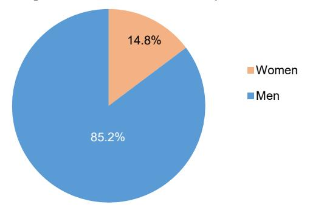

### 2.2 ព្រឹទ្ធសភា៖ ចំនួនសមាជិក តាមគណៈកម្មការឆ្នាំ ២០១៣-២០១៦

Senate: Number of members by commission, 2013-2016

|                                 |        | Number   |       | Percent |          |       |  |
|---------------------------------|--------|----------|-------|---------|----------|-------|--|
| Committee                       | Male   | Female   | Both  | Male    | Female   | Both  |  |
|                                 | Iviaic | Telliale | sexes | Maic    | Telliale | sexes |  |
| President of Senate             | 1      | 0        | 1     | 100.0   | 0.0      | 100.0 |  |
| Vice President of Senate        | 2      | 0        | 2     | 100.0   | 0.0      | 100.0 |  |
| First Committee 1               | 4      | 1        | 5     | 80.0    | 20.0     | 100.0 |  |
| Second Committee 2              | 5      | 0        | 5     | 100.0   | 0.0      | 100.0 |  |
| Third Committee 3               | 4      | 1        | 5     | 80.0    | 20.0     | 100.0 |  |
| Fourth Committee 4              | 5      | 0        | 5     | 100.0   | 0.0      | 100.0 |  |
| Fifth Committee 5               | 3      | 2        | 5     | 60.0    | 40.0     | 100.0 |  |
| Sixth Committee 6               | 5      | 0        | 5     | 100.0   | 0.0      | 100.0 |  |
| Seventh Committee 7             | 4      | 1        | 5     | 80.0    | 20.0     | 100.0 |  |
| Eighth Committee 8              | 2      | 3        | 5     | 40.0    | 60.0     | 100.0 |  |
| Ninth Committee 9               | 5      | 0        | 5     | 100.0   | 0.0      | 100.0 |  |
| Senate Members Beyond Committee | 12     | 1        | 13    | 92.3    | 7.7      | 100.0 |  |
| Total                           | 52     | 9        | 61    | 85.2    | 14.8     | 100.0 |  |

Source: Senate of Cambodia

Note:

- 1/ Commission on Protection of Human Right and Reception of Complaints, and Investigation
- 2/ Commission on Finance, Banking and Audit
- 3/ Commission on Planning Investment, Agricultural Development and Environment
- 4/ Commission on Interior, National Defense and Anti-Corruption
- 5/ Commission on Foreign Affairs and International Cooperation, and Information and Media
- 6/ Commission on Legislation and Judiciary
- 7/ Commission on Education Religious Affairs and Culture and Truism
- 8/ Commission on Public Health, Social Affairs, Veteran, Youth Rehabilitation, Employment, Vocational Training and Women Affairs
- 9/ Commission on Public Works, Transport, Civil Aviation, Post, Telecommunication, Industry, Mines, Energy, Commerce, Land

Management, Urbanization and Construction

2.3 ព្រឹទ្ធសភា ៖ ចំនួនសមាជិក តាមមណ្ឌល និងគណបក្ស ឆ្នាំ ២០១៣-២០១៦ Senate: Number of members by region and party, 2013-2016

| Commission       |        | CPP       |       | FU     | JNCINPI   | EC    |        | SRP    |       | Total  |           |       |
|------------------|--------|-----------|-------|--------|-----------|-------|--------|--------|-------|--------|-----------|-------|
| Commission       | Male   | Female    | Both  | Male   | Female    | Both  | Male   | Female | Both  | Male   | Female    | Both  |
|                  | iviaic | 1 Ciliaic | sexes | iviaic | 1 Ciliaic | sexes | iviaic | Temate | sexes | iviaic | 1 Ciliaic | sexes |
| First region 1   | 1      | 3         | 4     | 0      | 1         | 1     | 0      | 1      | 1     | 1      | 5         | 6     |
| Second region 2  | 1      | 4         | 5     | 1      | 1         | 2     | 0      | 1      | 1     | 2      | 6         | 8     |
| Third region 3   | 1      | 3         | 4     | 0      | 1         | 1     | 0      | 0      | 0     | 1      | 4         | 5     |
| Fourth region 4  | 0      | 8         | 8     | 0      | 2         | 2     | 0      | 0      | 0     | 0      | 10        | 10    |
| Fifth region 5   | 0      | 6         | 6     | 1      | 0         | 1     | 0      | 0      | 0     | 1      | 6         | 7     |
| Sixth region 6   | 1      | 5         | 6     | 0      | 1         | 1     | 0      | 0      | 0     | 1      | 6         | 7     |
| Seventh region 7 | 1      | 6         | 7     | 0      | 1         | 1     | 0      | 0      | 0     | 1      | 7         | 8     |
| Eighth region 8  | 1      | 4         | 5     | 0      | 1         | 1     | 0      | 0      | 0     | 1      | 5         | 6     |
| Total            | 6      | 39        | 45    | 2      | 8         | 10    | 0      | 2      | 2     | 8      | 49        | 57    |

Source: Senate of Cambodia

Note:

1/ First region: Phnom Penh2/ Second: Kampong Cham3/ Third region: Kandal

4/ Fourth region: Battambang, Banteay Meanchey, Siem Reap, Oddar Meanchey and Pailin

5/ Fifth region: Takeo, Kampot and Kep 6/ Six region: Prey Veng and Svay Rieng

7/ Seventh region: Kampong Speu, Kampong Chhnang, Pursat, Koh Kong and Preah Sihanouk

8/ Eight region: Kampong Thom, Preah Vihear, Kratie, Stung Treng, Ratanak Kiri and Mondul Kiri

2.4 ព្រឹទ្ធសភា ៖ ចំនួនអាសនៈ តាមមណ្ឌល និងគណបក្ស ២០១៣-២០១៦ Senate: Number of seats by region and party, 2013-2016

| Provin Province  |     |           | Party |       |
|------------------|-----|-----------|-------|-------|
| FIOVIII TIOVINEC | CPP | FUNCINPEC | SRP   | Total |
| Banteay Meanchey | 4   | 1         | 1     | 6     |
| Battambang       | 5   | 1         | 2     | 8     |
| Kampong Cham     | 8   | 5         | 5     | 18    |
| Kampong Chhnang  | 3   | 1         | 0     | 4     |
| Kampong Speu     | 4   | 1         | 1     | 6     |
| Kampong Thom     | 4   | 1         | 1     | 6     |
| Kampot           | 3   | 2         | 1     | 6     |
| Kandal           | 5   | 3         | 3     | 11    |
| Koh Kong         | 1   | 0         | 0     | 1     |
| Kratie           | 2   | 1         | 0     | 3     |
| Mondul Kiri      | 1   | 0         | 0     | 1     |
| Phnom Penh       | 4   | 2         | 6     | 12    |
| Preah Vihear     | 1   | 0         | 0     | 1     |
| Prey Veng        | 6   | 3         | 2     | 11    |
| Pursat           | 3   | 1         | 0     | 4     |
| Ratanak Kiri     | 1   | 0         | 0     | 1     |
| Siem Reap        | 4   | 0         | 2     | 6     |
| Preah Sihanouk   | 1   | 0         | 0     | 1     |
| Stung Treng      | 1   | 0         | 0     | 1     |
| Svay Rieng       | 4   | 1         | 0     | 5     |
| Takeo            | 5   | 2         | 1     | 8     |
| Oddar Meanchey   | 1   | 0         | 0     | 1     |
| Kep              | 1   | 0         | 0     | 1     |
| Pailin           | 1   | 0         | 0     | 1     |
| Total            | 73  | 26        | 24    | 123   |

Source: Senate of Cambodia

2 5 រដ្ឋសភា ៖ ចំនួនអាសនៈ តាមគណបក្ស ភេទ និងអាណត្តិ

National Assembly: Number of seats by party sex and mandate

| National Assemb          | •        | Number o   |        |       |          |       | In percent |       |
|--------------------------|----------|------------|--------|-------|----------|-------|------------|-------|
| Party                    | Number   | M-1-       | F1.    | Both  | Share of | M-1-  | F1.        | Both  |
| •                        | of Seats | Male       | Female | sexes | Total    | Male  | Female     | sexes |
| Fifth Legislature 5      | 123      | 99         | 24     | 123   | 100      | 80.50 | 19.50      | 100   |
| Cambodian People's Party | 68       | <i>5</i> 1 | 17     | 68    | 55.2     | 41.50 | 13.80      | 55.30 |
| (CPP)                    | 68       | 51         | 17     | 80    | 55.3     | 41.50 | 13.80      | 33.30 |
| Cambodia National        | 55       | 48         | 7      | 55    | 44.7     | 39.00 | 5.70       | 44.70 |
| Rescue Party (CNRP)      | 33       | 40         | /      | 33    | 44.7     | 39.00 | 3.70       | 44.70 |
| Fourth Legislature 4     | 123      | 97         | 26     | 123   | 100      | 78.90 | 21.10      | 100   |
| Cambodian People's Party | 90       | 70         | 20     | 90    | 73.2     | 56.90 | 16.30      | 73.20 |
| (CPP)                    | 90       | 70         | 20     | 90    | 73.2     |       | 10.50      |       |
| Sam Rainsy Party (SRP)   | 26       | 20         | 6      | 26    | 21.1     | 16.30 | 4.90       | 21.10 |
| Human Right Party (HRP)  | 3        | 3          | 0      | 3     | 2.4      | 2.40  | 0.00       | 2.40  |
| FUNCINPEC                | 2        | 2          | 0      | 2     | 1.6      | 1.60  | 0.00       | 1.60  |
| Norodom Ranarith Party   | 2        | 2          | 0      | 2     | 1.6      | 1.60  | 0.00       | 1.60  |
| (NRP)                    |          |            |        |       | 1.0      |       |            | 1.00  |
| Third Legislature 3      | 123      | 98         | 25     | 123   | 100      | 79.70 | 20.30      | 100   |
| Cambodian People's Party | 73       | 59         | 14     | 73    | 59.4     | 48.00 | 11.40      | 59.40 |
| (CPP)                    |          |            | 17     |       |          |       |            |       |
| FUNCINPEC                | 26       | 20         | 6      | 26    | 21.1     | 16.30 | 4.90       | 21.10 |
| Sam Rainsy Party         | 24       | 19         | 5      | 24    | 19.5     | 15.50 | 4.10       | 19.50 |
| Second Legislature 2     | 122      | 107        | 15     | 122   | 100      | 87.70 | 12.30      | 100   |
| Cambodian People's Party | 64       | 56         | 8      | 64    | 52.5     | 45.90 | 6.60       | 52.50 |
| (CPP)                    | 04       | 30         | 0      | 04    | 32.3     | 75.70 | 0.00       |       |
| FUNCINPEC                | 43       | 37         | 6      | 43    | 35.3     | 30.30 | 4.90       | 35.30 |
| Sam Rainsy Party         | 15       | 14         | 1      | 15    | 12.3     | 11.50 | 0.80       | 12.30 |
| First Legislature 1      | 120      | 113        | 7      | 120   | 100      | 94.20 | 5.80       | 100   |
| FUNCINPEC                | 58       | 54         | 4      | 58    | 48.3     | 45.00 | 3.30       | 48.30 |
| Cambodian People's Party | 51       | 48         | 3      | 51    | 42.5     | 40.00 | 2.50       | 42.50 |
| (CPP)                    | 31       | 10         | 3      | 31    | 12.3     | 10.00 | 2.30       | 12.50 |
| Buddhist Liberal         | 10       | 10         | 0      | 10    | 8.3      | 8.30  | 0.00       | 8.30  |
| Democratic Party         |          |            |        |       |          |       |            |       |
| MOLINAKA                 | 1        | 1          | 0      | 1     | 0.8      | 0.80  | 0.00       | 0.80  |

Source: National Assembly of Cambodia

Note:

5/ The Fifth General Election was held on 28 July 2013 with 11 political parties competing for 123 seats in 24 constituencies.

The term of legislature is for 5 years.

4/ The Fourth General Election was held on 27 July 2008 with 11 political parties competing for 123 seats in 24 constituencies.

The term of legislature is for 5 years.

3/ The Third General Election was held on 27 July 2003 with 27 political parties competing for 123 seats in 24 constituencies.

The term of legislature is for 5 years.

2/ The Second General Election took place on 26 July 1998 with 39 political parties competing for 122 seats in 22 constituencies.

1/ The resolution of the conflict in Cambodia through the Paris Peace Accord of 23 October 1991 provided that the elections be held in order to establish the rule of law and to create a governing institution for the country. As a result, the First General Election was held nationwide on 23 May 1993 to elect a Constitutional Assembly. There were 21 constituencies to elect 120 parliamentarians.

The First General Election was organized by United Nations Transitional Authority in Cambodia (UNTAC).

2.6 រដ្ឋសភា ៖ ចំនួនអាសនៈ តាមខេត្ត គណបក្ស និងអាណត្តិ

National Assembly: Number of seats by province, party and mandate

| Duranium         |     |           | 2008 |     |     |       |     | 2013 |       |
|------------------|-----|-----------|------|-----|-----|-------|-----|------|-------|
| Province         | CPP | FUNCINPEC | SRP  | HRP | NRP | Total | CPP | CNRP | Total |
| Banteay Meanchey | 4   | 1         | 1    | 0   | 0   | 6     | 4   | 2    | 6     |
| Battambang       | 6   | 0         | 2    | 0   | 0   | 8     | 5   | 3    | 8     |
| Kampong Cham     | 11  | 0         | 5    | 1   | 1   | 18    | 8   | 10   | 18    |
| Kampong Chhnang  | 3   | 0         | 1    | 0   | 0   | 4     | 2   | 2    | 4     |
| Kampong Speu     | 5   | 0         | 1    | 0   | 0   | 6     | 3   | 3    | 6     |
| Kampong Thom     | 4   | 1         | 1    | 0   | 0   | 6     | 3   | 3    | 6     |
| Kampot           | 5   | 0         | 1    | 0   | 0   | 6     | 3   | 3    | 6     |
| Kandal           | 7   | 0         | 3    | 1   | 0   | 11    | 5   | 6    | 11    |
| Koh Kong         | 1   | 0         | 0    | 0   | 0   | 1     | 1   | 0    | 1     |
| Kratie           | 2   | 0         | 1    | 0   | 0   | 3     | 2   | 1    | 3     |
| Mondul Kiri      | 1   | 0         | 0    | 0   | 0   | 1     | 1   | 0    | 1     |
| Phnom Penh       | 7   | 0         | 5    | 0   | 0   | 12    | 5   | 7    | 12    |
| Preah Vihear     | 1   | 0         | 0    | 0   | 0   | 1     | 1   | 0    | 1     |
| Prey Veng        | 7   | 0         | 2    | 1   | 1   | 11    | 5   | 6    | 11    |
| Pursat           | 4   | 0         | 0    | 0   | 0   | 4     | 3   | 1    | 4     |
| Ratanak Kiri     | 1   | 0         | 0    | 0   | 0   | 1     | 1   | 0    | 1     |
| Siem Reap        | 5   | 0         | 1    | 0   | 0   | 6     | 4   | 2    | 6     |
| Preah Sihanouk   | 1   | 0         | 0    | 0   | 0   | 1     | 1   | 0    | 1     |
| Stung Treng      | 1   | 0         | 0    | 0   | 0   | 1     | 1   | 0    | 1     |
| Svay Rieng       | 5   | 0         | 0    | 0   | 0   | 5     | 3   | 2    | 5     |
| Takeo            | 6   | 0         | 2    | 0   | 0   | 8     | 4   | 4    | 8     |
| Oddar Meanchey   | 1   | 0         | 0    | 0   | 0   | 1     | 1   | 0    | 1     |
| Kep              | 1   | 0         | 0    | 0   | 0   | 1     | 1   | 0    | 1     |
| Pailin           | 1   | 0         | 0    | 0   | 0   | 1     | 1   | 0    | 1     |
| Total            | 90  | 2         | 26   | 3   | 2   | 123   | 68  | 55   | 123   |

Source: National Assembly of Cambodia

### 🥦 🛪 រាជរដ្ឋាភិបាល ៖ ចំនួនសមាជិករាជរដ្ឋាភិបាល តាមអាណត្តិ

Royal government: Number of government member by mandate

| Mandate Mandata                                 |      | Number                 |     |       | In percent% | 6          |
|-------------------------------------------------|------|------------------------|-----|-------|-------------|------------|
| Mandate Mandate                                 | Male | Male Female Both sexes |     | Male  | Female      | Both sexes |
| Fourth Mandate                                  |      |                        |     |       |             |            |
| Prime Minister                                  | 1    | 0                      | 1   | 100.0 | 0.0         | 100.0      |
| Deputy Prime Minister                           | 9    | 1                      | 10  | 90.0  | 10.0        | 100.0      |
| Senior Minister                                 | 16   | 0                      | 16  | 100.0 | 0.0         | 100.0      |
| Minister 2                                      | 24   | 2                      | 26  | 92.3  | 7.7         | 100.0      |
| Secretary of State 1                            | 183  | 13                     | 196 | 93.4  | 6.6         | 100.0      |
| Fifth Mandate                                   |      |                        |     |       |             |            |
| Prime Minister                                  | 1    | 0                      | 1   | 100.0 | 0.0         | 100.0      |
| Deputy Prime Minister                           | 8    | 1                      | 9   | 88.9  | 11.1        | 100.0      |
| Senior Minister                                 | 15   | 0                      | 15  | 100.0 | 0.0         | 100.0      |
| Minister 2                                      | 27   | 2                      | 29  | 93.1  | 6.9         | 100.0      |
| Secretary of State 1                            | 147  | 31                     | 178 | 82.6  | 17.4        | 100.0      |
| Delegate Minister Attached to Prime Minister | 13   | 0                      | 13  | 100.0 | 0.0         | 100.0      |

Source: List of Membership of President; Deputy President; Director and Deputy Director of Skill Committee of National Assembly and Membership of Royal Government of Cambodia

1/ Including State Secretariat under the Council of Ministers, which include the State Secretariat for Public Civil Service and State Secretariat of Civil Aviation

2/ The number of Ministers is double counted in case of some Deputy Prime Ministers and Senior Minister in the position of Minister.

2.8 រាជរដ្ឋាភិបាល ៖ ចំនួនមន្ត្រីរាជការស៊ីវិល តាមក្រសួង និងរដ្ឋលេខាធិការដ្ឋាន
Royal government: Number of public civil servant by ministry and state secretariat

| , b                                                  | 1       |         | <i>y</i> |           |         |         |
|------------------------------------------------------|---------|---------|----------|-----------|---------|---------|
| Ministry and state secretariat                       | 2011    | 2012    | 2013     | 2014      | 2015    | 2016    |
| Council of Ministers                                 | 1,909   | 2,214   | 2,394    | 1,863     | 2,074   | 2,233   |
| Royal Palace                                         | 338     | 350     | 366      | 399       | 425     | 468     |
| Tourism                                              | 936     | 911     | 906      | 926       | 967     | 1,001   |
| Education, Youth and Sport                           | 105,469 | 108,437 | 111,310  | 112,311   | 111,931 | 114,554 |
| Commerce                                             | 1,604   | 1,566   | 1,541    | 1,564     | 1,547   | 1,562   |
| Rural Development                                    | 1,938   | 1,834   | 1,839    | 1,790     | 1,700   | 1,687   |
| Culture and Fine Arts                                | 2,667   | 2,550   | 2,531    | 2,539     | 2,379   | 2,315   |
| Environment                                          | 1,309   | 1,257   | 1,265    | 1,312     | 1,275   | 1,292   |
| Industry, Mines and Energy                           | 1,451   | 1,371   | 1,400    | 1,164     | 920     | 943     |
| Water Resources and Meteorology                      | 1,316   | 1,280   | 1,275    | 1,319     | 1,305   | 1,281   |
| Women's Affairs                                      | 885     | 855     | 964      | 1,067     | 1,012   | 991     |
| Foreign Affairs and International                    | 410     | 397     | 401      | 405       | 423     | 403     |
| Cooperation                                          | 410     | 397     | 401      | 403       | 423     | 403     |
| Interior                                             | 11,366  | 11,273  | 11,111   | 11,220    | 11,502  | 11,772  |
| Information                                          | 1,768   | 1,703   | 1,732    | 1,732     | 1,693   | 1,693   |
| Agriculture, Forestry and Fisheries                  | 7,099   | 6,785   | 6,668    | 6,589     | 6,342   | 6,215   |
| Justice                                              | 1,075   | 1,186   | 1,208    | 1,349     | 1,427   | 1,478   |
| Planning                                             | 1,598   | 1,510   | 1,549    | 1,650     | 1,745   | 1,796   |
| Health                                               | 17,452  | 17,255  | 17,553   | 18,757    | 19,835  | 19,694  |
| Cults and Religion                                   | 683     | 699     | 717      | 831       | 977     | 1,091   |
| Social Affairs, Veterans and Youth Rehabilitation | 1,550   | 1,510   | 1,594    | 1,552     | 1,633   | 1,628   |
| National Assembly, Senate Relations and Inspection   | 539     | 524     | 524      | 622       | 745     | 735     |
| Public Works and Transport                           | 3,274   | 3,453   | 3,445    | 3,421     | 3,428   | 3,328   |
| Land Management, Urbanization and Construction       | 2,321   | 2,280   | 2,261    | 2,953     | 2,923   | 2,885   |
| Post and Telecommunication                           | 871     | 713     | 647      | 828       | 982     | 949     |
| Economy and Finance                                  | 4,502   | 4,448   | 4,420    | 4,663     | 4,459   | 5,399   |
| Labor and Vocational Training                        | 2382    | 2,590   | 2,824    | 2,960     | 3,163   | 3,424   |
| Civil Service                                        | 211     | 204     | 201      | 288       | 628     | 645     |
| Mines and Power                                      | 0       | 0       | 0        | 356       | 678     | 682     |
| Anti-Corruption Unit                                 | 0       | 91      | 135      | 163       | 219     | 272     |
| State Secretariat of Civil Aviation                  | 541     | 535     | 539      | 564       | 602     | 621     |
| Total                                                | 177,464 | 179,781 | 183,320  | 187,157   | 188,939 | 193,037 |
| ~ 7 1 1 1 1 1 1                                      | 1 ~ ~   | . ~     | ~ : /    | . ~! !! ~ |         |         |

Source: Based on reports by Ministries and State Secretariats, State Secretariat for Civil Service

Note: Excluding Ministry of National Defense.

195,000 193,037 188,939 190,000 187,157 185,000 183,320 179,781 180,000 177,464 175,000 170,000 165,000 2011 2012 2014 2013 2015 2016

Figure 2.2 Number of government public civil servants

9 រាជរដ្ឋាភិបាល ៖ ចំនួនមន្ត្រីរាជការស៊ីវិលនៅថ្នាក់ខេត្ត តាមមន្ទីរ Royal government: Number of public civil servant at provincial level by department

| Department                                           | 2011    | 2012    | 2013    | 2014    | 2015    | 2016    |
|------------------------------------------------------|---------|---------|---------|---------|---------|---------|
| Tourism                                              | 365     | 354     | 350     | 365     | 425     | 444     |
| Education, Youth and Sport                           | 102,788 | 105,752 | 108,483 | 109,394 | 109,064 | 111,630 |
| Commerce                                             | 510     | 497     | 452     | 425     | 416     | 403     |
| Rural Development                                    | 1,385   | 1,320   | 1,290   | 1,292   | 1,175   | 1,163   |
| Culture and Fine Arts                                | 1,096   | 1,037   | 1,009   | 1,019   | 949     | 909     |
| Environment                                          | 789     | 757     | 749     | 760     | 692     | 664     |
| Industry, Mines and Energy                           | 830     | 779     | 746     | 681     | 447     | 451     |
| Water Resources and Meteorology                      | 626     | 611     | 583     | 554     | 490     | 473     |
| Women's Affairs                                      | 605     | 587     | 663     | 770     | 723     | 710     |
| Interior                                             | 8,364   | 8,296   | 8,129   | 8,242   | 8,190   | 8,379   |
| Information                                          | 698     | 665     | 657     | 652     | 616     | 623     |
| Agriculture, Forestry and Fisheries                  | 2,833   | 2,704   | 2,629   | 2,555   | 2,402   | 2,360   |
| Justice                                              | 825     | 799     | 812     | 936     | 918     | 964     |
| Planning                                             | 863     | 800     | 823     | 880     | 953     | 919     |
| Health                                               | 13,647  | 13,542  | 13,955  | 15,124  | 16,198  | 16,111  |
| Cults and Religion                                   | 411     | 418     | 436     | 541     | 636     | 705     |
| Social Affairs, Veterans and Youth Rehabilitation | 1,046   | 1,001   | 1,005   | 994     | 985     | 957     |
| National Assembly, Senate Relations and Inspection   | 212     | 206     | 203     | 248     | 337     | 328     |
| Public Works and Transport                           | 1,904   | 1,789   | 1,781   | 1,802   | 1,856   | 1,871   |
| Land Management, Urbanization and Construction       | 1,671   | 1,641   | 1,617   | 2,257   | 2,266   | 2,232   |
| Post and Telecommunication                           | 499     | 348     | 340     | 355     | 436     | 414     |
| Economy and Finance                                  | 606     | 575     | 573     | 614     | 543     | 565     |
| Labor and Vocational Training                        | 1,248   | 1,333   | 1,450   | 1,507   | 1,584   | 1,704   |
| Mines and Power                                      | 0       | 0       | 0       | 79      | 299     | 306     |
| Civil Service                                        | NA      | NA      | NA      | NA      | 208     | 169     |
| Total                                                | 143,821 | 145,811 | 148,735 | 152,046 | 152,808 | 155,454 |

Source: Based on reports by Ministries and State Secretariats, State Secretariat for Civil Service

Note: Excluding Ministry of National Defense

3

# ឆ្ងាំំំំំំំំំំំំំំំំំំំំំំំំំំំំំំំំំំំំ

### **Public Finance**

ស្ថិតិហិរញ្ញវត្ថុសាធារណៈត្រូវបានផលិតប្រចាំខែជាមូលដ្ឋានដោយក្រសួងសេដ្ឋកិច្ច និងហិរញ្ញវត្ថុ ដោយផ្អែកលើប្រភព ទិន្នន័យពីរតនាគារជាតិ និងនាយកដ្ឋានផ្សេងៗទៀតក្នុងក្រសួងសេដ្ឋកិច្ច និងហិរញ្ញវត្ថុ។ សម្រាប់ព័ត៌មានលម្អិតបន្ថែមទៀត សូមយោងទៅលើរបាយការណ៍អនុវត្តន៍ថវិការដ្ឋប្រចាំខែរបស់ក្រសួងសេដ្ឋកិច្ច និងហិរញ្ញវត្ថុ។

យោងតាមទិន្នន័យដែលបានផ្តល់ដោយក្រសួងសេដ្ឋកិច្ច និងហិរញ្ញវត្ថុ ប្រាក់ចំណូលសរុបរបស់រដ្ឋាភិបាលសម្រាប់ឆ្នាំ ២០១៥ មានចំនួន ១៦.២២៩,២ ពាន់លានរៀលបើប្រៀបធៀបទៅនឹងឆ្នាំ២០១៤ ចំនួន ១៥.៨០៩,៥ ពាន់លានរៀល កើន ឡើងប្រមាណ ៣,០ ភាគរយ។

ចំណូលពន្ធសរុបបានកើនឡើង ១៦,១ ភាគរយពី ៩.៣៣៦,៥ ៣ន់លានរៀល នៅឆ្នាំ២០១៤ ដល់ ១០.៨៣៩,៨ ៣ន់លានរៀល នៅឆ្នាំ២០១៥។ ការកើនឡើងនៃចំណូលពន្ធ គឺដោយសារចំណូលពីពន្ធប្រយោល និងពន្ធពាណិជ្ជកម្ម។ ចំណូលពន្ធក្នុងស្រុកដែលទទួលបានពីពន្ធផ្ទាល់មាន ៤.៨៣១,២ ពាន់លានរៀលនៅឆ្នាំ២០១៥និង ៧.៤៥៣,២ ពាន់លានរៀលនៅឆ្នាំ ២០១៤។ ការរួមចំណែកសំខាន់ចំពោះការកើនឡើងនេះ គឺពន្ធលើប្រាក់ចំណេញ ពន្ធលើដីធ្លី និងអចលនទ្រព្យ។ ពន្ធប្រយោលបាន កើនឡើង ៧,៤ ភាគរយ ពី ៣.៤១៥,៥ ពាន់លានរៀល នៅឆ្នាំ២០១៤ ដល់ ៣.៦៤០,៤ ពាន់លានរៀល នៅឆ្នាំ២០១៥។ ការរួម ចំណែកសំខាន់ចំពោះការកើនឡើងនេះបណ្តាលមកពីពន្ធអាករ និងពន្ធលើតម្លៃបន្ថែម (VAT)។ ពន្ធលើពាណិជ្ជកម្មអន្តរជាតិបានកើន ឡើងពី ១.៤៤៣,៣ ពាន់លានរៀល នៅឆ្នាំ២០១៤ ដល់ ២.០០៤,៦ ពាន់លានរៀល នៅឆ្នាំ២០១៥។ កត្តាសំខាន់នៃការកើន ឡើងនេះ គឺការនាំចេញ និងពន្ធនាំចូលដែលមានការកើនឡើងខ្លាំងពីពន្ធលើប្រេងនាំចូល។

ប្រាក់ចំណូលមិនមែនពន្ធបានថយចុះប្រមាណ ៣២,៣ ភាគរយ ពី ២.០៧៥,៩ ពាន់លានរៀល នៅឆ្នាំ២០១៤ ដល់ ១.៤០៥,៨ ពាន់លានរៀល នៅឆ្នាំ២០១៥។ ចំណូលមូលធនពីប្រភពដោយផ្ទាល់បានថយចុះពី ១៨៤ ពាន់លានរៀល នៅឆ្នាំ២០១៤ ដល់ ១២១,៤ ពាន់លានរៀល នៅឆ្នាំ២០១៥។

ការចំណាយសរុបរបស់រដ្ឋាភិបាល សម្រាប់ឆ្នាំ២០១៥មានប្រមាណ ១៤.៣១១,៦ ពាន់លានរៀល បើប្រៀបធៀបទៅនឹង ១៣.៩៧៤,៣ ពាន់លានរៀល នៅឆ្នាំ២០១៤ ដែលកើនឡើង ២,៤ ភាធយ។ ការចំណាយបច្ចុប្បន្នបានកើនឡើងប្រមាណ ៧,៦ ភាធយ ពី ៤.៤២២,៦ ពាន់លានរៀល នៅឆ្នាំ២០១៤ ដល់ ៩.០៦៦,៤ ពាន់លានរៀល នៅឆ្នាំ២០១៥ ដែលការចំណាយផ្នែកការពារជាតិ និងសន្តិសុខ កើនឡើង ៩,៤ ភាគរយ។ ការចំណាយរដ្ឋបាលស៊ីវិលបានកើនឡើង ៣,៥ ភាគរយ ដែលក្នុងនោះ ការចំណាយលើប្រាក់បៀវត្សរ៍ បានកើនឡើងប្រមាណ ១៧,៣ ភាគរយ ខណៈដែលការចំណាយលើរដ្ឋបាលស៊ីវិលបានថយចុះបន្តិច ៤,៩ ភាគរយ។ ការ ចំណាយលើការប្រាក់ក៏បានថយចុះ ៤៩,៤ ភាគរយជងដែរ នៅឆ្នាំ២០១៥។ ការចំណាយមូលធនបានកើនឡើងពី ៥.៥៥១,៧ ពាន់លានរៀល នៅឆ្នាំ២០១៥ ដល់ ៥.២៤៤,៤ ពាន់លានរៀល នៅឆ្នាំ២០១៥ ដែលបានថយចុះ ៥,៥ ភាគរយ។

Public or government finance statistics are produced by the Ministry of Economy and Finance (MEF) on a monthly basis and are based on data source from the National Treasury and other departments within MEF. For more detailed statistics should refer to the MEF monthly State Budget Implementation Report.

According to data furnished by MEF, total government revenue for 2015 was 16,229.2 billion Riels, compared to 15,809.5 billion Riels in 2014 increased by 3.0 percent.

Total tax revenue increased 16.1 percent from 9,336.5 billion Riels in 2014 to 10,839.8 billion Riels in 2015. The main increase of tax revenue was due to revenue from indirect and trade taxes. Domestic tax revenue from direct taxes was 8,831.2 billion Riels in 2015 and 7,453.2 billion Riels in 2014. The main contributors to the increases were profit taxes, land and property tax. Indirect taxes increased by 7.8 percent from 3,415.5 billion Riels in 2014 to 3,680.4 billion Riels in 2015. The main contributors to this increase caused from excise taxes and value added taxes (VAT). Taxes on international trade increased from 1,883.3 billion Riels in 2014 to 2,008.6 billion Riels in 2015. The main factors of this increase were mainly export and import taxes with the major increase from taxes on imported petroleum.

Non-tax revenue decreased about 32.3 percent from 2,075.9 billion Riels in 2014 to 1,405.8 billion Riels in 2015. Capital revenue from direct sources decreased from 184 billion Riels in 2014 to 121.4 billion Riels in 2015.

Overall government expenditure for 2015 was about 14,311.6 billion Riels, compared to 13,974.3 billion Riels in 2014, which is increased by 2.4 percent. Current expenditure increased about 7.6 percent from 8,422.6 billion Riels in 2014 to 9,066.8 billion Riels in 2015, of which defense and security expenditure increased by 9.8 percent. Civil administration expenditure increased by 3.5 percent, of which salaries payment increased about 17.3 percent while other payment in civil administration slightly decreased 4.9 percent. Interest payments also decreased 49.8 percent in 2015. Capital expenditure increased from 5,551.7 billion Riels in 2018 to 5,244.8 billion Riels in 2015, which is decreased by 5.5 percent.

3.1 ចំណូលរដ្ឋ គិតជា៣ន់លានរៀល
Central government revenue, in billion Riels

| Central government revenue, in billion Riels                                                                    | 2011                      | 2012                   | 2013                      | 2014                     | 2015                     |
|-----------------------------------------------------------------------------------------------------------------|---------------------------|------------------------|---------------------------|--------------------------|--------------------------|
| Total budget revenue (I+II)                                                                                     | 10,070.3                  | 12,256.6               | 13,342.3                  | 15,809.5                 | 16,229.2                 |
| I. Total budget revenue through NT^(A+B)                                                                        | <b>6,666.8</b> 6,444.8 | <b>8,261.7</b> 8,143.5 | <b>9,054.4</b> 8,773.8 | <b>11,613.2</b> 11,596.4 | <b>12,508.8</b> 12,367.0 |
| o/w Domestic revenue A. Current revenue (Group1+Group2)                                                         | 6,368.3                   | 7,892.7                | 8,705.6                   | 11,412.4                 | 12,367.0                 |
| Group1: Real revenue (Type1+Type2)                                                                              | 6,368.3                   | 7,892.7                | 8,705.6                   | 11,412.4                 | 12,245.6                 |
| Type1: Tax revenue                                                                                              | 5,304.9                   | 6,443.3                | 7,288.9                   | 9,336.5                  | 10,839.8                 |
| Domestic tax revenue                                                                                            | 4,098.7                   | 5,109.9                | 5,795.9                   | 7,453.2                  | 8,831.2                  |
| Direct Tax (income tax, profits tax)  Tax on profits (physical person) (On income profits conital gain          | -                         | -                      | -                         | -                        | 2,472.1                  |
| Tax on profits (physical person)/On income, profits, capital gain - persons                                     | 235.8                     | 299.2                  | 377.4                     | 484.8                    | 161.4                    |
| Tax on salary / Withholdings tax on salaries                                                                    | 184.7                     | 234.2                  | 300.7                     | 389.9                    | 462.4                    |
| On real estate income                                                                                           | 51.2                      | 65.1                   | 76.7                      | 94.9                     | -                        |
| Tax on profits (legal person) / On income, profits, capital gain -                                              | 723.8                     | 976.8                  | 1,184.0                   | 1,480.1                  | 1,680.1                  |
| companies                                                                                                       | , 25.0                    | ,,0.0                  | 1,10                      | 1,10011                  | 1,000.1                  |
| Tax on rental of movable and immovable properties (physical person) / On profits of public enterprises          | 76.5                      | 59.9                   | 84.1                      | 103.2                    | 130.2                    |
| On profits of private enterprises                                                                               | 639.1                     | 906.7                  | 1,083.2                   | 1,343.0                  | _                        |
| On real estate income                                                                                           | 8.2                       | 10.2                   | 16.8                      | 33.9                     | -                        |
| Indirect Tax: General taxes on goods and services                                                               | 1,943.1                   | 2,399.6                | 2,705.5                   | 3,415.5                  | 3,680.4                  |
| Turnover tax, domestic schedule: priv. Ent.                                                                     | 22.9                      | 24.3                   | 25.9                      | 26.0                     | 27.4                     |
| VAT                                                                                                             | 22.2                      | 21.9                   | 25.8                      | 27.0                     | 1,317.6                  |
| VAT, domestic schedule: public enterprises VAT, domestic schedule: private enterprises                          | 23.2 648.1             | 21.8 867.4          | 1,047.3                   | 37.0 1,135.5          | -                        |
| VAT, domestic schedule: private enterprises VAT, import schedule: oil companies                                 | 418.8                     | 493.5                  | 520.2                     | 582.4                    | 575.6                    |
| VAT, import schedule: non-oil petroleum co.                                                                     | 732.1                     | 867.3                  | 977.9                     | 1,359.3                  | 1,568.4                  |
| VAT, import agriculture goods and equipment                                                                     | <u> </u>                  | -                      | -                         | 275.3                    | 191.4                    |
| Excise Tax: Taxes on specific goods and services                                                                | 1,035.3                   | 1,261.3                | 1,339.2                   | 1,856.6                  | 2,432.0                  |
| On specific merchandise: domestic schedule                                                                      | 245.6 233.2            | 303.6 263.3         | 356.1 264.2            | 409.3 286.7           | 479.5 292.6           |
| On specific merchandise: import schedule oil products On specific merchandise: import schedule non-oil products | 556.5                     | 694.5                  | 719.0                     | 1,160.5                  | 1,590.0                  |
| Excise tax on specific services (Domestic)                                                                      | -                         | -                      | 717.0                     | 1,100.5                  | 70.0                     |
| Taxes on specific services                                                                                      | 128.2                     | 136.5                  | 152.1                     | 159.5                    | 141.6                    |
| Casino tax                                                                                                      | -                         | -                      | -                         | -                        | 140.5                    |
| Lottery tax                                                                                                     | -                         | -                      | -                         | -                        | 1.2                      |
| Other specific taxes on goods & services                                                                        | 58.0 16.7              | 56.8 17.4           | 61.0 13.5              | 63.0 19.8             | 25.0                     |
| Taxes on goods & services or activities Revenue from local permit                                               | 16.7                      | 17.4                   | 13.5                      | 19.8                     | 25.0                     |
| Other tax revenue                                                                                               | 15.8                      | 19.0                   | 24.2                      | 37.0                     | 80.2                     |
| Stamps                                                                                                          | 3.8                       | 3.6                    | 4.8                       | 6.3                      | 7.5                      |
| Unclassifiable fines and other fiscal penalties                                                                 | 12.1                      | 15.3                   | 19.4                      | 30.6                     | 72.7                     |
| Taxes on international trade                                                                                    | 1,206.2                   | 1,333.4                | 1,493.0                   | 1,883.3                  | 2,008.6                  |
| Taxes and duties on imports Customs duties on imports                                                           | 1,018.2 582.1          | 1,164.3 696.8       | 1,275.1 759.5          | 1,657.9 1,090.6       | 1,827.8 1,253.4       |
| Customs fees                                                                                                    | 15.9                      | 21.3                   | 42.2                      | 52.4                     | 59.0                     |
| Oil product duties                                                                                              | 236.9                     | 238.7                  | 250.8                     | 270.4                    | 261.9                    |
| Additional tax on oil product - Road maintenance                                                                | 173.3                     | 196.1                  | 208.7                     | 224.1                    | 232.5                    |
| Sale of confiscated goods                                                                                       | 0.0                       | 0.4                    | 1.0                       | 2.3                      | 1.1                      |
| Fines Customs duties on pamacine raw materials                                                                  | 9.3                       | 10.2                   | 11.9                      | 16.4 1.8              | 17.8 1.9              |
| Taxes and duties on exports                                                                                     | 188.0                     | 169.1                  | 217.9                     | 225.4                    | 180.8                    |
| Tax on wood exports                                                                                             | 20.6                      | 13.4                   | 46.2                      | 79.0                     | 21.7                     |
| Customs duties on rubber exports                                                                                | 52.4                      | 38.9                   | 42.7                      | 20.7                     | 25.7                     |
| Customs duties on oil export                                                                                    | -                         | - 1.2                  | 1.7                       | - 2.1                    | - 12                     |
| Customs duties on export of other agricultural products Management commissions and export visas                 | 0.9 113.1              | 1.2 115.3           | 1.7 127.1              | 2.1 123.3             | 1.3 131.6             |
| Other fines on export                                                                                           | 1.0                       | 0.2                    | 0.2                       | 0.3                      | 0.5                      |
| Type2: Non-tax revenue                                                                                          | 1.063.4                   | 1,449.4                | 1,416.7                   | 2,075.9                  | 1,405.8                  |
| State Property Revenue                                                                                          | 63.9                      | 147.4                  | 84.1                      | 98.6                     | 93.9                     |
| Concession and rental land                                                                                      | 58.1                      | 140.6                  | 78.3                      | 86.6                     | 78.0                     |
| Fishing concessions                                                                                             | 6.9                       | 3.7                    | 2.8                       | 2.7                      | 2.6                      |
| Forest concessions Petroleum concessions                                                                        | 32.3 0.0               | 27.2 0.0            | 53.4 0.0               | 45.5 0.0              | 19.7 0.0              |
| Mining concessions                                                                                              | 10.0                      | 100.8                  | 13.6                      | 16.0                     | 31.0                     |
| Rent of land (land only)                                                                                        | 8.9                       | 8.9                    | 8.5                       | 22.4                     | 24.7                     |
| Public Enterprises Income                                                                                       | 5.8                       | 6.8                    | 5.8                       | 12.0                     | 15.8                     |
| Dividend from Public Enterprises                                                                                | 5.7                       | 6.7                    | 5.8                       | 11.9                     | 15.8                     |
| Depreciation related transfers                                                                                  | 0.1                       | 0.1                    | 0.0                       | 0.1                      | 0.0                      |
| Income from Sales, Rental of Properties and Services (Sale of goods and services)                               | 596.1                     | 669.8                  | 781.1                     | 978.8                    | 1,167.8                  |
| Income of administrative public enterprises - operational services                                              | 252.5                     | 251.5                  | 200.5                     | 255.5                    | 100 -                    |
| (for profit): Market establishments                                                                             | 253.7                     | 271.5                  | 298.7                     | 357.7                    | 422.5                    |
| Civil aviation                                                                                                  | 62.6                      | 65.2                   | 63.8                      | 90.7                     | 137.1                    |
| Ti                                                                                                              | 1050                      | 123.2                  | 140.4                     | 146.4                    | 150.8                    |
|                                                                                                                 | 105.0                     |                        |                           |                          |                          |
| Cultural activities                                                                                             | 2.5                       | 2.7                    | 4.6                       | 28.4                     | 21.3                     |
| Tourism Cultural activities Post and telecommunications Radio and television                                    | 2.5 80.1               | 2.7 77.7            | 4.6 85.0               | 28.4 81.8             | 21.3 107.1            |
| Cultural activities                                                                                             | 2.5                       | 2.7                    | 4.6                       | 28.4                     | 21.3                     |

3.1 ចំណូលរដ្ឋ គិតជា៣ន់លានរៀល (ត)
Central government revenue, in billion Riels (continued)

| Central government revenue, in billion Riels                                                                        | 2011               | 2012               | 2013               | 2014               | 2015                   |
|---------------------------------------------------------------------------------------------------------------------|--------------------|--------------------|--------------------|--------------------|------------------------|
| Sales of Property of Public Administration                                                                          | 2011               | 2012               | 2013               | 2014               | 46.8                   |
| Other market establishments                                                                                         | 2.9                | 2.3                | 4.2                | 7.6                |                        |
| Nonmarket establishments                                                                                            | 37.8               | 45.6               | 57.3               | 100.1              | -                      |
| Sale of used and damaged materials, study materials: Sale of used                                                   | 0.1                | 0.6                | 0.9                | 0.2                | 0.2                    |
| material and furniture Sale of documents, vignettes, printed material                                               | 14.1               | 15.8               | 0.0                | 41.8               | 46.6                   |
| Other Sales of Property of Public Administration: Rev. from freight                                                 | 14.1               | 13.6               | 0.0                |                    |                        |
| activity                                                                                                            | -                  | -                  | -                  | 0.0                | 0.0                    |
| Revenue from price stabilization activities                                                                         | -                  | -                  | -                  | 0.0                | -                      |
| Health care revenue                                                                                                 | 20.7               | 24.1               | 27.9               | 42.3               | -                      |
| Sale of wrecks, straight animals & abandoned merchandise Other revenue from nonmarket establishments             | 0.1 2.6         | 0.0 5.1         | 0.0 5.5         | 0.0 15.8        | -                      |
| Administrative fees                                                                                                 | 287.7              | 336.3              | 409.0              | 504.2              | 587.4                  |
| Visa and related fees (passport and visa)                                                                           | 221.2              | 260.6              | 280.1              | 310.7              | 403.6                  |
| Political party registration fee                                                                                    | -                  | -                  | -                  | 0.0                | 0.0                    |
| Company registration fee                                                                                            | 2.8                | 2.9                | 8.5                | 14.4               | 18.9                   |
| Examination fees/Commercial signs fee License plate fees                                                         | 1.6 7.6         | 2.1 9.0         | 3.1 25.8        | 1.1 35.2        | 0.8 44.1            |
| Court fees                                                                                                          | 2.6                | 2.4                | 1.6                | 3.0                | 3.1                    |
| Quality and standards inspection fee                                                                                | 48.2               | 55.1               | 78.0               | 104.9              | 114.7                  |
| Revenue from administrative permission, administrative form and                                                     | _                  | _                  | _                  | _                  | 2.3                    |
| other administrative management fees                                                                                |                    |                    |                    | 160                |                        |
| Rental income from invested assets: Rental of immovable properties Rental of public enterprises at central level | 17.0 4.2        | 16.3 5.4        | 16.1 5.2        | 16.8 5.9        | 14.9 4.8            |
| Rental of public enterprises at provincial level (departments)                                                      | 1.5                | 0.3                | 0.0                | 0.0                | 0.0                    |
| Rental of immovable properties (redundancy): Rental income from                                                     |                    |                    |                    |                    |                        |
| buildings                                                                                                           | 11.2               | 10.6               | 10.9               | 10.8               | 10.1                   |
| Other Rental of immovable properties                                                                                | -                  | -                  | -                  | -                  | 0.0                    |
| Service delivery Maintenance commission                                                                             | -                  | -                  | -                  | -                  | 96.2 31.5           |
| Cadastre fee                                                                                                        | 3.8                | 4.1                | 11.8               | 34.9               | 32.8                   |
| Construction fees                                                                                                   | -                  | -                  | -                  | -                  | 7.2                    |
| Juridical record fees                                                                                               | -                  | -                  | -                  | -                  | 1.6                    |
| Revenues from administration and other services                                                                     | -                  | -                  | -                  | -                  | 23.1                   |
| Fines and penalties                                                                                                 | 29.9 29.9       | 9.8 9.8         | 18.0 18.0       | 27.1 27.1       | 24.0 24.0           |
| Fines and penalties Grants and Donations                                                                            | 19.1               | 75.0               | 17.8               | 38.2               | 29.9                   |
| Multilateral grants: From foreign governments                                                                       | #N/A               | 0.0                | 16.0               | 0.0                | 28.6                   |
| Other Grants from other sources: From international organizations                                                   | 19.1               | 75.0               | 1.8                | 38.2               | 1.4                    |
| Gifts and bequest                                                                                                   | 0.0                | 0.0                | 0.0                | 0.0                | 0.0                    |
| Financial Revance Financial expense/Interest income                                                                 | 47.1               | 219.3              | 290.4              | 752.8              | 81.7 75.8           |
| Interest on loans                                                                                                   | 20.0               | 32.0               | 110.5              | 137.8              | 75.8                   |
| Exchange profit                                                                                                     | 24.6               | 183.0              | 173.9              | 582.7              | -                      |
| Sale of security or Gov't bond fee                                                                                  | -                  | -                  | -                  | 0.0                | -                      |
| Other financial revenue                                                                                             | 2.5                | 4.3                | 5.9                | 32.3               | 5.9                    |
| Other and exceptional revenue: Exceptional revenue Exceptional revenue from operating activity                      | 307.3 160.2     | 328.1 184.2     | 225.3 121.3     | 180.4 94.8      | 8.5 0.0             |
| Revenue from transfer of provincial budget surplus                                                                  | 160.1              | 184.2              | 121.3              | 94.8               | 0.0                    |
| Treasury commissions                                                                                                | -                  | -                  | -                  | 0.0                | 0.0                    |
| Privatizations of public enterprises/Proceeds from sales of buildings                                               | 86.9               | 85.4               | 0.3                | 0.0                | 4.2                    |
| Cancelled payment orders                                                                                            |                    | 40.4               | 101.2              | 0.0                | -                      |
| Disposal of fixed assets Other revenue/ Other exceptional revenues                                                  | 57.1 3.1        | 49.4 9.0        | 101.2 2.4       | 74.3 11.3       | 4.3                    |
| B. Total capital revenue (Group1+Group2)                                                                            | 298.6              | 369.0              | 348.8              | 200.8              | 263.2                  |
| Group1: Real revenue (Type1+Type2)                                                                                  | 298.6              | 369.0              | 348.8              | 200.8              | 263.2                  |
| Type1: Direct sources                                                                                               | 76.5               | 250.9              | 68.2               | 184.0              | 121.4                  |
| Other financial investments                                                                                         | 76.5               | 250.9              | 68.2               | 184.0              | 121.4                  |
| Loans (assets) Lending to Public Enterprises                                                                        | 76.5               | 250.9              | 68.2               | 184.0              | 121.4 118.0         |
| Lending to Private Enterprises  Lending to Private Enterprises                                                      | -                  | -                  | -                  | -                  | 3.3                    |
| Type2: External sources operation inside NT                                                                         | 222.0              | 118.1              | 280.7              | 16.8               | 141.8                  |
| Capital support                                                                                                     | -                  | -                  | -                  | -                  | 0.0                    |
| Debt and related liabilities                                                                                        | 2 402 5            | 2 00 5 0           | 4 207 0            | -                  | 141.8                  |
| II. External sources operation Outside NT                                                                           | 3,403.5            | <b>3,995.0</b>     | 4,287.8            | <b>4,196.3</b>     | <b>3,720.4</b> 3,720.4 |
| Operation Outside NT Capital support                                                                             | 3,403.5 1,581.0 | 3,995.0 1,555.8 | 4,287.8 2,404.3 | 4,196.3 1,578.5 | 3,720.4 1,394.2     |
| Bilateral grant for investment expense                                                                              | 1,561.0            | 1,555.6            | 2,404.5            | 1,576.5            | 183.0                  |
| Multilateral grant for investment expense                                                                           | -                  | -                  | -                  | -                  | 1,211.2                |
| Debt and related liabilities                                                                                        | 1,822.5            | 2,439.2            | 1,883.5            | 2,617.8            | 2,326.2                |
| Multilateral                                                                                                        | 93.5               | 144.3              | 63.6 1,819.9    | 476.1              | 373.7                  |
| Bilateral  Fourse Ministry of Foonemy and Finance                                                                   | 1,729.0            | 2,294.9            | 1,819.9            | 2,141.7            | 1,952.5                |

3.2 ការប្រតិបត្តិសេដ្ឋកិច្ចហិរញ្ញវត្ថុរដ្ឋ គិតជាពាន់លានរៀល
Central government finance economic operations, in billion Riels

| Tax department   1,973.2   2,568.9   3,101.8   3,672.6   5,474.2   6   Non-tax department   965.1   1,273.9   1,352.1   2,017.8   Non-tax department   965.1   1,273.9   1,352.1   2,017.8   Non-tax department   765.2   308.2   308.2   201.3   Property Department   765.2   308.2   308.1   201.3   Capital revenue   6,568.3   7,892.7   8,796.6   11,412.4   12   1-1 Jarcel taxes   94.0   1,270.0   1,362.8   1,262.8   1-1 Jbreel taxes   94.0   1,270.0   1,362.8   1,262.8   Profit tax   715.6   966.6   1,412.4   1,462.2   1,462.2   1-1 Jarcel taxes   3,130.1   3,333.3   2,270.6   3,90.5   1-1 Jarcel taxes   3,130.1   3,333.3   2,270.6   3,90.5   1-1 Jarcel taxes   1,202.2   2,273.3   2,273.9   3,90.5   1-1 Jarcel taxes   1,202.2   2,273.3   2,273.9   3,90.5   1-1 Jarcel taxes   1,165.9   1,300.8   1,498.1   1,941.7   2,000.0   1-1 Jornetic   245.6   3,03.6   3,03.1   1,941.7   2,000.0   1-1 Jornetic   2,456.3   3,03.5   1,498.1   1,941.7   2,000.0   1-1 Jornetic   2,456.3   3,000.4   3,000.3   3,000.3   3,000.3   1-1 Jornetic   2,456.3   3,000.4   3,000.3   3,000.3   3,000.3   3,000.3   3,000.3   3,000.3   3,000.3   3,000.3   3,000.3   3,000.3   3,000.3   3,000.3   3,000.3   3,000.3   3,000.3   3,000.3   3,000.3   3,000.3   3,000.3   3,000.3   3,000.3   3,000.3   3,000.3   3,000.3   3,000.3   3,000.3   3,000.3   3,000.3   3,000.3   3,000.3   3,000.3   3,000.3   3,000.3   3,000.3   3,000.3   3,000.3   3,000.3   3,000.3   3,000.3   3,000.3   3,000.3   3,000.3   3,000.3   3,000.3   3,000.3   3,000.3   3,000.3   3,000.3   3,000.3   3,000.3   3,000.3   3,000.3   3,000.3   3,000.3   3,000.3   3,000.3   3,000.3   3,000.3   3,000.3   3,000.3   3,000.3   3,000.3   3,000.3   3,000.3   3,000.3   3,000.3   3,000.3   3,000.3   3,000.3   3,000.3   3,000.3   3,000.3   3,000.3   3,000.3   3,000.3   3,000.3   3,000.3   3,000.3   3,000.3   3,000.3   3,000.3   3,000.3   3,000.3   3,000.3   3,000.3   3,000.3   3,000.3   3,000.3   3,000.3   3,000.3   3,000.3   3,000.3   3,000.3   3,000.3   3,000.3   3,000.3   3,000.3   3,000.3   3,000.3   | Central government finance economic operations | 2011    | 2012  | 2013    | 2014    | 2015                    |
|--------------------------------------------------------------------------------------------------------------------------------------------------------------------------------------------------------------------------------------------------------------------------------------------------------------------------------------------------------------------------------------------------------------------------------------------------------------------------------------------------------------------------------------------------------------------------------------------------------------------------------------------------------------------------------------------------------------------------------------------------------------------------------------------------------------------------------------------------------------------------------------------------------------------------------------------------------------------------------------------------------------------------------------------------------------------------------------------------------------------------------------------------------------------------------------------------------------------------------------------------------------------------------------------------------------------------------------------------------------------------------------------------------------------------------------------------------------------------------------------------------------------------------------------------------------------------------------------------------------------------------------------------------------------------------------------------------------------------------------------------------------------------------------------------------------------------------------------------------------------------------------------------------------------------------------------------------------------------------------------------------------------------------------------------------------------------------------------------------------------------------|------------------------------------------------|---------|-------|---------|---------|-------------------------|
| Customs Department                                                                                                                                                                                                                                                                                                                                                                                                                                                                                                                                                                                                                                                                                                                                                                                                                                                                                                                                                                                                                                                                                                                                                                                                                                                                                                                                                                                                                                                                                                                                                                                                                                                                                                                                                                                                                                                                                                                                                                                                                                                                                                             |                                                |         |       |         |         | 12,367.0                |
| Non-tax department                                                                                                                                                                                                                                                                                                                                                                                                                                                                                                                                                                                                                                                                                                                                                                                                                                                                                                                                                                                                                                                                                                                                                                                                                                                                                                                                                                                                                                                                                                                                                                                                                                                                                                                                                                                                                                                                                                                                                                                                                                                                                                             |                                                |         |       |         |         | 4,446.6 6.095.1      |
| Financial Industry Department Property Department Property Department Capital revenue Robert Robert Robert Robert Robert Robert Robert Robert Robert Robert Robert Robert Robert Robert Robert Robert Robert Robert Robert Robert Robert Robert Robert Robert Robert Robert Robert Robert Robert Robert Robert Robert Robert Robert Robert Robert Robert Robert Robert Robert Robert Robert Robert Robert Robert Robert Robert Robert Robert Robert Robert Robert Robert Robert Robert Robert Robert Robert Robert Robert Robert Robert Robert Robert Robert Robert Robert Robert Robert Robert Robert Robert Robert Robert Robert Robert Robert Robert Robert Robert Robert Robert Robert Robert Robert Robert Robert Robert Robert Robert Robert Robert Robert Robert Robert Robert Robert Robert Robert Robert Robert Robert Robert Robert Robert Robert Robert Robert Robert Robert Robert Robert Robert Robert Robert Robert Robert Robert Robert Robert Robert Robert Robert Robert Robert Robert Robert Robert Robert Robert Robert Robert Robert Robert Robert Robert Robert Robert Robert Robert Robert Robert Robert Robert Robert Robert Robert Robert Robert Robert Robert Robert Robert Robert Robert Robert Robert Robert Robert Robert Robert Robert Robert Robert Robert Robert Robert Robert Robert Robert Robert Robert Robert Robert Robert Robert Robert Robert Robert Robert Robert Robert Robert Robert Robert Robert Robert Robert Robert Robert Robert Robert Robert Robert Robert Robert Robert Robert Robert Robert Robert Robert Robert Robert Robert Robert Robert Robert Robert Robert Robert Robert Robert Robert Robert Robert Robert Robert Robert Robert Robert Robert Robert Robert Robert Robert Robert Robert Robert Robert Robert Robert Robert Robert Robert Robert Robert Robert Robert Robert Robert Robert Robert Robert Robert Robert Robert Robert Robert Robert Robert Robert Robert Robert Robert Robert Robert Robert Robert Robert Robert Robert Robert Robert Robert Robert Robert Robert Robert Robert Robert Robert Robert Robert Robert Robert Robert Robert Robert Robert  |                                                |         |       |         |         | 1,444.9                 |
| Property Department   228.1   308.2   205.1   201.3                                                                                                                                                                                                                                                                                                                                                                                                                                                                                                                                                                                                                                                                                                                                                                                                                                                                                                                                                                                                                                                                                                                                                                                                                                                                                                                                                                                                                                                                                                                                                                                                                                                                                                                                                                                                                                                                                                                                                                                                                                                                            |                                                |         |       |         |         | 141.6                   |
| Lichirent revenue                                                                                                                                                                                                                                                                                                                                                                                                                                                                                                                                                                                                                                                                                                                                                                                                                                                                                                                                                                                                                                                                                                                                                                                                                                                                                                                                                                                                                                                                                                                                                                                                                                                                                                                                                                                                                                                                                                                                                                                                                                                                                                              | Property Department                            | 228.1   | 308.2 | 205.1   | 201.3   | 117.4                   |
| a-Tax revenue                                                                                                                                                                                                                                                                                                                                                                                                                                                                                                                                                                                                                                                                                                                                                                                                                                                                                                                                                                                                                                                                                                                                                                                                                                                                                                                                                                                                                                                                                                                                                                                                                                                                                                                                                                                                                                                                                                                                                                                                                                                                                                                  |                                                |         |       |         |         | 121.4                   |
| I-Direct taxes                                                                                                                                                                                                                                                                                                                                                                                                                                                                                                                                                                                                                                                                                                                                                                                                                                                                                                                                                                                                                                                                                                                                                                                                                                                                                                                                                                                                                                                                                                                                                                                                                                                                                                                                                                                                                                                                                                                                                                                                                                                                                                                 |                                                |         |       | 8,705.6 |         | 12,245.6                |
| Payroll tax                                                                                                                                                                                                                                                                                                                                                                                                                                                                                                                                                                                                                                                                                                                                                                                                                                                                                                                                                                                                                                                                                                                                                                                                                                                                                                                                                                                                                                                                                                                                                                                                                                                                                                                                                                                                                                                                                                                                                                                                                                                                                                                    |                                                |         |       |         |         | <b>10,839.8</b> 2,472.1 |
| Priofit tax                                                                                                                                                                                                                                                                                                                                                                                                                                                                                                                                                                                                                                                                                                                                                                                                                                                                                                                                                                                                                                                                                                                                                                                                                                                                                                                                                                                                                                                                                                                                                                                                                                                                                                                                                                                                                                                                                                                                                                                                                                                                                                                    |                                                |         |       |         |         | 462.4                   |
| 2-Indirect taxes                                                                                                                                                                                                                                                                                                                                                                                                                                                                                                                                                                                                                                                                                                                                                                                                                                                                                                                                                                                                                                                                                                                                                                                                                                                                                                                                                                                                                                                                                                                                                                                                                                                                                                                                                                                                                                                                                                                                                                                                                                                                                                               |                                                |         |       |         |         | 1,841.5                 |
| Tumover tax                                                                                                                                                                                                                                                                                                                                                                                                                                                                                                                                                                                                                                                                                                                                                                                                                                                                                                                                                                                                                                                                                                                                                                                                                                                                                                                                                                                                                                                                                                                                                                                                                                                                                                                                                                                                                                                                                                                                                                                                                                                                                                                    | Land and property                              |         |       |         |         | 168.2                   |
| VAT                                                                                                                                                                                                                                                                                                                                                                                                                                                                                                                                                                                                                                                                                                                                                                                                                                                                                                                                                                                                                                                                                                                                                                                                                                                                                                                                                                                                                                                                                                                                                                                                                                                                                                                                                                                                                                                                                                                                                                                                                                                                                                                            |                                                |         |       |         |         | 6,359.1                 |
| of WAT from Imports         1,150,9         1,360,8         1,498,1         1,941,7         2           Excise duties         1,163,5         1,397,9         1,491,3         2,016,1         2           - Imports         917,9         1,094,3         1,135,2         1,66,6         3           Others         32,5         36,3         37,7         56,7           3.1mpt Tade Taxes         1,206,2         1,333,4         1,493,0         1,657,3           Imports         1,018,2         1,144,3         1,275,1         1,657,3           Feroleuods         60,80         739,5         815,6         1,635,5         1,657,5           Exports         73,9         35,6         90,6         1,618,5         1,635,5         1,635,5         1,635,5         1,635,5         1,635,5         1,635,5         1,635,5         1,635,5         1,635,5         1,635,5         1,635,5         1,635,5         1,635,5         1,635,5         1,635,5         1,635,5         1,635,5         1,635,5         1,635,5         1,635,5         1,635,5         1,635,5         1,635,6         1,635,6         1,635,6         1,635,6         1,635,6         1,635,6         1,635,6         1,635,6         1,635,6         1,635,6         1,635,                                                                                                                                                                                                                                                                                                                                                                                                                                                                                                                                                                                                                                                                                                                                                                                                                                                           |                                                |         |       |         |         | 27.4                    |
| Excise duties                                                                                                                                                                                                                                                                                                                                                                                                                                                                                                                                                                                                                                                                                                                                                                                                                                                                                                                                                                                                                                                                                                                                                                                                                                                                                                                                                                                                                                                                                                                                                                                                                                                                                                                                                                                                                                                                                                                                                                                                                                                                                                                  |                                                |         |       |         |         | 3,653.0 2,335.4      |
| - Domestic                                                                                                                                                                                                                                                                                                                                                                                                                                                                                                                                                                                                                                                                                                                                                                                                                                                                                                                                                                                                                                                                                                                                                                                                                                                                                                                                                                                                                                                                                                                                                                                                                                                                                                                                                                                                                                                                                                                                                                                                                                                                                                                     |                                                |         |       |         |         | 2,432.0                 |
| Others         32.5         36.3         37.7         56.7           3-Int'l Trade Taxes         1,206.2         1,333.4         1,493.0         1,883.3         2           Imports         1,018.2         1,164.3         1,275.1         1,657.9         1           Other goods         608.0         729.5         815.6         1,163.5         1           Exports         73.9         53.6         90.6         101.8         1           Others         114.1         115.5         127.3         123.7         1           Fishery         6.9         3.7         2.8         2.2         2.7         33.4         45.5           Forestry         6.9         3.7         2.8         2.8         2.7         23.4         45.5           Forestry         6.9         3.7         2.8         45.5         Proble centerprises profit         6.9         3.7         2.8         45.5         Proble centerprises profit         7.0         6.9         3.7         2.8         45.5         Proble centerprises profit         7.0         6.0         2.2         3.4         45.5         Proble centerprises profit         80.1         77.7         85.0         81.8         10.7         10.0 </td <td></td> <td></td> <td></td> <td></td> <td></td> <td>549.4</td>                                                                                                                                                                                                                                                                                                                                                                                                                                                                                                                                                                                                                                                                                                                                                                                                                                   |                                                |         |       |         |         | 549.4                   |
| 3-Int  Trade Taxes                                                                                                                                                                                                                                                                                                                                                                                                                                                                                                                                                                                                                                                                                                                                                                                                                                                                                                                                                                                                                                                                                                                                                                                                                                                                                                                                                                                                                                                                                                                                                                                                                                                                                                                                                                                                                                                                                                                                                                                                                                                                                                             |                                                |         |       |         |         | 1,882.6                 |
| Imports                                                                                                                                                                                                                                                                                                                                                                                                                                                                                                                                                                                                                                                                                                                                                                                                                                                                                                                                                                                                                                                                                                                                                                                                                                                                                                                                                                                                                                                                                                                                                                                                                                                                                                                                                                                                                                                                                                                                                                                                                                                                                                                        |                                                |         |       |         |         | 246.8                   |
| Petroleum                                                                                                                                                                                                                                                                                                                                                                                                                                                                                                                                                                                                                                                                                                                                                                                                                                                                                                                                                                                                                                                                                                                                                                                                                                                                                                                                                                                                                                                                                                                                                                                                                                                                                                                                                                                                                                                                                                                                                                                                                                                                                                                      |                                                |         |       |         |         | 2,008.6                 |
| Other goods   608.0   729.5   815.6   1,163.5   1,163.5   1,63.5   1,64.5   1,63.5   1,63.5   1,64.5   1,63.5   1,63.5   1,63.5   1,64.5   1,63.5   1,63.5   1,63.5   1,63.5   1,63.5   1,63.5   1,63.5   1,63.5   1,63.5   1,63.5   1,63.5   1,63.5   1,63.5   1,63.5   1,63.5   1,63.5   1,63.5   1,63.5   1,63.5   1,63.5   1,63.5   1,63.5   1,63.5   1,63.5   1,63.5   1,63.5   1,63.5   1,63.5   1,63.5   1,63.5   1,63.5   1,63.5   1,63.5   1,63.5   1,63.5   1,63.5   1,63.5   1,63.5   1,63.5   1,63.5   1,63.5   1,63.5   1,63.5   1,63.5   1,63.5   1,63.5   1,63.5   1,63.5   1,63.5   1,63.5   1,63.5   1,63.5   1,63.5   1,63.5   1,63.5   1,63.5   1,63.5   1,63.5   1,63.5   1,63.5   1,63.5   1,63.5   1,63.5   1,63.5   1,63.5   1,63.5   1,63.5   1,63.5   1,63.5   1,63.5   1,63.5   1,63.5   1,63.5   1,63.5   1,63.5   1,63.5   1,63.5   1,63.5   1,63.5   1,63.5   1,63.5   1,63.5   1,63.5   1,63.5   1,63.5   1,63.5   1,63.5   1,63.5   1,63.5   1,63.5   1,63.5   1,63.5   1,63.5   1,63.5   1,63.5   1,63.5   1,63.5   1,63.5   1,63.5   1,63.5   1,63.5   1,63.5   1,63.5   1,63.5   1,63.5   1,63.5   1,63.5   1,63.5   1,63.5   1,63.5   1,63.5   1,63.5   1,63.5   1,63.5   1,63.5   1,63.5   1,63.5   1,63.5   1,63.5   1,63.5   1,63.5   1,63.5   1,63.5   1,63.5   1,63.5   1,63.5   1,63.5   1,63.5   1,63.5   1,63.5   1,63.5   1,63.5   1,63.5   1,63.5   1,63.5   1,63.5   1,63.5   1,63.5   1,63.5   1,63.5   1,63.5   1,63.5   1,63.5   1,63.5   1,63.5   1,63.5   1,63.5   1,63.5   1,63.5   1,63.5   1,63.5   1,63.5   1,63.5   1,63.5   1,63.5   1,63.5   1,63.5   1,63.5   1,63.5   1,63.5   1,63.5   1,63.5   1,63.5   1,63.5   1,63.5   1,63.5   1,63.5   1,63.5   1,63.5   1,63.5   1,63.5   1,63.5   1,63.5   1,63.5   1,63.5   1,63.5   1,63.5   1,63.5   1,63.5   1,63.5   1,63.5   1,63.5   1,63.5   1,63.5   1,63.5   1,63.5   1,63.5   1,63.5   1,63.5   1,63.5   1,63.5   1,63.5   1,63.5   1,63.5   1,63.5   1,63.5   1,63.5   1,63.5   1,63.5   1,63.5   1,63.5   1,63.5   1,63.5   1,63.5   1,63.5   1,63.5   1,63.5   1,63.5   1,63.5   1,63.5   1,63.5   1,63.5   |                                                |         |       |         |         | 1,827.8 494.5        |
| Exports                                                                                                                                                                                                                                                                                                                                                                                                                                                                                                                                                                                                                                                                                                                                                                                                                                                                                                                                                                                                                                                                                                                                                                                                                                                                                                                                                                                                                                                                                                                                                                                                                                                                                                                                                                                                                                                                                                                                                                                                                                                                                                                        |                                                |         |       |         |         | 1,333.4                 |
| Others         114.1         115.5         127.3         123.7           Fishery         6.9         3.7         2.8         2.7           Forestry         32.3         2.7.2         53.4         45.5           Public enterprises profit         5.7         6.7         5.8         11.9           Civil aviation         62.6         65.2         63.8         90.7           Tourism         105.0         123.2         140.4         146.4           PTC         80.1         77.7         85.0         81.8           Visa and related fees         221.2         260.6         280.1         310.7           Quality and Standard inspection         48.2         55.1         78.0         104.9           Rental Incomes         17.0         16.3         16.1         16.8           Other non-tax revenue         484.4         813.7         691.1         12.64.6           Own revenue from Extractive Industry         0.0         1.0         1.0         0.0           Capital Revenue: Loan (assets)         76.5         250.9         68.2         184.0           Lexpenditures         19.36.5         250.9         68.2         184.0           Lexpenditures                                                                                                                                                                                                                                                                                                                                                                                                                                                                                                                                                                                                                                                                                                                                                                                                                                                                                                                                    |                                                |         |       |         |         | 48.7                    |
| Fishery   6.9   3.7   2.8   2.7                                                                                                                                                                                                                                                                                                                                                                                                                                                                                                                                                                                                                                                                                                                                                                                                                                                                                                                                                                                                                                                                                                                                                                                                                                                                                                                                                                                                                                                                                                                                                                                                                                                                                                                                                                                                                                                                                                                                                                                                                                                                                                |                                                |         |       |         | 123.7   | 132.1                   |
| Forestry                                                                                                                                                                                                                                                                                                                                                                                                                                                                                                                                                                                                                                                                                                                                                                                                                                                                                                                                                                                                                                                                                                                                                                                                                                                                                                                                                                                                                                                                                                                                                                                                                                                                                                                                                                                                                                                                                                                                                                                                                                                                                                                       |                                                |         |       |         |         | 1,405.8                 |
| Public enterprises profit   5.7   6.7   5.8   11.9                                                                                                                                                                                                                                                                                                                                                                                                                                                                                                                                                                                                                                                                                                                                                                                                                                                                                                                                                                                                                                                                                                                                                                                                                                                                                                                                                                                                                                                                                                                                                                                                                                                                                                                                                                                                                                                                                                                                                                                                                                                                             |                                                |         |       |         |         | 2.6                     |
| Civil aviation         62.6         65.2         63.8         90.7           Tourism         105.0         123.2         140.4         146.4           PTC         80.1         77.7         85.0         81.8           Visa and related fees         221.2         260.6         280.1         310.7           Quality and Standard inspection         48.2         55.1         78.0         104.9           Rental Incomes         17.0         16.3         16.1         16.8           Other non-tax revenue         484.4         813.7         691.1         12.64.6           olver brevenue from Extractive Industry         0.0         1.0         1.0         0.0           cow revenue from Extractive Industry         0.0         1.0         1.0         0.0           2. Eapital revenue         76.5         250.9         68.2         184.0           Capital Revenue: Loan (assets)         76.5         250.9         68.2         184.0           11-Current expenditures         5.784.3         66.77.3         7.282.3         8.422.6         9           a-Defense and security         1,303.3         1,470.9         1,672.8         1,968.0         1           5 Salaries         96.7                                                                                                                                                                                                                                                                                                                                                                                                                                                                                                                                                                                                                                                                                                                                                                                                                                                                                                       |                                                |         |       |         |         | 19.7 15.8            |
| Tourism                                                                                                                                                                                                                                                                                                                                                                                                                                                                                                                                                                                                                                                                                                                                                                                                                                                                                                                                                                                                                                                                                                                                                                                                                                                                                                                                                                                                                                                                                                                                                                                                                                                                                                                                                                                                                                                                                                                                                                                                                                                                                                                        |                                                |         |       |         |         | 137.1                   |
| PTC         80.1         77.7         85.0         81.8           Visa and related fees         221.2         260.6         280.1         310.7           Quality and Standard inspection         48.2         55.1         78.0         104.9           Rental Incomes         17.0         16.3         16.1         16.8           Other non-tax revenue         484.4         813.7         691.1         1,264.6           ow revenue from Extractive Industry         0.0         1.0         1.0         0.0           2.Capital revenue         76.5         250.9         68.2         184.0           Capital Revenue: Loan (assets)         76.5         250.9         68.2         184.0           II-Expenditures         19,530.7         11,907.0         12,850.3         13,974.3         1.1           I-Current expenditures         5,784.3         66.77.3         7,282.3         8,422.6         9           a-Defense and security         1,303.3         1,470.9         1,672.8         1,968.0         2           Salaries         90.6         7,1062.4         1,200.6         1,419.0         2           Other         396.6         408.5         472.2         599.0           b-Civil adm                                                                                                                                                                                                                                                                                                                                                                                                                                                                                                                                                                                                                                                                                                                                                                                                                                                                                                  |                                                |         |       |         |         | 150.8                   |
| Quality and Standard inspection         48.2         55.1         78.0         104.9           Rental Incomes         17.0         16.3         16.1         16.8           Other non-tax revenue         484.4         813.7         691.1         1,264.6           olw Privatization of Public Enterprises         86.9         85.4         0.3         0.0           olw revenue from Extractive Industry         0.0         1.0         1.0         0.0           Capital Revenue: Loan (assets)         76.5         250.9         68.2         184.0           II-Expenditures         10,530.7         11,907.0         12,850.3         13,743.3         14           II-Expenditures         5,784.3         6677.3         7,282.3         8,422.6         9           a-Defense and security         1,303.3         1,470.9         1,672.8         1,968.0         2           Salaries         906.7         1,062.4         1,200.6         1,419.0         1           Other         396.6         408.5         472.2         549.0           b-Civil administration         4,481.0         5,206.4         5,609.4         6,454.6         6           Salaries         1,326.3         1,527.2         1,846.7                                                                                                                                                                                                                                                                                                                                                                                                                                                                                                                                                                                                                                                                                                                                                                                                                                                                                          |                                                |         |       |         |         | 107.1                   |
| Rental Incomes   17.0                                                                                                                                                                                                                                                                                                                                                                                                                                                                                                                                                                                                                                                                                                                                                                                                                                                                                                                                                                                                                                                                                                                                                                                                                                                                                                                                                                                                                                                                                                                                                                                                                                                                                                                                                                                                                                                                                                                                                                                                                                                                                                          |                                                |         |       |         |         | 403.6                   |
| Other non-tax revenue         484.4         813.7         691.1         1.264.6           olw: Privatization of Public Enterprises         86.9         85.4         0.3         0.0           ow revenue from Extractive Industry         0.0         1.0         1.0         0.0           2.Capital revenue         76.5         250.9         68.2         184.0           Capital Revenue: Loan (assets)         10,530.7         11,907.0         12,850.3         13,974.3         14           II-Expenditures         5,784.3         6,677.3         7,282.3         8,422.6         6           a-Defense and security         1,303.3         1,470.9         1,672.8         1,968.0         2           Salaries         906.7         1,062.4         1,200.6         1,419.0         1           Other         396.6         408.5         472.2         549.0         6           Salaries         1,326.3         1,527.2         1,846.7         2,442.8         2           Other         3,154.7         3,679.2         3,762.7         4,911.8         3         2           c-Interest         159.8         305.1         439.3         448.3         3         448.3         448.3           2-Cap                                                                                                                                                                                                                                                                                                                                                                                                                                                                                                                                                                                                                                                                                                                                                                                                                                                                                                   |                                                |         |       |         |         | 114.7                   |
| ow. Privatization of Public Enterprises of New Prevenue from Extractive Industry         86.9         85.4         0.3         0.0           2.Capital revenue         76.5         250.9         68.2         184.0           Capital Revenue: Loan (assets)         76.5         250.9         68.2         184.0           II-Expenditures         10,530.7         11,907.0         12,850.3         13,974.3         14.0           1-Current expenditures         5,784.3         6,677.3         7,282.3         8,422.6         9           a-Defense and security         1,303.3         1,470.9         1,672.8         1,968.0         2           Salaries         906.7         1,062.4         1,200.6         1,419.0         1           Other         396.6         408.5         472.2         549.0           b-Civil administration         4,481.0         5,206.4         5,609.4         6,454.6         6           Salaries         1,326.3         1,527.2         1,846.7         2,442.8         2           Other         3,154.7         3,679.2         3,762.7         4,011.8         3           C-Interest         159.8         305.1         439.3         448.3         4           2-Capital expenditures                                                                                                                                                                                                                                                                                                                                                                                                                                                                                                                                                                                                                                                                                                                                                                                                                                                                              |                                                |         |       |         |         | 14.9                    |
| ow revenue from Extractive Industry         0.0         1.0         1.0         0.0           2.Capital revenue         76.5         25.0         68.2         184.0           Capital Revenue: Loan (assets)         76.5         250.9         68.2         184.0           II-Expenditures         10,530.7         11,907.0         12,850.3         13,974.3         14.1           II-Expenditures         5,784.3         6,677.3         7,282.3         8,422.6         9           a-Defense and security         1,303.3         1,470.9         1,672.8         1,968.0         2           Salaries         906.7         1,062.4         1,200.6         1,419.0         0           Other         396.6         408.5         472.2         549.0         0           Other         3,154.7         3,679.2         3,762.7         4,614.6         6         6         6         6         6         6         7         6         6         6         6         6         7         6         7         6         7         6         6         7         6         7         6         7         6         7         6         7         7         6         7         7                                                                                                                                                                                                                                                                                                                                                                                                                                                                                                                                                                                                                                                                                                                                                                                                                                                                                                                                     |                                                |         |       |         |         | 439.4 0.0            |
| 2.Capital revenue   76.5   250.9   68.2   184.0     II-Expenditures   10,530.7   11,907.0   12,850.3   13,974.3   14.0     II-Current expenditures   5,784.3   6,677.3   7,282.3   8,422.6   9.6   1.0     II-Current expenditures   5,784.3   6,677.3   7,282.3   8,422.6   9.6   1.0     II-Current expenditures   5,784.3   6,677.3   7,282.3   8,422.6   9.6   1.0     II-Current expenditures   906.7   1.062.4   1.200.6   1.419.0   1.0     Cother   396.6   408.5   472.2   549.0   1.0     b-Civil administration   4,481.0   5,206.4   5,609.4   6,454.6   6.0     Salaries   1,326.3   1,527.2   1,846.7   2,442.8   2.0     Other   3,154.7   3,679.2   3,762.7   4,011.8   3.0     Colletest   159.8   305.1   439.3   448.3   2.0     Coulting financed   1,343.7   1,207.1   1,259.8   1,311.2   1.0     From domestic revenue   1,121.7   1,088.9   979.1   1,294.5   1.0     From commodity aid   222.0   118.1   280.7   16.8     Foreign financed   3,402.7   4,022.6   4,308.3   4,240.5   3.0     Adjustment   102.3   102.0   148.6   189.4     Current deficit (cash)   686.2   1,113.3   1,274.8   2,800.4   3.0     Current deficit (cash)   3,983.6   3,865.5   4,225.1   2,567.3   1.1     III-Financing   3,983.6   3,865.5   4,225.1   2,567.3   1.1     III-Financing   3,983.6   3,865.5   4,225.1   2,567.3   1.1     III-Financing   3,983.6   3,805.5   4,225.1   2,567.3   1.1     III-Financing   3,983.6   3,805.5   4,225.1   2,567.3   1.1     Foreign financed   1,581.0   1,555.8   2,404.3   1,578.5   1.1     Constituted   1,581.0   1,555.8   2,404.3   1,578.5   1.1     Constituted   1,581.0   1,555.8   2,404.3   1,578.5   1.1     Debt amortization External   -163.7   -190.2   -242.3   -311.8     2-Domestic financed   480.5   460.8   40.7   -1,464.8   -2     Debt amortization External   -163.7   -190.2   -242.3   -311.8     2-Domestic financed   480.5   460.8   40.7   -1,464.8   -2     Debt Amortization   -10,000   -10,000   -10,000   -10,000   -10,000   -10,000   -10,000   -10,000   -10,000   -10,000   -10,000   -10,000   -10,000   -10,000   -10   |                                                |         |       |         |         | 0.0                     |
| Capital Revenue: Loan (assets)         76.5         250.9         68.2         184.0           II-Expenditures         10,530.7         11,907.0         12,850.3         13,974.3         14           II-Current expenditures         5,784.3         6,677.3         7,282.3         8,422.6         9           a-Defense and security         1,303.3         1,470.9         1,672.8         1,968.0         2           Salaries         906.7         1,062.4         1,200.6         1,419.0         1           Other         396.6         408.5         472.2         549.0         6           Salaries         1,326.3         1,527.2         1,846.7         2,442.8         2           Other         3,154.7         3,679.2         3,762.7         4,011.8         3           c-Interest         159.8         305.1         439.3         448.3         3           2-Capital expenditures         4,746.4         5,229.7         5,568.1         5,551.7         5           Locally financed         1,343.7         1,207.1         1,259.8         1,311.2         1           From domestic revenue         1,121.7         1,088.9         979.1         1,294.5         1           Foreign fi                                                                                                                                                                                                                                                                                                                                                                                                                                                                                                                                                                                                                                                                                                                                                                                                                                                                                                   |                                                |         |       |         |         | 121.4                   |
| 1-Current expenditures                                                                                                                                                                                                                                                                                                                                                                                                                                                                                                                                                                                                                                                                                                                                                                                                                                                                                                                                                                                                                                                                                                                                                                                                                                                                                                                                                                                                                                                                                                                                                                                                                                                                                                                                                                                                                                                                                                                                                                                                                                                                                                         |                                                | 76.5    |       |         |         | 121.4                   |
| a-Defense and security Salaries 906.7 1,303.3 1,470.9 1,672.8 1,968.0 2 Salaries 906.7 1,062.4 1,200.6 1,419.0 1 1,419.0 1 1,419.0 1 1,419.0 1 1,419.0 1 1,419.0 1 1,419.0 1 1,419.0 1 1,419.0 1 1,419.0 1 1,419.0 1 1,419.0 1 1,419.0 1 1,419.0 1 1,419.0 1 1,419.0 1 1,419.0 1 1,419.0 1 1,419.0 1 1,419.0 1 1,419.0 1 1,419.0 1 1,419.0 1 1,419.0 1 1,419.0 1 1,419.0 1 1,419.0 1 1,419.0 1 1,419.0 1 1,419.0 1 1,419.0 1 1,419.0 1 1,419.0 1 1,419.0 1 1,419.0 1 1,419.0 1 1,419.0 1 1,419.0 1 1,419.0 1 1,419.0 1 1,419.0 1 1,419.0 1 1,419.0 1 1,419.0 1 1,419.0 1 1,419.0 1 1,419.0 1 1,419.0 1 1,419.0 1 1,419.0 1 1,419.0 1 1,419.0 1 1,419.0 1 1,419.0 1 1,419.0 1 1,419.0 1 1,419.0 1 1,419.0 1 1,419.0 1 1,419.0 1 1,419.0 1 1,419.0 1 1,419.0 1 1,419.0 1 1,419.0 1 1,419.0 1 1,419.0 1 1,419.0 1 1,419.0 1 1,419.0 1 1,419.0 1 1,419.0 1 1,419.0 1 1,419.0 1 1,419.0 1 1,419.0 1 1,419.0 1 1,419.0 1 1,419.0 1 1,419.0 1 1,419.0 1 1,419.0 1 1,419.0 1 1,419.0 1 1,419.0 1 1,419.0 1 1,419.0 1 1,419.0 1 1,419.0 1 1,419.0 1 1,419.0 1 1,419.0 1 1,419.0 1 1,419.0 1 1,419.0 1 1,419.0 1 1,419.0 1 1,419.0 1 1,419.0 1 1,420.6 1 1,419.0 1 1,420.6 1 1,419.0 1 1,421.8 1 1,411.8 1 1,411.8 1 1,411.8 1 1,411.8 1 1,411.8 1 1,411.8 1 1,411.8 1 1,411.8 1 1,411.8 1 1,411.8 1 1,411.8 1 1,411.8 1 1,411.8 1 1,411.8 1 1,411.8 1 1,411.8 1 1,411.8 1 1,411.8 1 1,411.8 1 1,411.8 1 1,411.8 1 1,411.8 1 1,411.8 1 1,411.8 1 1,411.8 1 1,411.8 1 1,411.8 1 1,411.8 1 1,411.8 1 1,411.8 1 1,411.8 1 1,411.8 1 1,411.8 1 1,411.8 1 1,411.8 1 1,411.8 1 1,411.8 1 1,411.8 1 1,411.8 1 1,411.8 1 1,411.8 1 1,411.8 1 1,411.8 1 1,411.8 1 1,411.8 1 1,411.8 1 1,411.8 1 1,411.8 1 1,411.8 1 1,411.8 1 1,411.8 1 1,411.8 1 1,411.8 1 1,411.8 1 1,411.8 1 1,411.8 1 1,411.8 1 1,411.8 1 1,411.8 1 1,411.8 1 1,411.8 1 1,411.8 1 1,411.8 1 1,411.8 1 1,411.8 1 1,411.8 1 1,411.8 1 1,411.8 1 1,411.8 1 1,411.8 1 1,411.8 1 1,411.8 1 1,411.8 1 1,411.8 1 1,411.8 1 1,411.8 1 1,411.8 1 1,411.8 1 1,411.8 1 1,411.8 1 1,411.8 1 1,411.8 1 1,411.8 1 1,411.8 1 1,411.8 1 1,411.8 1 1,411.8 1 1,411.8 1 1,411.8 1 1,411.8 1 1,4 |                                                |         |       |         |         | 14,311.6                |
| Salaries         996.7         1,062.4         1,200.6         1,419.0         1           Other         396.6         408.5         472.2         549.0           b-Civil administration         4,481.0         5,206.4         5,609.4         6,454.6         6           Salaries         1,326.3         1,527.2         1,846.7         2,442.8         2           Other         3,154.7         3,679.2         3,762.7         4,011.8         3           c-Interest         159.8         305.1         439.3         448.3         448.3           2-Capital expenditures         4,746.4         5,229.7         5,568.1         5,551.7         5           Locally financed         1,343.7         1,207.1         1,259.8         1,311.2         1           From domestic revenue         1,121.7         1,088.9         979.1         1,294.5         1           From domestic revenue         1,121.7         1,088.9         979.1         1,294.5         1           From domestic revenue         1,121.7         1,088.9         979.1         1,294.5         1           From domestic revenue         1,221.7         1,088.9         979.1         1,294.5         1           Current defi                                                                                                                                                                                                                                                                                                                                                                                                                                                                                                                                                                                                                                                                                                                                                                                                                                                                                                   |                                                |         |       |         |         | 9,066.8                 |
| Other         396.6         408.5         472.2         549.0           b-Civil administration         4,481.0         5,206.4         5,609.4         6,454.6         6           Salaries         1,326.3         1,527.2         1,846.7         2,442.8         2           Other         3,154.7         3,679.2         3,762.7         4,011.8         3           c-Interest         159.8         305.1         439.3         448.3           2-Capital expenditures         4,746.4         5,229.7         5,568.1         5,551.7         5           Locally financed         1,343.7         1,207.1         1,259.8         1,311.2         1           From domestic revenue         1,121.7         1,088.9         979.1         1,294.5         1           From commodity aid         222.0         118.1         280.7         16.8           Foreign financed         3,402.7         4,022.6         4,308.3         4,240.5         3           Adjustment         102.3         -102.0         -148.6         -189.4         4           Current deficit (cash)         686.2         1,113.3         1,274.8         2,800.4         3           Overall deficit (cash)         -3,983.6         -                                                                                                                                                                                                                                                                                                                                                                                                                                                                                                                                                                                                                                                                                                                                                                                                                                                                                                   |                                                |         |       |         |         | 2,160.4 1,651.8      |
| b-Civil administration                                                                                                                                                                                                                                                                                                                                                                                                                                                                                                                                                                                                                                                                                                                                                                                                                                                                                                                                                                                                                                                                                                                                                                                                                                                                                                                                                                                                                                                                                                                                                                                                                                                                                                                                                                                                                                                                                                                                                                                                                                                                                                         |                                                |         |       |         |         | 508.6                   |
| Other c-Interest         3,154.7         3,679.2         3,762.7         4,011.8         3           2-Capital expenditures         159.8         305.1         439.3         448.3         2           Locally financed         1,343.7         1,207.1         1,259.8         1,311.2         1           From domestic revenue         1,121.7         1,088.9         979.1         1,294.5         1           From commodity aid         222.0         118.1         280.7         16.8         1           Foreign financed         3,402.7         4,022.6         4,308.3         4,240.5         3           Adjustment         102.3         -102.0         -148.6         -189.4         1           Current deficit (cash)         686.2         1,113.3         1,274.8         2,800.4         3           Overall deficit (cash)         -3,983.6         -3,865.5         -4,225.1         2,567.3         -1           Urrent deficit (cash)         -3,983.6         3,865.5         4,225.1         2,567.3         -1           Urrent deficit (cash)         -3,883.6         3,865.5         4,225.1         2,567.3         -1           III-Financing         3,983.6         3,865.5         4,225.1         2,567.3                                                                                                                                                                                                                                                                                                                                                                                                                                                                                                                                                                                                                                                                                                                                                                                                                                                                                |                                                |         |       |         |         | 6,681.5                 |
| c-Interest 159.8 305.1 439.3 448.3 2-Capital expenditures 4,746.4 5,229.7 5,568.1 5,551.7 5 5 5 5 5 5 5 5 5 5 5 5 5 5 5 5 5 5 5                                                                                                                                                                                                                                                                                                                                                                                                                                                                                                                                                                                                                                                                                                                                                                                                                                                                                                                                                                                                                                                                                                                                                                                                                                                                                                                                                                                                                                                                                                                                                                                                                                                                                                                                                                                                                                                                                                                                                                                                | Salaries                                       | 1,326.3 |       |         | 2,442.8 | 2,865.4                 |
| 2-Capital expenditures         4,746.4         5,229.7         5,568.1         5,551.7         5           Locally financed         1,343.7         1,207.1         1,259.8         1,311.2         1           From domestic revenue         1,121.7         1,088.9         979.1         1,294.5         1           From commodity aid         222.0         118.1         280.7         16.8           Foreign financed         3,402.7         4,022.6         4,308.3         4,240.5         3           Adjustment         102.3         -102.0         -148.6         -189.4         -189.4           Current deficit (cash)         686.2         1,113.3         1,274.8         2,800.4         3           Overall deficit (cash)         -3,983.6         -3,865.5         4,225.1         -2,567.3         -1           III-Financing         3,983.6         3,865.5         4,225.1         -2,567.3         1           I-Foreign financed         3,456.7         3,922.9         4,326.2         3,901.3         3           III-Financing         3,456.7         3,922.9         4,326.2         3,901.3         3           Budget support         222.0         118.1         280.7         0.0           Gr                                                                                                                                                                                                                                                                                                                                                                                                                                                                                                                                                                                                                                                                                                                                                                                                                                                                                          |                                                |         |       |         |         | 3,816.1                 |
| Locally financed                                                                                                                                                                                                                                                                                                                                                                                                                                                                                                                                                                                                                                                                                                                                                                                                                                                                                                                                                                                                                                                                                                                                                                                                                                                                                                                                                                                                                                                                                                                                                                                                                                                                                                                                                                                                                                                                                                                                                                                                                                                                                                               |                                                |         |       |         |         | 224.9                   |
| From domestic revenue From commodity aid Prome commodity aid Prome commodity aid Prome commodity aid Prome commodity aid Prome commodity aid Prome commodity aid Prome commodity aid Prome commodity aid Prome commodity aid Prome commodity aid Prome commodity aid Prome commodity aid Prome commodity aid Prome commodity aid Prome commodity aid Prome commodity aid Prome commodity aid Prome commodity aid Prome commodity aid Prome commodity aid Prome commodity aid Prome commodity aid Prome commodity aid Prome commodity aid Prome commodity aid Prome commodity aid Prome commodity aid Prome commodity aid Prome commodity aid Prome commodity aid Prome commodity aid Prome commodity aid Prome commodity aid Prome commodity aid Prome commodity aid Prome commodity aid Prome commodity aid Prome commodity aid Prome commodity aid Prome commodity aid Prome commodity aid Prome commodity aid Prome commodity aid Prome commodity aid Prome commodity aid Prome commodity aid Prome commodity aid Prome commodity aid Prome commodity aid Prome commodity aid Prome commodity aid Prome commodity aid Prome commodity aid Prome commodity aid Prome commodity aid Prome commodity aid Prome commodity aid Prome commodity aid Prome commodity aid Prome commodity aid Prome commodity aid Prome commodity aid Prome commodity aid Prome commodity aid Prome commodity aid Prome commodity aid Prome commodity aid Prome commodity aid Prome commodity aid Prome commodity aid Prome commodity aid Prome commodity aid Prome commodity aid Prome commodity aid Prome commodity aid Prome commodity aid Prome commodity aid Prome commodity aid Prome commodity aid Prome commodity aid Prome commodity aid Prome commodity aid Prome commodity aid Prome commodity aid Prome commodity aid Prome commodity aid Prome commodity aid Prome commodity aid Prome commodity aid Prome commodity aid Prome commodity aid Prome commodity aid Prome commodity aid Prome commodity aid Prome commodity aid Prome commodity aid Prome commodity aid Prome commodity aid Prome commodity aid Prome commodity aid Prome |                                                |         |       |         |         | <b>5,244.8</b> 1,542.9  |
| From commodity aid Foreign financed 3,402.7 4,022.6 4,308.3 4,240.5 3 Adjustment 102.3 -102.0 -148.6 -189.4 Current deficit (cash) 686.2 1,113.3 1,274.8 2,800.4 3 Overall deficit (cash) -3,983.6 -3,865.5 -4,225.1 -2,567.3 -1 III-Financing 3,983.6 3,865.5 4,225.1 2,567.3 1 III-Financing 3,983.6 3,865.5 4,225.1 2,567.3 1 I-Foreign financed 3,456.7 3,922.9 4,326.2 3,901.3 3 Budget support 222.0 118.1 280.7 16.8 Carants 96.8 16.6 0.0 16.8 Loans 125.2 101.5 280.7 0.0 Project aid Grants (estimated) 1,581.0 1,555.8 2,404.3 1,578.5 1 Loans 1,821.7 2,466.8 1,904.0 2,661.9 2 Pending -4.3 -27.6 -20.5 -44.2 Debt amortization External 1,821.7 -190.2 -242.3 -311.8 2-Domestic financed 480.5 -469.8 40.7 -1,464.8 -2 Bank Financing 380.7 -218.8 68.9 0.0 Net government's deposit 0.0 Private Sectors 175.2 -160.1 -11.0 345.3 Others -75.4 -90.9 -17.2 -63.8                                                                                                                                                                                                                                                                                                                                                                                                                                                                                                                                                                                                                                                                                                                                                                                                                                                                                                                                                                                                                                                                                                                                                                                                                                                 |                                                |         |       |         |         | 1,401.1                 |
| Foreign financed   3,402.7   4,022.6   4,308.3   4,240.5   3,240   3,401   4,240.5   3,401   4,240.5   4,240.5   4,240.5   4,240.5   4,240.5   4,240.5   4,240.5   4,240.5   4,240.5   4,240.5   4,240.5   4,240.5   4,240.5   4,240.5   4,240.5   4,240.5   4,240.5   4,240.5   4,240.5   4,240.5   4,240.5   4,240.5   4,240.5   4,240.5   4,240.5   4,240.5   4,240.5   4,240.5   4,240.5   4,240.5   4,245.1   4,245.1   4,245.1   4,245.1   4,245.1   4,245.1   4,245.1   4,245.1   4,245.1   4,245.1   4,245.1   4,245.1   4,245.1   4,245.1   4,245.1   4,245.1   4,245.1   4,245.1   4,245.1   4,245.1   4,245.1   4,245.1   4,245.1   4,245.1   4,245.1   4,245.1   4,245.1   4,245.1   4,245.1   4,245.1   4,245.1   4,245.1   4,245.1   4,245.1   4,245.1   4,245.1   4,245.1   4,245.1   4,245.1   4,245.1   4,245.1   4,245.1   4,245.1   4,245.1   4,245.1   4,245.1   4,245.1   4,245.1   4,245.1   4,245.1   4,245.1   4,245.1   4,245.1   4,245.1   4,245.1   4,245.1   4,245.1   4,245.1   4,245.1   4,245.1   4,245.1   4,245.1   4,245.1   4,245.1   4,245.1   4,245.1   4,245.1   4,245.1   4,245.1   4,245.1   4,245.1   4,245.1   4,245.1   4,245.1   4,245.1   4,245.1   4,245.1   4,245.1   4,245.1   4,245.1   4,245.1   4,245.1   4,245.1   4,245.1   4,245.1   4,245.1   4,245.1   4,245.1   4,245.1   4,245.1   4,245.1   4,245.1   4,245.1   4,245.1   4,245.1   4,245.1   4,245.1   4,245.1   4,245.1   4,245.1   4,245.1   4,245.1   4,245.1   4,245.1   4,245.1   4,245.1   4,245.1   4,245.1   4,245.1   4,245.1   4,245.1   4,245.1   4,245.1   4,245.1   4,245.1   4,245.1   4,245.1   4,245.1   4,245.1   4,245.1   4,245.1   4,245.1   4,245.1   4,245.1   4,245.1   4,245.1   4,245.1   4,245.1   4,245.1   4,245.1   4,245.1   4,245.1   4,245.1   4,245.1   4,245.1   4,245.1   4,245.1   4,245.1   4,245.1   4,245.1   4,245.1   4,245.1   4,245.1   4,245.1   4,245.1   4,245.1   4,245.1   4,245.1   4,245.1   4,245.1   4,245.1   4,245.1   4,245.1   4,245.1   4,245.1   4,245.1   4,245.1   4,245.1   4,245.1   4,245.1   4,245.1   4,245.1   4,245.1   4,245.1   4,245.1   4   |                                                |         |       |         |         | 141.8                   |
| Current deficit (cash)         686.2         1,113.3         1,274.8         2,800.4         3           Overall deficit (cash)         -3,983.6         -3,865.5         -4,225.1         -2,567.3         -1           III-Financing         3,983.6         3,865.5         4,225.1         2,567.3         1           I-Foreign financed         3,983.6         3,865.5         4,225.1         2,567.3         1           Budget support         222.0         118.1         280.7         16.8           Grants         96.8         16.6         0.0         16.8           Loans         125.2         101.5         280.7         0.0           Project aid         3,398.4         3,995.0         4,287.8         4,196.3         3           Grants (estimated)         1,581.0         1,555.8         2,404.3         1,578.5         1           Loans         1,821.7         2,466.8         1,904.0         2,661.9         2           Pending         -4.3         -27.6         -20.5         -44.2           Debt amortization External         -163.7         -190.2         -242.3         -311.8           2-Domestic financed         480.5         -469.8         40.7         -1,464.8                                                                                                                                                                                                                                                                                                                                                                                                                                                                                                                                                                                                                                                                                                                                                                                                                                                                                                          |                                                |         |       |         |         | 3,701.9                 |
| Overall deficit (cash)         -3,983.6         -3,865.5         -4,225.1         -2,567.3         -1           III-Financing         3,983.6         3,865.5         4,225.1         2,567.3         1           1-Foreign financed         3,983.6         3,865.5         4,225.1         2,567.3         1           Budget support         222.0         118.1         280.7         16.8           Grants         96.8         16.6         0.0         16.8           Loans         125.2         101.5         280.7         0.0           Project aid         3,398.4         3,995.0         4,287.8         4,196.3         3           Grants (estimated)         1,581.0         1,555.8         2,404.3         1,578.5         1           Loans         1,821.7         2,466.8         1,904.0         2,661.9         2           Pending         -4.3         -27.6         -20.5         -44.2           Debt amortization External         -163.7         -190.2         -242.3         -311.8           2-Domestic financed         480.5         -469.8         40.7         -1,464.8         -2           Bank Financing         380.7         -218.8         68.9         0.0 <t< td=""><td></td><td></td><td></td><td></td><td></td><td>41.8</td></t<>                                                                                                                                                                                                                                                                                                                                                                                                                                                                                                                                                                                                                                                                                                                                                                                                                                               |                                                |         |       |         |         | 41.8                    |
| HI-Financing   3,983.6   3,865.5   4,225.1   2,567.3   1.50   1.50   1.50   1.50   1.50   1.50   1.50   1.50   1.50   1.50   1.50   1.50   1.50   1.50   1.50   1.50   1.50   1.50   1.50   1.50   1.50   1.50   1.50   1.50   1.50   1.50   1.50   1.50   1.50   1.50   1.50   1.50   1.50   1.50   1.50   1.50   1.50   1.50   1.50   1.50   1.50   1.50   1.50   1.50   1.50   1.50   1.50   1.50   1.50   1.50   1.50   1.50   1.50   1.50   1.50   1.50   1.50   1.50   1.50   1.50   1.50   1.50   1.50   1.50   1.50   1.50   1.50   1.50   1.50   1.50   1.50   1.50   1.50   1.50   1.50   1.50   1.50   1.50   1.50   1.50   1.50   1.50   1.50   1.50   1.50   1.50   1.50   1.50   1.50   1.50   1.50   1.50   1.50   1.50   1.50   1.50   1.50   1.50   1.50   1.50   1.50   1.50   1.50   1.50   1.50   1.50   1.50   1.50   1.50   1.50   1.50   1.50   1.50   1.50   1.50   1.50   1.50   1.50   1.50   1.50   1.50   1.50   1.50   1.50   1.50   1.50   1.50   1.50   1.50   1.50   1.50   1.50   1.50   1.50   1.50   1.50   1.50   1.50   1.50   1.50   1.50   1.50   1.50   1.50   1.50   1.50   1.50   1.50   1.50   1.50   1.50   1.50   1.50   1.50   1.50   1.50   1.50   1.50   1.50   1.50   1.50   1.50   1.50   1.50   1.50   1.50   1.50   1.50   1.50   1.50   1.50   1.50   1.50   1.50   1.50   1.50   1.50   1.50   1.50   1.50   1.50   1.50   1.50   1.50   1.50   1.50   1.50   1.50   1.50   1.50   1.50   1.50   1.50   1.50   1.50   1.50   1.50   1.50   1.50   1.50   1.50   1.50   1.50   1.50   1.50   1.50   1.50   1.50   1.50   1.50   1.50   1.50   1.50   1.50   1.50   1.50   1.50   1.50   1.50   1.50   1.50   1.50   1.50   1.50   1.50   1.50   1.50   1.50   1.50   1.50   1.50   1.50   1.50   1.50   1.50   1.50   1.50   1.50   1.50   1.50   1.50   1.50   1.50   1.50   1.50   1.50   1.50   1.50   1.50   1.50   1.50   1.50   1.50   1.50   1.50   1.50   1.50   1.50   1.50   1.50   1.50   1.50   1.50   1.50   1.50   1.50   1.50   1.50   1.50   1.50   1.50   1.50   1.50   1.50   1.50   1.50   1.50   1.50   1.50   1.50   1.50   1.50   1.50   1.50   1   |                                                |         |       |         |         | 3,220.6                 |
| 1-Foreign financed   3,456.7   3,922.9   4,326.2   3,901.3   3   3   3   3   3   3   3   3   3                                                                                                                                                                                                                                                                                                                                                                                                                                                                                                                                                                                                                                                                                                                                                                                                                                                                                                                                                                                                                                                                                                                                                                                                                                                                                                                                                                                                                                                                                                                                                                                                                                                                                                                                                                                                                                                                                                                                                                                                                                 |                                                |         |       |         |         | -1,902.8                |
| Budget support         222.0         118.1         280.7         16.8           Grants         96.8         16.6         0.0         16.8           Loans         125.2         101.5         280.7         0.0           Project aid         3,398.4         3,995.0         4,287.8         4,196.3         3           Grants (estimated)         1,581.0         1,555.8         2,404.3         1,578.5         1           Loans         1,821.7         2,466.8         1,904.0         2,661.9         2           Pending         -4.3         -27.6         -20.5         -44.2           Debt amortization External         -163.7         -190.2         -242.3         -311.8           2-Domestic financed         480.5         -469.8         40.7         -1,464.8         -2           Bank Financing         380.7         -218.8         68.9         0.0           Net government's deposit         -         -         -         -1,746.4         -2           Debt Amortization         -         -         -         -         0.0           Private Sectors         175.2         -160.1         -11.0         345.3           Others         -75.4         -90.                                                                                                                                                                                                                                                                                                                                                                                                                                                                                                                                                                                                                                                                                                                                                                                                                                                                                                                                      |                                                |         |       |         |         | 1,902.8 3,532.1      |
| Grants         96.8         16.6         0.0         16.8           Loans         125.2         101.5         280.7         0.0           Project aid         3,398.4         3,995.0         4,287.8         4,196.3         3           Grants (estimated)         1,581.0         1,555.8         2,404.3         1,578.5         1           Loans         1,821.7         2,466.8         1,904.0         2,661.9         2           Pending         -4.3         -27.6         -20.5         -44.2         -42.2           Debt amortization External         -163.7         -190.2         -242.3         -311.8           2-Domestic financed         480.5         -469.8         40.7         -1,464.8         -2           Bank Financing         380.7         -218.8         68.9         0.0           Net government's deposit         -         -         -         -1,746.4         -2           Debt Amortization         -         -         -         -         0.0         -           Private Sectors         175.2         -160.1         -11.0         345.3         -         -63.8           Others         -75.4         -90.9         -17.2         -63.8                                                                                                                                                                                                                                                                                                                                                                                                                                                                                                                                                                                                                                                                                                                                                                                                                                                                                                                                         |                                                |         |       |         |         | 141.8                   |
| Loans         125.2         101.5         280.7         0.0           Project aid         3,398.4         3,995.0         4,287.8         4,196.3         3           Grants (estimated)         1,581.0         1,555.8         2,404.3         1,578.5         1           Loans         1,821.7         2,466.8         1,904.0         2,661.9         2           Pending         -4.3         -27.6         -20.5         -44.2           Debt amortization External         -163.7         -190.2         -242.3         -311.8           2-Domestic financed         480.5         -469.8         40.7         -1,464.8         -2           Bank Financing         380.7         -218.8         68.9         0.0           Net government's deposit         -         -         -         -         -1,746.4         -2           Debt Amortization         -         -         -         0.0         -         -         -         0.0         -           Private Sectors         175.2         -160.1         -11.0         345.3         -         -         -         -         -         -         -         -         -         -         -         -         - <t< td=""><td></td><td></td><td></td><td></td><td></td><td>0.0</td></t<>                                                                                                                                                                                                                                                                                                                                                                                                                                                                                                                                                                                                                                                                                                                                                                                                                                                                       |                                                |         |       |         |         | 0.0                     |
| Grants (estimated)         1,581.0         1,555.8         2,404.3         1,578.5         1           Loans         1,821.7         2,466.8         1,904.0         2,661.9         2           Pending         -4.3         -27.6         -20.5         -44.2           Debt amortization External         -163.7         -190.2         -242.3         -311.8           2-Domestic financed         480.5         -469.8         40.7         -1,464.8         -2           Bank Financing         380.7         -218.8         68.9         0.0         -1,746.4         -2           Net government's deposit         -         -         -         -         -1,746.4         -2           Debt Amortization         -         -         -         0.0         -           Private Sectors         175.2         -160.1         -11.0         345.3           Others         -75.4         -90.9         -17.2         -63.8                                                                                                                                                                                                                                                                                                                                                                                                                                                                                                                                                                                                                                                                                                                                                                                                                                                                                                                                                                                                                                                                                                                                                                                             |                                                |         |       |         |         | 141.8                   |
| Loans         1,821.7         2,466.8         1,904.0         2,661.9         2           Pending         -4.3         -27.6         -20.5         -44.2         -2           Debt amortization External         -163.7         -190.2         -242.3         -311.8           2-Domestic financed         480.5         -469.8         40.7         -1,464.8         -2           Bank Financing         380.7         -218.8         68.9         0.0           Net government's deposit         -         -         -         -1,746.4         -2           Debt Amortization         -         -         -         0.0         -           Private Sectors         175.2         -160.1         -11.0         345.3         -           Others         -75.4         -90.9         -17.2         -63.8                                                                                                                                                                                                                                                                                                                                                                                                                                                                                                                                                                                                                                                                                                                                                                                                                                                                                                                                                                                                                                                                                                                                                                                                                                                                                                                     |                                                |         |       |         |         | 3,720.4                 |
| Pending Debt amortization External         -4.3   -27.6   -20.5   -44.2   -44.2   -44.2   -44.2   -44.2   -44.2   -44.2   -44.2   -44.2   -44.2   -44.2   -44.2   -44.2   -44.2   -44.2   -44.2   -44.2   -44.2   -44.2   -44.2   -44.2   -44.2   -44.2   -44.2   -44.2   -44.2   -44.2   -44.2   -44.2   -44.2   -44.2   -44.2   -44.2   -44.2   -44.2   -44.2   -44.2   -44.2   -44.2   -44.2   -44.2   -44.2   -44.2   -44.2   -44.2   -44.2   -44.2   -44.2   -44.2   -44.2   -44.2   -44.2   -44.2   -44.2   -44.2   -44.2   -44.2   -44.2   -44.2   -44.2   -44.2   -44.2   -44.2   -44.2   -44.2   -44.2   -44.2   -44.2   -44.2   -44.2   -44.2   -44.2   -44.2   -44.2   -44.2   -44.2   -44.2   -44.2   -44.2   -44.2   -44.2   -44.2   -44.2   -44.2   -44.2   -44.2   -44.2   -44.2   -44.2   -44.2   -44.2   -44.2   -44.2   -44.2   -44.2   -44.2   -44.2   -44.2   -44.2   -44.2   -44.2   -44.2   -44.2   -44.2   -44.2   -44.2   -44.2   -44.2   -44.2   -44.2   -44.2   -44.2   -44.2   -44.2   -44.2   -44.2   -44.2   -44.2   -44.2   -44.2   -44.2   -44.2   -44.2   -44.2   -44.2   -44.2   -44.2   -44.2   -44.2   -44.2   -44.2   -44.2   -44.2   -44.2   -44.2   -44.2   -44.2   -44.2   -44.2   -44.2   -44.2   -44.2   -44.2   -44.2   -44.2   -44.2   -44.2   -44.2   -44.2   -44.2   -44.2   -44.2   -44.2   -44.2   -44.2   -44.2   -44.2   -44.2   -44.2   -44.2   -44.2   -44.2   -44.2   -44.2   -44.2   -44.2   -44.2   -44.2   -44.2   -44.2   -44.2   -44.2   -44.2   -44.2   -44.2   -44.2   -44.2   -44.2   -44.2   -44.2   -44.2   -44.2   -44.2   -44.2   -44.2   -44.2   -44.2   -44.2   -44.2   -44.2   -44.2   -44.2   -44.2   -44.2   -44.2   -44.2   -44.2   -44.2   -44.2   -44.2   -44.2   -44.2   -44.2   -44.2   -44.2   -44.2   -44.2   -44.2   -44.2   -44.2   -44.2   -44.2   -44.2   -44.2   -44.2   -44.2   -44.2   -44.2   -44.2   -44.2   -44.2   -44.2   -44.2   -44.2   -44.2   -44.2   -44.2   -44.2   -44.2   -44.2   -44.2   -44.2   -44.2   -44.2   -44.2   -44.2   -44.2   -44.2   -44.2   -44.2   -44.2   -44.2   -44.2   -44.                                 |                                                |         |       |         |         | 1,394.2                 |
| Debt amortization External       -163.7       -190.2       -242.3       -311.8         2-Domestic financed       480.5       -469.8       40.7       -1,464.8       -2         Bank Financing       380.7       -218.8       68.9       0.0         Net government's deposit       -       -       -       -1,746.4       -2         Debt Amortization       -       -       -       0.0       0.0         Private Sectors       175.2       -160.1       -11.0       345.3       0.0         Others       -75.4       -90.9       -17.2       -63.8                                                                                                                                                                                                                                                                                                                                                                                                                                                                                                                                                                                                                                                                                                                                                                                                                                                                                                                                                                                                                                                                                                                                                                                                                                                                                                                                                                                                                                                                                                                                                                           |                                                |         |       | 1,904.0 |         | 2,326.2                 |
| 2-Domestic financed     480.5     -469.8     40.7     -1,464.8     -2       Bank Financing     380.7     -218.8     68.9     0.0       Net government's deposit     -     -     -     -1,746.4     -2       Debt Amortization     -     -     -     0.0     -       Private Sectors     175.2     -160.1     -11.0     345.3       Others     -75.4     -90.9     -17.2     -63.8                                                                                                                                                                                                                                                                                                                                                                                                                                                                                                                                                                                                                                                                                                                                                                                                                                                                                                                                                                                                                                                                                                                                                                                                                                                                                                                                                                                                                                                                                                                                                                                                                                                                                                                                              |                                                |         |       |         |         | 18.5 -330.1          |
| Bank Financing     380.7     -218.8     68.9     0.0       Net government's deposit     -     -     -     -1,746.4     -2       Debt Amortization     -     -     -     0.0       Private Sectors     175.2     -160.1     -11.0     345.3       Others     -75.4     -90.9     -17.2     -63.8                                                                                                                                                                                                                                                                                                                                                                                                                                                                                                                                                                                                                                                                                                                                                                                                                                                                                                                                                                                                                                                                                                                                                                                                                                                                                                                                                                                                                                                                                                                                                                                                                                                                                                                                                                                                                                |                                                |         |       |         |         | -330.1 -2,022.7      |
| Net government's deposit     -     -     -     -     -1,746.4     -2       Debt Amortization     -     -     -     0.0       Private Sectors     175.2     -160.1     -11.0     345.3       Others     -75.4     -90.9     -17.2     -63.8                                                                                                                                                                                                                                                                                                                                                                                                                                                                                                                                                                                                                                                                                                                                                                                                                                                                                                                                                                                                                                                                                                                                                                                                                                                                                                                                                                                                                                                                                                                                                                                                                                                                                                                                                                                                                                                                                     |                                                |         |       |         |         | 0.0                     |
| Debt Amortization       -       -       -       0.0         Private Sectors       175.2       -160.1       -11.0       345.3         Others       -75.4       -90.9       -17.2       -63.8                                                                                                                                                                                                                                                                                                                                                                                                                                                                                                                                                                                                                                                                                                                                                                                                                                                                                                                                                                                                                                                                                                                                                                                                                                                                                                                                                                                                                                                                                                                                                                                                                                                                                                                                                                                                                                                                                                                                    |                                                | -       | -     |         |         | -2,094.7                |
| Others -75.4 -90.9 -17.2 -63.8                                                                                                                                                                                                                                                                                                                                                                                                                                                                                                                                                                                                                                                                                                                                                                                                                                                                                                                                                                                                                                                                                                                                                                                                                                                                                                                                                                                                                                                                                                                                                                                                                                                                                                                                                                                                                                                                                                                                                                                                                                                                                                 | Debt Amortization                              | -       | -     | -       | 0.0     | 0.0                     |
|                                                                                                                                                                                                                                                                                                                                                                                                                                                                                                                                                                                                                                                                                                                                                                                                                                                                                                                                                                                                                                                                                                                                                                                                                                                                                                                                                                                                                                                                                                                                                                                                                                                                                                                                                                                                                                                                                                                                                                                                                                                                                                                                |                                                |         |       |         |         | 68.9                    |
|                                                                                                                                                                                                                                                                                                                                                                                                                                                                                                                                                                                                                                                                                                                                                                                                                                                                                                                                                                                                                                                                                                                                                                                                                                                                                                                                                                                                                                                                                                                                                                                                                                                                                                                                                                                                                                                                                                                                                                                                                                                                                                                                |                                                |         |       |         |         | 3.1                     |
| 3-Outstanding operations 46.4 412.5 -141.8 130.8 4-Errors 0.0 -0.1 0.0 0.0                                                                                                                                                                                                                                                                                                                                                                                                                                                                                                                                                                                                                                                                                                                                                                                                                                                                                                                                                                                                                                                                                                                                                                                                                                                                                                                                                                                                                                                                                                                                                                                                                                                                                                                                                                                                                                                                                                                                                                                                                                                     | 3-Outstanding operations                       | 46.4    | 412.5 | -141.8  | 130.8   | 393.4 0.0            |

3.3 ការចំណាយថវិការដ្ឋតាមក្រសួងអាទិភាព ឆ្នាំ២០១៤ គិតជាពាន់លានរៀល State expenditure by priority ministries 2014, in billion Riels

| State expenditure                 | Total     | Qtr. 1    | Qtr. 2    | Qtr. 3    | Qtr. 4    |
|-----------------------------------|-----------|-----------|-----------|-----------|-----------|
| Total Expenditure                 | 2,831,217 | 342,481   | 478,132   | 704,348   | 1,306,256 |
| Total Current Expenditure         | 2,831,217 | 342,481   | 478,132   | 704,348   | 1,306,256 |
| O/w .program budgeting            | 360,859   | 19,320    | 54,335    | 64,026    | 223,178   |
| O/w .non program budgeting        | 2,376,898 | 315,131   | 410,836   | 619,716   | 1,031,215 |
| Public Health                     | 825,200   | 57,265    | 81,436    | 280,148   | 406,351   |
| Total Current Expenditure         | 825,200   | 57,265    | 81,436    | 280,148   | 406,351   |
| O/w .program budgeting            | 71,729    | 12,955    | 9,418     | 13,117    | 36,238    |
| O/w .non program budgeting        | 753,471   | 44,310    | 72,018    | 267,031   | 370,113   |
| Education, Youth and Sport        | 1,296,866 | 237,489   | 322,745   | 263,645   | 472,988   |
| Total Current Expenditure         | 1,296,866 | 237,489   | 322,745   | 263,645   | 472,988   |
| O/w .program budgeting            | 173,169   | 2429.3191 | 39,461    | 35,154    | 96,125    |
| O/w .non program budgeting        | 1,123,697 | 235,060   | 283,283   | 228,491   | 376,863   |
| Education                         | 1,201,682 | 215,904   | 313,189   | 252,240   | 420,350   |
| O/w .program budgeting            | 152,641   | 2029.3861 | 33,590    | 28,998    | 88,023    |
| O/w .non program budgeting        | 1,049,041 | 213,875   | 279,598   | 223,242   | 332,326   |
| High education                    | 60,278    | 20,214    | 8,063     | 7,130     | 24,871    |
| O/w .program budgeting            | 16,106    | 212.441   | 4,664     | 4,947     | 6,282     |
| O/w .non program budgeting        | 44,172    | 20,001    | 3,398     | 2,183     | 18,589    |
| Youth and sport                   | 34,905    | 1370.7822 | 1,493     | 4,274     | 27,767    |
| O/w .program budgeting            | 4,422     | 187.492   | 1206.8859 | 1208.4845 | 1,819     |
| O/w .non program budgeting        | 30,483    | 1183.2902 | 286       | 3,066     | 25,947    |
| Agriculture, Forestry and Fishery | 162,760   | 12,992    | 22,074    | 32,749    | 94,944    |
| Total Current Expenditure         | 162,760   | 12,992    | 22,074    | 32,749    | 94,944    |
| O/w .program budgeting            | 24,874    | 0         | 2,345     | 6,407     | 16,122    |
| O/w .non program budgeting        | 137,886   | 12,992    | 19,729    | 26,342    | 78,822    |
| Rural Development                 | 302,344   | 13,016    | 18,516    | 83,423    | 187,388   |
| Total Current Expenditure         | 302,344   | 13,016    | 18,516    | 83,423    | 187,388   |
| O/w .program budgeting            | 59,244    | 3,751     | 1,978     | 6,455     | 47,060    |
| O/w .non program budgeting        | 243,100   | 9,265     | 16,538    | 76,968    | 140,328   |
| Woman Affairs                     | 29,293    | 2,805     | 6,423     | 6,851     | 13,215    |
| Total Current Expenditure         | 29,293    | 2,805     | 6,423     | 6,851     | 13,215    |
| O/w .program budgeting            | 5,286     | 184.802   | 1132.712  | 1,557     | 2,411     |
| O/w .non program budgeting        | 24,007    | 2,620     | 5,290     | 5,294     | 10,804    |
| Justice                           | 44,178    | 4,970     | 5,950     | 8,024     | 25,234    |
| Total Current Expenditure         | 44,178    | 4,970     | 5,950     | 8,024     | 25,234    |
| O/w .program budgeting            | 9,766     | 0         | 0         | 1,002     | 8,764     |
| O/w .non program budgeting        | 34,413    | 4,970     | 5,950     | 7,022     | 16,470    |
| Urbanization and Construction     | 77,117    | 5,914     | 8,028     | 8,902     | 54,273    |
| Total Current Expenditure         | 77,117    | 5,914     | 8,028     | 8,902     | 54,273    |
| O/w .program budgeting            | 16,792    | 0         | 0         | 333.7626  | 16,459    |
| O/w .non program budgeting        | 60,324    | 5,914     | 8,028     | 8,568     | 37,814    |
| Labour and Vocational Training    | 93,460    | 8,029     | 12,960    | 20,607    | 51,864    |
| Total Current Expenditure         | 93,460    | 8,029     | 12,960    | 20,607    | 51,864    |
| O/w .program budgeting            | 12,770    | 0         | 1,334     | 2,597     | 8,839     |
| O/w .non program budgeting        | 80,690    | 8,029     | 11,626    | 18,009    | 43,025    |

# 3.4 ការចំណាយថវិការដ្ឋាភិបាល គិតជាពាន់លានរៀល Central government budgetary expenditure, in billion Riels

| Central government budgetary expenditu                                                               | T T                     |                         |                         |                         |                         |
|------------------------------------------------------------------------------------------------------|-------------------------|-------------------------|-------------------------|-------------------------|-------------------------|
| Central government budgetary expenditure                                                             | 2011                    | 2012                    | 2013                    | 2014                    | 2015                    |
| Total expenditures I. Total Current Expenditure (I.1+I.2)                                            | <b>10,694.4</b> 5,784.3 | <b>11,144.7</b> 6,677.3 | <b>13,092.6</b> 7,282.3 | <b>14,286.1</b> 8,422.6 | <b>14,641.7</b> 9,066.8 |
| I.1. First Group: Real Expenditure (Type1+2+3+4)                                                     | 5,784.3                 | 6,677.3                 | 7,282.3                 | 8,422.6 8,422.6      | 9,066.8                 |
| I.1.1. Type1: Operating and Service Cost                                                             | 3,906.1                 | 4,542.1                 | 5,131.8                 | 5,982.1                 | 6,788.0                 |
| Purchases of Goods and Services                                                                      | 850.4                   | 989.3                   | 1,124.7                 | 1,101.3                 | 1,116.3                 |
| Maintenance supplies Office supplies                                                                 | 177.1 111.5          | 203.2 156.8          | 226.0 160.5          | 273.7 143.5          | 232.8 156.1          |
| Food and agricultural products                                                                       | 117.9                   | 116.2                   | 118.3                   | 118.2                   | 124.8                   |
| Clothing and distinctions                                                                            | 117.6                   | 116.9                   | 123.7                   | 116.6                   | 125.1                   |
| Small tools, material, furniture and equip.                                                          | 162.9                   | 208.0                   | 260.1                   | 246.4                   | 235.3                   |
| Water and energy Sanitary and health products                                                        | 103.0 59.5           | 117.5 69.4           | 115.1 118.5          | 115.0 119.2          | 118.0 121.4          |
| Other supplies                                                                                       | 1.0                     | 1.3                     | 2.5                     | 1.7                     | 2.6                     |
| External services                                                                                    | 507.6                   | 555.5                   | 568.0                   | 635.3                   | 1,154.5                 |
| Service contracts with enterprises                                                                   | 1.1                     | 1.4                     | 2.8                     | 3.8                     | 4.1                     |
| Rentals of transportation equipment Rentals and charges (furniture)/ Building rentals of expenses | 4.3 14.8             | 5.6 14.7             | 7.3 14.5             | 15.4 13.6            | 8.6 15.2             |
| Local and foreign training fees                                                                      | 10.7                    | 9.4                     | 4.7                     | 4.6                     | 5.3                     |
| Maintenance and repairs                                                                              | 452.2                   | 494.6                   | 520.6                   | 586.8                   | 632.8                   |
| Insurance premium                                                                                    | 0.6                     | 0.7                     | 0.7                     | 0.7                     | 1.2                     |
| Research and miscellaneous studies                                                                   | 17.5                    | 22.1                    | 9.8                     | 9.7                     | 12.8                    |
| Transportation expenses (materials & goods) Other services                                           | 6.3 315.1            | 7.1 399.0            | 7.7 382.5            | 5.5 383.8            | 6.7                     |
| External staff                                                                                       | 13.8                    | 41.0                    | 39.1                    | 16.6                    | 15.8                    |
| Public relations and advertising                                                                     | 119.2                   | 152.4                   | 131.6                   | 136.0                   | 153.3                   |
| Newspaper and magazine subscriptions                                                                 | 1.4                     | 1.5                     | 1.8                     | 2.0                     | 2.6                     |
| Transportation and mission costs: Inland Transportation and mission costs: Abroad                    | 98.8 53.6            | 117.3 71.6           | 125.0 72.4           | 143.0 87.7           | 188.1 89.5           |
| Mail and telecommunication costs                                                                     | 27.5                    | 14.6                    | 12.1                    | 12.4                    | 17.7                    |
| Banking charges                                                                                      | 0.4                     | 0.2                     | 0.1                     | 0.6                     | 0.4                     |
| Miscellaneous                                                                                        | 0.3                     | 0.3                     | 0.5                     | 0.5                     | 0.4                     |
| Personnel charges                                                                                    | 2,233.0                 | 2,598.2                 | 3,056.6                 | 3,861.8 93.2         | 4,517.2                 |
| Compensation of public power Compensation of permanent employees                                  | 78.7 1.766.1         | 86.5 2,038.3         | 88.3 2,403.5         | 2,950.4                 | 104.8 3,458.9        |
| Other indemnities, allowances and premium                                                            | 37.4                    | 48.2                    | 100.3                   | 221.1                   | 246.6                   |
| Compensation of contractual and temporary staff                                                      | 40.0                    | 42.8                    | 44.2                    | 49.0                    | 65.0                    |
| Allowances and social benefits for government officers /                                             | 310.8                   | 382.4                   | 420.3                   | 548.3                   | 584.1                   |
| Allowances and social transfers Social allowances for government officer family                      | _                       | _                       | _                       | _                       | 39.4                    |
| Other personnel charges                                                                              | _                       | _                       | _                       | _                       | 18.4                    |
| I.1.2. Type 2: Finance Related Expense                                                               | 159.8                   | 305.1                   | 439.3                   | 448.3                   | 224.9                   |
| Financial charges                                                                                    | 159.8                   | 305.1                   | 439.3                   | 448.3                   | 224.9                   |
| Interests on domestic debt Interests on external debt                                             | 0.5 138.7            | 0.5 168.1            | 0.9 203.3            | 0.7 227.6            | 0.4 222.5            |
| Foreign exchange losses                                                                              | #N/A                    | #N/A                    | 234.2                   | 218.1                   | -                       |
| Other financial expenses                                                                             | 0.4                     | #N/A                    | 0.8                     | 1.9                     | 2.0                     |
| I.1.3: Type 3: Public Intervention                                                                   | 1,588.1                 | 1,655.8                 | 1,563.6                 | 1,688.3                 | 1,817.7                 |
| Social Benefits Social Assistance to citizens                                                        | 1,588.1                 | 1,655.8                 | 1,563.6                 | 1,688.3                 | 803.0 715.8          |
| Social Assistance to critzens Social Assistance to social and cultural entities                      | 386.2                   | 454.7                   | 462.8                   | 476.7                   | 86.9                    |
| Other social benefits                                                                                | -                       | -                       | -                       | -                       | 0.3                     |
| Grants                                                                                               | -                       | -                       | -                       | -                       | 1,014.7                 |
| Grants between Central and Sub-National government Grants to Public Entities                      | 82.1                    | 75.9                    | 83.9                    | 107.0                   | 620.0 77.4           |
| Grants to Public Administrative Establishments                                                       | 102.7                   | 123.0                   | 121.6                   | 123.0                   | 154.0                   |
| Subsidies to public and semi-pub. Enterprises                                                        | 133.0                   | 130.0                   | 130.1                   | 129.5                   | -                       |
| Subsidies to private enterprises                                                                     | 30.0                    | 110.7                   | 0.0                     | 0.0                     | -                       |
| Contribution to international organizations                                                          | 17.1                    | 23.7                    | 14.0                    | 20.6                    | 19.1                    |
| Social assistance: Project Counterpart Funds Subsidies to cultural and social entities               | 773.5 63.6           | 668.8 69.2           | 671.1 80.1           | 775.1 74.0           | 123.5                   |
| I.1.4: Type 4: Other Expenses                                                                        | 130.3                   | 174.3                   | 147.5                   | 303.9                   | 236.2                   |
| Tax and Excise                                                                                       | 130.3                   | 174.3                   | 147.5                   | 303.9                   | 195.7                   |
| Purchase of tax stamps                                                                               | -                       | -                       | -                       | -                       | 1.9                     |
| Customs duties on import of goods and materials Registration tax                                  | -                       | -                       | -                       | -                       | 193.4 0.1            |
| Tax on real estate, capital gains                                                                    | -                       | -                       | -                       | -                       | 0.3                     |
| Refunds and restitutions                                                                             | -                       | -                       | -                       | -                       | 40.5                    |
| II. Total Capital Expenditure                                                                        | 4,910.1                 | 4,467.3                 | 5,810.3                 | 5,863.5                 | 5,574.9                 |
| II.1. First Group: Real Expenditure (In Cash) II.1.1: Type 5: Non-Current Liabilities                | 1,507.4                 | 1,397.3                 | 1,502.0                 | 1,623.0                 | 1,872.9 330.1        |
| II.1.1: Type 1: Non-Current Liabilities II.1.1: Type 1: Borrow and Similar Debt                      | 163.7                   | 190.2                   | 242.3                   | 311.8                   | 330.1                   |
| Debt and related liabilities                                                                         | 163.7                   | 190.2                   | 242.3                   | 311.8                   | -                       |
| Foreign borrowing                                                                                    | 149.4                   | 162.3                   | 191.2                   | 209.8                   | 210.7                   |
| From foreign (Bilateral)                                                                             | 14.3                    | 27.9                    | 51.0                    | 102.0                   | 119.4                   |
| II.1.2: Type 2: Assets Tangible fixed assets and land                                                | 1,343.7 1,145.3      | 1,207.1 1,099.7      | 1,259.8 1,168.7      | 1,311.2 1,238.3      | 1,542.9 1,507.6      |
| Investments                                                                                          | 1,173.3                 | 1,0//./                 | 1,100.7                 | 1,230.3                 | 5.0                     |
| Other financial investments                                                                          | 198.4                   | 107.3                   | 91.1                    | 72.9                    | 30.2                    |
| II.2. Second Group: Expenses by Order (Not in Cash)                                                  | 3,402.7                 | 4,022.6                 | 4,308.3                 | 4,240.5                 | 3,701.9                 |
| II.2.1. Type 3: Expense by Order                                                                     | 3,402.7                 | 4,022.6                 | 4,308.3                 | 4,240.5                 | 3,701.9                 |

3.5 ការចំណាយថវិការដ្ឋាភិបាល តាមក្រសួង ស្ថាប័ន គិតជាពាន់លានរៀល
Central government budgetary expenditure by ministry-institution, in billion Riels

| Central government                                                                 | 2010                | 2011    | 2012          | 2013           | 2014          | 2010  | 2011        | 2012         | 2013        | 2014        |
|------------------------------------------------------------------------------------|---------------------|---------|---------------|----------------|---------------|-------|-------------|--------------|-------------|-------------|
| budgetary expenditure                                                              | 2010                |         | billion rie   |                | 2014          |       |             | in expen     |             |             |
|                                                                                    | 5.053.5             | 5,784.3 |               |                | 0.600.1       |       | . ,         |              |             |             |
| Total Expenditures                                                                 | 5,052.5             | ,       | 6,660.4       |                | 8,689.1       | 100.0 | 100.0       | 100.0        | 100.0       | 100.0       |
| I. General Administration                                                          | 1,535.9             | 1,917.0 | 2,240.9       | 2,271.3        | 2,506.7       | 30.4  | 33.1        | 33.6         | 31.3        | 28.8        |
| 01. Royal Palace                                                                   | 50.3                | 49.2    | 55.3          | 56.6           | 76.2          | 1.0   | 0.9         | 0.8          | 0.8         | 0.9         |
| 02. National Assembly                                                              | 113.3               | 109.1   | 108.3         | 114.7          | 118.4         | 2.2   | 1.9         | 1.6          | 1.6         | 1.4         |
| 03. Senate                                                                         | 32.7                | 34.9    | 38.3          | 46.9           | 51.3          | 0.6   | 0.6         | 0.6          | 0.6         | 0.6         |
| 04. Constitutional Council                                                         | 70.9                | 6.6     | 7.1           | 7.8            | 7.6           | 1.4   | 0.1         | 0.1          | 0.1         | 0.1         |
| 05.1 Council of Minister                                                           | 287.2               | 505.8   | 342.1         | 353.5          | 517.5         | 5.7   | 8.7         | 5.1          | 4.9         | 6.0         |
| 05. 2 Civil Service Secretariat                                                    | 2.5                 | 2.7     | 3.2           | 3.7            | 0.0           | 0.0   | 0.0         | 0.0          | 0.1         | 0.0         |
| 05.4 CDC                                                                           | 4.9                 | 5.2     | 5.8           | 6.5            | 14.6          | 0.1   | 0.1         | 0.1          | 0.1         | 0.2         |
| 07.2 Interior-Administration                                                       | 55.3                | 56.1    | 64.0          | 73.1           | 83.5          | 1.1   | 1.0         | 1.0          | 1.0         | 1.0         |
| 08. Relations Assembly and                                                         | 14.7                | 14.9    | 17.0          | 19.0           | 18.6          | 0.3   | 0.3         | 0.3          | 0.3         | 0.2         |
| Inspections                                                                        |                     |         |               |                |               |       |             |              |             |             |
| 09. Foreign Affairs and Int'l                                                      | 68.5                | 75.9    | 97.1          | 80.2           | 86.6          | 1.4   | 1.3         | 1.5          | 1.1         | 1.0         |
| Cooperation                                                                        | 92.2                | 0763    | 12442         | 1240.0         | 1 205 0       | 1.6   | 160         | 20.2         | 10.6        | 16.1        |
| 10. Economy and Finance                                                            | 83.2                | 976.2   | 1344.2        | 1348.0         | 1,395.9       | 1.6   | 16.9        | 20.2         | 18.6        | 16.1 0.4 |
| 14. Planning                                                                       | 21.8                | 22.8    | 29.4          | 35.7           | 35.8          | 0.4   | 0.4         | 0.4          | 0.5         |             |
| 26. Justice                                                                        | 31.7                | 32.8    | 38.1          | 47.6           | 50.4          | 0.6   | 0.6         | 0.6          | 0.7         | 0.6         |
| 30. National Election Committee                                                    | 8.3                 | 18.9    | 84.5          | 70.2           | 17.3          | 0.2   | 0.3         | 1.3          | 1.0         | 0.2         |
| 31. National Audit Authority                                                       | 6                   | 5.9     | 6.6           | 7.6            | 7.3           | 0.1   | 0.1         | 0.1          | 0.1         | 0.1         |
| 33.1 Anti-corruption Authority                                                     | 0.0                 | 0.0     | 16.9          | 17.4           | 25.8          | -     | 0.0         | 0.3          | 0.2         | 0.3         |
| 32. Affaire and Vocational                                                         | 61                  | 69.6    | 91.6          | 101.2          | 0             | 1.2   | 1.2         | 1.4          | 1.4         | 0.0         |
| Training                                                                           | 1218.6              | 1303.3  | 1470.9        | 1672.8         | 1968.0        | 24.1  | 22.5        | 22.1         | 23.0        | 22.6        |
| II. Defense and Security 06. National Defense                                      | 745.8               | 826.1   |               |                |               | 14.8  | 14.3        | 13.8         | 14.0        |             |
|                                                                                    |                     |         | 922.4         | 1015.5         | 1191.4        |       | 8.3         |              | 9.0         | 13.7 8.9 |
| 07.1 Interior - Security                                                           | 472.8               | 477.2   | 548.5         | 657.4          | 776.6         | 9.4   |             | 8.2          |             |             |
| III. Social Administrative                                                         | <b>1,779.0</b> 39.7 | 1,967.8 | 2,292.9       | 2,611.7        | 1,296.9       | 35.2  | 34.0        | 34.4         | 35.9        | 34.1        |
| 11. Information                                                                    |                     | 50.2    | 56.8          | 74.3 853.8  | 48.0          | 0.8   | 0.9         | 0.9          | 1.0         | 0.5 9.5  |
| 12. Public Health                                                                  | 614.9               | 667.3   | 777.9         |                | 34.3          | 12.2  | 11.5        | 11.7 13.6 | 11.8        |             |
| <ul><li>16. Education, Youth and Sport</li><li>18. Culture and Fine-Arts</li></ul> | 732 26.5         | 799.6   | 906.7 37.0 | 1056.6 41.3 | 541.5 29.6 | 14.5  | 13.8 0.5 | 0.6          | 14.5 0.6 | 14.9 0.6 |
| 19. Environment                                                                    |                     | 28.8    |               | 27.4           |               | 0.5   | 0.3         |              | 0.6         | 0.6         |
| 21. Social Affairs, Labor &                                                        | 19.1                | 24.1    | 24.3          | 27.4           | 29.3          | 0.4   | 0.4         | 0.4          | 0.4         | 0.4         |
| Vocational Training                                                                | 237.7               | 281.7   | 345.6         | 399.3          | 93.5          | 4.7   | 4.9         | 5.2          | 5.5         | 6.2         |
| 23. Public Worship and Religion                                                    | 21.8                | 21.9    | 26.0          | 29.4           | 14.8          | 0.4   | 0.4         | 0.4          | 0.4         | 0.3         |
| 24. Woman Affairs and Veteran                                                      | 26.3                | 24.6    | 27.0          | 28.3           | 1135.3        | 0.4   | 0.4         | 0.4          | 0.4         | 0.3         |
| 32. Labour and Vocational                                                          | 20.3                | 24.0    | 27.0          | 26.3           | 1133.3        | 0.5   | 0.4         | 0.4          | 0.4         | 0.3         |
| Training                                                                           | -                   | -       | -             | -              | 38.5          | -     | -           | -            | -           | 1.1         |
| 34. Public Function                                                                |                     | _       | _             | _              | 203.0         | _     | _           |              | _           | 0.2         |
| IV. Economy Administrative                                                         | 406.3               | 463.1   | 526.0         | 579.0          | 108.8         | 8.0   | 8.0         | 7.9          | 8.0         | 13.1        |
| 05.3 Civil Aviation Secretariat                                                    | 12.5                | 13.1    | 14.6          | 26.2           | 138.4         | 0.2   | 0.2         | 0.2          | 0.4         | 0.4         |
| 13. Industry, Mines and Energy                                                     | 16.7                | 27.2    | 32.8          | 20.2           | 102.4         | 0.2   | 0.2         | 0.2          | 0.4         | 2.3         |
| 15. Commerce                                                                       | 50.6                | 44.1    | 65.7          | 92.8           | 36.0          | 1.0   | 0.8         | 1.0          | 1.3         | 1.3         |
| 17. Agriculture, Forestry and                                                      | 30.0                | 77.1    | 03.7          | 72.0           | 30.0          | 1.0   | 0.0         | 1.0          | 1.5         | 1.5         |
| Fishery                                                                            | 86.6                | 91.0    | 100.4         | 117.8          | 316.7         | 1.7   | 1.6         | 1.5          | 1.6         | 1.6         |
| 20. Rural Development                                                              | 80.6                | 85.2    | 92.5          | 109.0          | 43.0          | 1.6   | 1.5         | 1.4          | 1.5         | 1.2         |
| 22. Posts and                                                                      | 00.0                |         |               |                |               | 1.0   | 1.5         | 1.7          |             |             |
| Telecommunications                                                                 | 37.6                | 24.7    | 23.3          | 18.9           | 77.1          | 0.7   | 0.4         | 0.4          | 0.3         | 0.4         |
| 25. Public Works and Transport                                                     | 32                  | 40.0    | 47.1          | 53.8           | 55.1          | 0.6   | 0.7         | 0.7          | 0.7         | 3.6         |
| 27. Tourism                                                                        | 29.1                | 40.3    | 33.9          |                | 16.4          | 0.6   | 0.7         | 0.7          | 0.7         |             |
| 28. Land Management,                                                               |                     |         |               |                |               |       |             |              |             |             |
| Urbanization and Construction                                                      | 26.4                | 55.1    | 64.2          | 45.2           | 118.7         | 0.5   | 1.0         | 1.0          | 0.6         | 0.9         |
| 29. Water Resources and                                                            |                     |         |               |                |               |       |             |              |             |             |
| Meteorology                                                                        | 34.3                | 42.4    | 51.4          | 56.1           | 1,296.9       | 0.7   | 0.7         | 0.8          | 0.8         | 0.6         |
| 35. Industry and Handicrafts                                                       |                     |         |               |                | 48.0          |       |             |              |             | 0.2         |
| V. Miscellaneous                                                                   | 112.8               | 133.0   | 129.8         | 130.0          | 34.3          | 2.2   | 2.3         | 1.9          | 1.8         |             |
| Source: Ministry of Economy and                                                    |                     | 100.0   | 127.0         | 100.0          | 0 1.0         |       | 2.0         | 1,7          | 1.0         | 1.1         |

4

### ໂຄວນຄອ

### **Population**

In chapter 5, it is briefly described an overview of Cambodian population's today development, regarding to some demographic indicators including population changes, population density, population of marriage and dependency, and number of households in the period of 2013 and 2018. The main sources for this population chapter are obtained from General Population Censuses of Cambodia (GPCC), Cambodia Inter-census Population survey 2004 and 2013 (CIPS), Cambodia Socio-Economic Survey 2017 (CSES2017), Population projection 2008-2030 and Provision population census 2019. Plus, there is doing forecasting for the number of households by calculating from the number in previous years. For further detailed information about these statistics could be found in various publications produced by NIS (National Institute of Statistics) in Cambodia.

There is a slight growth in number of populations in Cambodia from 15.1 to 16.0 million over the period 2013-2018, obtained from population projection. Compared number of populations gotten from census in 2008 and from population projection in 2018, almost 3 million people in both sexes are increasing. There is a decline of average annual growth rate between 2018 and 2019 due to comparing and calculating with different sources, such as number from projection based on the old years and the provision population census 2019. Generally, the number from projection is higher or lower from reality. In here, annual growth rate was increase gradually since the past, so the trend tends to be high in 2019. Thus, it becomes the result of the negative annual growth rate in 2019.

Moreover, there is a gradual increase in number of households in urban, which completely contrast to number in rural area. Based on Provision population census 2019, there are quite interesting factors that make Phnom Penh where has only 679 square km2, far smaller than other provinces, hold the big number of people. For instance, Phnom Penh is a core domain which provides variety of educational opportunities and employment opportunities. Surprisingly, in 2018, people move dramatically from other provinces to live in Phnom Penh, increasing to 2 million in number of people. Among all the provinces and cities, Phnom Penh is one main location that holds around 3 000 people per km2. Being noticed, the data is analyzed when Tbong Khmum province is still considered being in Kampong Cham province while the number of populations is done by projection, depending on the number of Census 2008.

Of all the range of ages, people who are 20 to 24 years old have the highest number, around 1700, followed by the number of new born baby aged from 0 to 4 in the period between 2013 and 2018. It could be a good sign for showing that Cambodia reaches a good number of human resources in working both as white and blue collars while people aged from 15 to 29 have the high number. Plus, in rural area, there is a quite great number for people who are 20 to 24 years old, quite been a bit different with number of people in urban areas which people aged 20 to 29 gets the great number in 2018. In contrast, the small number of older generation group is adjusted very little; it is caused by killing action in 1979, Khmer Rouge regime. In term of sex ratio, there is 1 increased for the last three years for both sexes in urban area. Besides, for the last 2 years, all sex ratios remain constant in both rural and urban areas.

Today, Cambodia has strong development in all fields, and women are fully encouraged to involve in all of those. Thus, women tend to be delaying their married and more easily getting divorce than men. The report of CSES 2017 indicated that the percentage of men who is married and living together is a bit higher than the percentage of women, 58.2 and 54.5. However, the high possibility of being divorce is standing on the women side, 2.7 percent compared to 0.7 percent of men. Therefore, this chapter provides the overview of the changed population in Cambodia over some recent periods of time, distributed by geographical domain, age, marital status, ethnicity and migration.

ចំនួនប្រជាជន តាមភេទ គិតជាលាននាក់ Population by sex, in million

|      |            | Population |        | A                          |                                       |
|------|------------|------------|--------|----------------------------|---------------------------------------|
| Year | Both sexes | Male       | Female | Average annual growh | Sources of data                       |
| 1921 | 2.4        | -          | -      |                            |                                       |
| 1931 | 2.8        | -          | -      |                            |                                       |
| 1939 | 3.2        | -          | -      |                            | Statistical Yearbook of Cambodia 1958 |
| 1948 | 3.7        | -          | -      |                            | Statistical Tearbook of Cambodia 1938 |
| 1950 | 4.1        | -          | -      |                            |                                       |
| 1958 | 4.7        | -          | -      |                            |                                       |
| 1962 | 5.7        | 2.9        | 2.8    |                            | Population census 1962                |
| 1970 | 6.8        | -          | -      |                            |                                       |
| 1981 | 6.7        | 3.1        | 3.6    |                            |                                       |
| 1982 | 6.9        | -          | -      |                            |                                       |
| 1983 | 7.1        | -          | -      |                            |                                       |
| 1984 | 7.3        | -          | -      |                            |                                       |
| 1985 | 7.5        | -          | -      | 2.8                        |                                       |
| 1986 | 7.7        | -          | -      |                            |                                       |
| 1987 | 7.9        | -          | -      |                            |                                       |
| 1988 | 8.1        | 3.7        | 4.4    |                            |                                       |
| 1989 | 8.3        | 3.8        | 4.5    |                            |                                       |
| 1990 | 8.6        | 4.0        | 4.6    |                            |                                       |
| 1991 | 8.8        | 4.1        | 4.7    | 2.5                        |                                       |
| 1992 | 9.0        | 4.1        | 4.9    | 2.5                        |                                       |
| 1993 | 9.3        | 4.3        | 5.0    |                            | NIS Provincial Reports                |
| 1994 | 9.9        | 4.7        | 5.2    | 6.1                        | SESC93-194                            |
| 1995 | 10.9       | 5.2        | 5.6    |                            | DSC 1996 1/                           |
| 1996 | 10.3       | 5.0        | 5.4    |                            | SESC96                                |
| 1996 | 10.7       | 5.1        | 5.6    |                            | DSC96                                 |
| 1997 | 10.4       | 4.9        | 5.4    |                            | CSES97                                |
| 1998 | 11.4       | 5.5        | 5.9    | 2.5                        | GPCC98                                |
| 2004 | 12.8       | 6.2        | 6.6    | 1.81                       | CIPS 2004                             |
| 2008 | 13.4       | 6.5        | 6.9    | 1.54                       | GPCC 2008                             |
| 2013 | 14.7       | 7.1        | 7.6    | 1.46                       | CIPS 2013                             |
| 2014 | 15.1       | 7.7        | 7.4    | 2.7                        | Projection for Cambodia,2008-2050     |
| 2015 | 15.3       | 7.8        | 7.5    | 1.5                        | Projection for Cambodia,2008-2050     |
| 2016 | 15.5       | 7.6        | 7.9    | 1.13                       | Projection for Cambodia,2008-2050     |
| 2017 | 15.8       | 7.7        | 8.0    | 1.62                       | Projection for Cambodia,2008-2050     |
| 2018 | 16.0       | 7.8        | 8.1    | 1.34                       | Projection for Cambodia,2008-2050     |
| 2019 | 15.55      | 7.57       | 7.98   | 1.4                        | Population Census in 2019             |

1- There were three censuses since the decade 60s, population census in 1962, 12 years before Khmer Rouge took power; then after 1998 and the last census in 2008. The general population census of Cambodia in 1998 and 2008 were conducted within complete ten years, at 3 March.

2- CIPS: Cambodia Inter-censal Survey in 2013 which was conducted 5 years after population census 2008.

3- Beside that, data based on administrative reports and population projection. From 1981 to 1993, population was estimated from the population count at the end of 1980 and assumed a growth rate of 2.8% annually from 1981 to 1989 and 2.5% from 1990 to 1993. Population estimation in 1994 was based on provincial reports.

4- Population projection 2008-2050

4.2 ចំនួន និងភាគរយនៃគ្រួសារ តាមតំបន់ទីប្រជុំជន ជនបទ និងភេទ

Number and percent of population household by urban, rural and sex

| Region |             | Number in th | ousand | -      |             | Percent    |       |        |
|--------|-------------|--------------|--------|--------|-------------|------------|-------|--------|
| Region | Household * | Both sexes   | Male   | Female | Household * | Both sexes | Male  | Female |
| 2017   | •           | •            |        |        |             | •          |       |        |
| Total  | 3,216       | 15,115       | 7,733  | 7,382  | 100.0       | 100.0      | 100.0 | 100.0  |
| Urban  | 726         | 3,414        | 1,772  | 1,642  | 22.6        | 23.6       | 22.9  | 22.2   |
| Rural  | 2,490       | 11,702       | 5,961  | 5,741  | 77.4        | 76.4       | 77.1  | 77.8   |
| 2018   |             |              |        |        |             |            |       |        |
| Total  | 3,261       | 15,327       | 7,836  | 7,491  | 100.0       | 100.0      | 100.0 | 100.0  |
| Urban  | 754         | 3,542        | 1,838  | 1,704  | 23.1        | 25.1       | 23.5  | 22.7   |
| Rural  | 2,507       | 11,785       | 5,998  | 5,787  | 76.9        | 74.9       | 76.5  | 77.3   |
| 2019   |             |              |        |        |             |            |       |        |
| Total  | 3,306       | 15,539       | 7,599  | 7,940  | 100         | 100        | 100   | 100    |
| Urban  | 781         | 3,672        | 1,767  | 1,905  | 24          | 23.6       | 23.3  | 24.0   |
| Rural  | 2,525       | 11,867       | 5,832  | 6,035  | 76          | 76.4       | 76.7  | 76.0   |
| 2020   |             |              |        |        |             |            |       |        |
| Total  | 3,351       | 15,751       | 7,708  | 8,043  | 100         | 100        | 100   | 100    |
| Urban  | 808         | 3,803        | 1,831  | 1,972  | 24.1        | 24.1       | 23.8  | 24.5   |
| Rural  | 2,543       | 11,948       | 5,877  | 6,071  | 75.9        | 75.9       | 76.2  | 75.5   |
| 2021   |             |              |        |        |             |            |       |        |
| Total  | 3,396       | 15,963       | 7,816  | 8,146  | 100         | 100        | 100   | 100    |
| Urban  | 836         | 3,934        | 1,895  | 2,039  | 24.6        | 24.6       | 24.2  | 25.0   |
| Rural  | 2,560       | 12,048       | 5,930  | 6,118  | 75.4        | 75.5       | 75.9  | 75.1   |

Source: National Institute of Statistics (NIS)

Figure 4.1 Percentage share of total population by urban and rural projection population 2020

Figure 4.2 Percentage share of total population by urban and rural projection population 2021

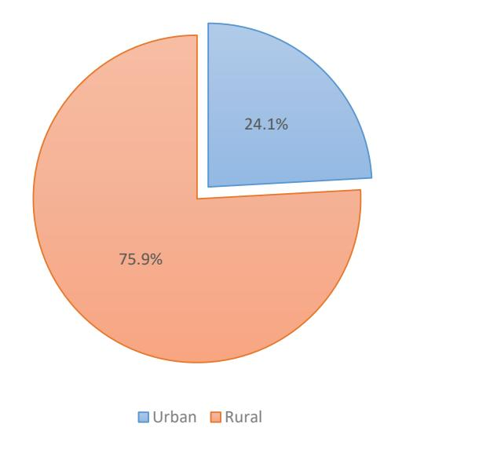

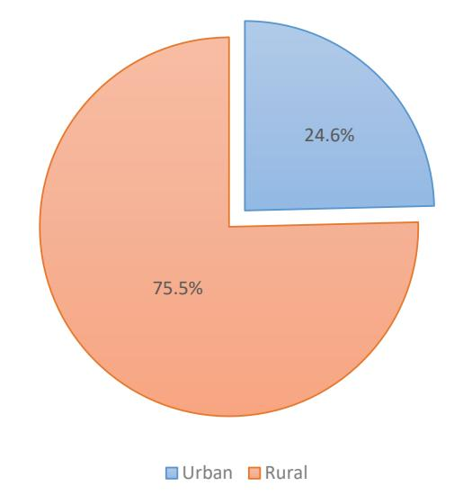

\* Based on regular or normal household.

\*Doing forecasting based on the past years

4.3 ដង់ស៊ីតេប្រជាជន តាមតំបន់ និងខេត្ត
Population density by region and province

|                                   | ensity by reg     |               | _            | ion in th    | ousand |        |       | Densit | y (persor | n / km2) |       |
|-----------------------------------|-------------------|---------------|--------------|--------------|--------|--------|-------|--------|-----------|----------|-------|
| Province                          | Land area      | 2004          | 2008         | 2013         | 2017   | 2018   | 2004  | 2008   | 2013      | 2017     | 2018  |
| Cambodia                          | 181,035           | 12,824        | 13,396       | 13,396       | 15,751 | 15,963 | 74    | 75     | 81        | 87       | 88    |
| A. Plain Region                   |                   |               |              |              |        |        |       |        |           |          |       |
| Total                             | <b>25,069</b> 294 | 6,310         | 6,548        | 6,548        | 7,529  | 7,613  | 252   | 261    | 288       | 300      | 304   |
| Phnom Penh                        | 3,564             | 1,044         | 1,328        | 1,328        | 1,974  | 2,036  | 3,551 | 4,516  | 5,742     | 6,714    | 6,925 |
| Kandal                            | 9,799             | 1,203         | 1,265        | 1,265        | 1,471  | 1,489  | 338   | 355    | 313       | 413      | 418   |
| Kampong Cham                      | 2,966             | 1,656         | 1,680        | 1,680        | 1,725  | 1,721  | 169   | 171    | 179       | 176      | 176   |
| Svay Rieng                        | 4,883             | 514           | 483          | 483          | 504    | 505    | 173   | 163    | 195       | 170      | 170   |
| Prey Veng                         | 3,563             | 1,013         | 947          | 947          | 975    | 977    | 207   | 194    | 237       | 200      | 200   |
| Takeo                             | 3,303             | 880           | 845          | 845          | 881    | 885    | 247   | 237    | 259       | 247      | 248   |
| B. Tonle Sap lake Region Total | 67,668            | 4,172         | 4,357        | 4,357        | 5,308  | 5,396  | 62    | 64     | 70        | 78       | 80    |
| Banteay Meanchey                  | 6,679             | <b>4,1</b> 72 | 4,357 678 | 4,357 678 | 834    | 849    | 102   | 101    | 109       | 125      | 127   |
| Battambang                        | 11,702            | 972           | 1,025        | 1,025        | 1,258  | 1,280  | 83    | 88     | 96        | 107      | 109   |
| Kampong Chhnang                   | 5,521             | 532           | 472          | 472          | 551    | 557    | 96    | 86     | 95        | 100      | 101   |
| Kampong Thom                      | 13,814            | 607           | 631          | 631          | 684    | 686    | 44    | 46     | 50        | 50       | 50    |
| Siem Reap                         | 10,299            | 755           | 896          | 896          | 1,135  | 1,158  | 73    | 87     | 90        | 110      | 112   |
| Oddar Meanchey                    | 6,158             | 130           | 186          | 186          | 267    | 275    | 21    | 30     | 38        | 43       | 45    |
| Pailin                            | 803               | 41            | 70           | 70           | 118    | 123    | 51    | 88     | 82        | 146      | 153   |
| Pursat                            | 12,692            | 456           | 397          | 397          | 461    | 468    | 36    | 31     | 34        | 36       | 37    |
| C. Coastal Region                 | ,                 | 430           | 371          | 371          | 401    | 700    | 30    | 31     | 34        | 30       | 31    |
| Total                             | 17,237            | 959           | 960          | 960          | 1,127  | 1,145  | 56    | 56     | 59        | 65       | 66    |
| Kampot                            | 4,873             | 596           | 586          | 586          | 637    | 642    | 128   | 129    | 130       | 131      | 132   |
| Koh Kong                          | 10,090            | 118           | 117          | 117          | 157    | 161    | 14    | 15     | 15        | 16       | 16    |
| Kep                               | 336               | 58            | 36           | 36           | 50     | 52     | 132   | 137    | 142       | 148      | 155   |
| Preah Sihanouk                    | 1,938             | 187           | 221          | 221          | 283    | 290    | 136   | 139    | 143       | 146      | 149   |
| D. Plateau and Mountainou         | ıs Region         | 107           | 221          | 221          | 203    | 270    |       |        |           |          |       |
| Total                             | 68,061            | 1383          | 1530         | 1530         | 1786   | 1808   | 20    | 22     | 25        | 26       | 27    |
| Kampong Speu                      | 7,017             | 677           | 717          | 717          | 796    | 801    | 96    | 102    | 108       | 113      | 114   |
| Kratie                            | 11,094            | 329           | 319          | 319          | 380    | 385    | 30    | 29     | 31        | 34       | 35    |
| Mondul Kiri                       | 14,288            | 150           | 61           | 61           | 85     | 88     | 10    | 4      | 5         | 6        | 6     |
| Preah Vihear                      | 13,788            | 100           | 171          | 171          | 209    | 212    | 7     | 12     | 17        | 15       | 15    |
| Ratanak Kiri                      | 10,782            | 37            | 150          | 150          | 181    | 184    | 3     | 14     | 17        | 17       | 17    |
| Stung Streng                      | 11,092            | 90            | 112          | 112          | 135    | 138    | 8     | 10     | 11        | 12       | 12    |

1. Population estimate for 1981 was based on the result of population count at the end of 1980 and considered the rate of annual.

2. Land areas are based on the old information of administrative boundaries while the new administrative boundaries are not officially released yet. Some administrative boundaries of capital and provinces have been recently changed.

4.4 ចំនួនប្រជាជន ចំនួនគ្រួសារ តាមភេទ តំបន់ និងខេត្ត គិតជា៣ន់នាក់

Population, number of household by sex, region and province, in thousand

| 1 Opulati                |              |             | ojection 2 |       |           |              | ojection   |              |         | lation n     | rojection | 2018  |
|--------------------------|--------------|-------------|------------|-------|-----------|--------------|------------|--------------|---------|--------------|-----------|-------|
| Capital/ Province        |              |             | ojection . | 2013  |           |              | ojection . | 2017         |         |              | ojection  | 2016  |
| Capital/ Province        | Total        | Both        | Women      | Men   | Total     | Both         | Women      | Men          | Total   | Both         | Women     | Men   |
| 6 1 11                   | HHs          | sexes       | 5.040      | 5.500 | HHs       | sexes        |            | <b>5.500</b> | HHs     | sexes        | 0.146     | 5.017 |
| Cambodia                 | 3,163.0      | 15,539      | 7,940      | 7,599 | 3216.1    | 15,751       | 8,043      | 7,708        | 3,261.1 | 15,963       | 8,146     | 7,816 |
| A. Plain Region          | 1 502 0      | 5 444       | 2.051      | 2.502 | 1 5 4 5 1 | <b>5</b> 520 | 2.002      | 2.626        | 1 565 5 | <b>5</b> (12 | 2.024     | 2 (50 |
| Total                    | 1,582.0      | 7,444       | 3,851      | 3,593 | 1,547.1   | 7,529        |            | 3,636        | 1,565.5 | 7,613        |           | 3,678 |
| Phnom Penh               | 353          | 1,909       | 1,011      | 898   | 369.2     | 1,974        | 1,045      | 929          | 368.5   | 2,036        |           | 958   |
| Kandal                   | 238          | 1,452       | 745        | 706   | 301.0     | 1,471        | 754        | 716          | 304.9   | 1,489        |           | 726   |
| Kampong Cham             | 404          | 1,728       | 883        | 845   | 377.2     | 1,725        | 881        | 844          | 391.8   | 1,721        |           | 843   |
| Svay Rieng               | 131          | 502         | 258        | 244   | 207.0     | 504          | 259        | 245          | 207.0   | 505          |           | 246   |
| Prey Veng                | 256          | 973         | 504        | 469   | 106.5     | 975          | 504        | 471          | 106.7   | 977          |           | 472   |
| Takeo                    | 200          | 879         | 449        | 430   | 186.3     | 881          | 450        | 431          | 186.6   | 885          | 451       | 433   |
| B. Tonle Sap Lake Re     | _            |             |            |       |           |              |            |              |         |              |           |       |
| Total                    | 1,003.0      | 5,220       | 2,642      | 2,577 | 1,073.1   | 5,308        | 2,685      | 2,623        | 1,091.9 | 5,396        |           | 2,668 |
| Banteay Meanchey         | 161          | 819         | 417        | 403   | 168.0     | 834          |            | 410          | 171.1   | 849          |           | 418   |
| Battambang               | 230          | 1,235       | 621        | 614   | 253.4     | 1,258        | 632        | 626          | 258.1   | 1,280        | 643       | 637   |
| Kampong Chhnang          | 111          | 544         | 280        | 264   | 113.0     | 551          | 283        | 268          | 114.5   | 557          | 286       | 271   |
| Kampong Thom             | 149          | 681         | 347        | 335   | 143.9     | 684          | 348        | 336          | 144.5   | 686          | 349       | 338   |
| Siem Reap                | 190          | 1,113       | 562        | 551   | 94.1      | 1,135        | 573        | 563          | 95.4    | 1,158        | 584       | 574   |
| Oddar Meanchey           | 50           | 259         | 129        | 130   | 227.2     | 267          | 133        | 134          | 232.0   | 275          | 137       | 138   |
| Pailin                   | 14           | 112         | 55         | 58    | 51.7      | 118          | 57         | 61           | 53.5    | 123          | 60        | 63    |
| Pursat                   | 96           | 454         | 232        | 222   | 21.8      | 461          | 235        | 226          | 22.9    | 468          | 238       | 229   |
| C. Coastal Region        |              |             |            |       |           |              |            |              |         |              |           |       |
| Total                    | 222.0        | 1,109       | 559        | 550   | 229.1     | 1,127        | 568        | 559          | 232.5   | 1,145        | 576       | 568   |
| Kampot                   | 136          | 632         | 324        | 309   | 132.9     | 637          | 326        | 311          | 133.7   | 642          | 328       | 314   |
| Koh Kong                 | 26           | 153         | 75         | 78    | 30.8      | 157          | 77         | 80           | 31.6    | 161          | 79        | 82    |
| Preah Sihanouk           | 8            | 48          | 24         | 24    | 56.0      | 50           | 25         | 25           | 57.4    | 52           | 26        | 26    |
| Kep                      | 52           | 277         | 137        | 140   | 9.4       | 283          | 140        | 143          | 9.8     | 290          | 143       | 146   |
| D. Plateau and Mount     | tainous Re   | gion        |            |       |           |              |            |              |         |              |           |       |
| Total                    | 356.0        | 1,766       | 887        | 879   | 366.7     | 1,788        | 897        | 890          | 371.3   | 1,809        | 908       | 901   |
| Kampong Speu             | 158          | 791         | 404        | 387   | 166.2     | 796          | 407        | 390          | 167.3   | 801          | 409       | 392   |
| Kratie                   | 73           | 375         | 186        | 189   | 77.5      | 380          | 189        | 191          | 78.7    | 385          | 191       | 194   |
| Mondul Kiri              | 15           | 83          | 40         | 43    | 16.6      | 85           | 42         | 44           | 17.1    | 88           | 43        | 45    |
| Preah Vihear             | 48           | 205         | 103        | 103   | 42.2      | 209          | 104        | 105          | 43.0    | 212          | 106       | 106   |
| Ratanak Kiri             | 36           | 179         | 88         | 91    | 36.8      | 181          | 89         | 92           | 37.4    | 184          | 91        | 94    |
| Stung Streng             | 25           | 133         | 66         | 67    | 27.3      | 135          | 67         | 68           | 27.8    | 138          | 68        | 70    |
| Source: National Institu | ute of Stati | ctics (NIC) |            |       |           |              |            |              |         |              |           |       |

Source: National Institute of Statistics (NIS)

Note:

HH = Household

Figure 4.3 Share of population by region 2017

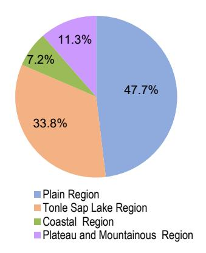

Figure 4.4 Share of population by region 2018

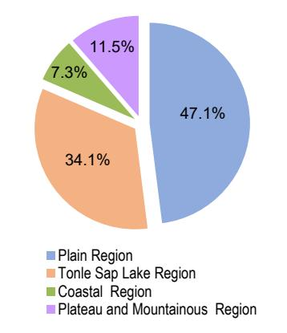

1. GPCC means General Population Census of Cambodia in 1998.

 $2.\ CIPS\ means\ Cambodia\ Inter-censal\ Population\ Survey\ in\ 2008\ and\ 2013.$ 

មំនួនប្រជាជន អត្រានៃភេទ និងទំហំគ្រួសារមធ្យម តាមតំបន់ និងខេត្ត គិតជា៣ន់នាក់
Population, sex ratio and average household size by region and province, in thousand

|                     | Popu       | ılation pı | rojection    | 2016               | Population projection 2017 Population Projection 2017 |        |              |                    |        | ulation projection 2018 |              |                    |  |
|---------------------|------------|------------|--------------|--------------------|-------------------------------------------------------|--------|--------------|--------------------|--------|-------------------------|--------------|--------------------|--|
| Capital/Province    | Women      | Men        | Sex ratio | Average HH size | Women                                                 | Men    | Sex ratio | Average HH size | Women  | Men                     | Sex ratio | Average HH size |  |
| Cambodia            | 7939.7     | 7599.3     | 95.7         | 4.7                | 8043.2                                                | 7708.0 | 95.8         | 4.8                | 8146.2 | 7816.3                  | 96.0         | 4.8                |  |
| A. Plain Region     |            |            |              |                    |                                                       |        |              |                    |        |                         |              |                    |  |
| Total               | 3850.8     | 3592.8     | 93.3         | 4.6                | 3893.0                                                | 3635.8 | 93.4         | 4.7                | 3934.3 | 3678.4                  | 93.5         | 4.7                |  |
| Kampong Cham        | 1011.4     | 897.6      | 88.7         | 4.8                | 1045.2                                                | 928.6  | 88.8         | 4.7                | 1077.4 | 958.4                   | 88.9         | 4.7                |  |
| Kandal              | 745.3      | 706.5      | 94.8         | 4.7                | 754.5                                                 | 716.1  | 94.9         | 4.7                | 763.6  | 725.7                   | 95.0         | 4.7                |  |
| Phnom Penh          | 883.1      | 845.4      | 95.7         | 4.3                | 880.8                                                 | 844.1  | 95.8         | 4.7                | 878.3  | 842.6                   | 95.9         | 4.7                |  |
| Prey Veng           | 258.3      | 243.9      | 94.4         | 4.4                | 258.6                                                 | 244.9  | 94.7         | 4.7                | 259.1  | 246.0                   | 94.9         | 4.7                |  |
| Svay Rieng          | 503.7      | 469.5      | 93.2         | 4.5                | 503.9                                                 | 470.7  | 93.4         | 4.7                | 504.6  | 472.3                   | 93.6         | 4.7                |  |
| Takeo               | 448.9      | 429.9      | 95.8         | 4.6                | 449.9                                                 | 431.5  | 95.9         | 4.7                | 451.2  | 433.4                   | 96.1         | 4.7                |  |
| B. Tonle Sap Lake   | Region     |            |              |                    |                                                       |        |              |                    |        |                         |              |                    |  |
| Total               | 2642.4     | 2577.5     | 97.5         | 4.7                | 2685.1                                                | 2623.0 | 97.7         | 4.7                | 2532.0 | 2,599.8                 | 97.4         | 4.7                |  |
| Banteay Meanchey    | 416.6      | 402.7      | 96.7         | 4.5                | 424.1                                                 | 410.3  | 96.8         | 4.7                | 395.2  | 409.2                   | 96.6         | 4.7                |  |
| Battambang          | 621.2      | 614.3      | 98.9         | 4.9                | 632.0                                                 | 625.8  | 99.0         | 4.7                | 602.8  | 610.4                   | 98.7         | 4.7                |  |
| Kampong Chhnang     | 280.1      | 264.4      | 94.4         | 4.7                | 283.1                                                 | 267.8  | 94.6         | 4.7                | 260.9  | 277.0                   | 94.2         | 4.7                |  |
| Kampong Thom        | 346.8      | 334.7      | 96.5         | 4.6                | 347.7                                                 | 336.2  | 96.7         | 4.7                | 333.1  | 345.8                   | 96.3         | 4.7                |  |
| Pursat              | 562.1      | 551.0      | 98.0         | 4.9                | 573.0                                                 | 562.5  | 98.2         | 4.7                | 219.1  | 229.2                   | 95.6         | 4.7                |  |
| Siem Reap           | 129.0      | 130.3      | 101.0        | 4.6                | 133.0                                                 | 134.2  | 100.9        | 4.7                | 539.3  | 551.1                   | 97.9         | 4.7                |  |
| Oddar Meanchey      | 54.5       | 58.0       | 106.3        | 4.7                | 57.0                                                  | 60.6   | 106.3        | 4.7                | 126.3  | 124.9                   | 101.1        | 4.7                |  |
| Pailin              | 232.1      | 222.3      | 95.7         | 4.5                | 235.3                                                 | 225.6  | 95.9         | 4.7                | 55.4   | 52.0                    | 106.4        | 4.7                |  |
| C. Coastal Region   |            |            |              |                    |                                                       |        |              |                    |        |                         |              |                    |  |
| Total               | 559.3      | 550.2      | 98.4         | 4.6                | 567.7                                                 | 559.0  | 98.5         | 4.7                | 576.4  | 568.2                   | 98.6         | 4.7                |  |
| Kampot              | 323.7      | 308.6      | 95.3         | 4.5                | 325.8                                                 | 311.0  | 95.5         | 4.7                | 328.0  | 313.6                   | 95.6         | 4.7                |  |
| Koh Kong            | 75.1       | 77.7       | 103.5        | 4.7                | 77.1                                                  | 79.9   | 103.6        | 4.7                | 79.2   | 82.1                    | 103.6        | 4.7                |  |
| Kep                 | 23.8       | 24.0       | 101.0        | 4.8                | 24.8                                                  | 25.1   | 101.4        | 4.7                | 25.8   | 26.2                    | 101.7        | 4.7                |  |
| Preah Sihanouk      | 136.7      | 139.8      | 102.3        | 4.9                | 140.0                                                 | 143.1  | 102.2        | 4.7                | 143.4  | 146.3                   | 102.0        | 4.7                |  |
| D. Plateau and Mo   | untaino    | us Regi    | ion          |                    |                                                       |        |              |                    |        |                         |              |                    |  |
| Total               | 887.3      | 878.9      | 99.1         | 4.8                | 897.5                                                 | 890.1  | 99.2         | 4.7                | 907.7  | 901.3                   | 99.3         | 4.7                |  |
| Kampong Speu        | 404.3      | 387.2      | 95.7         | 4.8                | 406.6                                                 | 389.8  | 95.9         | 4.7                | 408.8  | 392.4                   | 96.0         | 4.7                |  |
| Kratie              | 186.3      | 188.7      | 101.3        | 4.7                | 188.7                                                 | 191.4  | 101.4        | 4.7                | 191.1  | 194.1                   | 101.5        | 4.7                |  |
| Mondul Kiri         | 40.3       | 42.6       | 105.7        | 4.9                | 41.5                                                  | 43.9   | 105.6        | 4.7                | 42.8   | 45.2                    | 105.5        | 4.7                |  |
| Preah Vihear        | 102.7      | 102.7      | 100.1        | 4.9                | 104.4                                                 | 104.5  | 100.1        | 4.7                | 106.2  | 106.3                   | 100.1        | 4.7                |  |
| Ratanak Kiri        | 87.8       | 90.7       | 103.2        | 5.1                | 89.2                                                  | 92.1   | 103.3        | 4.7                | 90.6   | 93.6                    | 103.3        | 4.7                |  |
| Stung Streng        | 65.8       | 67.1       | 101.8        | 4.9                | 67.0                                                  | 68.4   | 102.1        | 4.7                | 68.2   | 69.7                    | 102.3        | 4.7                |  |
| Source: National In | stitute of | f Statisti | ics (NIS     | 3                  |                                                       |        |              |                    |        |                         |              |                    |  |

Note:

HH = Household

1. GPCC means General Population Census of Cambodia in 2008.

2. CIPS means Cambodia Inter-censal Population Survey in 2004 and 2013.

4.6 ចំនួនប្រជាជន តាមក្រុមអាយុ និងភេទ គិតជាពាន់នាក់
Population by age group and sex, in thousand

|           | Pro           | jection 20 | 004   | Pro           | jection 20 | 800   | Pro           | jection 20 | 013   | Pro           | jection 20 | 017   | Pro           | ojection 20 | )18   |
|-----------|---------------|------------|-------|---------------|------------|-------|---------------|------------|-------|---------------|------------|-------|---------------|-------------|-------|
| Age group | Both sexes | Women      | Men   | Both sexes | Women      | Men   | Both sexes | Women      | Men   | Both sexes | Women      | Men   | Both sexes | Women       | Men   |
|           |               |            |       |               |            |       | Numbe         | r          |       |               |            |       |               |             |       |
| Total     | 12,824        | 6,627      | 6,197 | 15,327        | 6,880      | 6,516 | 14,677        | 7,555      | 7,122 | 15,751        | 8,043      | 7,708 | 15,963        | 8,146       | 7,816 |
| 0 - 4     | 1,420         |            | 733   | 1,583         | 670        | 703   | 1,304         |            | 674   | 1,597         | 785        | 812   | 1,601         |             | 814   |
| 5 - 9     | 1,639         | 791        | 848   | 1,439         | 718        | 752   | 1,475         | 726        | 748   | 1,504         | 743        | 761   | 1,531         | 755         | 776   |
| 10 - 14   | 1,892         | 925        | 968   | 1,423         | 811        | 859   | 1,543         | 746        | 798   | 1,376         | 674        | 703   | 1,374         | 675         | 699   |
| 15 - 19   | 1,499         | 738        | 761   | 1,634         | 785        | 834   | 1,558         | 770        | 788   | 1,534         | 751        | 783   | 1,486         | 728         | 758   |
| 20 - 24   | 1,306         | 672        | 633   | 1,697         | 700        | 669   | 1,614         | 803        | 811   | 1,701         | 828        | 873   | 1,684         | 822         | 863   |
| 25 - 29   | 717           | 372        | 346   | 1,477         | 628        | 606   | 1,343         | 677        | 666   | 1,582         | 778        | 805   | 1,622         | 792         | 831   |
| 30 - 34   | 815           | 426        | 389   | 1,331         | 358        | 335   | 1,211         | 630        | 581   | 1,345         | 694        | 651   | 1,366         | 703         | 663   |
| 35 - 39   | 798           | 425        | 373   | 877           | 437        | 408   | 735           | 374        | 361   | 1,132         | 580        | 553   | 1,225         | 627         | 598   |
| 40 - 44   | 688           | 382        | 306   | 760           | 393        | 344   | 845           | 456        | 389   | 672           | 349        | 322   | 684           | 356         | 329   |
| 45 - 49   | 530           | 316        | 214   | 791           | 355        | 299   | 773           | 406        | 366   | 833           | 435        | 398   | 825           | 430         | 396   |
| 50 - 54   | 429           | 255        | 175   | 676           | 295        | 196   | 661           | 369        | 292   | 695           | 375        | 319   | 710           | 382         | 327   |
| 55 - 59   | 331           | 191        | 140   | 533           | 229        | 162   | 499           | 300        | 198   | 591           | 330        | 261   | 614           | 338         | 276   |
| 60 - 64   | 258           | 149        | 109   | 399           | 161        | 117   | 391           | 234        | 156   | 426           | 262        | 164   | 444           | 271         | 173   |
| 65 - 69   | 201           | 116        | 85    | 282           | 126        | 91    | 273           | 161        | 112   | 316           | 188        | 128   | 331           | 198         | 133   |
| 70 - 74   | 144           | 89         | 55    | 191           | 95         | 64    | 202           | 121        | 81    | 201           | 120        | 81    | 210           | 125         | 85    |
| 75+       | 158           | 94         | 63    | 235           | 120        | 76    | 252           | 153        | 99    | 247           | 153        | 94    | 254           | 157         | 97    |
|           |               |            |       |               |            |       | Percen        | t          |       |               |            |       |               |             |       |
| Total     | 100           | 100        | 100   | 100           | 100        | 100   | 100           | 100        | 100   | 100           | 100        | 100   | 100           | 100         | 100   |
| 0 - 4     | 11.1          | 10.4       | 11.8  | 10.3          | 9.7        | 10.8  | 8.9           | 8.3        | 9.5   | 10.1          | 9.8        | 10.5  | 10.0          | 9.7         | 10.4  |
| 5 - 9     | 12.8          | 11.9       | 13.7  | 9.4           | 10.4       | 11.5  | 10.0          | 9.6        | 10.5  | 9.5           | 9.2        | 9.9   | 9.6           | 9.3         | 9.9   |
| 10 - 14   | 14.8          | 14.0       | 15.6  | 9.3           | 11.8       | 13.2  | 10.5          | 9.9        | 11.2  | 8.7           | 8.4        | 9.1   | 8.6           | 8.3         | 8.9   |
| 15 - 19   | 11.7          | 11.1       | 12.3  | 10.7          | 11.4       | 12.8  | 10.6          | 10.2       | 11.1  | 9.7           | 9.3        | 10.2  | 9.3           | 8.9         | 9.7   |
| 20 - 24   | 10.2          | 10.1       | 10.2  | 11.1          | 10.2       | 10.3  | 11.0          | 10.6       | 11.4  | 10.8          | 10.3       | 11.3  | 10.6          | 10.1        | 11.0  |
| 25 - 29   | 5.6           | 5.6        | 5.6   | 9.6           | 9.1        | 9.3   | 9.2           | 9.0        | 9.4   | 10.0          | 9.7        | 10.4  | 10.2          | 9.7         | 10.6  |
| 30 - 34   | 6.4           | 6.4        | 6.3   | 8.7           | 5.2        | 5.1   | 8.3           | 8.3        | 8.2   | 8.5           | 8.6        | 8.4   | 8.6           | 8.6         | 8.5   |
| 35 - 39   | 6.2           | 6.4        | 6.0   | 5.7           | 6.3        | 6.3   | 5.0           | 5.0        | 5.1   | 7.2           | 7.2        | 7.2   | 7.7           | 7.7         | 7.7   |
| 40 - 44   | 5.4           | 5.8        | 4.9   | 5.0           | 5.7        | 5.3   | 5.8           | 6.0        | 5.5   | 4.3           | 4.3        | 4.2   | 4.3           | 4.4         | 4.2   |
| 45 - 49   | 4.1           | 4.8        | 3.5   | 5.2           | 5.2        | 4.6   | 5.3           | 5.4        | 5.1   | 5.3           | 5.4        | 5.2   | 5.2           | 5.3         | 5.1   |
| 50 - 54   | 3.3           | 3.8        | 2.8   | 4.4           | 4.3        | 3.0   | 4.5           | 4.9        | 4.1   | 4.4           | 4.7        | 4.1   | 4.4           | 4.7         | 4.2   |
| 55 - 59   | 2.6           | 2.9        | 2.3   | 3.5           | 3.3        | 2.5   | 3.4           | 4.0        | 2.8   | 3.8           | 4.1        | 3.4   | 3.8           | 4.1         | 3.5   |
| 60 - 64   | 2.0           |            | 1.8   | 2.6           | 2.3        | 1.8   | 2.7           | 3.1        | 2.2   | 2.7           | 3.3        | 2.1   | 2.8           | 3.3         | 2.2   |
| 65 - 69   | 1.6           |            | 1.4   | 1.8           | 1.8        | 1.4   | 1.9           | 2.1        | 1.6   | 2.0           | 2.3        | 1.7   | 2.1           | 2.4         | 1.7   |
| 03 - 09   | 1.0           | 1.0        |       |               |            |       |               |            |       |               |            |       |               |             |       |
| 70 - 74   | 1.0           |            | 0.9   | 1.2           | 1.4        | 1.0   | 1.4           | 1.6        | 1.1   | 1.3           | 1.5        | 1.1   | 1.3           | 1.5         | 1.1   |

1. GPCC means General Population Census of Cambodia in 2008.

2. CIPS means Cambodia Inter-censal Population Survey in 2004 and 2013.

3. Population Projection 2008-2030.

4.7 ចំនួនប្រជាជន តាមក្រុមអាយុ ភេទ និងតំបន់ គិតជា៣ន់នាក់
Population by age group and sex, in thousand

| -                  |               | jection 20 |          |               | jection 20 |          | Pro           | jection 20 | 17       | Pro           | ojection 2 | 018      |
|--------------------|---------------|------------|----------|---------------|------------|----------|---------------|------------|----------|---------------|------------|----------|
| Age group          | Both sexes | Women      | Men      | Both sexes | Women      | Men      | Both sexes | Women      | Men      | Both sexes | Women      | Men      |
| Total              | 13,396        | 6,880      | 6,516    | 14,677        | 7,555      | 7,122    | 15,751        | 8,043      | 7,708    | 15,963        | 8,146      | 7,816    |
| 0 - 4              | 1,373         | 670        | 703      | 1,304         | 629        | 674      | 1,597         | 785        | 812      | 1,601         | 787        | 814      |
| 5 - 9              | 1,471         | 718        | 752      | 1,475         | 726        | 748      | 1,504         |            | 761      | 1,531         | 755        | 776      |
| 10 - 14            | 1,671         | 811        | 859      | 1,543         | 746        | 798      | 1,376         | 674        | 703      | 1,374         | 675        | 699      |
| 15 - 19            | 1,619         | 785        | 834      | 1,558         | 770        | 788      | 1,534         | 751        | 783      | 1,486         | 728        | 758      |
| 20 - 24            | 1,369         | 700        | 669      | 1,614         | 803        | 811      | 1,701         | 828        | 873      | 1,684         | 822        | 863      |
| 25 - 29            | 1,233         | 628        | 606      | 1,343         | 677        | 666      | 1,582         | 778        | 805      | 1,622         | 792        | 831      |
| 30 - 34            | 693           | 358        | 335      | 1,211         | 630        | 581      | 1,345         | 694        | 651      | 1,366         | 703        | 663      |
| 35 - 39            | 845           | 437        | 408      | 735           | 374        | 361      | 1,132         | 580        | 553      | 1,225         | 627        | 598      |
| 40 - 44            | 737           | 393        | 344      | 845           | 456        | 389      | 672           | 349        | 322      | 684           | 356        | 329      |
| 45 - 49            | 654           | 355        | 299      | 773           | 406        | 366      | 833           | 435        | 398      | 825           | 430        | 396      |
| 50 - 54            | 491           | 295        | 196      | 661           | 369        | 292      | 695           | 375        | 319      | 710           | 382        | 327      |
| 55 - 59            | 391           | 229        | 162      | 499           | 300        | 198      | 591           | 330        | 261      | 614           | 338        | 276      |
| 60 - 64            | 278           | 161        | 117      | 391           | 234        | 156      | 426           | 262        | 164      | 444           | 271        | 173      |
| 65 - 69            | 217           | 126        | 91       | 273           | 161        | 112      | 316           | 188        | 128      | 331           | 198        | 133      |
| 70 - 74            | 159           | 95         | 64       | 202           | 121        | 81       | 201           |            | 81       | 210           | 125        | 85       |
| 75+                | 196           | 120        | 76       | 252           | 153        | 99       | 247           |            | 94       | 254           | 157        | 97       |
| Rural              | 10,782        | 5,521      | 5,260    | 11,530        | 5,936      | 5,594    | 11,948        |            | 5,877    | 12,048        | 6,118      | 5,930    |
| 0 - 4              | 1,166         | 569        | 597      | 1,066         | 508        | 558      | 1,194         |            | 606      | 1,191         | 587        | 605      |
| 5 - 9              | 1,262         | 617        | 646      | 1,203         | 593        | 610      | 1,187         |            | 600      | 1,190         | 588        | 601      |
| 10 - 14            | 1,421         | 689        | 732      | 1,267         | 618        | 649      | 1,151         |            | 587      | 1,141         | 561        | 580      |
| 15 - 19            | 1,277         | 604        | 673      | 1,252         | 618        | 634      | 1,269         |            | 652      | 1,226         | 596        | 630      |
| 20 - 24            | 999           | 503        | 496      | 1,253         | 622        | 630      | 1,322         |            | 695      | 1,321         | 631        | 691      |
| 25 - 29            | 918           | 465        | 453      | 1,019         | 508        | 511      | 1,084         |            | 577      | 1,127         | 523        | 605      |
| 30 - 34            | 547           | 284        | 263      | 893           | 463        | 430      | 872           |            | 428      | 877           | 443        | 434      |
| 35 - 39            | 671           | 349        | 322      | 564           | 291        | 273      | 796           |            | 388      | 848           | 435        | 414      |
| 40 - 44            | 592           | 320        | 272      | 643           | 346        | 297      | 503           |            | 237      | 505           | 267        | 238      |
| 45 - 49            | 524           | 287        | 237      | 602           | 321        | 282      | 639           |            | 301      | 630           | 333        | 298      |
| 50 - 54            | 387           | 235        | 151      | 507           | 285        | 222      | 542           |            | 244      | 552           | 303        | 249      |
| 55 - 59 60 - 64 | 313           | 185        | 129      | 374           | 229        | 145      | 459           |            | 200      | 478           | 266        | 212      |
| 65 - 69            | 226           | 131        | 95       | 302           | 184        | 118      | 325           |            | 122      | 340           | 211        | 129      |
| 70 - 74            | 181 133    | 105 79  | 76 54 | 216 163    | 127        | 89 64 | 246 159    |            | 99 64 | 257 165    | 155 99  | 102      |
| 75+                | 164           | 99         | 65       | 207           | 98 125  | 82       | 199           |            | 76       | 198           | 122        | 66 76 |
| Urban              | 2,614         | 1,358      | 1,256    | 3,146         | 1,619      | 1,527    | 3,803         |            | 1,831    | 3,934         | 2,039      | 1,895    |
| 0 - 4              | 2,014         | 101        | 106      | 238           | 1,013      | 1,327    | 403           |            | 206      | 412           | 202        | 211      |
| 5 - 9              | 209           | 102        | 107      | 272           | 134        | 138      | 317           |            | 161      | 343           | 168        | 175      |
| 10 - 14            | 249           | 122        | 127      | 276           | 128        | 149      | 225           |            | 116      | 234           | 114        | 119      |
| 15 - 19            | 342           | 181        | 161      | 306           | 151        | 154      | 265           |            | 131      | 262           | 133        | 129      |
| 20 - 24            | 371           | 197        | 174      | 361           | 180        | 181      | 379           |            | 178      | 365           | 192        | 173      |
| 25 - 29            | 315           | 162        | 153      | 324           | 169        | 155      | 498           |            | 228      | 497           | 270        | 227      |
| 30 - 34            | 146           | 74         | 72       | 318           | 167        | 151      | 472           |            | 223      | 492           | 262        | 230      |
| 35 - 39            | 174           | 88         | 87       | 171           | 83         | 88       | 336           |            | 165      | 379           | 194        | 185      |
| 40 - 44            | 1,166         | 73         | 72       | 202           | 110        | 92       | 169           |            | 85       | 181           | 90         | 91       |
| 45 - 49            | 1,262         | 68         | 62       | 170           | 86         | 84       | 194           |            | 97       | 196           | 98         | 98       |
| 50 - 54            | 1,421         | 59         | 44       | 154           | 84         | 70       | 153           |            | 75       | 159           | 80         | 79       |
| 55 - 59            | 1,277         | 44         | 34       | 124           | 71         | 54       | 132           |            | 61       | 137           | 72         | 64       |
| 60 - 64            | 999           | 30         | 22       | 89            | 51         | 38       | 100           |            | 42       | 106           | 61         | 44       |
| 65 - 69            | 918           | 21         | 15       | 56            | 34         | 23       | 70            |            | 29       | 75            | 43         | 31       |
| 70 - 74            | 547           | 16         | 10       | 39            | 23         | 17       | 42            |            | 17       | 45            | 27         | 18       |
| 75+                | 671           | 21         | 11       | 45            | 28         | 17       | 48            |            | 18       | 51            | 32         | 19       |
| Source: Nat        | 1 T           | ··         |          | (NIIC)        |            |          |               |            |          |               |            |          |

1. GPCC means General Population Census of Cambodia in 2008.

2. CIPS means Cambodia Inter-censal Population Survey in 2004 and 2013.

3. Population Projection 2008-2030.

4.8 អត្រានៃភេទ តាមក្រុមអាយុ និងតំបន់ គិតជាពាន់នាក់

Sex ratio by age group and region, in thousand

|                    | Population |          |          | Population |            |          | Population F | Projection 2 | 017      | Population | Projection 2 | 2018     |
|--------------------|------------|----------|----------|------------|------------|----------|--------------|--------------|----------|------------|--------------|----------|
| Age group          | Women in   | Men in   | Sex      | Women in   | Men in     | Sex      | Women in     | Men in       | Sex      | Women in   | Men in       | Sex      |
|                    | thousand   | thousand | ratio    | thousand   | thousand   | ratio    | thousand     | thousand     | ratio    | thousand   | thousand     | ratio    |
| Total              | 6,880      | 6,516    | 95       | 7,555      | 7,122      | 94       | 8,043        | 7,708        | 96       | 8,146      | 7,816        | 96       |
| 0 - 4              | 670        |          | 105      | 629        | 674        | 107      | 785          | 812          | 103      | 787        | 814          | 103      |
| 5 - 9              | 718        |          | 105      | 726        |            | 103      | 743          | 761          | 102      | 755        | 776          | 103      |
| 10 - 14            | 811        |          | 106      | 746        |            | 107      | 674          | 703          | 104      | 675        | 699          | 104      |
| 15 - 19            | 785        |          | 106      | 770        | 788        | 102      | 751          | 783          | 104      | 728        | 758          | 104      |
| 20 - 24            | 700        | 669      | 96       | 803        | 811        | 101      | 828          | 873          | 105      | 822        | 863          | 105      |
| 25 - 29            | 628        | 606      | 97       | 677        |            | 98       | 778          | 805          | 103      | 792        | 831          | 105      |
| 30 - 34            | 358        | 335      | 94       | 630        | 581        | 92       | 694          | 651          | 94       | 703        | 663          | 94       |
| 35 - 39            | 437        | 408      | 94       | 374        | 361        | 97       | 580          | 553          | 95       | 627        | 598          | 95       |
| 40 - 44            | 393        | 344      | 88       | 456        | 389        | 85       | 349          | 322          | 92       | 356        | 329          | 92       |
| 45 - 49            | 355        | 299      | 84       | 406        | 366        | 90       | 435          | 398          | 91       | 430        | 396          | 92       |
| 50 - 54            | 295        | 196      | 66       | 369        | 292        | 79       | 375          | 319          | 85       | 382        | 327          | 86       |
| 55 - 59            | 229        | 162      | 71       | 300        | 198        | 66       | 330          | 261          | 79       | 338        | 276          | 82       |
| 60 - 64            | 161        | 117      | 73       | 234        | 156        | 67       | 262          | 164          | 63       | 271        | 173          | 64       |
| 65 - 69            | 126        |          | 72       | 161        | 112        | 70       | 188          | 128          | 68       | 198        | 133          | 67       |
| 70 - 74            | 95         |          | 67       | 121        | 81         | 67       | 120          | 81           | 68       | 125        | 85           | 67       |
| 75+                | 120        |          | 63       | 153        |            | 65       | 153          | 94           | 62       | 157        | 97           | 62       |
| Rural              | 5,521      | 5,260    | 95       | 5,936      |            | 94       | 8,043        | 7,708        | 96       | 8,146      | 7,816        | 96       |
| 0 - 4              | 569        |          | 105      | 508        | 558        | 110      | 785          | 812          | 103      | 787        | 814          | 103      |
| 5 - 9              | 617        |          | 105      | 593        |            | 103      | 743          | 761          | 102      | 755        | 776          | 103      |
| 10 - 14            | 689        |          | 106      | 618        |            | 105      | 674          | 703          | 104      | 675        | 699          | 104      |
| 15 - 19            | 604        |          | 111      | 618        |            | 103      | 751          | 783          | 104      | 728        | 758          | 104      |
| 20 - 24            | 503        |          | 99       | 622        |            | 101      | 828          | 873          | 105      | 822        | 863          | 105      |
| 25 - 29            | 465        |          | 97       | 508        |            | 101      | 778          | 805          | 103      | 792        | 831          | 105      |
| 30 - 34            | 284        |          | 93       | 463        | 430        | 93       | 694          | 651          | 94       | 703        | 663          | 94       |
| 35 - 39            | 349        |          | 92       | 291 346 | 273        | 94       | 580          | 553          | 95       | 627        | 598          | 95       |
| 40 - 44            | 320        |          | 85       |            |            | 86       | 349          | 322          | 92       | 356        | 329          | 92       |
| 45 - 49 50 - 54 | 287 235 |          | 83 64 | 321 285 | 282 222 | 88 78 | 435 375   | 398          | 91       | 430        | 396 327   | 92       |
| 55 - 59            | 185        |          | 70       | 283        |            | 63       | 330          | 319 261   | 85 79 | 382 338 | 276          | 86 82 |
| 60 - 64            | 131        |          | 70       | 184        |            | 64       | 262          | 164          | 63       | 271        | 173          | 64       |
| 65 - 69            | 105        |          | 72       | 127        |            | 70       | 188          | 128          | 68       | 198        | 133          | 67       |
| 70 - 74            | 79         |          | 68       | 98         |            | 65       | 120          | 81           | 68       | 125        | 85           | 67       |
| 75+                | 99         |          | 65       | 125        | 82         | 66       | 153          | 94           | 62       | 157        | 97           | 62       |
| Urban              | 1,358      |          | 92       | 1,619      | 1,527      | 94       | 1,972        | 1,831        | 93       | 2,039      | 1,895        | 93       |
| 0 - 4              | 101        |          | 105      | 121        | 117        | 97       | 197          | 206          | 104      | 202        | 211          | 105      |
| 5 - 9              | 102        |          | 105      | 134        |            | 103      | 156          | 161          | 103      | 168        | 175          | 104      |
| 10 - 14            | 122        |          | 104      | 128        |            | 116      | 109          | 116          | 106      | 114        | 119          | 104      |
| 15 - 19            | 181        |          | 89       | 151        | 154        | 102      | 134          | 131          | 98       | 133        | 129          | 97       |
| 20 - 24            | 197        | 174      | 88       | 180        | 181        | 101      | 201          | 178          | 89       | 192        | 173          | 90       |
| 25 - 29            | 162        | 153      | 94       | 169        | 155        | 92       | 271          | 228          | 84       | 270        | 227          | 84       |
| 30 - 34            | 74         | 72       | 97       | 167        | 151        | 90       | 250          | 223          | 89       | 262        | 230          | 88       |
| 35 - 39            | 88         | 87       | 99       | 83         | 88         | 106      | 171          | 165          | 97       | 194        | 185          | 96       |
| 40 - 44            | 73         | 72       | 98       | 110        | 92         | 84       | 84           | 85           | 101      | 90         | 91           | 101      |
| 45 - 49            | 68         | 62       | 91       | 86         | 84         | 98       | 97           | 97           | 100      | 98         | 98           | 100      |
| 50 - 54            | 59         | 44       | 75       | 84         | 70         | 83       | 78           | 75           | 97       | 80         | 79           | 98       |
| 55 - 59            | 44         | 34       | 77       | 71         | 54         | 76       | 71           | 61           | 86       | 72         | 64           | 89       |
| 60 - 64            | 30         | 22       | 74       | 51         | 38         | 75       | 59           | 42           | 71       | 61         | 44           | 72       |
| 65 - 69            | 21         | 15       | 69       | 34         | 23         | 68       | 40           | 29           | 73       | 43         | 31           | 72       |
| 70 - 74            | 16         |          | 62       | 23         |            | 74       | 25           | 17           | 68       | 27         | 18           | 68       |
| 75+                | 21         |          | 55       | 28         | 17         | 61       | 31           | 18           | 58       | 32         | 19           | 59       |

Source: National Institute of Statistics (NIS)

1. GPCC means General Population Census of Cambodia in 2008.

 $2.\ CIPS\ means\ Cambodia\ Inter-censal\ Population\ Survey\ in\ 2004\ and\ 2013.$ 

3. Population Projection 2008-2030.

🛕 🛕 ចំនួនប្រជាជន តាមភាសាកំណើត ក្រុមអាយុ និងភេទ ឆ្នាំ២០១៣ គិតជាពាន់នាក់

Population by mother tongue language, age group and Sex 2013, in thousand All Population Khmer Vietnamese Chinese Lao Thai French English Others Age Group Korean Japanese minority languages 14,677 1,424 Both sexes 0 - 4 1,304 1,261 5 - 9 1,475 1,429 10 - 14 1,543 1,495 15 - 19 1,558 1,516 20 - 24 1,614 1,566 25 - 29 1,343 1,305 1,211 30 - 341,181 35 - 39 40 - 44 45 - 49 50 - 54 55 - 59 60 - 64 65 - 69 70 - 7475 +Men 7,122 6,914 0 - 45 - 910 - 14 15 - 1920 - 2425 - 29 30 - 34 35 - 39 40 - 44 45 - 49 50 - 54 55 - 59 60 - 6465 - 69 70 - 74 75 +7,555 Women 7,330 0 - 45 - 9

Source: National Institute of Statistics (NIS)

Note

10 - 14

15 - 19

20 - 24

25 - 29

30 - 34

35 - 39

40 - 44

45 - 49

50 - 54

55 - 59

60 - 64

65 - 69

70 - 74

75 +

1. GPCC means General Population Census of Cambodia in 2008.

2. CIPS means Cambodia Inter-censal Population Survey in 2004 and 2013.

3. Population Projection 2008-2030.

4.10 ចំនួនប្រជាជន តាមសាសនា អាយុ និងភេទ គិតជា៣ន់នាក់
Population by religion, age and sex, in thousand

|                    |                     | 9 1011     | 2004     | ige and      |       |                     | bulla      | 2008     |              |        |                     |            | 2013   |              |       |
|--------------------|---------------------|------------|----------|--------------|-------|---------------------|------------|----------|--------------|--------|---------------------|------------|--------|--------------|-------|
|                    | п                   | g          | 2001     | 5            |       | п                   | п          | 2000     | <u>5</u>     |        | n                   | g          | 2013   | 5            |       |
| Age group          | Total Population | Buddhism   | Islam    | Christianity | Other | Total Population | Buddhism   | Islam    | Christianity | Other  | Total Population | Buddhism   | Islam  | Christianity | Other |
| Both sexes         | 12,824              | 12,363     | 321      | 36           | 104   | 13,396              | 12,985     | 257      | 50           | 104    | 14,677              | 14,367     | 159    | 69           | 82    |
| 0 - 4              | 1,420               | 1,371      | 28       | 3            | 19    | 1,373               | 1,328      | 26       | 4            | 14     | 1,304               | 1,271      | 15     | 6            | 11    |
| 5 - 9              | 1,639               | 1,580      | 39       | 4            | 15    | 1,471               | 1,423      | 26       | 5            | 16     | 1,475               | 1,440      | 16     | 6            | 12    |
| 10 - 14            | 1,892               | 1,826      | 50       | 4            | 13    | 1,671               | 1,616      | 34       | 6            | 14     | 1,543               | 1,510      | 16     | 6            | 12    |
| 15 - 19            | 1,499               | 1,440      | 44       | 4            | 11    | 1,619               | 1,567      | 35       | 6            | 11     | 1,558               | 1,529      | 13     | 7            | 9     |
| 20 - 24            | 1,306               | 1,258      | 37       | 4            | 7     | 1,369               | 1,326      | 28       | 5            | 9      | 1,614               | 1,579      | 19     | 9            | 6     |
| 25 - 29            | 717                 | 691        | 15       | 3            | 8     | 1,233               | 1,198      | 22       | 5            | 9      | 1,343               | 1,313      | 16     | 7            | 6     |
| 30 - 34            | 815                 | 789        | 16       | 4            | 6     | 693                 | 673        | 11       | 3            | 6      | 1,211               | 1,188      | 13     | 6            | 5     |
| 35 - 39            | 798                 | 771        | 16       | 2            | 9     | 845                 | 822        | 14       | 3            | 6      | 735                 | 719        | 8      | 3            | 5     |
| 40 - 44            | 688                 | 666        | 15       | 3            | 4     | 737                 | 716        | 13       | 3            | 5      | 845                 | 829        | 7      | 4            | 4     |
| 45 - 49            | 530                 | 511        | 13       | 1            | 4     | 654                 | 634        | 13       | 2            | 4      | 773                 | 757        | 9      | 4            | 3     |
| 50 - 54            | 429                 | 411        | 14       | 2            | 2     | 491                 | 475        | 10       | 2            | 3      | 661                 | 648        | 8      | 4            | 2     |
| 55 - 59            | 331                 | 318        | 10       | 1 1       | 2     | 391                 | 379        | 8        | 2            | 2      | 499                 | 488        | 6      | 3            | 2     |
| 60 - 64 65 - 69 | 258 201          | 247 194 | 9 5   | 1            | 1     | 278 217          | 269 211 | 5 4   | 1 1       | 2      | 391 273          | 382 268 | 5 4 | 2            | 2     |
| 70 - 74            | 144                 | 139        | 3        | -            | 1     | 159                 | 154        | 3        | -            | 1      | 202                 | 199        | 2      | 1            | 0     |
| 75+                | 158                 | 150        | 6        | _            | 2     | 196                 | 190        | 4        | _            | 1      | 252                 | 248        | 2      | 1            | 1     |
| Men                | 6,197               | 5,976      | 153      | 18           | 50    | 6,516               | 6,314      | 125      | 26           | 52     | 7,555               | 7,396      | 83     | 34           | 42    |
| 0 - 4              | 733                 | 709        | 15       | 2            | 9     | 703                 | 680        | 13       | 2            | 7      | 629                 | 613        | 8      | 3            | 5     |
| 5 - 9              | 848                 | 818        | 19       | 3            | 8     | 752                 | 728        | 14       | 3            | 8      | 726                 | 709        | 8      | 3            | 6     |
| 10 - 14            | 968                 | 935        | 25       | 2            | 6     | 859                 | 831        | 18       | 3            | 7      | 746                 | 727        | 9      | 3            | 6     |
| 15 - 19            | 761                 | 733        | 22       | 2            | 4     | 834                 | 808        | 17       | 3            | 5      | 770                 | 755        | 7      | 3            | 5     |
| 20 - 24            | 633                 | 611        | 17       | 1            | 4     | 669                 | 649        | 14       | 3            | 4      | 803                 | 786        | 10     | 4            | 3     |
| 25 - 29            | 346                 | 333        | 7        | 2            | 4     | 606                 | 588        | 11       | 2            | 4      | 677                 | 661        | 8      | 4            | 3     |
| 30 - 34            | 389                 | 376        | 8        | 2            | 3     | 335                 | 325        | 5        | 2            | 3      | 630                 | 618        | 6      | 3            | 2     |
| 35 - 39            | 373                 | 361        | 7        | 1            | 4     | 408                 | 397        | 7        | 2            | 3      | 374                 | 366        | 4      | 2            | 2     |
| 40 - 44            | 306                 | 295        | 7        | 1            | 2     | 344                 | 334        | 6        | 1            | 2      | 456                 | 448        | 3      | 2            | 2     |
| 45 - 49            | 214                 | 205        | 6        | -            | 2     | 299                 | 290        | 6        | 1            | 2      | 406                 | 398        | 5      | 2            | 1     |
| 50 - 54            | 175                 | 167        | 5        | 1            | 1     | 196                 | 189        | 4        | 1            | 2      | 369                 | 362        | 4      | 2            | 1     |
| 55 - 59            | 140                 | 135        | 4        | 1            | 1     | 162                 | 157        | 3        | 1            | 1      | 300                 | 293        | 4      | 2            | 1     |
| 60 - 64            | 109                 | 104        | 4        | -            | 1     | 117                 | 113        | 2        | 1            | 1      | 234                 | 230        | 3      | 0            | 1     |
| 65 - 69            | 85                  | 81         | 3        | -            | 1     | 91                  | 88         | 2        | -            | 1      | 161                 | 158        | 2      | 0            | 0     |
| 70 - 74            | 55                  | 53         | 1        | -            | -     | 64                  | 62         | 1        | -            | -      | 121                 | 119        | 1      | 1            | 0     |
| 75+                | 63                  | 60         | 2        | -            | 1     | 76                  | 73         | 2        | -            | 1      | 153                 | 151        | 1      | 1            | 0     |
| Women              | 6,627               | 6,387      | 168      | 18           | 54    | 6,880               | 6,671      | 132      | 24           | 52     | 7,122               | 6,971      | 76     | 34           | 40    |
| 0 - 4              | 687                 | 662        | 13       | 1            | 10    | 670                 | 648        | 13       | 2            | 7      | 674                 | 658        | 8      | 3            | 6     |
| 5 - 9              | 791                 | 763        | 20       | 1            | 7     | 718                 | 695        | 13       | 3            | 8      | 748                 | 731        | 8      | 3            | 6     |
| 10 - 14            | 925                 | 891        | 24       | 2            | 7     | 811                 | 785        | 17       | 3            | 7      | 798                 | 782        | 7      | 3            | 5     |
| 15 - 19 20 - 24 | 738                 | 708 647 | 22 20 | 2 2          | 6     | 785                 | 759 678 | 17 15 | 3            | 6      | 788 81           | 773 794 | 6 9 | 4 5          | 5     |
| 20 - 24 25 - 29 | 672 372          | 358        | 8        | 2            | 3     | 700 628          | 610        | 11       | 3 2          | 5 4 | 666                 | 653        | 8      | 3            | 3     |
| 30 - 34            | 426                 | 413        | 8        | 2            | 3     | 358                 | 348        | 6        | 1            | 3      | 581                 | 569        | 7      | 3            | 3     |
| 35 - 39            | 425                 | 411        | 9        | 1            | 4     | 437                 | 425        | 7        | 1            | 3      | 361                 | 353        | 4      | 2            | 2     |
| 40 - 44            | 382                 | 370        | 8        | 1            | 2     | 393                 | 382        | 7        | 1            | 2      | 389                 | 381        | 4      | 2            | 1     |
| 45 - 49            | 316                 | 306        | 7        | 1            | 2     | 355                 | 344        | 7        | 1            | 2      | 366                 | 358        | 4      | 2            | 2     |
| 50 - 54            | 255                 | 244        | 9        | 1            | 1     | 295                 | 286        | 6        | 1            | 2      | 292                 | 286        | 3      | 2            | 1     |
| 55 - 59            | 191                 | 183        | 6        | 1            | 1     | 229                 | 222        | 4        | 1            | 1      | 198                 | 194        | 2      | 1            | 1     |
| 60 - 64            | 149                 | 143        | 5        | -            | 1     | 161                 | 156        | 3        | 1            | 1      | 156                 | 152        | 2      | 2            | 1     |
| 65 - 69            | 116                 | 113        | 3        | -            | -     | 126                 | 123        | 2        | -            | 1      | 112                 | 109        | 2      | 0            | 1     |
| 70 - 74            | 89                  | 85         | 2        | -            | 1     | 95                  | 92         | 2        | -            | 1      | 81                  | 79         | 1      | 0            | 0     |
| 75+                | 94                  | 90         | 4        | -            | 1     | 120                 | 116        | 3        | -            | 1      | 99                  | 97         | 1      | 0            | 0     |

- 1. GPCC means General Population Census of Cambodia in 2008.
- 2. CIPS means Cambodia Inter-censal Population Survey in 2004 and 2013.

4.11 ចំនួនប្រជាជន តាមស្ថានភាពអាពាហ៍ពិពាហ៍ ភេទ និងក្រុមអាយុ ឆ្នាំ១៩៩៨ និង២០០៨ គិតជាពាន់នាក់

Population by marital status, sex and age group 1998 and 2008, in thousand

|                    | Роригано         | n oy n           |         | C 1998   | A and a  | ge group  | 1770 a           | 11 <b>u</b> 2000 |          | GPCC 2008  |          |           |
|--------------------|------------------|------------------|---------|----------|----------|-----------|------------------|------------------|----------|------------|----------|-----------|
| Age                | Total            | NI               | Gree    | 2 1996   |          |           | T 4 1            | N                |          | JI CC 2008 |          |           |
| group              | Total population | Never married | Married | Widowed  | Divorced | Separated | Total population | Never married | Married  | Widowed    | Divorced | Separated |
| Both sexes         | 11,438           | 6,821            | 4,009   | 429      | 154      | 24        | 13,396           | 7,415            | 5,347    | 444        | 179      | 10        |
| 0 - 4              | 1,467            | 1,467            |         | -        | _        | -         | 1,373            | 1,373            | -        | -          | _        | -         |
|                    |                  |                  |         |          |          |           |                  |                  |          |            |          |           |
| 5 - 9              | 1,773            | 1,773            | -       | -        | -        | -         | 1,471            | 1,471            | -        | -          | -        | -         |
| 10 - 14            | 1,658            | 1,655            | 2       | -        | -        | -         | 1,671            | 1,666            | 3        | 1          | -        | -         |
| 15 - 19            | 1,344            | 1,240            | 99      | 1        | 3        | 1         | 1,619            | 1,536            | 80       | 1          | 2        | -         |
| 20 - 24            | 746              | 361              | 366     | 5        | 11       | 2         | 1,369            | 819              | 533      | 4          | 13       | 1         |
| 25 - 29            | 889              | 169              |         | 11       | 20       | 4         | 1,233            | 323              | 879      | 8          | 22       | 1         |
| 30 - 34            | 783              | 67               |         | 17       | 22       | 4         | 693              | 74               | 593      | 9          | 16       | 1         |
| 35 - 39            | 696              | 34               |         | 23       | 22       | 3         | 845              | 49               | 757      | 17         | 21       | 1         |
| 40 - 44            | 497              | 19               |         | 32       | 17       | 3         | 737              | 32               | 658      | 26         | 21       | 1         |
| 45 - 49            | 416              | 12               |         | 43       | 14       | 2         |                  | 22               | 576      | 35         | 20       | 1         |
| 50 - 54            | 312              | 7                |         | 48       | 10       | 1         | 491              | 16               | 410      | 46         | 17       | 1         |
| 55 - 59            | 257              | 4                |         | 50       | 8        | 1         | 391              | 11               | 312      | 54         | 13       | 1         |
| 60 - 64            | 205              | 4                |         | 52 51 | 8        | 1         | 278 217       | 7                | 205      | 56         | 9        | -         |
| 65 - 69 70 - 74 | 167              | 3                |         | 42       | 7 5   | 1 0       | 159              | 5 4           | 149      | 55 52   | 8        | -         |
| 70 - 74 75+     | 112 116       | 3 4              |         | 55       | 7        | 0         | 196              | 7                | 96 97 | 82         | 6 9   | -         |
| Men                | 5,511            | 3,490            |         | 48       | 24       | 5         |                  | 3,867            | 2,556    | 55         | 35       | 3         |
| 0 - 4              | 747              | 747              | -       | -        | -        | -         | 703              | 703              | 2,330    | -          | -        | -         |
| 5 - 9              | 904              | 904              |         | _        | _        | _         | 752              | 752              | _        | _          | _        | _         |
| 10 - 14            | 851              | 850              |         | _        | _        | _         | 859              | 858              | 1        | _          | _        | _         |
| 15 - 19            | 664              | 644              |         | _        | _        | _         | 834              | 819              | 14       | _          | _        | _         |
| 20 - 24            | 354              | 207              |         | 1        | 2        | 1         | 669              | 474              | 191      | 1          | 3        | -         |
| 25 - 29            | 427              | 92               |         | 1        | 4        | 1         | 606              | 186              | 412      | 1          | 6        | -         |
| 30 - 34            | 370              | 26               | 339     | 2        | 3        | 1         | 335              | 34               | 295      | 1          | 4        | -         |
| 35 - 39            | 325              | 8                | 312     | 2        | 3        | -         | 408              | 18               | 384      | 2          | 4        | -         |
| 40 - 44            | 200              | 3                | 193     | 2        | 2        | -         | 344              | 8                | 329      | 3          | 4        | -         |
| 45 - 49            | 175              | 2                | 170     | 2        | 1        | -         | 299              | 4                | 289      | 3          | 3        | -         |
| 50 - 54            | 132              | 1                | 127     | 3        | 1        | -         | 196              | 2                | 188      | 4          | 2        | -         |
| 55 - 59            | 110              | 1                | 104     | 4        | 1        | -         | 162              | 2                | 155      | 4          | 2        | -         |
| 60 - 64            | 87               | 1                |         | 5        | 1        | -         | 117              | 2                | 108      | 5          | 1        | -         |
| 65 - 69            | 71               | 1                |         | 7        | 1        | -         | 91               | 1                | 81       | 6          | 2        | -         |
| 70 - 74            | 47               | 1                |         | 7        | 1        | -         | 64               | 1                | 54       | 7          | 2        | -         |
| 75+                | 47               | 2                |         | 12       | 2        | -         | 76               | 3                | 55       | 15         | 3        | -         |
| Women              | 5,926            | 3,331            |         | 380      | 130      | 19        |                  | 3,547            | 2,791    | 390        | 144      | 8         |
| 0 - 4              | 720              | 720              |         | -        | -        | -         | 670              | 670              | -        | -          | -        | -         |
| 5 - 9              | 869 807       | 869              |         | -        | -        | -         | 718              | 718 809       | 2        | -          | -        | -         |
| 10 - 14 15 - 19 | 680              | 805 596       |         | 1        | 3        | 1         | 811 785       | 717              | 66       | 1          | 2        | -         |
| 13 - 19 20 - 24 | 392              | 154              |         | 4        | 9        | 2         | 700              | 345              | 342      | 1 3        | 10       | 1         |
| 25 - 29            | 462              | 78               |         | 9        | 16       | 3         | 628              | 137              | 467      | 6          | 16       | 1         |
| 30 - 34            | 413              | 41               |         | 15       | 18       | 3         | 358              | 40               | 297      | 8          | 12       | 1         |
| 35 - 39            | 371              | 25               |         | 21       | 19       | 3         | 437              | 31               | 373      | 15         | 17       | 1         |
| 40 - 44            | 297              | 16               |         | 30       | 16       | 2         | 393              | 24               | 328      | 23         | 17       | 1         |
| 45 - 49            | 241              | 10               |         | 40       | 12       | 2         |                  | 18               | 287      | 32         | 18       | 1         |
| 50 - 54            | 180              | 6                |         | 45       | 9        | 1         | 295              | 14               | 222      | 43         | 15       | 1         |
| 55 - 59            | 147              | 3                |         | 46       | 7        | 1         | 229              | 9                | 158      | 50         | 12       | 1         |
| 60 - 64            | 118              | 3                |         | 47       | 6        | 1         | 161              | 6                | 97       | 50         | 8        | -         |
| 65 - 69            | 96               | 2                |         | 44       | 5        | -         | 126              | 4                | 68       | 49         | 6        | -         |
| 70 - 74            | 65               | 2                |         | 35       | 4        | -         | 95               | 3                | 42       | 45         | 5        | -         |
| 75+                | 69               | 2                |         | 43       | 5        | -         | 120              | 4                |          | 66         | 6        | -         |
| <u> </u>           | 1 7              |                  | 7       | ~ (NHC)  |          |           |                  |                  |          |            |          |           |

Source: National Institute of Statistics (NIS)

1. GPCC means General Population Census of Cambodia in 1998 and 2008.

2. CIPS means Cambodia Inter-censal Population Survey in 2004 and 2013.

4.12 ចំនួនប្រជាជន តាមស្ថានភាពអាពាហ៍ពិពាហ៍ ភេទ និងក្រុមអាយុ ឆ្នាំ២០០៤ និង២០១៣ គិតជាពាន់នាក់ Population by marital status, sex and age group 2004 and 2013, in thousand

|                    | puration t   | by man     | CIPS       |            | i uge gr | oup 200   | Tana 20        | 15, 111 (11  | CIPS       | 2013    |          |           |
|--------------------|--------------|------------|------------|------------|----------|-----------|----------------|--------------|------------|---------|----------|-----------|
| Age                | Total        | Never      | Married    | Widowed    | Divorced | Separated | Total          | Never        | Married    | Widowed | Divorced | Separated |
| group              | population   | married    |            |            |          | •         | population     | married      |            |         |          |           |
| Both sexes         | 12,824       | 7,370      | 4,768      | 483        | 158      | 45        | 14,677         | 7,546        | 6,407      | 521     | 183      | 20        |
| 0 - 4              | 1,420        | 1,420      | -          | -          | -        | -         | 1,304          | 1,304        | 0          |         | 0        | 0         |
| 5 - 9              | 1,639        | 1,639      | -          | -          | -        | -         | 1,475          | 1,475        | 0          |         | 0        | 0         |
| 10 - 14            | 1,892        | 1,892      | - 07       | 0.040      | -        | -         | 1,543          | 1,543        | 0          |         | 0        | 0         |
| 15 - 19            | 1,499        | 1,408      | 87 500  | 0.849 5 | 2        | 2 7    | 1,558          | 1,476        | 78         |         | 3 19  | 0         |
| 20 - 24 25 - 29 | 1,306 717 | 687 145 | 590 544 | 8          | 16 17 | 3         | 1,614 1,343 | 1,021 408 | 566 904 |         | 21       | 2 3       |
| 30 - 34            | 815          | 68         | 702        | 16         | 22       | 6         | 1,343          | 151          | 1,018      |         | 27       | 2         |
| 35 - 39            | 798          | 42         | 706        | 22         | 21       | 7         | 735            | 45           | 651        | 17      | 20       | 2         |
| 40 - 44            | 688          | 25         | 597        | 34         | 25       | 7         | 845            | 39           | 758        |         | 17       | 3         |
| 45 - 49            | 530          | 17         | 453        | 41         | 15       | 3         | 773            | 26           | 686        |         | 21       | 2         |
| 50 - 54            | 429          | 10         | 347        | 54         | 13       | 4         | 661            | 20           | 567        |         |          | 1         |
| 55 - 59            | 331          | 8          | 258        | 57         | 8        | 1         | 499            | 14           | 410        |         | 13       | 2         |
| 60 - 64            | 258          | 4          | 186        | 61         | 6        | 1         | 391            | 10           | 298        |         | 9        | 1         |
| 65 - 69            | 201          | 2          | 133        | 59         | 5        | 2         | 273            | 6            | 194        |         | 6        | 1         |
| 70 - 74            | 144          | 2          | 85         | 53         | 3        | 1         | 202            | 5            | 134        | 59      | 3        | 1         |
| 75+                | 158          | 2          | 79         | 71         | 5        | -         | 252            | 4            | 143        | 99      | 6        | 0         |
| Men                | 6,197        | 3,812      | 2,295      | 56         | 27       | 7         | 7,122          | 3,951        | 3,065      | 64      | 37       | 5         |
| 0 - 4              | 733          | 733        | -          | -          | -        | -         | 674            | 674          | 0          | 0       | 0        | 0         |
| 5 - 9              | 848          | 848        | -          | -          | -        | -         | 748            | 748          | 0          | 0       | 0        | 0         |
| 10 - 14            | 968          | 968        | -          | -          | -        | -         | 798            | 798          | 0          | 0       | 0        | 0         |
| 15 - 19            | 761          | 749        | 12         | -          | -        | -         | 788            | 772          | 16         |         | 0        | 0         |
| 20 - 24            | 633          | 395        | 231        | 1          | 4        | 1         | 81             | 609          | 197        |         | 4        | 1         |
| 25 - 29            | 346          | 75         | 266        | 1          | 4        | -         | 666            | 241          | 417        |         |          | 1         |
| 30 - 34            | 389          | 28         | 353        | 2          | 5        | 1         | 581            | 71           | 499        |         | 9        | 1         |
| 35 - 39            | 373          | 10         | 357        | 2          | 3        | 1         | 361            | 17           | 336        |         | 5        | 1         |
| 40 - 44            | 306          | 3          | 298        | 3          | 2        | 1         | 389            | 9            | 374        |         | 2        | 0         |
| 45 - 49            | 214          | 1          | 208        | 3          | 1        | 1         | 366            | 5            | 354        |         | 2        | 1         |
| 50 - 54            | 175          | 1          | 168        | 4          | 2        | 1         | 292            | 2            | 282        |         | 2        |           |
| 55 - 59            | 140          | 1          | 134        | 5          | 1        | -         | 198            | 1            | 192        |         | 1        | 0         |
| 60 - 64 65 - 69 | 109 85    | 0          | 102 75  | 6          | 1        | -         | 156            | 1            | 147 102 |         | 2        | 0         |
| 65 - 69 70 - 74 | 85 55     | 1          | 75 46   | 8          | 1 1   | -         | 112 81      | 0 1       | 71         | 8       | 1        | 0         |
| 75+                | 63           | 1          | 46         | 15         | 2        | -         | 99             | 1            | 80         |         | 1        | 0         |
| Women              | 6,627        | 3,558      | 2,473      | 427        | 131      | 38        | 7,555          | 3,595        | 3,343      |         | 146      | 14,565    |
| 0 - 4              | 687          | 687        | 2,475      |            | 131      | -         | 629            | 629          | 0,545      |         | 0        | 0         |
| 5 - 9              | 791          | 791        | _          | _          | _        | _         | 726            | 726          | 0          |         | 0        | 0         |
| 10 - 14            | 925          | 924        | _          | _          | -        | _         | 746            | 745          | 0          |         | 0        | 0         |
| 15 - 19            | 738          | 659        | 75         | 1          | 2        | 2         | 770            | 704          | 63         |         | 3        | 0         |
| 20 - 24            | 672          | 292        | 358        | 5          | 12       | 6         | 803            | 412          | 370        |         | 15       | 2         |
| 25 - 29            | 372          | 70         | 279        | 7          | 13       | 3         | 677            | 167          | 487        | 6       | 14       | 2         |
| 30 - 34            | 426          | 41         | 349        | 14         | 17       | 5         | 630            | 80           | 519        |         | 18       | 1         |
| 35 - 39            | 425          | 32         | 348        | 20         | 18       | 6         | 374            | 29           | 315        | 15      |          | 1         |
| 40 - 44            | 382          | 23         | 299        | 31         | 22       | 6         | 456            | 29           | 384        | 24      | 15       | 3         |
| 45 - 49            | 316          | 16         | 245        | 38         | 14       | 3         | 406            | 21           | 332        | 34      | 19       | 1         |
| 50 - 54            | 255          | 10         | 179        | 50         | 12       | 3         | 369            | 18           | 286        | 48      | 17       | 1         |
| 55 - 59            | 191          | 7          | 124        | 52         | 7        | 1         | 300            | 13           | 218        |         | 12       | 2         |
| 60 - 64            | 149          | 3          | 84         | 56         | 5        | 1         | 234            | 9            | 152        |         |          | 1         |
| 65 - 69            | 116          | 1          | 58         | 51         | 4        | 2         | 161            | 6            | 92         |         |          | 1         |
| 70 - 74            | 89           | 1          | 40         | 45         | 2        | -         | 121            | 4            | 63         |         |          |           |
| 75+                | 94           | 2          | 34         | 56         | 3        | -         | 153            | 3            | 63         | 83      | 4        | 0         |

 $1.\ GPCC\ means\ General\ Population\ Census\ of\ Cambodia\ in\ 1998\ and\ 2008.$ 

2. CIPS means Cambodia Inter-censal Population Survey in 2004 and 2013

4.13 ការបែងចែកប្រជាជនអាយុ ៥ ឆ្នាំឡើង តាមអា៣ហ៍ពិ៣ហ៍ និងតំបន់ ឆ្នាំ២០១៥ និង២០១៧ (ភាគរយ)
Distribution of population aged 15 years and above by marital status and geographical domain, 2015-2017. In Percent.

| Marital status                           | Cambodia | Phnom Penh | Other urban | Other rural |
|------------------------------------------|----------|------------|-------------|-------------|
| 2015                                     |          |            |             |             |
| Married/Living together                  | 58.0     | 53.3       | 55.0        | 59.3        |
| Divorced/Separated                       | 1.6      | 0.8        | 1.8         | 1.7         |
| Widowed                                  | 8.6      | 9.1        | 7.9         | 8.6         |
| Never married/Never lived with a partner | 31.8     | 36.7       | 35.3        | 30.4        |
| Total                                    | 100      | 100        | 100         | 100         |
| 2016                                     |          |            |             |             |
| Married/Living together                  | 58.0     | 54.2       | 53.5        | 59.4        |
| Divorced/Separated                       | 1.8      | 1.3        | 2.3         | 1.8         |
| Widowed                                  | 8.4      | 8.8        | 7.2         | 8.5         |
| Never married/Never lived with a partner | 31.9     | 35.6       | 36.9        | 30.3        |
| Total                                    | 100      | 100        | 100         | 100         |
| 2017                                     |          |            |             |             |
| Married/Living together                  | 53.2     | 50.5       | 51.9        | 53.9        |
| Divorced/Separated                       | 1.6      | 0.7        | 2.1         | 1.7         |
| Widowed                                  | 7.7      | 8.3        | 7.7         | 7.5         |
| Never married/Never lived with a partner | 37.5     | 40.4       | 38.4        | 36.8        |
| Total                                    | 100      | 100        | 100         | 100         |

Note: Cambodia Socio-Economic Survey 2017

ការបែងចែកប្រជាជនអាយុ ៥ ឆ្នាំឡើង តាមអាពាហ៍ពិពាហ៍ និងភេទ ឆ្នាំ២០១៥ និង២០១៧ (ភាគរយ)
4.14 Distribution of population aged 15 years and above by marital status and sex, 2015-2017. In Percent

| Marital status                                        | Women              | Men                | Both sexes         |
|-------------------------------------------------------|--------------------|--------------------|--------------------|
| 2015                                                  |                    |                    |                    |
| Married/Living together                               | 55.4               | 60.8               | 58.0               |
| Divorced/Separated                                    | 2.4                | 0.7                | 1.6                |
| Widowed                                               | 14.1               | 2.5                | 8.6                |
| Never married/Never lived with a partner              | 28.1               | 35.9               | 31.8               |
| Total 2016                                         | 100                | 100                | 100                |
| Married/Living together                               | 56.1               | 60.0               | 58.0               |
| Divorced/Separated                                    | 2.7                | 0.7                | 1.8                |
| Widowed                                               | 13.8               | 2.6                | 8.4                |
| Never married/Never lived with a partner              | 27.4               | 36.7               | 31.9               |
| Total 2017                                         | 100                | 100                | 100                |
| Married/Living together                               | 54.5               | 58.2               | 56.3               |
| Divorced/Separated                                    | 2.7                | 0.7                | 1.7                |
| Widowed                                               | 13.5               | 2.3                | 8.1                |
| Never married/Never lived with a partner <b>Total</b> | 29.3 <b>100</b> | 38.9 <b>100</b> | 33.9 <b>100</b> |

Note:

Cambodia Socio-Economic Survey 2017

ការបែងចែកប្រជាជន តាមជាតិសាសន៍ និងតំបន់ ឆ្នាំ២០១៥ និង២០១៧ (ភាគរយ)
4.15
Distribution of population by ethnicity and geographical domain, 2015-2017. In Percent.

| Ethnicity      | Cambodia | Phnom Penh | Other urban | Other rural |
|----------------|----------|------------|-------------|-------------|
| 2015           |          |            |             |             |
| Khmer          | 96.1     | 98.0       | 99.0        | 95.3        |
| Cham           | 1.1      | 1.2        | 0.6         | 1.2         |
| Chinese        | 0.0      | 0.2        | 0.1         | 0.0         |
| Other          | 2.6      | 0.7        | 0.4         | 3.5         |
| Total          | 100      | 100        | 100         | 100         |
| 2016           |          |            |             |             |
| Khmer          | 97.0     | 95.9       | 98.8        | 96.9        |
| Cham           | 1.8      | 3.6        | 0.8         | 1.7         |
| Chinese        | 0.4      | 0.1        | 0.0         | 0.5         |
| Other          | 0.7      | 0.3        | 0.4         | 0.9         |
| Not stated     | -        | -          | -           | 0.1         |
| Total          | 100      | 100        | 100         | 100         |
| 2017           |          |            |             |             |
| Khmer          | 97.0     | 95.3       | 98.1        | 97.2        |
| Cham           | 2.4      | 4.0        | 0.9         | 2.4         |
| Chinese        | 0.2      | 0.0        | 0.1         | 0.3         |
| Other          | 0.3      | 0.7        | 0.8         | 0.1         |
| Total Note: | 100      | 100        | 100         | 100         |

Note:

Cambodia Socio-Economic Survey 2017

កុមារអាយុ ០ ដល់ ៤ឆ្នាំដែលត្រូវបានចុះសំបុត្រកំណើត តាមតំបន់ ឆ្នាំ ២០១៤ ដល់២០១៧ គិតជាភាគរយ
4.16 Children aged (0 – 4 years) whose births are registered by geographical domain, 2014 – 2017 In Percent.

| Domain      | Certificate | Registration | Neither | Don't Know | Total number of children |
|-------------|-------------|--------------|---------|------------|--------------------------|
| 2014        |             |              |         |            |                          |
| Cambodia    | 73.8        | 8.5          | 16.5    | 1.2        | 1,592,802                |
| Phnom Penh  | 91.2        | 2.0          | 6.1     | 0.6        | 151,244                  |
| Other urban | 77.5        | 9.8          | 12.3    | 0.5        | 216,473                  |
| Other rural | 71.1        | 9.0          | 18.5    | 1.4        | 1,225,083                |
| 2015        |             |              |         |            |                          |
| Cambodia    | 76.7        | 8.7          | 14.2    | 0.4        | 1,366,679                |
| Phnom Penh  | 92.9        | 0.8          | 5.4     | 1.0        | 140,274                  |
| Other urban | 76.6        | 5.0          | 18.1    | 0.3        | 141,447                  |
| Other rural | 74.7        | 10.1         | 14.9    | 0.3        | 1,084,958                |
| 2016        |             |              |         |            |                          |
| Cambodia    | 84.9        | 3.9          | 10.7    | 0.4        | 1,387,859                |
| Phnom Penh  | 96.4        | 0.3          | 3.2     | 0.1        | 139,829                  |
| Other urban | 86.3        | 1.5          | 12.2    | 0.0        | 151,377                  |
| Other rural | 83.3        | 4.7          | 11.5    | 0.5        | 1,096,653                |
| 2017        |             |              |         |            |                          |
| Cambodia    | 88.8        | 3.1          | 7.7     | 0.4        | 1,406,316                |
| Phnom Penh  | 97.5        | 1.0          | 1.5     | 0.0        | 134,417                  |
| Other urban | 88.1        | 3.8          | 8.1     | 0.0        | 159,633                  |
| Other rural | 87.8        | 3.3          | 8.3     | 0.5        | 1,112,266                |

Note:

Cambodia Socio-Economic Survey 2017

# 5 សំនៅដ្ឋាន

### Housing

# 5.1 ភាគរយគ្រួសារដែលមានលំនៅដ្ឋាន តាមប្រភេទវត្ថុធាតុដំបូល និងតំបន់

Percent of households having occupied dwellings by kind of roof materials and area

|                                                  |           | 20            | 16             |             |           | 2             | 017            |             |           | 201           | 9/20           |             |
|--------------------------------------------------|-----------|---------------|----------------|-------------|-----------|---------------|----------------|-------------|-----------|---------------|----------------|-------------|
| Roof materials                                   | Cambodia  | Phnom Penh | Other urban | Other rural | Cambodia  | Phnom Penh | Other urban | Other rural | Cambodia  | Phnom Penh | Other urban | Other rural |
| Hard/permanent materials                      | 97.4      | 98.7          | 97.9           | 97.1        | 97.3      | 99.4          | 99.5           | 96.7        | 98.6      | 99.6          | 99.0           | 98.2        |
| Tiles                                            | 32.0      | 16.7          | 21.3           | 35.7        | 30.0      | 17.6          | 20.5           | 33.0        | 30.3      | 12.9          | 29.5           | 34.7        |
| Fibrous cement                                   | 10.1      | 14.6          | 7.7            | 9.8         | 11.6      | 10.5          | 10.4           | 12.0        | 11.8      | 9.7           | 13.7           | 11.6        |
| Galvanized iron or aluminum                      | 52.9      | 54.2          | 66.2           | 50.9        | 52.2      | 52.9          | 63.1           | 50.6        | 50.1      | 45.0          | 52.7           | 50.3        |
| Mixed but predominantly made of galvanized | 0.2       | 0.2           | 0.2            | 0.2         | 0.7       | 0.9           | 1.5            | 0.5         | 2.2       | 9.1           | 0.8            | 1.1         |
| Concrete                                         | 2.1       | 13.0          | 2.6            | 0.5         | 2.8       | 17.5          | 4.1            | 0.6         | 4.2       | 22.9          | 2.2            | 0.5         |
| Soft/temporary materials                      | 2.6       | 1.3           | 2.1            | 2.9         | 2.7       | 0.6           | 0.5            | 3.3         | 1.4       | 0.4           | 1.0            | 1.8         |
| Thatch                                           | 2.4       | 0.8           | 1.8            | 2.7         | 2.2       | 0.4           | -              | 2.7         | 0.9       | 0.0           | 0.6            | 1.3         |
| Salvaged materials                               | 0.3       | 0.5           | 0.3            | 0.3         | 0.4       | 0.2           | 0.4            | 0.5         | 0.4       | 0.4           | 0.4            | 0.3         |
| Mixed but predominantly made of thatch     | -         | -             | -              | -           | -         | -             | -              | -           | 0.1       | 0.0           | 0.0            | 0.2         |
| Plastic sheet                                    | -         | -             | -              | -           | -         | -             | 0.1            | 0.1         | -         | -             | -              | -           |
| Other                                            | -         | -             | -              | -           | 2.7       | 0.6           | 0.5            | 3.3         | -         | -             | -              | -           |
| Total                                            | 100       | 100           | 100            | 100         | 100       | 100           | 100            | 100         | 100       | 100           | 100            | 100         |
| Number of households                             | 3,390,000 | 385,000       | 367,000        | 2,638,000   | 3,438,000 | 377,000       | 372,000        | 2,689,000   | 3,636,100 | 53,.600       | 842,600        | 2,261,900   |

Source: Cambodia Socio-Economics Survey, National Institute of Statistics (NIS)

# 5.2 ភាគរយគ្រួសារដែលមានលំនៅដ្ឋាន តាមប្រភេទវត្ថុធាតុជញ្ជាំង និងតំបន់ Percent of households having occupied dwellings by kind of wall materials and area

|                                                         |           | 201           | 16             |                |           | 20            | 017            |                |           | 201           | 19/20          |             |
|---------------------------------------------------------|-----------|---------------|----------------|----------------|-----------|---------------|----------------|----------------|-----------|---------------|----------------|-------------|
| Wall materials                                          | Cambodia  | Phnom Penh | Other urban | Other rural | Cambodia  | Phnom Penh | Other urban | Other rural | Cambodia  | Phnom Penh | Other urban | Other rural |
| Hard/permanent materials                             | 88.0      | 99.4          | 94.1           | 85.5           | 90.3      | 98.7          | 96.3           | 88.4           | 93.9      | 98.7          | 95.8           | 92.0        |
| Wood or logs                                            | 50.4      | 20.8          | 38.3           | 56.4           | 51.1      | 28.3          | 38.5           | 56.1           | 47.4      | 16.4          | 40.6           | 57.1        |
| Plywood                                                 | 0.7       | 0.9           | 0.4            | 0.7            | 0.8       | 1.5           | 0.6            | 0.7            | 0.8       | 0.9           | 0.7            | 0.9         |
| Concrete, brick, stone                                  | 21.7      | 75.0          | 37.5           | 11.7           | 21.3      | 63.6          | 41.7           | 12.6           | 27.1      | 76.1          | 34.4           | 12.9        |
| Galvanized iron or aluminum or other metal sheets | 15.1      | 2.6           | 17.5           | 16.6           | 16.9      | 5.2           | 15.5           | 18.8           | 18.3      | 5.1           | 20.1           | 20.8        |
| Fibrous cement / Asbestos                            | 0.1       | 0.1           | 0.4            | 0.1            | 0.2       | 0.2           | -              | 0.2            | 0.2       | 0.3           | 0.1            | 0.3         |
| Soft/temporary materials                             | 12.0      | 0.6           | 5.9            | 14.5           | 9.7       | 1.3           | 3.7            | 11.6           | 6.2       | 1.3           | 4.2            | 8.0         |
| Bamboo, Thatch/leaves, grass                            | 11.7      | 0.6           | 5.6            | 14.2           | 9.4       | 1.1           | 3.2            | 11.4           | 5.9       | 0.9           | 4.1            | 7.7         |
| Makeshift, mixed materials                           | 0.1       | -             | -              | 0.1            | 0.2       | -             | 0.2            | 0.2            | 0.1       | 0.0           | 0.1            | 0.2         |
| Clay/dung with straw                                    | 0.1       | -             | 0.2            | 0.1            | 0.1       | 0.3           | 0.1            | -              | 0.1       | 0.4           | 0.0            | 0.0         |
| Other                                                   | 0.1       | -             | 0.1            | 0.1            | -         | -             | 0.2            | -              | 0.1       | 0.0           | 0.0            | 0.1         |
| Total                                                   | 100       | 100           | 100            | 100            | 100       | 100           | 100            | 100            | 100       | 100           | 100            | 100         |
| Number of households                                    | 3,390,000 | 385,000       | 367,000        | 2,638,000      | 3,438,000 | 377,000       | 372,000        | 2,689,000      | 3,636,100 | 53,.600       | 842,600        | 2,261,900   |

ភាគរយគ្រួសារដែលមានលំនៅដ្ឋាន តាមប្រភេទវត្ថុធាតុកម្រាល និងតំបន់ Percent of households having occupied dwellings by kind of floor materials and area

|                             |           | 20            | 16             |             |           | 20            | 17             |             |           | 201           | 9/20           |             |
|-----------------------------|-----------|---------------|----------------|-------------|-----------|---------------|----------------|-------------|-----------|---------------|----------------|-------------|
| Floor materials             | Cambodia  | Phnom Penh | Other urban | Other rural | Cambodia  | Phnom Penh | Other urban | Other rural | Cambodia  | Phnom Penh | Other urban | Other rural |
| Hard/permanent materials | 28.0      | 82.3          | 47.6           | 17.3        | 28.3      | 75.1          | 52.7           | 18.4        | 36.7      | 83.8          | 48.5           | 21.2        |
| Cement                      | 13.0      | 26.8          | 18.9           | 10.2        | 11.9      | 20.0          | 19.4           | 9.7         | 11.9      | 10.9          | 17.1           | 10.1        |
| Parquet, polished wood      | 0.7       | 0.1           | 2.7            | 0.5         | 0.8       | 2.1           | 1.0            | 0.6         | 3.1       | 2.6           | 4.4            | 2.7         |
| Polished stone, marble   | -         | -             | -              | -           | -         | -             | 0.2            | -           | 0.1       | 0.2           | 0.3            | 0.1         |
| Vinyl                       | 0.1       | -             | -              | 0.1         | 0.2       | 0.1           | -              | 0.2         | 21.6      | 70.1          | 26.7           | 8.2         |
| Ceramic tiles               | 14.1      | 55.4          | 26.1           | 6.5         | 15.5      | 52.8          | 32.3           | 8.0         | 63.3      | 16.2          | 51.5           | 78.8        |
| Soft/temporary materials | 72.0      | 17.7          | 52.4           | 82.7        | 71.7      | 24.9          | 47.3           | 81.6        | 5.7       | 2.8           | 6.0            | 6.2         |
| Earth, clay                 | 5.6       | 2.4           | 4.5            | 6.2         | 5.1       | 1.7           | 5.4            | 5.6         | 45.9      | 12.4          | 39.1           | 56.3        |
| Wooden planks               | 49.7      | 14.4          | 40.6           | 56.1        | 51.9      | 22.3          | 36.4           | 58.2        | 11.6      | 1.0           | 6.3            | 16.1        |
| Bamboo strips               | 16.6      | 0.7           | 7.1            | 20.2        | 14.6      | 0.9           | 5.5            | 17.8        | 0.1       | 0.0           | 0.2            | 0.1         |
| Other                       | 0.2       | 0.1           | 0.1            | 0.3         | -         | -             | -              | 0.1         | 36.7      | 83.8          | 48.5           | 21.2        |
| Total                       | 100       | 100           | 100            | 100         | 100       | 100           | 100            | 100         | 100       | 100           | 100            | 100         |
| Number of households        | 3,390,000 | 385,000       | 367,000        | 2,638,000   | 3,438,000 | 377,000       | 372,000        | 2,689,000   | 3,636,100 | 531,600       | 842,600        | 2,261,900   |

### ភាគរយគ្រួសារដែលមានលំនៅដ្ឋាន តាមស្ថានភាពកម្មសិទ្ធ និងតំបន់

Percent of households having occupied dwellings by legal status and area

|                               |           | 20            | 16             |             |           | 20            | 017            |             |           | 201           | 9/20           |             |
|-------------------------------|-----------|---------------|----------------|-------------|-----------|---------------|----------------|-------------|-----------|---------------|----------------|-------------|
| Legal status                  | Cambodia  | Phnom Penh | Other urban | Other rural | Cambodia  | Phnom Penh | Other urban | Other rural | Cambodia  | Phnom Penh | Other urban | Other rural |
| Owned by the household        | 59.3      | 37.6          | 43.5           | 64.7        | 61.2      | 40.7          | 48.2           | 65.8        | 92.3      | 74.6          | 91.8           | 96.6        |
| Not owned but no rent is paid | 29.7      | 37.6          | 37.8           | 27.4        | 27.9      | 33.7          | 33.2           | 26.4        | 3.5       | 4.2           | 4.0            | 3.1         |
| Rented                        | 7.9       | 17.5          | 13.3           | 5.8         | 8.1       | 19.5          | 11.9           | 6.0         | 4.3       | 21.2          | 4.2            | 0.3         |
| Other                         | 2.3       | 6.0           | 3.6            | 1.5         | 2.3       | 5.3           | 4.7            | 1.6         | 92.3      | 74.6          | 91.8           | 96.6        |
| Not stated                    | 0.8       | 1.2           | 1.8            | 0.5         | 0.5       | 0.7           | 1.9            | 0.3         | 3.5       | 4.2           | 4.0            | 3.1         |
| Total                         | 100       | 100           | 100            | 100         | 100       | 100           | 100            | 100         | 100       | 100           | 100            | 100         |
| Number of households          | 3,390,000 | 385,000       | 367,000        | 2,638,000   | 3,438,000 | 377,000       | 372,000        | 2,689,000   | 3,636,100 | 531,600       | 842,600        | 2,261,900   |

ភាគរយគ្រសារ តាមប្រភពទឹកទទួលទាន និងតំបន់ ឆ្នាំ២០១៦/១៧-២០១៩/២០ Percent of household by source of drinking water and area, 2016/17-2019/20

| W                                    |           | 2016          | /17            |             |           | 2019          | 9/20           |             |
|--------------------------------------|-----------|---------------|----------------|-------------|-----------|---------------|----------------|-------------|
| Water sources                        | Cambodia  | Phnom Penh | Other urban | Other rural | Cambodia  | Phnom Penh | Other urban | Other rural |
| Improved                             | 61.1      | 99.7          | 78.8           | 53.1        | 79.7      | 94.5          | 83.9           | 74.7        |
| Piped into dwelling                  | 29.5      | 99.7          | 56.8           | 15.5        | 25.8      | 81.7          | 32.9           | 10.1        |
| Piped into compound, yard or plot    | 0.3       | -             | 1.0            | 0.3         | 3.7       | 2.6           | 6.4            | 3.0         |
| Public tap/standpipe                 | 26.0      | -             | 18.0           | 30.9        | 1.0       | 0.1           | 1.9            | 0.8         |
| Tubed/piped well or borehole         | 4.8       | -             | 3.0            | 5.8         | 30.1      | 4.5           | 24.0           | 38.4        |
| Protected well                       | 0.5       | -             | 0.1            | 0.6         | 4.1       | 1.3           | 2.7            | 5.4         |
| Rainwater collection                 | 38.9      | 0.3           | 21.2           | 46.9        | 5.8       | 0.0           | 4.4            | 7.7         |
| Bottled water                        | 0.6       | 0.3           | 4.2            | 0.2         | 9.1       | 4.3           | 11.6           | 9.4         |
| Unimproved                           | 38.9      | 0.3           | 38.9           | 0.3         | 20.3      | 5.5           | 16.1           | 25.3        |
| Unprotected well                     | 9.4       | -             | 9.4            | -           | 4.4       | 0.4           | 2.3            | 6.1         |
| Unprotected spring                   | 4.0       | -             | 1.9            | 4.9         | 0.1       | 0.0           | 0.3            | 0.1         |
| Tanker-truck                         | 11.5      | -             | 4.9            | 14.1        | 3.9       | 2.9           | 4.7            | 3.9         |
| Cart with small tank/drum            | -         | -             | -              | -           | 2.9       | 0.1           | 3.4            | 3.5         |
| Surface water (Pond, river, stream,) | 13.3      | 0.1           | 13.3           | 0.1         | 8.6       | 2.0           | 5.1            | 11.5        |
| Other                                | 0.1       | -             | 0.1            | 0.1         | 0.3       | 0.1           | 0.4            | 0.3         |
| Total                                | 100       | 100           | 100            | 100         | 100       | 100           | 100            | 100         |
| Number of households                 | 3,438,000 | 377,000       | 372,000        | 2,689,000   | 3,636,100 | 531,600       | 842,600        | 2,261,900   |

5.6 ភាគរយគ្រួសារ តាមប្រភេទបង្គន់អនាម័យ និងតំបន់

Percent of households by type of toilet facilities and area

| Type of toilet facilities                           |           | 20            | 16             |             |           | 20            | 017            |             |           | 201           | 9/20           |             |
|-----------------------------------------------------|-----------|---------------|----------------|-------------|-----------|---------------|----------------|-------------|-----------|---------------|----------------|-------------|
| Type of tonet facilities                            | Cambodia  | Phnom Penh | Other urban | Other rural | Cambodia  | Phnom Penh | Other urban | Other rural | Cambodia  | Phnom Penh | Other urban | Other rural |
| Improved toilets                                    | 72.9      | 99.9          | 87.9           | 66.9        | 76.0      | 98.9          | 90.1           | 70.9        | 80.4      | 97.8          | 86.1           | 74.2        |
| Pour flush/flush connected to sewerage        | 13.4      | 86.8          | 15.3           | 2.4         | 11.9      | 79.3          | 17.7           | 1.6         | 17.6      | 81.2          | 12.0           | 4.8         |
| Pour flush/flush connected to septic tank/pit | 59.0      | 13.0          | 72.5           | 63.9        | 63.1      | 19.6          | 71.0           | 68.1        | 61.9      | 15.8          | 73.6           | 68.4        |
| Pit latrine with slab                               | 0.5       | -             | 0.1            | 0.6         | 1.0       | -             | 1.3            | 1.1         | 0.9       | 0.8           | 0.5            | 1.0         |
| Unimproved toilets                                  | 27.0      | 0.1           | 12.1           | 33.0        | 23.8      | 1.1           | 9.6            | 29.0        | 19.6      | 2.3           | 13.9           | 25.8        |
| Pour flush (or flush) to elsewhere               | 0.1       | -             | -              | 0.1         | 0.2       | -             | -              | 0.3         | 2.2       | 0.8           | 2.1            | 2.6         |
| Pit latrine without slab/open pit                   | 0.6       | -             | 0.7            | 0.6         | 0.6       | 0.7           | 0.8            | 0.5         | 0.2       | 0.0           | 0.0            | 0.3         |
| Latrine overhanging field/water                     | 2.6       | 0.1           | 1.6            | 3.0         | 1.6       | -             | 1.1            | 1.9         | 1.3       | 0.1           | 1.0            | 1.7         |
| None                                                | 23.7      | -             | 9.8            | 29.1        | 21.3      | 0.3           | 7.7            | 26.2        | 15.8      | 1.4           | 10.7           | 21.0        |
| Other                                               | -         | -             | -              | 0.1         | 0.1       | 0.1           | -              | 0.1         | 0.2       | 0.0           | 0.1            | 0.3         |
| Total                                               | 100       | 100           | 100            | 100         | 100       | 100           | 100            | 100         | 100       | 100           | 100            | 100         |
| Number of households                                | 3,390,000 | 385,000       | 367,000        | 2,638,000   | 3,438,000 | 377,000       | 372,000        | 2,689,000   | 3,636,100 | 531,600       | 842,600        | 2,261,900   |

ភាគរយគ្រួសារ តាមប្រភពចម្បងនៃភ្លើងបំភ្លឺ និងតំបន់

Percent of households by main source of lighting and area

|                                          |           | 20            | 16             |             |           | 20            | 17             |             |           | 2019          | 9/20           |             |
|------------------------------------------|-----------|---------------|----------------|-------------|-----------|---------------|----------------|-------------|-----------|---------------|----------------|-------------|
| Sources of lighting                      | Cambodia  | Phnom Penh | Other urban | Other rural | Cambodia  | Phnom Penh | Other urban | Other rural | Cambodia  | Phnom Penh | Other urban | Other rural |
| Publicly-provided electricity/City power | 75.8      | 99.7          | 93.0           | 69.9        | 78.0      | 99.6          | 95.9           | 72.4        | 85.7      | 98.5          | 95.6           | 79.0        |
| Generator                                | 0.2       | 0.1           | 0.2            | 0.2         | 0.2       | 0.1           | -              | 0.2         | 0.7       | 0.5           | 0.5            | 0.8         |
| Battery                                  | 15.4      | -             | 4.9            | 19.1        | 11.9      | -             | 2.4            | 14.8        | 4.1       | 0.0           | 1.4            | 6.0         |
| Kerosene lamp                            | 2.3       | -             | 1.2            | 2.8         | 1.3       | -             | 0.4            | 1.6         | 0.5       | 0.5           | 0.1            | 0.6         |
| Candle                                   | 0.4       | 0.1           | -              | 0.5         | 0.2       | 0.2           | 0.3            | 0.2         | 0.1       | 0.1           | 0.1            | 0.1         |
| None                                     | -         | -             | 0.1            | -           | 0.1       | -             | -              | 0.1         | 8.4       | 0.0           | 2.0            | 12.7        |
| Solar                                    | 5.1       | 0.1           | 0.3            | 6.5         | 7.9       | -             | 0.7            | 10.0        | 0.1       | 0.0           | 0.1            | 0.1         |
| Other                                    | 0.8       | -             | 0.2            | 1.0         | 0.5       | 0.1           | 0.3            | 0.6         | 0.5       | 0.4           | 0.2            | 0.7         |
| Total                                    | 100       | 100           | 100            | 100         | 100       | 100           | 100            | 100         | 100       | 100           | 100            | 100         |
| Number of households                     | 3,390,000 | 385,000       | 367,000        | 2,638,000   | 3,438,000 | 377,000       | 372,000        | 2,689,000   | 3,636,100 | 531,600       | 842,600        | 2,261,900   |

Source: Cambodia Socio-Economics Survey, National Institute of Statistics (NIS)

# 5.8 ភាគរយគ្រួសារ តាមប្រភពចម្បងនៃចម្អិនអាហារ និងតំបន់

Percent of households by main source of cooking and area

| Sources of cooking                       |           | 20            | 16             |             |           | 20            | 17             |             |           | 2019          | 9/20           |             |
|------------------------------------------|-----------|---------------|----------------|-------------|-----------|---------------|----------------|-------------|-----------|---------------|----------------|-------------|
|                                          | Cambodia  | Phnom Penh | Other urban | Other rural | Cambodia  | Phnom Penh | Other urban | Other rural | Cambodia  | Phnom Penh | Other urban | Other rural |
| Firewood                                 | 71.5      | 11.5          | 37.3           | 85.0        | 66.7      | 8.4           | 35.6           | 79.1        | 51.3      | 4.2           | 37.6           | 67.5        |
| Charcoal                                 | 7.4       | 3.5           | 26.0           | 5.4         | 7.4       | 3.3           | 17.2           | 6.6         | 5.6       | 2.4           | 5.6            | 6.3         |
| Liquefied petroleum gas (LPG)            | 19.2      | 80.7          | 33.3           | 8.3         | 24.4      | 84.9          | 45.6           | 13.0        | 41.9      | 92.4          | 55.8           | 24.9        |
| Publicly-provided electricity/City power | 1.6       | 4.4           | 3.3            | 0.9         | 1.3       | 3.4           | 1.7            | 0.9         | 1.0       | 0.9           | 0.7            | 1.0         |
| Other                                    | 0.3       | -             | -              | 0.4         | 0.3       | -             | -              | 0.3         | 0.2       | 0.1           | 0.2            | 0.3         |
| Total                                    | 100       | 100           | 100            | 100         | 100       | 100           | 100            | 100         | 100       | 100           | 100            | 100         |
| Number of households                     | 3,390,000 | 385,000       | 367,000        | 2,638,000   | 3,438,000 | 377,000       | 372,000        | 2,689,000   | 3,636,100 | 531,600       | 842,600        | 2,261,900   |

### 6

#### នាទោះ

#### Labour

Figure 6.1 The labour force in relation to the working population aged 15-64 years

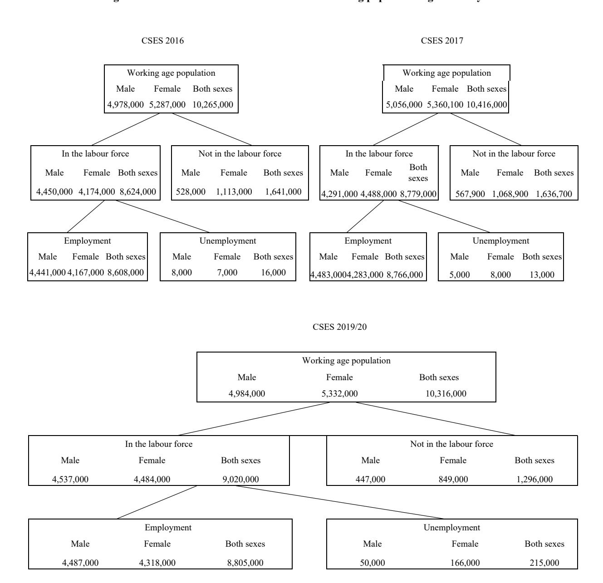

6.1 ប្រជាជន និងកម្លាំងពលកម្ម អាយុ ១៥-៦៤ ឆ្នាំ តាមភេទ និងតំបន់
Population and labour force aged 15-64 years by sex and area

| · · · · · · · · · · · · · · · · · · ·     |               | 2016          |                |                |          | 2017          |                |                |          | 2019/         | 20             |                |
|-------------------------------------------|---------------|---------------|----------------|----------------|----------|---------------|----------------|----------------|----------|---------------|----------------|----------------|
| Labour force and sex                      | Cambodia      | Phnom Penh | Other urban | Other rural | Cambodia | Phnom Penh | Other urban | Other rural | Cambodia | Phnom Penh | Other urban | Other rural |
| Total population, in thousand             | 15,626        | 1,897         | 1,958          | 11,771         | 15,848   | 1,948         | 1,977          | 11,923         | 15,954   | 2,340         | 3,953          | 9,661          |
| Total working age population, in thousand | 10,265        | 1,374         | 1,335          | 7,556          | 10,416   | 1,419         | 1,345          | 7,652          | 10,316   | 1,684         | 2,632          | 6,000          |
| Labour force, in thousand                 | 8,624         | 1,084         | 1,077          | 6,463          | 8,779    | 1,065         | 1,086          | 6,629          | 9,020    | 1,355         | 2,304          | 5,361          |
| Labour force participation rate           | e, in percent |               |                |                |          |               |                |                |          |               |                |                |
| Male                                      | 89.4          | 84.6          | 88.5           | 90.4           | 88.8     | 83            | 86.6           | 90.2           | 84.1     | 76.3          | 84.1           | 86.3           |
| Female                                    | 78.9          | 73.7          | 73.3           | 80.9           | 80.1     | 67.8          | 75.3           | 83.2           | 91.0     | 85.0          | 91.2           | 92.7           |
| Both Sexes                                | 84.0          | 78.9          | 80.7           | 85.5           | 84.3     | 75.1          | 80.7           | 86.6           | 87.4     | 80.5          | 87.5           | 89.4           |
| Employment rate, in percent               |               |               |                |                |          |               |                |                |          |               |                |                |
| Male                                      | 89.2          | 84.1          | 88.5           | 90.2           | 88.7     | 82.7          | 86.5           | 90.1           | 81.0     | 71.4          | 80.5           | 83.9           |
| Female                                    | 78.8          | 73.6          | 72.9           | 80.8           | 79.9     | 67.6          | 74.7           | 83.2           | 90.0     | 84.0          | 90.0           | 91.8           |
| Both Sexes                                | 83.9          | 78.6          | 80.4           | 85.4           | 84.2     | 74.8          | 80.4           | 86.6           | 85.4     | 77.5          | 85.1           | 87.7           |
| Unemployment rate, in percent             | t             |               |                |                |          |               |                |                |          |               |                |                |
| Male                                      | 0.2           | 0.5           | -              | 0.2            | 0.1      | 0.4           | 0.1            | 0.1            | 3.7      | 6.3           | 4.2            | 2.8            |
| Female                                    | 0.1           | 0.1           | 0.4            | 0.1            | 0.1      | 0.2           | 0.6            | 0.1            | 1.1      | 1.2           | 1.3            | 1.0            |
| Both Sexes                                | 0.2           | 0.0           | 0.2            | 0.1            | 0.1      | 0.3           | 0.3            | 0.1            | 2.4      | 3.7           | 2.8            | 1.9            |

6.2 អត្រាចូលរួមកម្លាំងពលកម្ម តាមក្រុមអាយុ និងភេទ គិតជាភាគរយ Labour force participation rate by age groups and sex, in percent

| Age group      |      | 2016   | 5          |       | 201    | 7          |      | 2019/2 | 0          |
|----------------|------|--------|------------|-------|--------|------------|------|--------|------------|
| 1.26 81.0mb    | Male | Female | Both sexes | Male  | Female | Both sexes | Male | Female | Both sexes |
| 15-19          | 57.4 | 62.1   | 59.8       | 10.4  | 11.4   | 10.9       | 56.0 | 61.0   | 58.5       |
| 20-24          | 80.0 | 89.2   | 84.7       | 16.2  | 17.7   | 17.0       | 87.5 | 90.2   | 88.8       |
| 25-34          | 87.3 | 98.6   | 92.9       | 29.3  | 29.7   | 29.5       | 92.1 | 98.0   | 95.0       |
| 35-44          | 98.5 | 88.5   | 93.3       | 18.2  | 18.1   | 18.1       | 92.4 | 98.8   | 95.5       |
| 45-54          | 82.0 | 96.5   | 88.7       | 16.3  | 15.6   | 15.9       | 88.1 | 97.5   | 92.6       |
| 55-64          | 68.6 | 85.9   | 75.6       | 9.6   | 7.6    | 8.6        | 74.9 | 90.9   | 82.0       |
| Total (15-64)  | 78.9 | 89.4   | 62.5       | 100.0 | 100.0  | 100.0      | 84.1 | 91.0   | 87.4       |
| Of which 15-24 | 27.0 | 29.4   | 49.4       | 26.7  | 29.1   | 27.9       | 71.4 | 75.0   | 73.2       |

Source: Cambodia Socio-Economics Survey (CSES), National Institute of Statistics (NIS)

អត្រាចូលរួមកម្លាំងពលកម្ម តាមក្រុមអាយុ និងតំបន់ គិតជាភាគរយ Labour force participation rate by age groups and area, in percent

|                |            | 2016  |       |       |            | 2017  |       |       |            | 2019/2 | :0    |       |
|----------------|------------|-------|-------|-------|------------|-------|-------|-------|------------|--------|-------|-------|
| Age group      | Cambodia   | Phnom | Other | Other | Cambodia   | Phnom | Other | Other | Cambodia   | Phnom  | Other | Other |
|                | Calliboula | Penh  | urban | rural | Calliboula | Penh  | urban | rural | Califoodia | Penh   | urban | rural |
| 15-19          | 59.8       | 35.4  | 56.3  | 63.4  | 10.9       | 4.4   | 9.4   | 12.2  | 58.5       | 29.6   | 56.2  | 65.3  |
| 20-24          | 84.7       | 79.9  | 79.6  | 86.4  | 17         | 16.3  | 15.9  | 17.2  | 88.8       | 78.6   | 89.9  | 91.4  |
| 25-34          | 92.9       | 93.4  | 92.2  | 92.9  | 29.5       | 36.1  | 31.1  | 28.2  | 95.0       | 93.5   | 95.3  | 95.4  |
| 35-44          | 93.3       | 91    | 90.1  | 94.3  | 18.1       | 21.1  | 17.8  | 17.7  | 95.5       | 92.1   | 96.1  | 96.3  |
| 45-54          | 88.7       | 79.6  | 84.6  | 91    | 15.9       | 15.3  | 15.9  | 16.1  | 92.6       | 86.3   | 90.9  | 94.6  |
| 55-64          | 75.6       | 57.8  | 69.8  | 80.1  | 8.6        | 6.8   | 10    | 8.6   | 82.0       | 61.4   | 81.2  | 86.4  |
| Total (15-64)  | 84         | 78.9  | 80.7  | 85.5  | 100        | 100   | 100   | 100   | 87.4       | 80.5   | 87.5  | 89.4  |
| Of which 15-24 | 28.3       | 20.3  | 28.3  | 29.6  | 27.9       | 20.7  | 25.2  | 29.5  | 73.2       | 56.9   | 73.3  | 77.3  |

6.4 អត្រាចូលរួមកម្លាំងពលកម្ម តាមក្រុមអាយុ តំបន់ និងភេទ គិតជាភាគរយ
Labour force participation rate by age groups, area and sex, in percent

| <b>A</b>       | Camb | oodia  | Phnom | n Penh | Other | urban  | Other | rural  |
|----------------|------|--------|-------|--------|-------|--------|-------|--------|
| Age group      | Male | Female | Male  | Female | Male  | Female | Male  | Female |
| 2016           |      |        |       |        |       |        |       |        |
| 15-19          | 62.1 | 80.0   | 29.8  | 41.8   | 63.6  | 49.2   | 66.0  | 60.7   |
| 20-24          | 89.2 | 87.3   | 84.0  | 76.4   | 84.3  | 74.3   | 90.8  | 81.6   |
| 25-34          | 98.6 | 88.5   | 97.7  | 89.6   | 98.7  | 86.2   | 98.8  | 87.0   |
| 35-44          | 98.5 | 82.0   | 98.8  | 83.6   | 98.3  | 82.7   | 98.4  | 90.5   |
| 45-54          | 96.5 | 68.6   | 95.3  | 64.4   | 97.8  | 73.4   | 96.5  | 86.2   |
| 55-64          | 85.9 | 78.9   | 72.3  | 47.0   | 81.6  | 61.1   | 89.6  | 73.9   |
| Total (15-64)  | 89.4 | 0.8    | 84.6  | 73.7   | 88.5  | 73.3   | 90.4  | 80.9   |
| Of which 15-24 | 29.4 | 27.0   | 18.7  | 21.9   | 29.9  | 26.4   | 31.1  | 28.0   |
| 2017           |      |        |       |        |       |        |       |        |
| 15-19          | 11.4 | 10.4   | 4.2   | 4.7    | 10.2  | 8.5    | 12.8  | 11.7   |
| 20-24          | 17.7 | 16.2   | 14.8  | 17.9   | 16.7  | 15     | 18.3  | 16.1   |
| 25-34          | 29.7 | 29.3   | 33.8  | 38.7   | 30.8  | 31.4   | 28.9  | 27.5   |
| 35-44          | 18.1 | 18.2   | 23    | 18.9   | 17.2  | 18.5   | 17.4  | 18     |
| 45-54          | 15.6 | 16.3   | 17.1  | 13.2   | 16.2  | 15.6   | 15.2  | 16.9   |
| 55-64          | 7.6  | 9.6    | 7.1   | 6.5    | 9     | 11     | 7.4   | 9.8    |
| Total (15-64)  | 100  | 100    | 100   | 100    | 100   | 100    | 100   | 100    |
| Of which 15-24 | 29.1 | 26.7   | 19    | 22.6   | 26.9  | 23.5   | 31.1  | 27.8   |
| 2019/20        |      |        |       |        |       |        |       |        |
| 15-19          | 56.0 | 61.0   | 35.0  | 23.6   | 54.7  | 57.6   | 61.1  | 69.5   |
| 20-24          | 87.5 | 90.2   | 80.7  | 76.3   | 89.3  | 90.5   | 88.8  | 94.0   |
| 25-34          | 92.1 | 98.0   | 89.8  | 97.5   | 92.3  | 98.4   | 93.0  | 97.9   |
| 35-44          | 92.4 | 98.8   | 85.3  | 98.9   | 93.1  | 99.1   | 94.2  | 98.6   |
| 45-54          | 88.1 | 97.5   | 74.6  | 98.1   | 85.2  | 96.9   | 92.0  | 97.6   |
| 55-64          | 74.9 | 90.9   | 53.0  | 71.6   | 72.3  | 92.1   | 80.2  | 94.4   |
| Total (15-64)  | 84.1 | 91.0   | 76.3  | 85.0   | 84.1  | 91.2   | 86.3  | 92.7   |
| Of which 15-24 | 71.4 | 75.0   | 60.5  | 53.0   | 72.6  | 73.9   | 73.9  | 80.7   |

6.5 កម្រិតសិក្សានៃកម្លាំងពលកម្ម អាយុ ១៥-៦៤ ឆ្នាំ តាមភេទ និងក្រុមអាយុ គិតជាភាគរយ Education level of the labour force aged 15-64 years by sex and age groups, in percent

|                           | None or   | Primary    | Primary   | Lower     | Upper     | Post-     |       |
|---------------------------|-----------|------------|-----------|-----------|-----------|-----------|-------|
| Age group                 | only some | school not | school    | secondary | secondary | secondary | Total |
|                           | education | completed  | completed | completed | completed | completed |       |
| 2016                      |           |            |           |           |           |           |       |
| Male                      | 6.6       | 30.0       | 29.1      | 17.5      | 8.8       | 8.0       | 100   |
| Female                    | 13.0      | 34.7       | 28.8      | 12.5      | 5.7       | 5.3       | 100   |
| Both Sexes                | 9.7       | 32.3       | 28.9      | 15.1      | 7.3       | 6.7       | 100   |
| Age group                 |           |            |           |           |           |           |       |
| Labour force, in thousand | 836       | 2,783      | 2,494     | 1,303     | 630       | 577       | 8,624 |
| 15-19                     | 3.3       | 23.1       | 49.8      | 19.9      | 3.5       | 0.4       | 100   |
| 20-24                     | 3.1       | 20.8       | 35.5      | 19.7      | 12.2      | 8.8       | 100   |
| 25-34                     | 6.4       | 27.3       | 28.1      | 17.1      | 9.1       | 12        | 100   |
| 35-44                     | 11.8      | 39.1       | 24.9      | 11.7      | 6.6       | 5.9       | 100   |
| 45-54                     | 18.4      | 42.3       | 20.2      | 11.1      | 4.9       | 3.1       | 100   |
| 55-64                     | 22.6      | 51.9       | 15.1      | 7.3       | 2.3       | 0.8       | 100   |
| Total (15-64)             | 9.7       | 32.3       | 28.9      | 15.1      | 7.3       | 6.7       | 100   |
| Of which 15-24            | 6.4       | 43.9       | 85.3      | 39.6      | 15.7      | 9.2       | 100   |
| 2017                      |           |            |           |           |           |           |       |
| Male                      | 9.4       | 28.6       | 27.4      | 17.6      | 9.5       | 7.6       | 100   |
| Female                    | 14.7      | 34.9       | 24.5      | 13.4      | 7.0       | 5.5       | 100   |
| Both Sexes                | 12.0      | 31.7       | 26.0      | 15.5      | 8.2       | 6.6       | 100   |
| Age group                 |           |            |           |           |           |           |       |
| Labour force, in thousand | 1,050     | 2,779      | 2,281     | 1,361     | 722       | 575       | 8,766 |
| 15-19                     | 3.0       | 25.3       | 40.9      | 24.6      | 5.6       | 0.7       | 100   |
| 20-24                     | 4.7       | 21.5       | 28.9      | 20.8      | 14.7      | 14.7      | 100   |
| 25-34                     | 9.4       | 26.9       | 26.5      | 15.8      | 9.8       | 31.3      | 100   |
| 35-44                     | 16.5      | 35.7       | 23.9      | 12.1      | 6.6       | 8.6       | 100   |
| 45-54                     | 19.9      | 41.8       | 19.8      | 10.9      | 5.1       | 3.5       | 100   |
| 55-64                     | 22.2      | 49.1       | 16.0      | 8.4       | 2.6       | 1.3       | 100   |
| Total (15-64)             | 12.0      | 31.7       | 26.0      | 15.5      | 8.2       | 60.3      | 100   |
| Of which 15-24            | 4.0       | 23.0       | 33.6      | 22.3      | 11.1      | 15.4      | 100   |
| 2019/20                   |           |            |           |           |           |           |       |
| Male                      | 9.5       | 29.6       | 27.7      | 16.3      | 8.2       | 8.8       | 100   |
| Female                    | 15.2      | 34.0       | 25.1      | 13.4      | 6.3       | 5.9       | 100   |
| Both Sexes                | 12.4      | 31.8       | 26.4      | 14.9      | 7.2       | 7.4       | 100   |
| Age group                 |           |            |           |           |           |           |       |
| Labour force, in thousand | 1,115     | 2,865      | 2,384     | 1,340     | 653       | 663       | 9,020 |
| 15-19                     | 3.5       | 24.3       | 40.9      | 26.1      | 4.2       | 1.1       | 100   |
| 20-24                     | 4.9       | 21.1       | 32.5      | 18.5      | 12.9      | 10.1      | 100   |
| 25-34                     | 7.3       | 25.2       | 28.9      | 16.1      | 9.8       | 12.8      | 100   |
| 35-44                     | 15.4      | 36.0       | 23.4      | 12.4      | 5.9       | 6.9       | 100   |
| 45-54                     | 17.8      | 41.3       | 21.8      | 10.7      | 5.1       | 3.4       | 100   |
| 55-64                     | 28.9      | 46.6       | 12.8      | 8.5       | 1.9       | 1.3       | 100   |
| Total (15-64)             | 12.4      | 31.8       | 26.4      | 14.9      | 7.2       | 7.4       | 100   |
| Of which 15-24            | 4.3       | 22.4       | 36        | 21.6      | 9.3       | 6.4       | 100   |

6.6 ស្ថានភាពការងារ អាយុ ១៥-៦៤ ឆ្នាំ តាមភេទ គិតជាភាគរយ Employment status aged 15-64 years by sex, in percent

|                                         |       | 2016   |               |       | 2017   |               |       | 2019/20 |               |
|-----------------------------------------|-------|--------|---------------|-------|--------|---------------|-------|---------|---------------|
| Employment status                       | Male  | Female | Both sexes | Male  | Female | Both sexes | Male  | Female  | Both sexes |
| Employed population, number in thousand | 4,440 | 4,167  | 8,607         | 5,056 | 5,360  | 10,416        | 4,318 | 4,487   | 8,805         |
| Paid employee                           | 57.4  | 42.8   | 50.3          | 56.6  | 45.2   | 51.0          | 53.1  | 40.9    | 47.1          |
| Employer                                | 0.1   | 0.0    | 0.1           | 0.2   | 0.0    | 0.1           | 0.5   | 0.3     | 0.4           |
| Own account worker/self-employed        | 37.6  | 51.6   | 44.4          | 39.1  | 50.1   | 44.5          | 37.1  | 38.6    | 37.8          |
| Unpaid family worker                    | 4.9   | 5.6    | 5.2           | 4.0   | 4.7    | 4.3           | 9.2   | 20.2    | 14.6          |
| Other/Don't know                        | 0.0   | -      | 0.0           | 0.0   | 0.0    | 0.0           | 0.0   | 0.0     | 0.0           |
| Total                                   | 100   | 100    | 100           | 100   | 100    | 100           | 100   | 100     | 100           |

## 6.7 ស្ថានភាពការងារ អាយុ ១៥-៦៤ ឆ្នាំ តាមតំបន់ គិតជាភាគរយ

Employment status aged 15-64 years by area, in percent

| -                                       |          | 2016          |                |                |          | 2017          |                |                |          | 2019/2        | 20             |                |
|-----------------------------------------|----------|---------------|----------------|----------------|----------|---------------|----------------|----------------|----------|---------------|----------------|----------------|
| Employment status                       | Cambodia | Phnom Penh | Other urban | Other rural | Cambodia | Phnom Penh | Other urban | Other rural | Cambodia | Phnom Penh | Other urban | Other rural |
| Employed population, number in thousand | 8,607    | 1,080         | 1,074          | 6,453          | 10,416   | 1,419         | 1,345          | 7,652          | 8,805    | 1,305         | 2,240          | 5,260          |
| Paid employee                           | 50.3     | 70.0          | 54.0           | 46.4           | 51.0     | 74.2          | 54.6           | 46.7           | 47.1     | 66.3          | 55.7           | 38.7           |
| Employer                                | 0.0      | -             | 0.1            | 0.1            | 0.1      | 0.0           | 0.1            | 0.1            | 0.4      | 0.3           | 0.6            | 0.4            |
| Own account worker/self- employed    | 44.4     | 25.3          | 40.8           | 48.2           | 44.5     | 23.5          | 42.2           | 48.3           | 37.8     | 27.2          | 33.3           | 42.4           |
| Unpaid family worker                    | 5.2      | 4.7           | 5.0            | 5.3            | 4.3      | 2.3           | 3.1            | 4.9            | 14.6     | 6.2           | 10.4           | 18.5           |
| Other/Don't know                        | 0.0      | -             | -              | 0.0            | 0.0      | 0.0           | 0.1            | 0.0            | 0.0      | 0.0           | 0.1            | 0.0            |
| Total                                   | 100      | 100           | 100            | 100            | 100      | 100           | 100            | 100            | 100      | 100           | 100            | 100            |

6.8 ស្ថានភាពការងារ អាយុ ១៥-៦៤ ឆ្នាំ តាមភេទ និងតំបន់ គិតជាភាគរយ
Employment status aged 15-64 years by sex and area, in percent

| Employment status                       | Caml  | oodia  | Phnon | n Penh | Other | urban  | Other | rural  |
|-----------------------------------------|-------|--------|-------|--------|-------|--------|-------|--------|
| Employment status                       | Male  | Female | Male  | Female | Male  | Female | Male  | Female |
| 2016                                    |       |        |       |        |       |        |       |        |
| Employed population, number in thousand | 4,440 | 4,167  | 550   | 530    | 571   | 502    | 3,319 | 3,134  |
| Paid employee                           | 57.4  | 42.8   | 75.9  | 63.9   | 63.4  | 43.4   | 53.3  | 39.1   |
| Employer                                | 0.1   | 0.0    | 0.0   | 0.0    | 0.2   | 0.0    | 0.1   | 0.1    |
| Own account worker/self-employed        | 37.6  | 51.6   | 21.1  | 29.6   | 32.0  | 50.9   | 41.3  | 55.4   |
| Unpaid family worker                    | 4.9   | 5.6    | 3.0   | 6.5    | 4.4   | 5.7    | 5.2   | 5.4    |
| Other/Don't know                        | 0.0   | 0.0    | 0.0   | 0.0    | 0.0   | 0.0    | 0.0   | 0.0    |
| Total                                   | 100   | 100    | 100   | 100    | 100   | 100    | 100   | 100    |
| 2017                                    |       |        |       |        |       |        |       |        |
| Employed population, number in thousand | 4,283 | 4,483  | 503   | 558    | 523   | 558    | 3,257 | 3,367  |
| Paid employee                           | 84.7  | 83.6   | 74.5  | 75.0   | 81.2  | 79.6   | 87.2  | 86.0   |
| Employer                                | 45.2  | 56.6   | 68.8  | 79.0   | 45.7  | 63.0   | 41.4  | 51.8   |
| Own account worker/self-employed        | 0.0   | 0.2    | 0.0   | 0.0    | 0.0   | 0.1    | 0.0   | 0.3    |
| Unpaid family worker                    | 50.1  | 39.1   | 27.0  | 20.3   | 51.4  | 33.5   | 53.5  | 43.2   |
| Other/Don't know                        | 4.7   | 4.0    | 4.1   | 0.7    | 2.9   | 3.2    | 5.0   | 4.7    |
| Total                                   | 100   | 100    | 100   | 100    | 100   | 100    | 100   | 100    |
| 2019/20                                 |       |        |       |        |       |        |       |        |
| Employed population, number in thousand | 4,487 | 4,318  | 681   | 624    | 1,158 | 1,082  | 2,648 | 2,612  |
| Paid employee                           | 53.1  | 40.9   | 72.4  | 59.6   | 60.2  | 50.8   | 45.0  | 32.4   |
| Employer                                | 0.5   | 0.3    | 0.5   | 0.1    | 0.7   | 0.4    | 0.5   | 0.2    |
| Own account worker/self-employed        | 37.1  | 38.6   | 22.7  | 32.2   | 32.1  | 34.6   | 43.0  | 41.7   |
| Unpaid family worker                    | 9.2   | 20.2   | 4.5   | 8.1    | 7.0   | 14.1   | 11.5  | 25.7   |
| Other/Don't know                        | 0.0   | 0.0    | 0.0   | 0.0    | 0.0   | 0.1    | 0.1   | 0.0    |
| Total                                   | 100   |        | 100   | 100    | 100   | 100    | 100   | 100    |

6.9 ប្រជាជនមានការងារធ្វើ អាយុ ១៥-៦៤ ឆ្នាំ តាមមុខរបរចម្បង និងភេទ គិតជាភាគរយ
Employment population aged 15-64 years by main occupation and sex, in percent

|                                                    |      | 2016   |               |      | 2017   |               |      | 2019/20 |               |
|----------------------------------------------------|------|--------|---------------|------|--------|---------------|------|---------|---------------|
| Main occupation                                    | Male | Female | Both sexes | Male | Female | Both sexes | Male | Female  | Both sexes |
| Armed forces occupations                           | 0.1  | 1.6    | 0.9           | 1.7  | 0.1    | 0.9           | 1.9  | 0.1     | 1.0           |
| Manager                                            | 0.7  | 1.0    | 0.8           | 1.1  | 0.4    | 0.7           | 1.4  | 0.8     | 1.1           |
| Professionals                                      | 3.9  | 3.1    | 3.5           | 3.3  | 3.6    | 3.5           | 3.9  | 3.7     | 3.8           |
| Technicians and associate professionals            | 1.0  | 0.8    | 0.9           | 1.8  | 1.1    | 1.5           | 2.9  | 1.7     | 2.3           |
| Clerical support workers                           | 3.5  | 5.8    | 4.7           | 5.5  | 4.1    | 4.8           | 4.0  | 3.1     | 3.5           |
| Service and sales workers                          | 24.1 | 13.8   | 18.8          | 12.6 | 23.5   | 17.9          | 12.5 | 24.5    | 18.4          |
| Skilled agricultural, forestry and fishery workers | 33.7 | 28.2   | 30.9          | 28.5 | 32.5   | 30.5          | 27.6 | 33.2    | 30.3          |
| Craft and related worker                           | 22.4 | 23.6   | 23.0          | 24.8 | 23.1   | 24.0          | 24.1 | 21.5    | 22.9          |
| Plant and machine operators and assemblers         | 0.6  | 8.7    | 4.8           | 7.6  | 0.5    | 4.1           | 8.2  | 0.9     | 4.6           |
| Elementary occupations                             | 10.2 | 13.3   | 11.8          | 13.1 | 11.1   | 12.1          | 13.5 | 10.4    | 11.9          |
| Other/Don't know/Not stated                        | -    | -      | -             | 1.7  | 0.1    | 0.9           | 1.9  | 0.1     | 1.0           |
| Total                                              | 100  | 100    | 100           | 100  | 100    | 100           | 100  | 100     | 100           |

6.10 ប្រជាជនមានការងារធ្វើ អាយុ ១៥-៦៤ ឆ្នាំ តាមមុខរបរចម្បង និងតំបន់ គិតជាភាគរយ
Employment population aged 15-64 years by main occupation and area, in percent

|                                                          |          | 2016          |                |                |          | 2017          |                |                |          | 2019/2        | 0              |                |
|----------------------------------------------------------|----------|---------------|----------------|----------------|----------|---------------|----------------|----------------|----------|---------------|----------------|----------------|
| Main occupation                                          | Cambodia | Phnom Penh | Other urban | Other rural | Cambodia | Phnom Penh | Other urban | Other rural | Cambodia | Phnom Penh | Other urban | Other rural |
| Armed forces occupations                                 | 0.9      | 2.1           | 1.1            | 0.6            | 0.9      | 1.4           | 1.2            | 0.8            | 1.0      | 2.2           | 1.3            | 0.6            |
| Manager                                                  | 0.8      | 2.9           | 1.1            | 0.5            | 0.7      | 2.7           | 1.1            | 0.4            | 1.1      | 2.9           | 1.4            | 0.6            |
| Professionals                                            | 3.5      | 8.2           | 4.7            | 2.5            | 3.5      | 9.0           | 5.4            | 2.2            | 3.8      | 7.8           | 4.9            | 2.3            |
| Technicians and associate professionals                  | 0.9      | 2.2           | 1.2            | 0.6            | 1.5      | 3.2           | 2.4            | 1.0            | 2.3      | 6.0           | 2.8            | 1.2            |
| Clerical support workers                                 | 4.7      | 15.6          | 8.1            | 2.3            | 4.8      | 14.9          | 9.4            | 2.5            | 3.5      | 11.3          | 4.0            | 1.4            |
| Service and sales workers                                | 18.8     | 32.7          | 32.8           | 14.1           | 17.9     | 29.9          | 33.1           | 13.6           | 18.4     | 31.8          | 23.8           | 12.8           |
| Skilled agricultural, forestry and fishery workers | 30.9     | 1.0           | 11.5           | 39.1           | 30.5     | 1.2           | 11.2           | 38.3           | 30.3     | 0.7           | 15.6           | 44.0           |
| Craft and related worker                                 | 23.0     | 24.0          | 23.5           | 22.8           | 24.0     | 23.4          | 22.2           | 24.3           | 22.9     | 23.5          | 29.0           | 20.1           |
| Plant and machine operators and assemblers               | 4.8      | 7.5           | 7.0            | 4.0            | 4.1      | 9.1           | 4.2            | 3.3            | 4.6      | 6.8           | 6.1            | 3.4            |
| Elementary occupations                                   | 11.8     | 3.7           | 9.0            | 13.6           | 12.1     | 5.2           | 9.9            | 13.6           | 11.9     | 7.0           | 11.1           | 13.6           |
| Other/Don't know/Not stated                              | 0.9      | 2.1           | 1.1            | 0.6            | 0.9      | 1.4           | 1.2            | 0.8            | 1.0      | 2.2           | 1.3            | 0.6            |
| Total                                                    | 100      | 100           | 100            | 100            | 100      | 100           | 100            | 100            | 100      | 100           | 100            | 100            |

6.11 ប្រជាជនមានការងារធ្វើ អាយុ ១៥-៦៤ ឆ្នាំ តាមមុខរបរចម្បង ភេទ និងតំបន់ គិតជាភាគរយ
Employment population aged 15-64 years by main occupation, sex and area, in percent

| M                                                  | Caml | oodia  | Phnon | n Penh | Other | urban  | Other | r rural |
|----------------------------------------------------|------|--------|-------|--------|-------|--------|-------|---------|
| Main occupation                                    | Male | Female | Male  | Female | Male  | Female | Male  | Female  |
| 2016                                               |      |        |       |        |       | •      |       |         |
| Armed forces occupations                           | 1.6  | 0.1    | 3.8   | 0.3    | 1.9   | 0.3    | 1.2   | 0.0     |
| Manager                                            | 1.0  | 0.7    | 2.6   | 2.6    | 1.4   | 0.7    | 0.7   | 0.2     |
| Professionals                                      | 3.1  | 3.8    | 6.5   | 6.5    | 3.8   | 5.7    | 2.4   | 2.5     |
| Technicians and associate professionals            | 0.8  | 1.0    | 2.8   | 2.8    | 1.0   | 1.5    | 0.5   | 0.8     |
| Clerical support workers                           | 5.8  | 3.4    | 18.8  | 18.8   | 10.0  | 5.8    | 2.9   | 1.6     |
| Service and sales workers                          | 13.8 | 24.0   | 26.2  | 26.2   | 22.2  | 44.7   | 10.2  | 18.2    |
| Skilled agricultural, forestry and fishery workers | 28.4 | 33.5   | 1.3   | 1.3    | 10.5  | 12.5   | 35.8  | 42.7    |
| Craft and related worker                           | 23.7 | 22.3   | 20.8  | 20.8   | 27.8  | 18.7   | 23.4  | 22.1    |
| Plant and machine operators and assemblers         | 8.8  | 0.6    | 14.0  | 14.0   | 12.4  | 0.8    | 7.2   | 0.5     |
| Elementary occupations                             | 13.3 | 10.1   | 3.1   | 3.1    | 9.0   | 9.0    | 15.7  | 11.3    |
| Other/Don't know/Not stated                        | 1.6  | 0.1    | 3.8   | 0.3    | 1.9   | 0.3    | 1.2   | 0.0     |
| Total                                              | 100  | 100    | 100   | 100    | 100   | 100    | 100   | 100     |
| 2017                                               |      |        |       |        |       |        |       |         |
| Armed forces occupations                           | 1.7  | 0.1    | 2.3   | 0.4    | 2.4   | -      | 1.4   | 0.0     |
| Manager                                            | 1.1  | 0.4    | 3.9   | 1.3    | 1.2   | 0.9    | 0.6   | 0.1     |
| Professionals                                      | 3.3  | 3.6    | 7.8   | 10.4   | 5.0   | 5.8    | 2.3   | 2.2     |
| Technicians and associate professionals            | 1.8  | 1.1    | 4.6   | 1.7    | 2.7   | 2.2    | 1.2   | 0.8     |
| Clerical support workers                           | 5.5  | 4.1    | 16.4  | 13.1   | 11.3  | 7.3    | 2.8   | 2.2     |
| Service and sales workers                          | 12.6 | 23.5   | 22.0  | 38.7   | 23.4  | 43.4   | 9.3   | 18.0    |
| Skilled agricultural, forestry and fishery workers | 28.5 | 32.5   | 1.1   | 1.3    | 9.9   | 12.5   | 36.2  | 40.5    |
| Craft and related worker                           | 24.8 | 23.1   | 19.6  | 27.6   | 26.0  | 18.1   | 25.5  | 23.2    |
| Plant and machine operators and assemblers         | 7.6  | 0.5    | 16.9  | 0.4    | 7.6   | 0.5    | 6.0   | 0.5     |
| Elementary occupations                             | 13.1 | 11.1   | 5.3   | 5.1    | 10.5  | 9.2    | 14.8  | 12.4    |
| Other/Don't know/Not stated                        | 1.7  | 0.1    | 2.3   | 0.4    | 2.4   | -      | 1.4   | 0.0     |
| Total                                              | 100  | 100    | 100   | 100    | 100   | 100    | 100   | 100     |
| 2019/20                                            |      |        |       |        |       |        |       |         |
| Armed forces occupations                           | 1.9  | 0.1    | 3.9   | 0.2    | 2.3   | 0.2    | 1.2   | 0.1     |
| Manager                                            | 1.4  | 0.8    | 2.8   | 3.0    | 1.9   | 0.9    | 0.9   | 0.3     |
| Professionals                                      | 3.9  | 3.7    | 8.3   | 7.3    | 5.1   | 4.7    | 2.2   | 2.5     |
| Technicians and associate professionals            | 2.9  | 1.7    | 7.7   | 4.2    | 3.3   | 2.3    | 1.5   | 0.9     |
| Clerical support workers                           | 4.0  | 3.1    | 13.6  | 8.7    | 4.1   | 4.0    | 1.5   | 1.4     |
| Service and sales workers                          | 12.5 | 24.5   | 21.5  | 43.0   | 17.3  | 30.8   | 8.2   | 17.4    |
| Skilled agricultural, forestry and fishery workers | 27.6 | 33.2   | 0.8   | 0.6    | 14.4  | 16.7   | 40.2  | 47.8    |
| Craft and related worker                           | 24.1 | 21.5   | 21.7  | 25.5   | 28.8  | 29.1   | 22.7  | 17.4    |
| Plant and machine operators and assemblers         | 8.2  | 0.9    | 12.3  | 0.8    | 10.7  | 1.2    | 6.1   | 0.8     |
| Elementary occupations                             | 13.5 | 10.4   | 7.2   | 6.6    | 12.0  | 10.0   | 15.7  | 11.4    |
| Other/Don't know/Not stated                        | 1.9  | 0.1    | 3.9   | 0.2    | 2.3   | 0.2    | 1.2   | 0.1     |
| Total                                              | 100  | 100    | 100   | 100    | 100   | 100    | 100   | 100     |

6.12 ប្រជាជនមានការងារធ្វើ អាយុ ១៥-៦៤ ឆ្នាំ តាមសកម្មភាពសេដ្ឋកិច្ចចម្បង និងភេទ គិតជាភាគរយ Employment population aged 15-64 years by main industry and sex, in percent

| Industrial sector                       |       | 2016   |            |       | 2017   |            |       | 2019/2 | 0          |
|-----------------------------------------|-------|--------|------------|-------|--------|------------|-------|--------|------------|
| (main occupation)                       | Male  | Female | Both sexes | Male  | Female | Both sexes | Male  | Female | Both sexes |
| Employed population, number in thousand | 4,441 | 4,167  | 8,608      | 5,056 | 5,360  | 10,416     | 4,487 | 4,318  | 8,805      |
| Agriculture (Primary)                   | 33.7  | 39.3   | 36.4       | 35.1  | 39     | 37         | 33.0  | 38.0   | 35.5       |
| Industry (Secondary)                    | 27.9  | 25.2   | 26.6       | 27.3  | 25.1   | 26.2       | 27.9  | 24.2   | 26.1       |
| Services (Tertiary)                     | 38.4  | 35.5   | 37.0       | 37.6  | 35.6   | 36.8       | 39.1  | 37.8   | 38.4       |
| Other/Don't know/Not stated             | 33.7  | 39.3   | 36.4       | 35.1  | 39     | 37         | 33.0  | 38.0   | 35.5       |
| Total                                   | 100   | 100    | 100        | 100   | 100    | 100        | 100   | 100    | 100        |

6.13 ប្រជាជនមានការងារធ្វើ អាយុ ១៥-៦៤ ឆ្នាំ តាមសកម្មភាពសេដ្ឋកិច្ចចម្បង និងតំបន់ គិតជាភាគរយ Employment population aged 15-64 years by main industry and area, in percent

|                                         |          | 2016          |                |                |          | 2017          |                |       |          | 2019/20       |                |                |
|-----------------------------------------|----------|---------------|----------------|----------------|----------|---------------|----------------|-------|----------|---------------|----------------|----------------|
| Industrial sector (main occupation)  | Cambodia | Phnom Penh | Other urban | Other rural | Cambodia | Phnom Penh | Other urban |       | Cambodia | Phnom Penh | Other urban | Other rural |
| Employed population, number in thousand | 8,608    | 1,080         | 1,074          | 6,454          | 10,416   | 1,419         | 1,345          | 7,652 | 8,805    | 1,305         | 2,240          | 5,260          |
| Agriculture (Primary)                   | 36.4     | 1.0           | 12.4           | 46.3           | 37.0     | 1.2           | 13.9           | 46.5  | 35.5     | 0.9           | 18.3           | 51.4           |
| Industry (Secondary)                    | 26.6     | 26.0          | 26.5           | 26.7           | 26.2     | 25.2          | 21.2           | 27.2  | 26.1     | 26.1          | 33.0           | 23.2           |
| Services (Tertiary)                     | 37.0     | 73.0          | 61.1           | 27.0           | 36.8     | 73.6          | 64.9           | 26.3  | 38.4     | 73.0          | 48.8           | 25.5           |
| Other/Don't know/Not stated             | 36.4     | 1.0           | 12.4           | 46.3           | 37.0     | 1.2           | 13.9           | 46.5  | 35.5     | 0.9           | 18.3           | 51.4           |
| Total                                   | 100      | 100           | 100            | 100            | 100      | 100           | 100            | 100   | 100      | 100           | 100            | 100            |

6.14 ប្រជាជនមានការងារធ្វើ អាយុ ១៥-៦៤ ឆ្នាំ តាមសកម្មភាពសេដ្ឋកិច្ចចម្បង ភេទ និងតំបន់ គិតជាភាគរយ Employment population aged 15-64 years by main industry, sex and area, in percent

| Industrial sector                       | Cam   | bodia  | Phnon | n Penh | Other | urban  | Othe  | r rural |
|-----------------------------------------|-------|--------|-------|--------|-------|--------|-------|---------|
| (main occupation)                       | Male  | Female | Male  | Female | Male  | Female | Male  | Female  |
| 2016                                    |       |        |       |        |       | 1      | •     |         |
| Employed population, number in thousand | 4,441 | 4,167  | 550   | 530    | 571   | 503    | 3,320 | 3,134   |
| Agriculture (Primary)                   | 33.7  | 39.3   | 1.2   | 0.7    | 11.3  | 13.6   | 42.9  | 49.9    |
| Industry (Secondary)                    | 27.9  | 25.2   | 22.1  | 30.1   | 30.5  | 21.9   | 28.4  | 24.9    |
| Services (Tertiary)                     | 38.4  | 35.5   | 76.6  | 69.2   | 58.1  | 64.5   | 28.7  | 25.2    |
| Other/Don't know/Not stated             | 33.7  | 39.3   | 1.2   | 0.7    | 11.3  | 13.6   | 42.9  | 49.9    |
| Total                                   | 100   | 100    | 100   | 100    | 100   | 100    | 100   | 100     |
| 2017                                    |       |        |       |        |       |        |       |         |
| Employed population, number in thousand | 5,056 | 5,360  | 675   | 744    | 644   | 700    | 3,736 | 3,916   |
| Agriculture (Primary)                   | 35.1  | 39     | 1.2   | 1.2    | 12.2  | 15.7   | 44.5  | 48.5    |
| Industry (Secondary)                    | 27.3  | 25.1   | 22    | 28.7   | 23.8  | 18.5   | 28.8  | 25.6    |
| Services (Tertiary)                     | 37.6  | 35.9   | 76.8  | 70     | 64    | 65.8   | 26.7  | 25.8    |
| Other/Don't know/Not stated             | 35.1  | 39     | 1.2   | 1.2    | 12.2  | 15.7   | 44.5  | 48.5    |
| Total                                   | 100   | 100    | 100   | 100    | 100   | 100    | 100   | 100     |
| 2019/20                                 |       |        |       |        |       |        |       |         |
| Employed population, number in thousand | 4,487 | 4,318  | 681   | 624    | 1,158 | 1,082  | 2,648 | 2,612   |
| Agriculture (Primary)                   | 33.0  | 38.0   | 0.7   | 1.1    | 17.3  | 19.3   | 48.2  | 54.6    |
| Industry (Secondary)                    | 27.9  | 24.2   | 25.1  | 27.1   | 33.5  | 32.4   | 26.2  | 20.1    |
| Services (Tertiary)                     | 39.1  | 37.8   | 74.2  | 71.8   | 49.2  | 48.3   | 25.6  | 25.3    |
| Other/Don't know/Not stated             | 33.0  | 38.0   | 0.7   | 1.1    | 17.3  | 19.3   | 48.2  | 54.6    |
| Total                                   | 100   | 100    | 100   | 100    | 100   | 100    | 100   | 100     |

6.15 កុមារធ្វើការ អាយុ ៥-១៧ ឆ្នាំ តាមភេទ គិតជាភាគរយ
Working children aged 5-17 years by sex, in percent

| Working children        |      | 2016   |            |      | 201′   | 7          |      | 2019/2 | 0          |
|-------------------------|------|--------|------------|------|--------|------------|------|--------|------------|
| Working ciniaren        | Male | Female | Both sexes | Male | Female | Both sexes | Male | Female | Both sexes |
| Working Children        | 19.8 | 17.0   | 18.5       | 17.6 | 16.5   | 17.1       | 19.9 | 16.4   | 18.2       |
| Not in the labour force | 80.1 | 82.8   | 81.4       | 82.4 | 83.5   | 82.9       | 80.1 | 83.6   | 81.8       |
| Total                   | 100  | 100    | 100        | 100  | 100    | 100        | 100  | 100    | 100        |

6.16 កុមារធ្វើការ អាយុ ៥-១៧ ឆ្នាំ បច្ចុប្បន្នកំពុងសិក្សា តាមភេទ គិតជាភាគរយ

Working children aged 5-17 years currently attending school by sex, in percent

| Working children               |      | 2016   | 5          |      | 201    | 7          |      | 2019/2 | 0          |
|--------------------------------|------|--------|------------|------|--------|------------|------|--------|------------|
| C                              | Male | Female | Both sexes | Male | Female | Both sexes | Male | Female | Both sexes |
| Working Children in school     | 41.3 | 37.4   | 39.6       | 37.6 | 35.9   | 36.8       | 53.7 | 51.1   | 52.3       |
| Working Children not in school | 55.6 | 60.5   | 57.8       | 58.9 | 61.6   | 60.2       | 46.3 | 48.9   | 47.7       |
| Total                          | 100  | 100    | 100        | 100  | 100    | 100        | 100  | 100    | 100        |

7

# នារអម់ំំ

### **Education**

7.1 ចំនួនសាលារៀន ថ្នាក់រៀន ក្នុងប្រព័ន្ធអប់រំចំណេះទូទៅ តាមឆ្នាំសិក្សា Number of schools, classes in general education by academic year

|                  |                | <u> </u>       | Schools |       | ation by a |                | <u> </u>       | Classes |       |        |
|------------------|----------------|----------------|---------|-------|------------|----------------|----------------|---------|-------|--------|
| Acudemic Year | Pre- school | Primary school | College | Lycee | Total      | Pre- school | Primary school | College | Lycee | Total  |
| 1979-80          | 96             | n.a            | 14      | 1     | 111        | 230            | 12,069         | 101     | 7     | 12,407 |
| 1980-81          | 149            | n.a            | 62      | 2     | 213        | 446            | 25,526         | 394     | 14    | 26,380 |
| 1981-82          | 213            | 3,521          | 96      | 5     | 3,835      | 448            | 31,909         | 938     | 33    | 33,328 |
| 1982-83          | 371            | 3,114          | 173     | 7     | 3,665      | 823            | 33,740         | 1,949   | 73    | 36,585 |
| 1983-84          | 500            | 3,005          | 200     | 13    | 3,718      | 1,128          | 33,287         | 3,089   | 149   | 37,653 |
| 1984-85          | 541            | 3,133          | 222     | 19    | 3,915      | 1,420          | 33,345         | 4,698   | 211   | 39,674 |
| 1985-86          | 689            | 2,294          | 278     | 28    | 3,289      | 1,557          | 31,062         | 5,730   | 266   | 38,615 |
| 1986-87          | 551            | 4,282          | 304     | 33    | 5,170      | 1,864          | 30,946         | 6,262   | 364   | 39,436 |
| 1987-88          | 560            | 4,780          | 337     | 40    | 5,717      | 2,059          | 30,890         | 6,538   | 497   | 39,984 |
| 1988-89          | 679            | 4,730          | 373     | 49    | 5,831      | 2,195          | 31,384         | 6,265   | 650   | 40,494 |
| 1989-90          | 416            | 4,773          | 394     | 61    | 5,644      | 2,181          | 31,553         | 5,602   | 817   | 40,153 |
| 1990-91          | 397            | 4,665          | 397     | 66    | 5,525      | 1,789          | 32,858         | 5,064   | 919   | 40,630 |
| 1991-92          | 221            | 4,555          | 407     | 80    | 5,263      | 1,714          | 33,142         | 4,848   | 1,084 | 40,788 |
| 1992-93          | 220            | 4,539          | 358     | 82    | 5,199      | 1,712          | 35,025         | 4,844   | 1,216 | 42,797 |
| 1993-94          | 203            | 4,693          | 354     | 89    | 5,339      | 1,700          | 36,798         | 5,402   | 1,350 | 45,250 |
| 1994-95          | 184            | 4,744          | 363     | 90    | 5,381      | 1,586          | 39,159         | 6,001   | 1,244 | 47,990 |
| 1995-96          | 188            | 4,845          | 350     | 92    | 5,475      | 1,516          | 40,691         | 5,851   | 1,561 | 49,619 |
| 1996-97          | 812            | 4,899          | 351     | 106   | 6,168      | 1,438          | 43,469         | 6,304   | 1,370 | 52,581 |
| 1997-98          | 793            | 5,026          | 350     | 125   | 6,294      | 1,393          | 45,443         | 5,926   | 1,653 | 54,415 |
| 1998-99          | 806            | 5,156          | 355     | 132   | 6,449      | 1,414          | 48,370         | 5,903   | 1,860 | 57,547 |
| 1999-00          | 874            | 5,274          | 363     | 140   | 6,651      | 1,523          | 50,960         | 5,951   | 2,262 | 60,696 |
| 2000-01          | 915            | 5,468          | 367     | 151   | 6,901      | 1,605          | 55,448         | 6,860   | 2,299 | 66,212 |
| 2001-02          | 1,015          | 5,741          | 379     | 163   | 7,298      | 1,772          | 60,698         | 7,795   | 2,443 | 72,708 |
| 2002-03          | 1,145          | 5,915          | 411     | 183   | 7,654      | 2,041          | 59,897         | 8,799   | 2,721 | 73,458 |
| 2003-04          | 1,238          | 6,063          | 486     | 212   | 7,999      | 2,205          | 60,985         | 9,566   | 3,165 | 75,921 |
| 2004-05          | 1,345          | 6,180          | 578     | 232   | 8,335      | 2,316          | 61,648         | 10,744  | 3,513 | 78,221 |
| 2005-06          | 1,429          | 6,277          | 670     | 252   | 8,628      | 2,413          | 61,901         | 11,783  | 3,996 | 80,093 |
| 2006-07          | 1,524          | 6,365          | 846     | 283   | 9,018      | 2,548          | 61,249         | 12,633  | 4,303 | 80,733 |
| 2007-08          | 1,634          | 6,476          | 1,006   | 315   | 9,431      | 2,678          | 60,384         | 13,300  | 4,968 | 81,330 |
| 2008-09          | 1,798          | 6,565          | 1,122   | 349   | 9,834      | 2,916          | 60,227         | 13,281  | 5,604 | 82,028 |
| 2009-10          | 1,895          | 6,665          | 1,172   | 383   | 10,115     | 3,111          | 58,062         | 13,024  | 6,311 | 80,508 |
| 2010-11          | 2,092          | 6,767          | 1,189   | 407   | 10,455     | 4,343          | 57,697         | 12,504  | 6,786 | 81,330 |
| 2011-12          | 2,575          | 6,849          | 1,196   | 426   | 11,046     | 4,006          | 58,594         | 12,251  | 6,750 | 81,601 |
| 2012-13          | 2,813          | 6,910          | 1,214   | 433   | 11,370     | 4,248          | 58,837         | 12,184  | 6,361 | 81,630 |
| 2013-14          | 3,184          | 6,993          | 1,244   | 444   | 11,865     | 4,929          | 59,454         | 12,281  | 6,031 | 82,695 |
| 2014-15          | 3,443          | 7,051          | 1,249   | 455   | 12,198     | 5,261          | 59,654         | 12,390  | 5,933 | 83,238 |
| 2015-16          | 3,706          | 7,085          | 1,251   | 463   | 12,505     | 5,974          | 60,224         | 12,590  | 6,020 | 84,808 |
| 2016-17          | 4,014          | 7,144          | 1,245   | 486   | 12,889     | 6,403          | 61,255         | 12,838  | 6,217 | 86,713 |
| 2017-18          | 4,176          | 7,189          | 1,237   | 511   | 13,113     | 6,825          | 61,635         | 13,218  | 6,685 | 88,363 |

Source: Department of Planning, Ministry of Education, Youth and Sport

Note: Number of school refers to total number of school in the specified area or with specific characteristics. Classes refer to number of class in the school.

7.2 ចំនួនសិស្ស និងបុគ្គលិកសិក្សា ក្នុងប្រព័ន្ធអប់រំចំណេះទូទៅ តាមឆ្នាំសិក្សា
Number of students and educational personnel in general education by academic year

|                  |         |           | Student |         |           |        | Educa   | tional pers | onnel  |         |
|------------------|---------|-----------|---------|---------|-----------|--------|---------|-------------|--------|---------|
| Acudemic Year | Pre-    | Primary   | College | Lycee   | Total     | Pre-   | Primary | College     | Lycee  | Total   |
|                  | school  | school    |         |         |           | school | school  |             |        |         |
| 1979-80          | 8,229   | 947,317   | 4,803   | 281     | 960,630   | 267    | 13,619  | 205         | 20     | 14,111  |
| 1980-81          | 15,077  | 1,328,053 | 17,291  | 555     | 1,360,976 | 630    | 30,316  | 671         | 28     | 31,645  |
| 1981-82          | 16,579  | 1,538,839 | 39,515  | 1,517   | 1,596,450 | 818    | 31,884  | 1,586       | 65     | 34,353  |
| 1982-83          | 23,797  | 1,597,081 | 87,005  | 3,493   | 1,711,376 | 956    | 34,859  | 3,300       | 158    | 39,273  |
| 1983-84          | 25,466  | 1,504,839 | 145,726 | 7,639   | 1,683,670 | 1,493  | 35,479  | 4,494       | 271    | 41,737  |
| 1984-85          | 39,920  | 1,367,089 | 234,927 | 10,888  | 1,652,824 | 1,835  | 35,578  | 6,116       | 468    | 43,997  |
| 1985-86          | 56,165  | 1,315,531 | 297,775 | 14,020  | 1,683,491 | 2,398  | 35,080  | 7,416       | 617    | 45,511  |
| 1986-87          | 55,760  | 1,294,227 | 327,049 | 18,799  | 1,695,835 | 2,625  | 36,754  | 8,967       | 858    | 49,204  |
| 1987-88          | 59,679  | 1,279,053 | 326,403 | 26,176  | 1,691,311 | 3,017  | 37,292  | 10,866      | 1,064  | 52,239  |
| 1988-89          | 61,349  | 1,313,689 | 289,064 | 35,125  | 1,699,227 | 3,209  | 36,930  | 11,702      | 1,403  | 53,244  |
| 1989-90          | 56,017  | 1,276,957 | 244,842 | 43,561  | 1,621,377 | 3,383  | 41,261  | 12,702      | 1,766  | 59,112  |
| 1990-91          | 51,421  | 1,322,143 | 201,496 | 47,562  | 1,622,622 | 2,959  | 40,014  | 14,351      | 2,057  | 59,381  |
| 1991-92          | 48,207  | 1,371,694 | 183,025 | 53,857  | 1,656,783 | 2,736  | 40,631  | 14,668      | 3,149  | 61,184  |
| 1992-93          | 50,976  | 1,468,958 | 183,793 | 55,570  | 1,759,297 | 2,920  | 42,405  | 13,107      | 6,439  | 64,871  |
| 1993-94          | 53,080  | 1,621,685 | 224,273 | 61,506  | 1,960,544 | 2,682  | 44,454  | 13,621      | 7,645  | 68,402  |
| 1994-95          | 49,591  | 1,703,316 | 246,198 | 51,357  | 2,050,462 | 2,628  | 44,985  | 12,179      | 8,784  | 68,576  |
| 1995-96          | 48,721  | 1,805,631 | 235,155 | 52,920  | 2,142,427 | 2,519  | 45,753  | 11,315      | 8,806  | 68,393  |
| 1996-97          | 44,814  | 1,918,985 | 265,895 | 61,671  | 2,291,365 | 2,071  | 47,147  | 17,459      | 3,246  | 69,923  |
| 1997-98          | 43,358  | 2,011,772 | 229,102 | 73,849  | 2,358,081 | 1,971  | 48,460  | 17,399      | 3,825  | 71,655  |
| 1998-99          | 45,068  | 2,094,000 | 226,057 | 82,110  | 2,447,235 | 1,983  | 49,400  | 17,582      | 4,561  | 73,526  |
| 1999-00          | 50,597  | 2,211,738 | 233,278 | 108,213 | 2,603,826 | 2,125  | 50,188  | 18,033      | 5,083  | 75,429  |
| 2000-01          | 55,798  | 2,408,109 | 283,578 | 105,086 | 2,852,571 | 2,181  | 52,168  | 18,952      | 5,000  | 78,301  |
| 2001-02          | 63,747  | 2,705,453 | 351,635 | 113,404 | 3,234,239 | 2,346  | 54,519  | 19,650      | 5,234  | 81,749  |
| 2002-03          | 64,727  | 2,747,411 | 415,703 | 128,182 | 3,356,023 | 2,538  | 57,077  | 19,841      | 6,070  | 85,526  |
| 2003-04          | 72,224  | 2,747,080 | 459,986 | 153,758 | 3,433,048 | 2,697  | 59,271  | 21,307      | 6,341  | 89,616  |
| 2004-05          | 72,214  | 2,682,129 | 528,940 | 177,129 | 3,460,412 | 2,833  | 60,841  | 21,985      | 6,829  | 92,488  |
| 2005-06          | 75,669  | 2,558,467 | 588,333 | 204,925 | 3,427,394 | 2,882  | 61,657  | 21,729      | 7,981  | 94,249  |
| 2006-07          | 77,899  | 2,461,135 | 626,005 | 222,271 | 3,387,310 | 2,978  | 59,889  | 24,052      | 7,722  | 94,641  |
| 2007-08          | 79,585  | 2,311,107 | 637,629 | 260,965 | 3,289,286 | 3,130  | 58,776  | 27,240      | 7,857  | 97,003  |
| 2008-09          | 90,036  | 2,262,834 | 605,707 | 292,423 | 3,251,000 | 3,247  | 56,978  | 27,784      | 10,681 | 98,690  |
| 2009-10          | 99,130  | 2,240,651 | 585,115 | 323,583 | 3,248,479 | 3,353  | 56,670  | 28,252      | 11,680 | 99,955  |
| 2010-11          | 103,315 | 2,191,192 | 560,868 | 334,734 | 3,190,109 | 3,711  | 56,339  | 30,012      | 11,686 | 101,748 |
| 2011-12          | 121,306 | 2,269,532 | 551,152 | 325,637 | 3,267,627 | 4,032  | 56,344  | 31,698      | 11,706 | 103,780 |
| 2012-13          |         | 2,287,775 | 542,440 |         | 3,252,422 | 4,309  | 56,108  | 31,815      | 12,880 | 105,112 |
| 2013-14          |         | 2,179,164 | 546,286 | 270,943 | 3,153,681 | 4,717  | 55,958  | 32,616      | 13,330 | 106,621 |
| 2014-15          |         | 2,012,175 | 546,864 |         | 2,984,579 | 5,027  | 55,788  | 18,096      | 28,484 | 107,395 |
| 2015-16          |         | 2,010,673 | 312,991 |         | 3,120,006 | 4,722  | 56,421  | 14,434      | 33,164 | 108,741 |
| 2016-17          |         | 2,022,061 | 324,095 |         | 3,077,660 | 5,084  | 57,844  | 18,252      | 33,763 | 111,148 |
| 2017-18          |         | 2,028,694 | 327,638 |         | 3,143,252 | 5,398  | 57,915  | 17,520      | 33,181 | 111,670 |
| a B              | 4 CDI   |           |         |         | 57 (1 1   |        |         |             |        | -       |

Note: Number of educational personnel are included non-teaching staff in general educational system.

7.3 ចំនួនសាលារៀន ក្នុងប្រព័ន្ធអប់រំចំណេះទូទៅ តាមខេត្ត និងឆ្នាំសិក្សា Number of schools in general education by province and academic year

| Province         | 2005-06 | 2006-07 | 2007-08 | 2008-09 | 2009-10 | 2010-11 | 2011-12 | 2012-13 | 2013-14 | 2014-15 | 2015-16 | 2016-17 | 2017-18 |
|------------------|---------|---------|---------|---------|---------|---------|---------|---------|---------|---------|---------|---------|---------|
| Banteay Meanchey | 554     | 573     | 589     | 626     | 627     | 632     | 707     | 731     | 740     | 754     | 774     | 798     | 812     |
| Battambang       | 685     | 718     | 775     | 789     | 812     | 832     | 882     | 940     | 980     | 1,022   | 1,044   | 1,083   | 1,112   |
| Kampong Cham     | 977     | 1,038   | 1,060   | 1,105   | 1,145   | 1,189   | 1,272   | 1,286   | 1,325   | 746     | 757     | 790     | 798     |
| Kampong Chhnang  | 332     | 345     | 366     | 382     | 397     | 406     | 416     | 426     | 436     | 442     | 447     | 454     | 461     |
| Kampong Speu     | 397     | 417     | 451     | 458     | 475     | 488     | 495     | 507     | 512     | 536     | 562     | 580     | 586     |
| Kampong Thom     | 570     | 584     | 599     | 613     | 628     | 644     | 711     | 709     | 743     | 745     | 748     | 757     | 770     |
| Kampot           | 442     | 462     | 481     | 510     | 521     | 531     | 538     | 550     | 567     | 577     | 580     | 598     | 600     |
| Kandal           | 661     | 684     | 702     | 737     | 757     | 674     | 680     | 685     | 710     | 720     | 729     | 735     | 743     |
| Koh Kong         | 119     | 123     | 130     | 135     | 115     | 123     | 142     | 143     | 184     | 192     | 199     | 50      | 50      |
| Kratie           | 286     | 302     | 318     | 324     | 327     | 336     | 337     | 353     | 365     | 373     | 380     | 206     | 215     |
| Mondul Kiri      | 79      | 82      | 90      | 93      | 99      | 100     | 105     | 111     | 117     | 120     | 121     | 396     | 410     |
| Phnom Penh       | 203     | 215     | 232     | 239     | 238     | 351     | 353     | 353     | 382     | 382     | 375     | 125     | 125     |
| Preah Vihear     | 183     | 204     | 215     | 230     | 243     | 268     | 315     | 318     | 341     | 360     | 367     | 340     | 348     |
| Prey Veng        | 696     | 707     | 727     | 744     | 750     | 772     | 790     | 810     | 847     | 878     | 941     | 84      | 83      |
| Pursat           | 326     | 346     | 362     | 386     | 388     | 397     | 439     | 467     | 486     | 496     | 517     | 376     | 375     |
| Ratanak Kiri     | 154     | 170     | 178     | 190     | 192     | 208     | 224     | 241     | 250     | 258     | 268     | 152     | 153     |
| Siem Reap        | 504     | 535     | 590     | 685     | 736     | 802     | 864     | 911     | 974     | 1,013   | 1,017   | 379     | 391     |
| Preah Sihanouk   | 87      | 92      | 96      | 95      | 118     | 121     | 134     | 138     | 144     | 143     | 146     | 993     | 1,013   |
| Stung Treng      | 152     | 154     | 157     | 159     | 171     | 176     | 177     | 180     | 191     | 192     | 193     | 526     | 529     |
| Svay Rieng       | 361     | 373     | 388     | 386     | 405     | 413     | 434     | 441     | 455     | 467     | 482     | 282     | 292     |
| Takeo            | 615     | 625     | 637     | 649     | 653     | 664     | 668     | 665     | 699     | 723     | 746     | 1,039   | 1,052   |
| Oddar Meanchey   | 163     | 181     | 189     | 194     | 208     | 215     | 244     | 277     | 288     | 305     | 329     | 201     | 208     |
| Kep              | 31      | 33      | 35      | 38      | 40      | 43      | 44      | 45      | 46      | 49      | 50      | 500     | 506     |
| Pailin           | 51      | 55      | 64      | 67      | 70      | 70      | 75      | 83      | 83      | 83      | 85      | 767     | 779     |
| Thong Khmum      | -       | -       | -       | -       | -       | -       | -       | -       | -       | 631     | 648     | 678     | 702     |
| Total            | 8,628   | 9,018   | 9,431   | 9,834   | 10,115  | 10,455  | 11,046  | 11,370  | 11,865  | 12,198  | 12,505  | 12,889  | 13,113  |
| - Urban Area     | 1,086   | 1,144   | 1,202   | 1,242   | 1,140   | 1,262   | 1,239   | 1,140   | 1,262   | 1,382   | 1,387   | 1,394   | 11,709  |
| - Rural Area     | 6,964   | 7,273   | 7,587   | 7,912   | 8,975   | 9,193   | 9,809   | 8,975   | 9,193   | 10,816  | 11,118  | 11,495  | 1,112   |

7.4 ចំនួនសាលាបឋមសិក្សា ក្នុងប្រព័ន្ធអប់រំចំណេះទូទៅ តាមខេត្ត និងឆ្នាំសិក្សា Number of primary schools in general education by province and academic year

|                  | 2005 06 |       |         |       | 2000 10 |       |       |       | 2012 14 |       | 2015 16 | 2016 17 | 2017.10 |
|------------------|---------|-------|---------|-------|---------|-------|-------|-------|---------|-------|---------|---------|---------|
| Province         |         |       | 2007-08 |       |         |       |       |       |         |       | 2015-16 | 2016-17 | 2017-18 |
| Banteay Meanchey | 389     |       |         |       |         |       |       |       |         |       | 408     | 408     | 410     |
| Battambang       | 514     |       |         |       |         |       |       |       |         |       | 625     | 631     | 637     |
| Kampong Cham     | 753     |       |         |       |         |       |       |       |         |       | 405     | 408     | 406     |
| Kampong Chhnang  | 246     | 248   | 252     | 255   | 260     | 263   | 264   | 267   | 269     | 273   | 273     | 273     | 275     |
| Kampong Speu     | 285     |       | 302     | 305   | 306     | 309   | 310   | 311   | 312     | 312   | 312     |         | 313     |
| Kampong Thom     | 419     | 423   | 435     | 438   | 451     | 459   | 465   | 468   | 468     | 471   | 474     | 478     | 483     |
| Kampot           | 287     | 289   | 292     | 298   | 301     | 301   | 304   | 305   | 306     | 308   | 307     | 307     | 309     |
| Kandal           | 418     | 417   | 418     | 422   | 421     | 372   | 372   | 372   | 372     | 372   | 373     | 374     | 374     |
| Koh Kong         | 89      | 89    | 90      | 90    | 75      | 79    | 84    | 84    | 111     | 111   | 115     | 22      | 22      |
| Kratie           | 219     | 223   | 229     | 233   | 235     | 243   | 244   | 249   | 252     | 257   | 262     | 116     | 121     |
| Mondul Kiri      | 66      | 68    | 71      | 73    | 76      | 76    | 81    | 83    | 86      | 88    | 88      | 271     | 272     |
| Phnom Penh       | 113     | 114   | 114     | 114   | 115     | 164   | 164   | 164   | 164     | 164   | 164     | 90      | 90      |
| Preah Vihear     | 158     | 166   | 169     | 175   | 185     | 72    | 205   | 206   | 216     | 220   | 220     | 210     | 214     |
| Prey Veng        | 509     | 512   | 517     | 521   | 524     | 205   | 532   | 535   | 536     | 537   | 540     | 49      | 49      |
| Pursat           | 242     | 253   | 254     | 265   | 266     | 531   | 275   | 276   | 280     | 283   | 295     | 164     | 164     |
| Ratanak Kiri     | 139     | 144   | 148     | 157   | 158     | 271   | 185   | 190   | 194     | 201   | 203     | 72      | 72      |
| Siem Reap        | 436     | 442   | 452     | 463   | 473     | 172   | 484   | 492   | 500     | 503   | 499     | 221     | 225     |
| Preah Sihanouk   | 53      | 53    | 53      | 53    | 70      | 479   | 72    | 73    | 73      | 72    | 72      | 542     | 543     |
| Stung Treng      | 125     | 125   | 125     | 125   | 129     | 131   | 131   | 131   | 136     | 136   | 136     | 301     | 301     |
| Svay Rieng       | 252     | 252   | 255     | 254   | 257     | 257   | 260   | 260   | 261     | 261   | 262     | 206     | 213     |
| Takeo            | 369     | 369   | 369     | 373   | 374     | 376   | 374   | 376   | 376     | 376   | 379     | 501     | 502     |
| Oddar Meanchey   | 140     | 147   | 155     | 159   | 167     | 170   | 181   | 197   | 199     | 203   | 206     | 144     | 149     |
| Kep              | 21      | 21    | 21      | 22    | 22      | 22    | 22    | 22    | 22      | 22    | 22      | 262     | 262     |
| Pailin           | 35      | 38    | 44      | 46    | 48      | 48    | 49    | 50    | 50      | 50    | 50      | 382     | 382     |
| Thong Khmum      | -       | -     | -       | -     | -       | -     | -     | -     | -       | 396   | 395     | 399     | 401     |
| Total            | 6,277   | 6,365 | 6,476   | 6,565 | 6,665   | 6,767 | 6,849 | 6,910 | 6,993   | 7051  | 7,085   | 7,144   | 7,189   |
| - Urban Area     | 663     | 673   | 684     | 689   | 602     | 652   | 627   | 671   | 673     | 675   | 675     | 674     | 672     |
| - Rural Area     | 5,101   | 5,179 | 5,261   | 5,329 |         | 6,115 | 6,222 | 6,239 | 6,320   | 6,376 | 6,410   | 6,470   | 6,517   |

7.5 ចំនួនសាលាមធ្យមសិក្សា ក្នុងប្រព័ន្ធអប់រំចំណេះទូទៅ តាមខេត្ត និងឆ្នាំសិក្សា Number of secondary schools in general education by province and academic year

| Province         | 2005-06 | 2006-07 | 2007-08 | 2008-09 | 2009-10 | 2010-11 | 2011-12 | 2012-13 | 2013-14 | 2014-15 | 2015-16 | 2016-17 | 2017-18 |
|------------------|---------|---------|---------|---------|---------|---------|---------|---------|---------|---------|---------|---------|---------|
| Banteay Meanchey | 65      | 76      | 77      | 80      | 80      | 80      | 80      | 80      | 80      | 80      | 80      | 82      | 83      |
| Battambang       | 69      | 82      | 98      | 104     | 108     | 113     | 113     | 117     | 117     | 118     | 118     | 118     | 119     |
| Kampong Cham     | 79      | 113     | 122     | 153     | 171     | 181     | 188     | 189     | 196     | 120     | 120     | 122     | 122     |
| Kampong Chhnang  | 32      | 41      | 57      | 67      | 72      | 74      | 75      | 75      | 75      | 75      | 75      | 76      | 76      |
| Kampong Speu     | 44      | 53      | 72      | 76      | 87      | 88      | 88      | 90      | 90      | 91      | 93      | 93      | 94      |
| Kampong Thom     | 73      | 83      | 83      | 89      | 88      | 89      | 90      | 91      | 92      | 91      | 91      | 91      | 91      |
| Kampot           | 51      | 62      | 79      | 96      | 97      | 97      | 98      | 98      | 99      | 99      | 99      | 99      | 99      |
| Kandal           | 103     | 121     | 130     | 142     | 145     | 128     | 128     | 128     | 136     | 138     | 138     | 140     | 140     |
| Koh Kong         | 17      | 22      | 28      | 28      | 22      | 24      | 24      | 25      | 26      | 28      | 28      | 6       | 6       |
| Kratie           | 31      | 42      | 48      | 49      | 49      | 49      | 49      | 50      | 50      | 51      | 51      | 28      | 29      |
| Mondul Kiri      | 5       | 6       | 8       | 9       | 11      | 11      | 12      | 13      | 13      | 14      | 14      | 51      | 52      |
| Phnom Penh       | 31      | 35      | 42      | 46      | 47      | 66      | 66      | 66      | 66      | 66      | 66      | 14      | 14      |
| Preah Vihear     | 15      | 25      | 34      | 40      | 42      | 44      | 48      | 51      | 54      | 57      | 57      | 36      | 37      |
| Prey Veng        | 80      | 91      | 105     | 117     | 118     | 118     | 118     | 119     | 121     | 121     | 121     | 8       | 9       |
| Pursat           | 24      | 32      | 42      | 50      | 51      | 52      | 52      | 53      | 56      | 57      | 59      | 66      | 66      |
| Ratanak Kiri     | 5       | 6       | 10      | 12      | 14      | 16      | 17      | 17      | 17      | 17      | 19      | 27      | 27      |
| Siem Reap        | 27      | 37      | 56      | 74      | 88      | 97      | 101     | 106     | 112     | 116     | 118     | 59      | 63      |
| Preah Sihanouk   | 15      | 19      | 22      | 21      | 26      | 24      | 26      | 25      | 27      | 27      | 27      | 121     | 123     |
| Stung Treng      | 10      | 12      | 15      | 16      | 22      | 24      | 25      | 26      | 27      | 27      | 27      | 59      | 59      |
| Svay Rieng       | 41      | 51      | 62      | 63      | 72      | 72      | 72      | 72      | 73      | 73      | 73      | 21      | 21      |
| Takeo            | 86      | 91      | 99      | 106     | 108     | 110     | 113     | 113     | 117     | 117     | 118     | 119     | 119     |
| Oddar Meanchey   | 11      | 19      | 20      | 21      | 23      | 23      | 25      | 29      | 30      | 31      | 31      | 27      | 28      |
| Kep              | 3       | 4       | 5       | 5       | 6       | 6       | 6       | 6       | 6       | 6       | 6       | 73      | 74      |
| Pailin           | 5       | 6       | 7       | 7       | 8       | 8       | 8       | 8       | 8       | 8       | 8       |         | 119     |
| Thong Khmum      | -       | -       | -       | -       | -       | -       | -       | -       | -       | 76      | 77      | 77      | 78      |
| Total            | 922     | 1,129   | 1,321   | 1,471   | 1,555   | 1,596   | 1,622   | 1,647   | 1,688   | 1,704   | 1,714   | 1,731   | 1,748   |
| - Urban Area     | 145     | 169     | 194     | 212     | 192     | 215     | 207     | 221     | 224     | 225     | 225     | 225     | 227     |
| - Rural Area     | 744     |         | 1,059   | 1,185   |         | 1,381   | 1,415   | 1,426   | 1,464   | 1,479   | 1,489   | 1,506   | 1,521   |

7.6 ចំនួនថ្នាក់រៀន ក្នុងប្រព័ន្ធអប់រំចំណេះទូទៅ តាមខេត្ត និងឆ្នាំសិក្សា Number of classes in general education by province and academic year

| Province         | 2005-06 | 2006-07 | 2007-08 | 2008-09 | 2009-10 | 2010-11 | 2011-12 | 2012-13 | 2013-14 | 2014-15 | 2015-16 | 2016-17 | 2017-18 |
|------------------|---------|---------|---------|---------|---------|---------|---------|---------|---------|---------|---------|---------|---------|
| Banteay Meanchey | 4,184   | 4,337   | 4,313   | 4,432   | 4,190   | 4,068   | 4,193   | 4,166   | 4,217   | 4,213   | 4,276   | 4,402   | 4,513   |
| Battambang       | 6,589   | 6,633   | 6,751   | 6,805   | 6,790   | 6,651   | 6,716   | 6,773   | 6,901   | 7,213   | 6,995   | 7,200   | 7,379   |
| Kampong Cham     | 9,759   | 9,891   | 9,796   | 9,708   | 9,838   | 9,647   | 9,673   | 9,701   | 9,794   | 5,462   | 5,544   | 5,696   | 5,792   |
| Kampong Chhnang  | 2,889   | 2,894   | 2,891   | 2,917   | 2,789   | 2,864   | 2,919   | 2,948   | 2,976   | 3,043   | 3,093   | 3,146   | 3,195   |
| Kampong Speu     | 4,060   | 4,041   | 3,982   | 3,942   | 3,644   | 3,842   | 3,788   | 3,770   | 3,782   | 3,871   | 4,017   | 4,082   | 4,117   |
| Kampong Thom     | 4,053   | 4,094   | 4,117   | 4,125   | 4,125   | 4,212   | 4,392   | 4,378   | 4,424   | 4,341   | 4,369   | 4,473   | 4,519   |
| Kampot           | 3,842   | 3,896   | 3,891   | 3,916   | 3,870   | 3,812   | 3,836   | 3,746   | 3,711   | 3,638   | 3,653   | 3,728   | 3,701   |
| Kandal           | 7,341   | 7,204   | 7,123   | 7,043   | 6,601   | 5,935   | 5,911   | 5,860   | 5,909   | 6,116   | 6,355   | 6,438   | 6,569   |
| Koh Kong         | 811     | 860     | 904     | 950     | 861     | 851     | 884     | 820     | 939     | 968     | 973     | 284     | 283     |
| Kratie           | 1,935   | 1,999   | 2,113   | 2,207   | 2,213   | 2,185   | 2,252   | 2,304   | 2,378   | 2,355   | 2,475   | 1,010   | 1,049   |
| Mondul Kiri      | 341     | 393     | 435     | 469     | 515     | 521     | 569     | 597     | 618     | 655     | 692     | 2,550   | 2,620   |
| Phnom Penh       | 5,680   | 5,487   | 5,545   | 5,460   | 5,328   | 5,953   | 5,909   | 5,870   | 5,727   | 5,647   | 5,609   | 736     | 763     |
| Preah Vihear     | 1,107   | 1,195   | 1,264   | 1,369   | 1,438   | 1,158   | 1,589   | 1,621   | 1,730   | 1,808   | 1,852   | 1,807   | 1,874   |
| Prey Veng        | 6,733   | 6,516   | 6,503   | 6,458   | 6,001   | 1,487   | 6,138   | 6,086   | 6,110   | 6,060   | 6,225   | 493     | 489     |
| Pursat           | 2,643   | 2,626   | 2,623   | 2,700   | 2,687   | 6,113   | 2,739   | 2,788   | 2,797   | 2,843   | 2,935   | 5,514   | 5,509   |
| Ratanak Kiri     | 633     | 723     | 798     | 912     | 916     | 2,683   | 1,102   | 1,242   | 1,311   | 1,323   | 1,390   | 1,177   | 1,171   |
| Siem Reap        | 4,464   | 4,751   | 4,976   | 5,267   | 5,499   | 969     | 5,773   | 5,860   | 6,101   | 5,996   | 6,147   | 1,921   | 1,966   |
| Preah Sihanouk   | 1,068   | 1,084   | 1,066   | 1,041   | 1,165   | 5,520   | 1,174   | 1,143   | 1,133   | 1,150   | 1,164   | 6,376   | 6,512   |
| Stung Treng      | 830     | 870     | 917     | 952     | 968     | 1,004   | 1,042   | 1,062   | 1,091   | 1,151   | 1,175   | 3,041   | 3,110   |
| Svay Rieng       | 3,388   | 3,330   | 3,293   | 3,222   | 3,156   | 3,026   | 3,048   | 2,959   | 2,945   | 3,133   | 3,216   | 1,487   | 1,604   |
| Takeo            | 6,044   | 6,084   | 6,114   | 6,101   | 5,821   | 5,728   | 5,777   | 5,660   | 5,716   | 5,661   | 5,777   | 6,387   | 6,664   |
| Oddar Meanchey   | 1,102   | 1,209   | 1,270   | 1,359   | 1,431   | 1,427   | 1,475   | 1,558   | 1,642   | 1,697   | 1,747   | 1,256   | 1,305   |
| Kep              | 246     | 248     | 248     | 254     | 262     | 268     | 272     | 270     | 269     | 271     | 281     | 3,296   | 3,304   |
| Pailin           | 351     | 368     | 397     | 419     | 400     | 406     | 430     | 448     | 474     | 467     | 485     | 5,761   | 5,796   |
| Thong Khmum      | -       | -       | -       | -       | -       | -       | -       | -       | -       | 4,156   | 1,363   | 4,452   | 4,559   |
| Total            | 80,093  | 80,733  | 81,330  | 82,028  | 80,508  | 80,330  | 81,601  | 81,630  | 82,695  | 83,238  | 84,808  | 86,713  | 88,363  |
| - Urban Area     | 15,501  | 15,430  | 15,545  | 15,566  | 14,731  | 15,199  | 14,537  | 15,071  | 14,971  | 14,749  | 14,793  | 14,670  | 14,865  |
| - Rural Area     | 61,659  | 62,225  | 62,403  | 62,805  | 65,777  | 65,131  | 67,064  | 66,559  | 67,724  | 68,489  | 70,015  | 72,043  | 73,498  |

7.7 ចំនួនថ្នាក់បឋមសិក្សា ក្នុងប្រព័ន្ធអប់រំចំណេះទូទៅ តាមខេត្ត និងឆ្នាំសិក្សា Number of classes of primary school in general education by province and academic year

| Province         | 2005-06 | 2006-07 | 2007-08 | 2008-09 | 2009-10 | 2010-11 | 2011-12 | 2012-13 | 2013-14 | 2014-15 | 2015-16 | 2016-17 | 2017-18 |
|------------------|---------|---------|---------|---------|---------|---------|---------|---------|---------|---------|---------|---------|---------|
| Banteay Meanchey | 3,286   | 3,342   | 3,220   | 3,239   | 3,008   | 2,942   | 3,012   | 3,031   | 3,073   | 3,039   | 3,061   | 3,121   | 3,177   |
| Battambang       | 5,308   | 5,233   | 5,218   | 5,241   | 5,218   | 5,067   | 5,108   | 5,145   | 5,263   | 5,498   | 5,255   | 5,397   | 5,442   |
| Kampong Cham     | 7,845   | 7,818   | 7,586   | 7,417   | 7,357   | 7,113   | 7,064   | 7,044   | 7,066   | 3,729   | 3,799   | 3,855   | 3,868   |
| Kampong Chhnang  | 2,261   | 2,218   | 2,162   | 2,158   | 2,000   | 2,060   | 2,132   | 2,155   | 2,170   | 2,208   | 2,196   | 2,211   | 2,217   |
| Kampong Speu     | 3,232   | 3,192   | 3,079   | 3,020   | 2,692   | 2,827   | 2,776   | 2,772   | 2,776   | 2,810   | 2,875   | 2,913   | 2,890   |
| Kampong Thom     | 3,197   | 3,164   | 3,123   | 3,117   | 3,075   | 3,158   | 3,267   | 3,267   | 3,280   | 3,264   | 3,239   | 3,314   | 3,292   |
| Kampot           | 2,826   | 2,802   | 2,750   | 2,730   | 2,630   | 2,592   | 2,568   | 2,568   | 2,564   | 2,472   | 2,459   | 2,471   | 2,453   |
| Kandal           | 5,304   | 5,006   | 4,793   | 4,666   | 4,206   | 3,803   | 3,822   | 3,822   | 3,868   | 4,072   | 4,281   | 4,333   | 4,387   |
| Koh Kong         | 688     | 718     | 737     | 749     | 662     | 645     | 597     | 597     | 698     | 720     | 720     | 181     | 177     |
| Kratie           | 1,558   | 1,601   | 1,675   | 1,733   | 1,761   | 1,735   | 1,853   | 1,853   | 1,917   | 1,879   | 1993    | 751     | 790     |
| Mondul Kiri      | 303     | 351     | 383     | 410     | 447     | 447     | 501     | 501     | 526     | 554     | 585     | 2,049   | 2,083   |
| Phnom Penh       | 3,622   | 3,440   | 3,370   | 3,255   | 3,162   | 3,567   | 3,609   | 3,609   | 3,475   | 3,520   | 3475    | 624     | 642     |
| Preah Vihear     | 970     | 1,031   | 1,074   | 1,144   | 1,186   | 830     | 1,274   | 1,274   | 1,365   | 1,424   | 1443    | 1,442   | 1,478   |
| Prey Veng        | 5,305   | 5,081   | 4,969   | 4,899   | 4,368   | 1,220   | 4,493   | 4,493   | 4,479   | 4,415   | 4459    | 361     | 355     |
| Pursat           | 2,119   | 2,031   | 1,970   | 1,995   | 1,984   | 4,507   | 2,042   | 2,042   | 2,048   | 2,082   | 2136    | 3,395   | 3,331   |
| Ratanak Kiri     | 570     | 639     | 704     | 800     | 803     | 1,964   | 1,079   | 1,079   | 1,136   | 1,140   | 1189    | 812     | 811     |
| Siem Reap        | 3,693   | 3,828   | 3,921   | 4,035   | 4,149   | 845     | 4,269   | 4,269   | 4,363   | 4,187   | 4224    | 1,485   | 1,500   |
| Preah Sihanouk   | 803     | 797     | 759     | 745     | 848     | 4,040   | 834     | 809     | 800     | 810     | 818     | 4,506   | 4,531   |
| Stung Treng      | 714     | 739     | 771     | 795     | 801     | 828     | 861     | 882     | 904     | 977     | 995     | 2,212   | 2,245   |
| Svay Rieng       | 2,571   | 2,453   | 2,366   | 2,293   | 2,194   | 2,087   | 2,040   | 2,073   | 2,055   | 2,172   | 2193    | 1,251   | 1,329   |
| Takeo            | 4,251   | 4,222   | 4,174   | 4,123   | 3,811   | 3,727   | 3,779   | 3,725   | 3,724   | 3,609   | 3629    | 4,364   | 4,444   |
| Oddar Meanchey   | 991     | 1,060   | 1,088   | 1,158   | 1,215   | 1,205   | 1,233   | 1,308   | 1,366   | 1,397   | 1415    | 1,067   | 1,099   |
| Kep              | 191     | 184     | 177     | 175     | 177     | 178     | 179     | 180     | 178     | 177     | 183     | 2,235   | 2,210   |
| Pailin           | 293     | 299     | 315     | 330     | 308     | 310     | 328     | 339     | 360     | 352     | 360     | 3,627   | 3,613   |
| Tbong Khmum      | -       | -       | -       | -       | -       | -       | -       | -       | -       | 3,147   | 3242    | 3,278   | 3,271   |
| Total            | 61,901  | 61,249  | 60,384  | 60,227  | 58,062  | 57,697  | 58,594  | 58,837  | 59,454  | 59,654  | 60,224  | 61,255  | 61,635  |
| - Urban Area     | 10,240  | 10,011  | 9,855   | 9,750   | 8,970   | 9,225   | 8,846   | 9,349   | 9,254   | 9,204   | 9,187   | 9,094   | 9,074   |
| - Rural Area     | 48,918  |         |         | 47,211  | 49,092  | 48,472  |         | 49,488  | 50,200  | 50,450  | 51,037  | 52,161  | 52,561  |

7.8 ចំនួនថ្នាក់មធ្យមសិក្សា ក្នុងប្រព័ន្ធអប់រំចំណេះទូទៅ តាមខេត្ត និងឆ្នាំសិក្សា Number of classes of secondary school in general education by province and academic year

| Province         | 2005-06 | 2006-07 | 2007-08 | 2008-09 | 2009-10 | 2010-11 | 2011-12 | 2012-13 | 2013-14 | 2014-15 | 2015-16 | 2016-17 | 2017-18 |
|------------------|---------|---------|---------|---------|---------|---------|---------|---------|---------|---------|---------|---------|---------|
| Banteay Meanchey | 747     | 76      | 909     | 961     | 946     | 892     | 845     | 774     | 749     | 766     | 750     | 772     | 814     |
| Battambang       | 1,094   | 82      | 1,312   | 1,342   | 1,346   | 1,352   | 1,326   | 1,287   | 1,252   | 1,269   | 1,246   | 1,246   | 1,354   |
| Kampong Cham     | 1,671   | 113     | 1,943   | 2,004   | 2,153   | 2,180   | 2,172   | 2,168   | 2,165   | 1,371   | 1,356   | 1,389   | 1,443   |
| Kampong Chhnang  | 526     | 41      | 617     | 648     | 670     | 682     | 654     | 654     | 645     | 670     | 712     | 732     | 766     |
| Kampong Speu     | 716     | 53      | 777     | 794     | 821     | 871     | 862     | 835     | 837     | 856     | 883     | 917     | 953     |
| Kampong Thom     | 706     | 83      | 830     | 852     | 887     | 876     | 881     | 870     | 843     | 824     | 846     | 878     | 938     |
| Kampot           | 866     | 62      | 983     | 1,018   | 1,067   | 1,035   | 1,019   | 986     | 945     | 947     | 960     | 1,004   | 997     |
| Kandal           | 1,770   | 121     | 2,052   | 2,073   | 2,063   | 1,830   | 1,763   | 1,709   | 1,659   | 1,647   | 1660    | 1,666   | 1,707   |
| Koh Kong         | 104     | 22      | 152     | 177     | 168     | 179     | 178     | 182     | 186     | 184     | 183     | 73      | 76      |
| Kratie           | 317     | 42      | 376     | 395     | 386     | 381     | 376     | 371     | 368     | 388     | 380     | 180     | 181     |
| Mondul Kiri      | 28      | 6       | 38      | 45      | 53      | 59      | 67      | 72      | 71      | 79      | 84      | 392     | 408     |
| Phnom Penh       | 1,909   | 35      | 2,002   | 2,025   | 1,978   | 2,132   | 2,075   | 2,010   | 1,961   | 1,840   | 1845    | 87      | 94      |
| Preah Vihear     | 121     | 25      | 169     | 199     | 224     | 236     | 259     | 271     | 276     | 285     | 276     | 252     | 279     |
| Prey Veng        | 1,254   | 91      | 1,375   | 1,399   | 1,469   | 1,428   | 1,404   | 1,385   | 1,367   | 1,341   | 1368    | 94      | 98      |
| Pursat           | 437     | 32      | 556     | 601     | 596     | 611     | 585     | 559     | 549     | 552     | 564     | 1,836   | 1,890   |
| Ratanak Kiri     | 53      | 6       | 73      | 90      | 92      | 103     | 116     | 125     | 131     | 136     | 145     | 286     | 279     |
| Siem Reap        | 675     | 37      | 899     | 985     | 1,048   | 1,094   | 1111    | 1,099   | 1,119   | 1,159   | 1194    | 312     | 334     |
| Preah Sihanouk   | 231     | 19      | 270     | 259     | 280     | 290     | 290     | 278     | 269     | 274     | 276     | 1,414   | 1,472   |
| Stung Treng      | 97      | 12      | 127     | 137     | 143     | 149     | 149     | 151     | 152     | 141     | 144     | 581     | 606     |
| Svay Rieng       | 718     | 51      | 831     | 837     | 859     | 830     | 792     | 750     | 741     | 789     | 805     | 165     | 192     |
| Takeo            | 1,551   | 91      | 1,685   | 1,723   | 1,749   | 1,735   | 1,726   | 1,671   | 1,677   | 1,701   | 1769    | 1,276   | 1,387   |
| Oddar Meanchey   | 97      | 19      | 165     | 182     | 190     | 193     | 197     | 193     | 204     | 217     | 225     | 152     | 168     |
| Kep              | 45      | 4       | 59      | 65      | 70      | 72      | 72      | 67      | 66      | 66      | 68      | 830     | 849     |
| Pailin           | 46      | 6       | 68      | 74      | 77      | 80      | 82      | 78      | 80      | 81      | 88      | 1,731   | 1,771   |
| Thong Khmum      | -       | -       | -       | -       | -       | -       | -       | -       | -       | 740     | 763     | 790     | 847     |
|                  |         |         |         |         |         |         |         |         |         |         |         |         |         |
| Total            | 15,779  | 1,129   | 18,268  | 18,885  | 19,335  | 19,290  | 19,001  | 18,545  | 18,312  | 18,323  | 18,610  | 19,055  | 19,903  |
|                  |         |         |         |         |         |         |         |         |         |         |         |         |         |
| - Urban Area     | 4,666   | 169     | 5,028   | 5,105   | 5,026   | 5,162   | 4,889   | 4,877   | 4,764   | 4,621   | 4604    | 4,574   | 4,720   |
| - Rural Area     | 10,962  | 911     | 12,970  | 13,459  | 14,309  | 14,128  | 14,112  | 13,668  | 13,548  | 13,702  | 14,006  | 14,481  | 15,183  |

7.9 ចំនួនបុគ្គលិកសិក្សា ក្នុងប្រព័ន្ធអប់រំចំណេះទូទៅ តាមខេត្ត ភេទ និងឆ្នាំសិក្សា Number of educational personnel in general education by province, sex and academic year

| Province                       | 2005-06        | 2006-07 | 2007-08 | 2008-09 | 2009-10 | 2010-11 | 2011-12 | 2012-13 | 2013-14 | 2014-15 | 2015-16 | 2016-17 | 2017-18 |
|--------------------------------|----------------|---------|---------|---------|---------|---------|---------|---------|---------|---------|---------|---------|---------|
| Both sexes                     | 2000 00        | 2000 07 | 2007 00 | 2000 07 | 2007 10 | 2010 11 | 2011 12 | 2012 10 | 2015 11 | 2011.10 | 2010 10 | 2010 17 | 2017 10 |
| Banteay Meanchey               | 4,532          | 4,623   | 4,775   | 4,973   | 5,084   | 5,246   | 5,425   | 5,459   | 5,527   | 5,618   | 5,570   | 5,616   | 5,615   |
| Battambang                     | 7,483          |         |         |         |         |         |         |         | 8,529   |         |         |         |         |
| Kampong Cham                   | 11,154         |         |         |         |         |         |         |         | 11,269  |         |         |         |         |
| Kampong Chhnang                | 3,237          |         |         |         | 3,558   |         |         |         | 3,861   |         |         |         |         |
| Kampong Speu                   | 4,721          |         |         |         |         |         |         |         | 5,050   |         |         |         |         |
| Kampong Thom                   | 4,338          | 4,324   | 4,347   | 4,391   | 4,400   | 4,612   | 4,758   | 4,866   | 4,935   | 4,885   | 5,024   | 5,037   | 5,134   |
| Kampot                         | 4,977          | 4,968   | 5,058   | 5,165   | 5,227   | 5,266   | 5,322   |         | 5,369   | 5,348   | 5,480   | 5,604   | 5,646   |
| Kandal                         | 9,293          | 9,338   | 9,376   | 9,479   | 9,531   | 8,270   | 8,294   | 8,310   | 8,387   | 8,330   | 8,435   | 8,632   | 8,686   |
| Koh Kong                       | 687            | 726     | 836     | 908     | 847     | 921     | 981     | 997     | 1,063   | 1,112   | 1,120   | 1,149   | 2,865   |
| Kratie                         | 2,525          | 2,471   | 2,475   | 2,471   | 2,487   | 2,536   | 2,591   | 2,655   | 2,748   | 2,816   | 2,815   | 2,879   | 837     |
| Mondul Kiri                    | 309            | 327     | 337     | 362     | 409     | 434     | 513     | 584     | 660     | 711     | 767     | 827     | 1,835   |
| Phnom Penh                     | 9,160          | 9,326   | 9,538   | 9,655   | 9,693   | 11,045  | 11,076  | 11,156  | 11,228  | 11,161  | 11,075  | 10,896  | 10,868  |
| Preah Vihear                   | 1,083          | 1,123   | 1,204   | 1,221   | 1,273   | 1,394   | 1,556   | 1,673   | 1,794   | 1,945   | 2,064   | 2,169   | 2,192   |
| Prey Veng                      | 7,320          | 7,257   | 7,189   | 7,060   | 7,014   | 6,941   | 7,024   | 6,979   | 7,061   | 7,023   | 7,113   | 7,370   | 7,444   |
| Pursat                         | 3,030          | 3,071   | 3,165   | 3,281   | 3,331   | 3,413   | 3,535   | 3,611   | 3,669   | 3,690   | 3,741   | 3,809   | 3,800   |
| Ratanak Kiri                   | 530            | 564     | 615     | 658     | 709     | 766     | 861     | 956     | 1,079   | 1,154   | 1,229   | 1,298   | 1,347   |
| Siem Reap                      | 4,261          | 4,414   | 4,797   | 5,090   | 5,231   | 5,599   | 5,888   | 6,083   | 6,252   | 6,583   | 6,664   |         |         |
| Preah Sihanouk                 | 1,427          | 1,448   | 1,472   | 1,528   | 1,676   | 1,710   | 1,728   | 1,772   | 1,804   | 1,820   | 1,854   | 1,845   | 1,809   |
| Stung Treng                    | 807            |         |         |         | 961     | 1,006   | 1,073   | 1,174   | 1,236   | 1,281   |         |         |         |
| Svay Rieng                     | 4,261          | 4,238   | 4,327   | 4,402   | 4,459   |         |         |         | 4,547   |         |         |         |         |
| Takeo                          | 7,467          |         |         |         | 7,633   |         |         |         | 7,823   |         |         |         |         |
| Oddar Meanchey                 | 910            |         |         |         |         |         |         |         | 1,568   |         |         |         |         |
| Kep                            | 387            |         |         |         |         |         |         |         | 558     |         |         | 4 604   | 542     |
| Pailin                         | 350            |         |         |         |         |         |         |         | 604     |         |         |         |         |
| Tbong Khmum                    |                |         |         |         | -       |         | -       | -       |         | .,      |         |         |         |
| Total                          | 94,249         |         |         |         |         |         |         |         | 106,621 |         |         |         |         |
| - Urban Area                   | 23,854         |         |         |         |         |         |         |         | 27,153  |         |         |         |         |
| - Rural Area                   | 68,167         | 68,238  | 69,873  | 70,934  | 75,283  | 75,453  | 78,335  | 78,275  | 79,468  | 80,377  | 81,880  | 84,448  | 84,846  |
| Women                          | 1.562          | 1,609   | 1,703   | 1,825   | 1,919   | 2,036   | 2,182   | 2 247   | 2,341   | 2.460   | 2,481   | 2,549   | 2,585   |
| Banteay Meanchey Battambang | 1,563 3,409 |         |         |         |         |         |         |         | 4,321   |         |         |         |         |
| Kampong Cham                   | 4,425          |         |         |         |         |         |         |         | 5,280   |         |         |         |         |
| Kampong Chhnang                | 1,064          |         |         |         |         |         |         |         | 1,553   |         |         |         |         |
| Kampong Speu                   | 1,316          |         |         |         |         |         | 1,628   |         | 1,747   |         |         |         |         |
| Kampong Thom                   | 1,616          |         |         |         |         |         |         |         | 2,224   |         |         |         |         |
| Kampot                         | 1,771          |         |         |         |         |         |         |         | 2,257   |         |         |         |         |
| Kandal                         | 3,789          |         |         |         |         |         |         |         | 3,950   |         |         |         |         |
| Koh Kong                       | 178            |         |         |         |         |         |         |         | 357     |         |         |         |         |
| Kratie                         | 1,153          |         |         |         |         |         |         |         | 1,473   |         |         |         |         |
| Mondul Kiri                    | 100            |         |         |         |         |         |         |         | 243     |         |         |         |         |
| Phnom Penh                     | 5,365          | 5,433   | 5,522   | 5,557   | 5,601   | 6,187   | 6,177   | 6,202   | 6,232   | 6,260   | 6,239   | 6,164   | 6,187   |
| Preah Vihear                   | 325            | 352     | 370     | 390     | 418     | 481     | 588     | 673     | 729     | 849     | 934     | 1,005   | 1,025   |
| Prey Veng                      | 2,048          | 2,052   | 2,069   | 2,105   | 2,158   | 2,228   | 2,346   | 2,422   | 2,550   | 2,667   | 2,763   | 2,962   | 3,055   |
| Pursat                         | 979            | 1,017   | 1,070   | 1,133   | 1,206   | 1,279   | 1,362   | 1,427   | 1,463   | 1,529   | 1,583   | 1,662   | 1,681   |
| Ratanak Kiri                   | 154            | 176     | 195     | 231     | 247     | 280     | 322     | 364     | 434     | 477     | 530     | 561     | 598     |
| Siem Reap                      | 1,958          | 2,077   | 2,297   | 2,472   | 2,569   | 2,865   | 3,056   | 3,240   | 3,401   | 3,667   | 3,707   | 4,050   | 4,122   |
| Preah Sihanouk                 | 534            | 544     | 546     | 571     | 627     | 665     | 688     | 701     | 730     | 760     | 802     | 820     | 3,055   |
| Stung Treng                    | 305            | 313     | 339     | 361     | 415     | 440     | 472     | 520     | 562     | 600     | 650     | 684     | 706     |
| Svay Rieng                     | 1,002          | 1,004   | 1,053   | 1,093   | 1,142   | 1,199   | 1,247   | 1,274   | 1,326   | 1,370   | 1,433   | 1,528   | 1,564   |
| Takeo                          | 1,972          | 1,979   | 2,032   | 2,104   | 2,149   | 2,231   | 2,330   | 2,424   | 2,554   | 2,634   | 2,744   |         |         |
| Oddar Meanchey                 | 178            |         | 221     | 269     | 317     | 368     | 425     | 478     | 549     | 620     | 672     |         |         |
| Kep                            | 130            |         |         |         |         |         |         |         | 237     |         |         |         |         |
| Pailin                         | 112            |         |         |         |         |         |         |         | 257     |         |         | 2052    |         |
| Tbong Khmum                    | -              |         |         |         |         |         |         | -       | -       | ,       |         |         | , .     |
| Total                          | 35,446         |         |         |         |         |         |         |         | 46,770  |         |         |         |         |
| - Urban Area                   | 12,388         |         |         |         |         |         |         |         | 14,543  |         |         |         |         |
| - Rural Area                   | 22,517         | 22,772  | 23,840  | 24,802  | 26,777  | 27,777  | 29,924  | 30,848  | 32,227  | 34,076  | 35,541  | 37,762  | 38,472  |

Note: Number of educational personnel are included non-teaching staff in general educational system.

7.10 ចំនួនគ្រូបង្រៀន ក្នុងប្រព័ន្ធអប់រំចំណេះទូទៅ តាមខេត្ត និងឆ្នាំសិក្សា Number of teaching personnel in general education by province, sex and academic year

|                    | 2005.06 | 2006.07 | 2007 00 |         |           |           |         | 010 10 0  | 010 14  |         | 2015.16 | 2016.15 | 2015 10        |
|--------------------|---------|---------|---------|---------|-----------|-----------|---------|-----------|---------|---------|---------|---------|----------------|
| Province           | 2005-06 | 2006-07 | 2007-08 | 2008-09 | 2009-10 2 | 2010-11 2 | 2011-12 | 2012-13 2 | 2013-14 | 2014-15 | 2015-16 | 2016-17 | 2017-18        |
| Both sexes         |         |         |         |         |           |           |         |           |         |         |         |         |                |
| Banteay Meanchey   | 3,740   | 3,770   | 3,980   | 4,102   | 4,244     | 4,445     | 4,584   | 4,574     | 4,624   | 4,705   | 4,635   | 4,666   | 4,699          |
| Battambang         | 5,967   | 5,864   | 6,075   | 6,157   | 6,290     | 6,550     | 6,620   | 6,722     | 6,814   | 6,459   | 6,764   | 6,963   | 6,924          |
| Kampong Cham       | 8,947   | 8,620   | 8,841   | 8,738   | 8,831     | 8,883     | 8,930   | 8,731     | 8,723   | 5,496   | 5,576   | 5,845   | 5,768          |
| Kampong Chhnang    | 2,669   | 2,622   | 2,731   | 2,892   | 3,001     | 3,068     | 3,142   | 3,213     | 3,281   | 3,365   | 3,383   | 3,510   | 3,502          |
| Kampong Speu       | 3,922   | 3,831   | 3,924   | 4,044   | 4,094     | 4,102     | 4,150   | 4,131     | 4,140   | 4,152   | 4,270   | 4,467   | 4,431          |
| Kampong Thom       | 3,819   | 3,725   | 3,689   | 3,752   | 3,808     | 3,992     | 4,113   | 4,196     | 4,270   | 4,200   | 4,313   | 4,313   | 4,407          |
| Kampot             | 4,059   | 4,075   | 4,178   | 4,233   | 4,289     | 4,304     | 4,358   | 4,376     | 4,425   | 4,425   | 4,541   | 4,638   | 4,715          |
| Kandal             | 7,926   | 7,950   | 8,014   | 8,211   | 8,271     | 7,110     | 7,206   | 7,213     | 7,239   | 6,898   | 6,999   | 7,147   | 7,195          |
| Koh Kong           | 632     | 662     | 768     | 837     | 759       | 822       | 885     | 895       | 929     | 989     | 981     | 996     | 996            |
| Kratie             | 2,122   | 2,088   | 2,107   | 2,118   | 2,124     | 2,209     | 2,246   | 2,302     | 2,384   | 2,471   | 2,500   | 2,556   | 2,532          |
| Mondul Kiri        | 294     | 310     | 321     | 344     | 390       | 415       | 491     | 560       | 628     | 685     | 733     | 790     | 799            |
| Phnom Penh         | 8,128   | 8,218   | 8,380   | 8,536   | 8,610     | 9,884     | 10,037  | 10,036    | 10,294  | 10,159  | 10,040  | 9,924   | 9,864          |
| Preah Vihear       | 899     | 907     | 1,004   | 1,035   | 1,081     | 1,453     | 1,361   | 1,478     | 1,609   | 1,749   | 1,853   | 1,921   | 1,950          |
| Prey Veng          | 5,838   | 5,672   | 5,500   | 5,363   | 5,413     | 1,189     | 5,326   | 5,266     | 5,301   | 5,381   | 5,433   | 5,656   | 5,691          |
| Pursat             | 2,516   | 2,507   | 2,581   | 2,742   | 2,824     | 5,257     | 2,967   | 3,037     | 3,105   | 3,106   | 3,111   | 3,206   | 3,190          |
| Ratanak Kiri       | 484     | 503     | 549     | 582     | 620       | 2,833     | 773     | 863       | 969     | 1,050   | 1,128   | 1,194   | 1,225          |
| Siem Reap          | 3,501   | 3,579   | 3,893   | 4,150   | 4,245     | 690       | 4,712   | 4,888     | 5,036   | 5,377   | 5,356   | 5,699   | 5,807          |
| Preah Sihanouk     | 1,226   | 1,240   | 1,262   | 1,295   | 1,417     | 4,568     | 1,475   | 1,534     | 1,575   | 1,597   | 1,641   | 1,622   | 1,568          |
| Stung Treng        | 711     | 735     | 772     | 787     | 801       | 866       | 925     | 1,031     | 1,083   | 1,167   | 1,183   | 1,198   | 1,234          |
| Svay Rieng         | 3,626   | 3,525   | 3,563   | 3,588   | 3,718     | 3,735     | 3,784   | 3,826     | 3,843   | 3,777   | 3,720   | 3,645   | 3,650          |
| Takeo              | 6,231   | 6,152   | 6,195   | 6,170   | 6,168     | 6,060     | 6,181   | 6,121     | 6,203   | 6,189   | 6,243   | 6,341   | 6,406          |
| Oddar Meanchey     | 760     | 829     | 860     | 991     | 1,058     | 1,163     | 1,213   | 1,251     | 1,348   | 1,432   | 1,498   | 1,540   | 1,583          |
| Kep                | 302     | 301     | 317     | 337     | 368       | 392       | 429     | 447       | 464     | 473     | 471     | 464     | 452            |
| Pailin             | 287     | 289     | 319     | 346     | 396       | 447       | 496     | 512       | 531     | 578     | 601     | 620     | 611            |
| Thong Khmum        | 267     | 209     | 319     | 340     | 390       | 447       | 490     | 512       | -       | 3,271   | 3,372   | 3,523   | 3,636          |
| Total              | 78,606  | 77,974  | 79,823  | 81,350  | 82,820    | 84,437    | 86,404  | 87,203    | 88,818  | 89,151  | 90,345  | 92,444  | 92,835         |
| - Urban Area       | 20,368  |         | 20,832  | 21,357  | 21,038    | 22,653    | 22,094  | 23,248    |         | 23,552  | 23,305  |         |                |
|                    | 56,278  | 20,459  | 56,801  |         |           |           |         | 63,955    | 23,715  | 65,599  |         | 23,335  | 23,420         |
| - Rural Area Women | 30,278  | 55,599  | 30,801  | 57,652  | 61,782    | 61,784    | 64,310  | 03,933    | 65,103  | 63,399  | 67,040  | 69,109  | 69,415         |
| Banteay Meanchey   | 1,425   | 1,446   | 1,559   | 1,655   | 1,738     | 1,870     | 2,009   | 2,051     | 2,139   | 2,251   | 2,258   | 2,330   | 2,370          |
| Battambang         | 3,007   | 3,003   | 3,150   | 3,216   | 3,340     | 3,481     | 3,556   | 3,640     | 3,772   | 3,715   | 3,876   | 4,135   | 4,112          |
| Kampong Cham       | 3,869   | 3,819   | 3,969   | 4,034   | 4,167     | 4,337     | 4,459   | 4,529     | 4,516   | 3,055   | 3,139   | 3,361   | 3,347          |
|                    |         | 926     | 994     |         |           |           |         |           |         |         |         |         |                |
| Kampong Chhnang    | 919     |         |         | 1,077   | 1,154     | 1,215     | 1,265   | 1,329     | 1,391   | 1,456   | 1,524   | 1,639   | 1,665 1,924 |
| Kampong Speu       | 1,181   | 1,179   | 1,229   | 1,301   | 1,350     | 1,418     | 1,473   | 1,539     | 1,588   | 1,642   | 1,750   | 1,901   |                |
| Kampong Thom       | 1,528   | 1,507   | 1,538   | 1,589   | 1,642     | 1,764     | 1,894   | 1,993     | 2,077   | 2,118   | 2,218   | 2,283   | 2,379          |
| Kampot             | 1,606   | 1,634   | 1,691   | 1,750   | 1,816     | 1,871     | 1,939   | 1,980     | 2,062   | 2,086   | 2,191   | 2,239   | 2,298          |
| Kandal             | 3,526   | 3,561   | 3,646   | 3,795   | 3,874     | 3,385     | 3,516   | 3,575     | 3,678   | 3,703   | 3,794   | 3,934   | 3,992          |
| Koh Kong           | 164     | 167     | 196     | 229     | 231       | 262       | 294     | 304       | 323     | 387     | 413     | 442     | 442            |
| Kratie             | 1,045   | 1,034   | 1,063   | 1,093   | 1,114     | 1,180     | 1,205   | 1,272     | 1,362   | 1,438   | 1,481   | 1,553   | 1,567          |
| Mondul Kiri        | 94      | 96      | 95      | 116     | 135       | 144       | 170     | 203       | 238     | 290     | 330     | 367     | 374            |
| Phnom Penh         | 4,916   | 4,913   | 4,996   | 5,076   | 5,119     | 5,745     | 5,806   | 5,778     | 5,904   | 5,907   | 5,853   | 5,818   | 5,802          |
| Preah Vihear       | 287     | 300     | 323     | 343     | 370       | 596       | 535     | 613       | 672     | 788     | 878     | 939     | 963            |
| Prey Veng          | 1,808   | 1,777   | 1,767   | 1,781   | 1,852     | 428       | 1,986   | 2,050     | 2,163   | 2,299   | 2,390   | 2,562   | 2,618          |
| Pursat             | 864     | 892     | 929     | 1,019   | 1,102     | 1,903     | 1,223   | 1,290     | 1,337   | 1,391   | 1,430   | 1,519   | 1,523          |
| Ratanak Kiri       | 140     | 162     | 177     | 212     | 219       | 1,148     | 298     | 340       | 403     | 447     | 499     | 535     | 571            |
| Siem Reap          | 1,719   | 1,788   | 1,980   | 2,141   | 2,242     | 254       | 2,642   | 2,799     | 2,977   | 3,246   | 3,271   | 3,549   | 3,604          |
| Preah Sihanouk     | 465     | 479     | 487     | 504     | 554       | 2,520     | 609     | 630       | 667     | 701     | 736     | 755     | 749            |
| Stung Treng        | 289     | 291     | 313     | 334     | 367       | 399       | 432     | 476       | 500     | 560     | 597     | 631     | 659            |
| Svay Rieng         | 912     | 904     | 940     | 962     | 1,037     | 1,078     | 1,139   | 1,174     | 1,213   | 1,243   | 1,264   | 1,335   | 1,356          |
| Takeo              | 1,805   | 1,805   | 1,850   | 1,900   | 1,920     | 1,947     | 2,074   | 2,120     | 2,233   | 2,331   | 2,380   | 2,518   | 2,551          |
| Oddar Meanchey     | 159     | 180     | 201     | 243     | 273       | 331       | 378     | 424       | 490     | 558     | 606     | 645     | 675            |
| Kep                | 107     | 109     | 121     | 129     | 146       | 167       | 193     | 200       | 213     | 231     | 234     | 238     | 234            |
| Pailin             | 103     | 96      | 118     | 125     | 141       | 174       | 204     | 220       | 235     | 266     | 286     | 309     | 298            |
| Thong Khmum        | -       | -       | -       | -       | -         | -         | -       | -         | -       | 1,661   | 1,723   | 1,833   | 1,935          |
| Total              | 31,938  | 32,068  | 33,332  | 34,624  | 35,903    | 37,617    | 39,299  | 40,529    | 42,153  | 43,770  | 45,121  | 47,370  | 48,008         |
| - Urban Area       | 10,987  | 11,075  | 11,328  | 11,655  | 11,705    | 12,593    | 12,379  | 12,932    | 13,238  | 13,292  | 13,243  | 13,418  | 13,542         |
| - Rural Area       | 20,448  | 20,481  | 21,435  | 22,293  | 24,198    | 25,024    | 26,920  | 27,597    | 28,915  | 30,478  | 31,878  | 33,952  | 34,466         |

Source: Department of Planning, Ministry of Education Youth and Sport
Note: Number of educational personnel are included non-teaching staff in general educational system.

7.11 ចំនួនសិស្ស ក្នុងប្រព័ន្ធអប់រំចំណេះទូទៅ តាមខេត្ត ភេទ និងឆ្នាំសិក្សា
Number of enrolled students in general education by province, sex and academic year

| Province                                                                                                                                                                                                                                                                                   | 2006-07                                                                                                                                                                                                                        | 2007-08                                                                                                                                                                                                                                          | 2008-09                                                                                                                                                                                                                                          | 2009-10                                                                                                                                                                           | 2010-11                                                                                                                                                                                         | 2011-12                                                                                                                                                                                                                                                      | 2012-13                                                                                                                                                                                       | 2013-14                                                                                                                                                                                                                                                     | 2014-15                                                                                                                                                                                                                                                                  | 2015-16                                                                                                                                                                                                              | 2016-17                                                                                                                                                                                                                        | 2017-18                                                                                                                                                                                              |
|--------------------------------------------------------------------------------------------------------------------------------------------------------------------------------------------------------------------------------------------------------------------------------------------|--------------------------------------------------------------------------------------------------------------------------------------------------------------------------------------------------------------------------------|--------------------------------------------------------------------------------------------------------------------------------------------------------------------------------------------------------------------------------------------------|--------------------------------------------------------------------------------------------------------------------------------------------------------------------------------------------------------------------------------------------------|-----------------------------------------------------------------------------------------------------------------------------------------------------------------------------------|-------------------------------------------------------------------------------------------------------------------------------------------------------------------------------------------------|--------------------------------------------------------------------------------------------------------------------------------------------------------------------------------------------------------------------------------------------------------------|-----------------------------------------------------------------------------------------------------------------------------------------------------------------------------------------------|-------------------------------------------------------------------------------------------------------------------------------------------------------------------------------------------------------------------------------------------------------------|--------------------------------------------------------------------------------------------------------------------------------------------------------------------------------------------------------------------------------------------------------------------------|----------------------------------------------------------------------------------------------------------------------------------------------------------------------------------------------------------------------|--------------------------------------------------------------------------------------------------------------------------------------------------------------------------------------------------------------------------------|------------------------------------------------------------------------------------------------------------------------------------------------------------------------------------------------------|
| Both sexes                                                                                                                                                                                                                                                                                 | 2000-07                                                                                                                                                                                                                        | 2007-08                                                                                                                                                                                                                                          | 2008-07                                                                                                                                                                                                                                          | 2007-10                                                                                                                                                                           | 2010-11                                                                                                                                                                                         | 2011-12                                                                                                                                                                                                                                                      | 2012-13                                                                                                                                                                                       | 2013-14                                                                                                                                                                                                                                                     | 2014-13                                                                                                                                                                                                                                                                  | 2013-10                                                                                                                                                                                                              | 2010-17                                                                                                                                                                                                                        | 2017-10                                                                                                                                                                                              |
| Banteay Meanchey                                                                                                                                                                                                                                                                           | 178,851                                                                                                                                                                                                                        | 171,304                                                                                                                                                                                                                                          | 170,476                                                                                                                                                                                                                                          | 163,700                                                                                                                                                                           | 155,095                                                                                                                                                                                         | 153,354                                                                                                                                                                                                                                                      | 148,666                                                                                                                                                                                       | 141,636                                                                                                                                                                                                                                                     | 139,474                                                                                                                                                                                                                                                                  | 139,995                                                                                                                                                                                                              | 144,263                                                                                                                                                                                                                        | 147,692                                                                                                                                                                                              |
| Battambang                                                                                                                                                                                                                                                                                 | 271,202                                                                                                                                                                                                                        | 265,077                                                                                                                                                                                                                                          | 264,203                                                                                                                                                                                                                                          | 264,097                                                                                                                                                                           | 251,042                                                                                                                                                                                         | 241,229                                                                                                                                                                                                                                                      | 244,522                                                                                                                                                                                       | 237,081                                                                                                                                                                                                                                                     | 232,498                                                                                                                                                                                                                                                                  | 233,906                                                                                                                                                                                                              | 238,884                                                                                                                                                                                                                        | 247,650                                                                                                                                                                                              |
| Kampong Cham                                                                                                                                                                                                                                                                               | 425,285                                                                                                                                                                                                                        | 408,367                                                                                                                                                                                                                                          | 400,556                                                                                                                                                                                                                                          | 405,451                                                                                                                                                                           | 401,676                                                                                                                                                                                         | 392,412                                                                                                                                                                                                                                                      | 394,499                                                                                                                                                                                       | 386,393                                                                                                                                                                                                                                                     | 213,186                                                                                                                                                                                                                                                                  | 212,068                                                                                                                                                                                                              | 217,671                                                                                                                                                                                                                        | 220,990                                                                                                                                                                                              |
| Kampong Chhnang                                                                                                                                                                                                                                                                            | 124,060                                                                                                                                                                                                                        | 122,056                                                                                                                                                                                                                                          | 119,065                                                                                                                                                                                                                                          | 119,424                                                                                                                                                                           | 117,741                                                                                                                                                                                         | 114,184                                                                                                                                                                                                                                                      | 114,536                                                                                                                                                                                       | 110,256                                                                                                                                                                                                                                                     |                                                                                                                                                                                                                                                                          | 112,868                                                                                                                                                                                                              | 115,302                                                                                                                                                                                                                        | 117,345                                                                                                                                                                                              |
| Kampong Speu                                                                                                                                                                                                                                                                               | 187,830                                                                                                                                                                                                                        | 182,593                                                                                                                                                                                                                                          | 182,123                                                                                                                                                                                                                                          | 185,009                                                                                                                                                                           | 180,802                                                                                                                                                                                         | 172,599                                                                                                                                                                                                                                                      | 166,814                                                                                                                                                                                       | 166,106                                                                                                                                                                                                                                                     | 164,670                                                                                                                                                                                                                                                                  | 165,118                                                                                                                                                                                                              | 167,476                                                                                                                                                                                                                        | 170,154                                                                                                                                                                                              |
| Kampong Thom                                                                                                                                                                                                                                                                               | 166,143                                                                                                                                                                                                                        | 160,168                                                                                                                                                                                                                                          | 161,066                                                                                                                                                                                                                                          | 160,501                                                                                                                                                                           | 161,044                                                                                                                                                                                         | 158,943                                                                                                                                                                                                                                                      | 160,014                                                                                                                                                                                       | 152,948                                                                                                                                                                                                                                                     | 147,451                                                                                                                                                                                                                                                                  | 147,454                                                                                                                                                                                                              | 149,989                                                                                                                                                                                                                        | 153,399                                                                                                                                                                                              |
| Kampot                                                                                                                                                                                                                                                                                     | 159,886                                                                                                                                                                                                                        | 155,419                                                                                                                                                                                                                                          | 153,758                                                                                                                                                                                                                                          | 154,619                                                                                                                                                                           | 150,658                                                                                                                                                                                         | 147,519                                                                                                                                                                                                                                                      | 143,277                                                                                                                                                                                       | 137,473                                                                                                                                                                                                                                                     | 135,057                                                                                                                                                                                                                                                                  | 133,226                                                                                                                                                                                                              | 133,321                                                                                                                                                                                                                        | 131,891                                                                                                                                                                                              |
| Kandal                                                                                                                                                                                                                                                                                     | 304,300                                                                                                                                                                                                                        | 295,182                                                                                                                                                                                                                                          | 286,640                                                                                                                                                                                                                                          | 285,625                                                                                                                                                                           | 251,008                                                                                                                                                                                         | 244,543                                                                                                                                                                                                                                                      | 241,238                                                                                                                                                                                       | 239,059                                                                                                                                                                                                                                                     | 233,336                                                                                                                                                                                                                                                                  | 235,083                                                                                                                                                                                                              | 240,926                                                                                                                                                                                                                        | 246,514                                                                                                                                                                                              |
| Koh Kong                                                                                                                                                                                                                                                                                   | 35,426                                                                                                                                                                                                                         | 34,340                                                                                                                                                                                                                                           | 33,991                                                                                                                                                                                                                                           | 29,672                                                                                                                                                                            | 28,992                                                                                                                                                                                          | 28,936                                                                                                                                                                                                                                                       | 27,018                                                                                                                                                                                        | 28,036                                                                                                                                                                                                                                                      | 26,054                                                                                                                                                                                                                                                                   | 25,287                                                                                                                                                                                                               | 25,754                                                                                                                                                                                                                         | 25,969                                                                                                                                                                                               |
| Kratie                                                                                                                                                                                                                                                                                     | 74,433                                                                                                                                                                                                                         | 75,433                                                                                                                                                                                                                                           | 76,286                                                                                                                                                                                                                                           | 75,234                                                                                                                                                                            | 75,426                                                                                                                                                                                          | 75,681                                                                                                                                                                                                                                                       | 77,905                                                                                                                                                                                        | 77,085                                                                                                                                                                                                                                                      | 77,694                                                                                                                                                                                                                                                                   | 79,717                                                                                                                                                                                                               | 81,994                                                                                                                                                                                                                         | 84,462                                                                                                                                                                                               |
| Mondul Kiri                                                                                                                                                                                                                                                                                | 12,006                                                                                                                                                                                                                         | 12,926                                                                                                                                                                                                                                           | 13,593                                                                                                                                                                                                                                           | 14,426                                                                                                                                                                            | 14,329                                                                                                                                                                                          | 14,926                                                                                                                                                                                                                                                       | 16,049                                                                                                                                                                                        | 15,960                                                                                                                                                                                                                                                      | 16,155                                                                                                                                                                                                                                                                   | 17,164                                                                                                                                                                                                               | 18,516                                                                                                                                                                                                                         | 19,229                                                                                                                                                                                               |
| Phnom Penh                                                                                                                                                                                                                                                                                 | 246,327                                                                                                                                                                                                                        | 236,306                                                                                                                                                                                                                                          | 224,151                                                                                                                                                                                                                                          | 220,174                                                                                                                                                                           | 243,333                                                                                                                                                                                         | 239,163                                                                                                                                                                                                                                                      | 234,351                                                                                                                                                                                       | 235,666                                                                                                                                                                                                                                                     | 231,526                                                                                                                                                                                                                                                                  | 229,987                                                                                                                                                                                                              | 230,574                                                                                                                                                                                                                        | 234,174                                                                                                                                                                                              |
| Preah Vihear                                                                                                                                                                                                                                                                               | 42,872                                                                                                                                                                                                                         | 42,574                                                                                                                                                                                                                                           | 44,610                                                                                                                                                                                                                                           | 46,051                                                                                                                                                                            | 44,521                                                                                                                                                                                          | 48,363                                                                                                                                                                                                                                                       | 49,385                                                                                                                                                                                        | 49,391                                                                                                                                                                                                                                                      | 49,076                                                                                                                                                                                                                                                                   | 39,576                                                                                                                                                                                                               | 53,071                                                                                                                                                                                                                         | 54,110                                                                                                                                                                                               |
| Prey Veng                                                                                                                                                                                                                                                                                  | 264,693                                                                                                                                                                                                                        | 253,220                                                                                                                                                                                                                                          | 245,723                                                                                                                                                                                                                                          | 245,231                                                                                                                                                                           | 48,187                                                                                                                                                                                          | 234,850                                                                                                                                                                                                                                                      | 237,705                                                                                                                                                                                       | 224,354                                                                                                                                                                                                                                                     | 219,241                                                                                                                                                                                                                                                                  | 223,063                                                                                                                                                                                                              | 229,050                                                                                                                                                                                                                        | 232,692                                                                                                                                                                                              |
| Pursat                                                                                                                                                                                                                                                                                     | 102,955                                                                                                                                                                                                                        | 97,925                                                                                                                                                                                                                                           | 97,384                                                                                                                                                                                                                                           | 97,021                                                                                                                                                                            | 239,748                                                                                                                                                                                         | 95,158                                                                                                                                                                                                                                                       | 96,829                                                                                                                                                                                        | 92,246                                                                                                                                                                                                                                                      | 92,950                                                                                                                                                                                                                                                                   | 95,840                                                                                                                                                                                                               | 99,337                                                                                                                                                                                                                         | 102,358                                                                                                                                                                                              |
| Ratanak Kiri                                                                                                                                                                                                                                                                               | 26,278                                                                                                                                                                                                                         | 28,469                                                                                                                                                                                                                                           | 31,495                                                                                                                                                                                                                                           | 33,500                                                                                                                                                                            | 96,484                                                                                                                                                                                          | 38,836                                                                                                                                                                                                                                                       | 43,180                                                                                                                                                                                        | 44,025                                                                                                                                                                                                                                                      | 42,587                                                                                                                                                                                                                                                                   | 45,074                                                                                                                                                                                                               | 47,906                                                                                                                                                                                                                         | 51,820                                                                                                                                                                                               |
| Siem Reap                                                                                                                                                                                                                                                                                  | 223,191                                                                                                                                                                                                                        | 226,783                                                                                                                                                                                                                                          | 231,988                                                                                                                                                                                                                                          | 235,531                                                                                                                                                                           | 36,698                                                                                                                                                                                          | 237,777                                                                                                                                                                                                                                                      | 249,482                                                                                                                                                                                       | 236,781                                                                                                                                                                                                                                                     | 230,936                                                                                                                                                                                                                                                                  | 236,937                                                                                                                                                                                                              | 247,253                                                                                                                                                                                                                        | 256,730                                                                                                                                                                                              |
| Preah Sihanouk                                                                                                                                                                                                                                                                             | 44,933                                                                                                                                                                                                                         | 43,037                                                                                                                                                                                                                                           | 42,506                                                                                                                                                                                                                                           | 45,676                                                                                                                                                                            | 238,409                                                                                                                                                                                         | 43,591                                                                                                                                                                                                                                                       | 42,041                                                                                                                                                                                        | 39,816                                                                                                                                                                                                                                                      |                                                                                                                                                                                                                                                                          | 39,576                                                                                                                                                                                                               | 40,049                                                                                                                                                                                                                         | 40,764                                                                                                                                                                                               |
| Stung Treng                                                                                                                                                                                                                                                                                | 25,472                                                                                                                                                                                                                         | 25,993                                                                                                                                                                                                                                           | 26,513                                                                                                                                                                                                                                           | 26,540                                                                                                                                                                            | 26,354                                                                                                                                                                                          | 26,475                                                                                                                                                                                                                                                       | 25,293                                                                                                                                                                                        | 25,438                                                                                                                                                                                                                                                      |                                                                                                                                                                                                                                                                          | 28,482                                                                                                                                                                                                               | 30,377                                                                                                                                                                                                                         | 32,320                                                                                                                                                                                               |
| Svay Rieng                                                                                                                                                                                                                                                                                 | 140,439                                                                                                                                                                                                                        | 129,913                                                                                                                                                                                                                                          | 126,692                                                                                                                                                                                                                                          | 125,247                                                                                                                                                                           | 119,996                                                                                                                                                                                         | 116,449                                                                                                                                                                                                                                                      | 114,775                                                                                                                                                                                       | 109,650                                                                                                                                                                                                                                                     |                                                                                                                                                                                                                                                                          | 112,020                                                                                                                                                                                                              | 114,360                                                                                                                                                                                                                        | 116,841                                                                                                                                                                                              |
| Takeo                                                                                                                                                                                                                                                                                      | 260,666                                                                                                                                                                                                                        | 252,432                                                                                                                                                                                                                                          | 246,694                                                                                                                                                                                                                                          | 242,194                                                                                                                                                                           | 236,250                                                                                                                                                                                         | 227,238                                                                                                                                                                                                                                                      | 224,122                                                                                                                                                                                       | 213,836                                                                                                                                                                                                                                                     |                                                                                                                                                                                                                                                                          | 208,528                                                                                                                                                                                                              | 209,633                                                                                                                                                                                                                        | 208,976                                                                                                                                                                                              |
| Oddar Meanchey                                                                                                                                                                                                                                                                             | 45,401                                                                                                                                                                                                                         | 45,149                                                                                                                                                                                                                                           | 46,313                                                                                                                                                                                                                                           | 48,490                                                                                                                                                                            | 47,689                                                                                                                                                                                          | 46,906                                                                                                                                                                                                                                                       | 49,222                                                                                                                                                                                        | 49,020                                                                                                                                                                                                                                                      |                                                                                                                                                                                                                                                                          | 49,767                                                                                                                                                                                                               | 51,597                                                                                                                                                                                                                         | 52,932                                                                                                                                                                                               |
| Kep                                                                                                                                                                                                                                                                                        | 9,644                                                                                                                                                                                                                          | 9,335                                                                                                                                                                                                                                            | 9,484                                                                                                                                                                                                                                            | 9,815                                                                                                                                                                             | 9,551                                                                                                                                                                                           | 9,132                                                                                                                                                                                                                                                        | 8,958                                                                                                                                                                                         | 8,398                                                                                                                                                                                                                                                       | 8,279                                                                                                                                                                                                                                                                    | 8,162                                                                                                                                                                                                                | 8,389                                                                                                                                                                                                                          | 8,615                                                                                                                                                                                                |
| Pailin                                                                                                                                                                                                                                                                                     | 15,017                                                                                                                                                                                                                         | 15,285                                                                                                                                                                                                                                           | 15,690                                                                                                                                                                                                                                           | 15,251                                                                                                                                                                            | 15,076                                                                                                                                                                                          | 14,818                                                                                                                                                                                                                                                       | 15,259                                                                                                                                                                                        | 15,364                                                                                                                                                                                                                                                      | 14,828                                                                                                                                                                                                                                                                   | 15,108                                                                                                                                                                                                               | 15,299                                                                                                                                                                                                                         | 15,529                                                                                                                                                                                               |
| Thong Khmum                                                                                                                                                                                                                                                                                | 2 207 210                                                                                                                                                                                                                      | 2 200 200                                                                                                                                                                                                                                        | 2 251 000                                                                                                                                                                                                                                        | 2 249 470                                                                                                                                                                         | 2 100 100                                                                                                                                                                                       | 2 122 002                                                                                                                                                                                                                                                    | 2 125 140                                                                                                                                                                                     | 2.026.010                                                                                                                                                                                                                                                   | 162,618                                                                                                                                                                                                                                                                  | 163,550                                                                                                                                                                                                              | 166,669                                                                                                                                                                                                                        | 170,096                                                                                                                                                                                              |
| Total                                                                                                                                                                                                                                                                                      |                                                                                                                                                                                                                                | 3,289,286                                                                                                                                                                                                                                        |                                                                                                                                                                                                                                                  |                                                                                                                                                                                   |                                                                                                                                                                                                 |                                                                                                                                                                                                                                                              |                                                                                                                                                                                               | 575,501                                                                                                                                                                                                                                                     |                                                                                                                                                                                                                                                                          | 3,009,636                                                                                                                                                                                                            | 3,077,660                                                                                                                                                                                                                      | 3,143,252                                                                                                                                                                                            |
| - Urban Area                                                                                                                                                                                                                                                                               | 653,607                                                                                                                                                                                                                        | 637,341                                                                                                                                                                                                                                          | 621,141                                                                                                                                                                                                                                          | 592,542                                                                                                                                                                           | 607,165                                                                                                                                                                                         | 561,072                                                                                                                                                                                                                                                      | 584,455                                                                                                                                                                                       |                                                                                                                                                                                                                                                             | 568,597                                                                                                                                                                                                                                                                  | 570,560                                                                                                                                                                                                              | 572,835                                                                                                                                                                                                                        | 585,189                                                                                                                                                                                              |
| Dunal Amaa                                                                                                                                                                                                                                                                                 | 2 628 902                                                                                                                                                                                                                      | 2 542 227                                                                                                                                                                                                                                        | 2 515 200                                                                                                                                                                                                                                        | 2 655 937                                                                                                                                                                         | 2 582 944                                                                                                                                                                                       | 2 562 010                                                                                                                                                                                                                                                    | 2 540 685                                                                                                                                                                                     | 2 460 517                                                                                                                                                                                                                                                   | 2 415 982                                                                                                                                                                                                                                                                | 2 439 076                                                                                                                                                                                                            | 2 504 825                                                                                                                                                                                                                      | 2 558 063                                                                                                                                                                                            |
| - Rural Area                                                                                                                                                                                                                                                                               | 2,628,902                                                                                                                                                                                                                      | 2,542,227                                                                                                                                                                                                                                        | 2,515,200                                                                                                                                                                                                                                        | 2,655,937                                                                                                                                                                         | 2,582,944                                                                                                                                                                                       | 2,562,010                                                                                                                                                                                                                                                    | 2,540,685                                                                                                                                                                                     | 2,460,517                                                                                                                                                                                                                                                   | 2,415,982                                                                                                                                                                                                                                                                | 2,439,076                                                                                                                                                                                                            | 2,504,825                                                                                                                                                                                                                      | 2,558,063                                                                                                                                                                                            |
| Women                                                                                                                                                                                                                                                                                      |                                                                                                                                                                                                                                |                                                                                                                                                                                                                                                  |                                                                                                                                                                                                                                                  |                                                                                                                                                                                   |                                                                                                                                                                                                 |                                                                                                                                                                                                                                                              |                                                                                                                                                                                               |                                                                                                                                                                                                                                                             |                                                                                                                                                                                                                                                                          |                                                                                                                                                                                                                      |                                                                                                                                                                                                                                |                                                                                                                                                                                                      |
| Women Banteay Meanchey                                                                                                                                                                                                                                                                  | 2,628,902 84,278 128,412                                                                                                                                                                                                 | 81,471 126,704                                                                                                                                                                                                                                | 2,515,200 81,503 126,597                                                                                                                                                                                                                   | 79,070 126,913                                                                                                                                                                 | 75,603 121,537                                                                                                                                                                               | 74,722 117,576                                                                                                                                                                                                                                            | 72,613 118,501                                                                                                                                                                             | 2,460,517 69,594 116,272                                                                                                                                                                                                                              | 68,947                                                                                                                                                                                                                                                                   | 2,439,076 69,636 115,311                                                                                                                                                                                       | 2,504,825 71,700 118,007                                                                                                                                                                                                 | 2,558,063 73,756 122,323                                                                                                                                                                       |
| Women Banteay Meanchey Battambang                                                                                                                                                                                                                                                    | 84,278                                                                                                                                                                                                                         | 81,471                                                                                                                                                                                                                                           | 81,503                                                                                                                                                                                                                                           | 79,070                                                                                                                                                                            | 75,603                                                                                                                                                                                          | 74,722                                                                                                                                                                                                                                                       | 72,613                                                                                                                                                                                        | 69,594                                                                                                                                                                                                                                                      | 68,947                                                                                                                                                                                                                                                                   | 69,636                                                                                                                                                                                                               | 71,700                                                                                                                                                                                                                         | 73,756                                                                                                                                                                                               |
| Women Banteay Meanchey                                                                                                                                                                                                                                                                  | 84,278 128,412                                                                                                                                                                                                              | 81,471 126,704                                                                                                                                                                                                                                | 81,503 126,597                                                                                                                                                                                                                                | 79,070 126,913                                                                                                                                                                 | 75,603 121,537                                                                                                                                                                               | 74,722 117,576                                                                                                                                                                                                                                            | 72,613 118,501                                                                                                                                                                             | 69,594 116,272                                                                                                                                                                                                                                           | 68,947 114,548                                                                                                                                                                                                                                                        | 69,636 115,311                                                                                                                                                                                                    | 71,700 118,007                                                                                                                                                                                                              | 73,756 122,323                                                                                                                                                                                    |
| Women Banteay Meanchey Battambang Kampong Cham                                                                                                                                                                                                                                             | 84,278 128,412 200,025                                                                                                                                                                                                   | 81,471 126,704 193,432                                                                                                                                                                                                                     | 81,503 126,597 190,386                                                                                                                                                                                                                     | 79,070 126,913 194,449                                                                                                                                                      | 75,603 121,537 193,290                                                                                                                                                                    | 74,722 117,576 189,406                                                                                                                                                                                                                                 | 72,613 118,501 190,397                                                                                                                                                                  | 69,594 116,272 187,959                                                                                                                                                                                                                                | 68,947 114,548 104,563 55,046                                                                                                                                                                                                                                   | 69,636 115,311 105,172                                                                                                                                                                                         | 71,700 118,007 107,668                                                                                                                                                                                                   | 73,756 122,323 109,761 59,120                                                                                                                                                               |
| Women Banteay Meanchey Battambang Kampong Cham Kampong Chhnang                                                                                                                                                                                                                             | 84,278 128,412 200,025 58,778                                                                                                                                                                                         | 81,471 126,704 193,432 58,236                                                                                                                                                                                                           | 81,503 126,597 190,386 57,165                                                                                                                                                                                                           | 79,070 126,913 194,449 57,875                                                                                                                                            | 75,603 121,537 193,290 57,065                                                                                                                                                          | 74,722 117,576 189,406 55,455                                                                                                                                                                                                                       | 72,613 118,501 190,397 55,801                                                                                                                                                        | 69,594 116,272 187,959 54,537                                                                                                                                                                                                                      | 68,947 114,548 104,563 55,046 79,477                                                                                                                                                                                                                         | 69,636 115,311 105,172 56,749                                                                                                                                                                               | 71,700 118,007 107,668 58,086                                                                                                                                                                                         | 73,756 122,323 109,761 59,120 83,710                                                                                                                                                     |
| Women Banteay Meanchey Battambang Kampong Cham Kampong Chhnang Kampong Speu                                                                                                                                                                                                                | 84,278 128,412 200,025 58,778 86,559                                                                                                                                                                               | 81,471 126,704 193,432 58,236 84,584                                                                                                                                                                                                 | 81,503 126,597 190,386 57,165 84,991                                                                                                                                                                                                 | 79,070 126,913 194,449 57,875 86,657                                                                                                                                  | 75,603 121,537 193,290 57,065 84,383                                                                                                                                                | 74,722 117,576 189,406 55,455 80,828                                                                                                                                                                                                             | 72,613 118,501 190,397 55,801 78,587                                                                                                                                              | 69,594 116,272 187,959 54,537 79,146                                                                                                                                                                                                            | 68,947 114,548 104,563 55,046 79,477 73,982                                                                                                                                                                                                               | 69,636 115,311 105,172 56,749 80,487                                                                                                                                                                     | 71,700 118,007 107,668 58,086 82,315                                                                                                                                                                               | 73,756 122,323 109,761 59,120 83,710                                                                                                                                                     |
| Women Banteay Meanchey Battambang Kampong Cham Kampong Chhnang Kampong Speu Kampong Thom                                                                                                                                                                                                   | 84,278 128,412 200,025 58,778 86,559 80,260                                                                                                                                                                     | 81,471 126,704 193,432 58,236 84,584 78,035                                                                                                                                                                                       | 81,503 126,597 190,386 57,165 84,991 78,362                                                                                                                                                                                       | 79,070 126,913 194,449 57,875 86,657 78,556                                                                                                                        | 75,603 121,537 193,290 57,065 84,383 78,011                                                                                                                                      | 74,722 117,576 189,406 55,455 80,828 77,618                                                                                                                                                                                                   | 72,613 118,501 190,397 55,801 78,587 77,985                                                                                                                                    | 69,594 116,272 187,959 54,537 79,146 75,854                                                                                                                                                                                                  | 68,947 114,548 104,563 55,046 79,477 73,982                                                                                                                                                                                                               | 69,636 115,311 105,172 56,749 80,487 74,173                                                                                                                                                           | 71,700 118,007 107,668 58,086 82,315 75,767                                                                                                                                                                     | 73,756 122,323 109,761 59,120 83,710 77,313                                                                                                                                           |
| Women Banteay Meanchey Battambang Kampong Cham Kampong Chhnang Kampong Speu Kampong Thom Kampot                                                                                                                                                                                            | 84,278 128,412 200,025 58,778 86,559 80,260 73,964                                                                                                                                                           | 81,471 126,704 193,432 58,236 84,584 78,035 72,204                                                                                                                                                                             | 81,503 126,597 190,386 57,165 84,991 78,362 71,596                                                                                                                                                                             | 79,070 126,913 194,449 57,875 86,657 78,556 72,615                                                                                                              | 75,603 121,537 193,290 57,065 84,383 78,011 70,744                                                                                                                            | 74,722 117,576 189,406 55,455 80,828 77,618 69,766                                                                                                                                                                                         | 72,613 118,501 190,397 55,801 78,587 77,985 67,526                                                                                                                          | 69,594 116,272 187,959 54,537 79,146 75,854 65,746                                                                                                                                                                                        | 68,947 114,548 104,563 55,046 79,477 73,982 65,010 112,272                                                                                                                                                                                          | 69,636 115,311 105,172 56,749 80,487 74,173 64,479                                                                                                                                                 | 71,700 118,007 107,668 58,086 82,315 75,767 64,714                                                                                                                                                           | 73,756 122,323 109,761 59,120 83,710 77,313 64,666                                                                                                                                 |
| Women Banteay Meanchey Battambang Kampong Cham Kampong Chhnang Kampong Speu Kampong Thom Kampot Kandal                                                                                                                                                                                     | 84,278 128,412 200,025 58,778 86,559 80,260 73,964 140,003                                                                                                                                                | 81,471 126,704 193,432 58,236 84,584 78,035 72,204 136,214                                                                                                                                                                  | 81,503 126,597 190,386 57,165 84,991 78,362 71,596 133,227                                                                                                                                                                  | 79,070 126,913 194,449 57,875 86,657 78,556 72,615 133,568                                                                                                   | 75,603 121,537 193,290 57,065 84,383 78,011 70,744 117,587                                                                                                                 | 74,722 117,576 189,406 55,455 80,828 77,618 69,766 115,013                                                                                                                                                                              | 72,613 118,501 190,397 55,801 78,587 77,985 67,526 113,140                                                                                                               | 69,594 116,272 187,959 54,537 79,146 75,854 65,746 113,479                                                                                                                                                                             | 68,947 114,548 104,563 55,046 79,477 73,982 65,010 112,272 12,553                                                                                                                                                                                | 69,636 115,311 105,172 56,749 80,487 74,173 64,479 114,190                                                                                                                                      | 71,700 118,007 107,668 58,086 82,315 75,767 64,714 117,431                                                                                                                                                | 73,756 122,323 109,761 59,120 83,710 77,313 64,666 120,584                                                                                                                      |
| Women Banteay Meanchey Battambang Kampong Cham Kampong Chhnang Kampong Speu Kampong Thom Kampot Kandal Koh Kong                                                                                                                                                                            | 84,278 128,412 200,025 58,778 86,559 80,260 73,964 140,003 16,337 35,434 5,368                                                                                                                   | 81,471 126,704 193,432 58,236 84,584 78,035 72,204 136,214 15,842 35,862 5,833                                                                                                                                     | 81,503 126,597 190,386 57,165 84,991 78,362 71,596 133,227 15,909 36,578 6,328                                                                                                                                     | 79,070 126,913 194,449 57,875 86,657 78,556 72,615 133,568 13,779 36,676 6,755                                                                      | 75,603 121,537 193,290 57,065 84,383 78,011 70,744 117,587 13,683 36,753 6,744                                                                                    | 74,722 117,576 189,406 55,455 80,828 77,618 69,766 115,013 13,429 36,848 7,131                                                                                                                                                 | 72,613 118,501 190,397 55,801 78,587 77,985 67,526 113,140 12,738 38,131 7,542                                                                                  | 69,594 116,272 187,959 54,537 79,146 75,854 65,746 113,479 13,305 37,950 7,827                                                                                                                                                | 68,947 114,548 104,563 55,046 79,477 73,982 65,010 112,272 12,553 38,330 8,075                                                                                                                                                             | 69,636 115,311 105,172 56,749 80,487 74,173 64,479 114,190 12,231 39,616 8,407                                                                                                         | 71,700 118,007 107,668 58,086 82,315 75,767 64,714 117,431 12,530 40,649 9,261                                                                                                                   | 73,756 122,323 109,761 59,120 83,710 77,313 64,666 120,584 12,705 41,910 9,690                                                                                                                       |
| Women Banteay Meanchey Battambang Kampong Cham Kampong Chhnang Kampong Speu Kampong Thom Kampot Kandal Koh Kong Kratie Mondul Kiri Phnom Penh                                                                                                                                              | 84,278 128,412 200,025 58,778 86,559 80,260 73,964 140,003 16,337 35,434 5,368 113,597                                                                                                        | 81,471 126,704 193,432 58,236 84,584 78,035 72,204 136,214 15,842 35,862 5,833 109,708                                                                                                                          | 81,503 126,597 190,386 57,165 84,991 78,362 71,596 133,227 15,909 36,578 6,328 104,751                                                                                                                          | 79,070 126,913 194,449 57,875 86,657 78,556 72,615 133,568 13,779 36,676 6,755 103,156                                                           | 75,603 121,537 193,290 57,065 84,383 78,011 70,744 117,587 13,683 36,753 6,744 114,339                                                                         | 74,722 117,576 189,406 55,455 80,828 77,618 69,766 115,013 13,429 36,848 7,131 112,993                                                                                                                                      | 72,613 118,501 190,397 55,801 78,587 77,985 67,526 113,140 12,738 38,131 7,542 111,663                                                                       | 69,594 116,272 187,959 54,537 79,146 75,854 65,746 113,479 13,305 37,950 7,827 110,368                                                                                                                                     | 68,947 114,548 104,563 55,046 79,477 73,982 65,010 112,272 12,553 38,330 8,075 112,317                                                                                                                                                  | 69,636 115,311 105,172 56,749 80,487 74,173 64,479 114,190 12,231 39,616 8,407 111,499                                                                                              | 71,700 118,007 107,668 58,086 82,315 75,767 64,714 117,431 12,530 40,649 9,261 112,582                                                                                                        | 73,756 122,323 109,761 59,120 83,710 77,313 64,666 120,584 12,705 41,910 9,690 113,762                                                                                                               |
| Women Banteay Meanchey Battambang Kampong Cham Kampong Chhnang Kampong Speu Kampong Thom Kampot Kandal Koh Kong Kratie Mondul Kiri Phnom Penh Preah Vihear                                                                                                                                 | 84,278 128,412 200,025 58,778 86,559 80,260 73,964 140,003 16,337 35,434 5,368 113,597 20,347                                                                                              | 81,471 126,704 193,432 58,236 84,584 78,035 72,204 136,214 15,842 35,862 5,833 109,708 20,289                                                                                                                | 81,503 126,597 190,386 57,165 84,991 78,362 71,596 133,227 15,909 36,578 6,328 104,751 21,523                                                                                                                | 79,070 126,913 194,449 57,875 86,657 78,556 72,615 133,568 13,779 36,676 6,755 103,156 22,576                                                 | 75,603 121,537 193,290 57,065 84,383 78,011 70,744 117,587 13,683 36,753 6,744 114,339 20,946                                                               | 74,722 117,576 189,406 55,455 80,828 77,618 69,766 115,013 13,429 36,848 7,131 112,993 23,871                                                                                                                            | 72,613 118,501 190,397 55,801 78,587 77,985 67,526 113,140 12,738 38,131 7,542 111,663 24,415                                                             | 69,594 116,272 187,959 54,537 79,146 75,854 65,746 113,479 13,305 37,950 7,827 110,368 24,774                                                                                                                           | 68,947 114,548 104,563 55,046 79,477 73,982 65,010 112,272 12,553 38,330 8,075 112,317 24,830                                                                                                                                        | 69,636 115,311 105,172 56,749 80,487 74,173 64,479 114,190 12,231 39,616 8,407 111,499 26,064                                                                                    | 71,700 118,007 107,668 58,086 82,315 75,767 64,714 117,431 12,530 40,649 9,261 112,582 26,943                                                                                              | 73,756 122,323 109,761 59,120 83,710 77,313 64,666 120,584 12,705 41,910 9,690 113,762 27,338                                                                                                        |
| Women Banteay Meanchey Battambang Kampong Cham Kampong Chhnang Kampong Speu Kampong Thom Kampot Kandal Koh Kong Kratie Mondul Kiri Phnom Penh Preah Vihear Prey Veng                                                                                                                       | 84,278 128,412 200,025 58,778 86,559 80,260 73,964 140,003 16,337 35,434 5,368 113,597 20,347 120,277                                                                                   | 81,471 126,704 193,432 58,236 84,584 78,035 72,204 136,214 15,842 35,862 5,833 109,708 20,289 115,882                                                                                                     | 81,503 126,597 190,386 57,165 84,991 78,362 71,596 133,227 15,909 36,578 6,328 104,751 21,523 112,419                                                                                                     | 79,070 126,913 194,449 57,875 86,657 78,556 72,615 133,568 13,779 36,676 6,755 103,156 22,576 113,639                                      | 75,603 121,537 193,290 57,065 84,383 78,011 70,744 117,587 13,683 36,753 6,744 114,339 20,946 111,814                                                    | 74,722 117,576 189,406 55,455 80,828 77,618 69,766 115,013 13,429 36,848 7,131 112,993 23,871 110,185                                                                                                                 | 72,613 118,501 190,397 55,801 78,587 77,985 67,526 113,140 12,738 38,131 7,542 111,663 24,415 108,319                                                  | 69,594 116,272 187,959 54,537 79,146 75,854 65,746 113,479 13,305 37,950 7,827 110,368 24,774 106,050                                                                                                                | 68,947 114,548 104,563 55,046 79,477 73,982 65,010 112,272 12,553 38,330 8,075 112,317 24,830 104,699                                                                                                                             | 69,636 115,311 105,172 56,749 80,487 74,173 64,479 114,190 12,231 39,616 8,407 111,499 26,064 107,525                                                                         | 71,700 118,007 107,668 58,086 82,315 75,767 64,714 117,431 12,530 40,649 9,261 112,582 26,943 111,386                                                                                   | 73,756 122,323 109,761 59,120 83,710 77,313 64,666 120,584 12,705 41,910 9,690 113,762 27,338 113,380                                                                                                |
| Women Banteay Meanchey Battambang Kampong Cham Kampong Chhnang Kampong Speu Kampong Thom Kampot Kandal Koh Kong Kratie Mondul Kiri Phnom Penh Preah Vihear Prey Veng Pursat                                                                                                                | 84,278 128,412 200,025 58,778 86,559 80,260 73,964 140,003 16,337 35,434 5,368 113,597 20,347 120,277 48,555                                                                         | 81,471 126,704 193,432 58,236 84,584 78,035 72,204 136,214 15,842 35,862 5,833 109,708 20,289 115,882 46,688                                                                                           | 81,503 126,597 190,386 57,165 84,991 78,362 71,596 133,227 15,909 36,578 6,328 104,751 21,523 112,419 46,282                                                                                           | 79,070 126,913 194,449 57,875 86,657 78,556 72,615 133,568 13,779 36,676 6,755 103,156 22,576 113,639 46,671                                                                      | 75,603 121,537 193,290 57,065 84,383 78,011 70,744 117,587 13,683 36,753 6,744 114,339 20,946 111,814 46,730                                          | 74,722 117,576 189,406 55,455 80,828 77,618 69,766 115,013 13,429 36,848 7,131 112,993 23,871 110,185 46,458                                                                                                       | 72,613 118,501 190,397 55,801 78,587 77,985 67,526 113,140 12,738 38,131 7,542 111,663 24,415 108,319 46,514                                                                                  | 69,594 116,272 187,959 54,537 79,146 75,854 65,746 113,479 13,305 37,950 7,827 110,368 24,774 106,050 45,373                                                                                                      | 68,947 114,548 104,563 55,046 79,477 73,982 65,010 112,272 12,553 38,330 8,075 112,317 24,830 104,699 46,024                                                                                                                   | 69,636 115,311 105,172 56,749 80,487 74,173 64,479 114,190 12,231 39,616 8,407 111,499 26,064 107,525 47,525                                                               | 71,700 118,007 107,668 58,086 82,315 75,767 64,714 117,431 12,530 40,649 9,261 112,582 26,943 111,386 49,254                                                                         | 73,756 122,323 109,761 59,120 83,710 77,313 64,666 120,584 12,705 41,910 9,690 113,762 27,338 113,380 50,821                                                                                         |
| Women Banteay Meanchey Battambang Kampong Cham Kampong Chhnang Kampong Speu Kampong Thom Kampot Kandal Koh Kong Kratie Mondul Kiri Phnom Penh Preah Vihear Prey Veng Pursat Ratanak Kiri                                                                                                   | 84,278 128,412 200,025 58,778 86,559 80,260 73,964 140,003 16,337 35,434 5,368 113,597 20,347 120,277 48,555 10,896                                                               | 81,471 126,704 193,432 58,236 84,584 78,035 72,204 136,214 15,842 35,862 5,833 109,708 20,289 115,882 46,688 12,200                                                                                 | 81,503 126,597 190,386 57,165 84,991 78,362 71,596 133,227 15,909 36,578 6,328 104,751 21,523 112,419 46,282 13,527                                                                                 | 79,070 126,913 194,449 57,875 86,657 78,556 72,615 133,568 13,779 36,676 6,755 103,156 22,576 113,639 46,671 14,391                                                               | 75,603 121,537 193,290 57,065 84,383 78,011 70,744 117,587 13,683 36,753 6,744 114,339 20,946 111,814 46,730 15,916                                | 74,722 117,576 189,406 55,455 80,828 77,618 69,766 115,013 13,429 36,848 7,131 112,993 23,871 110,185 46,458 17,416                                                                                             | 72,613 118,501 190,397 55,801 78,587 77,985 67,526 113,140 12,738 38,131 7,542 111,663 24,415 108,319 46,514 19,328                                                                           | 69,594 116,272 187,959 54,537 79,146 75,854 65,746 113,479 13,305 37,950 7,827 110,368 24,774 106,050 45,373 20,718                                                                                            | 68,947 114,548 104,563 55,046 79,477 73,982 65,010 112,272 12,553 38,330 8,075 112,317 24,830 104,699 46,024 20,067                                                                                                         | 69,636 115,311 105,172 56,749 80,487 74,173 64,479 114,190 12,231 39,616 8,407 111,499 26,064 107,525 47,525 21,410                                                     | 71,700 118,007 107,668 58,086 82,315 75,767 64,714 117,431 12,530 40,649 9,261 112,582 26,943 111,386 49,254 22,910                                                               | 73,756 122,323 109,761 59,120 83,710 77,313 64,666 120,584 12,705 41,910 9,690 113,762 27,338 113,380 50,821 25,156                                                                                  |
| Women Banteay Meanchey Battambang Kampong Cham Kampong Chhnang Kampong Speu Kampong Thom Kampot Kandal Koh Kong Kratie Mondul Kiri Phnom Penh Preah Vihear Prey Veng Pursat Ratanak Kiri Siem Reap                                                                                         | 84,278 128,412 200,025 58,778 86,559 80,260 73,964 140,003 16,337 35,434 5,368 113,597 20,347 120,277 48,555 10,896 104,711                                                    | 81,471 126,704 193,432 58,236 84,584 78,035 72,204 136,214 15,842 35,862 5,833 109,708 20,289 115,882 46,688 12,200                                                                                 | 81,503 126,597 190,386 57,165 84,991 78,362 71,596 133,227 15,909 36,578 6,328 104,751 21,523 112,419 46,282 13,527 112,033                                                                      | 79,070 126,913 194,449 57,875 86,657 78,556 72,615 133,568 13,779 36,676 6,755 103,156 22,576 113,639 46,671 14,391 114,496                                                       | 75,603 121,537 193,290 57,065 84,383 78,011 70,744 117,587 13,683 36,753 6,744 114,339 20,946 111,814 46,730 15,916 115,731                                                                     | 74,722 117,576 189,406 55,455 80,828 77,618 69,766 115,013 13,429 36,848 7,131 112,993 23,871 110,185 46,458 17,416 116,491                                                                                  | 72,613 118,501 190,397 55,801 78,587 77,985 67,526 113,140 12,738 38,131 7,542 111,663 24,415 108,319 46,514 19,328 117,909                                                                   | 69,594 116,272 187,959 54,537 79,146 75,854 65,746 113,479 13,305 37,950 7,827 110,368 24,774 106,050 45,373 20,718 117,734                                                                                 | 68,947 114,548 104,563 55,046 79,477 73,982 65,010 112,272 12,553 38,330 8,075 112,317 24,830 104,699 46,024 20,067 115,701                                                                                              | 69,636 115,311 105,172 56,749 80,487 74,173 64,479 114,190 12,231 39,616 8,407 111,499 26,064 107,525 47,525 21,410 118,922                                          | 71,700 118,007 107,668 58,086 82,315 75,767 64,714 117,431 12,530 40,649 9,261 112,582 26,943 111,386 49,254 22,910 124,097                                                    | 73,756 122,323 109,761 59,120 83,710 77,313 64,666 120,584 12,705 41,910 9,690 113,762 27,338 113,380 50,821 25,156 128,940                                                                          |
| Women Banteay Meanchey Battambang Kampong Cham Kampong Chhnang Kampong Speu Kampong Thom Kampot Kandal Koh Kong Kratie Mondul Kiri Phnom Penh Preah Vihear Prey Veng Pursat Ratanak Kiri Siem Reap Preah Sihanouk                                                                          | 84,278 128,412 200,025 58,778 86,559 80,260 73,964 140,003 16,337 35,434 5,368 113,597 20,347 120,277 48,555 10,896 104,711 20,815                                          | 81,471 126,704 193,432 58,236 84,584 78,035 72,204 136,214 15,842 35,862 5,833 109,708 20,289 115,882 46,688 12,200 107,387 20,051                                                            | 81,503 126,597 190,386 57,165 84,991 78,362 71,596 133,227 15,909 36,578 6,328 104,751 21,523 112,419 46,282 13,527 112,033 19,690                                                            | 79,070 126,913 194,449 57,875 86,657 78,556 72,615 133,568 13,779 36,676 6,755 103,156 22,576 113,639 46,671 14,391 114,496 21,474                                                | 75,603 121,537 193,290 57,065 84,383 78,011 70,744 117,587 13,683 36,753 6,744 114,339 20,946 111,814 46,730 15,916 115,731 23,512                                                              | 74,722 117,576 189,406 55,455 80,828 77,618 69,766 115,013 13,429 36,848 7,131 112,993 23,871 110,185 46,458 17,416 116,491 116,491                                                                       | 72,613 118,501 190,397 55,801 78,587 77,985 67,526 113,140 12,738 38,131 7,542 111,663 24,415 108,319 46,514 19,328 117,909 117,909                                                           | 69,594 116,272 187,959 54,537 79,146 75,854 65,746 113,479 13,305 37,950 7,827 110,368 24,774 106,050 45,373 20,718 117,734                                                                                 | 68,947 114,548 104,563 55,046 79,477 73,982 65,010 112,272 12,553 38,330 8,075 112,317 24,830 104,699 46,024 20,067 115,701                                                                                              | 69,636 115,311 105,172 56,749 80,487 74,173 64,479 114,190 12,231 39,616 8,407 111,499 26,064 107,525 47,525 21,410 118,922 19,304                                | 71,700 118,007 107,668 58,086 82,315 75,767 64,714 117,431 12,530 40,649 9,261 112,582 26,943 111,386 49,254 22,910 124,097 19,530                                          | 73,756 122,323 109,761 59,120 83,710 77,313 64,666 120,584 12,705 41,910 9,690 113,762 27,338 113,380 50,821 25,156 128,940 20,012                                                                   |
| Women Banteay Meanchey Battambang Kampong Cham Kampong Chhnang Kampong Speu Kampong Thom Kampot Kandal Koh Kong Kratie Mondul Kiri Phnom Penh Preah Vihear Prey Veng Pursat Ratanak Kiri Siem Reap Preah Sihanouk Stung Treng                                                              | 84,278 128,412 200,025 58,778 86,559 80,260 73,964 140,003 16,337 35,434 5,368 113,597 20,347 120,277 48,555 10,896 104,711 20,815 12,114                                | 81,471 126,704 193,432 58,236 84,584 78,035 72,204 136,214 15,842 35,862 5,833 109,708 20,289 115,882 46,688 12,200 107,387 20,051 12,452                                                  | 81,503 126,597 190,386 57,165 84,991 78,362 71,596 133,227 15,909 36,578 6,328 104,751 21,523 112,419 46,282 13,527 112,033 19,690 12,868                                                  | 79,070 126,913 194,449 57,875 86,657 78,556 72,615 133,568 13,779 36,676 6,755 103,156 22,576 113,639 46,671 14,391 114,496 21,474 12,866                                         | 75,603 121,537 193,290 57,065 84,383 78,011 70,744 117,587 13,683 36,753 6,744 114,339 20,946 111,814 46,730 15,916 115,731 23,512 12,857                                                       | 74,722 117,576 189,406 55,455 80,828 77,618 69,766 115,013 13,429 36,848 7,131 112,993 23,871 110,185 46,458 17,416 116,491 116,491 20,493                                                             | 72,613 118,501 190,397 55,801 78,587 77,985 67,526 113,140 12,738 38,131 7,542 111,663 24,415 108,319 46,514 19,328 117,909 117,909 20,663                                                    | 69,594 116,272 187,959 54,537 79,146 75,854 65,746 113,479 13,305 37,950 7,827 110,368 24,774 106,050 45,373 20,718 117,734 117,734 19,008                                                            | 68,947 114,548 104,563 55,046 79,477 73,982 65,010 112,272 12,553 38,330 8,075 112,317 24,830 104,699 46,024 20,067 115,701 115,701 18,972                                                                         | 69,636 115,311 105,172 56,749 80,487 74,173 64,479 114,190 12,231 39,616 8,407 111,499 26,064 107,525 47,525 21,410 118,922 19,304 14,168                      | 71,700 118,007 107,668 58,086 82,315 75,767 64,714 117,431 12,530 40,649 9,261 112,582 26,943 111,386 49,254 22,910 124,097 19,530 15,133                                | 73,756 122,323 109,761 59,120 83,710 77,313 64,666 120,584 12,705 41,910 9,690 113,762 27,338 113,380 50,821 25,156 128,940 20,012 16,100                                                            |
| Women Banteay Meanchey Battambang Kampong Cham Kampong Chhnang Kampong Speu Kampong Thom Kampot Kandal Koh Kong Kratie Mondul Kiri Phnom Penh Preah Vihear Prey Veng Pursat Ratanak Kiri Siem Reap Preah Sihanouk Stung Treng Svay Rieng                                                   | 84,278 128,412 200,025 58,778 86,559 80,260 73,964 140,003 16,337 35,434 5,368 113,597 20,347 120,277 48,555 10,896 104,711 20,815 12,114 63,307                      | 81,471 126,704 193,432 58,236 84,584 78,035 72,204 136,214 15,842 35,862 5,833 109,708 20,289 115,882 46,688 12,200 107,387 20,051 12,452 58,579                                        | 81,503 126,597 190,386 57,165 84,991 78,362 71,596 133,227 15,909 36,578 6,328 104,751 21,523 112,419 46,282 13,527 112,033 19,690 12,868 57,321                                        | 79,070 126,913 194,449 57,875 86,657 78,556 72,615 133,568 13,779 36,676 6,755 103,156 22,576 113,639 46,671 14,391 114,496 21,474 12,866 57,434                                  | 75,603 121,537 193,290 57,065 84,383 78,011 70,744 117,587 13,683 36,753 6,744 114,339 20,946 111,814 46,730 15,916 115,731 23,512 12,857 55,437                                                | 74,722 117,576 189,406 55,455 80,828 77,618 69,766 115,013 13,429 36,848 7,131 112,993 23,871 110,185 46,458 17,416 116,491 116,491 20,493 12,812                                                   | 72,613 118,501 190,397 55,801 78,587 77,985 67,526 113,140 12,738 38,131 7,542 111,663 24,415 108,319 46,514 19,328 117,909 117,909 20,663 12,478                                             | 69,594 116,272 187,959 54,537 79,146 75,854 65,746 113,479 13,305 37,950 7,827 110,368 24,774 106,050 45,373 20,718 117,734 117,734 19,008 12,602                                                  | 68,947 114,548 104,563 55,046 79,477 73,982 65,010 112,272 12,553 38,330 8,075 112,317 24,830 104,699 46,024 20,067 115,701 115,701 18,972 13,463                                                               | 69,636 115,311 105,172 56,749 80,487 74,173 64,479 114,190 12,231 39,616 8,407 111,499 26,064 107,525 47,525 21,410 118,922 19,304 14,168 54,021                                                                     | 71,700 118,007 107,668 58,086 82,315 75,767 64,714 117,431 12,530 40,649 9,261 112,582 26,943 111,386 49,254 22,910 124,097 19,530 15,133 55,792                      | 73,756 122,323 109,761 59,120 83,710 77,313 64,666 120,584 12,705 41,910 9,690 113,762 27,338 113,380 50,821 25,156 128,940 20,012 16,100 57,208                                                     |
| Women Banteay Meanchey Battambang Kampong Cham Kampong Chhnang Kampong Speu Kampong Thom Kampot Kandal Koh Kong Kratie Mondul Kiri Phnom Penh Preah Vihear Prey Veng Pursat Ratanak Kiri Siem Reap Preah Sihanouk Stung Treng Svay Rieng Takeo                                             | 84,278 128,412 200,025 58,778 86,559 80,260 73,964 140,003 16,337 35,434 5,368 113,597 20,347 120,277 48,555 10,896 104,711 20,815 12,114 63,307 118,266           | 81,471 126,704 193,432 58,236 84,584 78,035 72,204 136,214 15,842 35,862 5,833 109,708 20,289 115,882 46,688 12,200 107,387 20,051 12,452 58,579 114,003                             | 81,503 126,597 190,386 57,165 84,991 78,362 71,596 133,227 15,909 36,578 6,328 104,751 21,523 112,419 46,282 13,527 112,033 19,690 12,868 57,321 112,090                             | 79,070 126,913 194,449 57,875 86,657 78,556 72,615 133,568 13,779 36,676 6,755 103,156 22,576 113,639 46,671 14,391 114,496 21,474 12,866 57,434 111,698                          | 75,603 121,537 193,290 57,065 84,383 78,011 70,744 117,587 13,683 36,753 6,744 114,339 20,946 111,814 46,730 15,916 115,731 23,512 12,857 55,437 108,930                                        | 74,722 117,576 189,406 55,455 80,828 77,618 69,766 115,013 13,429 36,848 7,131 112,993 23,871 110,185 46,458 17,416 116,491 116,491 20,493 12,812 53,911                                         | 72,613 118,501 190,397 55,801 78,587 77,985 67,526 113,140 12,738 38,131 7,542 111,663 24,415 108,319 46,514 19,328 117,909 117,909 20,663 12,478 52,692                                      | 69,594 116,272 187,959 54,537 79,146 75,854 65,746 113,479 13,305 37,950 7,827 110,368 24,774 106,050 45,373 20,718 117,734 117,734 19,008 12,602 51,482                                        | 68,947 114,548 104,563 55,046 79,477 73,982 65,010 112,272 12,553 38,330 8,075 112,317 24,830 104,699 46,024 20,067 115,701 115,701 18,972 13,463 52,281                                                     | 69,636 115,311 105,172 56,749 80,487 74,173 64,479 114,190 12,231 39,616 8,407 111,499 26,064 107,525 47,525 21,410 118,922 19,304 14,168 54,021 100,397 | 71,700 118,007 107,668 58,086 82,315 75,767 64,714 117,431 12,530 40,649 9,261 112,582 26,943 111,386 49,254 22,910 124,097 19,530 15,133 55,792 100,946           | 73,756 122,323 109,761 59,120 83,710 77,313 64,666 120,584 12,705 41,910 9,690 113,762 27,338 113,380 50,821 25,156 128,940 20,012 16,100 57,208 101,506                                             |
| Women Banteay Meanchey Battambang Kampong Cham Kampong Chhnang Kampong Speu Kampong Thom Kampot Kandal Koh Kong Kratie Mondul Kiri Phnom Penh Preah Vihear Prey Veng Pursat Ratanak Kiri Siem Reap Preah Sihanouk Stung Treng Svay Rieng Takeo Oddar Meanchey                              | 84,278 128,412 200,025 58,778 86,559 80,260 73,964 140,003 16,337 35,434 5,368 113,597 20,347 120,277 48,555 10,896 104,711 20,815 12,114 63,307 118,266 21,052 | 81,471 126,704 193,432 58,236 84,584 78,035 72,204 136,214 15,842 35,862 5,833 109,708 20,289 115,882 46,688 12,200 107,387 20,051 12,452 58,579 114,003 21,028                   | 81,503 126,597 190,386 57,165 84,991 78,362 71,596 133,227 15,909 36,578 6,328 104,751 21,523 112,419 46,282 13,527 112,033 19,690 12,868 57,321 112,090 21,798                   | 79,070 126,913 194,449 57,875 86,657 78,556 72,615 133,568 13,779 36,676 6,755 103,156 22,576 113,639 46,671 14,391 114,496 57,434 111,698 22,924                                 | 75,603 121,537 193,290 57,065 84,383 78,011 70,744 117,587 13,683 36,753 6,744 114,339 20,946 111,814 46,730 15,916 115,731 23,512 12,857 55,437 108,930 22,695                                 | 74,722 117,576 189,406 55,455 80,828 77,618 69,766 115,013 13,429 36,848 7,131 112,993 23,871 110,185 46,458 17,416 116,491 116,491 20,493 12,812 53,911 105,288                              | 72,613 118,501 190,397 55,801 78,587 77,985 67,526 113,140 12,738 38,131 7,542 111,663 24,415 108,319 46,514 19,328 117,909 117,909 20,663 12,478 52,692 102,979                              | 69,594 116,272 187,959 54,537 79,146 75,854 65,746 113,479 13,305 37,950 7,827 110,368 24,774 106,050 45,373 20,718 117,734 117,734 19,008 12,602 51,482 100,841                             | 68,947 114,548 104,563 55,046 79,477 73,982 65,010 112,272 12,553 38,330 8,075 112,317 24,830 104,699 46,024 20,067 115,701 115,701 18,972 13,463 52,281 100,771                                          | 69,636 115,311 105,172 56,749 80,487 74,173 64,479 114,190 12,231 39,616 8,407 111,499 26,064 107,525 47,525 21,410 118,922 19,304 14,168 54,021 100,397 24,407                                                      | 71,700 118,007 107,668 58,086 82,315 75,767 64,714 117,431 12,530 40,649 9,261 112,582 26,943 111,386 49,254 22,910 124,097 19,530 15,133 55,792 100,946 25,213 | 73,756 122,323 109,761 59,120 83,710 77,313 64,666 120,584 12,705 41,910 9,690 113,762 27,338 113,380 50,821 25,156 128,940 20,012 16,100 57,208 101,506 25,832                                      |
| Women Banteay Meanchey Battambang Kampong Cham Kampong Chhnang Kampong Speu Kampong Thom Kampot Kandal Koh Kong Kratie Mondul Kiri Phnom Penh Preah Vihear Prey Veng Pursat Ratanak Kiri Siem Reap Preah Sihanouk Stung Treng Svay Rieng Takeo Oddar Meanchey Kep                          | 84,278 128,412 200,025 58,778 86,559 80,260 73,964 140,003 16,337 35,434 5,368 113,597 20,347 120,277 48,555 10,896 104,711 20,815 12,114 63,307 118,266 21,052 4,580                                                          | 81,471 126,704 193,432 58,236 84,584 78,035 72,204 136,214 15,842 35,862 5,833 109,708 20,289 115,882 46,688 12,200 107,387 20,051 12,452 58,579 114,003 21,028 4,505          | 81,503 126,597 190,386 57,165 84,991 78,362 71,596 133,227 15,909 36,578 6,328 104,751 21,523 112,419 46,282 13,527 112,033 19,690 12,868 57,321 112,090 21,798 4,557          | 79,070 126,913 194,449 57,875 86,657 78,556 72,615 133,568 13,779 36,676 6,755 103,156 22,576 113,639 46,671 14,391 114,496 57,434 111,698 22,924 4,740                           | 75,603 121,537 193,290 57,065 84,383 78,011 70,744 117,587 13,683 36,753 6,744 114,339 20,946 111,814 46,730 15,916 115,731 23,512 12,857 55,437 108,930 22,695 4,555                           | 74,722 117,576 189,406 55,455 80,828 77,618 69,766 115,013 13,429 36,848 7,131 112,993 23,871 110,185 46,458 17,416 116,491 116,491 20,493 12,812 53,911 105,288 22,228                    | 72,613 118,501 190,397 55,801 78,587 77,985 67,526 113,140 12,738 38,131 7,542 111,663 24,415 108,319 46,514 19,328 117,909 20,663 12,478 52,692 102,979 23,518                               | 69,594 116,272 187,959 54,537 79,146 75,854 65,746 113,479 13,305 37,950 7,827 110,368 24,774 106,050 45,373 20,718 117,734 117,734 19,008 12,602 51,482 100,841 23,524                   | 68,947 114,548 104,563 55,046 79,477 73,982 65,010 112,272 12,553 38,330 8,075 112,317 24,830 104,699 46,024 20,067 115,701 115,701 18,972 13,463 52,281 100,771 23,656                                | 69,636 115,311 105,172 56,749 80,487 74,173 64,479 114,190 12,231 39,616 8,407 111,499 26,064 107,525 47,525 21,410 118,922 19,304 14,168 54,021 100,397 24,407 3,977                                                | 71,700 118,007 107,668 58,086 82,315 75,767 64,714 117,431 12,530 40,649 9,261 112,582 26,943 111,386 49,254 22,910 124,097 19,530 15,133 55,792 100,946 25,213 4,116                                                          | 73,756 122,323 109,761 59,120 83,710 77,313 64,666 120,584 12,705 41,910 9,690 113,762 27,338 113,380 50,821 25,156 128,940 20,012 16,100 57,208 101,506 25,832 4,253                                |
| Women Banteay Meanchey Battambang Kampong Cham Kampong Chhnang Kampong Speu Kampong Thom Kampot Kandal Koh Kong Kratie Mondul Kiri Phnom Penh Preah Vihear Prey Veng Pursat Ratanak Kiri Siem Reap Preah Sihanouk Stung Treng Svay Rieng Takeo Oddar Meanchey Kep Pailin                   | 84,278 128,412 200,025 58,778 86,559 80,260 73,964 140,003 16,337 35,434 5,368 113,597 20,347 120,277 48,555 10,896 104,711 20,815 12,114 63,307 118,266 21,052 | 81,471 126,704 193,432 58,236 84,584 78,035 72,204 136,214 15,842 35,862 5,833 109,708 20,289 115,882 46,688 12,200 107,387 20,051 12,452 58,579 114,003 21,028                   | 81,503 126,597 190,386 57,165 84,991 78,362 71,596 133,227 15,909 36,578 6,328 104,751 21,523 112,419 46,282 13,527 112,033 19,690 12,868 57,321 112,090 21,798                   | 79,070 126,913 194,449 57,875 86,657 78,556 72,615 133,568 13,779 36,676 6,755 103,156 22,576 113,639 46,671 14,391 114,496 57,434 111,698 22,924                                 | 75,603 121,537 193,290 57,065 84,383 78,011 70,744 117,587 13,683 36,753 6,744 114,339 20,946 111,814 46,730 15,916 115,731 23,512 12,857 55,437 108,930 22,695                                 | 74,722 117,576 189,406 55,455 80,828 77,618 69,766 115,013 13,429 36,848 7,131 112,993 23,871 110,185 46,458 17,416 116,491 116,491 20,493 12,812 53,911 105,288 22,228 4,369           | 72,613 118,501 190,397 55,801 78,587 77,985 67,526 113,140 12,738 38,131 7,542 111,663 24,415 108,319 46,514 19,328 117,909 20,663 12,478 52,692 102,979 23,518 4,307                         | 69,594 116,272 187,959 54,537 79,146 75,854 65,746 113,479 13,305 37,950 7,827 110,368 24,774 106,050 45,373 20,718 117,734 117,734 19,008 12,602 51,482 100,841 23,524 4,059          | 68,947 114,548 104,563 55,046 79,477 73,982 65,010 112,272 12,553 38,330 8,075 112,317 24,830 104,699 46,024 20,067 115,701 115,701 18,972 13,463 52,281 100,771 23,656 4,050                       | 69,636 115,311 105,172 56,749 80,487 74,173 64,479 114,190 12,231 39,616 8,407 111,499 26,064 107,525 47,525 21,410 118,922 19,304 14,168 54,021 100,397 24,407 3,977 7,314                                          | 71,700 118,007 107,668 58,086 82,315 75,767 64,714 117,431 12,530 40,649 9,261 112,582 26,943 111,386 49,254 22,910 124,097 19,530 15,133 55,792 100,946 25,213 4,116 7,480                                                    | 73,756 122,323 109,761 59,120 83,710 77,313 64,666 120,584 12,705 41,910 9,690 113,762 27,338 113,380 50,821 25,156 128,940 20,012 16,100 57,208 101,506 25,832 4,253 7,585                          |
| Women Banteay Meanchey Battambang Kampong Cham Kampong Chhnang Kampong Speu Kampong Thom Kampot Kandal Koh Kong Kratie Mondul Kiri Phnom Penh Preah Vihear Prey Veng Pursat Ratanak Kiri Siem Reap Preah Sihanouk Stung Treng Svay Rieng Takeo Oddar Meanchey Kep Pailin Tbong Khmum       | 84,278 128,412 200,025 58,778 86,559 80,260 73,964 140,003 16,337 35,434 5,368 113,597 20,347 120,277 48,555 10,896 104,711 20,815 12,114 63,307 118,266 21,052 4,580 6,965                                                    | 81,471 126,704 193,432 58,236 84,584 78,035 72,204 136,214 15,842 35,862 5,833 109,708 20,289 115,882 46,688 12,200 107,387 20,051 12,452 58,579 114,003 21,028 4,505 7,090 | 81,503 126,597 190,386 57,165 84,991 78,362 71,596 133,227 15,909 36,578 6,328 104,751 21,523 112,419 46,282 13,527 112,033 19,690 12,868 57,321 112,090 21,798 4,557 7,242 | 79,070 126,913 194,449 57,875 86,657 78,556 72,615 133,568 13,779 36,676 6,755 103,156 22,576 113,639 46,671 14,391 114,496 57,434 111,698 22,924 4,740 7,099                     | 75,603 121,537 193,290 57,065 84,383 78,011 70,744 117,587 13,683 36,753 6,744 114,339 20,946 111,814 46,730 15,916 115,731 23,512 12,857 55,437 108,930 22,695 4,555 7,084                     | 74,722 117,576 189,406 55,455 80,828 77,618 69,766 115,013 13,429 36,848 7,131 112,993 23,871 110,185 46,458 17,416 116,491 116,491 120,493 12,812 53,911 105,288 22,228 4,369 7,037 | 72,613 118,501 190,397 55,801 78,587 77,985 67,526 113,140 12,738 38,131 7,542 111,663 24,415 108,319 46,514 19,328 117,909 20,663 12,478 52,692 102,979 23,518 4,307 7,279                   | 69,594 116,272 187,959 54,537 79,146 75,854 65,746 113,479 13,305 37,950 7,827 110,368 24,774 106,050 45,373 20,718 117,734 117,734 19,008 12,602 51,482 100,841 23,524 4,059 7,294 | 68,947 114,548 104,563 55,046 79,477 73,982 65,010 112,272 12,553 38,330 8,075 112,317 24,830 104,699 46,024 20,067 115,701 115,701 18,972 13,463 52,281 100,771 23,656 4,050 7,194              | 69,636 115,311 105,172 56,749 80,487 74,173 64,479 114,190 12,231 39,616 8,407 111,499 26,064 107,525 47,525 21,410 118,922 19,304 14,168 54,021 100,397 24,407 3,977 7,314                                          | 71,700 118,007 107,668 58,086 82,315 75,767 64,714 117,431 12,530 40,649 9,261 112,582 26,943 111,386 49,254 22,910 124,097 19,530 15,133 55,792 100,946 25,213 4,116 7,480 82,637                                             | 73,756 122,323 109,761 59,120 83,710 77,313 64,666 120,584 12,705 41,910 9,690 113,762 27,338 113,380 50,821 25,156 128,940 20,012 16,100 57,208 101,506 25,832 4,253 7,585 84,559                   |
| Women Banteay Meanchey Battambang Kampong Cham Kampong Chhnang Kampong Speu Kampong Thom Kampot Kandal Koh Kong Kratie Mondul Kiri Phnom Penh Preah Vihear Prey Veng Pursat Ratanak Kiri Siem Reap Preah Sihanouk Stung Treng Svay Rieng Takeo Oddar Meanchey Kep Pailin Tbong Khmum Total | 84,278 128,412 200,025 58,778 86,559 80,260 73,964 140,003 16,337 35,434 5,368 113,597 20,347 120,277 48,555 10,896 104,711 20,815 12,114 63,307 118,266 21,052 4,580 6,965                                                    | 81,471 126,704 193,432 58,236 84,584 78,035 72,204 136,214 15,842 35,862 5,833 109,708 20,289 115,882 46,688 12,200 107,387 20,051 12,452 58,579 114,003 21,028 4,505 7,090 | 81,503 126,597 190,386 57,165 84,991 78,362 71,596 133,227 15,909 36,578 6,328 104,751 21,523 112,419 46,282 13,527 112,033 19,690 12,868 57,321 112,090 21,798 4,557 7,242 | 79,070 126,913 194,449 57,875 86,657 78,556 72,615 133,568 13,779 36,676 6,755 103,156 22,576 113,639 46,671 14,391 114,496 57,434 111,698 22,924 4,740 7,099                     | 75,603 121,537 193,290 57,065 84,383 78,011 70,744 117,587 13,683 36,753 6,744 114,339 20,946 111,814 46,730 15,916 115,731 23,512 12,857 55,437 108,930 22,695 4,555 7,084                     | 74,722 117,576 189,406 55,455 80,828 77,618 69,766 115,013 13,429 36,848 7,131 112,993 23,871 110,185 46,458 17,416 116,491 116,491 120,493 12,812 53,911 105,288 22,228 4,369 7,037 1,491,344                                                               | 72,613 118,501 190,397 55,801 78,587 77,985 67,526 113,140 12,738 38,131 7,542 111,663 24,415 108,319 46,514 19,328 117,909 20,663 12,478 52,692 102,979 23,518 4,307 7,279 1,485,025         | 69,594 116,272 187,959 54,537 79,146 75,854 65,746 113,479 13,305 37,950 7,827 110,368 24,774 106,050 45,373 20,718 117,734 19,008 12,602 51,482 100,841 23,524 4,059 7,294 1,465,496                                                                       | 68,947 114,548 104,563 55,046 79,477 73,982 65,010 112,272 12,553 38,330 8,075 112,317 24,830 104,699 46,024 20,067 115,701 115,701 18,972 13,463 52,281 100,771 23,656 4,050 7,194 1,456,992 | 69,636 115,311 105,172 56,749 80,487 74,173 64,479 114,190 12,231 39,616 8,407 111,499 26,064 107,525 47,525 21,410 118,922 19,304 14,168 54,021 100,397 24,407 3,977 7,314 80,775 1,477,759                         | 71,700 118,007 107,668 58,086 82,315 75,767 64,714 117,431 12,530 40,649 9,261 112,582 26,943 111,386 49,254 22,910 124,097 19,530 15,133 55,792 100,946 25,213 4,116 7,480 82,637 1,516,147                                   | 73,756 122,323 109,761 59,120 83,710 77,313 64,666 120,584 12,705 41,910 9,690 113,762 27,338 113,380 50,821 25,156 128,940 20,012 16,100 57,208 101,506 25,832 4,253 7,585 84,559 1,551,990         |
| Women Banteay Meanchey Battambang Kampong Cham Kampong Chhnang Kampong Speu Kampong Thom Kampot Kandal Koh Kong Kratie Mondul Kiri Phnom Penh Preah Vihear Prey Veng Pursat Ratanak Kiri Siem Reap Preah Sihanouk Stung Treng Svay Rieng Takeo Oddar Meanchey Kep Pailin Tbong Khmum       | 84,278 128,412 200,025 58,778 86,559 80,260 73,964 140,003 16,337 35,434 5,368 113,597 20,347 120,277 48,555 10,896 104,711 20,815 12,114 63,307 118,266 21,052 4,580 6,965 - 1,574,900 301,282                                | 81,471 126,704 193,432 58,236 84,584 78,035 72,204 136,214 15,842 35,862 5,833 109,708 20,289 115,882 46,688 12,200 107,387 20,051 12,452 58,579 114,003 21,028 4,505 7,090 | 81,503 126,597 190,386 57,165 84,991 78,362 71,596 133,227 15,909 36,578 6,328 104,751 21,523 112,419 46,282 13,527 112,033 19,690 12,868 57,321 112,090 21,798 4,557 7,242 | 79,070 126,913 194,449 57,875 86,657 78,556 72,615 133,568 13,779 36,676 6,755 103,156 22,576 113,639 46,671 14,391 114,496 57,434 111,698 22,924 4,740 7,099 - 1,540,077 278,001 | 75,603 121,537 193,290 57,065 84,383 78,011 70,744 117,587 13,683 36,753 6,744 114,339 20,946 111,814 46,730 15,916 115,731 23,512 12,857 55,437 108,930 22,695 4,555 7,084 - 1,515,946 286,432 | 74,722 117,576 189,406 55,455 80,828 77,618 69,766 115,013 13,429 36,848 7,131 112,993 23,871 110,185 46,458 17,416 116,491 116,491 116,491 105,288 22,228 4,369 7,037 1,491,344 265,947                                                                     | 72,613 118,501 190,397 55,801 78,587 77,985 67,526 113,140 12,738 38,131 7,542 111,663 24,415 108,319 46,514 19,328 117,909 20,663 12,478 52,692 102,979 23,518 4,307 7,279 1,485,025 278,998 | 69,594 116,272 187,959 54,537 79,146 75,854 65,746 113,479 13,305 37,950 7,827 110,368 24,774 106,050 45,373 20,718 117,734 19,008 12,602 51,482 100,841 23,524 4,059 7,294 1,465,496 274,994                                                               | 68,947 114,548 104,563 55,046 79,477 73,982 65,010 112,272 12,553 38,330 8,075 112,317 24,830 104,699 46,024 20,067 115,701 115,701 18,972 13,463 52,281 100,771 23,656 4,050 7,194 1,456,992 276,632                                                                    | 69,636 115,311 105,172 56,749 80,487 74,173 64,479 114,190 12,231 39,616 8,407 111,499 26,064 107,525 47,525 21,410 118,922 19,304 14,168 54,021 100,397 24,407 3,977 7,314                                          | 71,700 118,007 107,668 58,086 82,315 75,767 64,714 117,431 12,530 40,649 9,261 112,582 26,943 111,386 49,254 22,910 124,097 19,530 15,133 55,792 100,946 25,213 4,116 7,480 82,637 1,516,147 281,517                           | 73,756 122,323 109,761 59,120 83,710 77,313 64,666 120,584 12,705 41,910 9,690 113,762 27,338 113,380 50,821 25,156 128,940 20,012 16,100 57,208 101,506 25,832 4,253 7,585 84,559 1,551,990 287,220 |

7.12 ចំនួនសិស្ស ក្នុងប្រព័ន្ធអប់រំចំណេះទូទៅ តាមកម្រិតសិក្សា ភេទ និងឆ្នាំសិក្សា
Number of enrolled students in general education by level of education, sex and academic year

|                    |                    |                        | Number                       |                              |                        |            | Shar           | re in percent o              | f total                      |            |
|--------------------|--------------------|------------------------|------------------------------|------------------------------|------------------------|------------|----------------|------------------------------|------------------------------|------------|
| Year/sex           | Pre-school         | Primary school      | Lower secondary school | Upper secondary school | Total                  | Pre-school | Primary school | Lower secondary school | Upper secondary school | Total      |
| Both sexes         | -1                 |                        | I                            | I                            | I                      |            |                | I                            |                              | <u> </u>   |
| 2000-01            | 50,597             | 2,211,738              | 233,278                      | 108,213                      | 2,603,826              | 1.9        | 84.9           | 9.0                          | 4.2                          | 100        |
| 2001-02            | 55,798             | 2,408,109              | 283,578                      | 105,086                      | 2,852,571              | 2.0        | 84.4           | 9.9                          | 3.7                          | 100        |
| 2002-03            | 63,747             | 2,705,453              | 351,635                      | 113,404                      | 3,234,239              | 2.0        | 83.7           | 10.9                         | 3.5                          | 100        |
| 2003-04            | 64,727             | 2,747,411              | 415,703                      | 128,182                      | 3,356,023              | 1.9        | 81.9           | 12.4                         | 3.8                          | 100        |
| 2004-05            | 72,224             | 2,747,080              | 459,986                      | 153,758                      | 3,433,048              | 2.1        | 80.0           | 13.4                         | 4.5                          | 100        |
| 2005-06            | 72,214             | 2,682,129              | 528,940                      | 177,129                      | 3,460,412              | 2.1        | 77.5           | 15.3                         | 5.1                          | 100        |
| 2006-07            | 75,669             | 2,558,467              | 588,333                      | 204,925                      | 3,427,394              | 2.2        | 74.6           | 17.2                         | 6.0                          | 100        |
| 2007-08            | 79,585             | 2,311,107              | 626,005                      | 260,965                      | 3,289,286              | 2.4        | 70.3           | 19.0                         | 7.9                          | 100        |
| 2008-09            | 90,036             | 2,262,834              | 605,707                      | 292,423                      | 3,251,000              | 2.8        | 69.6           | 18.6                         | 9.0                          | 100        |
| 2009-10            | 99,130             | 2,240,651              | 585,115                      | 323,583                      | 3,248,479              | 3.1        | 69.0           | 18.0                         | 10.0                         | 100        |
| 2010-11            | 103,315            | 2,191,192              | 560,868                      | 334,734                      | 3,190,109              | 3.2        | 68.7           | 17.6                         | 10.5                         | 100        |
| 2011-12            | 121,306            | 2,142,464              | 541,147                      | 318,165                      | 3,123,082              | 3.9        | 68.6           | 17.3                         | 10.2                         | 100        |
| 2012-13            | 128,257            | 2,173,384              | 534,710                      | 288,789                      | 3,125,140              | 4.1        | 69.5           | 17.1                         | 9.2                          | 100        |
| 2013-14            | 157,288            | 2,073,811              | 538,626                      | 266,293                      | 3,036,018              | 5.2        | 68.3           | 17.7                         | 8.8                          | 100        |
| 2014-15            | 163,468            | 2,012,175              | 546,864                      | 262,072                      | 2,984,579              | 5.5 5.8 | 67.4           | 18.3 18.6                 | 8.8 8.9                   | 100        |
| 2015-16 2016-17 | 173,893            | 2,010,673              | 558,621                      | 266,449 522,344           | 3,009,636              | 6.2        | 66.8 65.7   | 19.0                         | 8.9 9.1                   | 100 100 |
| 2016-17            | 190,148 205,492 | 2,022,061 2,028,694 | 324,095 605,173           | 303,893                      | 3,077,660 3,143,252 | 6.5        | 64.5           | 19.0                         | 9.1 9.7                   | 100        |
| Women              | 203,492            | 2,020,094              | 003,173                      | 303,893                      | 3,143,232              | 0.3        | 04.3           | 19.3                         | 9.7                          | 100        |
| 2000-01            | 25,200             | 1,013,134              | 82,486                       | 36,446                       | 1,157,266              | 2.2        | 87.5           | 7.1                          | 3.1                          | 100        |
| 2000-01            | 27,664             | 1,113,371              | 104,816                      | 33,465                       | 1,279,316              | 2.2        | 87.0           | 8.2                          | 2.6                          | 100        |
| 2001-02            | 31,640             | 1,257,689              | 135,937                      | 36,411                       | 1,461,677              | 2.2        | 86.0           | 9.3                          | 2.5                          | 100        |
| 2003-04            | 31,985             | 1,283,860              | 166,570                      | 42,795                       | 1,525,210              | 2.1        | 84.2           | 10.9                         | 2.8                          | 100        |
| 2004-05            | 35,929             | 1,291,253              | 192,730                      | 55,008                       | 1,574,920              | 2.3        | 82.0           | 12.2                         | 3.5                          | 100        |
| 2005-06            | 36,151             | 1,266,420              | 230,048                      | 66,324                       | 1,598,943              | 2.3        | 79.2           | 14.4                         | 4.1                          | 100        |
| 2006-07            | 37,787             | 1,209,282              | 264,129                      | 79,563                       | 1,590,761              | 2.4        | 76.0           | 16.6                         | 5.0                          | 100        |
| 2007-08            | 40,013             | 1,094,577              | 296,907                      | 106,782                      | 1,538,279              | 2.6        | 71.2           | 19.3                         | 6.9                          | 100        |
| 2008-09            | 45,012             | 1,073,292              | 287,105                      | 123,334                      | 1,528,743              | 2.9        | 70.2           | 18.8                         | 8.1                          | 100        |
| 2009-10            | 49,574             | 1,070,093              | 279,527                      | 140,883                      | 1,540,077              | 3.2        | 69.5           | 18.2                         | 9.1                          | 100        |
| 2010-11            | 51,634             | 1,043,382              | 270,458                      | 150,472                      | 1,515,946              | 3.4        | 68.8           | 17.8                         | 9.9                          | 100        |
| 2011-12            | 60,643             | 1,021,591              | 263,593                      | 145,517                      | 1,491,344              | 4.1        | 68.5           | 17.7                         | 9.8                          | 100        |
| 2012-13            | 64,065             | 1,022,983              | 263,369                      | 134,608                      | 1,485,025              | 4.3        | 68.9           | 17.7                         | 9.1                          | 100        |
| 2013-14            | 75,697             | 994,989                | 267,773                      | 127,037                      | 1,465,496              | 5.2        | 67.9           | 18.3                         | 8.7                          | 100        |
| 2014-15            | 82,177             | 970,999                | 275,222                      | 128,594                      | 1,456,992              | 5.6        | 66.6           | 18.9                         | 8.8                          | 100        |
| 2015-16            | 86,812             | 971,812                | 285,478                      | 133,657                      | 1,477,759              | 5.9        | 65.8           | 19.3                         | 9.0                          | 100        |
| 2016-17            | 94,811             | 974,231                | 303,645                      | 143,460                      | 1,516,147              | 6.3        | 64.3           | 20.0                         | 9.5                          | 100        |
| 2017-18            | 102,539            | 975,563                | 314,713                      | 159,175                      | 1,551,990              | 6.6        | 62.9           | 20.3                         | 10.3                         | 100        |
| Men                |                    |                        |                              |                              |                        |            |                |                              |                              |            |
| 2000-01            | 25,397             | 1,198,604              | 150,792                      | 71,767                       | 1,446,560              | 1.8        | 82.9           | 10.4                         | 5.0                          | 100        |
| 2001-02            | 28,134             | 1,294,738              | 178,762                      | 71,621                       | 1,573,255              | 1.8        | 82.3           | 11.4                         | 4.6                          | 100        |
| 2002-03            | 32,107             | 1,447,764              | 215,698                      | 76,993                       | 1,772,562              | 1.8        | 81.7           | 12.2                         | 4.3                          | 100        |
| 2003-04            | 32,742             | 1,463,551              | 249,133                      | 85,387                       | 1,830,813              | 1.8        | 79.9           | 13.6                         | 4.7                          | 100        |
| 2004-05            | 36,295             | 1,455,827              | 267,256                      | 98,750                       | 1,858,128              | 2.0        | 78.3           | 14.4                         | 5.3                          | 100        |
| 2005-06            | 36,063             | 1,415,709              | 298,892                      | 110,805                      | 1,861,469              | 1.9        | 76.1           | 16.1                         | 6.0                          | 100        |
| 2006-07            | 37,882             | 1,349,185              | 324,204                      | 125,362                      | 1,836,633              | 2.1        | 73.5           | 17.7                         | 6.8                          | 100        |
| 2007-08            | 39,572             | 1,216,530              | 340,722                      | 154,183                      | 1,722,257              | 2.3        | 70.6           | 19.8                         | 9.0                          | 100        |
| 2008-09 2009-10 | 45,024 49,556   | 1,189,542 1,170,558 | 318,602 305,588           | 169,089 182,700           | 1,751,007 1,708,402 | 2.6 2.9 | 67.9 68.5   | 18.2 17.9                 | 9.7 10.7                  | 100 100 |
| 2010-11            | 49,556 51,681   | 1,170,558              | 290,410                      | 184,262                      |                        | 3.1        | 68.6           | 17.9                         | 10.7                         | 100        |
| 2010-11            | 60,663             | 1,147,810              | 290,410                      | 184,262                      | 1,674,163 1,631,738 | 3.1        | 68.7           | 17.3                         | 10.6                         | 100        |
| 2011-12            | 64,192             | 1,120,873              | 271,334                      | 172,048                      | 1,640,115              | 3.7        | 70.1           | 16.5                         | 9.4                          | 100        |
| 2012-13            | 81,591             | 1,078,822              | 271,341 270,853              | 134,181                      | 1,570,522              | 5.2        | 68.7           | 17.2                         | 9.4 8.9                   | 100        |
| 2013-14            | 81,391             | 1,078,822              | 270,833                      | 139,236                      | 1,527,587              | 5.3        | 68.2           | 17.2                         | 8.9 8.7                   | 100        |
| 2014-13            | 87,081             | 1,041,176              | 271,642                      | 133,478                      | 1,527,387              | 5.3 5.7 | 67.8           | 17.8                         | 8.7 8.7                   | 100        |
| 2015-10            | 95,337             | 1,038,801              | 282,326                      | 136,020                      | 1,561,513              | 6.1        | 67.1           | 18.1                         | 8.7                          | 100        |
| 2017-18            | 102,953            | 1,053,131              | 290,460                      | 144,718                      | 1,591,262              | 6.5        | 66.2           | 18.3                         | 9.1                          | 100        |
|                    | ,,,,,,,,,          | -,,1                   | ,                            | ,, 0                         | -,                     |            |                |                              |                              | - 50       |

7.13 ចំនួនសិស្ស ក្នុងប្រព័ន្ធអប់រំចំណេះទូទៅ តាមកម្រិតថ្នាក់សិក្សា ភេទ និងឆ្នាំសិក្សា Number of enrolled students in general education by grade, sex and academic year

| Year/sex   |         | Primary | school  |         |         | Coll    | ege     |         | Lycee   |          |          |          |
|------------|---------|---------|---------|---------|---------|---------|---------|---------|---------|----------|----------|----------|
| Y ear/sex  | Grade 1 | Grade 2 | Grade 3 | Grade 4 | Grade 5 | Grade 6 | Grade 7 | Grade 8 | Grade 9 | Grade 10 | Grade 11 | Grade 12 |
| Both sexes |         |         |         | •       |         |         |         |         |         |          |          |          |
| 2008-09    | 504,005 | 418,530 | 397,011 | 351,513 | 314,622 | 277,153 | 234,800 | 200,976 | 169,931 | 121,637  | 92,268   | 78,518   |
| 2009-10    | 490,002 | 427,770 | 378,791 | 356,658 | 312,741 | 274,689 | 226,033 | 186,218 | 172,864 | 124,607  | 106,223  | 92,753   |
| 2010-11    | 454,336 | 414,927 | 384,954 | 342,895 | 318,827 | 275,253 | 223,490 | 179,050 | 158,328 | 124,820  | 107,248  | 102,666  |
| 2011-12    | 427,437 | 395,217 | 374,837 | 351,787 | 309,266 | 283,920 | 221,166 | 173,875 | 146,106 | 112,081  | 103,194  | 102,890  |
| 2012-13    | 416,657 | 376,960 | 367,799 | 363,417 | 362,388 | 286,163 | 226,517 | 170,085 | 138,108 | 101,536  | 91,379   | 95,874   |
| 2013-14    | 414,951 | 368,095 | 350,836 | 336,637 | 315,191 | 288,101 | 221,990 | 178,140 | 138,496 | 97,733   | 83,588   | 84,972   |
| 2014-15    | 415,563 | 369,967 | 335,546 | 315,138 | 299,159 | 276,802 | 230,028 | 172,227 | 144,423 | 99,476   | 80,763   | 82,019   |
| 2015-16    | 419,431 | 376,592 | 344,751 | 308,553 | 289,364 | 271,982 | 232,509 | 182,627 | 143,328 | 105,523  | 82,515   | 78,568   |
| Women      |         |         |         |         |         |         |         |         |         |          |          |          |
| 2008-09    | 237,406 | 196,266 | 186,911 | 167,060 | 151,174 | 134,475 | 113,086 | 96,108  | 77,911  | 53,146   | 38,824   | 31,364   |
| 2009-10    | 236,725 | 200,859 | 178,407 | 169,985 | 150,351 | 133,766 | 109,924 | 89,499  | 80,104  | 57,248   | 46,213   | 37,422   |
| 2010-11    | 214,435 | 195,422 | 182,229 | 163,205 | 153,888 | 134,203 | 109,720 | 87,024  | 73,714  | 57,696   | 49,064   | 43,712   |
| 2011-12    | 201,301 | 186,679 | 177,816 | 168,272 | 148,925 | 138,598 | 109,146 | 85,308  | 69,139  | 52,367   | 47,490   | 45,660   |
| 2012-13    | 197,019 | 179,399 | 175,921 | 167,243 | 168,406 | 134,995 | 112,317 | 84477   | 66,575  | 48,560   | 42,772   | 43,276   |
| 2013-14    | 195,721 | 174,526 | 167,233 | 162,158 | 153,482 | 141,869 | 110,589 | 89,274  | 67,910  | 47,826   | 40,026   | 39,185   |
| 2014-15    | 195,999 | 175,915 | 160,811 | 153,042 | 147,116 | 138,116 | 116,131 | 87,234  | 71,772  | 49,799   | 39,958   | 38,922   |
| 2015-16    | 196,245 | 179,013 | 166,175 | 150,754 | 143,140 | 136,485 | 118,974 | 94,454  | 71,971  | 53,827   | 41,634   | 38,275   |
| Men        |         |         |         |         |         |         |         |         |         |          |          |          |
| 2008-09    | 266,599 | 222,264 | 210,100 | 184,453 | 163,448 | 142,678 | 121,714 | 104,868 | 92,020  | 68,491   | 53,444   | 47,154   |
| 2009-10    | 253,277 | 226,911 | 200,384 | 186,673 | 162,390 | 140,923 | 116,109 | 96,719  | 92,760  | 67,359   | 60,010   | 55,331   |
| 2010-11    | 239,901 | 219,505 | 202,725 | 179,690 | 164,939 | 141,050 | 113,770 | 92,026  | 84,614  | 67,124   | 58,184   | 58,954   |
| 2011-12    | 226,136 | 208,538 | 197,021 | 183,515 | 160,341 | 145,322 | 112,020 | 88,567  | 76,967  | 59,714   | 55,704   | 57,230   |
| 2012-13    | 219,638 | 197,561 | 191,878 | 196,174 | 193,982 | 151,168 | 114,200 | 85,608  | 71,533  | 52,976   | 48,607   | 52,598   |
| 2013-14    | 219,230 | 193,569 | 183,603 | 174,479 | 161,709 | 146,232 | 111,401 | 88,866  | 70,586  | 49,907   | 43,562   | 45,787   |
| 2014-15    | 219,564 | 194,052 | 174,735 | 162,096 | 152,043 | 168,686 | 113,897 | 84,993  | 72,651  | 49,677   | 40,805   | 43,097   |
| 2015-16    | 223,186 | 197,579 | 178,576 | 157,799 | 146,224 | 135,497 | 113,535 | 88,173  | 71,357  | 51,696   | 40,881   | 40,293   |

7.14 ចំនួន និងអត្រាអ្នកចេះអក្សរ អាយុ ៧ ឆ្នាំឡើង តាមភេទ និងតំបន់ ឆ្នាំ១៩៩៨ និង២០០៨

Number and literacy rates of population aged 7 and over by sex and areas, 1998 and 2008

|            |            | GPCC1 1998 |          |            | GPCC1 2008 | _        |
|------------|------------|------------|----------|------------|------------|----------|
| Re Region  | Population | Literate   | Literacy | Population | Literate   | Literacy |
|            | aged 7+    | population | rate (%) | aged 7+    | population | rate (%) |
| Both sexes | 9,225,621  | 5,778,369  | 62.8     | 11,434,946 | 8,959,383  | 78.35    |
| Urban      | 1,503,247  | 1,131,104  | 78.5     | 2,325,198  | 2,096,641  | 90.17    |
| Rural      | 7,722,374  | 4,647,265  | 59.1     | 9,109,748  | 6,862,742  | 75.33    |
| Women      | 4,841,052  | 2,673,480  | 55.4     | 5,922,558  | 4,329,681  | 73.10    |
| Urban      | 774,731    | 535,398    | 72.8     | 1,217,596  | 1,061,433  | 87.17    |
| Rural      | 4,066,321  | 2,138,082  | 51.3     | 4,704,962  | 3,268,248  | 69.46    |
| Men        | 4,384,569  | 3,104,889  | 71.0     | 5,512,388  | 4,629,702  | 83.99    |
| Urban      | 728,516    | 595,706    | 84.7     | 1,107,602  | 1,035,208  | 93.46    |
| Rural      | 3,656,053  | 2,509,183  | 67.7     | 4,404,786  | 3,594,494  | 81.60    |

7.15 ចំនួន និងអត្រាអ្នកចេះអក្សរ អាយុ ១៥ ឆ្នាំឡើង តាមភេទ និងតំបន់ ឆ្នាំ១៩៩៨ និង២០០៨ Number and literacy rates of population aged 15 and over by sex and areas, 1998 and 2008

| , Total/Urban/rural |           | GPCC1 1998 |            | GPCC1 2008 |           |            |  |  |
|---------------------|-----------|------------|------------|------------|-----------|------------|--|--|
|                     | Women     | Men        | Both Sexes | Females    | Males     | Both Sexes |  |  |
|                     |           |            | Number     |            |           |            |  |  |
| Total               | 2,007,276 | 2,383,479  | 4,390,755  | 3,316,569  | 3,574,466 | 6,891,035  |  |  |
| Urban               | 515,782   | 563,438    | 1,079,220  | 897,548    | 865,304   | 1,762,852  |  |  |
| Rural               | 1,491,494 | 1,820,041  | 3,311,535  | 2,419,021  | 2,709,162 | 5,128,183  |  |  |
| -                   |           |            | Rate       |            |           |            |  |  |
| Total               | 56.99     | 79.48      | 67.34      | 70.86      | 85.08     | 77.59      |  |  |
| Urban               | 74.06     | 90.28      | 81.73      | 86.82      | 94.49     | 90.42      |  |  |
| Rural               | 52.79     | 76.64      | 63.68      | 66.33      | 82.46     | 73.98      |  |  |

Source: National Institute of Statistics (NIS)

1= General Population Census of Cambodia 1998 and 2008.

1= General Population Census of Cambodia 1998 and 2008.

8

## សុខាតិបាល

#### Health

8.1 ភាគរយនៃអ្នក (មិនមែនប្រជាជនស្ថាប័ន) យ៉ាងហោចណាស់មានពិការភាព/ផលវិបាកមួយ
Percent of person (in the non-institutional population) with at least one disability/difficulty

| Type of difficulty | CSES | CSES | CSES | CSES | CSES | CSES | CSES |
|--------------------|------|------|------|------|------|------|------|
| Type of difficulty | 2004 | 2009 | 2010 | 2011 | 2012 | 2013 | 2014 |
| Seeing             | 1.5  | 4.0  | 2.8  | 2.2  | 2.20 | 1.9  | 1.7  |
| Hearing            | 0.5  | 1.2  | 1.0  | 0.8  | 0.67 | 0.7  | 0.7  |
| Speaking           | 0.2  | 0.3  | 0.3  | 0.3  | 0.27 | 0.3  | 0.2  |
| Moving             | 1.0  | 1.6  | 1.6  | 1.6  | 1.58 | 1.5  | 1.1  |
| Feeling or sensing | 0.4  | 0.4  | 0.3  | 0.2  | 0.39 | 0.3  | 0.2  |
| Psychological      | 0.3  | 0.4  | 0.3  | 0.2  | 0.19 | 0.3  | 0.2  |
| Learning           | 0.0  | 0.1  | 0.1  | 0.1  | 0.08 | 0.0  | 0.1  |
| Fits               | 0.1  | 0.1  | 0.1  | 0.1  | 0.02 | 0.0  | 0.1  |

Source: Cambodia Socio-Economics Survey (CSES). National Institute of Statistics

8.2 ភាគរយនៃអ្នក (មិនមែនប្រជាជនស្ថាប័ន) យ៉ាងហោចណាស់មានផលវិបាកមួយ តាមក្រុមអាយុ
Percent of persons (in the non-institutional population) with at least one difficulty by age group

| Age   |      | 2013   |            |      | 2014   |            |  |  |  |
|-------|------|--------|------------|------|--------|------------|--|--|--|
| Group | Male | Female | Both Sexes | Male | Female | Both Sexes |  |  |  |
| 0+    | 4.1  | 4.0    | 4.0        | 3.3  | 3.6    | 3.4        |  |  |  |
| 0-14  | 0.6  | 0.9    | 0.7        | 0.7  | 0.5    | 0.6        |  |  |  |
| 15-29 | 1.8  | 1.6    | 1.7        | 1.4  | 1.1    | 0.1        |  |  |  |
| 30-44 | 3.2  | 1.9    | 2.5        | 2.2  | 2.0    | 2.1        |  |  |  |
| 45-59 | 9.1  | 5.4    | 7.0        | 7.5  | 5.3    | 6.3        |  |  |  |
| 60+   | 26.7 | 23.7   | 24.9       | 22.4 | 24.6   | 23.7       |  |  |  |

Source: Cambodia Socio-Economics Survey (CSES). National Institute of Statistics

#### 8.3 មូលហេតុផ្សេងៗនៃភាពលំបាក ឆ្នាំ២០១៤ គិតជាភាគរយ Some causes of difficulties 2014, in percent

| Causes of difficulties   | Male | Female | Both Sexes |
|--------------------------|------|--------|------------|
| Mine/UXO or injures      | 0.4  | 0.1    | 0.2        |
| Traffic or work accident | 0.2  | 0.1    | 0.1        |
| Disease                  | 0.9  | 1.0    | 1.0        |
| Old age                  | 1.3  | 2.5    | 1.9        |
| Congenital               | 0.7  | 0.5    | 0.6        |

8.4 ការថែទាំសុខភាពមុនពេលសម្រាលកូន ឆ្នាំ២០១០ Antenatal care 2010

| _                         |          |       |         | CDHS 2                      | 2010  |           |       |                 |
|---------------------------|----------|-------|---------|-----------------------------|-------|-----------|-------|-----------------|
| Characteristics           | Doctor   | Nurse | Midwife | Traditional Birth Attendant | Other | No one | Total | Number of women |
| Mother's age at birth     | <u> </u> |       |         |                             |       | Į.        |       |                 |
| < 20                      | 6.3      | 2.1   | 83.4    | 0.4                         | 0.1   | 7.7       | 100   | 555             |
| 20-34                     | 10.3     | 0.7   | 79.6    | 0.4                         | 0.1   | 8.8       | 100   | 4,917           |
| 35-49                     | 6.7      | 0.7   | 72.5    | 1.1                         | 0.0   | 18.5      | 100   | 999             |
| Birth order               |          |       |         |                             |       |           |       |                 |
| 1                         | 11.7     | 1.0   | 82.9    | 0.2                         | 0.1   | 4.1       | 100   | 1,980           |
| 2-3                       | 9.5      | 0.7   | 80.4    | 0.5                         | 0.1   | 8.9       | 100   | 2,931           |
| 4-5                       | 7.2      | 1.2   | 73.5    | 0.5                         | 0.1   | 17.1      | 100   | 1,001           |
| 6+                        | 5.2      | 0.5   | 65.3    | 1.9                         | 0.0   | 26.3      | 100   | 560             |
| Place where received ANC  |          |       |         |                             |       |           |       |                 |
| Public sector             | 9.0      | 0.9   | 89.9    | 0.2                         | 0.0   | 0.0       | 100   | 5,373           |
| Private sector            | 39.4     | 1.8   | 57.4    | 0.0                         | 1.4   | 0.0       | 100   | 251             |
| Home                      | 5.7      | 0.6   | 77.0    | 16.7                        | 0.0   | 0.0       | 100   | 123             |
| Other                     | 38.0     | 0.5   | 51.0    | 0.0                         | 0.5   | 0.0       | 100   | 64              |
| No antenatal care         | 0.0      | 0.0   | 0.0     | 0.0                         | 0.0   | 100       | 100   | 661             |
| Residence                 |          |       |         |                             |       |           |       |                 |
| Urban                     | 34.9     | 0.3   | 61.9    | 0.0                         | 0.0   | 3.0       | 100   | 1,050           |
| Rural                     | 4.5      | 1.0   | 82.1    | 0.6                         | 0.1   | 11.6      | 100   | 5,421           |
| Province                  |          |       |         |                             |       |           |       |                 |
| Banteay Meanchey          | 1.1      | 0.0   | 87.1    | 0.0                         | 0.0   | 11.7      | 100   | 243             |
| Kampong Cham              | 2.6      | 2.3   | 83.3    | 0.0                         | 0.0   | 11.4      | 100   | 795             |
| Kampong Chhnang           | 2.1      | 0.8   | 86.6    | 0.8                         | 0.3   | 9.4       | 100   | 285             |
| Kampong Speu              | 1.2      | 0.4   | 88.8    | 0.7                         | 0.3   | 8.7       | 100   | 392             |
| Kampong Thom              | 3.8      | 0.1   | 81.5    | 0.7                         | 0.0   | 13.9      | 100   | 332             |
| Kandal                    | 1.5      | 1.7   | 85.8    | 0.0                         | 0.0   | 10.6      | 100   | 628             |
| Kratie                    | 3.3      | 0.0   | 61.9    | 0.3                         | 0.0   | 34.5      | 100   | 176             |
| Phnom Penh                | 67.2     | 0.0   | 31.9    | 0.0                         | 0.0   | 0.9       | 100   | 538             |
| Prey Veng                 | 0.6      | 0.1   | 91.4    | 0.0                         | 0.0   | 7.9       | 100   | 314             |
| Pursat                    | 6.5      | 3.8   | 79.9    | 2.6                         | 0.0   | 7.2       | 100   | 206             |
| Siem Reap                 | 27.6     | 0.4   | 64.9    | 1.2                         | 0.0   | 5.9       | 100   | 441             |
| Svay Rieng                | 5.9      | 0.4   | 87.1    | 0.0                         | 0.0   | 6.7       | 100   | 233             |
| Takeo                     | 3.7      | 1.8   | 91.2    | 0.8                         | 0.0   | 2.5       | 100   | 417             |
| Oddar Meanchey            | 1.2      | 1.1   | 88.7    | 3.0                         | 0.0   | 8.6       | 100   | 86              |
| Battambang/ Pailin        | 0.4      | 0.0   | 90.7    | 2.0                         | 0.5   | 6.5       | 100   | 451             |
| Kampot/ Kep               | 2.4      | 0.0   | 83.5    | 0.4                         | 0.0   | 13.6      | 100   | 296             |
| Preah Sihanouk/ Koh Kong  | 0.9      | 0.5   | 86.7    | 0.0                         | 0.6   | 11.4      | 100   | 144             |
| Preah Vihear/ Stung Treng | 2.2      | 0.0   | 64.7    | 0.0                         | 0.0   | 33.1      | 100   | 170             |
| Mondul Kiri/ Ratanak Kiri | 3.7      | 1.6   | 56.5    | 0.6                         | 0.3   | 37.0      | 100   | 124             |
| Mother education          |          |       |         |                             |       |           |       |                 |
| No schooling              | 3.7      | 0.6   |         | 0.9                         | 0.1   | 22.4      | 100   | 1,133           |
| Primary                   | 7.0      | 1.1   | 80.9    | 0.6                         | 0.1   | 10.1      | 100   | 3,635           |
| Secondary and higher      | 18.5     | 0.4   | 78.6    | 0.0                         | 0.1   | 2.4       | 100   | 1,703           |
| Wealth quintile           | _        |       |         |                             |       | . =       |       |                 |
| Lowest                    | 3.2      | 0.9   | 74.7    | 1.1                         | •     | 19.7      | 100   | 1,585           |
| Second                    | 4.6      | 1.0   |         | 0.5                         | 0.0   | 13.8      | 100   | 1,380           |
| Middle                    | 4.1      | 1.1   | 86.8    | 0.3                         | 0.2   | 7.5       | 100   | 1,229           |
| Fourth                    | 6.5      | 0.8   | 87.8    | 0.4                         | 0.2   | 4.4       | 100   | 1,133           |
| Highest                   | 33.0     | 0.3   | 65.1    | 0.0                         | 0.1   | 1.5       | 100   | 1,123           |
| Total                     | 9.4      | 0.9   | 78.8    | 0.5                         | 0.1   | 10.2      | 100   | 6,472           |

Source: Cambodia Demographic and Health Survey 2014 (CDHS 2014)

Note: For women with two or more live births in the five-year period, data refer to the most recent birth. If more than one source of ANC care was mentioned, only the Provider with the highest qualifications is considered in this tabulation Total includes women missing information on antenatal care, who are not shown separately.

8.5 ការថែទាំសុខភាពមុនពេលសម្រាលកូន ឆ្នាំ២០១៤ Antenatal care 2014

|                           |        |       |         |           | CDHS 20   | 14    |         |       |       |           |
|---------------------------|--------|-------|---------|-----------|-----------|-------|---------|-------|-------|-----------|
| Characteristics           |        |       |         | Tradition | Village   |       |         | No    |       | Number of |
| Characteristics           | Doctor | Nurse | Midwife | al Birth  | health    | Other | Missing |       | Total |           |
|                           |        |       |         | Attendant | volunteer |       |         | one   |       | women     |
| Mother's age at birth     | I.     |       | l       | l l       |           |       |         |       |       | I.        |
| < 20                      | 5.5    | 0.2   | 89.8    | 0.0       | 0.1       | 0.0   | 4.4     | 0.0   | 100   | 620       |
| 20-34                     | 5.9    | 1.4   | 88.8    | 0.1       | 0.0       | 0.0   | 3.7     | 0.0   | 100   | 4,749     |
| 35-49                     | 4.5    | 1.1   | 83.0    | 0.4       | 0.0       | 0.0   | 11.0    | 0.0   | 100   | 603       |
| Birth order               |        |       |         |           |           |       |         |       |       |           |
| 1                         | 7.0    | 1.2   | 90.1    | 0.0       | 0.0       | 0.0   | 1.6     | 0.0   | 100   | 2,127     |
| 2-3                       | 4.9    | 1.6   | 90.0    | 0.1       | 0.1       | 0.0   | 3.2     | 0.1   | 100   | 2,826     |
| 4-5                       | 5.8    | 0.3   | 84.6    | 0.3       | 0.0       | 0.0   | 9.0     | 0.0   | 100   | 748       |
| 6+                        | 3.9    | 0.7   | 67.3    | 0.8       | 0.0       | 0.0   | 27.2    | 0.0   | 100   | 272       |
| Place where received ANC  |        |       |         |           |           |       |         |       |       |           |
| Public sector             | 5.0    | 1.3   | 93.6    | 0.0       | 0.0       | 0.0   | 0.0     | 0.0   | 100   | 5,366     |
| Private sector            | 24.8   | 1.7   | 73.5    | 0.0       | 0.0       | 0.0   | 0.0     | 0.0   | 100   | 274       |
| Home                      | (11.8) | (0.0) | (80.8)  | (6.3)     | (1.2)     | (0.0) | (0.0)   | (0.0) | 100   | 53        |
| Other                     | *      | *     | *       | *         | *         |       | *       | *     | 100   | 12        |
| No antenatal care         | 0.0    | 0.0   | 0.0     | 0.0       | 0.0       | 0.0   | 100.0   | 0.0   | 100   | 267       |
| Residence                 |        |       |         |           |           |       |         |       |       |           |
| Urban                     | 9.1    | 4.0   | 85.5    | 0.0       | 0.0       | 0.0   | 1.4     | 0.0   | 100   | 876       |
| Rural                     | 5.1    | 0.8   | 88.8    | 0.1       | 0.0       | 0.0   | 5.0     | 0.0   | 100   | 5,096     |
| Province                  |        |       |         |           |           |       |         |       |       |           |
| Banteay Meanchey          | 2.5    | 0.4   | 96.0    | 0.0       | 0.0       | 0.0   | 0.6     | 0.5   | 100   | 219       |
| Kampong Cham              | 17.6   | 0.3   | 79.0    | 0.0       | 0.0       | 0.0   | 3.1     | 0.0   | 100   | 819       |
| Kampong Chhnang           | 0.1    | 0.1   | 99.2    | 0.0       | 0.0       | 0.0   | 0.5     | 0.0   | 100   | 203       |
| Kampong Speu              | 0.2    | 0.0   | 97.5    | 0.0       | 0.0       | 0.0   | 2.2     | 0.0   | 100   | 395       |
| Kampong Thom              | 1.6    | 0.0   | 94.0    | 0.0       | 0.0       | 0.0   | 4.4     | 0.0   | 100   | 279       |
| Kandal                    | 1.9    | 2.3   | 92.1    | 0.0       | 0.0       | 0.0   | 3.7     | 0.0   | 100   | 420       |
| Kratie                    | 2.0    | 0.0   | 70.8    | 0.6       | 0.0       | 0.0   | 26.6    | 0.0   | 100   | 214       |
| Phnom Penh                | 10.3   | 8.0   | 80.1    | 0.0       | 0.0       | 0.0   | 1.5     | 0.0   | 100   | 535       |
| Prey Veng                 | 3.8    | 0.0   | 95.1    | 0.0       | 0.0       | 0.0   | 1.0     | 0.0   | 100   | 405       |
| Pursat                    | 0.3    | 0.0   | 94.4    | 0.0       | 0.0       | 0.0   | 5.0     | 0.3   | 100   | 245       |
| Siem Reap                 | 21.6   | 3.2   | 71.3    | 1.3       | 0.4       | 0.0   | 2.2     | 0.0   | 100   | 379       |
| Svay Rieng                | 0.5    | 0.0   | 97.6    | 0.0       | 0.0       | 0.0   | 1.9     | 0.0   | 100   | 229       |
| Takeo                     | 1.5    | 0.0   | 96.1    | 0.0       | 0.0       | 0.0   | 2.4     | 0.0   | 100   | 321       |
| Oddar Meanchey            | 0.9    | 0.0   | 95.7    | 0.0       | 0.0       | 0.0   | 2.9     | 0.4   | 100   | 116       |
| Battambang/ Pailin        | 1.5    | 1.5   | 94.0    | 0.0       | 0.0       | 0.0   | 2.9     | 0.0   | 100   | 460       |
| Kampot/ Kep               | 0.7    | 0.1   | 93.1    | 0.0       | 0.0       | 0.0   | 6.1     | 0.0   | 100   | 236       |
| Preah Sihanouk/ Koh Kong  | 3.4    | 0.2   | 94.1    | 0.0       | 0.0       | 0.0   | 2.4     | 0.0   | 100   | 142       |
| Preah Vihear/ Stung Treng | 0.2    | 0.0   | 85.3    | 0.3       | 0.0       | 0.0   | 14.2    | 0.0   | 100   | 188       |
| Mondul Kiri/ Ratanak Kiri | 0.3    | 0.0   | 75.7    | 0.0       | 0.4       | 0.0   | 23.7    | 0.0   | 100   | 169       |
| Mother education          |        |       |         |           |           |       |         |       |       |           |
| No schooling              | 4.2    | 1.1   | 81.0    | 0.2       | 0.1       | 0.0   | 13.3    | 0.1   | 100   | 805       |
| Primary                   | 5.1    | 0.8   | 89.4    | 0.2       | 0.0       | 0.0   | 4.4     | 0.1   | 100   | 3,100     |
| Secondary and higher      | 7.2    | 2.1   | 89.5    | 0.0       | 0.1       | 0.0   | 1.1     | 0.0   | 100   | 2,068     |
| Wealth quintile           |        |       |         |           |           |       |         |       |       |           |
| Lowest                    | 4.4    | 0.5   | 84.8    | 0.4       | 0.0       | 0.0   | 9.9     | 0.0   | 100   | ,         |
| Second                    | 4.4    | 0.3   | 89.9    | 0.1       | 0.2       | 0.0   | 5.1     | 0.0   | 100   |           |
| Middle                    | 5.1    | 0.9   | 90.2    | 0.0       | 0.0       | 0.0   | 3.7     | 0.2   | 100   | 1,133     |
| Fourth                    | 4.4    | 1.0   |         | 0.1       | 0.0       | 0.0   | 1.9     | 0.0   | 100   | 1,069     |
| Highest                   | 10.4   | 3.8   | 85.1    | 0.0       | 0.0       | 0.0   | 0.7     | 0.0   | 100   |           |
| Total                     | 5.7    | 1.3   | 88.3    | 0.1       | 0.0       | 0.0   | 4.5     | 0.0   | 100   | 5,973     |

Source: Cambodia Demographic and Health Survey 2014 (CDHS 2014)

Note: If more than one source of ANC was mentioned, only the provider with the highest qualifications is considered in the tabulation. Figures in parentheses are based on 25-49 unweighted cases. An asterisk indicates that a figure is based on fewer than 25 unweighted cases and has been suppressed.

8.6 ការប្រើប្រាស់វិធីពន្យាកំណើត ឆ្នាំ២០១០-២០១៤ Use of contraceptive method 2010-2014

| -            |            |                      |                         |                        |            | M            | odern M  | lethod      |                   |        |                       |                        |                        |
|--------------|------------|----------------------|-------------------------|------------------------|------------|--------------|----------|-------------|-------------------|--------|-----------------------|------------------------|------------------------|
| Age Group | Any method | Any modern method | Female sterilization | Male sterilization  | Daily pill | Monthly pill | IUD      | Injectable  | Implants          | Condom | LAM                   | Other modern method | Number of women        |
|              |            | ı                    | ı                       | 1                      |            |              | CDHS 2   | 010         | <u>u</u>          |        | l                     |                        |                        |
| 15-19        | 27.1       | 18.8                 | 0.0                     | 0.0                    | 10.8       | 0.1          | 0.4      | 5.6         | 0.1               | 1.9    | 0.0                   | 0.0                    | 382                    |
| 20-24        | 43.2       | 31.4                 | 0.2                     | 0.0                    | 15.4       | 0.2          | 3.1      | 9.7         | 0.3               | 2.4    | 0.0                   | 0.0                    | 1,679                  |
| 25-29        | 53.6       | 39.1                 | 0.8                     | 0.0                    | 18.4       | 0.3          | 3.7      | 11.7        | 0.6               | 3.6    | 0.0                   | 0.0                    | 2,572                  |
| 30-34        | 61.9       | 43.0                 | 3.0                     | 0.0                    | 19.8       | 0.4          | 3.8      | 12.8        | 0.9               | 2.3    | 0.0                   | 0.0                    | 1,811                  |
| 35-39        | 64.5       | 45.1                 | 5.1                     | 0.1                    | 18.8       | 0.4          | 3.9      | 12.9        | 0.6               | 3.4    | 0.0                   | 0.0                    | 1,747                  |
| 40-44        | 52.2       |                      | 3.6                     | 0.2                    | 13.1       | 0.7          | 2.5      | 10.9        | 0.3               | 2.4    | 0.0                   | 0.0                    | 1,861                  |
| 45-49        | 28.4       | 16.4                 | 2.9                     | 0.0                    | 5.4        | 0.3          | 1.6      | 4.3         | 0.0               | 1.9    | 0.0                   | 0.0                    | 1,574                  |
| Total        | 50.5       | 34.9                 | 2.4                     | 0.0                    | 15.4       | 0.4          | 3.1      | 10.4        | 0.4               | 2.7    | 0.0                   | 0.0                    | 11,626                 |
|              |            |                      |                         |                        |            | 1            | CDHS 2   | 014         |                   |        |                       |                        |                        |
| 15-19        | 29.1       | 20.2                 | 0.0                     | 0.0                    | 7.2        | 0.0          | 2.2      | 8.0         | 2.1               | 0.7    | 0.0                   | -                      | 450                    |
| 20-24        | 47.8       |                      | 0.1                     | 0.0                    | 16.4       | 0.1          | 3.9      | 10.1        | 2.5               | 1.2    | 0.2                   | -                      | 1,833                  |
| 25-29        | 61.6       |                      | 0.9                     |                        | 22.3       | 0.1          | 5.2      | 9.8         | 2.8               | 2.5    | 0.1                   | -                      | 2,249                  |
| 30-34        | 67.9       |                      | 2.9                     |                        | 21.8       | 0.2          | 5.5      | 10.9        | 2.7               | 3.3    | 0.1                   | -                      | 2,625                  |
| 35-39        | 66.9       |                      | 6.2                     |                        | 19.5       | 0.1          | 6.0      | 9.9         | 2.4               | 2.5    | 0.1                   | -                      | 1,573                  |
| 40-44        | 59.6       |                      | 6.2                     |                        | 16.1       | 0.2          | 3.7      | 8.6         | 1.7               | 1.7    |                       | -                      | 1,673                  |
| 45-49        | 31.3       | 18.6                 | 4.2                     |                        | 7.1        | 0.4          | 1.8      | 4.0         | 0.1               | 0.9    | 0.0                   | -                      | 1,495                  |
| Total        | 56.3       | 38.8                 | 3.0                     | 0.1                    | 17.6       | 0.2          | 4.4      | 9.1         | 2.2               | 2.1    | 0.1                   |                        | 11,898                 |
|              |            |                      |                         |                        |            | Tra          | ditional | method      |                   |        |                       |                        |                        |
| Age Group | -          | tradition nethod  |                         | Periodic- bstinence | ;          | Withdrav     | wal      | Fol meth |                   | cur    | Not rently sing |                        | nber of omen        |
| -            |            |                      |                         |                        |            |              | CDHS 2   | 010         |                   |        |                       |                        |                        |
| 15-19        |            |                      | 8.2                     |                        | 0.5        |              | 7.8      |             | 0.0               |        | 72.                   | 9                      | 382                    |
| 20-24        |            | 1                    | 1.8                     |                        | 1.5        |              | 10.4     |             | 0.0               |        | 56.                   | 8                      | 1,679                  |
| 25-29        |            | 1-                   | 4.5                     |                        | 2.7        |              | 11.8     |             | 0.0               |        | 46.                   | 4                      | 2,572                  |
| 30-34        |            | 1                    | 9.0                     |                        | 4.4        |              | 14.6     |             | 0.0               |        | 38.                   | .1                     | 1,811                  |
| 35-39        |            |                      | 9.5                     |                        | 6.1        |              | 13.2     |             | 0.1               |        | 35.                   |                        | 1,747                  |
| 40-44        |            |                      | 8.5                     |                        | 5.1        |              | 13.3     |             | 0.1               |        | 47.                   |                        | 1,861                  |
| 45-49        |            |                      | 2.1                     |                        | 4.9        |              | 7.0      |             | 0.2               |        | 71.                   |                        | 1,574                  |
| Total        |            | 1:                   | 5.7                     |                        | 3.9        |              | 11.7     |             | 0.1               |        | 49.                   | .5                     | 11,626                 |
|              |            |                      |                         |                        |            |              | CDHS 2   | 014         |                   |        |                       |                        |                        |
| 15-19        |            |                      | 8.9                     |                        | 0.4        |              | 8.5      |             | 0.0               |        | 70.                   |                        | 450                    |
| 20-24        |            |                      | 3.4                     |                        | 1.2        |              | 12.2     |             | 0.0               |        | 52.                   |                        | 1,833                  |
| 25-29        |            |                      | 7.9                     |                        | 2.3        |              | 15.4     |             | 0.2               |        | 38.                   |                        | 2,249                  |
| 30-34        |            |                      | 0.5                     |                        | 3.5        |              | 17.0     |             | 0.0               |        | 32.                   |                        | 2,625                  |
| 35-39        |            |                      | 9.7                     |                        | 3.5        |              | 16.1     |             | 0.1               |        | 32.                   |                        | 1,573                  |
| 40-44        |            |                      | 1.3                     |                        | 5.5        |              | 15.8     |             | 0.0               |        | 40.                   |                        | 1,673                  |
| 45-49        |            |                      | 2.7                     |                        | 2.6        |              | 10.0     |             | 0.1 <b>0.1</b> |        | 68. <b>43.</b>     |                        | 1,495 <b>11,898</b> |
| Total        |            | 10                   | 7.5                     |                        | 3.0        |              | 14.5     |             |                   |        |                       |                        |                        |

Note: If more than one method is used, only the most effective method is considered in this tabulation.

LAM= Lactation Amenorrhea Method

8.7 ប្រេវ៉ាឡង់ជម្ងឺស្លេកស្លាំងក្នុងចំណោមកុមារ និងស្ត្រី ឆ្នាំ២០១០ និង២០១៤ Prevalence of anemia among children and women 2010 and 2014

| Residence and             |         |         | Children             |         |        | Children |         |                     |         |        |
|---------------------------|---------|---------|----------------------|---------|--------|----------|---------|---------------------|---------|--------|
| province                  | Any .   | Mild .  | Moderate             | Severe  | Number | Any .    | Mild    | Moderate            | Severe  | Number |
|                           | anaemia | anaemia | anaemia CDHS 2010 | anaemia |        | anaemia  | anaemia | anaemia CDHS 201 | anaemia |        |
| D                         |         | ,       | ZDIIS 2010           |         |        |          |         | CDH3 201            | 4       |        |
| Residence                 |         |         |                      |         |        |          |         |                     |         |        |
| Urban                     | 44.7    |         |                      |         |        |          | 25.7    |                     |         | 591    |
| Rural                     | 64.4    | 32.2    | 32.2                 | 2.0     | 3,129  | 57.4     | 30.4    | 26.4                | 0.5     | 3,864  |
| Province                  |         |         |                      |         |        |          |         |                     |         |        |
| Banteay Meanchey          | 39.7    | 21.1    | 17.2                 | 1.4     | 222    | 39.7     | 21.1    | 17.2                | 1.4     | 222    |
| Kampong Cham              | 62.7    | 40.3    | 22.4                 | 0.0     | 625    | 62.7     | 40.3    | 22.4                | 0.0     | 625    |
| Kampong Chhnang           | 59.2    | 27.9    | 31.2                 | 0.0     | 161    | 59.2     | 27.9    | 31.2                | 0.0     | 161    |
| Kampong Speu              | 63.9    | 35.2    | 27.8                 | 0.9     | 301    | 63.9     | 35.2    | 27.8                | 0.9     | 301    |
| Kampong Thom              | 66.0    | 36.2    | 29.3                 | 0.4     | 197    | 66.0     | 36.2    | 29.3                | 0.4     | 197    |
| Kandal                    | 58.6    | 24.9    | 33.7                 | 0.0     | 267    | 58.6     | 24.9    | 33.7                | 0.0     | 267    |
| Kratie                    | 50.2    | 28.5    | 21.7                 | 0.0     | 157    | 50.2     | 28.5    | 21.7                | 0.0     | 157    |
| Phnom Penh                | 41.0    | 24.5    | 16.5                 | 0.0     | 335    | 41.0     | 24.5    | 16.5                | 0.0     | 335    |
| Prey Veng                 | 51.3    | 26.5    | 24.2                 | 0.5     | 345    | 51.3     | 26.5    | 24.2                | 0.5     | 345    |
| Pursat                    | 64.8    | 25.7    | 36.8                 | 2.3     | 192    | 64.8     | 25.7    | 36.8                | 2.3     | 192    |
| Siem Reap                 | 52.3    | 29.1    | 22.8                 | 0.4     | 306    | 52.3     | 29.1    | 22.8                | 0.4     | 306    |
| Svay Rieng                | 49.8    | 22.9    | 26.3                 | 0.6     | 168    | 49.8     | 22.9    | 26.3                | 0.6     | 168    |
| Takeo                     | 53.1    | 29.0    | 23.5                 | 0.6     | 245    | 53.1     | 29.0    | 23.5                | 0.6     | 245    |
| Oddar Meanchey            | 64.3    | 37.1    | 27.3                 | 0.0     | 77     | 64.3     | 37.1    | 27.3                | 0.0     | 77     |
| Battambang/ Pailin        | 49.0    | 26.8    | 22.2                 | 0.0     | 344    | 49.0     | 26.8    | 22.2                | 0.0     | 344    |
| Kampot/ Kep               | 57.3    | 31.8    | 25.0                 | 0.5     | 177    | 57.3     | 31.8    | 25.0                | 0.5     | 177    |
| Preah Sihanouk/ Koh Kong  | 58.1    | 29.4    | 27.5                 | 1.2     | 92     | 58.1     | 29.4    | 27.5                | 1.2     | 92     |
| Preah Vihear/ Stung Treng | 68.8    | 27.1    | 41.0                 | 0.7     | 128    | 68.8     | 27.1    | 41.0                | 0.7     | 128    |
| Mondul Kiri/ Ratanak Kiri | 57.7    | 30.3    | 25.8                 | 1.6     | 117    | 57.7     | 30.3    | 25.8                | 1.6     | 117    |
| Total                     | 55.5    | 29.8    | 25.2                 | 0.5     | 4,456  | 55.5     | 29.8    | 25.2                | 0.5     | 4,456  |

 $Note: Mild \ anemia \ for \ 10.0-11.9g/dl, \ Moderate \ anemia \ for \ 7.0-9.9g/dl \ and \ Severe \ anemia \ for \ below \ 7.0g/dl$ 

8.8 ចំណេះដឹងពីជម្ងឺអេដ៍ ឆ្នាំ២០១០ និង២០១៤ Knowledge of AIDS 2010 and 2014

|                               | Ma                | ale    | Fen               | nale   | Ma               | ıle    | Fe               | male   |
|-------------------------------|-------------------|--------|-------------------|--------|------------------|--------|------------------|--------|
| Chara Characteristics         | Has heard of AIDS | Number | Has heard of AIDS | Number | Has heard of AID | Number | Has heard of AID | Number |
| Age                           | 1                 | CDHS   | 5 2010            |        |                  | CDF    | IS 2014          |        |
| 15-24                         | 98.4              | 3,265  | 98.6              | 6,889  | 96.8             | 1,760  | 97.9             | 5,910  |
| 15-19                         | 97.6              | 1,863  | 98.4              | 3,734  | 95.2             | 926    | 97.0             | 2,893  |
| 20-24                         | 99.3              | 1,402  | 98.9              | 3,155  | 98.5             | 835    | 98.8             | 3,017  |
| 25-29                         | 99.5              | 1,377  | 98.6              | 3,262  | 99               | 815    | 98.5             | 2,836  |
| 30-39                         | 99.2              | 1,849  | 98.4              | 4,211  | 98.6             | 1,463  | 98.6             | 4,886  |
| 40-49                         | 99.1              | 1,748  | 98.7              | 4,393  | 98.8             | 1,152  | 97.5             | 3,947  |
| Marital status                |                   | ,      |                   | ,      |                  | ,      |                  | Ź      |
| Never married                 | 98.4              | 3,181  | 98.2              | 5,783  | 96.8             | 1,663  | 97.8             | 4,428  |
| Ever had sex                  | 99.9              | 437    | *                 | 13     | 99.6             | 303    | 99.1             | 56     |
| Never had sex                 | 98.2              | 2,744  | 98.3              | 5,770  | 96.2             | 1,360  | 97.7             | 4,372  |
| Married/ living together      | 99.2              | 4,852  | 98.7              | 11,626 | 98.7             | 3,405  | 98.2             | 11,898 |
| Divorced/ separated/ windowed |                   | 206    | 98.9              | 1,345  | 99.1             | 122    | 97.9             | 1,252  |
| Residence                     |                   |        |                   | ,      |                  |        |                  | , -    |
| Urban                         | 99.8              | 1,697  | 99.6              | 3,936  | 99.4             | 869    | 99.6             | 3,251  |
| Rural                         | 98.7              | 6,542  | 98.3              | 14,818 | 97.8             | 4,321  | 97.7             | 14,327 |
| Province                      |                   | - /-   |                   | ,      |                  | ,-     |                  | ,-     |
| Banteay Meanchey              | 98.3              | 275    | 97.3              | 719    | 100.0            | 192    | 99.5             | 689    |
| Kampong Cham                  | 99.4              | 990    | 98.2              | 2,111  | 97.9             | 663    | 95.6             | 2,021  |
| Kampong Chhnang               | 100               | 341    | 99.9              | 739    | 100.0            | 182    | 100.0            | 662    |
| Kampong Speu                  | 100               | 468    | 99.9              | 1,060  | 99.6             | 323    | 99.9             | 1,196  |
| Kampong Thom                  | 98.6              | 390    | 99.5              | 935    | 100.0            | 232    |                  | 851    |
| Kandal                        | 100               | 796    | 99.9              | 1,920  | 96.9             | 413    | 99.0             | 1,330  |
| Kratie                        | 98.3              | 191    | 96.5              | 438    | 97.0             | 143    | 99.3             | 488    |
| Phnom Penh                    | 99.5              | 945    | 99.7              | 2,183  | 99.8             | 550    | 99.9             | 1,994  |
| Prey Veng                     | 100               | 598    | 99.3              | 1,341  | 98.6             | 342    | 99.7             | 1,188  |
| Pursat                        | 97.3              | 256    | 100               | 534    | 99.5             | 184    | 99.7             | 631    |
| Siem Reap                     | 96.3              | 517    | 98.7              | 1,233  | 98.3             | 337    | 97.6             | 1,137  |
| Svay Rieng                    | 98.9              | 331    | 99.4              | 753    | 100.0            | 183    | 99.4             | 654    |
| Takeo                         | 97.8              | 525    | 97.0              | 1,175  | 98.0             | 334    | 98.9             | 1,082  |
| Oddar Meanchey                | 96.9              | 122    | 99.5              | 252    | 99.4             | 99     | 89.0             | 294    |
| Battambang/ Pailin            | 100               | 603    | 98.2              | 1,320  | 99.6             | 405    | 99.2             | 1,333  |
| Kampot/ Kep                   | 99.6              | 362    | 99.8              | 891    | 97.4             | 241    | 99.8             | 770    |
| Preah Sihanouk/ Koh Kong      | 99.5              | 203    | 99.6              | 439    | 100.0            | 120    |                  | 422    |
| Preah Vihear/ Stung Treng     | 93.3              | 193    | 86.2              | 430    | 83.3             | 112    |                  | 4,462  |
| Mondul Kiri/ Ratanak Kiri     | 94.8              | 132    | 89.9              | 281    | 85.3             | 134    | 74.7             | 372    |
| Education                     |                   |        |                   |        |                  |        |                  |        |
| No schooling                  | 95.2              | 641    | 96.3              | 2,973  | 92.5             | 324    | 93.7             | 2,250  |
| Primary                       | 98.5              | 3,394  | 98.4              | 9,265  | 97.1             | 2,167  |                  | 8,281  |
| Secondary and higher          | 99.8              | 4,205  | 99.8              | 6,516  | 99.6             | 2,699  |                  | 7,047  |
| Wealth quintile               |                   | ,      |                   | - ,    |                  | ,      |                  | .,.    |
| Lowest                        | 96.5              | 1,454  | 96.4              | 3,388  | 93.7             | 901    | 95.8             | 3,143  |
| Second                        | 98.9              | 1,544  | 97.9              | 3,516  | 97.7             | 954    |                  | 3,314  |
| Middle                        | 99.1              | 1,637  | 98.8              | 3,594  | 98.9             | 1,040  |                  | 3,381  |
| Fourth                        | 99.7              | 1,696  | 99.5              | 3,827  | 99.5             | 1,124  | 99.2             | 3,612  |
| Highest                       | 99.8              | 1,908  | 99.9              | 4,428  | 99.7             | 1,171  | 99.6             | 4,128  |
| Total                         | 98.9              | 8,239  | 98.6              | 18,754 | 98.1             | 5,190  |                  | 17,578 |

Note: An asterisk indicates that a figure is based on fewer than 25 unweighted cases and has been suppressed.

\* Not applicable

ចំណេះដឹងអំពីវិធីការពារជម្ងឺហ៊ីវ ឆ្នាំ២០១០ Knowledge of HIV prevention methods 2010

| Characteristics                  | Centage where the condomic of the condomic of the condomic of the condomic of the condomic of the condomic of the condomic of the condomic of the condomic of the condomic of the condomic of the condomic of the condomic of the condomic of the condomic of the condomic of the condomic of the condomic of the condomic of the condomic of the condomic of the condomic of the condomic of the condomic of the condomic of the condomic of the condomic of the condomic of the condomic of the condomic of the condomic of the condomic of the condomic of the condomic of the condomic of the condomic of the condomic of the condomic of the condomic of the condomic of the condomic of the condomic of the condomic of the condomic of the condomic of the condomic of the condomic of the condomic of the condomic of the condomic of the condomic of the condomic of the condomic of the condomic of the condomic of the condomic of the condomic of the condomic of the condomic of the condomic of the condomic of the condomic of the condomic of the condomic of the condomic of the condomic of the condomic of the condomic of the condomic of the condomic of the condomic of the condomic of the condomic of the condomic of the condomic of the condomic of the condomic of the condomic of the condomic of the condomic of the condomic of the condomic of the condomic of the condomic of the condomic of the condomic of the condomic of the condomic of the condomic of the condomic of the condomic of the condomic of the condomic of the condomic of the condomic of the condomic of the condomic of the condomic of the condomic of the condomic of the condomic of the condomic of the condomic of the condomic of the condomic of the condomic of the condomic of the condomic of the condomic of the condomic of the condomic of the condomic of the condomic of the condomic of the condomic of the condomic of the condomic of the condomic of the condomic of the condomic of the condomic of the condomic of the condomic of the condomic of the condomic of the condomic of the condomic of | Limiting sexual or Intercourse to one ke uninfected partner 2 H | Using condoms and limiting sexual intercourse to one different Uninfected partner. | Number of women | Using condoms 1 |                                               | Using condoms and limiting sexual intercourse to one Uninfected partner.2 | Number of women |
|----------------------------------|-------------------------------------------------------------------------------------------------------------------------------------------------------------------------------------------------------------------------------------------------------------------------------------------------------------------------------------------------------------------------------------------------------------------------------------------------------------------------------------------------------------------------------------------------------------------------------------------------------------------------------------------------------------------------------------------------------------------------------------------------------------------------------------------------------------------------------------------------------------------------------------------------------------------------------------------------------------------------------------------------------------------------------------------------------------------------------------------------------------------------------------------------------------------------------------------------------------------------------------------------------------------------------------------------------------------------------------------------------------------------------------------------------------------------------------------------------------------------------------------------------------------------------------------------------------------------------------------------------------------------------------------------------------------------------------------------------------------------------------------------------------------------------------------------------------------------------------------------------------------------------------------------------------------------------------------------------------------------------------------------------------------------------------------------------------------------------------------------------------------------------|-----------------------------------------------------------------|------------------------------------------------------------------------------------|-----------------|-----------------|-----------------------------------------------|---------------------------------------------------------------------------|-----------------|
| Age                              |                                                                                                                                                                                                                                                                                                                                                                                                                                                                                                                                                                                                                                                                                                                                                                                                                                                                                                                                                                                                                                                                                                                                                                                                                                                                                                                                                                                                                                                                                                                                                                                                                                                                                                                                                                                                                                                                                                                                                                                                                                                                                                                               | Limiting sexual Intercourse to one uninfected partner 2   | Using condoms and limiting sexual intercourse to one Uninfected partner.2          | mber of women   | ng condoms 1    | ting sexual ourse to one sted partner 2 | ondoms and ag sexual arse to one ed partner.2                             | of women        |
| -                                | 84 3                                                                                                                                                                                                                                                                                                                                                                                                                                                                                                                                                                                                                                                                                                                                                                                                                                                                                                                                                                                                                                                                                                                                                                                                                                                                                                                                                                                                                                                                                                                                                                                                                                                                                                                                                                                                                                                                                                                                                                                                                                                                                                                          | l.                                                              |                                                                                    | Nu              | Usir            | Limi Interc uninfec                     | Using cc limitii intercou Uninfect                               | Number          |
| 15.24                            | 84 3                                                                                                                                                                                                                                                                                                                                                                                                                                                                                                                                                                                                                                                                                                                                                                                                                                                                                                                                                                                                                                                                                                                                                                                                                                                                                                                                                                                                                                                                                                                                                                                                                                                                                                                                                                                                                                                                                                                                                                                                                                                                                                                          |                                                                 |                                                                                    |                 |                 |                                               |                                                                           |                 |
| 15-24                            | 01.5                                                                                                                                                                                                                                                                                                                                                                                                                                                                                                                                                                                                                                                                                                                                                                                                                                                                                                                                                                                                                                                                                                                                                                                                                                                                                                                                                                                                                                                                                                                                                                                                                                                                                                                                                                                                                                                                                                                                                                                                                                                                                                                          | 87.8                                                            | 79.0                                                                               | 3,265           | 82.9            | 87.8                                          | 76.4                                                                      | 6,889           |
| 15-19                            | 82.9                                                                                                                                                                                                                                                                                                                                                                                                                                                                                                                                                                                                                                                                                                                                                                                                                                                                                                                                                                                                                                                                                                                                                                                                                                                                                                                                                                                                                                                                                                                                                                                                                                                                                                                                                                                                                                                                                                                                                                                                                                                                                                                          | 86.4                                                            | 76.7                                                                               | 1,863           | 82.4            | 87.1                                          | 75.7                                                                      | 3,734           |
| 20-24                            | 86.0                                                                                                                                                                                                                                                                                                                                                                                                                                                                                                                                                                                                                                                                                                                                                                                                                                                                                                                                                                                                                                                                                                                                                                                                                                                                                                                                                                                                                                                                                                                                                                                                                                                                                                                                                                                                                                                                                                                                                                                                                                                                                                                          | 89.7                                                            | 82.1                                                                               | 1,402           | 83.4            | 88.6                                          | 77.2                                                                      | 3,155           |
| 25-29                            | 84.4                                                                                                                                                                                                                                                                                                                                                                                                                                                                                                                                                                                                                                                                                                                                                                                                                                                                                                                                                                                                                                                                                                                                                                                                                                                                                                                                                                                                                                                                                                                                                                                                                                                                                                                                                                                                                                                                                                                                                                                                                                                                                                                          | 88.3                                                            | 80.8                                                                               | 1,377           | 81.3            | 86.9                                          | 74.9                                                                      | 3,262           |
| 30-39                            | 84.7                                                                                                                                                                                                                                                                                                                                                                                                                                                                                                                                                                                                                                                                                                                                                                                                                                                                                                                                                                                                                                                                                                                                                                                                                                                                                                                                                                                                                                                                                                                                                                                                                                                                                                                                                                                                                                                                                                                                                                                                                                                                                                                          | 89.5                                                            | 80.7                                                                               | 1,849           | 81.3            | 86.5                                          | 75.4                                                                      | 4,211           |
| 40-49                            | 84.0                                                                                                                                                                                                                                                                                                                                                                                                                                                                                                                                                                                                                                                                                                                                                                                                                                                                                                                                                                                                                                                                                                                                                                                                                                                                                                                                                                                                                                                                                                                                                                                                                                                                                                                                                                                                                                                                                                                                                                                                                                                                                                                          | 91.0                                                            | 80.8                                                                               | 1,748           | 77.9            | 83.2                                          | 70.5                                                                      | 4,393           |
| Marital status                   |                                                                                                                                                                                                                                                                                                                                                                                                                                                                                                                                                                                                                                                                                                                                                                                                                                                                                                                                                                                                                                                                                                                                                                                                                                                                                                                                                                                                                                                                                                                                                                                                                                                                                                                                                                                                                                                                                                                                                                                                                                                                                                                               |                                                                 |                                                                                    |                 |                 |                                               |                                                                           |                 |
| Never married                    | 84.2                                                                                                                                                                                                                                                                                                                                                                                                                                                                                                                                                                                                                                                                                                                                                                                                                                                                                                                                                                                                                                                                                                                                                                                                                                                                                                                                                                                                                                                                                                                                                                                                                                                                                                                                                                                                                                                                                                                                                                                                                                                                                                                          | 88.2                                                            | 79.1                                                                               | 3,181           | 81.0            | 86.6                                          | 74.5                                                                      | 5,783           |
| Ever had sex                     | 86.9                                                                                                                                                                                                                                                                                                                                                                                                                                                                                                                                                                                                                                                                                                                                                                                                                                                                                                                                                                                                                                                                                                                                                                                                                                                                                                                                                                                                                                                                                                                                                                                                                                                                                                                                                                                                                                                                                                                                                                                                                                                                                                                          | 92.7                                                            | 84.1                                                                               | 437             | *               | *                                             | *                                                                         | 13              |
| Never had sex                    | 83.8                                                                                                                                                                                                                                                                                                                                                                                                                                                                                                                                                                                                                                                                                                                                                                                                                                                                                                                                                                                                                                                                                                                                                                                                                                                                                                                                                                                                                                                                                                                                                                                                                                                                                                                                                                                                                                                                                                                                                                                                                                                                                                                          | 87.5                                                            | 78.3                                                                               | 2,744           | 81.0            | 86.6                                          | 74.4                                                                      | 5,770           |
| Married/ living together         | 84.4                                                                                                                                                                                                                                                                                                                                                                                                                                                                                                                                                                                                                                                                                                                                                                                                                                                                                                                                                                                                                                                                                                                                                                                                                                                                                                                                                                                                                                                                                                                                                                                                                                                                                                                                                                                                                                                                                                                                                                                                                                                                                                                          | 89.3                                                            | 80.5                                                                               | 4,852           | 81.3            | 86.5                                          | 75.1                                                                      | 11,626          |
| Divorced/ separated/ windowed    | 85.5                                                                                                                                                                                                                                                                                                                                                                                                                                                                                                                                                                                                                                                                                                                                                                                                                                                                                                                                                                                                                                                                                                                                                                                                                                                                                                                                                                                                                                                                                                                                                                                                                                                                                                                                                                                                                                                                                                                                                                                                                                                                                                                          | 91.7                                                            | 83.6                                                                               | 206             | 79.1            | 82.8                                          | 69.8                                                                      | 1,345           |
| Residence                        | 02.5                                                                                                                                                                                                                                                                                                                                                                                                                                                                                                                                                                                                                                                                                                                                                                                                                                                                                                                                                                                                                                                                                                                                                                                                                                                                                                                                                                                                                                                                                                                                                                                                                                                                                                                                                                                                                                                                                                                                                                                                                                                                                                                          | 07.0                                                            | 01.2                                                                               | 1.607           | 767             | 02.2                                          | 72.2                                                                      | 2.026           |
| Urban                            | 92.5 82.2                                                                                                                                                                                                                                                                                                                                                                                                                                                                                                                                                                                                                                                                                                                                                                                                                                                                                                                                                                                                                                                                                                                                                                                                                                                                                                                                                                                                                                                                                                                                                                                                                                                                                                                                                                                                                                                                                                                                                                                                                                                                                                                  | 97.8 86.6                                                    | 91.3 77.1                                                                       | 1,697           | 76.7 82.2    | 93.3                                          | 73.2 74.9                                                              | 3,936           |
| Rural Province                   | 82.2                                                                                                                                                                                                                                                                                                                                                                                                                                                                                                                                                                                                                                                                                                                                                                                                                                                                                                                                                                                                                                                                                                                                                                                                                                                                                                                                                                                                                                                                                                                                                                                                                                                                                                                                                                                                                                                                                                                                                                                                                                                                                                                          | 86.6                                                            | //.1                                                                               | 6,542           | 82.2            | 84.4                                          | /4.9                                                                      | 14,818          |
| Banteay Meanchey                 | 79.0                                                                                                                                                                                                                                                                                                                                                                                                                                                                                                                                                                                                                                                                                                                                                                                                                                                                                                                                                                                                                                                                                                                                                                                                                                                                                                                                                                                                                                                                                                                                                                                                                                                                                                                                                                                                                                                                                                                                                                                                                                                                                                                          | 96.5                                                            | 96.3                                                                               | 275             | 88.0            | 87.3                                          | 81.7                                                                      | 719             |
| Kampong Cham                     | 87.5                                                                                                                                                                                                                                                                                                                                                                                                                                                                                                                                                                                                                                                                                                                                                                                                                                                                                                                                                                                                                                                                                                                                                                                                                                                                                                                                                                                                                                                                                                                                                                                                                                                                                                                                                                                                                                                                                                                                                                                                                                                                                                                          | 90.3                                                            | 81.5                                                                               | 990             | 81.2            | 81.8                                          | 72.9                                                                      | 2,111           |
| Kampong Chann Kampong Chhnang | 96.8                                                                                                                                                                                                                                                                                                                                                                                                                                                                                                                                                                                                                                                                                                                                                                                                                                                                                                                                                                                                                                                                                                                                                                                                                                                                                                                                                                                                                                                                                                                                                                                                                                                                                                                                                                                                                                                                                                                                                                                                                                                                                                                          | 96.1                                                            | 94.8                                                                               | 341             | 72.5            | 95.9                                          | 70.3                                                                      | 739             |
| Kampong Speu                     | 96.9                                                                                                                                                                                                                                                                                                                                                                                                                                                                                                                                                                                                                                                                                                                                                                                                                                                                                                                                                                                                                                                                                                                                                                                                                                                                                                                                                                                                                                                                                                                                                                                                                                                                                                                                                                                                                                                                                                                                                                                                                                                                                                                          | 98.7                                                            | 95.9                                                                               | 468             | 88.7            | 88.0                                          | 81.2                                                                      | 1,060           |
| Kampong Thom                     | 90.7                                                                                                                                                                                                                                                                                                                                                                                                                                                                                                                                                                                                                                                                                                                                                                                                                                                                                                                                                                                                                                                                                                                                                                                                                                                                                                                                                                                                                                                                                                                                                                                                                                                                                                                                                                                                                                                                                                                                                                                                                                                                                                                          | 83.7                                                            | 78.0                                                                               | 390             | 82.1            | 80.5                                          | 72.4                                                                      | 935             |
| Kandal                           | 20.9                                                                                                                                                                                                                                                                                                                                                                                                                                                                                                                                                                                                                                                                                                                                                                                                                                                                                                                                                                                                                                                                                                                                                                                                                                                                                                                                                                                                                                                                                                                                                                                                                                                                                                                                                                                                                                                                                                                                                                                                                                                                                                                          | 61.1                                                            | 12.5                                                                               | 796             | 96.0            | 92.7                                          | 90.8                                                                      | 1,920           |
| Kratie                           | 86.2                                                                                                                                                                                                                                                                                                                                                                                                                                                                                                                                                                                                                                                                                                                                                                                                                                                                                                                                                                                                                                                                                                                                                                                                                                                                                                                                                                                                                                                                                                                                                                                                                                                                                                                                                                                                                                                                                                                                                                                                                                                                                                                          | 88.2                                                            | 80.0                                                                               | 191             | 74.9            | 75.5                                          | 70.5                                                                      | 438             |
| Phnom Penh                       | 99.3                                                                                                                                                                                                                                                                                                                                                                                                                                                                                                                                                                                                                                                                                                                                                                                                                                                                                                                                                                                                                                                                                                                                                                                                                                                                                                                                                                                                                                                                                                                                                                                                                                                                                                                                                                                                                                                                                                                                                                                                                                                                                                                          | 98.9                                                            | 98.8                                                                               | 945             | 66.7            | 94.1                                          | 63.7                                                                      | 2,183           |
| Prey Veng                        | 99.1                                                                                                                                                                                                                                                                                                                                                                                                                                                                                                                                                                                                                                                                                                                                                                                                                                                                                                                                                                                                                                                                                                                                                                                                                                                                                                                                                                                                                                                                                                                                                                                                                                                                                                                                                                                                                                                                                                                                                                                                                                                                                                                          | 99.5                                                            | 98.9                                                                               | 598             | 84.6            | 86.6                                          | 79.8                                                                      | 1,341           |
| Pursat                           | 39.3                                                                                                                                                                                                                                                                                                                                                                                                                                                                                                                                                                                                                                                                                                                                                                                                                                                                                                                                                                                                                                                                                                                                                                                                                                                                                                                                                                                                                                                                                                                                                                                                                                                                                                                                                                                                                                                                                                                                                                                                                                                                                                                          | 35.6                                                            | 19.2                                                                               | 256             | 80.8            | 87.4                                          | 72.5                                                                      | 534             |
| Siem Reap                        | 88.9                                                                                                                                                                                                                                                                                                                                                                                                                                                                                                                                                                                                                                                                                                                                                                                                                                                                                                                                                                                                                                                                                                                                                                                                                                                                                                                                                                                                                                                                                                                                                                                                                                                                                                                                                                                                                                                                                                                                                                                                                                                                                                                          | 89.9                                                            | 85.0                                                                               | 517             | 76.7            | 88.6                                          | 71.0                                                                      | 1,233           |
| Svay Rieng                       | 90.2                                                                                                                                                                                                                                                                                                                                                                                                                                                                                                                                                                                                                                                                                                                                                                                                                                                                                                                                                                                                                                                                                                                                                                                                                                                                                                                                                                                                                                                                                                                                                                                                                                                                                                                                                                                                                                                                                                                                                                                                                                                                                                                          | 94.3                                                            | 87.8                                                                               | 331             | 63.6            | 74.9                                          | 58.5                                                                      | 753             |
| Takeo                            | 92.2                                                                                                                                                                                                                                                                                                                                                                                                                                                                                                                                                                                                                                                                                                                                                                                                                                                                                                                                                                                                                                                                                                                                                                                                                                                                                                                                                                                                                                                                                                                                                                                                                                                                                                                                                                                                                                                                                                                                                                                                                                                                                                                          | 92.5                                                            | 89.1                                                                               | 525             | 88.7            | 83.8                                          | 78.6                                                                      | 1,175           |
| Oddar Meanchey                   | 92.1                                                                                                                                                                                                                                                                                                                                                                                                                                                                                                                                                                                                                                                                                                                                                                                                                                                                                                                                                                                                                                                                                                                                                                                                                                                                                                                                                                                                                                                                                                                                                                                                                                                                                                                                                                                                                                                                                                                                                                                                                                                                                                                          | 96.1                                                            | 91.8                                                                               | 122             | 93.4            | 92.8                                          | 90.7                                                                      | 252             |
| Battambang/ Pailin               | 95.9                                                                                                                                                                                                                                                                                                                                                                                                                                                                                                                                                                                                                                                                                                                                                                                                                                                                                                                                                                                                                                                                                                                                                                                                                                                                                                                                                                                                                                                                                                                                                                                                                                                                                                                                                                                                                                                                                                                                                                                                                                                                                                                          | 97.6                                                            | 93.5                                                                               | 603             | 83.2            | 80.3                                          | 71.2                                                                      | 1,320           |
| Kampot/ Kep                      | 94.0                                                                                                                                                                                                                                                                                                                                                                                                                                                                                                                                                                                                                                                                                                                                                                                                                                                                                                                                                                                                                                                                                                                                                                                                                                                                                                                                                                                                                                                                                                                                                                                                                                                                                                                                                                                                                                                                                                                                                                                                                                                                                                                          | 96.8                                                            | 92.3                                                                               | 362             | 82.6            | 86.0                                          | 72.9                                                                      | 891             |
| Preah Sihanouk/ Koh Kong         | 89.9                                                                                                                                                                                                                                                                                                                                                                                                                                                                                                                                                                                                                                                                                                                                                                                                                                                                                                                                                                                                                                                                                                                                                                                                                                                                                                                                                                                                                                                                                                                                                                                                                                                                                                                                                                                                                                                                                                                                                                                                                                                                                                                          | 94.5                                                            | 87.7                                                                               | 203             | 91.8            | 93.4                                          | 87.3                                                                      | 439             |
| Preah Vihear/ Stung Treng        | 77.6                                                                                                                                                                                                                                                                                                                                                                                                                                                                                                                                                                                                                                                                                                                                                                                                                                                                                                                                                                                                                                                                                                                                                                                                                                                                                                                                                                                                                                                                                                                                                                                                                                                                                                                                                                                                                                                                                                                                                                                                                                                                                                                          | 88.0                                                            | 76.2                                                                               | 193             | 69.7            | 79.1                                          | 67.2                                                                      | 430             |
| Mondul Kiri/ Ratanak Kiri        | 81.5                                                                                                                                                                                                                                                                                                                                                                                                                                                                                                                                                                                                                                                                                                                                                                                                                                                                                                                                                                                                                                                                                                                                                                                                                                                                                                                                                                                                                                                                                                                                                                                                                                                                                                                                                                                                                                                                                                                                                                                                                                                                                                                          | 73.5                                                            | 67.1                                                                               | 132             | 62.9            | 66.2                                          | 57.6                                                                      | 281             |
| Education                        |                                                                                                                                                                                                                                                                                                                                                                                                                                                                                                                                                                                                                                                                                                                                                                                                                                                                                                                                                                                                                                                                                                                                                                                                                                                                                                                                                                                                                                                                                                                                                                                                                                                                                                                                                                                                                                                                                                                                                                                                                                                                                                                               | 0                                                               |                                                                                    |                 |                 |                                               |                                                                           |                 |
| No schooling                     | 76.5                                                                                                                                                                                                                                                                                                                                                                                                                                                                                                                                                                                                                                                                                                                                                                                                                                                                                                                                                                                                                                                                                                                                                                                                                                                                                                                                                                                                                                                                                                                                                                                                                                                                                                                                                                                                                                                                                                                                                                                                                                                                                                                          | 77.8                                                            | 69.8                                                                               | 641             | 72.4            | 74.1                                          | 62.9                                                                      | 2,973           |
| Primary                          | 83.5                                                                                                                                                                                                                                                                                                                                                                                                                                                                                                                                                                                                                                                                                                                                                                                                                                                                                                                                                                                                                                                                                                                                                                                                                                                                                                                                                                                                                                                                                                                                                                                                                                                                                                                                                                                                                                                                                                                                                                                                                                                                                                                          | 86.9                                                            | 78.4                                                                               | 3,394           | 80.6            | 84.9                                          | 73.2                                                                      | 9,265           |
| Secondary and higher             | 86.2                                                                                                                                                                                                                                                                                                                                                                                                                                                                                                                                                                                                                                                                                                                                                                                                                                                                                                                                                                                                                                                                                                                                                                                                                                                                                                                                                                                                                                                                                                                                                                                                                                                                                                                                                                                                                                                                                                                                                                                                                                                                                                                          | 92.3                                                            | 83.0                                                                               | 4,205           | 85.7            | 93.7                                          | 81.6                                                                      | 6,516           |
| Wealth quintile                  | 70.4                                                                                                                                                                                                                                                                                                                                                                                                                                                                                                                                                                                                                                                                                                                                                                                                                                                                                                                                                                                                                                                                                                                                                                                                                                                                                                                                                                                                                                                                                                                                                                                                                                                                                                                                                                                                                                                                                                                                                                                                                                                                                                                          | 02 5                                                            | 72 7                                                                               | 1 454           | 75 7            | 77 /                                          | 667                                                                       | 2 200           |
| Lowest Second                 | 79.4 83.4                                                                                                                                                                                                                                                                                                                                                                                                                                                                                                                                                                                                                                                                                                                                                                                                                                                                                                                                                                                                                                                                                                                                                                                                                                                                                                                                                                                                                                                                                                                                                                                                                                                                                                                                                                                                                                                                                                                                                                                                                                                                                                                  | 82.5 86.9                                                    | 73.7 78.3                                                                       | 1,454 1,544  | 75.7 80.4    | 77.4 82.4                                  | 66.7 72.7                                                              | 3,388 3,516  |
| Middle                           | 83.4 84.4                                                                                                                                                                                                                                                                                                                                                                                                                                                                                                                                                                                                                                                                                                                                                                                                                                                                                                                                                                                                                                                                                                                                                                                                                                                                                                                                                                                                                                                                                                                                                                                                                                                                                                                                                                                                                                                                                                                                                                                                                                                                                                                  | 86.9 88.9                                                    | 78.3 79.4                                                                       | 1,637           | 80.4 82.9    | 82.4 85.0                                  | 72.7 75.5                                                              | 3,516           |
| Fourth                           | 80.8                                                                                                                                                                                                                                                                                                                                                                                                                                                                                                                                                                                                                                                                                                                                                                                                                                                                                                                                                                                                                                                                                                                                                                                                                                                                                                                                                                                                                                                                                                                                                                                                                                                                                                                                                                                                                                                                                                                                                                                                                                                                                                                          | 88.9 89.4                                                    | 79.4 76.5                                                                       | 1,637           | 82.9 87.5    | 89.9                                          | 73.3 81.4                                                              | 3,394           |
| Highest                          | 91.9                                                                                                                                                                                                                                                                                                                                                                                                                                                                                                                                                                                                                                                                                                                                                                                                                                                                                                                                                                                                                                                                                                                                                                                                                                                                                                                                                                                                                                                                                                                                                                                                                                                                                                                                                                                                                                                                                                                                                                                                                                                                                                                          | 95.2                                                            | 90.1                                                                               | 1,908           | 78.7            |                                               | 75.2                                                                      | 4,428           |
| Total                            | 84.3                                                                                                                                                                                                                                                                                                                                                                                                                                                                                                                                                                                                                                                                                                                                                                                                                                                                                                                                                                                                                                                                                                                                                                                                                                                                                                                                                                                                                                                                                                                                                                                                                                                                                                                                                                                                                                                                                                                                                                                                                                                                                                                          | 88.9                                                            | 80.1                                                                               | 8,239           | 81.0            |                                               | 73.2 74.5                                                              | 18,754          |

Not: An asterisk indicates that a figure is based on fewer than 25 unweighted cases and has been suppressed

\* Not applicable 1 Every time they have sexual intercourse

2 Who has no other partners

8.10 ចំណេះដឹងអំពីវិធីការពារជម្ងឺហ៊ីវ ឆ្នាំ២០១៤ Knowledge of HIV prevention methods 2014

|                                       |                 | M                                                             | ale                                                                       |                 |                 | F                                                             | emale                                                                     |                 |
|---------------------------------------|-----------------|---------------------------------------------------------------|---------------------------------------------------------------------------|-----------------|-----------------|---------------------------------------------------------------|---------------------------------------------------------------------------|-----------------|
|                                       | Percentag       | e who say HI                                                  | V can be prev                                                             | vented by:      | Percentag       | e who say                                                     | HIV can be p                                                              | revented by:    |
| Characteristics                       | Using condoms 1 | Limiting sexual Intercourse to one uninfected partner 2 | Using condoms and limiting sexual intercourse to one Uninfected partner.2 | Number of women | Using condoms 1 | Limiting sexual Intercourse to one uninfected partner 2 | Using condoms and limiting sexual intercourse to one Uninfected partner.2 | Number of women |
| Age                                   |                 |                                                               |                                                                           |                 |                 |                                                               |                                                                           |                 |
| 15-24                                 | 88.1            | 90.6                                                          | 84.1                                                                      | 1,760           | 83.2            | 84.5                                                          | 76.2                                                                      | 5,910           |
| 15-19                                 | 86.0            | 88.0                                                          | 82.0                                                                      | 926             | 80.1            | 81.0                                                          |                                                                           | 2,893           |
| 20-24                                 | 90.3            | 93.5                                                          | 86.5                                                                      | 835             | 86.2            | 87.9                                                          |                                                                           | 3,017           |
| 25-29                                 | 93.2            | 96.8                                                          | 91.4                                                                      | 815             | 86.6            | 87.5                                                          |                                                                           | 2,836           |
| 30-39                                 | 90.9            | 94.3                                                          | 88.0                                                                      | 1,463           | 85.2            | 86.4                                                          | 78.6                                                                      | 4,886           |
| 40-49                                 | 88.9            | 94.3                                                          | 86.3                                                                      | 1,152           | 80.6            | 82.5                                                          | 73.7                                                                      | 3,947           |
| Marital status                        |                 |                                                               |                                                                           |                 |                 |                                                               |                                                                           |                 |
| Never married                         | 88.9            | 90.7                                                          | 85.0                                                                      | 1,663           | 81.9            | 83.1                                                          | 75.6                                                                      | 4,428           |
| Ever had sex                          | 94.9            | 95.0                                                          | 90.6                                                                      | 303             | 87.2            | 85.7                                                          |                                                                           | 56              |
| Never had sex                         | 87.6            | 89.8                                                          | 83.8                                                                      | 1,360           | 81.8            | 83.1                                                          | 75.6                                                                      | 4,372           |
| Married/ living together              | 90.2            | 94.8                                                          | 87.7                                                                      | 3,405           | 84.7            | 85.9                                                          |                                                                           | 11,898          |
| Divorced/ separated/ windowed         | 92.8            | 93.4                                                          | 89.6                                                                      | 122             | 81.3            | 84.3                                                          | 74.0                                                                      | 1,252           |
| Residence                             | 0.50            |                                                               |                                                                           | 0.00            |                 |                                                               |                                                                           |                 |
| Urban                                 | 96.8            | 97.4                                                          | 95.2                                                                      | 869             | 90.4            | 91.1                                                          | 85.7                                                                      | 3,251           |
| Rural                                 | 88.5            | 92.6                                                          | 85.2                                                                      | 4,321           | 82.2            | 83.7                                                          | 75.0                                                                      | 14,327          |
| Province                              | 957             | 977                                                           | 70.2                                                                      | 102             | 56.0            | 40.1                                                          | 22.2                                                                      | 690             |
| Banteay Meanchey                      | 85.7 93.7    | 87.7 89.6                                                  | 79.2 87.6                                                              | 192 663      | 56.9 74.5    | 40.1                                                          | 33.3 66.4                                                              | 689             |
| Kampong Cham Kampong Chhnang       | 93.7            | 89.6 98.4                                                  | 92.5                                                                      | 182             | 74.3 88.8    | 77.9 99.0                                                  |                                                                           | 2,021 662    |
| Kampong Speu                          | 86.7            | 90.7                                                          | 80.2                                                                      | 323             | 80.6            | 85.9                                                          |                                                                           | 1,196           |
| Kampong Thom                          | 96.7            | 99.6                                                          | 96.5                                                                      | 232             | 96.3            | 93.7                                                          |                                                                           | 851             |
| Kandal                                | 83.2            | 95.6                                                          | 82.8                                                                      | 413             | 92.1            | 93.3                                                          |                                                                           | 1,330           |
| Kratie                                | 75.4            | 83.7                                                          | 68.3                                                                      | 143             | 84.4            | 87.1                                                          | 76.9                                                                      | 488             |
| Phnom Penh                            | 98.7            | 99.0                                                          | 98.4                                                                      | 550             |                 | 97.0                                                          |                                                                           | 1,994           |
| Prey Veng                             | 94.9            | 97.3                                                          | 93.7                                                                      | 342             | 84.4            | 91.6                                                          |                                                                           | 1,188           |
| Pursat                                | 87.6            | 96.9                                                          | 87.6                                                                      | 184             | 73.7            | 71.4                                                          |                                                                           | 631             |
| Siem Reap                             | 68.9            | 89.5                                                          | 63.8                                                                      | 337             | 79.8            | 80.6                                                          | 70.0                                                                      | 1,137           |
| Svay Rieng                            | 87.2            | 93.0                                                          | 84.0                                                                      | 183             | 81.0            | 90.8                                                          | 76.5                                                                      | 654             |
| Takeo                                 | 93.1            | 89.3                                                          | 85.8                                                                      | 334             | 84.9            | 91.0                                                          | 81.6                                                                      | 1,082           |
| Oddar Meanchey                        | 97.5            | 98.9                                                          | 96.9                                                                      | 99              | 69.7            | 70.3                                                          | 62.4                                                                      | 294             |
| Battambang/ Pailin                    | 97.5            | 99.6                                                          | 97.5                                                                      | 405             | 91.2            | 87.8                                                          | 83.5                                                                      | 1,333           |
| Kampot/ Kep                           | 90.1            | 94.3                                                          | 88.3                                                                      | 241             | 93.4            | 90.5                                                          | 86.9                                                                      | 770             |
| Preah Sihanouk/ Koh Kong              | 98.2            | 97.1                                                          | 95.4                                                                      | 120             | 86.1            | 83.6                                                          |                                                                           | 422             |
| Preah Vihear/ Stung Treng             | 81.1            | 79.9                                                          | 77.7                                                                      | 112             | 74.8            | 68.1                                                          | 61.1                                                                      | 462             |
| Mondul Kiri/ Ratanak Kiri             | 76.6            | 80.8                                                          | 74.1                                                                      | 134             | 61.7            | 66.5                                                          | 57.4                                                                      | 372             |
| Education                             |                 |                                                               |                                                                           |                 |                 |                                                               |                                                                           |                 |
| No schooling                          | 70.1            | 84.8                                                          | 66.6                                                                      | 324             |                 | 74.6                                                          |                                                                           | 2,250           |
| Primary                               | 87.1            | 90.3                                                          | 82.6                                                                      | 2,167           |                 |                                                               |                                                                           | 8,281           |
| Secondary and higher Wealth quintile  | 94.5            | 97.0                                                          | 92.7                                                                      | 2,699           | 89.1            | 90.8                                                          | 84.0                                                                      | 7,047           |
| 1                                     | 79.2            | 97.6                                                          | 74.0                                                                      | 001             | 76.9            | 70.2                                                          | 68.4                                                                      | 2 1 4 2         |
| Lowest Second                      | 78.2 86.6    | 87.6 90.7                                                  | 74.8 82.2                                                              | 901 954      | 76.8 79.5    | 78.2 82.2                                                  |                                                                           | 3,143 3,314  |
| Middle                                | 93.3            | 90.7                                                          | 82.2 89.7                                                              | 1,040           |                 | 83.6                                                          |                                                                           | 3,381           |
| Fourth                                | 93.3            | 94.4                                                          | 89.7 89.7                                                              | 1,040           |                 | 86.5                                                          |                                                                           | 3,612           |
| Highest                               | 95.5            | 98.0                                                          | 94.6                                                                      | 1,124           | 91.3            | 92.5                                                          |                                                                           | 4,128           |
| Total                                 | 89.9            | 93.4                                                          | 86.9                                                                      | 5,190           |                 |                                                               |                                                                           | 17,578          |
| Source: Cambodia Damographic and Heal |                 |                                                               | 00.7                                                                      | 3,170           | 05.7            | 03.1                                                          | 11.0                                                                      | 17,570          |

Not: An asterisk indicates that a figure is based on fewer than 25 unweighted cases and has been suppressed

\* Not applicable

1 Every time they have sexual intercourse

2 Who has no other partners

8.11 ចំនួននៃការពន្លូតកូន ឆ្នាំ២០១៤ Number of induced abortion 2014

|                           |      | ]   | Number of | abortions |     |         |         | Number of |
|---------------------------|------|-----|-----------|-----------|-----|---------|---------|-----------|
| Characteristics           | None | 1   | 2         | 3         | 4+  | Missing | T Total | Women     |
| Age                       | 1    | 1   | l.        | -         |     |         |         |           |
| 15-19                     | 99.7 | 0.2 | 0.1       | 0.0       | 0.0 | 0.0     | 100     | 3,734     |
| 20-24                     | 95.6 | 3.8 | 0.4       | 0.2       | 0.0 | 0.0     | 100     | 3,155     |
| 25-29                     | 93.1 | 5.6 | 1.2       | 0.1       | 0.0 | 0.0     | 100     | 3,262     |
| 30-34                     | 89.7 | 7.0 | 2.2       | 0.6       | 0.5 | 0.0     | 100     | 2,167     |
| 35-39                     | 90.0 | 7.0 | 1.4       | 1.0       | 0.6 | 0.0     | 100     | 2,044     |
| 40-44                     | 92.8 | 4.5 | 1.5       | 0.6       | 0.6 | 0.1     | 100     | 2,300     |
| 45-49                     | 96.9 | 2.4 | 0.3       | 0.3       | 0.1 | 0.1     | 100     | 2,093     |
| Number of living children |      |     |           |           |     |         |         |           |
| None                      | 99.4 | 0.5 | 0.1       | 0.0       | 0.0 | 0.0     | 100     | 6,445     |
| 1                         | 94.7 | 4.3 | 0.8       | 0.2       | 0.0 | 0.1     | 100     | 2,892     |
| 2                         | 91.4 | 6.5 | 1.6       | 0.2       | 0.3 | 0.1     | 100     | 3,409     |
| 3                         | 90.3 | 6.9 | 1.4       | 1.0       | 0.4 | 0.0     | 100     | 2,488     |
| 4                         | 90.9 | 6.8 | 1.6       | 0.5       | 0.2 | 0.0     | 100     | 1,624     |
| 5                         | 90.7 | 6.2 | 1.7       | 0.5       | 0.9 | 0.0     | 100     | 923       |
| 6+                        | 93.1 | 4.0 | 1.1       | 1.2       | 0.6 | 0.0     | 100     | 972       |
| Residence                 |      |     |           |           |     |         |         |           |
| Urban                     | 93.9 | 4.6 | 0.9       | 0.3       | 0.3 | 0.0     | 100     | 3,936     |
| Rural                     | 94.7 | 3.9 | 0.9       | 0.3       | 0.2 | 0.0     | 100     | 14,818    |
| Province                  |      |     |           |           |     |         |         |           |
| Banteay Meanchey          | 91.2 | 7.1 | 0.8       | 0.4       | 0.5 | 0.0     | 100     | 719       |
| Kampong Cham              | 92.8 | 5.4 | 0.9       | 0.6       | 0.3 | 0.0     | 100     | 2,111     |
| Kampong Chhnang           | 96.0 | 2.5 | 1.1       | 0.1       | 0.3 | 0.0     | 100     | 739       |
| Kampong Speu              | 96.0 | 3.2 | 0.3       | 0.2       | 0.3 | 0.0     | 100     | 1,060     |
| Kampong Thom              | 93.4 | 4.5 | 1.4       | 0.3       | 0.4 | 0.0     | 100     | 935       |
| Kandal                    | 96.3 | 2.3 | 1.2       | 0.1       | 0.1 | 0.0     | 100     | 1,920     |
| Kratie                    | 93.7 | 4.9 | 0.6       | 0.4       | 0.4 | 0.0     | 100     | 438       |
| Phnom Penh                | 95.3 | 4.0 | 6.0       | 0.1       | 0.0 | 0.0     | 100     | 2,183     |
| Prey Veng                 | 96.5 | 3.7 | 0.4       | 0.3       | 0.1 | 0.0     | 100     | 1,341     |
| Pursat                    | 94.2 | 3.7 | 1.0       | 0.8       | 0.3 | 0.0     | 100     | 534       |
| Siem Reap                 | 94.1 | 3.7 | 1.3       | 0.7       | 0.2 | 0.1     | 100     | 1,233     |
| Svay Rieng                | 96.5 | 3.1 | 0.3       | 0.1       | 0.0 | 0.0     | 100     | 753       |
| Takeo                     | 95.5 | 3.7 | 0.7       | 0.1       | 0.0 | 0.0     | 100     | 1,175     |
| Oddar Meanchey            | 96.8 | 2.4 | 0.4       | 0.2       | 0.2 | 0.0     | 100     | 252       |
| Battambang/ Pailin        | 92.9 | 4.9 | 1.4       | 0.4       | 0.4 | 0.1     | 100     | 1,320     |
| Kampot/ Kep               | 89.8 | 7.6 | 2.3       | 0.2       | 0.1 | 0.0     | 100     | 891       |
| Preah Sihanouk/ Koh Kong  | 93.6 | 5.0 | 0.5       | 0.3       | 0.6 | 0.0     | 100     | 439       |
| Preah Vihear/ Stung Treng | 97.3 | 2.2 | 0.3       | 0.2       | 0.0 | 0.0     | 100     | 430       |
| Mondul Kiri/ Ratanak Kiri | 97.9 | 2.1 | 0.0       | 0.0       | 0.0 | 0.0     | 100     | 281       |
| Education                 |      |     |           |           |     |         |         |           |
| No schooling              | 94.9 | 3.6 | 0.5       | 0.7       | 0.3 | 0.0     | 100     | 2,973     |
| Primary                   | 93.1 | 5.2 | 1.2       | 0.3       | 0.2 | 0.0     | 100     | 9,265     |
| Secondary and higher      | 96.5 | 2.6 | 0.6       | 0.2       | 0.1 | 0.0     | 100     | 6,516     |
| Total                     | 94.6 | 4.0 | 0.9       | 0.3       | 0.2 | 0.0     | 100     | 18,754    |

8.12 ចំនួននៃការពន្លូតកូន ឆ្នាំ២០១៤ Number of induced abortion 2014

| Cl                        |             |      | Number of | abortions |     |         | T-4-1 | Number of |
|---------------------------|-------------|------|-----------|-----------|-----|---------|-------|-----------|
| Characteristics           | None        | 1    | 2         | 3         | 4+  | Missing | Total | Women     |
| Age                       |             | · ·  | l.        |           |     |         |       |           |
| 15-19                     | 99.2        | 0.6  | 0.2       | 0.0       | 0.0 | 0.0     | 100   | 2,893     |
| 20-24                     | 94.6        | 4.8  | 0.4       | 0.1       | 0.1 | 0.0     | 100   | 3,017     |
| 25-29                     | 87.4        | 10.3 | 1.6       | 0.5       | 0.1 | 0.1     | 100   | 2,836     |
| 30-34                     | 82.6        | 12.6 | 3.2       | 0.7       | 0.6 | 0.2     | 100   | 3,046     |
| 35-39                     | 78.8        | 14.3 | 4.4       | 1.1       | 1.4 | 0.0     | 100   | 1,839     |
| 40-44                     | 80.4        | 12.3 | 3.3       | 2.5       | 1.6 | 0.0     | 100   | 2,030     |
| 45-49                     | 84.0        | 9.4  | 3.3       | 1.5       | 1.8 | 0.0     | 100   | 1,916     |
| Number of living children |             |      |           |           |     |         |       |           |
| None                      | 99.0        | 0.8  | 0.1       | 0.0       | 0.0 | 0.0     | 100   | 5,235     |
| 1                         | 90.4        | 7.8  | 1.1       | 0.3       | 0.2 | 0.1     | 100   | 3,236     |
| 2                         | 83.5        | 12.4 | 2.7       | 0.9       | 0.4 | 0.1     | 100   | 3,726     |
| 3                         | 78.0        | 14.3 | 4.8       | 1.4       | 1.5 | 0.0     | 100   | 2,477     |
| 4                         | 76.1        | 17.0 | 3.5       | 2.0       | 1.4 | 0.1     | 100   | 1,519     |
| 5                         | 79.6        | 12.6 | 3.9       | 1.8       | 2.0 | 0.1     | 100   | 773       |
| 6+                        | 80.3        | 10.5 | 3.6       | 2.6       | 2.9 | 0.0     | 100   | 611       |
| Residence                 |             |      |           |           |     |         |       |           |
| Urban                     | 82.5        | 10.3 | 3.8       | 1.6       | 1.7 | 0.0     | 100   | 3,251     |
| Rural                     | 88.8        | 8.3  | 1.7       | 0.6       | 0.4 | 0.1     | 100   | 14,327    |
| Province                  |             |      |           |           |     |         |       |           |
| Banteay Meanchey          | 82.3        | 12.9 | 2.5       | 0.8       | 1.3 | 0.2     | 100   | 689       |
| Kampong Cham              | 87.7        | 9.8  | 1.3       | 0.7       | 0.6 | 0.0     | 100   | 2,021     |
| Kampong Chhnang           | 90.5        | 7.2  | 1.4       | 0.5       | 0.3 | 0.0     | 100   | 662       |
| Kampong Speu              | 91.5        | 6.3  | 1.2       | 0.5       | 0.5 | 0.0     | 100   | 1,196     |
| Kampong Thom              | 93.2        | 5.0  | 1.2       | 0.3       | 0.3 | 0.0     | 100   | 851       |
| Kandal                    | 86.0        | 10.7 | 2.0       | 1.1       | 0.0 | 0.2     | 100   | 1,330     |
| Kratie                    | 89.0        | 8.2  | 1.6       | 0.4       | 0.8 | 0.0     | 100   | 488       |
| Phnom Penh                | 80.6        | 10.6 | 5.0       | 1.8       | 2.0 | 0.0     | 100   | 1,994     |
| Prey Veng                 | 94.2        | 4.7  | 0.6       | 0.2       | 0.3 | 0.0     | 100   | 1,188     |
| Pursat                    | 93.8        | 5.2  | 0.7       | 0.0       | 0.4 | 0.0     | 100   | 631       |
| Siem Reap                 | 85.5        | 10.2 | 2.5       | 1.0       | 0.6 | 0.2     | 100   | 1,137     |
| Svay Rieng                | 88.1        | 8.0  | 2.4       | 1.0       | 0.4 | 0.0     | 100   | 654       |
| Takeo                     | 87.8        | 7.9  | 3.0       | 1.0       | 0.3 | 0.0     | 100   | 1,082     |
| Oddar Meanchey            | 92.8        | 6.0  | 0.9       | 0.1       | 0.0 | 0.0     | 100   | 294       |
| Battambang/ Pailin        | 83.9        | 10.6 | 3.0       | 1.2       | 1.2 | 0.0     | 100   | 1,333     |
| Kampot/ Kep               | 85.5        | 12.2 | 1.5       | 0.6       | 0.1 | 0.0     | 100   | 770       |
| Preah Sihanouk/ Koh Kong  | 83.5        | 11.7 | 2.0       | 1.4       | 1.4 | 0.0     | 100   | 422       |
| Preah Vihear/ Stung Treng | 91.8        | 6.5  | 0.8       | 0.1       | 0.4 | 0.4     | 100   | 462       |
| Mondul Kiri/ Ratanak Kiri | 97.3        | 2.2  | 0.4       | 0.0       | 0.0 | 0.1     | 100   | 372       |
| Education                 |             |      |           |           |     |         |       |           |
| No education              | 87.6        | 8.5  | 2.3       | 0.8       | 0.7 | 0.0     | 100   | 2,250     |
| Primary                   | 84.9        | 10.9 | 2.3       | 1.0       | 0.9 | 0.1     | 100   | 8,281     |
| Secondary and higher      | 91.0        | 6.2  | 1.8       | 0.6       | 0.4 | 0.0     |       | 7,047     |
| Marital status            | 71.0        | 0.2  | 1.0       | 0.0       | 0.1 | 0.0     | 100   | 7,017     |
| Never married             | 99.8        | 0.2  | 0.0       | 0.0       | 0.0 | 0.0     | 100   | 4,428     |
| Ever married              | 83.6        | 11.6 | 2.8       | 1.1       | 0.9 | 0.1     |       | 13,150    |
| Total                     | <b>87.7</b> | 8.7  | 2.1       | 0.8       | 0.7 |         |       |           |

8.13 ទីកន្លែងពន្លូតកូន ឆ្នាំ២០១៤ Place of abortion 2014

|                     |                        | Place of abortion       |                 |               |                   |       |                                                                 |  |  |  |  |
|---------------------|------------------------|-------------------------|-----------------|---------------|-------------------|-------|-----------------------------------------------------------------|--|--|--|--|
| Characteristics     | Public health facility | Private health facility | Respondent home | Other home | Other/ missing | Total | Numer of women whose least termination was an abortion |  |  |  |  |
| Age                 |                        |                         |                 |               |                   |       |                                                                 |  |  |  |  |
| 15-34               | 15.8                   | 42.2                    | 24.4            | 12.9          | 4.7               | 100   | 516                                                             |  |  |  |  |
| 35-49               | 11.4                   | 43.4                    | 26.7            | 11.5          | 7.0               | 100   | 337                                                             |  |  |  |  |
| Number of living ch | ildren (includin       | g current pregna        | ancy)           |               |                   |       |                                                                 |  |  |  |  |
| <2 months           | 12.0                   | 37.9                    | 31.9            | 13.4          | 4.9               | 100   | 355                                                             |  |  |  |  |
| 2-4 months          | 15.1                   | 47.4                    | 19.4            | 12.1          | 6.1               | 100   | 473                                                             |  |  |  |  |
| 5+ months           | -                      | -                       | -               | -             | -                 | 100   | 25                                                              |  |  |  |  |
| Residence           |                        |                         |                 |               |                   |       |                                                                 |  |  |  |  |
| Urban               | 18.7                   | 34.8                    | 22.4            | 20.5          | 3.6               | 100   | 195                                                             |  |  |  |  |
| Rural               | 12.7                   | 45.0                    | 26.1            | 10.0          | 6.2               | 100   | 658                                                             |  |  |  |  |
| Education           |                        |                         |                 |               |                   |       |                                                                 |  |  |  |  |
| No education        | 14.5                   | 33.0                    | 31.3            | 11.8          | 9.5               | 100   | 122                                                             |  |  |  |  |
| Primary and higher  | 14.0                   | 44.3                    | 24.3            | 12.4          | 5.0               | 100   | 731                                                             |  |  |  |  |
| Total               | 14.1                   | 42.7                    | 25.3            | 12.4          | 5.6               | 100   | 853                                                             |  |  |  |  |

8.14 ទីកន្លែងពន្លូតកូន ឆ្នាំ២០១៤ Place of abortion 2014

|                    |                        |                         | Number of women |            |       |                                               |
|--------------------|------------------------|-------------------------|-----------------|------------|-------|-----------------------------------------------|
| Characteristics    | Public health facility | Private health facility | Respondent home | Other home | Total | whose least termination was an abortion |
| Age                |                        |                         |                 |            |       | _                                             |
| 15-34              | 13.4                   | 44.8                    | 35.4            | 6.4        | 100   | 697                                           |
| 35-49              | 19.4                   | 43.2                    | 26.3            | 11.2       | 100   | 373                                           |
| Pregnancy duration | at the time of la      | ast abortion            |                 |            |       |                                               |
| <2 months          | 12.6                   | 45.5                    | 36.8            | 5.1        | 100   | 567                                           |
| 2-4 months         | 18.7                   | 42.7                    | 27.2            | 11.3       | 100   | 489                                           |
| 5+ months          | 20.0                   | 49.0                    | 20.5            | 10.5       | 100   | 14                                            |
| Residence          |                        |                         |                 |            |       |                                               |
| Urban              | 18.2                   | 45.5                    | 29.1            | 7.2        | 100   | 282                                           |
| Rural              | 14.5                   | 43.8                    | 33.3            | 8.4        | 100   | 789                                           |
| Education          |                        |                         |                 |            |       |                                               |
| No education       | 18.5                   | 39.3                    | 34.6            | 7.5        | 100   | 136                                           |
| Primary and higher | 15.0                   | 45.0                    | 31.9            | 8.1        | 100   | 934                                           |
| Total              | 15.5                   | 44.3                    | 32.2            | 8.0        | 100   | 1,070                                         |

Source: Cambodia Demographic and Health Survey 2014 and 2018

8.15 ការចំណាយទៅលើការថែទាំសុខភាព ឆ្នាំ២០១៤ Expenditures for health care 2014

| -                               |           |                |       |               | Treat          | ment for i    | llness or inj | ury            |       |           |                |              |
|---------------------------------|-----------|----------------|-------|---------------|----------------|---------------|---------------|----------------|-------|-----------|----------------|--------------|
| Characteristics                 | Firs      | t treatme      | nt    | Seco          | nd treatm      | ent           | Thire         | d treatme      | nt    | All       | treatmen       | t            |
| Characteristics                 | Transport | Health Care | Total | Transport     | Health Care | Total         | Transport     | Health Care | Total | Transport | Health Care | Total        |
| Type of health sector           | 1         | Curc           |       |               | cure           |               |               | cure           |       | 1         | Curc           |              |
| Public sector                   | 3.0       | 32.4           | 35.5  | 4.5           | 29.7           | 34.1          | 5.2           | 20.3           | 25.5  | 3.4       | 31.3           | 34.7         |
| Private Sector                  | 1.5       | 27.1           | 28.6  | 1.9           | 24.7           | 26.6          | 2.8           | 16.6           | 19.4  | 1.7       | 26.0           | 27.6         |
| Nonmedical                      | 1.0       | 8.4            | 9.5   | 1.2           | 25.7           | 26.9          | 0.6           | 6.5            | 7.0   | 1.0       | 12.1           | 13.1         |
| Other                           | 11.4      | 96.9           | 108.3 | -             | -              | -             | -             | -              | -     | 19.9      | 304.3          | 324.3        |
| Severity of illness or injury   |           |                |       |               |                |               |               |                |       |           |                |              |
| Slight                          | 0.8       | 6.6            | 7.4   | 1.0           | 23.3           | 24.4          | 0.3           | 3.0            | 3.3   | 0.8       | 8.8            | 9.6          |
| Moderate                        | 2.0       | 25.5           | 27.5  | 2.3           | 15.9           | 18.2          | 3.3           | 11.3           | 14.6  | 2.2       | 22.6           | 24.8         |
| Serious                         | 5.4       | 91.0           | 96.4  | 6.8           | 118.4          | 125.3         | 8.9           | 42.9           | 51.8  | 6.1       | 93.0           | 99.1         |
| Age group                       |           |                |       |               |                |               |               |                |       |           |                |              |
| 0-9                             | 1.6       | 9.5            | 11.1  | 2.3           | 8.0            | 10.3          | 2.3           | 6.4            | 8.7   | 1.8       | 9.0            | 10.8         |
| 10-19                           | 1.7       | 20.8           | 22.5  | 2.1           | 16.3           | 18.3          | 4.2           | 14.0           | 18.1  | 1.9       | 19.6           | 21.5         |
| 20-39                           | 2.2       | 36.9           | 39.1  | 2.3           | 76.4           | 78.6          | 1.8           | 15.8           | 17.5  | 2.2       | 42.3           | 44.5         |
| 40-59                           | 2.7       | 34.0           | 36.6  | 5.0           | 39.8           | 44.8          | 9.3           | 22.3           | 31.6  | 3.5       | 34.4           | 37.9         |
| 60+                             | 2.5       | 57.7           | 60.1  | 2.9           | 84.7           | 87.5          | 2.8           | 33.3           | 36.2  | 2.6       | 60.9           | 63.5         |
| Sex                             |           |                |       |               |                |               |               |                |       |           |                |              |
| Male                            | 2.3       | 32.8           | 35.1  | 3.0           | 45.4           | 48.4          | 4.3           | 18.2           | 22.5  | 2.6       | 34.3           | 36.8         |
| Female                          | 1.9       | 25.3           | 27.2  | 3.0           | 37.5           | 40.5          | 3.9           | 14.9           | 18.8  |           | 26.9           | 29.1         |
| Residence                       | 1.7       | 20.0           | 27.2  | 5.0           | 5715           | .0.2          | 5.5           | 1              | 1010  | 2.2       | 20.5           | 27.11        |
| Urban                           | 2.4       | 63.6           | 66.0  | 3.1           | 142.0          | 145.1         | 6.6           | 46.9           | 53.5  | 2.7       | 74.8           | 77.5         |
| Rural                           | 2.0       | 22.9           | 24.9  | 3.0           | 29.2           | 32.2          | 3.8           | 14.9           | 18.7  | 2.3       | 23.6           | 25.9         |
| Province                        | 2.0       | 22.)           | 24.7  | 5.0           | 27.2           | 32.2          | 5.0           | 14.7           | 10.7  | 2.3       | 23.0           | 23.7         |
| Banteay Meanchey                | 3.4       | 32.6           | 36.0  | -4.1          | -30.1          | -34.2         | _             | _              | _     | 3.6       | 32.0           | 35.6         |
| Kampong Cham                    | 1.5       | 22.5           | 24.0  | 3.8           | 19.7           | 23.5          | -7.0          | -12.5          | -19.5 | 2.3       | 21.3           | 23.6         |
| Kampong Chhnang                 | 1.3       | 18.1           | 19.4  | 1.4           | 33.5           | 34.8          | 1.2           | 14.3           | 15.5  | 1.3       | 21.2           | 22.5         |
| Kampong Speu                    | 1.5       | 28.0           | 29.5  | 1.6           | 18.1           | 19.7          | -             | -              | -     | 1.5       | 26.4           | 27.9         |
| Kampong Thom                    | 1.8       | 32.0           | 33.8  | 4.9           | 106.0          | 110.9         | -             | -              | -     | 2.3       | 43.5           | 45.8         |
| Kampong Thom Kandal          | 1.0       | 13.5           | 14.5  | 2.2           | 11.2           | 13.4          | -2.8          | -12.2          | -15.0 | 1.3       | 13.0           | 14.3         |
| Kratie                          | 7.0       | 50.8           | 57.8  | -21.8         | -49.8          | -71.6         | -2.6          | -12.2          | -13.0 | 2.2       | 166.9          | 169.1        |
| Phnom Penh                      | 1.9       | 113.1          | 114.9 | -21.8 -4.1 | -467.1         | -471.2        | -             | -              | -     | 2.2       | 166.9          | 169.1        |
| Prey Veng                       | 3.2       | 31.0           | 34.2  | 2.7           | 17.5           | 20.2          | -1.1          | -6.6           | -7.8  | 2.8       | 24.8           | 27.6         |
| Pursat                          | 3.4       | 29.6           | 32.9  |               | -22.1          |               | -1.1          | -0.0           | -7.6  | 3.4       |                |              |
| Siem Reap                       | 2.0       | 22.4           | 24.4  | -3.4 2.7   | 11.0           | -25.5 13.7 | -1.9          | -12.1          | 14.0  | 2.1       | 28.7 19.9   | 32.1 22.0 |
| Svay Rieng                      |           |                |       |               |                |               | -4.8          |                |       | 3.2       |                |              |
| Takeo                           | 3.3       | 32.4           | 35.7  | 2.3           | 37.2           | 39.5          |               | -31.5          | -36.3 |           | 33.4           | 36.6         |
|                                 | 1.6       | 18.7           | 20.2  |               | 10.9           | 12.2          |               | 9.8            | 11.4  |           | 15.3           | 16.8         |
| Oddar Meanchey                  | 3.7       | 16.6           | 20.2  |               | 12.5           | 14.2          |               | - 27.7         | -     |           | 16.1           | 19.3         |
| Battambang/ Pailin              | 2.8       | 35.3           | 38.1  |               | 51.4           | 59.3          |               | -37.7          | -60.5 |           | 38.2           | 42.9         |
| Kampot/ Kep                     | 1.2       | 12.2           | 13.4  |               | 19.8           | 20.9          |               | -22.1          | -23.9 |           | 15.1           | 16.2         |
| Preah Sihanouk/ Koh Kong        | 3.9       | 34.5           | 40.5  |               | -29.1          | -33.9         |               | -              | -     |           | 34.6           | 40.3         |
| Preah Vihear/ Stung Treng       | 3.1       | 18.4           | 21.5  |               | -28.2          | -35.1         |               | -              | -     | • • • •   | 19.1           | 22.6         |
| Mondul Kiri/ Ratanak Kiri       | 5.2       | 28.0           | 33.2  |               | -18.9          | -22.3         |               | -              | -     |           | 27.9           | 33.0         |
| Total Source: Cambodia Demograr | 2.1       | 28.4           | 30.5  |               | 40.9           | 43.9          | 4.0           | 17.5           | 21.5  | 2.4       | 30.0           | 32.4         |

Note: Table includes only persons who paid cash or who reported no cash. One US\$=4,000 Riels.

Total includes 4 persons for whom information on severity of illness is not available.

Figures in parentheses are based on 25-49 unweighted cases.

An asterisk indicates that a figure is based on fewer than 25 unweighted cases and has been suppressed.

na = No third treatment was reported

8.16 ការចំណាយទៅលើការថែទាំសុខភាព ឆ្នាំ២០១៤ Expenditures for health care 2014

|                                 |           |              |       |            | Treatr         | nent for i | llness or in | jury           |             |            |                |       |
|---------------------------------|-----------|--------------|-------|------------|----------------|------------|--------------|----------------|-------------|------------|----------------|-------|
| Characteristics                 | Fir       | st treatme   | nt    | Seco       | nd treatm      | ent        | Thir         | d treatme      | nt          | Al         | l treatmen     | t     |
|                                 | Transport | Care         | Total | Transport  | Health Care | Total      | Transport    | Health Care | Total       | Transport  | Health Care | Total |
| Type of health sector           |           | •            |       |            |                |            |              |                |             |            |                | ,     |
| Public sector                   | 4.6       | 48.8         | 53.3  | 6.8        | 27.2           | 34.0       | 8.2          | 32.2           | 40.4        | 5.1        | 44.4           | 49.5  |
| Private Sector                  | 1.7       | 33.0         | 34.7  | 2.0        | 30.2           | 32.2       | 2.6          | 21.3           | 23.9        | 1.8        | 31.8           | 33.6  |
| Nonmedical                      | 0.7       | 8.5          | 9.2   | 2.8        | 18.7           | 21.5       | 0.4          | 5.6            | 6.0         | 1.0        | 10.1           | 11.1  |
| Other                           | 28.5      | 202.5        | 231.0 | 43.3       | 155.9          | 199.2      | 83.2         | 293.7          | 376.8       | 33.9       | 201.1          | 234.9 |
| Severity of illness or injury   |           |              |       |            |                |            |              |                |             |            |                |       |
| Slight                          | 1.2       | 11.8         | 13.0  | 1.2        | 8.8            | 10.0       | 2.5          | 17.6           | 20.1        | 1.3        | 11.6           | 12.9  |
| Moderate                        | 2.6       | 37.0         | 39.6  | 2.8        | 27.1           | 30.0       | 2.6          | 26.3           | 28.9        | 2.6        | 34.5           | 37.1  |
| Serious                         | 10.2      | 156.5        | 166.8 | 11.2       | 90.2           | 101.4      | 16.3         | 47.9           | 64.2        | 11.0       | 131.1          | 142.1 |
| Age group                       |           |              |       |            |                |            |              |                |             |            |                |       |
| 0-9                             | 1.6       | 10.9         | 12.5  | 2.9        | 11.5           | 14.4       | 4.1          | 5.5            | 9.6         | 2.0        | 10.7           | 12.7  |
| 10-19                           | 2.0       | 23.7         | 25.6  | 3.3        | 21.9           | 25.2       |              | 9.4            | 11.1        | 2.2        | 22.8           | 24.9  |
| 20-39                           | 3.3       | 49.6         | 52.9  | 2.7        | 31.2           | 33.9       |              | 21.7           | 24.3        |            | 44.5           | 47.7  |
| 40-59                           | 3.3       | 47.9         | 51.2  | 5.0        | 45.6           | 50.6       |              | 45.0           | 54.5        |            | 47.3           | 51.3  |
| 60+                             | 4.0       | 68.5         | 72.6  | 3.9        | 44.8           | 48.7       | 2.1          | 41.8           | 43.9        |            | 62.7           | 66.6  |
| Sex                             |           |              |       |            |                |            |              |                |             |            |                |       |
| Male                            | 2.7       | 38.2         | 40.9  | 3.8        | 36.1           | 40.0       | 3.8          | 20.9           | 24.7        | 3.0        | 36.9           | 39.9  |
| Female                          | 2.8       | 38.4         | 41.2  | 3.4        | 26.9           | 30.3       |              | 31.4           | 37.1        | 3.1        | 35.9           | 39.0  |
| Residence                       | 2.0       | 2011         | 2     | 5          | 20.5           | 50.5       | 0.,          | 51             | 5,11        | J.1        | 55.5           | 27.0  |
| Urban                           | 3.4       | 48.5         | 51.9  | 2.4        | 22.7           | 25.1       | 4.7          | 32.8           | 37.6        | 3.3        | 41.8           | 45.1  |
| Rural                           | 2.6       | 36.0         | 38.6  | 4.0        | 33.1           | 37.1       | 5.0          | 24.9           | 30.0        |            | 35.0           | 37.9  |
| Province                        | 2.0       | 20.0         | 20.0  |            | 55.1           | 5711       | 2.0          | 2              | 20.0        | 2.0        | 22.0           | 57.5  |
| Banteay Meanchey                | 3.6       | 54.0         | 57.6  | 5.1        | 48.7           | 53.9       | 11.0         | 47.0           | 58.0        | 4.2        | 52.9           | 57.1  |
| Kampong Cham                    | 2.7       | 34.1         | 36.8  | 5.7        | 44.4           | 50.1       | 14.0         | 54.9           | 68.9        |            | 36.7           | 40.4  |
| Kampong Chhnang                 | 2.2       | 32.6         | 34.8  | 2.3        | 38.9           | 41.1       | 3.0          | 44.7           | 47.7        |            | 34.3           | 36.6  |
| Kampong Speu                    | 2.3       | 36.4         | 38.7  | 2.4        | 19.6           | 22.0       |              | 13.1           | 14.3        |            | 34.8           | 37.1  |
| Kampong Thom                    | 1.6       | 26.2         | 27.8  | 7.2        | 94.2           | 101.4      |              | 23.9           | 27.2        |            | 32.2           | 34.3  |
| Kandal                          | 1.8       | 46.8         | 48.7  | 1.4        | 12.2           | 13.6       |              | 18.3           | 22.4        |            | 36.6           | 38.5  |
| Kratie                          | 2.9       | 27.8         | 30.7  | 4.1        | 51.4           | 55.5       |              | 38.2           | 42.0        |            | 30.0           | 33.0  |
| Phnom Penh                      | 2.7       | 33.6         | 36.2  | 1.2        | 13.2           | 14.4       |              | 18.2           | 20.5        |            | 26.8           | 29.1  |
| Prey Veng                       | 3.5       | 66.0         | 69.6  | 3.1        | 24.5           | 27.6       |              | 27.1           | 29.7        |            | 51.2           | 54.5  |
| Pursat                          | 3.6       | 71.7         | 75.4  | 5.8        | 63.6           | 69.4       |              | na             | 0.0         |            | 70.8           | 74.7  |
| Siem Reap                       | 3.5       | 37.8         | 41.2  | 6.3        | 40.5           | 46.8       | 10.9         | 43.4           | 54.3        |            | 38.6           | 42.9  |
| Svay Rieng                      | 2.3       | 42.8         | 45.1  | 3.1        | 61.1           | 64.2       |              | 19.0           | 20.5        |            | 45.0           | 47.5  |
| Takeo                           | 4.0       | 45.2         | 49.1  | 3.2        | 27.2           | 30.4       |              | 17.8           | 20.9        |            | 39.2           | 43.0  |
|                                 | 9.7       | 36.8         | 46.5  | 31.1       | 52.0           | 83.1       | 178.7        | 178.8          | 357.4       |            | 40.6           | 55.3  |
| Oddar Meanchey                  | 3.0       |              | 40.0  |            | 51.7           | 60.2       |              | 33.1           | 38.8        |            | 39.0           | 42.8  |
| Battambang/ Pailin              | 1.6       | 37.1 34.8 | 36.5  | 8.5 1.2 | 13.3           | 14.5       | 1.0          | 8.2            | 38.8 9.1 | 3.8 1.6 | 31.0           | 32.5  |
| Kampot/Kep                      |           | 34.8 29.4 | 30.5  | 4.7        | 33.9           | 38.6       |              | 46.1           | 50.7        |            |                |       |
| Preah Sihanouk/ Koh Kong        | 2.8       |              |       |            |                |            |              |                |             |            | 30.6           | 33.7  |
| Preah Vihear/ Stung Treng       | 2.3       | 21.6         | 24.0  | 3.7        | 19.4           | 23.1       | 23.6         | 139.5          | 163.1       | 2.8        | 22.9           | 25.7  |
| Mondul Kiri/ Ratanak Kiri       | 7.1       | 49.4         | 56.5  | 18.4       | 166.0          | 184.4      |              | 8.0            | 9.6         |            | 65.3           | 73.9  |
| Total Source: Cambodia Demograp | 2.8       | 38.3         | 41.1  | 3.6        | 30.7           | 34.3       | 4.9          | 27.3           | 32.2        | 3.1        | 36.3           | 39.4  |

Note: Table includes only persons who paid cash or who reported no cash. One US\$=4,000 Riels.

Total includes 4 persons for whom information on severity of illness is not available.

Figures in parentheses are based on 25-49 unweighted cases.

An asterisk indicates that a figure is based on fewer than 25 unweighted cases and has been suppressed.

na = No third treatment was reported

8.17 ប្រភពថវិកាចំណាយលើការថែទាំសុខភាព ឆ្នាំ២០១៤ Source of money spent on health care 2014

|                              |        | G:0.0     |         | Borrowed  | Borrowed  |        |     |          |         |        |
|------------------------------|--------|-----------|---------|-----------|-----------|--------|-----|----------|---------|--------|
| Cl                           | Wages/ | Gift from | G       | money     | money     | Sold   | NCO | T T.     | Other   | NT1    |
| Characteristics              | pocket | relative/ | Savings | (no       | (with     | assets | NGO | Tong Tin | Missing | Number |
|                              | money  | friend    |         | interest) | interest) |        |     |          |         |        |
| Type of health sector        |        |           |         |           |           |        |     |          |         |        |
| Did not seek treatment       | 40.7   | 7.4       | 47.4    | 7.6       | 9.6       | 8.4    | 0.4 | 0.1      | 1.6     | 2,088  |
| Public sector                | 48.3   | 9.1       | 52.1    | 7.8       | 10.6      | 8.0    | 0.1 | 0.0      | 2.3     | 4,611  |
| Private Sector               | 37.6   | 9.2       | 50.0    | 5.2       | 12.0      | 6.7    | 0.3 | 0.0      | 2.8     | 468    |
| Nonmedical                   | 39.1   | 12.2      | 49.0    | 1.8       | 15.5      | 16.2   | 0.0 | 0.0      | 8.0     | 103    |
| Other                        | 40.7   | 7.4       | 47.4    | 7.6       | 9.6       | 8.4    | 0.4 | 0.1      | 1.6     | 2,088  |
| Severity of illness or injur | y      |           |         |           |           |        |     |          |         |        |
| Slight                       | 51.6   | 5.2       | 49.3    | 3.5       | 6.0       | 4.8    | 0.0 | 0.1      | 1.6     | 2,689  |
| Moderate                     | 43.1   | 9.8       | 54.1    | 8.2       | 10.7      | 8.1    | 0.1 | 0.0      | 2.4     | 3,473  |
| Serious                      | 36.9   | 13.4      | 42.3    | 15.1      | 20.8      | 16.7   | 0.6 | 0.0      | 3.1     | 1,104  |
| Cost of transport/ treatme   | ent    |           |         |           |           |        |     |          |         |        |
| <1                           | 45.9   | 3.6       | 43.4    | 2.5       | 2.8       | 3.6    | 0.2 | 0.0      | 2.4     | 1,113  |
| 1-4                          | 31.8   | 5.6       | 49.4    | 4.0       | 4.5       | 5.5    | 0.1 | 0.0      | 1.1     | 1,332  |
| 5-9                          | 48.0   | 7.5       | 57.0    | 6.8       | 7.5       | 6.1    | 0.2 | 0.0      | 0.8     | 963    |
| 10-19                        | 46.0   | 9.1       | 33.4    | 7.6       | 10.4      | 7.2    | 0.1 | 0.0      | 2.1     | 1,200  |
| 20-49                        | 40.7   | 10.4      | 51.5    | 10.3      | 18.0      | 9.8    | 0.1 | 0.0      | 3.0     | 1,193  |
| 50-99                        | 40.7   | 13.4      | 47.5    | 14.6      | 19.1      | 12.0   | 0.1 | 0.0      | 2.9     | 592    |
| 100+                         | 34.6   | 17.0      | 47.5    | 13.8      | 24.5      | 24.1   | 0.7 | 0.0      | 3.2     | 538    |
| Sex                          |        |           |         |           |           |        |     |          |         |        |
| Male                         | 44.8   | 7.2       | 50.4    | 8.4       | 11.8      | 8.3    | 0.2 | 0.0      | 1.9     | 3,048  |
| Female                       | 45.6   | 9.7       | 50.7    | 6.9       | 9.5       | 8.1    | 0.2 | 0.0      | 2.4     | 4,222  |
| Residence                    |        |           |         |           |           |        |     |          |         |        |
| Urban                        | 54.1   | 13.5      | 63.0    | 5.1       | 5.1       | 4.3    | 0.3 | 0.2      | 1.4     | 979    |
| Rural                        | 43.9   | 7.9       | 48.6    | 7.9       | 11.3      | 8.8    | 0.2 | 0.0      | 2.3     | 6,291  |
| Province                     |        |           |         |           |           |        |     |          |         |        |
| Banteay Meanchey             | 28.8   | 4.9       | 65.6    | 5.8       | 13.0      | 2.9    | 0.2 | 0.0      | 2.6     | 273    |
| Kampong Cham                 | 56.9   | 4.0       | 35.1    | 3.6       | 12.2      | 8.6    | 0.0 | 0.0      | 2.9     | 924    |
| Kampong Chhnang              | 29.1   | 4.8       | 77.3    | 6.8       | 8.3       | 25.5   | 0.8 | 0.0      | 1.2     | 530    |
| Kampong Speu                 | 71.7   | 6.4       | 25.3    | 9.0       | 6.8       | 6.0    | 0.0 | 0.0      | 0.8     | 602    |
| Kampong Thom                 | 73.9   | 14.4      | 17.1    | 15.0      | 22.8      | 6.0    | 0.1 | 0.0      | 0.9     | 325    |
| Kandal                       | 54.9   | 7.7       | 52.5    | 4.6       | 7.4       | 2.9    | 0.0 | 0.0      | 1.0     | 1,069  |
| Kratie                       | 44.0   | 7.6       | 61.8    | 7.0       | 12.8      | 4.0    | 0.6 | 0.0      | 1.4     | 191    |
| Phnom Penh                   | 64.3   | 17.9      | 68.1    | 6.2       | 6.6       | 4.1    | 0.4 | 0.0      | 0.5     | 364    |
| Prey Veng                    | 24.5   | 10.2      | 57.5    | 7.2       | 12.8      | 1.2    | 0.0 | 0.0      | 0.0     | 329    |
| Pursat                       | 11.2   | 6.4       | 61.9    | 9.1       | 24.2      | 18.0   | 1.1 | 0.0      | 0.9     | 183    |
| Siem Reap                    | 72.0   | 7.4       | 11.3    | 9.3       | 5.9       | 5.6    | 0.0 | 0.0      | 4.9     | 539    |
| Svay Rieng                   | 23.7   | 6.2       | 54.1    | 8.1       | 8.2       | 20.4   | 0.0 | 0.0      | 9.0     | 152    |
| Takeo                        | 26.2   | 19.6      | 66.0    | 14.7      | 13.7      | 12.4   | 0.3 | 0.0      | 2.9     | 486    |
| Oddar Meanchey               | 58.8   | 3.6       | 36.5    | 3.3       | 10.0      | 5.2    | 0.4 | 0.0      | 0.8     | 49     |
| Battambang/ Pailin           | 21.0   | 10.7      | 61.4    | 8.3       | 16.2      | 8.5    | 0.0 | 0.3      | 5.8     | 554    |
| Kampot/ Kep                  | 11.6   | 9.0       | 75.0    | 7.0       | 4.8       | 12.4   | 0.0 | 0.0      | 1.0     | 393    |
| Preah Sihanouk/ Koh Kong     | 36.2   | 6.4       | 47.7    | 5.2       | 9.2       | 1.2    | 0.0 | 0.0      | 3.0     | 76     |
| Preah Vihear/ Stung Treng    | 46.8   | 7.8       | 71.6    | 11.3      | 4.6       | 1.5    | 0.6 | 0.0      | 1.1     | 143    |
| Mondul Kiri/ Ratanak Kiri    | 22.7   | 3.3       | 78.3    | 3.6       | 3.5       | 1.1    | 0.7 | 0.0      | 0.8     | 89     |
| Total                        | 45.3   | 8.6       | 50.6    | 7.5       | 10.5      | 8.2    | 0.2 | 0.0      | 2.2     | 7,270  |

8.18 ប្រភពថវិកាចំណាយលើការថែទាំសុខភាព ឆ្នាំ២០១៤ Source of money spent on health care 2014

| Health equity fund Voucher Free exemption Notional Security Fund Notional Security Fund insurance Employer Commercial health insurance Wages/income Loan/ tontine Sale of assets Gift from relative Savings | Other/ missing Number 1 |
|-------------------------------------------------------------------------------------------------------------------------------------------------------------------------------------------------------------|----------------------------|
| Type of health sector                                                                                                                                                                                       |                            |
| Public sector 13.1 0.3 3.5 0.8 0.1 0.7 0.2 0.3 50.4 11.1 7.3 13.1 30.9                                                                                                                                      | 0.0 1,958                  |
| Private Sector 1.4 0.1 0.2 0.2 0.0 0.1 0.3 0.0 67.5 12.9 7.7 14.3 31.5                                                                                                                                      |                            |
| Nonmedical 2.4 0.3 0.5 0.6 0.0 0.0 0.0 72.1 11.3 7.2 16.6 33.4                                                                                                                                              |                            |
| Other 1.1 0.0 1.9 1.4 0.0 0.0 0.1 0.0 62.6 9.6 7.7 16.9 22.4                                                                                                                                                |                            |
| Severity of illness/injury 2                                                                                                                                                                                |                            |
| Slight 3.7 0.1 0.8 0.2 0.0 0.1 0.1 0.0 74.6 9.1 4.5 9.6 24.4                                                                                                                                                | 0.0 3,961                  |
| Moderate 4.1 0.2 1.3 0.4 0.0 0.3 0.4 0.2 57.7 13.1 8.4 16.1 36.3                                                                                                                                            | 0.2 4,277                  |
| Serious 4.6 0.3 0.4 0.3 0.1 0.1 0.7 0.0 47.5 23.0 16.9 25.6 38.2                                                                                                                                            | 0.2 941                    |
| Cost of transport/treatment                                                                                                                                                                                 |                            |
| <1 15.2 0.1 5.0 1.6 0.2 0.2 0.9 0.0 55.9 2.4 1.5 7.8 25.0                                                                                                                                                   | 0.7 851                    |
| 1-4 4.9 0.2 1.1 0.2 0.1 0.4 0.4 0.1 72.7 4.7 3.8 8.9 26.6                                                                                                                                                   |                            |
| 5-9 3.4 0.0 0.9 0.5 0.0 0.2 0.0 0.1 68.7 8.6 6.4 9.7 32.1                                                                                                                                                   | 0.0 1,274                  |
| 10-19 2.8 0.1 0.3 0.2 0.0 0.0 0.1 0.1 64.1 12.4 6.7 13.9 33.0                                                                                                                                               |                            |
| 20-49 1.6 0.1 0.4 0.1 0.0 0.2 0.0 0.1 60.9 15.8 9.2 19.1 34.4                                                                                                                                               |                            |
| 50-99 1.2 0.1 0.0 0.0 0.0 0.0 0.2 0.0 60.7 22.8 12.5 20.1 32.4                                                                                                                                              |                            |
| 100+ 1.5 0.2 0.0 0.1 0.0 0.0 0.2 0.0 56.7 27.9 17.3 23.7 37.1                                                                                                                                               | 0.0 883                    |
| Sex                                                                                                                                                                                                         | 0.0 665                    |
| Male 3.9 0.1 1.0 0.4 0.0 0.3 0.4 0.0 65.0 11.8 7.3 12.9 31.2                                                                                                                                                | 0.2 3,799                  |
| Female 4.0 0.2 0.9 0.3 0.0 0.1 0.2 0.1 63.3 12.8 7.8 15.2 31.4                                                                                                                                              |                            |
| Residence 4.0 0.2 0.9 0.5 0.0 0.1 0.2 0.1 05.5 12.6 7.8 15.2 51.4                                                                                                                                           | 0.0 5,567                  |
| Urban 3.3 0.0 1.1 0.9 0.0 0.1 0.5 0.1 85.7 6.8 1.6 11.2 13.2                                                                                                                                                | 0.0 1,686                  |
| Rural 4.1 0.2 1.0 0.2 0.0 0.1 0.3 0.1 63.7 0.8 1.0 11.2 13.2                                                                                                                                                |                            |
| Province 4.1 0.2 1.0 0.2 0.0 0.2 0.1 39.1 13.7 8.9 14.9 33.4                                                                                                                                                | 0.1 7,300                  |
|                                                                                                                                                                                                             | 0.0 366                    |
|                                                                                                                                                                                                             | 0.0 366 0.3 1,206       |
|                                                                                                                                                                                                             |                            |
|                                                                                                                                                                                                             |                            |
|                                                                                                                                                                                                             |                            |
|                                                                                                                                                                                                             | 0.0 431                    |
| Kandal 0.7 0.2 0.4 0.2 0.0 0.0 0.3 0.0 86.6 6.2 1.7 18.6 14.7                                                                                                                                               |                            |
| Kratie 4.0 0.1 0.7 0.6 0.0 0.0 0.0 70.8 12.4 5.7 12.6 31.8                                                                                                                                                  |                            |
| Phnom Penh 3.6 0.0 1.7 0.9 0.0 0.1 0.7 0.1 92.1 8.5 1.0 8.6 4.6                                                                                                                                             | ,                          |
| Prey Veng 2.1 0.0 0.4 0.0 0.0 0.0 0.0 0.0 8.7 20.5 12.2 32.0 64.4                                                                                                                                           | 0.0 384                    |
| Pursat 9.1 0.0 0.5 0.2 0.9 1.2 0.0 0.4 24.3 12.0 8.0 8.6 59.3                                                                                                                                               | 0.0 164                    |
| Siem Reap 5.4 0.8 1.1 0.0 0.0 1.4 0.0 0.0 52.6 22.5 5.9 5.3 32.8                                                                                                                                            |                            |
| Svay Rieng 0.4 0.0 0.5 0.0 0.0 0.0 0.2 0.0 64.1 19.1 34.3 23.9 34.5                                                                                                                                         |                            |
| Takeo 7.7 1.2 0.8 0.0 0.4 0.0 0.0 1.3 36.1 12.3 19.2 20.5 36.2                                                                                                                                              |                            |
| Oddar Meanchey 13.3 0.0 1.1 0.2 0.0 0.0 0.0 0.0 61.7 18.9 4.0 5.5 51.5                                                                                                                                      |                            |
| Battambang/ Pailin 6.0 0.1 0.8 0.4 0.0 0.0 0.7 0.0 66.7 15.5 2.0 21.0 13.9                                                                                                                                  |                            |
| Kampot/Kep 1.9 0.0 2.7 0.5 0.0 0.0 0.0 36.3 7.6 10.2 8.7 75.6                                                                                                                                               |                            |
| Preah Sihanouk/ Koh Kong 8.5 0.3 0.6 1.2 0.0 0.0 0.3 0.2 56.2 5.6 1.8 10.3 41.1                                                                                                                             |                            |
| Preah Vihear/ Stung Treng 3.6 0.0 3.9 0.0 0.0 0.0 0.0 89.2 11.3 2.2 4.2 9.9                                                                                                                                 |                            |
| Mondul Kiri/ Ratanak Kiri 2.7 0.4 0.2 1.7 0.0 0.0 0.0 0.0 74.3 2.8 1.7 3.1 21.8                                                                                                                             |                            |
| Total 4.0 0.2 1.0 0.3 0.0 0.2 0.3 0.1 64.0 12.4 7.6 14.2 31.3                                                                                                                                               | 0.1 9,186                  |

1 Total includes 127 non-monetary cases (1 in-kind case and 126 cases of don't know or missing amount of spending).

2 Include 7 cases for which information on severity of illness is missing.

8.19 ផ្នែកសុខភាពសាធារណៈឆ្នាំ ២០១៨ Public Health 2018

| Type of personnel            | 2010   | 2011   | 2012   | 2013   | 2014   | 2015   | 2016   | 2017   | 2018   |
|------------------------------|--------|--------|--------|--------|--------|--------|--------|--------|--------|
| Professional doctor          | =      | =      | -      | -      | -      | -      | 648    | 662    | 689    |
| Doctor                       | 2,139  | 2,180  | 2,178  | 2,021  | 2,347  | 2,346  | 2,481  | 2,468  | 2,743  |
| Secondary nurse              | 1,087  | 1,052  | 1,018  | 962    | 906    | 863    | 866    | 866    | 613    |
| Medical doctor               | -      | -      | -      | -      | -      | -      | 10     | 12     | 11     |
| Medical assisant             | 464    | 474    | 486    | 529    | 526    | 525    | 625    | 623    | 627    |
| Secondary medical assisant   | -      | -      | -      | -      | -      | -      | 78     | 82     | 82     |
| Primary medical assisant     | -      | -      | -      | -      | -      | -      | 46     | 52     | 25     |
| Dentist doctor               | 189    | 212    | 214    | 226    | 243    | 250    | 292    | 302    | 304    |
| Dentist assistant            | -      | -      | -      | -      | -      | -      | 38     | 48     | 44     |
| Dentist nurse                | -      | -      | -      | -      | -      | -      | 146    | 150    | 149    |
| Batchelor nurse              | -      | -      | -      | -      | -      | -      | 116    | 149    | 215    |
| Secondary nurse              | 5,155  | 5,366  | 5,662  | 5,534  | 5,700  | 4,745  | 7,897  | 7,850  | 7,912  |
| Primary nurse                | 3,359  | 3,381  | 3,366  | 3,387  | 3,299  | 3,173  | 3,193  | 3,060  | 2,864  |
| Batchelor midwife            | -      | -      | -      | -      | -      | -      | -      | -      | 272    |
| Secondary midwife            | 1,863  | 1,994  | 2,432  | 2,734  | 2,963  | 3,130  | 4,022  | 4,178  | 4,279  |
| Primary midwife              | 1,815  | 1,997  | 2,164  | 2,332  | 2,327  | 2,282  | 2,364  | 2,320  | 2,256  |
| Secondary lab                | 424    | 442    | 454    | 460    | 484    | 506    | 833    | 775    | 797    |
| Primary lab                  | -      | -      | -      | -      | -      | -      | -      | -      | 65     |
| Physical therapy             | -      | -      | -      | -      | -      | -      | -      | -      | 216    |
| Radiology                    | -      | -      | -      | -      | -      | -      | -      | -      | 107    |
| ICT                          | -      | -      | -      | -      | -      | -      | -      | -      | 134    |
| Accountant                   | -      | -      | -      | -      | -      | -      | -      | -      | 305    |
| Other health skill personnel | 1,807  | 1,716  | 1,747  | 2,483  | 2,179  | 2,134  | 1,633  | 1,744  | 729    |
| Total                        | 18,302 | 18,814 | 19,721 | 20,668 | 20,974 | 19,954 | 24,640 | 24,679 | 24,749 |

Source: Ministry of Health

8.20 ចំនួនមូលដ្ឋានសុខាភិបាលសាធារណៈតាមរាជធានី-ខេត្ត ឆ្នាំ ២០១៨ Number of public health facilities in the capital and provinces 2018

| <u> </u>          |            |                     |                   |               |             |
|-------------------|------------|---------------------|-------------------|---------------|-------------|
| Capital/ Province | Operatioal | National and        | District referral | Health center | Health post |
|                   | district   | provimcial hospital | hospital          |               | '           |
| Banteay Meanchey  | 6          | 1                   | 8                 | 66            | 10          |
| Battambang        | 5          | 1                   | 5                 | 77            | 6           |
| Kampong Cham      | 9          | 1                   | 8                 | 88            | 0           |
| Kampong Chhnang   | 3          | 1                   | 2                 | 42            | 2           |
| Kampong Speu      | 4          | 1                   | 3                 | 55            | 4           |
| Kampong Thom      | 3          | 1                   | 2                 | 53            | 4           |
| Kampot            | 4          | 1                   | 4                 | 64            | 0           |
| Kandal            | 10         | 1                   | 10                | 99            | 2           |
| Koh Kong          | 2          | 1                   | 1                 | 13            | 10          |
| Kratie            | 2          | 1                   | 2                 | 31            | 16          |
| Mondul Kiri       | 1          | 1                   | 1                 | 11            | 16          |
| Phnom Penh        | 7          | 1                   | 7                 | 43            | 7           |
| Preah Vihea       | 1          | 1                   | 1                 | 27            | 17          |
| Prey Veng         | 12         | 1                   | 11                | 113           | 6           |
| Pursat            | 4          | 1                   | 3                 | 40            | 4           |
| Rattabank Kiri    | 2          | 1                   | 1                 | 27            | 8           |
| Siemreap          | 4          | 1                   | 4                 | 91            | 3           |
| Preah Sihanouk    | 1          | 1                   | 0                 | 14            | 2           |
| Stung Treng       | 1          | 1                   | 0                 | 14            | 1           |
| Svay Rieng        | 4          | 1                   | 4                 | 43            | 2           |
| Takeo             | 6          | 1                   | 6                 | 78            | 4           |
| Otdar Meanchey    | 2          | 1                   | 1                 | 37            | 1           |
| Кер               | 1          | 1                   | 0                 | 5             | (           |
| Pailin            | 1          | 1                   | 0                 | 6             | (           |
| Tboung Khmum      | 7          | 1                   | 5                 | 68            | 2           |
| National Hospital | -          | 9                   | -                 | -             |             |
| Total             | 102        | 34                  | 89                | 1,205         | 129         |

Source: Ministry of Health

8.21 គ្រឹះស្ថានអាជីវកម្មឱសថ គ្រឿងសម្អាង មជ្ឈមណ្ឌលថែរក្សាសម្ផស្សឆ្នាំ២០១៦ដល់ ២០២០ Number of business, medicine, cosmetics, beauty care center 2016 to 2020

| Health establishment                                  | 2016 | 2017 | 2018 | 2019 | 2020 |
|-------------------------------------------------------|------|------|------|------|------|
| Pharmaceutical company                                | 13   | 14   | 13   | 13   | 15   |
| Medical equipment manufacturer pharmaceutical company | 5    | 5    | 5    | 5    | 21   |
| Cosmetics                                             | 0    | 0    | 0    | 0    | 1    |
| Health asistance products                             | 0    | 0    | 0    | 1    | 1    |
| Pharmaceutical import export institution              | 337  | 371  | 395  | 450  | 550  |
| Branch of import export pharmaceutical                | 30   | 31   | 31   | 31   | 32   |
| Cosmetics importers                                   | 232  | 321  | 353  | 505  | 927  |
| Beauty center                                         | 26   | 34   | 43   | 63   | 83   |
| Beauty center branch                                  | 2    | 2    | 2    | 2    | 6    |
| Pharmacies and sub - pharmacies                       | 1717 | 1969 | 2162 | 2378 | 2634 |
| Sub-pharmacies (A)                                    | 98   | 100  | 128  | 237  | 313  |
| Sub-pharmacies (B)                                    | 419  | 381  | 359  | 342  | 319  |

8.22 ចំនួនមន្ត្រីសុខភាពសាធារណៈឆ្នាំ ២០១០-២០១៨ Number of Public Health Personnel in 2010-2018

| Type of personnel                 | 2010   | 2011   | 2012   | 2013   | 2014   | 2015   | 2016   | 2017   | 2018   |
|-----------------------------------|--------|--------|--------|--------|--------|--------|--------|--------|--------|
| Medical doctor                    | 2,139  | 2,180  | 2,178  | 2,021  | 2,347  | 2,346  | 3,129  | 3,130  | 3,432  |
| Medical assisant                  | 1,087  | 1,052  | 1,018  | 962    | 906    | 863    | 866    | 839    | 613    |
| Pharmacist/ Pharmacists assistant | 464    | 474    | 486    | 529    | 526    | 525    | 759    | 769    | 745    |
| Dentist/ Dentists assistant       | 189    | 212    | 214    | 226    | 243    | 250    | 476    | 500    | 497    |
| Batchelor midwife                 | -      | -      | -      | -      | -      | -      | 89     | 145    | 272    |
| Secondary midwife                 | 1,863  | 1,994  | 2,432  | 2,734  | 2,963  | 3,130  | 4,022  | 4,178  | 4,279  |
| Primary midwife                   | 1,815  | 1,997  | 2,164  | 2,332  | 2,327  | 2,282  | 2,364  | 2,320  | 2,256  |
| Batchelor nurse                   | -      | -      | -      | -      | -      | -      | 116    | 149    | 149    |
| Secondary nurse                   | 5,155  | 5,366  | 5,662  | 5,534  | 5,700  | 5,745  | 7,897  | 7,850  | 7,912  |
| Primary nurse                     | 3,359  | 3,381  | 3,366  | 3,387  | 3,299  | 3,173  | 3,193  | 3,060  | 2,864  |
| Secondary lab/ Primary lab        | 424    | 442    | 454    | 460    | 484    | 506    | 833    | 775    | 797    |
| Oher personnels                   | 1,807  | 1,716  | 1,747  | 2,483  | 2,179  | 2,134  | 1,633  | 1,744  | 729    |
| Total                             | 18,302 | 18,814 | 19,721 | 20,668 | 20,974 | 20,954 | 25,377 | 25,459 | 24,545 |

Source: Ministry of Health

9

### នសិនវទ្ធ

### Agriculture

9.1 ផ្ទៃដីដាំដុះ បរិមាណប្រមូលផលនិងទិន្នផលស្រូវ
Cultivated area, harvested quantity and yield of paddy

|      |                      | То                  | tal |                                 |                      | Wet sea             | ason 2                         |                                 |                      | Dry se              | ason 2                         |                                 |
|------|----------------------|---------------------|-----|---------------------------------|----------------------|---------------------|--------------------------------|---------------------------------|----------------------|---------------------|--------------------------------|---------------------------------|
| Year | Cultivated ('000'ha) | Harvested ('000'ha) |     | Production ('000' tonnes) | Cultivated ('000'ha) | Harvested ('000'ha) | Average yield 3 (ton/ha) | Production ('000' tonnes) | Cultivated ('000'ha) | Harvested ('000'ha) | Average yield 3 (ton/ha) | Production ('000' tonnes) |
| 1980 | 1,441.0              | 1,440.0             | 1.2 | 1,717.0                         | 1,346.0              | 1,345.0             | 1.2                            | 1,605.0                         | 95.0                 | 95.0                | 1.2                            | 112.0                           |
| 1981 | 1,493.0              | 1,317.0             | 1.1 | 1,490.0                         | 1,343.0              | 1,171.0             | 1.1                            | 1,234.0                         | 150.0                | 146.0               | 1.8                            | 256.0                           |
| 1982 | 1,674.0              | 1,615.0             | 1.2 | 1,949.0                         | 1,546.0              | 1,488.0             | 1.1                            | 1,696.0                         | 128.0                | 127.0               | 2.0                            | 253.0                           |
| 1983 | 1,740.0              | 1,610.9             | 1.3 | 2,039.0                         | 1,624.0              | 1,505.9             | 1.2                            | 1,831.0                         | 116.0                | 105.0               | 2.0                            | 208.0                           |
| 1984 | 1,418.0              | 978.0               | 1.3 | 1,260.0                         | 1,299.0              | 868.0               | 1.2                            | 1,025.0                         | 119.0                | 110.0               | 2.1                            | 235.0                           |
| 1985 | 1,462.0              | 1,450.0             | 1.2 | 1,812.0                         | 1,345.0              | 1,333.0             | 1.2                            |                                 | 117.0                | 117.0               | 2.0                            | 239.0                           |
| 1986 | 1,535.0              | 1,520.0             | 1.4 | 2,093.0                         | 1,413.0              | 1,402.0             | 1.3                            | 1,813.0                         | 122.0                | 118.0               | 2.4                            | 280.0                           |
| 1987 | 1,378.0              | 1,370.0             | 1.3 | 1,815.0                         | 1,249.0              | 1,243.0             | 1.2                            | 1,502.0                         | 129.0                | 127.0               | 2.5                            | 313.0                           |
| 1988 | 1,879.0              | 1,825.0             | 1.4 | 2,500.0                         | 1,735.0              | 1,695.0             | 1.3                            | 2,240.0                         | 144.0                | 130.0               | 2.0                            | 260.0                           |
| 1989 | 1,932.0              | 1,861.0             | 1.4 | 2,672.0                         | 1,787.0              | 1,721.0             | 1.4                            | 2,336.0                         | 145.0                | 140.0               | 2.4                            | 336.0                           |
| 1990 | 1,890.0              | 1,855.0             | 1.3 | 2,500.0                         | 1,740.0              | 1,710.0             | 1.3                            | 2,138.0                         | 150.0                | 145.0               | 2.5                            | 362.0                           |
| 1991 | 1,910.0              | 1,719.0             | 1.4 | 2,400.0                         | 1,761.0              | 1,572.0             | 1.3                            | 2,030.0                         | 149.0                | 147.0               | 2.5                            | 370.0                           |
| 1992 | 1,853.0              | 1,685.4             | 1.3 | 2,221.0                         | 1,710.0              | 1,545.4             | 1.2                            | 1,871.0                         | 143.0                | 140.0               | 2.5                            | 350.0                           |
| 1993 | 1,856.6              | 1,823.6             | 1.3 | 2,383.4                         | 1,701.6              | 1,673.6             | 1.2                            |                                 |                      |                     | 2.5                            | 375.0                           |
| 1994 | 1,924.0              | 1,494.6             | 1.5 | 2,223.5                         | 1,753.9              | 1,329.6             | 1.3                            | 1,728.5                         | 170.1                | 165.0               | 3.0                            | 495.0                           |
| 1995 | 2,086.0              | 1,924.0             | 1.8 | 3,447.8                         | 1,870.0              | 1,709.0             | 1.6                            | 2,802.8                         | 216.0                | 215.0               | 3.0                            | 645.0                           |
| 1996 | 2,170.9              | 1,879.0             | 1.8 | 3,458.0                         | 1,936.9              | 1,649.0             | 1.7                            | 2,759.0                         | 234.0                | 230.0               | 3.0                            | 699.0                           |
| 1997 | 2,076.0              | 1,928.7             | 1.8 | 3,414.9                         | 1,827.3              | 1,684.9             | 1.6                            |                                 | 248.7                | 243.8               | 3.0                            | 742.3                           |
| 1998 | 2,104.0              | 1,962.6             | 1.8 | 3,509.9                         | 1,873.1              | 1,745.4             | 1.6                            |                                 | 230.9                | 217.2               | 2.9                            | 636.0                           |
| 1999 | 2,157.6              | 2,079.5             | 1.9 | 4,029.6                         | 1,915.6              | 1,846.5             | 1.8                            |                                 | 242.0                | 233.0               | 3.0                            | 708.0                           |
| 2000 | 2,157.5              | 2,079.4             | 1.9 | 4,040.9                         | 1,915.5              | 1,846.4             | 1.8                            |                                 |                      | 233.0               | 3.0                            | 708.0                           |
| 2001 | 2,241.1              | 1,903.3             | 2.2 | 4,099.1                         | 1,974.1              | 1,648.0             | 2.0                            |                                 | 267.0                | 255.3               | 3.2                            | 823.1                           |
| 2002 | 2,013.1              | 1,994.6             | 1.9 | 3,823.0                         | 1,821.1              | 1,709.7             | 1.7                            |                                 | 192.0                | 285.0               | 3.2                            | 907.0                           |
| 2003 | 2,314.2              | 2,242.0             | 2.1 | 4,710.9                         | 2,030.7              | 1,967.0             | 2.0                            |                                 | 283.5                | 275.0               | 3.2                            | 873.0                           |
| 2004 | 2,346.9              | 2,108.8             | 2.0 | 4,170.3                         | 2,048.4              | 1,815.6             | 1.7                            | 3,132.6                         | 298.5                | 293.2               | 3.5                            | 1,037.7                         |
| 2005 | 2,438.0              | 2,414.5             | 2.5 | 5,986.2                         | 2,116.1              | 2,093.6             | 2.3                            |                                 | 321.9                | 320.9               | 3.9                            | 1,251.9                         |
| 2006 | 2,541.4              | 2,517.1             | 2.5 | 6,264.0                         | 2,212.0              | 2,188.7             | 2.3                            | 4,973.7                         | 329.4                | 328.4               | 3.9                            | 1,290.3                         |
| 2007 | 2,585.9              | 2,567.0             | 2.6 | 6,727.1                         | 2,241.1              | 2,222.6             | 2.4                            |                                 | 344.8                | 344.4               | 4.0                            | 1,363.4                         |
| 2008 | 2,615.7              | 2,613.4             | 2.7 | 7,175.5                         | 2,255.1              | 2,252.7             | 2.5                            | 5,722.1                         | 360.6                | 360.6               | 4.0                            | 1,453.3                         |
| 2009 | 2,719.1              | 2,674.6             | 2.8 | 7,585.9                         | 2,334.2              | 2,290.6             | 2.6                            |                                 | 384.9                | 384.1               | 4.1                            | 1,584.5                         |
| 2010 | 2,795.9              | 2,777.3             | 3.0 | 8,249.5                         | 2,391.0              | 2,372.5             | 2.8                            | 6,548.7                         | 404.9                | 404.8               | 4.2                            | 1,700.7                         |
| 2011 | 2,968.5              | 2,766.6             | 3.2 | 8,779.4                         | 2,496.6              | 2,294.8             | 2.9                            | 6,700.4                         | 472.0                | 471.8               | 4.4                            | 2,078.9                         |
| 2012 | 3,007.5              | 2,980.3             | 3.1 | 9,290.9                         | 2,512.0              | 2,484.8             | 2.9                            | 7,136.0                         | 495.5                | 495.5               | 4.3                            | 2,154.8                         |
| 2013 | 3,052.4              | 2,969.0             | 3.2 | 9,390.0                         | 2,567.7              | 2,485.5             | 2.9                            | 7,271.0                         |                      | 483.4               | 4.4                            | 2,118.7                         |
| 2018 | 3,055.5              | 3,028.8             | 3.1 | 9,324.4                         | 2,564.6              | 2,537.9             | 2.8                            | 7,143.5                         | 490.9                | 490.9               | 4.4                            | 2,180.9                         |
| 2015 | 3,051.4              | 3,025.6             | 3.1 | 9,335.2                         | 2,561.9              | 2,536.1             | 2.8                            | 7,170.6                         |                      | 489.4               | 4.4                            | 2,164.6                         |
| 2016 | 3,118.10             | 3,099.70            | 3.2 | 9,952.20                        | 255.50               | ,                   | 2.9                            | 7,639.90                        | 518.6                | 518.5               | 4.5                            | 2,315.30                        |
| 2017 | 3,206.52             | 3,189.49            |     | 10,518.34                       | 2,657.77             | 2,641.64            | 3                              |                                 | 548.75               | 547.85              | 4.5                            | 2,469.54                        |
| 2018 | 3,335.93             | 3,248.06            |     | 10,891.74                       | 2,739.45             | 2,654.31            | 3.1                            | 8,212.89                        | 596.48               | 593.77              | 4.5                            | 2678.84                         |
| 2019 | 3,328.85             |                     | 3.3 | 10,885.73                       |                      | 2,671.65            | 3.1                            | 8,269.48                        | 597.51               | 592.13              | 4.4                            | 2,616.25                        |

Source: Statistics Office, Department of Planning and International Cooperation, Ministry of Agriculture, Forestry and Fisheries

(Agricultural Statistics Bulletin) Note: 1) Crop year = February to March

2) Wet season ... May to January, Dry season ... February to April

3) Average Yield = Production / harvested area

.2 ផ្ទៃដីដាំដុះដំណាំចម្បង គិតជាពាន់ហិកតា Cultivated area of major crops, in thousand hectares

| Kind of crop           | 2010    | 2011    | 2012    | 2013    | 2014    | 2015    | 2016    | 2017    | 2018    | 2019    |
|------------------------|---------|---------|---------|---------|---------|---------|---------|---------|---------|---------|
| Rice                   | 2,795.9 | 2,968.5 | 3,007.5 | 3,052.0 | 3,055.5 | 3,051.5 | 3,118.2 | 3,206.5 | 3,335.9 | 3,328.8 |
| Maize                  | 213.6   | 148.4   | 175.5   | 201.8   | 116.8   | 87.5    | 115.7   | 227.3   | 215.0   | 200.0   |
| Cassava                | 206.2   | 391.7   | 361.9   | 421.4   | 521.5   | 573.6   | 651.9   | 613.9   | 652.2   | 656.9   |
| Sweet potato           | 11.5    | 8.2     | 10.4    | 7.4     | 5.9     | 5.8     | 3.4     | 5.7     | 4.9     | 7.2     |
| Vegetables             | 52.7    | 53.8    | 76.5    | 52.4    | 51.6    | 47.4    | 27.3    | 54.5    | 57.0    | 57.3    |
| Mung bean              | 69.2    | 68.1    | 66.9    | 54.3    | 53.3    | 57.2    | 37.6    | 45.4    | 37.9    | 34.6    |
| Peanuts                | 20.0    | 16.3    | 18.0    | 20.0    | 17.8    | 16.5    | 12.5    | 14.4    | 12.1    | 9.3     |
| Soybeans               | 103.2   | 70.6    | 71.3    | 80.7    | 72.5    | 66.8    | 41.6    | 42.0    | 46.1    | 26.1    |
| Black and white sesame | 48.3    | 42.6    | 36.7    | 34.1    | 28.2    | 26.5    | 14.7    | 17.0    | 14.6    | 13.4    |
| Sugar cane             | 17.2    | 22.6    | 48.6    | 23.8    | 48.4    | 19.5    | 17.5    | 19.7    | 20.1    | 17.0    |
| Tobacco                | 10.1    | 8.3     | 5.9     | 6.9     | 10.7    | 0.5     | 140.0   | 6.9     | 5.7     | 5.2     |
| Jute                   | 0.6     | 0.3     | 0.3     | 0.2     | 0.2     | 0.1     | 72.0    | 134.0   | 176.0   | 155.0   |

9.3 ផ្ទៃដីប្រមូលផលដំណាំចម្បង គិតជាពាន់ហិកតា

Harvested area of major crops, in thousand hectares

| Kind of crop           | 2010    | 2011    | 2012    | 2013    | 2014   | 2015    | 2016    | 2017    | 2018    | 2019    |
|------------------------|---------|---------|---------|---------|--------|---------|---------|---------|---------|---------|
| Paddy Rice             | 2,777.3 | 2,766.6 | 2,980.3 | 2,969.0 | 3028.8 | 3,025.6 | 3,099.8 | 3,189.5 | 3,248.1 | 3,263.8 |
| Corn                   | 189.5   | 159.8   | 215.4   | 217.2   | 136    | 104.1   | 112.7   | 226.9   | 208.2   | 185.5   |
| Cassava                | 202.5   | 140.4   | 337.8   | 377.2   | 515.3  | 546.4   | 643.0   | 612.9   | 650.5   | 652.5   |
| Sweet potato           | 11.4    | 369.5   | 10.4    | 7.4     | 5.9    | 5.7     | 3.4     | 5.7     | 4.9     | 7.2     |
| Vegetables             | 52.7    | 7.3     | 54.2    | 52.1    | 51.3   | 47.3    | 27.3    | 54.4    | 56.2    | 57.3    |
| Mung bean              | 64      | 65.6    | 62.7    | 53.3    | 52.9   | 54.1    | 36.6    | 45.3    | 37.5    | 34.6    |
| Peanuts                | 20      | 15.5    | 18.1    | 19.9    | 17.6   | 15.5    | 12.5    | 14.4    | 12.1    | 9.3     |
| Soybeans               | 101.8   | 69.2    | 71      | 78.4    | 72.2   | 66.6    | 41.6    | 41.9    | 45.8    | 25.7    |
| Black and white sesame | 17.1    | 22.1    | 47.9    | 23.4    | 28     | 24.7    | 14.7    | 17.0    | 14.3    | 13.4    |
| Sugar cane             | 38.5    | 42.2    | 36.7    | 34.1    | 47.4   | 19.2    | 17.5    | 19.1    | 20.0    | 17.0    |
| Tobacco                | 10.1    | 8.3     | 5.9     | 6.9     | 10.7   | 6.5     | 140.0   | 6.9     | 5.7     | 4.9     |
| Jute                   | 0.6     | 0.3     | 0.3     | 0.2     | 0.2    | 0.2     | 72.0    | 134.0   | 176.0   | 155.0   |

Source: Agricultural Statistics Bulletin, Statistics Office, Department of Planning and International Cooperation Ministry of Agriculture, Forestry and Fisheries

ផលិតកម្មដំណាំចម្បង គិតជាពាន់តោន Production of major crops, in thousand tonnes

| Kind of crop           | 2010    | 2011    | 2012    | 2013    | 2014     | 2015     | 2016     | 2017     | 2018     | 2019      |
|------------------------|---------|---------|---------|---------|----------|----------|----------|----------|----------|-----------|
| Paddy                  | 6,548.7 | 8,779.4 | 9,290.9 | 9,390.0 | 9,324.4  | 9,334.3  | 9,952.3  | 10,518.3 | 10,891.8 | 10,885.7  |
| Maize                  | 773.3   | 668.4   | 806.8   | 848.4   | 474.0    | 333.1    | 542.3    | 1,231.5  | 1,231.5  | 895,436.0 |
| Cassava                | 4,248.9 | 8,033.8 | 7,613.7 | 7,933.4 | 11,943.2 | 13,298.1 | 14.175.5 | 13,817.3 | 13,750.1 | 13,512.8  |
| Sweet potato           | 79.3    | 46.6    | 48.8    | 50.5    | 54.3     | 45.4     | 24.5     | 40.8     | 35.1     | 54.4      |
| Vegetables             | 376.5   | 400.0   | 411.4   | 453.2   | 415.2    | 405.5    | 238.1    | 491.8    | 639.5    | 682.0     |
| Mung bean              | 71.5    | 76.2    | 74.7    | 67.6    | 60.7     | 59.2     | 49.8     | 53.6     | 42.9     | 38.6      |
| Peanuts                | 22.0    | 22.8    | 30.4    | 29.3    | 27.8     | 25.2     | 19.1     | 23.1     | 17.6     | 14.5      |
| Soybeans               | 156.6   | 114.6   | 120.2   | 131.1   | 104.2    | 96.9     | 69.4     | 73.3     | 91.8     | 42.1      |
| Black and white sesame | 29.9    | 468.7   | 1,573.8 | 24.5    | 17.3     | 17.9     | 13.7     | 13.3     | 11.0     | 9.6       |
| Sugar cane             | 365.6   | 33.5    | 26.8    | 911.3   | 1,541.0  | 709.2    | 613.4    | 629.3    | 691.9    | 618.3     |
| Tobacco                | 14.6    | 12.9    | 9.0     | 8.8     | 13.9     | 8.1      | 114.0    | 9.1      | 7.5      | 6.7       |
| Jute                   | 0.3     | 0.3     | 0.3     | 0.2     | 0.2      | 0.1      | 78.0     | 96.0     | 165.0    | 139.0     |

9.5 ផ្ទៃដីដាំដុះស្រវ តាមខេត្ត គិតជាពាន់ហិកតា
Cultivated area of paddy rice by province, in thousand hectares

| Province         | 2009    | 2010    | 2011    | 2012    | 2013    | 2014    | 2015    | 2016    | 2017    | 2018    | 2019    |
|------------------|---------|---------|---------|---------|---------|---------|---------|---------|---------|---------|---------|
| Total            | 2,719.4 | 2,795.9 | 2,968.5 | 3,007.5 | 3,052.4 | 3,055.5 | 3,051.4 | 3,118.2 | 3,206.5 | 3,335.9 | 3,328.9 |
| Banteay Meanchey | 221.5   | 235.2   | 236.3   | 243.4   | 243.0   | 258.6   | 268.9   | 269.4   | 288.3   | 301.9   | 304.5   |
| Battambang       | 269.0   | 279.5   | 294.8   | 311.8   | 307.6   | 306.8   | 305.9   | 308.9   | 354.1   | 387.4   | 383.6   |
| Kampong Cham     | 218.6   | 217.9   | 220.9   | 218.9   | 221.4   | 130.6   | 118.8   | 133.3   | 135.1   | 140.8   | 136.5   |
| Kampong Chhnang  | 132.3   | 131.5   | 147.5   | 156.1   | 156.2   | 157.9   | 156.7   | 161.7   | 164.1   | 165.3   | 169.4   |
| Kampong Speu     | 111.1   | 111.7   | 115.0   | 114.4   | 116.3   | 108.3   | 112.9   | 115.6   | 114.4   | 114.3   | 115.5   |
| Kampong Thom     | 210.3   | 213.4   | 263.6   | 251.6   | 256.7   | 259.3   | 257.4   | 267.3   | 268.9   | 282.8   | 290.4   |
| Kampot           | 133.9   | 132.3   | 141.2   | 140.4   | 144.8   | 141.6   | 146.3   | 147.1   | 147.5   | 151.9   | 148.7   |
| Kandal           | 106.8   | 106.8   | 109.2   | 107.9   | 106.2   | 106.4   | 90.7    | 96.3    | 99.1    | 102.6   | 90.2    |
| Koh Kong         | 8.9     | 9.1     | 9.4     | 9.8     | 10.4    | 10.4    | 10.4    | 10.5    | 10.5    | 10.4    | 9.8     |
| Kratie           | 45.3    | 44.3    | 45.4    | 46.9    | 47.0    | 47.4    | 45.6    | 47.1    | 47.3    | 47.6    | 47.7    |
| Mondul Kiri      | 17.4    | 17.4    | 22.0    | 22.7    | 22.9    | 23.0    | 22.9    | 23.6    | 24.3    | 25.7    | 23.0    |
| Phnom Penh       | 5.5     | 5.5     | 12.9    | 13.2    | 13.6    | 12.7    | 12.3    | 11.2    | 11.3    | 10.0    | 8.3     |
| Preah Vihear     | 39.4    | 45.9    | 56.1    | 60.0    | 77.7    | 76.6    | 83.4    | 82.4    | 85.9    | 90.0    | 93.3    |
| Prey Veng        | 335.4   | 353.3   | 361.3   | 358.9   | 372.1   | 364.8   | 364.2   | 361.3   | 375.3   | 387.7   | 381.6   |
| Pursat           | 102.0   | 113.4   | 114.8   | 121.9   | 120.7   | 122.8   | 122.4   | 132.2   | 131.9   | 149.9   | 153.7   |
| Ratanak Kiri     | 25.7    | 26.3    | 27.7    | 27.6    | 27.2    | 26.1    | 26.0    | 26.2    | 26.1    | 27.0    | 26.7    |
| Siem Reap        | 195.1   | 195.4   | 196.8   | 199.0   | 202.3   | 201.8   | 207.0   | 208.5   | 208.7   | 211.2   | 209.1   |
| Preah Sihanouk   | 14.3    | 14.1    | 14.1    | 16.1    | 16.5    | 16.6    | 16.6    | 16.6    | 16.3    | 12.2    | 10.6    |
| Stung Treng      | 23.6    | 25.8    | 26.3    | 26.9    | 27.8    | 27.9    | 28.7    | 28.7    | 28.6    | 28.9    | 27.4    |
| Svay Rieng       | 180.5   | 183.6   | 188.8   | 187.5   | 187.0   | 186.7   | 187.9   | 188.9   | 188.2   | 189.9   | 189.9   |
| Takeo            | 260.6   | 264.7   | 289.8   | 295.3   | 298.1   | 296.7   | 295.8   | 296.1   | 298.5   | 302.9   | 310.9   |
| Oddar Meanchey   | 52.9    | 58.9    | 63.6    | 66.4    | 65.3    | 72.4    | 72.1    | 86.6    | 82.4    | 95.1    | 95.9    |
| Kep              | 3.1     | 3.1     | 3.3     | 3.5     | 3.6     | 3.5     | 3.6     | 3.7     | 3.6     | 3.6     | 3.7     |
| Pailin           | 6.2     | 6.9     | 7.6     | 7.4     | 8.2     | 7.3     | 5.7     | 6.5     | 7.1     | 7.2     | 8.9     |
| Thong Khmum      | -       | -       | -       | -       | -       | 89.3    | 88.7    | 88.8    | 88.9    | 89.5    | 89.5    |

9.6 ផ្ទៃដីប្រមូលផលស្រវ តាមខេត្ត គិតជា៣ន់ហិកតា

Harvested area of paddy rice by province, in thousand hectares

| Province         | 2009    | 2010    | 2011    | 2012    | 2013    | 2014    | 2015    | 2016    | 2017    | 2018    | 2019    |
|------------------|---------|---------|---------|---------|---------|---------|---------|---------|---------|---------|---------|
| Total            | 2,674.6 | 2,777.3 | 2,766.6 | 2,980.3 | 2,969.0 | 3,028.8 | 3,025.6 | 3,099.8 | 3,189.5 | 3,248.1 | 3,263.8 |
| Banteay Meanchey | 211.8   | 224.9   | 219.1   | 228.9   | 218.7   | 254.9   | 258.1   | 264.8   | 284.8   | 293.2   | 279.9   |
| Battambang       | 265.0   | 279.2   | 265.6   | 303.9   | 280.6   | 297.1   | 295.1   | 298.1   | 345.2   | 354.6   | 375.9   |
| Kampong Cham     | 216.9   | 217.9   | 210.9   | 218.9   | 219.6   | 130.0   | 118.8   | 133.3   | 135.1   | 132.3   | 136.1   |
| Kampong Chhnang  | 132.1   | 129.0   | 136.3   | 156.1   | 154.4   | 157.4   | 156.6   | 161.6   | 164.1   | 164.8   | 169.3   |
| Kampong Speu     | 110.8   | 111.5   | 115.0   | 114.0   | 116.3   | 108.3   | 112.9   | 114.8   | 114.3   | 114.3   | 112.3   |
| Kampong Thom     | 199.0   | 213.3   | 199.3   | 251.6   | 251.6   | 257.6   | 257.4   | 267.3   | 267.3   | 279.0   | 287.0   |
| Kampot           | 133.9   | 132.3   | 138.0   | 140.4   | 144.8   | 141.6   | 146.3   | 147.1   | 147.5   | 151.9   | 148.7   |
| Kandal           | 106.2   | 105.9   | 103.5   | 107.9   | 105.9   | 105.3   | 90.9    | 95.6    | 98.9    | 97.9    | 89.5    |
| Koh Kong         | 8.8     | 9.1     | 9.4     | 9.8     | 10.4    | 10.4    | 10.4    | 10.5    | 10.5    | 10.4    | 9.8     |
| Kratie           | 43.4    | 44.3    | 42.9    | 46.9    | 45.2    | 45.8    | 45.6    | 47.1    | 47.3    | 47.3    | 46.3    |
| Mondul Kiri      | 15.8    | 17.4    | 22.0    | 20.0    | 22.9    | 22.7    | 22.9    | 23.6    | 24.6    | 25.7    | 23.0    |
| Phnom Penh       | 5.5     | 4.7     | 12.2    | 12.9    | 13.6    | 12.7    | 12.2    | 10.2    | 11.3    | 10.0    | 8.3     |
| Preah Vihear     | 37.0    | 45.0    | 54.1    | 59.9    | 74.5    | 74.4    | 83.4    | 82.4    | 85.9    | 88.1    | 91.1    |
| Prey Veng        | 334.3   | 353.3   | 345.5   | 358.9   | 371.1   | 364.8   | 364.2   | 361.3   | 375.3   | 386.8   | 381.6   |
| Pursat           | 101.8   | 112.3   | 96.9    | 121.3   | 114.4   | 119.7   | 119.7   | 132.0   | 131.1   | 141.5   | 141.0   |
| Ratanak Kiri     | 23.4    | 26.3    | 27.7    | 27.6    | 25.2    | 25.9    | 26.0    | 26.2    | 26.1    | 26.1    | 26.2    |
| Siem Reap        | 192.1   | 195.2   | 185.0   | 198.7   | 197.1   | 201.8   | 206.2   | 208.3   | 208.5   | 206.3   | 205.2   |
| Preah Sihanouk   | 14.3    | 14.0    | 14.1    | 16.1    | 16.5    | 16.6    | 16.6    | 16.6    | 16.3    | 12.2    | 10.6    |
| Stung Treng      | 22.3    | 25.8    | 25.9    | 26.9    | 25.4    | 27.0    | 28.7    | 28.7    | 28.6    | 27.7    | 24.8    |
| Svay Rieng       | 179.2   | 183.4   | 183.8   | 187.4   | 186.7   | 186.5   | 187.7   | 188.7   | 187.7   | 188.3   | 189.7   |
| Takeo            | 259.4   | 264.7   | 285.7   | 295.3   | 298.1   | 296.7   | 295.8   | 296.1   | 297.8   | 302.6   | 310.9   |
| Oddar Meanchey   | 52.4    | 58.0    | 63.0    | 66.1    | 64.5    | 72.0    | 72.2    | 86.6    | 82.4    | 88.5    | 95.9    |
| Kep              | 3.1     | 3.1     | 3.3     | 3.5     | 3.6     | 3.5     | 3.6     | 3.6     | 3.6     | 3.6     | 3.7     |
| Pailin           | 6.2     | 6.9     | 7.6     | 7.4     | 7.9     | 7.1     | 5.6     | 6.5     | 7.1     | 7.2     | 8.9     |
| Thong Khmum      | -       | -       | -       | -       | -       | 89.1    | 88.7    | 88.8    | 88.3    | 87.9    | 88.3    |

9.7 ជលិតកម្មស្រវ តាមខេត្ត គិតជា៣ន់តោន
Production of paddy rice by province, in thousand tonnes

| Province         | 2010    | 2011    | 2012    | 2013    | 2014    | 2015    | 2016    | 2017     | 2018     | 2019     |
|------------------|---------|---------|---------|---------|---------|---------|---------|----------|----------|----------|
| Total            | 8,249.5 | 8,779.4 | 9,290.9 | 9,390.0 | 9,324.4 | 9,335.3 | 9,952.3 | 10,518.3 | 10,891.7 | 10,885.7 |
| Banteay Meanchey | 629.7   | 633.4   | 608.4   | 628.9   | 699.3   | 710.7   | 778.8   | 955.0    | 979.3    | 928.8    |
| Battambang       | 799.6   | 785.4   | 881.8   | 795.6   | 766.1   | 861.5   | 938.0   | 1,148.9  | 1,249.4  | 1,236.8  |
| Kampong Cham     | 769.4   | 776.1   | 781.7   | 780.3   | 467.8   | 412.7   | 494.4   | 504.0    | 488.3    | 496.3    |
| Kampong Chhnang  | 386.7   | 449.2   | 503.2   | 511.5   | 511.9   | 493.3   | 545.5   | 562.1    | 594.8    | 640.3    |
| Kampong Speu     | 300.1   | 357.6   | 343.8   | 357.4   | 308.8   | 339.6   | 347.5   | 347.2    | 354.3    | 340.9    |
| Kampong Thom     | 540.6   | 549.1   | 688.4   | 691.4   | 725.3   | 723.2   | 786.6   | 802.7    | 864.9    | 869.6    |
| Kampot           | 401.5   | 428.6   | 438.0   | 454.2   | 436.7   | 470.0   | 475.7   | 476.6    | 493.7    | 485.8    |
| Kandal           | 387.9   | 394.3   | 400.0   | 398.4   | 402.9   | 343.3   | 370.4   | 388.9    | 387.9    | 358.6    |
| Koh Kong         | 23.7    | 25.3    | 26.9    | 28.9    | 29.0    | 29.6    | 27.7    | 28.2     | 30.6     | 26.6     |
| Kratie           | 130.7   | 136.8   | 155.2   | 149.5   | 148.1   | 142.0   | 151.3   | 157.2    | 154.7    | 151.1    |
| Mondul Kiri      | 37.1    | 57.7    | 45.8    | 56.8    | 54.1    | 54.3    | 64.6    | 70.7     | 73.0     | 67.6     |
| Phnom Penh       | 13.6    | 35.1    | 37.5    | 39.8    | 36.6    | 35.9    | 29.7    | 31.6     | 28.4     | 22.8     |
| Preah Vihear     | 117.0   | 145.3   | 163.2   | 213.8   | 209.3   | 229.4   | 241.6   | 252.0    | 255.7    | 265.9    |
| Prey Veng        | 1,098.3 | 1,153.8 | 1,194.4 | 1,260.9 | 1,257.5 | 1,266.4 | 1,257.6 | 1,343.1  | 1,424.2  | 1,367.9  |
| Pursat           | 311.8   | 308.4   | 416.0   | 389.6   | 386.7   | 379.1   | 443.7   | 452.1    | 536.2    | 527.5    |
| Ratanak Kiri     | 65.9    | 72.0    | 66.0    | 55.5    | 63.5    | 53.7    | 65.3    | 60.7     | 60.6     | 60.7     |
| Siem Reap        | 520.5   | 544.5   | 559.2   | 560.1   | 551.9   | 539.5   | 559.4   | 559.8    | 545.9    | 556.4    |
| Preah Sihanouk   | 37.2    | 38.8    | 50.2    | 48.6    | 46.9    | 45.7    | 47.5    | 46.0     | 39.1     | 34.3     |
| Stung Treng      | 62.6    | 75.5    | 73.7    | 65.5    | 73.1    | 74.8    | 78.7    | 71.4     | 71.4     | 62.0     |
| Svay Rieng       | 469.3   | 505.5   | 522.3   | 539.2   | 541.6   | 528.7   | 563.0   | 562.1    | 548.0    | 566.5    |
| Takeo            | 967.5   | 1,105.0 | 1,147.2 | 1,161.5 | 1,115.7 | 1,126.5 | 1,135.9 | 1,146.8  | 1,179.9  | 1,208.7  |
| Oddar Meanchey   | 145.3   | 164.0   | 150.9   | 164.0   | 151.5   | 158.9   | 221.7   | 213.8    | 186.9    | 262.6    |
| Kep              | 9.6     | 10.7    | 11.3    | 11.4    | 11.4    | 11.7    | 11.8    | 12.1     | 12.2     | 12.4     |
| Pailin           | 23.9    | 27.5    | 25.6    | 27.3    | 21.3    | 15.1    | 19.1    | 20.8     | 21.3     | 28.5     |
| Tbong Khmum      | -       | -       | -       | -       | 307.4   | 290.3   | 296.8   | 304.4    | 311.4    | 307.2    |

9.8 ទិន្នផលស្រូវជាមធ្យម តាមខេត្ត គិតជាតោន/ហិកតា
Average yield of paddy rice by province, in tonnes/hectare

| Province         | 2010 | 2011 | 2012 | 2013 | 2014 | 2015 | 2016 | 2017 | 2018 | 2019 |
|------------------|------|------|------|------|------|------|------|------|------|------|
| Total            | 2.9  | 3.1  | 3.0  | 3.0  | 3.1  | 3.1  | 3.2  | 3.3  | 3.4  | 3.3  |
| Banteay Meanchey | 2.8  | 2.9  | 2.7  | 2.9  | 2.7  | 2.7  | 2.9  | 3.4  | 3.3  | 3.3  |
| Battambang       | 2.9  | 3.0  | 2.9  | 2.8  | 2.6  | 2.9  | 3.1  | 3.3  | 3.5  | 3.3  |
| Kampong Cham     | 3.5  | 3.7  | 3.6  | 3.6  | 3.6  | 3.4  | 3.7  | 3.7  | 3.7  | 3.6  |
| Kampong Chhnang  | 3.0  | 3.3  | 3.2  | 3.3  | 3.3  | 3.1  | 3.4  | 3.4  | 3.6  | 3.8  |
| Kampong Speu     | 2.7  | 3.1  | 3.0  | 3.1  | 2.9  | 3.0  | 3.0  | 3.0  | 3.1  | 3.0  |
| Kampong Thom     | 2.5  | 2.8  | 2.7  | 2.7  | 2.8  | 2.8  | 2.9  | 3.0  | 3.1  | 3.0  |
| Kampot           | 3.0  | 3.1  | 3.1  | 3.1  | 3.1  | 3.2  | 3.2  | 3.2  | 3.2  | 3.3  |
| Kandal           | 3.7  | 3.8  | 3.7  | 3.8  | 3.8  | 3.8  | 3.9  | 3.9  | 4.0  | 4.0  |
| Koh Kong         | 2.6  | 2.7  | 2.7  | 2.8  | 2.8  | 2.8  | 2.6  | 2.7  | 2.9  | 2.7  |
| Kratie           | 3.0  | 3.2  | 3.3  | 3.3  | 3.2  | 3.1  | 3.2  | 3.3  | 3.2  | 3.3  |
| Mondul Kiri      | 2.1  | 2.6  | 2.3  | 2.5  | 2.4  | 2.4  | 2.7  | 2.9  | 2.8  | 2.9  |
| Phnom Penh       | 2.9  | 2.9  | 2.9  | 2.9  | 2.9  | 2.9  | 2.9  | 2.8  | 2.9  | 2.7  |
| Preah Vihear     | 2.6  | 2.7  | 2.7  | 2.9  | 2.8  | 2.7  | 2.9  | 2.9  | 3.7  | 2.9  |
| Prey Veng        | 3.1  | 3.3  | 3.3  | 3.4  | 3.4  | 3.5  | 3.5  | 3.6  | 3.8  | 3.6  |
| Pursat           | 2.8  | 3.2  | 3.4  | 3.4  | 3.2  | 3.1  | 3.4  | 3.4  | 2.3  | 3.7  |
| Ratanak Kiri     | 2.5  | 2.6  | 2.4  | 2.2  | 2.4  | 2.0  | 2.4  | 2.3  | 2.6  | 2.3  |
| Siem Reap        | 2.7  | 2.9  | 2.8  | 2.8  | 2.7  | 2.6  | 2.7  | 2.7  | 3.2  | 2.7  |
| Preah Sihanouk   | 2.7  | 2.8  | 3.1  | 3.0  | 2.8  | 2.7  | 2.9  | 2.8  | 2.6  | 3.2  |
| Stung Treng      | 2.4  | 2.9  | 2.7  | 2.6  | 2.7  | 2.6  | 2.7  | 2.5  | 2.9  | 2.5  |
| Svay Rieng       | 2.6  | 2.8  | 2.8  | 2.9  | 2.9  | 2.8  | 3.0  | 3.0  | 3.9  | 3.0  |
| Takeo            | 3.7  | 3.9  | 3.9  | 3.9  | 3.8  | 3.8  | 3.8  | 3.8  | 2.1  | 3.9  |
| Oddar Meanchey   | 2.5  | 2.6  | 2.3  | 2.5  | 2.1  | 2.2  | 2.6  | 2.6  | 3.3  | 2.7  |
| Kep              | 3.1  | 3.2  | 3.2  | 3.2  | 3.2  | 3.2  | 3.2  | 3.3  | 2.9  | 3.4  |
| Pailin           | 3.5  | 3.6  | 3.5  | 3.5  | 3.0  | 2.7  | 2.9  | 2.9  | 3.5  | 3.2  |
| Thong Khmum      | -    | -    | -    | -    | 3.5  | 3.3  | 3.3  | 3.4  | 3.5  | 3.5  |

9.9 សន្និធិបសុបក្សី តាមខេត្ត គិតជា៣ន់ក្បាល
Poultry inventory by province, In thousand heads

| Province         | 2010     | 2011     | 2012     | 2013     | 2014     | 2015     | 2016     | 2017     | 2018     | 2019     |
|------------------|----------|----------|----------|----------|----------|----------|----------|----------|----------|----------|
| Total            | 20,677.4 | 22,036.8 | 23,108.0 | 27,316.4 | 25,630.0 | 26,688.7 | 28,402.5 | 28,652.4 | 28,956.3 | 27,763.5 |
| Banteay Meanchey | 723.1    | 829.0    | 892.3    | 1,039.4  | 1,017.2  | 1,120.2  | 1,275.4  | 1,414.3  | 1,588.0  | 1,512.5  |
| Battambang       | 1,164.0  | 1,175.1  | 1,240.7  | 1,656.2  | 1,608.5  | 1,647.3  | 1,618.8  | 1,667.4  | 1,575.3  | 1,455.0  |
| Kampong Cham     | 1,711.9  | 1,837.1  | 2,120.7  | 2,585.1  | 1,644.9  | 1,652.1  | 1,745.9  | 1,756.8  | 1,813.1  | 1,591.7  |
| Kampong Chhnang  | 1,491.2  | 1,493.3  | 1,541.6  | 1,597.8  | 1,872.2  | 2,116.5  | 2,501.4  | 2,637.6  | 2,620.4  | 2,647.9  |
| Kampong Speu     | 1,571.2  | 1,905.8  | 1,612.4  | 2,348.8  | 2,020.5  | 1,611.2  | 1,984.5  | 2,083.0  | 2,862.0  | 1,022.9  |
| Kampong Thom     | 772.4    | 839.3    | 908.0    | 945.8    | 969.0    | 898.6    | 988.4    | 1,018.3  | 1,025.0  | 974.6    |
| Kampot           | 1,278.5  | 1,337.0  | 1,461.9  | 1,521.8  | 1,497.9  | 1,405.3  | 1,445.3  | 1,500.9  | 1,777.3  | 1,989.4  |
| Kandal           | 809.5    | 1,276.0  | 1,094.7  | 3,185.9  | 1,246.6  | 2.533.9  | 2,327.3  | 1,448.2  | 1,380.8  | 1,162.1  |
| Koh Kong         | 50.3     | 42.8     | 37.3     | 47.1     | 90.1     | 5.1      | 70.5     | 71.4     | 100.4    | 137.0    |
| Kratie           | 266.2    | 336.7    | 382.1    | 394.6    | 424.1    | 474.2    | 478.5    | 492.6    | 495.8    | 536.1    |
| Mondul Kiri      | 49.2     | 49.8     | 51.5     | 57.9     | 66.1     | 66.7     | 62.7     | 66.5     | 65.7     | 39.0     |
| Phnom Penh       | 133.9    | 244.0    | 143.0    | 264.8    | 132.1    | 132.1    | 274.7    | 281.2    | 194.2    | 186.2    |
| Preah Vihear     | 263.9    | 260.8    | 579.0    | 563.5    | 656.5    | 564.8    | 441.7    | 473.8    | 359.1    | 581.2    |
| Prey Veng        | 3,072.8  | 2,928.4  | 2,964.5  | 2,596.2  | 3,762.1  | 3,376.9  | 3,377.0  | 3,556.0  | 3,745.1  | 3,717.9  |
| Pursat           | 960.3    | 1,141.2  | 1,104.9  | 1,333.5  | 1,489.4  | 1,430.2  | 1,438.0  | 1,477.2  | 1,354.6  | 1,420.7  |
| Ratanak Kiri     | 104.4    | 122.6    | 125.5    | 127.7    | 118.2    | 120.7    | 130.0    | 146.9    | 144.7    | 183.7    |
| Siem Reap        | 2,229.5  | 2,276.9  | 2,363.4  | 2,910.6  | 2,264.8  | 2,325.5  | 2,627.2  | 2,653.5  | 1,732.4  | 2,050.3  |
| Preah Sihanouk   | 163.1    | 167.0    | 212.2    | 239.7    | 212.2    | 228.8    | 228.8    | 140.0    | 170.1    | 163.9    |
| Stung Treng      | 104.8    | 116.9    | 118.1    | 109.1    | 283.9    | 104.9    | 112.7    | 116.7    | 127.8    | 143.4    |
| Svay Rieng       | 1,194.4  | 970.6    | 1,502.0  | 1,042.6  | 898.6    | 1,102.3  | 1,119.6  | 1,320.0  | 1,497.3  | 1,744.1  |
| Takeo            | 2,144.2  | 2,220.6  | 2,216.1  | 2,297.3  | 2,235.1  | 2,246.4  | 2,419.4  | 2,496.0  | 2,352.0  | 2,924.8  |
| Oddar Meanchey   | 232.7    | 238.4    | 251.1    | 261.5    | 261.3    | 255.9    | 258.2    | 285.7    | 253.7    | 328.7    |
| Kep              | 85.0     | 122.9    | 77.3     | 94.2     | 94.5     | 165.9    | 79.1     | 80.2     | 102.6    | 105.0    |
| Pailin           | 100.8    | 104.6    | 107.7    | 95.2     | 107.7    | 108.1    | 113.2    | 149.9    | 270.2    | 271.1    |
| Thong Khmum      | -        | -        | -        | -        | 656.7    | 948.6    | 1,284.6  | 1,318.3  | 1,318.3  | 874.4    |

9.10 សន្និធិក្របី តាមខេត្ត គិតជាពាន់ក្បាល
Buffalo inventory by province, In thousand heads

| Province         | 2010  | 2011  | 2012  | 2013  | 2014  | 2015  | 2016  | 2017  | 2018  | 2019  |
|------------------|-------|-------|-------|-------|-------|-------|-------|-------|-------|-------|
| Total            | 702.1 | 689.8 | 657.0 | 619.1 | 541.8 | 506.2 | 523.3 | 508.5 | 500.8 | 446.2 |
| Banteay Meanchey | 12.0  | 10.8  | 9.1   | 8.2   | 6.9   | 7.6   | 7.8   | 8.3   | 9.3   | 10.9  |
| Battambang       | 5.5   | 5.0   | 4.7   | 4.4   | 4.6   | 4.2   | 3.5   | 3.3   | 2.8   | 2.4   |
| Kampong Cham     | 67.9  | 64.1  | 63.9  | 62.8  | 22.7  | 23.1  | 26.8  | 26.8  | 27.8  | 21.2  |
| Kampong Chhnang  | 42.7  | 43.9  | 44.8  | 39.5  | 35.1  | 35.2  | 44.5  | 31.3  | 31.2  | 23.7  |
| Kampong Speu     | 0.9   | 0.9   | 1.3   | 1.1   | 0.8   | 1.2   | 1.7   | 1.8   | 1.1   | 967.0 |
| Kampong Thom     | 57.9  | 55.4  | 52.3  | 50.5  | 41.1  | 34.3  | 33.0  | 37.0  | 40.5  | 38.7  |
| Kampot           | 12.3  | 13.1  | 13.7  | 12.5  | 12.4  | 11.1  | 11.2  | 10.8  | 9.9   | 9.0   |
| Kandal           | 6.0   | 6.9   | 7.2   | 6.4   | 5.6   | 5.5   | 4.4   | 5.6   | 3.7   | 2.2   |
| Koh Kong         | 7.0   | 5.8   | 8.4   | 9.2   | 10.3  | 7.9   | 7.8   | 9.4   | 9.9   | 10.2  |
| Kratie           | 33.5  | 31.4  | 30.7  | 29.6  | 23.1  | 23.3  | 22.9  | 21.2  | 21.4  | 21.8  |
| Mondul Kiri      | 11.3  | 20.9  | 12.1  | 11.3  | 11.5  | 11.7  | 15.4  | 15.7  | 15.9  | 16.4  |
| Phnom Penh       | 0.2   | 0.3   | 0.1   | 0.1   | 0.1   | 0.1   | 49.0  | 119.0 | 50.0  | 55.0  |
| Preah Vihear     | 23.4  | 24.1  | 18.4  | 14.8  | 7.5   | 7.0   | 8.6   | 9.4   | 9.5   | 8.8   |
| Prey Veng        | 101.1 | 96.0  | 83.7  | 72.8  | 50.6  | 42.3  | 42.4  | 37.3  | 36.9  | 19.0  |
| Pursat           | 97.9  | 89.1  | 79.3  | 75.2  | 68.0  | 62.5  | 63.2  | 61.2  | 61.0  | 50.3  |
| Ratanak Kiri     | 18.4  | 18.7  | 18.9  | 16.8  | 14.7  | 14.3  | 14.1  | 13.0  | 13.0  | 11.2  |
| Siem Reap        | 30.6  | 30.7  | 30.5  | 30.0  | 30.2  | 30.1  | 31.1  | 31.8  | 31.8  | 29.8  |
| Preah Sihanouk   | 7.5   | 7.6   | 8.1   | 8.0   | 7.7   | 7.9   | 9.6   | 7.1   | 8.0   | 5.0   |
| Stung Treng      | 35.4  | 35.3  | 36.2  | 35.1  | 35.7  | 35.5  | 35.1  | 35.4  | 35.9  | 35.3  |
| Svay Rieng       | 119.6 | 117.8 | 120.2 | 118.6 | 117.1 | 105.8 | 106.1 | 107.4 | 96.3  | 96.0  |
| Takeo            | 4.2   | 4.3   | 4.6   | 4.3   | 4.2   | 4.1   | 3.5   | 3.9   | 3.8   | 3.8   |
| Oddar Meanchey   | 6.3   | 7.1   | 8.0   | 7.4   | 7.5   | 7.2   | 7.3   | 7.3   | 7.2   | 4.8   |
| Kep              | 0.5   | 0.5   | 0.7   | 0.7   | 0.7   | 0.9   | 936.0 | 956.0 | 969.0 | 998.0 |
| Pailin           | 0.0   | 0.1   | 0.0   | 0.0   | 0.0   | 0.0   | 16.0  | 18.0  | 13.0  | 13.0  |
| Thong Khmum      | 0.0   | 0.0   | 0.0   | 0.0   | 23.7  | 22.5  | 22.5  | 21.2  | 22.7  | 24.7  |

9.11 សន្និធិជ្រក តាមខេត្ត គិតជា៣ន់ក្បាល
Ping inventory by province, In thousand heads

| Province         | 2009    | 2010    | 2011    | 2012    | 2013    | 2014    | 2015    | 2016    | 2017    | 2018    | 2019    |
|------------------|---------|---------|---------|---------|---------|---------|---------|---------|---------|---------|---------|
| Total            | 2,126.3 | 2,057.4 | 2,099.3 | 2,208.6 | 2,436.7 | 2,360.8 | 2,357.8 | 2,371.3 | 2,331.5 | 1,934.9 | 1,030.5 |
| Banteay Meanchey | 127.9   | 80.2    | 92.0    | 96.1    | 101.1   | 97.1    | 91.0    | 93.8    | 86.3    | 84.8    | 34.8    |
| Battambang       | 91.0    | 54.1    | 61.8    | 74.5    | 86.4    | 82.9    | 73.9    | 57.7    | 50.2    | 70.4    | 33.9    |
| Kampong Cham     | 182.9   | 148.2   | 157.3   | 155.4   | 157.4   | 105.3   | 87.1    | 99.0    | 59.7    | 64.8    | 47.4    |
| Kampong Chhnang  | 146.5   | 103.0   | 128.0   | 139.9   | 183.9   | 227.4   | 235.9   | 201.6   | 253.9   | 182.3   | 129.5   |
| Kampong Speu     | 89.5    | 119.2   | 120.0   | 119.7   | 199.6   | 129.6   | 187.3   | 187.4   | 280.3   | 69.2    | 24.6    |
| Kampong Thom     | 102.8   | 68.9    | 78.6    | 82.1    | 106.5   | 95.2    | 68.9    | 69.8    | 70.4    | 55.8    | 52.4    |
| Kampot           | 104.2   | 107.2   | 102.5   | 99.8    | 113.9   | 107.0   | 99.5    | 109.6   | 77.6    | 79.6    | 56.6    |
| Kandal           | 84.4    | 79.1    | 71.4    | 126.7   | 180.3   | 69.0    | 118.4   | 121.4   | 61.2    | 68.2    | 9.1     |
| Koh Kong         | 10.4    | 10.4    | 8.7     | 6.5     | 6.2     | 10.6    | 15.9    | 17.2    | 11.7    | 6.6     | 7.0     |
| Kratie           | 63.1    | 33.6    | 35.0    | 37.0    | 36.4    | 37.7    | 42.1    | 44.9    | 39.0    | 36.4    | 34.0    |
| Mondul Kiri      | 7.7     | 10.0    | 19.9    | 10.9    | 11.6    | 10.3    | 10.4    | 10.8    | 11.0    | 11.1    | 11.1    |
| Phnom Penh       | 12.4    | 12.9    | 18.7    | 12.3    | 12.3    | 6.6     | 6.5     | 8.4     | 5.6     | 3.4     | 3.6     |
| Preah Vihear     | 44.8    | 161.9   | 163.9   | 193.0   | 169.8   | 213.7   | 212.6   | 228.2   | 286.1   | 286.3   | 143.5   |
| Prey Veng        | 375.1   | 375.5   | 304.3   | 266.2   | 231.1   | 269.5   | 209.3   | 209.4   | 207.2   | 202.3   | 28.3    |
| Pursat           | 65.1    | 52.7    | 56.0    | 52.6    | 50.5    | 51.1    | 46.1    | 49.7    | 39.5    | 48.2    | 20.6    |
| Ratanak Kiri     | 31.8    | 31.8    | 33.1    | 34.2    | 32.2    | 32.3    | 32.3    | 33.2    | 32.2    | 33.4    | 15.1    |
| Siem Reap        | 135.0   | 114.4   | 121.8   | 125.0   | 137.4   | 156.7   | 153.1   | 159.8   | 135.7   | 84.2    | 61.4    |
| Preah Sihanouk   | 12.0    | 12.6    | 28.4    | 43.6    | 67.5    | 89.8    | 94.6    | 99.6    | 61.7    | 5.6     | 2.5     |
| Stung Treng      | 30.0    | 38.0    | 40.0    | 41.7    | 34.5    | 34.7    | 34.7    | 33.5    | 33.1    | 31.4    | 30.5    |
| Svay Rieng       | 116.0   | 154.6   | 134.6   | 157.0   | 120.4   | 121.5   | 117.3   | 127.8   | 124.5   | 131.4   | 84.2    |
| Takeo            | 194.5   | 197.1   | 222.6   | 220.5   | 278.8   | 256.1   | 264.3   | 239.8   | 248.8   | 230.2   | 133.9   |
| Oddar Meanchey   | 81.9    | 76.0    | 76.4    | 78.2    | 93.5    | 76.2    | 67.4    | 67.8    | 68.4    | 67.5    | 30.1    |
| Kep              | 10.8    | 9.3     | 10.4    | 12.9    | 13.3    | 12.0    | 12.6    | 11.4    | 8.8     | 8.0     | 5.0     |
| Pailin           | 6.4     | 6.7     | 14.0    | 23.0    | 12.2    | 20.9    | 24.2    | 25.2    | 27.9    | 18.3    | 5.9     |
| Thong Khmum      | -       | -       | -       | -       | -       | 47.8    | 51.9    | 64.2    | 50.8    | 50.8    | 25.4    |

9.12 សន្និធិគោ តាមខេត្ត គិតជាពាន់ក្បាល
Cattle inventory by province, In thousand heads

| Province         | 2009    | 2010    | 2011    | 2012    | 2013    | 2014    | 2015    | 2016    | 2017        | 2018        | 2019    |
|------------------|---------|---------|---------|---------|---------|---------|---------|---------|-------------|-------------|---------|
| Total            | 3,579.9 | 3,484.6 | 3,407.0 | 3,376.8 | 3,430.9 | 3,053.5 | 2,903.4 | 2,897.1 | 2,951,359.0 | 2,917,302.0 | 2,769.9 |
| Banteay Meanchey | 140.0   | 98.9    | 89.6    | 93.7    | 97.4    | 88.9    | 89.9    | 93.7    | 96.2        | 104.3       | 114.7   |
| Battambang       | 215.6   | 182.7   | 183.7   | 184.2   | 189.2   | 177.5   | 177.2   | 177.9   | 181.2       | 182.6       | 181.8   |
| Kampong Cham     | 418.6   | 379.5   | 379.5   | 378.3   | 379.9   | 205.3   | 206.2   | 206.6   | 203.4       | 221.3       | 200.4   |
| Kampong Chhnang  | 211.5   | 212.0   | 217.8   | 221.5   | 222.5   | 181.6   | 183.7   | 190.7   | 175.8       | 171.5       | 165.1   |
| Kampong Speu     | 421.8   | 410.0   | 381.6   | 386.4   | 386.6   | 377.0   | 333.1   | 331.6   | 324.7       | 306.3       | 254.9   |
| Kampong Thom     | 243.9   | 242.7   | 239.5   | 225.9   | 231.5   | 208.2   | 165.3   | 150.5   | 146.6       | 146.6       | 137.3   |
| Kampot           | 207.4   | 212.9   | 208.9   | 210.4   | 212.0   | 195.6   | 186.0   | 186.3   | 178.1       | 172.2       | 171.0   |
| Kandal           | 191.1   | 149.5   | 123.5   | 111.9   | 118.2   | 104.7   | 105.3   | 105.5   | 105.0       | 77.2        | 48.3    |
| Koh Kong         | 6.1     | 6.1     | 5.3     | 6.2     | 6.6     | 6.9     | 6.4     | 6.5     | 8.0         | 8.5         | 8.7     |
| Kratie           | 109.2   | 104.6   | 103.2   | 96.8    | 96.8    | 70.2    | 68.8    | 67.7    | 66.0        | 67.4        | 68.6    |
| Mondul Kiri      | 14.9    | 13.8    | 27.6    | 17.6    | 19.1    | 16.4    | 16.7    | 20.4    | 20.8        | 21.2        | 22.7    |
| Phnom Penh       | 13.6    | 12.8    | 27.6    | 27.7    | 32.7    | 22.7    | 22.7    | 16.6    | 5.8         | 7.2         | 7.9     |
| Preah Vihear     | 99.5    | 82.8    | 86.6    | 88.0    | 87.8    | 77.5    | 68.9    | 72.5    | 80.3        | 80.5        | 83.9    |
| Prey Veng        | 301.4   | 320.7   | 304.6   | 290.9   | 292.4   | 248.7   | 234.2   | 234.2   | 329.8       | 332.0       | 332.2   |
| Pursat           | 99.9    | 110.7   | 101.0   | 91.1    | 92.6    | 77.6    | 75.9    | 76.7    | 78.7        | 79.9        | 76.2    |
| Ratanak Kiri     | 28.1    | 30.0    | 31.2    | 31.7    | 35.0    | 30.4    | 32.5    | 32.8    | 31.2        | 32.6        | 35.0    |
| Siem Reap        | 257.3   | 267.4   | 261.6   | 258.8   | 260.0   | 242.4   | 240.7   | 234.7   | 225.7       | 225.7       | 212.4   |
| Preah Sihanouk   | 10.1    | 10.3    | 10.0    | 10.3    | 10.5    | 10.2    | 10.5    | 11.2    | 7.7         | 10.3        | 7.7     |
| Stung Treng      | 23.5    | 26.0    | 25.5    | 25.7    | 24.9    | 24.6    | 26.0    | 26.3    | 26.6        | 27.5        | 28.2    |
| Svay Rieng       | 136.9   | 159.3   | 148.3   | 164.8   | 166.9   | 154.4   | 121.8   | 122.0   | 124.1       | 137.9       | 132.9   |
| Takeo            | 351.6   | 370.1   | 367.5   | 369.2   | 374.8   | 357.5   | 358.1   | 359.2   | 355.7       | 332.1       | 319.2   |
| Oddar Meanchey   | 54.1    | 58.9    | 61.4    | 62.7    | 64.9    | 63.1    | 59.9    | 29.9    | 60.5        | 60.1        | 42.2    |
| Kep              | 16.4    | 15.8    | 15.5    | 17.7    | 20.7    | 17.7    | 22.2    | 19.9    | 19.5        | 19.1        | 19.2    |
| Pailin           | 7.4     | 7.1     | 6.1     | 5.4     | 7.9     | 6.1     | 5.9     | 6.5     | 7.4         | 7.4         | 11.7    |
| Tbong Khmum      | -       |         |         |         |         | 88.3    | 85.2    | 86.2    | 88.4        | 89.3        | 88.0    |

9.13 ជលិតកម្មត្រី គិតជា៣ន់តោន
Fish production, in thousand tonnes

| No | Itama                                                 | Unit  | 2014      | 2015      | 2016      | 2017         | 2018         | 2019     |
|----|-------------------------------------------------------|-------|-----------|-----------|-----------|--------------|--------------|----------|
|    | Items                                                 |       |           |           | In '      | 000'         |              |          |
|    | Inland Fisheries Production                           | tonne | 505.0     | 487.9     | 509.4     | 527.8        | 535.0        | 478      |
|    | ishing lots and middle scale                          | tonne | 12.3      | 13.4      | 13.9      | 16.6         | 17.0         | 14       |
|    | Family fisheries                                      | tonne | 342.6     | 339.3     | 348.6     | 352.5        | 360.7        | 326      |
|    | Rice field fisheries                                  | tonne | 150.1     | 135.2     | 146.8     | 158.7        | 157.3        | 138      |
| 2  | Marine Fisheries Production                           | tonne | 120.3     | 120.5     | 120.6     | 121.0        | 121.1        | 122      |
| 3  | Aquaculture                                           | tonne | 120.1     | 143.1     | 172.5     | 207.4        | 254.0        | 307      |
|    | Fish and shrimp                                       | tonne | 120.1     | 143.1     | 172.5     | 207.4        | 254.0        | 307      |
|    | Crocodile                                             | head  | 215.5     | 298.7     | 307.0     | 392.8        | 410.0        | 412      |
|    | Fish fingerling                                       | head  | 120000.0  | 180500.0  | 194000.0  | 205000.0     | 210.0        | 222000   |
| 4  | Fish Processing                                       | tonne | 79.0      | 60.7      | 80.7      | 82.6         | 83.7         | 79       |
|    | Inland                                                | tonne | 70.0      | 50.6      | 70.2      | 72.0         | 73.0         | 7:       |
|    | Marine                                                | tonne | 9.0       | 10.1      | 10.5      | 10.6         | 10.7         |          |
|    | Fish source product                                   | litre | 60000.0   | 53000.0   | 55000.0   | 57000.0      | 58000.0      | 4500     |
| 5  | Fish Export                                           | tonne | 17.5      | 16.0      | 14.3      | 13.0         | 14.5         | 14       |
|    | Fresh fish                                            | tonne | 11.3      | 10.5      | 9.1       | 8.5          | 9.5          |          |
|    | Fish processing                                       | tonne | 6.2       | 5.5       | 5.2       | 4.5          | 5.0          |          |
| 6  | Repression illegal fishing activities                 | case  | 3.7       | 4.0       | 3.6       | 3.9          | 3.2          |          |
|    | Inland                                                | case  | 3.6       | 3.8       | 3.5       | 3.9          | 3.0          |          |
|    | Marine                                                | case  | 0.1       | 0.1       | 176.0     | 37.0         | 234.0        | 22       |
| 7  | Fisheries resource enhancement                        |       |           |           |           |              |              |          |
|    | Fingerling release                                    | head  | 5000.0    | 4500.0    | 4300.0    | 2000.0       | 4000.0       | 460      |
|    | Mangrove plantation                                   | ha    | 0.1       | 0.1       | _         | -            | 80.0         | 8        |
|    | Prevention of reserved fisheries domain               | metre | _         | 0.0       | _         | -            | -            |          |
|    | Canal rehabilitation                                  | unit  | _         | 0.1       | -         | -            | -            |          |
|    | Drop the howl in Tone Sab Lake Protection area        | pole  | -         | -         | -         | -            | -            |          |
|    | Drop the howl in the Tone Sab Lake Protection area | pole  | -         | -         | -         | -            | -            |          |
|    | Post a pole to prevent inundated forest               | pole  | -         | -         | -         | -            | 34.0         | 2        |
| 8  | Revenue                                               | Riel  | 3616660.4 | 4174537.8 | 2397390.1 | 2986646684.0 | 1817820558.0 | 66768119 |
|    | Fishing lots fee                                      | Riel  | 2176289.0 | 1337300.0 | 665350.0  | 2103100.0    | 1068298250.0 | 15600000 |
|    | Deposit of fishing lots fee                           | Riel  | -         | 737500.0  | 523500.0  | -            | -            |          |
|    | Marine fisheries domain fee                           | Riel  | 505284.1  | 512354.1  | 271059.7  | 99626700.0   | 170559500.0  |          |
|    | Confiscated goods and fine fee                        | Riel  | 570395.5  | 303160.0  | 320880.0  | 385698000.0  | 230033500.0  | 13030700 |
|    | Last year debt                                        | Riel  | -         | 53714.0   | 35000.0   | -            | -            | 15378379 |
|    | Other Revenue                                         | Riel  | -         | -         | -         | 226900.0     | 190320000.0  | 22759040 |
|    | Rental Building, factory                              | Riel  | -         | -         |           | 150042619.0  | 149590713.0  |          |
|    | Overlapping zone commission                           | Riel  | 230551.8  | 160407.0  | 236332.5  | 14434365.0   | -            |          |
|    | Cities/province                                       | Riel  | 134140.0  | 52745.7   | 1256.8    | _            | _            |          |

9.14 ផ្ទៃដីដាំកៅស៊ូ គិតជាហិកតា
Rubber plantation area, in hectares

| Name of Company          | 2010    | 2011    | 2012    | 2013    | 2014    | 2015    | 2016    | 2017    | 2018    | 2019    |
|--------------------------|---------|---------|---------|---------|---------|---------|---------|---------|---------|---------|
| Total                    | 181,433 | 104,942 | 114,887 | 132,443 | 357,808 | 388,954 | 432,734 | 436,340 | 436,684 | 405,671 |
| Chup                     | 13,516  | 15,556  | 16,893  | 13,011  | 16,046  | 16,028  | 15,382  | 14,259  | 15,180  | 15,233  |
| Peam Cheang              | 3,502   | 3,744   | 4,971   | 3,336   | 4,143   | 3,390   | 3,390   | 3,124   | 3,166   | 3,037   |
| ChamKar Andong           | 5,020   | 5,249   | 5,250   | 4,799   | 5,925   | 5,731   | 5,924   | 5,925   | 5,263   | 4,882   |
| Krek                     | 5,582   | 6,790   | 7,792   | 8,555   | 5,741   | 5,924   | 5,731   | 4,798   | 4,798   | 4,798   |
| Memot                    | 4,003   | 4,365   | 4,386   | 4,386   | 8,615   | 8,661   | 8,661   | 8,667   | 8,440   | 8,015   |
| Snuol                    | 5,188   | 5,162   | 5,823   | 5,823   | 4,386   | 5,394   | 4,365   | 4,407   | 4,407   | 4,406   |
| Beoung Ket               | 3,893   | 4,729   | 3,893   | 5,323   | 5,711   | 2,101   | 5,633   | 5,939   | 4,186   | 4,186   |
| Tapao                    | 2,182   | 1,777   | 1,967   | 2,152   | 2,324   | 4,365   | 2,101   | 2,135   | 2,105   | 2,395   |
| Labansiek (Ratanak Kiri) | 3,544   | 2,617   | 2,494   | 2,494   | 2,143   | 2,498   | 2,558   | 2,666   | 2,667   | 2,724   |
| CRRI                     | 662     | 726     | 738     | 751     | 751     | 757     | 777     | 776     | 802     | 801     |
| New Investments(ECL)     | 52,528  | -       | -       | -       | 161,677 | 184,252 | 223,758 | 227,532 | 224,567 | 194,088 |
| Small holders in AFD     | 81,813  | 54,227  | 60,680  | 81,813  | 140,346 | 149,853 | 154,454 | 156,112 | 161,103 | 161,103 |

9.15 ជលិតកម្មកៅស៊ូ គិតជា៣ន់តោន Rubber production, in thousand tonnes

| Name of Company          | 2010   | 2011   | 2012   | 2013   | 2014   | 2015    | 2016    | 2017    | 2018    | 2019    |
|--------------------------|--------|--------|--------|--------|--------|---------|---------|---------|---------|---------|
| Total                    | 42,247 | 51,339 | 64,524 | 49,478 | 97,054 | 126,861 | 145,200 | 193,285 | 220,101 | 287,638 |
| Chup                     | 9,502  | 10,726 | 11,996 | 9,703  | 13,761 | 14,648  | 15,676  | 17,648  | 15,918  | 15,955  |
| Peam Cheang              | 554    | 1,206  | 804    | 1,179  | 1,586  | 934     | 1,008   | 1,445   | 1430    | 1,284   |
| ChamKar Andong           | 706    | 2,021  | 1,213  | 1,284  | 1,734  | 1,315   | 1,853   | 2,883   | 2,666   | 1,824   |
| Krek                     | 1,334  | 3,162  | 4,030  | 3,476  | 4,190  | 4,295   | 4,255   | 5,415   | 5,832   | 6,140   |
| Memot                    | 2,169  | 2,559  | 2,516  | 2,602  | 2,692  | 2,967   | 3,133   | 4,204   | 4,403   | 4,501   |
| Snuol                    | 1,467  | 2,223  | 2,716  | 2,345  | 2,137  | 2,294   | 2,076   | 3,523   | 4,603   | 4,514   |
| Beoung Ket               | 1,509  | 1,201  | 2,380  | 4,069  | 5,437  | 3,125   | 4,064   | 4,886   | 5,251   | 3,889   |
| Tapao                    | 639    | 741    | 873    | 1,042  | 1,129  | 1,279   | 1,244   | 1,535   | 1,616   | 1,659   |
| Labansiek (Ratanak Kiri) | 1,396  | 1,846  | 1,613  | 736    | 543    | 231     | 104     | 646     | 136     | 345     |
| CRRI                     | 281    | 370    | 390    | 352    | 598    | 721     | 655     | 600     | 538     | 427     |
| New Investments(ECL)     | -      | -      | -      | -      | 147    | 5,132   | 9,532   | 40,800  | 48,198  | 94,500  |
| Small holders in AFD     | 22,690 | 25,284 | 35,993 | 22,690 | 63,100 | 87,600  | 101,600 | 109,700 | 129,510 | 152,600 |

9.16 ការនាំចេញកៅស៊ូ គិតជាតោន Rubber exportation, in tonnes

| Name of Company          | 2013   | 2014    | 2015    | 2016    | 2017    | 2018    | 2019    |
|--------------------------|--------|---------|---------|---------|---------|---------|---------|
| Total                    | 82,695 | 100,151 | 128,047 | 145,100 | 188,832 | 217,500 | 282,071 |
| Chup                     | 11,182 | 12,138  | 17,240  | 16,537  | 15,986  | 16,906  | 16,148  |
| Peam Cheang              | 1,109  | 1,212   | 1,339   | 946     | 1,410   | 1,352   | 1,152   |
| ChamKar Andong           | 1,157  | 1,548   | 1,661   | 1,784   | 2,845   | 2,498   | 1,577   |
| Krek                     | 3,153  | 3,913   | 4,663   | 4,539   | 5,252   | 5,361   | 6,522   |
| Memot                    | 2,844  | 2,855   | 3,437   | 3,138   | 3,782   | 4,656   | 4,450   |
| Snuol                    | 2,345  | 2,027   | 2,350   | 1,558   | 2,244   | 4,961   | 4,301   |
| Beoung Ket               | 4,012  | 5,130   | 5,739   | 3,955   | 4,684   | 4,723   | 3,992   |
| Tapao                    | 1,035  | 1,146   | 1,262   | 1,270   | 1,533   | 1,575   | 1,701   |
| Labansiek (Ratanak Kiri) | 540    | 510     | -       | 128     | 346     | 347     | 233     |
| CRRI                     | 334    | 625     | 724     | 650     | 550     | 550     | 295     |
| New Investments(ECL)     | -      | -       | 5,132   | 7,372   | 42,500  | 4,610   | 91,500  |
| Small holders in AFD     | 54,984 | 68,900  | 84,500  | 103,233 | 107,700 | 128,471 | 15,200  |

9.17 ចំណូលបានពីការនាំចេញកៅស៊ូ គិតជាពាន់ដុល្លាអាមេរិក Revenue from rubber exportation, in thousand dollars US

| Name of Company          | 2013        | 2014        | 2015        | 2016    | 2017    | 2018    | 2019        |
|--------------------------|-------------|-------------|-------------|---------|---------|---------|-------------|
| Total                    | 181,296,815 | 154,160,799 | 154,001,151 | 145,100 | 188,832 | 217,500 | 376,942,150 |
| Chup                     | 27,023,262  | 20,452,815  | 23,185,841  | 16,537  | 15,986  | 16,906  | 21,815,171  |
| Peam Cheang              | 2,529,112   | 1,905,536   | 1,557,156   | 946     | 1,410   | 1,352   | 1,420,436   |
| ChamKar Andong           | 2,680,544   | 3,369,784   | 1,972,344   | 1,784   | 2,845   | 2,498   | 1,940,234   |
| Krek                     | 7,469,364   | 2,407,714   | 5,905,028   | 4,539   | 5,252   | 5,361   | 8,593,950   |
| Memot                    | 6,971,480   | 6,160,530   | 4,384,161   | 3,138   | 3,782   | 4,656   | 6,151,519   |
| Snuol                    | 5,659,440   | 4,721,471   | 3,039,940   | 1,558   | 2,244   | 4,961   | 5,620,740   |
| Beoung Ket               | 8,972,067   | 8,242,604   | 7,611,438   | 3,955   | 4,684   | 4,723   | 5,322,465   |
| Tapao                    | 2,416,906   | 1,719,980   | 1,478,004   | 1,270   | 1,533   | 1,575   | 2,241,720   |
| Labansiek (Ratanak Kiri) | 1,377,600   | 733,400     | -           | 128     | 346     | 347     | 249,994     |
| CRRI                     | 730,640     | 890,795     | 774,610     | 650     | 550     | 550     | 377,250     |
| New Investments(ECL)     | -           | 206,170     | 65,796,299  | 7,372   | 42,500  | 4,610   | 122,192,373 |
| Small holders in AFD     | 115,466,400 | 103,350,00  | 97,513,000  | 103,233 | 107,700 | 128,471 | 201,016,298 |

# 10 ឧស្សាછាജម្ធ

### Industry

ចំនួនកម្មករ ធ្វើការនៅរោងចក្រកាត់ដេរ

10.1 Number of workers in textile manufacturing

| Number of Workers | 2010    | 2011    | 2012    | 2013    | 2014    | 2015    | 2016    | 2017    | 2018    | 2019      |
|-------------------|---------|---------|---------|---------|---------|---------|---------|---------|---------|-----------|
|                   |         |         |         |         |         |         |         |         |         |           |
| Total             | 356,101 | 407,208 | 559,585 | 686,147 | 778,878 | 803,712 | 921,858 | 982,203 | 973,129 | 1,041,174 |
| Garment section   | 306,379 | 353,805 | 492,520 | 599,688 | 680,349 | 700,488 | 798,815 | 847,419 | 850,043 | 924,618   |
| Others section    | 49,722  | 53,403  | 67,065  | 86,459  | 98,529  | 103,224 | 123,043 | 134,784 | 123,086 | 116,556   |
|                   |         |         |         | I       | Percent |         |         |         |         |           |
| Total             | 100     | 100     | 100     | 100     | 100     | 100     | 100     | 100     | 100     | 100       |
| Garment section   | 86.0    | 86.9    | 88.0    | 87.4    | 87.3    | 87.2    | 86.6    | 86.3    | 87.4    | 88.8      |
| Others section    | 14.0    | 13.1    | 12.0    | 12.6    | 12.7    | 12.8    | 13.4    | 13.7    | 12.6    | 11.2      |

Source: Ministry of Industry and Handicraft

Figure 10.1 Number of workers in textile manufacturing 1,200,000 1,000,000 **Number of Workers** 800,000 600,000 400,000 200,000 0 2010 2011 2012 2013 2014 2015 2016 2017 2018 2019

Source: Ministry of Industry and Handicraft

10.2 ចំនួនសហគ្រាសខ្នាតតូច និងមធ្យម និងសិប្បកម្ម
Number of small and medium establishment and handicraft

| Items                                                 | 2014   | 2015   | 2016   | 2017  | 2018  | 2019   |
|-------------------------------------------------------|--------|--------|--------|-------|-------|--------|
| Total                                                 | 38,459 | 38,562 | 38,933 | 1,518 | 1,638 | 49,949 |
| Food and beverage tobacco                             | 30,880 | 30,975 | 31,291 | 117   | 137   | 41,817 |
| Textile and production of leather                     | 1,823  | 1,823  | 1,828  | 1,031 | 1,092 | 245    |
| Wood product except furniture                         | -      | -      | -      | -     | -     | -      |
| Manufacturing of paper and paper and printing product | 68     | 68     | 70     | 40    | 46    | 106    |
| Chemical and rubber production                        | 292    | 294    | 324    | 104   | 117   | 478    |
| Manufacturing of non-metallic                         | 1,104  | 1,108  | 1,127  | 36    | 40    | 1,511  |
| Manufacturing of basic metal                          | 11     | 11     | 11     | 108   | 119   | 55     |
| Manufacturing of recycling metal                      | 2,406  | 2,408  | 2,407  | 36    | 38    | 3,232  |
| Other manufacturing                                   | 1,875  | 1,875  | 1,875  | 46    | 49    | 2,505  |

Source: Ministry of Industry and Handicraft

10.3

| Items                                                 | 2014    | 2015    | 2016    | 2017    | 2018      | 2019    |
|-------------------------------------------------------|---------|---------|---------|---------|-----------|---------|
| Total                                                 | 189,260 | 190,600 | 187,154 | 945,228 | 1,021,013 | 824,427 |
| Food and beverage tobacco                             | 72,390  | 73,659  | 76,250  | 51,262  | 24,988    | 325,043 |
| Textile and production of leather                     | 85,534  | 85,534  | 86,496  | 784,250 | 870,746   | 361,160 |
| Wood product except furniture                         | -       | -       | -       | -       | -         | _       |
| Manufacturing of paper and paper and printing product | 1,352   | 1,352   | 1,372   | 6,181   | 7,553     | 7,312   |
| Chemical and rubber production                        | 3,395   | 3,417   | 3,796   | 22,565  | 26,361    | 14,312  |
| Manufacturing of non-metallic                         | 12,825  | 12,863  | 13,240  | 8,310   | 4,930     | 56,164  |
| Manufacturing of basic metal                          | 114     | 114     | 114     | 3,279   | 3,393     | 1,775   |
| Manufacturing of recycling metal                      | 7,764   | 7,775   | 7,75    | 25,292  | 33,067    | 34,946  |
| Other manufacturing                                   | 5,886   | 5,886   | 5,886   | 44,089  | 49,975    | 23,715  |

Source: Ministry of Industry and Handicraft

10.4 តម្លៃសរុបនៃបរិមាណផលិតផលសម្រាប់ឧស្សាហកម្មនាំចេញ គិតជាលានដុល្លាអាមេរិក Total cost of quantitative production for industrial export, in million dollars US

| Items                                    | 2014  | 2015  | 2016  | 2017   | 2018  | 2019   |
|------------------------------------------|-------|-------|-------|--------|-------|--------|
| Manufacturing of textile and footwear    | 5,720 | 976   | 1,020 | 7,169  | 6,304 | 9,325  |
| Other manufacturing                      | 349   | 78    | 67    | 918    | 949   | 1,860  |
| Manufacturing of service market in local | 1,341 | 1,054 | 1,088 | 2,620  | 2,480 | 3,690  |
| Total cost                               | 7,410 | 2,108 | 2,175 | 10,707 | 9,733 | 14,875 |

Source: Ministry of Industry and Handicraft

### 11

## សំណខ់

### Construction

11.1 ចំនួនសំណង់សាធារណៈ និងផ្ទៃដី តាមខេត្ត Number of public constructions and area by province

| -                |       | 2017    |                |       | 2018    |          |       |         |          | 2019               |                                     |
|------------------|-------|---------|----------------|-------|---------|----------|-------|---------|----------|--------------------|-------------------------------------|
| Province         | Legal | Illegal | m 2 | Legal | Illegal | $m^2$    | Legal | Illegal | $m^2$    | Project cost (USD) | Number of workers (Person/Month) |
| Banteay Meanchey | 3     | 0       | 2,165.0        | 1     | 0       | 2,270.0  | 3     | 0       | 5,568.0  | 2,716,200          | 120                                 |
| Battambang       | 12    | 0       | 10,884.6       | 0     | 0       | 0.0      | 2     | 0       | 400.0    | 112,000            | 80                                  |
| Kampong Cham     | 0     | 0       | 0.0            | 1     | 0       | 1,467.0  | 0     | 0       | 0.0      | 0                  | 0                                   |
| Kampong Chhnang  | 1     | 0       | 498.0          | 0     | 0       | 0.0      | 2     | 0       | 1,710.0  | 970,400            | 80                                  |
| Kampong Speu     | 0     | 1       | 96.0           | 0     | 0       | 0.0      | 2     | 1       | 1,515.0  | 582,100            | 120                                 |
| Kampong Thom     | 1     | 0       | 289.6          | 0     | 0       | 0.0      | 0     | 0       | 0.0      | 0                  | 0                                   |
| Kampot           | 2     | 0       | 2,972.0        | 1     | 0       | 1,749.0  | 2     | 0       | 2,737.0  | 226,000            | 80                                  |
| Kandal           | 1     | 0       | 531.0          | 2     | 0       | 3,662.6  | 0     | 0       | 0.0      | 0                  | 0                                   |
| Koh Kong         | 0     | 0       | 0.0            | 0     | 0       | 0.0      | 0     | 0       | 0.0      | 0                  | 0                                   |
| Kratie           | 1     | 0       | 2,500.0        | 3     | 0       | 655.0    | 2     | 0       | 1,261.0  | 441,350            | 80                                  |
| Mondul Kiri      | 2     | 0       | 2,676.0        | 0     | 0       | 0.0      | 1     | 0       | 2,138.0  | 470,360            | 40                                  |
| Phnom Penh       | 0     | 0       | 0.0            | 0     | 0       | 0.0      | 4     | 0       | 9,579.0  | 5,268,450          | 160                                 |
| Preah Vihear     | 0     | 0       | 0.0            | 0     | 0       | 0.0      | 0     | 0       | 0.0      | 0                  | 0                                   |
| Prey Veng        | 0     | 0       | 0.0            | 0     | 0       | 0.0      | 0     | 0       | 0.0      | 0                  | 0                                   |
| Pursat           | 0     | 0       | 0.0            | 0     | 0       | 0.0      | 0     | 0       | 0.0      | 0                  | 0                                   |
| Ratanak Kiri     | 0     | 0       | 0.0            | 0     | 0       | 0.0      | 0     | 0       | 0.0      | 0                  | 0                                   |
| Siem Reap        | 0     | 0       | 0.0            | 0     | 0       | 0.0      | 2     | 0       | 4,414.0  | 1,191,780          | 80                                  |
| Preah Sihanouk   | 0     | 0       | 0.0            | 0     | 0       | 0.0      | 0     | 0       | 0.0      | 0                  | 0                                   |
| Stung Treng      | 14    | 0       | 2,771.1        | 9     | 0       | 2,190.0  | 13    | 0       | 2,439.6  | 1,463,760          | 520                                 |
| Svay Rieng       | 2     | 0       | 2,330.1        | 5     | 0       | 2,256.0  | 1     | 0       | 2,676.0  | 0                  | 40                                  |
| Takeo            | 0     | 0       | 0.0            | 0     | 0       | 0.0      | 0     | 0       | 0.0      | 0                  | 0                                   |
| Oddar Meanchey   | 0     | 0       | 0.0            | 0     | 0       | 0.0      | 0     | 0       | 0.0      | 0                  | 0                                   |
| Kep              | 0     | 0       | 0.0            | 0     | 0       | 0.0      | 0     | 0       | 0.0      | 0                  | 0                                   |
| Pailin           | 0     | 0       | 0.0            | 0     | 0       | 0.0      | 1     | 0       | 660.0    | 198,000            | 40                                  |
| Tbong Khmum      | 0     | 0       | 0.0            | 1     | 0       | 2,274.0  | 1     | 0       | 931.0    | 372,400            | 40                                  |
| Total            | 39    | 1       | 27,713.4       | 23    | 0       | 16,523.6 | 36    | 1       | 36,028.6 | 14,012,800         | 1480                                |

Figure 11.1 Number of public construction

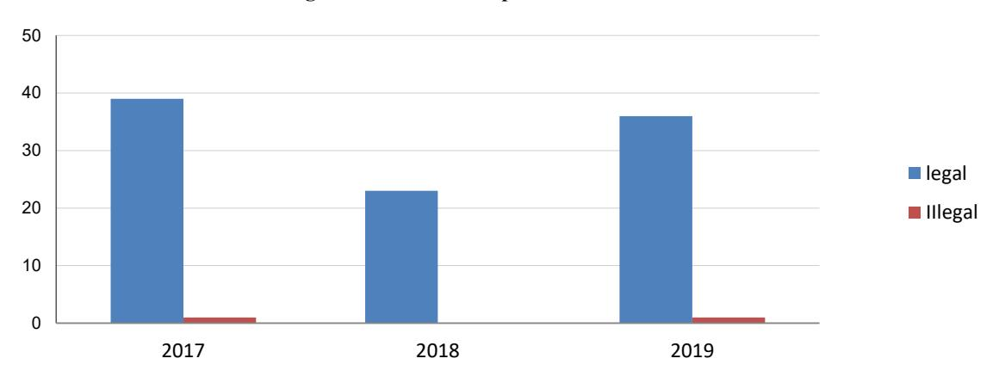

11.2 ចំនួនសំណង់លំនៅដ្ឋាន និងផ្ទៃដី តាមខេត្ត Number of dwelling constructions and area by province

| Province Province |       | 2016    | ĺ           |       | 2017    | 1              |       | 2018    |             |
|-------------------|-------|---------|-------------|-------|---------|----------------|-------|---------|-------------|
| Prov Province     | Legal | Illegal | $m^2$       | Legal | Illegal | m 2 | Legal | Illegal | $m^2$       |
| Banteay Meanchey  | 128   | 0       | 72,479.1    | 96    | 0       | 27,533.5       | 108   | 1       | 40,271.0    |
| Battambang        | 115   | 0       | 37,721.0    | 137   | 0       | 57,222.5       | 141   | 0       | 36,234.4    |
| Kampong Cham      | 42    | 9       | 79,960.8    | 30    | 12      | 14,717.1       | 9     | 4       | 6,061.6     |
| Kampong Chhnang   | 38    | 0       | 7,255.0     | 71    | 33      | 15,473.4       | 95    | 0       | 30,243.1    |
| Kampong Speu      | 51    | 24      | 29,760.7    | 106   | 3       | 32,977.2       | 58    | 13      | 19,876.8    |
| Kampong Thom      | 54    | 3       | 198,695.1   | 72    | 7       | 727,855.7      | 101   | 0       | 23,866.1    |
| Kampot            | 78    | 29      | 29,789.0    | 82    | 24      | 36,831.0       | 102   | 17      | 31,371.0    |
| Kandal            | 92    | 44      | 68,578.0    | 80    | 47      | 229,736.0      | 65    | 42      | 44,477.9    |
| Koh Kong          | 11    | 0       | 2,777.2     | 16    | 0       | 15,284.2       | 39    | 0       | 29,508.7    |
| Kratie            | 13    | 0       | 5,479.4     | 6     | 0       | 3,618.0        | 2     | 0       | 1,344.0     |
| Mondul Kiri       | 6     | 6       | 1,168.0     | 26    | 6       | 4,699.4        | 19    | 11      | 4,450.0     |
| Phnom Penh        | 700   | 0       | 437,297.0   | 942   | 0       | 420,657.0      | 873   | 0       | 416,734.0   |
| Preah Vihear      | 3     | 3       | 3,170.7     | 1     | 0       | 340.0          | 0     | 0       | 0.0         |
| Prey Veng         | 13    | 0       | 6,828.3     | 9     | 0       | 3,363.0        | 3     | 0       | 3,852.0     |
| Pursat            | 38    | 19      | 13,444.3    | 41    | 0       | 12,746.8       | 34    | 0       | 10,308.5    |
| Ratanak Kiri      | 1     | 0       | 268.0       | 0     | 0       | 0.0            | 15    | 0       | 4,039.6     |
| Siem Reap         | 159   | 0       | 62,568.0    | 269   | 0       | 94,377.0       | 317   | 0       | 91,205.0    |
| Preah Sihanouk    | 69    | 0       | 31,083.3    | 95    | 0       | 33,986.2       | 202   | 18      | 61,810.8    |
| Stung Treng       | 4     | 0       | 1,677.4     | 6     | 0       | 4,981.0        | 4     | 0       | 2,898.2     |
| Svay Rieng        | 25    | 0       | 7,465.6     | 139   | 4       | 309,065.8      | 159   | 0       | 63,515.9    |
| Takeo             | 36    | 13      | 10,235.0    | 73    | 13      | 20,286.5       | 54    | 22      | 14,026.2    |
| Oddar Meanchey    | 1     | 0       | 480.0       | 3     | 0       | 1,536.0        | 7     | 0       | 1,153.0     |
| Kep               | 8     | 10      | 2,730.5     | 22    | 30      | 7,533.0        | 16    | 6       | 3,342.3     |
| Pailin            | 35    | 0       | 7,721.0     | 60    | 43      | 13,799.0       | 54    | 0       | 5,855.3     |
| Tbong Khmum       | 6     | 34      | 7,387.1     | 64    | 40      | 16,899.8       | 68    | 3       | 16,050.6    |
| Total             | 1,726 | 194     | 1,126,019.9 | 2446  | 262     | 2,105,519.1    | 2545  | 137     | 9,624,957.9 |

Figure 11.2 Number of dwelling construction

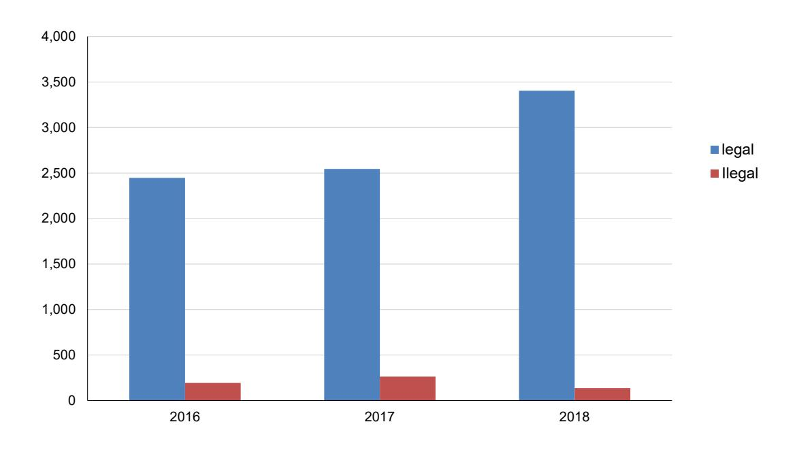

11.3 ចំនួនសំណង់សាធារណៈ លំនៅដ្ឋាន ផ្ទៃដី ថ្លៃគម្រោង និងកម្មករ
Number of public dwelling constructions area project cost and workers

|       |                   |             | Condo and Departmen | 2019                                       |       |         |                |                       |                                            |
|-------|-------------------|-------------|---------------------|--------------------------------------------|-------|---------|----------------|-----------------------|--------------------------------------------|
|       | ions (Apartment a |             |                     |                                            |       |         |                |                       |                                            |
| Legal | Illegal           | $m^2$       | Project cost (USD)  | Number of workers (Person/M onth) | Legal | Illegal | m 2 | Project cost (USD) | Number of workers (Person/ Month) |
| 5     | 0                 | 9,307.0     | 2,716,200           | 120                                        | 281   | 42      | 392            | 111176.6              | 28,565,095                                 |
| 0     | 0                 | 0.0         | 0                   | 0                                          | 227   | 0       | 166            | 52387.0               | 13,613,494                                 |
| 0     | 0                 | 0.0         | 0                   | 0                                          | 219   | 0       | 226            | 59483.7               | 16,313,304                                 |
| 7     | 0                 | 1,340.0     | 773,330             | 385                                        | 84    | 0       | 91             | 24794.7               | 8,566,608                                  |
| 0     | 0                 | 0.0         | 0                   | 0                                          | 176   | 104     | 400            | 86090.5               | 24,261,249                                 |
| 0     | 0                 | 0.0         | 0                   | 0                                          | 89    | 0       | 66             | 19581.3               | 5,978,694                                  |
| 1     | 0                 | 2,961.0     | 1,184,400           | 55                                         | 156   | 11      | 185            | 59652.0               | 21,420,600                                 |
| 0     | 0                 | 0.0         | 0                   | 0                                          | 78    | 77      | 120            | 162767.1              | 16,452,413                                 |
| 0     | 0                 | 0.0         | 0                   | 0                                          | 69    | 0       | 67             | 21042.2               | 4,529,133                                  |
| 0     | 0                 | 0.0         | 0                   | 0                                          | 8     | 0       | 13             | 6133.0                | 1,962,560                                  |
| 0     | 0                 | 0.0         | 0                   | 0                                          | 25    | 0       | 20             | 7074.0                | 1,526,360                                  |
| 10    | 0                 | 22,442.0    | 12,343,100          | 750                                        | 645   | 0       | 449            | 321615.0              | 127,937,620                                |
| 0     | 0                 | 0.0         | 0                   | 0                                          | 14    | 58      | 71             | 13981.0               | 4,428,712                                  |
| 0     | 0                 | 0.0         | 0                   | 0                                          | 2     | 0       | 2              | 902.0                 | 315,700                                    |
| 0     | 0                 | 0.0         | 0                   | 0                                          | 23    | 0       | 12             | 5187.6                | 1,650,378                                  |
| 0     | 0                 | 0.0         | 0                   | 0                                          | 56    | 6       | 96             | 13286.9               | 3,562,880                                  |
| 2     | 0                 | 1,276.0     | 382,800             | 110                                        | 449   | 0       | 524            | 139457.0              | 37,510,049                                 |
| 109   | 0                 | 2,166,919.8 | 1,291,048,454       | 8,175                                      | 239   | 0       | 280            | 162368.7              | 54,351,715                                 |
| 0     | 0                 | 0.0         | 0                   | 0                                          | 48    | 0       | 40             | 10718.5               | 3,285,980                                  |
| 2     | 0                 | 5,408.0     | 2,433,600           | 110                                        | 204   | 0       | 163            | 65501.8               | 27,055,171                                 |
| 0     | 0                 | 0.0         | 0                   | 0                                          | 86    | 30      | 98             | 50469.8               | 17,165,570                                 |
| 1     | 0                 | 160.0       | 56,000              | 55                                         | 18    | 0       | 18             | 3669.0                | 1,114,129                                  |
| 0     | 0                 | 0.0         | 0                   | 0                                          | 61    | 10      | 47             | 18682.9               | 6,804,965                                  |
| 0     | 0                 | 0.0         | 0                   | 0                                          | 63    | 0       | 42             | 15733.1               | 4,921,310                                  |
| 1     | 0                 | 1,418.0     | 708,750             | 55                                         | 85    | 2       | 95             | 42440.8               | 11,539,075                                 |
| 138   | 0                 | 2,211,231.8 | 1,311,646,634       | 9,815                                      | 3,405 | 340     | 3,683          | 1474196.0             | 444,832,763                                |

Note:

Number of public constructions and dwelling constructions area by province 2019

11.4 ចំនួនសំណង់ឧស្សាហកម្ម និងផ្ទៃដី តាមខេត្ត Number of Industry constructions and area by province

|                  |       | 2017    |                |       | 2018    |                | 2019 Number |         |             |                       |                                            |
|------------------|-------|---------|----------------|-------|---------|----------------|-------------|---------|-------------|-----------------------|--------------------------------------------|
| Province         | Legal | Illegal | m 2 | Legal | Illegal | m 2 | Legal       | Illegal | $m^2$       | Project cost (USD) | Number of workers (Person/ Month) |
| Banteay Meanchey | 1     | 0       | 143,100.0      | 1     | 0       | 1,753.4        | 1           | 1       | 2,650.0     | 1,152,500             | 70                                         |
| Battambang       | 5     | 0       | 6,747.0        | 3     | 0       | 3,774.2        | 3           | 0       | 3,028.4     | 805,332               | 105                                        |
| Kampong Cham     | 2     | 1       | 4,438.0        | 2     | 0       | 4,970.0        | 5           | 0       | 8,883.0     | 2,871,240             | 175                                        |
| Kampong Chhnang  | 4     | 2       | 5,864.0        | 0     | 0       | 0.0            | 2           | 0       | 4,480.0     | 2,240,000             | 70                                         |
| Kampong Speu     | 4     | 0       | 3,674.6        | 2     | 0       | 3,382.2        | 30          | 3       | 462,781.0   | 114,093,260           | 1155                                       |
| Kampong Thom     | 7     | 0       | 9,375.2        | 5     | 0       | 3,580.6        | 6           | 0       | 4,002.7     | 785,330               | 210                                        |
| Kampot           | 0     | 0       | 0.0            | 2     | 0       | 2,259.0        | 3           | 4       | 8,655.0     | 3,386,000             | 245                                        |
| Kandal           | 9     | 9       | 25,931.4       | 8     | 5       | 16,131.0       | 18          | 10      | 36,017.0    | 6,840,920             | 980                                        |
| Koh Kong         | 0     | 0       | 0.0            | 0     | 0       | 0.0            | 0           | 0       | 0           | 0                     | 0                                          |
| Kratie           | 1     | 0       | 1,520.0        | 0     | 0       | 0.0            | 3           | 0       | 3,619.0     | 1,222,690             | 105                                        |
| Mondul Kiri      | 2     | 1       | 582.4          | 1     | 0       | 1,850.0        | 0           | 0       | 0           | 0                     | 0                                          |
| Phnom Penh       | 0     | 0       | 0.0            | 0     | 0       | 0.0            | 6           | 0       | 10,342.0    | 5,688,100             | 300                                        |
| Preah Vihear     | 0     | 0       | 0.0            | 0     | 0       | 0.0            | 0           | 0       | 0           | 9                     | 0                                          |
| Prey Veng        | 3     | 0       | 410.0          | 1     | 0       | 1,000.0        | 1           | 0       | 850.0       | 297,500               | 35                                         |
| Pursat           | 1     | 0       | 390.0          | 0     | 0       | 0.0            | 1           | 0       | 2,000.0     | 560,000               | 35                                         |
| Ratanak Kiri     | 0     | 0       | 0.0            | 0     | 0       | 0.0            | 0           | 0       | 0           | 0                     | 0                                          |
| Siem Reap        | 0     | 0       | 0.0            | 0     | 0       | 0.0            | 1           | 0       | 531.0       | 143,370               | 35                                         |
| Preah Sihanouk   | 2     | 0       | 2,452.0        | 0     | 0       | 0.0            | 13          | 0       | 687,902.0   | 412,741,110           | 635                                        |
| Stung Treng      | 0     | 0       | 0.0            | 0     | 0       | 0.0            | 1           | 0       | 235.0       | 70,560                | 35                                         |
| Svay Rieng       | 6     | 0       | 10,347.4       | 2     | 0       | 5,260.0        | 3           | 0       | 4,170.0     | 1,999,200             | 105                                        |
| Takeo            | 1     | 0       | 2,300.0        | 2     | 0       | 5,338.0        | 12          | 0       | 190,662.0   | 95,291,289            | 420                                        |
| Oddar Meanchey   | 0     | 0       | 0.0            | 1     | 0       | 900.0          | 0           | 0       | 0           | 0                     | 0                                          |
| Kep              | 0     | 0       | 0.0            | 0     | 0       | 0.0            | 0           | 0       | 0           | 0                     | 0                                          |
| Pailin           | 1     | 0       | 315.0          | 0     | 0       | 0.0            | 0           | 0       | 0           | 0                     | 0                                          |
| Thong Khmum      | 2     | 2       | 3,712.0        | 1     | 0       | 2,850.0        | 9           | 0       | 18,604.0    | 9,383,650             | 315                                        |
| Total            | 51    | 15      | 79,490.1       | 31    | 5       | 53,048.3       | 118         | 18      | 1,449,412.1 | 650,188,410           | 5,030                                      |

Figure 11.3 Number of industry construction

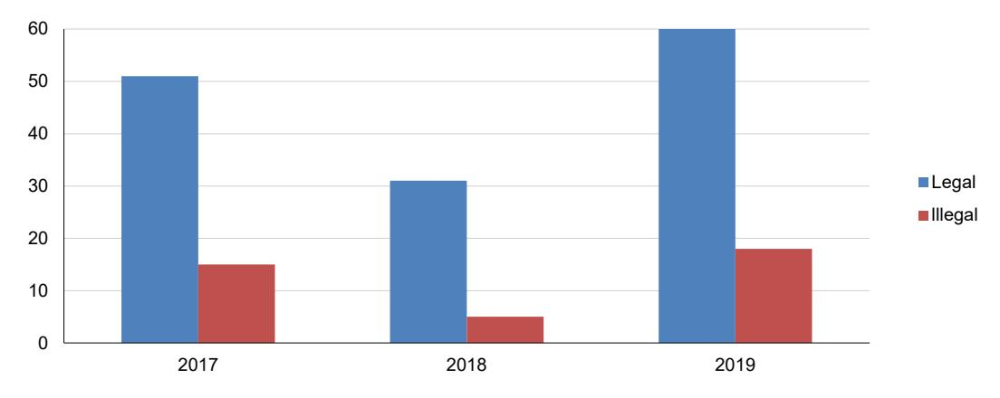

11.5 ចំនួនសំណង់ពាណិជ្ជកម្ម និងផ្ទៃដី តាមខេត្ត Number of commercial constructions and area by province

|                  |       | 2017    |             |       | 2018    | }           | 2019 Number of |         |           |                       |                                            |
|------------------|-------|---------|-------------|-------|---------|-------------|----------------|---------|-----------|-----------------------|--------------------------------------------|
| Province         | Legal | Illegal | $m^2$       | Legal | Illegal | $m^2$       | Legal          | Illegal | $m^2$     | Project cost (USD) | Number of workers (Person/ Month) |
| Banteay Meanchey | 4     | 0       | 7,169.2     | 2     | 0       | 3,615.1     | 6              | 1       | 6551.0    | 3,162,150             | 385                                        |
| Battambang       | 1     | 0       | 1,473.8     | 5     | 0       | 4,801.7     | 6              | 0       | 4339.0    | 1,163,986             | 330                                        |
| Kampong Cham     | 13    | 3       | 1,151.0     | 10    | 1       | 2,120.2     | 3              | 0       | 2583.0    | 787,770               | 165                                        |
| Kampong Chhnang  | 17    | 2       | 14,273.0    | 15    | 0       | 5,957.0     | 8              | 0       | 953.0     | 440,940               | 440                                        |
| Kampong Speu     | 6     | 0       | 6,392.0     | 2     | 1       | 807.5       | 11             | 4       | 26014.0   | 6,964,320             | 825                                        |
| Kampong Thom     | 6     | 0       | 5,661.6     | 10    | 0       | 5,194.6     | 16             | 0       | 12955.9   | 4,400,419             | 880                                        |
| Kampot           | 2     | 3       | 1,814.0     | 2     | 2       | 193,126.0   | 5              | 3       | 3821.0    | 1,477,600             | 440                                        |
| Kandal           | 5     | 10      | 7,594.2     | 4     | 6       | 6,139.1     | 7              | 1       | 111132.0  | 26,867,300            | 440                                        |
| Koh Kong         | 2     | 0       | 1,120.9     | 57    | 0       | 67,337.8    | 16             | 0       | 17678.0   | 8,183,600             | 880                                        |
| Kratie           | 3     | 0       | 7,184.1     | 3     | 0       | 3,878.0     | 5              | 0       | 3654.0    | 1,396,840             | 275                                        |
| Mondul Kiri      | 1     | 0       | 1,990.0     | 0     | 0       | 0.0         | 0              | 0       | 0.0       | 0                     | 0                                          |
| Phnom Penh       | 50    | 0       | 73,247.0    | 37    | 0       | 52,247.0    | 50             | 0       | 85263.0   | 46,894,650            | 4,000                                      |
| Preah Vihear     | 1     | 0       | 88.0        | 0     | 0       | 0.0         | 2              | 0       | 775.0     | 290,000               | 110                                        |
| Prey Veng        | 1     | 0       | 740.0       | 0     | 0       | 0.0         | 4              | 0       | 6601.0    | 3,072,042             | 220                                        |
| Pursat           | 0     | 0       | 0.0         | 5     | 0       | 2,952.3     | 0              | 0       | 0.0       | 0                     | 0                                          |
| Ratanak Kiri     | 0     | 0       | 0.0         | 2     | 0       | 3,183.9     | 0              | 0       | 0.0       | 0                     | 0                                          |
| Siem Reap        | 17    | 0       | 29,041.4    | 7     | 0       | 5,899.0     | 3              | 0       | 5311.0    | 1,433,970             | 165                                        |
| Preah Sihanouk   | 10    | 0       | 18,008.9    | 3     | 0       | 7,511.9     | 78             | 0       | 3458228.0 | 2,074,936,740         | 6,630                                      |
| Stung Treng      | 3     | 0       | 991.3       | 1     | 0       | 852.0       | 3              | 0       | 4442.0    | 2,522,610             | 165                                        |
| Svay Rieng       | 6     | 0       | 6,758.0     | 6     | 0       | 5,497.7     | 3              | 0       | 1599.0    | 674,550               | 165                                        |
| Takeo            | 3     | 0       | 3,083.3     | 4     | 1       | 4,456.0     | 12             | 0       | 9291.0    | 2,761,650             | 660                                        |
| Oddar Meanchey   | 0     | 0       | 0.0         | 0     | 0       | 0.0         | 0              | 0       | 0.0       | 0                     | 0                                          |
| Kep              | 0     | 0       | 0.0         | 0     | 0       | 0.0         | 0              | 0       | 0.0       | 0                     | 0                                          |
| Pailin           | 9     | 3       | 7,973.4     | 4     | 0       | 4,967.0     | 2              | 0       | 555.0     | 166,500               | 110                                        |
| Thong Khmum      | 3     | 0       | 7,940.4     | 4     | 0       | 7,028.2     | 2              | 0       | 1497.0    | 820,500               | 110                                        |
| Total            | 163   | 21      | 2,036,955.7 | 183   | 11      | 3,875,718.9 | 242            | 9       | 3763242.9 | 2,188,418,137         | 17,395                                     |

Figure 11.4 Number of commercial construction

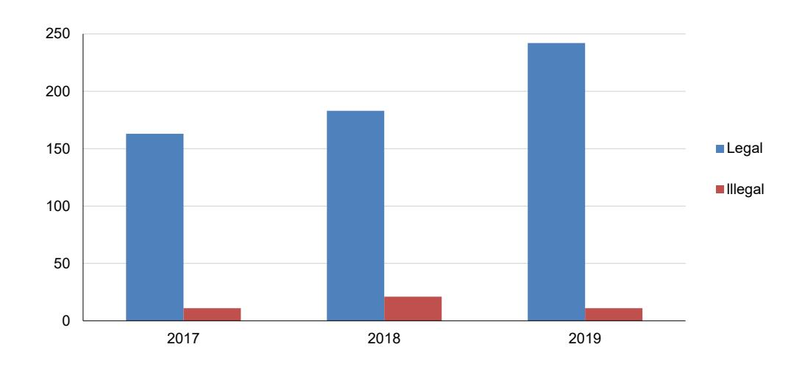

11.6 ចំនួនសំណង់ទេសចរណ៍ និងផ្ទៃជី តាមខេត្ត Number of tourism constructions and area by province

|                  |       | 2017    |                |       | 2018    |                |       |         | 20             | 019                   |                                            |
|------------------|-------|---------|----------------|-------|---------|----------------|-------|---------|----------------|-----------------------|--------------------------------------------|
| Province         | Legal | Illegal | m 2 | Legal | Illegal | m 2 | Legal | Illegal | m 2 | Project cost (USD) | Number of workers (Person/ Month) |
| Banteay Meanchey | 8     | 0       | 13,505.4       | 5     | 0       | 9,643.3        | 4     | 0       | 9,193.0        | 399,150               | 220                                        |
| Battambang       | 0     | 0       | 0.0            | 1     | 0       | 1,687.4        | 2     | 0       | 4,544.2        | 1,406,488             | 110                                        |
| Kampong Cham     | 0     | 0       | 0.0            | 0     | 0       | 0.0            | 1     | 0       | 2,885.0        | 1,384,800             | 55                                         |
| Kampong Chhnang  | 3     | 6       | 3,952.0        | 3     | 0       | 1,648.0        | 0     | 0       | 0              | 0                     | 0                                          |
| Kampong Speu     | 1     | 0       | 1,764.0        | 0     | 1       | 1,428.8        | 0     | 0       | 0              | 0                     | 0                                          |
| Kampong Thom     | 3     | 0       | 3,327.9        | 0     | 0       | 0.0            | 2     | 0       | 504.0          | 176,400               | 110                                        |
| Kampot           | 6     | 1       | 9,062.0        | 17    | 0       | 16,654.0       | 9     | 0       | 13,351.0       | 4,186,000             | 495                                        |
| Kandal           | 2     | 2       | 4,640.0        | 1     | 0       | 2,904.4        | 3     | 1       | 2,636.0        | 1,053,120             | 220                                        |
| Koh Kong         | 0     | 0       | 0.0            | 1     | 0       | 455.0          | 4     | 0       | 3,673.0        | 1,836,825             | 220                                        |
| Kratie           | 1     | 0       | 2,875.0        | 0     | 0       | 0.0            | 1     | 0       | 2,147.0        | 751,450               | 55                                         |
| Mondul Kiri      | 1     | 0       | 1,408.0        | 0     | 0       | 0.0            | 1     | 0       | 768.0          | 0                     | 55                                         |
| Phnom Penh       | 2     | 0       | 3,835.0        | 0     | 0       | 0.0            | 6     | 0       | 10,930.0       | 6,140,150             | 450                                        |
| Preah Vihear     | 1     | 0       | 500.0          | 0     | 0       | 0.0            | 3     | 1       | 4,942.0        | 2,449,752             | 220                                        |
| Prey Veng        | 0     | 0       | 0.0            | 1     | 0       | 311.0          | 1     | 0       | 200.0          | 56,000                | 55                                         |
| Pursat           | 0     | 0       | 0.0            | 2     | 0       | 2,139.0        | 1     | 0       | 385.0          | 134,677               | 55                                         |
| Ratanak Kiri     | 0     | 0       | 0.0            | 0     | 0       | 0.0            | 1     | 1       | 696.0          | 2,040,000             | 110                                        |
| Siem Reap        | 47    | 0       | 69,040.8       | 36    | 0       | 41,986.0       | 10    | 0       | 15,482.0       | 5,238,450             | 550                                        |
| Preah Sihanouk   | 7     | 0       | 13,428.3       | 7     | 0       | 13,927.8       | 39    | 0       | 713,722.2      | 428,233,644           | 3,315                                      |
| Stung Treng      | 1     | 0       | 718.2          | 0     | 0       | 0.0            | 0     | 0       | 0              | 0                     | 0                                          |
| Svay Rieng       | 1     | 0       | 496.8          | 6     | 0       | 14,757.5       | 4     | 0       | 6,306.0        | 2,933,100             | 220                                        |
| Takeo            | 3     | 0       | 2,443.0        | 1     | 0       | 1,.080.00      | 0     | 0       | 0              | 0                     | 0                                          |
| Oddar Meanchey   | 0     | 0       | 0.0            | 0     | 0       | 0.0            | 2     | 0       | 2,928.0        | 1,252,200             | 110                                        |
| Kep              | 4     | 0       | 9,351.0        | 2     | 0       | 3,083.2        | 7     | 0       | 10,076.0       | 2,462,750             | 385                                        |
| Pailin           | 13    | 6       | 4,167.4        | 1     | 0       | 2,840.0        | 2     | 0       | 41,939.0       | 14,678,650            | 110                                        |
| Tbong Khmum      | 2     | 0       | 3,594.4        | 0     | 0       | 0.0            | 1     | 0       | 1,560.6        | 624,240               | 55                                         |
| Total            | 106   | 15      | 148,109.3      | 84    | 1       | 113,465.5      | 104   | 3       | 848,867.9      | 477,437,846           | 7,175                                      |

120 100 80 60 40 20 2017 2018 2019

Figure 11.5 Number of tourism construction

11.7 ចំនួនសំណង់វិនិយោគ និងផ្ទៃដី តាមខេត្ត Number of investment constructions and area by province

|                  |       | 2017    | ,              |       | 2018    |       |       |         | 20             | 19                    |                                            |
|------------------|-------|---------|----------------|-------|---------|-------|-------|---------|----------------|-----------------------|--------------------------------------------|
| Province         | Legal | Illegal | m 2 | Legal | Illegal | $m^2$ | Legal | Illegal | m 2 | Project cost (USD) | Number of workers (Person/ Month) |
| Banteay Meanchey | 0     | 0       | 0.0            | 0     | 0       | 0.0   | 0     | 0       | 0.0            | 0                     | 0                                          |
| Battambang       | 2     | 0       | 120.0          | 0     | 0       | 0.0   | 5     | 0       | 6429.7         | 23,200                | 250                                        |
| Kampong Cham     | 6     | 0       | 360.0          | 0     | 0       | 0.0   | 1     | 0       | 98.0           | 44,100                | 50                                         |
| Kampong Chhnang  | 12    | 0       | 643.0          | 7     | 0       | 680.0 | 15    | 0       | 6839.0         | 2,728,900             | 750                                        |
| Kampong Speu     | 0     | 0       | 0.0            | 0     | 0       | 0.0   | 1     | 0       | 2310.0         | 69,300                | 50                                         |
| Kampong Thom     | 1     | 0       | 79.5           | 1     | 0       | 287.5 | 0     | 0       | 0.0            | 0                     | 0                                          |
| Kampot           | 0     | 0       | 0.0            | 0     | 0       | 0.0   | 0     | 0       | 0.0            | 0                     | 0                                          |
| Kandal           | 0     | 0       | 0.0            | 0     | 0       | 0.0   | 0     | 0       | 0.0            | 0                     | 0                                          |
| Koh Kong         | 1     | 0       | 80.0           | 0     | 0       | 0.0   | 0     | 0       | 0.0            | 0                     | 0                                          |
| Kratie           | 0     | 0       | 0.0            | 0     | 0       | 0.0   | 1     | 0       | 360.0          | 126,000               | 50                                         |
| Mondul Kiri      | 0     | 0       | 0.0            | 0     | 0       | 0.0   | 0     | 0       | 0.0            | 0                     | 0                                          |
| Phnom Penh       | 0     | 0       | 0.0            | 0     | 0       | 0.0   | 0     | 0       | 0.0            | 0                     | 0                                          |
| Preah Vihear     | 0     | 0       | 0.0            | 0     | 0       | 0.0   | 0     | 0       | 0.0            | 0                     | 0                                          |
| Prey Veng        | 0     | 0       | 0.0            | 0     | 0       | 0.0   | 0     | 0       | 0.0            | 0                     | 0                                          |
| Pursat           | 0     | 0       | 0.0            | 0     | 0       | 0.0   | 0     | 0       | 0.0            | 0                     | 0                                          |
| Ratanak Kiri     | 0     | 0       | 0.0            | 0     | 0       | 0.0   | 0     | 0       | 0.0            | 0                     | 0                                          |
| Siem Reap        | 0     | 0       | 0.0            | 0     | 0       | 0.0   | 0     | 0       | 0.0            | 0                     | 0                                          |
| Preah Sihanouk   | 0     | 0       | 0.0            | 0     | 0       | 0.0   | 0     | 0       | 0.0            | 0                     | 0                                          |
| Stung Treng      | 0     | 0       | 0.0            | 0     | 0       | 0.0   | 0     | 0       | 0.0            | 0                     | 0                                          |
| Svay Rieng       | 0     | 0       | 0.0            | 0     | 0       | 0.0   | 0     | 0       | 0.0            | 0                     | 0                                          |
| Takeo            | 0     | 0       | 0.0            | 0     | 0       | 0.0   | 0     | 1       | 480.0          | 192,000               | 50                                         |
| Oddar Meanchey   | 0     | 0       | 0.0            | 0     | 0       | 0.0   | 0     | 0       | 0.0            | 0                     | 0                                          |
| Kep              | 0     | 0       | 0.0            | 0     | 0       | 0.0   | 1     | 0       | 800.0          | 280,000               | 50                                         |
| Pailin           | 0     | 0       | 0.0            | 0     | 0       | 0.0   | 1     | 0       | 1738.0         | 782,100               | 50                                         |
| Tbong Khmum      | 0     | 0       | 0.0            | 0     | 0       | 0.0   | 0     | 0       | 0.0            | 0                     | 0                                          |
| Total            | 20    | 0       | 1282.5         | 8     | 0       | 967.5 | 25    | 1       | 19054.7        | 4,245,600             | 1,300                                      |

Figure 11.6 Number of investment construction

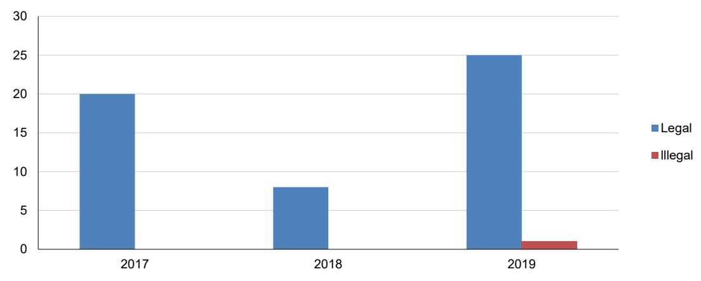

### 12

# អារឌឹង៩ញូន

### **Transportation**

12.1 សូចនាករដឹកជញ្ជូន Transport indicators

| Indicator                                       | 2011       | 2012       | 2013       | 2014       | 2015       | 2017    | 2018    |
|-------------------------------------------------|------------|------------|------------|------------|------------|---------|---------|
| Tourist cars                                    | 21,563     | 21,954     | 20,967     | -          | -          | 53,634  | 67,423  |
| Bus and trucks                                  | 2,913      | 4,705      | 4,678      | -          | -          | -       | -       |
| Motorcycles                                     | 218,217    | 233,497    | 244,971    | -          | -          | 381,400 | 502,701 |
| Driving licenses                                | 82,568     | 71,364     | 65,701     | -          | -          | 94,512  | 12,163  |
| Road accidents                                  | 16,654     | 15,615     | 4,322      | -          | -          | 3,686   | 3,264   |
| Number of flights by air 1/                     | 43,373     | 46,665     | 56,035     | 43,373     | 46,665     | -       | -       |
| Volume of passengers by air 1/                  | 3,625,308  | 4,169,554  | 4,820,699  | 3,625,308  | 4,169,554  | -       | -       |
| Volume of baggage by air (kg) 1/                | 48,282,389 | 53,460,975 | 60,204,638 | 48,282,389 | 53,460,975 | -       | -       |
| Volume of cargo by air (Kg) 1/                  | 20,095,526 | 27,811,407 | 31,618,305 | 20,095,526 | 27,811,407 | -       | -       |
| Volume of mails by air (Kg)                     | 644,271    | 679,163    | 720,231    | 644,271    | 679,163    | -       | -       |
| Quantity of commodity through railway (ton)     | -          | -          | -          | -          | -          | -       | -       |
| Volume of passengers through airway             | -          | -          | -          | -          | -          | -       | -       |
| Volume of luggage through railway (ton)         | -          | -          | -          | -          | -          | -       | -       |
| Volume of vessels docked at Phnom Penh Port     | 1,583      | 1,481      | 1,445      | 1,583      | 1,481      | 1,676   | 2,023   |
| Volume of vessels docked at Sihanoukville Port  | 877        | 941        | 988        | 877        | 941        | 1,305   | 1,416   |
| Volume of commodity at Phnom Penh Port (ton)    | 562,712    | 693,882    | 773,192    | 562,712    | 693,882    | 184,805 | 213,571 |
| Volume of commodity at Sihanoukville Port (ton) | 2,439,384  | 2,659,785  | 3,012,217  | 2,439,384  | 2,659,785  | 459,839 | 537,107 |
| National road reconstruction(Km)                | 3,881      | 4,367      | 4,408      | 3,881      | 4,367      | 505     | 411     |
| Reconstructed road (Km)                         | -          | 5,474      | 5,619      | -          | 5,474      | 8,526   | 8,620   |

Source: Ministry of Public Works and Transport and State Secretariat of Civil Aviation

Note: 1/ International and domestic aviation are included

### 12.2 ផ្លូវជាតិ និងផ្លូវខេត្ត តាមប្រភេទផ្លូវ ឆ្នាំ២០១៨ National and provincial road by type of road in 2018

| TType of road | National road 1 digit (km) | National road 2 digits (km) | Provincial road (km) |
|---------------|----------------------------|-----------------------------|----------------------|
| Total         | 2,254                      | 55,007                      | 90,31                |
| Bridge        |                            |                             |                      |
| Number        | 589                        | 698                         | 904                  |
| Meter         | 17,643                     | 15,710                      | 16,309               |

ource: Ministry of Public Works and Transport

### 12.3 ប្រវែងផ្លូវ តាមប្រភេទផ្លូវ Length of road by type of road

| Length of road        | 2014    | 2015    | 2016   | 2017   | 2018   |
|-----------------------|---------|---------|--------|--------|--------|
| Road, in Km           | -       | -       | -      | 16,292 | 16,292 |
| Paved road, in Km     | 261.756 | 230.789 | 268.36 | -      | -      |
| Concrete road, in Km  | 12.550  | 8.810   | 10.05  | -      | -      |
| Non-paved road, in Km | -       | -       | -      | -      | -      |
| Rough road, in Km     | 352.32  | 314.14  | 313.12 | -      | -      |

Source: Ministry of Public Works and Transport

12.4 អាកាសចរណ៍ស៊ីវិល ៖ ការដឹកជញ្ជូនអ្នកដំណើរ ឥវ៉ាន់ ទំនិញ និងសំបុត្រ តាមជើងហោះហើរអន្តរជាតិ
Civil aviation: International carried by passenger, baggage, cargo and mail

| Flight —                                                                                |         | Passenger                                                                                                                                                                                           |                                                                                                                                                                                                   |                                                                                                                                                                                                  | Baggage (kg)                                                                                                                                           |                                                                                                                                                        |                                                                                                                                                        |  |
|-----------------------------------------------------------------------------------------|---------|-----------------------------------------------------------------------------------------------------------------------------------------------------------------------------------------------------|---------------------------------------------------------------------------------------------------------------------------------------------------------------------------------------------------|--------------------------------------------------------------------------------------------------------------------------------------------------------------------------------------------------|--------------------------------------------------------------------------------------------------------------------------------------------------------|--------------------------------------------------------------------------------------------------------------------------------------------------------|--------------------------------------------------------------------------------------------------------------------------------------------------------|--|
| Year/month                                                                              | riigiit | Total                                                                                                                                                                                               | Departure                                                                                                                                                                                         | Arrival                                                                                                                                                                                          | Total                                                                                                                                                  | Departure                                                                                                                                              | Arrival                                                                                                                                                |  |
|                                                                                         | 1       | 2                                                                                                                                                                                                   | 3                                                                                                                                                                                                 | 4                                                                                                                                                                                                | 5                                                                                                                                                      | 6                                                                                                                                                      | 7                                                                                                                                                      |  |
| 2010                                                                                    | 34,103  | 3,051,601                                                                                                                                                                                           | 1,560,168                                                                                                                                                                                         | 1,491,433                                                                                                                                                                                        | 41,001,656                                                                                                                                             | 20,373,266                                                                                                                                             | 20,628,390                                                                                                                                             |  |
| 2011                                                                                    | 37,370  | 3,480,843                                                                                                                                                                                           | 1,756,876                                                                                                                                                                                         | 1,723,967                                                                                                                                                                                        | 47,001,078                                                                                                                                             | 23,203,764                                                                                                                                             | 23,797,314                                                                                                                                             |  |
| 2012                                                                                    | 40,407  | 3,997,331                                                                                                                                                                                           | 2,009,620                                                                                                                                                                                         | 1,987,711                                                                                                                                                                                        | 51,946,928                                                                                                                                             | 25,892,028                                                                                                                                             | 26,054,900                                                                                                                                             |  |
| 2013                                                                                    | 47,377  | 4,606,281                                                                                                                                                                                           | 2,320,978                                                                                                                                                                                         | 2,285,303                                                                                                                                                                                        | 58,301,357                                                                                                                                             | 29,069,089                                                                                                                                             | 29,232,268                                                                                                                                             |  |
| 2014                                                                                    | 51,016  | 5,168,687                                                                                                                                                                                           | 2,590,117                                                                                                                                                                                         | 2,578,570                                                                                                                                                                                        | 62,925,401                                                                                                                                             | 31,337,875                                                                                                                                             | 31,587,526                                                                                                                                             |  |
| 2015                                                                                    | 52,921  | 5,606,317                                                                                                                                                                                           | 2,805,397                                                                                                                                                                                         | 2,800,920                                                                                                                                                                                        | 66,178,758                                                                                                                                             | 32,921,561                                                                                                                                             | 33,257,197                                                                                                                                             |  |
| January                                                                                 | 5,118   | 575,892                                                                                                                                                                                             | 291,088                                                                                                                                                                                           | 284,804                                                                                                                                                                                          | 7,284,967                                                                                                                                              | 3,678,637                                                                                                                                              | 3,606,330                                                                                                                                              |  |
| February                                                                                | 4,763   | 542,624                                                                                                                                                                                             | 279,625                                                                                                                                                                                           | 262,999                                                                                                                                                                                          | 6,348,001                                                                                                                                              | 3,297,932                                                                                                                                              | 3,050,069                                                                                                                                              |  |
| March                                                                                   | 4,736   | 512,911                                                                                                                                                                                             | 256,645                                                                                                                                                                                           | 256,266                                                                                                                                                                                          | 6,316,876                                                                                                                                              | 3,122,911                                                                                                                                              | 3,193,965                                                                                                                                              |  |
| April                                                                                   | 4,151   | 426,027                                                                                                                                                                                             | 214,781                                                                                                                                                                                           | 211,246                                                                                                                                                                                          | 5,160,511                                                                                                                                              | 2,619,592                                                                                                                                              | 2,540,919                                                                                                                                              |  |
| May                                                                                     | 4,037   | 386,304                                                                                                                                                                                             | 198,445                                                                                                                                                                                           | 187,859                                                                                                                                                                                          | 4,517,007                                                                                                                                              | 2,343,569                                                                                                                                              | 2,173,438                                                                                                                                              |  |
| June                                                                                    | 3,724   | 357,822                                                                                                                                                                                             | 178,198                                                                                                                                                                                           | 179,624                                                                                                                                                                                          | 4,076,838                                                                                                                                              | 1,999,515                                                                                                                                              | 2,077,323                                                                                                                                              |  |
| July                                                                                    | 4,189   | 431,462                                                                                                                                                                                             | 210,970                                                                                                                                                                                           | 220,492                                                                                                                                                                                          | 4,906,043                                                                                                                                              | 2,351,995                                                                                                                                              | 2,554,048                                                                                                                                              |  |
| August                                                                                  | 4,414   | 468,535                                                                                                                                                                                             | 240,967                                                                                                                                                                                           | 227,568                                                                                                                                                                                          | 5,278,408                                                                                                                                              | 2,727,723                                                                                                                                              | 2,550,685                                                                                                                                              |  |
| September                                                                               | 3,893   | 379,391                                                                                                                                                                                             | 187,154                                                                                                                                                                                           | 192,237                                                                                                                                                                                          | 4,292,512                                                                                                                                              | 2,093,488                                                                                                                                              | 2,199,024                                                                                                                                              |  |
| October                                                                                 | 4,366   | 435,462                                                                                                                                                                                             | 213,390                                                                                                                                                                                           | 222,072                                                                                                                                                                                          | 4,969,793                                                                                                                                              | 2,352,357                                                                                                                                              | 2,617,436                                                                                                                                              |  |
| November                                                                                | 4,646   | 524,107                                                                                                                                                                                             | 258,450                                                                                                                                                                                           | 265,657                                                                                                                                                                                          | 6,379,257                                                                                                                                              | 3,075,005                                                                                                                                              | 3,304,252                                                                                                                                              |  |
| December                                                                                | 4,884   | 565,780                                                                                                                                                                                             | 275,684                                                                                                                                                                                           | 290,096                                                                                                                                                                                          | 6,648,545                                                                                                                                              | 3,258,837                                                                                                                                              | 3,389,708                                                                                                                                              |  |
|                                                                                         |         |                                                                                                                                                                                                     | Cargo (kg)                                                                                                                                                                                        |                                                                                                                                                                                                  |                                                                                                                                                        | Mail (kg)                                                                                                                                              |                                                                                                                                                        |  |
| Year/month                                                                              | Flight  | Total                                                                                                                                                                                               | Departure                                                                                                                                                                                         | Arrival                                                                                                                                                                                          | Total                                                                                                                                                  | Departure                                                                                                                                              | Arrival                                                                                                                                                |  |
|                                                                                         |         | 8                                                                                                                                                                                                   | 9                                                                                                                                                                                                 | 10                                                                                                                                                                                               | 11                                                                                                                                                     | 12                                                                                                                                                     | 13                                                                                                                                                     |  |
| 2010                                                                                    |         | 17 (70 340                                                                                                                                                                                          | •                                                                                                                                                                                                 |                                                                                                                                                                                                  |                                                                                                                                                        |                                                                                                                                                        |                                                                                                                                                        |  |
| 2011                                                                                    |         | 17,678,248                                                                                                                                                                                          | 9,121,094                                                                                                                                                                                         | 8,557,154                                                                                                                                                                                        | 404,165                                                                                                                                                | 192,194                                                                                                                                                | 211,971                                                                                                                                                |  |
|                                                                                         |         | 20,083,146                                                                                                                                                                                          | 10,287,693                                                                                                                                                                                        | 9,795,453                                                                                                                                                                                        | 644,271                                                                                                                                                | 274,773                                                                                                                                                | 369,498                                                                                                                                                |  |
| 2012                                                                                    |         | 20,083,146 1,595,463                                                                                                                                                                             | 10,287,693 935,320                                                                                                                                                                             | 9,795,453 660,143                                                                                                                                                                             | 644,271 44,350                                                                                                                                      | 274,773 16,431                                                                                                                                      | 369,498 27,919                                                                                                                                      |  |
| 2012 2013                                                                            |         | 20,083,146 1,595,463 31,612,062                                                                                                                                                               | 10,287,693 935,320 16,802,373                                                                                                                                                               | 9,795,453 660,143 14,809,689                                                                                                                                                               | 644,271 44,350 720,231                                                                                                                           | 274,773 16,431 270,435                                                                                                                           | 369,498 27,919 449,796                                                                                                                           |  |
| 2012 2013 2014                                                                    |         | 20,083,146 1,595,463 31,612,062 32,665,787                                                                                                                                                 | 10,287,693 935,320 16,802,373 16,926,371                                                                                                                                                 | 9,795,453 660,143 14,809,689 15,739,416                                                                                                                                                 | 644,271 44,350 720,231 826,299                                                                                                                | 274,773 16,431 270,435 345,686                                                                                                                | 369,498 27,919 449,796 480,613                                                                                                                |  |
| 2012 2013 2014 2015                                                            |         | 20,083,146 1,595,463 31,612,062 32,665,787 36,897,845                                                                                                                                   | 10,287,693 935,320 16,802,373 16,926,371 17,871,971                                                                                                                                   | 9,795,453 660,143 14,809,689 15,739,416 19,025,874                                                                                                                                   | 644,271 44,350 720,231 826,299 852,776                                                                                                     | 274,773 16,431 270,435 345,686 345,796                                                                                                     | 369,498 27,919 449,796 480,613 506,980                                                                                                     |  |
| 2012 2013 2014 2015 January                                                 |         | 20,083,146 1,595,463 31,612,062 32,665,787 36,897,845 2,800,166                                                                                                                      | 10,287,693 935,320 16,802,373 16,926,371 17,871,971 1,348,147                                                                                                                      | 9,795,453 660,143 14,809,689 15,739,416 19,025,874 1,452,019                                                                                                                      | 644,271 44,350 720,231 826,299 852,776 80,713                                                                                           | 274,773 16,431 270,435 345,686 345,796 35,048                                                                                           | 369,498 27,919 449,796 480,613 506,980 45,665                                                                                           |  |
| 2012 2013 2014 2015 January February                                     |         | 20,083,146 1,595,463 31,612,062 32,665,787 36,897,845 2,800,166 2,475,316                                                                                                         | 10,287,693 935,320 16,802,373 16,926,371 17,871,971 1,348,147 1,208,224                                                                                                         | 9,795,453 660,143 14,809,689 15,739,416 19,025,874 1,452,019 1,267,092                                                                                                         | 644,271 44,350 720,231 826,299 852,776 80,713 63,021                                                                                 | 274,773 16,431 270,435 345,686 345,796 35,048 27,887                                                                                 | 369,498 27,919 449,796 480,613 506,980 45,665 35,134                                                                                 |  |
| 2012 2013 2014 2015 January February March                            |         | 20,083,146 1,595,463 31,612,062 32,665,787 36,897,845 2,800,166 2,475,316 3,308,724                                                                                            | 10,287,693 935,320 16,802,373 16,926,371 17,871,971 1,348,147 1,208,224 1,602,906                                                                                            | 9,795,453 660,143 14,809,689 15,739,416 19,025,874 1,452,019 1,267,092 1,705,818                                                                                            | 644,271 44,350 720,231 826,299 852,776 80,713 63,021 66,171                                                                       | 274,773 16,431 270,435 345,686 345,796 35,048 27,887 28,251                                                                       | 369,498 27,919 449,796 480,613 506,980 45,665 35,134 37,920                                                                       |  |
| 2012 2013 2014 2015 January February March April                   |         | 20,083,146 1,595,463 31,612,062 32,665,787 36,897,845 2,800,166 2,475,316 3,308,724 2,637,118                                                                               | 10,287,693 935,320 16,802,373 16,926,371 17,871,971 1,348,147 1,208,224 1,602,906 1,062,732                                                                               | 9,795,453 660,143 14,809,689 15,739,416 19,025,874 1,452,019 1,267,092 1,705,818 1,574,386                                                                               | 644,271 44,350 720,231 826,299 852,776 80,713 63,021 66,171 66,541                                                             | 274,773 16,431 270,435 345,686 345,796 35,048 27,887 28,251 23,475                                                             | 369,498 27,919 449,796 480,613 506,980 45,665 35,134 37,920 43,066                                                             |  |
| 2012 2013 2014 2015 January February March April May            |         | 20,083,146 1,595,463 31,612,062 32,665,787 36,897,845 2,800,166 2,475,316 3,308,724 2,637,118 3,247,337                                                                  | 10,287,693 935,320 16,802,373 16,926,371 17,871,971 1,348,147 1,208,224 1,602,906 1,062,732 1,435,436                                                                  | 9,795,453 660,143 14,809,689 15,739,416 19,025,874 1,452,019 1,267,092 1,705,818 1,574,386 1,811,901                                                                  | 644,271 44,350 720,231 826,299 852,776 80,713 63,021 66,171 66,541 66,420                                                   | 274,773 16,431 270,435 345,686 345,796 35,048 27,887 28,251 23,475 27,264                                                   | 369,498 27,919 449,796 480,613 506,980 45,665 35,134 37,920 43,066 39,156                                                   |  |
| 2012 2013 2014 2015 January February March April May June                               |         | 20,083,146 1,595,463 31,612,062 32,665,787 36,897,845 2,800,166 2,475,316 3,308,724 2,637,118 3,247,337 3,432,616                                                     | 10,287,693 935,320 16,802,373 16,926,371 17,871,971 1,348,147 1,208,224 1,602,906 1,062,732 1,435,436 1,744,789                                                     | 9,795,453 660,143 14,809,689 15,739,416 19,025,874 1,452,019 1,267,092 1,705,818 1,574,386 1,811,901 1,687,827                                                     | 644,271 44,350 720,231 826,299 852,776 80,713 63,021 66,171 66,541 66,420 66,736                                         | 274,773 16,431 270,435 345,686 345,796 35,048 27,887 28,251 23,475 27,264 29,001                                         | 369,498 27,919 449,796 480,613 506,980 45,665 35,134 37,920 43,066 39,156 37,735                                         |  |
| 2012 2013 2014 2015 January February March April May June July                          |         | 20,083,146 1,595,463 31,612,062 32,665,787 36,897,845 2,800,166 2,475,316 3,308,724 2,637,118 3,247,337 3,432,616 3,457,307                                        | 10,287,693 935,320 16,802,373 16,926,371 17,871,971 1,348,147 1,208,224 1,602,906 1,062,732 1,435,436 1,744,789 1,868,848                                        | 9,795,453 660,143 14,809,689 15,739,416 19,025,874 1,452,019 1,267,092 1,705,818 1,574,386 1,811,901 1,687,827 1,588,459                                        | 644,271 44,350 720,231 826,299 852,776 80,713 63,021 66,171 66,541 66,420 66,736 68,356                               | 274,773 16,431 270,435 345,686 345,796 35,048 27,887 28,251 23,475 27,264 29,001 27,227                               | 369,498 27,919 449,796 480,613 506,980 45,665 35,134 37,920 43,066 39,156 37,735 41,129                               |  |
| 2012 2013 2014 2015 January February March April May June July August                   |         | 20,083,146 1,595,463 31,612,062 32,665,787 36,897,845 2,800,166 2,475,316 3,308,724 2,637,118 3,247,337 3,432,616 3,457,307 3,436,899                           | 10,287,693 935,320 16,802,373 16,926,371 17,871,971 1,348,147 1,208,224 1,602,906 1,062,732 1,435,436 1,744,789 1,868,848 1,845,682                           | 9,795,453 660,143 14,809,689 15,739,416 19,025,874 1,452,019 1,267,092 1,705,818 1,574,386 1,811,901 1,687,827 1,588,459 1,591,217                           | 644,271 44,350 720,231 826,299 852,776 80,713 63,021 66,171 66,541 66,420 66,736 68,356 66,047                     | 274,773 16,431 270,435 345,686 345,796 35,048 27,887 28,251 23,475 27,264 29,001 27,227 26,169                     | 369,498 27,919 449,796 480,613 506,980 45,665 35,134 37,920 43,066 39,156 37,735 41,129 39,878                     |  |
| 2012 2013 2014 2015 January February March April May June July August September         |         | 20,083,146 1,595,463 31,612,062 32,665,787 36,897,845 2,800,166 2,475,316 3,308,724 2,637,118 3,247,337 3,432,616 3,457,307 3,436,899 3,295,894              | 10,287,693 935,320 16,802,373 16,926,371 17,871,971 1,348,147 1,208,224 1,602,906 1,062,732 1,435,436 1,744,789 1,868,848 1,845,682 1,553,109              | 9,795,453 660,143 14,809,689 15,739,416 19,025,874 1,452,019 1,267,092 1,705,818 1,574,386 1,811,901 1,687,827 1,588,459 1,591,217 1,742,785              | 644,271 44,350 720,231 826,299 852,776 80,713 63,021 66,171 66,541 66,420 66,736 68,356 66,047 72,142           | 274,773 16,431 270,435 345,686 345,796 35,048 27,887 28,251 23,475 27,264 29,001 27,227 26,169 30,008           | 369,498 27,919 449,796 480,613 506,980 45,665 35,134 37,920 43,066 39,156 37,735 41,129 39,878 42,134           |  |
| 2012 2013 2014 2015 January February March April May June July August September October |         | 20,083,146 1,595,463 31,612,062 32,665,787 36,897,845 2,800,166 2,475,316 3,308,724 2,637,118 3,247,337 3,432,616 3,457,307 3,436,899 3,295,894 2,706,396 | 10,287,693 935,320 16,802,373 16,926,371 17,871,971 1,348,147 1,208,224 1,602,906 1,062,732 1,435,436 1,744,789 1,868,848 1,845,682 1,553,109 1,141,674 | 9,795,453 660,143 14,809,689 15,739,416 19,025,874 1,452,019 1,267,092 1,705,818 1,574,386 1,811,901 1,687,827 1,588,459 1,591,217 1,742,785 1,564,722 | 644,271 44,350 720,231 826,299 852,776 80,713 63,021 66,171 66,541 66,420 66,736 68,356 66,047 72,142 70,220 | 274,773 16,431 270,435 345,686 345,796 35,048 27,887 28,251 23,475 27,264 29,001 27,227 26,169 30,008 28,540 | 369,498 27,919 449,796 480,613 506,980 45,665 35,134 37,920 43,066 39,156 37,735 41,129 39,878 42,134 41,680 |  |
| 2012 2013 2014 2015 January February March April May June July August September         |         | 20,083,146 1,595,463 31,612,062 32,665,787 36,897,845 2,800,166 2,475,316 3,308,724 2,637,118 3,247,337 3,432,616 3,457,307 3,436,899 3,295,894              | 10,287,693 935,320 16,802,373 16,926,371 17,871,971 1,348,147 1,208,224 1,602,906 1,062,732 1,435,436 1,744,789 1,868,848 1,845,682 1,553,109              | 9,795,453 660,143 14,809,689 15,739,416 19,025,874 1,452,019 1,267,092 1,705,818 1,574,386 1,811,901 1,687,827 1,588,459 1,591,217 1,742,785              | 644,271 44,350 720,231 826,299 852,776 80,713 63,021 66,171 66,541 66,420 66,736 68,356 66,047 72,142           | 274,773 16,431 270,435 345,686 345,796 35,048 27,887 28,251 23,475 27,264 29,001 27,227 26,169 30,008           | 369,498 27,919 449,796 480,613 506,980 45,665 35,134 37,920 43,066 39,156 37,735 41,129 39,878 42,134           |  |

12.5 អាកាសចរណ៍ស៊ីវិល ៖ ការជឹកជញ្ជូនអ្នកដំណើរ ឥវ៉ាន់ ទំនិញ និងសំបុត្រជាមធ្យមក្នុងមួយជើងតាមជើងហោះហើរអន្តរជាតិ Civil aviation: internationally carried, average per flight of passenger, baggage, cargo and mail

| Year/month          | Average                      |          | age passer per flight | nger     |            | erage bagg er flight (k |            |            | verage car r flight (k |            |        | erage mai flight (kg |         |
|---------------------|------------------------------|----------|--------------------------|----------|------------|----------------------------|------------|------------|---------------------------|------------|--------|-------------------------|---------|
| i cai/montii        | number of flight per week | Total    | Dep.                     | Arr.     | Total      | Dep.                       | Arr.       | Total      | Dep.                      | Arr.       | Total  | Dep.                    | Arr.    |
| 2012                | 842                          | 49       | 50                       | 49       | 643        | 641                        | 645        | 344        | 384                       | 305        | 8      | 6                       | 11      |
| January             | 991                          | 53       | 54                       | 52       | 686        | 697                        | 676        | 215        | 236                       | 194        | 7      | 5                       | 9       |
| February            | 904                          | 53       | 53                       | 53       | 663        | 679                        | 647        | 221        | 259                       | 183        | 6      | 5                       | 8       |
| March               | 898                          | 52       | 53                       | 51       | 687        | 695                        | 678        | 310        | 334                       | 287        | 7      | 4                       | 9       |
| April               | 790                          | 49       | 50                       | 48       | 638        | 626                        | 650        | 276        | 289                       | 263        | 9      | 7                       | 11      |
| May                 | 781                          | 43       | 44                       | 41       | 549        | 563                        | 536        | 353        | 379                       | 327        | 10     | 7                       | 13      |
| June                | 721                          | 43       | 42                       | 43       | 559        | 546                        | 572        | 446        | 535                       | 356        | 11     | 7                       | 16      |
| July                | 779                          | 47       | 46                       | 48       | 598        | 577                        | 619        | 430        | 522                       | 338        | 8      | 7                       | 9       |
| August              | 803                          | 50       | 52                       | 48       | 641        | 656                        | 626        | 437        | 513                       | 361        | 8      | 6                       | 10      |
| September           | 730                          | 43       | 43                       | 44       | 555        | 549                        | 561        | 454        | 493                       | 416        | 10     | 7                       | 13      |
| October November | 841 894                   | 49 53 | 49 52                 | 49 54 | 606 729 | 581 699                 | 631 759 | 323 390 | 342 416                | 304 364 | 8      | 6 8                  | 10 9 |
| December            | 972                          | 55       | 54                       | 56       | 737        | 751                        | 724        | 342        | 369                       | 315        | 9      | 6                       | 11      |
| 2013                | 987                          | 49       | 49                       | 48       | 615        | 614                        | 617        | 334        | 355                       | 313        | 8      | 6                       | 9       |
| January             | 1,127                        | 54       | 55                       | 53       | 697        | 715                        | 679        | 268        | 283                       | 252        | 6      | 5                       | 8       |
| February            | 1,091                        | 52       | 53                       | 51       | 640        | 660                        | 621        | 246        | 319                       | 174        | 5      | 4                       | 7       |
| March               | 1,074                        | 51       | 51                       | 50       | 665        | 660                        | 670        | 368        | 396                       | 341        | 7      | 5                       | 10      |
| April               | 926                          | 47       | 48                       | 46       | 611        | 625                        | 598        | 350        | 387                       | 314        | 7      | 5                       | 9       |
| May                 | 898                          | 44       | 46                       | 42       | 529        | 534                        | 525        | 390        | 424                       | 355        | 8      | 6                       | 9       |
| June                | 836                          | 43       | 45                       | 42       | 556        | 548                        | 564        | 394        | 432                       | 356        | 8      | 6                       | 11      |
| July                | 913                          | 45       | 45                       | 46       | 553        | 547                        | 559        | 427        | 477                       | 377        | 8      | 6                       | 10      |
| August              | 930                          | 48       | 50                       | 46       | 600        | 617                        | 582        | 364        | 393                       | 336        | 8      | 7                       | 10      |
| September           | 859                          | 43       | 43                       | 44       | 527        | 516                        | 538        | 362        | 366                       | 358        | 8      | 6                       | 11      |
| October             | 941                          | 47       | 46                       | 48       | 592        | 564                        | 620        | 329        | 312                       | 346        | 8      | 7                       | 9       |
| November            | 1,063                        | 52       | 51                       | 53       | 693        | 660                        | 725        | 279        | 271                       | 287        | 8      | 7                       | 10      |
| December            | 1,188                        | 52       | 52                       | 53       | 652        | 646                        | 659        | 284        | 263                       | 304        | 9      | 6                       | 11      |
| 2014                | 1,063                        | 51       | 51                       | 51       | 617        | 614                        | 619        | 320        | 332                       | 309        | 8      | 7                       | 9       |
| January             | 1,315                        | 53       | 54                       | 53       | 678        | 691                        | 664        | 225        | 269                       | 182        | 7      | 5                       | 9       |
| February            | 1,175                        | 56       | 57                       | 56       | 682        | 688                        | 676        | 287        | 408                       | 165        | 6      | 5                       | 7       |
| March               | 1,150                        | 51       | 53                       | 50       | 645        | 655                        | 634        | 408        | 464                       | 352        | 7      | 7                       | 8       |
| April               | 1,010                        | 48       | 48                       | 48       | 591        | 589                        | 592        | 333        | 349                       | 318        | 7      | 6                       | 8       |
| May                 | 994                          | 43       | 44                       | 41       | 505        | 519                        | 492        | 347        | 345                       | 348        | 10     | 8                       | 13      |
| June                | 889                          | 44       | 44                       | 44       | 535        | 524                        | 546        | 384        | 383                       | 385        | 9      | 8                       | 10      |
| July                | 985                          | 49       | 48                       | 50       | 582        | 562                        | 603        | 347        | 363                       | 332        | 8      | 8                       | 9       |
| August              | 1,048                        | 51       | 53                       | 49       | 601        | 624                        | 579        | 341        | 337                       | 345        | 8      | 8                       | 9       |
| September           | 950                          | 46       | 45                       | 47       | 543        | 526                        | 560        | 305        | 280                       | 330        | 9      | 7                       | 11      |
| October             | 1,024                        | 49       | 48                       | 49       | 577        | 553                        | 601        | 312        | 266                       | 359        | 9      | 8                       | 10      |
| November            | 1,070                        | 56       | 55                       | 57       | 701        | 687                        | 714        | 287        | 249                       | 325        | 8      | 7                       | 9       |
| December            | 1,145                        | 58       | 56                       | 59       | 697        | 681                        | 713        | 299        | 275                       | 323        | 9      | 7                       | 12      |
| 2015                | 1,103                        | 53       | 53                       | 53       | 625        | 622                        | 628        | 349        | 338                       | 360        | 8      | 7                       | 10      |
| January             | 1,280                        | 56 57 | 57 59                 | 56       | 712 666 | 719                        | 705        | 274        | 263                       | 284        | 8 7 | 7                       | 9 7  |
| February March   | 1,191                        | 54       |                          | 55       | 667        | 692                        | 640 674 | 260 349 | 254                       | 266 360 | 7      | 6                       | 8       |
| April               | 1,184 1,038               | 51       | 54 52                 | 54 51 | 622        | 659 631                 | 612        | 318        | 338 256                | 379        | 8      | 6                       | 10      |
| May                 | 1,009                        | 48       | 49                       | 47       | 559        | 581                        | 538        | 402        | 356                       | 449        | 8      | 7                       | 10      |
| June                | 931                          | 48       | 48                       | 48       | 547        | 537                        | 558        | 461        | 469                       | 453        | 9      | 8                       | 10      |
| July                | 1,047                        | 51       | 50                       | 53       | 586        | 561                        | 610        | 413        | 446                       | 379        | 8      | 6                       | 10      |
| August              | 1,104                        | 53       | 55                       | 52       | 598        | 618                        | 578        | 389        | 418                       | 360        | 7      | 6                       | 9       |
| September           | 973                          | 49       | 48                       | 49       | 551        | 538                        | 565        | 423        | 399                       | 448        | 9      | 8                       | 11      |
| October             | 1,092                        | 50       | 49                       | 51       | 569        | 539                        | 600        | 310        | 261                       | 358        | 8      | 7                       | 10      |
| November            | 1,162                        | 56       | 56                       | 57       | 687        | 662                        | 711        | 305        | 312                       | 298        | 8      | 6                       | 10      |
| December            | 1,221                        | 58       | 56                       | 59       | 681        | 667                        | 694        | 334        | 330                       | 338        | 9      | 7                       | 12      |

Note: Dep. = Departure, Arr. = Arrival

12.6 អាកាសចរណ៍ស៊ីវិល ៖ ជើងហោះហើរក្នុងស្រុក អ្នកដំណើរ ឥវ៉ាន់ និងទំនិញ Civil aviation: domestic flights, passengers, baggage and cargoes

| V /        |        | Flight    |         |         | Passenger |         |           | Baggage (k | g)        |           | Cargo (kg) |           |
|------------|--------|-----------|---------|---------|-----------|---------|-----------|------------|-----------|-----------|------------|-----------|
| Year/month | Total  | Departure | Arrival | Total   | Departure | Arrival | Total     | Departure  | Arrival   | Total     | Departure  | Arrival   |
| 2011       | 8,658  | 4,268     | 4,390   | 214,418 | 102,598   | 111,820 | 1,903,281 | 1,022,580  | 880,701   | 6,243     | 0          | 6,243     |
| 2012       | 6,003  | 2,863     | 3,140   | 144,465 | 62,931    | 81,534  | 1,281,311 | 684,192    | 597,119   | 3,937,721 | 12,380     | 3,925,341 |
| 2013       | 6,258  | 2,953     | 3,305   | 172,223 | 72,646    | 99,577  | 1,523,047 | 776,587    | 746,460   | 508       | 25         | 483       |
| 2014       | 9,919  | 5,017     | 4,902   | 298,904 | 160,979   | 137,925 | 2,752,677 | 1,501,546  | 1,251,131 | 183,222   | 102,978    | 80,244    |
| January    | 1,151  | 585       | 566     | 26,143  | 14,330    | 11,813  | 275,901   | 152,993    | 122,908   | 2,039     | 0          | 2,039     |
| February   | 839    | 429       | 410     | 25,761  | 14,077    | 11,684  | 275,647   | 154,429    | 121,218   | 4,933     | 0          | 4,933     |
| March      | 818    | 421       | 397     | 23,976  | 13,209    | 10,767  | 256,466   | 137,156    | 119,310   | 26,844    | 260        | 26,584    |
| April      | 806    | 404       | 402     | 21,522  | 11,745    | 9,777   | 207,207   | 115,750    | 91,457    | 13,978    | 0          | 13,978    |
| May        | 708    | 362       | 346     | 18,967  | 10,213    | 8,754   | 147,681   | 80,798     | 66,883    | 10,049    | 3,414      | 6,635     |
| June       | 642    | 325       | 317     | 17,315  | 9,120     | 8,195   | 130,750   | 67,753     | 62,997    | 5,672     | 0          | 5,672     |
| July       | 666    | 335       | 331     | 20,107  | 10,985    | 9,122   | 178,311   | 98,293     | 80,018    | 6,813     | 3,055      | 3,758     |
| August     | 725    | 369       | 356     | 21,165  | 11,303    | 9,862   | 190,649   | 104,176    | 86,473    | 15,786    | 15,786     | 0         |
| September  | 650    | 331       | 319     | 18,551  | 9,887     | 8,664   | 151,362   | 77,388     | 73,974    | 11,140    | 10,083     | 1,057     |
| October    | 868    | 436       | 432     | 28,949  | 15,241    | 13,708  | 229,872   | 122,574    | 107,298   | 13,757    | 7,511      | 6,246     |
| November   | 865    | 429       | 436     | 33,063  | 17,689    | 15,374  | 323,331   | 178,168    | 145,163   | 18,535    | 18,535     | 0         |
| December   | 1,181  | 591       | 590     | 43,385  | 23,180    | 20,205  | 385,500   | 212,068    | 173,432   | 53,676    | 44,334     | 9,342     |
| 2015       | 12,701 | 6,406     | 6,295   | 436,167 | 231,988   | 204,179 | 3,679,048 | 1,988,893  | 1,690,155 | 252,147   | 251,675    | 472       |
| January    | 1,267  | 638       | 629     | 44,738  | 23,129    | 21,609  | 419,052   | 222,594    | 196,458   | 52,951    | 52,951     | 0         |
| February   | 1,433  | 724       | 709     | 45,601  | 24,820    | 20,781  | 420,243   | 235,900    | 184,343   | 16,959    | 16,959     | 0         |
| March      | 1,270  | 641       | 629     | 40,443  | 21,550    | 18,893  | 358,448   | 198,598    | 159,850   | 39,778    | 39,778     | 0         |
| April      | 931    | 467       | 464     | 34,304  | 18,320    | 15,984  | 287,085   | 152,998    | 134,087   | 23,105    | 23,105     | 0         |
| May        | 920    | 459       | 461     | 29,984  | 15,470    | 14,514  | 251,842   | 144,066    | 107,776   | 15,166    | 15,166     | 0         |
| June       | 860    | 431       | 429     | 27,013  | 13,948    | 13,065  | 190,075   | 99,580     | 90,495    | 19,292    | 19,292     | 0         |
| July       | 956    | 489       | 467     | 33,442  | 18,319    | 15,123  | 257,070   | 135,562    | 121,508   | 8,583     | 8,583      | 0         |
| August     | 956    | 489       | 467     | 36,374  | 19,089    | 17,285  | 275,719   | 139,905    | 135,814   | 16,254    | 16,254     | 0         |
| September  | 836    | 424       | 412     | 28,513  | 15,292    | 13,221  | 207,853   | 106,498    | 101,355   | 3,415     | 2,943      | 472       |
| October    | 999    | 502       | 497     | 33,911  | 17,786    | 16,125  | 268,107   | 135,863    | 132,244   | 8,691     | 8,691      | 0         |
| November   | 1,037  | 520       | 517     | 39,178  | 21,298    | 17,880  | 368,933   | 209,835    | 159,098   | 24,199    | 24,199     | 0         |
| December   | 1,236  | 622       | 614     | 42,666  | 22,967    | 19,699  | 374,621   | 207,494    | 167,127   | 23,754    | 23,754     | 0         |

12.7

|            | Average number     |       | age passenge per flight | er   |       | rage bagga r flight (kg) |      | Average cargo per flight(kg) |      |        |  |
|------------|--------------------|-------|----------------------------|------|-------|-----------------------------|------|---------------------------------|------|--------|--|
| Year/month | of flight per week | Total | Dep.                       | Arr. | Total | Dep.                        | Arr. | Total                           | Dep. | Arr.   |  |
| 2011       | 167                | 25    | 24                         | 25   | 220   | 240                         | 201  | 0.7                             | 0.0  | 1.4    |  |
| 2012       | 130                | 14    | 12                         | 16   | 122   | 124                         | 119  | 656.0                           | 4.3  | 1250.1 |  |
| 2013       | 180                | 12    | 12                         | 13   | 110   | 118                         | 102  | 0.1                             | 0.0  | 0.1    |  |
| 2014       | 207                | 15    | 16                         | 14   | 139   | 151                         | 126  | 9                               | 10   | 8      |  |
| January    | 288                | 11    | 12                         | 10   | 120   | 133                         | 107  | 1                               | 0    | 2      |  |
| February   | 210                | 15    | 17                         | 14   | 164   | 184                         | 144  | 3                               | 0    | 6      |  |
| March      | 205                | 15    | 16                         | 13   | 157   | 168                         | 146  | 16                              | 0    | 32     |  |
| April      | 202                | 13    | 15                         | 12   | 129   | 144                         | 113  | 9                               | 0    | 17     |  |
| May        | 177                | 13    | 14                         | 12   | 104   | 114                         | 94   | 7                               | 5    | 9      |  |
| June       | 161                | 13    | 14                         | 13   | 102   | 106                         | 98   | 4                               | 0    | 9      |  |
| July       | 167                | 15    | 16                         | 14   | 134   | 148                         | 120  | 5                               | 5    | 6      |  |
| August     | 181                | 15    | 16                         | 14   | 131   | 144                         | 119  | 11                              | 22   | 0      |  |
| September  | 163                | 14    | 15                         | 13   | 116   | 119                         | 114  | 9                               | 16   | 2      |  |
| October    | 217                | 17    | 18                         | 16   | 132   | 141                         | 124  | 8                               | 9    | 7      |  |
| November   | 216                | 19    | 20                         | 18   | 187   | 206                         | 168  | 11                              | 21   | 0      |  |
| December   | 295                | 18    | 20                         | 17   | 163   | 180                         | 147  | 23                              | 38   | 8      |  |
| 2015       | 265                | 17    | 18                         | 16   | 145   | 157                         | 133  | 10                              | 20   | 0      |  |
| January    | 317                | 18    | 18                         | 17   | 165   | 176                         | 155  | 21                              | 42   | 0      |  |
| February   | 358                | 16    | 17                         | 15   | 147   | 165                         | 129  | 6                               | 12   | 0      |  |
| March      | 318                | 16    | 17                         | 15   | 141   | 156                         | 126  | 16                              | 31   | 0      |  |
| April      | 233                | 18    | 20                         | 17   | 154   | 164                         | 144  | 12                              | 25   | 0      |  |
| May        | 230                | 16    | 17                         | 16   | 137   | 157                         | 117  | 8                               | 16   | 0      |  |
| June       | 215                | 16    | 16                         | 15   | 111   | 116                         | 105  | 11                              | 22   | 0      |  |
| July       | 239                | 17    | 19                         | 16   | 134   | 142                         | 127  | 4                               | 9    | 0      |  |
| August     | 239                | 19    | 20                         | 18   | 144   | 146                         | 142  | 9                               | 17   | 0      |  |
| September  | 209                | 17    | 18                         | 16   | 124   | 127                         | 121  | 2                               | 4    | 1      |  |
| October    | 250                | 17    | 18                         | 16   | 134   | 136                         | 132  | 4                               | 9    | 0      |  |
| November   | 259                | 19    | 21                         | 17   | 178   | 202                         | 153  | 12                              | 23   | 0      |  |
| December   | 309                | 17    | 19                         | 16   | 152   | 168                         | 135  | 10                              | 19   | 0      |  |

Note: Dep. = Departure, Arr. = Arrival

12.8 ចំនួនរថយន្តធុនស្រាលបានចុះបញ្ជី Number of registered light vehicles

| Year  | O.I vehicle | Tourism car | Mini bus | Pick up | State owned truck |
|-------|-------------|-------------|----------|---------|-------------------|
| 1999  | 323         | 4,654       | 1,112    | 2,672   | 244               |
| 2000  | 860         | 4,134       | 986      | 2,190   | 369               |
| 2001  | 486         | 3,684       | 593      | 1,624   | 323               |
| 2002  | 289         | 4,740       | 903      | 2,346   | 289               |
| 2003  | 427         | 4,705       | 1,028    | 1,804   | 303               |
| 2004  | 242         | 9,832       | 1,205    | 2,376   | 201               |
| 2005  | 80          | 12,170      | 1,749    | 2,763   | 557               |
| 2006  | 297         | 8,705       | 1,177    | 1,942   | 186               |
| 2007  | -           | -           | -        | -       | -                 |
| 2008  | -           | 15,902      | 2,338    | -       | -                 |
| 2009  | -           | 20,435      | 2,514    | -       | -                 |
| 2010  | -           | 15,599      | 2,410    | -       | -                 |
| 2011  | 250         | 21,563      | 2,894    | 5,199   | 314               |
| 2012  | 255         | 21,954      | 3,356    | 6,292   | 590               |
| 2013  | 186         | 20,967      | 3,032    | 7,528   | 405               |
| 2014  | -           | 23,793      | 3,327    | 8,073   | -                 |
| 2015  | -           | 34,886      | 4,610    | 10,184  | -                 |
| 2016  | -           | 37,480      | 4,610    | 10,961  | -                 |
| Total | 3,695       | 265,203     | 37,844   | 65,954  | 3,781             |

Source: General Department of Transport, Ministry of Public Work and Transport

12.9 ចំនួនរថយន្តធុនធ្ងន់បានចុះបញ្ជី Number of registered heavy vehicles

| Year  | Bus   | Truck  | Trailer | Special vehicle | State owned truck |
|-------|-------|--------|---------|-----------------|-------------------|
| 1999  | 56    | 857    | 32      | 36              | 18                |
| 2000  | 39    | 636    | 2       | 12              | 205               |
| 2001  | 71    | 626    | 3       | 0               | 20                |
| 2002  | 182   | 1,189  | 81      | 0               | 35                |
| 2003  | 107   | 1,089  | 0       | 7               | 79                |
| 2004  | 202   | 1,462  | 8       | 12              | 12                |
| 2005  | 178   | 1,197  | 6       | 1               | 42                |
| 2006  | 349   | 2,284  | 37      | 11              | 4                 |
| 2007  | 401   | 3,139  | 0       | 0               | 0                 |
| 2008  | 231   | 3,274  | _       | -               | -                 |
| 2009  | 324   | 3,241  | -       | -               | -                 |
| 2010  | 226   | 2,173  | _       | -               | -                 |
| 2011  | 224   | 2,509  | 0       | 348             | 31                |
| 2012  | 324   | 4,203  | 15      | 454             | 37                |
| 2013  | 231   | 4,351  | 616     | 114             | 46                |
| 2014  | 391   | 5,485  | _       | -               | -                 |
| 2015  | 535   | 6,211  | _       | -               | -                 |
| 2016  | 528   | 7,215  | -       | -               | -                 |
| Total | 4,599 | 51,141 | 800     | 995             | 529               |

Source: General Department of Transport, Ministry of Public Work and Transport

12.10 ចំនួនម៉ូតូបានចុះបញ្ជី Number of registered motor cycle

| Year | State owned motorcycle | O.I owned motorcycle | CD ONU owned motorcycle | Privately owned motorcycle | Total   |
|------|------------------------|-------------------------|----------------------------|----------------------------|---------|
| 1999 | -                      | -                       | -                          | 20,147                     | 20,147  |
| 2000 | 386                    | 278                     | 68                         | 24,064                     | 24,796  |
| 2001 | 909                    | 756                     | 65                         | 41,960                     | 43,690  |
| 2002 | 823                    | 437                     | 21                         | 15,675                     | 16,956  |
| 2003 | 714                    | 380                     | 61                         | 26,736                     | 27,891  |
| 2004 | 1,352                  | 384                     | 198                        | 20,730                     | 22,664  |
| 2005 | 1,262                  | 446                     | 26                         | 68,789                     | 70,523  |
| 2006 | 406                    | 188                     | 7                          | 39,643                     | 40,244  |
| 2007 | -                      | -                       | -                          | -                          | 129,915 |
| 2008 | -                      | -                       | -                          | -                          | 188,915 |
| 2009 | -                      | -                       | -                          | -                          | 275,471 |
| 2010 | -                      | -                       | -                          | -                          | 236,328 |
| 2011 | 486                    | 571                     | 25                         | 217,134                    | 218,216 |
| 2012 | 1,301                  | 719                     | 8                          | 231,469                    | 233,497 |
| 2013 | 1,752                  | 378                     | 46                         | 242,795                    | 244,971 |
| 2014 | -                      | -                       | -                          | 303180                     | -       |
| 2015 | -                      | -                       | -                          | 342076                     | -       |
| 2016 | -                      | -                       | =                          | 464970                     | -       |
| 2017 | -                      | -                       | =                          | -                          | 381,400 |
| 2018 | -                      | -                       | =                          | -                          | 502,701 |

Source: General Department of Transport, Ministry of Public Work and Transport

12.11 ចំនួនអ្នកមានប័ណ្ណបើកបរយានយន្ត Number of car driver's license holder

| V    |            | Cambodian |        |            | Foreigner |        | T.4.1  |
|------|------------|-----------|--------|------------|-----------|--------|--------|
| Year | Both sexes | Male      | Female | Both sexes | Male      | Female | Total  |
| 1999 | 13,016     | 11,601    | 1,415  | 1,028      | 941       | 87     | 14,044 |
| 2000 | 12,238     | 10,359    | 1,879  | 1,014      | 960       | 54     | 13,252 |
| 2001 | 13,374     | 10,774    | 2,600  | 1,076      | 1,028     | 48     | 14,450 |
| 2002 | 51,920     | 14,284    | 37,636 | 1,437      | 1,366     | 71     | 53,357 |
| 2003 | 18,185     | 14,128    | 4,057  | 1,304      | 1,242     | 62     | 19,489 |
| 2004 | 22,098     | 17,009    | 5,089  | 214        | 148       | 66     | 22,312 |
| 2005 | 20,492     | 15,787    | 4,705  | 1,806      | 1,746     | 60     | 22,298 |
| 2006 | -          | -         | -      | · <u>-</u> | -         | -      | 24,543 |
| 2007 | _          | -         | -      | _          | _         | -      | 38,315 |
| 2008 | -          | -         | -      | _          | _         | -      | 35,322 |
| 2009 | -          | -         | -      | _          | _         | -      | 42,062 |
| 2010 | -          | -         | -      | _          | _         | -      | 50,562 |
| 2011 | -          | -         | -      | _          | _         | -      | 56,357 |
| 2012 | -          | -         | -      | -          | _         | -      | 54,531 |
| 2013 | =          | -         | -      | =          | _         | =      | 53,644 |
| 2017 | _          | -         | -      | _          | _         | -      | 95,028 |
| 2018 | -          | -         | -      | -          | -         | -      | 12,222 |

Source: General Department of Transport, Ministry of Public Work and Transport

12.12 ចំនួនប័ណ្ណបើកបរយានយន្ត Number of car driver's license holder

| Year  | l          | Moto bike |        |            | Truck |        |            | Bus  |        | Total   |
|-------|------------|-----------|--------|------------|-------|--------|------------|------|--------|---------|
| 1 Cai | Both sexes | Male      | Female | Both sexes | Male  | Female | Both sexes | Male | Female | Total   |
| 2000  | 8          | 8         | 0      | 1,739      | 1,739 | 0      | 5          | 5    | 0      | 1,752   |
| 2001  | 15         | 5         | 10     | 1,761      | 1,761 | 0      | 5          | 5    | 0      | 1,781   |
| 2002  | 8          | 8         | 0      | 2,531      | 2,531 | 0      | 9          | 9    | 0      | 2,548   |
| 2003  | 45         | 39        | 6      | 2,711      | 2,711 | 0      | 7          | 67   | 0      | 2,823   |
| 2004  | 21         | 12        | 9      | 2,771      | 2,771 | 0      | 74         | 160  | 14     | 2,966   |
| 2005  | 71         | 70        | 1      | 3,999      | 3,999 | 0      | 61         | 353  | 8      | 4,431   |
| 2006  | 2,085      | 1         | -      | 1,946      | 1,946 | 0      | 428        | 428  | -      | 4,459   |
| 2007  | 9,871      | -         | -      | 3,490      | 3,490 | 0      | 895        | 895  | -      | 14,256  |
| 2008  | 3,532      | -         | -      | 3,679      | 3,679 | 0      | 891        | -    | -      | 8,102   |
| 2009  | 16,554     | -         | -      | 2,868      | 2,868 | 0      | 1,545      | -    | -      | 20,967  |
| 2014  | 95,339     | -         | -      | 2,617      | 2,617 | 0      | 2,630      | -    | -      | 100,586 |
| 2011  | 16,258     | -         | -      | 5,560      | -     | -      | _          | -    | -      | 4,393   |
| 2012  | 8,645      | -         | -      | 4,291      | -     | -      | _          | -    | -      | 3,897   |
| 2013  | 3,726      | -         | -      | 4,367      | -     | -      | _          | -    | -      | 3,964   |
| 2014  | 4,212      | -         | -      | 5,125      | -     | -      | _          | -    | -      | 4,177   |
| 2015  | 5,067      | -         | -      | 5,102      | -     | -      | _          | -    | -      | 6,199   |
| 2016  | 4,735      | -         | -      | 4,655      | -     | -      | -          | -    | -      | 12,447  |

Source: General Department of Transport, Ministry of Public Work and Transport

12.13 ចំនួនករណីគ្រោះថ្នាក់ចរាចរណ៍ផ្លូវគោក Number of road accident cases

| -    | Number of                          |                     |        | Casualties | (person)           |                     | Pre   | oportion of | casualtie          | es                  | Fatali                | ties rate             |
|------|------------------------------------|---------------------|--------|------------|--------------------|---------------------|-------|-------------|--------------------|---------------------|-----------------------|-----------------------|
| Year | Number of vehicle registered | Number of accidents | Total  | Fatalities | Slight injuries | Serious injuries | Total | Fatalities  | Slight injuries | Serious injuries | Of 10,000 vehicles | Of 100,000 population |
| 1996 | 218,890                            | 577                 | 363    | 94         | 222                | 47                  | 100   | 25.9        | 61.2               | 12.9                | 4.3                   | 1.0                   |
| 1997 | 239,770                            | 429                 | 418    | 83         | 201                | 134                 | 100   | 19.9        | 48.1               | 32.1                | 3.5                   | 0.8                   |
| 1998 | 267,477                            | 510                 | 417    | 102        | 189                | 126                 | 100   | 24.5        | 45.3               | 30.2                | 3.8                   | 0.9                   |
| 1999 | 297,667                            | 556                 | 970    | 196        | 465                | 309                 | 100   | 20.2        | 47.9               | 31.9                | 6.6                   | 1.7                   |
| 2000 | 331,904                            | 2,951               | 4,790  | 401        | 2,391              | 1,998               | 100   | 8.4         | 49.9               | 41.7                | 12.1                  | 3.3                   |
| 2001 | 383,990                            | 2,699               | 4,643  | 459        | 2,413              | 1,771               | 100   | 9.9         | 52.0               | 38.1                | 12.0                  | 3.7                   |
| 2002 | 410,027                            | 3,335               | 5,836  | 535        | 3,188              | 2,113               | 100   | 9.2         | 54.6               | 36.2                | 13.0                  | 4.2                   |
| 2003 | 447,428                            | 3,760               | 7,153  | 824        | 3,615              | 2,714               | 100   | 11.5        | 50.5               | 37.9                | 18.4                  | 6.4                   |
| 2004 | 485,612                            | 4,255               | 7,967  | 1,042      | 3,740              | 3,185               | 100   | 13.1        | 46.9               | 40.0                | 21.5                  | 7.9                   |
| 2005 | 574,858                            | 3,957               | 7,922  | 904        | 3,833              | 3,185               | 100   | 11.4        | 48.4               | 40.2                | 15.7                  | 6.7                   |
| 2006 | 714,463                            | 9,338               | 26,146 | 1,292      | 18,821             | 6,033               | 100   | 4.9         | 72.0               | 23.1                | 18.1                  | 9.3                   |
| 2007 | 868,852                            | 9,449               | 19,200 | 1,545      | 9,794              | 7,861               | 100   | 8.0         | 51.0               | 40.9                | 17.8                  | 10.8                  |
| 2008 | 1,084,820                          | 10,015              | 25,796 | 1,638      | 16,932             | 7,226               | 100   | 6.3         | 65.6               | 28.0                | 15.1                  | 12.2                  |
| 2009 | 1,391,565                          | 10,386              | 19,045 | 1,694      | 10,634             | 6,717               | 100   | 8.9         | 55.8               | 35.3                | 12.2                  | 12.5                  |
| 2010 | 1,652,051                          | 5,518               | 11,189 | 1,649      | 4,990              | 4,550               | 100   | 14.7        | 44.6               | 40.7                | 10.0                  | 11.9                  |
| 2011 | 1,904,263                          | 7,805               | 15,373 | 1,905      | 7,661              | 5,807               | 100   | 12.4        | 49.8               | 37.8                | 10.0                  | 13.1                  |
| 2012 | 2,175,418                          | 4,305               | 14,563 | 1,966      | 7,248              | 5,349               | 100   | 13.5        | 49.8               | 36.7                | 9.0                   | 13.4                  |
| 2013 | 2,457,555                          | 4,353               | 15,730 | 1,950      | 8,109              | 5,671               | 100   | 12.4        | 51.6               | 36.1                | 7.9                   | 13.3                  |
| 2014 | 2,786,454                          | 4,826               | 10,118 | 2,195      | 3,343              | 4,580               | 100   | 21.7        | 33.0               | 45.3                | 7.9                   | 13.0                  |
| 2015 | 3,210,223                          | 4,595               | 9,899  | 2,265      | 3,196              | 4,438               | 100   | 22.9        | 32.3               | 44.8                | 7.1                   | 14.4                  |
| 2016 | 3,722,424                          | 3,338               | 7,337  | 1,576      | 3,517              | 2,244               | 100   | 21.5        | 47.9               | 30.6                | 4.2                   | 10.1                  |
| 2017 | -                                  | 3,686               | 10,847 | 0          | 5,994              | 4,853               | 100   | 0.0         | 55.3               | 44.7                | -                     | -                     |
| 2018 | -                                  | 3,264               | 4,773  | 0          | 1,696              | 3,077               | 100   | 0.0         | 35.5               | 64.5                | -                     |                       |

Source: General Department of Transport, Ministry of Public Work and Transport

12.14 ចំនួននាវាចូលចតនៅផែអន្តរជាតិភ្នំពេញ Number of vessels docked at Phnom Penh international port

| Year | Inter-vessel | Inter-oil vessel | Cambodia vessel | Domestic barge | Total |
|------|--------------|------------------|-----------------|----------------|-------|
| 1999 | 219          | 561              | 70              | 236            | 1,086 |
| 2000 | 238          | 522              | 43              | 235            | 1,038 |
| 2001 | 209          | 573              | 38              | 257            | 1,077 |
| 2002 | 107          | 522              | 21              | 281            | 931   |
| 2003 | 87           | 592              | 89              | 305            | 1,073 |
| 2004 | 109          | 639              | 124             | 222            | 1,094 |
| 2005 | 210          | 708              | 158             | 110            | 1,186 |
| 2006 | 254          | 831              | 147             | 34             | 1,266 |
| 2007 | 377          | 894              | 125             | 2              | 1,398 |
| 2008 | 484          | 951              | 108             | -              | 1,543 |
| 2009 | 387          | 1,026            | 107             | -              | 1,520 |
| 2010 | 451          | 877              | 107             | -              | 1,435 |
| 2011 | 581          | 893              | 109             | -              | 1,583 |
| 2012 | 684          | 684              | 113             | -              | 1,481 |
| 2013 | 751          | 577              | 117             | -              | 1,445 |
| 2014 | 865          | 484              | 113             | -              | 1,462 |
| 2015 | 973          | 467              | 101             | -              | 1,541 |
| 2016 | 1,100        | 450              | 105             | -              | 1,655 |
| 2017 | 1,083        | 522              | 71              | -              | 1,676 |
| 2018 | 1,398        | 568              | 57              | -              | 2,023 |

Source: Phnom Penh International Port and Ministry of Public Works and Transport

12.15 បរិមាណទំនិញ និងប្រេង នៅផែអន្តរជាតិភ្នំពេញ
Quantity of cargo and fuel at Phnom Penh international port

| -    |                | Quantity of    | cargo (ton)    |           |                  |                | Container           |
|------|----------------|----------------|----------------|-----------|------------------|----------------|---------------------|
| Year | Imported cargo | Exported cargo | Domestic cargo | Total     | Imported fuel | Grand total | throughout (TEU) |
| 2000 | 53,326         | 51,193         | 9,428          | 113,947   | 354,032          | 467,979        | -                   |
| 2001 | 61,423         | 33,684         | 7,165          | 102,272   | 401,050          | 503,322        | -                   |
| 2002 | 35,284         | 12,413         | 10,896         | 58,593    | 368,775          | 427,368        | 746                 |
| 2003 | 76,523         | 26,853         | 11,007         | 114,383   | 419,276          | 533,659        | 7,630               |
| 2004 | 99,102         | 33,130         | 9,087          | 141,319   | 460,652          | 601,971        | 15,526              |
| 2005 | 215,700        | 57,418         | 5,399          | 278,517   | 464,366          | 742,883        | 30,281              |
| 2006 | 234,587        | 72,725         | 2,633          | 309,945   | 646,325          | 956,270        | 38,233              |
| 2007 | 318,367        | 83,620         | 213            | 402,200   | 704,501          | 1,106,701      | 47,504              |
| 2008 | 374,377        | 86,026         | -              | 460,403   | 780,036          | 1,240,439      | 47,507              |
| 2009 | 327,033        | 103,060        | -              | 430,093   | 867,942          | 1,298,035      | 43,312              |
| 2010 | 287,067        | 182,489        | -              | 469,556   | 777,868          | 1,247,424      | 62,256              |
| 2011 | 328,776        | 2,336,936      | -              | 2,665,712 | 852,715          | 3,518,427      | 81,631              |
| 2012 | 409,579        | 284,303        | -              | 693,882   | 840,881          | 1,534,763      | 95,333              |
| 2013 | 431,441        | 341,751        | -              | 773,192   | 631,985          | 1,405,177      | 110,500             |
| 2014 | 615,268        | 406,670        | -              | 1,021,938 | 605,184          | 1,627,122      | 133,666             |
| 2015 | 778,956        | 417,871        | -              | 1,196,827 | 665,493          | 1,862,320      | 144,813             |
| 2016 | 900,000        | 440,000        | -              | 1,340,000 | 672,000          | 2,012,000      | 150,000             |
| 2017 | 986,787        | 554,738        | -              | 1,541,525 | -                | 713,941        | 184,805             |
| 2018 | 1,061,250      | 572,454        | -              | 1,633,704 | -                | 770,746        | 213,571             |

Source: Phnom Penh International Port and Ministry of Public Works and Transport

12.16 បរិមាណទំនិញ និងនាវាឆ្លងកាត់ នៅផែអន្តរជាតិព្រះសីហនុ Quantity of cargo and vessels at Sihanouk international port

| Activates                              | 2012      | 2013      | 2014      | 2015      | 2016      | 2017      | 2018      |
|----------------------------------------|-----------|-----------|-----------|-----------|-----------|-----------|-----------|
| Quantity of throughput cargo (ton)     | 2,659,785 | 3,012,217 | 3,423,919 | 3,763,296 | 3,930,787 | 4,364,639 | 5,196,399 |
| Import (ton)                           | 2,213,112 | 2,105,059 | 2,508,807 | 2,744,920 | 2,893,663 | 3,186,893 | 3,816,041 |
| Export (ton)                           | 799,105   | 554,726   | 915,112   | 1,018,377 | 1,037,124 | 1,177,747 | 1,380,358 |
| Quantity of lift cargo on/off (ton)    | 3,428,415 | 3,979,128 | 4,674,476 | 5,066,473 | 5,285,622 | 5,884,868 | 7,032,317 |
| Under sling (ton)                      | 196,819   | 268,283   | 199,387   | 209,477   | 309,529   | -         | -         |
| Transit (ton)                          | 3,782,310 | 3,160,132 | 4,475,092 | 4,856,986 | 4,976,093 | -         | -         |
| Quantity of container throughput (TEU) | 255,378   | 286,450   | 333,904   | 391,819   | 399,192   | 459,839   | 537,107   |
| Import (TEU)                           | 148,076   | 134,718   | 173,039   | 195,854   | 198,245   | 233,623   | 274,940   |
| Export (TEU)                           | 138,374   | 120,660   | 160,865   | 195,965   | 200,947   | 226,216   | 262,166   |
| Quantity of vessel                     | -         | -         | -         | -         | -         | 1,305     | 1,416     |
| Unloaded vessels                       | 941       | 988       | 1,103     | 1,292     | 1,300     | -         | -         |
| Loaded vessels                         | -         | -         | -         | -         | -         | -         | -         |

Source: Phnom Penh International Port and Ministry of Public Works and Transport

### 13

# ទំនងដេនេតមន់ខំចន់ គ្នាប្រមណ្ឌ

### Post and Telecommunication

13.1 ស្ថិតិសេវាកម្ម និងសាជីវកម្មប្រៃសណីយ Statistics of post service and corporative

|      | Description                  | 2006      | 2007      | 2008      | 2009    | 2010    | 2011    | 2012      |
|------|------------------------------|-----------|-----------|-----------|---------|---------|---------|-----------|
| Tota | al sent letters and postcard | 2,428,872 | 2,139,767 | 1,678,391 | 896,201 | 878,632 | 513,674 | 1,283,587 |
| Tota | al sent parcel               | 90,094    | 68,838    | 75,252    | 68,948  | 45,380  | 24,388  | 18,758    |
| Sen  | ding                         |           |           |           |         |         |         |           |
| Dor  | nestic sending               |           |           |           |         |         |         |           |
|      | Total                        | 74,556    | 70,933    | 57,359    | 59,504  | 60,413  | 98,636  | 96,559    |
| 1    | Normal letter                | 58,635    | 62,715    | 53,349    | 55,402  | 55,652  | 40,780  | 13,490    |
| 2    | Registered letter            | 4,450     | 241       | 986       | 1,069   | 945     | 41,323  | 45,465    |
| 3    | Express letter               | 8         | 60        | 105       | 2       | 12      | 159     | 139       |
| 4    | Express mail service (EMS)   | 5,145     | 7,510     | 2,456     | 2,593   | 3,680   | 13,066  | 6,910     |
| 5    | Postal card                  | 133       | 85        | 153       | 184     | 56      | 1,996   | 2,286     |
| 6    | Post mandate                 | 346       | 321       | 310       | 252     | 67      | 339     | 355       |
| 7    | Magazine and newspaper       | 5,839     | 1         | -         | 2       | 1       | 9,209   | 7,132     |
|      | Total                        | 665       | 13        | 11        | 9       | 5       | 5,829   | 5,537     |
| 8    | Normal parcel                | 13        | 13        | 11        | 9       | 4       | 4,770   | 4,111     |
| 9    | Registered parcel            | 652       | -         | -         | -       | 1       | 1,059   | 1,426     |
| 10   | Po. Box                      | 737       | 743       | 737       | 764     | 670     | -       | -         |
| Inte | ernational sending           |           |           |           |         |         |         |           |
|      | Total                        | 2,354,316 | 2,068,834 | 1,621,032 | 836,697 | 818,219 | 415,038 | 1,187,028 |
| 11   | Most favor letter            | 2,043,047 | 1,748,941 | 1,326,438 | 548,990 | 518,511 | 710,221 | 579,919   |
| 12   | Normal letter                | 150,853   | 143,903   | 117,533   | 120,660 | 139,799 | 109,509 | 117,849   |
| 13   | Registered letter            | 14,213    | 14,711    | 18,411    | 19,648  | 15,137  | 1,752   | 1,577     |
| 14   | Express mail                 | 3,480     | 2,555     | 1,663     | 582     | 261     | 99      | 9         |
| 15   | Express mail service (EMS)   | 10,278    | 10,463    | 11,149    | 9,242   | 8,681   | 8,879   | 8,737     |
| 16   | Postal card                  | 132,445   | 148,261   | 145,838   | 137,575 | 135,830 | 254,779 | 447,491   |
|      | Total                        | 89,429    | 68,825    | 75,241    | 68,939  | 45,375  | 18,559  | 13,221    |
| 17   | Printed parcel               | 61,223    | 38,071    | 41,044    | 27,624  | 15,698  |         |           |
| 18   | Normal parcel                | 7,223     | 8,355     | 8,074     | 6,538   | 4,405   | 8,688   | 6,613     |
| 19   | Registered parcel            | 7,755     | 4,697     | 4,558     | 9,314   | 7,514   | 9,871   | 6,608     |
| 20   | EMS parcel                   | 8,488     | 10,308    | 12,707    | 13,308  | 9,842   | 16,684  | 20,570    |
| 21   | Package                      | 4,740     | 7,394     | 8,858     | 12,155  | 7,916   | -       | -         |

Source: Ministry of Post and Telecommunication

13.2 ក្តីតិទូរគមនាគមន៍ Telecommunication statistics

|      | Number of     | Domestic                    | International conv | ersations  |
|------|---------------|-----------------------------|--------------------|------------|
| Year | mobile phones | conversations (000 minutes) | Sent               | Received   |
| 1996 | -             | -                           | 444,569            | 349,336    |
| 1997 | -             | -                           | 1,114,556          | 548,824    |
| 1998 | -             | -                           | 572,100            | 619,315    |
| 1999 | 116,821       | -                           | 621,077            | 586,498    |
| 2000 | 161,427       | 30,380                      | 9,600,546          | 29,234,961 |
| 2001 | 256,952       | 79,733                      | 6,430,465          | 21,773,841 |
| 2002 | 357,040       | 92,150                      | 6,601,944          | 26,588,402 |
| 2003 | 526,698       | 94,627                      | 5,888,948          | 27,898,914 |
| 2004 | 660,933       | 116,657                     | 3,651,148          | 21,198,150 |
| 2005 | 837,020       | 86,465                      | 6,558              | 62,801,866 |
| 2006 | 1,136,381     | -                           | -                  | -          |
| 2007 | 1,437,839     | -                           | -                  | -          |
| 2008 | 3,731,894     | -                           | -                  | -          |
| 2009 | 4,242,000     | -                           | -                  | -          |
| 2010 | 8,552,772     | -                           | -                  | -          |
| 2011 | 15,678,829    | -                           | -                  | -          |
| 2012 | 19,105,115    | -                           | -                  | -          |
| 2013 | 20,264,514    | -                           | -                  | -          |
| 2014 | 20,451,982    | -                           | -                  | -          |
| 2015 | 21,183,588    | -                           | -                  | -          |
| 2016 | 20,142,764    | -                           | -                  | -          |
| 2017 | 18,572,973    | -                           | -                  | -          |
| 2018 | 19,417,123    | -                           | -                  | -          |
| 2019 | 2,1675,523    | -                           | -                  | -          |

Source: Ministry of Post and Telecommunication

13.3 ដង់ស៊ីតេចំនួនទូរស័ព្ទ Number density of telephone

|                                               | 2011       | 2012       | 2013       | 2014       | 2015       | 2016       | 2017       | 2018       | 2019       |
|-----------------------------------------------|------------|------------|------------|------------|------------|------------|------------|------------|------------|
| Number of internet subscriber                 | 1,689,389  | 2,706,922  | 3,867,449  | 5,025,945  | 6,443,976  | 8,099,132  | 10,649,370 | 13,611,393 | 16,126,356 |
| Total number of telephones                    | 16,214,514 | 19,689,590 | 20,685,455 | 20,736,524 | 21,450,413 | 20,370,025 | 18,705,884 | 19,505,280 | 21,732,961 |
| Mobile Phones                                 | 15,678,829 | 19,105,115 | 20,264,514 | 20,451,982 | 21,183,588 | 20,142,764 | 18,572,973 | 19,417,123 | 21,675,523 |
| Fixed Phones 1                                | 535,685    | 584,475    | 420,941    | 284,542    | 266,825    | 227,261    | 132,911    | 88,157     | 57,438     |
| Memoranda                                     | -          | -          | -          | -          | -          | -          | -          | -          | -          |
| Total population in million 2      | 14.5       | 14.7       | 14.9       | 15.1       | 15.4       | 15.6       | 15.8       | 16.1       | 15.6       |
| Land area, square Km 2             | 181,035    | 181,035    | 181,035    | 181,035    | 181,035    | 181,035    | 181,035    | 181,035    | 181,035    |
| Mobile phones per 100 persons                 | 108.1      | 129.6      | 138.1      | 134.7      | 135.8      | 127.5      | 853.3      | 82.8       | 75.2       |
| Mobile phones per 1000 persons                | 1081.3     | 1296       | 1380.7     | 1,346.93   | 1,357.70   | 1,274.50   | 853.3      | 827.6      | 751.5      |
| Total telephones per 100 persons              | 111.8      | 133.6      | 140.9      | 136.6      | 137.5      | 128.9      | 84.7       | 82.4       | 75.0       |
| Total telephones per 1000 persons             | 1118.2     | 1335.6     | 1409.4     | 1,365.70   | 1,375.00   | 1,289.00   | 847.2      | 823.9      | 749.5      |
| Number of telephones per square Km $^{\rm 2}$ | 89.6       | 108.8      | 114.3      | 114.5      | 117        | 111.3      | 103        | 108        | 120        |

Source: Ministry of Post and Telecommunication

Note:

1 Including wireless local loop

2 Population Projection for Cambodia 1998-2020, based on General Population Census of Cambodia 2008.

13.4 បណ្តាញអ៊ិនធឺណិត Internet subscriber

| Year | Internet subscriber |
|------|---------------------|
| 2007 | 11,779              |
| 2008 | 20,108              |
| 2009 | 291,589             |
| 2010 | 193,585             |
| 2011 | 1,689,389           |
| 2012 | 2,706,922           |
| 2013 | 3,867,449           |
| 2014 | 5,025,945           |
| 2015 | 6,443,976           |
| 2016 | 8,099,132           |
| 2017 | 10,649,370          |
| 2018 | 13,611,398          |
| 2019 | 16,126,356          |

Source: Ministry of Post and Telecommunication

**Figure 13.1 Internet Services** 

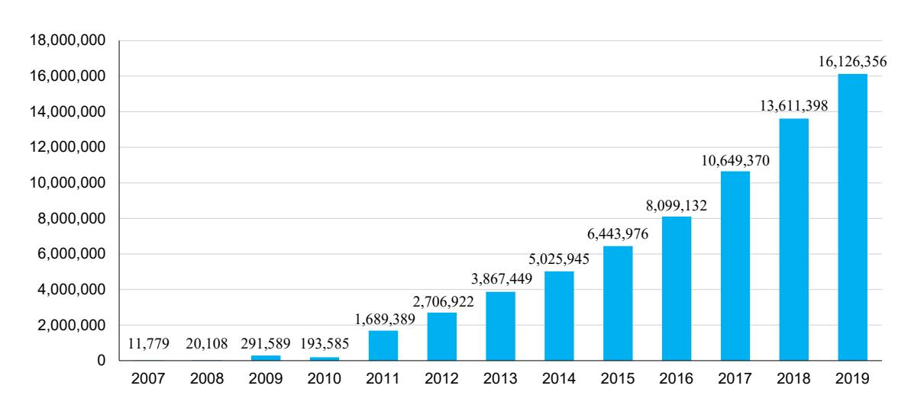

Source: Ministry of Post and Telecommunication

13.5 បណ្តាញខ្សែកាបអ៊ុបទិកជាតិ ឆ្នាំ២០១៩
Nation optical fiber backbone network 2019

| Nation Optical Fiber Backbone Network | Length in Km |
|---------------------------------------|--------------|
| Total national wide backbone          | 42,693       |
| Telecom Cambodia                      | 2,322        |
| Viettel Cambodia                      | 22,000       |
| Cambodia fiber optic cable network    | 18,371       |

Source: Ministry of Post and Telecommunication

### 14

### ಣಾಕುಣ

### **Tourism**

14.1 ចំនួនអ្នកទេសចរអន្តរជាតិមកដល់
Number of international visitor arrivals

| Month     | 2007      | 2008      | 2009      | 2010      | 2011      | 2012      | 2013      | 2014      | 2015      | 2016      | 2017      | 2018      | 2019      |
|-----------|-----------|-----------|-----------|-----------|-----------|-----------|-----------|-----------|-----------|-----------|-----------|-----------|-----------|
|           |           |           |           |           |           | Num       | ber       |           |           |           |           |           |           |
| Total     | 2,015,128 | 2,125,465 | 2,161,577 | 2,508,289 | 2,881,862 | 3,584,307 | 4,210,167 | 4,502,775 | 4,775,231 | 5,011,712 | 5,656,157 | 6,201,077 | 6,610,592 |
| January   | 194,932   | 223,581   | 218,691   | 232,590   | 274,471   | 350,257   | 404,108   | 442,045   | 460,577   | 466,086   | 532,206   | 596,241   | 647,206   |
| February  | 177,130   | 214,902   | 200,789   | 222,354   | 255,499   | 321,870   | 385,760   | 425,801   | 430,207   | 448,468   | 493,316   | 542,937   | 59,748    |
| March     | 178,751   | 205,722   | 202,808   | 228,748   | 248,497   | 323,083   | 382,206   | 400,076   | 417,052   | 427,923   | 477,374   | 572,075   | 633,164   |
| April     | 165,347   | 173,903   | 177,955   | 200,965   | 223,032   | 277,304   | 327,000   | 332,690   | 361,139   | 367,684   | 412,925   | 463,423   | 537,656   |
| May       | 132,512   | 149,275   | 145,564   | 170,164   | 190,258   | 233,220   | 292,115   | 300,302   | 314,748   | 320,601   | 368,809   | 419,171   | 472,952   |
| June      | 126,677   | 130,853   | 140,711   | 166,335   | 193,272   | 250,918   | 301,412   | 300,454   | 318,267   | 330,170   | 378,049   | 407,813   | 450,013   |
| July      | 143,310   | 148,449   | 163,817   | 202,349   | 239,527   | 284,282   | 338,761   | 340,091   | 364,325   | 395,761   | 446,627   | 454,056   | 502,421   |
| August    | 151,478   | 156,098   | 171,668   | 206,563   | 250,429   | 293,859   | 342,064   | 347,211   | 366,096   | 406,214   | 427,224   | 494,043   | 519,502   |
| September | 137,027   | 145,146   | 151,937   | 173,112   | 209,804   | 242,747   | 283,787   | 311,388   | 314,459   | 345,508   | 376,231   | 426,274   | 453,909   |
| October   | 160,235   | 156,718   | 157,105   | 205,515   | 233,190   | 290,959   | 334,410   | 390,637   | 408,922   | 414,077   | 471,039   | 453,370   | 481,782   |
| November  | 194,646   | 191,549   | 195,570   | 249,892   | 265,539   | 333,482   | 386,737   | 411,501   | 444,640   | 477,686   | 570,471   | 616,549   | 602,042   |
| December  | 253,083   | 229,269   | 234,962   | 249,702   | 298,344   | 382,326   | 431,807   | 500,579   | 574,799   | 611,534   | 701,886   | 755,125   | 712,462   |
|           |           |           |           |           |           | Annual gr | owth rate |           |           |           |           |           |           |
| Total     | 224       | 72        | 27        | 201       | 181       | 291       | 213       | 79        | 6.1       | 5.0       | 11.8      | 10.7      | 6.6       |
| January   | 19.6      | 14.7      | -2.2      | 6.4       | 18.0      | 27.6      | 15.4      | 9.4       | 4.2       | 1.2       | 14.2      | 12.0      | 8.5       |
| February  | 16.7      | 21.3      | -6.6      | 10.7      | 14.9      | 26.0      | 19.8      | 10.4      | 1.0       | 4.2       | 10.0      | 10.1      | 10.0      |
| March     | 25.5      | 15.1      | -1.4      | 12.8      | 8.6       | 30.0      | 18.3      | 4.7       | 4.2       | 2.6       | 11.6      | 19.8      | 10.7      |
| April     | 15.6      | 5.2       | 2.3       | 12.9      | 11.0      | 24.3      | 17.9      | 1.7       | 8.6       | 1.8       | 12.3      | 12.2      | 16.0      |
| May       | 23.0      | 12.7      | -2.5      | 16.9      | 11.8      | 22.6      | 25.3      | 2.8       | 4.8       | 1.9       | 15.0      | 13.7      | 12.8      |
| June      | 20.3      | 3.3       | 7.5       | 18.2      | 16.2      | 29.8      | 20.1      | -0.3      | 5.9       | 3.7       | 14.5      | 7.9       | 10.3      |
| July      | 16.5      | 3.6       | 10.4      | 23.5      | 18.4      | 18.7      | 19.2      | 0.4       | 7.1       | 8.6       | 12.9      | 1.7       | 10.7      |
| August    | 14.1      | 3.0       | 10.0      | 20.3      | 21.2      | 17.3      | 16.4      | 1.5       | 5.4       | 11.0      | 5.2       | 15.6      | 5.2       |
| September | 19.4      | 5.9       | 4.7       | 13.9      | 21.2      | 15.7      | 16.9      | 9.7       | 1.0       | 9.9       | 8.9       | 13.3      | 6.5       |
| October   | 15.9      | -2.2      | 0.2       | 30.8      | 13.5      | 24.8      | 14.9      | 16.8      | 4.7       | 1.3       | 0.7       | 8.7       | 6.3       |
| November  | 19.4      | -1.6      | 2.1       | 27.8      | 6.3       | 25.6      | 16.0      | 6.4       | 8.1       | 7.4       | 19.4      | 8.1       | -2.4      |
| December  | 17.9      | -9.4      | 2.5       | 6.3       | 19.5      | 28.1      | 12.9      | 15.9      | 14.8      | 6.4       | 14.8      | 7.6       | -5.6      |

14.2 ចំនួនអ្នកទេសចរមកដល់តាមផ្លូវអាកាស តាមប្រទេសរស់នៅ
Number of visitor arrivals by air by country of residence

| Country of residence   | 2009      | 2010      | 2011      | 2012      | 2013      | 2014      | 2015      | 2017       | 2018      | 2019      |
|------------------------|-----------|-----------|-----------|-----------|-----------|-----------|-----------|------------|-----------|-----------|
| Total                  | 1,053,845 | 1,237,695 | 2,691,299 | 3,347,414 | 3,921,339 | 4,220,079 | 4,517,798 | 5,602,157  | 6,201,077 | 6,287,136 |
| ASEAN                  | 161,159   | 181,462   | 1,101,111 | 1,514,267 | 1,831,507 | 1,991,897 | 2,097,758 | 21,261,254 | 2,067,504 | 2,228,185 |
| Thailand               | 29,479    | 28,752    | 116,758   | 201,422   | 221,259   | 279,457   | 349,908   | 394,934    | 382,317   | 466,493   |
| Malaysia               | 61,530    | 72,727    | 102,929   | 116,764   | 130,704   | 144,437   | 149,389   | 179,316    | 201,116   | 203,008   |
| Philippines            | 9,648     | 9,764     | 70,718    | 97,487    | 118,999   | 93,475    | 84,677    | 98,499     | 92,451    | 105,017   |
| Singapore              | 34,495    | 38,373    | 47,594    | 53,184    | 57,808    | 65,855    | 67,669    | 81,063     | 86,251    | 88,564    |
| Indonesia              | 4,865     | 6,920     | 15,817    | 22,544    | 28,199    | 35,655    | 43,147    | 49,878     | 55,753    | 66,804    |
| Vietnam                | 16,693    | 19,420    | 614,090   | 763,136   | 854,104   | 905,801   | 987,792   | 835,355    | 800,128   | 908,803   |
| Laos                   | 2,600     | 3,252     | 4,199     | 254,022   | 414,531   | 460,191   | 405,359   | 502,219    | 426,180   | 363,951   |
| Myanmar                | 1,481     | 1,831     | 128,525   | 4,744     | 5,089     | 6,036     | 8,965     | 18,981     | 22,518    | 24,414    |
| Brunei                 | 368       | 423       | 481       | 964       | 814       | 990       | 852       | 1,009      | 790       | 1,131     |
| Asia and Oceania       | 542,465   | 706,924   | 993,029   | 1,181,189 | 1,381,905 | 1,485,822 | 1,594,883 | 1,894,912  | 2,684,908 | 3,187,447 |
| Australia              | 55,933    | 61,400    | 105,010   | 117,729   | 132,028   | 134,167   | 134,748   | 143,852    | 12,800    | 123,100   |
| China                  | 112,539   | 156,789   | 247,197   | 333,894   | 463,123   | 560,335   | 694,712   | 1,210,782  | 2,024,443 | 2,361,849 |
| India                  | 9,598     | 10,508    | 15,240    | 18,999    | 23,610    | 28,529    | 36,671    | 59,571     | 65,882    | 75,286    |
| Japan                  | 127,593   | 134,280   | 161,804   | 179,327   | 206,932   | 215,788   | 193,330   | 203,373    | 210,471   | 207,636   |
| South Korea            | 161,609   | 248,705   | 342,810   | 411,491   | 435,009   | 424,424   | 395,259   | 345,081    | 301,770   | 254,874   |
| New Zealand            | 8,972     | 8,880     | 16,475    | 19,044    | 20,577    | 21,259    | 23,021    | 29,948     | 24,520    | 23,034    |
| Taiwan                 | 63,771    | 83,957    | 98,363    | 92,811    | 96,992    | 97,528    | 109,727   | 121,023    | 134,637   | 138,402   |
| Others                 | 2,450     | 2,405     | 6,130     | 7,894     | 3,634     | 3,792     | 7,415     | 18,478     | 9,389     | 2,996     |
| Europe                 | 217,020   | 218,564   | 389,152   | 416,712   | 458,957   | 484,188   | 532,540   | 869,169    | 818,661   | 561,803   |
| Belgium                | 7,640     | 9,206     | 13,905    | 14,762    | 16,171    | 15,891    | 17,452    | 21,512     | 18,499    | 19,270    |
| Denmark                | 4,474     | 3,399     | 9,352     | 10,013    | 10,485    | 11,766    | 11,553    | 13,910     | 12,688    | 11,843    |
| France                 | 77,458    | 78,312    | 117,408   | 121,175   | 131,486   | 141,052   | 145,724   | 166,356    | 170,844   | 164,117   |
| Germany                | 34,275    | 34,649    | 63,398    | 72,537    | 81,565    | 84,143    | 94,040    | 118,265    | 98,976    | 94,371    |
| Italy                  | 10,699    | 12,637    | 20,837    | 22,625    | 25,196    | 29,548    | 32,177    | 33,979     | 33,979    | 40,916    |
| Netherlands            | 9,977     | 10,120    | 22,725    | 24,559    | 28,076    | 26,553    | 29,015    | 40,329     | 28,911    | 28,284    |
| Norway                 | 3,294     | 3,458     | 8,128     | 8,251     | 9,482     | 9,813     | 11,200    | 11,491     | 9,463     | 8,306     |
| Switzerland            | 10,471    | 9,569     | 16,395    | 17,789    | 20,371    | 20,207    | 21,979    | 23,876     | 20,082    | 19,696    |
| United Kingdom         | 52,295    | 50,334    | 104,052   | 110,182   | 123,919   | 133,305   | 154,265   | 171,162    | 162,395   | 163,177   |
| Austria                | 4,164     | 4,987     | 7,601     | 8,148     | 9,091     | 8,842     | 10,080    | 11,400     | 11,374    | 10,707    |
| Others                 | 2,273     | 1,893     | 5,351     | 6,671     | 3,115     | 3,068     | 5,055     | 11,040     | 5,567     | 1,116     |
| America                | 130,786   | 128,165   | 199,102   | 224,531   | 237,931   | 245,768   | 277,972   | 335,252    | 369,319   | 309,701   |
| Canada                 | 20,016    | 23,342    | 42,462    | 47,829    | 50,867    | 52,264    | 56,834    | 69,077     | 61,551    | 60,189    |
| U.S.A                  | 109,316   | 103,315   | 153,953   | 173,076   | 184,964   | 191,366   | 217,510   | 256,544    | 250,813   | 248,863   |
| Others                 | 1,454     | 1,508     | 2,687     | 3,626     | 2,100     | 2,138     | 3,628     | 6,041      | 2,506     | 649       |
| Middle East and Africa | 2,415     | 2,580     | 8,905     | 10,715    | 11,039    | 12,404    | 14,645    | 12,752     | 12,435    | 13,646    |

Figure 14.1 Number of visitor arrivals by region, 2019

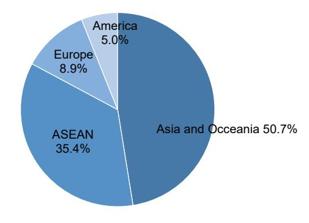

14.3 ចំនួនអ្នកទេសចរមកដល់ តាមផ្លូវគោក និងផ្លូវទឹក Number of visitor arrivals by land and boat

| Month                                                       | 2007                                                      | 2008                                                                 | 2009                                                                 | 2010                                                              | 2011                                                                 | 2012                                                                          | 2013                                                                          | 2014                                                                | 2015                                                            | 2016                                                                | 2017                                                           | 2018                                                             | 2019                                                                   |
|-------------------------------------------------------------|-----------------------------------------------------------|----------------------------------------------------------------------|----------------------------------------------------------------------|-------------------------------------------------------------------|----------------------------------------------------------------------|-------------------------------------------------------------------------------|-------------------------------------------------------------------------------|---------------------------------------------------------------------|-----------------------------------------------------------------|---------------------------------------------------------------------|----------------------------------------------------------------|------------------------------------------------------------------|------------------------------------------------------------------------|
| Total                                                       | 718,615                                                   | 886,058                                                              | 1,049,848                                                            | 1,203,989                                                         | 1,401,455                                                            | 1,862,224                                                                     | 2,192,507                                                                     | 2,229,283                                                           | 2,299,230                                                       | 2,299,230                                                           | 2,307,345                                                      | 2.219,,11                                                        | 2,206,597                                                              |
| January                                                     | 61,309                                                    | 87,370                                                               | 97,453                                                               | 105,595                                                           | 122,290                                                              | 164,758                                                                       | 188,896                                                                       | 188,115                                                             | 198,221                                                         | 193,379                                                             | 203,603                                                        | 207,686                                                          | 243,800                                                                |
| February                                                    | 56,296                                                    | 79,166                                                               | 91,667                                                               | 100,459                                                           | 110,491                                                              | 153,722                                                                       | 182,307                                                                       | 185,196                                                             | 188,452                                                         | 180,697                                                             | 191,992                                                        | 168,974                                                          | 158,210                                                                |
| March                                                       | 59,614                                                    | 75,646                                                               | 97,955                                                               | 106,132                                                           | 118,257                                                              | 162,974                                                                       | 189,709                                                                       | 195,643                                                             | 187,695                                                         | 183,364                                                             | 185,891                                                        | 176,961                                                          | 176,721                                                                |
| April                                                       | 65,234                                                    | 72,598                                                               | 91,170                                                               | 103,490                                                           | 116,367                                                              | 151,022                                                                       | 181,652                                                                       | 171,370                                                             | 179,665                                                         | 184, 121                                                            | 169,134                                                        | 165,872                                                          | 160,720                                                                |
| May                                                         | 43,567                                                    | 63,211                                                               | 74,979                                                               | 86,622                                                            | 99,989                                                               | 128,822                                                                       | 165,860                                                                       | 162,870                                                             | 153,745                                                         | 155,261                                                             | 151,455                                                        | 147,410                                                          | 130,075                                                                |
| June                                                        | 40,110                                                    | 56,197                                                               | 76,860                                                               | 86,485                                                            | 103,262                                                              | 144,475                                                                       | 174,960                                                                       | 160,991                                                             | 163,315                                                         | 159,284                                                             | 154,940                                                        | 130,634                                                          | 115,001                                                                |
| July                                                        | 49,312                                                    | 65,207                                                               | 80,700                                                               | 104,792                                                           | 123,185                                                              | 157,877                                                                       | 194,112                                                                       | 170,740                                                             | 170,686                                                         | 183,026                                                             | 176,252                                                        | 145,381                                                          | 121,326                                                                |
| August                                                      | 52,732                                                    | 62,914                                                               | 80,283                                                               | 101,777                                                           | 126,763                                                              | 157,899                                                                       | 188,159                                                                       | 167,554                                                             | 161,820                                                         | 199,738                                                             | 152,307                                                        | 145,025                                                          | 150,055                                                                |
| September                                                   | 51,248                                                    | 62,382                                                               | 79,266                                                               | 87,201                                                            | 114,525                                                              | 134,571                                                                       | 154,329                                                                       | 162,924                                                             | 148,607                                                         | 162,569                                                             | 143,778                                                        | 129,169                                                          | 164,589                                                                |
| October                                                     | 57,039                                                    | 63,543                                                               | 71,434                                                               | 97,714                                                            | 114,368                                                              | 150,051                                                                       | 178,350                                                                       | 214,541                                                             | 217,320                                                         | 190,674                                                             | 147,852                                                        | 108,241                                                          | 164,256                                                                |
| November                                                    | 64,016                                                    | 83,758                                                               | 90,844                                                               | 111,142                                                           | 116,124                                                              | 164,649                                                                       | 189,328                                                                       | 194,376                                                             | 209,962                                                         | 207,847                                                             | 245,574                                                        | 236,816                                                          | 262,156                                                                |
| December                                                    | 118,138                                                   | 114,066                                                              | 117,237                                                              | 112,580                                                           | 135,834                                                              | 191,404                                                                       | 204,845                                                                       | 254,963                                                             | 319,742                                                         | 307,385                                                             | 366,641                                                        | 342,038                                                          | 359,688                                                                |
|                                                             |                                                           |                                                                      |                                                                      |                                                                   |                                                                      |                                                                               |                                                                               |                                                                     |                                                                 |                                                                     |                                                                |                                                                  |                                                                        |
|                                                             |                                                           |                                                                      |                                                                      |                                                                   |                                                                      | Growth r                                                                      | ate                                                                           |                                                                     |                                                                 |                                                                     |                                                                |                                                                  |                                                                        |
| Total                                                       | 85.4                                                      | 299.4                                                                | 255.6                                                                | 208.3                                                             | 195.9                                                                | Growth r                                                                      | 228.2                                                                         | 18.9                                                                | 26.2                                                            | 24                                                                  | 5.3                                                            | 2.0                                                              | 4.9                                                                    |
| Total January                                            | <b>85.4</b> 6.8                                           | <b>299.4</b> 23.3                                                    | <b>255.6</b> 18.5                                                    | <b>208.3</b> 14.7                                                 | <b>195.9</b> 16.4                                                    |                                                                               |                                                                               | 18.9 -0.4                                                        |                                                                 |                                                                     | <b>5.3</b> 6.3                                                 | <b>2.0</b> 12.0                                                  | <b>4.9</b> 17.4                                                        |
|                                                             |                                                           |                                                                      |                                                                      |                                                                   |                                                                      | 386.3                                                                         | 228.2                                                                         |                                                                     | 5.4                                                             | 4.1                                                                 |                                                                |                                                                  |                                                                        |
| January                                                     | 6.8                                                       | 23.3                                                                 | 18.5                                                                 | 14.7                                                              | 16.4                                                                 | <b>386.3</b> 32.9                                                             | <b>228.2</b> 17.7                                                             | -0.4                                                                | 5.4                                                             | 4.1                                                                 | 6.3                                                            | 12.0                                                             | 17.4                                                                   |
| January February                                         | 6.8 -7.3                                               | 23.3 40.6                                                         | 18.5 11.5                                                         | 14.7 8.4                                                       | 16.4 15.8                                                         | <b>386.3</b> 32.9 34.7                                                        | 228.2 17.7 14.7                                                         | -0.4 1.6                                                         | 5.4 1.8 -4.1                                              | 4.1 23 2.5                                                    | 6.3 1.4                                                     | 12.0 4.8                                                      | 17.4 -6.4                                                           |
| January February March                                | 6.8 -7.3 8.7                                        | 23.3 40.6 26.9                                                 | 18.5 11.5 15.8                                                 | 14.7 8.4 9.6                                                | 16.4 15.8 10.0                                                 | 386.3 32.9 34.7 39.1                                                 | 228.2 17.7 14.7 18.6                                                 | -0.4 1.6 3.1                                                  | 5.4 1.8 -4.1                                              | 4.1 23 2.5 1.0                                             | 6.3 1.4 8.1                                              | 12.0 4.8 1.9                                               | 17.4 -6.4 -0.1                                                   |
| January February March April                       | 6.8 -7.3 8.7 -2.9                                | 23.3 40.6 26.9 11.3                                         | 18.5 11.5 15.8 29.5                                         | 14.7 8.4 9.6 8.3                                         | 16.4 15.8 10.0 11.4                                         | 386.3 32.9 34.7 39.1 37.8                                         | 228.2 17.7 14.7 18.6 16.4                                         | -0.4 1.6 3.1 -5.7                                          | 5.4 1.8 -4.1 4.8 -5.6                               | 4.1 23 2.5 1.0 2.5                                      | 6.3 1.4 8.1 2.5                                       | 12.0 4.8 1.9 2.7                                        | 17.4 -6.4 -0.1 -3.1                                           |
| January February March April May                | 6.8 -7.3 8.7 -2.9 -3.2                        | 23.3 40.6 26.9 11.3 45.1                                 | 18.5 11.5 15.8 29.5 25.6                                 | 14.7 8.4 9.6 8.3 13.5                                 | 16.4 15.8 10.0 11.4 12.4                                 | 386.3 32.9 34.7 39.1 37.8 29.8                                 | 228.2 17.7 14.7 18.6 16.4 20.3                                 | -0.4 1.6 3.1 -5.7 -1.8                                  | 5.4 1.8 -4.1 4.8 -5.6 1.4                        | 4.1 23 2.5 1.0 2.5 7.2                               | 6.3 1.4 8.1 2.5 2.7                                | 12.0 4.8 1.9 2.7 15.7                                | 17.4 -6.4 -0.1 -3.1 -11.8                                  |
| January February March April May June        | 6.8 -7.3 8.7 -2.9 -3.2                        | 23.3 40.6 26.9 11.3 45.1 40.1                         | 18.5 11.5 15.8 29.5 25.6 18.6                         | 14.7 8.4 9.6 8.3 13.5 15.5                         | 16.4 15.8 10.0 11.4 12.4 15.4                         | 386.3 32.9 34.7 39.1 37.8 29.8 28.8                         | 228.2 17.7 14.7 18.6 16.4 20.3 28.8                         | -0.4 1.6 3.1 -5.7 -1.8 -8.0                          | 5.4 1.8 -4.1 4.8 -5.6 1.4                        | 4.1 23 2.5 1.0 2.5 7.2                               | 6.3 1.4 8.1 2.5 2.7 3.7                         | 12.0 4.8 1.9 2.7 15.7 17.5                        | 17.4 -6.4 -0.1 -3.1 -11.8 -12.0                         |
| January February March April May June July                  | 6.8 -7.3 8.7 -2.9 -3.2 -3.2                | 23.3 40.6 26.9 11.3 45.1 40.1 32.2                 | 18.5 11.5 15.8 29.5 25.6 18.6 36.8                 | 14.7 8.4 9.6 8.3 13.5 15.5 12.5                 | 16.4 15.8 10.0 11.4 12.4 15.4 19.4                 | 386.3 32.9 34.7 39.1 37.8 29.8 28.8 39.9                 | 228.2 17.7 14.7 18.6 16.4 20.3 28.8 21.1                 | -0.4 1.6 3.1 -5.7 -1.8 -8.0                          | 5.4 1.8 -4.1 4.8 -5.6 1.4 0.0                 | 4.1 23 2.5 1.0 2.5 7.2 23.4 9.4                | 6.3 1.4 8.1 2.5 2.7 3.7 23.7                 | 12.0 4.8 1.9 2.7 15.7 17.5 4.8                 | 17.4 -6.4 -0.1 -3.1 -11.8 -12.0 -16.5 3.5         |
| January February March April May June July August           | 6.8 -7.3 8.7 -2.9 -3.2 -3.2 -1.6 0.4 | 23.3 40.6 26.9 11.3 45.1 40.1 32.2 19.3         | 18.5 11.5 15.8 29.5 25.6 18.6 36.8 23.8         | 14.7 8.4 9.6 8.3 13.5 15.5 12.5 29.9         | 16.4 15.8 10.0 11.4 12.4 15.4 19.4 17.6         | 386.3 32.9 34.7 39.1 37.8 29.8 28.8 39.9 28.2         | 228.2 17.7 14.7 18.6 16.4 20.3 28.8 21.1 23.0         | -0.4 1.6 3.1 -5.7 -1.8 -8.0 -12.0                 | 5.4 1.8 -4.1 4.8 -5.6 1.4 0.0                 | 4.1 23 2.5 1.0 2.5 7.2 23.4 9.4                | 6.3 1.4 8.1 2.5 2.7 3.7 23.7 11.6         | 12.0 4.8 1.9 2.7 15.7 17.5 4.8 10.2         | 17.4 -6.4 -0.1 -3.1 -11.8 -12.0 -16.5 3.5         |
| January February March April May June July August September | 6.8 -7.3 8.7 -2.9 -3.2 -1.6 0.4 17.1 | 23.3 40.6 26.9 11.3 45.1 40.1 32.2 19.3 21.7 | 18.5 11.5 15.8 29.5 25.6 18.6 36.8 23.8 27.6 | 14.7 8.4 9.6 8.3 13.5 15.5 12.5 29.9 26.8 | 16.4 15.8 10.0 11.4 12.4 15.4 19.4 17.6 24.5 | 386.3 32.9 34.7 39.1 37.8 29.8 28.8 39.9 28.2 24.6 | 228.2 17.7 14.7 18.6 16.4 20.3 28.8 21.1 23.0 19.2 | -0.4 1.6 3.1 -5.7 -1.8 -8.0 -12.0 -11.0 5.6 | 5.4 1.8 -4.1 4.8 -5.6 1.4 0.0 -3.4 -8.8 | 4.1 23 2.5 1.0 2.5 7.2 23.4 9.4 12.3 1.0 | 6.3 1.4 8.1 2.5 2.7 3.7 23.7 11.6 22.5 | 12.0 4.8 1.9 2.7 15.7 17.5 4.8 10.2 26.8 | 17.4 -6.4 -0.1 -3.1 -11.8 -12.0 -16.5 3.5 27.4 |

Figure 14.2 Monthly visitor arrivals by land and boat, 2019

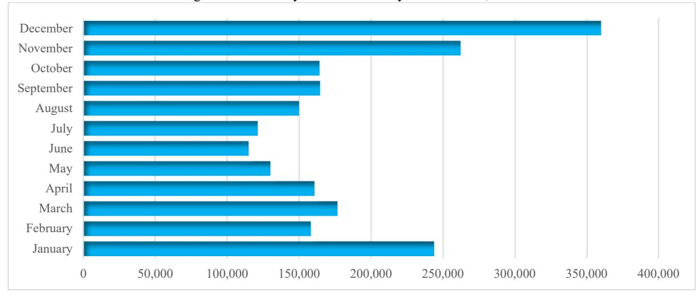

**14.4** ចំនួនអ្នកទេសចរមកដល់ តាមច្រកទ្វារត្រួតពិនិត្យព្រំដែនអន្តរជាតិ Number of visitor arrivals at international border check point

| YYaear | Bavet   | Phnom Den | Cham Yeam | Poipet  | Osmach | Other     | Total     | Preah Sihanouk | Phnom Penh | Kaam Samnor | Total   |
|--------|---------|--------------|--------------|---------|--------|-----------|-----------|-------------------|---------------|----------------|---------|
| 1 Cui  |         |              |              | By land |        |           |           |                   | Ву            | boat           |         |
| 2003   | 35,837  | 664          | 17,111       | 167,654 | 2,026  | 3,134     | 226,426   | 1,330             | -             | 17,238         | 18,568  |
| 2004   | 51,935  | 1,724        | 22,960       | 242,456 | 4,097  | 8,335     | 331,507   | 466               | -             | 24,916         | 25,382  |
| 2005   | 77,520  | 2,475        | 29,588       | 284,865 | 8,979  | 20,005    | 423,432   | 1,813             | -             | 29,848         | 31,661  |
| 2006   | 119,980 | 1,532        | 22,576       | 284,597 | -      | 13,646    | 442,331   | 8,478             | -             | 31,307         | 39,785  |
| 2007   | 178,636 | 3,763        | 21,211       | 239,087 | 5,499  | 1,521,342 | 2,015,128 | 2,264             | 1,630         | 41,096         | 44,990  |
| 2008   | 217,688 | 15,496       | 26,480       | 268,795 | 10,204 | 1,514,913 | 2,125,465 | 11,963            | 1,984         | 57,942         | 71,889  |
| 2009   | 289,809 | 18,892       | 26,098       | 326,075 | 11,156 | 1,411,238 | 2,161,577 | 19,865            | 2,627         | 55,817         | 78,309  |
| 2010   | 360,213 | 30,379       | 25,074       | 337,585 | 12,342 | 1,742,696 | 2,508,289 | 16,281            | 4,852         | 56,882         | 78,015  |
| 2011   | 406,458 | 33,865       | 36,996       | 427,221 | 24,123 | 1,953,199 | 2,881,862 | 11,118            | 6,011         | 40,962         | 58,091  |
| 2012   | 513,021 | 41,461       | 35,730       | 568,278 | 25,746 | 2,400,071 | 3,584,307 | 20,284            | 8,526         | 47,688         | 76,498  |
| 2013   | 537,564 | 38,227       | 93,174       | 585,894 | 26,794 | 2,928,512 | 4,210,165 | 16,408            | 9,825         | 48,116         | 74,349  |
| 2014   | 578,951 | 46,042       | 62,384       | 536,813 | 28,038 | 3,250,547 | 4,502,775 | 21,735            | 11,084        | 58,689         | 91,508  |
| 2015   | 689,721 | 64,295       | 59,962       | 531,181 | 34,681 | 3,395,391 | 4,775,231 | 43,898            | 13,721        | 78,497         | 136,116 |
| 2017   | 654,141 | 66,078       | 43,268       | 613,094 | 62,993 | 3,312,738 | 5,602,157 | 43,007            | 20,734        | 68,065         | 131,806 |
| 2018   | 686,289 | 59,974       | 37,041       | 568,333 | 61,412 | 1,413,049 | 6,201,077 | 48,741            | 16,918        | 65,519         | 131,178 |
| 2019   | 869,117 | 55,114       | 37,252       | 574,433 | 35,557 | 1,571,473 | 6,610,592 | 77,881            | 16,179        | 55,814         | 149,874 |

14.5 ចំនួនអ្នកទេសចរមកដល់ព្រលានយន្តហោះអន្តរជាតិភ្នំពេញ Number of visitor arrivals at Phnom Penh international airport

| Month     | 2007    | 2008    | 2009    | 2010    | 2011    | 2012       | 2013      | 2014    | 2015      | 2016      | 2017      | 2018      | 2019      |
|-----------|---------|---------|---------|---------|---------|------------|-----------|---------|-----------|-----------|-----------|-----------|-----------|
| Total     | 535,262 | 570,903 | 527,745 | 591,628 | 645,235 | 716,584    | 836,377   | 917,800 | 1,061,034 | 1,164,240 | 1,409,833 | 1,923,773 | 2,071,907 |
| January   | 48,383  | 54,336  | 50,749  | 54,584  | 58,905  | 65,956     | 72,549    | 84,436  | 93,817    | 97,712    | 118,682   | 158,980   | 172,695   |
| February  | 42,808  | 54,854  | 46,128  | 51,867  | 57,202  | 59,122     | 68,988    | 83,167  | 84,319    | 100,709   | 110,503   | 152,132   | 194,439   |
| March     | 45,159  | 54,976  | 44,619  | 52,528  | 54,451  | 62,330     | 77,375    | 77,468  | 94,424    | 104,860   | 117,418   | 184,103   | 214,575   |
| April     | 42,153  | 47,358  | 39,983  | 43,797  | 49,478  | 53,883     | 62,859    | 67,435  | 79,805    | 84,094    | 109,072   | 147,765   | 177,077   |
| May       | 38,780  | 40,907  | 35,850  | 41,131  | 44,874  | 47,636     | 60,880    | 64,217  | 79,166    | 83,697    | 104,084   | 142,286   | 164,985   |
| June      | 39,269  | 40,661  | 36,577  | 41,084  | 45,554  | 54,359     | 64,019    | 68,530  | 80,095    | 88,257    | 107,770   | 142,276   | 158,189   |
| July      | 44,623  | 43,793  | 44,356  | 49,519  | 56,875  | 60,057     | 68,078    | 76,980  | 93,931    | 97,789    | 126,733   | 147,577   | 176,454   |
| August    | 41,534  | 45,492  | 44,264  | 46,697  | 55,182  | 57,016     | 66,865    | 73,895  | 92,880    | 90,387    | 121,631   | 169,125   | 169,073   |
| September | 38,810  | 44,223  | 37,192  | 40,723  | 45,474  | 50,023     | 59,018    | 66,614  | 78,669    | 86,681    | 110,827   | 147,515   | 140,440   |
| October   | 44,052  | 43,122  | 42,024  | 49,353  | 53,459  | 60,437     | 67,988    | 75,375  | 87,099    | 101,708   | 117.493   | 169,234   | 157,988   |
| November  | 53,638  | 48,824  | 52,181  | 59,803  | 61,005  | 70,588     | 81,430    | 87,488  | 97,726    | 111,098   | 136,034   | 177,774   | 170,858   |
| December  | 56,053  | 52,357  | 53,822  | 60,542  | 62,776  | 75,177     | 86,328    | 92,195  | 99,103    | 117,248   | 129,586   | 185,006   | 175,134   |
|           |         |         |         |         | Ann     | ual change | in percen | t       |           |           |           |           |           |
| Total     | 25.2    | 6.7     | -7.6    | 12.1    | 17.2    | 20.4       | 17.5      | 14.8    | 15.6      | 9.7       | 21.1      | 36.5      | 7.7       |
| January   | 35.9    | 12.3    | -6.6    | 7.6     | 28.8    | 28.2       | 19.3      | 18.8    | 11.1      | 4.2       | 21 5      | 34 0      | 8.6       |
| February  | 24.9    | 28.1    | -15.9   | 12.4    | 25.4    | 24.2       | 23.3      | 17.1    | 1.4       | 19.4      | 9.7       | 37.7      | 27.8      |
| March     | 35.5    | 21.7    | -18.8   | 17.7    | 8.1     | 29.0       | 17.7      | 10.3    | 21.9      | 11.1      | 12        | 56.8      | 16.6      |
| April     | 25.3    | 12.3    | -15.6   | 9.5     | 6.5     | 26.6       | 13.9      | 13.8    | 18.3      | 5.4       | 29.7      | 35.5      | 19.8      |
| May       | 33.9    | 5.5     | -12.4   | 14.7    | 7.0     | 25.0       | 15.2      | 12.0    | 23.3      | 5.7       | 24 4      | 36.7      | 16.0      |
| June      | 30.0    | 3.5     | -10.0   | 12.3    | 14.7    | 17.2       | 19.9      | 13.6    | 16.9      | 10.2      | 22.1      | 32        | 11.2      |
| July      | 27.8    | -1.9    | 1.3     | 11.6    | 23.8    | 11.6       | 15.4      | 20.6    | 22.0      | 4.1       | 29.6      | 16.4      | 19.6      |
| August    | 19.2    | 9.5     | -2.7    | 5.5     | 17.9    | 15.3       | 10.3      | 21.5    | 25.7      | -2.7      | 34 6      | 39        | 0.0       |
| September | 21.9    | 13.9    | -15.9   | 9.5     | 10.2    | 16.8       | 21.1      | 16.2    | 18.1      | 10.2      | 27.9      | 33.1      | -4.8      |
| October   | 17.2    | -2.1    | -2.5    | 17.4    | 11.8    | 23.1       | 9.4       | 14.4    | 15.6      | 16.8      | 15.5      | 44.0      | -6.6      |
| November  | 21.1    | -9.0    | 6.9     | 14.6    | 12.0    | 11.1       | 18.1      | 11.8    | 11.7      | 13.7      | 22.4      | 30.7      | -3.9      |
| December  | 16.9    | -6.6    | 2.8     | 12.5    | 30.2    | 16.1       | 21.5      | 9.1     | 7.5       | 18.3      | 10.5      | 42.8      | -5.3      |

14.6 ចំនួនអ្នកទេសចរមកដល់ព្រលានយន្តហោះអន្តរជាតិខេត្តសៀមរាប តាមជើងហោះហើរត្រង់ Number of visitor arrivals at Siem Reap international airport by direct flight\*

| Month     | 2007    | 2008    | 2009    | 2010    | 2011    | 2012       | 2013        | 2014      | 2015      | 2016      | 2017      | 2018      | 2019      |
|-----------|---------|---------|---------|---------|---------|------------|-------------|-----------|-----------|-----------|-----------|-----------|-----------|
| Total     | 761,251 | 912,624 | 899,517 | 712,672 | 835,172 | 1,005,499  | 1,181,281   | 1,355,693 | 1,414,967 | 1,507,039 | 1,820,687 | 1,939,550 | 1,665,365 |
| January   | 85,240  | 105,878 | 96,924  | 72,411  | 93,276  | 119,543    | 142,661     | 169,494   | 168,539   | 173,825   | 201,347   | 219,868   | 203,270   |
| February  | 78,026  | 104,952 | 88,633  | 70,028  | 87,806  | 109,026    | 134,465     | 157,439   | 157,436   | 165,871   | 184,112   | 211,920   | 197,172   |
| March     | 73,978  | 96,336  | 89,981  | 70,088  | 75,789  | 97,779     | 115,122     | 126,965   | 134,933   | 139,699   | 167,018   | 199,656   | 183,437   |
| April     | 57,960  | 72,473  | 75,707  | 53,678  | 57,187  | 72,399     | 82,489      | 93,885    | 101,669   | 99,012    | 130,003   | 137,357   | 146,195   |
| May       | 50,165  | 64,417  | 58,766  | 42,411  | 45,395  | 56,762     | 65,375      | 73,215    | 81,837    | 81,096    | 110,706   | 116,930   | 116,193   |
| June      | 47,298  | 51,237  | 51,533  | 38,766  | 44,456  | 52,084     | 62,433      | 70,933    | 74,857    | 82,168    | 111,198   | 120,773   | 105,086   |
| July      | 49,375  | 57,741  | 66,166  | 48,038  | 59,467  | 66,348     | 76,571      | 92,371    | 99,708    | 111,266   | 135,281   | 142,832   | 116,564   |
| August    | 57,212  | 66,501  | 74,708  | 58,089  | 68,484  | 78,944     | 87,040      | 105,762   | 111,396   | 112,271   | 143,405   | 158,022   | 120,337   |
| September | 46,969  | 55,965  | 60,872  | 45,188  | 49,805  | 58,153     | 70,440      | 81,850    | 87,183    | 92,257    | 115,281   | 125,141   | 88,147    |
| October   | 59,144  | 67,726  | 69,336  | 58,448  | 65,363  | 80,471     | 88,072      | 100,721   | 104,503   | 116,182   | 144,315   | 145,818   | 106,264   |
| November  | 76,992  | 81,881  | 76,607  | 78,947  | 88,410  | 98,245     | 115,979     | 129,637   | 136,952   | 153,090   | 181,471   | 167,666   | 134,561   |
| December  | 78,892  | 87,517  | 90,284  | 76,580  | 99,734  | 115,745    | 140,634     | 153,421   | 155,954   | 180,302   | 196,550   | 193,567   | 148,139   |
|           |         |         |         |         | An      | nual chang | e in percer | ıt        |           |           |           |           |           |
| Total     | 26.9    | 19.9    | -1.4    | -20.8   | 17.2    | 20.4       | 17.5        | 14.8      | 4.4       | 6.5       | 20.8      | 6.5       | -14.1     |
| January   | 39.5    | 24.2    | -8.5    | -25.3   | 28.8    | 28.2       | 19.3        | 18.8      | -0.6      | 3.1       | 15.8      | 9.2       | -7.5      |
| February  | 37.4    | 34.5    | -15.5   | -21.0   | 25.4    | 24.2       | 23.3        | 17.1      | 0.0       | 5.4       | 11.0      | 15.1      | -7.0      |
| March     | 36.3    | 30.2    | -6.6    | -22.1   | 8.1     | 29.0       | 17.7        | 10.3      | 6.3       | 3.5       | 19.6      | 19.5      | -8.1      |
| April     | 37.2    | 25.0    | 4.5     | -29.1   | 6.5     | 26.6       | 13.9        | 13.8      | 8.3       | -2.6      | 31.3      | 5.7       | 6.4       |
| May       | 48.6    | 28.4    | -8.8    | -27.8   | 7.0     | 25.0       | 15.2        | 12.0      | 11.8      | -0.9      | 36.5      | 5.6       | -0.6      |
| June      | 40.6    | 8.3     | 0.6     | -24.8   | 14.7    | 17.2       | 19.9        | 13.6      | 5.5       | 9.8       | 35.3      | 8.6       | -13.0     |
| July      | 29.8    | 16.9    | 14.6    | -27.4   | 23.8    | 11.6       | 15.4        | 20.6      | 7.9       | 11.6      | 21.6      | 5.6       | -18.4     |
| August    | 26.0    | 16.2    | 12.3    | -22.2   | 17.9    | 15.3       | 10.3        | 21.5      | 5.3       | 0.8       | 27.7      | 10.2      | -23.8     |
| September | 19.9    | 19.2    | 8.8     | -25.8   | 10.2    | 16.8       | 21.1        | 16.2      | 6.5       | 5.8       | 25.0      | 8.6       | -29.6     |
| October   | 18.5    | 14.5    | 2.4     | -15.7   | 11.8    | 23.1       | 9.4         | 14.4      | 3.8       | 11.2      | 24.2      | 1.0       | -27.1     |
| November  | 12.9    | 6.4     | -6.4    | 3.1     | 12.0    | 11.1       | 18.1        | 11.8      | 5.6       | 11.8      | 18.5      | -7.6      | -19.7     |
| December  | 2.3     | 10.9    | 3.2     | -15.2   | 30.2    | 16.1       | 21.5        | 9.1       | 1.7       | 15.6      | 9.0       | -1.5      | -23.5     |

Note: \* Direct flight: from Thailand (Bangkok), Vietnam, Laos PDR, Japan, Singapore, China and Myanmar (Rangoon).

14.7 ចំនួនអ្នកទេសចរមកដល់ខេត្តសៀមរាប Number of visitor arrivals to Siem Reap province

| Month     | 2007      | 2008      | 2009    | 2010      | 2011      | 2012       | 2013        | 2014      | 2015      | 2016      | 2017      | 2018      | 2019      |
|-----------|-----------|-----------|---------|-----------|-----------|------------|-------------|-----------|-----------|-----------|-----------|-----------|-----------|
| Total     | 1,120,586 | 1,059,870 | 998,084 | 1,305,256 | 1,610,076 | 2,063,336  | 2,237,316   | 2,350,937 | 2,124,863 | 2,205,274 | 2,457,212 | 2,590,115 | 2,205,697 |
| January   | 185,163   | 121,975   | 105,701 | 122,163   | 166,354   | 224,145    | 248,614     | 286,331   | 245,491   | 248,563   | 287,154   | 294,813   | 271,050   |
| February  | 111,459   | 120,657   | 94,241  | 126,057   | 146,593   | 217,132    | 231,369     | 262,226   | 237,729   | 246,212   | 251,900   | 295,389   | 273,259   |
| March     | 103,190   | 113,758   | 98,222  | 117,882   | 123,025   | 198,597    | 214,746     | 230,180   | 205,774   | 207,979   | 225,351   | 268,378   | 243,591   |
| April     | 85,769    | 91,105    | 86,465  | 109,799   | 129,953   | 179,778    | 166,451     | 191,102   | 174,187   | 146,942   | 181,220   | 192,412   | 185,405   |
| May       | 68,292    | 72,447    | 62,175  | 89,902    | 115,153   | 121,799    | 135,066     | 143,673   | 127,815   | 125,947   | 147,011   | 155,196   | 144,536   |
| June      | 61,573    | 58,852    | 56,224  | 75,141    | 103,431   | 117,206    | 126,029     | 126,032   | 114,684   | 120,039   | 140,760   | 150,773   | 126,602   |
| July      | 62,976    | 65,896    | 71,282  | 95,427    | 122,954   | 143,464    | 159,244     | 165,895   | 154,642   | 168,730   | 182,632   | 185,878   | 149,269   |
| August    | 69,196    | 78,254    | 80,220  | 106,502   | 140,769   | 163,502    | 151,449     | 183,140   | 166,098   | 172,636   | 192,403   | 201,865   | 158,124   |
| September | 56,170    | 64,855    | 66,700  | 85,300    | 118,872   | 121,590    | 140,985     | 152,602   | 120,506   | 131,184   | 144,841   | 156,865   | 110,677   |
| October   | 86,833    | 79,200    | 77,553  | 108,241   | 122,450   | 159,067    | 196,263     | 147,737   | 154,208   | 166,199   | 187,560   | 188,474   | 141,494   |
| November  | 107,330   | 95,984    | 90,472  | 136,468   | 148,656   | 190,614    | 214,731     | 212,203   | 200,512   | 219,917   | 249,231   | 233,125   | 193,260   |
| December  | 122,635   | 96,887    | 108,829 | 132,374   | 171,866   | 226,442    | 252,369     | 249,816   | 223,217   | 250,926   | 267,219   | 267,647   | 208,430   |
|           |           |           |         |           | An        | nual chang | e in percer | ıt        |           |           |           |           |           |
| Total     | 30.8      | -5.4      | -5.8    | 30.8      | 23.4      | 28.2       | 8.4         | 5.1       | -9.6      | 3.8       | 11.4      | 5.4       | -14.9     |
| January   | 114.6     | -34.1     | -13.3   | 15.6      | 36.2      | 34.7       | 10.9        | 15.2      | -14.3     | 1.3       | 15.5      | 2.7       | -8.1      |
| February  | 36.3      | 8.3       | -21.9   | 33.8      | 16.3      | 48.1       | 6.6         | 13.3      | -9.3      | 3.6       | 2.3       | 17.3      | -7.5      |
| March     | 39.4      | 10.2      | -13.7   | 20.0      | 4.4       | 61.4       | 8.1         | 7.2       | -10.6     | 1.1       | 8.4       | 19.1      | -9.2      |
| April     | 32.4      | 6.2       | -5.1    | 27.0      | 18.4      | 38.3       | -7.4        | 14.8      | -8.9      | -15.6     | 23.3      | 6.2       | -3.6      |
| May       | 50.0      | 6.1       | -14.2   | 44.6      | 28.1      | 5.8        | 10.9        | 6.4       | -11.0     | -1.5      | 16.7      | 5.6       | -6.9      |
| June      | 42.0      | -4.4      | -4.5    | 33.6      | 37.6      | 13.3       | 7.5         | 0.0       | -9.0      | 4.7       | 17.3      | 7.1       | -16.0     |
| July      | 11.6      | 4.6       | 8.2     | 33.9      | 28.8      | 16.7       | 11.0        | 4.2       | -6.8      | 91.0      | 8.2       | 1.8       | -19.7     |
| August    | -7.0      | 13.1      | 2.5     | 32.8      | 32.2      | 16.1       | -7.4        | 20.9      | -9.3      | 3.9       | 11.5      | 4.9       | -12.7     |
| September | 0.4       | 15.5      | 2.8     | 27.9      | 39.4      | 2.3        | 16.0        | 8.2       | -21.0     | 8.9       | 10.4      | 8.3       | -29.4     |
| October   | 22.2      | -8.8      | -2.1    | 39.6      | 13.1      | 29.9       | 23.4        | -24.7     | 4.4       | 7.8       | 12.9      | 0.5       | -24.9     |
| November  | 12.9      | -10.6     | -5.7    | 50.8      | 8.9       | 28.2       | 12.7        | -1.2      | -5.5      | 9.7       | 13.3      | -6.5      | -17.1     |
| December  | 13.6      | -21.0     | 12.3    | 21.6      | 29.8      | 31.8       | 11.4        | -1.0      | -10.6     | 12.4      | 6.5       | 0.2       | -22.1     |

### 14.8 ចំនួនអ្នកទេសចរមកដល់ព្រលានយន្តហោះអន្តរជាតិភ្នំពេញ តាមគោលបំណងនៃការធ្វើដំណើរ Number of visitor arrivals at Phnom Penh international airport by purpose of visit

| Purpose of visit | 2007    | 2008    | 2009    | 2010    | 2011    | 2012    | 2013    | 2014    | 2015      | 2016      | 2017      | 2018      | 2019      |
|---------------------|---------|---------|---------|---------|---------|---------|---------|---------|-----------|-----------|-----------|-----------|-----------|
| Total               | 535,262 | 570,903 | 527,745 | 591,628 | 645,233 | 716,584 | 836,377 | 917,800 | 1,061,034 | 1,164,240 | 1,409,833 | 1,923,773 | 2,071,907 |
| Tourist             | 423,668 | 459,340 | 422,896 | 477,466 | 533,776 | 532,426 | 693,535 | 754,026 | 856,181   | 853,704   | 1,078,041 | 1,343,310 | 1,237,082 |
| Business            | 86,751  | 90,282  | 81,881  | 90,302  | 91,223  | 107,422 | 122,773 | 153,332 | 181,170   | 207,144   | 239,814   | 483,424   | 697,642   |
| Others              | 24,843  | 21,281  | 22,968  | 23,860  | 20,234  | 76,736  | 20,069  | 10,442  | 23,683    | 103,392   | 91,978    | 97,039    | 137,183   |
|                     |         |         |         |         |         | Per     | cent    |         |           |           |           |           |           |
| Total               | 100     | 100     | 100     | 100     | 100     | 100     | 100     | 100     | 100       | 100       | 100       | 100       | 100       |
| Tourist             | 79.2    | 80.5    | 80.1    | 80.7    | 82.7    | 74.3    | 82.9    | 82.2    | 80.7      | 73.3      | 76.5      | 69.8      | 59.7      |
| Business            | 16.2    | 15.8    | 15.5    | 15.3    | 14.1    | 15.0    | 14.7    | 16.7    | 17.1      | 17.8      | 17.0      | 25.1      | 33.6      |
| Others              | 4.6     | 3.7     | 4.4     | 4.0     | 3.1     | 10.7    | 2.4     | 1.1     | 2.2       | 8.9       | 6.5       | 5.0       | 6.7       |

Source: Ministry of Tourism

#### 14.9 ចំនួនអ្នកទេសចរមកដល់ព្រលានយន្តហោះអន្តរជាតិខេត្តសៀមរាប តាមគោលបំណងនៃការធ្វើដំណើរ Number of visitor arrivals to Siem Reap international airport by purpose of visit

| Purpose of Visit | 2009    | 2010    | 2011    | 2012      | 2013      | 2014      | 2015      | 2016      | 2017      | 2018      | 2019      |
|------------------|---------|---------|---------|-----------|-----------|-----------|-----------|-----------|-----------|-----------|-----------|
| Total            | 583,984 | 712,672 | 835,172 | 1,005,499 | 1,181,281 | 1,355,693 | 1,414,967 | 1,507,039 | 1,820,687 | 1,939,550 | 1,665,365 |
| Tourist          | 574,571 | 704,254 | 826,441 | 983,389   | 1,170,158 | 1,332,689 | 1,375,949 | 1,477,697 | 1,781,749 | 1,896,171 | 1,571,978 |
| Business         | 4,720   | 4,658   | 5,316   | 6,929     | 7,385     | 13,840    | 12,624    | 15,801    | 21,404    | 32,886    | 81,271    |
| Others           | 4,693   | 3,760   | 3,415   | 15,181    | 3,738     | 9,164     | 26,394    | 13,541    | 17,534    | 10,493    | 12,116    |
| '                |         |         |         |           | Per       | rcent     |           |           |           |           |           |
| Total            | 100     | 100     | 100     | 100       | 100       | 100       | 100       | 100       | 100       | 100       | 100       |
| Tourist          | 98.4    | 98.8    | 99.0    | 97.8      | 99.1      | 98.3      | 97.2      | 98.1      | 97.9      | 97.8      | 94.4      |
| Business         | 0.8     | 0.7     | 0.6     | 0.7       | 0.6       | 1.0       | 0.9       | 1.0       | 1.2       | 1.7       | 4.9       |
| Others           | 0.8     | 0.5     | 0.4     | 1.5       | 0.3       | 0.7       | 1.9       | 0.9       | 1.0       | 0.5       | 0.7       |

Source: Ministry of Tourism

Figure 14.8 Shared by purpose of visit of visitor arrivals at Phnom Penh international airport, 2019

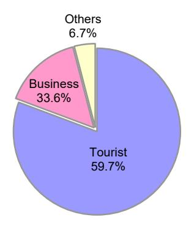

Figure 14.9 Shared by purpose of visit of visitor arrivals at Siem Reap international airport, 2019

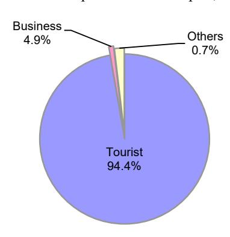

14.10 ចំនួនអ្នកទេសចរមកដល់ រយៈពេលស្នាក់នៅជាមធ្យម ការចំណាយលើទេសចរណ៍ និងអត្រាស្នាក់នៅបន្ទប់សណ្ឋាគារ Number of visitor arrivals, average length of stay, tourism expenditure and hotel occupancy rate

| -    | Visitor a | rrivals                    | Average length              | Tourism receipts | Hotel occupancy          |
|------|-----------|----------------------------|-----------------------------|------------------|--------------------------|
| Year | Number    | Annual change (Percent) | of stay (number of days) | (in million USD) | Hotel occupancy rate (%) |
| 1993 | 118,183   | -                          | -                           | -                | -                        |
| 1994 | 176,617   | 49.4                       | -                           | -                | -                        |
| 1995 | 219,680   | 24.4                       | 8.0                         | 100              | 37.0                     |
| 1996 | 260,489   | 18.6                       | 7.5                         | 118              | 40.0                     |
| 1997 | 218,843   | -16.0                      | 6.4                         | 103              | 30.0                     |
| 1998 | 289,524   | 32.3                       | 5.2                         | 166              | 40.0                     |
| 1999 | 367,743   | 27.0                       | 5.5                         | 190              | 44.0                     |
| 2000 | 466,365   | 26.8                       | 5.5                         | 228              | 45.0                     |
| 2001 | 604,919   | 29.7                       | 5.5                         | 304              | 48.0                     |
| 2002 | 786,524   | 30.0                       | 5.8                         | 379              | 50.0                     |
| 2003 | 701,014   | -10.9                      | 5.5                         | 347              | 50.0                     |
| 2004 | 1,055,202 | 50.5                       | 6.3                         | 578              | 52.0                     |
| 2005 | 1,421,615 | 34.7                       | 6.3                         | 832              | 52.0                     |
| 2006 | 1,700,041 | 19.6                       | 6.5                         | 1,049            | 54.8                     |
| 2007 | 2,015,128 | 18.5                       | 6.5                         | 1,403            | 54.8                     |
| 2008 | 2,125,465 | 5.5                        | 6.7                         | 1,595            | 62.7                     |
| 2009 | 2,161,577 | 7.3                        | 6.5                         | 1,561            | 63.6                     |
| 2010 | 2,508,289 | 16.0                       | 6.45                        | 1,786            | 65.7                     |
| 2011 | 2,881,862 | 14.9                       | 6.50                        | 1,912            | 66.15                    |
| 2012 | 3,584,307 | 24.4                       | 6.30                        | 2,210            | 68.49                    |
| 2013 | 4,210,165 | 17.5                       | 6.75                        | 2,547            | 69.53                    |
| 2014 | 4,502,775 | 7.0                        | 6.50                        | 2,736            | 67.55                    |
| 2015 | 4,775,231 | 6.1                        | 6.80                        | 3,012            | 70.2                     |
| 2016 | 5,011,712 | 5.0                        | 6.30                        | 3,212            | 68.9                     |
| 2017 | 5,602,157 | 11.8                       | 6.60                        | 3,638            | 71.3                     |
| 2018 | 6,201,077 | 10.7                       | 7.00                        | 4,375            | 72.2                     |
| 2019 | 6,610,592 | 6.6                        | 6.2                         | 4,919            | 63.5                     |

14.11 ការចំណាយជាមធ្យមរបស់អ្នកទេសចរ តាមប្រភេទចំណាយ Average expenditure of tourist by type of expenditure

| T                   | 20      | )12     | 20      | 013        | 2          | 014           | 2      | 015     | 20    | 018     | 20    | 19      |
|---------------------|---------|---------|---------|------------|------------|---------------|--------|---------|-------|---------|-------|---------|
| Type of expenditure | USD     | percent | USD     | percent    | USD        | percent       | USD    | percent | USD   | percent | USD   | percent |
|                     |         |         | Av      | verage exp | enditure o | of individual | tour   |         |       |         |       |         |
| Total               | 483.16  | 100.0   | 485.4   | 100.0      | 481.93     | 100.0         | 485.1  | 100.0   | 486   | 100.0   | 497.7 | 100     |
| Accommodation       | 147.62  | 30.55   | 148.57  | 30.61      | 127.50     | 26.46         | 129.00 | 26.59   | 126   | 25.90   | 128.9 | 25.9    |
| Food and beverage   | 81.05   | 16.77   | 84.42   | 17.39      | 119.43     | 24.78         | 123.00 | 25.36   | 126   | 25.90   | 128.9 | 25.9    |
| Souvenirs           | 93.54   | 19.36   | 94.35   | 19.44      | 90.00      | 18.67         | 88.60  | 18.26   | 84    | 17.26   | 85.93 | 17.3    |
| Local transport     | 82.64   | 17.10   | 79.03   | 16.28      | 65.00      | 13.49         | 64.50  | 13.30   | 75    | 15.41   | 77.24 | 15.5    |
| Other               | 78.31   | 16.21   | 79.03   | 16.28      | 80.00      | 16.60         | 79.50  | 16.39   | 75    | 15.41   | 76.73 | 15.4    |
|                     |         |         | A       | verage ex  | penditur   | e of group    | tour   |         |       |         |       |         |
| Total               | 1236.38 | 100.0   | 1264.64 | 100.0      | 565.00     | 100.0         | 574.00 | 100.0   | 588.5 | 100.0   | 598   | 100.0   |
| Package tour        | 955.71  | 77.30   | 983.46  | 77.77      | 345.00     | 61.06         | 355.00 | 61.85   | 375   | 63.72   | 384.5 | 64.3    |
| Shopping            | 179.68  | 14.53   | 180.11  | 14.24      | 120.00     | 21.24         | 118.00 | 20.56   | 115   | 19.54   | 115   | 16.2    |
| Other               | 100.99  | 8.17    | 101.07  | 7.99       | 100.00     | 17.70         | 101.00 | 17.60   | 98.5  | 16.74   | 98.5  | 16.5    |

Figure 14.11 Average expenditure of individual tour by type of expenditure, 2019

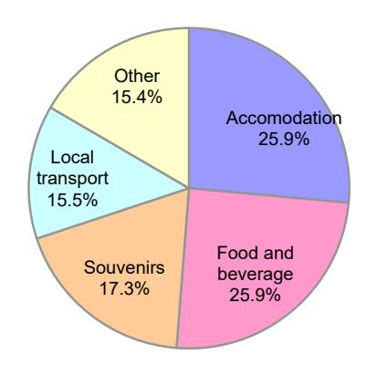

Figure 14.11 Average expenditure of group tour by type of expenditure, 2019

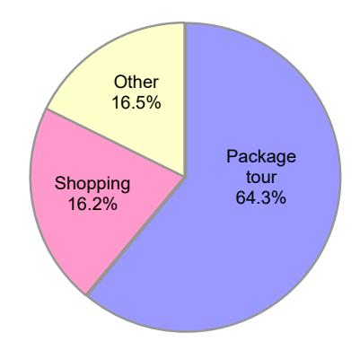

14.12 ស្ថិតិនៃការស្នាក់នៅ Accommodation statistics

|              |                   | Hot          | el                                |              | Guest l      | nouse                                   |
|--------------|-------------------|--------------|-----------------------------------|--------------|--------------|-----------------------------------------|
| Year         | Number            | Rooms        | Average number of rooms per hotel | Number       | Rooms        | Average number of rooms per guest house |
| -            |                   |              | Number                            |              |              | rooms per guest nouse                   |
| 2000         | 240               | 9,673        | 40                                | 292          | 3,233        | 11                                      |
| 2001         | 247               | 10,881       | 44                                | 370          | 3,899        | 11                                      |
| 2002         | 267               | 11,426       | 43                                | 489          | 5,748        | 12                                      |
| 2003         | 292               | 13,201       | 45                                | 549          | 6,497        | 12                                      |
| 2004         | 299               | 14,271       | 48                                | 615          | 7,684        | 12                                      |
| 2005         | 317               | 15,471       | 49                                | 684          | 9,000        | 13                                      |
| 2006         | 351               | 17,914       | 51                                | 742          | 9,166        | 12                                      |
| 2007         | 395               | 20,470       | 52                                | 891          | 11,563       | 13                                      |
| 2008         | 398               | 20,678       | 52                                | 925          | 12,180       | 13                                      |
| 2009         | 451               | 23,010       | 51                                | 1,018        | 14,512       | 14                                      |
| 2010         | 440               | 24,393       | 55                                | 1,087        | 15,321       | 14                                      |
| 2011         | 476               | 26,484       | 56                                | 1,142        | 16,752       | 15                                      |
| 2012         | 490               | 27,117       | 55                                | 1,296        | 19,329       | 15                                      |
| 2013         | 545               | 29,937       | 55                                | 1,462        | 21,286       | 15                                      |
| 2014         | 554               | 29,729       | 54                                | 1,563        | 22,256       | 14                                      |
| 2015         | 668               | 34,619       | 52                                | 2,229        | 28,660       | 13                                      |
| 2016         | 760               | 40,160       | 53                                | 2,170        | 32,463       | 15                                      |
| 2017         | 731               | 39,328       | 54                                | 2,405        | 35,228       | 15                                      |
| 2018         | 846               | 46,696       | 55                                | 2,313        | 33,819       | 15                                      |
| 2019         | 1,050             | 49,185       | 47                                | 2,705        | 35,343       | 13                                      |
|              |                   |              | Growth rate                       |              |              |                                         |
| 2000         | 8.6               | 6.1          | -2.3                              | 57.0         | 70.4         | 8.6                                     |
| 2001         | 2.9               | 12.5         | 9.3                               | 26.7         | 20.6         | -4.8                                    |
| 2002         | 8.1               | 5.0          | -2.9                              | 32.2         | 47.4         | 11.5                                    |
| 2003         | 9.4               | 15.5         | 5.6                               | 12.3         | 13.0         | 0.7                                     |
| 2004         | 2.4               | 8.1          | 5.6                               | 12.0         | 18.3         | 5.6                                     |
| 2005         | 6.0               | 8.4          | 2.3                               | 11.2         | 17.1         | 5.3                                     |
| 2006         | 10.7              | 15.8         | 4.6                               | 8.5          | 1.8          | -6.1                                    |
| 2007         | 12.5              | 14.3         | 1.5                               | 20.1         | 26.2         | 5.1                                     |
| 2008         | 0.8               | 1.0          | 0.3                               | 3.8          | 5.3          | 1.5                                     |
| 2009         | 13.3              | 11.3         | -1.8                              | 10.1         | 19.1         | 8.3                                     |
| 2010         | -2.4              | 6.0          | 8.7                               | 6.8          | 5.6          | -1.1                                    |
| 2011         | 8.2               | 8.6          | 0.4                               | 5.1          | 9.3          | 4.1                                     |
| 2012         | 2.9               | 2.4          | -0.5                              | 13.5         | 15.4         | 1.7                                     |
| 2013         | 11.2              | 10.4         | -0.7 -2.3                      | 12.8         | 10.1         | -2.4 -2.2                            |
| 2014 2015 | 1.7 20.6       | -0.7 16.4 | -2.3 -3.4                      | 6.9 42.6  | 4.6          | -2.2 -9.7                            |
| 2015         | 13.8              | 16.4         |                                   | -2.6         | 28.8 13.3 | -9./                                    |
| 2016         | -3.8              | -2.1         | -                                 | -2.6 10.8 | 8.5          | -                                       |
| 2017         | -3.8 15.7      | -2.1 18.7 | -                                 | -3.8         | 8.5 -0.4  | -                                       |
| 2018         | 24.1              | 5.3          | -                                 | -3.8 16.9 | -0.4 4.5  | -                                       |
| 2019         | ∠ <del>4</del> .1 | 5.5          |                                   | 10.9         | 4.3          | <del>-</del>                            |

14.13

| Region and accommodation | Unit   | 2008   | 2009   | 2010   | 2011   | 2012   | 2013   | 2014   | 2015   | 2018   | 2019   |
|--------------------------|--------|--------|--------|--------|--------|--------|--------|--------|--------|--------|--------|
| Total                    |        |        |        |        |        |        |        |        |        |        |        |
| Hotels                   | Number | 398    | 451    | 440    | 476    | 490    | 545    | 554    | 668    | 688    | 786    |
|                          | Rooms  | 20,678 | 23,010 | 24,393 | 26,484 | 27,117 | 29,937 | 29,729 | 34,619 | 39,303 | 39,977 |
| Guest houses             | Number | 925    | 1,018  | 1,087  | 1,142  | 1,296  | 1,462  | 1,563  | 2,229  | 1,593  | 1,787  |
|                          | Rooms  | 12,180 | 14,512 | 15,321 | 16,752 | 19,329 | 21,286 | 22,256 | 28,660 | 24,113 | 23,216 |
| Phnom Penh               |        |        |        |        |        |        |        |        |        |        |        |
| Hotels                   | Number | 133    | 159    | 159    | 161    | 196    | 164    | 170    | 223    | 313    | 343    |
|                          | Rooms  | 6,782  | 6,920  | 6,920  | 7,619  | 9,218  | 7,722  | 7,807  | 10,000 | 19,337 | 14,223 |
| Guest houses             | Number | 280    | 353    | 365    | 417    | 467    | 422    | 477    | 668    | 523    | 712    |
|                          | Rooms  | 3,605  | 5,351  | 5,351  | 6,393  | 7,364  | 6,393  | 6,612  | 7,568  | 10,132 | 10,460 |
| Siem Reap                |        |        |        |        |        |        |        |        |        |        |        |
| Hotels                   | Number | 112    | 118    | 124    | 138    | 155    | 163    | 175    | 188    | 260    | 234    |
|                          | Rooms  | 8,263  | 8,935  | 9,438  | 10,407 | 10,969 | 11,281 | 11,620 | 12,093 | 14,456 | 14,974 |
| Guest houses             | Number | 216    | 225    | 232    | 230    | 219    | 229    | 254    | 294    | 351    | 310    |
|                          | Rooms  | 2,796  | 2,929  | 3,064  | 3,207  | 3,251  | 3,497  | 3,927  | 4,445  | 4,910  | 4,679  |
| Preah Sihanouk           |        |        |        |        |        |        |        |        |        |        |        |
| Hotels                   | Number | 46     | 44     | 45     | 49     | 49     | 52     | 54     | 69     | 67     | 133    |
|                          | Rooms  | 1,782  | 1,762  | 1,952  | 2,284  | 2,330  | 2,493  | 2,697  | 3,216  | 3,610  | 7,752  |
| Guest houses             | Number | 110    | 112    | 115    | 123    | 142    | 150    | 187    | 269    | 251    | 216    |
|                          | Rooms  | 1,548  | 1,618  | 1,671  | 1,841  | 2,034  | 2,210  | 2,734  | 3,641  | 3,792  | 2,613  |
| Other provinces          |        |        |        |        |        |        |        |        |        |        |        |
| Hotels                   | Number | 107    | 130    | 77     | 88     | 34     | 45     | 43     | 188    | 48     | 76     |
|                          | Rooms  | 3,851  | 5,393  | 4,370  | 4,227  | 1,361  | 2,495  | 1,782  | 9,310  | 1,900  | 3,028  |
| Guest houses             | Number | 319    | 328    | 235    | 230    | 166    | 204    | 222    | 998    | 468    | 549    |
|                          | Rooms  | 4,231  | 4,614  | 3,218  | 3,214  | 2,212  | 2,417  | 2,697  | 13,006 | 5,279  | 5,464  |

## 15

# ន្ទម្ងំខ្មែរ

### Investment

15.1 ចំនួនគម្រោងដែលបានអនុម័ត
All investment project approvals

|       |                          | All invest                   | ment companies             |                             |                    | Activ                        | e companies                      |                          |
|-------|--------------------------|------------------------------|----------------------------|-----------------------------|--------------------|------------------------------|----------------------------------|--------------------------|
| Year  | Number of projects | Project cost 1 '000' US\$ | Working capital '000' US\$ | Fixed asset 2 '000' US\$ | Number of projects | Project cost 1 '000' US\$ | Working capital '000' US\$ | Fixed asset 2 '000' US\$ |
| 2001  | 52                       | 340,420                      | 100,757                    | 239,663                     | 32                 | 160,335                      | 14,786                           | 145,549                  |
| 2002  | 48                       | 416,377                      | 161,060                    | 255,317                     | 37                 | 116,742                      | 13,513                           | 103,228                  |
| 2003  | 73                       | 469,546                      | 128,894                    | 340,652                     | 60                 | 249,771                      | 22,382                           | 227,388                  |
| 2004  | 84                       | 449,388                      | 86,032                     | 363,355                     | 75                 | 341,566                      | 31,871                           | 309,694                  |
| 2005  | 150                      | 1,396,440                    | 212,329                    | 1,184,112                   | 140                | 974,589                      | 6,800                            | 967,789                  |
| 2006  | 130                      | 2,631,456                    | 748                        | 2,630,708                   | 129                | 2,630,560                    | 300                              | 2,630,260                |
| 2007  | 108                      | 2,625,311                    | -                          | 2,625,311                   | 108                | 2,625,311                    | -                                | 2,625,311                |
| 2008  | 93                       | 10,564,851                   | -                          | 10,564,851                  | 93                 | 10,564,851                   | -                                | 10,564,851               |
| 2009  | 102                      | 2,499,333                    | -                          | 2,499,333                   | 102                | 2,499,333                    | -                                | 2,499,333                |
| 2010  | 103                      | 2,627,583                    | -                          | 2,627,583                   | 103                | 2,627,583                    | -                                | 2,627,583                |
| 2015  | 124                      | 4,617,131,486                | 698,070,328                | 3,919,061,158               | 124                | 4,617,131,486                | 698,070,328                      | 3,919,061,158            |
| 2016  | 120                      | 3,244,331,716                | 124,223                    | 3,244,207,493               | 120                | 3,244,331,716                | 124,223                          | 3,244,207,493            |
| 2017  | 117                      | 5,217,037,403                | 137,045                    | 5,216,900,358               | 117                | 5,217,037,403                | 137,045                          | 5,216,900,358            |
| 2018  | 149                      | 5,806,984,572                | 178,711                    | 5,806,805,861               | 149                | 5,806,984,572                | 178,711                          | 5,806,805,861            |
| Total | 1,453                    | 18,909,505,882               | 699,200,127                | 18,210,305,755              | 1,389              | 18,908,275,818               | 698,599,959                      | 18,209,675,856           |
|       |                          |                              |                            | Annual ab                   | solute change      | 9                            |                                  |                          |
| 2001  | -42                      | 29,284                       | 33,050                     | -3,766                      | -28                | -21,303                      | -8,736                           | -12,567                  |
| 2002  | -4                       | 75,957                       | 60,303                     | 15,654                      | 5                  | -43,593                      | -1,273                           | -42,320                  |
| 2003  | 25                       | 53,169                       | -32,166                    | 85,335                      | 23                 | 133,029                      | 8,869                            | 124,160                  |
| 2004  | 11                       | -20,158                      | -42,862                    | 22,704                      | 15                 | 91,795                       | 9,489                            | 82,306                   |
| 2005  | 66                       | 947,053                      | 126,296                    | 820,757                     | 65                 | 633,023                      | -25,071                          | 658,094                  |
| 2006  | -20                      | 1,235,016                    | -211,581                   | 1,446,597                   | -11                | 1,655,972                    | -6,500                           | 1,662,472                |
| 2007  | -22                      | -6,146                       | -748                       | -5,397                      | -21                | -5,249                       | -300                             | -4,949                   |
| 2008  | -15                      | 7,939,540                    | 0                          | 7,939,540                   | -15                | 7,939,540                    | 0                                | 7,939,540                |
| 2009  | 9                        | -8,065,518                   | 0                          | -8,065,518                  | 9                  | -8,065,518                   | 0                                | -8,065,518               |
| 2014  | 1                        | 128,250                      | 0                          | 128,250                     | 1                  | 128,250                      | 0                                | 128,250                  |
| 2015  | 21                       | 4,614,503,903                | 698,070,328                | 3,916,433,575               | 21                 | 4,614,503,903                | 698,070,328                      | 3,916,433,575            |
| 2016  | -4                       | -1,372,799,770               | -697946105                 | -674853665                  |                    | -1372799770                  | -697946105                       | -674853665               |
| 2017  | -3                       | 1,972,705,687                | 12,822                     | 1,972,692,865               |                    | 1,972,705,687                | 12,822                           | 1,972,692,865            |
| 2018  | 32                       | 589,947,169                  | 41,666                     | 589,905,503                 | 32                 | 589,947,169                  | 41,666                           | 589,905,503              |

15.1 ចំនួនគម្រោងដែលបានអនុម័ត (បន្ត)
All investment project approvals (continued)

|       |                    | Formerly a                   | ctive companies            |                             |                    | No                           | on-active                        |                          |
|-------|--------------------|------------------------------|----------------------------|-----------------------------|--------------------|------------------------------|----------------------------------|--------------------------|
| Year  | Number of projects | Project cost 1 '000' US\$ | Working capital '000' US\$ | Fixed asset 2 '000' US\$ | Number of projects | Project cost 1 '000' US\$ | Working capital '000' US\$ | Fixed asset 2 '000' US\$ |
| 2001  | 9                  | 10,763                       | 1,310                      | 9,453                       | 11                 | 102,726                      | 18,065                           | 84,661                   |
| 2002  | 3                  | 7,162                        | 1,310                      | 5,852                       | 8                  | 153,337                      | 7,100                            | 146,237                  |
| 2003  | 6                  | 8,851                        | 1,050                      | 7,801                       | 7                  | 148,217                      | 42,755                           | 105,462                  |
| 2004  | 3                  | 1,500                        | 1,000                      | 500                         |                    | 55,761                       | 2,600                            | 53,161                   |
| 2005  | 3                  | 10,794                       | 0                          | 10,794                      | 7                  | 206,029                      | 500                              | 205,529                  |
| 2006  | 0                  | 0                            | 0                          | 0                           | 1                  | 448                          | 0                                | 448                      |
| 2007  | 0                  | 0                            | 0                          | 0                           | 0                  | 0                            | 0                                | 0                        |
| 2008  | 0                  | 0                            | 0                          | 0                           | 0                  | 0                            | 0                                | 0                        |
| 2009  | 0                  | 0                            | 0                          | 0                           | 0                  | 0                            | 0                                | 0                        |
| 2014  | 0                  | 0                            | 0                          | 0                           | 0                  | 0                            | 0                                | 0                        |
| 2015  | 0                  | 0                            | 0                          | 0                           | 0                  | 0                            | 0                                | 0                        |
| 2016  | 0                  | 0                            | 0                          | 0                           | 0                  | 0                            | 0                                | 0                        |
| 2017  | 0                  | 0                            | 0                          | 0                           | 0                  | 0                            | 0                                | 0                        |
| 2018  | 0                  | 0                            | 0                          | 0                           | 0                  | 0                            | 0                                | 0                        |
| Total | 24                 | 39,070                       | 4,670                      | 34,400                      | 40                 | 666,518                      | 71,020                           | 595,498                  |
|       |                    |                              |                            | Annual ab                   | solute change      | ;                            |                                  |                          |
| 2001  | -9                 | -41,866                      | -4,440                     | -37,426                     | -5                 | 55,775                       | 9,549                            | 46,226                   |
| 2002  | -6                 | -3,601                       | 0                          | -3,601                      | -3                 | 50,611                       | -10,965                          | 61,576                   |
| 2003  | 3                  | 1,689                        | -260                       | 1,949                       | -1                 | -5,119                       | 35,655                           | -40,775                  |
| 2004  | -3                 | -7,351                       | -50                        | -7,301                      | -1                 | -92,456                      | -40,155                          | -52,301                  |
| 2005  | 0                  | 9,294                        | -1,000                     | 10,294                      | 1                  | 150,268                      | -2,100                           | 152,368                  |
| 2006  | -3                 | -10,794                      | 0                          | -10,794                     | -6                 | -205,581                     | -500                             | -205,081                 |
| 2007  | 0                  | 0                            | 0                          | 0                           | -1                 | -448                         | 0                                | -448                     |
| 2008  | 0                  | 0                            | 0                          | 0                           | 0                  | 0                            | 0                                | 0                        |
| 2009  | 0                  | 0                            | 0                          | 0                           | 1                  | 0                            | 0                                | 0                        |
| 2014  | 0                  | 0                            | 0                          | 0                           | 0                  | 0                            | 0                                | 0                        |
| 2015  | 0                  | 0                            | 0                          | 0                           | 0                  | 0                            | 0                                | 0                        |
| 2016  | 0                  | 0                            | 0                          | 0                           | 0                  | 0                            | 0                                | 0                        |
| 2017  | 0                  | 0                            | 0                          | 0                           | 0                  | 0                            | 0                                | 0                        |
| 2018  | 0                  | 0                            | 0                          | 0                           | 0                  | 0                            | 0                                | 0                        |

Source: Department of Monitoring, Council for the Development of Cambodia (CDC)

1/ Project cost = Fixed assets + working capital

2/ Fixed assets = Land (purchased) + factory building + office machinery and equipment + other fixed assets

15.2 ក្រុមហ៊ុន/គម្រោងដែលមានសកម្មភាព All active companies/projects

|      |                    | Active                       | company                |                     |                    | Accumulation               | of active company       | ,                    |
|------|--------------------|------------------------------|------------------------|---------------------|--------------------|----------------------------|-------------------------|----------------------|
| Year | Number of projects | Project cost 1 '000' US\$ | Fixed asset 2 '000' | Equity 3 '000' US\$ | Number of projects | Project cost '000' US\$ | Fixed assets '000' US\$ | Equity '000' US\$ |
| 1999 | 45                 | 300,170                      | 256,377                | 28911               | 249                | 1,774,474                  | 1,453,697               | 319,056              |
| 2000 | 60                 | 181,637                      | 158,115                | 11800               | 309                | 1,956,111                  | 1,611,812               | 330,856              |
| 2001 | 32                 | 160,335                      | 145,549                | 24913               | 341                | 2,116,446                  | 1,757,361               | 355,769              |
| 2002 | 37                 | 116,742                      | 103,228                | 6630                | 378                | 2,233,187                  | 1,860,589               | 362,399              |
| 2003 | 60                 | 249,771                      | 227,388                | 24272               | 438                | 2,482,958                  | 2,087,978               | 386,671              |
| 2004 | 75                 | 341,566                      | 309,694                | 18475               | 513                | 2,824,524                  | 2,397,672               | 405,146              |
| 2005 | 140                | 974,589                      | 967,789                | 2150                | 653                | 3,799,112                  | 3,365,461               | 407,296              |
| 2006 | 129                | 2,630,560                    | 2,630,260              | 300                 | 782                | 6,429,673                  | 5,995,721               | 407,596              |
| 2007 | 108                | 2,625,311                    | 2,625,311              | -                   | 890                | 9,054,984                  | 8,621,032               | -                    |
| 2008 | 93                 | 10,564,851                   | 10,564,851             | -                   | 983                | 19,619,835                 | 19,185,883              | -                    |
| 2009 | 102                | 2,499,333                    | 2,499,333              | -                   | 1,085              | 22,119,168                 | 21,685,216              | -                    |
| 2014 | 103                | 2,627,583                    | 2,627,583              | -                   | 1,188              | 24,746,751                 | 24,312,799              | -                    |
| 2015 | 36                 | 4,617,131,486                | 698,070,328            | 3,919,061,158       | 36                 | 4,617,131,486              | 698,070,328             | 3,919,061,158        |
| 2016 | 120                | 3,244,331,716                | 124,223                | 3,244,207,493       | 120                | 3,244,331,716              | 124,223                 | 3,244,207,493        |
| 2017 | 117                | 5,217,037,403                | 137,045                | 5,216,900,358       | 117                | 5,217,037,403              | 137,045                 | 5,216,900,358        |
| 2018 | 149                | 5,806,984,572                | 178,711                | 5,806,805,861       | 149                | 5,806,984,572              | 178,711                 | 5,806,805,861        |
|      |                    |                              |                        | Annual abs          | olute change       |                            |                         |                      |
| 1999 | -14                | -6,600                       | 2,606                  | -12,992             |                    | 300,170                    | 256,377                 | 28,911               |
| 2000 | 15                 | -118,532                     | -98,261                | -17,111             | 60                 | 181,637                    | 158,115                 | 11,800               |
| 2001 | -28                | -21,303                      | -12,567                | 13,113              | 32                 | 160,335                    | 145,549                 | 24,913               |
| 2002 | 5                  | -43,593                      | -42,320                | -18,283             | 37                 | 116,742                    | 103,228                 | 6,630                |
| 2003 | 23                 | 133,029                      | 124,160                | 17,642              | 60                 | 249,771                    | 227,388                 | 24,272               |
| 2004 | 15                 | 91,795                       | 82,306                 | -5,797              | 75                 | 341,566                    | 309,694                 | 18,475               |
| 2005 | 65                 | 633,023                      | 658,094                | -16,325             | 140                | 974,589                    | 967,789                 | 2,150                |
| 2006 | -11                | 1,655,972                    | 1,662,472              | -1,850              | 129                | 2,630,560                  | 2,630,260               | 300                  |
| 2007 | -21                | -5,249                       | -4,949                 | -300                | 108                | 2,625,311                  | 2,625,311               | -                    |
| 2008 | -15                | 7,939,540                    | 7,939,540              | -                   | 93                 | 10,564,851                 | 10,564,851              | -                    |
| 2009 | 9                  | -8,065,518                   | -8,065,518             | -                   | 102                | 2,499,333                  | 2,499,333               | -                    |
| 2014 | 1                  | 128,250                      | 128,250                | -                   | 103                | 2,627,583                  | 2,627,583               | -                    |
| 2015 | 67                 | -4,614,503,903               | -695,442,745           | -                   | 1,152              | -4,592,384,735             | -673,757,529            | -                    |
| 2016 | -4                 | -1372799770                  | -697946105             | -674853665          | -4                 | -1372799770                | -697946105              | -674853665           |
| 2017 | -3                 | 1,972,705,687                | 12,822                 | 1,972,692,865       | -3                 | 1,972,705,687              | 12,822                  | 1,972,692,865        |
| 2018 | 32                 | 589,947,169                  | 41,666                 | 589,905,503         | 32                 | 589,947,169                | 41,666                  | 589,905,503          |

 $Source: Department \ of \ Monitoring, \ Council \ for \ the \ Development \ of \ Cambodia \ (CDC)$ 

3/ Equity = Paid-up capital (It is no longer available from 2007 to 2011).

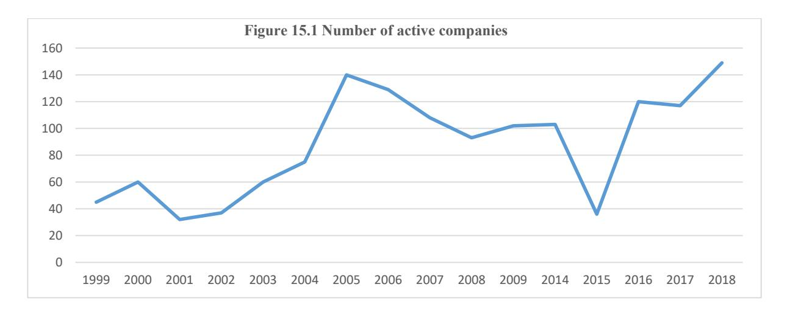

1/ Project cost = Fixed assets + working capital (Working Capital is no longer available from 2007 to 2011).

2/ Fixed assets = Land (purchased) + factory building + office machinery and equipment + other fixed assets.

15.3 ការវិភាគទុនវិនិយោគ តាមវិស័យនៃក្រុមហ៊ុនសកម្ម Analysis of capital by sector of active companies

| Sector                  | Number of projects | Total project costs '000' US\$ | Working capital '000' US\$ | Fixed assets '000' US\$ |
|-------------------------|--------------------|--------------------------------|----------------------------|-------------------------|
|                         |                    |                                |                            |                         |
| Agriculture             |                    |                                |                            |                         |
| 2004                    | 1                  | 3,792                          | 850                        | 2,942                   |
| 2005                    | 5                  | 31,079                         | 2,908                      | 28,171                  |
| 2006                    | 21                 | 514,183                        | 24                         | 514,159                 |
| 2007                    | 10                 | 210,036                        | 50,100                     | 159,936                 |
| 2008                    | 0                  | 0                              | 0                          | 0                       |
| 2009                    | 21                 | 629,118                        | 0                          | 629,118                 |
| 2014                    | 24                 | 490,644                        | 0                          | 490,644                 |
| 2015                    | 14                 | 461,088,428                    | 135,500                    | 460,952,928             |
| 2016                    | 11                 | 126,000,000                    | 11,920                     | 386,117,253             |
| 2017                    | 7                  | 640,000,000                    | 10,510                     | 274,512,821             |
| 2018                    | 13                 | 72,330,000                     | 13,494                     | 444,176,275             |
| Industry                |                    |                                |                            |                         |
| 2004                    | 56                 | 163,502                        | 19,200                     | 144,302                 |
| 2005                    | 100                | 653,387                        | 6,300                      | 647,087                 |
| 2006                    | 62                 | 1,105,894                      | 151,400                    | 954,494                 |
| 2007                    | 96                 | 987,078                        | 269,900                    | 717,178                 |
| 2008                    | 0                  | 0                              | 0                          | 0                       |
| 2009                    | 52                 | 260,141                        | 0                          | 260,141                 |
| 2014                    | 72                 | 472,690                        | 0                          | 472,690                 |
| 2015                    | 97                 | 894,981,770                    | 264,569,328                | 630,412,442             |
| 2016                    | 91                 | 262,060,500                    | 94,188                     | 1,015,771,049           |
| 2017                    | 97                 | 199,200,000                    | 110,773                    | 726,314,893             |
| 2018                    | 115                | 267,893,400                    | 116,436                    | 983,958,476             |
| Infrastructure/services |                    |                                |                            |                         |
| 2004                    | 9                  | 97,346                         | 8,671                      | 88,675                  |
| 2005                    | 8                  | 119,497                        | 0                          | 119,497                 |
| 2006                    | 9                  | 2,554,287                      | 16,300                     | 2,537,987               |
| 2007                    | 13                 | 821,528                        | 127,220                    | 694,307                 |
| 2008                    | 0                  | 0                              | 0                          | 0                       |
| 2009                    | 21                 | 1,298,797                      | 0                          | 1,298,797               |
| 2014                    | 4                  | 1,532,418                      | 0                          | 1,532,418               |
| 2015                    | 10                 | 3,024,066,788                  | 295,001,000                | 2,729,065,788           |
| 2016                    | 5                  | 124,000,000                    | 2,488                      | 444,088,950             |
| 2017                    | 4                  | 225,000,000                    | 3,429                      | 1,049,511,222           |
| 2018                    | 10                 | 206,000,000                    | 35,516                     | 2,869,857,265           |
| Tourism                 |                    |                                |                            |                         |
| 2004                    | 7                  | 56,732                         | 3,500                      | 53,232                  |
| 2005                    | 21                 | 168,474                        | 0                          | 168,474                 |
| 2006                    | 8                  | 426,139                        | 18,000                     | 408,139                 |
| 2007                    | 11                 | 1,134,653                      | 33,500                     | 1,101,153               |
| 2008                    | 0                  | 0                              | 0                          | 0                       |
| 2009                    | 8                  | 311,277                        | 0                          | 311,277                 |
| 2014                    | 3                  | 131,831                        | 0                          | 131,831                 |
| 2015                    | 3                  | 101,630,000                    | 3,000,000                  | 98,630,000              |
| 2016                    | 13                 | 63,505,000                     | 15,627                     | 1,398,230,241           |
| 2017                    | 9                  | 142,000,000                    | 12,333                     | 3,166,561,422           |
| 2018                    | 11                 | 67,800,000                     | 35,516                     | 1,508,813,845           |

Note: Project cost = Fixed assets + working capital (Working capital is no longer available)

# 15.4 កម្រោងវិនិយោគដែលបានអនុម័ត (ទុនបានចុះបញ្ជី) តាមប្រទេស All investment projects approved (registered capital) by broad country

|      |            |           | European   |                   | Emerging   | Markets of E    | East Asia 2 |                    |             | Other       |             |
|------|------------|-----------|------------|-------------------|------------|-----------------|-------------|--------------------|-------------|-------------|-------------|
| Year | Japan      | USA       | Union 1    | Republic of Korea | Hong Kong  | Taiwan (ROC) | China       | Total 2 | ASEAN 3     | countries   | Total       |
|      |            |           |            |                   |            | in '000' US\$   | S           |                    |             |             |             |
| 2004 | 2,522      | 5,741     | 20,284     | 9,518             | 22,096     | 16,256          | 98,170      | 146,040            | 50,553      | 4,038       | 229,178     |
| 2005 | 0          | 2,200     | 1,400      | 15,700            | 350        | 4,190           | 237,780     | 258,020            | 30,790      | 7,600       | 300,010     |
| 2006 | 1,000      | 4,260     | 16,000     | 4,490             | 1,510      | 16,440          | 28,290      | 50,730             | 19,370      | 1,500       | 92,860      |
| 2007 | 7,540      | 6,500     | 29,970     | 21,990            | 600        | 13,990          | 40,440      | 77,020             | 88,104      | 0           | 209,134     |
| 2008 | 4,600      | 12,350    | 13,340     | 18,460            | 0          | 9,500           | 37,960      | 65,920             | 51,163      | 111,527     | 258,900     |
| 2009 | 1,070      | 1,062     | 6,441      | 9,210             | 2,000      | 6,000           | 42,330      | 59,540             | 48,680      | 32,220      | 149,013     |
| 2014 | 0          | 3,340     | 11,218     | 16,910            | 11,500     | 24,900          | 26,750      | 80,060             | 40,530      | 4,300       | 139,448     |
| 2015 | 30,740     | 501       | 78,000     | 2,750             | 29,840     | 17,550          | 57,850      | 107,990            | 123,460     | 139,930     | 480,621     |
| 2016 | 118,472,00 | 6,250,000 | 13,205,00  | 4,000,000         | 61,796,000 | 27,640,000      | 73,780,000  | 173,466,000        | 140,792,100 | 118,000,000 | 258,792,100 |
| 2017 | 1,000,000  | 0         | 38,000,000 | 11,650,000        | 21,690,000 | 9,000,000       | 333,140,000 | 413,480,000        | 49,498,000  | 2,000,000   | 51,498,000  |
| 2018 | 15,228,234 | 1,980,000 | 10,000,000 | 9,500,000         | 11,640,000 | 9,990,000       | 164,758,000 | 207,868,000        | 87,310,000  | 6,400,000   | 93,710,000  |

Source: Council for the Development of Cambodia (CDC

Notes:

### 15.5 គម្រោងវិនិយោគដែលបានអនុម័ត (ចលនៈទ្រព្យ) តាមប្រទេស All investment projects approved (fixed assets) by broad country

|      |             |                | European     |                   | Emerging      | Markets of      | East Asia 2 |                    |             | Other         |               |  |
|------|-------------|----------------|--------------|-------------------|---------------|-----------------|------------------------|--------------------|-------------|---------------|---------------|--|
| Year | Japan       | USA            | Union 1      | Republic of Korea | Hong Kong     | Taiwan (ROC) | China                  | Total 2 | ASEAN 3     | countries     | Total         |  |
|      |             |                |              |                   |               | in '000' US\$   |                        |                    |             |               |               |  |
| 2004 | 2,157       | 3,987          | 18,504       | 7,538             | 21,840        | 12,453          | 88,685                 | 130,515            | 44,863      | 3,163         | 203,189       |  |
| 2005 | 0           | 4,368          | 14,040       | 55,966            | 1,400         | 10,353          | 451,957                | 519,676            | 132,591     | 11,742        | 682,418       |  |
| 2006 | 2,098       | 62,215         | 314,559      | 1,009,825         | 4,060         | 47,652          | 717,114                | 1,778,650          | 171,098     | 5,260         | 2,333,880     |  |
| 2007 | 113,078     | 2,887          | 211,219      | 148,077           | 25,746        | 39,944          | 180,320                | 394,088            | 506,919     | 0             | 1,228,191     |  |
| 2008 | 7,829       | 671,724        | 74,344       | 1,237,977         | 0             | 21,449          | 4,371,325              | 5,630,751          | 149,884     | 4,354,438     | 10,888,970    |  |
| 2009 | 4,763       | 1,209          | 66,984       | 120,638           | 6,828         | 27,160          | 892,675                | 1,047,301          | 670,570     | 4,068,599     | 5,859,426     |  |
| 2014 | 0           | 35,969         | 41,635       | 1,026,586         | 29,610        | 91,839          | 694,158                | 1,842,193          | 321,375     | 58,432        | 2,299,604     |  |
| 2015 | 38,871,008  | 3,157,640      | 115,055,789  | 8,482,401         | 109,118,754   | 46,490,565      | 240,573,228            | 404,664,947        | 205,294,841 | 446,420,293   | 1,213,464,518 |  |
| 2016 | 773,748,238 | 11,430,89 0 | 39,773,70.00 | 20,159,901        | 319,955,631   | 40,165,844      | 731,373,845            | 1,896,834,349      | 330,945,152 | 1,909,731,881 | 2,240,677,033 |  |
| 2017 | 3,740,939   | 0              | 51,377,413   | 149,502,133       | 85,421,627    | 23,351,674      | 1,437,223,504          | 1,750,617,289      | 333,423,316 | 1,707,735,090 | 2,041,158,406 |  |
| 2018 | 880,964,786 | 6,822,401      | 19,785,702   | 14,554,645        | 81,491,786,88 | 33,391,821      | 2,700,184,593          | 3,655,703,949      | 78,642,263  | 3,732,548,986 | 3,811,191,249 |  |

Source: Council for the Development of Cambodia (CDC)

\* By immediate source/country of resident.

1/ European Union (Austria, Belgium, Denmark, Finland, France, Germany, Greece, Ireland, Italy, Luxembourg, Netherlands, Portugal, Russia, Spain, Sweden and United Kingdom)

2/ Emerging Markets of East Asia (Republic of Korea, Taiwan, Hong Kong-SAR and People's Republic of China)

3/ ASEAN excluding Cambodia

\* By immediate source/country of resident.

1/ European Union (Austria, Belgium, Denmark, Finland, France, Germany, Greece, Ireland, Italy, Luxembourg, Netherlands, Portugal, Russia, Spain, Sweden and United Kingdom)

2/ Emerging Markets of East Asia (Republic of Korea, Taiwan, Hong Kong-SAR and People's Republic of China)

3/ ASEAN excluding Cambodia

15.6 គម្រោងវិនិយោគទុកដែលបានអនុម័ត (ទុនដែលបានចុះបញ្ជី) តាមវិស័យ Investment projects approved (registered capital) by sector

| Year | Agriculture | Industry    | Infrastructure services | Tourism     | Total                                   |
|------|-------------|-------------|-------------------------|-------------|-----------------------------------------|
|      |             | in          | 000' US\$               |             |                                         |
| 2000 | 4,000       | 167,199     | 84,723                  | 85,378      | 341,300                                 |
| 2001 | 6,158       | 81,459      | 110,106                 | 88,555      | 286,278                                 |
| 2002 | 19,154      | 61,623      | 148,177                 | 50,600      | 279,554                                 |
| 2003 | 0           | 156,250     | 29,240                  | 181,590     | 367,080                                 |
| 2004 | 13,349      | 171,640     | 77,894                  | 120,253     | 383,136                                 |
| 2005 | 4,000       | 325,600     | 32,000                  | 18,000      | 379,600                                 |
| 2006 | 25,000      | 150,400     | 17,300                  | 18,000      | 210,700                                 |
| 2007 | 42,100      | 268,900     | 128,220                 | 35,500      | 474,720                                 |
| 2008 | 26,000      | 89,000      | 42,500                  | 101,400     | 258,900                                 |
| 2009 | 35,500      | 92,513      | 5,000                   | 16,000      | 149,013                                 |
| 2014 | 68,000      | 98,800      | 3,000                   | 3,000       | 172,800                                 |
| 2015 | 135,500,000 | 264,569,328 | 295,001,000             | 3,000,000   | 698,070,328                             |
| 2016 | 126,000,000 | 262,060,500 | 124,000,000             | 63,505,000  | 575,565,500                             |
| 2017 | 640,000,000 | 199,200,000 | 225,000,000             | 142,000,000 | 1,064,200,000                           |
| 2018 | 72,330,000  | 267,893,400 | 206,000,000             | 67,800,000  | 614,023,400                             |
|      | . )         |             | ent by sector of total  |             | . , , , , , , , , , , , , , , , , , , , |
| 2000 | 1.2         | 49.0        | 24.8                    | 25.0        | 100.0                                   |
| 2001 | 2.2         | 28.5        | 38.5                    | 30.9        | 100.0                                   |
| 2002 | 6.9         | 22.0        | 53.0                    | 18.1        | 100.0                                   |
| 2003 | 0.0         | 42.6        | 8.0                     | 49.5        | 100.0                                   |
| 2004 | 3.5         | 44.8        | 20.3                    | 31.4        | 100.0                                   |
| 2005 | 1.1         | 85.8        | 8.4                     | 4.7         | 100.0                                   |
| 2006 | 11.9        | 71.4        | 8.2                     | 8.5         | 100.0                                   |
| 2007 | 8.9         | 56.6        | 27.0                    | 7.5         | 100.0                                   |
| 2008 | 10.0        | 34.4        | 16.4                    | 39.2        | 100.0                                   |
| 2009 | 23.8        | 62.1        | 3.4                     | 10.7        | 100.0                                   |
| 2014 | 39.4        | 57.2        | 1.7                     | 1.7         | 100.0                                   |
| 2015 | 19.4        | 37.9        | 42.3                    | 0.4         | 100.0                                   |
| 2016 | 21.9        | 45.5        | 21.5                    | 11.0        | 100.0                                   |
| 2017 | 53.1        | 16.5        | 18.7                    | 11.8        | 100.0                                   |
| 2018 | 11.8        | 43.6        | 33.5                    | 11.0        | 100.0                                   |
|      |             | Annua       | l growth rate           |             |                                         |
| 2000 | -88.8       | -41.5       | -61.7                   | 43.7        | -43.3                                   |
| 2001 | 53.9        | -51.3       | 30.0                    | 3.7         | -16.1                                   |
| 2002 | 211.0       | -24.4       | 34.6                    | -42.9       | -2.3                                    |
| 2003 | -100.0      | 153.6       | -80.3                   | 258.9       | 31.3                                    |
| 2004 | -           | 9.8         | 166.4                   | -33.8       | 4.4                                     |
| 2005 | -70.0       | 89.7        | -58.9                   | -85.0       | -0.9                                    |
| 2006 | 525.0       | -53.8       | -45.9                   | 0.0         | -44.5                                   |
| 2007 | 68.4        | 78.8        | 641.2                   | 97.2        | 125.3                                   |
| 2008 | -38.2       | -66.9       | -66.9                   | 185.6       | -45.5                                   |
| 2009 | 36.5        | 3.9         | -88.2                   | -84.2       | -42.4                                   |
| 2014 | 91.5        | 6.8         | -40.0                   | -81.3       | 16.0                                    |
| 2015 | 199164.7    | 267682.7    | 9833266.7               | 99900.0     | 403875.9                                |
| 2016 | -7.0        | -0.9        | -58.0                   | 2016.8      | -17.5                                   |
| 2017 | 407.9       | -24.0       | 81.5                    | 123.6       | 84.9                                    |
| 2018 | -88.7       | 34.5        | -8.4                    | -52.3       | -42.3                                   |

15.7 គម្រោងវិនិយោគទុកដែលបានអនុម័ត (អចលន:ទ្រព្យ) តាមវិស័យ Investment projects approved (fixed assets) by sector

| Vear                                                                                                                                                                                                                                                                                                                                                                                                                                                                                                                                                                                                                                                                                                                                                                                                                                                                                                                                                                                                                                                                                                                                                                                                                                                                                                                                                                                                                                                                                                                                                                                                                                                                                                                                                                                                                                                                                                                                                                                                                                                                                                                         |      | it projecte approve | a (interaction) |          |         |               |
|------------------------------------------------------------------------------------------------------------------------------------------------------------------------------------------------------------------------------------------------------------------------------------------------------------------------------------------------------------------------------------------------------------------------------------------------------------------------------------------------------------------------------------------------------------------------------------------------------------------------------------------------------------------------------------------------------------------------------------------------------------------------------------------------------------------------------------------------------------------------------------------------------------------------------------------------------------------------------------------------------------------------------------------------------------------------------------------------------------------------------------------------------------------------------------------------------------------------------------------------------------------------------------------------------------------------------------------------------------------------------------------------------------------------------------------------------------------------------------------------------------------------------------------------------------------------------------------------------------------------------------------------------------------------------------------------------------------------------------------------------------------------------------------------------------------------------------------------------------------------------------------------------------------------------------------------------------------------------------------------------------------------------------------------------------------------------------------------------------------------------|------|---------------------|-----------------|----------|---------|---------------|
| In 1000 USS   1000 USS   2,580   118,568   69,345   79,478   269,971   2001   5,558   62,066   93,606   80,855   242,086   2002   15,654   48,330   141,227   49,100   254,311   2003   0   114,700   27,790   158,751   301,241   2004   12,349   146,247   72,677   113,753   345,056   2005   26,810   878,523   42,365   102,575   1,050,273   2006   539,102   950,333   2,542,148   408,139   4,439,722   2007   141,052   567,662   697,033   1,250,181   2,655,868   2008   106,731   713,736   1,292,163   8,776,339   10,888,969   2009   589,920   958,086   410,247   3,901,174   5,859,427   2014   554,359   945,486   1,059,089   131,831   2,690,765   2015   460,952,928   630,412,442   2,729,065,788   98,630,000   3,919,061,158   2016   386,117,253   1,015,771,049   444,088,950   1,398,230,241   3,242,074,93   2017   274,512,821   726,314,893   1,049,511,222   3,166,561,422   5,216,900,358   2018   444,76,275   983,958,476   2,869,857,265   1,508,813,845   5,806,805,861   2000   0.8   34,7   20.3   23.3   23.3   100.0   2001   1.9   21.7   32.7   28.2   100.0   2004   3.2   38.2   19.0   29.7   100.0   2005   7.1   231,4   11.2   27.0   100.0   2006   255.9   451.0   1206.5   193.7   100.0   2006   255.9   451.0   1206.5   193.7   100.0   2007   29.7   119,6   146.8   263,4   100.0   2007   29.7   119,6   146.8   263,4   100.0   2007   29.7   119,6   146.8   263,4   100.0   2008   41.2   275.7   499,1   3389,9   100.0   2015   11.8   16.1   69,6   2.5   100.0   2015   11.8   16.1   69,6   2.5   100.0   2015   11.8   16.1   69,6   2.5   100.0   2015   11.8   16.1   69,6   2.5   100.0   2016   11.9   31.3   13.7   43.1   100.0   2017   5.3   13.9   20.1   60.7   100.0   2017   5.3   13.9   20.1   60.7   100.0   2016   11.9   31.3   13.7   43.1   100.0   2016   11.9   31.3   13.7   43.1   100.0   2016   11.9   31.3   13.7   43.1   100.0   2016   11.9   31.3   13.7   43.1   100.0   2016   11.9   31.3   13.7   43.1   100.0   2016   11.9   31.3   13.7   43.1   100.0   2016   11.9   31.3   13.7   43.1   100.0   2016   11.5   43. | Year | Agriculture         | Industry        |          | Tourism | Total         |
| 2000                                                                                                                                                                                                                                                                                                                                                                                                                                                                                                                                                                                                                                                                                                                                                                                                                                                                                                                                                                                                                                                                                                                                                                                                                                                                                                                                                                                                                                                                                                                                                                                                                                                                                                                                                                                                                                                                                                                                                                                                                                                                                                                         |      | -                   | _               |          |         |               |
| 2001   5.558                                                                                                                                                                                                                                                                                                                                                                                                                                                                                                                                                                                                                                                                                                                                                                                                                                                                                                                                                                                                                                                                                                                                                                                                                                                                                                                                                                                                                                                                                                                                                                                                                                                                                                                                                                                                                                                                                                                                                                                                                                                                                                                 | 2000 | 2.500               |                 | · ·      | 70.479  | 260.071       |
| 2002                                                                                                                                                                                                                                                                                                                                                                                                                                                                                                                                                                                                                                                                                                                                                                                                                                                                                                                                                                                                                                                                                                                                                                                                                                                                                                                                                                                                                                                                                                                                                                                                                                                                                                                                                                                                                                                                                                                                                                                                                                                                                                                         |      |                     |                 |          |         |               |
| 2003         0         114,700         27,790         158,751         301,241           2004         12,349         146,247         72,677         113,753         345,026           2005         26,810         878,523         42,365         102,575         1,050,273           2006         539,102         950,333         2,542,148         408,139         4,439,722           2007         141,052         56,602         697,033         1,250,181         2,655,868           2008         106,731         713,736         1,292,163         8,776,339         10,888,969           2009         589,920         958,086         410,247         3,901,174         5,859,427           2014         554,359         945,486         1,059,089         131,831         2,690,765           2015         460,952,928         630,412,442         2,729,065,788         98,630,000         3,919,061,158           2016         386,117,253         1,015,771,049         444,088,950         1,398,230,241         3,244,207,493           2017         274,512,821         726,314,893         1,049,811,222         3,166,561,422         5,216,900,358           2018         444,176,275         983,958,476         2,869,87,265 <td< td=""><td></td><td></td><td></td><td></td><td></td><td></td></td<>                                                                                                                                                                                                                                                                                                                                                                                                                                                                                                                                                                                                                                                                                                                                                                                                       |      |                     |                 |          |         |               |
| 2004                                                                                                                                                                                                                                                                                                                                                                                                                                                                                                                                                                                                                                                                                                                                                                                                                                                                                                                                                                                                                                                                                                                                                                                                                                                                                                                                                                                                                                                                                                                                                                                                                                                                                                                                                                                                                                                                                                                                                                                                                                                                                                                         |      |                     |                 |          |         |               |
| 2005         26,810         878,523         42,365         102,575         1,050,273           2006         539,102         950,333         2,542,148         408,139         4,439,722           2007         141,052         567,602         697,033         1,259,181         2,655,868           2008         106,731         713,736         1,292,163         8,776,339         10,888,969           2009         589,920         958,086         410,247         3,901,174         5,859,427           2014         554,359         945,486         1,059,089         131,831         2,690,765           2015         460,952,928         630,412,442         2,729,065,788         98,630,000         3,919,061,158           2016         386,117,253         1,015,771,049         444,088,950         1,398,230,241         3,244,207,493           2017         274,512,821         726,314,893         1,049,511,222         3,166,561,422         5,216,900,358           2018         444,176,275         983,958,476         2,869,857,265         1,508,813,845         5,806,805,861           2000         0.8         34,7         20.3         23.3         100.0           2001         1.9         21,7         32.7         2                                                                                                                                                                                                                                                                                                                                                                                                                                                                                                                                                                                                                                                                                                                                                                                                                                                                       |      |                     |                 |          |         |               |
| 2006   539,102   950,333   2,542,148   408,139   4,439,722                                                                                                                                                                                                                                                                                                                                                                                                                                                                                                                                                                                                                                                                                                                                                                                                                                                                                                                                                                                                                                                                                                                                                                                                                                                                                                                                                                                                                                                                                                                                                                                                                                                                                                                                                                                                                                                                                                                                                                                                                                                                   |      |                     |                 |          |         |               |
| 2007                                                                                                                                                                                                                                                                                                                                                                                                                                                                                                                                                                                                                                                                                                                                                                                                                                                                                                                                                                                                                                                                                                                                                                                                                                                                                                                                                                                                                                                                                                                                                                                                                                                                                                                                                                                                                                                                                                                                                                                                                                                                                                                         |      |                     |                 |          |         |               |
| 2008         106,731         713,736         1,292,163         8,776,339         10,888,969           2009         589,920         958,086         410,247         3,901,174         5,859,427           2014         554,359         945,486         1,059,089         131,831         2,690,765           2015         460,952,928         630,412,442         2,729,065,788         98,630,000         3,919,061,158           2016         386,117,253         1,015,771,1049         444,088,950         1,398,230,241         3,244,207,493           2017         274,512,821         726,314,893         1,049,511,222         3,166,61,422         5,216,900,358           2018         444,176,275         983,958,476         2,869,857,265         1,508,813,845         5,806,805,861           2000         0.8         34.7         20.3         23.3         100.0           2001         1.9         21.7         32.7         28.2         100.0           2002         5.6         17.3         50.5         17.6         403.2         100.0           2003         0.0         31.2         7.6         43.2         100.0           2004         3.2         38.2         19.0         29.7         100.0                                                                                                                                                                                                                                                                                                                                                                                                                                                                                                                                                                                                                                                                                                                                                                                                                                                                                              |      |                     |                 |          |         |               |
| 2009   589,920   958,086   410,247   3,901,174   5,859,427                                                                                                                                                                                                                                                                                                                                                                                                                                                                                                                                                                                                                                                                                                                                                                                                                                                                                                                                                                                                                                                                                                                                                                                                                                                                                                                                                                                                                                                                                                                                                                                                                                                                                                                                                                                                                                                                                                                                                                                                                                                                   |      |                     |                 |          |         |               |
| 2014                                                                                                                                                                                                                                                                                                                                                                                                                                                                                                                                                                                                                                                                                                                                                                                                                                                                                                                                                                                                                                                                                                                                                                                                                                                                                                                                                                                                                                                                                                                                                                                                                                                                                                                                                                                                                                                                                                                                                                                                                                                                                                                         |      |                     |                 |          |         |               |
| 2015                                                                                                                                                                                                                                                                                                                                                                                                                                                                                                                                                                                                                                                                                                                                                                                                                                                                                                                                                                                                                                                                                                                                                                                                                                                                                                                                                                                                                                                                                                                                                                                                                                                                                                                                                                                                                                                                                                                                                                                                                                                                                                                         |      |                     |                 |          |         |               |
| 2016   386,117,253   1,015,771,049   444,088,950   1,398,230,241   3,244,207,493   2017   274,512,821   726,314,893   1,049,511,222   3,166,561,422   5,216,900,358   2018   444,176,275   983,958,476   2,869,857,265   1,508,813,845   5,806,805,861   2000   0.8   34.7   20.3   23.3   100.0   2001   1.9   21.7   32.7   28.2   100.0   2002   5.6   17.3   50.5   17.6   100.0   2003   0.0   31.2   7.6   43.2   100.0   2004   3.2   38.2   19.0   29.7   100.0   2005   7.1   231.4   11.2   27.0   100.0   2006   255.9   451.0   1206.5   193.7   100.0   2007   29.7   119.6   146.8   263.4   100.0   2009   395.9   643.0   275.3   2618.0   100.0   2014   20.6   35.1   39.4   4.9   100.0   2014   20.6   35.1   39.4   4.9   100.0   2015   11.8   16.1   69.6   2.5   100.0   2017   5.3   13.9   20.1   60.7   100.0   2018   7.6   16.9   49.4   26.0   100.0   2018   7.6   16.9   49.4   26.0   100.0   2018   7.6   16.9   49.4   26.0   100.0   2008   11.5   4.77   35.0   1.7   -10.3   2002   181.7   -22.1   50.9   -39.3   5.0   2003   -100.0   137.3   -80.3   223.3   18.5   2004   - 27.5   161.5   -28.3   14.5   2005   117.1   500.7   -41.7   -9.8   204.4   2066   1910.8   8.2   5900.6   297.9   322.7   2007   -73.8   -40.3   -72.6   206.3   -40.2   2008   -24.3   25.7   85.4   602.0   310.0   2009   452.7   34.2   -68.3   -55.5   46.2   2014   -6.0   -1.3   158.2   -96.6   5-54.1   2014   -6.0   -1.3   158.2   -96.6   -55.1   -54.1   2014   -6.0   -1.3   158.2   -96.6   -55.1   -54.1   2014   -6.0   -1.3   158.2   -96.6   -55.1   -54.1   2014   -6.0   -1.3   158.2   -96.6   -55.5   -66.6   -54.1   2014   -6.0   -1.3   158.2   -96.6   -55.5   -66.6   -54.1   2014   -6.0   -1.3   158.2   -96.6   -55.5   -66.6   -54.1   2014   -6.0   -1.3   158.2   -96.6   -55.5   -66.6   -54.1   2014   -6.0   -1.3   158.2   -96.6   -55.5   -66.6   -54.1   2014   -6.0   -1.3   158.2   -96.6   -55.5   -56.6   -54.1   2014   -6.0   -1.3   158.2   -96.6   -55.5   -56.6   -54.1   -56.6   -56.6   -56.6   -56.6   -56.6   -56.6   -56.6   -56.6   -56.6   - |      |                     |                 |          |         |               |
| 2017                                                                                                                                                                                                                                                                                                                                                                                                                                                                                                                                                                                                                                                                                                                                                                                                                                                                                                                                                                                                                                                                                                                                                                                                                                                                                                                                                                                                                                                                                                                                                                                                                                                                                                                                                                                                                                                                                                                                                                                                                                                                                                                         |      |                     |                 |          |         |               |
| 2018                                                                                                                                                                                                                                                                                                                                                                                                                                                                                                                                                                                                                                                                                                                                                                                                                                                                                                                                                                                                                                                                                                                                                                                                                                                                                                                                                                                                                                                                                                                                                                                                                                                                                                                                                                                                                                                                                                                                                                                                                                                                                                                         |      |                     |                 |          |         |               |
| Share in percent by sector of total                                                                                                                                                                                                                                                                                                                                                                                                                                                                                                                                                                                                                                                                                                                                                                                                                                                                                                                                                                                                                                                                                                                                                                                                                                                                                                                                                                                                                                                                                                                                                                                                                                                                                                                                                                                                                                                                                                                                                                                                                                                                                          |      |                     |                 |          |         |               |
| 2000         0.8         34.7         20.3         23.3         100.0           2001         1.9         21.7         32.7         28.2         100.0           2002         5.6         17.3         50.5         17.6         100.0           2003         0.0         31.2         7.6         43.2         100.0           2004         3.2         38.2         19.0         29.7         100.0           2005         7.1         231.4         11.2         27.0         100.0           2006         255.9         451.0         1206.5         193.7         100.0           2007         29.7         119.6         146.8         263.4         100.0           2008         41.2         275.7         499.1         3389.9         100.0           2009         395.9         643.0         275.3         2618.0         100.0           2014         20.6         35.1         39.4         4.9         100.0           2015         11.8         16.1         69.6         2.5         100.0           2016         11.9         31.3         13.7         43.1         100.0           2017         5.3                                                                                                                                                                                                                                                                                                                                                                                                                                                                                                                                                                                                                                                                                                                                                                                                                                                                                                                                                                                                       | 2018 | 444,176,275         |                 |          |         | 5,806,805,861 |
| 2001         1.9         21.7         32.7         28.2         100.0           2002         5.6         17.3         50.5         17.6         100.0           2003         0.0         31.2         7.6         43.2         100.0           2004         3.2         38.2         19.0         29.7         100.0           2005         7.1         231.4         11.2         27.0         100.0           2006         255.9         451.0         1206.5         193.7         100.0           2007         29.7         119.6         146.8         263.4         100.0           2008         41.2         275.7         499.1         3389.9         100.0           2009         395.9         643.0         275.3         2618.0         100.0           2014         20.6         35.1         39.4         4.9         100.0           2014         20.6         35.1         39.4         4.9         100.0           2015         11.8         16.1         69.6         2.5         100.0           2016         11.9         31.3         13.7         43.1         100.0           2017         5.3                                                                                                                                                                                                                                                                                                                                                                                                                                                                                                                                                                                                                                                                                                                                                                                                                                                                                                                                                                                                       |      |                     |                 |          |         |               |
| 2002         5.6         17.3         50.5         17.6         100.0           2003         0.0         31.2         7.6         43.2         100.0           2004         3.2         38.2         19.0         29.7         100.0           2005         7.1         231.4         11.2         27.0         100.0           2006         255.9         451.0         1206.5         193.7         100.0           2007         29.7         119.6         146.8         263.4         100.0           2008         41.2         275.7         499.1         3389.9         100.0           2009         395.9         643.0         275.3         2618.0         100.0           2014         20.6         35.1         39.4         4.9         100.0           2015         11.8         16.1         69.6         2.5         100.0           2016         11.9         31.3         13.7         43.1         100.0           2017         5.3         13.9         20.1         60.7         100.0           2018         7.6         16.9         49.4         26.0         100.0           2018         7.6                                                                                                                                                                                                                                                                                                                                                                                                                                                                                                                                                                                                                                                                                                                                                                                                                                                                                                                                                                                                       |      |                     |                 |          |         |               |
| 2003         0.0         31.2         7.6         43.2         100.0           2004         3.2         38.2         19.0         29.7         100.0           2005         7.1         231.4         11.2         27.0         100.0           2006         255.9         451.0         1206.5         193.7         100.0           2007         29.7         119.6         146.8         263.4         100.0           2008         41.2         275.7         499.1         3389.9         100.0           2009         395.9         643.0         275.3         2618.0         100.0           2014         20.6         35.1         39.4         4.9         100.0           2015         11.8         16.1         69.6         2.5         100.0           2016         11.9         31.3         13.7         43.1         100.0           2017         5.3         13.9         20.1         60.7         100.0           2018         7.6         16.9         49.4         26.0         100.0           2018         7.6         16.9         49.4         26.0         100.0           2001         15.4                                                                                                                                                                                                                                                                                                                                                                                                                                                                                                                                                                                                                                                                                                                                                                                                                                                                                                                                                                                                      |      |                     |                 |          |         |               |
| 2004         3.2         38.2         19.0         29.7         100.0           2005         7.1         231.4         11.2         27.0         100.0           2006         255.9         451.0         1206.5         193.7         100.0           2007         29.7         119.6         146.8         263.4         100.0           2008         41.2         275.7         499.1         3389.9         100.0           2009         395.9         643.0         275.3         2618.0         100.0           2014         20.6         35.1         39.4         4.9         100.0           2015         11.8         16.1         69.6         2.5         100.0           2016         11.9         31.3         13.7         43.1         100.0           2017         5.3         13.9         20.1         60.7         100.0           2018         7.6         16.9         49.4         26.0         100.0           2018         7.6         16.9         49.4         26.0         100.0           2001         115.4         -47.7         35.0         1.7         -10.3           2002         181.7                                                                                                                                                                                                                                                                                                                                                                                                                                                                                                                                                                                                                                                                                                                                                                                                                                                                                                                                                                                                  |      |                     |                 |          |         |               |
| 2005         7.1         231.4         11.2         27.0         100.0           2006         255.9         451.0         1206.5         193.7         100.0           2007         29.7         119.6         146.8         263.4         100.0           2008         41.2         275.7         499.1         3389.9         100.0           2009         395.9         643.0         275.3         2618.0         100.0           2014         20.6         35.1         39.4         4.9         100.0           2015         11.8         16.1         69.6         2.5         100.0           2016         11.9         31.3         13.7         43.1         100.0           2017         5.3         13.9         20.1         60.7         100.0           2018         7.6         16.9         49.4         26.0         100.0           2018         7.6         16.9         49.4         26.0         100.0           2000         -91.7         -43.2         -65.6         104.2         -43.8           2001         115.4         -47.7         35.0         1.7         -10.3           2002         181.7 <td></td> <td></td> <td></td> <td></td> <td></td> <td></td>                                                                                                                                                                                                                                                                                                                                                                                                                                                                                                                                                                                                                                                                                                                                                                                                                                                                                                                                 |      |                     |                 |          |         |               |
| 2006         255.9         451.0         1206.5         193.7         100.0           2007         29.7         119.6         146.8         263.4         100.0           2008         41.2         275.7         499.1         3389.9         100.0           2009         395.9         643.0         275.3         2618.0         100.0           2014         20.6         35.1         39.4         4.9         100.0           2015         11.8         16.1         69.6         2.5         100.0           2016         11.9         31.3         13.7         43.1         100.0           2017         5.3         13.9         20.1         60.7         100.0           2018         7.6         16.9         49.4         26.0         100.0           2018         7.6         16.9         49.4         26.0         100.0           2018         7.6         16.9         49.4         26.0         100.0           2018         7.6         16.9         49.4         26.0         100.0           2018         7.6         16.9         49.4         26.0         100.0           2001         115.4                                                                                                                                                                                                                                                                                                                                                                                                                                                                                                                                                                                                                                                                                                                                                                                                                                                                                                                                                                                                     |      |                     |                 |          |         |               |
| 2007         29.7         119.6         146.8         263.4         100.0           2008         41.2         275.7         499.1         3389.9         100.0           2009         395.9         643.0         275.3         2618.0         100.0           2014         20.6         35.1         39.4         4.9         100.0           2015         11.8         16.1         69.6         2.5         100.0           2016         11.9         31.3         13.7         43.1         100.0           2017         5.3         13.9         20.1         60.7         100.0           2018         7.6         16.9         49.4         26.0         100.0           2018         7.6         16.9         49.4         26.0         100.0           2018         7.6         16.9         49.4         26.0         100.0           2018         7.6         16.9         49.4         26.0         100.0           2018         7.6         16.9         49.4         26.0         100.0           2000         -91.7         -43.2         -65.6         104.2         -43.8           2001         151.7                                                                                                                                                                                                                                                                                                                                                                                                                                                                                                                                                                                                                                                                                                                                                                                                                                                                                                                                                                                                      |      |                     |                 |          |         |               |
| 2008         41.2         275.7         499.1         3389.9         100.0           2009         395.9         643.0         275.3         2618.0         100.0           2014         20.6         35.1         39.4         4.9         100.0           2015         11.8         16.1         69.6         2.5         100.0           2016         11.9         31.3         13.7         43.1         100.0           2017         5.3         13.9         20.1         60.7         100.0           2018         7.6         16.9         49.4         26.0         100.0           2018         7.6         16.9         49.4         26.0         100.0           2018         7.6         16.9         49.4         26.0         100.0           2018         7.6         16.9         49.4         26.0         100.0           2018         7.6         16.9         49.4         26.0         100.0           2001         115.4         -47.7         35.0         1.7         -10.3           2002         181.7         -22.1         50.9         -39.3         5.0           2003         -10.0 <td< td=""><td></td><td></td><td></td><td></td><td></td><td></td></td<>                                                                                                                                                                                                                                                                                                                                                                                                                                                                                                                                                                                                                                                                                                                                                                                                                                                                                                                                   |      |                     |                 |          |         |               |
| 2009         395.9         643.0         275.3         2618.0         100.0           2014         20.6         35.1         39.4         4.9         100.0           2015         11.8         16.1         69.6         2.5         100.0           2016         11.9         31.3         13.7         43.1         100.0           2017         5.3         13.9         20.1         60.7         100.0           2018         7.6         16.9         49.4         26.0         100.0           Annual growth rate           2000         -91.7         -43.2         -65.6         104.2         -43.8           2001         115.4         -47.7         35.0         1.7         -10.3           2002         181.7         -22.1         50.9         -39.3         5.0           2003         -100.0         137.3         -80.3         223.3         18.5           2004         -         27.5         161.5         -28.3         14.5           2005         117.1         500.7         -41.7         -9.8         20.4           2006         1910.8         8.2         5900.6         297.9         322.7 </td <td></td> <td></td> <td></td> <td></td> <td></td> <td></td>                                                                                                                                                                                                                                                                                                                                                                                                                                                                                                                                                                                                                                                                                                                                                                                                                                                                                                                              |      |                     |                 |          |         |               |
| 2014       20.6       35.1       39.4       4.9       100.0         2015       11.8       16.1       69.6       2.5       100.0         2016       11.9       31.3       13.7       43.1       100.0         2017       5.3       13.9       20.1       60.7       100.0         2018       7.6       16.9       49.4       26.0       100.0         Annual growth rate         2000       -91.7       -43.2       -65.6       104.2       -43.8         2001       115.4       -47.7       35.0       1.7       -10.3         2002       181.7       -22.1       50.9       -39.3       5.0         2003       -100.0       137.3       -80.3       223.3       18.5         2004       -       27.5       161.5       -28.3       14.5         2005       117.1       500.7       -41.7       -9.8       204.4         2006       1910.8       8.2       5900.6       297.9       322.7         2007       -73.8       -40.3       -72.6       206.3       -40.2         2008       -24.3       25.7       85.4       602.0       310.0                                                                                                                                                                                                                                                                                                                                                                                                                                                                                                                                                                                                                                                                                                                                                                                                                                                                                                                                                                                                                                                                                    |      |                     |                 |          |         |               |
| 2015         11.8         16.1         69.6         2.5         100.0           2016         11.9         31.3         13.7         43.1         100.0           2017         5.3         13.9         20.1         60.7         100.0           2018         7.6         16.9         49.4         26.0         100.0           Annual growth rate           2000         -91.7         -43.2         -65.6         104.2         -43.8           2001         115.4         -47.7         35.0         1.7         -10.3           2002         181.7         -22.1         50.9         -39.3         5.0           2003         -100.0         137.3         -80.3         223.3         18.5           2004         -         27.5         161.5         -28.3         14.5           2005         117.1         500.7         -41.7         -9.8         204.4           2006         1910.8         8.2         5900.6         297.9         322.7           2007         -73.8         -40.3         -72.6         206.3         -40.2           2008         -24.3         25.7         85.4         602.0         310.                                                                                                                                                                                                                                                                                                                                                                                                                                                                                                                                                                                                                                                                                                                                                                                                                                                                                                                                                                                             |      |                     |                 |          |         |               |
| 2016       11.9       31.3       13.7       43.1       100.0         2017       5.3       13.9       20.1       60.7       100.0         Annual growth rate         Annual growth rate         2000       -91.7       -43.2       -65.6       104.2       -43.8         2001       115.4       -47.7       35.0       1.7       -10.3         2002       181.7       -22.1       50.9       -39.3       5.0         2003       -100.0       137.3       -80.3       223.3       18.5         2004       -       27.5       161.5       -28.3       14.5         2005       117.1       500.7       -41.7       -9.8       204.4         2006       1910.8       8.2       5900.6       297.9       322.7         2007       -73.8       -40.3       -72.6       206.3       -40.2         2008       -24.3       25.7       85.4       602.0       310.0         2009       452.7       34.2       -68.3       -55.5       -46.2         2014       -6.0       -1.3       158.2       -96.6       -54.1                                                                                                                                                                                                                                                                                                                                                                                                                                                                                                                                                                                                                                                                                                                                                                                                                                                                                                                                                                                                                                                                                                                      |      |                     |                 |          | 4.9     |               |
| 2017         5.3         13.9         20.1         60.7         100.0           Annual growth rate           Annual growth rate           2000         -91.7         -43.2         -65.6         104.2         -43.8           2001         115.4         -47.7         35.0         1.7         -10.3           2002         181.7         -22.1         50.9         -39.3         5.0           2003         -100.0         137.3         -80.3         223.3         18.5           2004         -         27.5         161.5         -28.3         14.5           2005         117.1         500.7         -41.7         -9.8         204.4           2006         1910.8         8.2         5900.6         297.9         322.7           2007         -73.8         -40.3         -72.6         206.3         -40.2           2008         -24.3         25.7         85.4         602.0         310.0           2009         452.7         34.2         -68.3         -55.5         -46.2           2014         -6.0         -1.3         158.2         -96.6         -54.1                                                                                                                                                                                                                                                                                                                                                                                                                                                                                                                                                                                                                                                                                                                                                                                                                                                                                                                                                                                                                                         |      | 11.8                |                 | 69.6     |         |               |
| 2018         7.6         16.9         49.4         26.0         100.0           Annual growth rate           2000         -91.7         -43.2         -65.6         104.2         -43.8           2001         115.4         -47.7         35.0         1.7         -10.3           2002         181.7         -22.1         50.9         -39.3         5.0           2003         -100.0         137.3         -80.3         223.3         18.5           2004         -         27.5         161.5         -28.3         14.5           2005         117.1         500.7         -41.7         -9.8         204.4           2006         1910.8         8.2         5900.6         297.9         322.7           2007         -73.8         -40.3         -72.6         206.3         -40.2           2008         -24.3         25.7         85.4         602.0         310.0           2009         452.7         34.2         -68.3         -55.5         -46.2           2014         -6.0         -1.3         158.2         -96.6         -54.1                                                                                                                                                                                                                                                                                                                                                                                                                                                                                                                                                                                                                                                                                                                                                                                                                                                                                                                                                                                                                                                                      |      | 11.9                | 31.3            |          | 43.1    | 100.0         |
| Annual growth rate           2000         -91.7         -43.2         -65.6         104.2         -43.8           2001         115.4         -47.7         35.0         1.7         -10.3           2002         181.7         -22.1         50.9         -39.3         5.0           2003         -100.0         137.3         -80.3         223.3         18.5           2004         -         27.5         161.5         -28.3         14.5           2005         117.1         500.7         -41.7         -9.8         204.4           2006         1910.8         8.2         5900.6         297.9         322.7           2007         -73.8         -40.3         -72.6         206.3         -40.2           2008         -24.3         25.7         85.4         602.0         310.0           2009         452.7         34.2         -68.3         -55.5         -46.2           2014         -6.0         -1.3         158.2         -96.6         -54.1                                                                                                                                                                                                                                                                                                                                                                                                                                                                                                                                                                                                                                                                                                                                                                                                                                                                                                                                                                                                                                                                                                                                                      | 2017 |                     |                 | 20.1     |         |               |
| 2000         -91.7         -43.2         -65.6         104.2         -43.8           2001         115.4         -47.7         35.0         1.7         -10.3           2002         181.7         -22.1         50.9         -39.3         5.0           2003         -100.0         137.3         -80.3         223.3         18.5           2004         -         27.5         161.5         -28.3         14.5           2005         117.1         500.7         -41.7         -9.8         204.4           2006         1910.8         8.2         5900.6         297.9         322.7           2007         -73.8         -40.3         -72.6         206.3         -40.2           2008         -24.3         25.7         85.4         602.0         310.0           2009         452.7         34.2         -68.3         -55.5         -46.2           2014         -6.0         -1.3         158.2         -96.6         -54.1                                                                                                                                                                                                                                                                                                                                                                                                                                                                                                                                                                                                                                                                                                                                                                                                                                                                                                                                                                                                                                                                                                                                                                                   | 2018 | 7.6                 | 16.9            | 49.4     | 26.0    | 100.0         |
| 2001       115.4       -47.7       35.0       1.7       -10.3         2002       181.7       -22.1       50.9       -39.3       5.0         2003       -100.0       137.3       -80.3       223.3       18.5         2004       -       27.5       161.5       -28.3       14.5         2005       117.1       500.7       -41.7       -9.8       204.4         2006       1910.8       8.2       5900.6       297.9       322.7         2007       -73.8       -40.3       -72.6       206.3       -40.2         2008       -24.3       25.7       85.4       602.0       310.0         2009       452.7       34.2       -68.3       -55.5       -46.2         2014       -6.0       -1.3       158.2       -96.6       -54.1                                                                                                                                                                                                                                                                                                                                                                                                                                                                                                                                                                                                                                                                                                                                                                                                                                                                                                                                                                                                                                                                                                                                                                                                                                                                                                                                                                                              |      |                     | Annua           |          |         |               |
| 2002     181.7     -22.1     50.9     -39.3     5.0       2003     -100.0     137.3     -80.3     223.3     18.5       2004     -     27.5     161.5     -28.3     14.5       2005     117.1     500.7     -41.7     -9.8     204.4       2006     1910.8     8.2     5900.6     297.9     322.7       2007     -73.8     -40.3     -72.6     206.3     -40.2       2008     -24.3     25.7     85.4     602.0     310.0       2009     452.7     34.2     -68.3     -55.5     -46.2       2014     -6.0     -1.3     158.2     -96.6     -54.1                                                                                                                                                                                                                                                                                                                                                                                                                                                                                                                                                                                                                                                                                                                                                                                                                                                                                                                                                                                                                                                                                                                                                                                                                                                                                                                                                                                                                                                                                                                                                                              | 2000 |                     | -43.2           | -65.6    | 104.2   | -43.8         |
| 2003       -100.0       137.3       -80.3       223.3       18.5         2004       -       27.5       161.5       -28.3       14.5         2005       117.1       500.7       -41.7       -9.8       204.4         2006       1910.8       8.2       5900.6       297.9       322.7         2007       -73.8       -40.3       -72.6       206.3       -40.2         2008       -24.3       25.7       85.4       602.0       310.0         2009       452.7       34.2       -68.3       -55.5       -46.2         2014       -6.0       -1.3       158.2       -96.6       -54.1                                                                                                                                                                                                                                                                                                                                                                                                                                                                                                                                                                                                                                                                                                                                                                                                                                                                                                                                                                                                                                                                                                                                                                                                                                                                                                                                                                                                                                                                                                                                          | 2001 | 115.4               | -47.7           | 35.0     | 1.7     | -10.3         |
| 2004     -     27.5     161.5     -28.3     14.5       2005     117.1     500.7     -41.7     -9.8     204.4       2006     1910.8     8.2     5900.6     297.9     322.7       2007     -73.8     -40.3     -72.6     206.3     -40.2       2008     -24.3     25.7     85.4     602.0     310.0       2009     452.7     34.2     -68.3     -55.5     -46.2       2014     -6.0     -1.3     158.2     -96.6     -54.1                                                                                                                                                                                                                                                                                                                                                                                                                                                                                                                                                                                                                                                                                                                                                                                                                                                                                                                                                                                                                                                                                                                                                                                                                                                                                                                                                                                                                                                                                                                                                                                                                                                                                                     | 2002 | 181.7               | -22.1           | 50.9     | -39.3   | 5.0           |
| 2005     117.1     500.7     -41.7     -9.8     204.4       2006     1910.8     8.2     5900.6     297.9     322.7       2007     -73.8     -40.3     -72.6     206.3     -40.2       2008     -24.3     25.7     85.4     602.0     310.0       2009     452.7     34.2     -68.3     -55.5     -46.2       2014     -6.0     -1.3     158.2     -96.6     -54.1                                                                                                                                                                                                                                                                                                                                                                                                                                                                                                                                                                                                                                                                                                                                                                                                                                                                                                                                                                                                                                                                                                                                                                                                                                                                                                                                                                                                                                                                                                                                                                                                                                                                                                                                                            | 2003 | -100.0              | 137.3           | -80.3    | 223.3   | 18.5          |
| 2006     1910.8     8.2     5900.6     297.9     322.7       2007     -73.8     -40.3     -72.6     206.3     -40.2       2008     -24.3     25.7     85.4     602.0     310.0       2009     452.7     34.2     -68.3     -55.5     -46.2       2014     -6.0     -1.3     158.2     -96.6     -54.1                                                                                                                                                                                                                                                                                                                                                                                                                                                                                                                                                                                                                                                                                                                                                                                                                                                                                                                                                                                                                                                                                                                                                                                                                                                                                                                                                                                                                                                                                                                                                                                                                                                                                                                                                                                                                        | 2004 | -                   | 27.5            | 161.5    | -28.3   | 14.5          |
| 2007     -73.8     -40.3     -72.6     206.3     -40.2       2008     -24.3     25.7     85.4     602.0     310.0       2009     452.7     34.2     -68.3     -55.5     -46.2       2014     -6.0     -1.3     158.2     -96.6     -54.1                                                                                                                                                                                                                                                                                                                                                                                                                                                                                                                                                                                                                                                                                                                                                                                                                                                                                                                                                                                                                                                                                                                                                                                                                                                                                                                                                                                                                                                                                                                                                                                                                                                                                                                                                                                                                                                                                     | 2005 | 117.1               | 500.7           | -41.7    | -9.8    | 204.4         |
| 2008       -24.3       25.7       85.4       602.0       310.0         2009       452.7       34.2       -68.3       -55.5       -46.2         2014       -6.0       -1.3       158.2       -96.6       -54.1                                                                                                                                                                                                                                                                                                                                                                                                                                                                                                                                                                                                                                                                                                                                                                                                                                                                                                                                                                                                                                                                                                                                                                                                                                                                                                                                                                                                                                                                                                                                                                                                                                                                                                                                                                                                                                                                                                                | 2006 | 1910.8              | 8.2             | 5900.6   | 297.9   | 322.7         |
| 2009     452.7     34.2     -68.3     -55.5     -46.2       2014     -6.0     -1.3     158.2     -96.6     -54.1                                                                                                                                                                                                                                                                                                                                                                                                                                                                                                                                                                                                                                                                                                                                                                                                                                                                                                                                                                                                                                                                                                                                                                                                                                                                                                                                                                                                                                                                                                                                                                                                                                                                                                                                                                                                                                                                                                                                                                                                             | 2007 | -73.8               | -40.3           | -72.6    | 206.3   | -40.2         |
| 2009     452.7     34.2     -68.3     -55.5     -46.2       2014     -6.0     -1.3     158.2     -96.6     -54.1                                                                                                                                                                                                                                                                                                                                                                                                                                                                                                                                                                                                                                                                                                                                                                                                                                                                                                                                                                                                                                                                                                                                                                                                                                                                                                                                                                                                                                                                                                                                                                                                                                                                                                                                                                                                                                                                                                                                                                                                             | 2008 | -24.3               | 25.7            | 85.4     | 602.0   | 310.0         |
|                                                                                                                                                                                                                                                                                                                                                                                                                                                                                                                                                                                                                                                                                                                                                                                                                                                                                                                                                                                                                                                                                                                                                                                                                                                                                                                                                                                                                                                                                                                                                                                                                                                                                                                                                                                                                                                                                                                                                                                                                                                                                                                              | 2009 | 452.7               | 34.2            | -68.3    | -55.5   | -46.2         |
|                                                                                                                                                                                                                                                                                                                                                                                                                                                                                                                                                                                                                                                                                                                                                                                                                                                                                                                                                                                                                                                                                                                                                                                                                                                                                                                                                                                                                                                                                                                                                                                                                                                                                                                                                                                                                                                                                                                                                                                                                                                                                                                              |      |                     |                 |          |         | -54.1         |
| 2013 03030.0 00370.0 237300.3 77713.3 143340.0                                                                                                                                                                                                                                                                                                                                                                                                                                                                                                                                                                                                                                                                                                                                                                                                                                                                                                                                                                                                                                                                                                                                                                                                                                                                                                                                                                                                                                                                                                                                                                                                                                                                                                                                                                                                                                                                                                                                                                                                                                                                               | 2015 | 83050.6             | 66576.0         | 257580.5 | 74715.5 | 145548.6      |
| 2016 -16.2 61.1 -83.7 1317.7 -17.2                                                                                                                                                                                                                                                                                                                                                                                                                                                                                                                                                                                                                                                                                                                                                                                                                                                                                                                                                                                                                                                                                                                                                                                                                                                                                                                                                                                                                                                                                                                                                                                                                                                                                                                                                                                                                                                                                                                                                                                                                                                                                           |      |                     |                 |          |         |               |
| 2017 -28.9 -28.5 136.3 126.5 60.8                                                                                                                                                                                                                                                                                                                                                                                                                                                                                                                                                                                                                                                                                                                                                                                                                                                                                                                                                                                                                                                                                                                                                                                                                                                                                                                                                                                                                                                                                                                                                                                                                                                                                                                                                                                                                                                                                                                                                                                                                                                                                            |      |                     |                 |          |         |               |
| 2018 61.8 35.5 173.4 -52.4 11.3                                                                                                                                                                                                                                                                                                                                                                                                                                                                                                                                                                                                                                                                                                                                                                                                                                                                                                                                                                                                                                                                                                                                                                                                                                                                                                                                                                                                                                                                                                                                                                                                                                                                                                                                                                                                                                                                                                                                                                                                                                                                                              |      | 61.8                |                 |          |         |               |

15.8 ចំនួនគម្រោងបានចុះបញ្ជី បរិមាណទុន និងអចលនៈទ្រព្យ ដែលបានចុះបញ្ជីតាមវិស័យ

Number of registered projects, amount of registered capital and fixed assets by sector

| Sector                     | 2008      | 2009      | 2014          | 2015      | 2016          | 2017          | 2018          |
|----------------------------|-----------|-----------|---------------|-----------|---------------|---------------|---------------|
| Total                      | 100       | 100       | 102           | 124       | 120           | 117           | 149           |
| Agriculture                | 6         | 19        | 23            | 14        | 11            | 7             | 13            |
| Industry                   | 65        | 65        | 74            | 97        | 91            | 97            | 115           |
| Infrastructure and service | 9         | 4         | 2             | 10        | 5             | 4             | 10            |
| Tourism                    | 20        | 12        | 3             | 3         | 13            | 9             | 11            |
| Total                      | 149,013   | 172,800   | 698,070,328   | 210,700   | 575,565,500   | 1,206,200,000 | 614,023,400   |
| Agriculture                | 35,500    | 68,000    | 135,500,000   | 25,000    | 126,000,000   | 640,000,000   | 72,330,000    |
| Industry                   | 92,513    | 98,800    | 264,569,328   | 150,400   | 262,060,500   | 199,200,000   | 267,893,400   |
| Infrastructure and service | 5,000     | 3,000     | 295,001,000   | 17,300    | 124,000,000   | 225,000,000   | 206,000,000   |
| Tourism                    | 16,000    | 3,000     | 3,000,000     | 18,000    | 63,505,000    | 142,000,000   | 67,800,000    |
| Total                      | 5,859,427 | 2,690,765 | 3,919,061,158 | 4,439,722 | 3,244,207,493 | 5,216,900,358 | 5,806,805,861 |
| Agriculture                | 589,920   | 554,359   | 460,952,928   | 539,102   | 386,117,253   | 274,512,821   | 444,176,275   |
| Industry                   | 958,086   | 945,486   | 630,412,442   | 950,333   | 1,015,771,049 | 726,314,893   | 983,958,476   |
| Infrastructure and service | 410,247   | 1,059,089 | 2,729,065,788 | 2,542,148 | 444,088,950   | 1,049,511,222 | 2,869,857,265 |
| Tourism                    | 3,901,174 | 131,831   | 98,630,000    | 408,139   | 1,398,230,241 | 3,166,561,422 | 1,508,813,845 |
| Total                      | 100       | 100       | 100           | 100       | 100           | 100           | 100           |
| Agriculture                | 10.0      | 23.8      | 39.4          | 19.4      | 21.9          | 53.1          | 11.8          |
| Industry                   | 34.4      | 62.1      | 57.2          | 37.9      | 45.5          | 16.5          | 43.6          |
| Infrastructure and service | 16.4      | 3.4       | 1.7           | 42.3      | 21.5          | 18.7          | 33.5          |
| Tourism                    | 39.2      | 10.7      | 1.7           | 0.4       | 11.0          | 11.8          | 11.0          |
| Total                      | 100       | 100       | 100           | 100       | 100           | 100           | 100           |
| Agriculture                | 10.1      | 20.6      | 11.8          | 12.1      | 11.9          | 5.3           | 7.6           |
| Industry                   | 16.4      | 35.1      | 16.1          | 21.4      | 31.3          | 13.9          | 16.9          |
| Infrastructure and service | 7.0       | 39.4      | 69.6          | 57.3      | 13.7          | 20.1          | 49.4          |
| Tourism                    | 66.6      | 4.9       | 2.5           | 9.2       | 43.1          | 60.7          | 26.0          |

15.9 កម្លាំងពលកម្ម តាមវិស័យនៃគម្រោងវិនិយោគដែលបានអនុម័ត ឆ្នាំ២០១៤ Labor force by sector of project approved, 2018

| Sector               | Manager | Engineer | Technician | Supervisor | Staff | Skilled | Unskilled | Total   |
|----------------------|---------|----------|------------|------------|-------|---------|-----------|---------|
| Agriculture          | 29      | 62       | 111        | 320        | 208   | 7,216   | 5,548     | 13,494  |
| Animal Farming       | 3       | 5        | 20         | 0          | 3     | 50      | 580       | 661     |
| Agro-Industry        | 5       | 13       | 28         | 178        | 52    | 1,416   | 2,618     | 4,310   |
| Plantation           | 1       | 1        | 1          | 15         | 4     | 500     | 50        | 572     |
| Rice mill            | 6       | 20       | 30         | 12         | 60    | 1,600   | 600       | 2,328   |
| Rubber               | 14      | 23       | 32         | 115        | 89    | 3,650   | 1,700     | 5,623   |
| Industries           | 190     | 275      | 841        | 988        | 3,904 | 92,557  | 17,681    | 116,436 |
| Car                  | 5       | 5        | 10         | 15         | 15    | 500     | 250       | 800     |
| Bag                  | 36      | 23       | 49         | 57         | 97    | 12,972  | 2,767     | 16,001  |
| Building Material    | 6       | 3        | 9          | 5          | 17    | 873     | 490       | 1,403   |
| Chemical             | 1       | 1        | 3          | 3          | 3     | 121     | 12        | 144     |
| Electronics          | 2       | 4        | 11         | 0          | 2     | 16      | 0         | 35      |
| Fertilzer            | 1       | 2        | 10         | 10         | 20    | 500     | 10        | 553     |
| Garment              | 60      | 105      | 520        | 586        | 3,328 | 57,336  | 8,970     | 70,905  |
| Wood Processing      | 1       | 5        | 2          | 2          | 2     | 215     | 22        | 249     |
| Mechanic Assembly | 1       | 1        | 2          | 2          | 20    | 100     | 76        | 202     |
| Medical Chemical     | 1       | 0        | 0          | 1          | 2     | 0       | 10        | 14      |
| Metal                | 8       | 15       | 15         | 5          | 25    | 120     | 250       | 438     |
| Mining               | 1       | 3        | 5          | 2          | 15    | 40      | 30        | 96      |
| Other Industries     | 22      | 37       | 100        | 125        | 164   | 4,897   | 1,627     | 6,972   |
| Paper                | 1       | 1        | 1          | 3          | 3     | 120     | 10        | 139     |
| Petroleum            | 2       | 3        | 3          | 8          | 8     | 110     | 96        | 230     |
| Shoes                | 14      | 18       | 30         | 60         | 70    | 10,973  | 2,042     | 13,207  |
| Tobacco              | 2       | 2        | 7          | 8          | 19    | 280     | 60        | 378     |
| Food Processing      | 13      | 22       | 29         | 56         | 40    | 2,113   | 455       | 2,728   |
| Plastic              | 5       | 13       | 30         | 31         | 39    | 723     | 139       | 980     |
| Packaging            | 8       | 12       | 5          | 9          | 15    | 548     | 365       | 962     |
| Services             | 1,078   | 442      | 2,233      | 329        | 1,270 | 8,865   | 21,299    | 35,516  |
| Infrastructure       | 482     | 302      | 971        | 97         | 485   | 18      | 7,229     | 9,584   |
| Services             | 591     | 110      | 1,257      | 227        | 385   | 8,807   | 14,070    | 25,447  |
| Shopping Mall        | 5       | 30       | 5          | 5          | 400   | 40      | -         | 485     |
| Tourism              | 59      | 67       | 112        | 206        | 159   | 9,137   | 3,525     | 13,265  |
| Hotel                | 49      | 57       | 92         | 156        | 129   | 4,637   | 2,525     | 7,645   |
| Tourism              | 10      | 10       | 20         | 50         | 30    | 4,500   | 1,000     | 5,620   |
| Total                | 1,356   | 846      | 3,297      | 1,843      | 5,541 | 117,775 | 48,053    | 178,711 |

### 16

### ဗြွ

#### Price

16.1 សន្ទស្សន៍ថ្លៃទំនិញប្រើប្រាស់នៃក្រុមមុខទំនិញ តាមត្រីមាស និងឆ្នាំ ភ្នំពេញ Consumer Price Index of major groups by quarter and year, Phnom Penh

| Time | All items | Food, non-alcoholic and beverage | Alcoholic beverage tobacco and narcotic | Clothing and footwear | Housing water electricity, gas and other fuel | Furnishings household maintenance | Health | Transport | Communication | Recreation and culture | Education | Restaurant and hotel | Miscellaneous goods and service |
|------|-----------|-------------------------------------|--------------------------------------------|-----------------------|--------------------------------------------------|-----------------------------------|--------|-----------|---------------|------------------------|-----------|----------------------|---------------------------------|
|      |           |                                     |                                            |                       |                                                  | In                                | dex    |           |               |                        |           |                      | ,                               |
| 2014 |           |                                     |                                            |                       |                                                  |                                   |        |           |               |                        |           |                      | ,                               |
| Qtr1 | 156.3     | 177.8                               | 135.3                                      | 130.1                 | 131.2                                            | 139.6                             | 127.1  | 129.8     | 69.3          | 110.5                  | 159.5     | 216.4                | 144.7                           |
| Qtr2 | 158.3     | 181.0                               | 137.5                                      | 130.3                 | 132.1                                            | 141.6                             | 127.5  | 130.1     | 68.9          | 112.5                  | 159.9     | 220.1                | 143.5                           |
| Qtr3 | 160.1     | 185.3                               | 137.8                                      | 129.9                 | 131.1                                            | 141.4                             | 127.3  | 130.2     | 68.6          | 111.3                  | 159.2     | 223.0                | 142.7                           |
| Qtr4 | 158.6     | 184.0                               | 137.9                                      | 130.2                 | 128.6                                            | 141.6                             | 127.3  | 125.0     | 68.3          | 112.5                  | 159.1     | 223.9                | 141.0                           |
| 2015 |           |                                     |                                            |                       |                                                  |                                   |        |           |               |                        |           |                      |                                 |
| Qtr1 | 157.9     | 185.2                               | 139.4                                      | 132.8                 | 127.4                                            | 143.1                             | 127.6  | 115.7     | 67.8          | 112.6                  | 159.1     | 224.7                | 138.8                           |
| Qtr2 | 159.9     | 188.1                               | 141.5                                      | 133.2                 | 127.2                                            | 142.9                             | 127.3  | 119.8     | 67.7          | 113.5                  | 159.1     | 227.4                | 138.9                           |
| Qtr3 | 161.4     | 191.4                               | 142.0                                      | 135.4                 | 126.2                                            | 143.5                             | 127.9  | 118.3     | 67.9          | 114.0                  | 159.3     | 232.5                | 139.3                           |
| Qtr4 | 161.7     | 192.6                               | 148.3                                      | 137.7                 | 123.9                                            | 145.9                             | 129.5  | 113.8     | 68.4          | 115.3                  | 160.1     | 238.4                | 137.1                           |
| 2016 |           |                                     |                                            |                       |                                                  |                                   |        |           |               |                        |           |                      |                                 |
| Qtr1 | 161.7     | 193.9                               | 154.1                                      | 138.8                 | 123.5                                            | 146.6                             | 129.9  | 108.1     | 68.6          | 116.3                  | 160.1     | 239.0                | 136.3                           |
| Qtr2 | 164.8     | 199.8                               | 156.7                                      | 140.5                 | 124.5                                            | 147.6                             | 131.4  | 107.9     | 68.6          | 117.3                  | 160.1     | 238.4                | 139.8                           |
| Qtr3 | 166.2     | 201.9                               | 157.6                                      | 140.9                 | 125.4                                            | 148.9                             | 132.0  | 108.9     | 67.9          | 117.7                  | 160.1     | 240.2                | 140.5                           |
| Qtr4 | 167.5     | 204.2                               | 158.3                                      | 142.4                 | 125.0                                            | 149.9                             | 132.4  | 109.9     | 68.2          | 118.9                  | 160.1     | 241.8                | 140.2                           |
| 2017 | 168.6     | 205.4                               | 159.7                                      | 143.8                 | 123.8                                            | 149.9                             | 132.6  | 112.5     | 68.6          | 119.5                  | 160.1     | 247.4                | 139.5                           |
| Qtr1 | 169.2     | 205.9                               | 159.7                                      | 144.0                 | 123.9                                            | 150.4                             | 132.8  | 112.5     | 68.0          | 118.9                  | 160.1     | 253.7                | 129.8                           |
| Qtr2 | 170.4     | 207.5                               | 159.8                                      | 145.2                 | 124.6                                            | 150.1                             | 133.8  | 113.1     | 67.9          | 118.9                  | 160.1     | 257.5                | 141.3                           |
| Qtr3 | 171.2     | 208.1                               | 159.7                                      | 145.6                 | 125.3                                            | 150.1                             | 134.1  | 114.5     | 67.9          | 117.8                  | 158.9     | 260.5                | 142.9                           |
| Qtr4 |           |                                     |                                            |                       |                                                  |                                   |        |           |               |                        |           |                      |                                 |
| 2018 | 172.3     | 209.4                               | 159.9                                      | 145.8                 | 125.7                                            | 150.5                             | 134.2  | 116.0     | 67.7          | 117.7                  | 158.9     | 264.8                | 144.1                           |
| Qtr1 | 173.8     | 211.9                               | 162.2                                      | 146.6                 | 125.7                                            | 150.8                             | 135.0  | 117.0     | 67.6          | 118.0                  | 159.5     | 266.2                | 144.8                           |
| Qtr2 | 174.2     | 212.5                               | 161.9                                      | 149.8                 | 126.2                                            | 150.2                             | 135.6  | 115.9     | 67.4          | 118.7                  | 161.5     | 266.2                | 144.9                           |
| Qtr3 | 175.3     | 213.3                               | 166.6                                      | 149.8                 | 126.8                                            | 150.8                             | 136.6  | 116.1     | 67.5          | 119.1                  | 159.5     | 275.1                | 144.8                           |
| Qtr4 |           |                                     |                                            |                       |                                                  |                                   |        |           |               |                        |           |                      |                                 |
| 2019 | 175.7     | 213.7                               | 170.3                                      | 150.5                 | 127.1                                            | 152.8                             | 137.1  | 111.6     | 67.5          | 118.9                  | 159.5     | 283.5                | 145.6                           |
| Qtr1 | 177.0     | 215.3                               | 170.7                                      | 150.8                 | 127.8                                            | 152.3                             | 137.0  | 115.3     | 67.2          | 118.9                  | 159.5     | 284.3                | 146.5                           |
| Qtr2 | 178.1     | 217.4                               | 171.9                                      | 151.9                 | 127.9                                            | 152.6                             | 136.8  | 113.9     | 67.0          | 119.8                  | 159.9     | 288.1                | 148.3                           |
| Qtr3 | 178.9     | 218.4                               | 172.9                                      | 152.5                 | 127.9                                            | 152.9                             | 137.2  | 114.5     | 67.0          | 119.6                  | 162.7     | 290.6                | 148.9                           |
| Qtr4 | 168.6     | 205.4                               | 159.7                                      | 143.8                 | 123.8                                            | 149.9                             | 132.6  | 112.5     | 68.6          | 119.5                  | 160.1     | 247.4                | 139.5                           |

Source: National Institute of Statistics (NIS)

16.2 សន្ទស្សន៍ថ្លៃទំនិញប្រើប្រាស់នៃក្រុមមុខទំនិញ ប្រចាំខែ ភ្នំពេញ Consumer Price Index of major groups, monthly, Phnom Penh

|             |                |                                     |                                         | ,                     | 0 1                                              | ,                                    | •              |                |               |                        |                |                      |                                 |
|-------------|----------------|-------------------------------------|-----------------------------------------|-----------------------|--------------------------------------------------|--------------------------------------|----------------|----------------|---------------|------------------------|----------------|----------------------|---------------------------------|
| Time        | All items      | Food, non-alcoholic and beverage | Alcoholic beverage tobacco and narcotic | Clothing and footwear | Housing water electricity, gas and other fuel | Furnishings household maintenance | Health         | Transport      | Communication | Recreation and culture | Education      | Restaurant and hotel | Miscellaneous goods and service |
|             |                |                                     |                                         |                       |                                                  | Inc                                  | lex            |                |               |                        |                |                      |                                 |
| 2016        |                |                                     |                                         |                       |                                                  |                                      |                |                |               |                        |                |                      |                                 |
| Jan         | 161.4          | 192.8                               | 153.7                                   | 138.7                 | 124.0                                            | 144.8                                | 129.8          | 109.1          | 68.5          | 115.8                  | 160.1          | 239.3                | 136.4                           |
| Feb         | 162.1          | 194.6                               | 153.8                                   | 138.6                 | 123.6                                            | 146.7                                | 129.8          | 108.7          | 68.6          | 116.3                  | 160.1          | 239.3                | 135.8                           |
| Mar         | 161.7          | 194.4                               | 154.9                                   | 139.0                 | 123.0                                            | 148.4                                | 130.0          | 106.4          | 68.7          | 116.9                  | 160.1          | 238.4                | 136.6                           |
| Apr         | 164.1          | 199.1                               | 156.2                                   | 140.9                 | 123.5                                            | 147.3                                | 131.0          | 106.6          | 68.9          | 117.0                  | 160.1          | 239.0                | 139.1                           |
| May         | 164.9          | 199.6                               | 156.4                                   | 140.2                 | 125.0                                            | 147.6                                | 131.3          | 108.4          | 68.8          | 117.0                  | 160.1          | 240.0                | 139.8                           |
| Jun         | 165.3          | 200.7                               | 157.5                                   | 140.4                 | 125.0                                            | 147.8                                | 131.8          | 108.8          | 68.0          | 117.9                  | 160.1          | 236.1                | 140.4                           |
| Jul         | 165.9          | 201.3                               | 157.3                                   | 140.7                 | 125.4                                            | 147.9                                | 132.1          | 108.9          | 67.8          | 117.0                  | 160.1          | 240.6                | 140.3                           |
| Aug         | 166.2          | 201.8 202.7                      | 157.8 157.6                          | 140.3 141.6        | 125.3 125.5                                   | 148.5 150.2                       | 132.1 131.9 | 109.0 108.9 | 67.9          | 117.9                  | 160.1 160.1 | 240.6 239.3       | 140.4 140.8                  |
| Sep Oct  | 166.6 167.3 | 202.7                               | 157.6                                   | 141.6                 | 123.3                                            | 149.9                                | 131.9          | 108.9          | 68.1 68.1  | 118.3 119.1         | 160.1          | 242.0                | 140.8                           |
| Nov         | 167.3          | 203.0                               | 158.6                                   | 141.7                 | 124.9                                            | 149.9                                | 132.4          | 109.8          | 68.2          | 119.1                  | 160.1          | 239.9                | 140.4                           |
| Dec         | 168.0          | 204.9                               | 158.4                                   | 143.3                 | 125.0                                            | 150.0                                | 132.4          | 110.7          | 68.2          | 118.6                  | 160.1          | 243.5                | 139.6                           |
| 2017        | 168.5          | 205.4                               | 158.8                                   | 143.7                 | 123.9                                            | 150.1                                | 132.5          | 112.0          | 68.5          | 119.3                  | 160.1          | 247.2                | 139.9                           |
| Jan         | 168.6          | 205.5                               | 159.3                                   | 143.9                 | 123.7                                            | 149.9                                | 132.5          | 112.7          | 68.5          | 119.2                  | 160.1          | 247.8                | 139.7                           |
| Feb         | 168.7          | 205.4                               | 160.9                                   | 143.9                 | 123.9                                            | 149.6                                | 132.9          | 112.9          | 68.7          | 119.9                  | 160.1          | 247.0                | 139.0                           |
| Mar         | 169.4          | 206.7                               | 161.0                                   | 144.6                 | 124.0                                            | 151.1                                | 132.6          | 112.9          | 68.4          | 118.9                  | 160.1          | 248.8                | 139.7                           |
| Apr         | 169.1          | 205.3                               | 159.1                                   | 144.3                 | 123.8                                            | 150.1                                | 132.9          | 112.7          | 67.8          | 118.9                  | 160.1          | 255.9                | 139.5                           |
| May         | 169.2          | 205.7                               | 159.2                                   | 143.2                 | 123.9                                            | 150.1                                | 133.0          | 112.0          | 67.7          | 118.9                  | 160.1          | 256.2                | 140.1                           |
| Jun         | 169.7          | 206.6                               | 159.6                                   | 144.2                 | 124.3                                            | 150.0                                | 133.4          | 112.0          | 67.8          | 119.3                  | 160.1          | 256.3                | 140.2                           |
| Jul         | 170.5          | 207.4                               | 159.9                                   | 145.2                 | 124.6                                            | 150.1                                | 133.8          | 113.5          | 67.8          | 118.7                  | 160.1          | 258.2                | 141.1                           |
| Aug         | 171.1          | 208.4                               | 160.0                                   | 146.1                 | 124.9                                            | 150.1                                | 134.1          | 113.7          | 68.2          | 118.2                  | 160.1          | 258.1                | 142.7                           |
| Sep         | 170.8          | 207.5                               | 160.7                                   | 145.7                 | 125.1                                            | 150.0                                | 134.1          | 113.9          | 67.9          | 118.0                  | 158.9          | 259.3                | 142.3                           |
| Oct         | 171.1          | 208.2                               | 159.5                                   | 145.6                 | 124.9                                            | 149.9                                | 134.1          | 114.0          | 67.9          | 117.6                  | 158.9          | 260.1                | 142.8                           |
| Nov         | 171.8          | 208.7                               | 159.0                                   | 145.4                 | 125.8                                            | 150.2                                | 134.1          | 115.6          | 67.7          | 117.7                  | 158.9          | 262.0                | 143.6                           |
| Dec         | 171.0          | 200.5                               | 150.5                                   | 145.0                 | 125.0                                            | 150.4                                | 122.0          | 1160           | (7.7          | 117.5                  | 150.0          | 262.7                | 1440                            |
| 2018        | 171.9          | 208.5                               | 159.5                                   | 145.9                 | 125.8                                            | 150.4                                | 133.9          | 116.2          | 67.7          | 117.5                  | 158.9          | 263.7                | 144.0                           |
| Jan E-1- | 172.5 172.6 | 209.7 209.9                      | 160.1 159.9                          | 145.6                 | 125.8 125.5                                   | 150.7                                | 134.3          | 116.0          | 67.9          | 118.0                  | 158.9 158.9 | 265.0 265.6       | 144.3 144.0                  |
| Feb Mar  | 172.6          | 209.9                               | 162.5                                   | 145.8 146.4        | 125.5                                            | 150.3 150.7                       | 134.5 135.0 | 115.7 116.3 | 67.6 67.7  | 117.7 117.9         | 158.9          | 265.6                | 144.0                           |
| Apr         | 173.4          | 211.4                               | 162.3                                   | 146.4                 | 125.8                                            | 150.7                                | 135.1          | 110.3          | 67.6          | 117.9                  | 159.5          | 266.9                | 144.7                           |
| May         | 174.2          | 212.3                               | 162.3                                   | 147.0                 | 125.8                                            | 150.7                                | 135.1          | 117.5          | 67.6          | 118.4                  | 159.5          | 267.3                | 144.8                           |
| Jun         | 173.7          | 211.4                               | 161.1                                   | 146.5                 | 125.5                                            | 150.7                                | 135.1          | 116.2          | 67.5          | 118.2                  | 160.1          | 270.7                | 145.3                           |
| Jul         | 173.4          | 212.6                               | 161.2                                   | 152.8                 | 126.5                                            | 149.9                                | 135.7          | 113.3          | 67.3          | 118.8                  | 165.0          | 254.3                | 144.3                           |
| Aug         | 175.5          | 213.6                               | 163.2                                   | 150.0                 | 126.6                                            | 150.3                                | 136.1          | 118.1          | 67.5          | 119.1                  | 159.5          | 273.5                | 145.2                           |
| Sep         | 176.0          | 214.1                               | 164.8                                   | 150.1                 | 127.2                                            | 150.6                                | 136.4          | 118.7          | 67.7          | 119.5                  | 159.5          | 274.9                | 144.8                           |
| Oct         | 175.4          | 213.0                               | 167.1                                   | 149.7                 | 127.0                                            | 150.9                                | 136.5          | 117.0          | 67.5          | 119.1                  | 159.5          | 276.6                | 145.2                           |
| Nov         | 174.6          | 212.7                               | 167.8                                   | 149.5                 | 126.3                                            | 150.8                                | 136.8          | 112.8          | 67.3          | 118.7                  | 159.5          | 275.7                | 144.5                           |
| Dec         |                |                                     |                                         |                       |                                                  |                                      |                |                |               |                        |                |                      |                                 |
| 2019        | 174.5          | 212.8                               | 169.8                                   | 149.5                 | 126.2                                            | 152.6                                | 137.0          | 109.7          | 67.5          | 119.1                  | 159.5          | 279.0                | 144.6                           |
| Jan         | 176.0          | 214.2                               | 170.4                                   | 150.8                 | 127.2                                            | 153.1                                | 137.3          | 111.4          | 67.6          | 119.0                  | 159.5          | 284.1                | 146.2                           |
| Feb         | 176.4          | 214.0                               | 170.6                                   | 151.2                 | 127.9                                            | 152.8                                | 137.0          | 113.7          | 67.4          | 118.6                  | 159.5          | 287.5                | 146.1                           |
| Mar         | 177.0          | 215.3                               | 170.5                                   | 151.5                 | 128.0                                            | 153.0                                | 137.1          | 115.3          | 67.3          | 118.7                  | 159.5          | 283.2                | 146.3                           |
| Apr         | 177.4          | 216.0                               | 170.6                                   | 150.6                 | 128.1                                            | 152.0                                | 137.0          | 115.9          | 67.5          | 118.7                  | 159.5          | 283.2                | 146.3                           |
| May         | 176.7          | 214.6                               | 170.9                                   | 150.3                 | 127.4                                            | 151.9                                | 137.0          | 114.5          | 66.7          | 119.2                  | 159.5          | 286.5                | 146.8                           |
| Jun         | 177.5          | 216.0                               | 171.2                                   | 151.7                 | 127.7                                            | 152.3                                | 136.9          | 114.6          | 66.8          | 119.5                  | 159.5          | 287.2                | 147.9                           |
| Jul Aug  | 178.5 178.4 | 218.2 218.0                      | 172.2 172.3                          | 151.8 152.2        | 128.0 128.1                                   | 152.8 152.8                       | 136.8 136.8 | 113.3 113.9 | 67.0 67.1  | 119.9 120.1         | 159.5 160.7 | 289.2 287.8       | 148.3 148.5                  |
| Sep         | 178.4          | 217.4                               | 172.3                                   | 152.2                 | 128.1                                            | 152.5                                | 130.8          | 113.9          | 67.1          | 119.3                  | 161.9          | 289.7                | 148.3                           |
| Oct         | 178.5          | 217.4                               | 172.5                                   | 152.0                 | 127.4                                            | 152.5                                | 136.9          | 114.3          | 66.9          | 119.3                  | 162.4          | 289.7                | 148.2                           |
| Nov         | 180.0          | 217.8                               | 172.5                                   | 153.5                 | 127.3                                            | 153.0                                | 130.9          | 114.7          | 67.1          | 121.0                  | 163.9          | 293.1                | 149.7                           |
| Dec         | 168.5          | 205.4                               | 158.8                                   | 143.7                 | 123.9                                            | 150.1                                | 132.5          | 112.0          | 68.5          | 119.3                  | 160.1          | 247.2                | 139.9                           |
| Source: Nat |                |                                     |                                         |                       | .25.7                                            | 150.1                                |                | 112.0          | 00.5          | .17.3                  | 100.1          | -17.2                | 137.7                           |

16.3 សន្ទស្សន៍ថ្លៃទំនិញប្រើប្រាស់នៃក្រុមមុខទំនិញ បម្រែបម្រួលខែឆ្នាំបច្ចុប្បន្នធៀបនឹងខែដូចគ្នាឆ្នាំមុន ភ្នំពេញ Consumer Price Index of major groups, changes from year to year, Phnom Penh

| Time               | All items |            | Food, non-alcoholic and beverage | Alcoholic beverage tobacco and narcotic | Clothing and footwear | Housing water electricity, gas and other fuel | Furnishings household maintenance | Health     | Transport    | Communication | Recreation and culture | Education    | Restaurant and hotel | Miscellaneous goods and service |
|--------------------|-----------|------------|----------------------------------|--------------------------------------------|-----------------------|-----------------------------------------------|--------------------------------------|------------|--------------|---------------|------------------------|--------------|----------------------|---------------------------------|
|                    |           |            |                                  |                                            |                       |                                               | Pero                                 | ent        |              |               |                        |              |                      |                                 |
| 2016               |           |            |                                  |                                            |                       |                                               |                                      |            |              |               | • •                    |              |                      | 4.0                             |
| Jan                |           | 3.1        | 4.9                              | 11.5                                       | 5.9                   | -1.1                                          | 1.8                                  | 1.6        | -5.1         | 1.2           | 3.9                    | 0.6          | 6.8                  | -1.0                            |
| Feb Mar         |           | 2.3 2.0    | 4.7 4.5                       | 9.7 10.5                                | 3.7 4.0            | -3.6 -4.4                                  | 1.9 3.6                           | 1.7 2.0 | -6.2 -8.4 | 1.2 1.3    | 3.0 3.0             | 0.6 0.6   | 6.5 5.8           | -2.3 -2.1                    |
| Apr                |           | 2.8        | 6.1                              | 9.8                                        | 5.5                   | -3.2                                          | 3.2                                  | 2.9        | -10.2        | 1.6           | 3.1                    | 0.6          | 5.0                  | -0.2                            |
| May                |           | 3.2        | 6.2                              | 10.9                                       | 5.8                   | -1.8                                          | 3.1                                  | 3.1        | -9.9         | 1.6           | 3.1                    | 0.6          | 5.7                  | 0.9                             |
| Jun                |           | 3.2        | 6.4                              | 11.5                                       | 5.2                   | -1.3                                          | 3.5                                  | 3.5        | -9.6         | 0.7           | 3.9                    | 0.6          | 3.8                  | 1.2                             |
| Jul                |           | 3.0        | 5.8                              | 11.6                                       | 4.6                   | -1.1                                          | 3.5                                  | 3.6        | -9.6         | 0.0           | 3.2                    | 0.6          | 4.5                  | 1.0                             |
| Aug                |           | 3.0        | 5.4                              | 11.0                                       | 3.3                   | -0.6                                          | 3.3                                  | 3.6        | -8.0         | 0.0           | 3.0                    | 0.6          | 3.4                  | 0.6                             |
| Sep                |           | 3.0        | 5.2                              | 10.3                                       | 4.1                   | -0.2                                          | 4.3                                  | 2.5        | -6.2         | 0.3           | 3.8                    | 0.3          | 2.0                  | 1.0                             |
| Oct Nov         |           | 3.4 3.6 | 5.9 6.2                       | 9.2 6.8                                 | 2.5 3.5            | -0.2 1.2                                   | 2.3 2.5                           | 2.6 2.2 | -5.0 -4.0 | -0.6 -0.3  | 3.8 3.6             | 0.0          | 2.3 0.3           | 2.1 2.7                      |
| Dec                |           | 3.9        | 6.0                              | 4.5                                        | 4.1                   | 1.7                                           | 3.3                                  | 1.9        | -4.0 -1.1 | -0.3          | 1.9                    | 0.0          | 1.7                  | 2.0                             |
| 2017               |           | 4.4        | 6.5                              | 3.3                                        | 3.6                   | -0.1                                          | 3.7                                  | 2.1        | 2.6          | 0.1           | 3.1                    | 0.0          | 3.3                  | 2.6                             |
| Jan                |           | 4.0        | 5.6                              | 3.5                                        | 3.8                   | 0.1                                           | 2.2                                  | 2.0        | 3.7          | -0.2          | 2.4                    | 0.0          | 3.5                  | 2.9                             |
| Feb                |           | 4.3        | 5.6                              | 3.9                                        | 3.6                   | 0.7                                           | 0.8                                  | 2.2        | 6.0          | -0.1          | 2.6                    | 0.0          | 3.6                  | 1.8                             |
| Mar                |           | 3.2        | 3.8                              | 3.1                                        | 2.7                   | 0.4                                           | 2.6                                  | 1.2        | 5.9          | -0.7          | 1.6                    | 0.0          | 4.1                  | 0.4                             |
| Apr                |           | 2.5        | 2.9                              | 1.7                                        | 2.9                   | -1.0                                          | 1.7                                  | 1.2        | 4.0          | -1.4          | 1.6                    | 0.0          | 6.6                  | -0.2                            |
| May                |           | 2.3 2.3 | 2.5 2.7                       | 1.1 1.5                                 | 2.0                   | -0.9                                          | 1.5 1.4                           | 0.9 1.0 | 3.0 2.9   | -0.4 -0.1  | 0.8 2.0             | 0.0          | 8.5                  | -0.2 -0.1                    |
| Jun Jul         |           | 2.6        | 2.7                              | 1.3                                        | 2.5 3.5            | -0.8 -0.5                                  | 1.4                                  | 1.0        | 4.2          | -0.1          | 0.6                    | 0.0          | 6.5 7.3           | 0.5                             |
| Aug                |           | 2.7        | 2.8                              | 1.5                                        | 3.1                   | -0.5                                          | -0.1                                 | 1.7        | 4.4          | 0.1           | -0.1                   | 0.0          | 7.8                  | 1.4                             |
| Sep                |           | 2.1        | 1.9                              | 1.7                                        | 2.8                   | 0.2                                           | 0.1                                  | 1.3        | 3.7          | -0.2          | -0.9                   | -0.7         | 7.2                  | 1.4                             |
| Oct                |           | 2.3        | 2.0                              | 0.6                                        | 2.5                   | -0.1                                          | 0.2                                  | 1.3        | 4.3          | -0.4          | -1.1                   | -0.7         | 8.4                  | 1.6                             |
| Nov                |           | 2.2        | 1.9                              | 0.3                                        | 1.5                   | 0.6                                           | 0.2                                  | 1.1        | 4.4          | -0.7          | -0.8                   | -0.7         | 7.6                  | 2.9                             |
| Dec                |           | 2.0        |                                  | 0.4                                        |                       |                                               | 0.0                                  |            | 2.0          |               | 1.6                    | 0.7          |                      | 2.0                             |
| <b>2018</b> Jan |           | 2.0 2.3 | 1.5 2.1                       | 0.4 0.6                                 | 1.5 1.2            | 1.5 1.7                                    | 0.2 0.5                           | 1.1 1.4 | 3.8 2.9   | -1.2 -0.9  | -1.6 -0.1           | -0.7 -0.7 | 6.7 6.9           | 3.0 3.3                      |
| Feb                |           | 2.3        | 2.2                              | -0.6                                       | 1.3                   | 1.7                                           | 0.5                                  | 1.4        | 2.5          | -1.5          | -1.9                   | -0.7         | 7.5                  | 3.6                             |
| Mar                |           | 2.4        | 2.3                              | 0.9                                        | 1.3                   | 1.3                                           | -0.2                                 | 1.8        | 3.0          | -1.0          | -0.8                   | -0.4         | 6.7                  | 3.6                             |
| Apr                |           | 2.9        | 3.2                              | 1.8                                        | 1.4                   | 1.7                                           | 0.5                                  | 1.7        | 3.9          | -0.2          | -1.0                   | -0.4         | 4.3                  | 3.9                             |
| May                |           | 2.9        | 3.2                              | 1.9                                        | 2.7                   | 1.5                                           | 0.4                                  | 1.6        | 4.9          | -0.2          | -0.4                   | -0.4         | 4.3                  | 3.4                             |
| Jun                |           | 2.3        | 2.3                              | 1.0                                        | 1.6                   | 0.9                                           | 0.2                                  | 1.2        | 3.7          | -0.4          | -0.9                   | 0.0          | 5.6                  | 3.7                             |
| Jul                |           | 2.6        | 2.7                              | 1.5                                        | 3.3                   | 0.9                                           | 1.2                                  | 1.5        | 2.5          | -0.2          | 0.5                    | 0.9          | 5.4                  | 3.5                             |
| Aug Sep         |           | 2.6 3.1 | 2.5 3.2                       | 2.0 2.5                                 | 2.7 3.0            | 1.4 1.6                                    | 0.1 0.4                           | 1.5 1.7 | 3.7 4.2   | -1.0 -0.3  | 0.6 1.2             | -0.4 0.4  | 6.0 6.0           | 1.7 1.7                      |
| Oct                |           | 2.5        | 2.3                              | 4.7                                        | 2.8                   | 1.7                                           | 0.7                                  | 1.8        | 2.6          | -0.5          | 1.3                    | 0.4          | 6.3                  | 1.7                             |
| Nov                |           | 1.6        | 1.9                              | 5.6                                        | 2.8                   | 0.4                                           | 0.4                                  | 2.0        | -2.4         | -0.6          | 0.8                    | 0.4          | 5.2                  | 0.6                             |
| Dec                |           |            |                                  |                                            |                       |                                               |                                      |            |              |               |                        |              |                      |                                 |
| 2019               |           | 1.5        | 2.1                              | 6.4                                        | 2.5                   | 0.3                                           | 1.4                                  | 2.3        | -5.7         | -0.2          | 1.4                    | 0.4          | 5.8                  | 0.4                             |
| Jan                |           | 2.0        | 2.2                              | 6.4                                        | 3.6                   | 1.2                                           | 1.6                                  | 2.3        | -3.9         | -0.4          | 0.9                    | 0.4          | 7.2                  | 1.3                             |
| Feb                |           | 2.2        | 1.9                              | 6.7                                        | 3.6                   | 1.9                                           | 1.7                                  | 1.9        | -1.8         | -0.4          | 0.8                    | 0.4          | 8.2                  | 1.4                             |
| Mar Apr         |           | 2.1 2.0    | 1.9 1.9                       | 5.0 5.4                                 | 3.4                   | 1.9 1.8                                    | 1.5 0.7                           | 1.5 1.4 | -0.8 -1.0 | -0.6 -0.2  | 0.6 0.9             | 0.0          | 6.6 6.1           | 1.1 1.0                      |
| May                |           | 1.4        | 1.1                              | 5.4                                        | 3.0                   | 1.8                                           | 0.7                                  | 1.4        | -1.0         | -0.2          | 0.9                    | 0.0          | 6.1                  | 1.0                             |
| Jun                |           | 2.2        | 2.2                              | 6.3                                        | 3.5                   | 1.7                                           | 1.3                                  | 1.4        | -1.4         | -1.1          | 1.1                    | -0.4         | 6.1                  | 1.8                             |
| Jul                |           | 2.1        | 2.4                              | 6.1                                        | 1.2                   | 1.7                                           | 0.5                                  | 0.7        | -2.7         | -0.9          | 0.5                    | -1.2         | 6.3                  | 1.6                             |
| Aug                |           | 1.7        | 2.0                              | 5.6                                        | 1.4                   | 1.1                                           | 1.7                                  | 0.6        | -3.4         | -0.5          | 1.1                    | 0.8          | 5.2                  | 2.3                             |
| Sep                |           | 1.3        | 1.5                              | 4.6                                        | 1.3                   | 0.2                                           | 1.3                                  | 0.5        | -3.7         | -1.1          | -0.2                   | 1.5          | 5.4                  | 2.4                             |
| Oct                |           | 1.7        | 2.3                              | 3.2                                        | 1.5                   | 0.7                                           | 1.4                                  | 0.3        | -2.3         | -1.0          | -0.9                   | 1.8          | 4.5                  | 2.5                             |
| Nov Dec         |           | 3.1 4.4 | 3.4 6.5                       | 3.6 3.3                                 | 2.7 3.6            | 1.6 -0.1                                   | 1.6 3.7                           | 0.7 2.1 | 1.7 2.6   | -0.4 0.1   | 1.9 3.1             | 2.7 0.0   | 6.3 3.3           | 3.5 2.6                      |
| שכנ                |           | 4.4        | 0.3                              |                                            | 5.0                   | -0.1                                          | 3./                                  | ۷.1        | 2.0          | 0.1           | 3.1                    | 0.0          | 3.3                  | ۷.0                             |

16.4 សន្ទស្សន៍ថ្លៃទំនិញប្រើប្រាស់នៃក្រុមមុខទំនិញ ភាគរយបម្រែបម្រួលតាមត្រីមាស ភ្នំពេញ Consumer Price Index of major groups, percentage changes by quarter, Phnom Penh

| Time | All items | Food, non-alcoholic and beverage | Alcoholic beverage tobacco and narcotic | Clothing and footwear | Housing water electricity, gas and other fuel | Furnishings household maintenance | Health | Transport | Communication | Recreation and culture | Education | Restaurant and hotel | Miscellaneous goods and service |
|------|-----------|----------------------------------|--------------------------------------------|-----------------------|-----------------------------------------------------|-----------------------------------|--------|-----------|---------------|------------------------|-----------|----------------------|---------------------------------|
|      |           |                                  |                                            |                       |                                                     | Perce                             | nt     |           |               |                        |           |                      |                                 |
| 2014 |           |                                  |                                            |                       |                                                     |                                   |        |           |               |                        |           |                      |                                 |
| Qtr1 | 0.7       | -0.1                             | 3.0                                        | 0.2                   | 2.1                                                 | 5.2                               | -0.1   | 0.4       | -0.5          | 1.2                    | 1.8       | 1.7                  | 0.7                             |
| Qtr2 | 1.3       | 1.8                              | 1.6                                        | 0.2                   | 0.7                                                 | 1.5                               | 0.3    | 0.2       | -0.5          | 1.8                    | 0.3       | 1.7                  | -0.9                            |
| Qtr3 | 1.2       | 2.4                              | 0.2                                        | -0.3                  | -0.8                                                | -0.2                              | -0.2   | 0.1       | -0.5          | -1.0                   | -0.5      | 1.3                  | -0.5                            |
| Qtr4 | -1.0      | -0.7                             | 0.0                                        | 0.2                   | -1.9                                                | 0.2                               | 0.1    | -4.0      | -0.5          | 1.0                    | 0.0       | 0.4                  | -1.2                            |
| 2015 |           |                                  |                                            |                       |                                                     |                                   |        |           |               |                        |           |                      |                                 |
| Qtrl | -0.4      | 0.6                              | 1.1                                        | 2.0                   | -0.9                                                | 1.1                               | 0.3    | -7.5      | -0.7          | 0.1                    | 0.0       | 0.3                  | -1.6                            |
| Qtr2 | 1.2       | 1.6                              | 1.5                                        | 0.3                   | -0.2                                                | -0.1                              | -0.2   | 3.6       | -0.2          | 0.8                    | 0.0       | 1.2                  | 0.1                             |
| Qtr3 | 1.0       | 1.8                              | 0.3                                        | 1.8                   | -0.7                                                | 0.1                               | 0.5    | -1.2      | 0.3           | 0.5                    | 0.1       | 2.3                  | 0.3                             |
| Qtr4 | 0.1       | 0.6                              | 4.4                                        | 1.6                   | -1.9                                                | 1.9                               | 1.3    | -3.8      | 0.9           | 1.1                    | 0.5       | 2.6                  | -1.6                            |
| 2016 |           |                                  |                                            |                       |                                                     |                                   |        |           |               |                        |           |                      |                                 |
| Qtr1 | 0.0       | 0.7                              | 4.0                                        | 0.8                   | -0.3                                                | 0.5                               | 0.2    | -5.0      | 0.3           | 0.9                    | 0.0       | 0.2                  | -0.6                            |
| Qtr2 | 1.9       | 3.0                              | 1.6                                        | 1.2                   | 0.8                                                 | 0.6                               | 1.2    | -0.2      | -0.1          | 0.8                    | 0.0       | -0.3                 | 2.6                             |
| Qtr3 | 0.9       | 1.1                              | 0.5                                        | 0.3                   | 0.7                                                 | 0.9                               | 0.5    | 0.9       | -0.8          | 0.3                    | 0.0       | 0.8                  | 0.5                             |
| Qtr4 | 0.8       | 1.1                              | 0.5                                        | 1.1                   | -0.3                                                | 0.7                               | 0.3    | 0.9       | 0.3           | 1.0                    | 0.0       | 0.7                  | -0.2                            |
| 2017 |           |                                  |                                            |                       |                                                     |                                   |        |           |               |                        |           |                      |                                 |
| Qtr1 | 0.6       | 0.6                              | 0.8                                        | 1.0                   | -0.9                                                | 0.0                               | 0.2    | 2.4       | 0.6           | 0.5                    | 0.0       | 2.3                  | -0.5                            |
| Qtr2 | 0.4       | 0.2                              | 0.0                                        | 0.1                   | 0.0                                                 | 0.4                               | 0.1    | 0.0       | -0.9          | -0.5                   | 0.0       | 2.5                  | 0.2                             |
| Qtr3 | 0.7       | 0.7                              | 0.0                                        | 0.8                   | 0.6                                                 | -0.2                              | 0.7    | 0.5       | -0.1          | -0.1                   | 0.0       | 1.5                  | 1.1                             |
| Qtr4 | 0.5       | 0.3                              | -0.1                                       | 0.3                   | 0.5                                                 | 0.0                               | 0.2    | 1.2       | -0.1          | -0.8                   | -0.7      | 1.1                  | 1.1                             |
| 2018 |           |                                  |                                            |                       |                                                     |                                   |        |           |               |                        |           |                      |                                 |
| Qtr1 | 0.7       | 0.6                              | 0.1                                        | 0.1                   | 0.3                                                 | 0.3                               | 0.1    | 1.3       | -0.2          | -0.1                   | 0.0       | 1.7                  | 0.8                             |
| Qtr2 | 0.9       | 1.2                              | 1.5                                        | 0.6                   | 0.0                                                 | 0.2                               | 0.6    | 0.8       | -0.1          | 0.2                    | 0.4       | 0.7                  | 0.5                             |
| Qtr3 | 0.5       | 0.4                              | 0.0                                        | 1.6                   | 0.2                                                 | 0.0                               | 0.4    | -0.1      | -0.1          | 0.7                    | 0.5       | 2.0                  | 0.5                             |
| Qtr4 | 0.4       | 0.3                              | 2.7                                        | 0.6                   | 0.7                                                 | -0.1                              | 0.7    | -0.6      | 0.0           | 0.2                    | -0.5      | 1.3                  | -0.4                            |
| 2019 |           |                                  |                                            |                       |                                                     |                                   |        |           |               |                        |           |                      |                                 |
| Qtr1 | 0.2       | 0.2                              | 2.2                                        | 0.5                   | 0.2                                                 | 1.4                               | 0.4    | -3.9      | -0.1          | -0.2                   | 0.0       | 2.8                  | 0.5                             |
| Qtr2 | 0.8       | 0.8                              | 0.2                                        | 0.2                   | 0.6                                                 | -0.3                              | -0.1   | 3.3       | -0.4          | 0.0                    | 0.0       | 0.3                  | 0.6                             |
| Qtr3 | 0.6       | 1.0                              | 0.7                                        | 0.7                   | 0.1                                                 | 0.2                               | -0.1   | -1.1      | -0.3          | 0.8                    | 0.3       | 1.3                  | 1.2                             |
| Qtr4 | 0.4       | 0.5                              | 0.6                                        | 0.4                   | 0.0                                                 | 0.2                               | 0.3    | 0.4       | 0.0           | -0.3                   | 1.8       | 0.9                  | 0.4                             |

16.5 សន្ទស្សន៍ថ្លៃទំនិញប្រើប្រាស់នៃក្រុមមុខទំនិញ ភាគរយបម្រែបម្រូលតាមខែ ភ្នំពេញ
Consumer Price Index of major groups, percentage changes by month, Phnom Penh

| Time        | All items   | Food, non- alcoholic and beverage | Alcoholic beverage tobacco and | Clothing and footwear | Housing water electricity, gas and other fuel | Furnishings household maintenance | Health | Transport  | Communication | Recreation and culture | Education | Restaurant and hotel | Miscellaneous goods and service |
|-------------|-------------|-----------------------------------------|--------------------------------------|-----------------------|-----------------------------------------------------|-----------------------------------------|--------|------------|---------------|------------------------|-----------|----------------------|---------------------------------------|
|             | J.          |                                         | I i                                  | Ц                     |                                                     | Percer                                  | nt     |            | I             | I                      | I i       |                      |                                       |
| 2016        |             |                                         |                                      |                       |                                                     |                                         |        |            |               |                        |           |                      |                                       |
| Jan         | -0.2        | -0.3                                    | 1.4                                  | 0.8                   | 0.9                                                 | -0.3                                    | -0.2   | -2.5       | 0.1           | -0.5                   | 0.0       | 0.0                  | -0.4                                  |
| Feb         | 0.4         | 0.9                                     | 0.1                                  | -0.1                  | -0.3                                                | 1.3                                     | 0.0    | -0.4       | 0.1           | 0.4                    | 0.0       | 0.0                  | -0.4                                  |
| Mar         | -0.2        | -0.1                                    | 0.7                                  | 0.3                   | -0.5                                                | 1.2                                     | 0.2    | -2.1       | 0.1           | 0.5                    | 0.0       | -0.4                 | 0.6                                   |
| Apr         | 1.5         | 2.4                                     | 0.8                                  | 1.4                   | 0.4                                                 | -0.7                                    | 0.8    | 0.2        | 0.3           | 0.1                    | 0.0       | 0.3                  | 1.8                                   |
| May         | 0.5         | 0.3                                     | 0.1                                  | -0.5                  | 1.2                                                 | 0.2                                     | 0.2    | 1.7        | -0.1          | 0.0                    | 0.0       | 0.4                  | 0.5                                   |
| Jun         | 0.2 0.4  | 0.6                                     | 0.7 -0.1                          | 0.1                   | 0.0                                                 | 0.1 0.1                              | 0.4    | 0.4 0.1 | -1.2 -0.3  | 0.8 -0.8            | 0.0       | -1.6 1.9          | 0.4                                   |
| Jul         | 0.4         | 0.3 0.2                              | 0.3                                  | 0.2 -0.3           | 0.3 -0.1                                         | 0.1                                     | 0.2    | 0.1        | 0.1           | 0.8                    | 0.0       | 0.0                  | -0.1 0.1                           |
| Aug Sep  | 0.2         | 0.2                                     | -0.1                                 | 0.9                   | 0.2                                                 | 1.1                                     | -0.2   | -0.1       | 0.1           | 0.3                    | 0.0       | -0.5                 | 0.3                                   |
| Oct         | 0.4         | 0.4                                     | 0.3                                  | 0.1                   | -0.5                                                | -0.2                                    | 0.4    | 0.8        | 0.0           | 0.7                    | 0.0       | 1.1                  | -0.3                                  |
| Nov         | 0.0         | 0.3                                     | 0.4                                  | 0.3                   | 0.1                                                 | -0.1                                    | 0.0    | -0.5       | 0.1           | -0.3                   | 0.0       | -0.9                 | 0.1                                   |
| Dec         | 0.4         | 0.3                                     | -0.1                                 | 0.9                   | 0.0                                                 | 0.2                                     | 0.2    | 1.2        | 0.1           | -0.2                   | 0.0       | 1.5                  | -0.7                                  |
| 2017        |             |                                         |                                      |                       |                                                     |                                         |        |            |               |                        |           |                      |                                       |
| Jan         | 0.3         | 0.3                                     | 0.3                                  | 0.2                   | -0.9                                                | 0.1                                     | 0.0    | 1.2        | 0.4           | 0.6                    | 0.0       | 1.6                  | 0.2                                   |
| Feb         | 0.1         | 0.0                                     | 0.3                                  | 0.1                   | -0.2                                                | -0.1                                    | 0.0    | 0.6        | 0.0           | -0.1                   | 0.0       | 0.2                  | -0.1                                  |
| Mar         | 0.0         | 0.0                                     | 1.1                                  | 0.1                   | 0.2                                                 | -0.2                                    | 0.3    | 0.1        | 0.2           | 0.6                    | 0.0       | -0.3                 | -0.5                                  |
| Apr         | 0.4         | 0.6                                     | 0.0                                  | 0.5                   | 0.1                                                 | 1.0                                     | -0.2   | 0.0        | -0.4          | -0.8                   | 0.0       | 0.7                  | 0.5                                   |
| May         | -0.2        | -0.7                                    | -1.2                                 | -0.2                  | -0.2                                                | -0.7                                    | 0.2    | -0.2       | -0.9          | -0.1                   | 0.0       | 2.8                  | -0.2                                  |
| Jun         | 0.1         | 0.2                                     | 0.1                                  | -0.8                  | 0.1                                                 | 0.0                                     | 0.1    | -0.6       | -0.2          | 0.0                    | 0.0       | 0.1                  | 0.5                                   |
| Jul         | 0.3         | 0.4                                     | 0.2                                  | 0.7                   | 0.4                                                 | -0.1                                    | 0.3    | 0.0        | 0.1           | 0.4                    | 0.0       | 0.0                  | 0.0                                   |
| Aug         | 0.4         | 0.4                                     | 0.2                                  | 0.7                   | 0.2                                                 | 0.1                                     | 0.3    | 1.4        | 0.0           | -0.6                   | 0.0       | 0.7                  | 0.6                                   |
| Sep         | 0.3         | 0.5                                     | 0.0                                  | 0.6                   | 0.2                                                 | 0.0                                     | 0.2    | 0.1        | 0.6           | -0.4                   | 0.0       | 0.0                  | 1.2                                   |
| Oct         | -0.2 0.2 | -0.4 0.4                             | 0.5 -0.8                          | -0.2 -0.1          | 0.2 -0.2                                         | -0.1                                    | 0.0    | 0.2 0.1 | -0.4 0.0   | -0.1 -0.4           | -0.7      | 0.5                  | -0.3 0.4                           |
| Nov Dec  | 0.2         | 0.4                                     | -0.8                                 | -0.1 -0.1          | 0.7                                                 | 0.0 0.2                              | 0.0    | 1.4        | -0.3          | 0.1                    | 0.0       | 0.3 0.7           | 0.4                                   |
| 2018        | 0.4         | 0.2                                     | -0.3                                 | -0.1                  | 0.7                                                 | 0.2                                     | 0.0    | 1.4        | -0.3          | 0.1                    | 0.0       | 0.7                  | 0.0                                   |
| Jan         | 0.1         | -0.1                                    | 0.4                                  | 0.3                   | 0.0                                                 | 0.1                                     | -0.1   | 0.6        | -0.1          | -0.2                   | 0.0       | 0.7                  | 0.3                                   |
| Feb         | 0.4         | 0.6                                     | 0.4                                  | -0.2                  | 0.0                                                 | 0.1                                     | 0.3    | -0.2       | 0.3           | 0.4                    | 0.0       | 0.5                  | 0.2                                   |
| Mar         | 0.0         | 0.1                                     | -0.1                                 | 0.2                   | -0.2                                                | -0.2                                    | 0.2    | -0.3       | -0.3          | -0.3                   | 0.0       | 0.2                  | -0.2                                  |
| Apr         | 0.5         | 0.7                                     | 1.6                                  | 0.4                   | 0.1                                                 | 0.3                                     | 0.3    | 0.5        | 0.1           | 0.2                    | 0.4       | 0.0                  | 0.5                                   |
| May         | 0.3         | 0.3                                     | -0.3                                 | -0.1                  | 0.2                                                 | 0.1                                     | 0.1    | 0.7        | -0.1          | -0.2                   | 0.0       | 0.5                  | 0.1                                   |
| Jun         | 0.1         | 0.2                                     | 0.2                                  | 0.5                   | -0.1                                                | -0.1                                    | 0.0    | 0.3        | -0.1          | 0.6                    | 0.0       | 0.2                  | 0.0                                   |
| Jul         | -0.3        | -0.4                                    | -0.7                                 | -0.3                  | -0.2                                                | -0.3                                    | 0.0    | -1.1       | -0.1          | -0.1                   | 0.4       | 1.2                  | 0.3                                   |
| Aug         | 0.7         | 0.8                                     | 0.7                                  | 2.4                   | 0.3                                                 | 1.1                                     | 0.5    | 0.2        | 0.2           | 0.9                    | 0.9       | 0.5                  | 0.5                                   |
| Sep         | 0.3         | 0.3                                     | 0.6                                  | 0.0                   | 0.6                                                 | -1.1                                    | 0.2    | 1.3        | -0.2          | -0.4                   | -1.2      | 0.5                  | -0.6                                  |
| Oct         | 0.3         | 0.2                                     | 1.0                                  | 0.0                   | 0.4                                                 | 0.2                                     | 0.3    | 0.7        | 0.3           | 0.5                    | 0.0       | 0.5                  | -0.2                                  |
| Nov         | -0.4        | -0.5                                    | 1.4                                  | -0.2                  | -0.1                                                | 0.2                                     | 0.1    | -1.4       | -0.3          | -0.3                   | 0.0       | 0.6                  |                                       |
| Dec         | -0.5        | -0.1                                    | 0.5                                  | -0.1                  | -0.6                                                | -0.1                                    | 0.2    | -3.6       | -0.3          | -0.4                   | 0.0       | -0.3                 | -0.4                                  |
| 2019        | 0.0         | 0.1                                     | 1.2                                  | 0.0                   | 0.1                                                 | 1.2                                     | 0.2    | 20         | 0.2           | 0.2                    | 0.0       | 1.2                  | 0.1                                   |
| Jan E-1- | 0.0         | 0.1 0.7                              | 1.2 0.3                           | 0.0 0.9            | -0.1                                                | 1.2 0.3                              | 0.2    | -2.8       |               | 0.3                    | 0.0       | 1.2                  | 0.1                                   |
| Feb Mar  | 0.8 0.3  | -0.1                                    | 0.3                                  | 0.9                   | 0.8 0.6                                          | -0.2                                    | -0.2   | 1.6 2.0 |               | -0.1 -0.3           | 0.0       | 1.9 1.2           | 1.1 -0.1                           |
| Apr         | 0.3         | 0.6                                     |                                      | 0.2                   | 0.0                                                 | 0.1                                     | 0.0    | 1.5        | -0.2          |                        | 0.0       | -1.5                 | 0.1                                   |
| May         | 0.3         | 0.3                                     | 0.0                                  | -0.6                  | 0.1                                                 | -0.7                                    | -0.1   | 0.5        | 0.4           |                        | 0.0       | 0.0                  | 0.0                                   |
| Jun         | -0.4        | -0.6                                    |                                      | -0.0                  | -0.6                                                | -0.7                                    | 0.0    | -1.2       | -1.2          | 0.5                    | 0.0       | 1.2                  | 0.3                                   |
| Jul         | 0.5         | 0.6                                     |                                      | 1.0                   | 0.3                                                 | 0.2                                     | -0.1   | 0.1        | 0.1           | 0.2                    | 0.0       | 0.3                  | 0.7                                   |
| Aug         | 0.6         | 1.0                                     |                                      | 0.0                   | 0.2                                                 | 0.3                                     | -0.1   | -1.1       | 0.3           | 0.3                    | 0.0       | 0.7                  | 0.3                                   |
| Sep         | 0.0         | -0.1                                    | 0.1                                  | 0.2                   | 0.1                                                 | 0.0                                     | 0.1    | 0.5        | 0.1           | 0.2                    | 0.8       | -0.5                 | 0.1                                   |
| Oct         | -0.1        | -0.2                                    |                                      | -0.1                  | -0.5                                                | -0.2                                    | 0.2    | 0.4        |               |                        |           | 0.7                  | -0.2                                  |
| Nov         | 0.1         | 0.2                                     |                                      | 0.0                   | 0.4                                                 | 0.3                                     | -0.1   | -0.1       | -0.2          | -1.0                   | 0.3       | -0.2                 | 0.5                                   |
| Dec         | 0.8         | 0.9                                     | 0.8                                  | 1.0                   | 0.3                                                 | 0.2                                     | 0.6    | 0.4        | 0.3           | 2.5                    | 0.9       | 1.4                  | 0.5                                   |

### 17

# ងឃខេតាសាង

### **National Accounts**

17.1 ជលិតផលក្នុងស្រុកសរុប និងសម្រាប់មនុស្សម្នាក់ តាមថ្លៃបច្ចុប្បន្ន Gross domestic product and per capita at current prices

| Gross domestic product              | 2012r/  | 2013r/  | 2014r/  | 2015p/  | 2016p/  | 2017p/  | 2018p/  | 2019p/   |
|-------------------------------------|---------|---------|---------|---------|---------|---------|---------|----------|
| GDP in billion Riels                | 56,682  | 61,327  | 67,740  | 73,423  | 81,242  | 89,831  | 99,544  | 110,014  |
| Growth rate in percent              | 8.9     | 8.2     | 10.5    | 8.4     | 10.6    | 10.6    | 10.8    | 10.5     |
| Per capita GDP in '000 Riels        | 3,922   | 4,196   | 4,578   | 4,903   | 5,360   | 5,786   | 6,323   | 6,894    |
| Growth rate in percent              | 7.2     | 7.0     | 9.1     | 7.1     | 9.3     | 7.9     | 9.3     | 9.0      |
| GDP in million US \$                | 14,054  | 15,229  | 16,809  | 18,242  | 20,159  | 22,191  | 24,488  | 27,030   |
| Growth rate in percent              | 8.4     | 8.4     | 10.4    | 8.5     | 10.5    | 10.1    | 10.3    | 10.4     |
| Per capita GDP in US \$             | 973     | 1,042   | 1,136   | 1,218   | 1,330   | 1,429   | 1,555   | 1,694    |
| Growth rate in percent              | 6.7     | 7.1     | 9.0     | 7.2     | 9.2     | 7.5     | 8.8     | 8.9      |
| Household final consumption         |         |         |         |         |         |         |         |          |
| Expenditure (HFCE)                  | 45,817  | 47,028  | 51,011  | 55,042  | 64,597  | 70,390  | 76,702  | 83,580   |
| Per capita HFCE in '000 Riels       | 3,170   | 3,217   | 3,448   | 3,675   | 4,262   | 4,533   | 4,872   | 5,237    |
| Monthly per capita HFCE in Riels    | 264,198 | 268,111 | 287,307 | 306,278 | 355,128 | 377,789 | 405,984 | 436,454  |
| Population estimate                 | 14.45   | 14.62   | 14.80   | 14.98   | 15.158  | 15.527  | 15.744  | 15.958   |
| NIS population predictions 2004     |         |         |         |         |         |         |         |          |
| Official exchange rate (Riels/US\$) | 4,033   | 4,027   | 4,030   | 4,025   | -       | -       | -       | <u> </u> |

Source: National Accounts Department, National Institute of Statistics (NIS)

Note:

r/ revised estimates

17.2 ដលិតផលក្នុងស្រុកសរុប តាមសកម្មភាពសេដ្ឋកិច្ច តាមថ្លៃបច្ចុប្បន្ន គិតជាពាន់លានរៀល Gross domestic product by economic activity, at current prices, in billion Riels

| Gross domestic product                          | 2014r/         | 2015p/             | 2016p/           | 2017p/     | 2018p/     | 2019p/                                  |
|-------------------------------------------------|----------------|--------------------|------------------|------------|------------|-----------------------------------------|
| Gross domestic product                          |                |                    | t current prices |            |            |                                         |
| Agriculture, fisheries and forestry             | 19,470         | 19,516             | 20,101,402       | 20,985,705 | 21,912,637 | 22,785,967                              |
| Crops                                           | 11,567         | 11,613             | 11,853,815       |            |            | 13,141,683                              |
| Livestock and poultry                           | 2,204          | 2,205              | 2,272,121        | 2,353,114  |            | 2,532,485                               |
| Fisheries                                       | 4,329          | 4,351              | 4,609,477        |            |            | 5,537,070                               |
| Forestry and logging                            | 1,370          | 1,347              | 1,365,990        |            |            | 1,574,729                               |
| Industry                                        | 17,268         | 20,323             | -                | -          | -          | -                                       |
| Mining                                          | 775            | 983                | 23,927,324       | 27,711,754 | 32,142,242 | 37,653,464                              |
| Manufacturing                                   | 10,384         | 11,758             | -                | -          | -          | -                                       |
| Food, beverages and tobacco                     | 1,530          | 1,711              | 1,238,757        | 1,494,746  | 1,803,635  | 2,268,323                               |
| Textile, wearing apparel and footwear           | 6,795          | 7,776              | 12,994,787       | 14,542,281 | 16,274,905 | 17,906,740                              |
| Wood, paper and publishing                      | 362            | 390                | 1,876,054        |            | , ,        | 2,639,707                               |
| Rubber manufacturing                            | 357            | 389                | 8,554,870        |            |            | 11,747,627                              |
| Other manufacturing                             | 1,339          | 1,492              | 417,149          | 453,176    |            | 524,314                                 |
| Non-metallic manufacturing                      | 350            | 383                | 431,722          |            |            | 589,860                                 |
| Basic metal and metal products                  | 185            | 213                | 245,178          |            |            | 351,017                                 |
| Other manufacturing                             | 805            | 895                | 1,018,266        | 1,148,995  | 1,296,507  | 1,431,146                               |
| Electricity, gas and water                      | 360            | 404                | -                |            |            | -                                       |
| Construction                                    | 5,750          | 7,178              | 450,475          |            |            | 626,822                                 |
| Services                                        | 27,079         | 29,246             | 9,243,306        |            |            | 16,851,578                              |
| Trade                                           | 6,318          | 6,940              | 7,692,460        |            |            | 10,102,644                              |
| Hotel and restaurants                           | 3,437          | 3,562              | 3,809,346        |            |            | 4,800,100                               |
| Transport and communications                    | 5,366          | 5,910              | 6,675,512        |            |            | 8,618,219                               |
| Finance                                         | 1,014          | 1,389              | 1,555,629        |            |            | 2,148,239                               |
| Public administration                           | 954            | 1,022              | 1,098,559        |            |            | 1,362,267                               |
| Real estate and business                        | 4,397          | 4,702              | 5,448,664        |            |            | 7,956,311                               |
| Other services                                  | 5,353          | 5,721              | 6,123,945        | 6,614,963  | 7,145,351  | 7,750,752                               |
| Taxes on products less subsidies Less: FISIM | 4,883 849   | 5,721 927       | 5,981,932        | 6,749,942  | 7,616,556  | 8,408,203                               |
| GDP                                             | 67,740         | 73,423             | 81,241,866       |            |            | 110,014,048                             |
| ОБІ                                             |                | At constant 2000 j |                  | 67,630,323 | 77,544,275 | 110,014,040                             |
| Agriculture, fisheries and forestry             | 9,101          | 9,120              | 9,240,591        | 9,401,243  | 9,504,461  | 9,453,853                               |
| Crops                                           | 4,950.8        | 4,966.8            | -,,              | -,,        | - , ,      | ,,,,,,,,,,,,,,,,,,,,,,,,,,,,,,,,,,,,,,, |
| Livestock and poultry                           | 1,262.9        | 1,263.1            | 5,063,794        | 5,173,731  | 5,240,853  | 5,271,232                               |
| Fisheries                                       | 2,394.9        | 2,401.3            | 1,270,861        | 1,286,623  |            | 1,257,125                               |
| Forestry and logging                            | 492.8          | 488.6              | 2,425,403        | 2,466,865  |            | 2,467,119                               |
| Industry                                        | 12,341         | 13,788             | 480,533          | 474,024    |            | 458,376                                 |
| Mining                                          | 431            | 517                |                  |            |            |                                         |
| Manufacturing                                   | 9,041          | 9,875              | 15,212,857       | 16,695,872 | 18,633,400 | 20,735,721                              |
| Food, beverages and tobacco                     | 784            | 843                |                  |            |            |                                         |
| Textile, wearing apparel and footwear           | 7,075          | 7,771              | 614,929          | 720,535    | 836,338    | 1,009,851                               |
| Wood, paper and publishing                      | 144            | 151                | 10,571,187       |            | 12,275,598 | 13,102,008                              |
| Rubber manufacturing                            | 117            | 123                | 901,361          | 966,786    |            | 1,093,092                               |
| Other manufacturing                             | 921            | 986                | 8,293,976        |            |            | 10,255,241                              |
| Non-metallic manufacturing                      | 278            | 293                | 158,185          |            |            | 179,669                                 |
| Basic metal and metal products                  | 103            | 114                | 135,498          |            |            | 164,790                                 |
| Other manufacturing                             | 541            | 579                | 1,082,166        |            |            | 1,409,215                               |
| Electricity, gas and water                      | 254            | 278                | 319,536          |            |            | 402,842                                 |
| Construction                                    | 2,614          | 3,117              | 127,042          |            |            | 165,875                                 |
| Services                                        | 15,903         | 17,027             | 635,588          | 710,185    | 771,526    | 840,498                                 |
| Trade                                           | 3,578          | 3,855              | 2 260 422        | 2 202 (47  | 2.526.146  | 2 (02 595                               |
| Hotel and restaurants                           | 2,151          | 2,203              | 2,260,422        |            | , ,        | 2,603,585                               |
| Transport and communications                    | 2,584          | 2,792              | 3,008,495        |            | 3,507,446  | 3,802,486                               |
| Finance Public administration                   | 902            | 976                | 1,053,653        | , ,        |            | 1,316,013                               |
| Public administration                           | 450            | 471                | 495,703          |            |            | 584,980                                 |
| Real estate and business Other services         | 2,552          | 2,855              | 3,137,367        |            |            | 3,957,663                               |
| Taxes on products less subsidies                | 3,686 3,545 | 3,874 3,874     | 4,124,888        | 4,378,922  | 4,624,828  | 4,847,175                               |
| Less: FISIM                                     | 652            | 709                | 4,155,482        | 4,522,721  | 4,917,925  | 5,387,289                               |
| GDP                                             | 40,182         | 43,009             | 7,133,402        | 7,322,721  | т,Э17,Э2Э  | 2,201,209                               |
| Source: National Accounts Department Nation     |                |                    | -                |            | -          |                                         |

Note:

r/ revised estimates

17.3 អត្រាកំណើនគិតជាភាគរយនៃផលិតផលក្នុងស្រុកសរុប តាមសកម្មភាពសេដ្ឋកិច្ច Growth rate in percent of GDP by economic activity

| Growth rate in percent                     | 2014r/      | 2015p/       | 2016p/       | 2017p/       | 2018p/       | 2019p/      | 2014r/     | 2015p/     | 2016p/      | 2017p/   | 2018p/      | 2019p/      |
|--------------------------------------------|-------------|--------------|--------------|--------------|--------------|-------------|------------|------------|-------------|----------|-------------|-------------|
| Growth rate in percent                     |             |              | At curre     | nt prices    | l l          |             |            | A          | At constant | 2000 pri | ces         |             |
| Agriculture, fisheries and forestry        | 0.5         | 0.2          | 3.0          | 4.4          | 4.4          | 4.0         | 0.3        | 0.2        | 1.3         | 1.7      | 1.1         | -0.5        |
| Crops                                      | 0.9         | 0.4          | 2.1          | 3.7          | 3.6          | 3.2         | 0.5        | 0.3        | 2.0         | 2.2      | 1.3         | 0.6         |
| Livestock and poultry                      | 0.4         | 0.0          | 3.0          | 3.6          | 2.9          | 3.9         | 0.2        | 0.0        | 0.6         | 1.2      | 0.3         | -2.6        |
| Fisheries                                  | 0.2         | 0.5          | 5.9          | 6.9          | 5.9          | 5.1         | 0.1        | 0.3        | 1.0         | 1.7      | 1.6         | -1.6        |
| Forestry and logging                       | -2.2        | -1.7         | 1.4          | 3.8          | 5.0          | 6.9         | -1.2       | -0.8       | -1.7        | -1.4     | -1.5        | -1.8        |
| Industry                                   | 17.0        | 17.7         | 17.7         | 15.8         | 16.0         | 17.1        | 10.1       | 11.7       | 10.6        | 9.7      | 11.6        | 11.3        |
| Mining                                     | 43.1        | 26.9         | 17.7         | 15.8         | 16.0         | 17.1        | 24.4       | 20.0       | 18.9        | 17.2     | 16.1        | 20.7        |
| Manufacturing                              | 9.3         | 13.2         | 17.7         | 15.8         | 16.0         | 17.1        | 6.6        | 9.2        | 7.0         | 6.4      | 9.1         | 6.7         |
| Food, beverages and tobacco                | 11.7        | 11.9         | 17.7         | 15.8         | 16.0         | 17.1        | 6.5        | 7.6        | 6.9         | 7.3      | 6.2         | 6.5         |
| Textile, wearing apparel and footwear      | 8.1         | 14.4         | 17.7         | 15.8         | 16.0         | 17.1        | 6.6        | 9.8        | 6.7         | 5.8      | 9.6         | 6.6         |
|                                            | 9.1         | 7.7          | 17.7         | 15.8         | 16.0         | 17.1        | 5.4        | 4.9        | 4.7         | 5.0      | 5.0         | 3.0         |
| Wood, paper and publishing                 | 21.5        | 9.0          |              |              |              |             | 13.0       | 5.1        | 9.7         |          |             |             |
| Rubber manufacturing                       | 9.8         |              | 17.7         | 15.8         | 16.0         | 17.1        |            |            |             | 8.4      | 7.9         | 4.0         |
| Other manufacturing                        |             | 11.4         | 17.7         | 15.8         | 16.0         | 17.1        | 6.6        | 7.0        | 9.8         | 10.5     | 8.3         | 8.8         |
| Non-metallic manufacturing                 | 10.1        | 9.4          | 17.7         | 15.8 15.8 | 16.0 16.0 | 17.1        | 6.5        | 5.7        | 9.0         |          | 7.6         | 8.6         |
| Basic metal and metal products             | 10.5 9.4 | 15.6         | 17.7         | 15.8         | 16.0         | 17.1        | 7.9 6.5 | 10.7       | 11.7 9.8 | 10.8     | 8.3 8.6  | 8.7         |
| Other manufacturing                        | 12.9        | 11.2 12.1 | 17.7         |              |              | 17.1        | 9.7        | 7.1 9.6 | 9.8 8.7  | 8.6      | 8.5         | 8.9 8.4  |
| Electricity, gas and water Construction | 30.7        | 24.8         | 11.6 28.8 | 12.2 20.8 | 11.0 19.1 | 10.6        | 21.4       | 19.2       |             |          |             |             |
| Services                                   | 14.7        | 8.0          | 28.8 10.8 | 20.8 10.1 | 19.1         | 24.9 8.7 | 8.7        | 7.1        | 20.6        |          | 17.5 6.8 | 20.8 6.2 |
| Services Trade                          | 13.6        | 8.0 9.9   | 10.8         |              |              | 7.0         |            |            | 6.8         |          |             |             |
| Hotel and restaurants                      | 11.5        | 3.6          |              | 10.8         | 7.9          |             | 8.7 6.1 | 7.7 2.4 |             |          | 6.2         | 6.5         |
|                                            |             |              | 6.9          | 7.6          |              | 8.8         | 7.7        | 8.0        | 2.6         |          | 5.5         | 3.1         |
| Transport and communications Finance       | 13.0 9.9 | 10.1 37.0 | 12.9         | 8.8          | 7.9          | 9.0         | 13.3       | 8.2        | 7.7         | 8.0      | 8.0         | 8.4 7.9  |
|                                            |             |              | 12.0         | 11.9         | 13.9         | 10.2        |            |            | 7.9         | 7.7      | 7.5         |             |
| Public administration                      | 6.4         | 7.2          | 7.5          | 7.6          | 8.9          | 7.0         | 5.0        | 4.6        | 5.3         | 5.6      |             | 5.6         |
| Real estate and business                   | 25.9        | 6.9          | 15.9         | 14.8         | 15.9         | 10.7        | 13.8       | 11.9       | 9.9         | 8.7      | 8.5         | 7.0         |
| Other services                             | 11.0        | 6.9          | 7.0          | 8.0          | 10.0         | 8.5         | 7.1        | 5.1        | 6.5         | 6.2      | 5.6         | 4.8         |
| Taxes on products less subsidies           | 10.9        | 17.2         | 11.1         | 12.8         | 11.9         | 10.4        | 9.3        | 9.3        | 8.1         | 8.8      | 8.7         | 9.5         |
| Less: FISIM                                | 16.4        | 9.2          | 11.9         | 10.8         | 9.0          | 9.3         | 8.9        | 8.8        | 7.5         | 8.6      |             | 7.9         |
| GDP                                        | 10.5        | 8.4          | 10.6         | 10.6         | 10.8         | 10.5        | 7.1        | 7.0        | 6.9         | 7.0      | 7.5         | 7.1         |

Note:

r/ revised estimates

17.4 ការបែងចែកជាភាគរយនៃផលិតផលក្នុងស្រុកសរុប តាមសកម្មភាពសេដ្ឋកិច្ច Percent distribution of GDP by economic activity

| Percent distribution of GDP           | 2012r/ | 2013r/ | 2014r/ | 2015p/   | 2016p/    | 2017p/ | 2018p/ | 2019p/ |
|---------------------------------------|--------|--------|--------|----------|-----------|--------|--------|--------|
|                                       |        |        |        | At curre | nt prices |        |        | ı      |
| Agriculture, fisheries and forestry   | 33.6   | 31.1   | 28.7   | 26.6     | 24.7      | 23.4   | 22.0   | 20.7   |
| Crops                                 | 20.1   | 18.4   | 17.1   | 15.8     | 14.6      | 13.7   | 12.8   | 11.9   |
| Livestock and poultry                 | 3.9    | 3.5    | 3.3    | 3.0      | 2.8       | 2.6    | 2.4    | 2.3    |
| Fisheries                             | 7.2    | 6.9    | 6.4    | 5.9      | 5.7       | 5.5    | 5.3    | 5.0    |
| Forestry and logging                  | 2.4    | 2.3    | 2.0    | 1.8      | 1.7       | 1.6    | 1.5    | 1.4    |
| Industry                              | 22.9   | 23.8   | 25.5   | 27.7     | 29.5      | 30.8   | 32.3   | 34.2   |
| Mining                                | 0.8    | 0.9    | 1.1    | 1.3      | 1.5       | 1.7    | 1.8    | 2.1    |
| Manufacturing                         | 15.1   | 15.3   | 15.3   | 16.0     | 16.0      | 16.    | 16.3   | 16.3   |
| Food, beverages and tobacco           | 2.3    | 2.2    | 2.3    | 2.3      | 2.3       | 2.4    | 2.4    | 2.4    |
| Textile, wearing apparel and footwear | 9.9    | 10.1   | 10.0   | 10.6     | 10.5      | 10.6   | 10.7   | 10.7   |
| Wood, paper and publishing            | 0.6    | 0.5    | 0.5    | 0.5      | 0.5       | 0.5    | 0.5    | 0.5    |
| Rubber manufacturing                  | 0.5    | 0.5    | 0.5    | 0.5      | 0.6       | 0.6    | 0.6    | 0.6    |
| Other manufacturing                   | 2.0    | 2.0    | 2.0    | 2.0      | 2.1       | 2.1    | 2.2    | 2.2    |
| Non-metallic manufacturing            | 0.5    | 0.5    | 0.5    | 0.5      | 0.5       | 0.5    | 0.5    | 0.5    |
| Basic metal and metal products        | 0.3    | 0.3    | 0.3    | 0.3      | 0.3       | 0.3    | 0.3    | 0.3    |
| Other manufacturing                   | 1.2    | 1.2    | 1.2    | 1.2      | 1.3       | 1.3    | 1.3    | 1.3    |
| Electricity, gas and water            | 0.5    | 0.5    | 0.6    | 0.5      | 0.6       | 0.6    | 0.6    | 0.6    |
| Construction                          | 6.5    | 7.2    | 6.5    | 9.8      | 11.4      | 12.4   | 13.6   | 15.3   |
| Services                              | 37.8   | 38.0   | 39.6   | 39.8     | 39.9      | 39.7   | 39.5   | 38.8   |
| Trade                                 | 9.0    | 8.9    | 8.9    | 9.5      | 9.5       | 9.5    | 9.5    | 9.2    |
| Hotel and restaurants                 | 4.6    | 5.0    | 5.4    | 4.9      | 4.7       | 4.6    | 4.4    | 4.4    |
| Transport and communications          | 7.5    | 7.6    | 6.4    | 8.0      | 8.2       | 8.1    | 7.9    | 7.8    |
| Finance                               | 1.6    | 1.6    | 2.2    | 1.9      | 1.9       | 1.9    | 2.0    | 2.0    |
| Public administration                 | 1.5    | 1.4    | 1.1    | 1.4      | 1.4       | 1.3    | 1.3    | 1.2    |
| Real estate and business              | 5.6    | 5.6    | 6.4    | 6.4      | 6.7       | 7.0    | 7.2    | 7.2    |
| Other services                        | 7.9    | 7.7    | 9.2    | 7.8      | 7.5       | 7.4    | 7.2    | 7.0    |
| Taxes on products less subsidies      | 7.1    | 7.1    | 8.8    | 7.8      | 7.4       | 7.5    | 7.7    | 7.6    |
| Less: FISIM                           | 1.2    | 1.2    | 1.6    | 1.3      | 1.3       | 1.3    | 1.3    | 1.3    |
| GDP                                   | 100.0  | 100.0  | 100.0  | 100.0    | 100.0     | 100.0  | 100.0  | 100.0  |

Note:

r/ revised estimates p/ preliminary estimates

17.5 ការអភិវឌ្ឍន៍ថ្លៃ(អត្រាអតិជរណា) នៃផលិតផលក្នុងស្រុកសរុប តាមសកម្មភាពសេដ្ឋកិច្ច Price Development (Inflation rates) of GDP by economic activity

| Price Development                     | 2012r/ | 2013r/ | 2014r/    | 2015p/     | 2016p/       | 2017p/         | 2018p/ | 2019p/ |
|---------------------------------------|--------|--------|-----------|------------|--------------|----------------|--------|--------|
|                                       |        |        | Price Dev | elopment ( | Inflation ra | ates) in perce | ent    |        |
| Agriculture, fisheries and forestry   | 1.2    | 0.4    | 0.2       | 0.0        | 1.7          | 2.6            | 3.3    | 4.5    |
| Crops                                 | 1.2    | 0.1    | 0.4       | 0.1        | 0.1          | 1.5            | 2.3    | 2.6    |
| Livestock and poultry                 | 0.2    | 0.0    | 0.2       | 0.0        | 2.4          | 2.3            | 3.3    | 6.7    |
| Fisheries                             | 1.5    | 1.0    | 0.1       | 0.3        | 4.9          | 5.1            | 5.2    | 6.8    |
| Forestry and logging                  | 3.2    | 4.7    | -1.0      | -0.8       | 3.1          | 5.3            | 5.4    | 8.9    |
| Industry                              | 3.0    | 2.9    | 6.3       | 5.3        | 6.5          | 5.5            | 3.9    | 5.3    |
| Mining                                | 5.2    | 4.3    | 15.1      | 5.8        | 5.9          | 3.0            | 4.0    | 4.2    |
| Manufacturing                         | 1.2    | 1.2    | 2.5       | 3.7        | 3.2          | 5.1            | 2.6    | 3.1    |
| Food, beverages and tobacco           | 2.1    | 1.3    | 4.8       | 4.0        | 2.6          | 5.1            | 6.2    | 3.9    |
| Textile, wearing apparel and footwear | 1.0    | 1.7    | 1.4       | 4.2        | 3.1          | 5.5            | 1.9    | 3.3    |
| Wood, paper and publishing            | 0.7    | 1.0    | 3.5       | 2.7        | 2.1          | 3.5            | 3.4    | 3.4    |
| Rubber manufacturing                  | 1.2    | 0.8    | 7.5       | 3.7        | 5.7          | 4.1            | 4.6    | 4.2    |
| Other manufacturing                   | 1.4    | 1.8    | 3.0       | 4.0        | 3.6          | 2.0            | 4.1    | 1.2    |
| Non-metallic manufacturing            | 1.0    | 1.6    | 3.5       | 3.5        | 3.4          | 3.7            | 4.1    | 0.4    |
| Basic metal and metal products        | 0.7    | 2.9    | 2.4       | 4.5        | 2.8          | 2.6            | 5.0    | 1.8    |
| Other manufacturing                   | 1.7    | 1.6    | 2.8       | 3.9        | 3.7          | 1.0            | 3.9    | 1.3    |
| Electricity, gas and water            | 1.1    | 1.3    | 2.9       | 2.3        | 2.7          | 3.3            | 3.4    | 2.0    |
| Construction                          | 4.0    | 4.2    | 7.7       | 4.7        | 6.8          | 2.4            | 2.8    | 3.4    |
| Services                              | 1.4    | 1.5    | 5.5       | 0.9        | 3.8          | 2.9            | 3.2    | 2.4    |
| Trade                                 | 1.0    | 0.8    | 4.5       | 2.0        | 4.2          | 4.0            | 4.3    | 0.5    |
| Hotel and restaurants                 | 3.2    | 3.6    | 5.1       | 1.2        | 4.3          | 1.6            | 2.0    | 5.5    |
| Transport and communications          | 1.5    | 2.2    | 4.9       | 1.9        | 4.8          | 0.8            | 0.8    | 0.5    |
| Finance                               | 1.6    | 0.8    | -3.0      | 26.6       | 3.7          | 4.0            | 4.1    | 2.2    |
| Public administration                 | 0.2    | 0.2    | 1.3       | 2.5        | 2.0          | 1.9            | 1.7    | 1.4    |
| Real estate and business              | 3.1    | 1.9    | 10.7      | -4.4       | 5.5          | 5.7            | 5.9    | 3.5    |
| Other services                        | 1.0    | 0.6    | 3.6       | 1.7        | 0.5          | 1.8            | 2.3    | 3.5    |
| Taxes on products less subsidies      | 1.2    | 1.5    | 1.4       | 7.2        | 2.8          | 3.7            | 3.8    | 0.8    |
| Less: FISIM                           | 0.3    | -2.5   | 7.0       | 0.4        | 4.1          | 2.0            | 1.8    | 1.3    |
| GDP                                   | 1.4    | 2.2    | 3.1       | 1.3        | 3.5          | 3.3            | 3.1    | 3.2    |

Note:

r/ revised estimates

17.6 ផលិតផលក្នុងស្រុកសរុប តាមបមាណភាគចំណាយ គិតជាពាន់លានរៀល GDP by expenditure shares, in billion Riels

| ,                                                   |           |         |         |         |             |         |         |         |
|-----------------------------------------------------|-----------|---------|---------|---------|-------------|---------|---------|---------|
| GDP by expenditure                                  | 2012r/    | 2013r/  | 2014r/  | 2015p/  | 2016p/      | 2017p/  | 2018p/  | 2019p/  |
| ODI by expenditure                                  |           | 1       |         | At cu   | rrent price | es      |         |         |
| Final consumption expenditure                       | 48,670    | 51,668  | 56,003  | 60,356  | 66,073      | 70,530  | 75,208  | 81,654  |
| Household final consumption expenditure             | 44,256    | 47,028  | 51,011  | 55,042  | 60,417      | 64,427  | 68,743  | 74,751  |
| Private non-profit organizations serving households | 1,137     | 1,197   | 1,287   | 1,350   | 1,424       | 1,500   | 1,561   | 1,614   |
| Government consumption expenditure                  | 3,277     | 3,442   | 3,705   | 3,963   | 4,232       | 4,602   | 4,903   | 5,288   |
| Gross fixed capital formation                       | 9,841     | 11,619  | 14,189  | 15,738  | 17,617      | 19,670  | 22,448  | 25,697  |
| Livestock                                           | 68        | 70      | 71      | 73      | 74,040      | 78,213  | 78,213  | 81,761  |
| Durable equipment                                   | 3,043     | 3,490   | 4,149   | 4,441   | 4,878       | 5,364   | 6,008   | 6,572   |
| Construction                                        | 6,729     | 8,059   | 9,968   | 11,224  | 12,665      | 14,227  | 16,361  | 19,042  |
| Change in inventories                               | 652       | 652     | 711     | 747     | 829,18      | 893,13  | 893,13  | 963,03  |
| Livestock and poultry                               | 281       | 281     | 279     | 252     | 273,92      | 289,36  | 289,36  | 313,65  |
| Industry                                            | 370       | 370     | 433     | 496     | 555,26      | 603,77  | 603,77  | 649,38  |
| Exports of goods and services                       | 32,813    | 38,261  | 42,218  | 45,315  | 49,786      | 54,510  | 61,315  | 67,209  |
| Merchandise, f.o.b.                                 | 23,548    | 27,730  | 30,773  | 33,328  | 36,989      | 40,565  | 45,836  | 50,574  |
| Services                                            | 9,265     | 10,531  | 11,445  | 11,988  | 12,796      | 13,945  | 15,478  | 16,634  |
| Less: imports of goods and services                 | 35,544    | 41,493  | 45,189  | 48,566  | 53,350      | 57,586  | 63,014  | 68,720  |
| Merchandise, f.o.b.                                 | 30,396    | 35,790  | 38,928  | 42,082  | 46,225      | 49,917  | 54,878  | 60,028  |
| Services                                            | 5,148     | 5,702   | 6,260   | 6,484   | 7,124       | 7,668   | 8,135   | 8,691   |
| Balance on external goods and services              | (2,731)   | (3,232) | (2,971) | (3,251) | (3,564)     | (3,075) | (1,699) | (1,511) |
| Statistical discrepancy                             | 185       | 1,513   | (191)   | (168)   | 285         | 963,8   | 2,693   | 3,210   |
| GROSS DOMESTIC EXPENDITURE                          | 56,617    | 62,220  | 67,740  | 73,423  | 81,241      | 89,830  | 99,544  | 110,01  |
|                                                     | At consta | nt 2000 | prices  |         |             |         |         |         |
| Final consumption expenditure                       | 32,168    | 34,008  | 35,479  | 37,540  | 40,041      | 41,928  | 43,905  | 46,333  |
| Household final consumption expenditure             | 28,708    | 30,371  | 31,731  | 33,632  | 35,910      | 37,562  | 39,289  | 41,489  |
| Private non-profit organizations serving households | 944       | 989     | 1,037   | 1,078   | 1,139       | 1,180   | 1,222   | 1,253   |
| Government consumption expenditure                  | 2,517     | 2,648   | 2,711   | 2,830   | 2,990       | 3,185   | 3,393   | 3,590   |
| Gross fixed capital formation                       | 8,138     | 9,380   | 10,229  | 11,312  | 12,454      | 13,213  | 14,019  | 14,988  |
| Livestock                                           | 54        | 54      | 53      | 54      | 57,863      | 59,704  | 61,605  | 61,605  |
| Durable equipment                                   | 3,102     | 3,503   | 3,918   | 4,188   | 4,564       | 4,809   | 5,067   | 5,411   |
| Construction                                        | 4,982     | 5,824   | 6,258   | 7,071   | 7,832       | 8,344   | 8,890   | 9,515   |
| Change in inventories                               | 662       | 662     | 692     | 691     | 744         | 776     | 810     | 810     |
| Livestock and poultry                               | 318       | 318     | 284     | 263     | 277         | 283     | 290     | 290     |
| Industry                                            | 344       | 344     | 408     | 429     | 466         | 492     | 520     | 520     |
| Exports of goods and services                       | 34,414    | 39,240  | 43,666  | 46,815  | 50,849      | 53,525  | 56,343  | 60,738  |
| Merchandise, f.o.b.                                 | 26,382    | 30,254  | 34,089  | 36,764  | 40,027      | 41,994  | 44,057  | 47,581  |
| Services                                            | 8,032     | 8,986   | 9,577   | 10,051  | 10,821      | 11,530  | 12,286  | 13,156  |
| Less: imports of goods and services                 | 39,643    | 45,633  | 50,258  | 53,526  | 58,136      | 60,496  | 62,953  | 66,726  |
| Merchandise, f.o.b.                                 | 35,955    | 41,654  | 45,892  | 48,968  | 53,271      | 55,474  | 57,769  | 61,232  |
| Services                                            | 3,688     | 3,979   | 4,367   | 4,558   | 4,865       | 5,021   | 5,183   | 5,494   |
| Balance on external goods and services              | (5,229)   | (6,394) | (6,592) | (6,710) | (7,286)     | (6,971) | (6,609) | (5,988) |
| Statistical discrepancy                             | (822)     | (129)   | 374     | 176     | 16,048      | 229     | 723     | 433     |
| GROSS DOMESTIC EXPENDITURE                          | 34,916    | 37,528  | 40,182  | 43,009  | 45,999      | 49,176  | 52,849  | 56,578  |

Note:

r/ revised estimates

17.7 អត្រាកំណើនគិតជាភាគរយនៃផលិតផលក្នុងស្រុកសរុប តាមបមាណភាគចំណាយ Growth rates in percent of GDP by expenditure shares

| Growth rates in percent                             | 2012r/            | 2013r/ | 2014r/ | 2015p/  | 2016p/   | 2017p/   | 2018p/ | 2019p/ |
|-----------------------------------------------------|-------------------|--------|--------|---------|----------|----------|--------|--------|
| Growth rates in percent                             | At current prices |        |        |         |          |          |        |        |
| Final consumption expenditure                       | 5.2               | 6.2    | 8.4    |         | 9.5      | 6.7      | 6.6    | 8.6    |
| Household final consumption expenditure             | 5.3               | 6.3    | 8.5    |         |          | 6.6      | 6.7    | 6.7    |
| Private non-profit organizations serving households | 3.7               | 5.3    | 7.5    |         | 5.5      | 5.4      | 4.0    | 4.0    |
| Government consumption expenditure                  | 4.6               | 5.0    | 7.6    |         | 6.8      | 8.7      | 6.5    | 6.5    |
| Gross fixed capital formation                       | 18.3              | 18.1   | 22.1   |         | 11.9     | 11.7     | 14.1   | 14.5   |
| Livestock                                           |                   |        |        |         | 9.8      | 10.0     | 12.0   | 12.0   |
| Durable equipment                                   | 17.3              | 14.7   | 18.9   | 7.0     | 12.8     | 12.3     | 15.0   | 15.0   |
| Construction                                        | 18.9              | 19.8   | 23.7   |         | 7.3      | 9.9      | 9.5    | 12.5   |
| Change in inventories                               |                   |        |        |         |          |          |        |        |
| Livestock and poultry                               |                   |        |        |         |          |          |        |        |
| Industry                                            |                   |        |        |         |          |          |        |        |
| Exports of goods and services                       | 16.5              | 16.6   | 10.3   | 7.3     | 9.9      | 9.5      | 12.5   | 9.6    |
| Merchandise, f.o.b.                                 | 16.5              | 17.8   | 11.0   | 8.3     | 11.0     | 9.7      | 13.0   | 13.0   |
| Services                                            | 16.5              | 13.7   | 8.7    | 4.7     | 6.7      | 9.0      | 11.0   | 11.0   |
| Less: imports of goods and services                 | 14.7              | 16.7   | 8.9    | 7.5     | 9.9      | 7.9      | 9.4    | 9.1    |
| Merchandise, f.o.b.                                 | 15.6              | 17.7   | 8.8    | 8.1     | 9.8      | 8.0      | 9.9    | 9.9    |
| Services                                            | 9.9               | 10.8   | 9.8    | 3.6     | 9.9      | 7.6      | 6.1    | 6.1    |
| Balance on external goods and services              |                   |        |        |         |          |          |        |        |
| Statistical discrepancy                             |                   |        |        |         |          |          |        |        |
| GROSS DOMESTIC EXPENDITURE                          | 8.7               | 9.9    | 8.9    |         | 10.6     | 10.6     | 10.8   | 10.5   |
|                                                     |                   |        |        | At cons | tant 200 | 0 prices |        |        |
| Final consumption expenditure                       | 4.7               | 5.7    | 4.3    | 5.8     | 6.7      | 4.7      | 4.7    | 5.5    |
| Household final consumption expenditure             | 4.6               | 5.8    | 4.5    | 6.0     | 6.8      | 4.6      | 5.6    | 5.6    |
| Private non-profit organizations serving households | 4.9               | 4.8    | 4.9    | 3.9     | 5.8      | 3.5      | 2.6    | 2.6    |
| Government consumption expenditure                  | 5.7               | 5.2    | 2.4    | 4.4     | 5.7      | 6.5      | 5.8    | 5.8    |
| Gross fixed capital formation                       | 17.4              | 15.3   | 9.1    | 10.6    | 10.1     | 6.1      | 6.1    | 6.9    |
| Livestock                                           |                   |        |        |         |          |          |        |        |
| Durable equipment                                   | 15.7              | 12.9   | 11.9   | 6.9     | 9.0      | 5.4      | 6.8    | 6.8    |
| Construction                                        | 18.6              | 16.9   | 7.5    | 13.0    | 10.8     | 6.5      | 7.0    | 7.0    |
| Change in inventories                               |                   |        |        |         |          |          |        |        |
| Livestock and poultry                               |                   |        |        |         |          |          |        |        |
| Industry                                            |                   |        |        |         |          |          |        |        |
| Exports of goods and services                       | 14.4              | 14.0   | 11.3   |         |          | 5.3      | 5.3    | 7.8    |
| Merchandise, f.o.b.                                 | 15.7              | 14.7   | 12.7   |         | 8.9      | 4.9      | 8.0    | 8.0    |
| Services                                            | 10.3              | 11.9   | 6.6    | 5.0     | 7.7      | 6.6      | 7.1    | 7.1    |
| Less: imports of goods and services                 | 16.9              | 15.1   | 10.1   |         | 8.6      | 4.1      | 4.1    | 6.0    |
| Merchandise, f.o.b.                                 | 17.7              | 15.8   | 10.2   |         | 8.8      | 4.1      | 6.0    | 6.0    |
| Services                                            | 9.7               | 7.9    | 9.7    | 4.4     | 6.7      | 3.2      | 6.0    | 6.0    |
| Balance on external goods and services              |                   |        |        |         |          |          |        |        |
| Statistical discrepancy                             |                   |        |        |         |          |          |        |        |
| GROSS DOMESTIC EXPENDITURE                          | 7.3               | 7.5    | 7.1    | 7.0     | 7.0      | 6.9      | 7.5    | 7.1    |

Note:

r/ revised estimates

17.8 ការបែងចែកជាភាគរយនៃផលិតផលក្នុងស្រុកសរុប តាមបមាណភាគចំណាយ Percent distribution GDP by expenditure shares

| Percent distribution GDP                            | 2013r/            | 2014r/ | 2015p/ | 2016p/ | 2017p/ | 2018p/ | 2019p/ |  |
|-----------------------------------------------------|-------------------|--------|--------|--------|--------|--------|--------|--|
| refeelt distribution GD1                            | At current prices |        |        |        |        |        |        |  |
| Final consumption expenditure                       | 83.0              | 82.7   | 82.2   | 87.0   | 78.5   | 75.6   | 74.2   |  |
| Household final consumption expenditure             | 75.6              | 75.3   | 75.0   | 78.1   | 71.7   | 69.1   | 67.9   |  |
| Private non-profit organizations serving households | 1.9               | 1.9    | 1.8    | 2.5    | 1.7    | 1.6    | 1.5    |  |
| Government consumption expenditure                  | 5.5               | 5.5    | 5.4    | 6.5    | 5.1    | 4.9    | 4.8    |  |
| Gross fixed capital formation                       | 18.7              | 20.9   | 21.4   | 27.1   | 21.9   | 22.6   | 23.4   |  |
| Livestock                                           | 0.1               | 0.1    | 0.1    | 0.1    | 0.1    | 0.1    | 0.1    |  |
| Durable equipment                                   | 5.6               | 6.1    | 6.0    | 9.9    | 6.0    | 6.0    | 6.0    |  |
| Construction                                        | 13.0              | 14.7   | 15.3   | 17.0   | 15.8   | 16.4   | 17.3   |  |
| Change in inventories                               | 1.0               | 1.1    | 1.0    | 1.6    | 1.0    | 0.9    | 0.9    |  |
| Livestock and poultry                               |                   |        |        |        |        |        |        |  |
| Industry                                            |                   |        |        |        |        |        |        |  |
| Exports of goods and services                       | 61.5              | 62.3   | 61.7   | 110.5  | 60.7   | 61.6   | 61.1   |  |
| Merchandise, f.o.b.                                 | 44.6              | 45.4   | 45.4   | 87.0   | 45.2   | 46.0   | 46.0   |  |
| Services                                            | 16.9              | 16.9   | 16.3   | 23.5   | 15.5   | 15.5   | 15.1   |  |
| Less: imports of goods and services                 | 66.7              | 66.7   | 66.1   | 126.4  | 64.1   | 63.3   | 62.5   |  |
| Merchandise, f.o.b.                                 | 57.5              | 57.5   | 57.3   | 115.8  | 55.6   | 55.1   | 54.6   |  |
| Services                                            | 9.2               | 9.2    | 8.8    | 10.6   | 8.5    | 8.2    | 7.9    |  |
| Balance on external goods and services              | -5.2              | -4.4   | -4.4   | -15.8  | -3.4   | -1.7   | -1.4   |  |
| Statistical discrepancy                             | 2.4               | -0.3   | -0.2   | 0.0    | 1.1    | 2.7    | 2.9    |  |
| GROSS DOMESTIC EXPENDITURE                          | 100.0             | 100.0  | 100.0  | 100.0  | 100.0  | 100.0  | 100.0  |  |

Note:

r/ revised estimates

p/ preliminary estimates

7.9 ការអភិវឌ្ឍន៍ថ្លៃ(អត្រាអតិផរណា) នៃផលិតផលក្នុងស្រុកសរុប តាមបមាណភាគចំណាយ Price Development (Inflation rates) of GDP by expenditure shares

| Price Development                                   | 2013r/                                         | 2014r/ | 2015p/ | 2016p/ | 2017p/ | 2018p/ |  |  |
|-----------------------------------------------------|------------------------------------------------|--------|--------|--------|--------|--------|--|--|
| The Development                                     | Price Development (Inflation rates) in percent |        |        |        |        |        |  |  |
| Final consumption expenditure                       | 0.4                                            | 3.9    | 1.9    | 87.1   | 83.1   | 81.9   |  |  |
| Household final consumption expenditure             | 0.4                                            | 3.8    | 1.8    | 78.1   | 74.3   | 73.3   |  |  |
| Private non-profit organizations serving households | 0.5                                            | 2.5    | 1.0    | 2.5    | 2.3    | 2.2    |  |  |
| Government consumption expenditure                  | -0.2                                           | 5.1    | 2.5    | 6.5    | 6.4    | 6.3    |  |  |
| Gross fixed capital formation                       | 2.4                                            | 12.0   | 0.3    | 27.1   | 26.5   | 26.5   |  |  |
| Livestock                                           | 1.8                                            | 4.4    | 0.4    | 0.1    | 0.1    | 0.1    |  |  |
| Durable equipment                                   | 1.6                                            | 6.3    | 0.2    | 9.9    | 9.6    | 9.6    |  |  |
| Construction                                        | 2.4                                            | 15.1   | -0.3   | 17.0   | 16.8   | 16.8   |  |  |
| Change in inventories                               | 0.0                                            | 4.4    | 5.2    | 1.6    | 1.5    | 1.4    |  |  |
| Livestock and poultry                               | 0.0                                            | 10.7   | -2.2   | -      | -      | -      |  |  |
| Industry                                            | 0.0                                            | -1.4   | 9.0    | -      | -      | -      |  |  |
| Exports of goods and services                       | 2.3                                            | -0.8   | 0.1    | 110.5  | 106.6  | 107.4  |  |  |
| Merchandise, f.o.b.                                 | 2.7                                            | -1.5   | 0.4    | 87.0   | 83.4   | 84.1   |  |  |
| Services                                            | 1.6                                            | 2.0    | -0.2   | 23.5   | 23.2   | 23.3   |  |  |
| Less: imports of goods and services                 | 1.4                                            | -1.1   | 0.9    | 126.4  | 119.1  | 117.9  |  |  |
| Merchandise, f.o.b.                                 | 1.6                                            | -1.3   | 1.3    | 115.8  | 109.3  | 108.2  |  |  |
| Services                                            | 2.7                                            | 0.0    | -0.8   | 10.6   | 9.8    | 9.7    |  |  |
| Balance on external goods and services              | -                                              | -      | -      | -15.8  | -12.5  | -10.6  |  |  |
| Statistical discrepancy                             | -                                              | -      | -      | 0.0    | 1.4    | 0.8    |  |  |
| GROSS DOMESTIC EXPENDITURE                          | 100.0                                          | 100.0  | 100.0  | 100.0  | 100.0  | 100.0  |  |  |

Source: National Accounts Department, National Institute of Statistics (NIS)

Note:

r/ revised estimates

### ឧទសន្ត័ឆ្ង ១

### ក្រុមដឹកនាំ និងរៀបចំចងក្រង សៀវភៅកម្រងទិន្នន័យស្ថិតិកម្ពុជា ឆ្នាំ២០២១

លោកជំទាវ ហង់ លីណា ប្រតិភូរាជរដ្ឋាភិបាលកម្ពុជាទទួលបន្ទុកអគ្គនាយកវិទ្យាស្ថានជាតិស្ថិតិ

ប្រធានចាត់ការទូទៅ

លោក គឹម ណេត ប្រធាននាយកដ្ឋានស្ថិតិសង្គមកិច្ច នៃវិទ្យាស្ថានជាតិស្ថិតិ

ប្រធានប្រតិបត្តិ

លោក ប៉ូ ម៉ៅ អនុប្រធាននាយកដ្ឋានស្ថិតិសង្គមកិច្ច នៃវិទ្យាស្ថានជាតិស្ថិតិ

ធានាគុណភាព

លោក ខៀវ ខេមរិន្ទ អនុប្រធាននាយកដ្ឋានស្ថិតិសង្គមកិច្ច នៃវិទ្យាស្ថានជាតិស្ថិតិ

អ្នកសម្របសម្រល

ទទួលបន្ទុកការដឹកជញ្ជូន ប្រៃសណីយ៍ និងទូរគមនាគមន៍

លោក នេត វិសាល អនុប្រធាននាយកដ្ឋានស្ថិតិសេដ្ឋកិច្ច នៃវិទ្យាស្ថានជាតិស្ថិតិ

សមាជិក

លោក ថិន មករា អនុប្រធាននាយកដ្ឋានស្ថិតិគណនេយ្យជាតិ នៃវិទ្យាស្ថានជាតិស្ថិតិ

សមាជិក

លោក ជីវ គីមឡុង អនុប្រធានការិយាល័យស្ថិតិគណនេយ្យជាតិ នៃវិទ្យាស្ថានជាតិស្ថិតិ

សមាជិក

លោក ឃឹម សុជាតិ អនុប្រធានការិយាល័យស្ថិតិសេដ្ឋកិច្ច នៃវិទ្យាស្ថានជាតិស្ថិតិ

សមាជិក

លោក ថោង វណ្ណដេត អនុប្រធានការិយាល័យស្ថិតិសង្គមកិច្ច នៃវិទ្យាស្ថានជាតិស្ថិតិ

សមាជិក

លោក ស៊ិន រ៉ាណាន់ អនុប្រធានការិយាល័យស្ថិតិសង្គមកិច្ច នៃវិទ្យាស្ថានជាតិស្ថិតិ

សមាជិក

លោកស្រី ប៉ែន សោភា អនុប្រធានការិយាល័យស្ថិតិសង្គមកិច្ច នៃវិទ្យាស្ថានជាតិស្ថិតិ

សមាជិក

លោក មឿង ម៉ារ៉ាឌី អនុប្រធានការិយាល័យស្ថិតិប្រជាសាស្ត្រ ជំរឿន និងអង្កេត នៃវិទ្យាស្ថានជាតិស្ថិតិ

សមាជិក

#### **APPENDIX I:**

#### Managerial and Compiling Team for Statistical Yearbook of Cambodia 2021

H.E. Mrs. Hang Lina Delegate of the Royal Government of Cambodia In-Charge of Director General of

National Institute of Statistics

General Manager

Mr. Kim Net Director of Social Statistics Department, NIS

Exacutive Manager

Mr. Po Mao Deputy Dirtector of Social Statistics Department, NIS

Quality Assurance

Mr. Khieu Khemarin Deputy Director of Social Statistics Department, NIS

Coordinator

Responsible for Transportation, Post and Communication

Mr. Net Visal Deputy Director of Economic Statistics Department, NIS

Member

Mr. Thin Makara Deputy Director of National Accounts Statistics Department, NIS

Member

Mr. Chiv Kimlong Vice-Bureau Chief of National Accounts Statistics, NIS

Member

Mr. Khim Socheat Vice-Bureau Chief of Economic Statistics, NIS

Member

Mr. Thong Vandeth Vice-Bureau Chief of Social Statistics, NIS

Member

Mr. Sin Ranann Vice-Bureau Chief of Social Statistics, NIS

Member

Mrs. Pen Sorphea Vice-Bureau Chief of Social Statistics, NIS

Member

Mr. Moeung Marady Vice-Bureau Chief of Demographics Census and Survey Statistics, NIS

Member

#### សម្រាប់ព័ត៌មានបន្ថែម FOR MORE INFORMATION

#### អ៊ិនធ័រណេត Internet

www.nis.gov.kh គឺជាគេហទំព័រសម្រាប់ផ្ដល់នូវស្ថិតិផ្លូវការដែលផលិតដោយវិទ្យាស្ថានជាតិ ស្ថិតិ ស្ថាប័នផ្សេងទៀត និងក្រសួងដែលពាក់ព័ន្ធក្នុងជួររាជរដ្ឋាភិបាលកម្ពុជា។ គេហទំព័រនេះ ត្រូវបានចាប់ផ្ដើមបង្ហោះតាំងតែពីក្នុងខែធ្នូ ឆ្នាំ២០០០ និងបានធ្វើបច្ចុប្បន្នភាពជាបន្ដបន្ទាប់ ដោយបានដាក់បញ្ចូលនូវមេតាទិន្នន័យ និងទិន្នន័យមូលដ្ឋានដទៃទៀត ទៅតាមលទ្ធភាព ដែលមាន និងប្រព័ន្ធអាចផ្ទុកបាន។ គេហទំព័រនេះគឺជា កន្លែងដែលអាចទាញយកទិន្នន័យ ថ្មីៗ និងចុងក្រោយដែលបានផលិតដោយវិទ្យាស្ថានជាតិស្ថិតិ និងអង្គភាពស្ថិតិដទៃទៀត របស់រាជរដ្ឋាភិបាលកម្ពុជា។

www.nis.gov.kh is the NIS web site for official statistics produced by NIS and other institutions and line ministries within the Royal Government of Cambodia. The web site was launched in December 2000 and continuously updated and expanded for uploaded new data and metadata are progressively being added to the database. The website is the place to start access to summary data from the latest publications, and information about the NIS and other statistical units of the Royal Government of Cambodia.

#### បណ្ណាល័យ Reference Library

សៀវភៅស្ថិតិជាច្រើនប្រភេទដែលផលិតដោយវិទ្យាស្ថានជាតិស្ថិតិមានសម្រាប់អ្នកអាន និង អ្នកប្រើប្រាស់នៅក្នុងមជ្ឈមណ្ឌលបម្រើសេវាអ្នកប្រើប្រាស់ទិន្នន័យ

A range of NIS reference publications are available for use by data users at the NIS Data Users Service Center.

#### សេវាព័ត៌មាន Information service

បុគ្គលិកនៃវិទ្យាស្ថានជាតិស្ថិតិប្រចាំការ DUSC រង់ចាំទទូលបម្រើសេវាទិន្នន័យ សម្រាប់អ្នកប្រើ ប្រាស់ទិន្នន័យ។ សៀវភៅទិន្នន័យដែលបានបោះពុម្ពមានដាក់លក់ និងបម្រើសេវាអ្នកអាន។

The NIS staff at the Data Users Service Center can assist users in addressing their data requirements. NIS publications are available for sale and subscription services can be arranged.

#### ទំនាក់ទំនង Contact Details

មជ្ឈមណ្ឌលបម្រើសេវាអ្នកប្រើប្រាស់ទិន្នន័យ វិទ្យាស្ថានជាតិស្ថិតិ នៃក្រសូងផែនការ អគ្គារលេខ ៣៨៦ ផ្លូវមុន្នីវង្ស រាជធានីភ្នំពេញ កម្ពុជា អ៊ីម៉ែល៖ census@camnet.com.kh ទូរស័ព្ទលេខ៖ (៨៥៥) ២៣ ២១០ ៧៩១ សារទូលេខ៖ (៨៥៥) ២៣ ២១៣ ៦៥០

Data Users Service Center National Institute of Statistics, Ministry of Planning #386 Monivong Boulevard, Phnom Penh, Cambodia E-mail: census@camnet.com.kh

Telephone: (855) 23 210 791 Facsimile: (855) 213 650